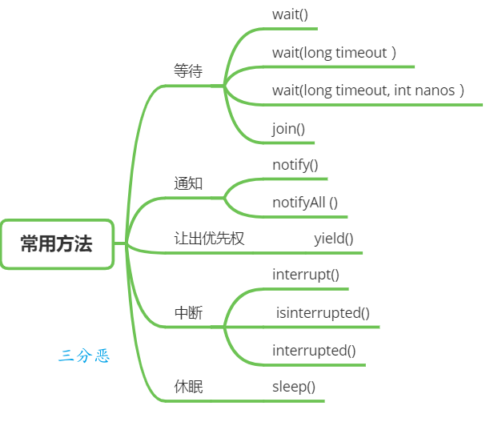
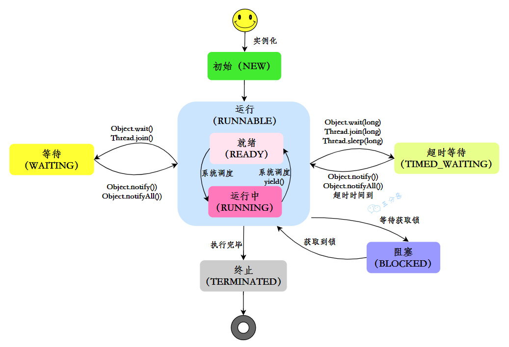
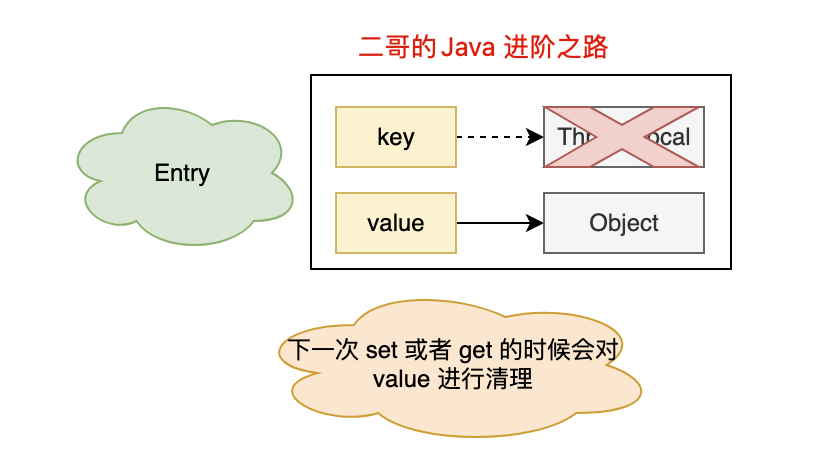
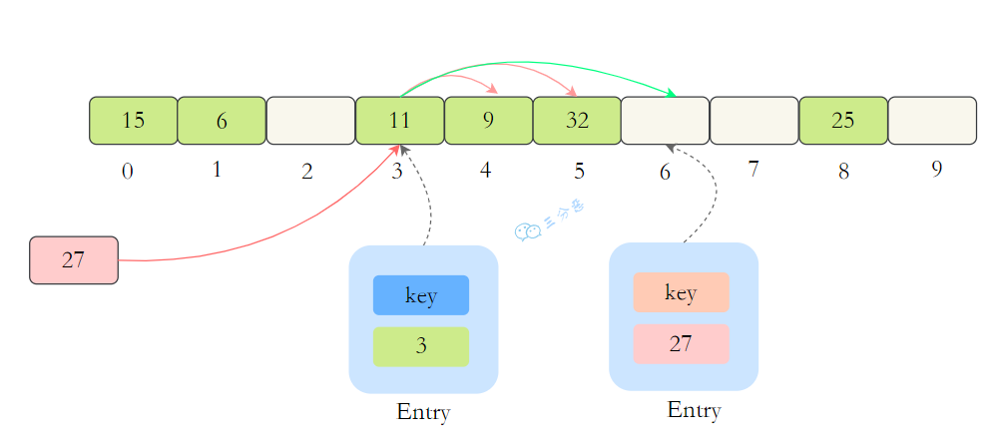
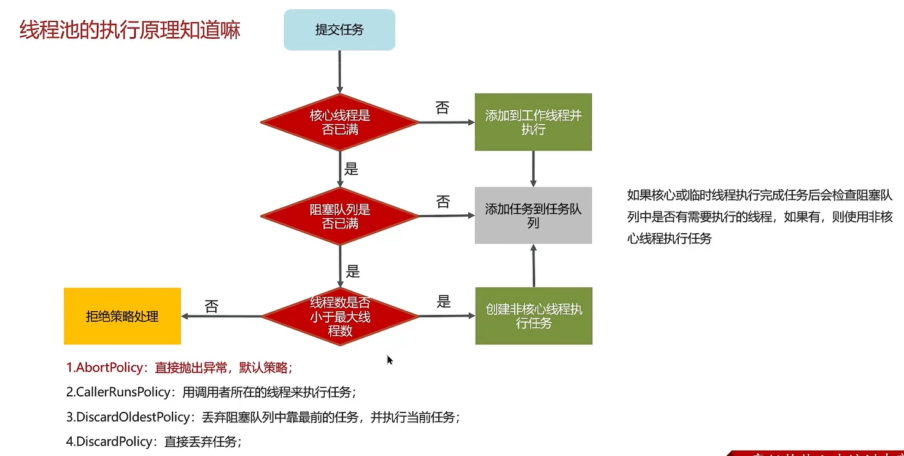

# JUC八股

# 基础
## 并行跟并发有什么区别？
+ **并发**：指的是在同一时间段内，多个任务交替执行，但是同一时刻只有一个任务在执行。
+ **并行**：指的是在同一时刻，多个任务真正同时执行。

## 说说什么是进程和线程？
+ **进程**：**进程**是操作系统进行**资源分配**和**调度**的基本单位。是程序的**执行实例**，拥有独立的**内存**和**资源**，进程间**互不干扰**。
+ **线程**：**线程**是进程的**执行单元**，是 **CPU 调度**和**分派**的基本单位，同一进程中的多个线程**共享进程的资源**，线程间**相互依赖**。

## 说说线程有几种创建方式？在 Java 中，创建线程有两种主要方式：**继承 **`Thread`** 类** 和 **实现 **`Runnable`** 接口**。此外，还有一种使用 **线程池** 的方式来管理线程。下面简要介绍每种方式。
**1. 继承 **`**Thread**`** 类**

通过继承 `Thread` 类并重写 `run()` 方法来定义线程的执行体。然后，创建该子类的实例并调用 `start()` 方法启动线程。

这种方法的缺点是，由于 Java 不支持多重继承，所以如果类已经继承了另一个类，就不能使用这种方法了。  

**步骤：**

+ 创建一个类继承 `Thread`。
+ 重写 `run()` 方法，定义线程的任务。
+ 创建线程对象并调用 `start()` 启动线程。

**示例代码：**

```java
class MyThread extends Thread {
    @Override
    public void run() {
        System.out.println("Thread is running.");
    }
}

public class Main {
    public static void main(String[] args) {
        MyThread thread = new MyThread();
        thread.start(); // 启动线程
    }
}
```

**2. 实现 **`Runnable`** 接口**

通过实现 `Runnable` 接口并重写 `run()` 方法来定义线程的执行体。

 这种方法的优点是可以避免 Java 的单继承限制，并且更符合面向对象的编程思想，因为 Runnable 接口将任务代码和线程控制的代码解耦了。  

**步骤：**

+ 创建一个类实现 `Runnable` 接口。
+ 实现 `run()` 方法，定义线程的任务。
+ 使用 `Thread` 类来启动线程，通过将 `Runnable` 对象传递给 `Thread` 构造函数。

**示例代码：**

```java
class MyRunnable implements Runnable {
    @Override
    public void run() {
        System.out.println("Thread is running.");
    }
}

public class Main {
    public static void main(String[] args) {
        MyRunnable myRunnable = new MyRunnable();
        Thread thread = new Thread(myRunnable);
        thread.start(); // 启动线程
    }
}
```

**3. 使用线程池 (**`ExecutorService`**)**

通过使用 `ExecutorService` 来管理线程池，从而避免直接创建线程的繁琐过程。线程池可以有效管理线程，控制线程的数量和生命周期。`ExecutorService` 提供了更高效和灵活的线程管理机制，适用于需要重复执行任务的场景。

**步骤：**

+ 创建线程池对象，如 `ExecutorService`。
+ 提交任务（`Runnable` 或 `Callable`）到线程池。
+ 线程池管理线程的生命周期。

**示例代码：**

```java
import java.util.concurrent.ExecutorService;
import java.util.concurrent.Executors;

public class Main {
    public static void main(String[] args) {
        // 创建固定大小的线程池
        ExecutorService executorService = Executors.newFixedThreadPool(2);

        // 提交任务到线程池
        executorService.submit(() -> {
            System.out.println("Thread is running from thread pool.");
        });

        // 关闭线程池
        executorService.shutdown();
    }
}
```

**4. 使用 **`Callable`** 接口和 **`FutureTask  `

 实现 Callable 接口，重写 `call()` 方法，使用 FutureTask 包装 Callable 对象 并 调用 `start()` 方法启动线程。这种方法的优点是可以获取线程的返回结果。  

 实现 `Callable` 接口，可以有返回值和异常处理，通过 `FutureTask` 包装后传给线程。这种方法的优点是可以获取线程的返回结果。  

**步骤：**

+ 创建实现 `Callable` 接口的任务。
+ 提交任务到线程池并获取 `Future` 对象。
+ 使用 `Future.get()` 获取结果。

**示例代码：**

```java
// 定义一个CallableTask类，实现Callable接口，泛型为String，表示任务执行后返回一个字符串结果
class CallableTask implements Callable<String> {
    // 实现Callable接口的call方法，这个方法将在线程中执行
    public String call() {
        // 返回一个字符串，表示任务的执行结果
        return "看完二哥的 Java 进阶之路，上岸了!";
    }

    // 主方法，程序的入口
    public static void main(String[] args) throws ExecutionException, InterruptedException {
        // 创建CallableTask的实例
        CallableTask task = new CallableTask();
        // 创建FutureTask实例，将CallableTask实例作为参数传递
        FutureTask<String> futureTask = new FutureTask<>(task);
        // 创建Thread实例，将FutureTask实例作为参数传递
        Thread thread = new Thread(futureTask);
        // 启动线程，这将导致FutureTask中的call方法被执行
        thread.start();
        // 调用FutureTask的get方法，阻塞当前线程直到call方法执行完成，并返回执行结果
        System.out.println(futureTask.get());
    }
}
```

## 调用 start()方法时会执行 run()方法，那怎么不直接调用 run()方法？
`**start()**` 和 `**run()**` 方法的区别：

    - `**start()**`：启动新线程并调用 `run()` 方法，真正实现多线程并发执行。
    - `**run()**`：定义线程要执行的任务，如果直接调用 `run()`，只是普通方法调用，不会创建新线程，任务在当前线程中执行。

## 线程有哪些常用的调度方法？


### **线程等待与通知**
在 Java 中，线程等待与通知机制主要通过 `Object` 类中的 `**wait()**`、`**notify()**` 和 `**notifyAll()**` 方法来实现。它们用于多线程之间的协作，通常配合 **同步**（`synchronized`）来操作共享资源。

**1. **`**wait()**`** 方法**

+ **作用**：使当前线程 **挂起**，并释放持有的锁，直到以下情况发生时才会返回： 
    - 其他线程调用该对象的 `**notify()**` 或 `**notifyAll()**` 方法；
    - 线程调用 `**interrupt()**` 方法，当前线程抛出 `**InterruptedException**` 异常并返回。

**2. **`**wait(long timeout)**`** 方法**

+ **作用**：使当前线程挂起指定的时间（超时），若超时未被唤醒，方法会自动返回。

**3. **`**wait(long timeout, int nanos)**`** 方法**

+ **作用**：与 `wait(long timeout)` 类似，但它提供了更精确的时间控制，支持微秒级别的超时。

**4. **`**notify()**`** 方法**

+ **作用**：唤醒一个在共享对象上调用 `wait()` 的线程。具体唤醒哪个线程是随机的。

**5. **`**notifyAll()**`** 方法**

+ **作用**：唤醒所有在共享对象上调用 `wait()` 的线程。

---

**线程休眠**

+ `**sleep(long millis)**`：使当前线程 **暂停** 指定的时间（毫秒），在此期间不会占用 CPU 资源。该方法不会释放持有的锁资源，睡眠结束后线程会继续运行。

**示例：**

```java
public class Main {
    public static void main(String[] args) throws InterruptedException {
        Thread.sleep(1000); // 当前线程休眠1秒
    }
}
```

---

**让出优先权**

+ `**yield()**`：让当前线程 **请求让出 CPU** 时间片，暗示线程调度器可以调度其他线程，但并不能强制。调度器可能会忽略该请求，当前线程仍有可能继续执行。

**示例：**

```java
public class Main {
    public static void main(String[] args) {
        Thread t1 = new Thread(() -> {
            System.out.println("Thread 1 is running");
            Thread.yield(); // 请求让出CPU
        });

        Thread t2 = new Thread(() -> {
            System.out.println("Thread 2 is running");
        });

        t1.start();
        t2.start();
    }
}
```

---

**线程中断**

Java 提供了中断机制来通知线程停止工作。线程中断并不直接停止线程的执行，而是设置一个中断标志，线程可以根据该标志做出响应。

**1. **`**interrupt()**`** 方法**

+ **作用**：设置线程的中断标志，通知线程可以处理中断。例如，线程 B 可以通过调用线程 A 的 `interrupt()` 方法来设置线程 A 的中断标志。

**2. **`**isInterrupted()**`** 方法**

+ **作用**：检测当前线程是否被中断。

**3. **`**interrupted()**`** 方法**

+ **作用**：检测当前线程是否被中断，如果被中断，返回 `true` 并清除中断标志。

**响应中断的示例代码：**

```java
public class MyRunnable implements Runnable {
    public void run() {
        try {
            while (!Thread.currentThread().isInterrupted()) {
                // 执行任务
            }
        } catch (InterruptedException e) {
            // 处理中断
        } finally {
            // 线程结束前的清理代码
        }
    }
}
```

**4. **`**stop()**`** 方法（废弃）**

+ **作用**：强制终止线程执行，但由于可能导致线程在不一致的状态下停止并释放锁，**已被废弃**，不推荐使用。

---

**总结**

+ **等待与通知**：通过 `wait()`、`notify()`、`notifyAll()` 实现线程间的协作与同步。
+ **线程休眠**：`sleep()` 方法暂停线程执行，释放 CPU，指定时间到后恢复执行。
+ **让出优先权**：`yield()` 请求让出 CPU 时间片，但可能被忽略。
+ **线程中断**：通过 `interrupt()` 设置中断标志，线程根据中断标志响应并处理清理工作。

这些方法能够帮助我们实现线程的调度、协调与中断，确保多线程程序的高效与安全。

## 线程有几种状态？


| 状态 | 描述 |
| --- | --- |
| **New（新建）** | 线程被创建，但尚未启动。 |
| **Runnable（就绪）** | 线程处于就绪状态，等待操作系统调度。 |
| **Running（运行）** | 线程被操作系统调度，实际正在执行。 |
| **Blocked（阻塞）** | 线程因等待获取锁而进入阻塞状态。 |
| **Waiting（等待）** | 线程无限期等待，直到其他线程调用 `notify()`或 `notifyAll()` |
| **Timed Waiting（超时等待）** | 线程在指定时间后自动返回，如 `sleep()`、`join()`。 |
| **Terminated（终止）** | 线程执行完毕或被中断，生命周期结束。 |


## 什么是线程上下文切换？
**线程上下文切换**（Thread Context Switching）是操作系统中管理多任务执行时，CPU从一个线程切换到另一个线程的过程。由于现代操作系统通常是多任务的，它会将多个线程分配到CPU上执行，但由于CPU每次只能执行一个线程，因此需要在多个线程之间来回切换，这个过程就叫做线程上下文切换。  

## 守护线程了解吗？
**Java 中的线程分为两类**，分别为 **daemon 线程（守护线程）** 和 **user 线程（用户线程）**。**守护线程主要用于在后台运行，为其他线程提供辅助**，例如 **垃圾回收、日志记录**等。它的**生命周期依赖于用户线程**，当**所有用户线程结束时，守护线程会自动终止**，不管是否完成任务。  

1. 在 JVM 启动时会调用 `main` 方法，`main` 方法所在的线程就是一个 **用户线程**。
2. **守护线程** 是一种在程序中运行的后台线程，它的作用是为其他线程提供服务或执行一些辅助性工作，比如 **垃圾回收**、**日志记录** 等。
3. **守护线程并不阻止程序的退出**。如果所有用户线程都结束了，Java虚拟机（JVM）会自动终止守护线程，进而结束整个程序。
4. **守护线程是否结束并不影响 JVM 退出**。也就是说，只要有一个用户线程还没结束，正常情况下 JVM 就不会退出。

##  进程间有哪些通信方式？
进程间通信涉及独立进程的数据交换，通常采用以下几种方式：

进程间通信（Inter-Process Communication, IPC）是指不同进程之间为了交换数据或信号而进行的通信。常见的进程间通信方式有以下几种：

**1. 管道（Pipe）**

+ **无名管道**：在父子进程之间进行通信。无名管道是单向的，数据只能从一端写入，另一端读取。
+ **有名管道（FIFO）**：支持不同的进程间通信，数据通过文件系统中的特殊文件传递，可以是双向的。

**2. 消息队列（Message Queue）**

+ 消息队列允许进程以消息为单位进行数据交换，消息队列在内核中实现，消息以队列的形式排队等待被接收。
+ 支持异步通信，可以发送不同类型的消息。

**3. 共享内存（Shared Memory）**

+ 允许多个进程直接访问同一块内存区域，速度非常快，因为进程不需要通过内核进行数据传递。
+ 需要使用信号量等同步机制来防止数据竞争。

**4. 信号量（Semaphore）**

+ 信号量是一种用于控制访问共享资源的计数器，常用于进程之间的同步和互斥操作。
+ 通过设置信号量的值来控制进程间的访问。

**5. 套接字（Socket）**

+ 套接字通常用于网络通信，但也可以用于本地进程间通信。支持跨主机或同一台主机内的进程通信。
+ 通常用于分布式系统或网络应用中。

**6. 内存映射文件（Memory-mapped Files）**

+ 通过将文件或设备映射到进程的地址空间来进行进程间通信，多个进程可以共享内存，访问文件中的数据。

**7. 信号（Signal）**

+ 信号是一种通知机制，用于通知进程某个事件的发生。通过信号，进程可以传递简单的控制信息（如中断、暂停等）。

**8. RPC（Remote Procedure Call）**

+ RPC允许一个进程调用另一个进程（甚至在不同机器上的进程）中的函数或方法，进程之间通过网络进行数据传输。

**9. 套接字（Socket）**

+ 套接字是网络中进程间通信的基础，但也可以用于同一台机器上的进程间通信。常用于客户端-服务器模型的进程间通信。

**10. 文件映射**

+ 文件映射允许多个进程通过映射同一个文件来共享数据，类似于共享内存，但是它是在磁盘上的文件。

## 线程间有哪些通信方式？
**线程间信息传递方式总结：**

1. **共享对象**
    - **概述**：多个线程通过访问和修改共享对象来进行通信。常用的同步机制包括 `volatile` 和 `synchronized`。
    - `**volatile**`：确保变量在多个线程间的可见性。
    - `**synchronized**`：保证同一时刻只有一个线程可以执行某个代码块或方法，防止数据不一致。
    - **示例**：通过 `synchronized` 和 `wait()`/`notify()` 实现生产者-消费者模式。

```java
public class SharedObject {
    private String message;
    private boolean hasMessage = false;

    public synchronized void writeMessage(String message) {
        while (hasMessage) {
            try { wait(); } catch (InterruptedException e) { Thread.currentThread().interrupt(); }
        }
        this.message = message;
        hasMessage = true;
        notifyAll();
    }

    public synchronized String readMessage() {
        while (!hasMessage) {
            try { wait(); } catch (InterruptedException e) { Thread.currentThread().interrupt(); }
        }
        hasMessage = false;
        notifyAll();
        return message;
    }
}
```

2. `**wait()**`** 和 **`**notify()**`
    - **概述**：用于协调线程间的执行，通常用于生产者-消费者模式。当一个线程需要等待某个条件时，调用 `wait()` 进入等待状态；当条件满足时，调用 `notify()` 或 `notifyAll()` 唤醒等待线程。
    - `**Condition**`：提供类似的机制，常与 `ReentrantLock` 一起使用，允许更灵活的线程同步。
    - **示例**：生产者线程生产数据，消费者线程消费数据。

```java
class MessageBox {
    private String message;
    private boolean empty = true;

    public synchronized void produce(String message) {
        while (!empty) {
            try { wait(); } catch (InterruptedException e) { Thread.currentThread().interrupt(); }
        }
        empty = false;
        this.message = message;
        notifyAll();
    }

    public synchronized String consume() {
        while (empty) {
            try { wait(); } catch (InterruptedException e) { Thread.currentThread().interrupt(); }
        }
        empty = true;
        notifyAll();
        return message;
    }
}
```

3. `**Exchanger**`
    - **概述**：`Exchanger` 允许两个线程交换数据。每个线程调用 `exchange()` 方法，传递数据并接收对方的数据，直到两个线程都准备好交换。
    - **示例**：两个线程交换消息并接收对方的响应。

```java
Exchanger<String> exchanger = new Exchanger<>();
Thread thread1 = new Thread(() -> {
    try {
        String message = "Message from thread1";
        String response = exchanger.exchange(message);
        System.out.println("Thread1 received: " + response);
    } catch (InterruptedException e) {
        Thread.currentThread().interrupt();
    }
});
```

4. `**CompletableFuture**`
    - **概述**：`CompletableFuture` 是 Java 8 引入的异步编程类，允许在后台线程计算完毕后将结果传递给其他线程。它支持非阻塞式的回调和链式操作。
    - **示例**：异步计算并将结果传递给另一个线程。

```java
CompletableFuture<String> future = CompletableFuture.supplyAsync(() -> {
    // 模拟长时间计算
    return "Message from CompletableFuture";
});

future.thenAccept(message -> {
    System.out.println("Received: " + message);
});
```

### 总结：
+ **共享对象**：使用 `volatile` 变量控制共享变量的可见性。
+ `**wait()**`**/**`**notify()**`：使用阻塞唤醒机制实现线程的协调和同步，常用于生产者-消费者模型。
+  信号量（Semaphore）：控制多个线程对共享资源的访问。
+ `**CompletableFuture**`：支持线程间的结果传递和异步回调。
+ `**Exchanger**`：允许两个线程交换数据，适用于双向通信。

这些方式各有适用场景，可以根据需求选择合适的线程通信方式。

## 请说说 sleep 和 wait 的区别？
`sleep()` 和 `wait()` 方法的区别总结：

1. **所属类不同**：
    - `sleep()`：属于 `Thread` 类的方法，用于让线程暂停执行指定的时间。
    - `wait()`：属于 `Object` 类的方法，用于让线程进入等待状态。
2. **锁行为不同**：
    - `sleep()`：不会释放持有的锁。线程在执行 `sleep()` 时，会继续持有锁直到睡眠结束。
        * **示例**：`sleep()` 后，线程仍保持锁，其他线程无法进入同步代码块。
    - `wait()`：会释放持有的对象锁。线程调用 `wait()` 后，会释放锁，允许其他线程获取该对象的锁。
        * **示例**：`wait()` 后，线程释放锁，其他线程可以进入同步代码块。
3. **使用条件不同**：
    - `sleep()`：可以在任何地方调用，不需要持有任何锁。
    - `wait()`：必须在同步代码块或同步方法中调用，因为调用 `wait()` 的前提是当前线程必须持有对象锁。如果没有锁，会抛出 `IllegalMonitorStateException`。
4. **唤醒方式不同**：
    - `sleep()`：线程会进入 `TIMED_WAITING` 状态，直到指定时间到期，线程自动恢复为 `RUNNABLE` 状态。
    - `wait()`：线程会进入 `WAITING` 状态，直到其他线程调用 `notify()` 或 `notifyAll()`，才会从 `WAITING` 状态转变为 `RUNNABLE` 状态。
5. **异常处理不同**：
    - `sleep()`：在等待期间，如果线程被中断，会抛出 `InterruptedException`。
    - `wait()`：如果线程在等待期间被中断，或者在等待时间到期时，会抛出 `InterruptedException`。

示例代码对比：

`sleep()` 示例

```java
class SleepExample {
    public static void main(String[] args) {
        Thread thread = new Thread(() -> {
            System.out.println("线程准备休眠 2 秒");
            try {
                Thread.sleep(2000); // 线程将睡眠2秒
            } catch (InterruptedException e) {
                e.printStackTrace();
            }
            System.out.println("线程醒来了");
        });

        thread.start();
    }
}
```

+ 线程会休眠 2 秒后自动恢复执行。

`wait()` 示例

```java
class WaitExample {
    public static void main(String[] args) {
        final Object lock = new Object();

        Thread thread = new Thread(() -> {
            synchronized (lock) {
                try {
                    System.out.println("线程准备等待 2 秒");
                    lock.wait(2000); // 线程会等待2秒，或者直到其他线程调用 lock.notify()/notifyAll()
                    System.out.println("线程结束等待");
                } catch (InterruptedException e) {
                    e.printStackTrace();
                }
            }
        });

        thread.start();
    }
}
```

+ 线程会在 `wait()` 处等待，直到 2 秒过后或其他线程调用 `notify()`。

### 为什么 `wait()` 方法不定义在 `Thread` 中？
    1. `**wait()**`** 是让获得对象锁的线程实现等待**，会自动释放当前线程占有的对象锁。
    2. 每个对象（`Object`）都拥有对象锁。既然要释放当前线程占有的对象锁并让其进入 **WAITING 状态**，自然是要操作 **对应的对象（Object）** 而非当前的线程（`Thread`）。

### 类似的问题：为什么 `sleep()` 方法定义在 `Thread` 中？
    1. `**sleep()**`** 是让当前线程暂停执行**，它不涉及到对象类，也不需要获得对象锁。
    2. `sleep()` 仅仅是让当前线程在指定的时间内暂停执行，和对象锁无关，因此它定义在 `Thread` 类中。

## 怎么保证线程安全？（补充）
**多线程安全**是指在并发环境下，多个线程访问共享资源时，程序能够正确地执行，而不会出现数据不一致或竞争条件等问题。反之，如果程序出现了 **数据不一致**、**死锁**、**饥饿** 等问题，就称为 **线程不安全**。

为保证线程安全，可以采用以下方法：

1. **使用 **`**synchronized**`** 关键字** 或 `**ReentrantLock**` 来保证共享资源的互斥访问。
2. 对于简单的变量操作，可以使用 **Atomic 类** 来实现无锁线程安全。
3. 可以使用 **线程安全容器**，如 `**ConcurrentHashMap**` 或 `**CopyOnWriteArrayList**`。
4. 对于每个线程独立的数据，可以使用 `**ThreadLocal**` 来为每个线程提供独立的变量副本。
5. 对于简单的状态标志，可以使用 `**volatile**`** 关键字** 确保多线程间的可见性。

---

# ThreadLocal
## ThreadLocal 是什么？
ThreadLocal是多线程中解决线程安全的工具类。它允许每个线程都拥有自己独立的变量副本，从而实现线程隔离，用于解决多线程中共享对象的线程安全问题。


**使用 **`**ThreadLocal**`** 通常分为四步：**

1. **创建 **`**ThreadLocal**`

```java
// 创建一个 ThreadLocal 变量
public static ThreadLocal<String> localVariable = new ThreadLocal<>();
```

2. **设置 **`**ThreadLocal**`** 的值**

```java
// 设置 ThreadLocal 变量的值
localVariable.set("沉默王二是沙雕");
```

3. **获取 **`**ThreadLocal**`** 的值**

```java
// 获取 ThreadLocal 变量的值
String value = localVariable.get();
```

4. **删除 **`**ThreadLocal**`** 的值**

```java
// 删除 ThreadLocal 变量的值
localVariable.remove();
```

---

`**ThreadLocal**`** 有哪些优点？**

1. **线程隔离**：每个线程访问的变量副本都是独立的，避免了共享变量引起的线程安全问题。由于 `ThreadLocal` 实现了变量的线程独占，使得变量不需要同步处理，因此能够避免资源竞争。
2. **数据传递方便**：`ThreadLocal` 常用于在跨方法、跨类时传递上下文数据（如用户信息等），而不需要在方法间传递参数。

---

**除了 **`**ThreadLocal**`**，还有什么解决线程安全问题的方法？**

1. **使用 **`**synchronized**`** 关键字**  
Java 中的 `synchronized` 关键字可以用于方法和代码块，确保同一时间只有一个线程可以执行特定的代码段。

```java
public synchronized void method() {
    // 线程安全的操作
}
```

2. **使用 **`**ReentrantLock**`  
Java 并发包（`java.util.concurrent.locks`）中提供了 `Lock` 接口和一些实现类，如 `ReentrantLock`。相比于 `synchronized`，`ReentrantLock` 提供了公平锁和非公平锁。

```java
ReentrantLock lock = new ReentrantLock();

public void method() {
    lock.lock();
    try {
        // 线程安全的操作
    } finally {
        lock.unlock();
    }
}
```

3. **使用原子变量类（CAS）**  
Java 并发包还提供了一组原子变量类（如 `AtomicInteger`，`AtomicLong` 等），它们利用 CAS（比较并交换），实现了无锁的原子操作，适用于简单的计数器场景。

```java
AtomicInteger atomicInteger = new AtomicInteger(0);

public void increment() {
    atomicInteger.incrementAndGet();
}
```

4. **使用线程安全的集合类**  
Java 并发包提供了一些线程安全的集合类，如 `ConcurrentHashMap`、`CopyOnWriteArrayList` 等。这些集合类内部实现了必要的同步策略，提供了更高效的并发访问。

```java
ConcurrentHashMap<String, String> map = new ConcurrentHashMap<>();
```

5. **使用 **`**volatile**`** 关键字**  
`volatile` 变量保证了变量的可见性，修改操作是立即同步到主存的，读操作从主存中读取。

```java
private volatile boolean flag = false;
```

## 你在工作中用到过 ThreadLocal 吗？（项目中用到了吗）
在我的项目中，为了**传递用户信息**，我使用了 **TransmittableThreadLocal**。它是对原生 **ThreadLocal** 的扩展，能够**解决原生 ThreadLocal 在使用线程池创建子线程时无法传递数据的问题**。其原理是：**在线程池任务提交前，通过拷贝父线程的 ThreadLocal 数据来传递给新的线程**。

  
在项目中，为了传递用户信息，我使用了 `TransmittableThreadLocal`，它是对原生 `ThreadLocal` 的扩展，解决了线程池中**创建子线程时无法传递数据的问题**。其原理是在线程池任务提交前，拷贝父线程的 `ThreadLocal` 数据到子线程。  


面试题：“在工作中用到过 `ThreadLocal` 吗？”

**回答：** 是的，我在牛券中使用过 `ThreadLocal`，尤其是在处理多线程任务时，帮助我解决了线程间数据隔离的问题。在我的项目中，使用 `ThreadLocal` 来管理用户上下文信息，确保每个线程都有独立的用户数据。具体来说，在一个与优惠券模板相关的系统中，我使用 `ThreadLocal` 存储和传递用户信息。

**如何使用：**

1. **线程上下文传递**：为了能够在多线程环境下，特别是在异步任务或线程池中，传递用户信息，我使用了 `TransmittableThreadLocal`，它是对原生 `ThreadLocal` 的扩展，能够解决原生 `ThreadLocal` 在使用线程池创建子线程时无法传递数据的问题。

> `TransmittableThreadLocal` 主要通过一个 **线程副本映射（ThreadLocalMap）** 来保存每个线程的值，并且它通常会在线程池任务提交前，通过拷贝父线程的 `ThreadLocal` 数据来传递给新的线程  
>

2. **用户上下文存储**：通过 `TransmittableThreadLocal`，我将用户信息（如用户 ID、用户名、店铺编号等）存储到当前线程的上下文中，在后续的任务中可以方便地获取和使用这些信息，避免了每个线程都需要重新传递用户信息的问题。
3. **代码示例**：

```java
private static final ThreadLocal<UserInfoDTO> USER_THREAD_LOCAL = new TransmittableThreadLocal<>();

public static void setUser(UserInfoDTO user) {
    USER_THREAD_LOCAL.set(user);
}

public static String getUserId() {
    return Optional.ofNullable(USER_THREAD_LOCAL.get())
                   .map(UserInfoDTO::getUserId)
                   .orElse(null);
}

public static void removeUser() {
    USER_THREAD_LOCAL.remove();
}

```

4. **解决问题**：原生 `ThreadLocal` 存在的问题包括：
    - 线程池中的线程复用导致的数据丢失。
    - 子线程无法自动获取主线程的数据。

通过 `TransmittableThreadLocal`，我解决了这些问题，确保线程池中的子线程可以正确传递主线程的用户信息，并且在任务执行完成后，能够恢复上下文的状态，避免污染。

总结来说，`ThreadLocal` 在多线程编程中非常有用，尤其是在涉及到每个线程独立状态（如用户上下文、事务信息等）的场景中。

## ThreadLocal 怎么实现的呢？
ThreadLocal是多线程中解决线程安全的工具类。它允许每个线程都拥有自己独立的变量副本，从而实现线程隔离。每个线程都持有一个 `ThreadLocalMap` 对象，`ThreadLocalMap` 是一个内部类，结构类似于 hashmap， `ThreadLocalMap` 以 `ThreadLocal` 实例作为键（key），线程的局部变量作为值（value）来存储。~~这样的话，每个线程的 ~~`~~ThreadLocalMap~~`~~ 都存储着独立的副本数据，互不干扰。~~`ThreadLocal` 类提供了 `get()` 和 `set()` 方法，这些方法通过线程对象访问到 `ThreadLocalMap`，然后根据 `ThreadLocal` 的唯一标识来获取或设置相应的值。  

## ThreadLocal 内存泄露是怎么回事？
**ThreadLocalMap** 中使用的 键为 **ThreadLocal** 的弱引用，而 值是强引用。所以，如果 **ThreadLocal** 没有被外部强引用的情况下，在垃圾回收的时候，键会被清理掉，而 值不会被清理掉。这样一来，**ThreadLocalMap** 中就会出现 键为 **null** 的 **Entry**。

假如我们不做任何措施的话，值无法被 GC 回收，导致产生**内存泄露**。

 在 `ThreadLocal` 使用完毕后，调用其 `remove()` 方法 清理内存。

---

### 那为什么 key 要设计成弱引用？
key 设计成弱引用是为了在 ThreadLocal 对象不再使用时，允许垃圾回收它，从而避免内存泄漏。

  **key** 设计为弱引用的主要原因是为了避免在 `ThreadLocal` 实例不再使用时导致内存泄漏。当`ThreadLocal` 实例不再使用时，作为弱引用，它会在下次垃圾回收时被清理掉，从而不会导致内存泄漏。  

---



比如说：

```java
WeakReference key = new WeakReference(new ThreadLocal());
```

**key** 是弱引用，`new WeakReference(new ThreadLocal())` 是弱引用对象，当 JVM 进行垃圾回收时，如果发现了弱引用对象，就会将其回收。

一旦 **key** 被回收，**ThreadLocalMap** 在进行 **set**、**get** 时就会对 **key** 为 **null** 的 **Entry** 进行清理。

**总结一下**：在 **ThreadLocal** 被垃圾收集后，下一次访问 **ThreadLocalMap** 时，Java 会自动清理那些键为 **null** 的条目（参照源码中的 **replaceStaleEntry** 方法），这个过程会在执行 **ThreadLocalMap** 相关操作（如 **get()**, **set()**, **remove()**）时触发。

###  那为什么 value 不能设置为弱引用，而是强引用呢
`**value**`** 被设置为强引用，是为了确保线程在任务执行过程中始终能访问到局部变量； 而弱引用可能导致线程局部变量被回收，进而影响线程的正常执行。  **

## ThreadLocalMap 的源码看过吗
 在分析源码之前先画一下ThreadLocal ，ThreadLocalMap 和Thread 的关系.  


[并发——深入分析ThreadLocal的实现原理 - 特务依昂 - 博客园](https://www.cnblogs.com/tuyang1129/p/12713815.html#23-threadlocal%E4%B8%AD%E7%9A%84get%E6%96%B9%E6%B3%95)

## ThreadLocalMap 怎么解决 Hash 冲突的？
**ThreadLocalMap** 和 **HashMap** 的功能类似，但是实现上却有很大的不同：

+ **HashMap** 的数据结构是**数组+链表**
+ **ThreadLocalMap** 的数据结构仅仅是**数组**
+ **HashMap** 是通过**链地址法**解决 hash 冲突的问题
+ **ThreadLocalMap** 是通过**开放地址法**来解决 hash 冲突的问题
+ **HashMap** 里面的 **Entry** 内部类的引用都是**强引用**
+ **ThreadLocalMap** 里面的 **Entry** 内部类中的 **key** 是**弱引用**，**value** 是**强引用**


+ **<font style="color:#DF2A3F;">HashMap 使用链地址法</font>**<font style="color:#DF2A3F;">：当发生哈希冲突时， 这些键值对会以链表的形式存储在同一个桶中  </font>
+ **<font style="color:#DF2A3F;">ThreadLocalMap 使用开放地址法</font>**<font style="color:#DF2A3F;">：当发生哈希冲突时，</font>`<font style="color:#DF2A3F;">ThreadLocalMap</font>`<font style="color:#DF2A3F;"> 使用 </font>**<font style="color:#DF2A3F;">线性探测法</font>**<font style="color:#DF2A3F;"> 来找到下一个可用位置。直到找到一个空闲位置或原来的键  </font>


 我们可能都知道 HashMap 使用了链表来解决冲突，也就是所谓的链地址法。  

ThreadLocalMap 没有使用链表，自然也不是用链地址法来解决冲突了，它用的是另外一种方式——**开放定址法**。开放定址法是什么意思呢？简单来说，就是这个坑被人占了，那就接着去找空着的坑。



ThreadLocalMap解决冲突

如上图所示，如果我们插入一个 value=27 的数据，通过 hash 计算后应该落入第 4 个槽位中，而槽位 4 已经有了 Entry 数据，而且 Entry 数据的 key 和当前不相等。此时就会线性向后查找，一直找到 Entry 为 null 的槽位才会停止查找，把元素放到空的槽中。

在 get 的时候，也会根据 ThreadLocal 对象的 hash 值，定位到 table 中的位置，然后判断该槽位 Entry 对象中的 key 是否和 get 的 key 一致，如果不一致，就判断下一个位置


**开放地址法**的优缺点：  
优点：

+ 结构简单。

缺点：

+ **容易产生堆积问题**，不适于大规模的数据存储。
+ **散列函数的设计对冲突会有很大的影响**，插入时可能会出现多次冲突的现象。
+ **删除的元素是多个冲突元素中的一个**，需要对后面的元素作处理，实现较复杂。

**链地址法**的优缺点：  
优点：

+ **处理冲突简单**，且无堆积现象，平均查找长度短。
+ 链表中的结点是动态申请的，适合构造表不能确定长度的情况。
+ **删除结点的操作易于实现**。只要简单地删去链表上相应的结点即可。

缺点：

+ **指针需要额外的空间**，故当结点规模较小时，开放定址法较为节省空间。  
**ThreadLocalMap 采用开放地址法的原因**：
+ 在 **ThreadLocal** 中看到一个属性 **HASH_INCREMENT = 0x61c88647**，0x61c88647 是一个神奇的数字，它能让哈希码能均匀地分布在2的N次方的数组里，即 **Entry[] table**。关于这个神奇的数字，google 上有很多解析，这里就不重复说明了。
+ **ThreadLocal** 往往存放的数据量不会特别大（而且 **key 是弱引用** 又会被垃圾回收，及时让数据量更小），这个时候开放地址法简单的结构会显得更省空间，同时数组的查询效率也是非常高，加上第一点的保障，冲突概率也低。


## ThreadLocalMap 扩容机制了解吗？
**1. 触发扩容的条件**

`ThreadLocalMap` 在以下情况下会触发扩容：

    - **当前数组的使用率接近容量的上限**：当数组中条目数量（`size`）接近数组容量（`table.length`）的三分之二时（即负载因子为 `2/3`），会触发扩容。

**2. 扩容的过程**

`ThreadLocalMap` 的扩容分为以下几步：

**(1) 创建新的更大数组**

    - 新数组的容量是原数组容量的两倍（类似 `HashMap`）。
    - 新的容量必须是 2 的幂次，以方便通过位运算快速定位索引。

**(2) 重新散列（rehash）**

    - 将旧数组中的条目（`Entry`）重新计算索引，迁移到新数组中。
    - 注意：由于 `ThreadLocal` 的键是弱引用，一些条目可能已经失效（`Entry.get() == null`）。在扩容过程中，`ThreadLocalMap` 会清理这些无效条目，避免它们占用空间。
    - 重新计算索引的逻辑遵循开放地址法，冲突时会使用线性探测找到新的空位。

**(3) 更新表状态**

    - 替换旧的数组为新的数组。
    - 重置条目数量（`size`），清理掉无效条目后更新当前有效条目的计数。

## 父子线程怎么共享数据？
**InheritableThreadLocal** 是 **ThreadLocal** 的子类，它允许子线程在创建时继承父线程的 **ThreadLocal** 数据。父子线程仍然是独立的拷贝，**修改子线程的值不会影响父线程的值**。

 如果希望在父子线程之间共享数据，可以借助 `**InheritableThreadLocal**` 来实现。  

`**InheritableThreadLocal**`** 的作用**

    - `InheritableThreadLocal` 是 `ThreadLocal` 的子类，专门用于在**父线程**和**子线程**之间共享数据。
    - 当父线程创建子线程时，子线程会从父线程的 `InheritableThreadLocal` 中拷贝一份数据到子线程中。
    - 子线程可以访问这份数据，但父子线程仍然是独立的拷贝，修改子线程的值不会影响父线程的值。

**原理**

`**InheritableThreadLocal**`** 的原理**

`Thread` 类中有一个 `inheritableThreadLocals` 字段，用于存储 `InheritableThreadLocal` 的键值对。在创建子线程时，`Thread` 的构造方法会检查父线程的 `inheritableThreadLocals`。如果存在，调用 对应方法`ThreadLocal.createInheritedMap()` 将父线程的 `ThreadLocalMap` 数据拷贝到子线程。


# Java 内存模型
## 说一下你对 Java 内存模型的理解？


**Java 内存模型（Java Memory Model）** 是一种抽象的模型，主要用来定义多线程中变量的访问规则，解决了变量的原子性，有序性，可见性问题，**JMM** 定义了线程内存和主内存之间的抽象关系：

1. **线程之间的共享变量** 存储在主内存（**Main Memory**）中。
2. 每个线程都有一个 **私有的本地内存（Local Memory）**，本地内存中存储了该线程共享变量的副本。。

**具体操作流程：**

+ **当一个线程更改了本地内存中共享变量的副本后**，它需要将这些更改刷新到主内存中，以确保其他线程可以看到这些更改。
+ **当一个线程需要读取共享变量时**，它可能首先从本地内存中读取。如果本地内存中的副本是过时的，线程将从主内存中重新加载共享变量的最新值到本地内存中。

<details class="lake-collapse"><summary id="ue9c15bf1"><strong><span class="ne-text" style="color: #DF2A3F">完整理解</span></strong></summary><p id="u8ccc8bbe" class="ne-p"><span class="ne-text">Java内存模型（Java Memory Model，JMM）是Java虚拟机（JVM）的一部分，用来规定Java程序中各种变量（包括实例字段、静态字段和构成数组对象的元素）在多线程环境下的访问规则。它的主要作用是确保在多线程环境下，程序能够按照预期的行为执行，避免由于不同线程之间对共享数据的访问冲突而引起的错误。</span></p><h3 id="hlzAx"><strong><span class="ne-text">1. </span></strong><strong><span class="ne-text">JMM的核心概念</span></strong></h3><p id="u533b3b21" class="ne-p"><strong><span class="ne-text">JMM的设计目的是解决不同线程之间共享变量的访问顺序、可见性和原子性等问题。主要包括以下几个核心概念：</span></strong></p><ul class="ne-ul"><li id="u86626333" data-lake-index-type="0"><strong><span class="ne-text">可见性（Visibility）</span></strong><strong><span class="ne-text">：当一个线程修改了某个共享变量的值，其他线程能否立即看到这个修改。JMM保证了通过合适的同步措施（如</span></strong><code class="ne-code"><strong><span class="ne-text">volatile</span></strong></code><strong><span class="ne-text">关键字和锁）可以保证修改的变量对其他线程可见。</span></strong></li><li id="ue3ef3e59" data-lake-index-type="0"><strong><span class="ne-text">有序性（Ordering）</span></strong><strong><span class="ne-text">：程序中的指令顺序会因为优化、指令重排等原因发生变化，JMM提供了相关规则来保证在多线程环境下，线程执行的指令顺序和单线程环境下的顺序一致。</span></strong></li><li id="ud523152b" data-lake-index-type="0"><strong><span class="ne-text">原子性（Atomicity）</span></strong><strong><span class="ne-text">：指的是某个操作在执行时不会被中断，JMM保证了某些操作的原子性。例如，</span></strong><code class="ne-code"><strong><span class="ne-text">synchronized</span></strong></code><strong><span class="ne-text">关键字、</span></strong><code class="ne-code"><strong><span class="ne-text">volatile</span></strong></code><strong><span class="ne-text">变量和</span></strong><code class="ne-code"><strong><span class="ne-text">java.util.concurrent</span></strong></code><strong><span class="ne-text">包中的原子类等，都能够保证原子操作。</span></strong></li></ul><h3 id="piOlt"><strong><span class="ne-text">2. </span></strong><strong><span class="ne-text">JMM中的关键规则</span></strong></h3><ul class="ne-ul"><li id="u5d465ab2" data-lake-index-type="0"><strong><span class="ne-text">每个线程有自己的工作内存</span></strong><strong><span class="ne-text">：工作内存是每个线程用于存储共享变量的副本。线程对变量的操作首先会在自己的工作内存中进行，然后通过一定的机制将结果同步到主内存。主内存是所有线程共享的内存区域，所有线程对共享变量的修改都必须通过主内存进行。</span></strong></li><li id="ue16f5040" data-lake-index-type="0"><strong><span class="ne-text">同步（Synchronization）</span></strong><strong><span class="ne-text">：在多线程环境下，</span></strong><code class="ne-code"><strong><span class="ne-text">synchronized</span></strong></code><strong><span class="ne-text">和</span></strong><code class="ne-code"><strong><span class="ne-text">volatile</span></strong></code><strong><span class="ne-text">是常用的同步工具。</span></strong><code class="ne-code"><strong><span class="ne-text">synchronized</span></strong></code><strong><span class="ne-text">保证了锁机制的正确性，它不仅保证了线程对共享变量的修改顺序，还保证了可见性。而</span></strong><code class="ne-code"><strong><span class="ne-text">volatile</span></strong></code><strong><span class="ne-text">关键字保证了变量的可见性，确保一个线程对变量的修改对其他线程立即可见，但并不保证原子性。</span></strong></li><li id="u6d7ac09b" data-lake-index-type="0"><strong><span class="ne-text">内存屏障</span></strong><strong><span class="ne-text">：为了确保指令顺序和变量的可见性，JMM使用了内存屏障（Memory Barriers）来禁止指令重排序。这些屏障在硬件级别实现，不同的CPU架构和JVM实现可能有不同的内存屏障机制。</span></strong></li></ul><h3 id="JgWxC"><strong><span class="ne-text">3. </span></strong><strong><span class="ne-text">JMM的实现机制</span></strong></h3><p id="ue96f719b" class="ne-p"><strong><span class="ne-text">JMM通过定义</span></strong><strong><span class="ne-text">happens-before</span></strong><strong><span class="ne-text">原则来规范线程间的操作顺序。</span></strong></p><ul class="ne-ul"><li id="u5bb1bb27" data-lake-index-type="0"><strong><span class="ne-text">happens-before原则</span></strong><strong><span class="ne-text">：如果操作A happens-before 操作B，那么操作A的影响必须在操作B之前对所有线程可见。常见的happens-before关系包括： </span></strong></li></ul><ul class="ne-list-wrap"><ul ne-level="1" class="ne-ul"><li id="u29702ab8" data-lake-index-type="0"><strong><span class="ne-text">程序顺序规则：在一个线程中的操作按程序顺序执行，先发生的操作必须先可见。</span></strong></li><li id="u20d8b160" data-lake-index-type="0"><strong><span class="ne-text">锁规则：一个线程释放锁的操作 happens-before 其他线程获得同一个锁的操作。</span></strong></li><li id="u133c5afc" data-lake-index-type="0"><strong><span class="ne-text">volatile变量规则：写入</span></strong><code class="ne-code"><strong><span class="ne-text">volatile</span></strong></code><strong><span class="ne-text">变量的操作 happens-before 其他线程对该</span></strong><code class="ne-code"><strong><span class="ne-text">volatile</span></strong></code><strong><span class="ne-text">变量的读取操作。</span></strong></li></ul></ul><h3 id="xOMYx"><strong><span class="ne-text">4. </span></strong><strong><span class="ne-text">JMM与并发问题</span></strong></h3><ul class="ne-ul"><li id="u49f89c6d" data-lake-index-type="0"><strong><span class="ne-text">指令重排</span></strong><strong><span class="ne-text">：JMM对线程间的内存操作顺序进行了严格控制，以避免指令重排问题。编译器、JVM和硬件可能会对指令进行优化，但JMM会确保对共享变量的操作顺序不会违反规定的</span></strong><code class="ne-code"><strong><span class="ne-text">happens-before</span></strong></code><strong><span class="ne-text">规则。</span></strong></li><li id="ub5fd8542" data-lake-index-type="0"><strong><span class="ne-text">缓存一致性</span></strong><strong><span class="ne-text">：由于每个线程都有自己的工作内存，线程间对共享变量的修改可能不立即对其他线程可见。JMM通过</span></strong><code class="ne-code"><strong><span class="ne-text">volatile</span></strong></code><strong><span class="ne-text">、</span></strong><code class="ne-code"><strong><span class="ne-text">synchronized</span></strong></code><strong><span class="ne-text">等机制，确保了多线程环境下对共享数据的可见性。</span></strong></li></ul><h3 id="y94ra"><strong><span class="ne-text">5. </span></strong><strong><span class="ne-text">JMM中的一些常见关键字</span></strong></h3><ul class="ne-ul"><li id="u580a6b47" data-lake-index-type="0"><strong><span class="ne-text">volatile</span></strong><strong><span class="ne-text">：当一个变量被声明为</span></strong><code class="ne-code"><strong><span class="ne-text">volatile</span></strong></code><strong><span class="ne-text">时，JMM确保该变量的最新值对于所有线程可见。</span></strong><code class="ne-code"><strong><span class="ne-text">volatile</span></strong></code><strong><span class="ne-text">保证了变量的可见性，但不保证原子性。适用于一些轻量级的同步场景。</span></strong></li><li id="ued071ca5" data-lake-index-type="0"><strong><span class="ne-text">synchronized</span></strong><strong><span class="ne-text">：</span></strong><code class="ne-code"><strong><span class="ne-text">synchronized</span></strong></code><strong><span class="ne-text">关键字用于方法或代码块，确保同一时刻只有一个线程可以执行该代码块，从而保证原子性和可见性。它通过加锁机制实现对共享资源的保护。</span></strong></li><li id="u73ce6149" data-lake-index-type="0"><strong><span class="ne-text">final</span></strong><strong><span class="ne-text">：</span></strong><code class="ne-code"><strong><span class="ne-text">final</span></strong></code><strong><span class="ne-text">关键字确保类、方法或变量在初始化后不能被改变。对类字段（特别是实例字段）使用</span></strong><code class="ne-code"><strong><span class="ne-text">final</span></strong></code><strong><span class="ne-text">可以确保在对象构造时其值的初始化是线程安全的。</span></strong></li></ul><h3 id="vykqC"><strong><span class="ne-text">总结</span></strong></h3><p id="u9058e2ab" class="ne-p"><strong><span class="ne-text">Java内存模型通过定义线程与内存之间的交互规则，确保在多线程环境下程序能够按照预期的顺序执行并保证数据的一致性。理解JMM对于避免多线程编程中的常见问题（如竞态条件、死锁等）至关重要。掌握</span></strong><code class="ne-code"><strong><span class="ne-text">volatile</span></strong></code><strong><span class="ne-text">、</span></strong><code class="ne-code"><strong><span class="ne-text">synchronized</span></strong></code><strong><span class="ne-text">、</span></strong><code class="ne-code"><strong><span class="ne-text">final</span></strong></code><strong><span class="ne-text">等关键字的使用，是编写高效、安全的并发代码的基础。</span></strong><span class="ne-text"></span></p></details>
## 说说你对原子性、可见性、有序性的理解？
**原子性、有序性、可见性** 是并发编程中非常重要的基础概念，**JMM** 的很多技术都是围绕着这三大特性展开。

    - **原子性**：原子性指的是一个操作是不可分割、不可中断的，要么全部成功，要么全部失败。
    - **可见性**：可见性指的是一个线程修改了某一个共享变量的值时，其他线程能够立即知道这个修改。
    - **有序性**：有序性指的是对于一个线程的执行代码，按照从前往后依次执行，多线程下会产生指令重排序的问题。  

##  原子性、可见性、有序性都应该怎么保证呢？  
在Java中，保证**原子性**、**可见性**和**有序性**的方法如下：

1. **保证原子性**

        * 使用**原子变量类**：`AtomicInteger`、`AtomicLong`等类提供原子操作。
        * 使用**锁**：`synchronized`关键字或显式锁（如`ReentrantLock`）可以保证多线程间的原子操作。

2. **保证可见性**

        * 使用**volatile**：声明变量为`volatile`，确保线程对该变量的修改对所有线程可见。
        * 使用**锁**：`synchronized`不仅保证原子性，还确保共享变量在不同线程间的可见性。

3. **保证有序性**

        * 使用**synchronized**：`synchronized`可以防止指令重排序，保证进入同步块的顺序。
        * 使用**volatile**：`volatile`变量防止指令重排序，确保操作按顺序执行。

总结：

        * **原子性**：使用原子类或锁。
        * **可见性**：使用`volatile`或锁。
        * **有序性**：使用`volatile`或`synchronized`。

---

##  i++是原子操作吗？  
**i++ 不是原子操作**，它包括三个步骤：

    1. **从内存中读取 i 的值**。
    2. **对 i 进行加 1 操作**。
    3. **将新的值写入内存**。

假如两个线程同时对 i 进行 i++ 操作时，可能会发生以下情况：

    - 线程 A 读取 i 的值（假设 i 的初始值为 1）。
    - 线程 B 也读取 i 的值（值仍然是 1）。
    - 线程 A 将 i 增加到 2，并将其写回内存。
    - 线程 B 也将 i 增加到 2，并将其写回内存。

**结果**：尽管进行了两次递增操作，i 的值只增加了 1 而不是 2。

可以使用 **synchronized** 或 **AtomicInteger** 确保操作的原子性。

---

## 说说什么是指令重排序？
**指令重排序**是CPU或JVM为了优化性能，在执行程序时改变代码中指令的执行顺序 ，在多线程环境下，指令重排序可能导致线程间的数据不一致或执行异常。  


**指令重排序的类型：**

+     编译器重排序：编译器会对代码进行优化，调整语句顺序，以提高效率。
+     处理器重排序：CPU在执行指令时，为了提高性能，可能会重新安排指令的执行顺序。

**避免指令重排序的措施**

+ 使用volatile关键字确保变量的可见性，并防止重排序。
+ 使用synchronized来确保线程之间按预期顺序执行操作。
+ 使用final保证对象的初始化顺序正确，避免重排序带来的问题。

## 指令重排有限制吗？happens-before 了解吗？
 指令重排也是有一些限制的，有两个规则`happens-before`和`as-if-serial`来约束。  

**Happens-before** 和 **As-if-serial** 是 Java 并发编程中两个重要的概念，它们分别解决了不同层面的问题。

---

### **1. Happens-before**
<details class="lake-collapse"><summary id="u6d27cbd1"></summary><p id="udaaf1633" class="ne-p"><strong><span class="ne-text">Happens-before</span></strong><span class="ne-text"> 是 </span><strong><span class="ne-text">Java 内存模型</span></strong><span class="ne-text">（JMM）中定义的规则，用来描述线程间操作的执行顺序。</span></p><h3 id="iMZpZ"><strong><span class="ne-text">核心概念</span></strong></h3><p id="u70607cea" class="ne-p"><span class="ne-text">如果操作 </span><strong><span class="ne-text">A happens-before</span></strong><span class="ne-text"> 操作 </span><strong><span class="ne-text">B</span></strong><span class="ne-text">，则意味着：</span></p><ol class="ne-ol"><li id="ub95e014a" data-lake-index-type="0"><strong><span class="ne-text">A</span></strong><span class="ne-text"> 的执行结果对 </span><strong><span class="ne-text">B</span></strong><span class="ne-text"> 是可见的。</span></li><li id="u933ac1f5" data-lake-index-type="0"><strong><span class="ne-text">A</span></strong><span class="ne-text"> 的操作顺序先于 </span><strong><span class="ne-text">B</span></strong><span class="ne-text">。</span></li></ol><p id="ub5eb603d" class="ne-p"><span class="ne-text">比如：</span></p><ol class="ne-ol"><li id="ue806645c" data-lake-index-type="0"><strong><span class="ne-text">volatile 变量规则</span></strong><span class="ne-text">：对 </span><code class="ne-code"><span class="ne-text">volatile</span></code><span class="ne-text"> 变量的写操作 happens-before 后续的读操作。</span></li><li id="u209ab3ac" data-lake-index-type="0"><strong><span class="ne-text">锁规则</span></strong><span class="ne-text">： 一个线程释放锁的操作 happens-before 另一个线程获得同一锁的操作。</span></li><li id="u7cf26e5a" data-lake-index-type="0"><strong><span class="ne-text">线程启动规则</span></strong><span class="ne-text">：调用 </span><code class="ne-code"><span class="ne-text">start()</span></code><span class="ne-text">方法 happens-before 该线程的 </span><code class="ne-code"><span class="ne-text">run()</span></code><span class="ne-text"> 方法。</span></li></ol></details>
**Happens-before** 是 Java 内存模型（JMM）中定义的一组规则，用来描述线程间操作的执行顺序。这些规则确保在多线程环境下，某些操作的结果对其他线程是可见的，并防止因指令重排序导致的线程不安全问题。

#### **核心概念**
如果操作 A **happens-before** 操作 B，则意味着：

1. A 的执行结果对 B 是可见的。
2. A 的操作顺序先于 B。

#### **常见的 Happens-before 关系**
以下规则定义了 happens-before 的顺序：

1. **程序次序规则**： 在一个线程中，代码按程序书写顺序执行，前面的操作 happens-before 后面的操作。
2. **锁规则**： 一个线程释放锁的操作 happens-before 另一个线程获得同一锁的操作。
3. **volatile变量规则**： 对一个`volatile`变量的写操作 happens-before 后续对该变量的读操作。
4. **线程启动规则**： 调用`Thread.start()` happens-before 该线程的 run 方法。
5. **线程终止规则**： 一个线程的终止操作 happens-before 检测到该线程已终止的操作（通过`Thread.join()`或`isAlive()`）。
6. **对象构造规则**： 对象的构造完成 happens-before 该对象的引用被其他线程访问。

#### **示例**
```java
class Example {
    private int a = 0;
    private volatile boolean flag = false;

    public void writer() {
        a = 1;        // 写共享变量
        flag = true;  // 写 volatile 变量
    }

    public void reader() {
        if (flag) {          // 读 volatile 变量
            System.out.println(a);  // 读共享变量，保证看到的是 1
        }
    }
}
```

在这个例子中，由于`flag`是`volatile`变量，`writer`方法对`flag`的写操作 happens-before `reader`方法对`flag`的读操作，因此线程 B 一定能看到线程 A 对`a`的更新。

---

### **2. As-if-serial**
**As-if-serial** 是指令优化中的一条基本原则，表示 **不管指令如何优化和重排序，单线程程序的执行结果都必须和程序按顺序执行的结果一致**。

#### **核心概念**
+ As-if-serial 规则保证了单线程程序的正确性。
+ 编译器、JVM 和 CPU 可以对代码进行优化（如指令重排序），但这种优化不能改变程序在单线程中的逻辑语义。

#### **区别于 Happens-before**
+ As-if-serial 只关注单线程的行为，强调在同一线程中操作的顺序不会影响最终结果。
+ Happens-before 涉及多线程，规定线程间操作的顺序和可见性。

#### **示例**
```java
int a = 1;
int b = 2;
int c = a + b;
```

这里，编译器可以将指令重排序成以下任意一种形式：

1. `b = 2; a = 1; c = a + b;`
2. `c = a + b; a = 1; b = 2;`

只要最终计算结果一致（`c = 3`），就符合 As-if-serial 规则。

---

### **两者的关系与区别**
| **特性** | **Happens-before** | **As-if-serial** |
| --- | --- | --- |
| **作用范围** | 多线程之间 | 单线程内 |
| **关注点** | 操作的可见性和顺序 | 单线程语义一致性 |
| **优化限制** | 防止多线程引发数据不一致 | 不改变单线程执行结果 |
| **解决的问题** | 数据可见性、线程间操作顺序问题 | 提高执行效率的同时确保程序正确性 |


---

### **总结**
+ **Happens-before** 规则用于解决多线程环境下的线程安全问题，确保操作的可见性和顺序性。
+ **As-if-serial** 规则确保单线程程序的语义一致性，即使经过指令重排序或优化，程序行为仍然符合预期。

在实际开发中，**Happens-before** 用于设计线程安全机制（如锁、`volatile`），而 **As-if-serial** 则是程序优化的底层原则。两者共同保障了程序的正确性与效率。

## as-if-serial 又是什么？单线程的程序一定是顺序的吗？
**As-if-serial** 是指令优化中的一条基本原则，表示 **不管指令如何优化和重排序，单线程程序的执行结果都必须和程序按顺序执行的结果一致**。

+ **单线程程序不是严格顺序执行的**：
+ 编译器和 CPU 可以对代码进行优化，例如指令重排序或并行执行。
+ **As-if-serial 确保逻辑顺序不变**：
+ 即使进行了优化，程序的执行结果必须与按代码顺序执行的结果一致。
+ **多线程需要额外约束**：
+ As-if-serial 不适用于多线程环境，多线程的顺序和可见性问题需要通过 **Happens-before** 或同步机制来解决。

---

## volatile 了解吗？
<details class="lake-collapse"><summary id="u0d3ec412"></summary><h3 id="ZAWdn"><code class="ne-code"><span class="ne-text">volatile</span></code><span class="ne-text"> 主要用来保证变量的可见性和有序性</span></h3><ul class="ne-ul"><li id="u4025c0aa" data-lake-index-type="0"><strong><span class="ne-text">可见性</span></strong><span class="ne-text">：当一个线程修改 </span><code class="ne-code"><span class="ne-text">volatile</span></code><span class="ne-text"> 变量时，会强制将 </span><strong><span class="ne-text">本地内存</span></strong><span class="ne-text"> 中的变量值刷新到 </span><strong><span class="ne-text">主内存中</span></strong><span class="ne-text">，当一个线程读 </span><code class="ne-code"><span class="ne-text">volatile</span></code><span class="ne-text"> 变量时会强制让本地内存中的变量值失效，从而重新从主内存中读取最新的值。</span></li><li id="ua09d53f6" data-lake-index-type="0"><strong><span class="ne-text">有序性</span></strong><span class="ne-text">：JVM 在 </span><code class="ne-code"><span class="ne-text">volatile</span></code><span class="ne-text"> 的 </span><strong><span class="ne-text">读写操作</span></strong><span class="ne-text"> 前后插入 </span><strong><span class="ne-text">内存屏障</span></strong><span class="ne-text">（如 </span><strong><span class="ne-text">写屏障</span></strong><span class="ne-text"> 和 </span><strong><span class="ne-text">读屏障</span></strong><span class="ne-text">），禁止 </span><strong><span class="ne-text">编译器</span></strong><span class="ne-text"> 和 </span><strong><span class="ne-text">处理器</span></strong><span class="ne-text">对该变量的相关指令进行 </span><strong><span class="ne-text">重排序</span></strong><span class="ne-text">，确保操作按程序顺序执行，避免</span><strong><span class="ne-text">多线程下的乱序问题</span></strong><span class="ne-text">。<br /></span></li></ul></details>
## `**volatile**`** 的底层实现**
`volatile` 主要依赖于 **CPU 缓存一致性协议（MESI）** 和 **内存屏障** 来保证可见性和有序性。

**① MESI 缓存一致性协议**

+ CPU **为了提高性能**，会使用**缓存**来存储变量，而不是直接访问主存。
+ 但在多线程环境下，不同 CPU 可能缓存同一个变量的**不同副本**，导致数据不一致。
+ `volatile` 通过 **MESI 协议** 让**所有 CPU 核心的缓存失效**，强制从主存读取最新数据。

**② 内存屏障（Memory Barrier）**

+ `volatile` 变量的**写操作**后，JVM 会插入 `**StoreStore**`** + **`**StoreLoad**` 屏障，保证内存操作的顺序： 
    - **StoreStore 屏障**：确保 `volatile` 写操作之前的普通写操作不能被重排序到 `volatile` 写之后。
    - **StoreLoad 屏障**：防止 `volatile` 写后，后续的读操作被重排序到 `volatile` 写之前。


`volatile`是Java中的一个关键字，用于修饰变量，主要解决多线程环境下**可见性**和**有序性**问题（但不能保证**原子性**）。  

**1. volatile 是如何实现可见性的?**

`volatile`关键字通过内存屏障（Memory Barrier）实现变量的可见性。

** 内存屏障**

+ 在对`volatile`变量进行写操作时，  编译器会在写操作后插入一个**写屏障**，这个指令会强制将本地内存中的变量值刷新到主内存中。
+ 在对`volatile`变量进行读操作时， 编译器会在读操作前插入一个**读屏障**，这个指令会强制让本地内存中的变量值失效，从而重新从主内存中读取最新的值。

通过上述机制，`volatile`确保了线程对变量的**可见性**，即一个线程修改了变量，其他线程能够立即看到更新后的值。

---

**2. volatile 是如何实现有序性的?**

在程序执行期间，为了提高性能，**编译器和处理器会对指令进行重排序**。但当涉及到 `**volatile**` 变量时，它们必须遵循以下规则：

        * **写**`**volatile**`**变量的操作之前的操作不会被重排序到写操作之后。**
        * **读**`**volatile**`** 变量的操作之后的操作不会被重排序到读操作之前。**

 通过这种方式，JMM 保证了对 `volatile` 变量的读写顺序在多线程环境下不会发生不一致，从而实现了有序性。  

---

# 锁
## synchronized 用过吗？怎么使用？
**在 Java 中，synchronized 是最常用的锁，它使用简单，并且可以保证线程安全，避免多线程并发访问时出现数据不一致的情况。**

随着 JDK 版本的进化，**synchronized** 的性能也得到了进一步的提升，不再像以前那样重量级。

**synchronized 可以用在方法和代码块中。**

1. **修饰方法**

```java
public synchronized void increment() {
    this.count++;
}
```

当在方法声明中使用了 **synchronized** 关键字，就表示该方法是同步的，也就是说，线程在执行这个方法的时候，其他线程不能同时执行，需要等待锁释放。

如果是静态方法的话，锁的是这个类的 **Class** 对象，因为静态方法是属于类级别的。

```java
public static synchronized void increment() {
    count++;
}
```

1. **修饰代码块**

```java
public void increment() {
    synchronized (this) {
        this.count++;
    }
}
```

同步代码块可以减少需要同步的代码量，颗粒度更低，更灵活。**synchronized** 后面的括号中指定了要锁定的对象，可以是 **this**，也可以是其他对象。

## synchronized 的实现原理？
**synchronized 的原理是对象内部的监视器锁（Monitor）。**在 JVM 中，每个对象都关联一个 **监视器锁**（monitor）  线程要执行同步代码块或方法时，必须获得对应的监视器锁。

 **监视器锁**内部有三个属性，分别是：

1. **owner**：关联的获得锁的线程，并且只能关联一个线程；
2. **entrylist** 阻塞队列：关联的是处于阻塞状态的线程；
3. **waitset** 等待队列：关联的是处于 等待状态的线程。

当线程获得锁后，在 监视器中设置成功了 **Owner**，其他线程则进入 阻塞队列等待，或者根据条件进入 等待队列等待唤醒。锁的状态会从 **无锁**、**偏向锁**、**轻量级锁** 到 **重量级锁** 动态变化。 从而在保证线程安全的同时尽可能提高性能  

> **synchronized** 的实现依赖于 **JVM 的 Monitor（监视器锁）机制**，每个对象在 JVM 中都有一个 **对象头（Object Header）**，其中包含：
>
> + **Mark Word**：存储对象的 **hashcode、锁信息、GC 年龄**等；
> + 当线程加锁时，**Mark Word 会存储指向 Monitor 的指针**。
>

## 除了原子性，
<details class="lake-collapse"><summary id="u44c5664d"></summary><p id="udc910c88" class="ne-p"><code class="ne-code"><span class="ne-text">Synchronized</span></code><span class="ne-text"> 通过锁机制保证了线程的 </span><strong><span class="ne-text">原子性</span></strong><span class="ne-text">、</span><strong><span class="ne-text">可见性</span></strong><span class="ne-text"> 和 </span><strong><span class="ne-text">有序性</span></strong><span class="ne-text">：</span></p><ol class="ne-ol"><li id="u2799f0c8" data-lake-index-type="0"><strong><span class="ne-text">原子性</span></strong><span class="ne-text">： 确保同一时间</span><strong><span class="ne-text">只有一个线程</span></strong><span class="ne-text">执行代码块，从而保证原子性。  </span></li><li id="ufddd792a" data-lake-index-type="0"><strong><span class="ne-text">可见性</span></strong><span class="ne-text">：线程加锁前，</span><strong><span class="ne-text">使本地内存中的值失效</span></strong><span class="ne-text">，确保从主内存读取最新值。线程解锁前，</span><strong><span class="ne-text">把共享变量的最新值刷新到主内存中</span></strong><span class="ne-text">。</span></li><li id="ud03d1867" data-lake-index-type="0"><strong><span class="ne-text">有序性</span></strong><span class="ne-text">：通过插入</span><strong><span class="ne-text">内存屏障（Memory Barrier）</span></strong><span class="ne-text"> 防止指令重排序，保证代码按顺序执行  </span></li></ol></details>
**synchronized 怎么保证可见性？**

+ 线程加锁前，**清空工作内存中的共享变量**，确保从主内存读取最新值。
+ 线程加锁后，**其它线程无法获取主内存中的共享变量**。
+ 线程解锁前，**必须把共享变量的最新值刷新到主内存中**。

**synchronized 怎么保证有序性？**

+ **synchronized** 同步的代码块，具有排他性，一次只能被一个线程拥有，所以 **synchronized** 保证同一时刻，代码是单线程执行的。
+ 因为 **as-if-serial** 语义的存在，单线程的程序能保证最终结果是有序的，但并不保证不会指令重排。
+ 所以 **synchronized** 保证的有序性是执行结果的有序性，而不是防止指令重排的有序性。

**synchronized 怎么实现可重入的呢？**

<details class="lake-collapse"><summary id="uc60871c6"></summary><ul class="ne-ul"><li id="u52c8ee6d" data-lake-index-type="0"><span class="ne-text">获取锁时，</span><strong><span class="ne-text">会将线程 ID</span></strong><span class="ne-text"> 和 </span><strong><span class="ne-text">锁计数器</span></strong><span class="ne-text"> 记录在对象头中，当线程再次获取锁时，重入次数加一，当重入次数为 0 的时候，锁才会释放。</span></li></ul></details>
+ 同一线程可以多次获得锁，JVM 通过 **锁计数器** 和 **Mark Word** 机制实现。
+ 获取锁时，**会将线程 ID** 和 **锁计数器** 记录在对象头中，当线程再次获取锁时，如果 ID 匹配，表示是同一个线程，**锁计数器递增**，计数器递增后继续执行，退出时递减。
+ 如果计数器值为零，JVM 将锁标记为未持有状态，并清除线程 ID 信息。

##  syncronized锁升级的过程讲一下。
**Java 对象头里的 Mark Word 会记录锁的状态，一共有四种状态：**


1. **无锁状态**  
在这个状态下，没有线程试图获取锁。
2. **偏向锁**  
当一个线程第一次获得锁的时候，锁会偏向该线程，并且存储了获取它的线程 ID，减少后续加锁和解锁的开销。
    - **偏向锁的目的是**消除同一线程的后续锁获取和释放的开销。如果同一线程再次请求锁，就无需再次同步。
3. **轻量级锁**  
当有多个线程竞争锁，但是没有激烈竞争（即线程交替执行同步块）时，偏向锁会升级为轻量级锁。线程通过 CAS 操作尝试获取锁。如果失败，线程会短暂自旋等待，不会立即阻塞。

> 线程尝试通过 **CAS 操作**（Compare-And-Swap）将对象头的 **Mark Word** 替换为指向锁记录的指针。如果成功，当前线程获取轻量级锁；如果失败，说明有竞争。
>

4. **重量级锁**

如果自旋一定次数后仍未获取锁，锁升级为重量级锁，未获取锁的线程会被阻塞，直到锁释放。

> 当锁竞争激烈时，轻量级锁会膨胀为重量级锁。重量级锁通过将对象头的 **Mark Word** 指向 **监视器（Monitor）对象** 来实现，该对象包含了锁的持有者、锁的等待队列等信息。
>

## JVM对Synchornized的优化?
<details class="lake-collapse"><summary id="udcd8d1f5"></summary><ol class="ne-ol"><li id="u6ce3de48" data-lake-index-type="0"><strong><span class="ne-text">锁升级</span></strong><span class="ne-text">：JVM 通过偏向锁升级至轻量级锁再到重量级锁，降低锁竞争开销。  </span></li><li id="u6b63d200" data-lake-index-type="0"><strong><span class="ne-text">锁消除</span></strong><span class="ne-text">：JVM 检测到无线程竞争时移除同步锁，减少开销。  </span></li><li id="u95483680" data-lake-index-type="0"><strong><span class="ne-text">锁粗化</span></strong><span class="ne-text">：将多个连续的锁操作合并成一个大范围的锁，减少加解锁频率。  </span></li><li id="u6db1b9c2" data-lake-index-type="0"><strong><span class="ne-text">自适应自旋</span></strong><span class="ne-text">：线程在轻度竞争时自旋获取锁，避免挂起恢复开销。</span></li></ol></details>


JVM 对 `synchronized` 的优化主要包括以下四个核心方案：

1. **锁膨胀（锁升级）**：**JVM 通过锁升级策略（偏向锁 → 轻量级锁 → 重量级锁）减少锁竞争的开销**。  
2. **锁消除**：JVM 在检测到某段代码不会被多个线程共享时，会消除该段代码的同步锁，减少锁操作开销。
3. **锁粗化**：将多个连续的锁操作合并成一个大范围的锁，减少频繁的加锁和解锁操作，提升性能。
4. **自适应自旋锁**：在锁竞争不激烈时，线程通过自旋尝试获取锁，避免线程挂起和恢复的开销，提升短时竞争下的性能。

## synchronized 和 ReentrantLock 的区别？
当然，下面是 `synchronized` 和 `ReentrantLock` 的对比表格：

| **特性** | **synchronized** | **ReentrantLock** |
| --- | --- | --- |
| **公平性** | 不支持设置公平性 | 可以设置公平性（通过构造函数） |
| **可中断性** | 不支持中断 | 支持中断（通过 `lockInterruptibly()`方法） |
| **尝试获取锁** | 不支持尝试获取锁 | 支持尝试获取锁（通过 `tryLock()`方法） |
| **锁重入** | 支持（同一线程可以多次获得锁） | 支持（同一线程可以多次获得锁） |
| **锁的释放** | 自动释放（在 `synchronized`<br/>块或方法退出时） | 需要显式释放（通过 `unlock()`方法） |
| **条件变量** | 不支持 | 支持条件变量（通过 `newCondition()` 方法） |


1. **公平性**：
    - `synchronized` 不支持设置公平性，锁的获取顺序是不确定的，通常是随机的。
    - `ReentrantLock` 可以通过构造函数来设置是否为公平锁，公平锁会按照线程请求锁的顺序分配锁。
2. **可中断性**：
    - `synchronized` 无法响应中断，线程在等待锁的时候如果被中断，会一直阻塞直到获取锁。
    - `ReentrantLock` 提供 `lockInterruptibly()` 方法，允许线程在等待锁时响应中断。
3. **尝试获取锁**：
    - `synchronized` 不支持尝试获取锁，如果锁不可用，线程会一直阻塞直到锁被释放。
    - `ReentrantLock` 提供 `tryLock()` 方法，线程可以尝试获取锁，如果无法立即获得锁，它可以选择继续执行其他操作。
4. **锁重入**：
    - `synchronized` 支持锁重入，同一线程可以多次获取同一把锁，不会发生死锁。
    - `ReentrantLock` 也支持锁重入，同一线程可以多次获取同一把锁。
5. **锁的释放**：
    - `synchronized` 锁的释放是自动的，代码块或方法执行完成后，锁会自动释放。
    - `ReentrantLock` 需要显式调用 `unlock()` 方法释放锁，如果没有调用，可能会导致死锁。
6. **条件变量**：
    - `synchronized` 不支持条件变量，线程无法使用 `wait()` 和 `notify()` 来进行条件等待和通知。
    - `ReentrantLock` 支持条件变量，可以通过 `newCondition()` 方法创建条件变量，允许线程使用 `await()`、`signal()` 和 `signalAll()` 来进行条件同步。

### 具体区别：
1. **实现方式**：
    - `synchronized` 是 Java 的关键字，内置于语言中，使用简洁。
    - `ReentrantLock` 是 Java 提供的类，需要显式创建和管理锁。
2. **锁粒度与锁定方式**：
    - `synchronized` 锁定的是方法或者代码块，通常锁的粒度比较粗。
    - `ReentrantLock` 可以在任意位置锁定和释放，支持更细粒度的锁控制。
3. **死锁防止**：
    - `synchronized` 没有提供死锁的预防机制，线程会被阻塞直到获得锁。
    - `ReentrantLock` 提供了 `tryLock()` 方法，可以尝试获取锁并设置超时，这样可以避免死锁。
4. **性能**：
    - `synchronized` 在 JDK 1.5 后得到优化，性能大幅提升，但在高竞争的情况下可能不如 `ReentrantLock`。
    - `ReentrantLock` 在复杂的高并发环境下通常表现得更好，提供更多的灵活性，特别是在多线程竞争较为激烈的情况下。
5. **锁的释放**：
    - `synchronized` 锁由 JVM 自动释放，代码块执行完后释放锁。
    - `ReentrantLock` 需要显式调用 `unlock()` 来释放锁，避免死锁发生。
6. **公平性**：
    - `synchronized` 不支持公平性，多个线程争夺锁时，线程获取锁的顺序是随机的。
    - `ReentrantLock` 可以通过构造函数参数设置为公平锁，确保线程按照请求锁的顺序获得锁。
7. **中断响应**：
    - `synchronized` 无法响应中断，线程在等待锁的时候无法被中断，必须等锁释放才能继续执行。
    - `ReentrantLock` 支持中断响应，可以使用 `lockInterruptibly()` 方法，使线程在等待锁时能响应中断。
8. **灵活性**：
    - `synchronized` 使用简单，但缺乏灵活性，不能处理复杂的同步需求。
    - `ReentrantLock` 提供了更多灵活的操作，如定时锁、尝试锁、可中断锁等。

### 总结：
+ **synchronized** 是一个简单、易用的机制，适用于大多数常见的同步需求，特别是对于简单的锁定和同步场景。
+ **ReentrantLock** 提供了更高的灵活性和控制，适合需要精确控制同步行为的复杂应用，如中断响应、公平性控制、死锁防止等。

## Lock和synchronized的区别
**第一，语法层面**

+ **synchronized** 是关键字，源码在 JVM 中，用 **C++** 语言实现，退出同步代码块锁会自动释放。
+ **Lock** 是接口，源码由 **JDK** 提供，用 **Java** 语言实现，需要手动调用 **unlock** 方法释放锁。

**第二，功能层面**

+ 二者均属于 **悲观锁**，都具备基本的 **互斥、同步、锁重入** 功能。
+ **Lock** 提供了许多 **synchronized** 不具备的功能，例如：获取公平锁,可打断,可超时,多条件变量等。

**第三，性能层面**

+ **synchronized** 做了很多优化，如 **偏向锁**、**轻量级锁**，在简单的同步场景下性能较好。
+ 在竞争激烈时，**Lock** 的实现通常会具有更好的性能。

---

## AQS 了解多少？
这两个都要仔细看

[JUC锁: 锁核心类AQS详解](https://pdai.tech/md/java/thread/java-thread-x-lock-AbstractQueuedSynchronizer.html)

[AQS 详解](https://javaguide.cn/java/concurrent/aqs.html)

### 精简回答：
<details class="lake-collapse"><summary id="u22a72ec5"><span class="ne-text">暂定回答</span></summary><p id="ub40d4abd" class="ne-p"><strong><span class="ne-text">AQS</span></strong><span class="ne-text"> ，抽象队列同步器，是用于构建锁和其他同步器的核心框架。它通过维护一个 </span><strong><span class="ne-text">int</span></strong><span class="ne-text"> 类型的状态变量 </span><strong><span class="ne-text">state</span></strong><span class="ne-text"> 和一个先进先出的等待队列，实现了对多线程间的同步管理。</span></p><ol class="ne-ol"><li id="u2caa97d7" data-lake-index-type="0"><strong><span class="ne-text">AQS的核心组成</span></strong><span class="ne-text">：</span></li></ol><ul class="ne-list-wrap"><ul ne-level="1" class="ne-ul"><li id="u29d33758" data-lake-index-type="0"><strong><span class="ne-text">状态变量（state）</span></strong><span class="ne-text">：通过</span><strong><span class="ne-text">state</span></strong><span class="ne-text"> 变量来表示共享资源的状态，等于 0 代表锁未被占用，大于 0 表示锁已被占用。</span></li><li id="u73c6a142" data-lake-index-type="0"><span class="ne-text">在 </span><strong><span class="ne-text">ReentrantLock</span></strong><span class="ne-text"> 中，</span><strong><span class="ne-text">state</span></strong><span class="ne-text"> 值表示锁的重入次数；</span></li><li id="u60166bec" data-lake-index-type="0"><span class="ne-text">在 </span><strong><span class="ne-text">CountDownLatch</span></strong><span class="ne-text"> 中，</span><strong><span class="ne-text">state</span></strong><span class="ne-text"> 表示计数器的值。</span></li><li id="u37a76f2d" data-lake-index-type="0"><strong><span class="ne-text">等待队列：</span></strong><span class="ne-text">AQS 内部维护了一个 </span><strong><span class="ne-text">FIFO 先入先出的等待队列</span></strong><span class="ne-text">， 当线程获取锁失败时，会被加入到等待队列中。线程在等待队列中会形成一个</span><strong><span class="ne-text">节点，</span></strong><span class="ne-text">这个节点包含了当前线程的引用、线程的状态等，形成一个双向链表结构。</span></li></ul></ul><ol start="2" class="ne-ol"><li id="u91f96c23" data-lake-index-type="0"><strong><span class="ne-text">AQS 的锁竞争机制</span></strong><span class="ne-text">：<br /></span><strong><span class="ne-text">AQS</span></strong><span class="ne-text"> 通过 </span><strong><span class="ne-text">CAS</span></strong><span class="ne-text"> 机制竞争锁：线程获取锁时，使用 </span><strong><span class="ne-text">CAS</span></strong><span class="ne-text"> 修改</span><strong><span class="ne-text">状态变量</span></strong><span class="ne-text">。成功则代表获取到了锁，失败则加入等待队列。</span></li><li id="u5590c178" data-lake-index-type="0"><strong><span class="ne-text">AQS阻塞和唤醒机制</span></strong><span class="ne-text">：<br /></span><span class="ne-text">当线程获取锁失败时，会进入 </span><strong><span class="ne-text">AQS</span></strong><span class="ne-text"> 等待队列，先自旋尝试获取锁，若失败则进入阻塞状态。锁释放后，唤醒等待线程竞争锁。</span></li><li id="u74565f37" data-lake-index-type="0"><strong><span class="ne-text">AQS 支持两种模式的同步</span></strong><span class="ne-text">：</span></li></ol><ul class="ne-list-wrap"><ul ne-level="1" class="ne-ul"><li id="u88a15480" data-lake-index-type="0"><strong><span class="ne-text">独占模式</span></strong><span class="ne-text">：只有一个线程能获得同步状态，其他线程必须等待（如 </span><strong><span class="ne-text">ReentrantLock</span></strong><span class="ne-text">）。</span></li><li id="ub23ee93e" data-lake-index-type="0"><strong><span class="ne-text">共享模式</span></strong><span class="ne-text">：多个线程可以同时获得同步状态（如 </span><strong><span class="ne-text">Semaphore</span></strong><span class="ne-text">、</span><strong><span class="ne-text">CountDownLatch</span></strong><span class="ne-text">）。</span></li></ul></ul><ol start="5" class="ne-ol"><li id="u6dbd39a1" data-lake-index-type="0"><strong><span class="ne-text">AQS 支持公平和非公平锁的实现</span></strong><span class="ne-text">：</span></li></ol><ul class="ne-list-wrap"><ul ne-level="1" class="ne-ul"><li id="u31bc5dac" data-lake-index-type="0"><strong><span class="ne-text">公平锁</span></strong><span class="ne-text">：按照 </span><strong><span class="ne-text">先入先出</span></strong><span class="ne-text"> 的顺序唤醒等待队列中的线程。</span></li><li id="u3db39aab" data-lake-index-type="0"><strong><span class="ne-text">非公平锁</span></strong><span class="ne-text">：允许抢占锁，任何线程都可以直接尝试获取锁，而不必考虑队列中的顺序。</span></li></ul></ul></details>
**AQS 是用于构建锁和其他同步器的核心框架，为构建锁和同步器提供了一些通用功能的实现。**  
因此，使用 AQS 能简单且高效地构造出应用广泛的大量同步器，比如 **ReentrantLock**、**Semaphore** 等。

AQS 的工作原理可以从以下几个关键组件来理解：

1. **State 状态管理**

+ AQS 内部维护了一个 **state** 变量，用于表示同步器的当前状态。这个状态的意义取决于具体的同步器。 
    - 在 **ReentrantLock** 中，**state** 值表示锁的重入次数；
    - 在 **CountDownLatch** 中，**state** 表示计数器的值。
+ **AQS 提供了两个核心方法**： 
    - **getState()** 和 **setState(int newState)**，用于获取和更新状态。
+ 在多线程并发环境下，AQS 会通过原子操作保证对 **state** 的操作是线程安全的。

2. 等待**队列**

+ AQS 内部维护了一个 **FIFO 先入先出等待队列**，用于管理处于等待状态的线程。 
    - 当线程无法获取同步器（如锁）时，线程会被放入该队列中，并进入阻塞状态，等待被唤醒。
+ 该队列是一个 **双向链表**，线程按照顺序排队，前面的线程有机会先被唤醒执行。
+ 线程在等待时会在队列中形成一个“**节点**”，这个节点包含了当前线程的引用、线程的状态以及在条件满足时可以被唤醒的操作。

3. **AQS 的锁竞争机制**

+ AQS 通过 **CAS 机制** 竞争同步状态： 
    - 线程获取锁时，使用 **CAS 修改 state**。
    - 成功则代表获取到了锁，失败则将线程封装为 **Node**，加入等待队列。

4. **AQS 阻塞和唤醒机制**

+ 当线程无法获取锁时，会进入 AQS 等待队列，先自旋尝试获取锁，若失败则进入阻塞状态。
+ 锁释放后，唤醒等待线程竞争锁。

5. **AQS 支持两种模式的同步**

+ **独占模式**：只有一个线程能获得同步状态，其他线程必须等待（如 **ReentrantLock**）。
+ **共享模式**：多个线程可以同时获得同步状态（如 **Semaphore**、**CountDownLatch**）。

6. **AQS 支持公平和非公平锁的实现**

+ **公平锁**：按照 **先入先出** 的顺序唤醒等待队列中的线程。
+ **非公平锁**：允许抢占锁，任何线程都可以直接尝试获取锁，而不必考虑队列中的顺序。

### AQS 核心思想
**AQS 核心思想**是，如果被请求的共享资源空闲，则将当前请求资源的线程设置为有效的工作线程，并且将共享资源设置为锁定状态。  
如果被请求的共享资源被占用，那么就需要一套 **线程阻塞等待** 以及 **被唤醒时锁分配** 的机制，AQS 就是基于 **CLH 锁**（Craig, Landin, and Hagersten locks）进一步优化实现的。

**CLH 锁** 对 **自旋锁** 进行了改进，是基于 **单链表的自旋锁**。在多线程场景下，会将请求获取锁的线程组织成一个 **单向队列**，每个等待的线程会通过 **自旋** 访问前一个线程节点的状态，前一个节点释放锁之后，当前节点才可以获取锁。

**CLH 锁** 的队列结构如下图所示。


AQS 中使用的 **等待队列** 是 CLH 锁队列的变体（接下来简称为 CLH 变体队列）。

AQS 的 CLH 变体队列是一个双向队列，会暂时获取不到锁的线程将被加入到该队列中，CLH 变体队列和原本的 CLH 锁队列的区别主要有两点：

+ 由 **自旋** 优化为 **自旋 + 阻塞** ：自旋操作的性能很高，但大量的自旋操作比较占用 CPU 资源，因此在 CLH 变体队列中会先通过自旋尝试获取锁，如果失败再进行阻塞等待。
+ 由 **单向队列** 优化为 **双向队列** ：在 CLH 变体队列中，会对等待的线程进行阻塞操作，当队列前边的线程释放锁之后，需要对后边的线程进行唤醒，因此增加了 `next` 指针，成为了双向队列。

AQS 将每条请求共享资源的线程封装成一个 CLH 变体队列的一个结点（Node）来实现锁的分配。在 CLH 变体队列中，一个节点表示一个线程，它保存着线程的引用（thread）、 当前节点在队列中的状态（waitStatus）、前驱节点（prev）、后继节点（next）。

AQS 中的 CLH 变体队列结构如下图所示：


### AQS 为什么使用 CLH 锁队列的变体？
**CLH 锁** 是一种基于 **自旋锁** 的优化实现。  
首先，介绍自旋锁存在的问题：  
自旋锁通过线程不断对一个原子变量执行 **compareAndSet**（简称 **CAS**）操作来尝试获取锁。在 **高并发场景** 下，多个线程会同时竞争同一个原子变量，容易造成某个线程的 CAS 操作长时间失败，从而导致 **"饥饿"** 问题（某些线程可能永远无法获取锁）。

**CLH 锁** 通过引入一个队列来组织并发竞争的线程，对自旋锁进行了改进：

+ 每个线程会作为一个节点加入到队列中，并通过自旋监控 **前一个线程节点的状态**，而不是直接竞争共享变量。
+ 线程按顺序排队，确保公平性，从而避免了 **"饥饿"** 问题。

**AQS（AbstractQueuedSynchronizer）** 在 CLH 锁的基础上进一步优化，形成了其内部的 **CLH 队列变体**。  
主要改进点有以下两方面：

1. **自旋 + 阻塞**：
    - **CLH 锁** 使用纯自旋方式等待锁的释放，但大量的自旋操作会占用过多的 **CPU 资源**。
    - **AQS** 引入了 **自旋 + 阻塞** 的混合机制： 
        * 如果线程获取锁失败，会先 **短暂自旋** 尝试获取锁；
        * 如果仍然失败，则线程会进入 **阻塞状态**，等待被唤醒，从而减少 **CPU 的浪费**。
2. **单向队列改为双向队列**：
    - **CLH 锁** 使用 **单向队列**，节点只知道 **前驱节点的状态**，而当某个节点释放锁时，需要通过队列唤醒后续节点。
    - **AQS** 将队列改为 **双向队列**，新增了 **next 指针**，使得节点不仅知道前驱节点，也可以直接唤醒后继节点，从而简化了队列操作，提高了唤醒效率。

### AQS 的作用是什么？
**AQS（AbstractQueuedSynchronizer）** 通过提供一个通用的框架，简化了开发自定义同步器的复杂性。它为各种同步器（如 **可重入锁（ReentrantLock）**、**信号量（Semaphore）** 和 **倒计时器（CountDownLatch）**）提供了底层支持，开发者无需关心线程管理和队列操作的复杂性，只需专注于同步器的具体逻辑实现。

###  AQS有哪些核心的方法?  
```java
//独占方式。尝试获取资源，成功则返回true，失败则返回false。
protected boolean tryAcquire(int)
//独占方式。尝试释放资源，成功则返回true，失败则返回false。
protected boolean tryRelease(int)
//共享方式。尝试获取资源。负数表示失败；0表示成功，但没有剩余可用资源；正数表示成功，且有剩余资源。
protected int tryAcquireShared(int)
//共享方式。尝试释放资源，成功则返回true，失败则返回false。
protected boolean tryReleaseShared(int)
//该线程是否正在独占资源。只有用到condition才需要去实现它。
protected boolean isHeldExclusively()
```

独占模式和共享模式怎么实现的

+ **独占模式**：AQS通过`tryAcquire`和`tryRelease`方法控制资源的独占获取与释放。每次只有一个线程可以获得资源，其他线程必须排队等待资源的释放。
+ **共享模式**：AQS通过`tryAcquireShared`和`tryReleaseShared`方法控制资源的共享获取与释放。多个线程可以同时获取资源，直到资源耗尽。

### AQS 的性能比较好，原因是什么？
因为 **AQS** 里使用了 **CAS + 线程阻塞/唤醒**。  
在 AQS 的实现里，大量使用了 **CAS 操作**，**CAS** 基于内存地址直接进行数据修改，保证并发安全的同时，性能也很好。但是如果一直通过 **CAS 操作** 来更新数据，会比较占用 **CPU**。

因此，AQS 同时结合了 **CAS** 和 **线程的阻塞/唤醒机制**，当 **CAS 没有成功获取资源** 时，会对线程进行阻塞，避免一直空转占用 **CPU 资源**。

### AQS 中为什么 Node 节点需要不同的状态？
**AQS 中**通过不同状态来表明 **Node** 节点的不同含义，并且根据不同操作，来控制状态之间的流转。

在 AQS 中，一个节点加入队列之后，**初始状态为 0**。

+ 当有新的节点加入队列时，此时新节点的前继节点状态就会由 **0** 更新为 **SIGNAL**，表示前继节点释放锁之后，需要对新节点进行唤醒操作。
+ 如果一个节点在队列中等待获取锁时，因为某种原因失败了，该节点的状态就会变为 **CANCELLED**，表明取消获取锁，这种状态的节点是异常的，无法被唤醒，也无法唤醒后继节点。

---

## ReentrantLock 实现原理？（问的话就往 AQS 上使劲说）
  **ReentrantLock** 是一种可重入的独占锁，基于 **AQS（AbstractQueuedSynchronizer）** 框架实现。它的核心特性有几个：

+ **可重入性**：获得锁的线程可以多次获取该锁。
+ **公平与非公平**：ReentrantLock 支持公平锁和非公平锁。
+ **中断响应**：在获取锁的过程中，线程可以响应中断，避免线程长时间被阻塞。

**ReentrantLock 的底层实现机制**

1. **锁的竞争**：  
使用 **CAS（Compare-And-Swap）** 机制实现锁竞争，确保线程安全地获取锁。
2. **队列同步器（AQS）**：  
**ReentrantLock** 通过 **AQS** 管理线程的排队和唤醒。**AQS** 底层使用 **双向链表** 来维护等待的线程，锁释放后会唤醒队列中的下一个线程。
3. **公平和非公平的特性**：
    - **公平锁**：按照 **先入先出** 的顺序唤醒等待队列中的线程。
    - **非公平锁**：允许抢占锁，任何线程都可以直接尝试获取锁，而不必考虑队列中的顺序。
4. **锁的重入**：  
**AQS** 中记录了持有锁的线程信息和重入次数。如果同一线程再次获取锁，不需要进行竞争，而是直接增加重入次数。

## ReentrantLock 怎么实现公平锁的？
+ **公平锁**：按照 **先入先出** 的顺序唤醒等待队列中的线程。
+ **非公平锁**：允许抢占锁，任何线程都可以直接尝试获取锁，而不必考虑队列中的顺序。

`ReentrantLock` 内部通过构造函数的参数来控制是否使用公平锁。

+ **非公平锁（默认）**：默认情况下，`ReentrantLock` 是非公平的，构造函数不传递参数时，`ReentrantLock` 会使用非公平模式。
+ **公平锁**：通过构造函数传入 `true`，`ReentrantLock` 会变为公平锁。

### 怎么实现一个非公平锁呢？
要实现一个非公平锁，只需要在创建 ReentrantLock 实例时，不传递任何参数或者传递 false 给它的构造方法就好了。

## CAS 了解多少？
**CAS 是一种乐观锁的实现方式，是一种无锁的原子操作（底层通过硬件层面的支持来实现的，CPU 指令级别的原子操作）。具体操作是比较内存中的值与期望值是否相等，相等则更新为新值，否则操作失败并重试。**

> **那有没有可能我在判断了 i 为 5 之后，正准备更新它的新值的时候，被其它线程更改了 i 的值呢？**
>
> **不会的。**** 因为 ****CAS 是一种原子操作****，它是一种系统原语，是一条 ****CPU 的原子指令****，从 ****CPU 层面**** 已经保证它的原子性。**
>
> **当多个线程同时使用 CAS 操作一个变量时，只有一个会胜出，并成功更新，其余均会失败，但失败的线程并不会被挂起，仅是被告知失败，并且允许再次尝试，当然也允许失败的线程放弃操作。**
>

## CAS 有什么问题？如何解决？
**CAS 存在的问题：**

1. **ABA 问题**：变量值从 A 变为 B，再变回 A，CAS 无法察觉变化，导致操作误判。  
解决方案是引入版本号来检测值的变化。
2. **自旋开销大**：CAS 失败时会自旋重试，在高并发情况下可能导致大量的 CPU 资源消耗，影响性能。  
**解决方法**：设定自旋次数的限制，超过一定次数，就停止自旋。
3. **只能保证单个变量的原子性**：CAS 只能作用于一个变量，无法直接保证多个变量的原子操作，处理复杂的多变量操作时需要额外手段（如锁）。

## Java 有哪些保证原子性的方法？如何保证多线程下 i++ 结果正确？


1. **使用循环原子类，例如 **`**AtomicInteger**`**，实现 **`**i++**`** 原子操作**：

```java
// 使用 AtomicInteger 实现 i++ 原子操作
import java.util.concurrent.atomic.AtomicInteger;

public class AtomicExample {
    private AtomicInteger i = new AtomicInteger(0);

    public void increment() {
        i.getAndIncrement();  // 原子操作 i++
    }
}
```

2. **使用 **`**juc**`** 包下的锁，如 **`**ReentrantLock**`**，对 **`**i++**`** 操作加锁 **`**lock.lock()**`** 来实现原子性**：

```java
// 使用 ReentrantLock 实现 i++ 操作的原子性
import java.util.concurrent.locks.ReentrantLock;

public class LockExample {
    private int i = 0;
    private final ReentrantLock lock = new ReentrantLock();

    public void increment() {
        lock.lock();  // 加锁
        try {
            i++;  // 原子操作 i++
        } finally {
            lock.unlock();  // 解锁
        }
    }
}
```

3. **使用 **`**synchronized**`** 对 **`**i++**`** 操作加锁**：

```java
// 使用 synchronized 实现 i++ 操作的原子性
public class SynchronizedExample {
    private int i = 0;

    public synchronized void increment() {
        i++;  // 原子操作 i++
    }
}
```

## 原子操作类了解多少？


从图片中可以看出，原子操作类按照不同的用途分为了以下几类，每一类及其主要类的功能总结如下：

 Java 中的 **原子操作类（Atomic classes）** 依赖于 **CAS（Compare-And-Swap，比较并交换）** 机制和 **volatile 关键字** 来保证多线程环境下的操作安全。  

+ `**AtomicInteger**`：原子操作的 `int` 变量。
+ `**AtomicLong**`：原子操作的 `long` 变量。
+ `**AtomicBoolean**`：原子操作的 `boolean` 变量。
+ `**AtomicReference<T>**`：原子操作的对象引用。

---

1. **基本类型（Basic Type）**

主要用于对基本数据类型的原子操作。

+ `**AtomicBoolean**`：对`boolean`类型变量的原子操作，常用于状态标记。
+ `**AtomicInteger**`：对`int`类型变量的原子操作，支持自增、自减和CAS操作。
+ `**AtomicLong**`：对`long`类型变量的原子操作，功能类似于`AtomicInteger`，支持更大的数值范围。

---

2. **数组类型（Array Type）**

主要用于对数组中单个元素的原子操作。

+ `**AtomicIntegerArray**`：对`int`类型数组的原子操作，可以安全地操作数组中的单个元素。
+ `**AtomicLongArray**`：对`long`类型数组的原子操作，与`AtomicIntegerArray`类似。
+ `**AtomicReferenceArray**`：对引用类型数组的原子操作，支持数组中引用的CAS更新。

---

3. **引用类型（Reference Type）**

主要用于对对象引用的原子操作。

+ `**AtomicReference**`：对单个对象引用的原子操作，常用于多线程环境下的对象交换或共享。
+ `**AtomicReferenceFieldUpdater**`：用于原子更新指定对象的某个字段，字段必须用`volatile`修饰。
+ `**AtomicMarkableReference**`：在对象引用的基础上，增加一个布尔标记，常用于标记某些特殊状态。

---

4. **字段更新（Field Updater）**

用于对对象的某些字段进行原子操作。

+ `**AtomicIntegerFieldUpdater**`：对指定对象中`int`类型的字段进行原子更新。
+ `**AtomicLongFieldUpdater**`：对指定对象中`long`类型的字段进行原子更新。
+ `**AtomicStampedReference**`：在引用的基础上引入一个整数标记（版本号），可以解决CAS操作中的ABA问题。

---

总结

这些原子操作类解决了多线程环境中对共享变量进行安全操作的问题，使用CAS机制实现无锁操作。具体选择哪个类取决于实际需求，例如：

+ 操作简单类型变量时用基本类型类（如`AtomicInteger`）。
+ 操作数组时用数组类型类（如`AtomicIntegerArray`）。
+ 操作引用时用引用类型类（如`AtomicReference`）。
+ 针对某些字段的操作时用字段更新类（如`AtomicIntegerFieldUpdater`）。

## AtomicInteger 的原理？
`AtomicInteger` 是一个线程安全的整数类型，它的核心原理基于 **CAS 操作**，利用硬件提供的原子指令进行并发控制，提供了原子更新的功能。通过减少使用锁，`AtomicInteger` 能够有效提高多线程程序的并发性能，尤其在频繁更新整数值的场景下，比传统的加锁方式更加高效。  

---

**一句话概括：使用 CAS 实现原子操作。**

以 **AtomicInteger** 的添加方法为例：

```java
public final int getAndIncrement() {
    // 使用 unsafe.getAndAddInt() 原子性地获取当前值并将其增加 1
    // this: 当前对象
    // valueOffset: 存储值的字段偏移量
    // 1: 自增的增量
    return unsafe.getAndAddInt(this, valueOffset, 1);
}

```

通过 **Unsafe** 类的实例来进行添加操作，来看看具体的 **CAS** 操作：

```java
public final int getAndAddInt(Object var1, long var2, int var4) {
    // 声明一个变量来存储当前值
    int var5;
    
    // 使用 do-while 循环来实现 CAS（比较并交换）操作，确保原子性
    do {
        // 获取当前值，采用 volatile 关键字确保获取到最新的值
        var5 = this.getIntVolatile(var1, var2);
    } while(!this.compareAndSwapInt(var1, var2, var5, var5 + var4));

    // 返回原始值，即执行加法前的值
    return var5;
}

```

**compareAndSwapInt** 是一个 native 方法，基于 **CAS** 来操作 **int** 类型变量。其它的原子操作类基本都是大同小异。

## 线程死锁了解吗？该如何避免？
**产生死锁的四个必要条件：**

1. **互斥条件**：一个资源同一个时刻只能由一个线程持有。
2. **请求与保持条件**：一个线程因请求资源而阻塞时，对已获得的资源保持不放。
3. **不剥夺条件**： 资源不能强制剥夺，线程持有资源后，必须在使用完成后才会释放。  
4. **循环等待条件**：若干线程之间形成一种头尾相接的循环等待资源关系。

**如何预防死锁？** 破坏死锁的产生的必要条件即可：

1. ** 破坏互斥条件   允许资源被多个线程共享，而不是每次只能被一个线程独占  **
2. **破坏请求与保持条件**：一次性申请所有的资源。
3. **破坏循环等待条件**：按某一顺序申请资源，破坏循环等待条件。

## 那死锁问题怎么排查呢？
**使用 jstack 等命令查看 JVM 查看线程堆栈**： 找到“死锁”状态的线程。  

+ 如果有死锁，**jstack** 的输出中通常会有 **Found one Java-level deadlock** 的字样，后面会跟着死锁相关的线程信息。

**其他工具和命令**：

+ 实际项目中，还可以搭配使用 **top**、**df**、**free** 等命令查看操作系统的基本情况，死锁可能会导致 **CPU**、**内存** 等资源消耗过高。
+ 还可以采用 **VisualVM**、**JConsole** 等工具进行死锁检查。

## 聊聊线程同步和互斥？（补充）
**线程同步** 和 **互斥** 是多线程编程中的两个重要概念，虽然它们有相似之处，但在目的和应用上有所不同。

1. **线程同步（Synchronization）**

线程同步指的是多线程访问共享资源时，通过某种机制保证同一时刻只有一个线程能够访问该资源，防止数据冲突。同步的目的是**保证数据的一致性**，确保线程在执行某些操作时能够按照预定的顺序进行，避免由于线程并发执行导致的数据不一致或竞争条件。

同步的常用方式：

+ `**synchronized**`** 关键字**：用于方法或代码块，确保同一时刻只有一个线程可以进入被同步的代码区域。

```java
public synchronized void method() {
    // synchronized code block
}
```

+ `**Lock**`** 接口**：比 `synchronized` 更灵活，支持尝试锁、定时锁等功能。常见实现如 `ReentrantLock`。

```java
Lock lock = new ReentrantLock();
lock.lock();
try {
    // synchronized block
} finally {
    lock.unlock();
}
```

+ **原子类（Atomic classes）**：例如 `AtomicInteger`，通过无锁操作保证线程安全。

2. **互斥（Mutual Exclusion）**

互斥是指在多线程环境下，**确保同一时刻只有一个线程可以访问某个资源或执行某段代码**。它是同步的一种特定形式，重点在于**排除其他线程的并发执行**，确保某个线程在执行某个操作时，不会被其他线程打断。

互斥是同步的一种形式，通常通过 **锁** 来实现：

+ **互斥锁（Mutex）**：是一种特定类型的锁，它在任何时刻只允许一个线程访问被保护的资源。例如，`synchronized` 和 `ReentrantLock` 都实现了互斥功能。

区别：

+ **线程同步** 是更广泛的概念，表示控制多个线程访问共享资源的行为，旨在保证数据一致性。
+ **互斥** 是线程同步的一种方式，它通过独占资源的方式，确保同一时间只有一个线程可以执行特定操作。

总结：

+ **线程同步**：保证多个线程按顺序安全地访问共享资源，避免数据不一致。
+ **互斥**：确保同一时刻只有一个线程可以访问特定资源或执行特定代码，是同步的一种实现方式。

## 讲一下乐观锁和悲观锁
    - **乐观锁**：认为线程安全问题不一定会发生，因此不加锁，只是在更新数据时去判断有没有其它线程对数据做了修改。如果没有修改，则认为是安全的，才更新数据。如果已经被其它线程修改，说明发生了安全问题，此时可以**重试**或**抛出异常**。
    - **悲观锁**：认为线程安全问题一定会发生，因此在操作数据之前先获取锁，确保线程串行执行。例如 **Synchronized**、**Lock** 都属于悲观锁。
    - **乐观锁**多用于“**读多写少**”的环境，避免频繁加锁影响性能。
    - **悲观锁**多用于“**写多读少**”的环境，避免频繁失败和重试影响性能。

## 乐观锁能保证线程安全吗


## JUC锁: LockSupport 讲一下
`LockSupport` 是 Java 中的一个工具类，它提供了一些低级别的线程同步操作，主要用于控制线程的阻塞和唤醒。`LockSupport` 主要用于实现线程的挂起（阻塞）和恢复（唤醒），尤其在实现高效的并发控制时，非常有用。  

1. **LockSupport 的作用**

`LockSupport` 提供了两种非常重要的操作：

+ **阻塞线程**：通过调用 `LockSupport.park()` 或 `LockSupport.parkNanos()` 等方法，可以使当前线程进入阻塞状态，直到其他线程显式地调用 `unpark()` 方法唤醒它。
+ **唤醒线程**：通过调用 `LockSupport.unpark(Thread thread)`，可以唤醒某个指定线程，使其从阻塞状态中恢复。

2. **基本概念**

2.1 park 和 parkNanos

`LockSupport` 的 `park()` 方法会使当前线程进入阻塞状态，直到收到另一个线程调用 `unpark(Thread)` 来唤醒它。`parkNanos(long nanos)` 是 `park()` 的一种变体，它在给定的时间（以纳秒为单位）内阻塞线程。如果超时，线程会自动唤醒。

```java
LockSupport.park();  // 阻塞当前线程，直到被唤醒
LockSupport.parkNanos(1000000000L);  // 阻塞当前线程1秒钟
```

2.2 unpark

`unpark(Thread thread)` 会唤醒指定线程，使其从阻塞状态中恢复执行。如果目标线程没有阻塞，它会标记这个线程已经准备好执行（即调用 `park()` 后会立刻返回）。如果目标线程已经在等待（被 `park()` 阻塞），它会从阻塞状态中恢复执行。

```java
LockSupport.unpark(thread);  // 唤醒指定线程
```

2.3 中断与阻塞

`LockSupport` 的 `park()` 方法并不会响应线程的中断，因此，如果调用 `Thread.interrupt()` 来中断正在 `park()` 的线程，它不会自动抛出 `InterruptedException`。为了响应中断，你可以在 `park()` 调用后检查线程的中断状态，并手动处理。

```java
LockSupport.park();
if (Thread.interrupted()) {
    // 处理中断
}
```

3. **LockSupport 的工作原理**

`LockSupport` 类的实现依赖于线程的 _许可_。每个线程都有一个叫做“许可”的标志位，初始情况下是 `false`。当线程调用 `LockSupport.park()` 时，它会被阻塞，并等待许可变为 `true`。当调用 `unpark(Thread)` 时，许可会被设置为 `true`，从而唤醒阻塞的线程。

**许可标志位**：

+ 线程调用 `park()` 时，如果它的许可标志为 `false`，则线程会阻塞，直到它被唤醒。
+ 调用 `unpark(Thread)` 会将指定线程的许可标志设为 `true`，并唤醒该线程。


### Thread.sleep()和Object.wait()的区别
`sleep()` 和 `wait()` 方法的区别总结：

1. **所属类不同**：
    - `sleep()`：属于 `Thread` 类的方法，用于让线程暂停执行指定的时间。
    - `wait()`：属于 `Object` 类的方法，用于让线程进入等待状态。
2. **锁行为不同**：
    - `sleep()`：不会释放持有的锁。线程在执行 `sleep()` 时，会继续持有锁直到睡眠结束。
        * **示例**：`sleep()` 后，线程仍保持锁，其他线程无法进入同步代码块。
    - `wait()`：会释放持有的对象锁。线程调用 `wait()` 后，会释放锁，允许其他线程获取该对象的锁。
        * **示例**：`wait()` 后，线程释放锁，其他线程可以进入同步代码块。
3. **使用条件不同**：
    - `sleep()`：可以在任何地方调用，不需要持有任何锁。
    - `wait()`：必须在同步代码块或同步方法中调用，因为调用 `wait()` 的前提是当前线程必须持有对象锁。如果没有锁，会抛出 `IllegalMonitorStateException`。
4. **唤醒方式不同**：
    - `sleep()`：线程会进入 `TIMED_WAITING` 状态，直到指定时间到期，线程自动恢复为 `RUNNABLE` 状态。
    - `wait()`：线程会进入 `WAITING` 状态，直到其他线程调用 `notify()` 或 `notifyAll()`，才会从 `WAITING` 状态转变为 `RUNNABLE` 状态。
5. **异常处理不同**：
    - `sleep()`：在等待期间，如果线程被中断，会抛出 `InterruptedException`。
    - `wait()`：如果线程在等待期间被中断，或者在等待时间到期时，会抛出 `InterruptedException`。

### Object.wait()和Condition.await()的区别
`Object.wait()` 和 `Condition.await()` 都用于线程间通信和同步，但有以下主要区别：

1. **方法所在的类**

+ `**Object.wait()**`：属于 `Object` 类，任何对象都可以调用，必须在 `synchronized` 块内使用。
+ `**Condition.await()**`：属于 `Condition` 接口，通常与 `ReentrantLock` 一起使用，必须在 `Lock` 上下文中使用。

2. **锁的释放**

+ `**Object.wait()**`：调用时释放对象的锁，进入等待状态，直到被 `notify()` 或 `notifyAll()` 唤醒。
+ `**Condition.await()**`：调用时释放 `Lock` 的锁，进入等待状态，直到被 `signal()` 或 `signalAll()` 唤醒。

3. **中断处理**

+ `**Object.wait()**`：需要手动处理中断，调用时如果被中断会抛出 `InterruptedException`。
+ `**Condition.await()**`：自动响应中断，支持抛出 `InterruptedException`。

4. **超时等待**

+ `**Object.wait()**`：支持通过 `wait(long timeout)` 设置超时。
+ `**Condition.await()**`：支持通过 `await(long time, TimeUnit unit)` 设置超时，且能指定时间单位。

5. **条件变量**

+ `**Object.wait()**`：没有条件变量的概念，基于对象锁进行等待。
+ `**Condition.await()**`：支持多个条件变量，每个 `Condition` 实例有独立的等待队列。

6. **唤醒机制**

+ `**Object.wait()**`：使用 `notify()` 或 `notifyAll()` 唤醒线程。
+ `**Condition.await()**`：使用 `signal()` 或 `signalAll()` 唤醒线程。

### Thread.sleep()和LockSupport.park()的区别
| 特性 | `Thread.sleep()` | `LockSupport.park()` |
| --- | --- | --- |
| **功能** | 使当前线程休眠一段时间 | 使当前线程阻塞，直到被唤醒 |
| **唤醒方式** | 自动在指定时间后醒来 | 需要 `LockSupport.unpark()`<br/> 唤醒 |
| **中断响应** | 被中断时抛出 `InterruptedException` | 响应中断并抛出 `InterruptedException` |
| **锁释放** | 会释放当前线程持有的锁 | 不释放锁，线程在锁上阻塞 |
| **等待时间** | 指定时间后自动醒来 | 没有固定等待时间，直到被唤醒 |
| **用途** | 简单的延时操作 | 更灵活的线程同步和协调机制 |


### Object.wait()和LockSupport.park()的区别
| 特性 | `Object.wait()` | `LockSupport.park()` |
| --- | --- | --- |
| **锁的释放** | 会释放当前线程持有的锁 | 不释放锁 |
| **唤醒机制** | 通过 `notify()`<br/> 或 `notifyAll()`<br/> 唤醒 | 通过 `LockSupport.unpark()`<br/> 唤醒 |
| **中断处理** | 被中断时抛出 `InterruptedException` | 被中断时抛出 `InterruptedException` |
| **超时控制** | `wait(long timeout)`<br/> 支持超时 | `parkNanos()`<br/> 或 `parkUntil()`<br/> 支持超时 |
| **用途** | 简单的线程通信与同步 | 更灵活的线程同步和协调 |


#### 如果在wait()之前执行了notify()会怎样?
 如果在 `wait()` 之前执行了 `notify()`，且没有线程在等待，`notify()` 就**没有任何效果**。因为 `notify()` 只会唤醒已经在等待队列中的线程，如果没有线程在等待，调用 `notify()` 不会做任何事情。 

#### 如果在park()之前执行了unpark()会怎样?
在 `LockSupport.park()` 之前调用 `LockSupport.unpark()`，会导致线程在调用 `park()` 时不会被挂起，直接继续执行。具体来说，`LockSupport.unpark()` 会在内部标记该线程为“已唤醒”状态，而 `park()` 会检查这个标记，发现线程已经被标记为唤醒，因此会立即返回，线程不会进入等待状态，也不会被阻塞。

### LockSupport.park()会释放锁资源吗?
 当一个线程调用 `LockSupport.park()` 时，它会进入 **等待** 状态，直到被其他线程通过 `LockSupport.unpark()` 唤醒。然而，`park()` 只是让线程挂起，并不会主动释放它所持有的锁。  

## 讲一下`Unsafe`类
[Java 魔法类 Unsafe 详解](https://javaguide.cn/java/basis/unsafe.html)

`Unsafe` 类是 Java 中的一个低级工具类，提供对 JVM 内部操作的直接访问。它通常用于高性能的并发编程和底层优化，但由于其强大的能力和潜在风险，一般不建议在常规应用中使用。

主要功能：

1. **内存操作**：直接分配和释放堆外内存（`allocateMemory`、`freeMemory`）。
2. **原子操作**：提供原子性操作，如比较并交换（CAS）操作（`compareAndSwapObject`、`getAndAddInt`）。
3. **字段访问**：可以绕过 Java 的访问控制，直接操作对象字段（`getObject`、`putObject`）。
4. **线程操作**：提供底层线程控制方法，如 `park` 和 `unpark`。
5. **类加载**：支持动态加载类（`defineClass`）。

---

# 并发工具类
[CountDownLatch、CyclicBarrier、Semaphore、Exchanger 的详细解析 - AnonyStar - 博客园](https://www.cnblogs.com/i-code/p/14059828.html)

## CountDownLatch（倒计数器）了解吗？
**CountDownLatch** 是一个同步工具类，用于让一个或多个线程等待，直到其他线程执行完毕。

+ 它内部维护一个计数器，表示需要等待的线程数。
+ 每当一个线程完成了自己的任务，它就调用 **countDown()** 方法，计数器的值减1。
+ 当计数器的值变为0时，所有等待的线程将被唤醒，继续执行。

使用场景：

1. **并行任务的协调**：通常用于等待多个并行执行的线程完成工作后，主线程再继续执行。
2. **初始化完成后启动**：比如，在多个线程初始化完毕后，主线程再开始工作。
3. **等待所有线程完成**：多个线程执行完某个任务后，通知其他线程继续执行。

## CyclicBarrier（同步屏障）了解吗？
**CyclicBarrier** 是一个同步工具类，允许一组线程相互等待，直到所有线程都到达某个共同的屏障点（即同步点）才继续执行。

+ 它的 **"Cyclic"**（循环）特性意味着它可以**重复使用**，除非它被显式销毁。
+ 每次线程到达屏障时，都会被阻塞，直到**所有线程**都到达该屏障，然后它们一起继续执行。

## CyclicBarrier 和 CountDownLatch 有什么区别？
**两者最核心的区别：**

+ **CountDownLatch** 是一次性的，而 **CyclicBarrier** 则可以多次设置屏障，实现重复利用；
+ **CountDownLatch** 中的各个子线程不可以等待其他线程，只能完成自己的任务；而 **CyclicBarrier** 中的各个线程可以等待其他线程。

**区别表格：**

| **CyclicBarrier** | **CountDownLatch** |
| --- | --- |
| **可重用**：CyclicBarrier 是可重用的，其中的线程会等待所有的线程完成任务。届时，屏障将被拆除，并可以选择性地做一些特定的动作。 | **一次性**：CountDownLatch 是一次性的，不同的线程在同一个计数器上工作，直到计数器为 0。 |
| **面向线程数**：CyclicBarrier 面向的是线程数。 | **面向任务数**：CountDownLatch 面向的是任务数。 |
| **构造时指定线程数**：在使用 CyclicBarrier 时，你必须在构造中指定参与协作的线程数，这些线程必须调用 **await()** 方法。 | **指定任务数**：使用 CountDownLatch 时，则必须要指定任务数，至于这些任务由哪些线程完成无关紧要。 |
| **可重用**：CyclicBarrier 可以在所有的线程释放后重新使用。 | **不可重用**：CountDownLatch 在计数器为 0 时不能再使用。 |
| **线程间依赖性**：在 CyclicBarrier 中，如果某个线程遇到了中断、超时等问题时，则处于 await 的线程都会出现问题。 | **独立性**：在 CountDownLatch 中，如果某个线程出现问题，其他线程不受影响。 |


## Semaphore（信号量）了解吗？
**Semaphore（信号量）** 是一个同步工具类，用于控制访问共享资源的线程数量。它维护了一组许可证（permits），线程在访问共享资源前，必须先获取一个许可证。 在使用完资源后需要释放许可证。  信号量的核心作用是限制访问某个资源的最大并发数（比如，数据库连接池、限流等）  。

+ **获取许可证**：线程通过 `acquire()` 方法请求一个许可证。如果没有可用的许可证，线程将被阻塞，直到有许可证可用。
+ **释放许可证**：线程通过 `release()` 方法释放一个许可证，允许其他线程获取。

## Exchanger 了解吗？
**Exchanger** 是 Java 中的一个同步工具类，用于在两个线程之间交换数据。它允许两个线程在某个点交换数据，通常用于两个线程之间进行交互。

主要特点：

+ **双向数据交换**：`Exchanger` 允许两个线程交换数据。每个线程可以在调用 `exchange()` 方法时传入一个数据对象，并且会阻塞，直到另一个线程也调用 `exchange()` 方法并交换数据。最终，两个线程会交换各自的数据。
+ **阻塞操作**：当一个线程调用 `exchange()` 方法时，如果另一个线程还没有准备好交换数据，那么该线程会被阻塞，直到另一个线程调用 `exchange()` 方法并提供数据。

##  CompletableFuture是什么  
[CompletableFuture 详解](https://javaguide.cn/java/concurrent/completablefuture-intro.html)

好的，面试官。

`CompletableFuture` 是基于事件驱动的异步回调类。它支持异步执行任务、任务链式操作、任务组合等功能。

**CompletableFuture**提供了以下几种方式，来完成异步任务的组合和链式操作。

1. **第一种，thenCombine**，两个任务并行执行，完成后合并结果。
2. **第二种，thenCompose**，两个任务串行执行，前一个任务完成后触发下一个任务。
3. **第三种，thenAccept**，第一个任务执行结束后触发第二个任务，并且第一个任务的执行结果作为第二个任务的参数，这个方法是纯粹接受上一个任务的结果，不返回新的计算值。
4. **第四种，thenApply**，和**thenAccept**一样，但是它有返回值。

**CompletableFuture**弥补了原本**Future**的不足，使得程序可以在非阻塞的状态下完成异步回调。


<details class="lake-collapse"><summary id="u9bb32d6a"><span class="ne-text">1</span></summary><p id="u00381903" class="ne-p"><strong><span class="ne-text">Future</span></strong><span class="ne-text"> 和 </span><strong><span class="ne-text">CompletableFuture</span></strong><span class="ne-text"> 主要出现在 Java 的并发编程中，它们都是 </span><code class="ne-code"><span class="ne-text">java.util.concurrent</span></code><span class="ne-text"> 包的一部分，用于处理异步任务。两者的主要区别如下：</span></p><hr id="BgekQ" class="ne-hr"><h3 id="ASHYg"><strong><span class="ne-text">1. Future（Java 5 引入）</span></strong></h3><p id="u12535c92" class="ne-p"><code class="ne-code"><span class="ne-text">Future&lt;T&gt;</span></code><span class="ne-text"> 表示一个异步计算的结果， 通过 </span><code class="ne-code"><span class="ne-text">get()</span></code><span class="ne-text"> 方法获取结果，但 </span><code class="ne-code"><span class="ne-text">get()</span></code><span class="ne-text"> 是阻塞的，任务未完成时会一直等待。  </span></p><p id="uc352b79c" class="ne-p"><strong><span class="ne-text">概念</span></strong><span class="ne-text">：<br /></span><code class="ne-code"><span class="ne-text">Future&lt;T&gt;</span></code><span class="ne-text"> 表示一个异步计算的结果，它可以让主线程在任务完成之前继续执行其他工作。  </span></p><p id="u6eca2781" class="ne-p"><strong><span class="ne-text">特点</span></strong><span class="ne-text">：</span></p><ul class="ne-ul"><li id="u99dafb8c" data-lake-index-type="0"><span class="ne-text">只能获取任务结果，不能主动通知任务完成。</span></li><li id="uc736216c" data-lake-index-type="0"><span class="ne-text">只能通过 </span><code class="ne-code"><span class="ne-text">get()</span></code><span class="ne-text"> 方法获取结果，但 </span><code class="ne-code"><span class="ne-text">get()</span></code><span class="ne-text"> 是</span><strong><span class="ne-text">阻塞的</span></strong><span class="ne-text">，如果任务未完成，会一直等待。</span></li><li id="u573794ca" data-lake-index-type="0"><span class="ne-text">没有提供回调机制，不能在任务完成时自动执行后续操作。</span></li><li id="u0114d7e6" data-lake-index-type="0"><span class="ne-text">不能手动完成任务。</span></li></ul><p id="u10364738" class="ne-p"><strong><span class="ne-text">示例</span></strong><span class="ne-text">：</span></p><pre data-language="java" id="AI5ry" class="ne-codeblock language-java"><code>ExecutorService executor = Executors.newFixedThreadPool(2);
Future&lt;Integer&gt; future = executor.submit(() -&gt; {
    Thread.sleep(2000); // 模拟耗时任务
    return 10;
});

System.out.println(future.get()); // 这里会阻塞，直到任务完成
executor.shutdown();</code></pre><hr id="e2xMm" class="ne-hr"><h3 id="mMPnv"><strong><span class="ne-text">2. CompletableFuture（Java 8 引入）</span></strong></h3><p id="ua98aba4b" class="ne-p"><strong><span class="ne-text">概念</span></strong><span class="ne-text">：</span><span class="ne-text"><br /></span><code class="ne-code"><span class="ne-text">CompletableFuture&lt;T&gt;</span></code><span class="ne-text"> 是 </span><code class="ne-code"><span class="ne-text">Future</span></code><span class="ne-text"> 的增强版，提供了更丰富的功能，包括</span><strong><span class="ne-text">非阻塞</span></strong><span class="ne-text">获取结果、</span><strong><span class="ne-text">链式操作</span></strong><span class="ne-text">、</span><strong><span class="ne-text">回调</span></strong><span class="ne-text">、</span><strong><span class="ne-text">手动完成任务</span></strong><span class="ne-text">等。  </span></p><p id="u4c1028f6" class="ne-p"><strong><span class="ne-text">特点</span></strong><span class="ne-text">：</span></p><ul class="ne-ul"><li id="u4ce54477" data-lake-index-type="0"><span class="ne-text">支持</span><strong><span class="ne-text">回调（callback）</span></strong><span class="ne-text">，可以在任务完成后自动执行某些操作，如 </span><code class="ne-code"><span class="ne-text">thenApply()</span></code><span class="ne-text">、</span><code class="ne-code"><span class="ne-text">thenAccept()</span></code><span class="ne-text"> 等。</span></li><li id="u24910d8d" data-lake-index-type="0"><span class="ne-text">可以通过 </span><code class="ne-code"><span class="ne-text">complete()</span></code><span class="ne-text"> </span><strong><span class="ne-text">手动完成任务</span></strong><span class="ne-text">，甚至可以设置异常。</span></li><li id="ua1b381b3" data-lake-index-type="0"><span class="ne-text">支持</span><strong><span class="ne-text">多个异步任务组合</span></strong><span class="ne-text">（如 </span><code class="ne-code"><span class="ne-text">thenCombine()</span></code><span class="ne-text">、</span><code class="ne-code"><span class="ne-text">allOf()</span></code><span class="ne-text"> 等）。</span></li><li id="u34936c52" data-lake-index-type="0"><span class="ne-text">可以支持</span><strong><span class="ne-text">非阻塞获取结果</span></strong><span class="ne-text">，例如 </span><code class="ne-code"><span class="ne-text">getNow()</span></code><span class="ne-text"> 和 </span><code class="ne-code"><span class="ne-text">join()</span></code><span class="ne-text">。</span></li></ul><p id="ue340b666" class="ne-p"><strong><span class="ne-text">示例 1：非阻塞获取结果</span></strong></p><pre data-language="java" id="sSPda" class="ne-codeblock language-java"><code>CompletableFuture&lt;Integer&gt; future = CompletableFuture.supplyAsync(() -&gt; {
    try { Thread.sleep(2000); } catch (InterruptedException e) {}
    return 10;
});

future.thenAccept(result -&gt; System.out.println(&quot;结果: &quot; + result));
System.out.println(&quot;主线程继续执行...&quot;);
Thread.sleep(3000); // 确保异步任务有时间执行</code></pre><p id="ud172ba90" class="ne-p"><span class="ne-text">输出：</span></p><pre data-language="java" id="YcNHt" class="ne-codeblock language-java"><code>主线程继续执行...
结果: 10</code></pre><p id="u9292a447" class="ne-p"><span class="ne-text">（主线程不会因为 </span><code class="ne-code"><span class="ne-text">future.get()</span></code><span class="ne-text"> 而阻塞）</span></p><p id="u5b9fb429" class="ne-p"><strong><span class="ne-text">示例 2：手动完成任务</span></strong></p><pre data-language="java" id="cibw4" class="ne-codeblock language-java"><code>CompletableFuture&lt;String&gt; future = new CompletableFuture&lt;&gt;();

new Thread(() -&gt; {
    try { Thread.sleep(2000); } catch (InterruptedException e) {}
    future.complete(&quot;任务完成！&quot;);
}).start();

System.out.println(future.get()); // 2秒后打印 &quot;任务完成！&quot;</code></pre><hr id="uKDTn" class="ne-hr"><h3 id="ubLrQ"><strong><span class="ne-text">3. 总结</span></strong></h3><p id="u2b54651d" class="ne-p" style="text-align: center"></p></details>


# 线程池
## 什么是线程池？**为什么要用线程池**
**线程池**是一个预先创建好的一组可复用线程的集合，主要用于管理和调度线程的执行。  

使用线程池有以下好处：  

    1. **降低资源消耗**：通过重复利用已创建的线程，降低线程创建和销毁造成的系统开销。  
    2. **提高响应速度**：任务可以直接提交给线程池执行，而无需等待线程的创建。  
    3. **提高线程的可管理性**：线程池可以统一管理线程，包括线程的创建、启动、停止等操作，方便进行线程的监控和调优。

## 能说说工作中线程池的应用吗？（到时候说一下自己牛券哪里用了线程池）
比如说解析 Excel 百万数据用到了线程池

## 创建线程池的方式
创建线程池的方式

1. **使用 **`**Executors**`** 工具类**（快速创建，但灵活性较低）：
    - `**newFixedThreadPool(int n)**`：固定大小线程池，适用于任务数量固定的场景。
    - `**newCachedThreadPool()**`：可缓存线程池，适用于大量短期任务，线程数动态调整。
    - `**newSingleThreadExecutor()**`：单线程池，任务按顺序执行。
    - `**newScheduledThreadPool(int corePoolSize)**`：定时任务线程池，适合周期性或延迟任务。
2. **使用 **`**ThreadPoolExecutor**`（提供更多配置选项）：
    - 更加灵活，允许自定义核心线程数、最大线程数、队列类型等，适合复杂场景。
    - 示例： 

```java
ExecutorService executor = new ThreadPoolExecutor(
    corePoolSize, maximumPoolSize, keepAliveTime, TimeUnit.SECONDS,
    new LinkedBlockingQueue<>(), new ThreadPoolExecutor.AbortPolicy());
```

3. **使用 **`**ForkJoinPool**`（适用于计算密集型任务）：
    - 采用工作窃取算法，高效处理可分解的大规模计算任务。

总结

+ `**Executors**`：简单易用，但不够灵活，可能导致资源耗尽。
+ `**ThreadPoolExecutor**`：灵活配置，适合复杂场景。
+ `**ForkJoinPool**`：适合计算密集型任务。

## 能简单说一下线程池的工作流程吗？


**提交任务到线程池：**

1. **检查核心线程是否已满：**
    - **若未满**，则使用核心线程执行任务；
    - **若已满**，进入下一步。
2. **检查阻塞队列是否已满：**
    - **若未满**，将任务添加到**阻塞**队列；
    - **若已满**，进入下一步。
3. **检查当前线程总数是否小于最大线程数：**
    - **若小于**，创建非核心线程执行任务；
    - **若不小于**，按照拒绝策略处理任务（例如抛异常、丢弃任务等）。

---

## 线程池主要参数有哪些？


```java
    /**
     * 用给定的初始参数创建一个新的ThreadPoolExecutor。
     */
    public ThreadPoolExecutor(int corePoolSize,//线程池的核心线程数量
                              int maximumPoolSize,//线程池的最大线程数
                              long keepAliveTime,//当线程数大于核心线程数时，多余的空闲线程存活的最长时间
                              TimeUnit unit,//时间单位
                              BlockingQueue<Runnable> workQueue,//任务队列，用来储存等待执行任务的队列
                              ThreadFactory threadFactory,//线程工厂，用来创建线程，一般默认即可
                              RejectedExecutionHandler handler//拒绝策略，当提交的任务过多而不能及时处理时，我们可以定制策略来处理任务     
    }
```

1. **corePoolSize**  
定义了线程池中的核心线程数量。即使这些线程处于空闲状态，它们也不会被回收。这是线程池保持在等待状态下的线程数。
2. **maximumPoolSize**  
线程池允许的最大线程数量。当工作队列满了之后，线程池会创建新线程来处理任务，直到线程数达到这个最大值。
3. **keepAliveTime**  
非核心线程的空闲存活时间。如果线程池中的线程数量超过了 `corePoolSize`，那么这些多余的线程在空闲时间超过 `keepAliveTime` 时会被终止。
4. **unit**  
`keepAliveTime` 参数的时间单位：
    - `TimeUnit.DAYS`：天
    - `TimeUnit.HOURS`：小时
    - `TimeUnit.MINUTES`：分钟
    - `TimeUnit.SECONDS`：秒
    - `TimeUnit.MILLISECONDS`：毫秒
    - `TimeUnit.MICROSECONDS`：微秒
    - `TimeUnit.NANOSECONDS`：纳秒
5. **workQueue**  
用于存放待处理任务的阻塞队列。当所有核心线程都忙时，新任务会被放在这个队列里等待执行。
6. **threadFactory**  
一个创建新线程的工厂。 可以用来自定义线程的创建方式  ，它用于创建线程池中的线程。可以通过自定义 `ThreadFactory` 来给线程池中的线程设置有意义的名字，或设置优先级等。
7. **handler**  
拒绝策略 `RejectedExecutionHandler`，定义了当线程池和工作队列都满了之后对新提交的任务的处理策略。

> 参数之间的关系：
>
> 1. **corePoolSize 和 maximumPoolSize 共同定义了线程池的规模**
>     - 当提交的任务数不足以填满核心线程时，线程池只会创建足够的线程来处理任务。
>     - 当任务数增多，超过核心线程的处理能力时，任务会被加入 `workQueue`。
>     - 如果 `workQueue` 已满，而当前线程数又小于 `maximumPoolSize`，线程池会尝试创建新的线程来处理任务。
> 2. **keepAliveTime 和 unit 决定了非核心线程可以空闲存活多久**  
这会影响线程池的资源回收策略。
> 3. **workQueue 的选择对线程池的行为有重大影响**  
不同类型的队列（如无界队列、有界队列）会导致线程池在任务增多时的反应不同。
> 4. **handler 定义了线程池的饱和策略**  
即当线程池无法接受新任务时的行为。决定了系统在极限情况下的表现。
>


## 线程池的拒绝策略有哪些？
1. **AbortPolicy**
    - **描述**：默认策略，直接抛出 `RejectedExecutionException` 异常，告知任务无法被执行。
    - **适用场景**：适用于无法接受任务的情况，需要立刻处理失败的场景。
2. **CallerRunsPolicy**
    - **描述**：当任务添加到线程池中被拒绝时，让调用者线程自己执行被拒绝的任务。
    - **适用场景**： 适用于希望任务在当前线程中执行，但不希望任务丢失的场景  。
3. **DiscardOldestPolicy**
    - **描述**： 丢弃队列中最旧的任务，然后尝试提交当前的任务 。
    - **适用场景**：适用于任务队列中旧任务不再重要，允许丢弃旧任务以执行新任务的场景。
4. **DiscardPolicy**
    - **描述**：直接丢弃无法处理的任务，不做任何处理也不抛出异常。
    - **适用场景**：适用于丢弃任务不会对系统产生严重后果的场景。

---

## 线程池有哪几种阻塞队列？
1. **ArrayBlockingQueue（数组队列）**
    - 是一个有界的先进先出的阻塞队列，底层基于数组实现，适合固定大小的线程池。  
    - 当队列满时，插入元素的操作会阻塞等待，直到有空间可用；当队列为空时，取出元素的操作会阻塞等待，直到有元素被插入。
2. **LinkedBlockingQueue（链表队列）**
    - 基于链表实现的阻塞队列，默认大小为整数类型的最大值（`Integer.MAX_VALUE`），相当于一个无界队列。
    - 对于插入和取出操作，在队列满或空时会进行阻塞等待。
3. **SynchronousQueue（同步队列）**
    -  没有容量的队列，每个插入操作必须等待相应的移除操作
4. ** PriorityBlockingQueue  优先级队列**
    - 一个支持优先级的无界阻塞队列。元素按照其优先级进行排序，优先级高的任务会被先执行。
    - 插入和取出操作在队列空或满时会进行阻塞等待。

---

## 线程池提交 execute 和 submit 有什么区别？
1. **execute** 用于提交不需要返回值的任务：

```java
threadsPool.execute(new Runnable() {
    @Override 
    public void run() {
        // TODO Auto-generated method stub 
    }
});
```

2. **submit()** 方法用于提交需要返回值的任务。线程池会返回一个 `Future` 类型的对象，通过这个 `Future` 对象可以判断任务是否执行成功，并且可以通过 `Future` 的 `get()` 方法来获取返回值：

```java
Future<Object> future = executor.submit(harReturnValuetask);
try { 
    Object s = future.get(); 
} catch (InterruptedException e) {
    // 处理中断异常
} catch (ExecutionException e) {
    // 处理无法执行任务异常
} finally {
    // 关闭线程池 
    executor.shutdown();
}
```

## 线程池怎么关闭知道吗？
+ `**shutdown()**`：平稳关闭，等待所有任务完成后结束。
+ `**shutdownNow()**`：立即关闭，尝试中断正在执行的任务，并返回未执行的任务。
+ `**awaitTermination()**`：用于等待任务完成，可以与 `shutdown()` 配合使用，确保线程池中的所有任务在继续执行后续操作前完成。

## 线程池的线程数应该怎么配置？
1. **CPU 密集型任务 (N+1)**
    - 这种任务消耗的主要是 **CPU 资源**，可以将线程数设置为 `N`（CPU 核心数）+1。
    -  额外的 `+1` 是为了应对偶发的线程阻塞，提高 CPU 利用率。  
    - 一旦任务暂停，**CPU** 就会处于空闲状态，在这种情况下多出来的一个线程就可以充分利用 **CPU** 的空闲时间。
2. **I/O 密集型任务 (2N)**
    - 这种任务应用时，系统会用大部分的时间来处理 **I/O 交互**，而线程在处理 **I/O** 的时间段内不会占用 **CPU** 来处理。
    - 在这种情况下，可以将 **CPU** 交给其他线程使用。因此，在 **I/O 密集型任务** 的应用中，我们可以多配置一些线程，具体的计算方法是 `2N`。

**判断任务是 CPU 密集型 还是 I/O 密集型 可以通过以下几方面：**

1. **CPU 密集型**：
    - **CPU 使用率高**。任务大部分时间进行计算，**几乎不等待 I/O**。
2. **I/O 密集型**：
    - **CPU 使用率低**。任务大部分时间等待 **I/O 操作**（如网络请求、文件读写等）。

## 有哪几种常见的线程池？


**1. FixedThreadPool**：**固定数量的线程池**，不会动态调整线程池的大小，适合处理恒定量的任务。

>     - `FixedThreadPool` 通过固定数量的线程池来执行任务，不会动态调整线程池的大小。
>

**2. CachedThreadPool**：**可动态扩展线程的线程池**，线程池中的线程数量是不固定的，会根据当前的任务量动态创建新的线程，适合大量短期任务。

>     - 线程池中的线程数量是不固定的。线程池会根据当前的任务量动态创建新的线程，并且线程在空闲 60 秒后会被回收。
>

**3. SingleThreadExecutor**：**单线程线程池**，线程池中只有一个线程，保证任务按顺序执行。

>     - `SingleThreadExecutor` 是一个只有一个线程的线程池，所有提交的任务都在同一个线程中顺序执行。
>

**4. ScheduledThreadPool**：**定时任务线程池，它通过 **`**DelayedWorkQueue**`**（延迟队列）管理任务的执行时间，适合定时和周期性任务**

> **它通过 **`**DelayedWorkQueue**`**（延迟队列）管理任务的执行时间。**
>

## 能说一下四种常见线程池的原理吗？
这四种常见线程池（`FixedThreadPool`、`CachedThreadPool`、`SingleThreadExecutor`、`ScheduledThreadPool`）的原理各有不同，它们通过不同的方式管理线程和任务队列。下面是每种线程池的原理分析：

### 1. **FixedThreadPool（固定大小线程池）**
+ **原理**： 
    - `FixedThreadPool` 通过固定数量的线程池来执行任务，不会动态调整线程池的大小。
    - 线程池的线程数量由 `corePoolSize` 和 `maximumPoolSize` 决定，二者相等，因此线程池始终保持一个固定的线程数。
    - 如果有任务提交到线程池，线程池会将任务放入队列（如 `LinkedBlockingQueue`）等待空闲的线程来执行。队列满时，新的任务会被拒绝（取决于拒绝策略）。
    - 适用于任务数量固定、任务执行时间大致相同的场景。
+ **工作流程**： 
    1. 当任务被提交时，线程池会检查当前是否有空闲线程。
    2. 如果有空闲线程，就直接执行任务。
    3. 如果没有空闲线程，任务会被放入队列，等待线程空闲。
    4. 如果线程池已达到最大线程数，并且队列已满，任务会根据拒绝策略进行处理。
+ **示例**： 

```java
ExecutorService executor = Executors.newFixedThreadPool(4);
```

### 2. **CachedThreadPool（可缓存线程池）**
+ **原理**： 
    - `CachedThreadPool` 是一个 **动态扩展的线程池**，适用于处理大量短期任务。
    - 线程池中的线程数量是不固定的。线程池会根据当前的任务量动态创建新的线程，并且线程在空闲 60 秒后会被回收。
    - 如果线程池中有空闲线程，新的任务会立即交给空闲线程执行；如果没有空闲线程，线程池会创建新的线程来执行任务。
    - 适合任务量不确定、且每个任务执行时间较短的情况。
+ **工作流程**： 
    1. 当任务提交时，线程池检查是否有空闲线程。
    2. 如果有空闲线程，任务直接交给空闲线程执行。
    3. 如果没有空闲线程，线程池会创建新的线程来执行任务。
    4. 如果任务执行完后，线程空闲超过 60 秒，则会被销毁。
+ **示例**： 

```java
ExecutorService executor = Executors.newCachedThreadPool();
```

### 3. **SingleThreadExecutor（单线程线程池）**
+ **原理**： 
    - `SingleThreadExecutor` 是一个只有一个线程的线程池，所有提交的任务都在同一个线程中顺序执行。
    - 该线程池可以保证任务的顺序性，所有任务都会按提交顺序执行。
    - 适用于需要保证任务执行顺序的场景。
    - 内部实现上，`SingleThreadExecutor` 使用了一个大小为 1 的固定线程池，即 `corePoolSize = maximumPoolSize = 1`，并且使用一个无界队列来存储任务。
    - 如果任务较多，任务会按照提交顺序排队等待执行。
+ **工作流程**： 
    1. 提交任务时，线程池使用唯一的线程执行任务。
    2. 新任务会按顺序排队等待前一个任务完成，保证任务的顺序性。
    3. 如果任务数量多，队列可能会变得很长，但只有一个线程在顺序地处理所有任务。
+ **示例**： 

```java
ExecutorService executor = Executors.newSingleThreadExecutor();
```

### 4. **ScheduledThreadPool（定时任务线程池）**
+ **原理**： 
    - `ScheduledThreadPool` 允许在固定的延迟后执行任务，或按照固定的时间间隔周期性执行任务。
    - 它是基于 `ThreadPoolExecutor` 实现的，但它通过 `DelayedWorkQueue`（延迟队列）管理任务的执行时间。
    - 适用于定时任务、周期性任务等场景。
    - 该线程池通常具有多个线程（通过 `corePoolSize` 参数指定），用于执行定时或周期性的任务。
    - `ScheduledThreadPoolExecutor` 的 `schedule()`、`scheduleAtFixedRate()` 和 `scheduleWithFixedDelay()` 方法可以用来调度任务，分别支持延迟执行、固定周期执行和固定延迟执行。
+ **工作流程**： 
    1. 提交任务时，可以设置任务延迟执行的时间，或指定任务的执行周期。
    2. 任务会根据设定的时间延迟或固定周期执行。
    3. 对于周期性任务，线程池会定期执行任务，直到任务被取消或线程池关闭。
+ **示例**： 

```java
ScheduledExecutorService executor = Executors.newScheduledThreadPool(4);
executor.scheduleAtFixedRate(() -> {
    System.out.println("Task executed periodically");
}, 0, 1, TimeUnit.SECONDS);  // 每1秒执行一次任务
```

### 总结：
+ **FixedThreadPool**：线程数固定，适用于任务数量固定且执行时间相似的场景。
+ **CachedThreadPool**：线程数动态扩展，适用于大量短期任务，空闲线程会被回收。
+ **SingleThreadExecutor**：只有一个线程，保证任务按顺序执行。
+ **ScheduledThreadPool**：支持定时和周期性任务，适用于需要延迟或周期性执行的任务。

这些线程池的原理基于任务的类型、任务执行顺序以及是否需要定时执行任务等不同的需求，提供了不同的线程池类型来优化性能和资源管理。

## 线程池异常怎么处理知道吗？


从图片来看，线程池异常处理的四种方式如下：

### 1. **try-catch 捕获异常**
+ **原理**：在任务内部通过 `try-catch` 捕获异常，防止异常抛出到线程池。
+ **特点**：最直接的方式，适用于对单个任务进行异常处理。
+ **示例**： 

```java
executor.submit(() -> {
    try {
        // 任务逻辑
        throw new RuntimeException("任务异常");
    } catch (Exception e) {
        System.out.println("捕获异常：" + e.getMessage());
    }
});
```

---

### 2. **submit 执行，Future.get() 接受异常**
+ **原理**：使用 `submit()` 提交任务，异常会被封装到返回的 `Future` 对象中，通过调用 `Future.get()` 捕获异常。
+ **特点**：适合需要在任务执行完成后统一处理异常的场景。
+ **示例**： 

```java
Future<?> future = executor.submit(() -> {
    throw new RuntimeException("任务异常");
});

try {
    future.get(); // 捕获任务异常
} catch (ExecutionException e) {
    System.out.println("捕获异常：" + e.getCause());
}
```

---

### 3. **重写 ThreadPoolExecutor 的 afterExecute 方法**
+ **原理**：通过继承 `ThreadPoolExecutor` 并重写 `afterExecute()` 方法，在任务执行完成后统一处理异常。
+ **特点**：适合全局统一处理线程池中任务的异常。
+ **示例**： 

```java
ExecutorService executor = new ThreadPoolExecutor(2, 4, 10, TimeUnit.SECONDS, 
        new LinkedBlockingQueue<>()) {
    @Override
    protected void afterExecute(Runnable r, Throwable t) {
        super.afterExecute(r, t);
        if (t != null) {
            System.out.println("捕获异常：" + t.getMessage());
        }
    }
};

executor.submit(() -> {
    throw new RuntimeException("任务异常");
});
```

---

### 4. **自定义 ThreadFactory，设置 UncaughtExceptionHandler**
+ **原理**：通过自定义 `ThreadFactory`，为线程设置 `UncaughtExceptionHandler`，捕获未被检测到的异常。
+ **特点**：适合需要对线程中的所有未捕获异常进行处理的场景。
+ **示例**： 

```java
ThreadFactory factory = r -> {
    Thread thread = new Thread(r);
    thread.setUncaughtExceptionHandler((t, e) -> {
        System.out.println("捕获线程异常：" + e.getMessage());
    });
    return thread;
};

ExecutorService executor = new ThreadPoolExecutor(2, 4, 10, TimeUnit.SECONDS,
        new LinkedBlockingQueue<>(), factory);

executor.submit(() -> {
    throw new RuntimeException("任务异常");
});
```

---

### 总结
+ `**try-catch**`：适合单个任务的异常处理。
+ `**Future.get()**`：适合任务完成后统一处理异常。
+ `**afterExecute**`：适合全局处理线程池任务的异常。
+ **自定义 **`**ThreadFactory**`：适合捕获线程中的未检测异常。

根据具体需求选择合适的方式处理线程池异常。

### 线程池中线程异常后，销毁还是复用？
**结论：**

1. **使用 **`**execute()**`** 提交任务**：
    - 当任务抛出未捕获异常时，当前线程会终止，并且线程池会创建新线程替代，以保持线程数不变。
2. **使用 **`**submit()**`** 提交任务**：
    - 任务抛出异常时，异常会被封装在 `Future` 对象中。调用 `Future.get()` 时，会抛出 `ExecutionException`，而线程不会终止，依然复用。

**总结**：`execute()` 任务异常导致线程终止并创建新线程；`submit()` 任务异常被封装在 `Future` 中，线程继续复用，提供灵活的异常处理机制。

## 能说一下线程池有几种状态吗？
1. **RUNNING**：初始状态，接收新任务并处理队列中的任务。
2. **SHUTDOWN**：调用 `shutdown()` 后，不接收新任务，但会处理队列中的任务。
3. **STOP**：调用 `shutdownNow()` 后，不接收新任务，不处理队列中的任务，并中断正在执行的任务。
4. **TIDYING**：线程池清理资源的状态，所有任务完成后进入。
5. **TERMINATED**：线程池完全终止。

这五种状态是线程池的核心状态，确保线程池能够正确管理任务和线程的生命周期。

## 线程池如何实现参数的动态修改？


+ 在我们微服务的架构下，可以利用配置中心如 Nacos、 等等，也可以自己开发配置中心。业务服务读取线程池配置，获取相应的线程池实例来修改线程池的参数。
+ 也可以自己去扩展**ThreadPoolExecutor**，重写方法，监听线程池参数变化，来动态修改线程池参数。

## 线程池在使用的时候需要注意什么？（补充）
这段总结了线程池优化的三个关键关注点：

### 1. **选择合适的线程池大小**
+ **线程池过小**：可能导致任务一直排队，处理速度变慢。
+ **线程池过大**：会导致线程竞争 CPU 资源，增加上下文切换的开销。

根据任务类型选择线程池大小：

+ **CPU 密集型任务**：线程池大小设置为 CPU 核心数 + 1，减少上下文切换带来的开销。
+ **I/O 密集型任务**：线程池大小设置为 2 × CPU 核心数，充分利用线程空闲时间加速任务处理。

### 2. **任务队列的选择**
+ **有界队列**（如 `LinkedBlockingQueue`）可以防止队列无限膨胀，从而避免内存溢出，但可能会导致任务被拒绝。
+ **无界队列**：虽然不会拒绝任务，但可能导致内存消耗过大，甚至引发 OOM（内存溢出）。

**最佳实践**：选择适当大小的有界队列，如为 `LinkedBlockingQueue` 设置容量，避免系统资源被耗尽。

### 3. **尽量使用自定义线程池**
+ **Executors 提供的线程池**（如 `newFixedThreadPool` 和 `newCachedThreadPool`）有其默认的行为： 
    - `newFixedThreadPool` 使用无限大小的队列（`LinkedBlockingQueue`），当任务量过大时，可能导致内存溢出。
    - `newCachedThreadPool` 的核心线程数无限，任务过多时会创建大量线程，可能导致机器负载过高并引发服务宕机。

**最佳实践**：根据实际需求自定义线程池配置，避免使用默认的 `Executors` 线程池。

这些优化策略帮助合理配置线程池，提高任务处理效率，同时防止系统资源耗尽或性能下降。

## 为什么不推荐使用**Executors**工具类创建线程池
**如果使用 Executors 创建线程池的话**，它允许的请求队列（ LinkedBlockingQueue ）默认长度是 **整数类型最大值**，相当于无界队列，这样可能导致堆积大量的请求，从而引发 **OOM（内存溢出）**。

因此，**一般推荐使用 ThreadPoolExecutor** 来创建线程池，**这样可以明确规定线程池的参数**，避免资源的耗尽。

## 你能设计实现一个线程池吗？
**线程池的设计需要考虑这几个关键因素：**

1. **核心线程池类**：
    - 包含 **核心线程数**、**最大线程数**。
2. **工作线程**：
    - 线程池中实际工作的线程，从任务队列中获取任务并执行。
3. **任务队列**：
    - 存放待执行任务的队列，可以使用 **阻塞队列** 实现。
4. **拒绝策略**：
    - 当任务队列满时，处理新任务的策略。


---

### **线程池主要实现流程：**
#### **核心线程池类：**
```java
/**
 * CustomThreadPoolExecutor is a simple implementation of a thread pool.
 */
public class CustomThreadPoolExecutor {

    private final int corePoolSize;
    private final int maximumPoolSize;
    private final long keepAliveTime;
    private final TimeUnit unit;
    private final BlockingQueue<Runnable> workQueue;
    private final RejectedExecutionHandler handler;

    private volatile boolean isShutdown = false;
    private int currentPoolSize = 0;

    /**
     * Constructs a CustomThreadPoolExecutor.
     *
     * @param corePoolSize    the number of core threads.
     * @param maximumPoolSize the maximum number of threads.
     * @param keepAliveTime   the time to keep extra threads alive.
     * @param unit            the time unit for keepAliveTime.
     * @param workQueue       the queue to hold runnable tasks.
     * @param handler         the handler to use when execution is blocked.
     */
    public CustomThreadPoolExecutor(int corePoolSize, int maximumPoolSize, long keepAliveTime, TimeUnit unit,
                                    BlockingQueue<Runnable> workQueue, RejectedExecutionHandler handler) {
        this.corePoolSize = corePoolSize;
        this.maximumPoolSize = maximumPoolSize;
        this.keepAliveTime = keepAliveTime;
        this.unit = unit;
        this.workQueue = workQueue;
        this.handler = handler;
    }

    /**
     * Executes a given task using the thread pool.
     *
     * @param task the task to execute.
     */
    public void execute(Runnable task) {
        if (isShutdown) {
            throw new IllegalStateException("ThreadPool is shutdown");
        }

        synchronized (this) {
            // If current pool size is less than core pool size, create a new worker thread
            if (currentPoolSize < corePoolSize) {
                new Worker(task).start();
                currentPoolSize++;
                return;
            }

            // Try to add task to the queue, if full create a new worker thread if possible
            if (!workQueue.offer(task)) {
                if (currentPoolSize < maximumPoolSize) {
                    new Worker(task).start();
                    currentPoolSize++;
                } else {
                    // If maximum pool size reached, apply the rejection handler
                    handler.rejectedExecution(task, null);
                }
            }
        }
    }

    /**
     * Shuts down the thread pool.
     */
    public void shutdown() {
        isShutdown = true;
    }

    /**
     * Worker is an internal class that represents a worker thread in the pool.
     */
    private class Worker extends Thread {
        private Runnable task;

        Worker(Runnable task) {
            this.task = task;
        }

        @Override
        public void run() {
            while (task != null || (task = getTask()) != null) {
                try {
                    task.run();
                } finally {
                    task = null;
                }
            }
        }

        /**
         * Gets a task from the work queue, waiting up to keepAliveTime if necessary.
         *
         * @return a task to run, or null if the keepAliveTime expires.
         */
        private Runnable getTask() {
            try {
                return workQueue.poll(keepAliveTime, unit);
            } catch (InterruptedException e) {
                return null;
            }
        }
    }
}
```

#### **拒绝策略：**
```java
/**
 * CustomRejectedExecutionHandler contains several common rejection policies.
 */
public class CustomRejectedExecutionHandler {

    /**
     * AbortPolicy throws a RuntimeException when the task is rejected.
     */
    public static class AbortPolicy implements RejectedExecutionHandler {
        public void rejectedExecution(Runnable r, ThreadPoolExecutor e) {
            throw new RuntimeException("Task " + r.toString() + " rejected from " + e.toString());
        }
    }

    /**
     * DiscardPolicy silently discards the rejected task.
     */
    public static class DiscardPolicy implements RejectedExecutionHandler {
        public void rejectedExecution(Runnable r, ThreadPoolExecutor e) {
            // Do nothing
        }
    }

    /**
     * CallerRunsPolicy runs the rejected task in the caller's thread.
     */
    public static class CallerRunsPolicy implements RejectedExecutionHandler {
        public void rejectedExecution(Runnable r, ThreadPoolExecutor e) {
            if (!e.isShutdown()) {
                r.run();
            }
        }
    }
}
```

---

#### **使用示例：**
```java
package com.github.paicoding.forum.web.javabetter.thread1;

import java.util.concurrent.LinkedBlockingQueue;
import java.util.concurrent.TimeUnit;

public class ThreadPoolTest {
    public static void main(String[] args) {
        // Create a thread pool with core size 2, max size 4, and a queue capacity of 2
        CustomThreadPoolExecutor executor = new CustomThreadPoolExecutor(
                2, 4, 10, TimeUnit.SECONDS,
                new LinkedBlockingQueue<>(2),
                new CustomRejectedExecutionHandler.AbortPolicy());

        // Submit 10 tasks to the pool
        for (int i = 0; i < 10; i++) {
            final int index = i;
            executor.execute(() -> {
                System.out.println("Task " + index + " is running");
                try {
                    Thread.sleep(2000);
                } catch (InterruptedException e) {
                    e.printStackTrace();
                }
            });
        }

        // Shutdown the thread pool
        executor.shutdown();
    }
}
```

---

### 写一个数据库连接池，你现在可以写一下？
**数据库连接池的核心功能：**

1. **连接的获取和释放**
2. **限制最大连接数**，避免资源耗尽
3. **连接的复用**，避免频繁创建和销毁连接

**SimpleConnectionPool 示例代码：**

```java
class SimpleConnectionPool {
    // 配置
    private String jdbcUrl;
    private String username;
    private String password;
    private int maxConnections;
    private BlockingQueue<Connection> connectionPool;

    // 构造方法
    public SimpleConnectionPool(String jdbcUrl, String username, String password, int maxConnections) throws SQLException {
        this.jdbcUrl = jdbcUrl;
        this.username = username;
        this.password = password;
        this.maxConnections = maxConnections;
        this.connectionPool = new LinkedBlockingQueue<>(maxConnections);

        // 初始化连接池
        for (int i = 0; i < maxConnections; i++) {
            connectionPool.add(createNewConnection());
        }
    }

    // 创建新连接
    private Connection createNewConnection() throws SQLException {
        return DriverManager.getConnection(jdbcUrl, username, password);
    }

    // 获取连接
    public Connection getConnection(long timeout, TimeUnit unit) throws InterruptedException, SQLException {
        Connection connection = connectionPool.poll(timeout, unit); // 等待指定时间获取连接
        if (connection == null) {
            throw new SQLException("Timeout: Unable to acquire a connection.");
        }
        return connection;
    }

    // 归还连接
    public void releaseConnection(Connection connection) throws SQLException {
        if (connection != null) {
            if (connection.isClosed()) {
                // 如果连接已关闭，创建一个新连接补充到池中
                connectionPool.add(createNewConnection());
            } else {
                // 将连接归还到池中
                connectionPool.offer(connection);
            }
        }
    }

    // 关闭所有连接
    public void closeAllConnections() throws SQLException {
        for (Connection connection : connectionPool) {
            if (!connection.isClosed()) {
                connection.close();
            }
        }
    }

    // 测试用例
    public static void main(String[] args) {
        try {
            SimpleConnectionPool pool = new SimpleConnectionPool(
                "jdbc:mysql://localhost:3306/pai_coding", "root", "", 5
            );

            // 获取连接
            Connection conn = pool.getConnection(5, TimeUnit.SECONDS);

            // 使用连接（示例查询）
            System.out.println("Connection acquired: " + conn);
            Thread.sleep(2000); // 模拟查询

            // 归还连接
            pool.releaseConnection(conn);
            System.out.println("Connection returned.");

            // 关闭所有连接
            pool.closeAllConnections();
        } catch (Exception e) {
            e.printStackTrace();
        }
    }
}
```

## 单机线程池执行断电了应该怎么处理？
我们可以对正在处理和阻塞队列的任务做事务管理或者对阻塞队列中的任务持久化处理，并且当断电或者系统崩溃，操作无法继续下去的时候，可以通过回溯日志的方式来撤销`正在处理`的已经执行成功的操作。然后重新执行整个阻塞队列。

也就是说，对阻塞队列持久化；正在处理任务事务控制；断电之后正在处理任务的回滚，通过日志恢复该次操作；服务器重启后阻塞队列中的数据再加载。

# 并发容器和框架
## Fork/Join 框架了解吗？
是的，**Fork/Join** 框架是 **Java 7** 引入的一个强大的并行计算框架，旨在简化分治算法的实现。它通过递归地将任务分解成更小的子任务，然后将结果合并（join）来实现高效的并行计算。

### **核心概念**
1. **分治法（Divide and Conquer）**： 
    - Fork/Join 框架的核心思想是 **分治法**。大任务通过不断地拆分成更小的子任务来并行执行，直到任务足够小（达到基准条件），然后合并结果。
2. **Fork**： 
    - Fork 操作将一个任务分解成多个子任务，并行执行。
3. **Join**： 
    - Join 操作在所有子任务完成后收集结果，并合并这些结果。

### **Fork/Join 的主要组件**
1. **ForkJoinPool**：
    - Fork/Join 框架的核心类是 `ForkJoinPool`，它是一个专门为并行计算优化的线程池。
    - 与普通的 `ExecutorService` 不同，`ForkJoinPool` 使用了工作窃取算法（Work-Stealing），可以高效地利用可用线程，避免线程的空闲等待。
    - 它通过将任务分割成更小的子任务来优化处理，最大限度地减少线程切换和任务调度的开销。
2. **ForkJoinTask**：
    - 所有提交到 `ForkJoinPool` 的任务必须继承自 `ForkJoinTask`。
    - 它有两个主要的实现类： 
        * **RecursiveTask**：返回结果的任务。
        * **RecursiveAction**：不返回结果的任务（例如，更新共享变量等）。

### **工作原理**
1. **任务分解**：
    - Fork/Join 框架通过递归地将任务分解成子任务，直到子任务足够小（通常是一个简单的操作）。
    - 每个子任务被提交给 `ForkJoinPool` 来并行处理。
2. **任务合并**：
    - 子任务完成后，通过 `join()` 或 `invoke()` 方法收集结果。
    - 最终，父任务合并所有子任务的结果。

### **代码示例**
以下是一个简单的 `Fork/Join` 框架示例，使用 `RecursiveTask` 来计算数组元素的和。

```java
import java.util.concurrent.RecursiveTask;
import java.util.concurrent.ForkJoinPool;

public class ForkJoinExample {

    // 任务类，继承 RecursiveTask 来计算数组的和
    static class SumTask extends RecursiveTask<Integer> {
        private static final int THRESHOLD = 10; // 任务分割的阈值
        private int[] arr;
        private int start;
        private int end;

        public SumTask(int[] arr, int start, int end) {
            this.arr = arr;
            this.start = start;
            this.end = end;
        }

        @Override
        protected Integer compute() {
            // 如果任务足够小，就直接计算
            if (end - start <= THRESHOLD) {
                int sum = 0;
                for (int i = start; i < end; i++) {
                    sum += arr[i];
                }
                return sum;
            } else {
                // 否则，分割任务并递归处理
                int mid = (start + end) / 2;
                SumTask leftTask = new SumTask(arr, start, mid);
                SumTask rightTask = new SumTask(arr, mid, end);

                // Fork tasks
                leftTask.fork();
                rightTask.fork();

                // Wait for results and combine them
                int leftResult = leftTask.join();
                int rightResult = rightTask.join();

                return leftResult + rightResult;
            }
        }
    }

    public static void main(String[] args) {
        int[] arr = new int[100];
        for (int i = 0; i < 100; i++) {
            arr[i] = i + 1;
        }

        // 创建 ForkJoinPool
        ForkJoinPool pool = new ForkJoinPool();

        // 创建任务并执行
        SumTask task = new SumTask(arr, 0, arr.length);
        int result = pool.invoke(task);

        System.out.println("Sum: " + result); // 输出：5050
    }
}
```

### **优点**
1. **高效的线程使用**：Fork/Join 框架通过工作窃取算法，使得线程可以在没有任务时窃取其他线程的任务，避免线程空闲。
2. **任务划分灵活**：使用分治法将任务划分成更小的子任务，可以充分利用多核 CPU 进行并行计算。
3. **简化并行编程**：Fork/Join 框架的 API 简洁，易于实现分治任务的并行化。

### **注意事项**
1. **基准条件的选择**：如何选择合适的分割阈值（`THRESHOLD`）是设计 Fork/Join 任务的关键。分割太多会引入不必要的开销，分割太少则不能充分利用多核处理器。
2. **性能考虑**：对于小任务，Fork/Join 的开销可能大于直接顺序执行，因此不适合所有任务场景，通常用于计算密集型任务。

### **总结**
Fork/Join 框架通过分解任务并并行执行子任务，使得可以高效利用多核 CPU，适用于计算密集型任务。它简化了基于分治法的并行编程，但需要合理设计任务的分解和合并策略，以避免性能损失。


> 更新: 2025-05-14 20:19:14  
> 原文: <https://www.yuque.com/neumx/laxg2e/huyg6ifxw72k3l9k>