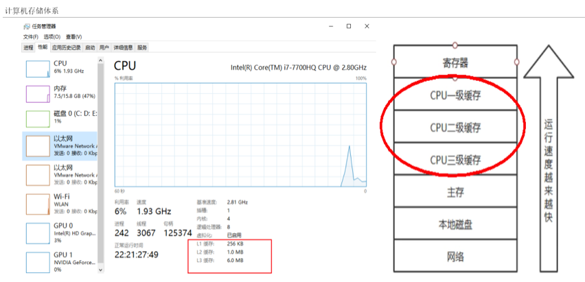
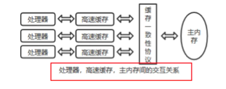
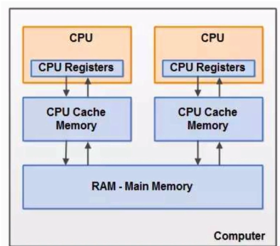
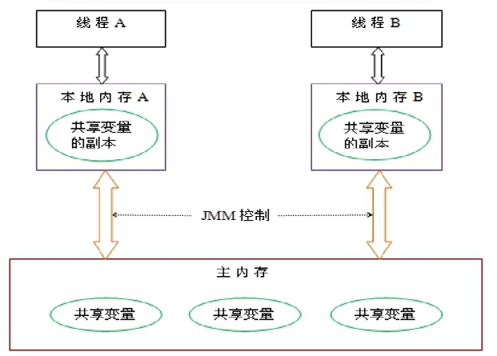
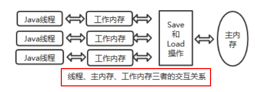
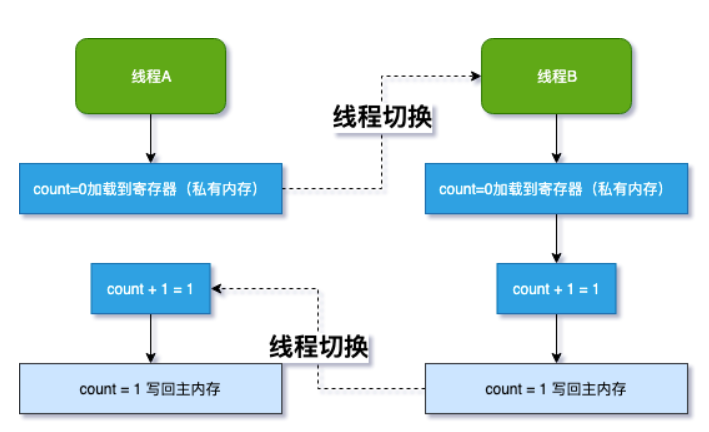
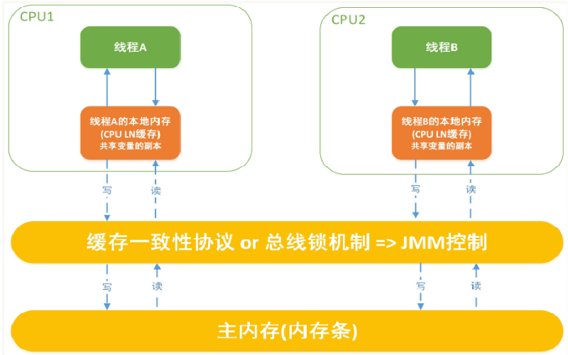

# JMM（Java内存模型）详解

# JMM（Java 内存模型）详解
## <font style="color:#ff0000;">大厂面试题</font>
> <font style="color:#000000;">你知道什么是Java内存模型JMM吗？</font>
>

> <font style="color:#000000;">JMM与volatile它们两个之间的关系？</font>
>

> <font style="color:#000000;">JMM有哪些特性or它的三大特性是什么？</font>
>

> <font style="color:#000000;">为什么要有JMM，它为什么出现？作用和功能是什么？</font>
>

> <font style="color:#ff0000;">happens-before先行发生原则你有了解过吗？</font>
>


## <font style="color:#000000;">计算机硬件存储体系</font>
<font style="color:#000000;">计算机存储结构，从本地磁盘到主存到</font><font style="color:#000000;">CPU</font><font style="color:#000000;">缓存，也就是从硬盘到内存，到</font><font style="color:#000000;">CPU</font><font style="color:#000000;">。</font><font style="color:#000000;"> </font>

<font style="color:#000000;">一般对应的程序的操作就是从数据库查数据到内存然后到</font><font style="color:#000000;">CPU</font><font style="color:#000000;">进行计算</font><font style="color:#000000;"> </font>



### <font style="color:#000000;">问题？和推导出我们需要知道JMM</font>
<font style="color:#000000;">因为有这么多级的缓存(cpu和物理主内存的速度不一致的)， CPU的运行并</font><font style="color:#fb0007;">不是直接操作内存而是先把内存里边的数据读到缓存</font><font style="color:#000000;">，而内存的读和写操作的时候就会造成不一致的问题 </font>

<font style="color:#000000;"> </font>

<font style="color:#000000;">Java虚拟机规范中试图定义一种Java内存模型（java Memory Model，简称JMM) 来</font>**<font style="color:#000000;background-color:#d9dffc;">屏蔽掉各种硬件和操作系统的内存访问差异， 以实现让Java程序在各种平台下都能达到一致的内存访问效果</font>**<font style="color:#000000;">。推导出我们需要知道JMM </font>

## <font style="color:#000000;">Java内存模型Java Memory Model</font>
<font style="color:#000000;">JMM(Java内存模型Java Memory Model，简称JMM)本身是一种</font><font style="color:#fc4f08;">抽象的</font><font style="color:#000000;">概念</font><font style="color:#fb0007;">并不真实存在</font><font style="color:#000000;">它</font><font style="color:#0000ff;">仅仅描述的是一组约定或规范</font><font style="color:#000000;">，通过这组规范定义了程序中(尤其是多线程)各个变量的读写访问方式并决定一个线程对共享变量的何时写入，以及如何变成对另一个线程可见，关键技术点都是围绕多线程的</font><font style="color:#fb0007;">原子性、可见性和有序性</font><font style="color:#000000;">展开的。 </font>

### <font style="color:#000000;">原则： </font>
<font style="color:#000000;">JMM的关键技术点都是围绕多线程的</font><font style="color:#fb0007;">原子性、可见性和有序性展开的 </font>

### <font style="color:#fb0007;">能干嘛？ </font>
<font style="color:#000000;">1 </font><font style="color:#000000;">通过</font><font style="color:#000000;">JMM</font><font style="color:#000000;">来实现</font><font style="color:#fb0007;">线程和主内存之间的抽象关系。</font><font style="color:#fb0007;"> </font>

<font style="color:#fb0007;">2 屏蔽各个</font>**<font style="color:#0000ff;">硬件平台</font>**<font style="color:#fb0007;">和</font>**<font style="color:#0000ff;">操作系统</font>**<font style="color:#fb0007;">的内存访问差异</font><font style="color:#000000;">以实现让Java程序在各种平台下都能达到一致的内存访问效果。 </font>

## <font style="color:#000000;">JMM规范下，三大特性</font>
### <font style="color:#000000;">可见性</font>
<font style="color:#fb0007;">是指当一个线程修改了某一个共享变量的值，其他线程是否能够立即知道该变更 </font><font style="color:#fb0007;"> </font><font style="color:#fb0007;">，</font><font style="color:#000000;">JMM</font><font style="color:#000000;">规定了所有的变量都存储在</font>**<font style="color:#fb0007;">主内存</font>**<font style="color:#000000;">中。</font><font style="color:#000000;"> </font>





<font style="color:#000000;">Java</font><font style="color:#000000;">中</font><font style="color:#fb0007;">普通的共享变量不保证可见性</font><font style="color:#000000;">，因为数据修改被写入内存的时机是不确定的，多线程并发下很可能出现</font><font style="color:#000000;">"</font><font style="color:#000000;">脏读</font><font style="color:#000000;">"</font><font style="color:#000000;">，所以每个线程都有自己的</font>**<font style="color:#fb0007;">工作内存</font>**<font style="color:#000000;">，线程自己的工作内存中保存了该线程使用到的变量的</font><font style="color:#fb0007;">主内存副本拷贝</font><font style="color:#000000;">，线程对变量的所有操作（读取，赋值等</font><font style="color:#000000;">）都必需在线程自己的工作内存中进行，而不能够直接读写主内存中的变量。不同线程之间也无法直接访问对方工作内存中的变量，线程间变量值的传递均需要通过主内存来完成</font><font style="color:#000000;"> </font>



**<font style="color:#fb0007;">线程脏读：如果没有可见性保证</font>**<font style="color:#fb0007;"> </font>

| 主内存中有变量 x，初始值为 0  |
| --- |
| <font style="color:#000000;">线程</font><font style="color:#000000;"> A </font><font style="color:#000000;">要将</font><font style="color:#000000;"> x </font><font style="color:#000000;">加</font><font style="color:#000000;"> 1</font><font style="color:#000000;">，先将</font><font style="color:#000000;"> x=0 </font><font style="color:#000000;">拷贝到自己的私有内存中，然后更新</font><font style="color:#000000;"> x </font><font style="color:#000000;">的值</font><font style="color:#000000;"> </font> |
| <font style="color:#000000;">线程</font><font style="color:#000000;"> A </font><font style="color:#000000;">将更新后的</font><font style="color:#000000;"> x </font><font style="color:#000000;">值回刷到主内存的时间是不固定的</font><font style="color:#000000;"> </font> |
| <font style="color:#000000;">刚好在线程</font><font style="color:#000000;"> A </font><font style="color:#000000;">没有回刷</font><font style="color:#000000;"> x </font><font style="color:#000000;">到主内存时，线程</font><font style="color:#000000;"> B </font><font style="color:#000000;">同样从主内存中读取</font><font style="color:#000000;"> x</font><font style="color:#000000;">，此时为</font><font style="color:#000000;"> 0</font><font style="color:#000000;">，和线程</font><font style="color:#000000;"> A </font><font style="color:#000000;">一样的操作，最后期盼的</font><font style="color:#000000;"> x=2 </font><font style="color:#000000;">就会变成</font><font style="color:#000000;"> x=1</font><font style="color:#000000;"> </font> |




### <font style="color:#000000;">原子性</font>
<font style="color:#000000;">指一个操作是不可中断的，即多线程环境下，操作不能被其他线程干扰</font>

### <font style="color:#000000;">有序性</font>
对于一个线程的执行代码而言，我们总是习惯性认为代码的执行总是从上到下，有序执行。

但为了提高性能，编译器和处理器通常会对指令序列进行重新排序。

指令重排<font style="color:#ff0000;">可以保证串行语义一致</font>，但没有义务保证<font style="color:#ff0000;">多线程间的语义也一致</font>，即可能产生"脏读"，简单说，

两行以上不相干的代码在执行的时候有可能先执行的不是第一条，<font style="color:#0000ff;">不见得是从上到下顺序执行，执行顺序</font><font style="color:#ff0000;">会被优化</font><font style="color:#0000ff;">。</font>


单线程环境里面确保程序最终执行结果和代码顺序执行的结果一致。

处理器在进行重排序时<font style="color:#ff0000;">必须要考虑</font>指令之间的_**<u><font style="color:#ff0000;">数据依赖性</font></u>**_

多线程环境中线程交替执行,由于编译器优化重排的存在，两个线程中使用的变量能否保证一致性是无法确定的,结果无法预测

```java
 
public void mySort()
{
    int x = 11; //语句1
    int y = 12; //语句2
    x = x + 5;  //语句3
    y = x * x;  //语句4
}
 
  1234
  2134
  1324
 
问题：请问语句4可以重排后变成第一个条吗？
 

```

## <font style="color:#000000;">JMM规范下，多线程对变量的读写过程</font>
### 读取过程
由于JVM运行程序的实体是线程，而每个线程创建时JVM都会为其创建一个工作内存(有些地方称为栈空间)，工作内存是每个线程的私有数据区域，而Java内存模型中规定所有变量都存储在<font style="color:#ff0000;">主内存</font>，主内存是共享内存区域，所有线程都可以访问，<font style="color:#ff0000;">但线程对变量的操作(读取赋值等)必须在工作内存中进行，首先要将变量从主内存拷贝到的线程自己的工作内存空间，然后对变量进行操作，操作完成后再将变量写回主内存，</font>不能直接操作主内存中的变量，各个线程中的工作内存中存储着主内存中的**<font style="color:#0000ff;">变量副本拷贝</font>**，因此不同的线程间无法访问对方的工作内存，线程间的通信(传值)必须通过主内存来完成，其简要访问过程如下图:  


**<font style="color:#0000ff;">JMM定义了线程和主内存之间的抽象关系</font>**

1 线程之间的共享变量存储在主内存中(从硬件角度来说就是内存条)

2 每个线程都有一个私有的本地工作内存，本地工作内存中存储了该线程用来读/写共享变量的副本(从硬件角度来说就是CPU的缓存，比如寄存器、L1、L2、L3缓存等)

### 小总结
我们定义的所有共享变量都储存在<font style="color:#ff0000;">物理主内存</font>中

每个线程都有自己独立的工作内存，里面保存该线程使用到的变量的副本(主内存中该变量的一份拷贝)

线程对共享变量所有的操作都必须先在线程自己的工作内存中进行后写回主内存，不能直接从主内存中读写(不能越级)

不同线程之间也无法直接访问其他线程的工作内存中的变量，线程间变量值的传递需要通过主内存来进行(同级不能相互访问)

## JMM规范下，多线程先行发生原则之happens-before
在JMM中，

如果一个操作<font style="color:#ff0000;">执行的结果</font>需要对另一个操作可见性

或者代码重排序，那么这两个操作之间必须存在happens-before关系。

### x 、y案例说明
| x = 5 | 线程A执行 |
| --- | --- |
| y = x | 线程B执行 |
| 上述称之为：写后读 |  |


### 问题?
y是否等于5呢？

如果线程A的操作（x= 5）happens-before(先行发生)线程B的操作（y = x）,那么可以确定线程B执行后y = 5 一定成立;

如果他们不存在happens-before原则，那么y = 5 不一定成立。

这就是happens-before原则的威力。----> **<font style="color:#ff0000;">包含可见性和有序性的约束</font>**

### 先行发生原则说明
如果Java内存模型中所有的有序性都仅靠volatile和synchronized来完成，那么有很多操作都将会变得非常啰嗦，但是我们在编写Java并发代码的时候并没有察觉到这一点。

<font style="color:#ff0000;">我们没有</font><font style="color:#0000ff;">时时、处处、次次</font><font style="color:#ff0000;">，添加volatile和synchronized来完成程序，这是因为Java语言中JMM原则下</font>

<font style="color:#ff0000;">有一个“先行发生”(Happens-Before)的原则限制和规矩</font>

<font style="color:#ff0000;">这个原则非常重要：</font><font style="color:#000000;"> </font>

它是判断数据是否存在竞争，线程是否安全的非常有用的手段。依赖这个原则，我们可以通过几条简单规则一揽子解决<font style="color:#0000ff;">并发环境下两个操作之间是否可能存在冲突的所有问题</font>，而不需要陷入Java内存模型苦涩难懂的底层编译原理之中。

### happens-before总原则
如果一个操作happens-before另一个操作，那么第一个操作的执行结果将对第二个操作可见，

而且第一个操作的执行顺序排在第二个操作之前。

两个操作之间存在happens-before关系，并不意味着一定要按照happens-before原则制定的顺序来执行。

如果重排序之后的执行结果与按照happens-before关系来执行的<font style="color:#ff0000;">结果一致</font>，那么这种重排序<font style="color:#ff0000;">并不非法</font>。

### happens-before之8条规则
#### 次序规则：
<font style="color:#ff0000;">一个线程内</font>，按照代码顺序，写在前面的操作先行发生于写在后面的操作；

**加深说明**

前一个操作的结果可以被后续的操作获取。

讲白点就是前面一个操作把变量X赋值为1，那后面一个操作肯定能知道X已经变成了1。

#### 锁定规则：
一个unLock操作先行发生于后面((这里的“后面”是指时间上的先后))对同一个锁的lock操作；

```java
 
package com.zzyy.study.test;

/**
 * @auther zzyy
 * @create 2020-06-11 16:01
 */
public class HappenBeforeDemo
{
    static Object objectLock = new Object();

    public static void main(String[] args) throws InterruptedException
    {
        //对于同一把锁objectLock，threadA一定先unlock同一把锁后B才能获得该锁，   A 先行发生于B
        synchronized (objectLock)
        {

        }
    }
}
 

```

#### volatile变量规则：
对一个volatile变量的写操作先行发生于后面对这个变量的读操作，

<font style="color:#ff0000;">前面的写对后面的读是可见的</font>，这里的“后面”同样是指时间上的先后。

#### 传递规则：
如果操作A先行发生于操作B，而操作B又先行发生于操作C，则可以得出操作A先行发生于操作C；

#### 线程启动规则(Thread Start Rule)：
Thread对象的start()方法先行发生于此线程的每一个动作

#### 线程中断规则(Thread Interruption Rule)：
对线程interrupt()方法的调用先行发生于被中断线程的代码检测到中断事件的发生；

可以通过Thread.interrupted()检测到是否发生中断

#### 线程终止规则(Thread Termination Rule)：
线程中的所有操作都先行发生于对此线程的终止检

测，我们可以通过Thread::join()方法是否结束、

Thread::isAlive()的返回值等手段检测线程是否已经终止执行。

#### 对象终结规则(Finalizer Rule)：
一个对象的初始化完成（构造函数执行结束）先行发生于它的finalize()方法的开始

说人话：对象没有完成初始化之前，是不能调用finalized()方法的

## 案例说明
### 代码
```java
private int value =0;
pubilc void setvalue(int value){
    this.value = value;
}
public int getvalue(){
    return value;
}

```

假设存在线程A和B，

线程A先（时间上的先后）调用了setValue(1)，

然后线程B调用了同一个对象的getValue()，

那么线程B收到的返回值是什么？

### 解释
假设存在线程A和B，线程A先（时间上的先后）调用了setValue(1)，然后线程B调用了同一个对象的getValue()，那么线程B收到的返回值

是什么？


我们就这段简单的代码一次分析happens-before的规则（规则5、6、7、8 可以忽略，因为他们和这段代码毫无关系）：

1 由于两个方法是由不同的线程调用，不在同一个线程中，所以肯定不满足程序次序规则；

2 两个方法都没有使用锁，所以不满足锁定规则；

3 变量不是用volatile修饰的，所以volatile变量规则不满足；

4 传递规则肯定不满足；


所以我们无法通过happens-before原则推导出线程A happens-before线程B，虽然可以确认<font style="color:#0000ff;">在时间上</font>线程A优先于线程B指定，

但就是无法确认线程B获得的**<font style="color:#ff0000;">结果是什么</font>**，所以这段代码不是线程安全的。**<font style="color:#ff0000;">那么怎么修复这段代码呢？</font>**

### **<font style="color:#ff0000;">修复</font>**
把getter/setter方法都定义为synchronized方法

把value定义为volatile变量，由于setter方法对value的修改不依赖value的原值，满足volatile关键字使用场景


> 更新: 2024-01-23 20:50:47  
原文: [https://www.yuque.com/vip6688/neho4x/gtxnwutswuxo5tpm](https://www.yuque.com/vip6688/neho4x/gtxnwutswuxo5tpm)
>


> 更新: 2024-11-25 09:18:08  
> 原文: <https://www.yuque.com/neumx/laxg2e/d9fccce43e5996b6e24e891a677b5822>