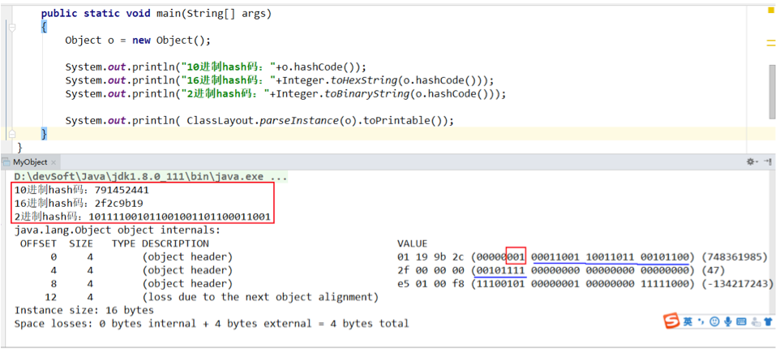
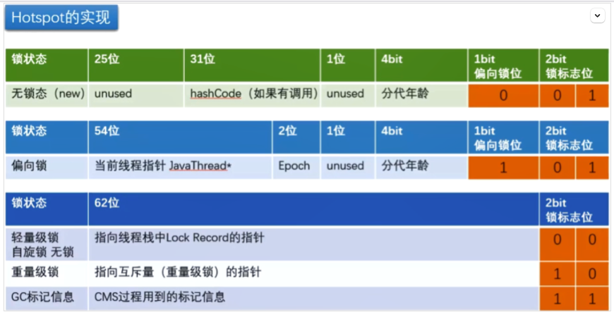
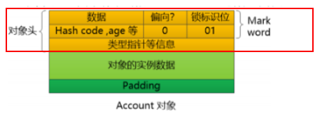
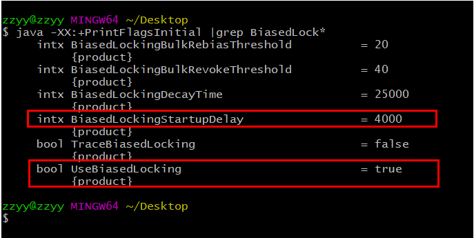
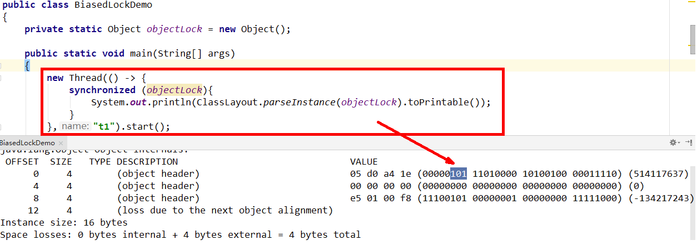
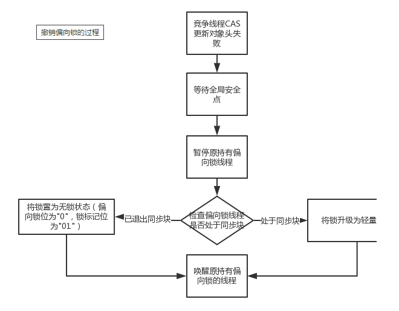
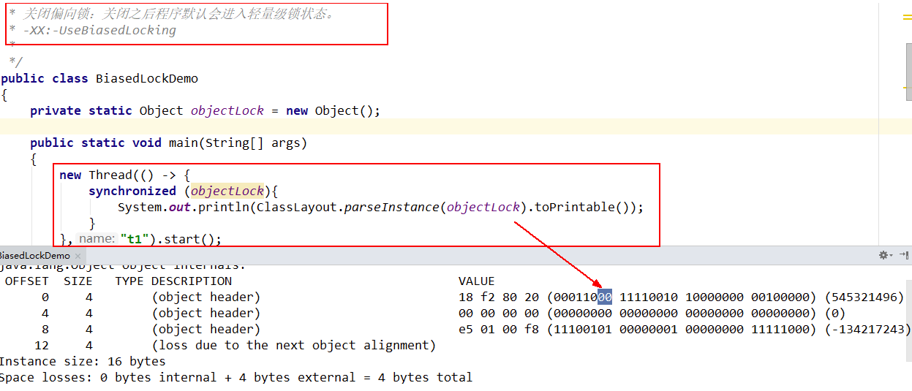
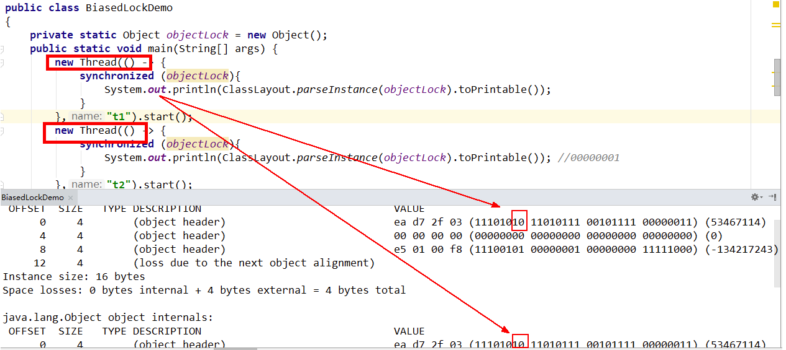
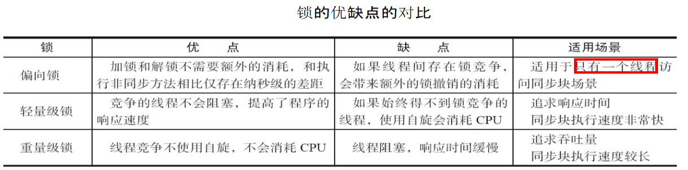

# synchronized锁优化

# synchronized锁优化
## <font style="color:#000000;">多线程访问情况</font>
+ <font style="color:#000000;">只有一个线程来访问，有且唯一Only One</font>
+ <font style="color:#000000;">有2个线程A、B来交替访问</font>
+ <font style="color:#000000;">竞争激烈，多个线程来访问</font>

## <font style="color:#000000;">synchronized锁升级优化</font>
<font style="color:#000000;">synchronized用的锁是存在Java对象头里的Mark Word中，锁升级功能主要依赖MarkWord中锁标志位和释放偏向锁标志位</font>


### <font style="color:#000000;">无锁</font>
```java
 
package  com.atguigu.juc.senior.inner.object;
import  org.openjdk.jol.info.ClassLayout;
/**
*  @auther  zzyy
*  @create  2020-06-13 11:24
*/
public class  MyObject{
    public static void  main(String[] args) {
        Object o = new  Object();
        System.out.println( "10 进制 hash 码： " +o.hashCode());
        System.out.println( "16 进制 hash 码： " +Integer.toHexString(o.hashCode()));
        System.out.println( "2 进制 hash 码： " +Integer.toBinaryString(o.hashCode()));
        System.out.println( ClassLayout.parseInstance(o).toPrintable());
    }
}

 

```



### <font style="color:#000000;">偏锁</font>
#### <font style="color:#000000;">主要作用</font>
<font style="color:#ff0000;">当一段同步代码一直被同一个线程多次访问，由于只有一个线程那么该线程在后续访问时便会自动获得锁</font>

<font style="color:#000000;">Hotspot 的作者经过研究发现，大多数情况下： </font>

<font style="color:#000000;">多线程的情况下，锁不仅不存在多线程竞争，还存在锁</font><font style="color:#0f7001;">由同一线程多次获得的情况</font><font style="color:#000000;">， </font>

<font style="color:#000000;">偏向锁就是在这种情况下出现的，它的出现是为了解决</font><font style="color:#fb0007;">只有在一个线程执行同步时提高性能</font><font style="color:#000000;">。</font>



#### <font style="color:#000000;">偏向锁的持有 </font>
<font style="color:#0000ff;">理论落地：</font>

在实际应用运行过程中发现，“锁总是同一个线程持有，很少发生竞争”，也就是说<font style="color:#ff0000;">锁总是被第一个占用他的线程拥有</font>，<font style="color:#ff0000;">这个线程就是锁的偏向线程</font>。

那么只需要在锁第一次被拥有的时候，记录下偏向线程ID。这样偏向线程就一直持有着锁(后续这个线程进入和退出这段加了同步锁的代码块时，<font style="color:#ff0000;">不需要再次加锁和释放锁</font>。而是直接比较对象头里面是否存储了指向当前线程的偏向锁)。

<font style="color:#ff0000;">如果相等</font>表示偏向锁是偏向于当前线程的，就不需要再尝试获得锁了，直到竞争发生才释放锁。以后每次同步，检查锁的偏向线程ID与当前线程ID是否一致，如果一致直接进入同步。无需每次加锁解锁都去CAS更新对象头。**<font style="color:#ff0000;">如果自始至终使用锁的线程只有一个</font>**，很明显偏向锁几乎没有额外开销，性能极高。

假如不一致意味着发生了竞争，锁已经不是总是偏向于同一个线程了，这时候可能需要升级变为轻量级锁，才能保证线程间公平竞争锁。<font style="color:#0000ff;">偏向锁只有遇到其他线程尝试竞争偏向锁时，持有偏向锁的线程才会释放锁，线程是不会主动释放偏向锁的。</font>

<font style="color:#0000ff;">技术实现：</font>

一个synchronized方法被一个线程抢到了锁时，那这个方法所在的对象就会在其所在的Mark Word中将偏向锁修改状态位，同时还会有占用前54位来存储线程指针作为标识。若该线程再次访问同一个synchronized方法时，该线程只需去对象头的Mark Word 中去判断一下是否有偏向锁指向本身的ID，无需再进入 Monitor 去竞争对象了。


**细化案例Account对象举例说明**

偏向锁的操作不用直接捅到操作系统，不涉及<font style="color:#ff0000;">用户到内核转换</font>，<font style="color:#ff0000;">不必要直接升级为最高级</font>，我们以一个account对象的“对象头”为例，



假如有一个线程执行到synchronized代码块的时候，JVM使用CAS操作把线程指针ID记录到Mark Word当中，并修改标偏向标示，标示当前线程就获得该锁。锁对象变成偏向锁（通过CAS修改对象头里的锁标志位），字面意思是“偏向于第一个获得它的线程”的锁。执行完同步代码块后，线程并不会主动释放偏向锁。


这时线程获得了锁，可以执行同步代码块。当该线程第二次到达同步代码块时会判断此时持有锁的线程是否还是自己（持有锁的线程ID也在对象头里），JVM通过account对象的Mark Word判断：当前线程ID还在，说明还持有着这个对象的锁，就可以继续进入临界区工作。<font style="color:#ff0000;">由于之前没有释放锁，这里也就不需要重新加锁</font>。**<font style="color:#ff0000;"> 如果自始至终使用锁的线程只有一个</font>**，很明显偏向锁几乎没有额外开销，性能极高。


结论：JVM不用和操作系统协商设置Mutex(争取内核)，它只需要记录下线程ID就标示自己获得了当前锁，不用操作系统接入。

上述就是偏向锁：在没有其他线程竞争的时候，一直偏向偏心当前线程，当前线程可以一直执行。

#### 偏向锁JVM命令
`java -XX:+PrintFlagsInitial |grep BiasedLock*`



**重要参数说明**


+ 实际上偏向锁在JDK1.6之后是默认开启的，但是启动时间有延迟，
+ 所以需要添加参数-XX:BiasedLockingStartupDelay=0，让其在程序启动时立刻启动。


+ 开启偏向锁：
+ -XX:+UseBiasedLocking -XX:BiasedLockingStartupDelay=0


+ 关闭偏向锁：关闭之后程序默认会直接进入  >>>>>>>>   轻量级锁状态。
+ -XX:-UseBiasedLocking

**代码演示：**



#### 偏向锁的撤销
当有另外线程逐步来竞争锁的时候，就不能再使用偏向锁了，要升级为轻量级锁

竞争线程尝试CAS更新对象头失败，会等待到全局安全点（此时不会执行任何代码）撤销偏向锁。


偏向锁使用一种等到<font style="color:#ff0000;">竞争出现才释放锁的机制</font>，只有当其他线程竞争锁时，持有偏向锁的原来线程才会被撤销。

<font style="color:#ff0000;">撤销需要等待全局安全点(该时间点上没有字节码正在执行)</font><font style="color:#000000;">，同时检查持有偏向锁的线程是否还在执行： </font>

①  第一个线程正在执行synchronized方法(<font style="color:#ff0000;">处于同步块</font>)，它还没有执行完，其它线程来抢夺，该偏向锁会被取消掉并出现**<font style="color:#ff0000;">锁升级</font>**。

此时轻量级锁由原持有偏向锁的线程持有，继续执行其同步代码，而正在竞争的线程会进入自旋等待获得该轻量级锁。

②  第一个线程执行完成synchronized方法(<font style="color:#ff0000;">退出同步块</font>)，则将对象头设置成无锁状态并撤销偏向锁，重新偏向 。



### **轻锁**
#### 主要作用
有线程来参与锁的竞争，但是获取锁的冲突时间极短，本质就是自旋锁


#### 轻量级锁的获取
轻量级锁是为了在线程<font style="color:#ff0000;">近乎交替</font>执行同步块时提高性能。

**主要目的：** 在没有多线程竞争的前提下，通过CAS减少重量级锁使用操作系统互斥量产生的性能消耗，<font style="color:#ff0000;">说白了先自旋再阻塞</font>。

**升级时机：** 当关闭偏向锁功能或多线程竞争偏向锁会导致偏向锁升级为轻量级锁


假如线程A已经拿到锁，这时线程B又来抢该对象的锁，由于该对象的锁已经被线程A拿到，当前该锁已是偏向锁了。

而线程B在争抢时发现对象头Mark Word中的线程ID不是线程B自己的线程ID(而是线程A)，那线程B就会进行CAS操作希望能获得锁。

**<font style="color:#ff0000;">此时线程B操作中有两种情况：</font>**

**<font style="color:#0000ff;">如果锁获取成功</font>**，直接替换Mark Word中的线程ID为B自己的ID(A → B)，重新偏向于其他线程(即将偏向锁交给其他线程，相当于当前线程"被"释放了锁)，该锁会保持偏向锁状态，A线程Over，B线程上位；

**<font style="color:#0000ff;">如果锁获取失败</font>**，则偏向锁升级为轻量级锁，此时轻量级锁由原持有偏向锁的线程持有，继续执行其同步代码，而正在竞争的线程B会进入自旋等待获得该轻量级锁。

**代码演示：**



#### 自旋达到一定次数和程度
java6之前：

默认启用，默认情况下自旋的次数是 10 次，-XX:PreBlockSpin=10来修改，或者等待获取锁的线程数超过cpu核数一半

上述了解即可，别用了。

Java6之后：

自适应意味着自旋的次数不是固定不变的，而是根据 同一个锁上一次自旋的时间和拥有锁线程的状态来决定。

#### **轻量锁与偏向锁的区别和不同**
争夺轻量级锁失败时，自旋尝试抢占锁，轻量级锁每次退出同步块都需要释放锁，而偏向锁是在竞争发生时才释放锁

### 重锁
有大量的线程参与锁的竞争，冲突性很高


**代码演示：**



---

### **总结**


synchronized锁升级过程总结：<font style="color:#ff0000;">一句话，就是先自旋，不行再阻塞。</font>

实际上是把之前的悲观锁(重量级锁)变成在一定条件下使用偏向锁以及使用轻量级(自旋锁CAS)的形式


synchronized在修饰方法和代码块在字节码上实现方式有很大差异，但是内部实现还是基于对象头的MarkWord来实现的。

JDK1.6之前synchronized使用的是重量级锁，<font style="color:#ff0000;">JDK1.6之后进行了优化，拥有了无锁->偏向锁->轻量级锁->重量级锁的升级过程</font>，而不是无论什么情况都使用重量级锁。


**<font style="color:#0000ff;">偏向锁</font>****:**适用于单线程适用的情况，在不存在锁竞争的时候进入同步方法/代码块则使用偏向锁。

**<font style="color:#0000ff;">轻量级锁</font>****：**适用于竞争较不激烈的情况(这和乐观锁的使用范围类似)， 存在竞争时升级为轻量级锁，轻量级锁采用的是自旋锁，如果同步方法/代码块执行时间很短的话，采用轻量级锁虽然会占用cpu资源但是相对比使用重量级锁还是更高效。

**<font style="color:#0000ff;">重量级锁</font>****：**适用于竞争激烈的情况，如果同步方法/代码块执行时间很长，那么使用轻量级锁自旋带来的性能消耗就比使用重量级锁更严重，这时候就需要升级为重量级锁。

### **总体步骤流程图示**


## JIT编译器对锁的优化
### JIT
Just In Time Compiler，一般翻译为即时编译器

### 锁消除
**<font style="color:rgb(31, 35, 40);">锁消除</font>**<font style="color:rgb(31, 35, 40);">是指JVM在运行时通过逃逸分析（Escape Analysis）等技术发现某些同步块内的数据不可能被多个线程共享，那么这些同步操作实际上就是多余的。JVM会动态地判断并移除那些不会发生数据竞争的不必要的锁，从而减少锁的开销。例如，当一个局部变量只在方法内部使用，并且其生命周期不超出该方法，则对这个局部变量加锁可能是可以消除的。</font>

```java
package com.atguigu.itdachang;

/**
 * 锁消除
 * 从JIT角度看相当于无视它，synchronized (o)不存在了,这个锁对象并没有被共用扩散到其它线程使用，
 * 极端的说就是根本没有加这个锁对象的底层机器码，消除了锁的使用
 */
public class LockClearUPDemo
{
    static Object objectLock = new Object();//正常的

    public void m1()
    {
        //锁消除,JIT会无视它，synchronized(对象锁)不存在了。不正常的
        Object o = new Object();

        synchronized (o)
        {
            System.out.println("-----hello LockClearUPDemo"+"\t"+o.hashCode()+"\t"+objectLock.hashCode());
        }
    }

    public static void main(String[] args)
    {
        LockClearUPDemo demo = new LockClearUPDemo();

        for (int i = 1; i <=10; i++) {
            new Thread(() -> {
                demo.m1();
            },String.valueOf(i)).start();
        }
    }
}
 
 

```

### 锁粗化
**<font style="color:rgb(31, 35, 40);">锁粗化</font>**<font style="color:rgb(31, 35, 40);">则是将一系列连续的操作合并成一个更大的同步区域，以减少频繁申请、释放锁带来的性能损耗。例如，在循环体内，如果每次迭代都对同一个对象进行同步操作，而这些操作逻辑上是一个整体，那么JVM可能会把整个循环体视为一个同步块，只在循环开始前获取一次锁并在循环结束后才释放锁，而不是在每一次迭代时重复获取和释放锁。</font>

```java
package com.atguigu.itdachang;

/**
 * 锁粗化
 * 假如方法中首尾相接，前后相邻的都是同一个锁对象，那JIT编译器就会把这几个synchronized块合并成一个大块，
 * 加粗加大范围，一次申请锁使用即可，避免次次的申请和释放锁，提升了性能
 */
public class LockBigDemo
{
    static Object objectLock = new Object();


    public static void main(String[] args)
    {
        new Thread(() -> {
            synchronized (objectLock) {
                System.out.println("11111");
            }
            synchronized (objectLock) {
                System.out.println("22222");
            }
            synchronized (objectLock) {
                System.out.println("33333");
            }
        },"a").start();

        new Thread(() -> {
            synchronized (objectLock) {
                System.out.println("44444");
            }
            synchronized (objectLock) {
                System.out.println("55555");
            }
            synchronized (objectLock) {
                System.out.println("66666");
            }
        },"b").start();

    }
}
 
 

```


> 更新: 2024-01-19 22:01:18  
原文: [https://www.yuque.com/vip6688/neho4x/zkta2i99r6rlwmbz](https://www.yuque.com/vip6688/neho4x/zkta2i99r6rlwmbz)
>


> 更新: 2024-11-25 09:18:23  
> 原文: <https://www.yuque.com/neumx/laxg2e/9f7eff4a2a6da85c602f477345197539>