# volatile与Java内存模型

# volatile与Java内存模型
## <font style="color:#ff0000;">被volatile修饰的变量</font><font style="color:#000000;">有2大特点</font>
### 特点
+ 可见性
+ 有序性
    - 排序要求

### volatile的内存语义
+ 当写一个volatile变量时，JMM会把该线程对应的本地内存中的共享变量值<font style="color:#ff0000;">立即刷新回主内存</font>中。
+ 当读一个volatile变量时，JMM会把该线程对应的本地内存设置为无效，直接从主内存中读取共享变量
+ 所以volatile的写内存语义是直接刷新到主内存中，读的内存语义是直接从主内存中读取。

## **<font style="color:#ff0000;">内存屏障(面试重点必须拿下)</font>**
### 先说生活案例
没有管控，顺序难保

设定规则，禁止乱序

### 是什么
内存屏障（也称内存栅栏，内存栅障，屏障指令等，是一类同步屏障指令，是CPU或编译器在对内存随机访问的操作中的一个同步点，使得此点之前的所有读写操作都执行后才可以开始执行此点之后的操作），避免代码重排序。内存屏障其实就是一种JVM指令，Java内存模型的重排规则会<font style="color:#ff0000;">要求Java编译器在生成JVM指令时插入特定的内存屏障指令</font>，通过这些内存屏障指令，volatile实现了Java内存模型中的可见性和有序性，但volatile无法保证原子性。

<font style="color:#0000ff;">内存屏障之前</font>的所有<font style="color:#ff0000;">写</font>操作都要<font style="color:#ff0000;">回写到主内存</font>，

<font style="color:#0000ff;">内存屏障之后</font>的所有读操作都能获得内存屏障之前的所有写操作的最新结果(实现了可见性)。

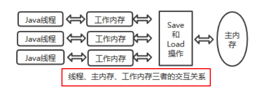

因此重排序时，不允许把内存屏障之后的指令重排序到内存屏障之前。

一句话：对一个 volatile 域的写, happens-before 于任意后续对这个 volatile 域的读，也叫写后读。

### volatile凭什么可以保证可见性和有序性？
内存屏障 (Memory Barriers / Fences)

### JVM中提供了四类内存屏障指令
#### 一句话
happens-before先行发生原则，类似接口规范，落地？

落地靠什么？你凭什么可以保证？你管用吗？

#### C++源码分析
IDEA工具里面找Unsafe.class

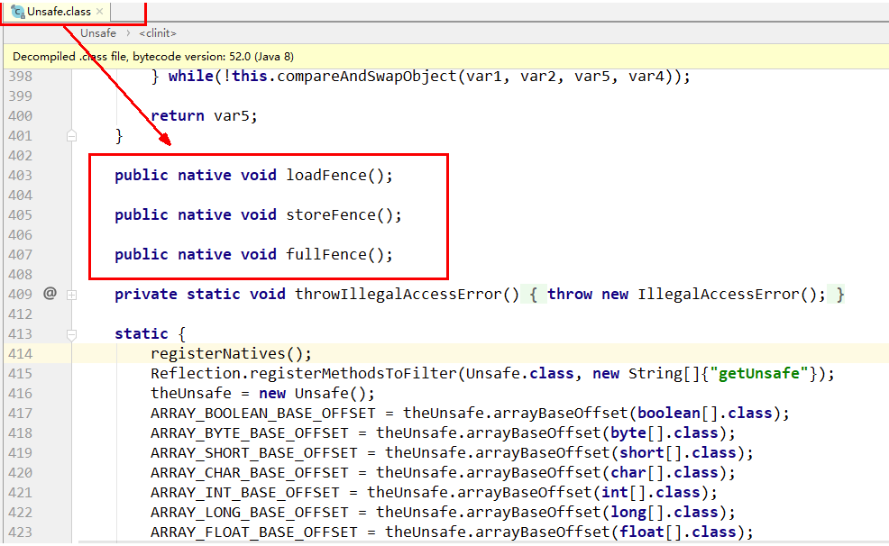

Unsafe.java

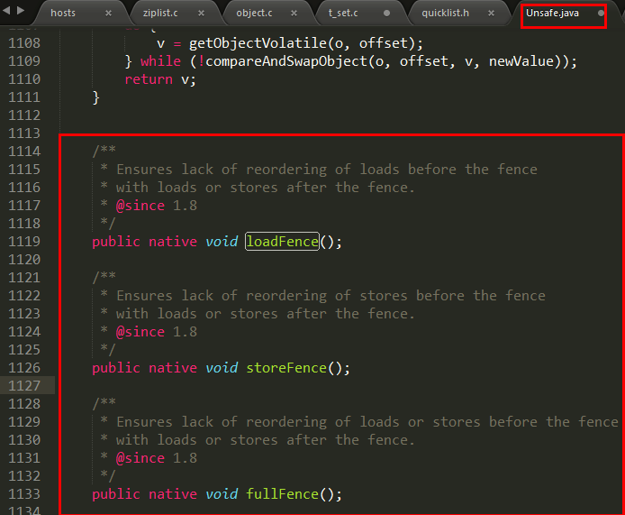

Unsafe.cpp

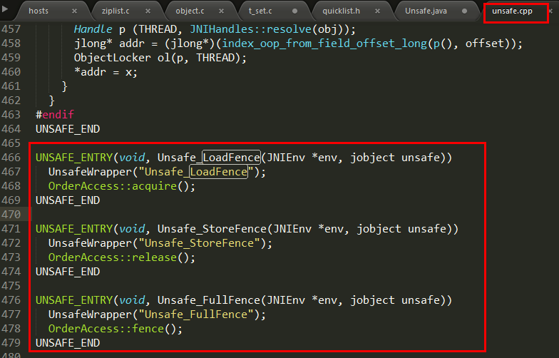

OrderAccess.hpp

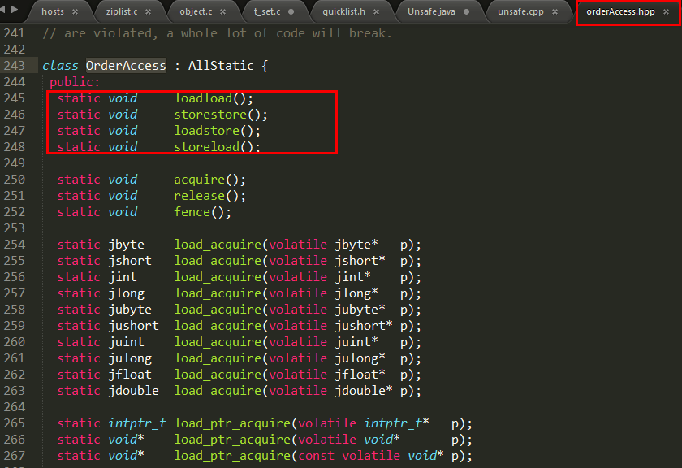

orderAccess_linux_x86.inline.hpp

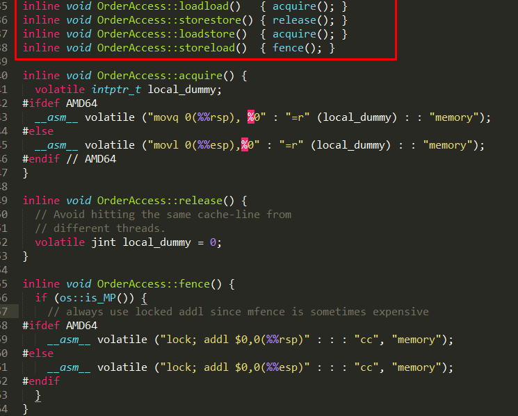

#### 四大屏障分别是什么意思
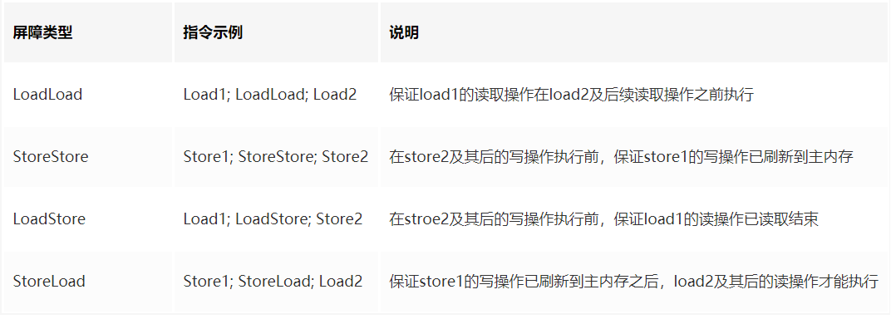

## volatile特性
### 保证可见性
#### 说明
<font style="color:#ff0000;">保证不同线程对这个变量进行操作时的可见性，即变量一旦改变所有线程立即可见</font>

#### 代码
+ 不加volatile，没有可见性，程序无法停止
+ 加了volatile，保证可见性，程序可以停止

```java
package com.zzyy.study.juc;

import java.util.concurrent.TimeUnit;

/**
 * @auther zzyy
 * @create 2020-06-30 11:29
 */
public class VolatileSeeDemo {
    static  boolean flag = true;       //不加volatile，没有可见性
    //static volatile boolean flag = true;       //加了volatile，保证可见性

    public static void main(String[] args) {
        new Thread(() -> {
            System.out.println(Thread.currentThread().getName()+"\t come in");
            while (flag)
            {

            }
            System.out.println(Thread.currentThread().getName()+"\t flag被修改为false,退出.....");
        },"t1").start();

        //暂停2秒钟后让main线程修改flag值
        try { 
            TimeUnit.SECONDS.sleep(2); 
        } catch (InterruptedException e) { 
            e.printStackTrace(); 
        }

        flag = false;

        System.out.println("main线程修改完成");
    }
}

 
```

#### 代码解释
线程t1中为何看不到被主线程main修改为false的flag的值？

问题可能:

1. 主线程修改了flag之后没有将其刷新到主内存，所以t1线程看不到。
2. 主线程将flag刷新到了主内存，但是t1一直读取的是自己工作内存中flag的值，没有去主内存中更新获取flag最新的值。

我们的诉求：  
1.线程中修改了工作内存中的副本之后，立即将其刷新到主内存；  
2.工作内存中每次读取共享变量时，都去主内存中重新读取，然后拷贝到工作内存。

解决：  
使用volatile修饰共享变量，就可以达到上面的效果，被volatile修改的变量有以下特点：

1. 线程中读取的时候，每次读取都会去主内存中读取共享变量最新的值，然后将其复制到工作内存
2. 线程中修改了工作内存中变量的副本，修改之后会立即刷新到主内存

#### <font style="color:#ff0000;">volatile变量的读写过程</font>
Java内存模型中定义的8种工作内存与主内存之间的原子操作

<font style="color:#0000ff;">read(读取)→load(加载)→use(使用)→assign(赋值)→store(存储)→write(写入)→</font><font style="color:#ff0000;">lock(锁定)→unlock(解锁)</font>


read: <font style="color:#ff0000;">作用于主内存</font>，将变量的值从主内存传输到工作内存，主内存到工作内存

load: 作用于工作内存，将read从主内存传输的变量值放入工作<font style="color:#0000ff;">内存变量副本</font>中，即数据加载

use: 作用于工作内存，将工作内存变量副本的值传递给执行引擎，每当JVM遇到需要该变量的字节码指令时会执行该操作

assign: 作用于工作内存，将从执行引擎接收到的值赋值给工作内存变量，每当JVM遇到一个给变量赋值字节码指令时会执行该操作

store: 作用于工作内存，将赋值完毕的工作变量的值写回给主内存

write: <font style="color:#ff0000;">作用于主内存</font>，将store传输过来的变量值赋值给主内存中的变量

<font style="color:#0000ff;">由于上述只能保证单条指令的原子性，针对多条指令的组合性原子保证，没有大面积加锁</font><font style="color:#000000;">，</font><font style="color:#0000ff;">所以，JVM提供了另外两个原子指令</font><font style="color:#000000;">：</font>

<font style="color:#ff0000;">lock: 作用于主内存</font>，将一个变量标记为一个线程独占的状态，只是写时候加锁，就只是锁了写变量的过程。

<font style="color:#ff0000;">unlock: 作用于主内存</font>，把一个处于锁定状态的变量释放，然后才能被其他线程占用

### 没有原子性
<font style="color:#ff0000;">volatile变量的复合操作(如i++)不具有原子性</font>

#### 代码
```java
package com.zzyy.study.juc;

import java.util.concurrent.TimeUnit;

class MyNumber
{
    volatile int number = 0;

    public void addPlusPlus()
    {
        number++;
    }
}

public class VolatileNoAtomicDemo
{
    public static void main(String[] args) throws InterruptedException
    {
        MyNumber myNumber = new MyNumber();

        for (int i = 1; i <=10; i++) {
            new Thread(() -> {
                for (int j = 1; j <= 1000; j++) {
                    myNumber.addPlusPlus();
                }
            },String.valueOf(i)).start();
        }
        
        //暂停几秒钟线程
        try { 
            TimeUnit.SECONDS.sleep(3); 
        } catch (InterruptedException e) { 
            e.printStackTrace(); 
        }
        System.out.println(Thread.currentThread().getName() + "\t" + myNumber.number);
    }
}
```

##### 从i++的字节码角度说明
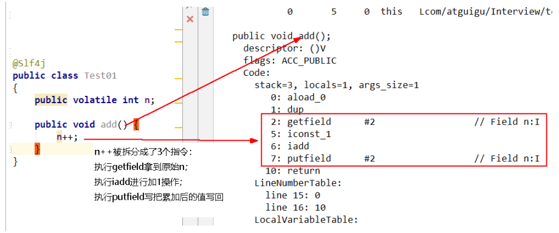

原子性指的是一个操作是<font style="color:#ff0000;">不可中断</font>的，即使是在多线程环境下，一个操作一旦开始就不会被其他线程影响。

public void add()

{

i++; //<font style="color:#ff0000;">不具备原子性</font>，该操作是先读取值，然后写回一个新值，相当于原来的值加上1，分3步完成

}

<font style="color:#ff0000;">如果第二个线程在第一个线程读取旧值和写回新值期间读取i的域值</font><font style="color:#000000;">，那么第二个线程就会与第一个线程一起看到同一个值，</font>

并执行相同值的加1操作，这也就造成了线程安全失败，因此对于add方法必须使用synchronized修饰，以便保证线程安全.

###### 不保证原子性
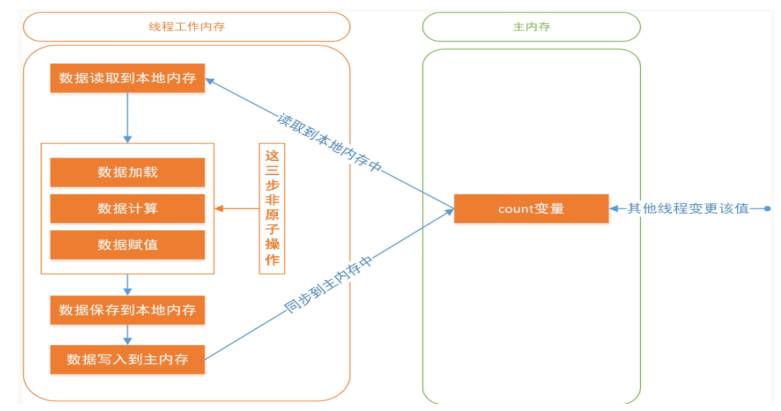

多线程环境下，"数据计算"和"数据赋值"操作可能多次出现，即操作非原子。若数据在加载之后，若主内存count变量发生修改之后，由于线程工作内存中的值在此前已经加载，从而不会对变更操作做出相应变化，即私有内存和公共内存中变量不同步，进而导致数据不一致

对于volatile变量，JVM只是保证从主内存加载到线程工作内存的值是最新的，也就是数据加载时是最新的。

<font style="color:#ff0000;">由此可见volatile解决的是变量</font>**<font style="color:#ff0000;background-color:#d9eafc;">读时的可见性问题</font>**<font style="color:#ff0000;">，但无法保证原子性，对于</font>**<font style="color:#ff0000;background-color:#d9eafc;">多线程修改共享变量的场景必须使用加锁同步</font>**

##### 读取赋值一个普通变量的情况
当线程1对主内存对象发起read操作到write操作第一套流程的时间里，线程2随时都有可能对这个<font style="color:#ff0000;">主内存对象</font>发起第二套操作

#### <font style="color:#0000ff;">既然一修改就是可见，为什么还不能保证原子性？</font>
##### volatile主要是对其中部分指令做了处理
要use(使用)一个变量的时候必需load(载入），要载入的时候必需从主内存read(读取）这样就解决了读的可见性。 

写操作是把assign和store做了关联(在assign(赋值)后必需store(存储))。store(存储)后write(写入)。

也就是做到了给一个变量赋值的时候一串关联指令直接把变量值写到主内存。

就这样通过用的时候直接从主内存取，在赋值到直接写回主内存做到了内存可见性。<font style="color:#0000ff;">注意蓝色框框的间隙</font>

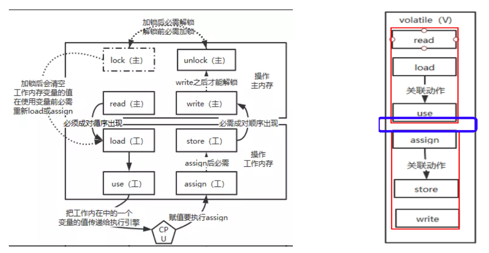

#### 结论
读取赋值一个volatile变量的情况

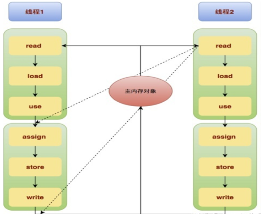

read-load-use 和 assign-store-write 成为了两个不可分割的原子操作，<font style="color:#ff0000;">但是在use和assign之间依然有极小的一段真空期</font>，有可能变量会被其他线程读取，导致<font style="color:#0000ff;">写丢失一次</font>

<font style="color:#ff0000;">但是无论在哪一个时间点主内存的变量和任一工作内存的变量的值都是相等的。这个特性就导致了volatile变量不适合参与到依赖当前值的运算，如i = i + 1; i++;之类的那么依靠可见性的特点volatile可以用在哪些地方呢？ </font><font style="color:#ff0000;">通常volatile用做保存某个状态的boolean值or int值。</font>

<font style="color:#ff0000;">《深入理解Java虚拟机》提到：</font>

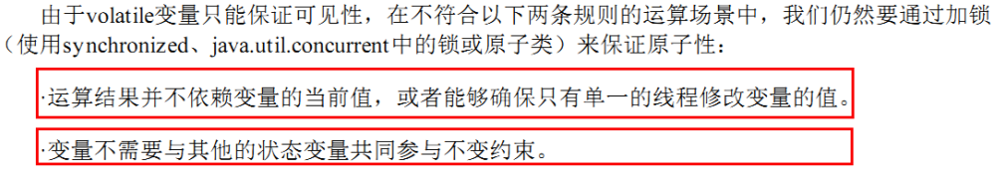

#### 面试回答
JVM的字节码，i++分成三步，间隙期不同步非原子操作(i++)

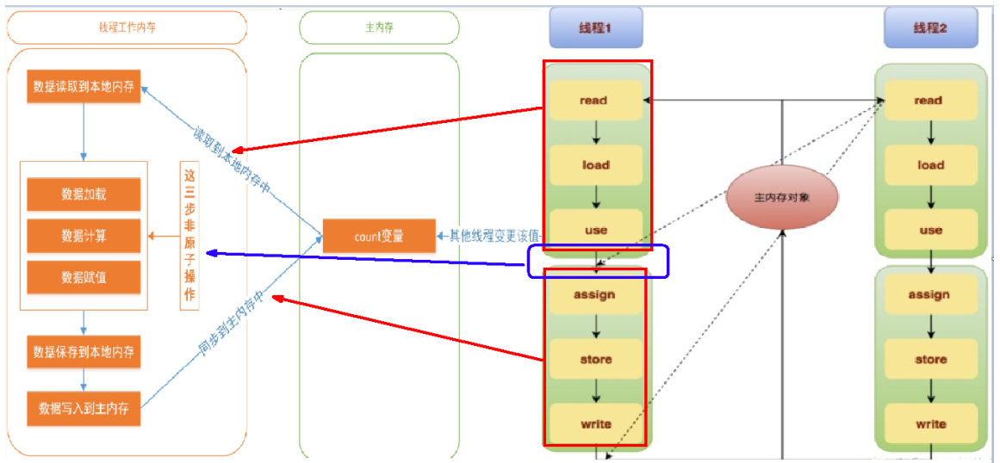

### 指令禁重排
#### 说明与案例
<font style="color:#0000ff;">重排序</font>

重排序是指编译器和处理器为了优化程序性能而对指令序列进行重新排序的一种手段，有时候会改变程序语句的先后顺序

不存在数据依赖关系，可以重排序；

<font style="color:#ff0000;">存在数据依赖关系，禁止重排序</font>

但重排后的指令绝对不能改变原有的串行语义！<font style="color:#ff0000;">这点在并发设计中必须要重点考虑！</font>

<font style="color:#0000ff;">重排序的分类和执行流程</font>


<font style="color:#ff0000;">编译器优化的重排序</font><font style="color:#ff0000;">： </font>编译器在不改变单线程串行语义的前提下，可以重新调整指令的执行顺序

<font style="color:#ff0000;">指令级并行的重排序： </font>处理器使用指令级并行技术来将多条指令重叠执行，若不存在数据依赖性，处理器可以改变语句对应机器指令的执行顺序

<font style="color:#ff0000;">内存系统的重排序： </font>由于处理器使用缓存和读/写缓冲区，这使得加载和存储操作看上去可能是乱序执行

**<font style="color:#0000ff;">数据依赖性</font>**<font style="color:#0000ff;">：</font>若两个操作访问同一变量，且这两个操作中有一个为写操作，此时两操作间就存在数据依赖性。

<font style="color:#0000ff;">案例 ：</font>

**<font style="color:#ff0000;">不存在</font>**数据依赖关系，可以重排序===> <font style="color:#0000ff;">重排序OK</font> 。

| 重排前 | 重排后 |
| --- | --- |
| int a = 1;  //1   int b = 20; //2   int c = a + b; //3 | int b = 20;  //1   int a = 1; //2   int c = a + b; //3 |
| 结论：编译器调整了语句的顺序，但是不影响程序的最终结果。 | <font style="color:#0000ff;">重排序OK</font> |


**<font style="color:#ff0000;">存在</font>**<font style="color:#000000;">数据依赖关系</font><font style="color:#ff0000;">，禁止重排序</font><font style="color:#000000;">===> </font><font style="color:#0000ff;">重排序发生，会导致程序运行结果不同。</font>

编译器和处理器在重排序时，会遵守数据依赖性，不会改变存在依赖关系的两个操作的执行,但不同处理器和不同线程之间的数据性不会被编译器和处理器考虑，其只会作用于单处理器和单线程环境，下面三种情况，只要重排序两个操作的执行顺序，程序的执行结果就会被改变。

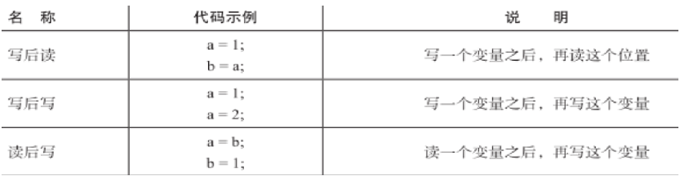

#### **<font style="color:#008000;">volatile的底层实现是通过内存屏障，2次复习</font>**
volatile有关的禁止指令重排的行为


当第一个操作为volatile<font style="color:#ff0000;">读时</font>，不论第二个操作是什么，都不能重排序。这个操作保证了volatile读之后的操作不会被重排到volatile读之前。

当第二个操作为volatile<font style="color:#ff0000;">写时</font>，不论第一个操作是什么，都不能重排序。这个操作保证了volatile写之前的操作不会被重排到volatile写之后。

当第一个操作为volatile写时，第二个操作为volatile读时，不能重排。

##### 四大屏障的插入情况
+ 在每一个volatile写操作前面插入一个StoreStore屏障
    - StoreStore屏障可以保证在volatile写之前，其前面的所有普通写操作都已经刷新到主内存中。
+ 在每一个volatile写操作后面插入一个StoreLoad屏障
    - StoreLoad屏障的作用是避免volatile写与后面可能有的volatile读/写操作重排序
+ 在每一个volatile读操作后面插入一个LoadLoad屏障

	

    - LoadLoad屏障用来禁止处理器把上面的volatile读与下面的普通读重排序。
+ 在每一个volatile读操作后面插入一个LoadStore屏障
    - LoadStore屏障用来禁止处理器把上面的volatile读与下面的普通写重排序。

##### 代码说明
```java
public class VolatileTest {
    int i = 0;
    volatile boolean flag = false;
    public void write(){
        i = 2;
        flag = true;
    }
    public void read(){
        if(flag){
            System.out.println("---i = " + i);
        }
    }
}
```

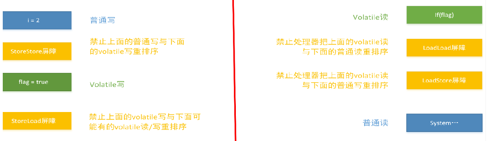

### 如何正确使用volatile
#### 单一赋值可以，but含复合运算赋值不可以(i++之类)
```java
volatile int a = 10
volatile boolean flag = false
```

#### 状态标志，判断业务是否结束
```java
package com.atguigu.juc.prepare;

import java.util.concurrent.TimeUnit;

/**
 * @auther zzyy
 * @create 2020-04-14 18:11
 *
 * 使用：作为一个布尔状态标志，用于指示发生了一个重要的一次性事件，例如完成初始化或任务结束
 * 理由：状态标志并不依赖于程序内任何其他状态，且通常只有一种状态转换
 * 例子：判断业务是否结束
 */
public class UseVolatileDemo
{
    private volatile static boolean flag = true;

    public static void main(String[] args)
    {
        new Thread(() -> {
            while(flag) {
                //do something......
            }
        },"t1").start();

        //暂停几秒钟线程
        try { TimeUnit.SECONDS.sleep(2L); } catch (InterruptedException e) { e.printStackTrace(); }

        new Thread(() -> {
            flag = false;
        },"t2").start();
    }
}
 
 

```

#### 开销较低的读，写锁策略
```java
 
public class UseVolatileDemo {
    /**
     * 使用：当读远多于写，结合使用内部锁和 volatile 变量来减少同步的开销
     * 理由：利用volatile保证读取操作的可见性；利用synchronized保证复合操作的原子性
     */
    public class Counter {
        private volatile int value;

        public int getValue() {
            return value;   //利用volatile保证读取操作的可见性
        }
        
        public synchronized int increment() {
            return value++; //利用synchronized保证复合操作的原子性
        }
    }
}
 
```

#### DCL双端锁的发布
##### 问题
```java
package com.atguigu.itdachang;

/**
 * @auther zzyy
 * @create 2020-07-13 15:14
 */
public class SafeDoubleCheckSingleton
{
    private static SafeDoubleCheckSingleton singleton;
    //私有化构造方法
    private SafeDoubleCheckSingleton(){
    }
    
    //双重锁设计
    public static SafeDoubleCheckSingleton getInstance(){
        if (singleton == null){
            //1.多线程并发创建对象时，会通过加锁保证只有一个线程能创建对象
            synchronized (SafeDoubleCheckSingleton.class){
                if (singleton == null){
                    //隐患：多线程环境下，由于重排序，该对象可能还未完成初始化就被其他线程读取
                    singleton = new SafeDoubleCheckSingleton();
                }
            }
        }
        //2.对象创建完毕，执行getInstance()将不需要获取锁，直接返回创建对象
        return singleton;
    }
}
 
 

```

**单线程看问题代码**

<font style="color:#0000ff;">单线程环境下</font>(或者说正常情况下)，在"问题代码处"，会执行如下操作，保证能获取到已完成初始化的实例

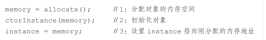

由于存在指令重排序......

**多线程看问题代码**

隐患：<font style="color:#0000ff;">多线程环境下，</font>在"问题代码处"，会执行如下操作，由于重排序导致2,3乱序，后果就是其他线程得到的是null而不是完成初始化的对象

right

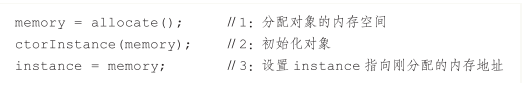

problem

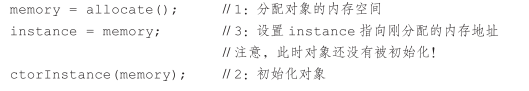

##### 解决01
加volatile修饰

```java
package com.atguigu.itdachang;

/**
 * @auther zzyy
 * @create 2020-07-13 15:14
 */
public class SafeDoubleCheckSingleton
{
    //通过volatile声明，实现线程安全的延迟初始化。
    private volatile static SafeDoubleCheckSingleton singleton;
    //私有化构造方法
    private SafeDoubleCheckSingleton(){
    }
    //双重锁设计
    public static SafeDoubleCheckSingleton getInstance(){
        if (singleton == null){
            //1.多线程并发创建对象时，会通过加锁保证只有一个线程能创建对象
            synchronized (SafeDoubleCheckSingleton.class){
                if (singleton == null){
                    //隐患：多线程环境下，由于重排序，该对象可能还未完成初始化就被其他线程读取
                                      //原理:利用volatile，禁止 "初始化对象"(2) 和 "设置singleton指向内存空间"(3) 的重排序
                    singleton = new SafeDoubleCheckSingleton();
                }
            }
        }
        //2.对象创建完毕，执行getInstance()将不需要获取锁，直接返回创建对象
        return singleton;
    }
}
 
 

```

面试题，反周志明老师的案例，你还有不加volatile的方法吗

##### 解决02
采用静态内部类的方式实现

```java
 
 
//现在比较好的做法就是采用静态内部内的方式实现
 
public class SingletonDemo
{
    private SingletonDemo() { }

    private static class SingletonDemoHandler
    {
        private static SingletonDemo instance = new SingletonDemo();
    }

    public static SingletonDemo getInstance()
    {
        return SingletonDemoHandler.instance;
    }
}
 

```

### 最后的小总结
#### 内存屏障是什么


#### 内存屏障能干嘛
+ 阻止屏障两边的指令重排序
+ 写数据时加入屏障，强制将线程私有工作内存的数据刷回主物理内存
+ 读数据时加入屏障，线程私有工作内存的数据失效，重新到主物理内存中获取最新数据

#### 内存屏障四大指令
+ 在每一个volatile写操作前面插入一个StoreStore屏障

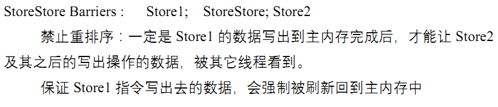

+ <font style="color:#ff0000;">在每一个volatile写操作后面插入一个StoreLoad屏障</font>

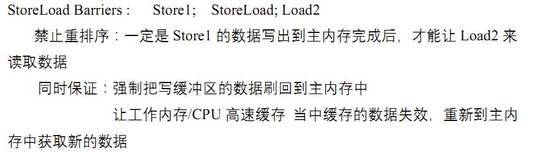

+ 在每一个volatile读操作后面插入一个LoadLoad屏障

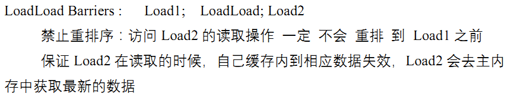

+ 在每一个volatile读操作后面插入一个LoadStore屏障


#### 凭什么我们java写了一个volatile关键字，系统底层加入内存屏障？两者关系怎么勾搭上的?
##### 字节码层面
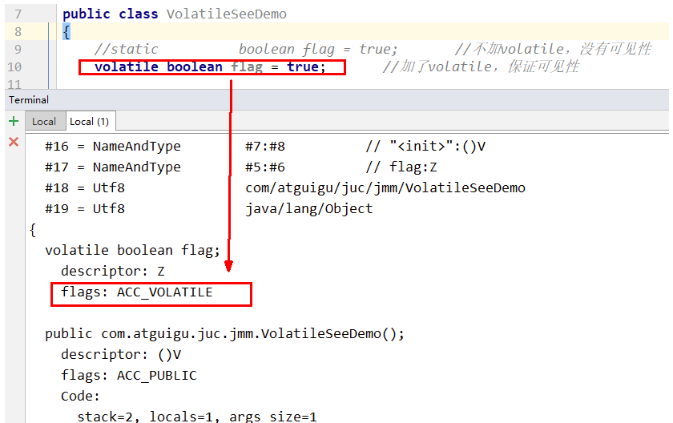

##### 关键字
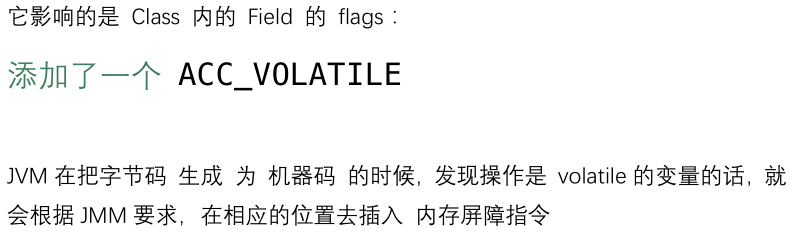

### volatile可见性
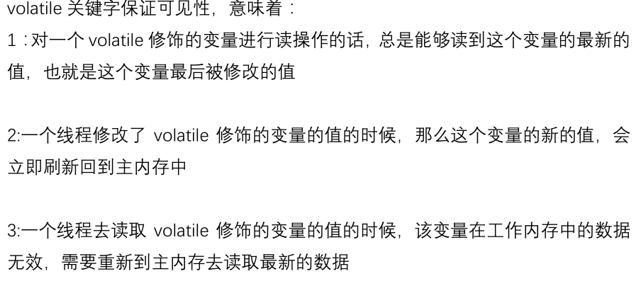

### volatile禁重排
#### 写指令
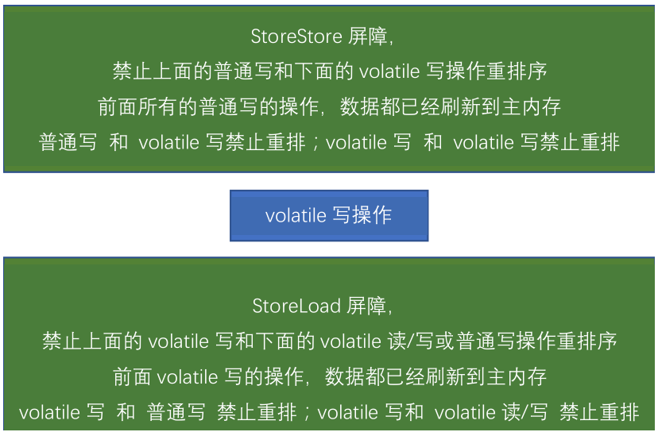

#### 读指令
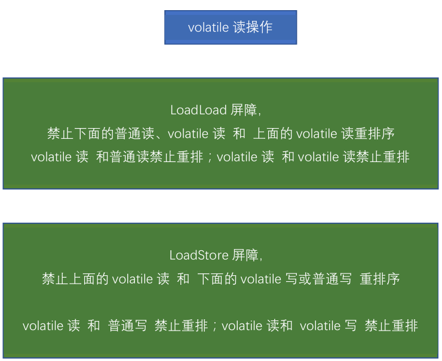

### 对比java.util.concurrent.locks.Lock来理解
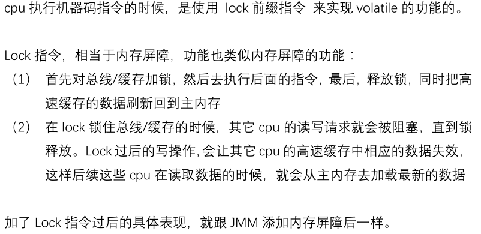

### 一句话总结
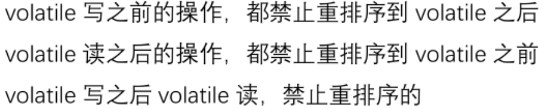


> 更新: 2024-01-25 20:53:28  
原文: [https://www.yuque.com/vip6688/neho4x/ooeziluiltt832t7](https://www.yuque.com/vip6688/neho4x/ooeziluiltt832t7)
>


> 更新: 2024-11-25 09:18:27  
> 原文: <https://www.yuque.com/neumx/laxg2e/19e685d5ede599a2181dd366c53c93f1>