# 8、调优篇

# 8、调优篇
> + <font style="color:#000000;">JVM调优调的哪些参数？在哪里写这些参数？ （亚信） </font>
>

> + <font style="color:#000000;"> 说到内存泄漏，问有没有碰到，内存泄漏怎么解决？（拼多多） </font>
>

> + <font style="color:#000000;"> 常用的性能优化方式有哪些？（百度金融） </font>
>

> + <font style="color:#000000;"> 内存泄漏是怎么造成的？（拼多多、字节跳动） </font>
>

> + <font style="color:#000000;"> 虚拟机如何调优？（顺丰） </font>
>

> + <font style="color:#000000;"> 内存调优怎么调？有几种方式？参数都有什么？（顺丰） </font>
>

> + <font style="color:#000000;"> 栈溢出导致的原因？如何解决？（搜狐） </font>
>

> + <font style="color:#000000;"> JVM调优策略 （杭州鲁尔物联科技有限公司、燕梭金融、汇博云通） </font>
>

> + <font style="color:#000000;"> JVM调优调的哪些参数？问这样有什么好处？在哪里写这些参数（浪潮） </font>
>

> + <font style="color:#000000;"> 几种常用的内存调试工具你知道哪些？（搜狐） </font>
>

> + <font style="color:#000000;"> 如何优化减少Full GC？（阿里-闲鱼） </font>
>

> + <font style="color:#000000;"> 当出现了内存溢出，你怎么排错。 (京东) </font>
>

> + <font style="color:#000000;"> 有实际的JVM性能调优案例吗？重点需要关注哪些核心参数？ (滴滴) </font>
>

> + <font style="color:#000000;"> OOM说一下？怎么排查？哪些会导致OOM? OOM出现在什么时候 (腾讯) </font>
>

> + <font style="color:#000000;"> 内存泄漏与内存溢出的区别 (字节跳动) </font>
>

> + <font style="color:#000000;"> Java存在内存溢出的现象吗(字节跳动) </font>
>

> + <font style="color:#000000;"> Java中会存在内存泄漏吗，请简单描述。  (美团) </font>
>

> + <font style="color:#000000;"> JVM性能调优都做了什么？(支付宝) </font>
>

> + <font style="color:#000000;"> 有做过JVM内存优化吗？ (小米) </font>
>

> + <font style="color:#000000;"> 从SQL、JVM、架构、数据库四个方面讲讲优化思路 (小米) </font>
>

> + <font style="color:#000000;"> JVM的编译优化 (蚂蚁金服) </font>
>

> + <font style="color:#000000;"> JVM性能调优都做了什么 (蚂蚁金服) </font>
>

> + <font style="color:#000000;"> JVM诊断调优工具用过哪些？ (蚂蚁金服) </font>
>

> + <font style="color:#000000;"> JVM怎样调优，堆内存栈空间设置多少合适.. (蚂蚁金服) </font>
>

> + <font style="color:#000000;"> JVM相关的分析工具使用过的有哪些？具体的性能调优步骤如何 (蚂蚁金服) </font>
>

> + <font style="color:#000000;"> 如何进行JVM调优？有哪些方法？ (阿里) </font>
>

> + <font style="color:#000000;"> 如何理解内存泄漏问题？有哪些情况会导致内存泄露？如何解决？ (阿里) </font>
>

> + <font style="color:#000000;"> JVM如何调优、参数怎么调？ (字节跳动) </font>
>

> + <font style="color:#000000;"> 从SQL、JVM、架构、数据库四个方面讲讲优化思路 (拼多多) </font>
>

> + <font style="color:#000000;"> JVM诊断调优工具用过哪些？ (京东) </font>
>

> + <font style="color:#000000;"> 每秒几十万并发的秒杀系统为什么会频繁发生GC？ (京东) </font>
>

> + <font style="color:#000000;"> 日均百万级交易系统如何优化JVM？ (京东) </font>
>

> + <font style="color:#000000;"> 线上生产系统OOM如何监控及定位与解决？ (京东) </font>
>

> + <font style="color:#000000;"> 高并发系统如何基于G1垃圾回收器优化性能？ (京东) </font>
>


# <font style="color:#1e1e1e;">1. 概述</font>
## <font style="color:#1e1e1e;">1.1 面试题</font>
<font style="color:#000000;">讲讲你理解的性能评价及测试指标？（瓜子） </font>

## <font style="color:#112b21;">1.2 生产环境中的问题</font>
+ <font style="color:#141414;">生产环境发生了内存溢出该如何处理？</font>
+ <font style="color:#141414;">生产环境应该给服务器分配多少内存合适？</font>
+ <font style="color:#141414;">如何对垃圾回收器的性能进行调优？</font>
+ <font style="color:#141414;">生产环境CPU负载飙高该如何处理？</font>
+ <font style="color:#141414;">生产环境应该给应用分配少线程合适？</font>
+ <font style="color:#141414;">不加log，如何确定请求是否执行了某一行代码？</font>
+ <font style="color:#141414;">不加log，如何实时查看某个方法的入参与返回值？</font>

## <font style="color:#112b21;">1.3 调优基本问题</font>
1. <font style="color:#141414;">为什么要调优？</font>
    1. <font style="color:#141414;">防止出现OOM，进行JVM规划和预调优</font>
    2. <font style="color:#141414;">解决程序运行中各种OOM</font>
    3. <font style="color:#141414;">减少Full GC出现的频率，解决运行慢、卡顿问题</font>
2. <font style="color:#141414;">调优的大方向</font>
    1. <font style="color:#141414;">合理地编写代码</font>
    2. <font style="color:#141414;">充分并合理的使用硬件资源</font>
    3. <font style="color:#141414;">合理地进行JVM调优</font>
3. <font style="color:#141414;">不同阶段的考虑</font>
    1. <font style="color:#141414;">上线前</font>
    2. <font style="color:#141414;">项目运行阶段</font>
    3. <font style="color:#141414;">线上出现OOM</font>
4. <font style="color:#141414;">两句话</font>
    1. <font style="color:#000000;">调优，从业务场景开始，没有业务场景的调优都是耍流氓！</font>
    2. <font style="color:#ff0000;">无监控，不调优！</font>

## <font style="color:#112b21;">1.4 调优监控的依据</font>
1. <font style="color:#141414;">运行日志</font>
2. <font style="color:#141414;">异常堆栈</font>
3. <font style="color:#141414;">GC日志</font>
4. <font style="color:#141414;">线程快照</font>
5. <font style="color:#141414;">堆转储快照</font>

## <font style="color:#112b21;">1.5 性能优化的步骤</font>
### <font style="color:#141414;">第1步：熟悉业务场景</font>
### <font style="color:#141414;">第2步（发现问题）：性能监控</font>
<font style="color:#000000;">一种以非强行或者入侵方式</font>**<font style="color:#0000ff;">收集或查看</font>**<font style="color:#000000;">应用运营性能数据的活动。 </font>

<font style="color:#000000;">监控通常是指一种在生产、质量评估或者开发环境下实施的带有</font>**<font style="color:#0000ff;">预防或主动性</font>**<font style="color:#000000;">的活动。 </font>

<font style="color:#000000;">当应用相关干系人提出性能问题却</font>**<font style="color:#0000ff;">没有提供足够多的线索</font>**<font style="color:#000000;">时，首先我们需要进行性能监控，随后是性能分析。 </font>

<font style="color:#000000;">监控前，设置好回收器组合，选定CPU（主频越高越好），设置年代比例，设置日志参数（生产环境中通常不会只设置一个日志文件）。比如：</font>`<font style="color:#000000;">-Xloggc:/opt/xxx/logs/xxx-xxx-gc-%t.log -XX:+UseGCLogFileRotation -XX:NumberOfGCLogFiles=5 -XX:GCLogFileSize=20M -XX:+PrintGCDetails -XX:+PrintGCDateStamps -XX:+PrintGCCause</font>`<font style="color:#000000;"> </font>

+ <font style="color:#141414;">GC 频繁</font>
+ <font style="color:#141414;">cpu load过高</font>
+ <font style="color:#141414;">OOM</font>
+ <font style="color:#141414;">内存泄漏</font>
+ <font style="color:#141414;">死锁</font>
+ <font style="color:#141414;">程序响应时间较长</font>

### <font style="color:#141414;">第3步（排查问题）：性能分析</font>
<font style="color:#000000;">一种以</font>**<font style="color:#000000;">侵入方式</font>**<font style="color:#000000;">收集运行性能数据的活动，它会影响应用的呑吐量或响应性。  </font>

<font style="color:#000000;">性能分析是针对性能问题的答复结果，关注的范围通常比性能监控更加集中。 </font>

<font style="color:#000000;">性能分析很少在生产环境下进行，通常是在质量评估、</font>**<font style="color:#000000;">系统测试或者开发环境下进行</font>**<font style="color:#000000;">，是性能监控之后的步骤。</font>

+ <font style="color:#141414;">打印GC日志，通过GCviewer或者</font>[<font style="color:#000000;">http://gceasy.io来分析日志信息</font>](http://gceasy.xn--io-403c94fkt1ad0as3zz3cdl)
+ <font style="color:#141414;">灵活运用命令行工具，jstack，jmap，jinfo等</font>
+ <font style="color:#141414;">dump出堆文件，使用内存分析工具分析文件</font>
    - <font style="color:#000000;">jconsole/ jvisualvm / jprofiler / MAT</font>
+ <font style="color:#141414;">使用阿里Arthas，或jconsole，JVisualVM来实时查看JVM状态</font>
+ <font style="color:#141414;">jstack查看堆栈信息</font>

### <font style="color:#141414;">第4步（解决问题）：性能调优</font>
<font style="color:#000000;">一种为改善应用响应性或呑吐量而更改参数、源代码、属性配置的活动，性能调优是在性能监控、性能分析之后的活动。 </font>

+ <font style="color:#141414;">适当增加内存，根据业务背景选择垃圾回收器</font>
+ <font style="color:#141414;">优化代码，控制内存使用</font>
+ <font style="color:#141414;">增加机器，分散节点压力</font>
+ <font style="color:#141414;">合理设置线程池线程数量</font>
+ <font style="color:#141414;">使用中间件提高程序效率，比如缓存，消息队列等</font>

### <font style="color:#141414;">举例：</font>
1. 设置必要的内存参数。比如： -Xms200m -Xmx200m -XX:+PrintGC 等
2. 程序运行过程中，专业运维（网管）团队根据相关网络监控工具，发现相关服务器CPU或内存报警信息
3. top命令观察到问题：内存不断增长，CPU占用率居高不下的进程。

> top 查看所有的进程的cpu、内存占比。  
top -Hp pid 查看指定pid下各个线程的cpu、内存占比。关注谁比较高（有可能是gc的线程）
>

4. jps定位具体java进程

> 进一步可以使用jstack pid 对进程中的各个线程查看。尤其对WAITING的多个线程要关注。
>

5. jinfo pid
6. jstat -gc 动态观察gc情况 / 阅读GC日志发现频繁GC / arthas观察 / jconsole  
jstat -gc pid 500 : 每隔500毫秒打印GC的情况
7. jmap -histo pid | head -20 查找有多少对象产生
8. jmap -dump:format=b,file=xxx pid / jmap -histo
9. 修改参数： -Xms20m -Xmx20m -XX:+UseParallelGC -XX:+HeapDumpOnOutOfMemoryError
10. 使用MAT / jhat 进行dump文件分析
11. 找到代码的问题    (没那么简单)

## <font style="color:#112b21;">1.6 性能评价/测试指标</font>
### <font style="color:#ff0000;">1. 停顿时间（或响应时间）</font>
<font style="color:#000000;">提交请求和返回该请求的响应之间使用的时间，一般比较关注平均响应时间</font><font style="color:#000000;"> </font>

<font style="color:#000000;">常用操作的响应时间列表：  </font>

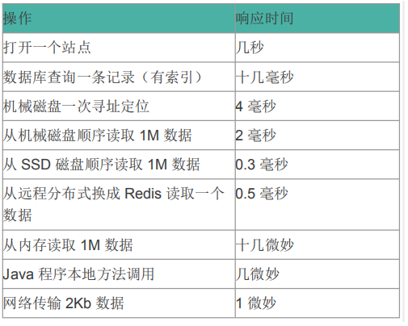

<font style="color:#000000;">在垃圾回收环节中：</font><font style="color:#000000;"> </font>

<font style="color:#000000;">暂停时间：</font><font style="color:#fb0007;">执行垃圾收集时，程序的工作线程被暂停的时间。</font><font style="color:#fb0007;"> </font>

<font style="color:#000000;">-XX:MaxGCPauseMillis</font><font style="color:#000000;"> </font>

### <font style="color:#ff0000;">2. 吞吐量</font>
<font style="color:#000000;">对单位时间内完成的工作量(请求)的量度</font>

<font style="color:#000000;">在</font><font style="color:#000000;">GC</font><font style="color:#000000;">中：运行用户代码的时间占总运行时间的比例（总运行时间：程序的运行时间＋内存回收的时间）</font>

<font style="color:#ff0000;">吞吐量为1 -1/(1+n)。-XX:GCTimeRatio=n</font>

### <font style="color:#141414;">3</font>. <font style="color:#141414;">并发数</font>
<font style="color:#000000;">同一时刻，对服务器有实际交互的请求数</font>

<font style="color:#000000;">1000个人同时在线，估计并发数在5% -15%之间，也就是同时并发量：50 - 150之间。 </font>

### <font style="color:#141414;">4</font><font style="color:#000000;">. </font><font style="color:#141414;">内存占用</font>
<font style="color:#000000;">Java 堆区所占的内存大小</font>

### <font style="color:#141414;">5</font><font style="color:#000000;">. </font><font style="color:#141414;">相互间的关系</font>
<font style="color:#141414;">以高速公路通行状况为例</font>

<font style="color:#000000;">吞吐量：</font><font style="color:#000000;"> </font>

<font style="color:#000000;">每天通过高速公路收费站的车辆的数据（也可以理解为收费站收取的高速费） </font>

<font style="color:#000000;">并发数：高速公路上正在行驶的车辆的数目 </font>

<font style="color:#000000;">响应时间：车速</font><font style="color:#000000;"> </font>

# <font style="color:#0f252d;">2. OOM案例</font>
## 2.1 面试题
+ <font style="color:#000000;">说到内存泄漏，问有没有碰到，内存泄漏怎么解决？（拼多多）</font><font style="color:#000000;"> </font>
+ <font style="color:#000000;">内存泄漏是怎么造成的？（拼多多、字节跳动）</font><font style="color:#000000;"> </font>
+ <font style="color:#000000;">如何理解内存泄漏问题？有哪些情况会导致内存泄露？如何解决？ (阿里) </font>

## <font style="color:#112b21;">2.2 OOM案例1：堆溢出</font>
### <font style="color:#141414;">2.2.1 报错信息</font>
<font style="color:#141414;">java.lang.OutOfMemoryError: Java heap space</font>

### <font style="color:#141414;">2.2.2 案例模拟</font>
模拟线上环境产生OOM，代码如下： 

```java
 /** 
 * 模拟线上环境OOM 
 */ 
@RequestMapping("/add") 
public void addObject(){ 
    ArrayList<People> people = new ArrayList<>(); 
    while (true){ 
        people.add(new People()); 
    } 
} 
  
@Data 
public class People { 
    private String name; 
    private Integer age; 
    private String job; 
    private String sex; 
} 
 
```

### <font style="color:#141414;">2.2.3 发送请求</font>
[<font style="color:#141414;">http://localhost:8080/add</font>](http://localhost:8080/add)

### <font style="color:#141414;">2.2.4 JVM参数配置</font>
<font style="color:#000000;">参数配置：</font>`<font style="color:#000000;">初始-Xms30M  -Xmx30M </font>`

+ `-XX:+PrintGCDetails`：开启详细GC信息打印。当执行垃圾回收时，JVM会在控制台输出详细的垃圾收集日志，包括GC的类型（如 minor GC 或 full GC）、耗时、新生代和老年代的空间使用情况等。 
+ `-XX:MetaspaceSize=64m`：设置元空间（Metaspace）的初始大小为64MB。元空间存储的是类的元数据信息，如类名、字段描述符、方法数据等。 
+ `-XX:+HeapDumpOnOutOfMemoryError`：当JVM因为内存溢出（OutOfMemoryError）而退出时，会生成堆转储文件（heap dump），便于分析内存泄漏等问题。 
+ `-XX:HeapDumpPath=heap/heapdump.hprof`：指定堆转储文件的生成路径及文件名。在发生内存溢出异常时，堆转储文件会被保存到指定路径下。 
+ `-XX:+PrintGCDateStamps`：在GC日志中添加时间戳，方便查看GC操作的时间点。 
+ `-Xms200M`：设置JVM初始堆内存大小为200MB。即Java程序启动时分配给堆的最小内存。 
+ `-Xmx200M`：设置JVM最大堆内存大小为200MB。即Java程序运行过程中可以使用的最大堆内存。 
+ `-Xloggc:log/gc-oomHeap.log`：将GC日志输出到指定文件，而不是默认的控制台。这样可以在`log/gc-oomHeap.log`文件中查看GC的相关信息。

### <font style="color:#141414;">2.2.5 </font><font style="color:#000000;">运行结果 </font>
```java
java.lang.OutOfMemoryError: Java heap space 
at java.util.Arrays.copyOf(Arrays.java:3210) ~[na:1.8.0_131]
at java.util.Arrays.copyOf(Arrays.java:3181) ~[na:1.8.0_131]
at java.util.ArrayList.grow(ArrayList.java:261) ~[na:1.8.0_131]
at java.util.ArrayList.ensureExplicitCapacity(ArrayList.java:235) ~[na:1.8.0_131]
at java.util.ArrayList.ensureCapacityInternal(ArrayList.java:227) ~[na:1.8.0_131]
```

<font style="color:#000000;">运行程序得到 heapdump.hprof 文件。如下图所示： </font>

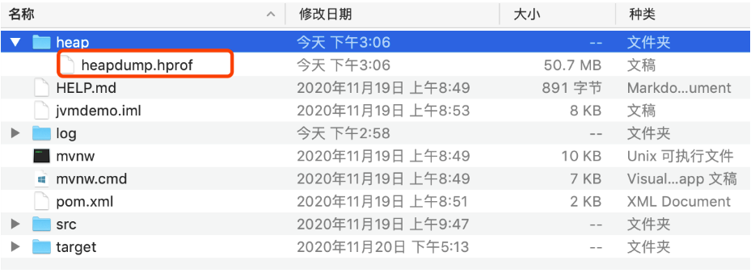

<font style="color:#000000;">还可以进一步分析log日志。见生成的log日志即可。 </font>

### <font style="color:#000000;">2.2.6 原因及解决方案</font>
+ **原因**

<font style="color:#000000;">1、代码中可能存在大对象分配</font><font style="color:#000000;"> </font>

<font style="color:#000000;">2、可能存在内存泄漏，导致在多次GC之后，还是无法找到一块足够大的内存容纳当前对象。</font>

+ **解决方法**

<font style="color:#000000;">1、检查是否存在大对象的分配，最有可能的是大数组分配</font><font style="color:#000000;"> </font>

<font style="color:#000000;">2、通过jmap命令，把堆内存dump下来，使用MAT等工具分析一下，检查是否存在内存泄漏的问题</font>

<font style="color:#000000;">3、如果没有找到明显的内存泄漏，使用 -Xmx 加大堆内存</font><font style="color:#000000;"> </font>

<font style="color:#000000;">4、还有一点容易被忽略，检查是否有大量的自定义的 Finalizable 对象，也有可能是框架内部提供的，考虑其存在的必要性</font>

### <font style="color:#141414;">2.2.7 dump文件分析</font>
<font style="color:#141414;">jvisualvm分析</font>

+ <font style="color:#141414;">接下来我们使用工具打开该文件，由于我们当前设置的内存比较小，所以该文件比较小，但是正常在线上环境，该文件是比较大的，通常是以G为单位。</font>
+ <font style="color:#141414;">jvisualvm工具分析堆内存文件heapdump.hprof：</font>

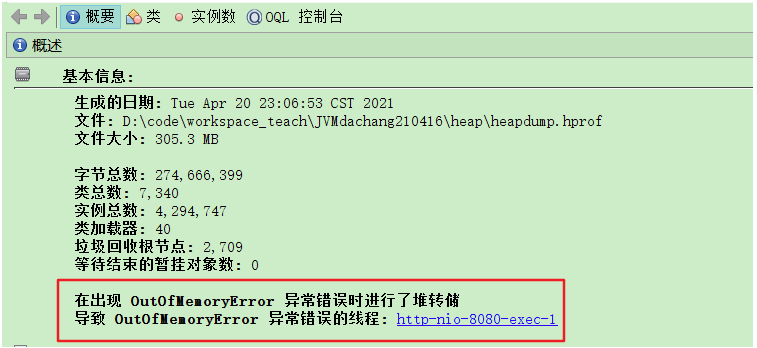

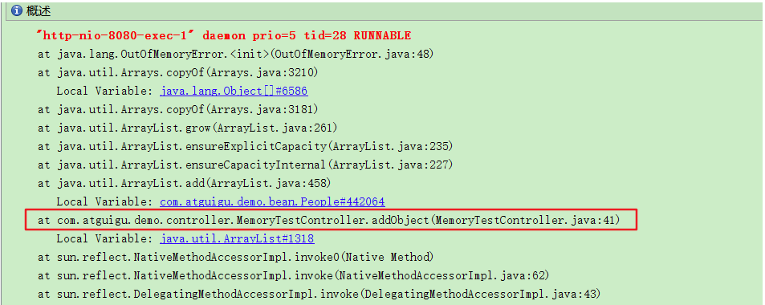

+ 通过jvisualvm工具查看，占用最多实例的类是哪个，这样就可以定位到我们的问题所在。

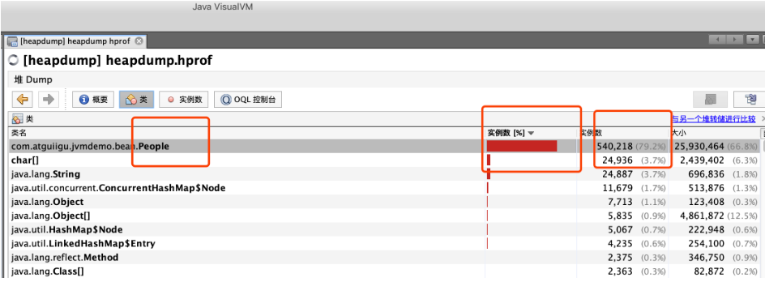

### <font style="color:#141414;">2.2.8 MAT分析</font>
+ <font style="color:#141414;">使用MAT工具查看，能找到对应的线程及相应线程中对应实例的位置和代码：</font>

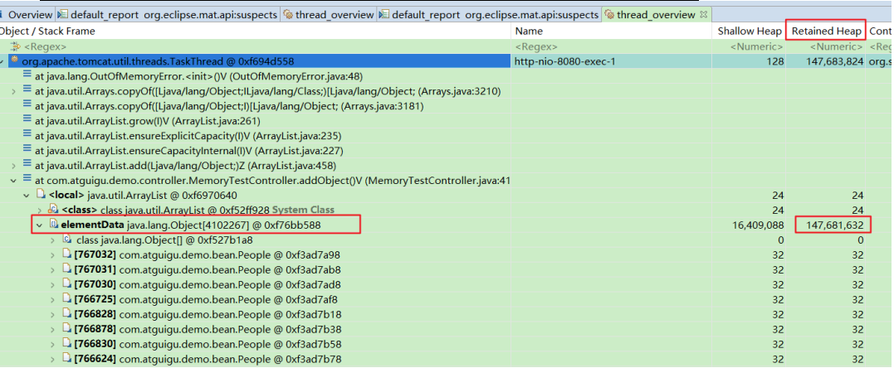

### <font style="color:#141414;">2.2.9 gc日志分析</font>
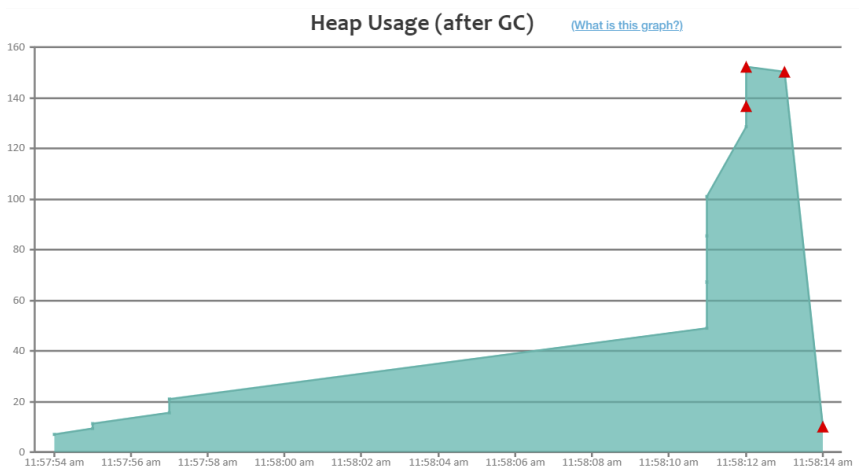

## <font style="color:#112b21;">2.3 OOM案例2：元空间溢出</font>
### <font style="color:#141414;">2.3.1 元空间存储数据类型</font>
方法区（Method Area）与 Java 堆一样，是各个线程共享的内存区域，它用于存储已被虚拟机加载的类信息、常量、即时编译器编译后的代码等数据。虽然Java 虚拟机规范把方法区描述为堆的一个逻辑部分，但是它却有一个别名叫做 Non-Heap（非堆），目的应该是与 Java 堆区分开来。

<font style="color:#141414;">Java 虚拟机规范对方法区的限制非常宽松，除了和 Java 堆一样不需要连续的内存和可以选择固定大小或者可扩展外，还可以选择不实现垃圾收集。垃圾收集行为在这个区域是比较少出现的，其</font><font style="color:#ff0000;">内存回收目标主要是针对常量池的回收和对类型的卸载。</font><font style="color:#141414;">当方法区无法满足内存分配需求时，将抛出 OutOfMemoryError 异常。</font>

### <font style="color:#141414;">2.3.2 报错信息</font>
<font style="color:#141414;">java.lang.OutOfMemoryError: Metaspace</font>

### <font style="color:#141414;">2.3.3 案例模拟</font>
+ <font style="color:#141414;">示例代码</font>

```java
/**
 * 案例2:模拟元空间OOM溢出
 */
@RequestMapping("/metaSpaceOom")
public void metaSpaceOom(){
    ClassLoadingMXBean classLoadingMXBean = ManagementFactory.getClassLoadingMXBean();
    while (true){
        Enhancer enhancer = new Enhancer();
        enhancer.setSuperclass(People.class);
        enhancer.setUseCache(false);
        enhancer.setCallback((MethodInterceptor) (o, method, objects, methodProxy) -> {
            System.out.println("我是加强类哦，输出print之前的加强方法");
            return methodProxy.invokeSuper(o,objects);
        });
        People people = (People)enhancer.create();
        people.print();
        System.out.println(people.getClass());
        System.out.println("totalClass:" + classLoadingMXBean.getTotalLoadedClassCount());
        System.out.println("activeClass:" + classLoadingMXBean.getLoadedClassCount());
        System.out.println("unloadedClass:" + classLoadingMXBean.getUnloadedClassCount());
    }
}
 
 
public class People {
    public void print(){
       System.out.println("我是print本人");
    }
}
```

+ <font style="color:#141414;">发送请求</font>

[<font style="color:#141414;">http://localhost:8080/metaSpaceOom</font>](http://localhost:8080/metaSpaceOom)

+ <font style="color:#141414;">运行结果</font>

```java
我是加强类哦，输出print之前的加强方法
我是print本人
class com.atguiigu.jvmdemo.bean.People$$EnhancerByCGLIB$$6ef22046_10
totalClass:934
activeClass:934
unloadedClass:0
Caused by: java.lang.OutOfMemoryError: Metaspace
at java.lang.ClassLoader.defineClass1(Native Method)
at java.lang.ClassLoader.defineClass(ClassLoader.java:763)
at sun.reflect.GeneratedMethodAccessor1.invoke(Unknown Source)
```

### <font style="color:#141414;">2.3.4 JVM参数配置</font>
+ `-XX:+PrintGCDetails`：开启详细GC信息打印，与之前解释的一致。 
+ `-XX:MetaspaceSize=60m`：设置元空间（Metaspace）的初始大小为60MB。 
+ `-XX:MaxMetaspaceSize=60m`：设置元空间的最大大小也为60MB，这意味着一旦元空间使用达到60MB，将会触发元空间的完整垃圾回收（如果无法回收足够的空间，则抛出OOM异常）。 
+ `-Xss512K`：设置每个线程的栈（Stack）大小为512KB。线程栈存储方法调用时的局部变量和操作数栈等信息。 
+ `-XX:+HeapDumpOnOutOfMemoryError`：当发生内存溢出错误时，生成堆转储文件。 
+ `-XX:HeapDumpPath=heap/heapdumpMeta.hprof`：指定堆转储文件在发生内存溢出时的保存路径及文件名。 
+ `-XX:SurvivorRatio=8`：设置新生代中Eden区与Survivor区的比例为8:1。例如，如果有10个分区，那么8个会分配给Eden区，剩下的两个作为Survivor区。 
+ `-XX:+TraceClassLoading`：跟踪并输出类加载信息，包括何时加载了哪个类。 
+ `-XX:+TraceClassUnloading`：跟踪并输出类卸载信息，即何时卸载了哪个类。 
+ `-XX:+PrintGCDateStamps`：在GC日志中添加时间戳。 
+ `-Xms60M` 和 `-Xmx60M`：将JVM的初始堆内存大小和最大堆内存大小都设置为60MB。 
+ `-Xloggc:log/gc-oomMeta.log`：将GC日志输出到指定的文件中，以便查看GC活动的相关信息。

### <font style="color:#141414;">2.3.5 原因及解决方案</font>
JDK8后，元空间替换了永久代，元空间使用的是本地内存

+ <font style="color:#141414;">原因：</font>
    1. <font style="color:#141414;">运行期间生成了大量的代理类，导致方法区被撑爆，无法卸载</font>
    2. <font style="color:#141414;">应用长时间运行，没有重启</font>
    3. <font style="color:#141414;">元空间内存设置过小</font>
+ <font style="color:#141414;">解决方法：</font>

<font style="color:#141414;">因为该 OOM 原因比较简单，解决方法有如下几种：</font>

```plain
1. <font style="color:#141414;">检查是否永久代空间或者元空间设置的过小</font>

2. <font style="color:#141414;">检查代码中是否存在大量的反射操作</font>

3. <font style="color:#141414;">dump之后通过mat检查是否存在大量由于反射生成的代理类</font>
```

### <font style="color:#141414;">2.3.6 分析及解决</font>
+ <font style="color:#141414;">查看监控</font>

metatspace几乎已经被全部占用。


+ <font style="color:#141414;">查看GC状态</font>

可以看到，FullGC 非常频繁，而且我们的方法区，占用了59190KB/1024 = 57.8M空间，几乎把整个方法区空间占用，所以得出的结论是方法区空间设置过小，或者存在大量由于反射生成的代理类。

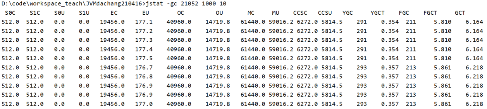

+ <font style="color:#141414;">查看GC日志</font>

可以看到FullGC是由于方法区空间不足引起的，那么我们接下来分析到底是什么数据占用了大量的方法区。

```systemverilog
2021-04-21T00:04:09.052+0800: 109.779: [GC (Metadata GC Threshold) [PSYoungGen: 174K->32K(19968K)] 14926K->14784K(60928K), 0.0013218 secs] [Times: user=0.00 sys=0.00, real=0.00 secs] 
2021-04-21T00:04:09.054+0800: 109.780: [Full GC (Metadata GC Threshold) [PSYoungGen: 32K->0K(19968K)] [ParOldGen: 14752K->14752K(40960K)] 14784K->14752K(60928K), [Metaspace: 58691K->58691K(1103872K)], 0.0274454 secs] [Times: user=0.17 sys=0.00, real=0.03 secs] 
2021-04-21T00:04:09.081+0800: 109.808: [GC (Last ditch collection) [PSYoungGen: 0K->0K(19968K)] 14752K->14752K(60928K), 0.0009630 secs] [Times: user=0.00 sys=0.00, real=0.00 secs] 
2021-04-21T00:04:09.082+0800: 109.809: [Full GC (Last ditch collection) [PSYoungGen: 0K->0K(19968K)] [ParOldGen: 14752K->14752K(40960K)] 14752K->14752K(60928K), [Metaspace: 58691K->58691K(1103872K)], 0.0301540 secs] [Times: user=0.17 sys=0.00, real=0.03 secs] 
2021-04-21T00:04:22.476+0800: 123.202: [GC (Metadata GC Threshold) [PSYoungGen: 3683K->384K(19968K)] 18435K->15144K(60928K), 0.0015294 secs] [Times: user=0.00 sys=0.00, real=0.00 secs] 
2021-04-21T00:04:22.477+0800: 123.203: [Full GC (Metadata GC Threshold) [PSYoungGen: 384K->0K(19968K)] [ParOldGen: 14760K->14896K(40960K)] 15144K->14896K(60928K), [Metaspace: 58761K->58761K(1103872K)], 0.0299402 secs] [Times: user=0.16 sys=0.02, real=0.03 secs] 
2021-04-21T00:04:22.508+0800: 123.233: [GC (Last ditch collection) [PSYoungGen: 0K->0K(19968K)] 14896K->14896K(60928K), 0.0016583 secs] [Times: user=0.00 sys=0.00, real=0.00 secs] 
2021-04-21T00:04:22.509+0800: 123.235: [Full GC (Last ditch collection) [PSYoungGen: 0K->0K(19968K)] [ParOldGen: 14896K->14751K(40960K)] 14896K->14751K(60928K), [Metaspace: 58761K->58692K(1103872K)], 0.0333369 secs] [Times: user=0.22 sys=0.02, real=0.03 secs] 
2021-04-21T00:04:22.543+0800: 123.269: [GC (Metadata GC Threshold) [PSYoungGen: 229K->320K(19968K)] 14981K->15071K(60928K), 0.0014224 secs] [Times: user=0.00 sys=0.00, real=0.00 secs] 
2021-04-21T00:04:22.544+0800: 123.271: [Full GC (Metadata GC Threshold) [PSYoungGen: 320K->0K(19968K)] [ParOldGen: 14751K->14789K(40960K)] 15071K->14789K(60928K), [Metaspace: 58692K->58692K(1103872K)], 0.0498304 secs] [Times: user=0.42 sys=0.00, real=0.05 secs] 
2021-04-21T00:04:22.594+0800: 123.321: [GC (Last ditch collection) [PSYoungGen: 0K->0K(19968K)] 14789K->14789K(60928K), 0.0016910 secs] [Times: user=0.00 sys=0.00, real=0.00 secs] 
2021-04-21T00:04:22.596+0800: 123.322: [Full GC (Last ditch collection) [PSYoungGen: 0K->0K(19968K)] [ParOldGen: 14789K->14773K(40960K)] 14789K->14773K(60928K), [Metaspace: 58692K->58692K(1103872K)], 0.0298989 secs] [Times: user=0.16 sys=0.02, real=0.03 secs] 
2021-04-21T00:04:22.626+0800: 123.352: [GC (Metadata GC Threshold) [PSYoungGen: 0K->0K(19968K)] 14773K->14773K(60928K), 0.0013409 secs] [Times: user=0.00 sys=0.00, real=0.00 secs] 
2021-04-21T00:04:22.627+0800: 123.354: [Full GC (Metadata GC Threshold) [PSYoungGen: 0K->0K(19968K)] [ParOldGen: 14773K->14765K(40960K)] 14773K->14765K(60928K), [Metaspace: 58692K->58692K(1103872K)], 0.0298311 secs] [Times: user=0.17 sys=0.00, real=0.03 secs] 
2021-04-21T00:04:22.657+0800: 123.384: [GC (Last ditch collection) [PSYoungGen: 0K->0K(19968K)] 14765K->14765K(60928K), 0.0014417 secs] [Times: user=0.00 sys=0.00, real=0.00 secs] 
2021-04-21T00:04:22.659+0800: 123.385: [Full GC (Last ditch collection) [PSYoungGen: 0K->0K(19968K)] [ParOldGen: 14765K->14765K(40960K)] 14765K->14765K(60928K), [Metaspace: 58692K->58692K(1103872K)], 0.0253914 secs] [Times: user=0.30 sys=0.00, real=0.03 secs] 
```

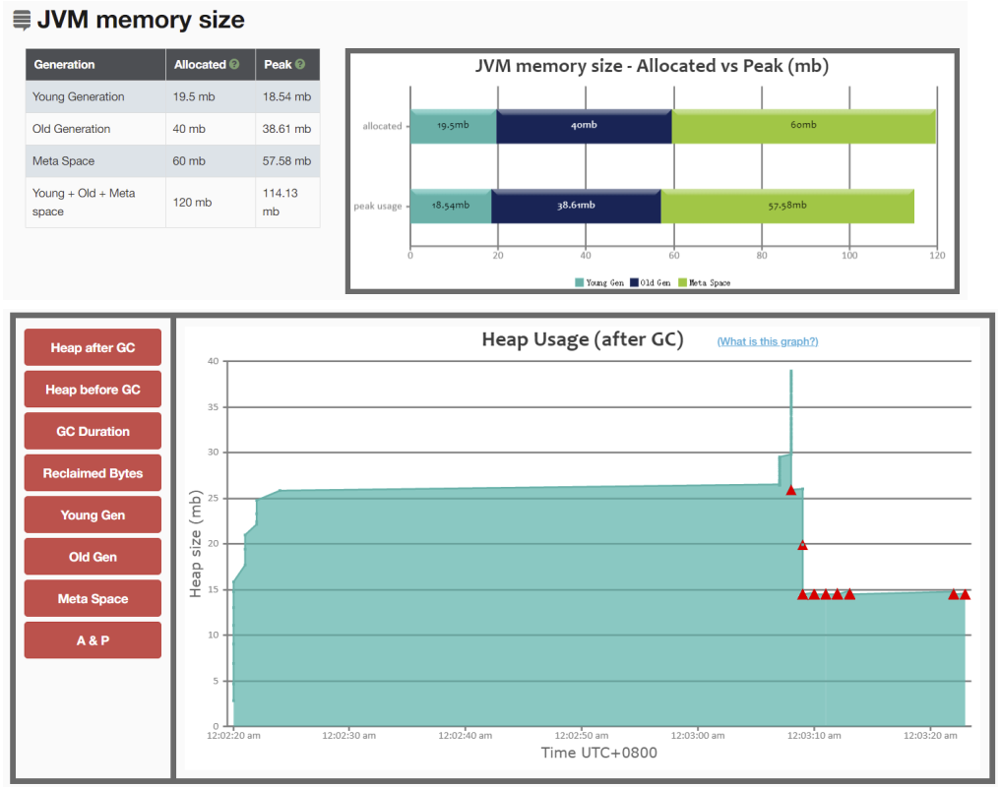

+ <font style="color:#141414;">分析dump文件</font>
    - <font style="color:#141414;">jvisualvm分析</font>

<font style="color:#141414;">导出dump文件，使用jvisualvm工具分析之：</font>

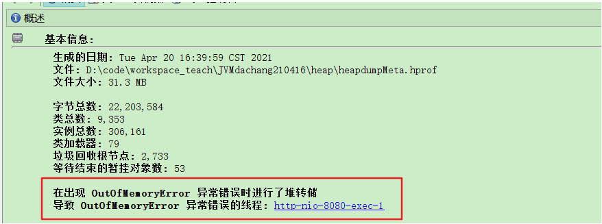

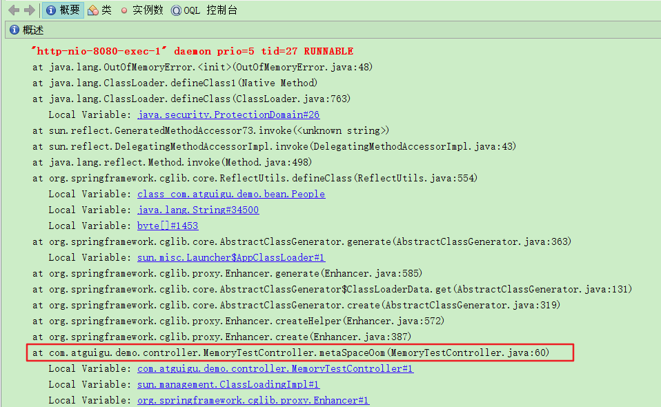

对应的：

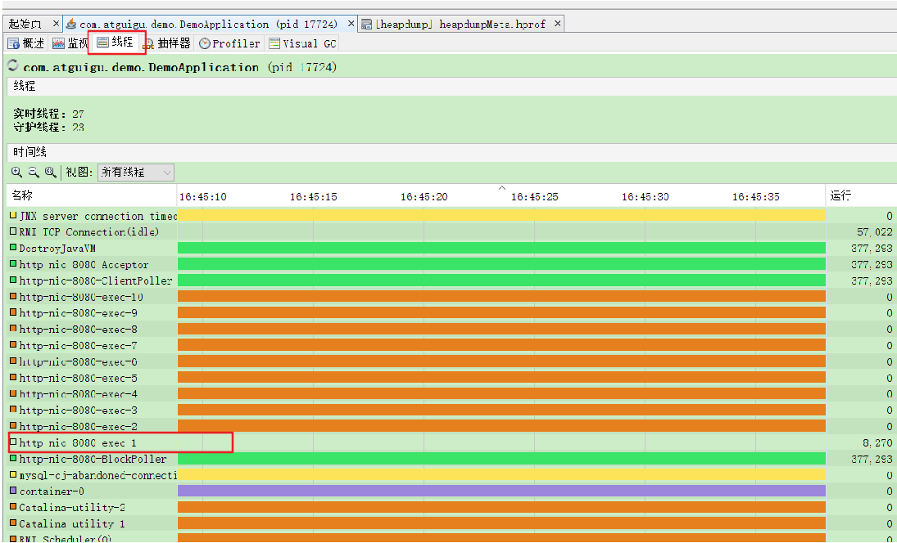

```plain
- <font style="color:#141414;">MAT分析</font>
```

导出dump文件，使用mat工具分析之：

打开堆文件 heapdumpMeta.hprof：

首先我们先确定是哪里的代码发生了问题，首先可以通过线程来确定，因为在实际生产环境中，有时候是无法确定是哪块代码引起的OOM，那么我们就需要先定位问题线程，然后定位代码，如下图所示。

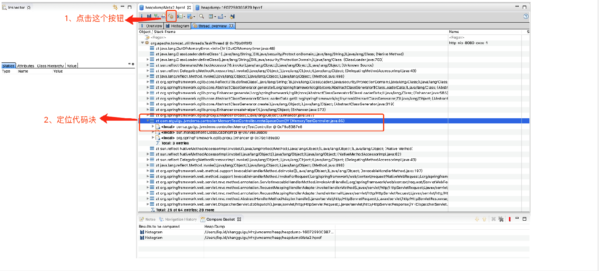

定位到代码以后，发现有使用到cglib动态代理，那么我们猜想一下问题是不是由于产生了很多代理类，接下来，我们可以通过包看一下我们的类加载情况。

这里发现Method类的实例非常多，查看with outging references

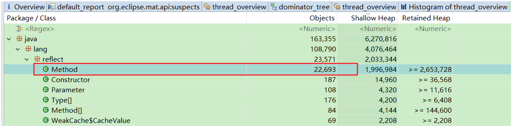

这里发现了很多的People类在调用相关的方法：

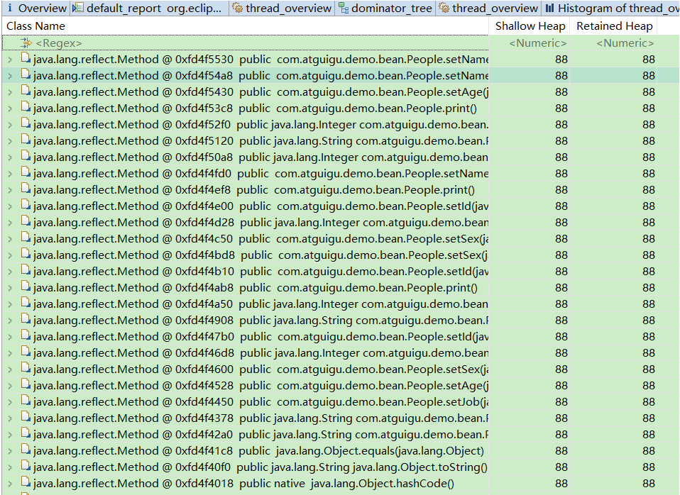

由于我们的代码是代理的People类，所以我们直接打开该类所在的包，打开如下图所示：

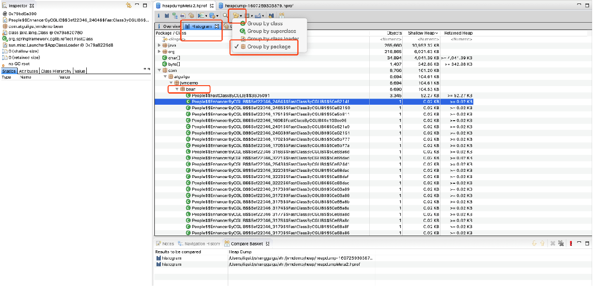

可以看到确实加载了很多的代理类。

+ <font style="color:#141414;">解决方案</font>

<font style="color:#000000;">那么我们可以想一下解决方案，每次是不是可以只加载一个代理类即可，</font><font style="color:#ff0000;">因为我们的需求其实是没有必要如此加载的，当然如果业务上确实需要加载很多类的话，那么我们就要考虑增大方法区大小了</font><font style="color:#000000;">，所以我们这里修改代码如下：</font>

`enhancer.setUseCache(true);`

`<font style="color:#000000;">enhancer.setUseCache(false)，</font>`<font style="color:#ff0000;">选择为true的话，使用和更新一类具有相同属性生成的类的静态缓存，而不会在同一个类文件还继续被动态加载并视为不同的类，这个其实跟类的equals()和hashCode()有关，它们是与cglib内部的class cache的key相关的。</font><font style="color:#000000;">再看程序运行结果如下：</font>

```systemverilog
我是加强类哦，输出print之前的加强方法
我是print本人
class com.atguiigu.jvmdemo.bean.People$$EnhancerByCGLIB$$6ef22046
totalClass:6901
activeClass:6901
我是加强类哦，输出print之前的加强方法
我是print本人
class com.atguiigu.jvmdemo.bean.People$$EnhancerByCGLIB$$6ef22046
totalClass:6901
activeClass:6901+
```

可以看到，几乎不变了，方法区也没有溢出。到此，问题基本解决，再就是把while循环去掉。

## <font style="color:#112b21;">2.4 OOM案例3：GC overhead limit exceeded</font>
### <font style="color:#112b21;">2.4.1 </font><font style="color:#141414;">案例模拟</font>
+ <font style="color:#141414;">示例代码1</font>

```java
public class OOMTest {
    public static void main(String[] args) {
        int i = 0;
        List<String> list = new ArrayList<>();
        try {
            while (true) {
                list.add(UUID.randomUUID().toString().intern());
                i++;
            }
        } catch (Throwable e) {
            System.out.println("************i: " + i);
            e.printStackTrace();
            throw e;
        }

    }


```

```plain
- <font style="color:#141414;">JVM配置</font>

    *  `-XX:+PrintGCDetails`：开启详细的垃圾收集日志输出，当执行GC操作时，会显示包括GC类型、内存区域变化等详细信息。 
    *  `-XX:+HeapDumpOnOutOfMemoryError`：当JVM因内存溢出（OutOfMemoryError）而退出时，将生成堆转储文件，以便于分析和诊断内存泄漏等问题。 
    *  `-XX:HeapDumpPath=heap/dumpExceeded.hprof`：设置在发生内存溢出异常时堆转储文件的保存路径及文件名。 
    *  `-XX:+PrintGCDateStamps`：在GC日志中包含时间戳，方便追踪每次GC操作的具体发生时间。 
    *  `-Xms10M`：设置JVM初始堆内存大小为10MB，即Java程序启动时分配给堆的最小内存容量。 
    *  `-Xmx10M`：设置JVM最大堆内存大小也为10MB，这意味着整个应用程序的堆内存上限被限制在10MB，如果超过这个限制，就会抛出内存溢出错误。 
    *  `-Xloggc:log/gc-oomExceeded.log`：指定GC日志输出到名为`gc-oomExceeded.log`的文件中，而不是默认的控制台输出，这样可以更好地保存和分析GC日志信息。 
- 报错信息
```

```java
[Full GC (Ergonomics) [PSYoungGen: 2047K->2047K(2560K)] [ParOldGen: 7110K->7095K(7168K)] 9158K->9143K(9728K), [Metaspace: 3177K->3177K(1056768K)], 0.0479640 secs] [Times: user=0.23 sys=0.01, real=0.05 secs] 
java.lang.OutOfMemoryError: GC overhead limit exceeded
[Full GC (Ergonomics) [PSYoungGen: 2047K->2047K(2560K)] [ParOldGen: 7114K->7096K(7168K)] 9162K->9144K(9728K), [Metaspace: 3198K->3198K(1056768K)], 0.0408506 secs] [Times: user=0.22 sys=0.01, real=0.04 secs] 
```

通过查看GC日志可以发现，系统在频繁性的做FULL GC，但是却没有回收掉多少空间，那么引起的原因可能是因为内存不足，也可能是存在内存泄漏的情况，接下来我们要根据堆dump文件来具体分析。

+ <font style="color:#141414;">示例代码2</font>

```java
// 对比代码,发生Java heap space：不停的追加str
public static void main(String[] args) {
    String str = "";
    Integer i = 1;
    try {
        while (true) {
            i++;
            str += UUID.randomUUID();
        }}catch (Throwable e) {
        System.out.println("************i: " + i);
        e.printStackTrace();
        throw e;
    }
}

```

```plain
- <font style="color:#141414;">JVM配置</font>

    *  `-XX:+PrintGCDetails`：启用详细GC日志输出，当执行垃圾回收操作时，会在控制台或日志文件中显示详细的GC信息。 
    *  `-XX:+HeapDumpOnOutOfMemoryError`：配置JVM在发生内存溢出错误（OutOfMemoryError）时生成堆转储文件，用于后续对内存问题进行分析和调试。 
    *  `-XX:HeapDumpPath=heap/dumpHeap1.hprof`：指定当发生内存溢出异常时，堆转储文件的保存路径及文件名，这里将生成到`heap`目录下，并命名为`dumpHeap1.hprof`。 
    *  `-XX:+PrintGCDateStamps`：在GC日志中包含时间戳，使得可以清晰地看到每次GC操作的具体执行时间。 
    *  `-Xms10M`：设置JVM初始堆内存大小为10MB，即Java程序启动时为其分配的最小堆内存空间。 
    *  `-Xmx10M`：同样将JVM最大堆内存大小设置为10MB，这意味着整个应用程序可用的最大堆内存仅为10MB，一旦超过这个限制，就会抛出内存溢出错误。 
    *  `-Xloggc:log/gc-oomHeap1.log`：指定GC日志输出至名为`gc-oomHeap1.log`的日志文件中，方便开发者收集并查看GC活动的相关信息。 
```

### <font style="color:#112b21;">2.4.2 </font><font style="color:#141414;">代码解析</font>
+ 第一段代码：运行期间将内容放入常量池的典型案例

intern()方法

```plain
- 如果字符串常量池里面已经包含了等于字符串X的字符串，那么就返回常量池中这个字符串的引用；
- 如果常量池中不存在，那么就会把当前字符串添加到常量池并返回这个字符串的引用
```

+ 第二段代码：不停的追加字符串str

你可能会疑惑，看似demo也没有差太多，为什么第二个没有报GC overhead limit exceeded呢？以上两个demo的区别在于：

```plain
- Java heap space的demo每次都能回收大部分的对象（中间产生的UUID），只不过有一个对象是无法回收的，慢慢长大，直到内存溢出
- GC overhead limit exceeded的demo由于每个字符串都在被list引用，所以无法回收，很快就用完内存，触发不断回收的机制。
```

+ 报错信息：

```java
[Full GC (Ergonomics) [PSYoungGen: 2047K->2047K(2560K)] [ParOldGen: 7110K->7095K(7168K)] 9158K->9143K(9728K), [Metaspace: 3177K->3177K(1056768K)], 0.0479640 secs] [Times: user=0.23 sys=0.01, real=0.05 secs] 
java.lang.OutOfMemoryError: GC overhead limit exceeded
[Full GC (Ergonomics) [PSYoungGen: 2047K->2047K(2560K)] [ParOldGen: 7114K->7096K(7168K)] 9162K->9144K(9728K), [Metaspace: 3198K->3198K(1056768K)], 0.0408506 secs] [Times: user=0.22 sys=0.01, real=0.04 secs] 
```

通过查看GC日志可以发现，系统在频繁性的做FULL GC，但是却没有回收掉多少空间，那么引起的原因可能是因为内存不足，也可能是存在内存泄漏的情况，接下来我们要根据堆DUMP文件来具体分析。

### <font style="color:#112b21;">2.4.3 </font><font style="color:#141414;">分析及解决</font>
+ <font style="color:#141414;">第1步：定位问题代码块</font>
    - <font style="color:#141414;">jvisualvm分析</font>

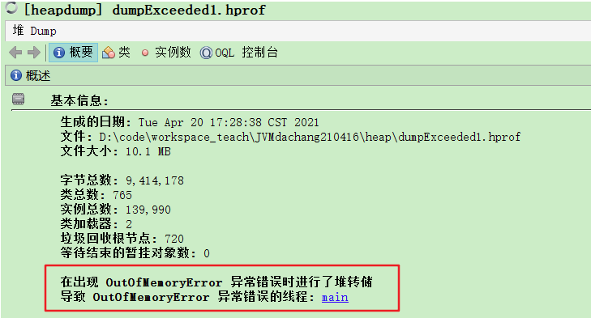

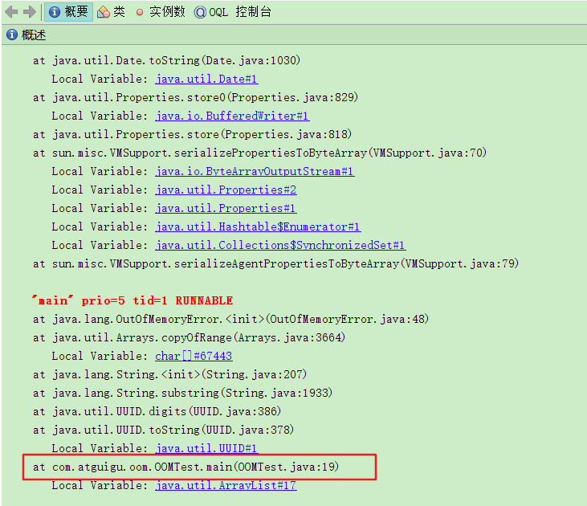

这里就定位到了具体的线程中具体出现问题的代码的位置，进而进行优化即可。

```plain
- <font style="color:#141414;">MAT分析</font>
```


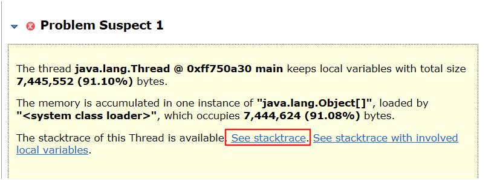

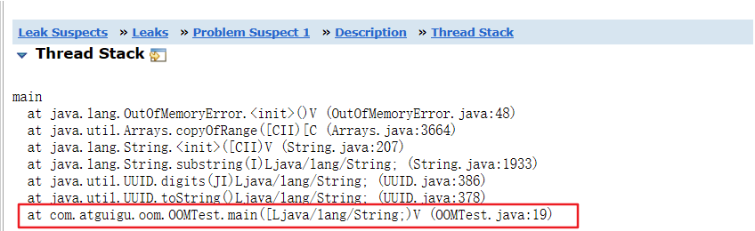

通过线程分析如下图所示，可以定位到发生OOM的代码块

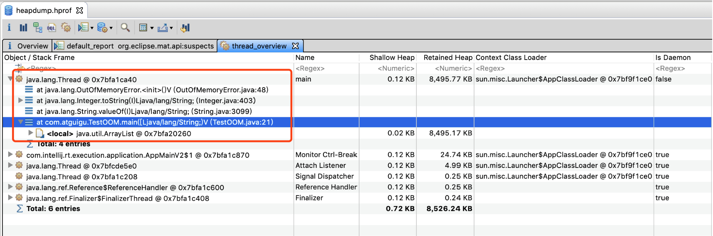

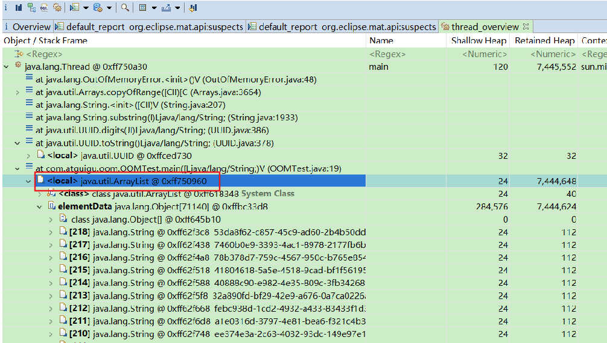

+ <font style="color:#141414;">第2步：分析dump文件直方图</font>

看到发生OOM是因为进行了死循环，不停的往 ArrayList 存放字符串常量，JDK1.8以后，字符串常量池移到了堆中存储，所以最终导致内存不足发生了OOM。

<font style="color:#141414;">打开Histogram，可以看到，String类型的字符串占用了大概8M的空间，几乎把堆占满，但是还没有占满，所以这也符合Sun 官方对此的定义：</font><font style="color:#ff0000;">超过98%的时间用来做GC并且回收了不到2%的堆内存时会抛出此异常</font><font style="color:#141414;">，本质是一个预判性的异常，抛出该异常时系统没有真正的内存溢出。</font>

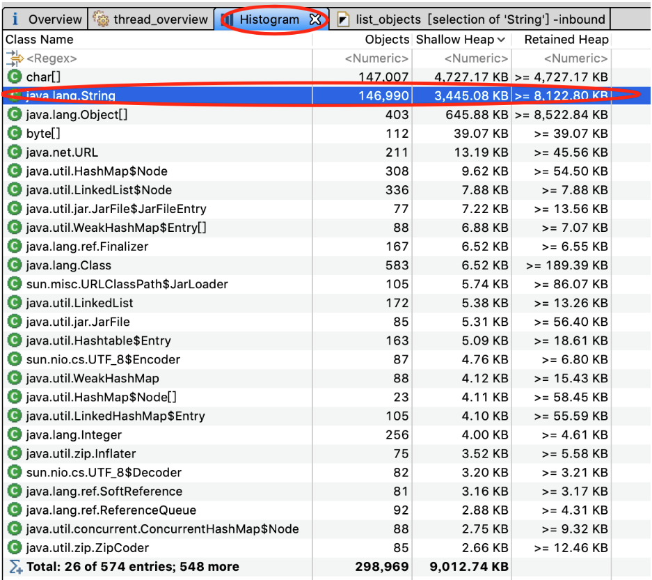

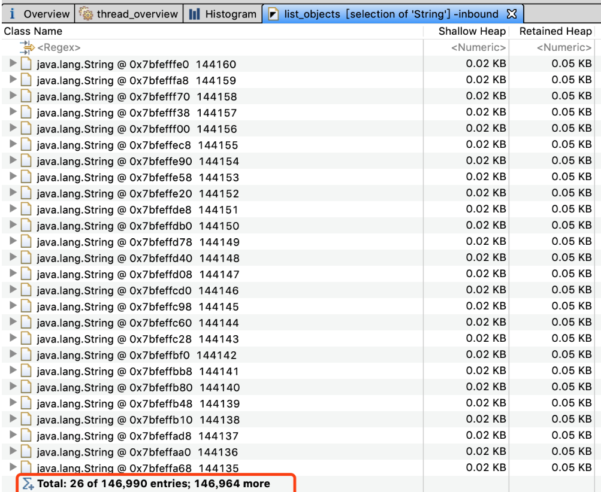

+ <font style="color:#141414;">第3步：代码修改</font>根据业务来修改是否需要死循环。
    - <font style="color:#141414;">原因： </font><font style="color:#141414;">这个是JDK6新加的错误类型，一般都是堆太小导致的。Sun 官方对此的定义：超过98%的时间用来做GC并且回收了不到2%的堆内存时会抛出此异常。本质是一个预判性的异常，抛出该异常时系统没有真正的内存溢出</font>
    - <font style="color:#141414;">解决方法：</font>
        1. <font style="color:#141414;">检查项目中是否有大量的死循环或有使用大内存的代码，优化代码。</font>
        2. <font style="color:#141414;">添加参数 </font>`<font style="color:#141414;">-XX:-UseGCOverheadLimit</font>`<font style="color:#141414;"> 禁用这个检查，其实这个参数解决不了内存问题，只是把错误的信息延后，最终出现 java.lang.OutOfMemoryError: Java heap space。</font>
        3. <font style="color:#141414;">dump内存，检查是否存在内存泄漏，如果没有，加大内存。</font>

## <font style="color:#112b21;">2.5 OOM案例4：线程溢出</font>
### <font style="color:#112b21;">2.5.1 </font><font style="color:#141414;">报错信息</font>
`<font style="color:#141414;">java.lang.OutOfMemoryError : unable to create new native Thread</font>`

### <font style="color:#112b21;">2.5.2 </font><font style="color:#141414;">问题原因</font>
<font style="color:#141414;">出现这种异常，基本上都是创建了大量的线程导致的</font>

### <font style="color:#112b21;">2.5.3 </font><font style="color:#141414;">案例模拟</font>
+ <font style="color:#141414;">说明</font>

操作系统会崩溃，linux无法再进行任何命令，mac/windows可能直接关机重启。鉴于以上原因，我们在虚拟机进行测试。

+ <font style="color:#141414;">示例代码</font>

```java
// 环境：8核linux 机器2G内存
 
import java.util.concurrent.CountDownLatch;

/**
 * @author shkstart
 * @create 17:45
 */
public class TestNativeOutOfMemoryError {
    public static void main(String[] args) {
        for (int i = 0; ; i++) {
            System.out.println("i = " + i);
            new Thread(new HoldThread()).start();
        }
    }
}

class HoldThread extends Thread {
    CountDownLatch cdl = new CountDownLatch(1);

    @Override
    public void run() {
        try {
            cdl.await();
        } catch (InterruptedException e) {
        }
    }
}
 

```

+ <font style="color:#141414;">运行结果</font>

```java
i = 15241
Exception in thread "main" java.lang.OutOfMemoryError: unable to create new native thread
        at java.lang.Thread.start0(Native Method)
        at java.lang.Thread.start(Thread.java:717)
        at TestNativeOutOfMemoryError.main(TestNativeOutOfMemoryError.java:9)
```

### <font style="color:#112b21;">2.5.4 </font><font style="color:#141414;">分析及解决</font>
+ <font style="color:#141414;">解决方向1</font>
    - 通过 -Xss 设置每个线程栈大小的容量
    - JDK5.0以后每个线程堆栈大小为1M,以前每个线程堆栈大小为256K。
    - 正常情况下，在相同物理内存下，减小这个值能生成更多的线程。但是操作系统对一个进程内的线程数还是有限制的,不能无限生成,经验值在3000~5000左右。
    - 能创建的线程数的具体计算公式如下：

(MaxProcessMemory - JVMMemory - ReservedOsMemory) / (ThreadStackSize) = Number of threads

——————————————————————————————————————

MaxProcessMemory 指的是进程可寻址的最大空间

JVMMemory     JVM内存

ReservedOsMemory 保留的操作系统内存

ThreadStackSize   线程栈的大小

——————————————————————————————————————

```plain
- 在Java语言里， 当你创建一个线程的时候，虚拟机会在JVM内存创建一个Thread对象同时创建一个操作系统线程，而这个系统线程的内存用的不是JVMMemory，而是系统中剩下的内存(MaxProcessMemory - JVMMemory - ReservedOsMemory)。
- 由公式得出结论：你给JVM内存越多，那么你能创建的线程越少，越容易发生java.lang.OutOfMemoryError: unable to create new native thread
- 问题解决：
```

1、 如果程序中有bug，导致创建大量不需要的线程或者线程没有及时回收，那么必须解决这个bug，修改参数是不能解决问题的。

2、 如果程序确实需要大量的线程，现有的设置不能达到要求，那么可以通过修改MaxProcessMemory，JVMMemory，ThreadStackSize这三个因素，来增加能创建的线程数。

3、 MaxProcessMemory 使用64位操作系统

4、JVMMemory  减少JVMMemory的分配

5、ThreadStackSize 减小单个线程的栈大小

<font style="color:#ff0000;">经实测，在32位windows系统下较为严格遵守；64位系统下只能保证正/负相关性，甚至说相关性也不能保证。即：</font>

在测试的过程中，64位操作系统下调整Xss的大小并没有对产生线程的总数产生影响，程序执行到极限的时候，操作系统会死机。无法看出效果

在32位win7操作系统下测试，jdk版本1.8（适配32位操作系统）会发现调整Xss的大小会对线程数量有影响，如下表所示：

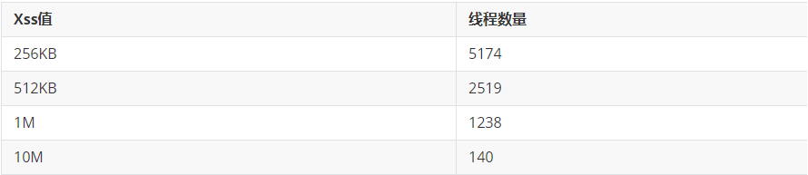

由上可见，64位操作系统对于实验的结果是不明显的，但是32位操作系统对于Xss的设置对于实验结果是明显的，为什么会产生这样的结果？我们上面讲到过线程数量的计算公式

(MaxProcessMemory - JVMMemory - ReservedOsMemory) / (ThreadStackSize) = Number of threads

其中MaxProcessMemory表示最大寻址空间，在32位系统中，CPU的“寻址范围”就受到32个二进制位的限制，也就是说，假设它要访问内存，它的能力是，只能访问4G内存。

32位二进制数最大值是11111111 11111111 11111111 11111111b，2的32次方  4294967296 = 4194304k(1k是1024) = 4096M(1M是1048576) = 4GB。也就是说32位CPU只能访问4GB的内存。再减去显卡上的显存等内存，可用内存要小于4G，所以32位操作系统可用线程数量是有限的。

64位二进制数的最大值是11111111 11111111 11111111 11111111 11111111 11111111 11111111 11111111b，2的64次方 = 17179869184 GB，大家可以看看64位操作的寻址空间大小比32位操作系统多了太多，所以这也是为什么我们总是无法测试出很好效果的原因。

<font style="color:#ff0000;">综上，在生产环境下如果需要更多的线程数量，建议使用64位操作系统，如果必须使用32位操作系统，可以通过调整Xss的大小来控制线程数量。</font>


+ <font style="color:#141414;">解决方向2</font>

线程总数也受到系统空闲内存和操作系统的限制，检查是否该系统下有此限制：

```plain
- /proc/sys/kernel/pid_max          系统最大pid值，在大型系统里可适当调大
- /proc/sys/kernel/threads-max     系统允许的最大线程数
- maxuserprocess（ulimit -u）   系统限制某用户下最多可以运行多少进程或线程
- /proc/sys/vm/max_map_count  
```

max_map_count文件包含限制一个进程可以拥有的VMA(虚拟内存区域)的数量。虚拟内存区域是一个连续的虚拟地址空间区域。在进程的生命周期中，每当程序尝试在内存中映射文件，链接到共享内存段，或者分配堆空间的时候，这些区域将被创建。<font style="color:#ff0000;">调优这个值将限制进程可拥有VMA的数量。限制一个进程拥有VMA的总数可能导致应用程序出错</font>，因为当进程达到了VMA上线但又只能释放少量的内存给其他的内核进程使用时，操作系统会抛出内存不足的错误。如果你的操作系统在NORMAL区域仅占用少量的内存，那么调低这个值可以帮助释放内存给内核用。

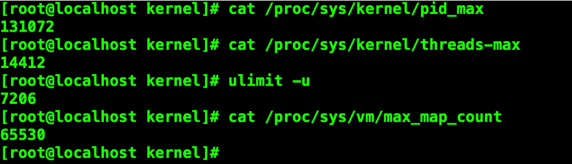

<font style="color:#ff0000;">真实测试发现：</font>

<font style="color:#ff0000;">当我们增大了threads-max参数时（比如扩大10倍：echo 157010 > /proc/sys/kernel/threads-max），运行相关程序，发现可创建的线程数确实扩大了。但是仍受相关因素的影响，不能保证创建的线程数也扩大对应的倍数。要想创建更多线程，会发现在执行完程序报错的log日志(自动在当前目录下生成)中有说明：</font>

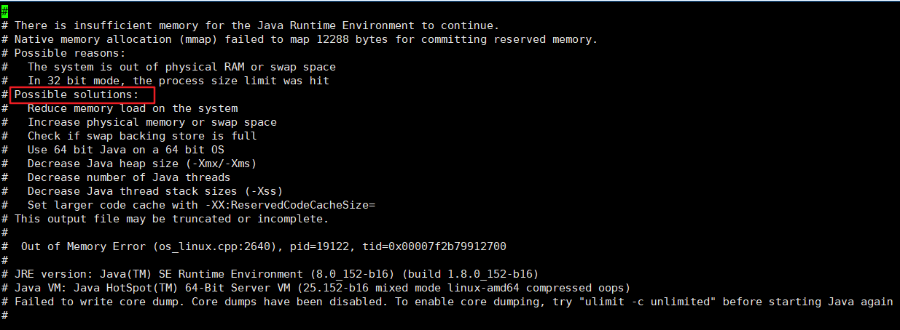

# <font style="color:#0f252d;">3. 性能测试工具：Jmeter</font>
## <font style="color:#112b21;">3.1 基本概述</font>
<font style="color:#141414;">主界面</font>

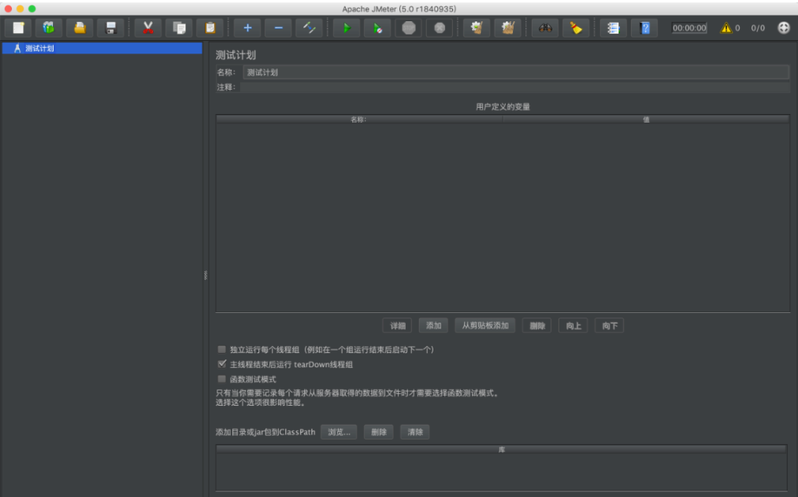

## <font style="color:#112b21;">3.2 使用流程</font>
### <font style="color:#112b21;">3.2.1 </font><font style="color:#141414;">新增线程组</font>
<font style="color:#141414;">创建测试线程组，并设置线程数量及线程初始化启动方式。</font>

<font style="color:#141414;">在左边操作栏中选择“测试计划”，右击新增一个线程组，如图所示：</font>

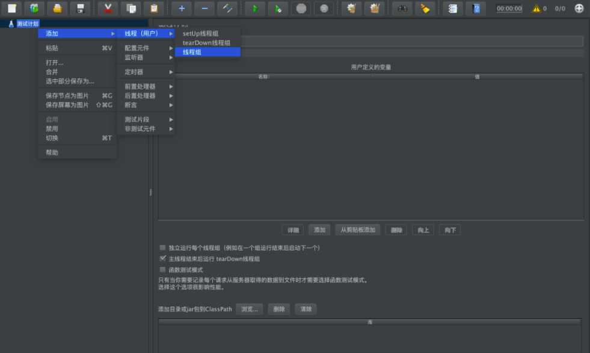

初始化线程组相关信息，如下图所示，设置10个线程，规定每个线程进行1000次请求。这样，Tomcat就会在这次线程组的运行中，收到10000次请求。

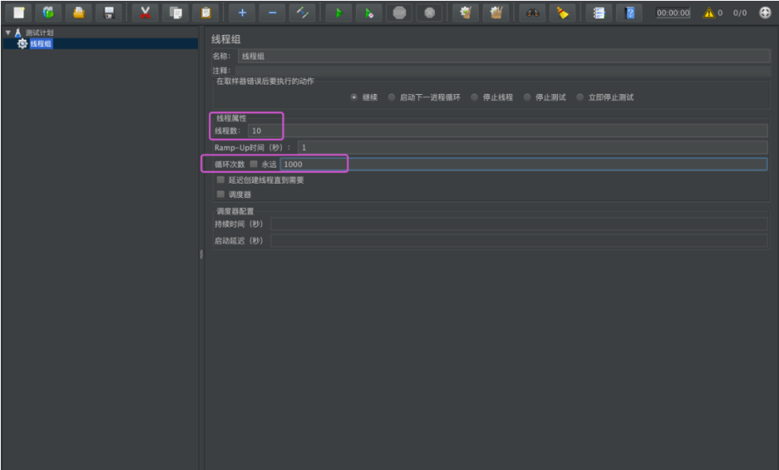

### <font style="color:#112b21;">3.2.2 </font><font style="color:#141414;">新增 JMeter 元组</font>
<font style="color:#141414;">创建各种默认元组及测试元组，填入目标测试静态资源请求和动态资源请求参数及数据。</font>

新增http采样器，采样器用于对具体的请求进行性能数据的采样，如下图所示，这次案例添加HTTP请求的采样。

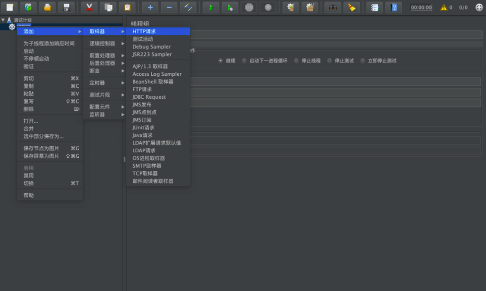

对请求的具体目标进行设置，比如目标服务器地址，端口号，路径等信息，如下图所示，Jmeter会按照设置对目标进行批量的请求。

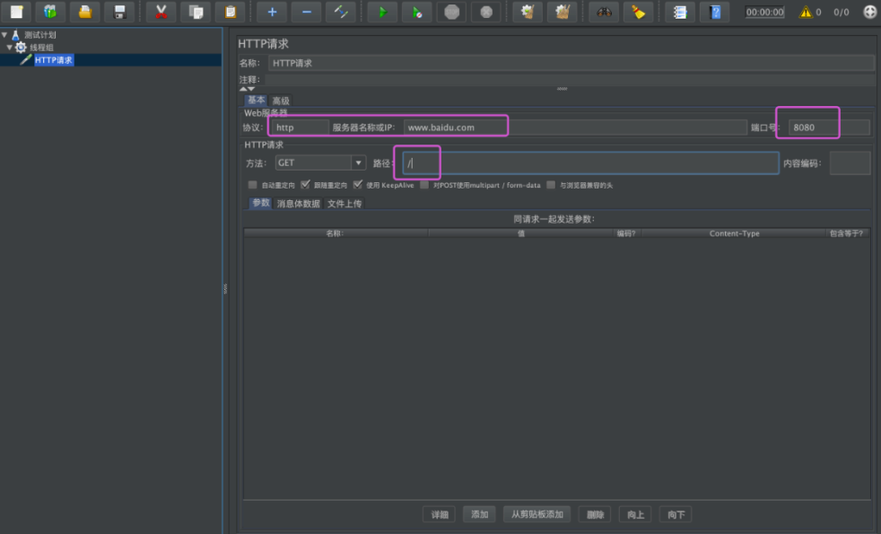

### <font style="color:#112b21;">3.2.3 </font><font style="color:#141414;">新增监听器</font>
<font style="color:#141414;">创建各种形式的结果搜集元组，以便在运行过程及运行结束后搜集监控指标数据。</font>

对于批量请求的访问结果，Jmeter可以以报告的形式展现出来，在监听器中，添加聚合报告，如下图所示：

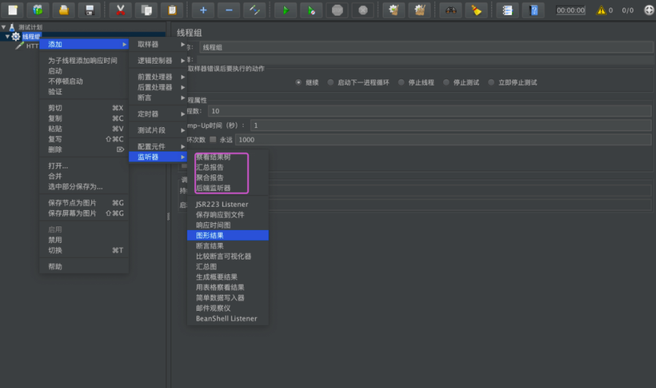

### <font style="color:#112b21;">3.2.4 </font><font style="color:#141414;">运行&查看结果</font>
<font style="color:#141414;">调试运行，分析指标数据，挖掘性能瓶颈、评估系统性能状态</font>

# <font style="color:#0f252d;">4. 性能优化案例</font>
## <font style="color:#0f252d;">4.1 </font><font style="color:#112b21;">性能优化案例1：调整堆大小提高服务的吞吐量</font>
### <font style="color:#0f252d;">4.1.1 </font><font style="color:#141414;">修改tomcatJVM配置</font>
生产环境下，Tomcat并不建议直接在catalina.sh里配置变量，而是写在与catalina同级目录（bin目录）下的setenv.sh里。

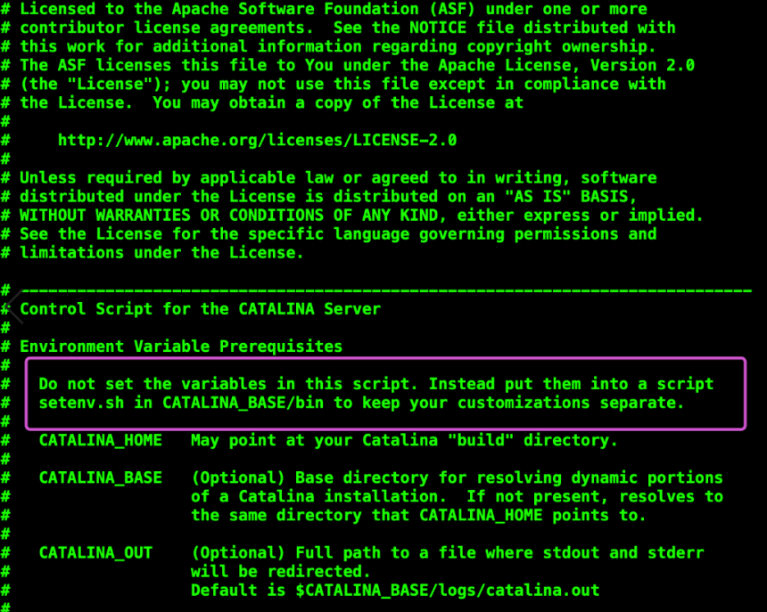

所以如果我们想要修改jvm的内存配置，那么我们就需要修改setenv.sh文件（默认没有，需新建一个setenv.sh）。

### <font style="color:#0f252d;">4.1.2 </font><font style="color:#141414;">初始配置</font>
setenv.sh文件中写入（大小根据自己情况修改）：setenv.sh内容如下：

```powershell
# 设置Tomcat JVM的初始堆内存大小为30MB。这意味着当Tomcat服务器启动时，JVM会立即分配30MB的内存作为堆空间。
export CATALINA_OPTS="$CATALINA_OPTS -Xms30m"
# 设置新生代Eden区与Survivor区的比例为8:1。在新生代中，eden区和两个survivor区共同协作处理对象生命周期管理，这个参数会影响到新生代的空间分配策略。
export CATALINA_OPTS="$CATALINA_OPTS -XX:SurvivorRatio=8"
# 设置Tomcat JVM的最大堆内存大小也为30MB，即堆内存总量不会超过30MB，如果应用程序需要更多内存，可能会导致内存溢出错误。
export CATALINA_OPTS="$CATALINA_OPTS -Xmx30m"
# 启用并行垃圾收集器（Parallel GC），它适用于多处理器系统，能够利用多个CPU核心进行垃圾回收以提高吞吐量。
export CATALINA_OPTS="$CATALINA_OPTS -XX:+UseParallelGC"
# 开启详细的垃圾收集日志输出，每次执行GC操作时都会打印详细信息。
export CATALINA_OPTS="$CATALINA_OPTS -XX:+PrintGCDetails"
# 设置元空间（Metaspace）的初始大小为64MB，元空间用于存储类的元数据。
export CATALINA_OPTS="$CATALINA_OPTS -XX:MetaspaceSize=64m"
# 在GC日志中添加时间戳，便于查看GC操作的具体发生时间。
export CATALINA_OPTS="$CATALINA_OPTS -XX:+PrintGCDateStamps"
# 将GC相关的日志输出到指定路径下的文件，这里选择的是 /opt/tomcat8.5/logs/gc.log 文件，方便对垃圾收集活动进行监控和分析。
export CATALINA_OPTS="$CATALINA_OPTS -Xloggc:/opt/tomcat8.5/logs/gc.log"
```

+ <font style="color:#141414;">查看日志</font>

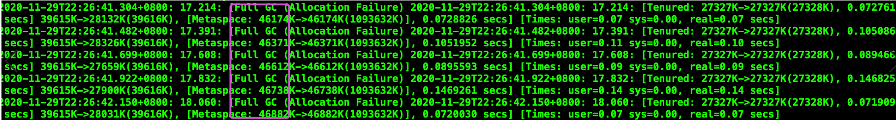

其中存在大量的Full GC日志，查看一下我们Jmeter汇总报告

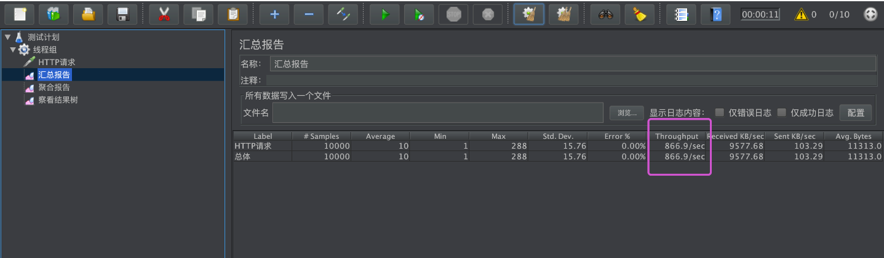

吞吐量是866.9/sec

### <font style="color:#0f252d;">4.1.3 </font><font style="color:#141414;">优化配置</font>
接下来我们测试另外一组数据，增加初始化和最大内存：

```powershell
# 将Tomcat JVM的初始堆内存大小调整为120MB，这意味着当Tomcat服务器启动时，会立即分配120MB的内存作为堆空间。
export CATALINA_OPTS="$CATALINA_OPTS -Xms120m"
# 新生代Eden区与Survivor区的比例依然保持为8:1。
export CATALINA_OPTS="$CATALINA_OPTS -XX:SurvivorRatio=8"
# 同时将最大堆内存大小也设置为120MB，意味着堆内存总量上限是120MB，如果应用程序需要更多内存，可能会触发内存溢出错误。
export CATALINA_OPTS="$CATALINA_OPTS -Xmx120m"
# 启用并行垃圾收集器（Parallel GC），以提升多核处理器环境下垃圾回收的效率。
export CATALINA_OPTS="$CATALINA_OPTS -XX:+UseParallelGC"
# 继续开启详细的垃圾收集日志输出。
export CATALINA_OPTS="$CATALINA_OPTS -XX:+PrintGCDetails"
# 元空间的初始大小仍然设定为64MB。
export CATALINA_OPTS="$CATALINA_OPTS -XX:MetaspaceSize=64m"
# 在GC日志中添加时间戳信息。
export CATALINA_OPTS="$CATALINA_OPTS -XX:+PrintGCDateStamps"
# 将GC相关的详细日志记录到 /opt/tomcat8.5/logs/gc.log 文件中，方便监控和分析Tomcat运行过程中的内存管理和垃圾回收活动。
export CATALINA_OPTS="$CATALINA_OPTS -Xloggc:/opt/tomcat8.5/logs/gc.log
```

重新启动tomcat，查看gc.log

```powershell
vi gc.log
```

+ <font style="color:#141414;">查看日志</font>

查找Full关键字，发现只有一处FullGC，如下图所示，我们可以看到，增大了初始化内存和最大内存之后，我们的Full次数有一个明显的减少。

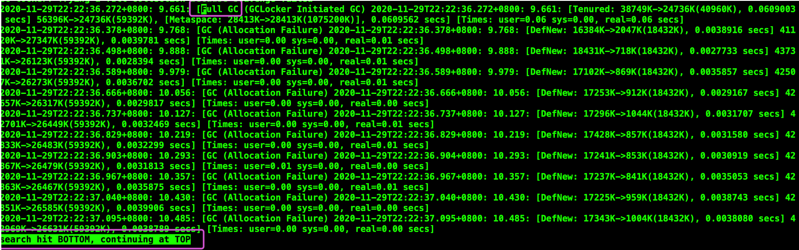

查看Jmeter汇总报告，如下图所示：吞吐量变成了1142.1/sec，基本上是有一个明显的提升，这就说明，我们增加内存之后，服务器的性能有一个明显的提升，这就是我们本次案例的的演示。

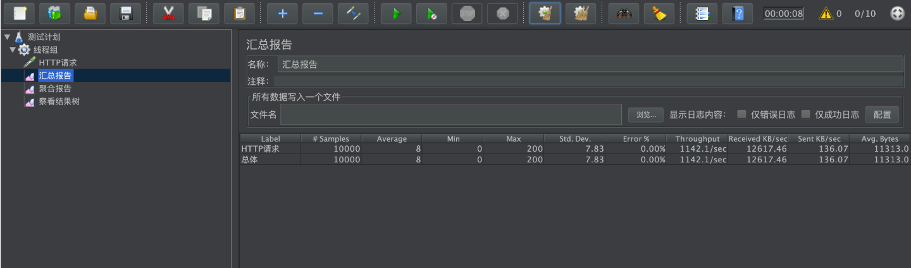

## <font style="color:#0f252d;">4.2 </font><font style="color:#112b21;">性能优化案例2：JVM优化之JIT优化</font>
### <font style="color:#0f252d;">4.2.1 </font><font style="color:#141414;">堆，是分配对象的唯一选择吗?</font>
在《深入理解Java虚拟机中》关于Java堆内存有这样一段描述：

随着JIT编译期的发展与逃逸分析技术逐渐成熟，栈上分配、标量替换优化技术将会导致一些微妙的变化，所有的对象都分配到堆上也渐渐变得不那么“绝对”了。

在Java虚拟机中，对象是在Java堆中分配内存的，这是一个普遍的常识。但是，有一种特殊情况，那就是如果经过<font style="color:#ff0000;">逃逸分析(Escape Analysis)</font>后发现，一个对象并没有逃逸出方法的话，那么就可能被优化成<font style="color:#ff0000;">栈上分配</font>。这样就无需在堆上分配内存，也无须进行垃圾回收了。这也是最常见的堆外存储技术。

此外，前面提到的基于OpenJDK深度定制的TaoBaoVM，其中创新的GCIH（GC invisible heap）技术实现off-heap，将生命周期较长的Java对象从heap中移至heap外，并且GC不能管理GCIH内部的Java对象，以此达到降低GC的回收频率和提升GC的回收效率的目的。

马克思：否定之否定！

是 ---> 不是  ---> 是

### <font style="color:#0f252d;">4.2.2 </font><font style="color:#141414;">编译的开销</font>
+ <font style="color:#141414;">时间开销</font>
    - 解释器的执行，抽象的看是这样的:

输入的代码 -> [ 解释器 解释执行 ] -> 执行结果

```plain
- JIT编译然后再执行的话，抽象的看则是:
```

输入的代码 -> [ 编译器 编译 ] -> 编译后的代码 -> [ 执行 ] -> 执行结果

注意：

说JIT比解释快，其实说的是“执行编译后的代码”比“解释器解释执行”要快，并不是说“编译”这个动作比“解释”这个动作快。JIT编译再怎么快，至少也比解释执行一次略慢一些，而要得到最后的执行结果还得再经过一个“执行编译后的代码”的过程。所以，<font style="color:#ff0000;">对“只执行一次”的代码而言，解释执行其实总是比JIT编译执行要快。</font>怎么算是`只执行一次的代码`呢？粗略说，下面条件同时满足时就是严格的`只执行一次。

```plain
- <font style="color:#000000;"></font><font style="color:#0000ff;">只被调用一次，例如类的构造器（class initializer，()）</font>

- <font style="color:#000000;"></font><font style="color:#0000ff;">没有循环，对只执行一次的代码做JIT编译再执行，可以说是得不偿失。</font>

- <font style="color:#0000ff;">对只执行少量次数的代码，JIT编译带来的执行速度的提升也未必能抵消掉最初编译带来的开销。</font>
```

<font style="color:#ff0000;">只有对频繁执行的代码（热点代码），JIT编译才能保证有正面的收益。</font>

+ <font style="color:#141414;">空间开销</font>

<font style="color:#141414;">对一般的Java方法而言，编译后代码的大小相对于字节码的大小，膨胀比达到10+是很正常的。同上面说的时间开销一样，这里的空间开销也是，只有对执行频繁的代码才值得编译，</font><font style="color:#0000ff;">如果把所有代码都编译则会显著增加代码所占空间，导致代码爆炸。</font><font style="color:#141414;">这也就解释了为什么有些JVM会选择不总是做JIT编译，而是选择用解释器+JIT编译器的混合执行引擎。</font>

### <font style="color:#0f252d;">4.2.3 </font><font style="color:#141414;">即时编译对代码的优化</font>
+ <font style="color:#141414;">逃逸分析</font>
    - <font style="color:#141414;">代码举例1</font>

```java
public static StringBuffer createStringBuffer(String s1, String s2) {
    StringBuffer sb = new StringBuffer();
    sb.append(s1);
    sb.append(s2);
    return sb;
}
上述代码如果想要StringBuffer sb不逃出方法，可以这样写：
public static String createStringBuffer(String s1, String s2) {
    StringBuffer sb = new StringBuffer();
    sb.append(s1);
    sb.append(s2);
    return sb.toString();
}


```

```plain
- <font style="color:#141414;">代码举例2</font>
```

```java
/**
 * 逃逸分析
 * @author shkstart
 * @create 2021 下午 4:00
 */
public class EscapeAnalysis {

    public EscapeAnalysis obj;

    /*
    方法返回EscapeAnalysis对象，发生逃逸
     */
    public EscapeAnalysis getInstance(){
        return obj == null? 
        new EscapeAnalysis() : obj;
    }
    /*
    为成员属性赋值，发生逃逸
     */
    public void setObj(){
        this.obj = new EscapeAnalysis();
    }
    /*
    对象的作用域仅在当前方法中有效，没有发生逃逸
     */
    public void useEscapeAnalysis(){
        EscapeAnalysis e = new EscapeAnalysis();
    }
    /*
    引用成员变量的值，发生逃逸
     */
    public void useEscapeAnalysis1(){
        EscapeAnalysis e = getInstance();

    }
}


```

```plain
- <font style="color:#141414;">参数设置</font>

    * 在JDK 6u23版本之后，HotSpot中默认就已经开启了逃逸分析。
    * <font style="color:#141414;">如果使用的是较早的版本，开发人员则可以通过：</font>

        + <font style="color:#141414;">通过选项“-XX:+DoEscapeAnalysis”显式开启逃逸分析</font>

        + <font style="color:#141414;">通过选项“-XX：+PrintEscapeAnalysis”查看逃逸分析的筛选结果。</font>
```

**结论：**

**开发中能使用局部变量的，就不要使用在方法外定义。**

+ <font style="color:#141414;">代码优化一：栈上分配</font>

使用逃逸分析，编译器可以对代码做如下优化：

<font style="color:#ff0000;">栈上分配。</font>将堆分配转化为栈分配。如果经过逃逸分析后发现，一个对象并没有逃逸出方法的话，那么就可能被优化成栈上分配。这样就无需在堆上分配内存，也无须进行垃圾回收了。可以减少垃圾回收时间和次数。

```plain
- JIT编译器在编译期间根据逃逸分析的结果，<font style="color:#ff0000;">发现如果一个对象并没有逃逸出方法的话，就可能被优化成栈上分配。</font>分配完成后，继续在调用栈内执行，最后线程结束，栈空间被回收，局部变量对象也被回收。这样就无须进行垃圾回收了。
- <font style="color:#141414;">代码举例</font>
```

```java
/**
 * 栈上分配测试
 * -Xmx1G -Xms1G -XX:-DoEscapeAnalysis -XX:+PrintGCDetails -XX:+HeapDumpOnOutOfMemoryError
 * @author shkstart  shkstart@126.com
 * @create 2021  10:31
 */
public class StackAllocation {
    public static void main(String[] args) {
        long start = System.currentTimeMillis();
        for (int i = 0; i < 10000000; i++) {
            alloc();
        }
        // 查看执行时间
        long end = System.currentTimeMillis();
        System.out.println("花费的时间为： " + (end - start) + " ms");
        // 为了方便查看堆内存中对象个数，线程sleep
        try {
            Thread.sleep(100000);
        } catch (InterruptedException e1) {
            e1.printStackTrace();
        }
    }

    private static void alloc() {
        User user = new User();
    }

    static class User {

    }
}
 
未开启逃逸分析时，可以看到堆空间创建的对象数量：

  
```

+ <font style="color:#141414;">代码优化二：同步省略(消除)</font>

<font style="color:#ff0000;">同步省略。</font>如果一个对象被发现只能从一个线程被访问到，那么对于这个对象的操作可以不考虑同步。

```plain
- <font style="color:#141414;">线程同步的代价是相当高的，同步的后果是降低并发性和性能。</font>

- <font style="color:#141414;">在动态编译同步块的时候，JIT编译器可以借助逃逸分析来</font><font style="color:#ff0000;">判断同步块所使用的锁对象是否只能够被一个线程访问而没有被发布到其他线程</font><font style="color:#141414;">。如果没有，那么JIT编译器在编译这个同步块的时候就会取消对这部分代码的同步。这样就能大大提高并发性和性能。这个取消同步的过程就叫同步省略，也叫</font><font style="color:#ff0000;">锁消除</font><font style="color:#141414;">。</font>

- <font style="color:#141414;">代码举例</font>
```

```java
如以下代码：
public void f() {
    Object hollis = new Object();
    synchronized(hollis) {
        System.out.println(hollis);
    }
}
代码中对hollis这个对象进行加锁，但是hollis对象的生命周期只在f()方法中，并不会被其他线程所访问到，所以在JIT编译阶段就会被优化掉。优化成：
public void f() {
    Object hollis = new Object();
    System.out.println(hollis);
}
 
  
```

+ <font style="color:#141414;">代码优化三：标量替换</font>

<font style="color:#ff0000;">标量（Scalar）</font>是指一个无法再分解成更小的数据的数据。Java中的原始数据类型就是标量。

相对的，那些还可以分解的数据叫做<font style="color:#ff0000;">聚合量（Aggregate）</font>，Java中的对象就是聚合量，因为他可以分解成其他聚合量和标量。

在JIT阶段，如果经过逃逸分析，发现一个对象不会被外界访问的话，那么经过JIT优化，就会把这个对象拆解成若干个其中包含的若干个成员变量来代替。这个过程就是<font style="color:#ff0000;">标量替换</font>。

```plain
- <font style="color:#141414;">代码举例1</font>
```

```java
public static void main(String[] args) {
   alloc();
}
private static void alloc() {
   Point point = new Point（1,2）;
   System.out.println("point.x="+point.x+"; point.y="+point.y);
}
class Point{
    private int x;
    private int y;
}
 
// 以上代码，经过标量替换后，就会变成：
private static void alloc() {
   int x = 1;
   int y = 2;
   System.out.println("point.x="+x+"; point.y="+y);
}  
```

可以看到，Point这个聚合量经过逃逸分析后，发现他并没有逃逸，就被替换成两个标量了。那么标量替换有什么好处呢？就是可以大大减少堆内存的占用。因为一旦不需要创建对象了，那么就不再需要分配堆内存了。

标量替换为栈上分配提供了很好的基础。

**标量替换参数设置：**

参数-XX:+EliminateAllocations：开启了标量替换(默认打开)，允许将对象打散分配在栈上。

```plain
- <font style="color:#141414;">代码举例2</font>
```

```java
public class ScalarReplace {
    public static class User {
        public int id;
        public String name;
    }
    public static void alloc() {
        User u = new User();
        u.id = 5;
        u.name = "www.atguigu.com";
    }
    public static void main(String[] args) {
        long start = System.currentTimeMillis();
        for (int i = 0; i < 10000000; i++) {
            alloc();
        }
        long end = System.currentTimeMillis();
        System.out.println(end - start);
    }
}  
```

上述代码在主函数中进行了 1亿次alloc。调用进行对象创建，由于User对象实例需要占据约16字节的空间，因此累计分配空间达到将近1.5GB。如果堆空间小于这个值，就必然会发生 GC。使用如下参数运行上述代码：

`-server -Xmx100m -Xms100m -XX:+DoEscapeAnalysis -XX:+PrintGC -XX:+EliminateAllocations`

这里使用参数如下：

```plain
    * 参数-server：启动Server模式，因为在Server模式下，才可以启用逃逸分析。
    * 参数 -XX:+DoEscapeAnalysis：启用逃逸分析
    * 参数-Xmx100m：指定了堆空间最大为10MB
    * 参数-XX:+PrintGC：将打印GC 日志。
    * 参数-XX:+EliminateAllocations：开启了标量替换(默认打开)，允许将对象打散分配在栈上， 比如对象拥有id和name两个字段，那么这两个字段将会被视为两个独立的局部变量进行分配。 
```

+ <font style="color:#141414;">逃逸分析小结</font>

逃逸分析并不成熟

```plain
- <font style="color:#141414;">关于逃逸分析的论文在1999年就已经发表了，但直到JDK 1.6才有实现，而且这项技术到如今也并不是十分成熟的。</font>

- <font style="color:#000000;">其根本原因就是</font><font style="color:#ff0000;">无法保证非逃逸分析的性能消耗一定能高于他的消耗。虽然经过逃逸分析可以做标量替换、栈上分配、和锁消除。但是逃逸分析自身也是需要进行一系列复杂的分析的，这其实也是一个相对耗时的过程。</font>

- <font style="color:#141414;">一个极端的例子，就是经过逃逸分析之后，发现没有一个对象是不逃逸的。那这个逃逸分析的过程就白白浪费掉了。</font>

- <font style="color:#141414;">虽然这项技术并不十分成熟，但是它也</font><font style="color:#ff0000;">是即时编译器优化技术中一个十分重要的手段</font><font style="color:#141414;">。</font>

- <font style="color:#141414;">注意到有一些观点，认为通过逃逸分析，JVM会在栈上分配那些不会逃逸的对象，这在理论上是可行的，但是取决于JVM设计者的选择。</font>

- <font style="color:#141414;">目前很多书籍还是基于JDK 7以前的版本，JDK已经发生了很大变化，intern字符串的缓存和静态变量曾经都被分配在永久代上，而永久代已经被元数据区取代。但是，intern字符串缓存和静态变量并不是被转移到元数据区，而是直接在堆上分配，所以这一点同样符合前面一点的结论：</font><font style="color:#ff0000;">对象实例都是分配在堆上。</font>
```

## <font style="color:#0f252d;">4.3 </font><font style="color:#112b21;">性能优化案例3：合理配置堆内存</font>
### <font style="color:#0f252d;">4.3.1 </font><font style="color:#141414;">推荐配置</font>
在案例1中我们讲到了增加内存可以提高系统的性能而且效果显著，那么随之带来的一个问题就是，我们增加多少内存比较合适？如果内存过大，那么如果产生FullGC的时候，GC时间会相对比较长，如果内存较小，那么就会频繁的触发GC，在这种情况下，我们该如何合理的适配堆内存大小呢？

分析：

依据的原则是根据Java Performance里面的推荐公式来进行设置。

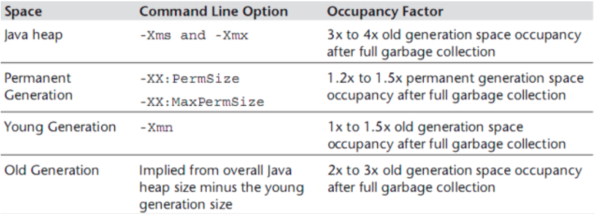

+ Java整个堆大小设置，Xmx 和 Xms设置为老年代存活对象的3-4倍，即FullGC之后的老年代内存占用的3-4倍。
+ 方法区（永久代 PermSize和MaxPermSize 或 元空间 MetaspaceSize 和 MaxMetaspaceSize）设置为老年代存活对象的1.2-1.5倍。
+ 年轻代Xmn的设置为老年代存活对象的1-1.5倍。
+ 老年代的内存大小设置为老年代存活对象的2-3倍。

但是，上面的说法也不是绝对的，也就是说这给的是一个参考值，根据多种调优之后得出的一个结论，大家可以根据这个值来设置一下我们的初始化内存，在保证程序正常运行的情况下，我们还要去查看GC的回收率，GC停顿耗时，内存里的实际数据来判断，Full GC是基本上不能有的，如果有就要做内存Dump分析，然后再去做一个合理的内存分配。

<font style="color:#ff0000;">我们还要注意到一点就是，上面说的老年代存活对象怎么去判定。</font>

### <font style="color:#0f252d;">4.3.2 </font><font style="color:#141414;">如何计算老年代存活对象</font>
+ <font style="color:#141414;">方式1：查看日志</font>

<font style="color:#ff0000;">推荐/比较稳妥！</font>

<font style="color:#141414;">JVM参数中添加GC日志，GC日志中会记录每次FullGC之后各代的内存大小，观察老年代GC之后的空间大小。可观察一段时间内（比如2天）的FullGC之后的内存情况，根据多次的FullGC之后的老年代的空间大小数据来预估FullGC之后老年代的存活对象大小</font><font style="color:#ff0000;">（可根据多次FullGC之后的内存大小取平均值）</font><font style="color:#141414;">。</font>

+ <font style="color:#141414;">方式2：强制触发FullGC</font>
    - <font style="color:#ff0000;">会影响线上服务，慎用！</font>
    - 方式1的方式比较可行，但需要更改JVM参数，并分析日志。同时，在使用CMS回收器的时候，有可能不能触发FullGC，所以日志中并没有记录FullGC的日志。在分析的时候就比较难处理。 <font style="color:#ff0000;">所以，有时候需要强制触发一次FullGC，来观察FullGC之后的老年代存活对象大小。</font>
    - 注：强制触发FullGC，会造成线上服务停顿（STW），要谨慎！建议的操作方式为，在强制FullGC前先把服务节点摘除，FullGC之后再将服务挂回可用节点，对外提供服务，在不同时间段触发FullGC，<font style="color:#ff0000;">根据多次FullGC之后的老年代内存情况来预估FullGC之后的老年代存活对象大小</font>
    - 如何强制触发Full GC?
        * jmap -dump:live,format=b,file=heap.bin  将当前的存活对象dump到文件，此时会触发FullGC
        * jmap -histo:live  打印每个class的实例数目,内存占用,类全名信息.live子参数加上后,只统计活的对象数量. 此时会触发FullGC
        * 在性能测试环境，可以通过Java监控工具来触发FullGC，比如使用VisualVM和JConsole，VisualVM集成了JConsole，VisualVM或者JConsole上面有一个触发GC的按钮。

### <font style="color:#0f252d;">4.3.3 </font><font style="color:#141414;">案例演示</font>
+ <font style="color:#141414;">JVM配置参数</font>

现在我们通过idea启动springboot工程，我们将内存初始化为1024M。我们这里就从1024M的内存开始分析我们的GC日志，根据我们上面的一些知识来进行一个合理的内存设置。

JVM设置如下：

```plain
-  `-XX:+PrintGCDetails`：启用详细的垃圾收集日志输出，包括GC类型、持续时间、各代内存区域的变化等详细信息。 
-  `-XX:MetaspaceSize=64m`：设置元空间（Metaspace）的初始大小为64MB。元空间存储的是类的元数据和方法区信息。 
-  `-Xss512K`：设置每个线程的栈（Stack）大小为512KB。线程栈用来存放局部变量、方法调用的信息等。 
-  `-XX:+HeapDumpOnOutOfMemoryError`：当发生内存溢出错误（OutOfMemoryError）时，自动创建堆转储文件以便于分析内存问题。 
-  `-XX:HeapDumpPath=heap/heapdump3.hprof`：指定堆转储文件在发生内存溢出异常时的保存路径及文件名。 
-  `-XX:SurvivorRatio=8`：设置新生代Eden区与一个Survivor区的比例为8:1，这意味着如果有10个分区分配给新生代，其中8个会作为Eden区，剩下的两个作为Survivor区之一。 
-  `-XX:+PrintGCDateStamps`：在GC日志中包含日期和时间戳，有助于追踪每次GC操作的具体时间点。 
-  `-Xms1024M` 和 `-Xmx1024M`：将JVM的初始堆内存大小和最大堆内存大小都设置为1024MB，保证程序运行期间堆内存的大小恒定不变。 
-  `-Xloggc:log/gc-oom3.log`：指定GC日志输出到名为`gc-oom3.log`的文件中，方便开发者对GC活动进行记录和分析。 
```

+ <font style="color:#141414;">代码演示</font>

访问接口代码如下：

```java
// controller
@RequestMapping("/getData")
    public List<People> getProduct(){
        List<People> peopleList = peopleSevice.getPeopleList();
        return peopleList;
    }

// Service
@Service
public class PeopleSevice {
    @Autowired
    PeopleMapper peopleMapper;
    public List<People> getPeopleList(){
        return peopleMapper.getPeopleList();
    }
 
}

// DAO
@Repository
public interface PeopleMapper {
    List<People> getPeopleList();
}

// Bean
@Data
public class People {
    private Integer id;
    private String name;
    private Integer age;
    private String job;
    private String sex;
}
```

```xml
<?xml version="1.0" encoding="UTF-8"?>
<!DOCTYPE mapper PUBLIC "-//mybatis.org//DTD Mapper 3.0//EN" "http://mybatis.org/dtd/mybatis-3-mapper.dtd">
<mapper namespace="com.atguiigu.jvmdemo.mapper.PeopleMapper">

  <resultMap id="baseResultMap" type="com.atguiigu.jvmdemo.bean.People">
    <result column="id" jdbcType="INTEGER" property="id" />
    <result column="name" jdbcType="VARCHAR" property="name" />
    <result column="age" jdbcType="VARCHAR" property="age" />
    <result column="job" jdbcType="INTEGER" property="job" />
    <result column="sex" jdbcType="VARCHAR" property="sex" />
  </resultMap>

  <select id="getPeopleList" resultMap="baseResultMap">
    select id,name,job,age,sex from people
  </select>

</mapper>

```

### <font style="color:#0f252d;">4.3.4 </font><font style="color:#141414;">数据分析</font>
项目启动，通过jmeter访问10000次（主要是看项目是否可以正常运行）之后，查看gc状态

`jstat -gc pid`

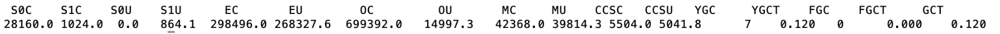

YGC平均耗时：` 0.12s * 1000/7 = 17.14ms`

FGC未产生

看起来似乎不错，YGC触发的频率不高，FGC也没有产生，但这样的内存设置是否还可以继续优化呢？是不是有一些空间是浪费的呢。

为了快速看数据，我们使用了方式2，通过命令 jmap -histo:live pid 产生几次FullGC，FullGC之后，使用的jmap -heap 来看的当前的堆内存情况。

`jmap -heap pid`

或者直接查看GC日志

查看一次FullGC之后剩余的空间大小

观察老年代存活对象大小：

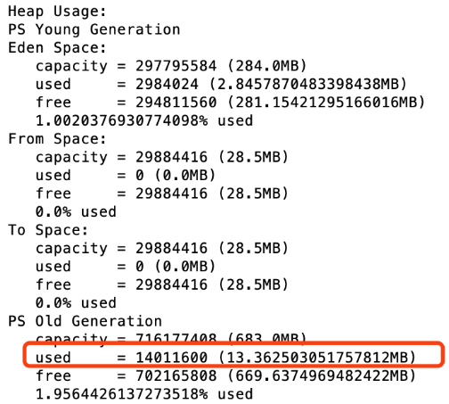

可以看到存活对象占用内存空间大概13.36M，老年代的内存占用为683M左右。 按照整个堆大小是老年代（FullGC）之后的3-4倍计算的话，设置堆内存情况如下：

Xmx=14 * 3 = 42M  至  14 * 4 = 56M 之间

我们修改堆内存状态如下：

+ `<font style="color:rgb(38, 36, 76);">-XX:+PrintGCDetails</font><font style="color:rgb(63, 63, 63) !important;">：</font>`<font style="color:rgb(63, 63, 63) !important;">开启详细的垃圾收集日志输出，当GC发生时，会提供包括GC类型、时间消耗、堆内存各区域使用情况等详细信息。</font>
+ `<font style="color:rgb(38, 36, 76);">-XX:MetaspaceSize=64m</font><font style="color:rgb(63, 63, 63) !important;">：</font>`<font style="color:rgb(63, 63, 63) !important;">设置元空间（Metaspace）的初始大小为64MB。元空间存储的是类的元数据和方法区信息。</font>
+ `<font style="color:rgb(38, 36, 76);">-Xss512K</font><font style="color:rgb(63, 63, 63) !important;">：</font>`<font style="color:rgb(63, 63, 63) !important;">每个线程栈（Stack）的大小被设置为512KB，这是每个Java线程分配给其局部变量和方法调用栈的空间大小。</font>
+ `<font style="color:rgb(38, 36, 76);">-XX:+HeapDumpOnOutOfMemoryError</font><font style="color:rgb(63, 63, 63) !important;">：</font>`<font style="color:rgb(63, 63, 63) !important;">在发生内存溢出错误（OutOfMemoryError）时，自动创建堆转储文件以便分析问题原因。</font>
+ `<font style="color:rgb(38, 36, 76);">-XX:HeapDumpPath=heap/heapdump.hprof</font><font style="color:rgb(63, 63, 63) !important;">：</font>`<font style="color:rgb(63, 63, 63) !important;">指定堆转储文件在内存溢出异常时的保存路径及文件名。</font>
+ `<font style="color:rgb(38, 36, 76);">-XX:SurvivorRatio=8</font><font style="color:rgb(63, 63, 63) !important;">：</font>`<font style="color:rgb(63, 63, 63) !important;">设置新生代Eden区与一个Survivor区的比例为8:1，这意味着如果有9个分区分配给新生代，其中8个作为Eden区，剩下的1个作为Survivor区之一。</font>
+ `<font style="color:rgb(38, 36, 76);">-XX:+PrintGCDateStamps</font><font style="color:rgb(63, 63, 63) !important;">：</font>`<font style="color:rgb(63, 63, 63) !important;">在GC日志中包含日期和时间戳，方便追踪每次GC操作的具体执行时间。</font>
+ `<font style="color:rgb(38, 36, 76);">-Xms60M</font><font style="color:rgb(63, 63, 63) !important;"> 和 </font><font style="color:rgb(38, 36, 76);">-Xmx60M</font><font style="color:rgb(63, 63, 63) !important;">：</font>`<font style="color:rgb(63, 63, 63) !important;">将JVM的初始堆内存大小和最大堆内存大小都设置为60MB，这意味着整个应用程序运行期间可使用的堆内存总量固定为60MB。</font>
+ `<font style="color:rgb(38, 36, 76);">-Xloggc:log/gc-oom.log</font><font style="color:rgb(63, 63, 63) !important;">：</font>`<font style="color:rgb(63, 63, 63) !important;">将所有GC相关的日志信息输出到名为</font><font style="color:rgb(38, 36, 76);">gc-oom.log</font><font style="color:rgb(63, 63, 63) !important;">的日志文件中，便于开发者进行日志记录和性能分析。</font>

修改完之后，我们查看一下GC状态

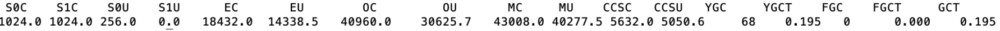

请求之后

YGC平均耗时：` 0.195s * 1000/68 = 2.87ms`

FGC未产生

整体的GC耗时减少。但GC频率比之前的1024M时要多了一些。依然未产生FullGC，所以我们内存设置为60M 也是比较合理的，相对之前节省了很大一块内存空间,所以本次内存调整是比较合理的

依然手动触发Full ，查看堆内存结构

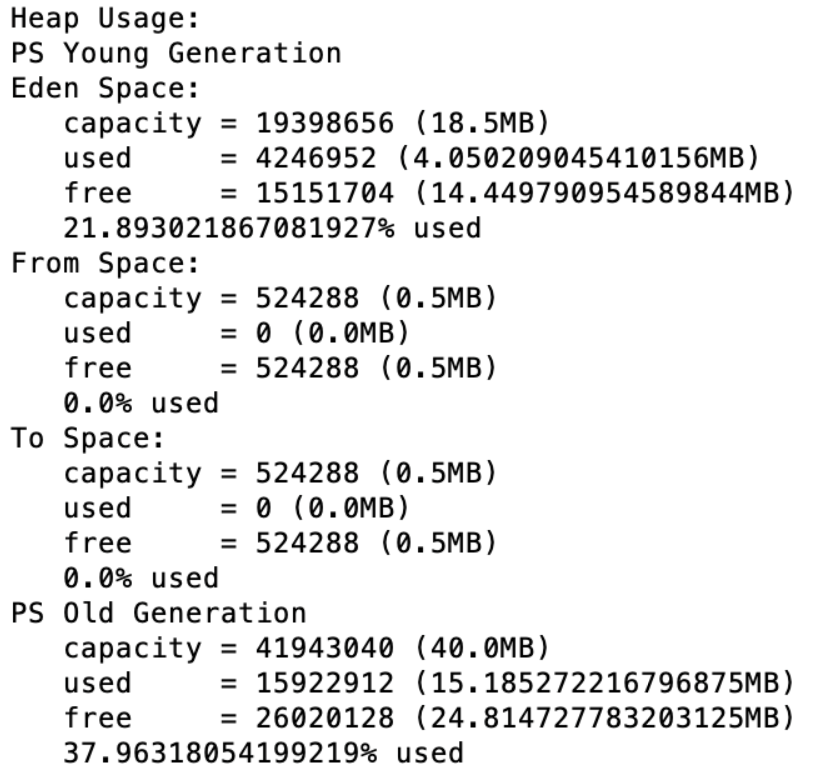

### <font style="color:#0f252d;">4.3.5 </font><font style="color:#141414;">结论</font>
在内存相对紧张的情况下，可以按照上述的方式来进行内存的调优， 找到一个在GC频率和GC耗时上都可接受的一个内存设置，<font style="color:#ff0000;">可以用较小的内存满足当前的服务需要。</font>

<font style="color:#ff0000;">但当内存相对宽裕的时候，可以相对给服务多增加一点内存，可以减少GC的频率</font>，GC的耗时相应会增加一些。 一般要求低延时的可以考虑多设置一点内存， 对延时要求不高的，可以按照上述方式设置较小内存。 

如果在垃圾回收日志中观察到OutOfMemoryError,尝试把Java堆的大小扩大到物理内存的80%~90%。尤其需要注意的是堆空间导致的OutOfMemoryError以及一定要增加空间。

+ 比如说，增加-Xms和-Xmx的值来解决old代的OutOfMemoryError
+ 增加-XX:PermSize和-XX:MaxPermSize来解决permanent代引起的OutOfMemoryError（jdk7之前）；增加-XX:MetaspaceSize和-XX:MaxMetaspaceSize来解决Metaspace引起的OutOfMemoryError（jdk8之后）

记住一点Java堆能够使用的容量受限于硬件以及是否使用64位的JVM。在扩大了Java堆的大小之后，再检查垃圾回收日志，直到没有OutOfMemoryError为止。如果应用运行在稳定状态下没有OutOfMemoryError就可以进入下一步了，计算活动对象的大小。

### <font style="color:#0f252d;">4.3.6 </font><font style="color:#141414;">你会估算GC频率吗？</font>
正常情况我们应该根据我们的系统来进行一个内存的估算，这个我们可以在测试环境进行测试，最开始可以将内存设置的大一些，比如4G这样，当然这也可以根据业务系统估算来的。

比如从数据库获取一条数据占用128个字节，需要获取1000条数据，那么一次读取到内存的大小就是（128 B/1024 Kb/1024M）* 1000 = 0.122M ，那么我们程序可能需要并发读取，比如每秒读取100次，那么内存占用就是0.122_100 = 12.2M  ，如果堆内存设置1个G，那么年轻代大小大约就是333M，那么333M_80% / 12.2M  =21.84s ，也就是说我们的程序几乎每分钟进行两到三次youngGC。这样可以让我们对系统有一个大致的估算。

0.122M * 100 = 12.2M /秒  ---Eden区

1024M * 1/3 * 80% = 273M 

273 / 12.2M = 22.38s ---> YGC  每分钟2-3次YGC 

## <font style="color:#0f252d;">4.4 </font><font style="color:#112b21;">特殊问题：新生代与老年代的比例</font>
### <font style="color:#0f252d;">4.4.1 </font><font style="color:#141414;">参数设置</font>
JVM 参数设置为：

`-XX:+PrintGCDetails   `打印日志详情  

`-XX:+PrintGCDateStamps `打印日志打印日期

`-Xms300M  `初始化内存300M

`-Xmx300M `最大内存300M

`-Xloggc:log/gc.log`日志路径

新生代 ( Young ) 与老年代 ( Old ) 的比例为 1:2，所以，内存分配应该是新生代100M，老年代 200M

我们可以先用命令查看一下堆内存分配是怎么样的：

```powershell
# 查看进程ID
jps -l
# 查看对应的进程ID的堆内存分配
jmap -heap 3725
```

结果大家可以看到：我们的SurvivorRatio= 8 但是内存分配却不是8:1:1，这是为什么呢？

### <font style="color:#0f252d;">4.4.2 </font><font style="color:#141414;">参数AdaptiveSizePolicy</font>
这是因为JDK 1.8 默认使用 UseParallelGC 垃圾回收器，该垃圾回收器默认启动了 AdaptiveSizePolicy，会根据GC的情况自动计算计算 Eden、From 和 To 区的大小；所以这是由于JDK1.8的自适应大小策略导致的，除此之外，我们下面观察GC日志发现有很多类似这样的FULLGC（Ergonomics），也是一样的原因。

我们可以在jvm参数中配置开启和关闭该配置：

# 开启：
`-XX:+UseAdaptiveSizePolicy`

# 关闭
`-XX:-UseAdaptiveSizePolicy`

注意事项：

1、在 JDK 1.8 中，如果使用 CMS，无论 UseAdaptiveSizePolicy 如何设置，都会将 UseAdaptiveSizePolicy 设置为 false；不过不同版本的JDK存在差异；

<font style="color:#ff0000;">2、UseAdaptiveSizePolicy不要和SurvivorRatio参数显示设置搭配使用，一起使用会导致参数失效；</font>

3、由于UseAdaptiveSizePolicy会动态调整 Eden、Survivor 的大小，有些情况存在Survivor 被自动调为很小，比如十几MB甚至几MB的可能，这个时候YGC回收掉 Eden区后，还存活的对象进入Survivor 装不下，就会直接晋升到老年代，导致老年代占用空间逐渐增加，从而触发FULL GC，如果一次FULL GC的耗时很长（比如到达几百毫秒），那么在要求高响应的系统就是不可取的。

<font style="color:#ff0000;">附：对于面向外部的大流量、低延迟系统，不建议启用此参数，建议关闭该参数。</font>

如果不想动态调整内存大小，以下是解决方案：

1、保持使用 UseParallelGC，显式设置 -XX:SurvivorRatio=8。

2、使用 CMS 垃圾回收器。CMS 默认关闭 AdaptiveSizePolicy。配置参数 -XX:+UseConcMarkSweepGC

补充：

关于堆内存的自适应调节有如下三个参数：调整堆是按照每次20%增长，按照每次5%收缩

young区增长量（默认20%）：-XX:YoungGenerationSizeIncrement=

old区增长量（默认20%）：-XX:TenuredGenerationSizeIncrement=

收缩量（默认5%）：-XX:AdaptiveSizeDecrementScaleFactor=

## <font style="color:#0f252d;">4.5 </font><font style="color:#112b21;">性能优化案例4：CPU占用很高排查方案</font>
### <font style="color:#0f252d;">4.5.1 </font><font style="color:#141414;">案例</font>
```java
package com.atguigu.cpu;

/**
 * <pre>
 *    @author  : shkstart
 *    desc    : jstack 死锁案例
 *    version : v1.0
 * </pre>

 */
public class JstackDeadLockDemo {
    /**
     * 必须有两个可以被加锁的对象才能产生死锁，只有一个不会产生死锁问题
     */
    private final Object obj1 = new Object();
    private final Object obj2 = new Object();

    public static void main(String[] args) {
        new JstackDeadLockDemo().testDeadlock();
    }

    private void testDeadlock() {
        Thread t1 = new Thread(() -> calLock_Obj1_First());
        Thread t2 = new Thread(() -> calLock_Obj2_First());
        t1.start();
        t2.start();
    }

    /**
     * 先synchronized  obj1，再synchronized  obj2
     */
    private void calLock_Obj1_First() {
        synchronized (obj1) {
            sleep();
            System.out.println("已经拿到obj1的对象锁，接下来等待obj2的对象锁");
            synchronized (obj2) {
                sleep();
            }
        }
    }

    /**
     * 先synchronized  obj2，再synchronized  obj1
     */
    private void calLock_Obj2_First() {
        synchronized (obj2) {
            sleep();
            System.out.println("已经拿到obj2的对象锁，接下来等待obj1的对象锁");
            synchronized (obj1) {
                sleep();
            }
        }
    }

    /**
     * 为了便于让两个线程分别锁住其中一个对象，
     * 一个线程锁住obj1，然后一直等待obj2，
     * 另一个线程锁住obj2，然后一直等待obj1，
     * 然后就是一直等待，死锁产生
     */
    private void sleep() {
        try {
            Thread.sleep(100);
        } catch (InterruptedException e) {
            e.printStackTrace();
        }
    }
}


```

### <font style="color:#0f252d;">4.5.2 </font><font style="color:#141414;">问题呈现</font>
按照国际惯例，我们把代码上传到linux系统进行执行，如果linux报错如下：

| 错误: 找不到或无法加载主类 JstackDeadLockDemo |
| --- |


解决方案：

原先的etc/profile中的classpath配置

| export CLASSPATH=$JAVA_HOME/lib/tools.jar |
| --- |


改为：

| export CLASSPATH=.:$JAVA_HOME/lib/tools.jar |
| --- |


加了个 .: 当前目录的意思

运行结果如下：


可以看到，程序依然处于运行状态。现在我们知道是线程死锁造成的问题。

### <font style="color:#0f252d;">4.5.3 </font><font style="color:#141414;">问题分析</font>
那么如果是生产环境的话，是怎么样才能发现目前程序有问题呢？我们可以推导一下，如果线程死锁，那么线程一直在占用CPU，这样就会导致CPU一直处于一个比较高的占用率。所示我们解决问题的思路应该是：

| 1、首先查看java进程ID  
2、根据进程 ID 检查当前使用异常线程的pid  
3、把线程pid变为16进制如 31695 -> 7bcf  然后得到0x7bcf  
4、jstack 进程的pid | grep -A20  0x7bcf  得到相关进程的代码 (鉴于我们当前代码量比较小，线程也比较少，所以我们就把所有的信息全部导出来) |  
| --- |


接下来是我们的实现上面逻辑的步骤，如下所示：

| # 查看所有java进程 ID   jps -l |
| --- |


结果如下：


| # 根据进程 ID 检查当前使用异常线程的pid   top -Hp 1456 |
| --- |


结果如下：

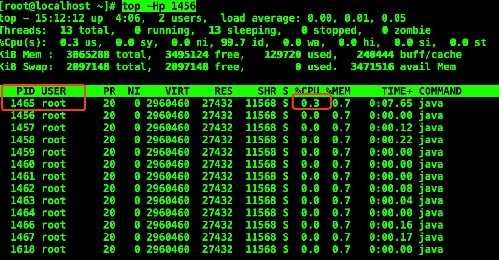

从上图可以看出来，当前占用cpu比较高的线程 ID 是1465

接下来把 线程 PID 转换为16进制为

| # 10 进制线程PId 转换为 16 进制   1465   ------->    5b9   # 5b9 在计算机中显示为      0x5b9 |
| --- |


最后我们把线程信息打印出来：

| jstack  1456 > jstack.log |
| --- |


结果如下：

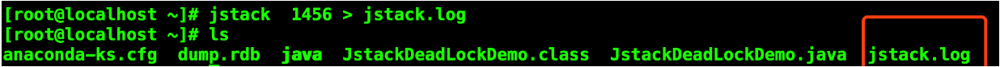

所有的准备工作已经完成，我们接下来分析日志中的信息，来定位问题出在哪里。

打开jstack.log文件  查找一下刚刚我们转换完的16进制ID是否存在

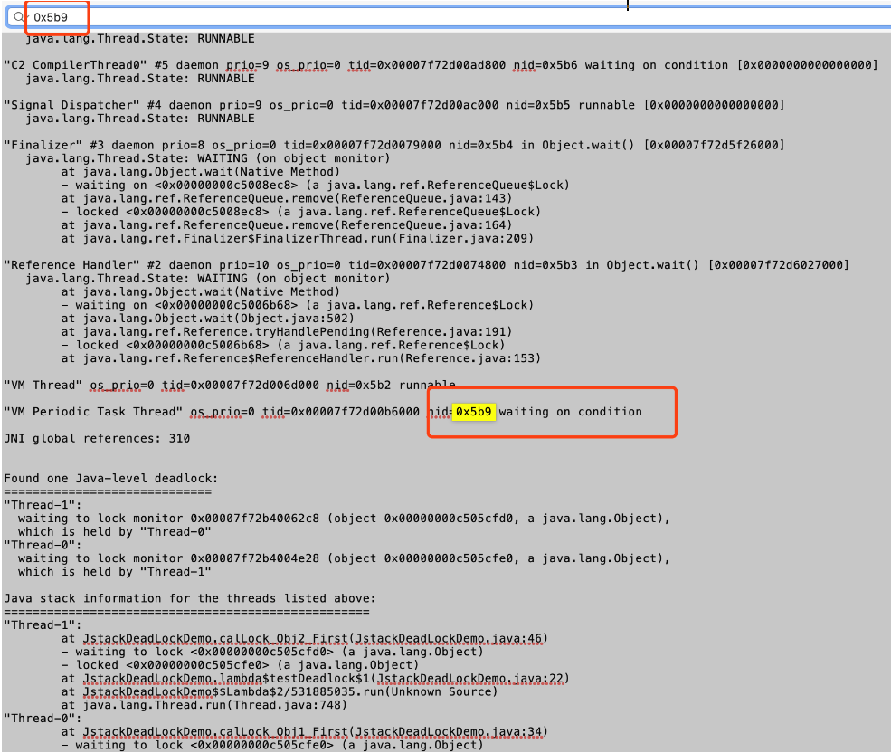

jstack命令生成的thread dump信息包含了JVM中所有存活的线程，里面确实是存在我们定位到的线程 ID ，在thread dump中每个线程都有一个nid，在nid=0x5b9的线程调用栈中，我们发现两个线程在互相等待对方释放资源

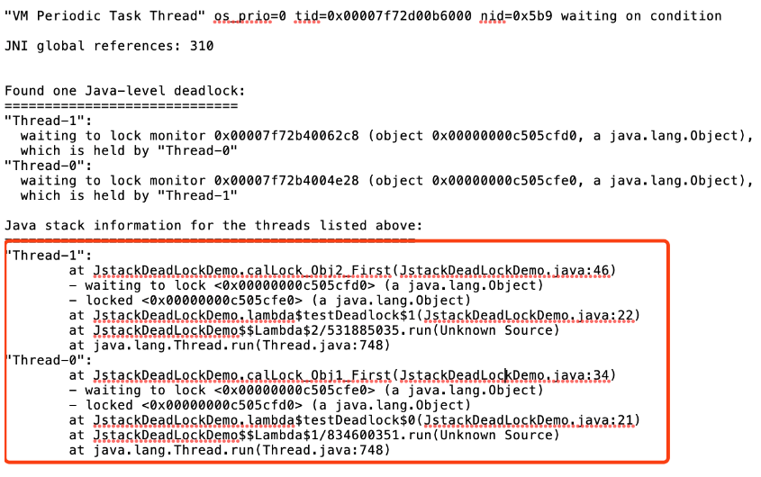

到此就可以检查对应的代码是否有问题，也就定位到我们的死锁问题。

延伸：

xxx大厂问题排查过程：

...省略;

4、ps aux | grep java  查看到当前java进程使用cpu、内存、磁盘的情况获取使用量异常的进程

5、top -Hp 进程pid  检查当前使用异常线程的pid

6、把线程pid变为16进制如 31695 - 》 7bcf  然后得到0x7bcf

7、jstack 进程的pid | grep -A20  0x7bcf  得到相关进程的代码

### <font style="color:#0f252d;">4.5.4 </font><font style="color:#141414;">解决方案</font>
+ 调整锁的顺序，保持一致
+ 或者采用定时锁，一段时间后，如果还不能获取到锁就释放自身持有的所有锁。

## <font style="color:#0f252d;">4.6 </font><font style="color:#112b21;">性能优化案例5：G1并发执行的线程数对性能的影响</font>
### <font style="color:#0f252d;">4.6.1 </font><font style="color:#141414;">配置信息</font>
+ <font style="color:#141414;">硬件配置</font>

<font style="color:#141414;">8核linux</font>

+ <font style="color:#141414;">JVM参数设置</font>
    - <font style="color:rgb(38, 36, 76);"> </font>`<font style="color:rgb(38, 36, 76);">-XX:+UseG1GC"</font><font style="color:rgb(63, 63, 63) !important;">：</font>`<font style="color:rgb(63, 63, 63) !important;">启用G1垃圾收集器（Garbage First Collector），这是一种并行和并发的低延迟垃圾收集器，适用于大内存服务器，并且目标是尽量减少GC停顿时间。</font>
    - `<font style="color:rgb(38, 36, 76);">-Xms30m</font><font style="color:rgb(63, 63, 63) !important;"> 和 </font><font style="color:rgb(38, 36, 76);">-Xmx30m</font><font style="color:rgb(63, 63, 63) !important;">：</font>`<font style="color:rgb(63, 63, 63) !important;">分别设置Tomcat JVM的初始堆内存大小和最大堆内存大小为30MB。这意味着Tomcat启动时会分配30MB的堆空间，而且整个生命周期内堆的最大容量也是30MB。</font>
    - `<font style="color:rgb(38, 36, 76);">-XX:+PrintGCDetails</font><font style="color:rgb(63, 63, 63) !important;">：</font>`<font style="color:rgb(63, 63, 63) !important;">开启详细的垃圾收集日志输出，以便于分析和调试GC行为。</font>
    - `<font style="color:rgb(38, 36, 76);">-XX:MetaspaceSize=64m</font><font style="color:rgb(63, 63, 63) !important;">：</font>`<font style="color:rgb(63, 63, 63) !important;">设定元空间（Metaspace）的初始大小为64MB，用于存储类元数据等信息。</font>
    - `<font style="color:rgb(38, 36, 76);">-XX:+PrintGCDateStamps</font><font style="color:rgb(63, 63, 63) !important;">：</font>`<font style="color:rgb(63, 63, 63) !important;">在GC日志中添加日期和时间戳，方便查看每次GC操作的具体执行时间。</font>
    - `<font style="color:rgb(38, 36, 76);">-Xloggc:/opt/tomcat8.5/logs/gc.log</font><font style="color:rgb(63, 63, 63) !important;">：</font>`<font style="color:rgb(63, 63, 63) !important;">将GC相关的详细日志记录到指定路径下的文件，即 </font><font style="color:rgb(38, 36, 76);">/opt/tomcat8.5/logs/gc.log</font><font style="color:rgb(63, 63, 63) !important;">。</font>
    - `<font style="color:rgb(38, 36, 76);">-XX:ConcGCThreads=1</font><font style="color:rgb(63, 63, 63) !important;">：</font>`<font style="color:rgb(63, 63, 63) !important;">设置并发标记阶段使用的线程数为1，这个参数只对部分GC算法如CMS、Parallel GC等有影响，在这里设置了G1GC，所以对于G1GC而言，此参数可能不会生效或者作用不明显，因为G1GC的线程使用策略较为复杂，不是通过简单的参数来控制并发标记线程数量。G1GC会根据系统资源自动调整其内部的工作线程数。</font>

说明：最后一个参数可以在使用G1GC测试初始并发GCThreads之后再加上。

<font style="color:#141414;">初始化内存和最大内存调整小一些，目的发生 FullGC，关注GC时间</font>

<font style="color:#141414;">关注点是：GC次数，GC时间，以及 Jmeter的平均响应时间</font>

### <font style="color:#0f252d;">4.6.2 </font><font style="color:#141414;">初始的状态</font>
启动tomcat

查看进程默认的并发线程数：

| jinfo -flag ConcGCThreads pid   -XX:ConcGCThreads=1 |
| --- |


没有配置的情况下：并发线程数是1

查看线程状态：

| jstat -gc pid |
| --- |


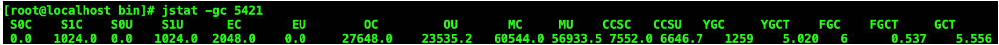

得出信息：

| YGC：youngGC次数是1259次   FGC：Full GC次数是6次   GCT：GC总时间是5.556s |
| --- |


Jmeter压测之后的GC状态：

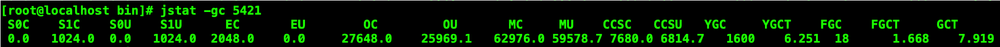

得出信息：

| YGC：youngGC次数是1600次   FGC：Full GC次数是18次   GCT：GC总时间是7.919s |
| --- |


由此我们可以计算出来压测过程中，发生的GC次数和GC时间差

压测过程GC状态：

| YGC：youngGC次数是 1600 - 1259 = 341次   FGC：Full GC次数是 18 - 6 = 12次   GCT：GC总时间是 7.919 - 5.556 = 2.363s |
| --- |


Jmeter压测结果如下：

主要关注响应时间：

95%的请求响应时间为：16ms

99%的请求响应时间为：28ms

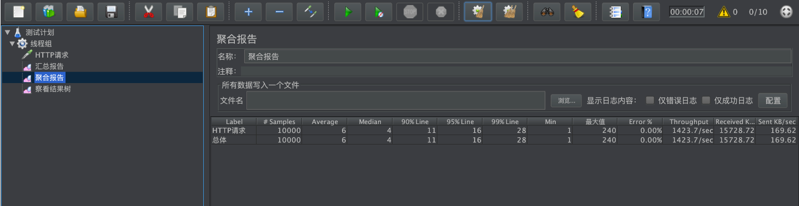

### <font style="color:#0f252d;">4.6.3 </font><font style="color:#141414;">优化之后</font>
增加线程配置:

export CATALINA_OPTS="$CATALINA_OPTS -XX:ConcGCThreads=8"

观察GC状态

jstat -gc pid

tomcat启动之后的初始化GC状态：

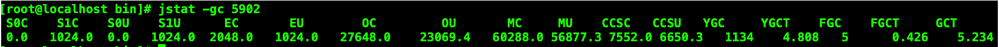

总结：

YGC：youngGC次数是 1134 次

FGC：Full GC次数是 5 次

GCT：GC总时间是 5.234s

Jmeter压测之后的GC状态：

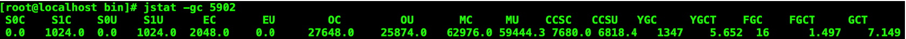

总结：

YGC：youngGC次数是 1347 次

FGC：Full GC次数是 16 次

GCT：GC总时间是 7.149s

由此我们可以计算出来压测过程中，发生的GC次数和GC时间差

压测过程GC状态：

YGC：youngGC次数是 1347 - 1134 = 213次

FGC：Full GC次数是 16 - 5 = 13次

<font style="color:#ff0000;">GCT：GC总时间是 7.149 - 5.234 = 1.915s</font><font style="color:#000000;">  提供了线程数，使得用户响应时间降低了。</font>

压测结果如下：

主要关注响应时间：

95%的请求响应时间为：15ms

99%的请求响应时间为：22ms

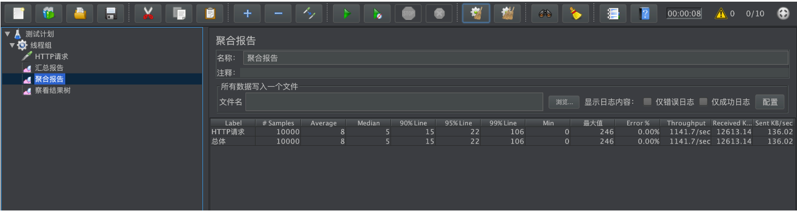

### <font style="color:#0f252d;">4.6.4 </font><font style="color:#141414;">总结</font>
配置完线程数之后，我们的请求的平均响应时间和GC时间都有一个明显的减少了，仅从效果上来看，我们这次的优化是有一定效果的。大家在工作中对于线上项目进行优化的时候，可以考虑到这方面的优化。

## <font style="color:#0f252d;">4.7 </font><font style="color:#112b21;">性能优化案例6：调整垃圾回收器提高服务的吞吐量</font>
### <font style="color:#0f252d;">4.7.1 </font><font style="color:#141414;">初始配置</font>
系统配置是单核，我们看到日志，显示DefNew，说明我们用的是串行收集器，SerialGC

### <font style="color:#0f252d;">4.7.2 </font><font style="color:#141414;">优化配置1</font>
那么就考虑切换一下并行收集器是否可以提高性能，增加配置如下：

+ `<font style="color:rgb(38, 36, 76);">-Xms60m</font>`<font style="color:rgb(63, 63, 63) !important;">：设置Tomcat JVM的初始堆内存大小为60MB。这意味着当Tomcat服务器启动时，将分配60MB的内存作为堆空间。</font>
+ `<font style="color:rgb(38, 36, 76);">-Xmx60m</font>`<font style="color:rgb(63, 63, 63) !important;">：同时设置最大堆内存大小也为60MB，即堆内存总量上限为60MB，如果应用程序需要更多内存，可能会导致内存溢出错误。</font>
+ `<font style="color:rgb(38, 36, 76);">-XX:+UseParallelGC</font>`<font style="color:rgb(63, 63, 63) !important;">：启用并行垃圾收集器（Parallel GC）。这种垃圾收集器在多核处理器环境下能够进行多线程并行回收，从而提高垃圾回收效率和应用吞吐量。</font>
+ `<font style="color:rgb(38, 36, 76);">-XX:+PrintGCDetails</font>`<font style="color:rgb(63, 63, 63) !important;">：开启详细的垃圾收集日志输出，以便于分析和调试垃圾收集行为。</font>
+ `<font style="color:rgb(38, 36, 76);">-XX:MetaspaceSize=64m</font>`<font style="color:rgb(63, 63, 63) !important;">：设定元空间（Metaspace）的初始大小为64MB，用于存储类的元数据信息。</font>
+ `<font style="color:rgb(38, 36, 76);">-XX:+PrintGCDateStamps</font>`<font style="color:rgb(63, 63, 63) !important;">：在GC日志中添加时间戳信息，便于查看每次垃圾收集操作的具体执行时间。</font>
+ `<font style="color:rgb(38, 36, 76);">-Xloggc:/opt/tomcat8.5/logs/gc6.log</font>`<font style="color:rgb(63, 63, 63) !important;">：将垃圾收集相关的详细日志记录到指定路径下的文件，即 </font><font style="color:rgb(38, 36, 76);">/opt/tomcat8.5/logs/gc6.log</font><font style="color:rgb(63, 63, 63) !important;">，方便对Tomcat服务器的内存管理和垃圾回收活动进行监控和分析。</font>

查看GC状态：

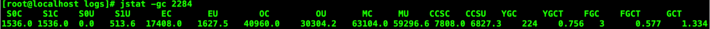

发生3次FullGC，可以接受

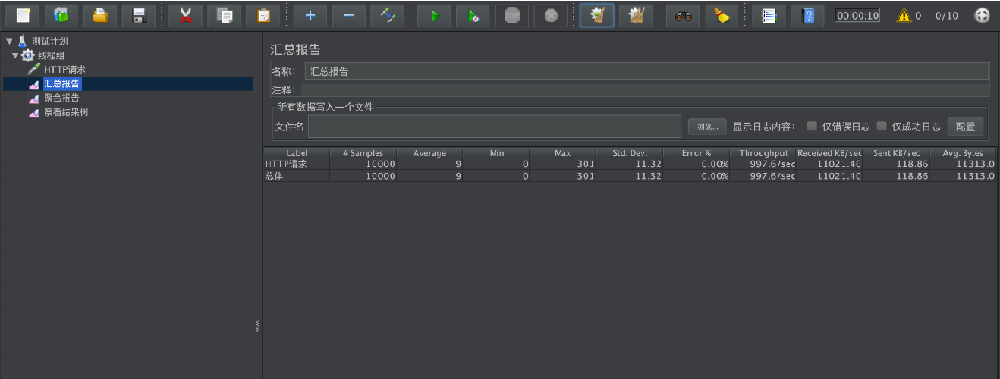

查看吞吐量，997.6/sec，吞吐量并没有明显变化，我们究其原因，本身UseParallelGC是并行收集器，但是我们的服务器是单核。

### <font style="color:#0f252d;">4.7.3 </font><font style="color:#141414;">优化配置2</font>
接下来我们把服务器改为8核。

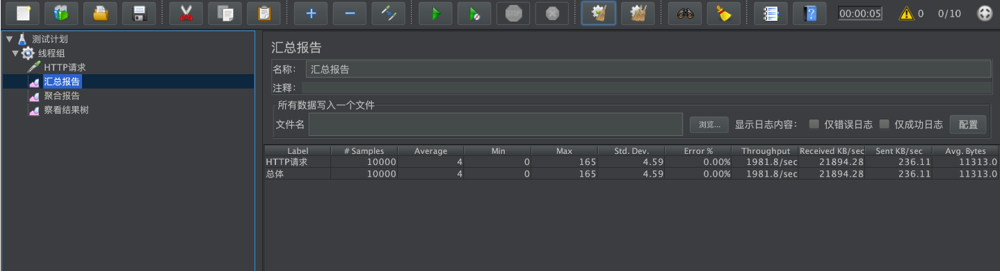

8核状态下的性能表现如下，吞吐量大幅提升，甚至翻了一倍，这说明我们在多核机器上面采用并行收集器对于系统的吞吐量有一个显著的效果。

### <font style="color:#0f252d;">4.7.4 </font><font style="color:#141414;">优化配置3</font>
接下来我们改为G1收集器看看效果

+ `<font style="color:rgb(38, 36, 76);">-XX:+UseG1GC</font>`<font style="color:rgb(63, 63, 63) !important;">：启用G1垃圾收集器（Garbage First Garbage Collector）。G1 GC是一种低延迟、并行和并发的垃圾收集器，特别适合于大内存的应用场景，并且目标是尽量减少GC停顿时间。</font>
+ `<font style="color:rgb(38, 36, 76);">-Xms60m</font><font style="color:rgb(63, 63, 63) !important;"> 和 </font><font style="color:rgb(38, 36, 76);">-Xmx60m</font>`<font style="color:rgb(63, 63, 63) !important;">：分别设置Tomcat JVM的初始堆内存大小和最大堆内存大小为60MB。这意味着在Tomcat启动时分配60MB的内存作为堆空间，并且在整个生命周期内堆的最大容量保持不变。</font>
+ `<font style="color:rgb(38, 36, 76);">-XX:+PrintGCDetails</font>`<font style="color:rgb(63, 63, 63) !important;">：开启详细的垃圾收集日志输出，有助于分析和调试垃圾回收行为。</font>
+ `<font style="color:rgb(38, 36, 76);">-XX:MetaspaceSize=64m</font>`<font style="color:rgb(63, 63, 63) !important;">：设定元空间（Metaspace）的初始大小为64MB，元空间用于存储类的元数据信息。</font>
+ `<font style="color:rgb(38, 36, 76);">-XX:+PrintGCDateStamps</font>`<font style="color:rgb(63, 63, 63) !important;">：在GC日志中添加日期和时间戳，方便追踪每次垃圾回收操作的具体执行时间。</font>
+ `<font style="color:rgb(38, 36, 76);">-Xloggc:/opt/tomcat8.5/logs/gc6.log</font>`<font style="color:rgb(63, 63, 63) !important;">：将所有与垃圾回收相关的详细日志记录到指定路径下的文件 </font><font style="color:rgb(38, 36, 76);">/opt/tomcat8.5/logs/gc6.log</font><font style="color:rgb(63, 63, 63) !important;"> 中，便于对Tomcat服务器上的内存管理及垃圾回收活动进行监控和性能分析。</font>

查看GC状态：

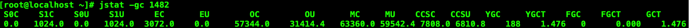

没有产生FullGC，效果较之前有提升。

查看压测效果，吞吐量也是比串行收集器效果更佳，而且没有了FullGC。此次优化较为成功。

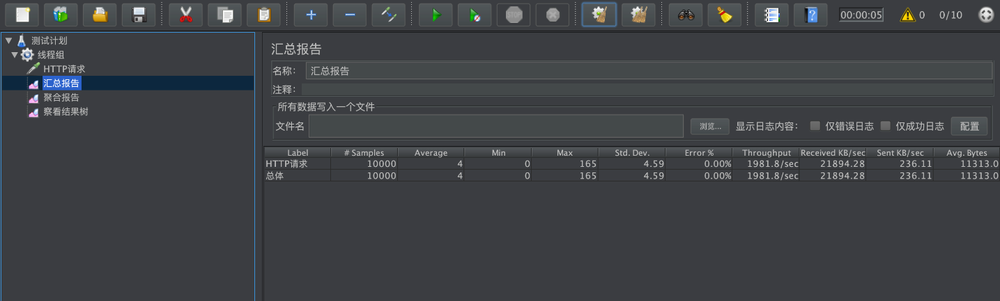

## <font style="color:#0f252d;">4.8 </font><font style="color:#112b21;">性能优化案例7：日均百万级订单交易系统如何设置JVM参数</font>
一天百万级订单这个绝对是现在顶尖电商公司交易量级，百万订单一般在4个小时左右产生，我们计算一下每秒产生多少订单，3000000/3600/4 = 208.3单/s，我们大概按照每秒300单来计算。

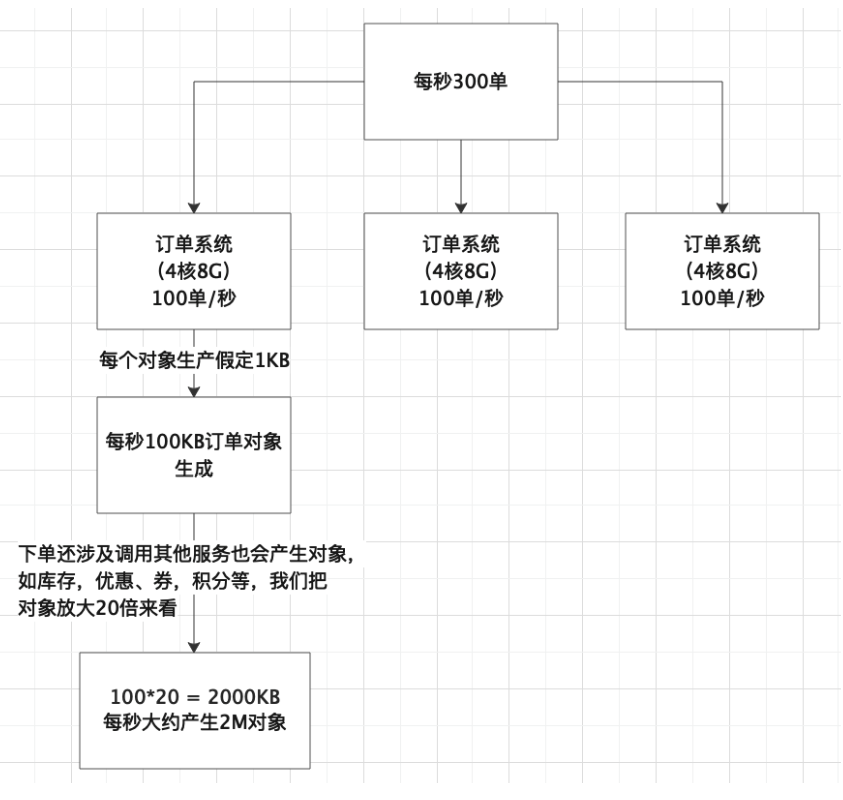

这种系统我们一般至少要三四台机器去支撑，假设我们部署了三台机器，也就是每台每秒钟大概处理完成100单左右，也就是每秒大概有100个订单对象在堆空间的新生代内生成，一个订单对象的大小跟里面的字段多少及类型有关，比如int类型的订单id和用户id等字段，double类型的订单金额等，int类型占用4字节，double类型占用8字节，初略估计下一个订单对象大概1KB左右，也就是说每秒会有100KB的订单对象分配在新生代内。

真实的订单交易系统肯定还有大量的其他业务对象，比如购物车、优惠券、积分、用户信息、物流信息等等，实际每秒分配在新生代内的对象大小应该要再扩大几十倍，我们假设20倍，也就是每秒订单系统会往新生代内分配近2M的对象数据，这些数据一般在订单提交完的操作做完之后基本都会成为垃圾对象。

假设我们选择4核8G的服务器，就可以给JVM进程分配四五个G的内存空间，那么堆内存可以分到三四个G左右，于是可以给新生代至少分配1G，这样算下差不多需要10分钟左右才能把新生代放满触发minor gc，这样的GC频率我们是可以接受的。我们还可以继续调整young区大小。不一定是1:2，这样就可以降低GC频率。这样进入老年代的对象也会降低，减少Full GC频率。


如果系统业务量继续增长那么可以水平扩容增加更多的机器，比如五台甚至十台机器，这样每台机器的JVM处理请求可以保证在合适范围，不至于压力过大导致大量的gc。

假设业务量暴增几十倍，在不增加机器的前提下，整个系统每秒要生成几千个订单，之前每秒往新生代里分配的1M对象数据可能增长到几十M，而且因为系统压力骤增，一个订单的生成不一定能在1秒内完成，可能要几秒甚至几十秒，那么就有很多对象会在新生代里存活几十秒之后才会变为垃圾对象，如果新生代只分配了几百M，意味着一二十秒就会触发一次minor gc，那么很有可能部分对象就会被挪到老年代，这些对象到了老年代后因为对应的业务操作执行完毕，马上又变为了垃圾对象，随着系统不断运行，被挪到老年代的对象会越来越多，最终可能又会导致full gc，full gc对系统的性能影响还是比较大的。

### 问题拓展
问如何进行服务器配置只是第一个层面的问题！

第二个层面问题：如果要求响应时间控制在100ms如何实现？

<font style="color:#141414;">压力测试！</font>

## <font style="color:#0f252d;">4.9 </font><font style="color:#112b21;">面试小结</font>
### <font style="background-color:#ffff00;">12306遭遇春节大规模抢票如何支撑？</font>
12306号称是国内并发量最大的秒杀网站，并发量达到百万级别。

普通电商订单-->  下单 --> 订单系统（IO）减库存 ---> 等待用户付款

12306一种可能的模型：下单 --> 减库存和订单（redis、kafka）同时异步进行 --> 等付款

但减库存最后还会把压力压到一台服务器上。如何？

分布式本地库存+单独服务器做库存均衡！

### <font style="background-color:#ffff00;">问题一：有一个50万PV的资料类网站（从磁盘提取文档到内存）原服务器是32位的，1.5G的堆，用户反馈网站比较缓慢。因此公司决定升级，新的服务器为64位，16G的堆内存，结果用户反馈卡顿十分严重，反而比以前效率更低了！</font>
**1. 为什么原网站慢？**

**频繁的GC,STW时间比较长，响应时间慢！**

**2. 为什么会更卡顿？**

**内存空间越大，FGC时间更长，延迟时间更长**

**3. 咋办？**

**> 垃圾回收器：parallel GC ;****  ****ParNew + CMS ; G1**

**<font style="color:#000000;">> 配置GC参数：</font>****<font style="color:#0000ff;">-XX:MaxGCPauseMillis 、 -XX:ConcGCThreads</font>****<font style="color:#0000ff;"> </font>**

**> 根据log日志、dump文件分析，优化内存空间的比例**

jstat   jinfo  jstack  jmap 

### <font style="background-color:#ffff00;">问题二：系统CPU经常100%，如何调优？（面试高频）</font>
CPU100%的话，一定是有线程占用系统资源。具体步骤前面已经讲过。

注意： 工作中有时候是工作线程100%占用了CPU，还有可能是垃圾回收线程占用了100%

### <font style="background-color:#ffff00;">问题三：系统内存飙高，如何查找问题？（面试高频）</font>
一方面：jmap -heap 、jstat 、... ; gc日志情况

另一方面：dump文件分析

### <font style="background-color:#ffff00;">问题四：如何监控JVM</font>
> 命令行工具
>

> 图形化界面工具
>


> 更新: 2024-01-02 02:11:55  
原文: [https://www.yuque.com/vip6688/neho4x/aqh5o3pluzwtyak9](https://www.yuque.com/vip6688/neho4x/aqh5o3pluzwtyak9)
>


> 更新: 2024-11-25 09:18:49  
> 原文: <https://www.yuque.com/neumx/laxg2e/940b0336e72462c1e57a1debc28b995f>