# JVM八股

# 一、引言
## 什么是 JVM?
**JVM（Java虚拟机）** 是 Java 实现跨平台的基石。Java 程序在运行时，编译器将 Java 源代码（.java 文件）编译成平台无关的 Java 字节码文件（.class 文件），然后由 JVM 将字节码转换为机器代码并执行。JVM 是 Java 平台的核心，保证了“编写一次，到处运行”的特性，使得 Java 程序能够在不同操作系统和硬件平台上运行而无需修改代码。

**JVM 的主要功能包括：**

1. **加载类**：JVM 加载 Java 类，解析其字节码，并将类的信息存储在内存中，以便执行。
2. **内存管理**：JVM 管理内存，负责创建对象、分配内存、垃圾回收（GC）等操作。
3. **执行字节码**：JVM 将字节码翻译成特定平台的机器代码，并执行程序。
4. **垃圾回收**：JVM 会自动清理不再使用的对象（即垃圾回收），以便回收内存资源，防止内存泄漏。
5. **异常处理**：JVM 提供异常处理机制，确保程序在运行时遇到错误时能够正常处理。

## 说说 JVM 的组织架构（补充）
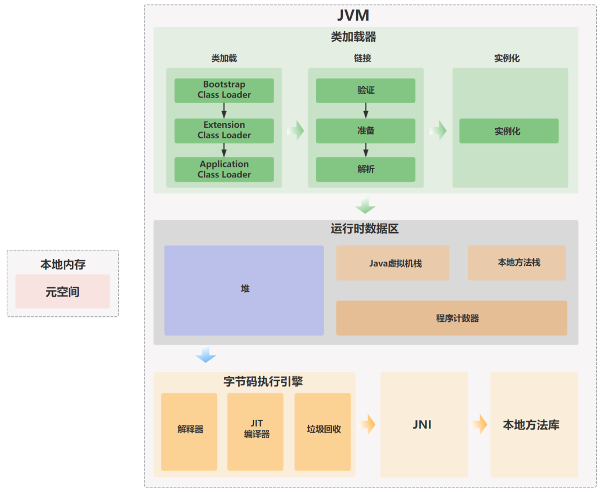

> **JNI**（Java Native Interface）是Java提供的一种机制，允许Java代码与使用其他编程语言（如C、C++）编写的本地代码进行交互。通过JNI，Java程序可以调用本地方法库中的函数，或者将本地代码嵌入Java应用中，扩展Java的功能。
>
> **本地方法库**是指通过JNI调用的库，它通常由其他语言编写（如C/C++），并包含一些特定功能或性能要求（如操作系统底层访问、硬件控制等）。本地方法库一般是动态链接库（DLL、.so、.dylib等）形式。
>
> **总结**：
>
> + **JNI**：Java与其他语言编写的本地代码交互的接口。
> + **本地方法库**：实现特定功能的本地代码库，可以通过JNI在Java程序中调用。
>

**JVM** 大致可以划分为三个部分：**类加载器**、**运行时数据区** 和 **执行引擎**。

1. **类加载器**  
负责将（字节码）.class 文件加载到内存中，并进行类的链接与初始化。
2. **运行时数据区**  
为程序执行提供内存支持，包括：**堆**（存储对象）**栈**（存储局部变量）**方法区**（存储类信息）**程序计数器**（指示当前指令位置）等。
3. **执行引擎**  
负责执行加载后的字节码。它的作用是将字节码指令转换为机器码并执行。包括：**虚拟处理器、即时编译器**（JIT Compiler）和**垃圾回收器**（Garbage Collector）

> + **虚拟处理器（Virtual Processor）**
> + 负责执行字节码指令，将字节码逐条转换为机器码并执行。虚拟处理器是JVM中的核心执行单元，类似于物理处理器的功能，确保程序在JVM内部能够正确执行。
> + **即时编译器（JIT Compiler）**
> + JIT编译器将字节码转换为特定平台的机器码，以提高程序的执行效率。与解释执行不同，JIT编译器在程序运行时动态编译字节码，并且通过优化执行路径来提升性能。它可以在运行时对热代码（频繁执行的代码）进行优化，提高程序运行速度。
> + **垃圾回收器（Garbage Collector）**
> + 垃圾回收器负责自动管理内存，通过回收不再使用的对象，释放内存资源。它通过标记、清除、压缩等算法，减少内存泄漏的风险，避免手动管理内存带来的复杂性和错误。垃圾回收器确保JVM在长时间运行时能够高效地管理堆内存，防止内存耗尽。
>

# 二、内存管理
## 能说一下 JVM 的内存区域吗？
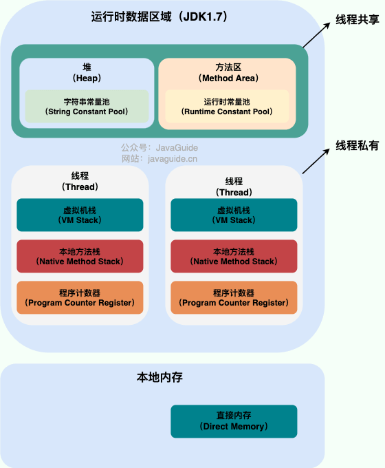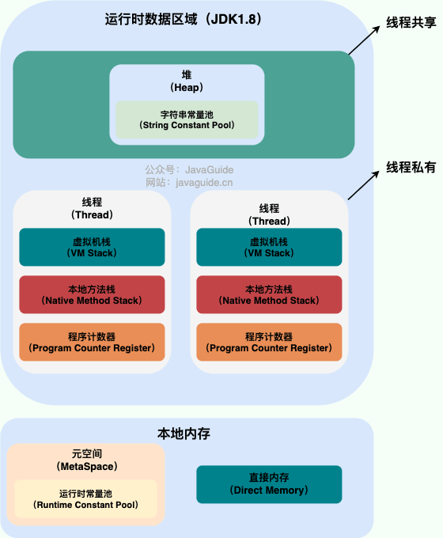

**线程私有的内存区域**  
这些区域是每个线程独立持有的，不会被其他线程共享。每个线程启动时，JVM 会为其分配私有内存，线程结束时这些内存会被回收。

1. **程序计数器（Program Counter Register）**  
    - 是每个线程的私有内存，记录当前线程正在执行的字节码指令的地址。

**作用：**

    - **实现代码的流程控制**： 当JVM执行分支、循环、跳转、异常处理等操作时，程序计数器会被更新以指向新的指令地址，从而控制代码的执行流程。  
    - **线程执行状态保持**：在多线程环境下，保证线程切换时可以知道从哪里恢复执行。  

**特点：**

    - 这是唯一一个不会抛出 **OutOfMemoryError （ 内存溢出  ）**的区域。（程序计数器所占用的内存空间是固定大小的，它只需要保存当前指令的地址，不会随着程序执行的复杂度或数据的增多而增加）
    -  如果当前线程正在执行的是Java方法，那么程序计数器记录的是当前线程所执行的字节码指令的地址。如果是执行的本地方法，则程序计数器的值为 `undefined`

---

2. **Java 虚拟机栈（Java Virtual Machine Stack）**  
    - 每个线程都有自己的栈， 负责存储**方法调用过程中的数据，**存储方法调用的栈帧。  每个栈帧包括局部变量表、操作数栈、方法返回值等。

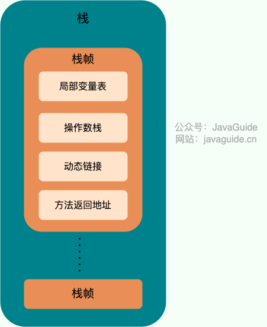

**栈帧的组成部分**  
栈帧主要由以下几部分组成：

+ **局部变量表（Local Variable Table）**  
    - 用途：用于存储方法参数和局部变量。
+ **操作数栈（Operand Stack）**  
    - 用途：后入先出栈，用于存储方法的临时数据和中间结果。
+ **动态链接（Dynamic Linking）**  
    - 将符号引用在运行时动态解析为 直接引用（即实际的内存地址），是实现多态的重要机制。

> 符号引用（Symbolic Reference）：是对类、方法、字段等的抽象表示，它通常是一个字符串，描述了目标对象的名称和类型，但不包含实际的内存地址。
>
> 直接引用（Direct Reference）：是在符号引用被解析后，指向实际内存地址或偏移量的引用。这个地址指向的是具体的对象、方法或字段的位置。
>

+ **方法返回地址（Return Address）**  
    - 记录方法执行完成后返回的地址（记录调用者的程序计数器位置）方便方法返回时继续执行。
+ **附加信息（Additional Information）**  
    - 附加信息：包括异常处理、同步锁等信息。

---

3. **本地方法栈（Native Method Stack）**
    - 本地方法栈用于存储 Java 虚拟机调用本地方法（如 C/C++ 代码）的相关信息。

---

**线程共享的内存区域**  
这些区域在 JVM 中被所有线程共享，用来存储所有线程间共享的数据。

1. **堆（Heap）**  
    - JVM 中最大的内存区域，主要作用是存储对象实例和数组，是垃圾回收器主要管理的区域。
    - 可以分为以下几个部分：
        * **新生代**：存放新创建的对象，包含 Eden 区和两个 Survivor 区。
        * **老年代**：存放生命周期较长的对象。
2. **方法区（Method Area）**  
    - 存储已加载的类信息、常量、静态变量等。  从 JDK 1.8 开始，方法区的实现从永久代（Permanent Generation）被替换为 **元空间（Metaspace）**。

> + 存储**类的元信息**（类名、访问修饰符、字段、方法、接口、常量池等）。
> + 存储**静态变量**、**运行时常量池**（字符串、字面量、符号引用）。
> + 存储**JIT 编译后的代码**。
>


还有几个小部分：

+ **运行时常量池**
    - 用于存放编译期生成的各种字面量和符号引用的常量池表。
+ **字符串常量池**
    - 是 JVM 为了提升性能和减少内存消耗针对字符串专门开辟的一块区域，主要目的是为了避免字符串的重复创建。

## 堆和栈的区别
1. **栈内存**一般会用来存储局部变量和方法调用信息（如返回地址、操作数栈），但**堆内存**是用来存储对象实例和数组的。堆会进行 **GC（垃圾回收）**，而栈不会。
2. **生命周期：栈内存**随着方法调用和返回自动分配和销毁，不需要垃圾回收；而**堆内存**中的对象则由垃圾回收器管理，直到没有引用时才回收。
3. **栈内存**是线程私有的，而**堆内存**是线程共有的。

## 说一下 JDK1.6、1.7、1.8 内存区域的变化？
DK1.6、1.7/1.8 内存区域发生了变化，主要体现在方法区的实现：

+ JDK1.6 使用永久代实现方法区：

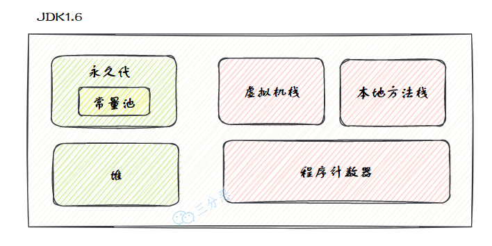

+ JDK1.7 时发生了一些变化，将字符串常量池、静态变量，存放在堆上

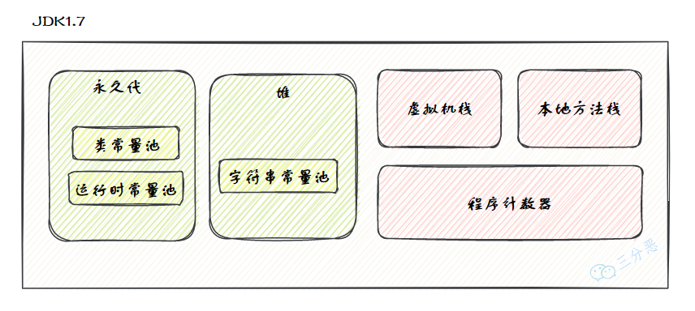

+ 在 JDK1.8 时彻底移除了永久代，而在直接内存中划出一块区域作为**元空间**，运行时常量池、类常量池都移动到元空间。

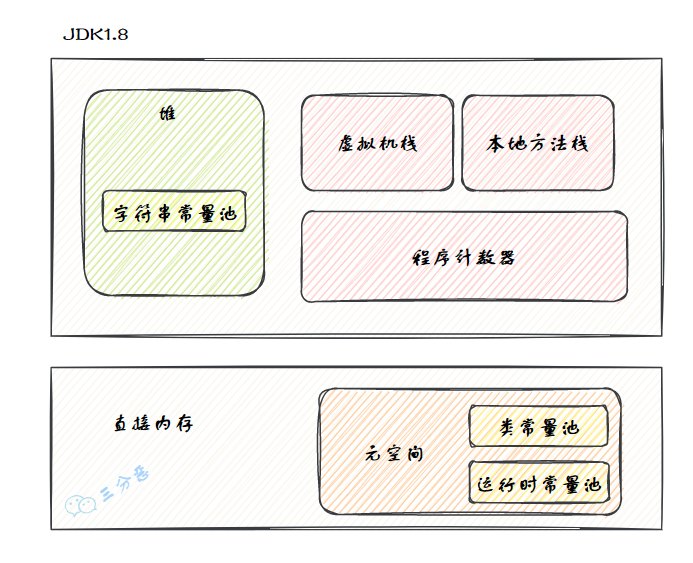

+ **类常量池**：存在于 **.class 文件**中，用于存储 **编译时生成的常量和符号引用**。
+ **运行时常量池**：类加载后，类常量池中的信息被加载到 **JVM 的方法区**中的 **运行时常量池**。
+ **字符串常量池**：**Java 堆内存**中的一个特殊区域，用于存储 **字符串字面量**，以优化 **内存使用**。

## 为什么使用元空间替代永久代作为方法区的实现？
**JDK 1.8 使用元空间（Metaspace）替代永久代（PermGen），主要是为了：**

1. **永久代**固定大小，容易导致内存溢出。**元空间**使用 **本地内存**，不再受限于堆内存大小，可以 **动态扩展**，减少了内存溢出的风险。
2. **永久代**和**堆内存**共享内存空间，而**元空间**与堆内存独立，减少了 **资源竞争**。
3. **元空间**的内存由 **操作系统管理**，类的元数据可以 **自动回收**，避免了 **永久代的内存溢出**问题。

## 对象创建的过程了解吗？
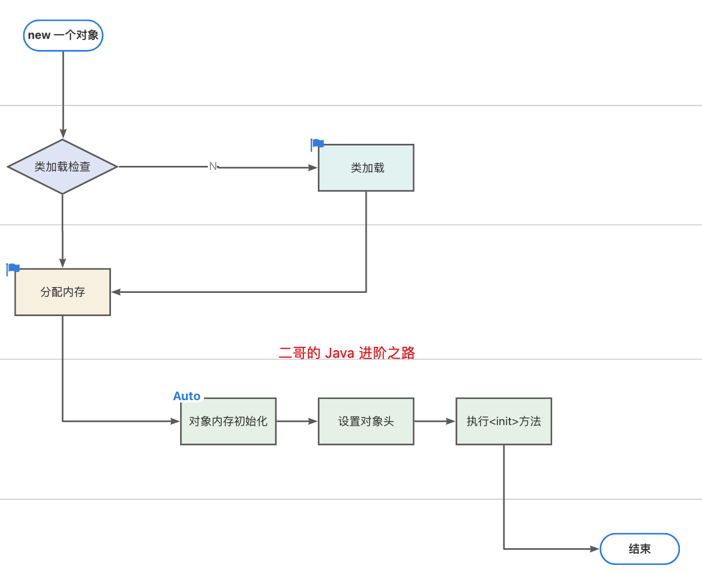

创建对象的过程可以概括为：

**1. 检查该类是否已经被加载,**若未加载则执行类的加载流程。  
**2. 在堆中为对象分配内存**。  
**3. 分配的内存区域会被初始化为默认值**，然后设置对象的**头部信息**，包含对象的元数据、哈希码、锁信息等  
**4. 执行构造方法**，完成对象的初始化  
**5. 返回对象引用**。


**对象的创建过程总结**

对象的创建过程在 JVM 中大致分为以下五个步骤：

① **检查类是否加载**

+ JVM 会首先检查该类是否已经被加载、解析和初始化。如果未加载，则执行类的加载流程。如果类已经加载，虚拟机会在堆区保存类的 **class 对象** 和方法区的 **元数据信息**。

---

② **分配内存**

+ 类加载成功后，JVM 在堆中为对象分配内存，内存分配方式包括：
    - **指针碰撞法**：用于内存规整的情况，虚拟机会通过指针移动来分配内存。
    - **空闲列表法**：用于内存不规整的情况，虚拟机会通过空闲列表找到合适的内存块进行分配。

分配过程是 **线程安全** 的，JVM 会通过：

+ CAS + 自旋锁
+ TLAB（Thread Local Allocation Buffer，线程本地分配缓冲区）

  在多线程环境中 ：虚拟机通过 **CAS+重试机制** 或 **TLAB (Thread Local Allocation Buffer，线程本地分配缓冲区)** 来解决多线程并发分配内存时的线程安全问题。（**TLAB**：为每个线程分配独立的内存空间，提高分配效率，适合高并发环境。）

---

③ **初始化零值**

+ 分配的内存区域会被初始化为**零值**。对象的成员变量会被赋予默认值：基本数据类型会赋值为零（例如 **int** 为 0，**引用类型** 为 **null**）。

---

④ **设置对象头**

+ 初始化零值后，虚拟机会设置对象的**头部信息**，包含对象的元数据、哈希码、锁信息等。  
对象头分为 **Mark Word** 和元数据区。**Mark Word** 存储了对象的哈希码、锁状态、偏向锁标识等信息。根据锁的不同状态，Mark Word 还会记录线程信息或指向 **Monitor**。

---

⑤ **执行初始化方法**

+ 最后，虚拟机会执行对象的**构造方法**，完成对象的初始化，包括成员变量的赋值等操作。 当对象创建完成后，JVM 将对象的内存地址返回给调用者，供程序使用。  

---

## 对象的销毁过程了解吗？
**对象销毁过程总结：**

1. **对象不可达**：当对象不再被任何引用指向时，变成不可达对象，成为垃圾。
2. **可达性分析**：垃圾收集器通过可达性分析算法判断对象是否存活，不可达的对象被标记为垃圾。
3. **内存回收**：垃圾收集器使用 **标记-清除**、**标记-复制**、**标记-整理** 等算法回收内存，释放对象占用的内存空间。
4. **常见垃圾收集器**：包括 **CMS**、**G1**、**ZGC** 等，它们的回收策略和效率不同，根据场景选择合适的收集器。

垃圾收集器自动管理内存，避免了手动内存管理的复杂性。

## 什么是指针碰撞？什么是空闲列表？
在堆内存分配对象时，主要使用两种策略：指针碰撞和空闲列表。

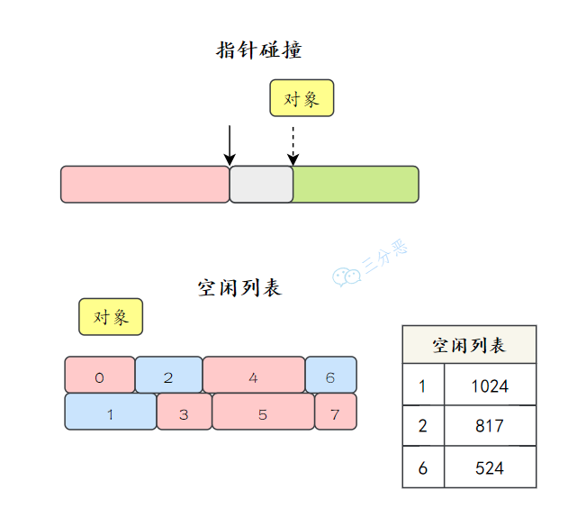

### 内存分配策略总结
① **指针碰撞（Bump the Pointer）**

+ **原理**：假设堆内存是连续的，分为已使用和未使用的区域。JVM 维护一个指针，指向下一个可用的内存地址。在内存分配时，指针会向后移动一段距离， 然后将这段内存分配给对象实例，并更新指针位置。
+ **适用场景**：效率高，适用于内存规整、碎片化较少的情况，如年轻代。

② **空闲列表（Free List）**

+ **原理**：JVM 维护一个空闲列表，记录堆中所有未占用的内存块，包含每个内存块的大小和地址信息。当有新的对象请求内存时，JVM 会遍历空闲列表，找到合适的空闲块并分配。分配后，如果空闲块未被完全利用，剩余部分会重新加入空闲列表。
+ **适用场景**：适用于内存碎片化较严重、对象大小差异较大的场景，如老年代。

---

**垃圾回收器与分配策略的关系**

+ **指针碰撞：**
    - 常见于采用压缩功能的垃圾回收器，例如：
        * **复制算法（Copying GC）**：将活跃对象复制到连续的内存空间。
        * **标记整理算法（Mark-Compact）**：回收内存时压缩碎片。
    - 垃圾回收后，堆内存保持规整，适合**指针碰撞策略**。
+ **空闲列表：**
    - 常见于**标记清除算法（Mark-Sweep）**垃圾回收器。
    - 标记清除后，堆内存可能存在碎片，适合通过**空闲列表**进行分配。

---

### **总结对比**
| 策略 | 适合的垃圾收集器 | 整理内存情况 |
| --- | --- | --- |
| **指针碰撞** | **Serial**、**ParNew**、**G1**、**ZGC**、**** | 堆内存规整（整理后无碎片） |
| **空闲列表** | **CMS**、**Parallel Old** | 堆内存存在碎片 |


## JVM 里 new 对象时，堆会发生抢占吗？JVM 是怎么设计来保证线程安全的？
** 在多线程环境下，每次 **`**new**`** 对象时，堆指针需要更新以分配内存。如果一个线程正在更新指针，而另一个线程同时引用了该指针分配内存，就会发生堆内存抢占问题。  **

有两种可选方案来解决这个问题：

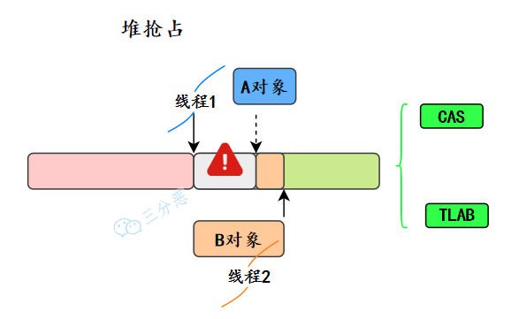

1. **采用 CAS 分配重试的方式**来保证更新操作的**原子性**。

> **CAS 分配重试**
>
>     - JVM 使用 **CAS（Compare-And-Swap）** 操作，确保更新堆指针的过程是原子性的。
>     - 如果有线程冲突，CAS 会失败并触发重试，直到分配成功。
>     - **优点**：线程安全，无需锁。
>     - **缺点**：在高并发场景下可能导致频繁重试，降低效率。
>

2. **每个线程在 Java 堆中预先分配一小块内存**，也就是**本地线程分配缓冲区**（**Thread Local Allocation Buffer**，**TLAB**）。要分配内存的线程，先在**本地缓冲区**中分配，只有本地缓冲区用完了，分配新的缓存区时才需要**同步锁定**。

> **TLAB（Thread Local Allocation Buffer）**
>
>     - JVM 为每个线程分配一小块独占的内存区域，称为 **TLAB**。
>     - **内存分配流程**：
>         1. 线程优先在自己的 TLAB 中分配内存。
>         2. 如果 TLAB 空间不足，则向全局堆申请新的 TLAB。
>         3. 只有在分配新的 TLAB 时才需要同步操作。
>     - **优点**：避免了大部分线程竞争，分配速度接近栈上分配。
>     - **缺点**：需要额外的内存管理开销。
>

## 能说一下对象的内存布局吗？
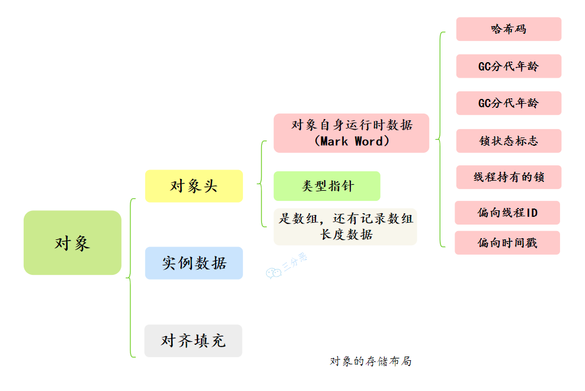

  
在 HotSpot 虚拟机中，对象在堆内存中的存储布局可以划分为三个部分：

**<font style="color:#DF2A3F;">如果问到 Object 底层的数据结构  ，也是按照下面说</font>**

1. **对象头（Header）**
2. **实例数据（Instance Data）**
3. **对齐填充（Padding）**

1. **对象头（Header）**

对象头是存储与对象相关的元数据和管理信息的区域，包含三部分主要信息：

+ **标记字**（**Mark Word**）：存储对象的状态信息，包括对象的**哈希码**（**HashCode**）、**GC分代年龄**（用于垃圾回收）、**锁状态标志**（无锁、偏向锁、轻量级锁、重量级锁）等。在**32位系统**中，**Mark Word**一般占**4字节**，而在**64位系统**中，占**8字节**。
+ **类型指针 （Class Pointer）**：**指向方法区中类的元数据**，表示这个对象是哪个类的实例。
+ **数组长度**：如果对象是**数组**，对象头还会包含一个**4字节**的字段，表示**数组长度**。

> **Mark Word** 是对象头中最重要的部分，它存储了以下内容（不同状态时占用的位数不同）：
>
>         * **对象的哈希码**：25 位，延迟加载，只有在调用 `System.identityHashCode()` 时才会计算并存储。
>         * **GC 信息**：存储该对象的 GC 分代信息。
>         * **锁信息**：包括锁标志（如偏向锁、轻量级锁和重量级锁状态），用于同步控制。
>

2. **实例数据（Instance Data）**

存储对象的实际数据， 也就是类中定义的各个字段（属性）  。这部分的大小取决于对象的**属性**和它们的**类型**（如 **int**、**long**、**引用类型** 等）。JVM 会对这些数据进行对齐，以确保**高效的访问速度**。

> 对于 **数组类型的对象**，实例数据区不仅包含对象成员变量的值，还包含数组的实际数据元素。数组的第一个元素存储在实例数据的开头，后续元素依次排布。
>

3. **对齐填充（Padding）**

**JVM 可能会在对象末尾添加一些填充，确保对象总大小是8字节的倍数，因为现代CPU按字长（word，通常8字节）访问内存，对齐填充可以提高访问效率。**  
为了使对象的总大小是 **8 字节的倍数**（这在大多数现代计算机体系结构中是最优访问边界），JVM 可能会在对象末尾添加一些填充。这部分是为了满足**内存对齐的需求**，并不包含任何具体的数据。

---

### 为什么非要进行 8 字节对齐呢？
**因为现代CPU**按**字长**（**word**，通常8字节）访问内存，**对齐填充**可以提高访问效率。


**这是因为 CPU 进行内存访问时，一次寻址的指针大小是 8 字节（64 位架构），正好是 一个缓存行的大小。**如果不进行内存对齐，则可能出现**跨缓存行访问**，导致额外的**缓存行加载**，从而**降低了 CPU 的访问效率**。

---

### Object a = new Object() 的大小
推荐阅读：高端面试必备：一个 Java 对象占用多大内存

推荐阅读：[高端面试必备：一个 Java 对象占用多大内存](https://www.cnblogs.com/rickiyang/p/14206724.html)

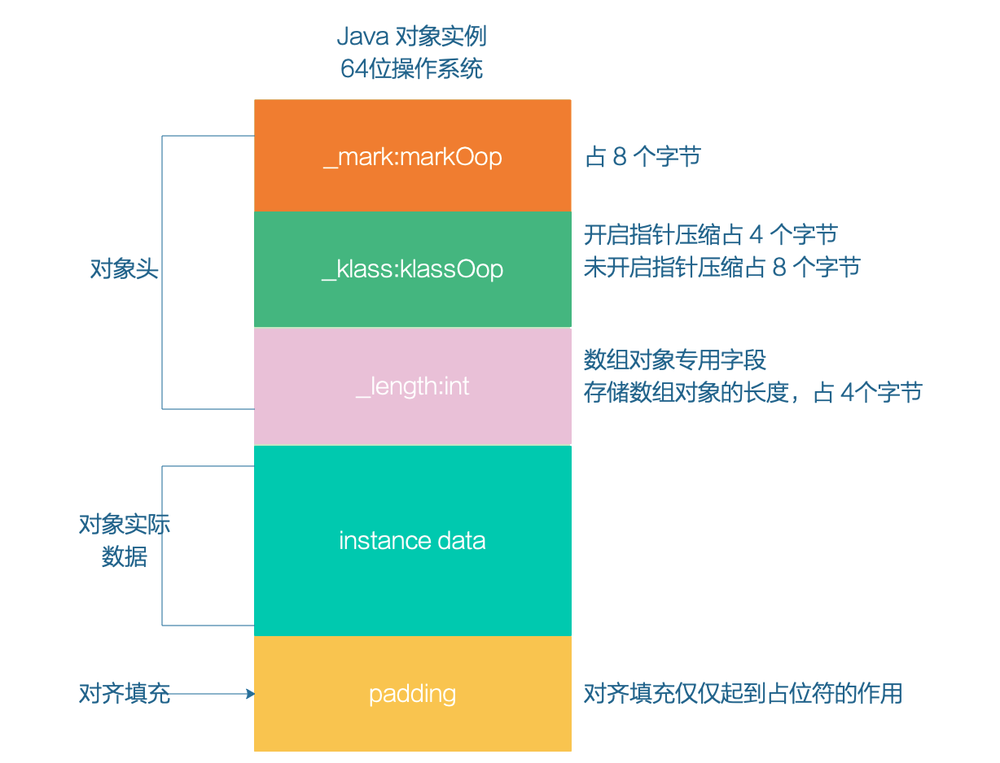

一般来说，对象的大小是由**对象头**、**实例数据**和**对齐填充**三个部分组成的。

+ **对象头的大小**：
    - 在 **32 位 JVM** 上是 **8 字节**。
    - 在 **64 位 JVM** 上是 **16 字节**（如果开启了压缩指针，就是 **12 字节**）。
+ **实例数据的大小**：取决于对象的**属性**和它们的**类型**。对于 `new Object()` 来说，**Object 类本身没有实例字段**，因此这部分可能非常小或者为零。
+ **对齐填充的大小**：取决于对象头和实例数据的大小，以确保对象的总大小是 **8 字节的倍数**。

一般来说，目前的操作系统都是 **64 位**的，并且 **JDK 8** 中的压缩指针是默认开启的，因此在 **64 位 JVM** 上，`new Object()` 的大小是 **16 字节**（**12 字节的对象头** + **4 字节的对齐填充**）。


## 对象怎么访问定位？
Java 中对象的访问定位是 JVM 通过 **对象引用** 找到实际内存地址并操作对象的过程。对象的访问定位主要依赖堆内存中的对象布局和 JVM 的具体实现策略。

**1. 对象的存储位置**

1. **堆内存**：
    - 所有对象都存储在堆中（特别是实例数据部分）。
    - 对象头（Header）和实例数据存储在一起，堆内存的地址就是对象的实际存储位置。
2. **栈中的对象引用**：
    - 对象引用本身存储在栈帧（Stack Frame）中，引用指向堆内存中对象的地址。

---

**2. 对象访问定位的两种主要方式**

JVM 根据实现策略，可以通过以下两种方式访问堆中的对象：

**2.1 句柄访问方式**

1. **结构**：
    - JVM 在堆中维护一个固定大小的句柄池，每个对象的句柄占据一个条目。
    - 句柄池的每个条目包含： 
        * 对象实例数据的指针。
        * 对象类型数据（Class Metadata）的指针。
    - 栈中的引用指向句柄，而不是直接指向对象。
2. **访问流程**：
    - 栈中的对象引用定位到句柄池条目。
    - 通过句柄中的指针找到对象的实际实例数据和类型数据。
3. **优点**：
    - 对象在堆内存中的实际位置变化时，只需要更新句柄中的指针，而栈中的引用无需修改。
    - 特别适合需要频繁移动对象的垃圾回收器（如压缩或复制算法）。
4. **缺点**：
    - 每次访问需要多一次间接定位（引用 → 句柄 → 实例数据），性能稍逊。

---

**2.2 直接指针访问方式**

1. **结构**：
    - 对象的引用直接指向堆中的实例数据。
    - 对象头中包含类型指针，用于定位类元数据（Class Metadata）。
2. **访问流程**：
    - 栈中的引用直接找到对象实例数据。
    - 如果需要类型信息，通过对象头中的类型指针定位到类元数据。
3. **优点**：
    - 访问速度更快，因为少了一次间接寻址。
    - 常用于垃圾回收器不需要频繁移动对象的场景。
4. **缺点**：
    - 如果对象位置发生变化（如压缩整理堆时），栈中所有指向该对象的引用都需要更新，成本较高。

---

**3. 两种方式的对比**

| **特性** | **句柄访问** | **直接指针访问** |
| --- | --- | --- |
| **访问速度** | 多一次间接定位，速度稍慢 | 直接定位实例数据，速度更快 |
| **内存管理复杂度** | 位置变化只需更新句柄指针 | 位置变化需更新所有引用 |
| **适用场景** | 适合对象频繁移动（如压缩 GC） | 适合对象位置较为稳定的场景 |


---

**4. JVM 的实际选择**

现代 JVM（如 HotSpot）大多使用 **直接指针访问方式**，因为：

1. **现代垃圾回收器优化**：如 G1、ZGC，通过维护专门的指针表或分代管理减少对象移动的开销。
2. **性能优势**：直接指针访问省去了句柄访问中的间接定位。

---

**5. 总结：对象访问的关键过程**

1. 栈中的引用记录对象的访问入口（句柄或直接指针）。
2. 如果是句柄访问，通过句柄定位到对象实例数据和类型元数据。
3. 如果是直接指针访问，引用直接指向对象实例数据，同时通过对象头定位类型元数据。

**实际实现依赖于 JVM 的选择和垃圾回收器的策略**，但现代 JVM 更倾向于性能优先的 **直接指针访问方式**。如果还有疑问，欢迎继续讨论！


## 说一下对象有哪几种引用？
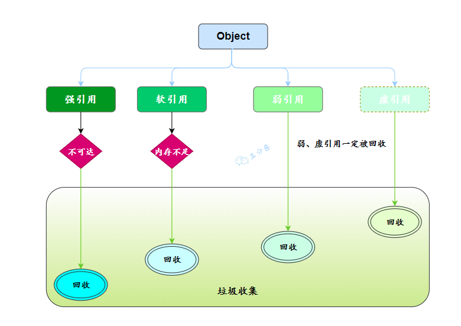

**Java 中的四种引用类型：**

1. **强引用（Strong Reference）**：**普通引用**，只要存在就不会被回收。
2. **软引用（Soft Reference）**：只有当**内存不足时才回收**。
3. **弱引用（Weak Reference）**：**垃圾回收时会被回收**，不管内存是否足够。
4. **虚引用（Phantom Reference）**：不影响对象生命周期，用于回收时**收到通知**。

## Java 堆的内存分区了解吗？
**Java 堆**被划分为**新生代**和**老年代**两个区域。

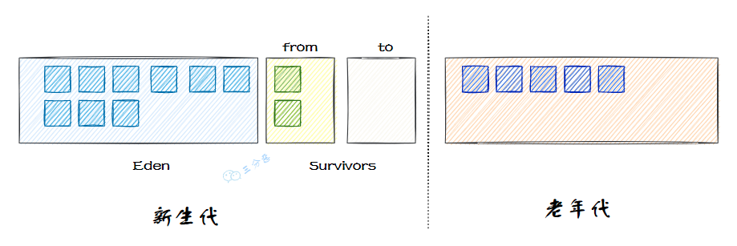  
新生代又被划分为**Eden 区**和两个幸存者区 **Survivor 空间**（**From** 和 **To**）。

1. **Eden 空间**：新对象首先分配在Eden区。当 Eden 区填满时，会触发一次**Minor GC**（新生代GC），清除不再使用的对象。存活对象被移动到Survivor区
2. **Survivor 空间**：每次 Minor GC 后，仍然存活的对象会从 Eden 区或 From 区复制到 To 区。From 和 To 区可以交替使用。

对象在新生代中经历多次 GC 后，如果仍然存活，会被移动到老年代。

## 说一下新生代的区域划分？
虚拟机将内存分为一块较大的**Eden 空间**和两块较小的**Survivor 空间**。每次分配内存时，只使用 Eden 和其中一块 Survivor。

发生垃圾收集时，将 Eden 和 Survivor 中仍然存活的对象一次性复制到另外一块 Survivor 空间上。然后，直接清理掉 Eden 和已用过的那块 Survivor 空间。

默认情况下，**Eden** 和 **Survivor** 的大小比例是 **8∶1**。

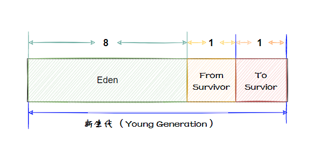

## 对象什么时候会进入老年代？
①、**长期存活的对象将进入老年代**  
对象在年轻代中存活足够长的时间（即经过足够多的垃圾回收周期）后，会晋升到老年代。每次 GC 未被回收的对象，其年龄会增加。当对象的年龄超过一个特定阈值（默认通常是 15），它就会被移动到老年代。这个年龄阈值可以通过 JVM 参数 **XX:MaxTenuringThreshold** 来设置。

②、**大对象直接进入老年代**

当对象的大小超过设定**阈值**后，直接分配到**老年代**。减少在**年轻代**和**老年代**之间的数据复制。  
为了避免在年轻代中频繁复制大对象，JVM 提供了一种策略，允许大对象直接在老年代中分配。这些是所谓的“**大对象**”，其大小超过了预设的阈值（由 JVM 参数 **-XX:PretenureSizeThreshold** 控制）。直接在老年代分配可以减少在年轻代和老年代之间的数据复制。

③、**动态对象年龄判定**  
除了固定的年龄阈值，还会根据各个年龄段对象的存活大小和内存空间等因素动态调整对象的晋升策略。比如说，在 **Survivor 空间**中相同年龄的所有对象大小总和大于 Survivor 空间的一半，那么年龄大于或等于该年龄的对象就可以直接进入老年代。

+ 什么是 Stop The World ? 什么是 OopMap ？什么是安全点？
1. **Stop The World**：在 JVM 中，进行垃圾回收（GC）时，会暂停所有应用程序线程的执行，直到垃圾回收完成，之后应用程序的线程才能恢复运行，这种现象就被称为 **STW**。
2. **OopMap**：**OopMap** 是指向对象引用的映射表。它用于记录堆栈中的对象引用位置，以便 GC 时能正确地标识哪些对象需要被标记和回收。
3. **安全点**：**安全点** 是指程序执行中的某些点，在这些点上 JVM 可以暂停应用程序线程以执行 GC。这些点通常位于方法调用或循环的入口处。

## 对象一定分配在堆中吗？有没有了解逃逸分析技术？
逃逸分析（Escape Analysis）是 JVM 在编译时进行的一项优化技术，用于分析对象的生命周期以及它们是否会“逃逸”出当前的作用域或线程。通过逃逸分析，JVM 可以确定哪些对象可以在栈上分配内存，避免在堆上分配，从而减少垃圾回收的压力。

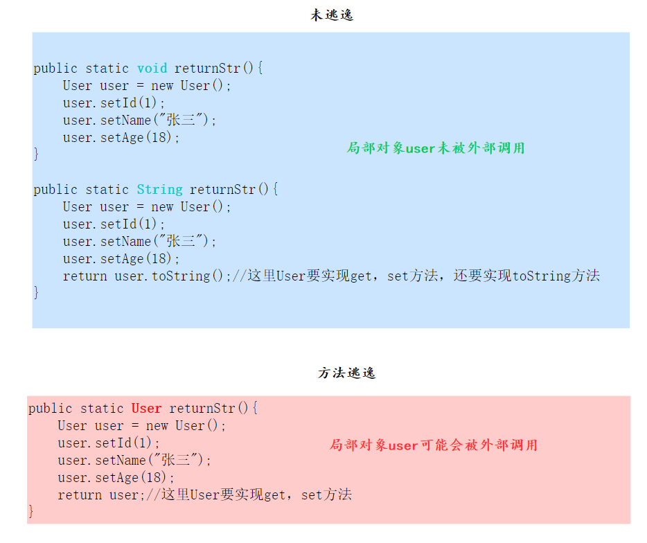

### 逃逸分析的关键概念：
1. **逃逸**：指对象被外部访问或引用，可能是在方法外部或者跨线程的访问。若对象的引用不会在方法外部使用或被其他线程访问，它就被认为不会“逃逸”。


    - **方法逃逸**：对象作为参数传递到方法外部或作为返回值。
    - **线程逃逸**：对象被传递到其他线程中，导致该对象的引用被多个线程共享。
2. **逃逸分析的优化策略**：
    - **栈上分配**：如果编译器确认某个对象不会逃逸到线程之外，那么该对象就可以在栈上分配，方法执行完毕后对象的内存会被自动销毁，避免了垃圾回收的开销。
    - **同步消除**：如果编译器确定某个变量不会被其他线程访问，就可以安全地去掉该变量的同步控制，避免了同步的性能开销。
    - **标量替换**：如果编译器发现一个对象的成员变量不会被方法外部访问，可以将这个对象拆解成原始类型的多个字段，在栈上直接分配和访问，避免了对象创建和垃圾回收的开销。

### 总结：
逃逸分析通过分析对象的引用范围和生命周期，能够优化内存分配和线程同步，减少不必要的内存开销，提高程序的执行效率。

## 内存溢出和内存泄漏是什么意思？
①、**内存溢出**：内存溢出是指程序在运行时请求分配的内存超过了JVM可用内存的上限，导致JVM无法分配足够的内存，抛出OutOfMemoryError（简称OOM）异常。

> + **堆内存不足（Java heap space）**：
> + 创建了过多对象（如无限添加元素到List），超出-Xmx设置的最大堆大小。
> + **栈溢出（StackOverflowError）**：
> + 方法调用栈深度超过-Xss限制（如无限递归）。
>

②、**内存泄漏**：内存泄漏是指程序中不再使用的对象仍然被引用，从而导致无法被回收，造成**内存资源浪费**。

## 能手写内存溢出的例子吗？
当谈到内存溢出（`OutOfMemoryError`）时，通常指的是JVM在执行程序时无法分配足够的内存来继续执行程序。这种错误可能发生在堆内存、方法区（或称为元空间）或直接内存等区域。以下是一些常见的内存溢出场景及其手写代码示例：

### **堆内存溢出：**
堆内存溢出通常是由于创建大量对象而导致的。如果堆内存不够用，JVM会抛出 `java.lang.OutOfMemoryError: Java heap space` 错误。

```java
public class HeapOutOfMemory {
    public static void main(String[] args) {
        // 创建一个无限循环的对象
        while (true) {
            // 每次创建一个对象，导致堆内存被耗尽
            byte[] array = new byte[1024 * 1024];  // 1MB
        }
    }
}
```

**说明：**

+ 这个程序每次都创建一个1MB大小的字节数组，随着程序的不断执行，堆内存会被迅速填满，最终导致 `OutOfMemoryError`。
+ 你可以通过 `-Xmx` 参数来设置堆内存的最大值，例如：`-Xmx10m` 设置最大堆内存为10MB。

### **方法区/元空间溢出：**
如果大量的类被动态生成和加载，且这些类没有及时卸载，可能会导致方法区（在JVM 8以后是元空间）溢出，抛出 `java.lang.OutOfMemoryError: Metaspace` 错误。

```java
import sun.misc.Unsafe;

public class MetaspaceOutOfMemory {
    public static void main(String[] args) {
        Unsafe unsafe = getUnsafe();
        while (true) {
            // 通过反射创建大量的类，导致方法区内存溢出
            unsafe.defineClass("Class" + System.nanoTime(), new byte[0], 0, 0, null, null);
        }
    }

    private static Unsafe getUnsafe() {
        try {
            var field = Unsafe.class.getDeclaredField("theUnsafe");
            field.setAccessible(true);
            return (Unsafe) field.get(null);
        } catch (Exception e) {
            throw new RuntimeException("Unable to get Unsafe instance", e);
        }
    }
}
```

**说明：**

+ 这个程序通过 `Unsafe` 类动态加载新类，导致JVM不断在元空间中分配内存，直到内存耗尽，抛出 `OutOfMemoryError`。
+ 你可以通过 `-XX:MaxMetaspaceSize` 参数限制元空间的大小，例如：`-XX:MaxMetaspaceSize=10m`。

### **直接内存溢出：**
直接内存是指通过 `java.nio.Buffer` 类（如 `ByteBuffer`）分配的内存，它并不属于JVM的堆内存。在堆外的内存分配过多时，可能会抛出 `java.lang.OutOfMemoryError: Direct buffer memory` 错误。

```java
import java.nio.ByteBuffer;

public class DirectMemoryOutOfMemory {
    public static void main(String[] args) {
        while (true) {
            // 分配1MB的直接内存
            ByteBuffer.allocateDirect(1024 * 1024);  // 1MB
        }
    }
}
```

**说明：**

+ 这个程序不断分配1MB大小的直接内存，直到JVM无法分配更多的内存，从而抛出 `OutOfMemoryError`。
+ 你可以通过 `-XX:MaxDirectMemorySize` 参数设置最大直接内存大小，例如：`-XX:MaxDirectMemorySize=10m`。

### **栈内存溢出：**
栈内存溢出通常发生在方法调用递归过深时，导致栈空间耗尽，抛出 `java.lang.StackOverflowError`。虽然它不属于 `OutOfMemoryError` 类型，但它也是一种内存溢出问题。

```java
public class StackOverflow {
    public static void recursiveMethod() {
        // 无限递归，栈内存会溢出
        recursiveMethod();
    }

    public static void main(String[] args) {
        recursiveMethod();
    }
}
```

**说明：**

+ 这个程序通过递归调用导致栈内存被耗尽，从而抛出 `StackOverflowError`。可以通过设置 `-Xss` 来调整栈内存的大小，例如：`-Xss512k` 设置栈内存为512KB。

### 总结：
+ **堆内存溢出**：创建大量对象导致堆内存不足。
+ **方法区/元空间溢出**：大量类加载导致方法区或元空间溢出。
+ **直接内存溢出**：通过 `ByteBuffer` 等方式分配堆外内存导致溢出。
+ **栈内存溢出**：递归调用过深导致栈空间耗尽。

每种内存溢出都可以通过合适的JVM参数来调优，比如 `-Xmx`、`-XX:MaxMetaspaceSize` 和 `-XX:MaxDirectMemorySize`，也可以通过优化代码逻辑来避免内存溢出的发生。

## 内存泄漏可能由哪些原因导致呢？
总结起来，内存泄漏的常见原因有很多，通常是因为一些对象或资源的引用无法被及时释放，导致这些对象无法被垃圾回收，最终消耗过多内存。以下是对你列出的几种常见内存泄漏原因的总结：


### ① 静态集合中对象的积累
在静态集合中添加的对象没有被及时清理，会导致这些对象永远无法被垃圾回收，造成内存泄漏。

**示例**：

```java
public class OOM {
    static List<Object> list = new ArrayList<>();

    public void oomTests() {
        Object obj = new Object();
        list.add(obj);  // 对象添加到静态集合中，没有清理
    }
}
```

**原因**：

+ 静态集合（如 `list`）的生命周期与类的生命周期相同，直到程序退出，它持有的对象引用不会被垃圾回收，导致内存泄漏。

### ② 单例模式下对象持有外部引用
单例模式如果不正确处理对象持有的外部引用，也可能导致内存泄漏。例如，单例类持有其他对象的引用，而这些对象在不再需要时未及时释放。

**示例**：

```java
public class Singleton {
    private static Singleton instance;
    private Object externalObject;

    private Singleton() {
        externalObject = new Object();  // 持有外部对象的引用
    }

    public static Singleton getInstance() {
        if (instance == null) {
            instance = new Singleton();
        }
        return instance;
    }
}
```

**原因**：

+ 单例类的生命周期通常与应用程序的生命周期一致，若单例类持有外部对象的引用而未及时释放，这些对象就无法被垃圾回收，导致内存泄漏。

### ③ 数据库、IO、Socket 等连接资源未及时关闭
未能及时关闭数据库连接、文件流、Socket 等资源，可能导致这些连接或流占用的资源无法被释放，从而造成内存泄漏。

**示例**：

```java
try {
    Connection conn = DriverManager.getConnection("url", "", "");
    Statement stmt = conn.createStatement();
    ResultSet rs = stmt.executeQuery("SELECT * FROM ...");
} catch (Exception e) {
    e.printStackTrace();
} finally {
    // 忘记关闭数据库连接
}
```

**原因**：

+ 未关闭的数据库连接、文件流、网络连接等会导致资源占用无法释放，造成内存泄漏。正确的做法是通过 `finally` 块或 `try-with-resources` 来确保资源被关闭。

### ④ 变量的作用域不合理
如果变量的作用域过大，可能导致对象在不再需要时仍然存在于内存中。

**示例**：

```java
class Simple {
    Object object;
    
    public void method1() {
        object = new Object();
        //...其他代码
        // method1 执行完成后，object 对象仍然存在，但不再使用
    }
}
```

**原因**：

+ `object` 的生命周期比 `method1()` 更长，如果没有适时清理或将引用置为 `null`，它就不会被垃圾回收。

### ⑤ 哈希值变化但对象未更新
在 `HashMap` 等集合中，如果对象的哈希值发生变化，但对象本身未发生变化，可能导致哈希冲突，进而导致对象无法被及时清理。

**示例**：

```java
class MyObject {
    private String key;

    @Override
    public int hashCode() {
        return key.hashCode();
    }

    // 假设某个属性值改变了但 hashCode 没有更新，导致该对象无法在 HashMap 中找到位置
}
```

**原因**：

+ 如果对象的 `hashCode` 在存储后发生变化，但没有更新 `Map` 中该对象的存储位置，会导致它无法被清理。这是 `String` 类被设计为不可变的原因之一，因为不可变对象的哈希值不会变化。

### ⑥ ThreadLocal 未清除
使用 `ThreadLocal` 存储线程特定的数据时，如果没有在使用完毕后调用 `remove()` 方法清除数据，可能导致该线程的 `ThreadLocal` 数据无法被回收，造成内存泄漏。

**示例**：

```java
public class ThreadLocalLeak {
    private static ThreadLocal<Object> threadLocal = new ThreadLocal<>();

    public static void main(String[] args) {
        threadLocal.set(new Object());
        // 忘记调用 threadLocal.remove()，导致对象无法回收
    }
}
```

**原因**：

+ 如果没有手动调用 `remove()` 清除 `ThreadLocal` 中存储的对象，线程会持续持有对该对象的引用，直到线程结束时才会被清理。对于长时间运行的应用程序，线程本身不会结束，从而导致内存泄漏。

---

### 总结：
内存泄漏的根本原因通常是由于对象的引用未及时释放，导致这些对象无法被垃圾回收。常见的内存泄漏场景包括：

1. 静态集合中持续增加对象，没有及时清理。
2. 单例模式下持有外部引用，未能释放。
3. 数据库、IO等连接未及时关闭。
4. 变量作用域不合理，导致不再使用的对象不能及时回收。
5. `HashMap` 中对象的哈希值变化未同步更新，导致对象无法被清理。
6. 使用 `ThreadLocal` 时未调用 `remove()`，导致线程局部变量无法被回收。

为避免内存泄漏，应当：

+ 定期清理不再使用的对象。
+ 在适当时机关闭资源（数据库连接、文件流等）。
+ 使用合适的作用域来控制对象生命周期。
+ 避免不必要的静态引用。
+ 及时清理 `ThreadLocal` 数据。

---

## 有没有处理过内存泄漏问题？是如何定位的？
<details class="lake-collapse"><summary id="uf0cafda0"><span class="ne-text">精简版</span></summary><p id="u8570e0cc" class="ne-p"><strong><span class="ne-text">我在做 rpc 框架时，（实现 Kryo 序列化时为了保证线程安全用了 </span></strong><code class="ne-code"><strong><span class="ne-text">ThreadLocal</span></strong></code><strong><span class="ne-text">）</span></strong><span class="ne-text">，但是没有</span><strong><span class="ne-text">及时清理导致出现了内存泄漏问题</span></strong><span class="ne-text">。</span></p><p id="uea5758e0" class="ne-p"><strong><span class="ne-text">是的，我处理过内存泄漏问题，定位步骤如下：</span></strong></p><ol class="ne-ol"><li id="u784f3fbe" data-lake-index-type="0"><strong><span class="ne-text">用 </span></strong><code class="ne-code"><strong><span class="ne-text">jps</span></strong></code><strong><span class="ne-text"> 和 </span></strong><code class="ne-code"><strong><span class="ne-text">top -p [pid]</span></strong></code><strong><span class="ne-text">命令查看进程ID和内存占用情况</span></strong><span class="ne-text">。</span></li><li id="ued3a0074" data-lake-index-type="0"><strong><span class="ne-text">用 </span></strong><code class="ne-code"><strong><span class="ne-text">jstack [pid]</span></strong></code><strong><span class="ne-text"> 检查线程，判断是否死锁或死循环</span></strong><span class="ne-text">。</span></li><li id="u459e05c9" data-lake-index-type="0"><strong><span class="ne-text">用 </span></strong><code class="ne-code"><strong><span class="ne-text">jstat -gc [pid]</span></strong></code><strong><span class="ne-text">  查看垃圾回收（GC）情况， 频繁的 Full GC 通常是内存泄漏的标志。  </span></strong><span class="ne-text">。</span></li><li id="ud8c0fec5" data-lake-index-type="0"><strong><span class="ne-text">用 </span></strong><code class="ne-code"><strong><span class="ne-text">jmap</span></strong></code><strong><span class="ne-text"> 生成堆快照，再用 VisualVM 分析对象引用，定位内存泄漏</span></strong><span class="ne-text">。</span></li></ol><p id="ua1574bf7" class="ne-p"><br></p></details>
具体得看这个

[JVM面试题，54道Java虚拟机八股文（1.5万字51张手绘图），面渣逆袭必看👍](https://javabetter.cn/sidebar/sanfene/jvm.html#_20-有没有处理过内存泄漏问题-是如何定位的)

**内存泄漏**是指程序在运行过程中由于未能正确释放已分配的内存，导致内存无法被重用，从而引发内存耗尽等问题。

当时在做技术派项目的时候（**就说之前自己做项目的时候**），由于 **ThreadLocal** 没有及时清理导致出现了内存泄漏问题。

常用的可视化监控工具有 **JConsole**、**VisualVM**、**JProfiler**、**Eclipse Memory Analyzer (MAT)** 等。

也可以使用 JDK 自带的 **jmap**、**jstack**、**jstat** 等命令行工具来配合内存泄漏问题的排查。

严重的内存泄漏往往伴随频繁的 **Full GC**，所以排查内存泄漏问题时，可以从 **Full GC** 入手。

**排查步骤**：

① **使用 **`**jps -l**` 查看运行的 Java 进程 ID。

② **使用 **`**top -p [pid]**` 查看进程使用 CPU 和内存占用情况。

③ **使用 **`**top -Hp [pid]**` 查看进程下的所有线程占用 CPU 和内存情况。

④ **抓取线程栈**：`jstack -F 29452 > 29452.txt`，可以多抓几次做个对比。查看是否有线程死锁、死循环或长时间等待等问题。

⑤ **使用 **`**jstat -gcutil [pid] 5000 10**` 每隔 5 秒输出 GC 信息，输出 10 次，查看 **YGC**（年轻代垃圾回收） 和 **Full GC** 次数。常会出现 YGC 不增加或增加缓慢，而 **Full GC** 增加很快。

+ 或使用 `**jstat -gccause [pid] 5000**` 输出 GC 摘要信息。
+ 或使用 `**jmap -heap [pid]**` 查看堆的摘要信息，关注老年代内存使用是否达到阀值，若达到阀值就会执行 **Full GC**。

如果发现 **Full GC** 次数太多，就很大概率存在内存泄漏了。

⑥ **生成 dump 文件**，然后借助可视化工具分析哪个对象非常多，基本就能定位到问题根源。

执行命令 `jmap -dump:format=b,file=heap.hprof 10025` 会输出进程 10025 的堆快照信息，保存到文件 **heap.hprof** 中。

⑦ **使用图形化工具分析**，如 JDK 自带的 **VisualVM**，从菜单 > 文件 > 装入 dump 文件。然后在结果观察内存占用最多的对象，找到内存泄漏的源头。

>     1. `**jps**`
>         * **作用**：列出当前所有 Java 进程及其 PID。
>         * **场景**：确定需要排查的 Java 进程。
>     2. `**jmap**`
>         * **作用**：生成堆内存快照或查看堆内存使用情况。
>         * **场景**：分析内存泄漏，查看内存分配情况。
>     3. `**jstack**`
>         * **作用**：抓取线程栈信息。
>         * **场景**：排查死锁、死循环或线程长时间等待问题。
>     4. `**jstat**`
>         * **作用**：监控 JVM 的垃圾回收（GC）情况。
>         * **场景**：分析垃圾回收活动，检查 Full GC 是否频繁。
>     5. **VisualVM**
>         * **作用**：图形化工具监控 JVM，查看线程、内存、CPU 使用情况。
>         * **场景**：实时监控和分析内存泄漏、CPU 使用、堆快照。
>     6. **Eclipse Memory Analyzer (MAT)**
>         * **作用**：分析堆转储文件，定位内存泄漏。
>         * **场景**：分析堆快照，定位内存泄漏源头。
>     7. `**top**`** 和 **`**top -Hp**`
>         * **作用**：监控系统资源，包括进程和线程的 CPU、内存占用。
>         * **场景**：查看进程/线程的资源消耗，诊断性能问题。
>

---

##  Java 哪些内存区域会发生 OOM（ 内存溢出  ）？为什么？  
Java 中会发生 **OutOfMemoryError (OOM)** 的内存区域主要有以下几种：

1. **堆（Heap）**
    - **原因**：堆是用于存储对象实例的内存区域，Java 在运行时动态分配内存给对象。如果堆内存空间不足以分配新的对象实例，JVM 就会抛出 `java.lang.OutOfMemoryError: Java heap space` 错误。通常发生在以下几种情况： 
        * 程序中有大量对象创建，导致堆内存不够用。
        * 堆内存的配置过小。
        * 代码中存在内存泄漏，无法及时释放不再使用的对象。
2. **方法区（Method Area）（永久代/元空间溢出）**
    - **原因**：方法区（在 Java 8 及以前版本是永久代，Java 8 以后称为 Metaspace）用于存储类的元数据、方法、常量池等信息。如果类的加载过多，或常量池过大，方法区可能会耗尽空间，抛出 `java.lang.OutOfMemoryError: PermGen space` 或 `java.lang.OutOfMemoryError: Metaspace` 错误。 
        * 例如，类的动态生成（例如使用反射动态生成大量类），或通过一些框架（如 CGLIB、Spring）频繁生成代理类，都可能导致方法区内存溢出。
3. **栈（Stack）**
    - **原因**：栈内存用于存储方法调用的栈帧，每个线程都会有独立的栈空间。当栈深度过深，通常由于递归调用过多导致栈溢出。
    - 会抛出 `java.lang.StackOverflowError` 错误。如果 JVM 中的线程数非常多且每个线程的栈空间设置过大，也可能导致栈内存耗尽，抛出 `java.lang.OutOfMemoryError: unable to create new native thread` 错误。
4. **直接内存（Direct Memory）**
    - **原因**：直接内存（Direct Memory）不受JVM堆管理，它可以通过`java.nio`包下的类直接访问。如果程序大量分配直接内存，超出系统物理内存或者操作系统对直接内存的限制，就会抛出 `java.lang.OutOfMemoryError: Direct buffer memory` 错误。

## 有没有处理过内存溢出问题？
<details class="lake-collapse"><summary id="u468b6e83"><strong><span class="ne-text">以前做项目的时候，由于上传的文件过大没有正确处理，导致内存溢出，程序崩溃。</span></strong></summary><p id="ued4a823c" class="ne-p"><strong><span class="ne-text">是的，处理过内存溢出问题，解决步骤如下：</span></strong></p><ol class="ne-ol"><li id="uc76be7f0" data-lake-index-type="0"><strong><span class="ne-text">查看错误日志</span></strong><span class="ne-text">：确认是堆内存、元空间还是直接内存溢出。</span></li><li id="ub3ac121f" data-lake-index-type="0"><span class="ne-text">排查内存溢出：</span><code class="ne-code"><strong><span class="ne-text">jstack</span></strong></code><strong><span class="ne-text"> 查线程死循环，</span></strong><code class="ne-code"><strong><span class="ne-text">jstat</span></strong></code><strong><span class="ne-text"> 观察 GC 频率，</span></strong><code class="ne-code"><strong><span class="ne-text">jmap</span></strong></code><strong><span class="ne-text"> 导出堆快照通过 VisualVM 分析内存占用</span></strong></li><li id="u6a42e92e" data-lake-index-type="0"><strong><span class="ne-text">监控堆内存使用情况</span></strong><span class="ne-text">：使用 </span><code class="ne-code"><span class="ne-text">jstat -gc</span></code><span class="ne-text"> 查看垃圾回收情况，判断是否频繁发生 Full GC。</span></li><li id="u38c9b839" data-lake-index-type="0"><strong><span class="ne-text">分析堆快照</span></strong><span class="ne-text">：使用 </span><code class="ne-code"><span class="ne-text">jmap</span></code><span class="ne-text"> 生成堆快照，借助 VisualVM 分析内存占用，定位大对象或内存泄漏。</span></li><li id="u6aa4fd95" data-lake-index-type="0"><strong><span class="ne-text">根据分析调整代码</span></strong><span class="ne-text">，比如优化大对象处理、关闭资源，或增加堆内存 </span><code class="ne-code"><span class="ne-text">-Xmx</span></code><span class="ne-text"> 值，然后测试验证。</span></li></ol><p id="ucb768b32" class="ne-p"><span class="ne-text"></span></p><p id="u36be2df9" class="ne-p"><span class="ne-text">可以的，总结成 </span><strong><span class="ne-text">简洁 3 步排查法</span></strong><span class="ne-text">👇</span></p><h3 id="33956ca6"><strong><span class="ne-text">第一步：确定 OOM 类型</span></strong></h3><ol class="ne-ol"><li id="u9ea273f9" data-lake-index-type="0"><strong><span class="ne-text">堆内存溢出（Heap OOM）</span></strong></li></ol><ul class="ne-list-wrap"><ul ne-level="1" class="ne-ul"><li id="uc8eb5dca" data-lake-index-type="0"><strong><span class="ne-text">错误</span></strong><span class="ne-text">：</span><code class="ne-code"><span class="ne-text">java.lang.OutOfMemoryError: Java heap space</span></code></li><li id="u7def4965" data-lake-index-type="0"><strong><span class="ne-text">原因</span></strong><span class="ne-text">：对象太多，GC 回收不掉（List、Map 过大等）。</span></li><li id="u4eba67e7" data-lake-index-type="0"><strong><span class="ne-text">解决</span></strong><span class="ne-text">：优化代码，减少大对象，增加 </span><code class="ne-code"><span class="ne-text">-Xmx</span></code><span class="ne-text">。</span></li></ul></ul><ol start="2" class="ne-ol"><li id="u7ad34204" data-lake-index-type="0"><strong><span class="ne-text">GC 过载（GC Overhead）</span></strong></li></ol><ul class="ne-list-wrap"><ul ne-level="1" class="ne-ul"><li id="u51fc4dd8" data-lake-index-type="0"><strong><span class="ne-text">错误</span></strong><span class="ne-text">：</span><code class="ne-code"><span class="ne-text">java.lang.OutOfMemoryError: GC overhead limit exceeded</span></code></li><li id="u445dce5e" data-lake-index-type="0"><strong><span class="ne-text">原因</span></strong><span class="ne-text">：JVM 花太多时间 GC，但回收的内存太少。</span></li><li id="u7f29fc91" data-lake-index-type="0"><strong><span class="ne-text">解决</span></strong><span class="ne-text">：用 </span><code class="ne-code"><span class="ne-text">jstat</span></code><span class="ne-text"> 观察 GC，调 </span><code class="ne-code"><span class="ne-text">-XX:+UseG1GC</span></code><span class="ne-text"> 或增大堆。</span></li></ul></ul><ol start="3" class="ne-ol"><li id="ue6eaab8c" data-lake-index-type="0"><strong><span class="ne-text">元空间溢出（Metaspace OOM）</span></strong></li></ol><ul class="ne-list-wrap"><ul ne-level="1" class="ne-ul"><li id="u2ebac187" data-lake-index-type="0"><strong><span class="ne-text">错误</span></strong><span class="ne-text">：</span><code class="ne-code"><span class="ne-text">java.lang.OutOfMemoryError: Metaspace</span></code></li><li id="ubb8209db" data-lake-index-type="0"><strong><span class="ne-text">原因</span></strong><span class="ne-text">：类加载过多（CGLIB 代理、Spring 热部署）。</span></li><li id="u74aba05b" data-lake-index-type="0"><strong><span class="ne-text">解决</span></strong><span class="ne-text">：增加 </span><code class="ne-code"><span class="ne-text">-XX:MaxMetaspaceSize</span></code><span class="ne-text">，避免类加载器泄漏。</span></li></ul></ul><ol start="4" class="ne-ol"><li id="ua8926cdd" data-lake-index-type="0"><strong><span class="ne-text">直接内存溢出（Direct Buffer OOM）</span></strong></li></ol><ul class="ne-list-wrap"><ul ne-level="1" class="ne-ul"><li id="ua2890503" data-lake-index-type="0"><strong><span class="ne-text">错误</span></strong><span class="ne-text">：</span><code class="ne-code"><span class="ne-text">java.lang.OutOfMemoryError: Direct buffer memory</span></code></li><li id="uec725030" data-lake-index-type="0"><strong><span class="ne-text">原因</span></strong><span class="ne-text">：NIO 直接内存耗尽（Netty、ByteBuffer）。</span></li><li id="uc6748957" data-lake-index-type="0"><strong><span class="ne-text">解决</span></strong><span class="ne-text">：限制 </span><code class="ne-code"><span class="ne-text">-XX:MaxDirectMemorySize</span></code><span class="ne-text">，及时释放 </span><code class="ne-code"><span class="ne-text">ByteBuffer</span></code><span class="ne-text">。</span></li></ul></ul><hr id="eVAqe" class="ne-hr"><h3 id="378b2cfc"><strong><span class="ne-text">第二步：排查 OOM</span></strong></h3><ol class="ne-ol"><li id="ud6febef8" data-lake-index-type="0"><code class="ne-code"><strong><span class="ne-text">jmap</span></strong></code><strong><span class="ne-text"> 导出堆快照</span></strong></li></ol><pre data-language="shell" id="YuiZc" class="ne-codeblock language-shell"><code>jmap -dump:live,format=b,file=heap.bin [pid]</code></pre><ul class="ne-list-wrap"><ul ne-level="1" class="ne-ul"><li id="u389d6fd4" data-lake-index-type="0"><span class="ne-text">用 </span><strong><span class="ne-text">VisualVM / MAT</span></strong><span class="ne-text"> 分析 </span><strong><span class="ne-text">哪个对象占内存最多</span></strong><span class="ne-text">。</span></li></ul></ul><ol start="2" class="ne-ol"><li id="uc29b8a09" data-lake-index-type="0"><code class="ne-code"><strong><span class="ne-text">jstat</span></strong></code><strong><span class="ne-text"> 观察 GC 频率</span></strong></li></ol><pre data-language="shell" id="V2tKa" class="ne-codeblock language-shell"><code>jstat -gcutil [pid] 1000</code></pre><ul class="ne-list-wrap"><ul ne-level="1" class="ne-ul"><li id="ud896c11a" data-lake-index-type="0"><strong><span class="ne-text">Old Gen 长期 100%</span></strong><span class="ne-text"> ➝ 堆不够大。</span></li><li id="u06c959e2" data-lake-index-type="0"><strong><span class="ne-text">Full GC 频繁</span></strong><span class="ne-text"> ➝ 可能是内存泄漏。</span></li></ul></ul><ol start="3" class="ne-ol"><li id="ud38dfe8b" data-lake-index-type="0"><code class="ne-code"><strong><span class="ne-text">jstack</span></strong></code><strong><span class="ne-text"> 查线程死循环</span></strong></li></ol><pre data-language="shell" id="nflQN" class="ne-codeblock language-shell"><code>jstack [pid] &gt; thread_dump.txt</code></pre><ul class="ne-list-wrap"><ul ne-level="1" class="ne-ul"><li id="u8af3420d" data-lake-index-type="0"><span class="ne-text">检查是否有大量 </span><code class="ne-code"><span class="ne-text">BLOCKED</span></code><span class="ne-text"> 或 </span><code class="ne-code"><span class="ne-text">WAITING</span></code><span class="ne-text"> 线程。</span></li></ul></ul><hr id="by1ul" class="ne-hr"><h3 id="01e022f1"><strong><span class="ne-text">第三步：解决 OOM</span></strong></h3><p id="u53fc21b1" class="ne-p"><strong><span class="ne-text">OM 类型及解决方案</span></strong></p><h3 id="heap-oom"><strong><span class="ne-text">Heap OOM</span></strong></h3><ol class="ne-ol"><li id="ud9f58a28" data-lake-index-type="0"><strong><span class="ne-text">增大堆内存</span></strong><span class="ne-text">：使用 </span><code class="ne-code"><span class="ne-text">-Xmx</span></code><span class="ne-text"> 调大最大堆大小。</span></li><li id="u9bba94b6" data-lake-index-type="0"><strong><span class="ne-text">减少不必要对象</span></strong><span class="ne-text">：优化代码，减少对象创建。</span></li><li id="ud3acb41b" data-lake-index-type="0"><strong><span class="ne-text">释放缓存</span></strong><span class="ne-text">：避免长时间持有无用对象。</span></li></ol><h3 id="gc-overhead"><strong><span class="ne-text">GC Overhead</span></strong></h3><ol class="ne-ol"><li id="u6d10dc42" data-lake-index-type="0"><strong><span class="ne-text">使用 G1 垃圾回收器</span></strong><span class="ne-text">：</span><code class="ne-code"><span class="ne-text">-XX:+UseG1GC</span></code><span class="ne-text">。</span></li><li id="ud0a3f8a7" data-lake-index-type="0"><strong><span class="ne-text">降低对象创建频率</span></strong><span class="ne-text">：优化数据结构，减少短生命周期对象。</span></li></ol><h3 id="metaspace-oom"><strong><span class="ne-text">Metaspace OOM</span></strong></h3><ol class="ne-ol"><li id="u29960e31" data-lake-index-type="0"><strong><span class="ne-text">限制元空间大小</span></strong><span class="ne-text">：使用 </span><code class="ne-code"><span class="ne-text">-XX:MaxMetaspaceSize</span></code><span class="ne-text"> 设置最大元空间。</span></li><li id="u87af7934" data-lake-index-type="0"><strong><span class="ne-text">避免类加载器泄漏</span></strong><span class="ne-text">：确保动态加载类的 ClassLoader 可被回收。</span></li></ol><h3 id="directbuffer-oom"><strong><span class="ne-text">DirectBuffer OOM</span></strong></h3><ol class="ne-ol"><li id="uab695011" data-lake-index-type="0"><strong><span class="ne-text">限制直接内存大小</span></strong><span class="ne-text">：使用 </span><code class="ne-code"><span class="ne-text">-XX:MaxDirectMemorySize</span></code><span class="ne-text"> 进行控制。</span></li><li id="u057db219" data-lake-index-type="0"><strong><span class="ne-text">及时释放 NIO Buffer</span></strong><span class="ne-text">：调用 </span><code class="ne-code"><span class="ne-text">ByteBuffer.clear()</span></code><span class="ne-text"> 或 </span><code class="ne-code"><span class="ne-text">Cleaner.clean()</span></code><span class="ne-text"> 释放内存。</span></li></ol><p id="ub0e07ffc" class="ne-p"><strong><span class="ne-text">记住核心</span></strong><span class="ne-text">：先查 </span><strong><span class="ne-text">OOM 类型</span></strong><span class="ne-text">，再用 </span><strong><span class="ne-text">jmap / jstat / jstack</span></strong><span class="ne-text"> 定位问题，最后 </span><strong><span class="ne-text">优化代码或调整 JVM 参数</span></strong><span class="ne-text">。</span></p><p id="u70de625f" class="ne-p"><span class="ne-text">这样更好记了吧？ </span><span class="ne-text">😃</span></p></details>
**答**：有，内存溢出（Out of Memory）是指程序请求分配内存时，由于没有足够的内存空间，导致错误。

**问题场景：**

以前做项目的时候，由于上传的文件过大没有正确处理，导致内存溢出，程序崩溃。

**处理方式：**

1. **Heap Dump**：发生OOM时，可以导出堆转储（Heap Dump）文件进行分析。使用`jmap`命令手动生成：

```java
jmap -dump:format=b,file=heap.hprof <pid>
```

2. **分析工具**：
    - 使用MAT、JProfiler等工具分析Heap Dump文件，查看内存中的对象占用情况。
    - 通过分析找出内存泄漏的根本原因。
3. **优化方案**：
    - 如果生产环境内存有富余，可以通过调整堆内存大小，如使用`-Xmx4g`参数。
    - 检查代码是否存在内存泄漏，如未关闭的资源或生命周期过长的对象。
4. **压力测试**：
    - 在本地进行压力测试，模拟高负载下的内存使用情况，确保修改有效，并没有引入新的问题。

---

以下是针对这四种情况的详细解释和解决方法：

**1. 堆（Heap）**

**原因：** 堆用于存储对象实例。如果堆内存不足，或者代码中存在内存泄漏，可能导致 `java.lang.OutOfMemoryError: Java heap space` 错误。

**解决方法：**

+ **增加堆内存大小：** 可以通过增加 JVM 参数来扩展堆内存的大小。例如，使用 `-Xmx` 设置最大堆内存（例如，`-Xmx2g` 设置为 2GB）。
+ **优化内存使用：** 通过代码优化减少不必要的对象创建，避免缓存过多对象，及时清理不再使用的对象，减少内存压力。
+ **内存泄漏分析：** 使用堆转储分析工具（如 MAT、JProfiler）检查内存泄漏并进行修复，确保对象及时被垃圾回收。
+ **压力测试：** 进行负载测试，评估系统在高负载下的内存使用情况，确保内存足够支撑。

**2. 方法区（Method Area）（永久代/元空间溢出）**

**原因：** 方法区用于存储类的元数据和常量池。如果加载的类过多，或者常量池过大，可能会出现 `java.lang.OutOfMemoryError: PermGen space`（Java 8 以前）或 `java.lang.OutOfMemoryError: Metaspace`（Java 8 以后）错误。

**解决方法：**

+ **增加方法区空间：** 使用 JVM 参数 `-XX:MaxMetaspaceSize` 来设置方法区的最大大小。例如，`-XX:MaxMetaspaceSize=512m` 设置最大元空间为 512MB。
+ **减少类加载：** 检查是否有过多的动态类生成，例如使用反射或框架动态创建类，减少不必要的类加载。
+ **优化常量池：** 减少常量池中的数据量，避免加载过大的常量池。
+ **关闭类卸载：** 在某些场景下，JVM 可能会卸载不再使用的类。启用 `-XX:+ClassUnloading` 参数来释放不需要的类。

**3. 栈（Stack）**

**原因：** 栈用于存储每个线程的栈帧，过多的递归调用或线程数过多，可能导致栈溢出或线程创建失败。

**解决方法：**

+ **减少递归深度：** 尽量避免递归调用过深，可以考虑将递归改为迭代实现，避免栈内存耗尽。
+ **增大栈内存：** 可以通过 `-Xss` 参数调整每个线程的栈大小。例如，`-Xss1m` 设置每个线程的栈空间为 1MB。
+ **减少线程数：** 如果创建的线程过多，导致栈空间不足，可以通过合理控制线程池的大小来减少线程的数量。
+ **线程池优化：** 使用线程池来复用线程，避免频繁创建和销毁线程。

4.** 直接内存（Direct Memory）**

**原因：** 直接内存不受 JVM 堆的管理，它是通过 `java.nio` 包下的类直接分配的。如果分配的直接内存超过系统限制，可能会导致 `java.lang.OutOfMemoryError: Direct buffer memory` 错误。

**解决方法：**

+ **减少直接内存使用：** 尽量避免使用大量的直接内存，或者控制每次分配的内存量，避免单次分配过多直接内存。
+ **优化内存释放：** 确保对 `ByteBuffer` 等直接内存对象的引用及时释放，避免内存泄漏。
+ **调整操作系统限制：** 操作系统通常对直接内存的使用有一定的限制，可以在操作系统层面调整这些限制（例如，增加 `ulimit`）。
+ **监控和日志：** 在程序中增加监控，检查直接内存的使用情况，通过日志及时发现异常。

通过这些措施，可以有效避免和解决 Java 中各种内存溢出问题。

---

## 什么情况下会发生栈溢出？（补充）
**栈溢出（StackOverflowError）** 发生在程序调用栈的深度超过 JVM 允许的最大深度时。栈溢出的本质是因为线程的栈空间不足，导致无法再为新的栈帧分配内存。

当一个方法被调用时，JVM 会在栈中分配一个栈帧，用于存储该方法的执行信息。如果方法调用嵌套太深，栈帧不断压入栈中，最终会导致栈空间耗尽，抛出 **StackOverflowError**。

最常见的栈溢出场景是 **递归调用**，尤其是没有正确的终止条件，导致递归无限进行。

```java
class StackOverflowExample {
    public static void recursiveMethod() {
        // 没有终止条件的递归调用
        recursiveMethod();
    }

    public static void main(String[] args) {
        recursiveMethod();  // 导致栈溢出
    }
}
```

另外，如果方法中定义了特别大的局部变量，栈帧会变得很大，导致栈空间更容易耗尽。

```java
public class LargeLocalVariables {
    public static void method() {
        int[] largeArray = new int[1000000];  // 大量局部变量
        method();  // 递归调用
    }

    public static void main(String[] args) {
        method();  // 导致栈溢出
    }
}
```

# 三、垃圾收集
## 讲讲 JVM 的垃圾回收机制（补充）
垃圾回收就是对内存堆中已经死亡的或者长时间没有使用的对象进行清除或回收。

JVM 在做 GC 之前，会先搞清楚什么是垃圾，什么不是垃圾，通常会通过可达性分析算法来判断对象是否存活。

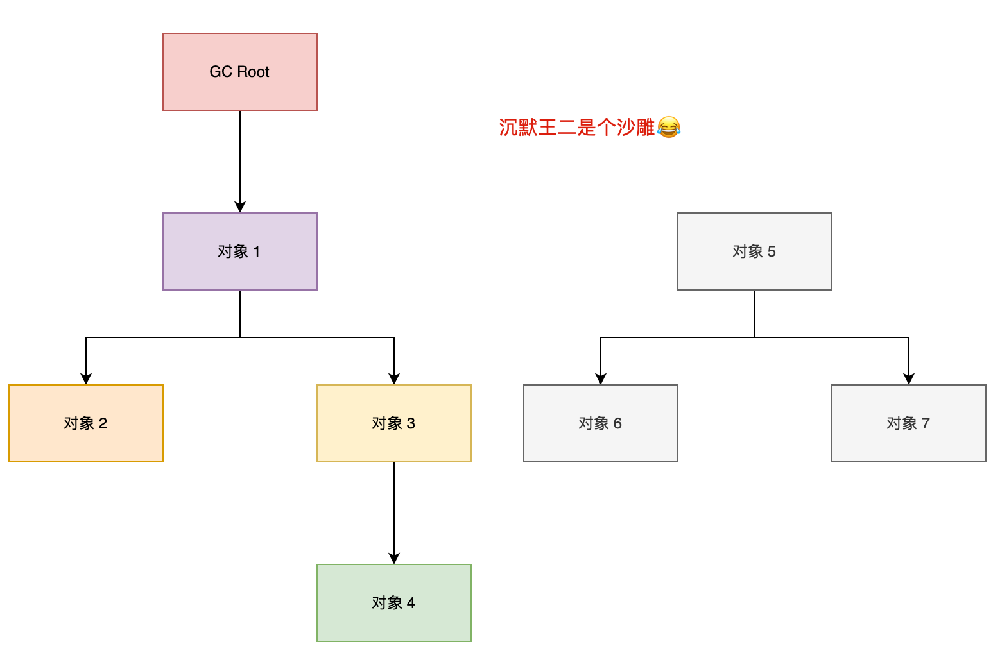

二哥的 Java 进阶之路：可达性分析

在确定了哪些垃圾可以被回收后，垃圾收集器（如 CMS、G1、ZGC）要做的事情就是进行垃圾回收，可以采用标记清除算法、复制算法、标记整理算法、分代收集算法等。

 JDK 8，默认采用的是 CMS 垃圾收集器，jdk17 用的 G1 收集器

## 如何判断对象仍然存活？**（如何判断是否是垃圾）**
**主要采用以下两种算法：**

**1. 引用计数法（Reference Counting）**

+ **原理**：每个对象都有一个引用计数器，被引用时+1，引用失效时-1。当计数为 0 时，说明对象可以被回收。
+ **缺点**：**循环引用问题**：两个对象互相引用，即使外部无引用，计数器也不为0，无法回收。

**2. 可达性分析法（Reachability Analysis）**

+ **原理**：从一组根对象（GC Roots）出发，向下遍历引用链。如果一个对象从 GC Roots 可达，说明该对象是存活的；如果不可达，则说明该对象是垃圾，可以被回收。

#### 做可达性分析的时候，应该有哪些前置性的操作？
在进行垃圾回收之前，JVM 会暂停所有正在执行的应用线程（称为 Stop-the-World）。

这是因为可达性分析过程必须确保在执行分析时，内存中的对象关系不会被应用线程修改。如果不暂停应用线程，可能会出现对象引用的改变，导致垃圾回收过程中判断对象是否可达的结果不一致，从而引发严重的内存错误或数据丢失。

## Java 中可作为 GC Roots 的引用有哪几种？
+ **虚拟机栈**（**方法的参数、局部变量等**）中引用的对象
+ **本地方法栈**（JNI引用）中引用的对象
+ **方法区**中类静态属性引用的对象（如类的静态变量）** 方法区中的静态变量引用**。
+ **方法区**中常量引用的对象（比如字符串常量）**方法区中的常量引用**。

<details class="lake-collapse"><summary id="u8df1e049"><span class="ne-text">完整</span></summary><p id="ue81b05ad" class="ne-p"><span class="ne-text">整理后的文本如下：</span></p><hr id="Xm7L0" class="ne-hr"><p id="uc88fc106" class="ne-p"><strong><span class="ne-text">1、虚拟机栈中的引用（方法的参数、局部变量等）</span></strong></p><p id="uc261f3ad" class="ne-p"><span class="ne-text">来看下面这段代码：</span></p><pre data-language="java" id="DDk2f" class="ne-codeblock language-java"><code>public class StackReference {
    public void greet() {
        Object localVar = new Object(); // 这里的 localVar 是一个局部变量，存在于虚拟机栈中
        System.out.println(localVar.toString());
    }

    public static void main(String[] args) {
        new StackReference().greet();
    }
}</code></pre><p id="u2409708b" class="ne-p"><span class="ne-text">在 </span><code class="ne-code"><span class="ne-text">greet</span></code><span class="ne-text"> 方法中，</span><code class="ne-code"><span class="ne-text">localVar</span></code><span class="ne-text"> 是一个局部变量，存在于虚拟机栈中，可以被认为是 </span><strong><span class="ne-text">GC Roots</span></strong><span class="ne-text">。</span></p><p id="u698107ac" class="ne-p"><span class="ne-text">在 </span><code class="ne-code"><span class="ne-text">greet</span></code><span class="ne-text"> 方法执行期间，</span><code class="ne-code"><span class="ne-text">localVar</span></code><span class="ne-text"> 引用的对象是活跃的，因为它是从 </span><strong><span class="ne-text">GC Roots</span></strong><span class="ne-text"> 可达的。</span></p><p id="u96b80c15" class="ne-p"><span class="ne-text">当 </span><code class="ne-code"><span class="ne-text">greet</span></code><span class="ne-text"> 方法执行完毕后，</span><code class="ne-code"><span class="ne-text">localVar</span></code><span class="ne-text"> 的作用域结束，</span><code class="ne-code"><span class="ne-text">localVar</span></code><span class="ne-text"> 引用的 </span><code class="ne-code"><span class="ne-text">Object</span></code><span class="ne-text"> 对象不再由任何 </span><strong><span class="ne-text">GC Roots</span></strong><span class="ne-text"> 引用（假设没有其他引用指向这个对象），因此它将有资格作为垃圾被回收掉 </span><span class="ne-text">😁</span><span class="ne-text">。</span></p><hr id="lMq44" class="ne-hr"><p id="u448b0f4f" class="ne-p"><strong><span class="ne-text">2、本地方法栈中 JNI 的引用</span></strong></p><p id="u0e3a2dd9" class="ne-p"><span class="ne-text">Java 通过 </span><strong><span class="ne-text">JNI</span></strong><span class="ne-text">（Java Native Interface）提供了一种机制，允许 Java 代码调用本地代码（通常是 C 或 C++ 编写的代码）。</span></p><p id="u71f7c4ce" class="ne-p"><span class="ne-text">当调用 Java 方法时，虚拟机会创建一个栈帧并压入虚拟机栈，而当它调用本地方法时，虚拟机会通过动态链接直接调用指定的本地方法。</span></p><p id="u334e11ee" class="ne-p"><strong><span class="ne-text">JNI</span></strong><span class="ne-text"> 引用是在 Java 本地接口（JNI）代码中创建的引用，这些引用可以指向 Java 堆中的对象。</span></p><pre data-language="java" id="TpRcB" class="ne-codeblock language-java"><code>// 假设的JNI方法
public native void nativeMethod();</code></pre><p id="u3e721f74" class="ne-p"><span class="ne-text">假设在 C/C++ 中实现的本地方法：</span></p><pre data-language="java" id="N07uS" class="ne-codeblock language-java"><code>/*
 * Class:     NativeExample
 * Method:    nativeMethod
 * Signature: ()V
 */
JNIEXPORT void JNICALL Java_NativeExample_nativeMethod(JNIEnv *env, jobject thisObj) {
    jobject localRef = (*env)-&gt;NewObject(env, ...); // 在本地方法栈中创建JNI引用
    // localRef 引用的Java对象在本地方法执行期间是活跃的
}</code></pre><p id="u6fa4a46a" class="ne-p"><span class="ne-text">在本地（C/C++）代码中，</span><code class="ne-code"><span class="ne-text">localRef</span></code><span class="ne-text"> 是对 Java 对象的一个 </span><strong><span class="ne-text">JNI 引用</span></strong><span class="ne-text">，它在本地方法执行期间保持 Java 对象活跃，可以被认为是 </span><strong><span class="ne-text">GC Roots</span></strong><span class="ne-text">。</span></p><p id="ube25d500" class="ne-p"><span class="ne-text">一旦 JNI 方法执行完毕，除非这个引用是全局的（</span><strong><span class="ne-text">Global Reference</span></strong><span class="ne-text">），否则它指向的对象将会被作为垃圾回收掉（假设没有其他地方再引用这个对象）。</span></p><hr id="GPWkI" class="ne-hr"><p id="u30c18f59" class="ne-p"><strong><span class="ne-text">3、类静态变量</span></strong></p><p id="u1a404d0a" class="ne-p"><span class="ne-text">来看下面这段代码：</span></p><pre data-language="java" id="JSghn" class="ne-codeblock language-java"><code>public class StaticFieldReference {
    private static Object staticVar = new Object(); // 类静态变量

    public static void main(String[] args) {
        System.out.println(staticVar.toString());
    }
}</code></pre><p id="ufec547e1" class="ne-p"><code class="ne-code"><span class="ne-text">StaticFieldReference</span></code><span class="ne-text"> 类中的 </span><code class="ne-code"><span class="ne-text">staticVar</span></code><span class="ne-text"> 引用了一个 </span><code class="ne-code"><span class="ne-text">Object</span></code><span class="ne-text"> 对象，这个引用存储在元空间，可以被认为是 </span><strong><span class="ne-text">GC Roots</span></strong><span class="ne-text">。</span></p><p id="uaabe4ba9" class="ne-p"><span class="ne-text">只要 </span><code class="ne-code"><span class="ne-text">StaticFieldReference</span></code><span class="ne-text"> 类未被卸载，</span><code class="ne-code"><span class="ne-text">staticVar</span></code><span class="ne-text"> 引用的对象都不会被垃圾回收。如果 </span><code class="ne-code"><span class="ne-text">StaticFieldReference</span></code><span class="ne-text"> 类被卸载（这通常发生在其类加载器被垃圾回收时），那么 </span><code class="ne-code"><span class="ne-text">staticVar</span></code><span class="ne-text"> 引用的对象也将有资格被垃圾回收（如果没有其他引用指向这个对象）。</span></p><hr id="qXhnv" class="ne-hr"><p id="u01cb934b" class="ne-p"><strong><span class="ne-text">4、运行时常量池中的常量</span></strong></p><p id="u1c1bd846" class="ne-p"><span class="ne-text">来看这段代码：</span></p><pre data-language="java" id="TBgCW" class="ne-codeblock language-java"><code>public class ConstantPoolReference {
    public static final String CONSTANT_STRING = &quot;Hello, World&quot;; // 常量，存在于运行时常量池中
    public static final Class&lt;?&gt; CONSTANT_CLASS = Object.class; // 类类型常量

    public static void main(String[] args) {
        System.out.println(CONSTANT_STRING);
        System.out.println(CONSTANT_CLASS.getName());
    }
}</code></pre><p id="u0a74093d" class="ne-p"><span class="ne-text">在 </span><code class="ne-code"><span class="ne-text">ConstantPoolReference</span></code><span class="ne-text"> 中，</span><code class="ne-code"><span class="ne-text">CONSTANT_STRING</span></code><span class="ne-text"> 和 </span><code class="ne-code"><span class="ne-text">CONSTANT_CLASS</span></code><span class="ne-text"> 作为常量存储在运行时常量池。它们可以用来作为 </span><strong><span class="ne-text">GC Roots</span></strong><span class="ne-text">。</span></p><p id="ude76aa42" class="ne-p"><span class="ne-text">这些常量引用的对象（字符串 </span><code class="ne-code"><span class="ne-text">&quot;Hello, World&quot;</span></code><span class="ne-text"> 和 </span><code class="ne-code"><span class="ne-text">Object.class</span></code><span class="ne-text"> 类对象）在常量池中，只要包含这些常量的 </span><code class="ne-code"><span class="ne-text">ConstantPoolReference</span></code><span class="ne-text"> 类未被卸载，这些对象就不会被垃圾回收。</span></p><hr id="Zwcqu" class="ne-hr"><p id="u93aafb3e" class="ne-p"><span class="ne-text">如上，已经按照要求整理了代码和格式，重点部分加粗，保持了原文内容不变，条理清晰。</span></p></details>
## finalize()方法了解吗？有什么作用？
+ **作用**：`finalize()` 允许对象在被垃圾回收器回收之前执行清理操作（如资源释放）。
+ **存在的问题**：由于其执行时机的不确定性、性能开销及资源泄漏风险，`finalize()` 不再被推荐使用。
+ **替代方法**：应使用 `try-with-resources` 或显式的资源释放方法来替代 `finalize()`。

总的来说，`finalize()` 方法在现代 Java 中已经不再是资源管理的首选工具。

## 垃圾收集算法了解吗？
**常见的垃圾回收算法包括以下几种：**

1. **标记-清除算法（Mark-Sweep）**

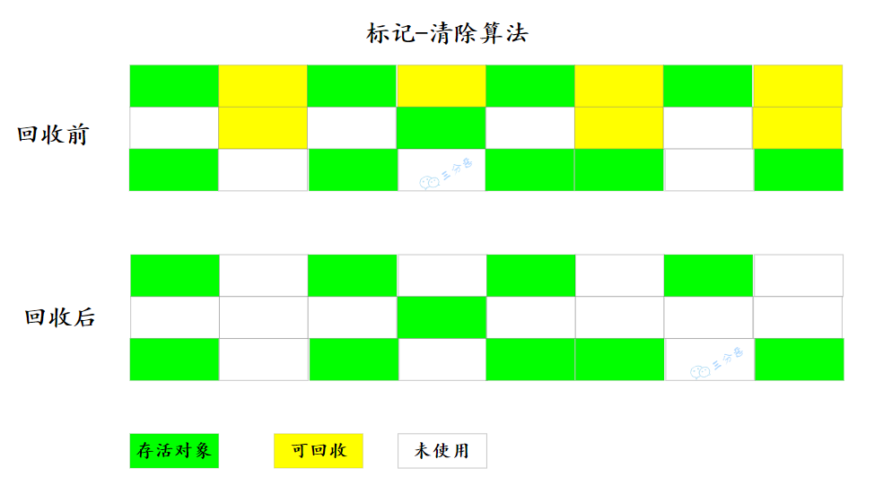

    - **原理：**
        * 首先通过可达性分析，标记所有存活的对象，然后清除所有未标记的对象，释放其占用的内存  。
        * **标记阶段**：通过可达性分析，遍历所有可达的对象，并标记这些对象为存活。
        * **清除阶段**：清除所有未标记的对象，即那些不可达的对象。
    - **优点：**  
	实现简单，不需要移动对象。
    - **缺点：**  
	会产生大量的内存碎片，导致内存分配效率下降。
2. **标记-整理算法（Mark-Compact）**


    - **原理：**
        *  首先标记所有存活的对象,然后将所有存活的对象移动到内存的一端，清理剩余空间。
        * **标记阶段**：与标记-清除算法相同，首先标记所有活跃对象。
        * **整理阶段**：将所有存活的对象移动到内存的一端，随后清理除边界外的内存。
    - **优点：**  
	没有内存碎片。 空闲内存是连续的  。
    - **缺点：**  
	对象移动的开销较大，性能较低。
3. **复制算法（Copying）**

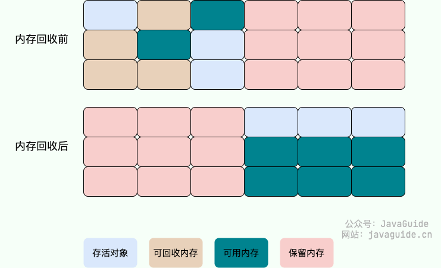

    - **原理：**  
	将内存空间划分为两块，每次只使用其中一块。当这一块用完时，将存活的对象复制到另一块内存，然后清空当前内存。
    - **优点：**  
	没有内存碎片。
    - **缺点：**  
	 整体内存利用率低，因为每次只使用一半的内存 。
4. **分代收集算法（Generational Collection）**
    - **原理：**  
 将堆内存分为不同的代（Generation  ，通常包括 **新生代**、**老年代** （和 **持久代**）。
        * **新生代**（Young Generation）：存放新创建的对象。垃圾收集频繁，采用**复制算法（Minor GC）**。
        * **老年代**（Old Generation）：存放存活时间较长的对象。垃圾收集较少，采用**标记-清除**或**标记-整理算法**（**Major GC**）。

>         * （**持久代**（Permanent Generation，或在 JDK 8 中为 Metaspace）：存放类信息等元数据）
>

### 为什么要用分代收集呢？
分代收集算法的核心思想是根据对象的生命周期优化垃圾回收。新生代的对象生命周期短，使用复制算法可以快速回收。老年代的对象生命周期长，使用标记-整理算法可以减少移动对象的成本。

###  延伸面试问题： HotSpot 为什么要分为新生代和老年代？  
 HotSpot JVM 将堆内存分为 **年轻代**（Young Generation）和 **老年代**（Old Generation），目的是通过 **分代收集算法** 来优化垃圾回收性能。这个设计的核心思想是：大部分对象的生命周期都非常短，而长生命周期的对象很少，因此将对象按照生命周期的长短分配到不同的区域，可以显著提高垃圾收集效率，减少性能开销。  

## Minor GC、Major GC、Mixed GC、Full GC 都是什么意思？


1. **Minor GC（Young GC）**
    - **含义**：发生在年轻代（Young Generation）中的垃圾回收。当年轻代的 Eden 区空间不足时触发。
2. **Major GC（Old GC）**
    - **含义**：发生在老年代（Old Generation）中的垃圾回收，老年代空间不足时触发。
3. **Mixed GC**
    - **含义**：Mixed GC 是 **G1 垃圾回收器（Garbage First）** 特有的一种回收模式，在一次垃圾回收中同时清理新生代和部分老年代的垃圾。
4. **Full GC**
    - **含义**：发生在整个堆内存中的垃圾回收，包括年轻代和老年代。
    - **触发时机**：当 jvm 压力很大的时候触发，比如**元空间空间不足或者产生内存泄漏**

> **触发条件**：
>
>     - **老年代空间不足**：当老年代空间不足时，JVM 会触发 Full GC。
>     - **元空间空间不足**：Java 8 之后，永久代被元空间取代，如果元空间不足，也会触发 Full GC。
>     - **手动调用 System.gc()**：调用 `System.gc()` 会建议 JVM 进行 Full GC，虽然 JVM 可以忽略这个请求。
>     - **内存泄漏或对象无法被清理**：某些情况下，当对象不能被垃圾回收时（如对象复生），也可能触发 Full GC。
>

## 什么时候会触发 Full GC？
    - **老年代空间不足**：当老年代空间不足时，JVM 会触发 Full GC。
    - **元空间空间不足**：Java 8 之后，永久代被元空间取代，如果元空间不足，也会触发 Full GC。
    - **手动调用 System.gc()**：调用 `System.gc()` 会建议 JVM 进行 Full GC，虽然 JVM 可以忽略这个请求。
    - **内存泄漏或对象无法被清理**：某些情况下，当对象不能被垃圾回收时（如对象复生），也可能触发 Full GC。

## 知道哪些垃圾收集器？
**如果说收集算法是内存回收的方法论，那么垃圾收集器就是内存回收的具体实现。**

虽然我们对各个收集器进行比较，但并非要挑选出一个最好的收集器。因为直到现在为止还没有最好的垃圾收集器出现，更加没有万能的垃圾收集器，**我们能做的就是根据具体应用场景选择适合自己的垃圾收集器**。试想一下：如果有一种四海之内、任何场景下都适用的完美收集器存在，那么我们的 HotSpot 虚拟机就不会实现那么多不同的垃圾收集器了。

JDK 默认垃圾收集器（使用 `java -XX:+PrintCommandLineFlags -version` 命令查看）：

1.8 之前采用并行垃圾收集器，1.9 之后采用 g1 垃圾收集器

+ JDK 8: Parallel Scavenge（新生代）+ Parallel Old（老年代）
+ JDK 9 ~ JDK22: G1

**精简版**

<details class="lake-collapse"><summary id="u1710bd36"></summary><h3 id="N9se7" data-lake-index-type="2" style="text-align: left"><strong><span class="ne-text">Serial GC（串行垃圾收集器）</span></strong></h3><p id="u0994f35f" class="ne-p"><strong><span class="ne-text">原理</span></strong><span class="ne-text">：</span></p><ul class="ne-ul"><li id="ue1afefcf" data-lake-index-type="0"><strong><span class="ne-text">Serial（串行）收集器</span></strong><span class="ne-text">是最基本的垃圾收集器。 使用单线程执行垃圾回收。并且在垃圾回收过程中会暂停应用程序的执行，直到回收完成（“Stop-The-World”停顿）。  <br /></span><strong><span class="ne-text">适用场景</span></strong><span class="ne-text">：</span></li><li id="u39d5bfc8" data-lake-index-type="0"><span class="ne-text">适合单核或小内存场景。<br /></span><strong><span class="ne-text">算法</span></strong><span class="ne-text">：</span></li><li id="u52e75f1f" data-lake-index-type="0"><span class="ne-text">新生代采用</span><strong><span class="ne-text">复制算法</span></strong><span class="ne-text">，老年代采用</span><strong><span class="ne-text">标记-整理算法</span></strong><span class="ne-text">。</span></li></ul><p id="u492459ce" class="ne-p" style="text-align: center"></p><p id="udf3836c3" class="ne-p" style="text-align: center"><span class="ne-text">Serial 收集器</span></p><h3 id="03077da7"><strong><span class="ne-text">Parallel Garbage Collector（并行垃圾回收器）</span></strong></h3><ul class="ne-ul"><li id="u08f0047b" data-lake-index-type="0"><span class="ne-text">原理：</span></li></ul><ul class="ne-list-wrap"><ul ne-level="1" class="ne-ul"><li id="u87970738" data-lake-index-type="0"><span class="ne-text">采用多线程并行来进行垃圾回收，减少了垃圾回收时产生的停顿</span></li><li id="udcd1ead5" data-lake-index-type="0"><span class="ne-text">采用多线程进行垃圾回收，适合多核处理器。他也会产生 stw 现象，但它通过并行化提高了回收速度。</span></li></ul></ul><ul class="ne-ul"><li id="uafd3886f" data-lake-index-type="0"><span class="ne-text">新生代采用</span><strong><span class="ne-text">标记-复制算法</span></strong><span class="ne-text">，老年代采用</span><strong><span class="ne-text">标记-整理算法</span></strong><span class="ne-text">。</span></li><li id="ucc314d1d" data-lake-index-type="0"><span class="ne-text">适合多核CPU 或者高吞吐量场景，比如后台服务器。</span></li></ul></details>
### **Serial GC（串行垃圾回收器）**
**原理**：

+ **Serial（串行）收集器**是最基本的垃圾收集器。 使用单线程执行垃圾回收。并且在垃圾回收过程中会暂停应用程序的执行，直到回收完成（“Stop-The-World”停顿）。    
**适用场景**：
+ 适合单核或小内存场景。  
**算法**：
+ 新生代采用**复制算法**，老年代采用**标记-整理算法**。


Serial 收集器

### ParNew 收集器
**ParNew 收集器**：

    - 实质上是 **Serial 收集器** 的多线程并行版本，使用多条线程进行垃圾收集。  
**工作方式**：
    - 新生代采用**复制算法**，老年代采用**标记-整理算法**。  
**适用场景**：
    - 适合多核CPU且对吞吐量要求较高的场景，比如后台服务器。  
**算法**：
    - 新生代采用**标记-复制算法**，老年代采用**标记-整理算法**。


ParNew 收集器 

它是许多运行在 Server 模式下的虚拟机的首要选择，除了 Serial 收集器外，只有它能与 CMS 收集器（真正意义上的并发收集器，后面会介绍到）配合工作。

**并行和并发概念补充：**

+ **并行（Parallel）**：指多条垃圾收集线程并行工作，但此时用户线程仍然处于等待状态。
+ **并发（Concurrent）**：指用户线程与垃圾收集线程同时执行（但不一定是并行，可能会交替执行），用户程序在继续运行，而垃圾收集器运行在另一个 CPU 上。

### Parallel Scavenge 收集器
**Parallel Scavenge GC** 是 **Parallel Garbage Collector**（并行垃圾收集器）的一部分，主要用于年轻代的垃圾回收，旨在通过最大化吞吐量（即应用程序执行的效率）来提高应用程序的性能。它是一个**吞吐量优先**的收集器，适合那些对响应时间要求不高，但对整体性能和吞吐量有较高要求的应用场景。  


Parallel Scavenge 收集器也是使用标记-复制算法的多线程收集器，它看上去几乎和 ParNew 都一样。 **那么它有什么特别之处呢？**

```java
-XX:+UseParallelGC

    使用 Parallel 收集器+ 老年代串行

-XX:+UseParallelOldGC

    使用 Parallel 收集器+ 老年代并行
```

Parallel Scavenge 收集器关注点是吞吐量（高效率的利用 CPU）。CMS 等垃圾收集器的关注点更多的是用户线程的停顿时间（提高用户体验）。所谓吞吐量就是 CPU 中用于运行用户代码的时间与 CPU 总消耗时间的比值。 Parallel Scavenge 收集器提供了很多参数供用户找到最合适的停顿时间或最大吞吐量，如果对于收集器运作不太了解，手工优化存在困难的时候，使用 Parallel Scavenge 收集器配合自适应调节策略，把内存管理优化交给虚拟机去完成也是一个不错的选择。

**新生代采用标记-复制算法，老年代采用标记-整理算法。**


Parallel Old收集器运行示意图

**这是 JDK1.8 默认收集器**

使用 `java -XX:+PrintCommandLineFlags -version` 命令查看

```java
-XX:InitialHeapSize=262921408 -XX:MaxHeapSize=4206742528 -XX:+PrintCommandLineFlags -XX:+UseCompressedClassPointers -XX:+UseCompressedOops -XX:+UseParallelGC
java version "1.8.0_211"
Java(TM) SE Runtime Environment (build 1.8.0_211-b12)
Java HotSpot(TM) 64-Bit Server VM (build 25.211-b12, mixed mode)
```

JDK1.8 默认使用的是 Parallel Scavenge + Parallel Old，如果指定了-XX:+UseParallelGC 参数，则默认指定了-XX:+UseParallelOldGC，可以使用-XX:-UseParallelOldGC 来禁用该功能

### Serial Old 收集器
**Serial 收集器的老年代版本**， 它同样是一个单线程收集器，使用标记-整理算法。  

它同样是一个单线程收集器。它主要有两大用途：一种用途是在 JDK1.5 以及以前的版本中与 Parallel Scavenge 收集器搭配使用，另一种用途是作为 CMS 收集器的后备方案。


Serial 收集器

### Parallel Old 收集器
**Parallel Scavenge 收集器的老年代版本**。 支持多线程并发收集，基于标记-整理算法实现  

在注重吞吐量以及 CPU 资源的场合，都可以优先考虑 Parallel Scavenge 收集器和 Parallel Old 收集器。


Parallel Old收集器运行示意图

### CMS 收集器
  
**介绍**：

+ CMS 是一种 **低延迟** 的垃圾收集器，设计目标是减少垃圾回收时的停顿时间。**（基于老年代收集，采用标记清除算法）**  
**收集过程**：
    - **初始标记（Initial Mark）**：标记所有从 ** 根对象  GC Roots** 直接可达的对象，这个阶段需要 **STW**，但时间很短。
    - **并发标记（Concurrent Mark）**：从初始标记的对象出发，遍历所有对象，并发标记所有可达对象。有 **STW**。
    - **重新标记（Remark）**：处理并发标记期间发生变动的对象。这个阶段通常需要短暂的 **STW** 停顿。
    - **并发清除（Concurrent Sweep）**：并发清除未被标记的对象，释放其占用的内存空间。
+ **适用场景**：
    - 适用于**低延迟**的应用场景，但容易产生内存碎片。


CMS 收集器

####  面试题：为什么初始标记是 stop the world，最终标记和重新标记为什么 stop the world  
### 为什么初始标记、最终标记、重新标记需 STW？
+ **初始标记**：
    - 标记 GC Roots，需一致快照。
    - 线程运行会改引用，STW 保证准确，时间短。
+ **最终标记/重新标记**：
    - 修正并发标记遗漏（如浮动垃圾）。
    - 线程干扰引用，STW 确保正确，时间较短。

### 核心
STW 提供静态快照，保一致性和正确性，暂停时间尽量短。

#### 你提到了**重新标记**remark，那它remark具体是怎么执行的？三色标记法？
 remark 阶段通常会结合三色标记法来执行，确保在并发标记期间所有存活对象都被正确标记。  

**Remark 阶段的步骤**：

+ **暂停应用线程**：在 **Remark** 阶段，应用线程会暂停。这个阶段会暂停所有应用线程，以便进行最终的标记工作，确保准确性。
+ **重新扫描活跃对象**：在暂停应用线程后，JVM 会扫描从 **灰色** 变成 **白色** 的对象，并重新标记它们为 **灰色**。然后，JVM 会扫描这些灰色对象引用的对象，并将它们标记为 **黑色**。这个过程会确保任何并发标记阶段遗漏的活跃对象都能被正确标记。
+ **修复并发标记遗漏**：应用线程暂停的目的是修复并发标记过程中未能正确标记的对象。所有活跃对象在这一阶段会被正确标记，并确保整个堆的对象状态（白色、灰色、黑色）是准确的。

#### 三色标记法是什么
<details class="lake-collapse"><summary id="ud766d025"><span class="ne-text">当然可以，</span><strong><span class="ne-text">三色标记法（Tri-color marking）</span></strong><span class="ne-text"> 是现代垃圾回收器中广泛使用的一种 </span><strong><span class="ne-text">可达性分析算法</span></strong><span class="ne-text">，用于在 </span><strong><span class="ne-text">“标记-清除”式 GC</span></strong><span class="ne-text"> 中高效、安全地判断哪些对象是“存活的”，哪些是“可以被回收”的。</span></summary><hr id="lJB9N" class="ne-hr"><h2 id="B0Nxe"><span class="ne-text">✅</span><span class="ne-text"> 一句话理解三色标记法：</span></h2><p id="u07d51cde" class="ne-p"><span class="ne-text">三色标记法通过将对象分为黑、灰、白三种颜色，并动态移动它们来准确区分“可达对象”与“不可达对象”，从而实现安全的垃圾回收。</span></p><hr id="TI4FX" class="ne-hr"><h2 id="qj9T6"><span class="ne-text">🎨</span><span class="ne-text"> 三种颜色的含义：</span></h2><p id="u8645120c" class="ne-p"><span class="ne-text">颜色</span></p><p id="ucc9f15d8" class="ne-p"><span class="ne-text">含义</span></p><p id="u9ded7fe3" class="ne-p"><span class="ne-text">⚪</span><span class="ne-text"> </span><strong><span class="ne-text">白色</span></strong></p><p id="ud4d81242" class="ne-p"><span class="ne-text">未被访问过，</span><strong><span class="ne-text">默认所有对象都是白色</span></strong><span class="ne-text">；最终仍是白色的对象将会被回收</span></p><p id="u2db49e17" class="ne-p"><span class="ne-text">⚫</span><span class="ne-text"> </span><strong><span class="ne-text">黑色</span></strong></p><p id="u3512bd71" class="ne-p"><span class="ne-text">已被访问过，</span><strong><span class="ne-text">自身及引用的对象也都被访问过</span></strong><span class="ne-text">；不会再被处理，也不会被回收</span></p><p id="uab716be0" class="ne-p"><span class="ne-text">⚪</span><span class="ne-text">‍</span><span class="ne-text">⚫</span><span class="ne-text"> </span><strong><span class="ne-text">灰色</span></strong></p><p id="ud6fabaf7" class="ne-p"><span class="ne-text">已被访问过，但</span><strong><span class="ne-text">它引用的对象还没全部处理</span></strong><span class="ne-text">；待进一步扫描</span></p><hr id="TjCVq" class="ne-hr"><h2 id="cbd1bffd"><span class="ne-text">🔄</span><span class="ne-text"> 三色标记算法的过程：</span></h2><ol class="ne-ol"><li id="u02f7721f" data-lake-index-type="0"><strong><span class="ne-text">初始状态：</span></strong></li></ol><ul class="ne-list-wrap"><ul ne-level="1" class="ne-ul"><li id="u5f9a19d7" data-lake-index-type="0"><span class="ne-text">所有对象都标记为白色；</span></li><li id="u3397e4f5" data-lake-index-type="0"><span class="ne-text">GC Roots（如栈变量、静态变量等）入队，变为灰色。</span></li></ul></ul><ol start="2" class="ne-ol"><li id="uac059d03" data-lake-index-type="0"><strong><span class="ne-text">遍历灰色对象：</span></strong></li></ol><ul class="ne-list-wrap"><ul ne-level="1" class="ne-ul"><li id="u8db285d5" data-lake-index-type="0"><span class="ne-text">从灰色对象开始，访问它引用的每个对象：</span></li></ul></ul><ul class="ne-list-wrap"><ul class="ne-list-wrap"><ul ne-level="2" class="ne-ul"><li id="ub793be8d" data-lake-index-type="0"><span class="ne-text">若引用对象是白色 → 变为灰色并入队；</span></li><li id="u4ee720e5" data-lake-index-type="0"><span class="ne-text">当前灰色对象变为黑色。</span></li></ul></ul></ul><ul class="ne-list-wrap"><ul ne-level="1" class="ne-ul"><li id="uc5ac8225" data-lake-index-type="0"><span class="ne-text">重复该过程，直到灰色对象全部处理完（队列为空）。</span></li></ul></ul><ol start="3" class="ne-ol"><li id="ue9d80852" data-lake-index-type="0"><strong><span class="ne-text">清除白色对象：</span></strong></li></ol><ul class="ne-list-wrap"><ul ne-level="1" class="ne-ul"><li id="u38f099f1" data-lake-index-type="0"><span class="ne-text">剩下仍为白色的对象被视为“不可达”，被回收。</span></li></ul></ul><hr id="lQRCP" class="ne-hr"><h2 id="c692e661"><span class="ne-text">🧠</span><span class="ne-text"> 为什么要三种颜色？</span></h2><p id="uec6c819c" class="ne-p"><span class="ne-text">因为在并发标记（GC 与用户线程同时运行）的场景下：</span></p><ul class="ne-ul"><li id="u99d582b2" data-lake-index-type="0"><span class="ne-text">仅靠“标记/未标记”无法区分是否已扫描引用；</span></li><li id="u957104d4" data-lake-index-type="0"><span class="ne-text">三种颜色可以</span><strong><span class="ne-text">分阶段处理引用对象，避免漏标、错标</span></strong><span class="ne-text">；</span></li><li id="u1ebc9ad9" data-lake-index-type="0"><span class="ne-text">它允许安全地在</span><strong><span class="ne-text">并发 GC 中识别可回收对象</span></strong><span class="ne-text">，不会误删还在用的对象。</span></li></ul><hr id="IurL4" class="ne-hr"></details>
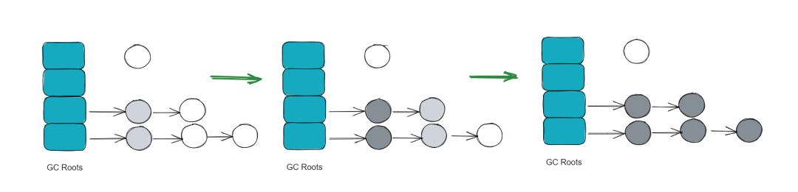

**三色标记法用于标记对象的存活状态，它将对象分为三类：**

+ **白色（White）**：表示对象是不可达的，即垃圾对象，应该被回收。
+ **灰色（Gray）**：表示对象是可达的，但它的所有子对象还没有被完全标记，即需要进一步处理。
+ **黑色（Black）**：表示对象是可达的，且它的所有子对象都已经被标记过了，即它是一个完整的可达对象。

**三色标记法的工作流程：**

+ **初始状态**：所有对象一开始都是 **白色**，即默认认为所有对象都是垃圾。从根对象开始，标记为 **灰色**，并开始处理。
+ **处理灰色对象**：标记其引用的对象为 **灰色**。然后将灰色对象自身标记为 **黑色**，表示其引用对象已完全处理。
+ **黑色对象**：表示已处理完所有引用的子对象，继续标记并不处理它们。
+ **处理完所有对象后**：白色对象（不可达）被回收。

---

从它的名字就可以看出它是一款优秀的垃圾收集器，主要优点：**并发收集、低停顿**。但是它有下面三个明显的缺点：

+ **对 CPU 资源敏感；**
+ **无法处理浮动垃圾；**
+ **它使用的回收算法-“标记-清除”算法会导致收集结束时会有大量空间碎片产生。**

**CMS 垃圾回收器在 Java 9 中已经被标记为过时(deprecated)，并在 Java 14 中被移除。**

### G1 收集器
（年轻代**复制**算法，老年代**标记整理**算法）

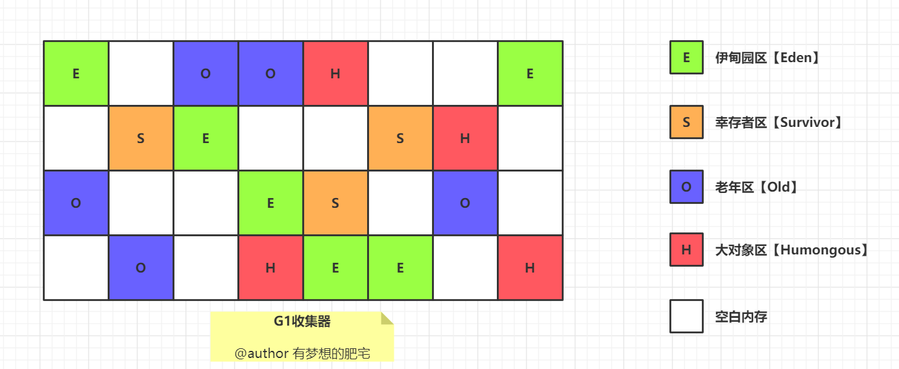

+ **介绍**：  
专为** 大内存、低延迟  **场景设计，目标是在可控的时间内完成垃圾回收。（年轻代**复制**算法，老年代**标记整理**算法）
+ **适用场景**：  
适用于低延迟以及大内存需求的应用程序。
+ **原理**：

G1 把堆划分为多个大小相等的独立区域 **Region**，每个区域都可以扮演新生代（**Eden** 和 **Survivor**）或老年代的角色。在回收时，会根据每个区域的**垃圾占比**和**回收收益**选择要回收的区域，确保在有限的停顿时间内回收尽可能多的垃圾。

 	同时，G1 还有一个专门为大对象设计的 Region，叫 Humongous 区。  

> 大对象的判定规则是，如果一个大对象超过了一个 Region 大小的 50%，比如每个 Region 是 2M，只要一个对象超过了 1M，就会被放入 Humongous 中。  
>

 	这种区域化管理使得 G1 可以更灵活地进行垃圾收集，只回收部分区域而不是整个新生代或老年代。  

+ **收集过程**：
    - **初始标记**（STW）：标记所有从 ** 根对象  GC Roots** 直接可达的对象。
    - **并发标记**：  
首先并发标记出堆中的所有存活对象（**并发标记阶段与应用线程同时执行**，不会导致应用线程暂停。）
    - **重新标记（Remark）**：处理并发标记期间发生变动的对象。这个阶段通常需要短暂的 **STW** 停顿。
    - **混合收集**：  
 在标记完成后， G1 会选择垃圾最多的区域，然后优先回收这些区域。包括了新生代区域和老年代区域。
+  适用于低延迟以及大内存需求的应用程序。，特别是那些需要可预测停顿时间的应用  

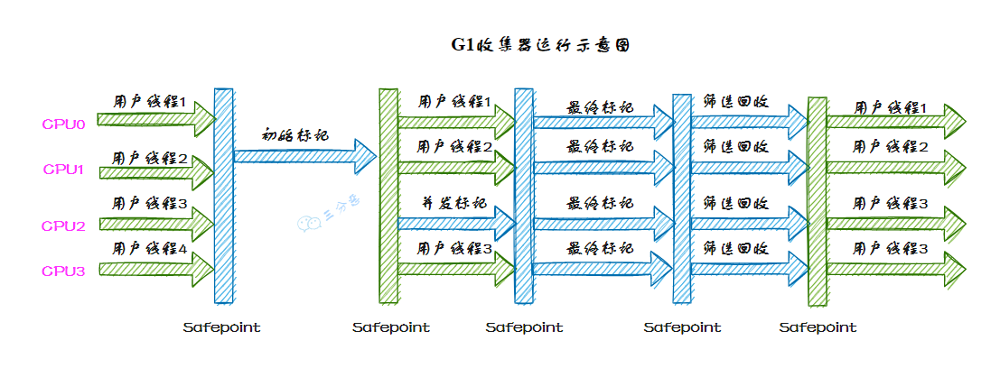

G1 收集器

**G1 收集器在后台维护了一个优先列表，每次根据允许的收集时间，优先选择回收价值最大的 Region(这也就是它的名字 Garbage-First 的由来)** 。这种使用 Region 划分内存空间以及有优先级的区域回收方式，保证了 G1 收集器在有限时间内可以尽可能高的收集效率（把内存化整为零）。

**从 JDK9 开始，G1 垃圾收集器成为了默认的垃圾收集器。**

### ZGC 收集器
 **ZGC（Z Garbage Collector）**是一种 **低延迟** 的垃圾收集器，设计目标是尽量减少停顿时间，确保垃圾回收的停顿时间保持在 **毫秒级**，即使在堆内存达到几 TB 时也能稳定运行。特别适用于大内存和高并发的应用。   与G1类似，ZGC也采用标记-复制算法，不过ZGC对该算法做了重大改进：ZGC在标记、转移和重定位阶段几乎都是并发的，这是ZGC实现停顿时间小于10ms目标的最关键原因。  

[深入理解 JVM 的垃圾收集器：CMS、G1、ZGC](https://javabetter.cn/jvm/gc-collector.html#zgc)

[新一代垃圾回收器ZGC的探索与实践](https://tech.meituan.com/2020/08/06/new-zgc-practice-in-meituan.html)

## **CMS、G1 和 ZGC** 
### 1. **内存布局**
+ **CMS**：采用 **年轻代** 和 **老年代** 结构，垃圾回收主要在这两个区域之间进行。
+ **G1**：堆内存划分为多个小的 **区域（Region）**，每个区域可以充当**年轻代** 或 **老年代**，根据需要动态调整。
+ **ZGC**：使用 **区域化堆**，类似于 G1，但 ZGC 是一种 **低延迟回收器**，堆区域的管理和内存回收更为精细，优化了大内存应用的性能。

### 2. **停顿时间**
+ **CMS**：虽然 **目标是减少停顿时间**，但由于 **并发标记** 和 **清除** 阶段的引用变化，可能导致停顿时间的波动，尤其在 **初始标记** 和 **重新标记** 阶段，可能出现较长停顿。
+ **G1**：设计目标是 **可预测停顿时间**，能够根据用户设定的最大停顿时间（`-XX:MaxGCPauseMillis`），动态调整回收的区域数量，确保停顿时间在可控范围内。G1 更适合大内存应用。
+ **ZGC**：致力于**毫秒级停顿**，即使在大堆内存（TB级别）下，停顿时间几乎恒定。ZGC 在标记、整理等阶段都采用并发和增量式回收，避免长时间停顿。

### 3. **内存碎片**
+ **CMS**：由于使用 **标记-清除** 算法，回收后可能会产生内存碎片。如果不进行整理，会影响系统性能。可以选择 **Full GC** 来整理内存，但会导致停顿。
+ **G1**：采用 **分区域回收**，每个区域都在回收过程中被整理，避免了内存碎片的产生。由于回收是增量进行的，因此内存管理更高效，碎片问题较少。
+ **ZGC**：通过 **并发整理**，在回收过程中避免内存碎片的产生。ZGC 采用区域化管理和增量式垃圾回收，即使在大堆内存下也能保持高效的内存压缩和整理。

### 4. **使用场景**
+ **CMS**： 
    - 适用于对延迟敏感的应用，特别是需要尽量减少 **停顿时间** 的场景，如金融交易系统、实时数据处理等。
    - 但容易产生内存碎片，适合堆内存较小且不要求严格控制内存碎片的场景。
+ **G1**： 
    - 适合 **大内存** 和 **高延迟敏感** 的应用，尤其是要求 **可预测停顿时间** 的系统。G1 能根据应用需求动态调整停顿时间，适用于内存较大的系统，减少了内存碎片。
    - 适用场景包括大数据处理、内存密集型应用、后台处理系统等。
+ **ZGC**： 
    - 适用于 **大内存**（几 GB 到 TB 级别）的 **低延迟** 应用，尤其是对 **停顿时间有极高要求** 的系统，如高频交易、大规模并发的实时系统。
    - 由于其几乎 **零停顿** 特性，ZGC 非常适合高并发、低延迟且内存较大的系统，如分布式数据库、在线广告实时计算、AI 推理等。

### 总结对比
| 特性 | **CMS** | **G1** | **ZGC** |
| --- | --- | --- | --- |
| **内存布局** | 年轻代、老年代 | 分为多个可调节的区域 | 区域化堆管理 |
| **停顿时间** | 初始和重新标记阶段停顿较长 | 可预测的停顿时间，动态调整 | 毫秒级停顿，几乎无停顿 |
| **内存碎片** | 容易产生碎片，需要整理 | 通过回收过程整理区域，碎片较少 | 自动整理，避免内存碎片 |
| **适用场景** | 延迟敏感应用，堆内存较小 | 大内存，高延迟敏感应用 | 大内存、低延迟要求极高的应用 |


## 你们线上用的什么垃圾收集器？为什么要用它？
我牛券用的 jdk17，**G1垃圾收集器，我们生产环境中采用了设计比较优秀的 G1 垃圾收集器，G1 采用的是分区式标记-整理算法，将堆划分为多个区域，按需回收，适用于大内存和多核环境，能够同时考虑吞吐量和暂停时间。  **

****

**G1垃圾收集器**（**G1 GC**）在 **JDK 17** 中作为默认垃圾收集器，主要因其以下优点而被广泛使用：

1. **可预测的停顿时间****：G1能够通过设置 **`**-XX:MaxGCPauseMillis**`** 参数来保证垃圾回收停顿时间在可控范围内，适合对延迟敏感的应用。**
2. **适合大内存应用****：G1将堆内存划分为多个 ****区域****，灵活调整内存使用，支持大内存应用（数十GB甚至TB级别）。**
3. **避免内存碎片****：通过 ****区域化回收****，G1避免了传统标记-清除算法产生的内存碎片，减少了 ****Full GC**** 的频率。**
4. **灵活的回收策略****：G1支持动态调整回收策略，能根据实际情况优先回收存活对象较少的区域，提高回收效率。**
5. **更易于调优****：G1提供丰富的调优参数，允许开发者根据需求平衡 ****停顿时间、吞吐量**** 和 ****内存使用****。**

**总的来说，G1 GC 适用于 大内存、低延迟要求 的应用，如在线交易、大数据处理等，提供了稳定的性能和可预测的回收停顿。**

## 垃圾收集器应该如何选择？
这里简单地列一下上面提到的一些收集器的适用场景：

+ Serial ：如果应用程序有一个很小的内存空间（大约 100 MB）亦或它在没有停顿时间要求的单线程处理器上运行。
+ Parallel：如果优先考虑应用程序的峰值性能，并且没有时间要求要求，或者可以接受 1 秒或更长的停顿时间。
+ CMS/G1：如果响应时间比吞吐量优先级高，或者垃圾收集暂停必须保持在大约 1 秒以内。
+ ZGC：如果响应时间是高优先级的，或者堆空间比较大。

# 四、类加载机制
## 了解类的加载机制吗？（补充）
JVM 的操作对象是 **Class 文件**，JVM 把 Class 文件中描述类的数据结构加载到内存中，并对数据进行校验、解析和初始化，最终形成可以被 JVM 直接使用的类型，这个过程被称为 **类加载机制**。

其中最重要的三个概念就是：**类加载器**、**类加载过程**和 **类加载器的双亲委派模型**。

+ **类加载器**：负责加载类文件，将类文件加载到内存中，生成 **Class** 对象。
+ **类加载过程**：加载、验证、准备、解析和初始化。
+ **双亲委派模型**：当一个类加载器收到类加载请求时，它首先不会自己去尝试加载这个类，而是把请求委派给父类加载器去完成，依次递归，直到最顶层的类加载器。如果父类加载器无法完成加载请求，子类加载器才会尝试自己去加载。

## 类加载器有哪些？
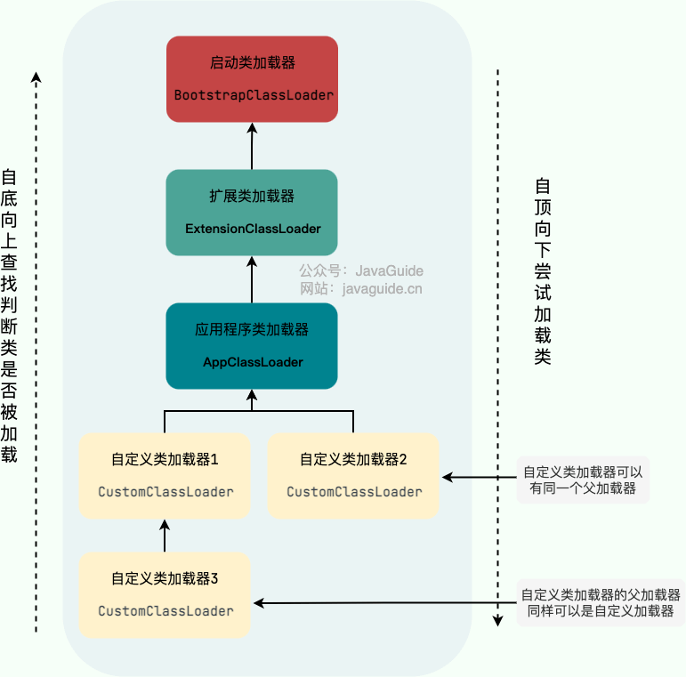

**类加载器种类**

1. **启动类加载器（Bootstrap Class Loader）**  
这是最顶层的类加载器，负责加载Java的核心类库  （如位于`jre/lib/rt.jar`中的类），它是用C++编写的，是JVM的一部分。
2. **扩展类加载器（Extension Class Loader）**  
它是Java语言实现的，继承自`ClassLoader`类，负责加载Java扩展类库（`jre/lib/ext`或由系统变量`java.ext.dirs`指定的目录）下的jar包和类库。
3. **应用程序类加载器（Application Class Loader）**  
负责加载用户类路径（`CLASSPATH`）中的类，如自己编写的类或第三方库。 
4. **自定义类加载器（Custom Class Loader）**  
开发者自定义类，继承`ClassLoader`，实现自定义类加载规则。

## 能说一下类的生命周期吗？
 一个类从被加载到虚拟机内存中开始，到从内存中卸载，整个生命周期需要经过七个阶段：加载 （Loading）、验证（Verification）、准备（Preparation）、解析（Resolution）、初始化 （Initialization）、使用（Using）和卸载（Unloading）。  

## 类加载的过程知道吗？
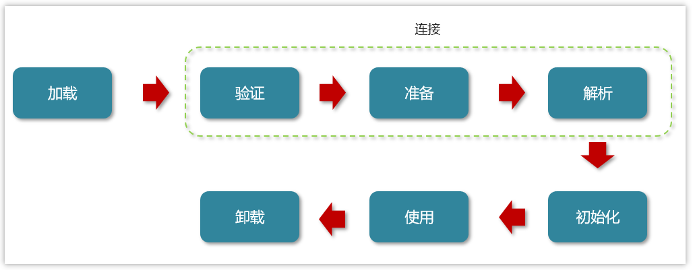

**类的生命周期**

类从加载到虚拟机中开始，直到卸载为止，它的整个生命周期包括了：加载、验证、准备、解析、初始化、使用和卸载这**7个阶段**。其中，**验证、准备和解析**这三个部分统称为**连接（linking）**。

**类加载过程分为以下五个步骤：**

1. **加载（Loading）**
    - 将类的字节码文件（.class文件）从磁盘、网络或其他来源读取到JVM内存中。
2. **链接（Linking）** 包含三个子步骤：
    - **验证（Verification）**：验证加载的字节码是否符合JVM规范，进行安全性检查。
    - **准备（Preparation）**：为类的静态变量分配内存，并初始化为默认值。
    - **解析（Resolution）**：把类中的符号引用转换为直接引用（内存地址）。
3. **初始化（Initialization）**
    - 对类的静态变量，静态代码块执行初始化操作。
4. **使用（Using）**
    - 类可以被正常使用，静态变量和方法可被调用。
5. **卸载（Unloading）**
    - 当类不再使用时，JVM会释放其内存。

<details class="lake-collapse"><summary id="u70ce6b37"><span class="ne-text">完整版</span></summary><p id="u4d2c8aa2" class="ne-p"><span class="ne-text">在Java中，类加载过程是指将类的字节码文件加载到JVM内存中并准备执行的过程。这个过程由Java类加载器（ClassLoader）负责，主要包含以下几个阶段：</span></p><h3 id="3098bd2f"><span class="ne-text">1. </span><strong><span class="ne-text">加载（Loading）</span></strong></h3><p id="u819c277d" class="ne-p"><span class="ne-text">类加载的第一步是将类的字节码从磁盘或其他资源加载到内存中。此时，JVM会根据类的全限定名（包括包名）去查找相应的字节码文件（</span><code class="ne-code"><span class="ne-text">.class</span></code><span class="ne-text">文件），并通过类加载器将其读入内存。</span></p><ul class="ne-ul"><li id="ub5537dff" data-lake-index-type="0"><strong><span class="ne-text">类加载器</span></strong><span class="ne-text">：JVM使用类加载器来加载类，主要有三种类加载器： </span></li></ul><ul class="ne-list-wrap"><ul ne-level="1" class="ne-ul"><li id="uf788a8fb" data-lake-index-type="0"><strong><span class="ne-text">Bootstrap ClassLoader</span></strong><span class="ne-text">：加载JDK核心类库（如</span><code class="ne-code"><span class="ne-text">java.lang.*</span></code><span class="ne-text">）；</span></li><li id="uffc488e3" data-lake-index-type="0"><strong><span class="ne-text">Extension ClassLoader</span></strong><span class="ne-text">：加载</span><code class="ne-code"><span class="ne-text">jre/lib/ext/</span></code><span class="ne-text">目录下的类库；</span></li><li id="u4236c3f6" data-lake-index-type="0"><strong><span class="ne-text">System ClassLoader</span></strong><span class="ne-text">（AppClassLoader）：加载</span><code class="ne-code"><span class="ne-text">classpath</span></code><span class="ne-text">下的类库。</span></li></ul></ul><h3 id="931ef16d"><span class="ne-text">2. </span><strong><span class="ne-text">验证（Verification）</span></strong></h3><p id="ud9a638e5" class="ne-p"><span class="ne-text">在加载的字节码文件进入内存后，JVM需要验证字节码的合法性和安全性，防止恶意或损坏的代码进入JVM。验证的内容包括：</span></p><ul class="ne-ul"><li id="u72db1fc8" data-lake-index-type="0"><strong><span class="ne-text">文件格式验证</span></strong><span class="ne-text">：确保字节码文件符合Java虚拟机规范。</span></li><li id="u3dcc4181" data-lake-index-type="0"><strong><span class="ne-text">元数据验证</span></strong><span class="ne-text">：检查类的元数据是否正确。</span></li><li id="u4fb733bd" data-lake-index-type="0"><strong><span class="ne-text">字节码验证</span></strong><span class="ne-text">：确保字节码遵循JVM指令集，并且不违反JVM的安全规则。</span></li><li id="uc90de008" data-lake-index-type="0"><strong><span class="ne-text">符号引用验证</span></strong><span class="ne-text">：检查常量池中的符号引用是否能够解析到有效的类或方法。</span></li></ul><h3 id="45e9c584"><span class="ne-text">3. </span><strong><span class="ne-text">准备（Preparation）</span></strong></h3><p id="uc4861644" class="ne-p"><span class="ne-text">此阶段是分配内存并初始化类的静态变量。类的静态字段会被初始化为默认值（如</span><code class="ne-code"><span class="ne-text">0</span></code><span class="ne-text">，</span><code class="ne-code"><span class="ne-text">null</span></code><span class="ne-text">，</span><code class="ne-code"><span class="ne-text">false</span></code><span class="ne-text">等）。这时静态变量还没有被赋予具体的值，只是分配了内存并设定了默认初值。</span></p><h3 id="a8b5acf6"><span class="ne-text">4. </span><strong><span class="ne-text">解析（Resolution）</span></strong></h3><p id="ufd0ea4c1" class="ne-p"><span class="ne-text">解析是将类中的符号引用（如方法、字段等）替换成直接引用的过程。这一过程会在类使用时逐步进行，通常包括：</span></p><ul class="ne-ul"><li id="ueb9852c2" data-lake-index-type="0"><strong><span class="ne-text">类或接口的解析</span></strong><span class="ne-text">：通过查找符号引用来确定类或接口的具体实现。</span></li><li id="uc43eaa01" data-lake-index-type="0"><strong><span class="ne-text">字段和方法的解析</span></strong><span class="ne-text">：将字段和方法的符号引用解析为实际的内存地址或方法引用。</span></li></ul><h3 id="f5aa1499"><span class="ne-text">5. </span><strong><span class="ne-text">初始化（Initialization）</span></strong></h3><p id="u8b5b19b7" class="ne-p"><span class="ne-text">初始化是类加载的最后一步，是为类的静态变量赋予具体值并执行类的静态代码块的过程。静态初始化块（</span><code class="ne-code"><span class="ne-text">static</span></code><span class="ne-text">块）和静态变量的初始化会在类第一次被使用时触发（例如，访问类的静态成员、创建该类的实例等）。</span></p><ul class="ne-ul"><li id="u516c7c9e" data-lake-index-type="0"><strong><span class="ne-text">静态初始化块</span></strong><span class="ne-text">：当类被加载时，静态代码块会按照在源代码中的顺序执行。初始化顺序通常是：静态变量赋值 → 静态代码块执行。</span></li></ul><h3 id="7bb8bc55"><span class="ne-text">6. </span><strong><span class="ne-text">类加载的触发时机</span></strong></h3><p id="ub5a1a455" class="ne-p"><span class="ne-text">类加载不仅仅是主动加载，也有延迟加载的特性。类的加载通常在以下情况触发：</span></p><ul class="ne-ul"><li id="u8cef1ace" data-lake-index-type="0"><span class="ne-text">创建类的实例；</span></li><li id="ue3b9dc6a" data-lake-index-type="0"><span class="ne-text">访问类的静态字段或调用静态方法；</span></li><li id="u3cb0b711" data-lake-index-type="0"><span class="ne-text">使用</span><code class="ne-code"><span class="ne-text">Class.forName()</span></code><span class="ne-text">或</span><code class="ne-code"><span class="ne-text">ClassLoader.loadClass()</span></code><span class="ne-text">显式加载类；</span></li><li id="u4803dd95" data-lake-index-type="0"><span class="ne-text">在反射、动态代理等其他机制中触发类加载。</span></li></ul><h3 id="3ab17fdb"><span class="ne-text">7. </span><strong><span class="ne-text">类的卸载</span></strong></h3><p id="ud3bb58ea" class="ne-p"><span class="ne-text">类加载器通过</span><code class="ne-code"><span class="ne-text">JVM</span></code><span class="ne-text">的垃圾回收机制，也有可能卸载类。类的卸载通常发生在类加载器没有引用该类时，并且该类所加载的类没有任何活动线程在使用。</span></p><h3 id="25f9c7fa"><span class="ne-text">总结</span></h3><p id="u23af6cb9" class="ne-p"><span class="ne-text">类加载的过程是复杂且分阶段进行的，包括加载、验证、准备、解析和初始化等步骤。每一步都确保类能安全、高效地进入JVM环境并可以顺利执行。</span></p></details>
## 什么是双亲委派模型？
 当一个类需要被加载时，**类加载器**首先会请求它的**父类加载器**去加载这个类。只有当父类加载器无法加载该类时（即在它的搜索范围内没有找到所需的类），**子类加载器**才会尝试自己加载。  

## 为什么要用双亲委派模型？**双亲委派机制的优点**
**使用双亲委派模型的目的是为了保证：**

1. **避免类重复加载：**确保每个类只被加载一次，避免重复加载****。
2. **保障核心类库安全：**防止用户自定义类覆盖 Java 核心类库，确保系统安全和一致性。
3. **简化加载流程：**通过委派，减少每个加载器的负担，提高类加载效率。

## 如何破坏双亲委派机制？
[面试必备：什么时候要打破双亲委派机制？什么是双亲委派？ （图解+秒懂+史上最全） - 疯狂创客圈 - 博客园](https://www.cnblogs.com/crazymakercircle/p/15554725.html)

**打破或遵循双亲委派模型的方式：**

+ **遵循双亲委派模型**  
如果不想打破双亲委派模型，只需重写 `ClassLoader` 类中的 `findClass()` 方法。无法被父类加载器加载的类最终会通过这个方法被加载。
+ **打破双亲委派模型**
+ 创建自定义类加载器，继承ClassLoader，重写loadClass()方法，

**双亲委派模型的打破场景**

+ **SPI机制：**

**Java的SPI（如JDBC驱动）需要动态加载实现类，DriverManager通过线程上下文类加载器（**`**Thread.currentThread().getContextClassLoader()**`**）加载，绕过双亲委派。**

+ **应用服务器：**

**Tomcat为每个Web应用创建独立的类加载器，先加载应用内的类，再委派给父加载器，实现类隔离。**

+ **热部署与模块化：**

**OSGi框架或热部署场景需要动态加载新版本的类，打破双亲委派以支持类隔离和版本管理。**

<details class="lake-collapse"><summary id="uc6f205a1"><span class="ne-text">打破双亲委派机制</span></summary><p id="u0ed28e8a" class="ne-p"><span class="ne-text">在 Java 中，有以下几种方法可以打破双亲委派机制：</span></p><hr id="eKBJR" class="ne-hr"><ol class="ne-ol"><li id="u9df43fbd" data-lake-index-type="0"><strong><span class="ne-text">自定义类加载器</span></strong><span class="ne-text">：通过自定义 </span><code class="ne-code"><span class="ne-text">ClassLoader</span></code><span class="ne-text"> 的子类，重写 </span><code class="ne-code"><span class="ne-text">findClass()</span></code><span class="ne-text"> 方法，实现自定义的类加载逻辑。在自定义类加载器中，可以选择不委派给父类加载器，而是自己去加载类。</span></li></ol><pre data-language="java" id="cY4g2" class="ne-codeblock language-java"><code>public class CustomClassLoader extends ClassLoader {
    @Override
    protected Class&lt;?&gt; findClass(String name) throws ClassNotFoundException {
        // 自定义类加载逻辑，例如从特定路径加载类文件
        byte[] classBytes = loadClassBytes(name);
        return defineClass(name, classBytes, 0, classBytes.length);
    }

    private byte[] loadClassBytes(String name) {
        // 从特定路径加载类文件，并返回字节码
        // ...
    }
}</code></pre><hr id="DfM3s" class="ne-hr"><ol class="ne-ol"><li id="ue8c15309" data-lake-index-type="0"><strong><span class="ne-text">线程上下文类加载器</span></strong><span class="ne-text">：通过 </span><code class="ne-code"><span class="ne-text">Thread</span></code><span class="ne-text"> 类的 </span><code class="ne-code"><span class="ne-text">setContextClassLoader()</span></code><span class="ne-text"> 方法，可以设置线程的上下文类加载器。在某些框架或库中，会使用线程上下文类加载器来加载特定的类，从而打破双亲委派机制。</span></li><li id="u246c0dca" data-lake-index-type="0"><strong><span class="ne-text">OSGi框架</span></strong><span class="ne-text">：OSGi（Open Service Gateway Initiative）是一种动态模块化的 Java 平台，它提供了一套机制来管理和加载模块。在 OSGi 中，每个模块都有自己的类加载器，可以独立加载和管理类，从而打破双亲委派机制。</span></li><li id="ue267cd0c" data-lake-index-type="0"><strong><span class="ne-text">Java SPI机制</span></strong><span class="ne-text">：Java SPI（Service Provider Interface）是一种标准的服务发现机制，在 SPI 中，服务的实现类通过在 </span><code class="ne-code"><span class="ne-text">META-INF/services</span></code><span class="ne-text"> 目录下的配置文件中声明，而不是通过类路径来查找。通过 SPI 机制，可以实现在不同的类加载器中加载不同的服务实现类，从而打破双亲委派机制。</span></li></ol></details>
## 历史上有哪几次双亲委派机制的破坏？
双亲委派机制在历史上主要有三次破坏：

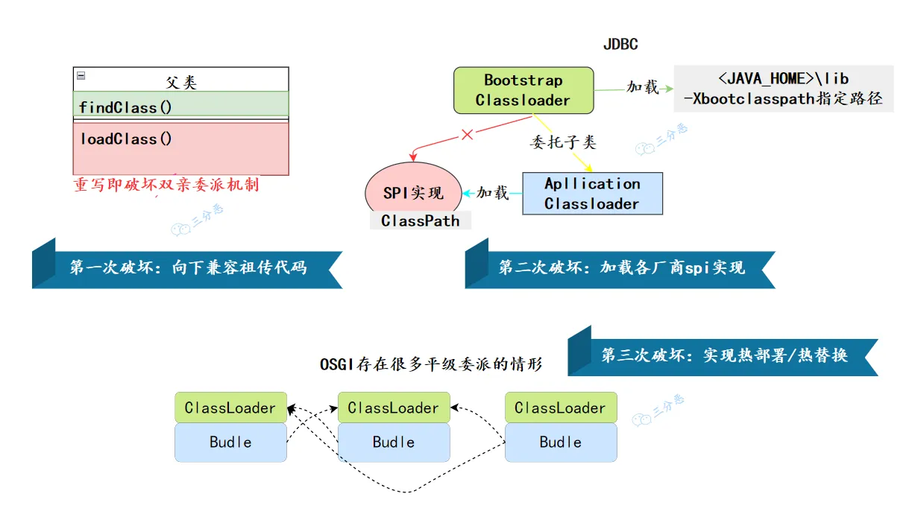

三分恶面渣逆袭：双亲委派模型的三次破坏

#### [说说第一次破坏](https://javabetter.cn/sidebar/sanfene/jvm.html#说说第一次破坏)
双亲委派模型的第一次“被破坏”其实发生在双亲委派模型出现之前——即 JDK 1.2 面世以前的“远古”时代。

由于双亲委派模型在 JDK 1.2 之后才被引入，但是类加载器的概念和抽象类 java.lang.ClassLoader 则在 Java 的第一个版本中就已经存在，为了向下兼容旧代码，所以无法以技术手段避免 loadClass()被子类覆盖的可能性，只能在 JDK 1.2 之后的 java.lang.ClassLoader 中添加一个新的 protected 方法 findClass()，并引导用户编写的类加载逻辑时尽可能去重写这个方法，而不是在 loadClass()中编写代码。

#### [说说第二次破坏](https://javabetter.cn/sidebar/sanfene/jvm.html#说说第二次破坏)
双亲委派模型的第二次“被破坏”是由这个模型自身的缺陷导致的，如果有基础类型又要调用回用户的代码，那该怎么办呢？

例如我们比较熟悉的 JDBC:

各个厂商各有不同的 JDBC 的实现，Java 在核心包`\lib`里定义了对应的 SPI，那么这个就毫无疑问由`启动类加载器`加载器加载。

但是各个厂商的实现，是没办法放在核心包里的，只能放在`classpath`里，只能被`应用类加载器`加载。那么，问题来了，启动类加载器它就加载不到厂商提供的 SPI 服务代码。

为了解决这个问题，引入了一个不太优雅的设计：线程上下文类加载器 （Thread Context ClassLoader）。这个类加载器可以通过 java.lang.Thread 类的 setContext-ClassLoader()方法进行设置，如果创建线程时还未设置，它将会从父线程中继承一个，如果在应用程序的全局范围内都没有设置过的话，那这个类加载器默认就是应用程序类加载器。

JNDI 服务使用这个线程上下文类加载器去加载所需的 SPI 服务代码，这是一种父类加载器去请求子类加载器完成类加载的行为。

#### [说说第三次破坏](https://javabetter.cn/sidebar/sanfene/jvm.html#说说第三次破坏)
双亲委派模型的第三次“被破坏”是由于用户对程序动态性的追求而导致的，例如代码热替换（Hot Swap）、模块热部署（Hot Deployment）等。

OSGi 实现模块化热部署的关键是它自定义的类加载器机制的实现，每一个程序模块（OSGi 中称为 Bundle）都有一个自己的类加载器，当需要更换一个 Bundle 时，就把 Bundle 连同类加载器一起换掉以实现代码的热替换。在 OSGi 环境下，类加载器不再双亲委派模型推荐的树状结构，而是进一步发展为更加复杂的网状结构。

## <font style="color:rgb(51, 51, 51);">如何加载两个全限定名一样的类，jvm是如何区分的</font>
 可以使用 **不同的类加载器**，可以加载具有相同全限定名的类。类加载器之间的隔离性使得它们可以加载相同名称的类而不会产生冲突。  

## Tomcat 的类加载机制了解吗？
**Tomcat** 是主流的 Java Web 服务器之一，为了实现一些特殊的功能需求，自定义了一些类加载器。

**Tomcat 实际上也是破坏了双亲委派模型的**。

Tomcat 是 web 容器，可能需要部署多个应用程序。不同的应用程序可能会依赖同一个第三方类库的不同版本，但是不同版本的类库中某一个类的全路径名可能是一样的。例如，多个应用都要依赖 `hollis.jar`，但是：

1. **A 应用** 需要依赖 **1.0.0 版本**。
2. **B 应用** 需要依赖 **1.0.1 版本**。

这两个版本中都有一个类是 `com.hollis.Test.class`。如果采用默认的双亲委派类加载机制，那么无法加载多个相同的类。

因此，Tomcat 破坏了双亲委派原则，提供了隔离的机制，为每个 Web 容器单独提供一个 **WebAppClassLoader**  （Web 应用类加载器）。每一个 **WebAppClassLoader** 负责加载本身的目录下的 class 文件，加载不到时再交给 **CommonClassLoader**（ 系统类加载器  ） 加载，这和双亲委派模型刚好相反。

## 说说解释执行和编译执行的区别
**解释和编译的区别：**

1. **解释**：将源代码逐行转换为机器码。
2. **编译**：将源代码一次性转换为机器码。

---

**解释执行和编译执行的区别：**

1. **解释执行**：程序运行时，将源代码逐行转换为机器码，然后执行。
2. **编译执行**：程序运行前，将源代码一次性转换为机器码，然后执行。

---

**Java 一般被称为“解释型语言”**，因为 Java 代码在执行前，需要先将源代码编译成字节码，然后在运行时，再由 JVM 的解释器“逐行”将字节码转换为机器码，然后执行。这也是 Java 被诟病“慢”的主要原因。

但 **JIT**（Just-In-Time 编译器）的出现打破了这种刻板印象。JVM 会将 **热点代码**（即运行频率高的代码）编译后放入 **CodeCache**，当下次执行再遇到这段代码时，会从 **CodeCache** 中直接读取机器码，然后执行。这大大提升了 Java 的执行效率。


# 五、JVM 调优
## 这个到时候得重点看一下，了解基本的调优过程
##  Linux排查问题常用指令：  
针对这两个问题，以下是常见的回答：

### 4. Linux排查问题常用指令：
在Linux系统中，排查问题时，通常会使用以下几种指令：

1. `**top**`：实时查看系统的资源使用情况（CPU、内存、进程等），帮助判断系统是否存在性能瓶颈。
    - 用法：`top`
2. `**ps**`：查看当前系统中运行的进程信息。
    - 用法：`ps aux` 或 `ps -ef`
3. `**netstat**`：查看网络连接、路由表、接口状态等网络信息。
    - 用法：`netstat -tulnp`
4. `**vmstat**`：查看系统的虚拟内存和进程、CPU使用情况。
    - 用法：`vmstat`

---

### 5. `top`命令
`top`命令是一个实时监控系统资源使用情况的工具，可以查看CPU、内存、进程等系统的运行状况。`top`命令常用于排查系统性能瓶颈。

#### 常见用法：
1. **查看系统资源使用情况**：
    - 直接运行：`top`
    - 显示的信息包括：系统的CPU、内存、交换空间使用情况，当前运行的进程及它们的资源消耗等。
2. **按CPU使用率排序**：
    - 按`P`键可以按CPU占用从高到低排序。
3. **按内存使用率排序**：
    - 按`M`键可以按内存占用从高到低排序。
4. **显示进程树**：
    - 按`V`键切换显示进程树结构，查看进程之间的关系。
5. **查看特定用户的进程**：
    - 按`u`键，然后输入用户名，只显示该用户的进程。
6. **过滤显示某个进程**：
    - 按`Shift + F`，然后选择排序字段，按`q`退出。
7. **更改刷新频率**：
    - 默认刷新频率是3秒，按`d`键可以设置刷新频率。
8. **杀死进程**：
    - 按`k`键，然后输入要杀死的进程PID。
9. **显示进程详细信息**：
    - 按`i`键切换进程显示模式（可以显示更详细的进程信息）。
10. **退出**`**top**`：
    - 按`q`键退出`top`命令界面。

`top`命令对于实时监控和分析系统资源非常有用，特别是在处理系统性能瓶颈时。

## 有哪些常用的命令行性能监控和故障处理工具？
**操作系统工具**  

1. **top**：显示系统整体资源使用情况  
2. **vmstat**：监控内存和 CPU  
3. **iostat**：监控 IO 使用  
4. **netstat**：监控网络使用

**JDK 性能监控工具**  

1. **jps**：虚拟机进程查看  
2. **jstat**：虚拟机运行时信息查看  
3. **jinfo**：虚拟机配置查看  
4. **jmap**：内存映像（导出）  
5. **jhat**：堆转储快照分析  
6. **jstack**：Java 堆栈跟踪  
7. **jcmd**：实现上面除了 jstat 外所有命令的功能

<details class="lake-collapse"><summary id="uc1093acf"><span class="ne-text">详细讲解</span></summary><h3 id="434ab793"><span class="ne-text">操作系统工具</span></h3><ol class="ne-ol"><li id="ub2edc234" data-lake-index-type="0"><strong><span class="ne-text">top</span></strong><span class="ne-text">：</span></li></ol><ul class="ne-list-wrap"><ul ne-level="1" class="ne-ul"><li id="u399de409" data-lake-index-type="0"><strong><span class="ne-text">功能</span></strong><span class="ne-text">：</span><code class="ne-code"><span class="ne-text">top</span></code><span class="ne-text"> 是一个实时监控系统资源使用情况的工具，显示 CPU、内存、进程等系统资源的使用情况。</span></li><li id="u1393d5bc" data-lake-index-type="0"><strong><span class="ne-text">使用场景</span></strong><span class="ne-text">：在系统资源占用过高时，可以使用 </span><code class="ne-code"><span class="ne-text">top</span></code><span class="ne-text"> 来监控哪些进程占用了过多的 CPU 和内存。它是性能监控的基本工具，适合实时查看。</span></li><li id="ua8509015" data-lake-index-type="0"><strong><span class="ne-text">常用参数</span></strong><span class="ne-text">： </span></li></ul></ul><ul class="ne-list-wrap"><ul class="ne-list-wrap"><ul ne-level="2" class="ne-ul"><li id="ud6522e53" data-lake-index-type="0"><code class="ne-code"><span class="ne-text">top -d &lt;seconds&gt;</span></code><span class="ne-text">：指定刷新间隔（单位：秒）。</span></li><li id="ua6436f79" data-lake-index-type="0"><code class="ne-code"><span class="ne-text">top -u &lt;user&gt;</span></code><span class="ne-text">：显示某个用户的进程信息。</span></li></ul></ul></ul><ol start="2" class="ne-ol"><li id="ub1518785" data-lake-index-type="0"><strong><span class="ne-text">vmstat</span></strong><span class="ne-text">：</span></li></ol><ul class="ne-list-wrap"><ul ne-level="1" class="ne-ul"><li id="ua3fede02" data-lake-index-type="0"><strong><span class="ne-text">功能</span></strong><span class="ne-text">：</span><code class="ne-code"><span class="ne-text">vmstat</span></code><span class="ne-text"> 用于报告系统的虚拟内存、进程、CPU 活动等信息，特别适用于内存和 CPU 的监控。</span></li><li id="u6be7d328" data-lake-index-type="0"><strong><span class="ne-text">使用场景</span></strong><span class="ne-text">：监控系统的内存使用情况，查看 CPU 的负载情况，帮助判断系统资源瓶颈。</span></li><li id="u26e3ef4e" data-lake-index-type="0"><strong><span class="ne-text">常用参数</span></strong><span class="ne-text">： </span></li></ul></ul><ul class="ne-list-wrap"><ul class="ne-list-wrap"><ul ne-level="2" class="ne-ul"><li id="u11a535f0" data-lake-index-type="0"><code class="ne-code"><span class="ne-text">vmstat 1</span></code><span class="ne-text">：每秒刷新一次显示系统的 CPU、内存、交换区、IO 等信息。</span></li><li id="uc9d37407" data-lake-index-type="0"><code class="ne-code"><span class="ne-text">vmstat -s</span></code><span class="ne-text">：显示内存、交换区等的统计信息。</span></li></ul></ul></ul><ol start="3" class="ne-ol"><li id="u22d04c2b" data-lake-index-type="0"><strong><span class="ne-text">iostat</span></strong><span class="ne-text">：</span></li></ol><ul class="ne-list-wrap"><ul ne-level="1" class="ne-ul"><li id="u95d62bb2" data-lake-index-type="0"><strong><span class="ne-text">功能</span></strong><span class="ne-text">：</span><code class="ne-code"><span class="ne-text">iostat</span></code><span class="ne-text"> 用于监控系统的输入/输出设备的使用情况，查看磁盘、网络等设备的 I/O 性能。</span></li><li id="uc0b3f29b" data-lake-index-type="0"><strong><span class="ne-text">使用场景</span></strong><span class="ne-text">：监控磁盘 I/O 和 CPU 占用情况，特别适合用于定位磁盘或网络瓶颈。</span></li><li id="ue15c866b" data-lake-index-type="0"><strong><span class="ne-text">常用参数</span></strong><span class="ne-text">： </span></li></ul></ul><ul class="ne-list-wrap"><ul class="ne-list-wrap"><ul ne-level="2" class="ne-ul"><li id="u55042f27" data-lake-index-type="0"><code class="ne-code"><span class="ne-text">iostat -x</span></code><span class="ne-text">：显示磁盘 I/O 的详细统计信息。</span></li><li id="u82cf29d1" data-lake-index-type="0"><code class="ne-code"><span class="ne-text">iostat -d</span></code><span class="ne-text">：仅显示磁盘设备的使用情况。</span></li></ul></ul></ul><ol start="4" class="ne-ol"><li id="u6946b9e3" data-lake-index-type="0"><strong><span class="ne-text">netstat</span></strong><span class="ne-text">：</span></li></ol><ul class="ne-list-wrap"><ul ne-level="1" class="ne-ul"><li id="u86d04f4c" data-lake-index-type="0"><strong><span class="ne-text">功能</span></strong><span class="ne-text">：</span><code class="ne-code"><span class="ne-text">netstat</span></code><span class="ne-text"> 用于显示网络连接、路由表、接口状态等信息。</span></li><li id="u613fd49f" data-lake-index-type="0"><strong><span class="ne-text">使用场景</span></strong><span class="ne-text">：用于监控网络连接状态、查看开放端口和网络通信的状况，适合故障排查和分析网络瓶颈。</span></li><li id="ufc0118eb" data-lake-index-type="0"><strong><span class="ne-text">常用参数</span></strong><span class="ne-text">： </span></li></ul></ul><ul class="ne-list-wrap"><ul class="ne-list-wrap"><ul ne-level="2" class="ne-ul"><li id="u637b1185" data-lake-index-type="0"><code class="ne-code"><span class="ne-text">netstat -an</span></code><span class="ne-text">：显示所有连接的端口和对应的状态。</span></li><li id="ufc9a03fc" data-lake-index-type="0"><code class="ne-code"><span class="ne-text">netstat -tuln</span></code><span class="ne-text">：显示 TCP/UDP 服务的监听端口。</span></li></ul></ul></ul><hr id="ZjsH3" class="ne-hr"><h3 id="217bdb4b"><span class="ne-text">JDK 性能监控工具</span></h3><ol class="ne-ol"><li id="ufd6bfc87" data-lake-index-type="0"><strong><span class="ne-text">jps (Java Process Status Tool)</span></strong><span class="ne-text">：</span></li></ol><ul class="ne-list-wrap"><ul ne-level="1" class="ne-ul"><li id="u38329109" data-lake-index-type="0"><strong><span class="ne-text">功能</span></strong><span class="ne-text">：</span><code class="ne-code"><span class="ne-text">jps</span></code><span class="ne-text"> 用于列出当前运行的 Java 进程，显示进程 ID（PID）和主类名或 JAR 文件路径。</span></li><li id="u39247a50" data-lake-index-type="0"><strong><span class="ne-text">使用场景</span></strong><span class="ne-text">：可以快速查看当前系统中正在运行的 Java 应用，尤其在多进程环境下非常有用。</span></li><li id="u221e5e38" data-lake-index-type="0"><strong><span class="ne-text">常用参数</span></strong><span class="ne-text">： </span></li></ul></ul><ul class="ne-list-wrap"><ul class="ne-list-wrap"><ul ne-level="2" class="ne-ul"><li id="uf387eb03" data-lake-index-type="0"><code class="ne-code"><span class="ne-text">jps -l</span></code><span class="ne-text">：显示 Java 进程的完整类名或 JAR 文件路径。</span></li><li id="u46a1a5f8" data-lake-index-type="0"><code class="ne-code"><span class="ne-text">jps -v</span></code><span class="ne-text">：显示 Java 进程的虚拟机参数。</span></li></ul></ul></ul><ol start="2" class="ne-ol"><li id="u985dc3cc" data-lake-index-type="0"><strong><span class="ne-text">jstat (Java Virtual Machine Statistics Monitoring Tool)</span></strong><span class="ne-text">：</span></li></ol><ul class="ne-list-wrap"><ul ne-level="1" class="ne-ul"><li id="uafe6f5cd" data-lake-index-type="0"><strong><span class="ne-text">功能</span></strong><span class="ne-text">：</span><code class="ne-code"><span class="ne-text">jstat</span></code><span class="ne-text"> 用于监控 JVM 的运行时状态，提供包括垃圾回收、内存使用、JIT 编译等信息。</span></li><li id="u99e90f80" data-lake-index-type="0"><strong><span class="ne-text">使用场景</span></strong><span class="ne-text">：用于监控 JVM 性能，查看垃圾回收、内存使用情况，帮助定位性能瓶颈。</span></li><li id="u139b0c2e" data-lake-index-type="0"><strong><span class="ne-text">常用参数</span></strong><span class="ne-text">： </span></li></ul></ul><ul class="ne-list-wrap"><ul class="ne-list-wrap"><ul ne-level="2" class="ne-ul"><li id="ub6fafa51" data-lake-index-type="0"><code class="ne-code"><span class="ne-text">jstat -gc &lt;PID&gt;</span></code><span class="ne-text">：查看垃圾回收相关统计信息。</span></li><li id="ub3f94e22" data-lake-index-type="0"><code class="ne-code"><span class="ne-text">jstat -gcutil &lt;PID&gt;</span></code><span class="ne-text">：查看垃圾回收的使用率。</span></li><li id="u563bab34" data-lake-index-type="0"><code class="ne-code"><span class="ne-text">jstat -class &lt;PID&gt;</span></code><span class="ne-text">：查看类加载器的统计信息。</span></li></ul></ul></ul><ol start="3" class="ne-ol"><li id="udca4cdf2" data-lake-index-type="0"><strong><span class="ne-text">jinfo (Java Configuration Information)</span></strong><span class="ne-text">：</span></li></ol><ul class="ne-list-wrap"><ul ne-level="1" class="ne-ul"><li id="u54fc8b10" data-lake-index-type="0"><strong><span class="ne-text">功能</span></strong><span class="ne-text">：</span><code class="ne-code"><span class="ne-text">jinfo</span></code><span class="ne-text"> 用于查看 JVM 的配置信息，包括系统属性、JVM 参数等。</span></li><li id="u89685368" data-lake-index-type="0"><strong><span class="ne-text">使用场景</span></strong><span class="ne-text">：当需要查看当前 JVM 配置，特别是在调优和故障诊断时查看配置项。</span></li><li id="ube239b1b" data-lake-index-type="0"><strong><span class="ne-text">常用参数</span></strong><span class="ne-text">： </span></li></ul></ul><ul class="ne-list-wrap"><ul class="ne-list-wrap"><ul ne-level="2" class="ne-ul"><li id="u34583374" data-lake-index-type="0"><code class="ne-code"><span class="ne-text">jinfo -sysprops &lt;PID&gt;</span></code><span class="ne-text">：显示 JVM 系统属性。</span></li><li id="udcf41442" data-lake-index-type="0"><code class="ne-code"><span class="ne-text">jinfo -flags &lt;PID&gt;</span></code><span class="ne-text">：显示 JVM 启动时的参数。</span></li></ul></ul></ul><ol start="4" class="ne-ol"><li id="u54794345" data-lake-index-type="0"><strong><span class="ne-text">jmap (Java Memory Map Tool)</span></strong><span class="ne-text">：</span></li></ol><ul class="ne-list-wrap"><ul ne-level="1" class="ne-ul"><li id="u9ebf61ee" data-lake-index-type="0"><strong><span class="ne-text">功能</span></strong><span class="ne-text">：</span><code class="ne-code"><span class="ne-text">jmap</span></code><span class="ne-text"> 用于生成 JVM 的内存映像（heap dump），或者显示堆的内存使用情况。</span></li><li id="ue42fd4e2" data-lake-index-type="0"><strong><span class="ne-text">使用场景</span></strong><span class="ne-text">：分析 JVM 内存，特别是在发生内存泄漏时，生成堆转储文件，用工具（如 MAT）进行分析。</span></li><li id="ucdd5f3b0" data-lake-index-type="0"><strong><span class="ne-text">常用参数</span></strong><span class="ne-text">： </span></li></ul></ul><ul class="ne-list-wrap"><ul class="ne-list-wrap"><ul ne-level="2" class="ne-ul"><li id="udfa55a06" data-lake-index-type="0"><code class="ne-code"><span class="ne-text">jmap -heap &lt;PID&gt;</span></code><span class="ne-text">：显示堆的内存使用情况。</span></li><li id="u3adb1e3a" data-lake-index-type="0"><code class="ne-code"><span class="ne-text">jmap -dump:format=b,file=&lt;file_path&gt; &lt;PID&gt;</span></code><span class="ne-text">：生成堆转储文件。</span></li></ul></ul></ul><ol start="5" class="ne-ol"><li id="ufd7ec05c" data-lake-index-type="0"><strong><span class="ne-text">jhat (Java Heap Analysis Tool)</span></strong><span class="ne-text">：</span></li></ol><ul class="ne-list-wrap"><ul ne-level="1" class="ne-ul"><li id="u77d97011" data-lake-index-type="0"><strong><span class="ne-text">功能</span></strong><span class="ne-text">：</span><code class="ne-code"><span class="ne-text">jhat</span></code><span class="ne-text"> 是一个用于分析堆转储（heap dump）文件的工具，帮助开发者分析内存使用情况，找出可能的内存泄漏。</span></li><li id="ud77b9bb4" data-lake-index-type="0"><strong><span class="ne-text">使用场景</span></strong><span class="ne-text">：结合 </span><code class="ne-code"><span class="ne-text">jmap</span></code><span class="ne-text"> 生成的堆转储文件进行内存分析，常用于内存泄漏诊断。</span></li><li id="uf796a0fe" data-lake-index-type="0"><strong><span class="ne-text">常用参数</span></strong><span class="ne-text">： </span></li></ul></ul><ul class="ne-list-wrap"><ul class="ne-list-wrap"><ul ne-level="2" class="ne-ul"><li id="u75bcbab6" data-lake-index-type="0"><code class="ne-code"><span class="ne-text">jhat &lt;heap_dump_file&gt;</span></code><span class="ne-text">：启动 </span><code class="ne-code"><span class="ne-text">jhat</span></code><span class="ne-text">，加载堆转储文件并启动 Web 服务进行分析。</span></li></ul></ul></ul><ol start="6" class="ne-ol"><li id="ud6d44e5b" data-lake-index-type="0"><strong><span class="ne-text">jstack (Java Stack Trace Tool)</span></strong><span class="ne-text">：</span></li></ol><ul class="ne-list-wrap"><ul ne-level="1" class="ne-ul"><li id="u265d3cca" data-lake-index-type="0"><strong><span class="ne-text">功能</span></strong><span class="ne-text">：</span><code class="ne-code"><span class="ne-text">jstack</span></code><span class="ne-text"> 用于打印当前 JVM 进程的线程堆栈信息，显示线程的状态（如运行、阻塞、等待等）。</span></li><li id="ub1f750f0" data-lake-index-type="0"><strong><span class="ne-text">使用场景</span></strong><span class="ne-text">：用于线程死锁排查、查看线程状态、分析性能瓶颈等。</span></li><li id="ua84f37f3" data-lake-index-type="0"><strong><span class="ne-text">常用参数</span></strong><span class="ne-text">： </span></li></ul></ul><ul class="ne-list-wrap"><ul class="ne-list-wrap"><ul ne-level="2" class="ne-ul"><li id="ube7a9e14" data-lake-index-type="0"><code class="ne-code"><span class="ne-text">jstack &lt;PID&gt;</span></code><span class="ne-text">：打印 JVM 进程的线程堆栈。</span></li><li id="u953442d6" data-lake-index-type="0"><code class="ne-code"><span class="ne-text">jstack -l &lt;PID&gt;</span></code><span class="ne-text">：打印更详细的线程信息，包括锁的持有者。</span></li></ul></ul></ul><ol start="7" class="ne-ol"><li id="u425fb888" data-lake-index-type="0"><strong><span class="ne-text">jcmd (Java Command Tool)</span></strong><span class="ne-text">：</span></li></ol><ul class="ne-list-wrap"><ul ne-level="1" class="ne-ul"><li id="udc2f45ad" data-lake-index-type="0"><strong><span class="ne-text">功能</span></strong><span class="ne-text">：</span><code class="ne-code"><span class="ne-text">jcmd</span></code><span class="ne-text"> 是一个通用的诊断工具，它集成了 </span><code class="ne-code"><span class="ne-text">jps</span></code><span class="ne-text">、</span><code class="ne-code"><span class="ne-text">jstat</span></code><span class="ne-text">、</span><code class="ne-code"><span class="ne-text">jstack</span></code><span class="ne-text">、</span><code class="ne-code"><span class="ne-text">jmap</span></code><span class="ne-text"> 等工具的功能。可以执行 JVM 管理命令，获取诊断信息、管理应用程序的生命周期等。</span></li><li id="u3c8c6119" data-lake-index-type="0"><strong><span class="ne-text">使用场景</span></strong><span class="ne-text">：它可以用来执行 JVM 的各种诊断命令，适用于性能监控、故障排查等。</span></li><li id="uadbec5d1" data-lake-index-type="0"><strong><span class="ne-text">常用参数</span></strong><span class="ne-text">： </span></li></ul></ul><ul class="ne-list-wrap"><ul class="ne-list-wrap"><ul ne-level="2" class="ne-ul"><li id="u13cc7029" data-lake-index-type="0"><code class="ne-code"><span class="ne-text">jcmd &lt;PID&gt; VM.uptime</span></code><span class="ne-text">：查看 JVM 进程的启动时间。</span></li><li id="u9b88d810" data-lake-index-type="0"><code class="ne-code"><span class="ne-text">jcmd &lt;PID&gt; GC.run</span></code><span class="ne-text">：手动触发垃圾回收。</span></li><li id="udeccc546" data-lake-index-type="0"><code class="ne-code"><span class="ne-text">jcmd &lt;PID&gt; Thread.print</span></code><span class="ne-text">：打印当前所有线程的信息。</span></li></ul></ul></ul><hr id="R4rUT" class="ne-hr"><h3 id="XGgVz"><span class="ne-text">总结：</span></h3><ul class="ne-ul"><li id="u55b9303a" data-lake-index-type="0"><strong><span class="ne-text">操作系统工具</span></strong><span class="ne-text">（如 </span><code class="ne-code"><span class="ne-text">top</span></code><span class="ne-text">、</span><code class="ne-code"><span class="ne-text">vmstat</span></code><span class="ne-text">、</span><code class="ne-code"><span class="ne-text">iostat</span></code><span class="ne-text">、</span><code class="ne-code"><span class="ne-text">netstat</span></code><span class="ne-text">）主要用于监控系统层面的资源使用情况，包括 CPU、内存、磁盘、网络等。</span></li><li id="uc8f82518" data-lake-index-type="0"><strong><span class="ne-text">JDK 性能监控工具</span></strong><span class="ne-text">（如 </span><code class="ne-code"><span class="ne-text">jps</span></code><span class="ne-text">、</span><code class="ne-code"><span class="ne-text">jstat</span></code><span class="ne-text">、</span><code class="ne-code"><span class="ne-text">jinfo</span></code><span class="ne-text">、</span><code class="ne-code"><span class="ne-text">jmap</span></code><span class="ne-text">、</span><code class="ne-code"><span class="ne-text">jhat</span></code><span class="ne-text">、</span><code class="ne-code"><span class="ne-text">jstack</span></code><span class="ne-text">、</span><code class="ne-code"><span class="ne-text">jcmd</span></code><span class="ne-text">）则专注于 Java 虚拟机（JVM）内部的监控和故障排查，帮助开发者进行性能分析、内存泄漏排查、线程死锁分析等。</span></li></ul><p id="u1b969d91" class="ne-p"><span class="ne-text">这些工具各自有不同的用途，结合使用它们可以全面了解 Java 应用的性能状况，快速定位和解决故障。</span></p></details>
#### jmap 的具体命令有哪些？
①、我一般会使用 `jmap -heap <pid>` 查看堆内存摘要，包括新生代、老年代、元空间等。

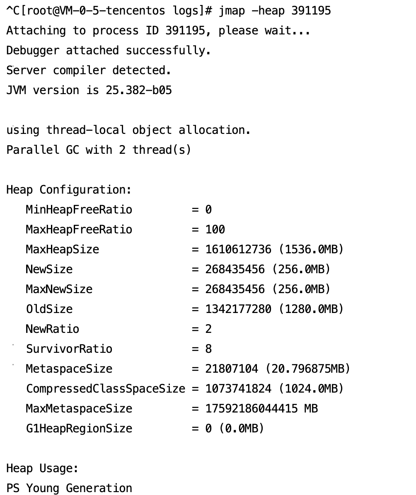

二哥的Java 进阶之路：jmap -heap

②、或者使用 `jmap -histo <pid>` 查看对象分布。

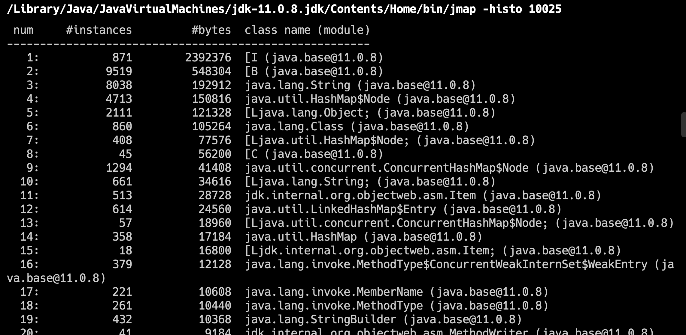

二哥的Java 进阶之路：jmap -histo

③、还有生成堆转储文件：`jmap -dump:format=b,file=<path> <pid>`。


二哥的Java 进阶之路：jmap -dum

## 了解哪些可视化的性能监控和故障处理工具？
我自己用过的可视化工具主要有：

①、JConsole：JDK 自带的监控工具，可以用来监视 Java 应用程序的运行状态，包括内存使用、线程状态、类加载、GC 等，还可以进行一些基本的性能分析。

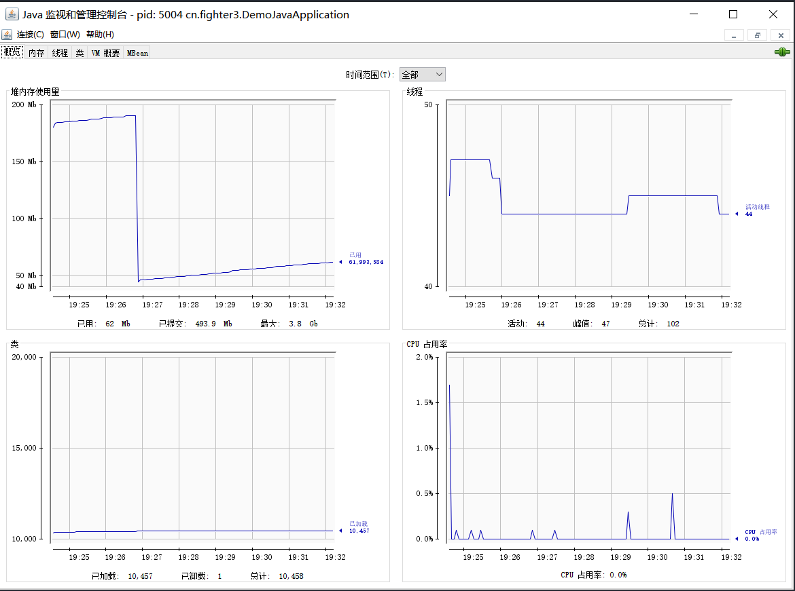

三分恶面渣逆袭：JConsole概览

②、VisualVM：VisualVM 是一个基于 NetBeans 平台的可视化工具，在很长一段时间内，VisualVM 都是 Oracle 官方主推的故障处理工具。集成了多个 JDK 命令行工具的功能，提供了一个友好的图形界面，非常适用于开发和生产环境。

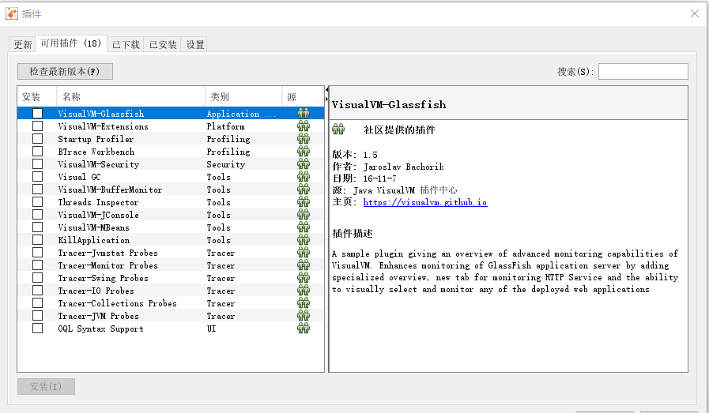

三分恶面渣逆袭：VisualVM安装插件

③、Java Mission Control：JMC 最初是 JRockit VM 中的诊断工具，但在 Oracle JDK7 Update 40 以后，就绑定到了 HotSpot VM 中。不过后来又被 Oracle 开源出来作为一个单独的产品。

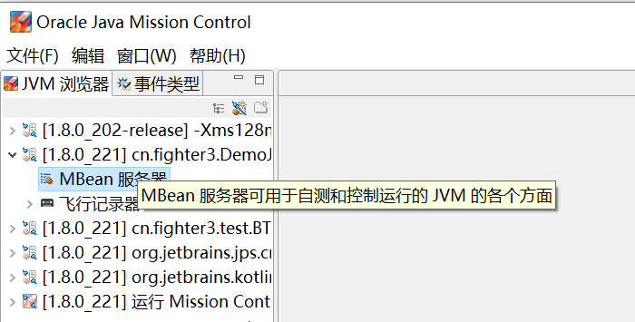

三分恶面渣逆袭：JMC主要界面

还有一些第三方的工具：

①、**MAT**：

+ Java 堆内存分析工具，主要用于分析和查找 Java 堆中的内存泄漏和内存消耗问题。
+ 可以从 Java 堆转储文件中分析内存使用情况，并提供丰富的报告，如内存泄漏疑点、最大对象和 GC 根信息。
+ 支持通过图形界面查询对象，以及检查对象间的引用关系。

②、**GChisto**：GC 日志分析工具，帮助开发者优化垃圾收集行为和调整 GC 性能。

③、**GCViewer**：类似于 GChisto，也是用来分析 GC 日志，帮助开发者优化 Java 应用的垃圾回收过程。

④、**JProfiler**：一个全功能的商业 Java 性能分析工具，提供 CPU、 内存和线程的实时分析。

⑤、**arthas**：

+ 阿里巴巴开源的 Java 诊断工具，主要用于线上的应用诊断。
+ 支持在不停机的情况下进行 Java 应用的诊断。
+ 包括 JVM 信息查看、监控、Trace 命令、反编译等。

⑥、**async-profiler**：一个低开销的性能分析工具，支持生成火焰图，适用于复杂性能问题的分析

<details class="lake-collapse"><summary id="u36889455"><span class="ne-text">Java 通用软件开发一面面试原题：如何查看当前 Java 程序里哪些对象正在使用，哪些对象已经被释放</span></summary><p id="u46862874" class="ne-p"><span class="ne-text">好的，以下是整理后的前四点：</span></p><h3 id="92b4543d"><span class="ne-text">1. </span><strong><span class="ne-text">使用 JVM 的垃圾回收日志</span></strong></h3><p id="u02651563" class="ne-p"><span class="ne-text">Java 提供了垃圾回收（GC）的日志功能，可以启用垃圾回收日志来查看垃圾回收的行为。通过这些日志，可以推测哪些对象被标记为可回收并最终被释放。</span></p><p id="u2c15dbd5" class="ne-p"><span class="ne-text">启用垃圾回收日志的命令：</span></p><pre data-language="java" id="Bekxp" class="ne-codeblock language-java"><code>-Xlog:gc</code></pre><p id="u36724569" class="ne-p"><span class="ne-text">将日志输出到文件：</span></p><pre data-language="java" id="FqixK" class="ne-codeblock language-java"><code>-Xlog:gc*:file=gc.log</code></pre><h3 id="ca1f7544"><span class="ne-text">2. </span><strong><span class="ne-text">使用 </span></strong><code class="ne-code"><strong><span class="ne-text">jconsole</span></strong></code><strong><span class="ne-text"> 工具</span></strong></h3><p id="uaa9d1177" class="ne-p"><code class="ne-code"><span class="ne-text">jconsole</span></code><span class="ne-text"> 是一个 Java 自带的监控和管理工具，能实时查看堆内存、垃圾回收等信息。你可以通过 </span><code class="ne-code"><span class="ne-text">Memory</span></code><span class="ne-text"> 标签页查看堆内存使用情况，间接了解哪些对象被分配和回收。</span></p><p id="u7798b28e" class="ne-p"><span class="ne-text">启动 </span><code class="ne-code"><span class="ne-text">jconsole</span></code><span class="ne-text"> 并选择要监控的 Java 程序。</span></p><h3 id="7ae4fd4e"><span class="ne-text">3. </span><strong><span class="ne-text">使用 </span></strong><code class="ne-code"><strong><span class="ne-text">VisualVM</span></strong></code><strong><span class="ne-text"> 工具</span></strong></h3><p id="u3e51b0bc" class="ne-p"><code class="ne-code"><span class="ne-text">VisualVM</span></code><span class="ne-text"> 是一个可视化工具，可以监控 Java 应用的内存使用情况，包括查看堆内存中的对象，监控垃圾回收以及分析内存泄漏。通过 </span><code class="ne-code"><span class="ne-text">Heap Dump</span></code><span class="ne-text"> 功能，可以查看堆内存中的对象。</span></p><p id="ud4a355c5" class="ne-p"><span class="ne-text">启动 </span><code class="ne-code"><span class="ne-text">VisualVM</span></code><span class="ne-text"> 并连接到 Java 应用后，在 </span><code class="ne-code"><span class="ne-text">Heap Dump</span></code><span class="ne-text"> 部分查看对象。</span></p><h3 id="f8bf793b"><span class="ne-text">4. </span><strong><span class="ne-text">使用 </span></strong><code class="ne-code"><strong><span class="ne-text">jmap</span></strong></code><strong><span class="ne-text"> 和 </span></strong><code class="ne-code"><strong><span class="ne-text">jhat</span></strong></code><strong><span class="ne-text"> 工具</span></strong></h3><ul class="ne-ul"><li id="u4b8a1817" data-lake-index-type="0"><code class="ne-code"><span class="ne-text">jmap</span></code><span class="ne-text"> 可以生成堆转储（heap dump），用于分析堆内存中的对象。</span></li></ul><p id="u7ac9d0c0" class="ne-p"><span class="ne-text">生成堆转储命令：</span></p><pre data-language="java" id="iBmeX" class="ne-codeblock language-java"><code>jmap -dump:live,format=b,file=heapdump.hprof &lt;PID&gt;</code></pre><p id="u7f0f6825" class="ne-p"><span class="ne-text">其中 </span><code class="ne-code"><span class="ne-text">&lt;PID&gt;</span></code><span class="ne-text"> 是 Java 程序的进程 ID。</span></p><p id="u80873860" class="ne-p"><span class="ne-text">使用 </span><code class="ne-code"><span class="ne-text">jhat</span></code><span class="ne-text"> 分析堆转储：</span></p><pre data-language="java" id="xiMWw" class="ne-codeblock language-java"><code>jhat heapdump.hprof</code></pre><p id="uda428110" class="ne-p"><span class="ne-text">这些方法帮助你监控 Java 程序中的对象使用情况和垃圾回收情况。</span></p></details>
## JVM 的常见参数配置知道哪些？
### 常见的 JVM 参数配置总结：
#### 1. **堆内存配置**
+ `**-Xms**`：初始堆内存大小。
+ `**-Xmx**`：最大堆内存大小。
+ `**-XX:NewSize=n**`：设置年轻代（Young Generation）大小。
+ `**-XX:NewRatio=n**`：设置年轻代和年老代（Old Generation）的比例。例如，`NewRatio=3` 表示年轻代占堆的 1/4，年老代占 3/4。
+ `**-XX:SurvivorRatio=n**`：设置年轻代中 Eden 区和两个 Survivor 区的比例。例如，`SurvivorRatio=3` 表示 Eden 区与 Survivor 区的比例为 3:2。
+ `**-XX:MaxPermSize=n**`：设置持久代（PermGen）的大小（适用于 JDK 8 之前的版本）。

#### 2. **垃圾回收器配置**
+ `**-XX:+UseSerialGC**`：使用串行垃圾回收器。
+ `**-XX:+UseParallelGC**`：使用并行垃圾回收器（默认在多核系统中）。
+ `**-XX:+UseParallelOldGC**`：使用并行的年老代垃圾回收器。
+ `**-XX:+UseConcMarkSweepGC**`：使用并发标记清除（CMS）垃圾回收器。

#### 3. **并行垃圾回收配置**
+ `**-XX:ParallelGCThreads=n**`：设置并行垃圾回收使用的 CPU 核心数。
+ `**-XX:MaxGCPauseMillis=n**`：设置垃圾回收的最大暂停时间，超过此时间即使未回收完成也会停止回收。
+ `**-XX:GCTimeRatio=n**`：设置垃圾回收的时间占程序运行时间的百分比，公式为：`1 / (1 + n)`。
+ `**-XX:+CMSIncrementalMode**`：启用增量模式，适用于单 CPU 环境。

#### 4. **垃圾回收日志打印配置**
+ `**-XX:+PrintGC**`：打印垃圾回收的基本信息。
+ `**-XX:+PrintGCDetails**`：打印详细的垃圾回收过程信息。
+ `**-XX:+PrintGCTimeStamps**`：打印垃圾回收的时间戳。
+ `**-Xloggc:filename**`：将垃圾回收日志输出到指定文件中。

### 总结：
这些参数主要用于控制 JVM 的堆内存分配、垃圾回收方式及其相关配置。通过合理配置这些参数，可以优化 Java 程序的性能，尤其是在内存管理和垃圾回收方面。

## 有做过 JVM 调优吗？
<details class="lake-collapse"><summary id="u389b63a6"></summary><p id="u51e412d0" class="ne-p"><strong><span class="ne-text">是的，我做过一些简单的 JVM调优，主要是针对性能瓶颈、内存问题和GC优化，分别有以下几种情况：</span></strong></p><ol class="ne-ol"><li id="ufbbed6ed" data-lake-index-type="0"><strong><span class="ne-text">堆内存优化</span></strong><span class="ne-text"><br /></span><span class="ne-text">项目启动时调整 </span><code class="ne-code"><span class="ne-text">-Xms</span></code><span class="ne-text"> 和 </span><code class="ne-code"><span class="ne-text">-Xmx</span></code><span class="ne-text">，比如设为 2GB，避免堆内存过小导致频繁GC。如果内存飙高，用 </span><code class="ne-code"><span class="ne-text">jstat -gc</span></code><span class="ne-text"> 查 GC 情况，</span><code class="ne-code"><span class="ne-text">jmap -dump</span></code><span class="ne-text"> 生成堆快照，再用 VisualVM 分析，定位大对象或内存泄漏，然后优化代码，比如关闭资源或减少对象创建。</span></li><li id="u7a1c8072" data-lake-index-type="0"><strong><span class="ne-text">频繁 Young GC处理</span></strong><span class="ne-text"><br /></span><span class="ne-text">发现新生代 GC 频繁，通过 GC 日志（</span><code class="ne-code"><span class="ne-text">-XX:+PrintGCDetails</span></code><span class="ne-text">）和 </span><code class="ne-code"><span class="ne-text">jstat</span></code><span class="ne-text"> 分析，发现 Eden 区填满快，用 </span><code class="ne-code"><span class="ne-text">-Xmn</span></code><span class="ne-text"> 增大新生代，或调 </span><code class="ne-code"><span class="ne-text">-XX:SurvivorRatio</span></code><span class="ne-text"> 调整 Eden 和 Survivor 区的比例，减少短生命周期对象晋升。</span></li><li id="u546b70a6" data-lake-index-type="0"><strong><span class="ne-text">频繁Full GC解决</span></strong><span class="ne-text"><br /></span><span class="ne-text">老年代占用高时，用 </span><code class="ne-code"><span class="ne-text">jstat -gcutil</span></code><span class="ne-text"> 看 GC 频率，</span><code class="ne-code"><span class="ne-text">jmap -histo</span></code><span class="ne-text"> 查存活对象，dump 堆分析大对象或泄漏源。解决办法包括设置 </span><code class="ne-code"><span class="ne-text">-XX:PretenureSizeThreshold</span></code><span class="ne-text"> </span><strong><span class="ne-text">大对象直接分配到老年代</span></strong><span class="ne-text">，或者定位内存泄漏等。</span></li><li id="ua10d0a01" data-lake-index-type="0"><strong><span class="ne-text">CPU占用过高排查</span></strong><span class="ne-text"><br /></span><span class="ne-text">用 </span><code class="ne-code"><span class="ne-text">top</span></code><span class="ne-text"> 找高 CPU 进程，</span><code class="ne-code"><span class="ne-text">top -Hp [pid]</span></code><span class="ne-text"> 查线程，</span><code class="ne-code"><span class="ne-text">jstack</span></code><span class="ne-text"> 抓堆栈，根据堆栈信息定位到具体的业务方法，查看是否有死循环、频繁的垃圾回收（GC）、资源竞争（如锁竞争）导致的上下文频繁切换等问题。</span></li></ol></details>
JVM 调优是一个复杂的过程，主要包括对堆内存、垃圾收集器、JVM 参数等进行调整和优化。

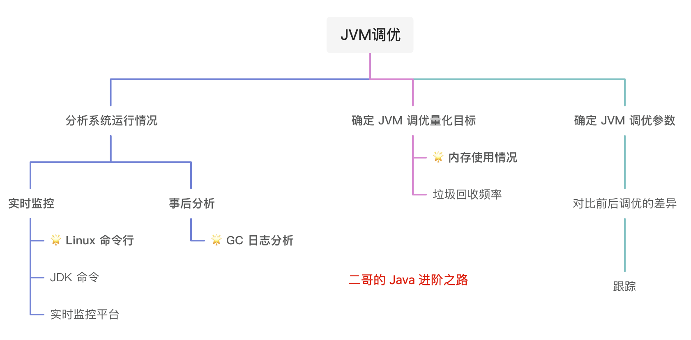

二哥的 Java 进阶之路：JVM 调优

①、JVM 的堆内存主要用于存储对象实例，如果堆内存设置过小，可能会导致频繁的垃圾回收。所以，[技术派实战项目](https://javabetter.cn/zhishixingqiu/paicoding.html)是在启动 JVM 的时候就调整了一下 -Xms 和-Xmx 参数，让堆内存最大可用内存为 2G。

②、在项目运行期间，我会使用 JVisualVM 定期观察和分析 GC 日志，如果发现频繁的 Full GC，就需要特别关注老年代的使用情况。

接着，通过分析 Heap dump 寻找内存泄漏的源头，看看是否有未关闭的资源，长生命周期的大对象等。

之后，就要进行代码优化了，比如说减少大对象的创建、优化数据结构的使用方式、减少不必要的对象持有等。

## CPU 占用过高怎么排查？
### [CPU 占用过高怎么排查？](https://javabetter.cn/sidebar/sanfene/jvm.html#_41-cpu-占用过高怎么排查)
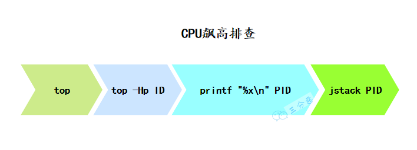

三分恶面渣逆袭：CPU飙高

首先，使用 top 命令查看 CPU 占用情况，找到占用 CPU 较高的进程 ID。

```java
top
```


haikuotiankongdong：top 命令结果

接着，使用 jstack 命令查看对应进程的线程堆栈信息。

```java
jstack -l <pid> > thread-dump.txt
```

上面 👆🏻 这个命令会将所有线程的堆栈信息输出到 thread-dump.txt 文件中。

然后再使用 top 命令查看进程中线程的占用情况，找到占用 CPU 较高的线程 ID。

```java
top -H -p <pid>
```

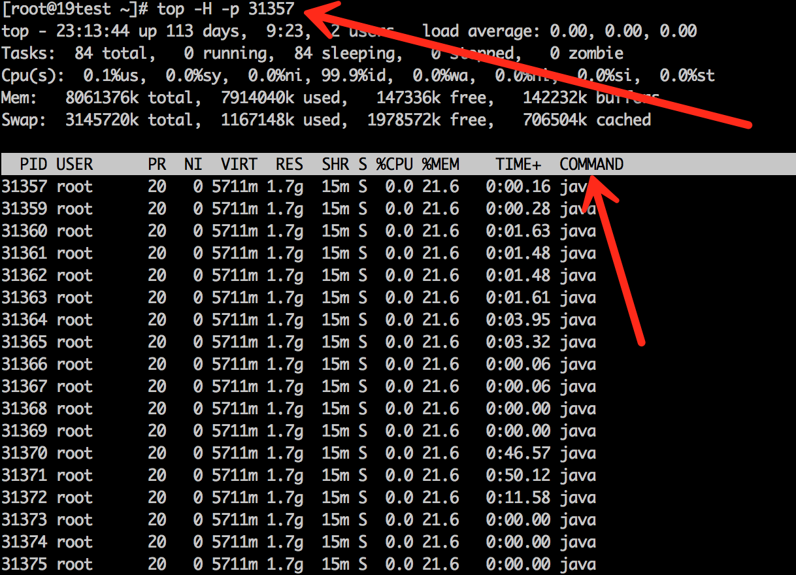

haikuotiankongdong：Java 进程中的线程情况

注意，top 命令显示的线程 ID 是十进制的，而 jstack 输出的是十六进制的，所以需要将线程 ID 转换为十六进制。

```java
printf "%x\n" PID
```

在 jstack 的输出中搜索这个十六进制的线程 ID，找到对应的堆栈信息。

```java
"Thread-5" #21 prio=5 os_prio=0 tid=0x00007f812c018800 nid=0x1a85 runnable [0x00007f811c000000]
   java.lang.Thread.State: RUNNABLE
    at com.example.MyClass.myMethod(MyClass.java:123)
    at ...
```

最后，根据堆栈信息定位到具体的业务方法，查看是否有死循环、频繁的垃圾回收（GC）、资源竞争（如锁竞争）导致的上下文频繁切换等问题。

## 内存飙高问题怎么排查？
内存飚高一般是因为创建了大量的 Java 对象所导致的，如果持续飙高则说明垃圾回收跟不上对象创建的速度，或者内存泄漏导致对象无法回收。

排查的方法主要分为以下几步：

第一，先观察垃圾回收的情况，可以通过 `jstat -gc PID 1000` 查看 GC 次数和时间。

或者 `jmap -histo PID | head -20` 查看堆内存占用空间最大的前 20 个对象类型。

第二步，通过 jmap 命令 dump 出堆内存信息。

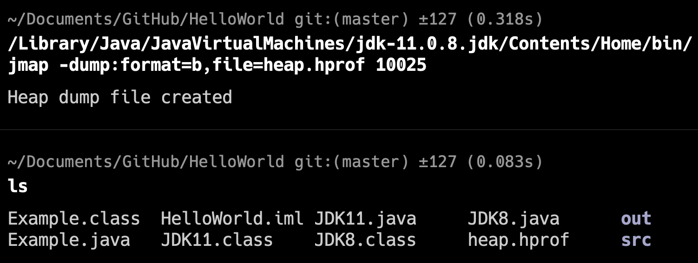

二哥的 Java 进阶之路：dump

第三步，使用可视化工具分析 dump 文件，比如说 VisualVM，找到占用内存高的对象，再找到创建该对象的业务代码位置，从代码和业务场景中定位具体问题。

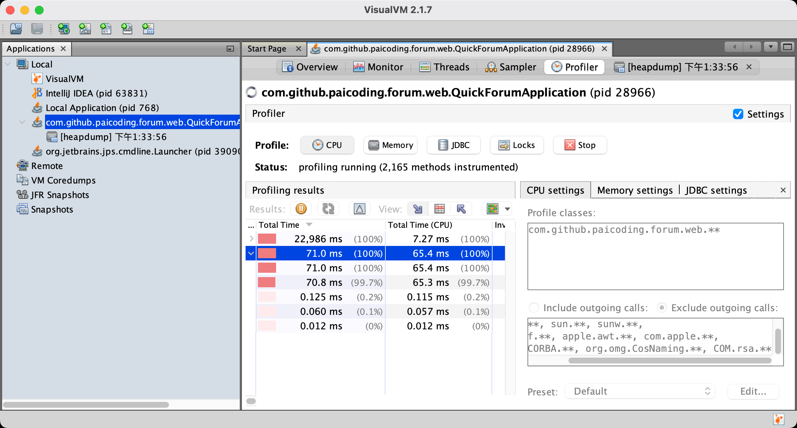

二哥的 Java 进阶之路：分析

## 频繁 minor gc 怎么办？
**频繁的 Minor GC（也称为 Young GC）** 通常表示新生代中的对象频繁地被垃圾回收，可能是因为新生代空间设置过小，或者是因为程序中存在大量的短生命周期对象（如临时变量、方法调用中创建的对象等）。

可以使用 GC 日志进行分析，查看 GC 的频率和耗时，找到频繁 GC 的原因。

+ **-XX:+PrintGCDetails -Xloggc:gc.log**

或者使用监控工具（如 **VisualVM**、**jstat**、**jconsole** 等）查看堆内存的使用情况，特别是新生代（Eden 和 Survivor 区）的使用情况。

### 解决方案：
1. **增加新生代大小**  
如果是因为新生代空间不足，可以通过 **-Xmn** 增加新生代的大小，减少新生代的填满速度。  
示例：  
`java -Xmn256m your-app.jar`
2. **调整 Eden 和 Survivor 区的比例**  
如果对象未能在 Survivor 区足够长时间存活，就会被晋升到老年代，可以通过 **-XX:SurvivorRatio** 参数调整 Eden 和 Survivor 的比例。默认比例是 8:1，表示 8 个空间用于 Eden，1 个空间用于 Survivor 区。  
示例：  
`-XX:SurvivorRatio=6`

这将减少 Eden 区的大小，增加 Survivor 区的大小，以确保对象在 Survivor 区中存活的时间足够长，避免过早晋升到老年代。

## 频繁 Full GC 怎么办？
**Full GC** 是指对整个堆内存（包括新生代和老年代）进行垃圾回收操作。频繁的 Full GC 会导致应用程序的暂停时间增加，从而影响性能。

### 常见原因：
1. **大对象直接分配到老年代**  
如大数组、大集合等，导致老年代空间快速被占用。
2. **内存泄漏**  
程序中存在内存泄漏，导致老年代的内存不断增加，无法被回收。例如，IO 资源未关闭。
3. **长生命周期的对象进入老年代**  
一些长生命周期的对象进入到了老年代，导致老年代空间不足。
4. **不合理的 GC 参数配置**  
如新生代的空间设置过小，导致 GC 频率过高。

### 如何排查 Full GC 频繁问题？
大厂一般都会有专门的性能监控系统，可以通过监控系统查看 GC 的频率和堆内存的使用情况。

否则可以使用 JDK 的一些自带工具，包括 **jmap**、**jstat** 等。

#### 查看堆内存各区域的使用率以及 GC 情况：
```java
jstat -gcutil -h20 pid 1000
```

#### 查看堆内存中的存活对象，并按空间排序：
```java
jmap -histo pid | head -n20
```

#### Dump 堆内存文件：
```java
jmap -dump:format=b,file=heap pid
```

或者使用一些可视化的工具，如 **VisualVM**、**JConsole** 等。

### 如何解决 Full GC 频繁问题？
1. **大对象直接分配到老年代**  
如果是由于大对象导致 Full GC 频繁，可以通过 **-XX:PretenureSizeThreshold** 参数设置大对象直接进入老年代的阈值。  
或者将大对象拆分成小对象，减少大对象的创建，例如通过分页。
2. **内存泄漏**  
如果是由于内存泄漏导致 Full GC 频繁，可以通过分析堆内存 dump 文件，找到内存泄漏的对象，再定位到内存泄漏的代码位置。
3. **长生命周期的对象进入老年代**  
如果是因为长生命周期的对象进入老年代，要及时释放资源，例如 **ThreadLocal**、数据库连接、IO 资源等。
4. **GC 参数配置不合理**  
如果是因为 GC 参数配置不合理导致 Full GC 频繁，可以通过调整 GC 参数来优化 GC 行为，或者直接更换更适合的 GC 收集器，如 **G1**、**ZGC** 等。


> 更新: 2025-05-18 16:28:31  
> 原文: <https://www.yuque.com/neumx/laxg2e/pbwalo38902531vt>