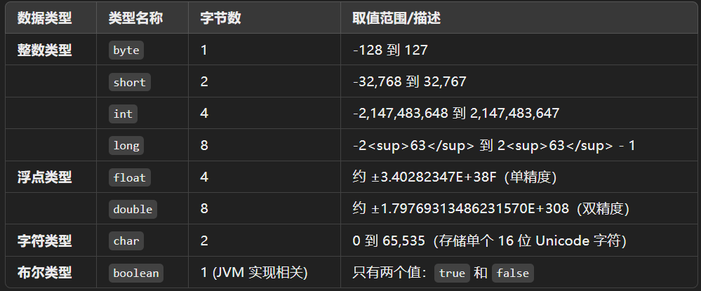
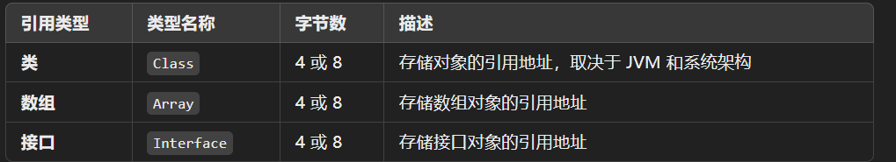

# Java基础

[java基础八股(上）_牛客网](https://www.nowcoder.com/discuss/722234286346121216?sourceSSR=users)

[java基础八股(下）_牛客网](https://www.nowcoder.com/discuss/722559901666410496?sourceSSR=search)

# 前言
## Java 概述
## 什么是 Java？
## Java 语言有哪些特点？
+ **面向对象（OOP）** - 支持封装、继承、多态，提高代码复用性和可维护性。
+ **跨平台（Write Once, Run Anywhere）** - 通过 JVM 运行，适用于不同操作系统。
+ **自动内存管理（GC）** - 内置垃圾回收机制，减少手动管理内存的负担。

## Java 和 C++ 的区别?
+ **Java** 不提供指针来直接访问内存，程序内存更加安全
+ **Java** 类是单继承，**C++** 支持多重继承
+ **Java** 有垃圾回收机制，而 **C++** 需要手动管理内存

## JVM、JDK 和 JRE 有什么区别？
+ **JVM (Java Virtual Machine)**：Java 虚拟机，负责执行Java字节码。
+ **JRE (Java Runtime Environment)**： Java 运行时环境，包含JVM和Java核心类库。
+ **JDK (Java Development Kit)**：Java 开发工具包，包含JRE和开发工具（如编译器、调试器等）。

## 说说什么是跨平台？原理是什么？
## 什么是字节码？采用字节码的好处是什么？
## 为什么有人说 Java 是“编译与解释并存”的语言？
**解释**：Java程序首先被编译成字节码（.class文件），然后通过Java虚拟机（JVM）进行解释执行。此过程既有编译的步骤，也有解释的步骤。  

# 基础语法
## Java 有哪些数据类型？

## 为什么要包装类
+ **适应泛型**：Java 泛型只能使用对象，不能用基本类型，如 `List<Integer>` 不能是 `List<int>`。  
+ **兼容集合框架**：如 `ArrayList`、`HashMap` 只能存对象，需要包装类。  
+ **可表示 **`**null**`：基本类型不能存 `null`，包装类可以。  

##  基本类型和包装类型的区别  
+ **存储方式**：基本数据类型存储在栈上，包装类型是对象，存储在堆上
+ **默认值**：基本类型有默认值，包装类型默认为 **null**
+ **比较方式**：基本类型比较的是值，包装类型比较的是内存地址

## 自动类型转换、强制类型转换了解吗？
+ **自动类型转换**：Java会自动将较小的数据类型转换为较大的数据类型，通常不会丢失数据。
+ **强制类型转换**：用于将较大的数据类型转换为较小的数据类型，可能会导致数据丢失或者溢出，因此需要开发者谨慎使用。

## 什么是自动拆箱/装箱？
+ **装箱**：将基本数据类型转换为包装类型，例如 **int** 转换为 **Integer**
+ **拆箱**：将包装类型转换为基本数据类型

## 基础类和包装类的区别? int 5 == Integer 5 是 true 还是 false?
+ **基础类**（如 **int**）是基本数据类型，直接存储值，无对象特性；**包装类**（如 **Integer**）是对象，包含值和方法，支持 **null**。
+ **int 5 == Integer 5** 是 **true**，因为 Java 会自动拆箱 **Integer 5** 为 **int 5**，然后比较值。
+ 注意：如果是 **Integer a = 5; Integer b = 5; a == b**，在 **-128 到 127** 范围内是 **true**（**Integer 缓存**），超出则为 **false**（新对象）。

## 为什么浮点数运算的时候会有精度丢失的风险？
+ **计算机存储浮点数的位数有限**，必须**截断或四舍五入**，导致精度丢失

**解决方法**

    - 用 **BigDecimal** 进行精确计算（传入字符串参数）
    - 减少运算次数，使用 **double** 代替 **float**，避免直接用 **==** 比较

## & 和 && 有什么区别？
## switch 语句能否用在 byte/long/String 类型上？
## break, continue, return 的区别及作用？
## 用效率最高的方法计算 2 乘以 8？
## 说说自增自减运算？
## float 是怎么表示小数的？（补充）
## 讲一下数据准确性高是怎么保证的？（补充）
# 面向对象
## 面向对象和面向过程的区别?
+ **面向过程编程 (POP)**： 面向过程把问题拆分成方法，通过一个个方法的执行解决问题
+ **面向对象编程 (OOP)**：面向对象会先抽象出对象，然后用对象执行方法的方式解决问题

## 面向对象编程有哪些特性？
+ **封装**：隐藏对象的内部细节，通过接口控制访问。
+ **继承**：子类复用和扩展父类的属性与方法。
+ **多态**：同一方法在不同对象中表现不同行为。
+ **抽象**：隐藏实现细节，只暴露接口，简化程序设计。  

## 多态解决了什么问题？（补充）
## 重载和重写的区别？
+ **重载**：同一类中方法名相同但参数不同（参数类型、参数个数或参数顺序不同)，体现 **编译时多态**
+ **重写**：子类中重新定义父类的方法，体现 **运行时多态**

## 访问修饰符 public、private、protected、以及默认时的区别？
## this 关键字有什么作用？
## 抽象类和接口有什么区别？
+ **抽象类**适用于有共享代码的类之间的继承。
+ **接口**适用于不同类之间共享行为，而不关心类之间的继承关系。

## 抽象类和普通类区别？
 抽象类是不能实例化的“模板类”，用于被继承；普通类是可实例化的“具体类”，用于直接使用。  

+ **定义与实例化**
    - **普通类**：可以被实例化，即可以创建对象。
    - **抽象类**：不能被实例化，只能作为父类被继承。
+ **抽象方法**
    - **普通类**：不能包含抽象方法（没有方法体的方法）。
    - **抽象类**：可以包含抽象方法，也可以包含普通方法。抽象方法必须在子类中被实现，除非子类也是抽象类。

## 泛型，类型擦除
+ 泛型在编译时推迟确定类型，增强代码稳定性和可读性。
+ 类型擦除将泛型类型替换为`Object`，在编译后的字节码中不包含泛型信息。

## 成员变量与局部变量的区别有哪些？
## static 关键字了解吗？
  
**static** 关键字表示静态成员，属于类本身而非对象实例。  
**静态变量**、**方法** 和 **代码块** 在类加载时初始化并共享，**静态方法** 只能访问 **静态变量** ，不能直接访问非静态成员

  
**静态内部类** 不持有外部类的引用。

## final 关键字有什么作用？
**final** 意思是最终的、不可修改的，用来修饰类、方法和变量。

    - **final 修饰的类**：不能被继承。
    - **final 修饰的方法**：不能被重写。
    - **final 修饰的变量**：对于基本数据类型，变量的值不能被修改。 对于引用类型，`final` 会**锁定引用地址**，但对象内部的内容仍然可以修改。

## final、finally、finalize 的区别？
### `final`、`finally`、`finalize` 区别总结
| 名称 | 类型 | 作用 | 使用场景 |
| --- | --- | --- | --- |
| `final` | 关键字 | 修饰变量、方法、类，表示不可变或不可继承 | 定义常量、防止重写或继承 |
| `finally` | 关键字 | 确保代码块在异常处理后一定执行 | 资源释放、清理操作 |
| `finalize` | 方法 | 对象垃圾回收前的清理操作（已弃用） | **不推荐使用** |

## == 和 equals 的区别？
**基本数据类型**：  
`==` 比较的是两个值是否相等。

**引用类型**：

默认情况下，`equals()` 和 `==` 是一样的，比较的是两个对象的引用是否相同。（同一个内存地址）

但是许多类（如 **String**、**Integer**）都重写了 `equals` 方法，用于比较对象的内容。

## 为什么重写 equals 时必须重写 hashCode 方法？
**比如 HashMap 通过 hashCode 定位桶，equals 确认对象。**  

+ 如果重写了 **equals()** 而没重写 **hashCode()**，相等的对象可能有不同的哈希码，导致 **HashMap 处理错误**。

## Java 是值传递，还是引用传递？
## Object类的常见方法有哪些？
`Object` 类提供了几个常用方法，主要包括：

1. `**toString()**`：返回对象的字符串表示。
2. `**equals(Object obj)**`：比较两个对象是否相等。
3. `**hashCode()**`：返回对象的哈希码。
4. `**clone()**`：创建对象的副本，需实现 `Cloneable` 接口。
5. `**getClass()**`：返回对象的类信息。
6. `**notify()**` 和 `**notifyAll()**`：唤醒等待线程。
7. `**wait()**`：使当前线程等待。
8. `**finalize()**`：对象被垃圾回收前调用，用于清理资源。

## 说说深拷贝和浅拷贝的区别？
**浅拷贝**：  
只复制对象本身，引用字段仍指向原来的对象，修改新对象的引用字段会影响原对象。

**深拷贝**：  
不仅复制对象本身，还复制引用对象，保证两个对象完全独立，互不影响。

## Java 创建对象有哪几种方式？
**Java 创建对象的几种方式**

**1. **`**new**`** 关键字**  
最常用方式，调用构造函数创建对象。  
👉 **适用于绝大多数普通对象创建场景。**

**2. **`**Class.newInstance()**`**（已过时）**  
通过反射调用无参构造方法创建对象。  
👉 **要求类有公开的无参构造函数，已不推荐使用。**

**3. **`**Constructor.newInstance()**`  
反射调用指定构造函数（支持带参）。  
👉 **更灵活，适合需要动态创建对象的场景。**

**4. **`**clone()**`** 方法**  
复制现有对象，需实现 `Cloneable` 接口。  
👉 **常用于对象克隆或原型模式。**

**5. 反序列化**  
通过序列化流恢复对象，需实现 `Serializable` 接口。  
👉 **可用于深拷贝或网络传输。**

**6. 框架创建（如 Spring）**  
使用反射或字节码技术由容器自动创建对象。  
👉 **适用于依赖注入和对象生命周期管理。**

# String
## String 是 Java 基本数据类型吗？可以被继承吗？
+ `**String**`** 不是基本数据类型**，它是一个引用数据类型（类）。
+ `**String**`** 不能被继承**，因为它是 `final` 类，不能被子类化。

## String 和 StringBuilder、StringBuffer 的区别？
**String：**  

    - **不可变**，每次修改都会生成一个新的对象。**线程安全**，但**性能差**。

**StringBuilder：**  

    - **可变**，**性能更优**，**线程不安全**。（底层基于字符数组）

**StringBuffer：**  

    - **可变**，**线程安全**，**性能稍差**。（内部方法使用 **synchronized 关键字** 进行同步）

如果字符串内容固定或不常变化，优先使用 String。如果需要频繁修改字符串且在单线程环境下，使用 StringBuilder。如果需要频繁修改字符串且在多线程环境下，使用 StringBuffer。

## String str1 = new String("abc") 和 String str2 = "abc" 的区别？
+ `"abc"`**存储在字符串常量池**中；
+ `new String("abc")`**创建新的 **`**String**`** 对象**，存储在**堆**中；
+ `str1 == str2` 比较的是**引用**，`str1.equals(str2)` 比较的是**内容**；
+ **推荐使用 **`**String str = "abc";**`** 以提高效率**。

## 字符串常量池的作用了解吗？
**字符串常量池是 Java 的内存优化机制**，确保相同内容的字符串只在常量池中存储一个副本。  

+ **字面量字符串**自动加入池中，而使用 **new String()** 创建的字符串则会在**堆内存**中创建，不会加入常量池。

**JDK 1.6 及以前**  

+ 字符串常量池存放在 **方法区（永久代）**，受 JVM 内存限制，容易出现 **OOM（OutOfMemoryError）**。

**JDK 1.7**  

+ 字符串常量池被移动到 **堆（Heap）**，避免了**永久代（PermGen）**空间不足的问题。

**JDK 1.8 及以后**  

+ 永久代（PermGen）被移除，方法区改为 **元空间（Metaspace）**。  
+ 字符串常量池仍然在**堆中**，但存储更灵活，避免 **OOM**。

## String 是不可变类吗？
**String** 类的字符内容存储在 **char[]** 数组中（Java 8及之前），并且该数组被标记为 **private final**，无法外部修改。因此是不可变的。  
从 **Java 9** 开始，使用 **byte[]** 存储，但仍是 **final**。

## spi是什么
**SPI（Service Provider Interface）机制** 是Java提供的一种服务发现机制，用于实现模块化开发和插件化扩展。它允许框架定义接口，第三方通过配置文件提供实现，框架在运行时动态加载这些实现，无需修改核心代码。  
**优点**：大大地提高接口设计的灵活性。  
**缺点**：需要遍历加载所有的实现类，不能做到按需加载。

---

**SPI破坏了双亲委派机制吗**⭐️  
SPI 机制在一定程度上“破坏”了双亲委派机制，因为它允许服务提供商的类由自己的类加载器加载，而非启动类加载器或扩展类加载器。这使得同一接口的不同实现可以通过不同的类加载器加载，从而绕过双亲委派模型。

---

**SPI机制的ServiceLoader是如何进行加载的**？⭐️‼️  
ServiceLoader 通过以下步骤加载服务实现：

1. 查找位于 **META-INF/services/** 目录下的配置文件，文件名为接口的完全限定名。
2. 使用类加载器加载配置文件中列出的服务实现类。
3. 通过反射实例化服务实现类。
4. 返回服务提供者的实例，可以通过迭代器或者 **for-each** 循环访问。

# Integer
## Integer a= 127，Integer b = 127；Integer c= 128，Integer d = 128；相等吗?
**Integer a = 127; Integer b = 127;**  
`a == b`：**true**（**缓存对象，引用相同**）。

**Integer c = 128; Integer d = 128;**  
`c == d`：**false**（**新对象，引用不同**）。

**原因**：Integer **缓存**`-128` 到 `127`，**超出范围创建新对象**。

## String 怎么转成 Integer 的？原理？
# Object
## Object 类的常见方法？
# 异常处理
## Java 中异常处理体系?
## 异常的处理方式？
## 三道经典异常处理代码题
# I/O
## Java 中 IO 流分为几种?
在 Java 中，I/O 流（Input/Output Streams）主要分为两大类：

1. **字节流（Byte Stream）**  
字节流处理所有 I/O 操作，以字节为单位（8 位）进行读写。字节流适用于所有类型的数据，包括文本、图像、音频等二进制数据。
    - 输入流：`InputStream`
    - 输出流：`OutputStream`

主要的字节流类：

    - `FileInputStream`、`FileOutputStream`：用于文件的字节输入输出。
    - `BufferedInputStream`、`BufferedOutputStream`：用于提高字节流的读写效率，支持缓冲区。
    - `DataInputStream`、`DataOutputStream`：用于读取和写入基本数据类型（如 `int`、`float` 等）。
    - `ObjectInputStream`、`ObjectOutputStream`：用于序列化和反序列化对象。
2. **字符流（Character Stream）**  
字符流是以字符为单位（16 位）处理数据，主要用于处理文本数据。字符流可以自动处理字符编码的转换，适合处理文本文件。
    - 输入流：`Reader`
    - 输出流：`Writer`

主要的字符流类：

    - `FileReader`、`FileWriter`：用于文件的字符输入输出。
    - `BufferedReader`、`BufferedWriter`：用于提高字符流的读写效率，支持缓冲区。
    - `PrintWriter`：用于输出格式化的文本数据，支持自动换行等功能。

总结：

+ **字节流** 处理所有数据，以字节为单位（8 位）。
+ **字符流** 专门处理文本数据，以字符为单位（16 位）。

这两类流都分为输入流和输出流。

## 既然有了字节流, 为什么还要有字符流?
## BIO、NIO、AIO 之间的区别？
BIO、NIO 和 AIO 是 Java 中三种 I/O 模型，以下是它们的核心区别（精简版）：

+ `BIO`**（Blocking I/O）**  **（Blocking I/O，同步阻塞 I/O）**
    - 同步阻塞式 IO，每个连接都要创建一个新线程，每次 I/O 操作（如读写）都会阻塞线程，直到操作完成。  
    - 简单，但线程消耗大，适合少量连接。  
    - 示例: 基于 java.io 包（如 InputStream、OutputStream）。
    - 网络编程中使用 java.net 的 ServerSocket 和 Socket。
+ `NIO`**（Non-blocking I/O）**  
    - 同步非阻塞式  IO， I/O 操作不会阻塞线程，通过多路复用机制同时处理多个连接  。  
    - 单线程处理多连接，适合高并发、短连接。  
    - 示例: `Selector.select()` 检查就绪通道。
+ `AIO`**（Asynchronous I/O）**  
    - 异步IO，通过回调机制或 Future 处理结果。线程无需等待。  
    - 事件驱动，适合高并发、长连接。  
    - 示例: `AsynchronousSocketChannel` 异步读写。

**一句话总结**：  
BIO 同步阻塞、线程多，NIO 同步非阻塞、多路复用，AIO 异步非阻塞、事件驱动。

BIO（阻塞I/O）、NIO（非阻塞I/O）和AIO（异步I/O）是Java中处理I/O操作的三种主要模型，它们各自有不同的特点和应用场景。下面是对这三种I/O模型的简要说明：
<h3 id="dgkcj">1. <strong>BIO（Blocking I/O）- 阻塞I/O</strong></h3><ul class="ne-ul"><li id="u2aaab020" data-lake-index-type="0"><strong>定义</strong>：在BIO模型下，I/O操作是阻塞的。当程序执行I/O操作时，当前线程会被阻塞，直到I/O操作完成才能继续执行其他任务。也就是说，线程会一直等待直到I/O操作完成后才能继续执行后续代码。</li><li id="u9884b546" data-lake-index-type="0"><strong>特点</strong>：</li></ul><ul class="ne-list-wrap"><ul ne-level="1" class="ne-ul"><li id="ubafdd1c4" data-lake-index-type="0">每个连接对应一个线程，每个线程的生命周期与I/O操作的生命周期相同。</li><li id="ub1a7c1d3" data-lake-index-type="0">高并发情况下，线程数会迅速增加，导致内存和系统资源消耗过大。</li><li id="ub92e51ff" data-lake-index-type="0">适用于连接数较少、请求量较低的场景。</li></ul></ul><ul class="ne-ul"><li id="u5fd67988" data-lake-index-type="0"><strong>应用场景</strong>：传统的单机应用、客户端-服务器架构。</li><li id="u1b2b04dc" data-lake-index-type="0"><strong>代码示例</strong>：</li></ul><pre data-language="java" id="IC3Wn" class="ne-codeblock language-java"><code>ServerSocket serverSocket = new ServerSocket(8080);
while (true) {
    Socket clientSocket = serverSocket.accept();  // 阻塞操作，直到客户端连接
    InputStream in = clientSocket.getInputStream();
    // 进行数据读取
    byte[] buffer = new byte[1024];
    int bytesRead = in.read(buffer);  // 阻塞操作，直到数据被读取
}</code></pre><h3 id="QXLau">2. <strong>NIO（Non-blocking I/O）- 非阻塞I/O</strong></h3><ul class="ne-ul"><li id="u369c7a0a" data-lake-index-type="0"><strong>定义</strong>：NIO是Java 1.4引入的，它允许一个线程通过非阻塞方式进行I/O操作。在NIO中，I/O操作不会阻塞线程，线程可以在等待I/O操作完成时去执行其他任务。NIO使用了<code class="ne-code">Channel</code>和<code class="ne-code">Buffer</code>的概念，数据从<code class="ne-code">Channel</code>读取到<code class="ne-code">Buffer</code>，或者从<code class="ne-code">Buffer</code>写入到<code class="ne-code">Channel</code>。</li><li id="uf3a3d9c3" data-lake-index-type="0"><strong>特点</strong>：</li></ul><ul class="ne-list-wrap"><ul ne-level="1" class="ne-ul"><li id="uc4148278" data-lake-index-type="0">线程不会因为等待I/O操作而被阻塞，可以在一个线程中处理多个I/O操作。</li><li id="ubd0db1d8" data-lake-index-type="0">适用于高并发场景，可以显著提高系统性能。</li><li id="udc1b3aaf" data-lake-index-type="0">在NIO中，可以使用Selector来实现单线程处理多个I/O操作（多路复用），通过轮询检查是否有I/O操作准备好进行。</li></ul></ul><ul class="ne-ul"><li id="u50f1548c" data-lake-index-type="0"><strong>应用场景</strong>：高并发的网络服务器，如聊天系统、文件传输、实时系统等。</li><li id="u1f6cade0" data-lake-index-type="0"><strong>代码示例</strong>：</li></ul><pre data-language="java" id="N9qyj" class="ne-codeblock language-java"><code>Selector selector = Selector.open();
ServerSocketChannel serverChannel = ServerSocketChannel.open();
serverChannel.configureBlocking(false);  // 设置为非阻塞模式
serverChannel.bind(new InetSocketAddress(8080));

while (true) {
    selector.select();  // 阻塞等待事件发生
    Set&lt;SelectionKey&gt; selectedKeys = selector.selectedKeys();
    Iterator&lt;SelectionKey&gt; iterator = selectedKeys.iterator();

    while (iterator.hasNext()) {
        SelectionKey key = iterator.next();
        if (key.isAcceptable()) {
            // 接受客户端连接
        }
        if (key.isReadable()) {
            // 读取数据
        }
        iterator.remove();
    }
}</code></pre><h3 id="M3QKU">3. <strong>AIO（Asynchronous I/O）- 异步I/O</strong></h3><ul class="ne-ul"><li id="u777905b0" data-lake-index-type="0"><strong>定义</strong>：AIO是Java 7引入的一种全新的I/O模型，提供了完全异步的I/O操作。AIO模型下，I/O操作的完成通知通过回调机制来处理，即操作系统会在I/O操作完成时通过回调通知程序，而不是由线程阻塞来等待操作完成。Java中的<code class="ne-code">AsynchronousSocketChannel</code>和<code class="ne-code">AsynchronousServerSocketChannel</code>是AIO模型的实现。</li><li id="u764bb346" data-lake-index-type="0"><strong>特点</strong>：</li></ul><ul class="ne-list-wrap"><ul ne-level="1" class="ne-ul"><li id="u19716b17" data-lake-index-type="0">不需要显式地管理线程，线程只在操作完成时才会执行回调。</li><li id="ue6fffbfc" data-lake-index-type="0">可以实现非常高效的I/O处理，尤其适用于需要处理大量并发请求的场景。</li><li id="uadab1cd1" data-lake-index-type="0">回调机制使得开发者无需等待每个I/O操作完成，减少了上下文切换的成本。</li></ul></ul><ul class="ne-ul"><li id="u83a95412" data-lake-index-type="0"><strong>应用场景</strong>：大规模分布式系统、高并发的网络应用、实时通信系统等。</li><li id="u06c719d9" data-lake-index-type="0"><strong>代码示例</strong>：</li></ul><pre data-language="java" id="EA0wT" class="ne-codeblock language-java"><code>AsynchronousServerSocketChannel serverChannel = AsynchronousServerSocketChannel.open()
        .bind(new InetSocketAddress(8080));

serverChannel.accept(null, new CompletionHandler&lt;AsynchronousSocketChannel, Void&gt;() {
    @Override
    public void completed(AsynchronousSocketChannel result, Void attachment) {
        // 处理连接
        result.read(ByteBuffer.allocate(1024), null, new CompletionHandler&lt;Integer, Void&gt;() {
            @Override
            public void completed(Integer result, Void attachment) {
                // 数据读取完成
            }

            @Override
            public void failed(Throwable exc, Void attachment) {
                exc.printStackTrace();
            }
        });
    }

    @Override
    public void failed(Throwable exc, Void attachment) {
        exc.printStackTrace();
    }
});</code></pre><h3 id="xfqFs">总结：</h3><ul class="ne-ul"><li id="u970482f0" data-lake-index-type="0"><strong>BIO</strong>：适用于连接数较少、并发低的场景，每个连接一个线程，简单但不适合高并发。</li><li id="u56adf9e9" data-lake-index-type="0"><strong>NIO</strong>：适用于高并发的场景，通过非阻塞I/O和多路复用机制提高效率。</li><li id="u91e6786f" data-lake-index-type="0"><strong>AIO</strong>：完全异步的I/O处理方式，通过回调机制避免阻塞，适合极高并发的场景。</li></ul>
选择使用哪种I/O模型，通常取决于应用的并发需求和复杂度。

# 序列化
## 什么是序列化？什么是反序列化？
+ **序列化**：将 **Java 对象** 转为可传输的 **字节数组**。
+ **反序列化**：将 **字节数组** 转换为 **Java 对象**。

## 说说有几种序列化方式？
我熟悉几种常见的序列化协议和类库，包括JSON（如 Jackson、Fastjson）、Kryo、Hessian 和 Protobuf，简单总结如下：

1. **JSON**（文本格式）  
基于文本格式，可读性强，**易于调试和修改**；缺点：数据体积大，**序列化和反序列化速度较慢**。
2. **Kryo**（二进制格式）  
Kryo 是一个高效的 Java 序列化框架，**序列化速度快**，支持复杂对象和循环引用；缺点：语言仅限 Java，**可读性差**，**线程不安全需额外处理**。
3. **Hessian**（二进制格式）  
Hessian 是一种轻量级的二进制序列化协议，**数据紧凑**，**跨语言支持**，实现简单；缺点：**可读性差**，**性能不如 Kryo**，灵活性有限。
4. **Protobuf**（二进制格式）  
Protobuf 是由 Google 开发的一种高效的二进制序列化协议，**序列化速度快**，**版本兼容性好**，**跨语言支持**；缺点：**可读性差**，**灵活性较差**。

根据不同场景选择：性能敏感时用 Kryo，跨语言时用 Hessian，简单开发时用 JSON。

# 网络编程
## 了解过 Socket 网络套接字吗？（补充）
**Socket**（网络套接字）是计算机网络编程的核心，用于实现应用程序之间的双向通信。

在 Java 中，它通过 `java.net` 包中的 **Socket**（客户端）和 **ServerSocket**（服务器端）支持 TCP/IP 通信，或用 **DatagramSocket** 实现 UDP 通信，广泛应用于实时数据交换场景，如聊天或文件传输。

# 泛型
## Java 泛型了解么？
**泛型（Generics）** 是 Java 提供的一种类型参数化机制，允许在类、接口和方法中使用**类型参数**，从而增强程序的**类型安全性**和**代码复用性**。

**核心作用**：

+ **编译期类型检查**（防止类型转换错误）
+ **消除强制类型转换**（提高代码可读性）
+ **提高代码复用性**（支持通用算法或容器）

# 注解
## 说一下你对注解的理解？
**注解（Annotation）** 是一种用于修饰代码的元数据机制，它不会直接影响程序逻辑，但可以被 **编译器** 或 **运行时工具** 读取和处理。

**核心作用**：

+ **提供元信息**，供编译器或框架使用
+ **支持编译时检查**（如 `@Override`）
+ **支持运行时行为控制**（如反射、AOP）

# 反射
## 什么是反射？应用？原理？
 反射是 Java 提供的一种机制，能够让程序在**运行时动态获取类的信息**（如类名、方法、构造函数等）并操作这些信息。而无需在编译时确定具体类或方法。

原理：

+ JVM 会为每个类生成唯一的 `Class` 对象，保存方法、字段等元数据。
+ 反射 API 通过访问这些元数据实现动态操作，部分方法底层用 **Native 方法（本地方法）**实现。

# JDK1.8 新特性
## JDK 1.8 都有哪些新特性？
+ **Lambda表达式**：用简洁的函数式语法替代匿名内部类。
+ **Stream API**： 提供链式操作，简化集合处理。  
+ **函数式接口**：定义单一抽象方法的接口，支持Lambda表达式。

1. Lambda 表达式
<h4 id="l6tYp">定义</h4>
Lambda 表达式是 Java 8 引入的重要特性， 他可以用一种简洁的方式表达匿名函数，能够将代码块当作参数传递给方法，或者存储在变量里，进而让代码更为简洁易读，在处理集合操作时优势显著。
<h4 id="ved8P">语法</h4>
Lambda 表达式存在两种基本语法形式：
<ul class="ne-ul"><li id="u9d8bf661" data-lake-index-type="0">无参数形式：<code class="ne-code">() -&gt; 表达式</code> 或者 <code class="ne-code">() -&gt; { 语句块; }</code></li><li id="u2d1a49ad" data-lake-index-type="0">有参数形式：<code class="ne-code">(参数列表) -&gt; 表达式</code> 或者 <code class="ne-code">(参数列表) -&gt; { 语句块; }</code></li></ul><h4 id="WvJnG">示例</h4><pre data-language="java" id="xI2AC" class="ne-codeblock language-java"><code>// 无参数的 Lambda 表达式示例
// Runnable 是一个函数式接口，它只有一个抽象方法 run()
// 这里使用 Lambda 表达式来实现 run() 方法
// () 表示没有参数，箭头 -&gt; 后面是要执行的代码块
Runnable runnable = () -&gt; System.out.println(&quot;Hello, Lambda!&quot;);
// 创建一个新线程，并将实现了 Runnable 接口的 Lambda 表达式作为参数传入
// 当线程启动时，会执行 Lambda 表达式中的代码
new Thread(runnable).start();

// 有参数的 Lambda 表达式示例
// 自定义一个函数式接口 MyFunction，它包含一个抽象方法 apply
@FunctionalInterface
interface MyFunction {
    // 该方法接收两个 int 类型的参数，并返回一个 int 类型的结果
    int apply(int a, int b);
}

// 使用 Lambda 表达式实现 MyFunction 接口的 apply 方法
// (a, b) 表示接收两个参数，箭头 -&gt; 后面是具体的实现逻辑，即返回两个参数的和
MyFunction add = (a, b) -&gt; a + b;
// 调用 add 对象的 apply 方法，传入 3 和 5 作为参数
int result = add.apply(3, 5);
// 输出计算结果
System.out.println(&quot;Result: &quot; + result);</code></pre><h4 id="bvsl3">优点</h4><ul class="ne-ul"><li id="u3d38ab46" data-lake-index-type="0"><strong>简洁性</strong>：极大地减少了样板代码，让代码更加简洁明了。</li><li id="uda34f420" data-lake-index-type="0"><strong>可读性</strong>：使代码逻辑更加清晰，尤其是在处理集合操作时，能让开发者更直观地理解代码意图。</li><li id="u9f99dbce" data-lake-index-type="0"><strong>可传递性</strong>：能够将 Lambda 表达式作为参数传递给方法，显著提高了代码的灵活性。</li></ul><h3 id="qOxfJ">2. 函数式接口</h3><h4 id="NtF7S">定义</h4>
函数式接口是指仅包含一个抽象方法的接口。Java 8 引入了 <code class="ne-code">@FunctionalInterface</code> 注解来标记函数式接口，此注解并非必需，但使用它可以让编译器进行检查，确保接口只包含一个抽象方法。
<h4 id="BdhDi">常见的函数式接口</h4><ul class="ne-ul"><li id="u3db6a75f" data-lake-index-type="0"><code class="ne-code">java.util.function</code><strong> 包中定义了众多常用的函数式接口</strong>：</li></ul><ul class="ne-list-wrap"><ul ne-level="1" class="ne-ul"><li id="uf8b61730" data-lake-index-type="0"><code class="ne-code">Predicate&lt;T&gt;</code>：接收一个参数，返回一个布尔值，常用于过滤操作。</li><li id="uad53133e" data-lake-index-type="0"><code class="ne-code">Consumer&lt;T&gt;</code>：接收一个参数，不返回任何结果，常用于对元素进行消费操作。</li><li id="u1687783b" data-lake-index-type="0"><code class="ne-code">Function&lt;T, R&gt;</code>：接收一个参数，返回一个结果，常用于对元素进行转换操作。</li><li id="u418c5817" data-lake-index-type="0"><code class="ne-code">Supplier&lt;T&gt;</code>：不接受参数，返回一个结果，常用于生成数据。</li></ul></ul><h4 id="dhx9H">示例</h4><pre data-language="java" id="Ko7Uh" class="ne-codeblock language-java"><code>import java.util.function.Predicate;

// 使用 Predicate 函数式接口示例
// Predicate&lt;Integer&gt; 表示该接口接收一个 Integer 类型的参数
// 这里使用 Lambda 表达式实现 Predicate 接口的 test 方法
// num 是传入的参数，箭头 -&gt; 后面是判断该参数是否为偶数的逻辑
Predicate&lt;Integer&gt; isEven = num -&gt; num % 2 == 0;
// 调用 isEven 对象的 test 方法，传入 4 作为参数
// 判断 4 是否为偶数，并将结果存储在 result 变量中
boolean result = isEven.test(4);
// 输出判断结果
System.out.println(&quot;Is 4 even? &quot; + result);</code></pre><h4 id="QWxag">作用</h4>
函数式接口是 Lambda 表达式的基础，Lambda 表达式实际上就是函数式接口的一个实例。通过函数式接口，可以将代码块作为参数传递，实现更灵活的编程。
<h3 id="Ja2WI">3. Stream</h3><h4 id="AN1CM">定义</h4>
<strong>Stream</strong> 流，可以对集合做各种操作。包括 <strong>中间操作</strong> 和 <strong>终端操作</strong>。<strong>终端操作</strong> 会返回一个结果，而 <strong>中间操作</strong> 会返回一个 <strong>Stream</strong> 流。
<h4 id="JNxtO">常见操作</h4><ul class="ne-ul"><li id="u7c85438d" data-lake-index-type="0"><strong>中间操作</strong>：<code class="ne-code">filter</code>（过滤元素）、<code class="ne-code">map</code>（对元素进行转换）、<code class="ne-code">sorted</code>（对元素进行排序）、<code class="ne-code">distinct</code>（去除重复元素）等。</li><li id="uf0f6d819" data-lake-index-type="0"><strong>终端操作</strong>：<code class="ne-code">forEach</code>（对每个元素执行操作）、<code class="ne-code">collect</code>（将元素收集到集合中）、<code class="ne-code">count</code>（统计元素数量）、<code class="ne-code">reduce</code>（对元素进行归约操作）等。</li></ul><h4 id="CKv1u">示例</h4><pre data-language="java" id="V6PsT" class="ne-codeblock language-java"><code>import java.util.Arrays;
import java.util.List;
import java.util.stream.Collectors;

public class StreamExample {
    public static void main(String[] args) {
        // 创建一个包含 1 到 10 的整数列表
        List&lt;Integer&gt; numbers = Arrays.asList(1, 2, 3, 4, 5, 6, 7, 8, 9, 10);

        // 使用 Stream 进行过滤和映射操作
        // numbers.stream()：将列表转换为一个 Stream 对象
        // filter(num -&gt; num % 2 == 0)：中间操作，过滤出列表中的偶数
        // map(num -&gt; num * num)：中间操作，将过滤后的偶数进行平方运算
        // collect(Collectors.toList())：终端操作，将处理后的元素收集到一个新的列表中
        List&lt;Integer&gt; evenSquares = numbers.stream()
                                           .filter(num -&gt; num % 2 == 0)
                                           .map(num -&gt; num * num)
                                           .collect(Collectors.toList());

        // 输出处理后的结果
        System.out.println(&quot;Even squares: &quot; + evenSquares);
    }
}</code></pre><h4 id="BjD2p">优点</h4><ul class="ne-ul"><li id="u6fe9ec5b" data-lake-index-type="0"><strong>简洁性</strong>：使用 Stream 可以用简洁的代码实现复杂的数据处理逻辑，避免了传统的循环和条件判断，使代码更加易读和维护。</li><li id="u7f6e51ba" data-lake-index-type="0"><strong>并行处理</strong>：Stream 支持并行处理，能够充分利用多核处理器的性能，提高数据处理的效率。</li><li id="uc5e5a390" data-lake-index-type="0"><strong>延迟执行</strong>：中间操作是延迟执行的，只有在调用终端操作时才会触发实际的计算，这样可以避免不必要的计算，提高了性能。</li></ul>
综上所述，Lambda 表达式、函数式接口和 Stream 是 Java 8 引入的重要特性，它们相互配合，使得 Java 代码更加简洁、灵活和高效。

##  函数式接口

## Lambda 表达式了解多少？

## Optional 了解吗？

## Stream 流用过吗？

> 更新: 2025-05-10 17:04:17  
> 原文: <https://www.yuque.com/neumx/laxg2e/emlxug6s2oqiqyy7>