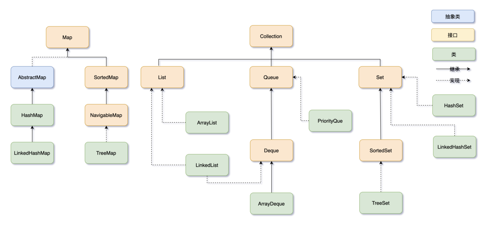
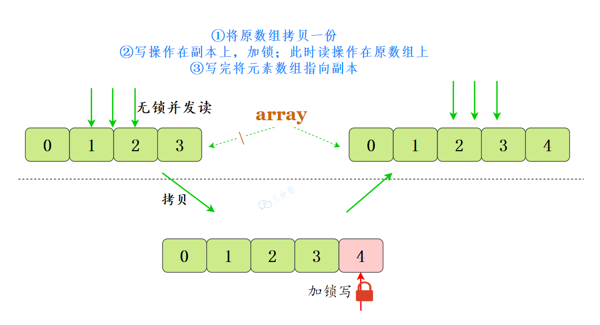
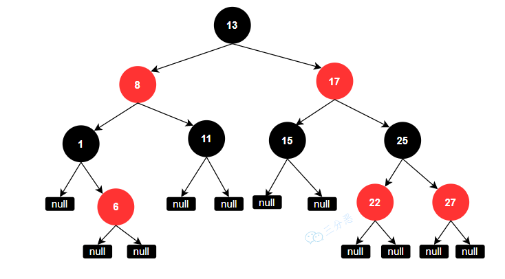
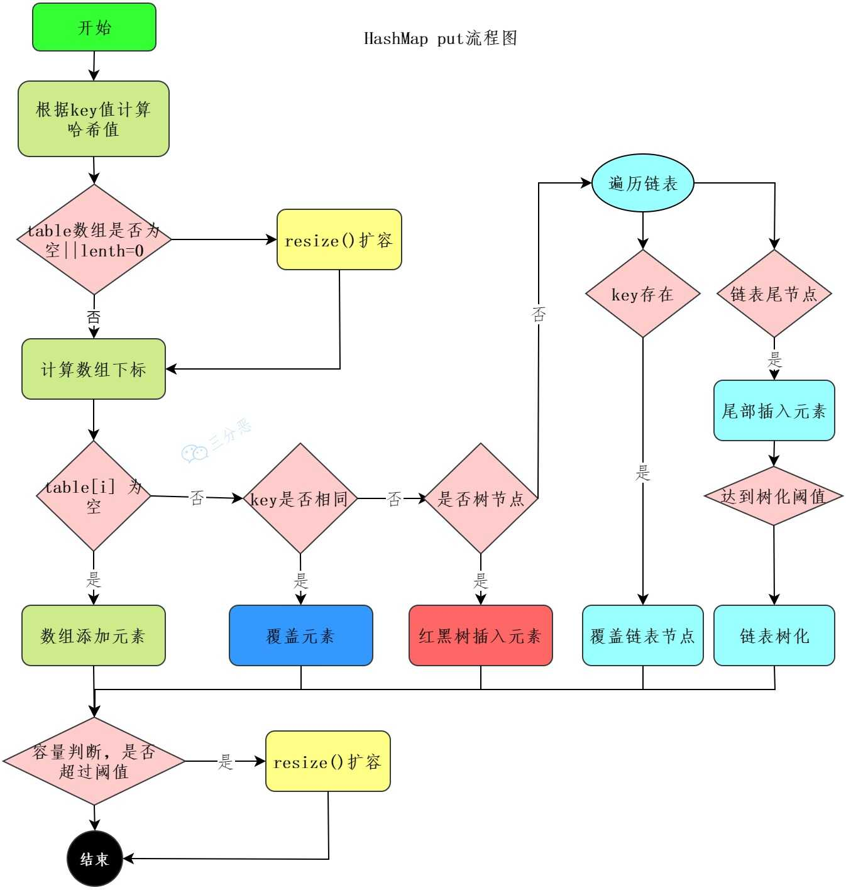
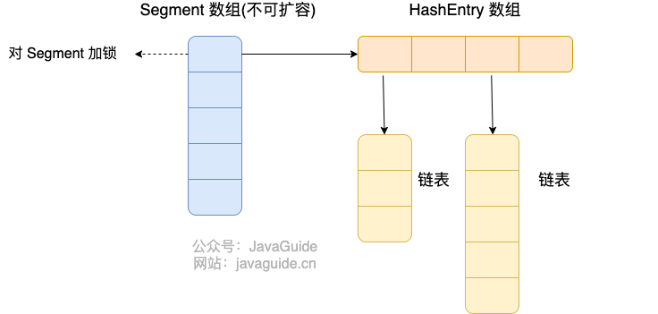
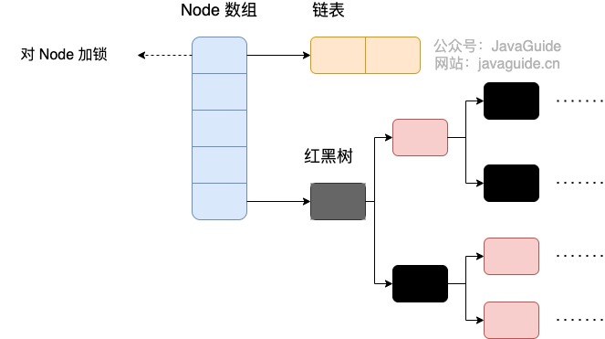
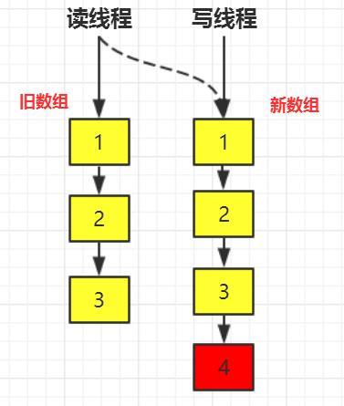

# Java集合八股

# 引言
## 说说有哪些常见的集合框架？


 Java 集合框架（Java Collections Framework）是 Java 标准库中用于存储和操作数据集合的一组接口和类。它提供了多种数据结构，如列表、集合、队列、映射等。以下是常见的集合框架接口和实现类：

---

**1. 核心接口**

Java 集合框架的核心接口包括：

+ **Collection**：所有集合类的根接口，定义了基本的集合操作，如添加、删除、遍历等。
    - **List**：有序集合，允许重复元素。
    - **Set**：无序集合，不允许重复元素。
    - **Queue**：队列，通常用于实现先进先出（FIFO）的数据结构。
+ **Map**：键值对集合，键不允许重复。

---

**2. 常见实现类**

** List（有序且可重复集合）**

**特点：维护插入顺序，允许重复元素。    **

**常见实现类：**

+ **ArrayList**：
    - 基于动态数组实现。查询快（O(1)）。增删慢（O(n)），因为需要移动元素。
+ **LinkedList**：
    - 基于双向链表实现。增删快（O(1)）。查询慢（O(n)），因为需要遍历链表。
+ **Vector**：
    - 类似于 `ArrayList`，但是线程安全的（ 方法内部使用 `synchronized` 关键字  ）。但是会带来一定性能开销，性能较低，通常不推荐使用。

> + **Stack**：
>     - 继承自 `Vector`，实现栈数据结构（后进先出，LIFO）。
>     - `Stack` 可以被认为是 `List` 的一种特殊实现。
> + 它继承了 `Vector`，具有线程安全特性，但由于 `Vector` 本身已经不推荐使用，`Stack` 在实际开发中也逐渐被其他更高效的类（如 `Deque` 接口的实现类 `ArrayDeque`）所取代。
>

---

** Set（无序且不重复集合）  **

**常见实现类：**

+ **HashSet**：
    - 基于  `HashMap`实现。 元素存储在 `HashMap` 的 `key` 位置，值由一个固定的 Object 对象填充
    - 插入、删除和查找操作快，平均时间复杂度为 O(1)。元素唯一性通过hashCode()和equals()方法保证。
+ **LinkedHashSet**：
    -  `HashSet`的子类， 基于 **哈希表 + 双向链表实现**，维护元素的插入顺序。其他HashSet类似。 性能略低于 `HashSet`
+ **TreeSet**：
    - 基于红黑树实现。元素按照自然顺序或自定义顺序排序。
    - 插入、删除和查找操作的时间复杂度为 O(log n)。

---

** Queue（队列）和 Deque（双端队列）  **

**特点：队列遵循 FIFO（先进先出），双端队列允许从两端插入和删除。  **

+ **PriorityQueue**：
    - 基于堆实现，按照优先级排序。  每次出队的元素都是优先级最高的元素。
+ **ArrayDeque**：
    - 基于动态数组实现的双端队列。支持从队列两端插入和删除元素。
+ **LinkedList**： （也实现了 Queue 接口）：  
    - 可以用作队列或双端队列。基于链表实现，插入和删除效率高。

---

**Map（键值对集合，键不允许重复。）**

+ **特点：存储键值对，每个键唯一，对应一个值。**
+ **HashMap**：
    - 基于哈希表实现。键值对无序，允许 null 键值。
    - 提供快速的键值查找（O(1)）。
    - 插入、删除和查找操作的平均时间复杂度为 O(1)。
+ **LinkedHashMap**：
    - `HashMap`的子类，通过链表维护键值对的插入顺序。性能略低于 `HashMap`，但提供了有序性。
+ **TreeMap**：
    - 基于红黑树实现。键按自然顺序或自定义顺序排序。插入、删除和查找操作的时间复杂度为 O(log n)。
+ **Hashtable**：
    - 类似于`HashMap`，但线程安全，键和值都不允许为null。由于其线程安全性，性能较低。
+ **ConcurrentHashMap**：
    - 线程安全的 `HashMap`。通过分段锁或 CAS 操作实现高并发性能。

---

**3. 工具类**

+ **Collections：**
    - 提供了对集合进行操作的工具方法，如排序、查找、同步等。
    - 常用方法：`sort()`、`binarySearch()`、`synchronizedList()` 等。
+ **Arrays**：
    - 提供了对数组进行操作的工具方法，如排序、查找、转换等。
    - 常用方法：`sort()`、`binarySearch()`、`asList()` 等。

---

**4. 并发集合**

Java 还提供了一些线程安全的并发集合类，适用于多线程环境：

+ **ConcurrentHashMap**：线程安全的 `HashMap`。
+ **CopyOnWriteArrayList**：线程安全的 `ArrayList`，写操作时会复制一份新数组。
+ **CopyOnWriteArraySet**：线程安全的 `Set`，基于 `CopyOnWriteArrayList` 实现。
+ **BlockingQueue**：线程安全的队列接口，常用实现类有 `ArrayBlockingQueue`、`LinkedBlockingQueue`、`PriorityBlockingQueue` 等。

---

**5. 其他集合类**

+ **EnumSet**：专为枚举类型设计的高效集合。
+ **EnumMap**：键为枚举类型的 `Map`。
+ **IdentityHashMap**：基于 `==` 比较键的 `Map`，而不是 `equals()`。
+ **WeakHashMap**：键为弱引用的 `Map`。

---

**6. Java 8 新增的集合特性**

+ **Stream API**：提供了对集合进行函数式操作的能力，如过滤、映射、排序等。
+ **Lambda 表达式**：简化了集合操作的代码。
+ **默认方法**：在集合接口中增加了默认方法，如 `forEach`、`removeIf` 等。

---

**总结**

Java 集合框架提供了丰富的数据结构和工具类，能够满足大多数开发需求。常见的集合框架包括：

+ **List**：`ArrayList`、`LinkedList`、`Vector`、`Stack`。
+ **Set**：`HashSet`、`LinkedHashSet`、`TreeSet`。
+ **Queue**：`PriorityQueue`、`ArrayDeque`、`LinkedList`。
+ **Map**：`HashMap`、`LinkedHashMap`、`TreeMap`、`ConcurrentHashMap`、`WeakHashMap`。

掌握这些集合类的特性和使用场景，可以帮助你更高效地处理数据。如果你有更多问题，欢迎继续提问！

## Java中的线程安全的集合是什么？
<details class="lake-collapse"><summary id="u76f296ff"></summary><p id="u7f6eb5fa" class="ne-p"><span class="ne-text">在Java中，线程安全的集合是指在多线程环境下可以安全地被多个线程访问，而不会出现数据不一致或抛出异常的集合类。以下是常见的几种线程安全的集合：</span></p><hr id="npLud" class="ne-hr"><h3 id="d6cc599b"><span class="ne-text">一、早期线程安全集合（</span><code class="ne-code"><span class="ne-text">java.util</span></code><span class="ne-text">包）</span></h3><p id="ue55f0f56" class="ne-p"><span class="ne-text">这些集合通过</span><strong><span class="ne-text">同步（synchronized）方法</span></strong><span class="ne-text">实现线程安全：</span></p><ol class="ne-ol"><li id="u2b21fd43" data-lake-index-type="0"><strong><span class="ne-text">Vector</span></strong></li></ol><ul class="ne-list-wrap"><ul ne-level="1" class="ne-ul"><li id="ubaa9015b" data-lake-index-type="0"><span class="ne-text">是线程安全的动态数组。</span></li><li id="uc1e1da6f" data-lake-index-type="0"><span class="ne-text">所有的方法都使用了</span><code class="ne-code"><span class="ne-text">synchronized</span></code><span class="ne-text">关键字。</span></li><li id="ubeb8eb46" data-lake-index-type="0"><span class="ne-text">但是效率低于</span><code class="ne-code"><span class="ne-text">ArrayList</span></code><span class="ne-text">（在单线程环境下）。</span></li></ul></ul><ol start="2" class="ne-ol"><li id="uccfb6abc" data-lake-index-type="0"><strong><span class="ne-text">Hashtable</span></strong></li></ol><ul class="ne-list-wrap"><ul ne-level="1" class="ne-ul"><li id="uf8a37301" data-lake-index-type="0"><span class="ne-text">是线程安全的键值对集合。</span></li><li id="u9ac3e6dd" data-lake-index-type="0"><span class="ne-text">所有方法都同步（使用</span><code class="ne-code"><span class="ne-text">synchronized</span></code><span class="ne-text">），性能低于</span><code class="ne-code"><span class="ne-text">HashMap</span></code><span class="ne-text">。</span></li><li id="ua6f2de57" data-lake-index-type="0"><span class="ne-text">不允许 </span><code class="ne-code"><span class="ne-text">null</span></code><span class="ne-text"> 键或 </span><code class="ne-code"><span class="ne-text">null</span></code><span class="ne-text"> 值。</span></li></ul></ul><hr id="iiOeP" class="ne-hr"><h3 id="3b8a05e2"><span class="ne-text">二、Collections 工具类提供的同步包装集合</span></h3><p id="u21cf9869" class="ne-p"><span class="ne-text">Java 提供了 </span><code class="ne-code"><span class="ne-text">Collections.synchronizedXXX()</span></code><span class="ne-text"> 方法， 使用 </span><code class="ne-code"><span class="ne-text">synchronized</span></code><span class="ne-text"> 包装原集合的所有方法  ，可以将非线程安全的集合包装为线程安全的，如：</span><code class="ne-code"><span class="ne-text">Collections.synchronizedList</span></code><span class="ne-text">、</span><code class="ne-code"><span class="ne-text">synchronizedMap</span></code><span class="ne-text">、</span><code class="ne-code"><span class="ne-text">synchronizedSet</span></code><span class="ne-text"> 是对原集合对象的包装  </span></p><hr id="Y7NMb" class="ne-hr"><h3 id="2ccbe3f9"><span class="ne-text">三、Java 5 引入的并发集合（</span><code class="ne-code"><span class="ne-text">java.util.concurrent</span></code><span class="ne-text">包）</span></h3><p id="ud9cd593a" class="ne-p"><span class="ne-text">更高效、现代的线程安全集合：</span></p><ol class="ne-ol"><li id="udce21529" data-lake-index-type="0"><strong><span class="ne-text">ConcurrentHashMap</span></strong></li></ol><ul class="ne-list-wrap"><ul ne-level="1" class="ne-ul"><li id="u0a29f112" data-lake-index-type="0"><span class="ne-text">分段锁（Java 7）或CAS+Node数组（Java 8）</span></li><li id="u045cbacc" data-lake-index-type="0"><span class="ne-text">高性能的线程安全 Map，替代 </span><code class="ne-code"><span class="ne-text">Hashtable</span></code></li></ul></ul><ol start="2" class="ne-ol"><li id="u8d0bc245" data-lake-index-type="0"><strong><span class="ne-text">CopyOnWriteArrayList</span></strong></li></ol><ul class="ne-list-wrap"><ul ne-level="1" class="ne-ul"><li id="u05db84c6" data-lake-index-type="0"><span class="ne-text">适合读多写少的场景，写操作时复制整个底层数组。</span></li><li id="u4587aaf3" data-lake-index-type="0"><span class="ne-text">线程安全的 </span><code class="ne-code"><span class="ne-text">List</span></code></li></ul></ul><ol start="3" class="ne-ol"><li id="u62713192" data-lake-index-type="0"><strong><span class="ne-text">CopyOnWriteArraySet</span></strong></li></ol><ul class="ne-list-wrap"><ul ne-level="1" class="ne-ul"><li id="u8539172a" data-lake-index-type="0"><span class="ne-text">基于 </span><code class="ne-code"><span class="ne-text">CopyOnWriteArrayList</span></code><span class="ne-text"> 实现的线程安全 </span><code class="ne-code"><span class="ne-text">Set</span></code></li></ul></ul><ol start="4" class="ne-ol"><li id="ufe13f78e" data-lake-index-type="0"><strong><span class="ne-text">ConcurrentLinkedQueue</span></strong></li></ol><ul class="ne-list-wrap"><ul ne-level="1" class="ne-ul"><li id="u71197ab5" data-lake-index-type="0"><span class="ne-text">非阻塞的线程安全队列，基于链表结构</span></li><li id="u37dfedbd" data-lake-index-type="0"><span class="ne-text">适用于高并发场景</span></li></ul></ul><ol start="5" class="ne-ol"><li id="uaf7fe6db" data-lake-index-type="0"><strong><span class="ne-text">BlockingQueue 接口及其实现类</span></strong></li></ol><ul class="ne-list-wrap"><ul ne-level="1" class="ne-ul"><li id="ue4eaf58d" data-lake-index-type="0"><span class="ne-text">如：</span><code class="ne-code"><span class="ne-text">LinkedBlockingQueue</span></code><span class="ne-text">, </span><code class="ne-code"><span class="ne-text">ArrayBlockingQueue</span></code><span class="ne-text">, </span><code class="ne-code"><span class="ne-text">PriorityBlockingQueue</span></code></li><li id="u2686ace1" data-lake-index-type="0"><span class="ne-text">用于生产者-消费者模型，支持阻塞操作</span></li></ul></ul><p id="u6d78aed4" class="ne-p"><br></p></details>
# List
## ArrayList集合和 Array（数组）的区别？
1. **大小和自动扩容**
    - 数组大小是固定的。一旦数组被创建，其大小不能更改。
    - **ArrayList** 是动态数组实现的，它的大小可以动态增长或缩小。在不断添加元素时，**ArrayList** 会自动进行扩容。
2. **支持泛型**
    - 数组可以存储任何类型的元素，但不支持泛型。
    - **ArrayList**：支持泛型，可以指定存储的元素类型。
3. **存储对象**
    - 数组可以直接存储基本数据类型，也可以存储对象。
    - **ArrayList** 中只能存储对象。对于基本类型数据，需要使用其对应的包装类（如 **Integer**、**Double** 等）。
4. **集合功能**
    - 数组：是一个简单的数据结构，不提供额外的方法来进行元素的增删改查操作。
    - **ArrayList** 是集合框架的一部分，提供了丰富的方法，如添加、删除、查找等。

## ArrayList 和 LinkedList 有什么区别？
1. **内部数据结构**
    - **ArrayList**：基于动态数组实现。
    - **LinkedList**：基于双向链表实现。它使用节点来存储元素，每个节点包含一个数据元素和两个指针，分别指向前一个节点和后一个节点。
2. **遍历性能**
    - **ArrayList**：支持快速的随机访问和遍历，因为可以直接通过索引访问元素。
    - **LinkedList**：随机访问性能较差，因为必须从链表的头部或尾部开始遍历，直到达到目标索引。
3. **插入和删除**
    - **ArrayList**：在末尾进行插入和删除操作是高效的，但在中间或开头插入和删除需要移动元素，性能较差。
    - **LinkedList**：插入和删除元素的性能相对较好，特别是在链表中间或头尾插入和删除元素时。
4. **使用场景**
    - **ArrayList**：适合频繁访问（按索引取元素）的场景、插入和删除操作较少的场景，因为 `ArrayList` 在按索引访问时的性能优于 `LinkedList`。
    - **LinkedList**：适合频繁插入和删除的场景，尤其是在链表的头部或尾部操作时，`LinkedList` 比 `ArrayList` 更高效。

## ArrayList 的扩容机制了解吗？
<details class="lake-collapse"><summary id="uf72fd444"></summary><p id="ubddbf875" class="ne-p"><strong><span class="ne-text">ArrayList</span></strong><span class="ne-text"> 的默认初始容量是 10，当向 </span><strong><span class="ne-text">ArrayList</span></strong><span class="ne-text"> 添加元素且数组容量不足时，会触发扩容操作。将当前容量扩大为原来的 1.5 倍</span></p><p id="ud717ab13" class="ne-p"><span class="ne-text">之所以扩容是 1.5 倍，是因为 1.5 可以充分利用移位操作，提高运算效率。</span></p><div class="ne-quote"><p id="u25662d14" class="ne-p"><span class="ne-text">（即 新容量 = 旧容量 + 旧容量的一半，用公式表示：newCapacity = oldCapacity + (oldCapacity &gt;&gt; 1)，这里的 &gt;&gt; 1 是位运算右移，相当于除以 2。）</span></p></div><p id="uc6a054f9" class="ne-p"><span class="ne-text">把旧数组里的所有元素复制到扩容后新数组中。</span></p></details>
**ArrayList 的扩容机制**  
ArrayList 的扩容机制是在其容量不足时自动增长，以应对新增元素。扩容的关键步骤如下：

1. **初始容量**  
**ArrayList** 的默认初始容量是 10，如果使用带容量参数的构造函数，可以指定初始容量。
2. **扩容时机**  
当向 **ArrayList** 添加元素且数组容量不足时，会触发扩容操作。
3. **扩容机制**  
**ArrayList** 的扩容是将当前容量扩大为原来的 1.5 倍（即 `newCapacity = oldCapacity + (oldCapacity >> 1)`），通过复制原数组的数据到新数组来实现。
4. **性能影响**  
频繁扩容会导致数组的复制操作，影响性能。因此，若能预估 **ArrayList** 的大小，建议在初始化时设置合适的初始容量，减少扩容次数。

之所以扩容是 1.5 倍，是因为 1.5 可以充分利用移位操作，减少运算时间和运算次数。

## 快速失败(fail-fast)和安全失败(fail-safe)了解吗？
**1. 快速失败（Fail-fast）**

+ **触发条件**：在迭代过程中，若集合被修改（如 `add()`、`remove()`），会抛出 `ConcurrentModificationException` 异常。
+ **典型类**：`ArrayList`, `HashMap`, `HashSet` 等。
+ **特点**：
    - 提高性能，发现并发修改时立即抛出异常。
    - 不保证数据一致性。

**2. 安全失败（Fail-safe）**

+ **触发条件**：在迭代过程中，修改集合不会抛出异常，而是继续基于副本进行迭代。
+ **典型类**：`CopyOnWriteArrayList`, `ConcurrentHashMap` 等。
+ **特点**：
    - 保证数据一致性，不会因并发修改出错。
    - 性能较差，因为每次修改都会创建副本。

3. **主要区别**

| 特性 | 快速失败（Fail-fast） | 安全失败（Fail-safe） |
| --- | --- | --- |
| 异常处理 | 抛出 `ConcurrentModificationException` | 不抛异常，继续迭代 |
| 性能 | 较高 | 较低（需复制副本） |
| 数据一致性 | 可能不一致 | 保证一致性 |
| 适用场景 | 非线程安全的集合类 | 线程安全的集合类 |


## 有哪几种实现 ArrayList 线程安全的方法？
**线程安全的 List 实现**

1. **使用 **`**Collections.synchronizedList()**`** 方法**  
可以使用 `Collections.synchronizedList()` 方法，它将返回一个线程安全的 `List`。

```java
SynchronizedList list = Collections.synchronizedList(new ArrayList());
```

其内部是通过 `synchronized` 关键字加锁来实现的。

2. **使用 **`**CopyOnWriteArrayList**`  
也可以直接使用 **CopyOnWriteArrayList**，它是线程安全的，遵循写时复制的原则。每当对列表进行修改（例如添加、删除或更改元素）时，都会创建列表的一个新副本，这个新副本会替换旧的列表，而对旧列表的所有读取操作仍然可以继续。

```java
CopyOnWriteArrayList list = new CopyOnWriteArrayList();
```

**通俗的讲解**：  
**CopyOnWrite** 就是当我们往一个容器添加元素时，不直接往容器中添加，而是先复制出一个新的容器，然后在新的容器里添加元素，添加完之后，再将原容器的引用指向新的容器。  
多个线程在读的时候，不需要加锁，因为当前容器不会添加任何元素。这样就实现了线程安全。

## 讲一下 CopyOnWriteArrayList 
**CopyOnWriteArrayList 原理**

**CopyOnWriteArrayList** （**写时复制数组**）是线程安全版本的 **ArrayList**。

> + 底层还是用数组（Object[]）存储元素，跟 ArrayList 类似。 使用volatile关键字修饰数组来确保线程可以看到最新数据。
>

**CopyOnWriteArrayList** 采用了一种读写分离的并发策略：

+ **读操作**：对于读操作，直接访问当前数组，无需加锁。
+ **写操作**：对于写操作，首先复制一份当前数组，然后在新副本上执行写操作。写操作结束之后，把原数组的引用指向新数组。

>  在写入操作时，加了一把互斥锁ReentrantLock以保证线程安全。  
>

这种策略使得多个线程可以安全地进行读取操作，而不会被写操作影响，因此实现了线程安全。



# Map
## 能说一下 HashMap 的底层数据结构吗？
**HashMap 的底层数据结构**

1. **JDK 1.8 之前**  
**HashMap** 的底层数据结构是 **数组 + 链表**。
    - 每个数组元素是一个链表的头节点，所有发生哈希冲突的元素都会在链表中串联起来。
    - 链表的时间复杂度是 **O(N)**，因为在查询时需要遍历链表。
2. **JDK 1.8 及以后**  
**HashMap** 的数据结构为 **数组 + 链表 + 红黑树**。
    - 当链表长度超过阈值（默认是 8）且数组长度大于 64 时，链表会转换成 **红黑树**，以提高查询和插入性能。（在转换为红黑树之前，会先判断当前数组的长度。如果数组长度小于 64，那么会选择先进行数组扩容，而不是转换为红黑树。数量小于6时，会将红黑树转换回链表）
    - 红黑树的时间复杂度为 **O(log n)**，相较于链表的 **O(N)**，显著提高了性能。

## 你对红黑树了解多少？为什么不用二叉树/平衡树呢？
**红黑树的性质**

红黑树是一种自平衡的二叉查找树，具有以下性质：

1. **每个节点要么是红色，要么是黑色**。
2. **根节点和叶子节点是黑色的**（叶子节点的子节点为空时，视为 NIL）是黑色的。
3. **红节点的子节点必须是黑色的**（不能有连续的红节点）。
4. **从任意节点到其所有叶子节点的路径上，黑色节点数量必须相等**（称为“黑高”）。

通过以上性质，红黑树插入时将新节点设为红色并用旋转与变色**确保“不能有两个连续的红色节点”**  
删除时用后继节点替换，并通过旋转和变色**确保黑色节点高度一致**，从而维持树高为 O(log n)。  
保证了操作复杂度是**O(log n).**

这些性质保证了红黑树能够保持平衡，从而确保了查找、插入和删除操作的时间复杂度是 **O(log n)**。



---

1. **红黑树的性质  
****红黑树的这些性质保证了树的平衡性，从而使得树的高度在插入或删除节点时能够维持在一个相对较小的范围。具体来说，红黑树的高度最多是 O(log n)，从而保证了 O(log n) 的操作复杂度。**

---

2. **为什么不用二叉树？  
****二叉树是最基本的树结构，每个节点最多有两个子节点，但它容易出现极端情况。例如，如果插入的数据是有序的，那么二叉树会退化成链表，查询效率将变成 O(n)。**

---

3. **为什么不用平衡二叉树？  
****过于严格的平衡：AVL 树要求左右子树高度差不超过 1，插入和删除时需要频繁旋转来维持严格平衡，性能开销较大。**

---

4. **为什么用红黑树？**
+ **链表的查找时间复杂度是 O(n)**，当链表长度较长时，查找性能会下降。红黑树是一种折中的方案，查找、插入、删除的时间复杂度都是 **O(log n)**。
+ **最坏情况的高度**：红黑树的高度总是比完全二叉树高一倍左右，具体为 **2 * log(n)**，因此它比普通的二叉查找树更加平衡，能够防止性能退化到 **O(n)**。
+ **操作复杂度**：由于树的高度是对数级别的，查找、插入和删除操作的时间复杂度是 **O(log n)**。

## 红黑树怎么保持平衡的？
**红黑树的平衡机制**

红黑树通过颜色约束和旋转操作来保证其平衡性，从而确保操作的时间复杂度为 **O(log n)**。具体来说：

1. **插入和删除操作的违反规则**  
插入和删除操作可能违反红黑树的规则，尤其是**连续红色节点**和**黑色高度不一致**的问题。
2. **通过旋转和颜色调整恢复平衡**
    - **旋转操作**：通过 **左旋** 或 **右旋** 来恢复树的平衡。

> + **左旋（Left Rotation）**：将当前节点与其右子节点交换位置，右子节点变为新的父节点，当前节点成为其左子节点。
> + **右旋（Right Rotation）**：将当前节点与其左子节点交换位置，左子节点变为新的父节点，当前节点成为其右子节点。
>

    - **颜色调整**：涉及 **父节点、叔叔节点和祖父节点的颜色翻转**，确保符合红黑树的规则。
3. **保证时间复杂度为 O(log n)**  
红黑树的平衡机制使得 **查找、插入和删除操作** 的时间复杂度保持在 **O(log n)**，避免了普通二叉查找树的最坏情况性能（例如，退化为链表）。

---

**红黑树的优点**

+ **宽松的平衡要求**：与 **AVL 树** 相比，红黑树的平衡要求更加宽松，提供了更大的灵活性。
+ **较少的旋转次数**：插入和删除操作的旋转次数较少，适用于 **频繁插入和删除** 的场景。

因此，红黑树在许多应用场景中具有较好的性能，尤其是需要频繁修改树结构的场合。

## HashMap 的 put 流程知道吗？0


**HashMap 添加键值对的步骤**

1. **计算索引**
    - 根据键的哈希码计算键在数组中的位置索引，。
2. **检查该位置是否为空**
    - 如果该位置为空：直接插入新的节点。
    - 如果该位置不为空，遍历该位置的链表或红黑树： 
        * 如果找到相同的键，**替换旧值**。
        * 如果没有相同的键，将新节点添加到链表或者红黑树中。
3. **链表转红黑树**
    - 对于链表，检查链表长度是否达到阈值（默认是 8）： 
        * 如果链表长度超过阈值，并且数组长度大于等于 64，则将链表转换为 **红黑树** 以提高查询效率。
        *  如果红黑树节点数低于阈值（默认是 6），则将红黑树转换回链表。  
4. **检查数组长度是否大于阈值**
    - 如果当前数组长度大于阈值（阈值为数组长度 * 负载因子，默认为 0.75），就进行扩容。
5. **扩容操作**
    - 创建一个新的两倍大小的数组。
    - 将旧数组中的键值对重新分配到新数组中。
    - 更新 **HashMap** 的数组引用和阈值参数。添加结束
6. **完成添加**
    - 新的键值对已经成功添加，过程结束。

#### 只重写 equals 没重写 hashcode，map put 的时候会发生什么?
如果只重写 equals 方法，没有重写 hashcode 方法，那么会导致 equals 相等的两个对象，hashcode 不相等，这样的话，这两个对象会被放到不同的桶中，这样就会导致 get 的时候，找不到对应的值。

## HashMap 怎么查找元素的呢？
+ **计算哈希值**：通过 `key.hashCode()` 和扰动函数计算哈希值。
+ **计算索引**：通过哈希值与数组长度计算桶的索引。
+ **遍历桶**：检查桶中的链表或红黑树，逐个比较键是否相等。
+ **返回值**：返回找到的值，如果没有找到，返回 `null`。

## HashMap 的 hash 函数是怎么设计的?
哈希函数的设计步骤如下：

1. **获取哈希值**：使用 `key.hashCode()` 获取键的 32 位哈希值。
2. **高低位异或操作**：将哈希值的高 16 位和低 16 位进行异或（XOR），打破高低位的关联，增强哈希值分布均匀性，减少哈希冲突。

这种设计通过混合高低位的值，减少了碰撞概率，并提高了 HashMap 的查找效率。

---

**HashMap 的哈希函数设计**

**哈希函数**用于计算键（`key`）在数组中的位置。具体步骤如下：

1. **获取哈希值**  
首先，使用 `key.hashCode()` 获取键的哈希值，这是一个 32 位的 `int` 类型数值。
2. **高低位异或操作**  
然后，通过将哈希值的 **高 16 位** 和 **低 16 位** 进行异或（XOR）操作， 这个操作打破了低位和高位之间的关联性，避免了哈希值的前16位对后16位的影响，增强了哈希值的分布，减少了哈希冲突的概率：

```java
static final int hash(Object key) {
    int h;
    // key的hashCode和key的hashCode右移16位做异或运算
    return (key == null) ? 0 : (h = key.hashCode()) ^ (h >>> 16);
}
```

这样设计的原因是：

    - **减少哈希碰撞**：通过异或操作，将高低位的值混合，降低了相同的哈希码产生冲突的几率。
    - 通过右移和异或，哈希值的低 16 位信息可以影响到最终的哈希值，这使得哈希值的分布更加均匀，从而提高了 **HashMap** 查找效率。

这种设计有效地增强了哈希表的性能，尤其是在大规模数据存储时，减少了哈希碰撞的发生。

###  为什么要用高低做异或运算？为什么非得高低 16 位异或？  
`HashMap` 中的哈希函数使用高低 16 位的异或操作，是为了**打破低位和高位之间的关联性**，使得哈希值分布更加均匀，从而减少哈希碰撞的发生。这一设计的优势在于：

+ 增加哈希值的**随机性**。
+ 提高哈希值的**均匀分布**。
+ 达到较好的**性能和扰动效果平衡**。

选择 16 位是因为它提供了足够的扰动效果，同时计算复杂度也较低。通过这种方式，`HashMap` 能够更高效地处理大量数据，减少哈希冲突，提高查询和插入性能。

## 为什么 HashMap 的容量是 2 的倍数呢？
**HashMap 的长度是 2 的幂次方**主要有以下原因：

HashMap 在计算键的存储位置时，使用的是`(n - 1) & hash` 来确定索引，其中 n 是数组容量，hash 是键的哈希值。

1. 使用长度为 2 的幂次方，可以用位运算代替取模运算 `%`，速度更快。
2. 当容量是 2 的倍数时，`n - 1` 的二进制全为 1，有助于均匀分布哈希值，减少 **hash 冲突**。
3. ****扩容时长度仍是 2 的幂次方，重新分配元素简单高效。

<details class="lake-collapse"><summary id="u23d28bc9"><strong><span class="ne-text">详细</span></strong></summary><p id="uf20c9272" class="ne-p"><code class="ne-code"><span class="ne-text">HashMap</span></code><span class="ne-text"> 的容量通常是 2 的倍数，主要是为了优化哈希值计算时的性能，具体原因如下：</span></p><h3 id="53495b75"><span class="ne-text">1. </span><strong><span class="ne-text">与位运算的高效性相关</span></strong></h3><p id="uf96a6020" class="ne-p"><code class="ne-code"><span class="ne-text">HashMap</span></code><span class="ne-text"> 计算数组索引时，使用了 </span><strong><span class="ne-text">位与运算（</span></strong><code class="ne-code"><strong><span class="ne-text">&amp;</span></strong></code><strong><span class="ne-text">）</span></strong><span class="ne-text">：</span></p><pre data-language="java" id="iRAU3" class="ne-codeblock language-java"><code>int index = hash &amp; (capacity - 1);</code></pre><p id="uaf4ec018" class="ne-p"><span class="ne-text">这里 </span><code class="ne-code"><span class="ne-text">capacity</span></code><span class="ne-text"> 是哈希表的容量，而 </span><code class="ne-code"><span class="ne-text">capacity - 1</span></code><span class="ne-text"> 使得容量必须是 2 的倍数。</span></p><ul class="ne-ul"><li id="ud943c5e9" data-lake-index-type="0"><span class="ne-text">为什么是 </span><code class="ne-code"><span class="ne-text">capacity - 1</span></code><span class="ne-text">？ </span></li></ul><ul class="ne-list-wrap"><ul ne-level="1" class="ne-ul"><li id="u1a3403a3" data-lake-index-type="0"><span class="ne-text">当容量是 2 的倍数时，</span><code class="ne-code"><span class="ne-text">capacity - 1</span></code><span class="ne-text"> 变成一个全为 1 的二进制数（例如，如果容量是 8，则 </span><code class="ne-code"><span class="ne-text">capacity - 1</span></code><span class="ne-text"> 等于 7，即 </span><code class="ne-code"><span class="ne-text">111</span></code><span class="ne-text">）。</span></li><li id="u6bf0ce22" data-lake-index-type="0"><span class="ne-text">使用 </span><strong><span class="ne-text">位与运算</span></strong><span class="ne-text">（</span><code class="ne-code"><span class="ne-text">&amp;</span></code><span class="ne-text">）时，计算出的结果总是哈希值的低位部分，这样可以确保将哈希值映射到表中的有效索引。</span></li><li id="ub0a6f48b" data-lake-index-type="0"><span class="ne-text">位运算的效率通常比取模（</span><code class="ne-code"><span class="ne-text">%</span></code><span class="ne-text">）运算要高，因为位运算是硬件支持的原生操作，比模运算更快。</span></li></ul></ul><h3 id="7af420ea"><span class="ne-text">2. </span><strong><span class="ne-text">提高哈希值的均匀分布</span></strong></h3><ul class="ne-ul"><li id="ub60ea7e1" data-lake-index-type="0"><span class="ne-text">当 </span><code class="ne-code"><span class="ne-text">capacity</span></code><span class="ne-text"> 是 2 的倍数时，使用 </span><code class="ne-code"><span class="ne-text">capacity - 1</span></code><span class="ne-text"> 作为掩码可以确保哈希值均匀分布到哈希表中。这样，即使输入的哈希值不均匀，位与运算也能将它们分布到不同的位置，减少哈希冲突。</span></li></ul><h3 id="ada3dba9"><span class="ne-text">3. </span><strong><span class="ne-text">优化扩容操作</span></strong></h3><ul class="ne-ul"><li id="u95915aa8" data-lake-index-type="0"><code class="ne-code"><span class="ne-text">HashMap</span></code><span class="ne-text"> 在需要扩容时，会将容量扩大为原来的两倍。例如，原容量为 16，扩容时变为 32，容量总是保持为 2 的倍数。</span></li><li id="u01fd9ca7" data-lake-index-type="0"><span class="ne-text">扩容时需要重新计算每个元素的位置，2 的倍数使得数组大小的变化非常简便，只需要重新计算哈希值并重新分配元素。这种设计让扩容操作更加高效，避免了复杂的计算。</span></li></ul><h3 id="25f9c7fa"><span class="ne-text">总结</span></h3><p id="u748e703f" class="ne-p"><code class="ne-code"><span class="ne-text">HashMap</span></code><span class="ne-text"> 的容量是 2 的倍数，主要是为了：</span></p><ul class="ne-ul"><li id="u6a095d6a" data-lake-index-type="0"><strong><span class="ne-text">高效的索引计算</span></strong><span class="ne-text">：利用位与运算（</span><code class="ne-code"><span class="ne-text">&amp;</span></code><span class="ne-text">）来快速计算数组索引。</span></li><li id="u7f3994af" data-lake-index-type="0"><strong><span class="ne-text">均匀分布</span></strong><span class="ne-text">：2 的倍数容量能更好地分散哈希值，减少碰撞。</span></li><li id="u792237b6" data-lake-index-type="0"><strong><span class="ne-text">高效扩容</span></strong><span class="ne-text">：当需要扩容时，2 的倍数让扩容过程更加高效和简单。</span></li></ul><p id="u94802f53" class="ne-p"><span class="ne-text">这个设计让 </span><code class="ne-code"><span class="ne-text">HashMap</span></code><span class="ne-text"> 在大多数情况下保持高效的性能，尤其是在处理大量数据时。</span></p></details>
## 如果初始化 HashMap，传一个 17 容量，它会怎么处理？
当你初始化 `HashMap` 并传入容量 17 时，`HashMap` 会自动将容量调整为 **32**，因为 32 是大于 17 的下一个 2 的倍数。这样做是为了确保容量为 2 的倍数，从而提高位运算计算索引的效率，减少哈希冲突并优化性能。

如果不指定初始容量，HashMap 将使用默认的初始容量 16。  

## 你还知道哪些哈希函数的构造方法呢？
**HashMap 里哈希构造函数的方法叫：**

+ **除留取余法**：`H(key) = key % p` (`p <= N`)，关键字除以一个不大于哈希表长度的正整数 `p`，所得余数为地址。当然，**HashMap** 里进行了优化改造，效率更高，散列也更均衡。

除此之外，还有这几种常见的哈希函数构造方法：

+ **直接定址法**：直接根据 `key` 来映射到对应的数组位置，例如 1232 放到下标 1232 的位置。
+ **数字分析法**：取 `key` 的某些数字（例如十位和百位）作为映射的位置。
+ **平方取中法**：取 `key` 平方的中间几位作为映射的位置。
+ **折叠法**：将 `key` 分割成位数相同的几段，然后把它们的叠加和作为映射的位置。


## 解决哈希冲突有哪些方法呢？
**解决哈希冲突的方法我知道的有 3 种：**


① **再哈希法**  
当发生冲突时，使用另一个哈希函数再次计算键的哈希值，直到找到空位。

② **开放地址法**  
当发生冲突时，就去寻找下一个空位。有 3 种方法：

+ **线性探测**：从冲突的位置开始，依次往后找，直到找到空位。
+ **二次探测**：从冲突的位置开始，步长变为平方，直到找到空位。
+ **双重哈希**：用第二个哈希函数计算步长，避免聚集。

③ **拉链法**  
当发生冲突的时候，使用链表将冲突的元素串起来。**HashMap** 采用的正是拉链法。

## 为什么 HashMap 链表转红黑树的阈值为 8 呢？
`HashMap` 将链表转为红黑树的阈值为 8，是为了：

+ 在哈希冲突较多时，提升查询效率，从 O(n) 优化为 O(log n)。
+ 保持空间和时间复杂度的合理平衡，避免过早的结构转换引入不必要的开销。
+ 经过性能测试和调优，8 是一个折衷的最佳阈值，在大多数情况下能够提供较好的性能。

## 扩容在什么时候呢？为什么扩容因子是 0.75？
+ **扩容时机**：当 `HashMap` 中的元素数量超过 `容量 * 加载因子` 时，触发扩容。
+ **扩容因子为 0.75 的原因**：
+ **平衡空间与性能**：0.75 是 Java 开发者基于**经验和大量实测**得出的折中选择，能减少哈希冲突而又不会频繁扩容。
+ **避免频繁扩容**：过低的扩容因子会导致过早扩容，增加开销；过高的扩容因子会导致冲突增多，影响性能。

## 为什么 HashMap 到了 8 转红黑树，6转链表
HashMap 在桶节点数达到 8 时转红黑树，是为了优化查询性能；缩减到 6 时转回链表，是为了避免频繁转换并平衡开销。这种设计是基于性能测试和工程实践的结果

## 那扩容机制了解吗？
**1. 扩容的触发条件**

`HashMap`的扩容在以下情况下触发：（HashMap初始大小：**<font style="color:#DF2A3F;">默认 16</font>**）

1. **键值对数量超过阈值**：
    - 当键值对数量超过阈值（**容量 * 加载因子**）时，触发扩容。
2. **链表转换为红黑树时**：
    - 如果链表长度超过阈值（默认是 8），并且数组长度小于 64，则会优先触发扩容，而不是将链表转换为红黑树。

**扩容的核心步骤**

1. **创建新数组**：
    - 新数组的容量是原数组的两倍。例如，原容量为 16，新容量为 32。
2. **重新计算哈希值**：
    - 遍历原数组的每个元素，重新计算其在新数组中的位置。由于容量变化，元素的位置可能改变。
3. **转移元素**：
    - 将原数组中的元素逐个转移到新数组中。如果发生哈希冲突，使用链表或红黑树处理。
4. **更新阈值**：
    - 更新阈值为新容量乘以负载因子。

## JDK 8 对 HashMap 主要做了哪些优化呢？为什么？
**相比较 JDK 7，JDK 8 的 HashMap 主要做了四点优化：**

① **底层数据结构由数组 + 链表改成了数组 + 链表或红黑树的结构**  
**原因**：如果多个键映射到了同一个哈希值，链表会变得很长，在最坏的情况下，当所有的键都映射到同一个桶中时，性能会退化到 O(n)，而红黑树的时间复杂度是 **O(log n)**。

② **链表的插入方式由头插法改为了尾插法**  
**原因**：头插法虽然简单快捷，但扩容后容易改变原来链表的顺序。

③ **扩容的时机由插入时判断改为插入后判断**  
**原因**：可以避免在每次插入时都进行不必要的扩容检查，因为有可能插入后仍然不需要扩容。

④ **优化了哈希算法**  
JDK 7 进行了多次移位和异或操作来计算元素的哈希值。  
**JDK 8** 优化了这个算法，只进行了一次异或操作，但仍然能有效地减少冲突。并且能够保证扩容后，元素的新位置要么是原位置，要么是原位置加上旧容量大小。

## 你能自己设计实现一个 HashMap 吗？
[手写HashMap，快手面试官直呼内行！](https://mp.weixin.qq.com/s/Z9yoRZW5itrtgbS-cj0bUg)

整体的设计：

+ 散列函数：hashCode()+除留余数法
+ 冲突解决：链地址法
+ 扩容：节点重新 hash 获取位置

```java
public class ThirdHashMap<K, V> {
    // 默认容量
    final int DEFAULT_CAPACITY = 16;
    // 负载因子
    final float LOAD_FACTOR = 0.75f;
    // 当前HashMap大小
    private int size;
    // 桶数组
    Node<K, V>[] buckets;

    // 内部节点类，作为链表节点
    class Node<K, V> {
        private K key;
        private V value;
        private Node<K, V> next;

        public Node(K key, V value) {
            this.key = key;
            this.value = value;
        }

        public Node(K key, V value, Node<K, V> next) {
            this.key = key;
            this.value = value;
            this.next = next;
        }
    }

    // 无参构造器，设置桶数组默认容量
    public ThirdHashMap() {
        buckets = new Node[DEFAULT_CAPACITY];
        size = 0;
    }

    // 有参构造器，指定桶数组容量
    public ThirdHashMap(int capacity) {
        buckets = new Node[capacity];
        size = 0;
    }

    // 散列函数，获取桶数组下标
    private int getIndex(K key, int length) {
        int hashCode = key.hashCode();
        int index = hashCode % length;
        return Math.abs(index);
    }

    // put 方法
    public void put(K key, V value) {
        // 判断是否需要扩容
        if (size >= buckets.length * LOAD_FACTOR) resize();
        putVal(key, value, buckets);
    }

    // 将元素存入指定的桶数组
    private void putVal(K key, V value, Node<K, V>[] table) {
        int index = getIndex(key, table.length);
        Node<K, V> node = table[index];

        // 如果当前位置为空，直接插入
        if (node == null) {
            table[index] = new Node<>(key, value);
            size++;
            return;
        }

        // 如果当前位置不为空，发生冲突，使用链地址法解决
        while (node != null) {
            if (node.key.equals(key)) { // 如果key相同，覆盖掉
                node.value = value;
                return;
            }
            node = node.next;
        }

        // 如果key不在链表中，插入链表头部
        Node<K, V> newNode = new Node<>(key, value, table[index]);
        table[index] = newNode;
        size++;
    }

    // 扩容方法
    private void resize() {
        Node<K, V>[] newBuckets = new Node[buckets.length * 2];
        rehash(newBuckets);
        buckets = newBuckets;
    }

    // 重新散列元素
    private void rehash(Node<K, V>[] newBuckets) {
        size = 0;
        for (int i = 0; i < buckets.length; i++) {
            if (buckets[i] == null) continue;
            Node<K, V> node = buckets[i];
            while (node != null) {
                putVal(node.key, node.value, newBuckets);
                node = node.next;
            }
        }
    }

    // get 方法，获取元素
    public V get(K key) {
        int index = getIndex(key, buckets.length);
        if (buckets[index] == null) return null;
        Node<K, V> node = buckets[index];
        while (node != null) {
            if (node.key.equals(key)) {
                return node.value;
            }
            node = node.next;
        }
        return null;
    }

    // 返回HashMap的大小
    public int size() {
        return size;
    }
}

```

## HashMap 是线程安全的吗？多线程下会有什么问题？
+ **JDK 1.8 之前 HashMap** 采用数组 + 链表的数据结构，多线程条件下，在数组扩容的时候，存在 **链表死循环** 和 **数据覆盖** 问题。（因为头插法，会导致链表形成环形结构）

> ### 1. **JDK 1.7 **`**HashMap**`** 的问题**
> + **数组 + 链表的数据结构**：在 JDK 1.7 中，`HashMap` 是基于数组 + 链表的结构。当发生哈希冲突时，链表会用于存储冲突的元素。
> + **多线程下的问题**：
>     - **链表死循环**：这是一个较为著名的问题。当 `HashMap` 扩容时，多个线程并发地访问 `put` 方法，可能会导致在链表的 `next` 指针更新时出现 **环形链表**。具体原因是 JDK 1.7 中使用的是 **头插法**（即新节点插入链表头部），在扩容过程中，多个线程可能同时修改同一个位置的链表，从而形成环，导致后续的遍历发生死循环。
>     - **数据丢失**：当多个线程同时执行 `put` 操作时，尤其是扩容过程中，可能会导致 **数据覆盖** 或丢失。原因是扩容涉及重新计算哈希桶的下标，如果多个线程并发操作，可能会出现覆盖或丢失数据的情况。
>

+ **JDK 1.8 HashMap** JDK 8 用尾插法和红黑树优化了扩容逻辑，避免了死循环，但仍存在 **数据覆盖** 的问题。但是多线程背景下，`put` 方法存在 **数据覆盖** 的问题（使用了尾插法代替 Java 7 中的头插法，从而避免了链表反转时出现的死循环问题。但在多线程条件下，`put` 方法仍然不安全）。

> ### 2. **JDK 1.8 **`**HashMap**`** 的优化**
> + **数组 + 链表 + 红黑树的数据结构**：JDK 1.8 对 `HashMap` 进行了优化，引入了 **红黑树** 来替代链表存储。当链表长度超过一定阈值（通常为 8），就会转化为红黑树，改善了链表过长导致的查找性能问题。
> + **优化了扩容方案**：JDK 1.8 改变了扩容时处理冲突的方式，尤其在多线程环境下：
>     - **尾插法**：JDK 1.8 采用 **尾插法**（将新节点插入链表尾部），避免了头插法中可能产生的死循环问题。尾插法可以减少并发修改时发生链表反转的概率。
>     - **红黑树**：当链表过长时，转化为红黑树后，可以减少查找冲突的时间复杂度，从 O(n) 降为 O(log n)，这对提升性能有帮助。
> + **多线程下的问题**：
>     - **数据覆盖问题**：尽管尾插法解决了链表死循环问题，但在多线程环境下，JDK 1.8 的 `HashMap` 的 `put` 方法依然不具备线程安全性。在多个线程并发执行 `put` 操作时，可能出现 **数据覆盖** 问题，即多个线程可能会同时插入相同的键值对，导致前一个线程的插入结果被后一个线程覆盖。
>

<details class="lake-collapse"><summary id="u6f68a901"><span class="ne-text">为什么头插法会导致死循环，尾插法不会</span></summary><p id="u97676de2" class="ne-p"><span class="ne-text">在 JDK 1.7 中，</span><code class="ne-code"><span class="ne-text">HashMap</span></code><span class="ne-text"> 使用了 </span><strong><span class="ne-text">头插法</span></strong><span class="ne-text">（Head Insertion）来处理链表中的节点，而在扩容（rehash）时，多个线程可能并发地修改同一个位置的链表，从而可能导致 </span><strong><span class="ne-text">死循环</span></strong><span class="ne-text">。这个问题与头插法的实现方式有直接关系。</span></p><h3 id="826583cb"><span class="ne-text">1. </span><strong><span class="ne-text">头插法会导致死循环</span></strong></h3><p id="u13ba40fa" class="ne-p"><span class="ne-text">头插法的核心是：每当新节点插入时，它会成为链表的头节点，原有的头节点会成为新节点的下一个节点。具体来说，如果有多个线程并发地对同一个桶的链表进行操作，每个线程都会试图将它自己的新节点插入到链表的头部，导致如下问题：</span></p><h4 id="21e29131"><span class="ne-text">扩容过程中可能发生的情况：</span></h4><ul class="ne-ul"><li id="uf5e0d430" data-lake-index-type="0"><span class="ne-text">假设在扩容时，两个线程同时试图插入新节点（它们都位于同一个桶）。</span></li><li id="u225aadee" data-lake-index-type="0"><span class="ne-text">线程 A 和线程 B 都会通过头插法将新的节点插入到链表的头部。此时，线程 A 插入的节点的 </span><code class="ne-code"><span class="ne-text">next</span></code><span class="ne-text"> 指向了原链表的头节点（线程 B 插入之前的链表头），然后线程 B 插入的节点的 </span><code class="ne-code"><span class="ne-text">next</span></code><span class="ne-text"> 指向了线程 A 插入的节点。</span></li><li id="u2625f33d" data-lake-index-type="0"><span class="ne-text">这样就出现了一个环形链表：线程 A 插入的节点指向线程 B 插入的节点，线程 B 插入的节点又指向线程 A 插入的节点，从而形成了一个死循环。</span></li></ul><p id="u7b8be2eb" class="ne-p"><span class="ne-text">在这种情况下，当 </span><code class="ne-code"><span class="ne-text">HashMap</span></code><span class="ne-text"> 进行遍历时，链表的 </span><code class="ne-code"><span class="ne-text">next</span></code><span class="ne-text"> 会一直循环，导致无法正确结束遍历过程，从而进入死循环。</span></p><h3 id="a2060893"><span class="ne-text">2. </span><strong><span class="ne-text">尾插法不会导致死循环</span></strong></h3><p id="u6776f7b5" class="ne-p"><span class="ne-text">尾插法的核心是：每个新节点被插入到链表的尾部，而不是头部。在这种情况下，即使有多个线程同时进行插入操作，它们也不会形成环形链表，因为每个节点总是被附加到链表的末尾。具体来说，尾插法的行为如下：</span></p><ul class="ne-ul"><li id="u42e04114" data-lake-index-type="0"><span class="ne-text">假设线程 A 和线程 B 同时进行 </span><code class="ne-code"><span class="ne-text">put</span></code><span class="ne-text"> 操作，两个线程都试图将新节点插入到同一个桶的链表中。</span></li><li id="u81cfc2fc" data-lake-index-type="0"><span class="ne-text">线程 A 和线程 B 都会找到链表的尾部，依次将新节点添加到链表的末尾。</span></li><li id="u40dfa716" data-lake-index-type="0"><span class="ne-text">由于每个新节点插入的是链表的尾部，而不是头部，因此不会出现循环引用（即 </span><code class="ne-code"><span class="ne-text">next</span></code><span class="ne-text"> 指针相互指向对方的情况）。</span></li></ul><p id="ufa3bf761" class="ne-p"><span class="ne-text">这样，即使是多线程并发操作，链表也不会形成环形结构，因为每个线程插入的节点都是直接挂在链表的末尾，不会与其他线程的节点形成循环。</span></p><h3 id="d3ebed06"><span class="ne-text">3. </span><strong><span class="ne-text">为什么头插法导致死循环，尾插法不导致死循环的总结</span></strong></h3><ul class="ne-ul"><li id="u3591bd78" data-lake-index-type="0"><strong><span class="ne-text">头插法</span></strong><span class="ne-text">：每次新节点都会被插入到链表的头部，多个线程并发时，容易在扩容过程中发生两个线程互相更新 </span><code class="ne-code"><span class="ne-text">next</span></code><span class="ne-text"> 指针，形成环形结构。</span></li><li id="u54ba50c8" data-lake-index-type="0"><strong><span class="ne-text">尾插法</span></strong><span class="ne-text">：每次新节点都被插入到链表的尾部，插入操作不会影响其他节点的顺序，因此不会形成环形链表，也就避免了死循环的问题。</span></li></ul><p id="u76e9f381" class="ne-p"><span class="ne-text">因此，在多线程环境下，</span><strong><span class="ne-text">尾插法</span></strong><span class="ne-text"> 能有效避免链表反转引起的死循环问题，而 </span><strong><span class="ne-text">头插法</span></strong><span class="ne-text"> 则容易在扩容等情况下产生死循环。JDK 1.8 采用尾插法来避免这个问题。</span></p></details>
## 有什么办法能解决 HashMap 线程不安全的问题呢？
### 1. **使用 **`**ConcurrentHashMap**`
+ **推荐方案**：`ConcurrentHashMap` 是 Java 提供的线程安全的 `Map` 实现，专门设计用于在多线程环境下高效、线程安全地进行操作。它采用了 **分段锁**（Segment Locking）技术，将数据划分为多个段（Segment），每个段有独立的锁，允许多个线程并发操作不同的段，而不会互相阻塞。
+ 优点：
    - 高效并发，支持读操作无锁，写操作细粒度加锁。
    - 完全线程安全，推荐在多线程环境下使用。

### 2. **通过 **`**Collections.synchronizedMap()**`** 进行同步包装**
+ `Collections.synchronizedMap(Map<K, V> m)` 返回一个线程安全的 `Map`，通过 **同步** 来保证线程安全。所有对 `Map` 的操作（如 `put`, `get`, `remove` 等）都会加锁。
+ 缺点：
    - 每次访问 `Map` 都需要获取锁，因此性能较差，尤其是在高并发的情况下。
    - 迭代操作（如 `entrySet()`）需要显式加锁，容易出现死锁等问题。

### 3. **手动同步 **`**HashMap**`
+ 通过手动加锁来保证线程安全。比如，使用 `synchronized` 关键字对 `put`, `get` 等操作进行加锁。这适用于不需要高并发性能的场景。
+ 缺点：
    - 需要手动管理锁，容易引发死锁、性能瓶颈等问题。
    - 锁的粒度较大，可能导致性能下降。

## HashMap 内部节点是有序的吗？
`HashMap` 内部节点 **是无序的**。

具体来说，`HashMap` 的存储方式依赖于哈希函数来确定元素在数组中的位置，元素的插入顺序并不影响它们的存储位置。因此，`HashMap` 并不会保持插入元素的顺序。

**如果需要有序的 **`**Map**`**：**

+ 使用 `**LinkedHashMap**`：它是 `HashMap` 的子类，内部维护了一个双向链表，保证了元素的插入顺序或访问顺序（如果构造时指定了访问顺序）。
+ 使用 `**TreeMap**`：它实现了 `SortedMap` 接口，内部使用红黑树结构，保证元素的 **自然顺序** 或通过指定比较器进行排序。

## 讲讲 LinkedHashMap 怎么实现有序的？
**LinkedHashMap** 维护了一个 **双向链表**，有头尾节点，`LinkedHashMap` 通过继承 `HashMap` ，并且每个节点（`Map.Entry`）中增加前后指针来实现有序性。每个元素节点有 `before` 和 `after` 指针，指向前后元素，维护顺序。  它可以实现 **按插入的顺序** 或 **访问顺序** 排序。每个节点除了存储 `key` 和 `value` 外，还包含指向前后节点的指针 (`before`, `after`)。  

## 讲讲 TreeMap 怎么实现有序的？
`TreeMap` 使用 **红黑树** 实现有序，自动按 **键的自然顺序** 或 **自定义比较器** 排序。

**有序实现：**

    1. **红黑树**：自平衡二叉查找树，保证 `O(log n)` 时间复杂度。
    2. **自然顺序**：如果键实现 `Comparable`，按自然顺序排序（如整数升序，字符串字典顺序）。
    3. **自定义比较器**：通过构造函数传入自定义 `Comparator` 实现不同排序规则。

## HashMap，Hashtable，HashSet， TreeMap的区别
**1. HashMap vs Hashtable：**

+ **线程安全**：`HashMap` 不安全，`Hashtable` 安全。
+ **Null 值**：`HashMap` 允许 `null` 键值，`Hashtable` 不允许。
+ **性能**：`HashMap` 性能好，`Hashtable` 性能差。几乎所有方法（put, get, remove 等）都用 synchronized 修饰，锁住整个对象

**2. HashMap vs HashSet：**

+ **结构**：`HashMap` 存键值对，`HashSet` 只存键。
+ **用途**：`HashMap` 用于键值映射，`HashSet` 用于集合去重。

**3. HashMap vs TreeMap：**

+ **顺序**：`HashMap` 无顺序，`TreeMap` 有序。
+ **性能**：`HashMap``O(1)`，`TreeMap``O(log n)`。
+ **实现**：`HashMap` 基于哈希表，`TreeMap` 基于红黑树。

好的，下面是三个独立的表格，分别比较 `HashMap` 和 `Hashtable`，`HashMap` 和 `HashSet`，以及 `HashMap` 和 `TreeMap` 的区别：

**1. HashMap vs Hashtable**

| 特性 | `HashMap` | `Hashtable` |
| --- | --- | --- |
| **线程安全** | 否 | 是（所有方法是同步的） |
| **允许 **`**null**`<br/>** 键/值** | 允许（最多一个 `null`<br/> 键和多个 `null`<br/> 值） | 不允许 `null`<br/> 键或值 |
| **继承关系** | 继承自 `AbstractMap` | 继承自 `Dictionary` |
| **底层数据结构** | 哈希表（数组 + 链表/红黑树） | 哈希表（数组 + 链表） |
| **时间复杂度** | `O(1)`<br/>（平均情况） | `O(1)`<br/>（平均情况） |
| **性能** | 较高 | 较低（由于同步机制） |
| **适用场景** | 存储键值对，快速查找 | 存储键值对，线程安全的场景 |


**2. HashMap vs HashSet**

| 特性 | `HashMap` | `HashSet` |
| --- | --- | --- |
| **存储类型** | 键值对（`key`<br/> 和 `value`<br/>） | 仅存储键（没有值） |
| **底层实现** | 哈希表（数组 + 链表/红黑树） | 基于 `HashMap`<br/>（只存储键） |
| **允许 **`**null**`<br/>** 键/值** | 允许（最多一个 `null`<br/> 键和多个 `null`<br/> 值） | 允许 `null`<br/> 元素（最多一个 `null`<br/>） |
| **线程安全** | 否 | 否 |
| **时间复杂度** | `O(1)`<br/>（平均情况） | `O(1)`<br/>（平均情况） |
| **用途** | 存储键值对，快速查找 | 存储不重复的元素，集合操作 |
| **性能** | 较高 | 较高（基于 `HashMap`<br/>） |


**3. HashMap vs TreeMap**

| 特性 | `HashMap` | `TreeMap` |
| --- | --- | --- |
| **排序方式** | 无排序，插入顺序不可预测 | 键的自然顺序或指定的比较器排序 |
| **底层实现** | 哈希表（数组 + 链表/红黑树） | 红黑树 |
| **时间复杂度** | `O(1)`<br/>（平均情况） | `O(log n)` |
| **线程安全** | 否 | 否 |
| **允许 **`**null**`<br/>** 键/值** | 允许（最多一个 `null`<br/> 键和多个 `null`<br/> 值） | 不允许 `null`<br/> 键或值 |
| **性能** | 较高 | 较低（由于红黑树的平衡调整） |
| **适用场景** | 存储键值对，快速查找 | 按顺序存储元素，支持排序操作 |


通过这三个表格，你可以更清晰地理解 `HashMap` 和其他相关类（`Hashtable`、`HashSet`、`TreeMap`）的区别。

## 能说一下 ConcurrentHashMap 的实现吗？
**JDK 1.8之前**

**ConcurrentHashMap** 底层基于**分段锁**实现线程安全。**ConcurrentHashMap** 内部由一个 **Segment** 数组组成，**Segment** 的结构和 **HashMap** 类似，是一种**可重入锁**（继承自 **ReentrantLock**）。每个 **Segment** 包含一个 **HashEntry** 数组，用于存储键值对。当一个线程占用锁访问其中一个段数据时，**其他段的数据**也能被其他线程访问，从而实现真正的并发访问。



>  一个 `ConcurrentHashMap` 里包含一个 `Segment` 数组，`Segment` 的个数一旦**初始化就不能改变**。 `Segment` 数组的大小默认是 16，也就是说默认可以同时支持 16 个线程并发写。
>
> 在 **JDK1.7** 中，**ConcurrentHashMap** 虽然是线程安全的，但因为它的底层实现是 **数组 + 链表** 的形式，所以在数据比较多的情况下，访问是很慢的，因为需要遍历整个链表。
>
> + **JDK 1.7**：
>     - 使用分段锁实现并发控制。
>     - 插入、查找、删除操作的平均时间复杂度是 `O(1)`，最坏情况下是 `O(n)`（链表过长）。
> + **JDK 1.8**：
>     - 使用 CAS 和 `synchronized` 实现并发控制，并引入红黑树优化链表过长的情况。
>     - 插入、查找、删除操作的平均时间复杂度是 `O(1)`，最坏情况下是 `O(log n)`（红黑树）。
>     - 性能更高，尤其是在高并发和哈希冲突严重的场景下。
>
>  链表（寻址时间复杂度为 O(N)）转换为红黑树（寻址时间复杂度为 O(log(N))）。  
>

---

**JDK1.8 之后**

**ConcurrentHashMap** 取消了分段锁，采用 **CAS + synchronized** 来保证并发安全。**ConcurrentHashMap** 内部由一个 **Node** 数组组成，每个 **Node** 是一个链表或红黑树的节点。

在插入元素时，**ConcurrentHashMap** 先尝试使用 **CAS 操作**来原子性地插入元素。如果没有冲突，**CAS 操作成功**，避免了加锁。如果对应的位置已经有元素，则使用 **synchronized** 锁对该节点进行同步操作。锁粒度更细，只锁定当前链表或红黑树的头节点，只要 **hash 不冲突**，就不会产生并发的问题，从而提升了效率。




### JDK 1.7 和 JDK 1.8 的 ConcurrentHashMap 实现有什么不同？
**线程安全实现方式**：

+ **JDK 1.7** 采用 **Segment 分段锁** 来保证线程安全，**Segment** 是继承自 **ReentrantLock**。
+ **JDK 1.8** 放弃了 **Segment 分段锁** 的设计，采用 **Node + CAS + synchronized** 保证线程安全。锁粒度更细，**synchronized** 只锁定当前链表或红黑二叉树的首节点。

**Hash 碰撞解决方法**：

+ **JDK 1.7** 采用 **拉链法**。
+ **JDK 1.8** 采用 **拉链法结合红黑树**（当链表长度超过一定阈值时，将链表转换为红黑树）。

**并发度**：

+ **JDK 1.7** 最大并发度是 **Segment 的个数**，默认是 16。
+ **JDK 1.8** 最大并发度是 **Node 数组的大小**，并发度更大。

---

### 为什么 ConcurrentHashMap 在 JDK 1.7 中要用 ReentrantLock，而在 JDK 1.8 要用 synchronized
在 **JDK 1.7** 中使用 **ReentrantLock** 是因为它比当时的 **synchronized** 更灵活、性能更好，尤其在高并发场景下。

而在 **JDK 1.8** 中，**synchronized** 性能经过优化，结合 **CAS 操作** 减少了锁的竞争，同时性能也更好，因此切换回了 **synchronized**。

---

### ConcurrentHashMap 为什么 key 和 value 不能为 null？
在 `ConcurrentHashMap` 中，`**key**`** 和 **`**value**`** 都不能为 **`**null**`。

+ 键和值为空的话，操作时会抛出空指针异常 `NullPointerException`。
+ **避免歧义**：如果允许 **null**，在判断 **key** 是否存在时，无法区分键为 **null** 和键不存在的情况。


**ConcurrentHashMap** 中 **key** 和 **value** 不能为 **null**，主要原因如下：

1. **避免歧义**：如果允许 **null**，在判断 **key** 是否存在时，无法区分键为 **null** 和键不存在的情况。
2. **简化并发操作**：不允许 **null** 简化了操作，避免了额外的空值判断，提升性能。
3. **避免空指针异常**：使用 **null** 可能导致空指针异常，尤其在并发环境下，增加调试复杂度。

因此，禁止 **null** 可以提高代码的可靠性和并发性能。

<details class="lake-collapse"><summary id="u588777be"><strong><span class="ne-text">ConcurrentHashMap</span></strong><span class="ne-text"> 中 </span><strong><span class="ne-text">key</span></strong><span class="ne-text"> 和 </span><strong><span class="ne-text">value</span></strong><span class="ne-text"> 不能为 </span><strong><span class="ne-text">null</span></strong><span class="ne-text">，主要是基于以下几个原因：</span></summary><p id="ue9c8e049" class="ne-p"><strong><span class="ne-text">ConcurrentHashMap</span></strong><span class="ne-text"> 中 </span><strong><span class="ne-text">key</span></strong><span class="ne-text"> 和 </span><strong><span class="ne-text">value</span></strong><span class="ne-text"> 不能为 </span><strong><span class="ne-text">null</span></strong><span class="ne-text">，主要是基于以下几个原因：</span></p><ol class="ne-ol"><li id="u892ef640" data-lake-index-type="0"><strong><span class="ne-text">避免歧义</span></strong><span class="ne-text">：</span></li></ol><ul class="ne-list-wrap"><ul ne-level="1" class="ne-ul"><li id="uc014c2f0" data-lake-index-type="0"><span class="ne-text">在 </span><strong><span class="ne-text">HashMap</span></strong><span class="ne-text"> 中，</span><strong><span class="ne-text">null</span></strong><span class="ne-text"> 作为 </span><strong><span class="ne-text">key</span></strong><span class="ne-text"> 或 </span><strong><span class="ne-text">value</span></strong><span class="ne-text"> 可以被允许。但在并发环境下，如果允许 </span><strong><span class="ne-text">null</span></strong><span class="ne-text"> 值，可能会导致某些操作产生歧义。例如，判断一个键是否存在时，可能会无法区分 </span><strong><span class="ne-text">键不存在</span></strong><span class="ne-text"> 和 </span><strong><span class="ne-text">键对应的值是 null</span></strong><span class="ne-text"> 之间的区别。</span></li><li id="uf351a963" data-lake-index-type="0"><span class="ne-text">例如，使用 </span><code class="ne-code"><span class="ne-text">containsKey(null)</span></code><span class="ne-text"> 和 </span><code class="ne-code"><span class="ne-text">get(null)</span></code><span class="ne-text"> 方法时，如果允许 </span><strong><span class="ne-text">null</span></strong><span class="ne-text"> 作为 </span><strong><span class="ne-text">key</span></strong><span class="ne-text">，可能会导致误判，无法准确判断是键 </span><strong><span class="ne-text">null</span></strong><span class="ne-text"> 的值为 </span><strong><span class="ne-text">null</span></strong><span class="ne-text"> 还是键 </span><strong><span class="ne-text">null</span></strong><span class="ne-text"> 不存在。</span></li></ul></ul><ol start="2" class="ne-ol"><li id="u644f1e8d" data-lake-index-type="0"><strong><span class="ne-text">并发操作的简化</span></strong><span class="ne-text">：</span></li></ol><ul class="ne-list-wrap"><ul ne-level="1" class="ne-ul"><li id="u574f9ed7" data-lake-index-type="0"><strong><span class="ne-text">ConcurrentHashMap</span></strong><span class="ne-text"> 的设计目标是提高并发性能。为了避免多线程环境中复杂的边界情况和额外的判断，避免了使用 </span><strong><span class="ne-text">null</span></strong><span class="ne-text"> 作为 </span><strong><span class="ne-text">key</span></strong><span class="ne-text"> 或 </span><strong><span class="ne-text">value</span></strong><span class="ne-text">。</span></li><li id="ub63dc928" data-lake-index-type="0"><span class="ne-text">如果允许 </span><strong><span class="ne-text">null</span></strong><span class="ne-text">，每次操作都需要额外判断是否为 </span><strong><span class="ne-text">null</span></strong><span class="ne-text">，这样会增加额外的代码复杂性，并可能影响性能。</span></li></ul></ul><ol start="3" class="ne-ol"><li id="u86347ecf" data-lake-index-type="0"><strong><span class="ne-text">避免空指针异常</span></strong><span class="ne-text">：</span></li></ol><ul class="ne-list-wrap"><ul ne-level="1" class="ne-ul"><li id="u310b997b" data-lake-index-type="0"><span class="ne-text">如果 </span><strong><span class="ne-text">key</span></strong><span class="ne-text"> 或 </span><strong><span class="ne-text">value</span></strong><span class="ne-text"> 是 </span><strong><span class="ne-text">null</span></strong><span class="ne-text">，在执行某些操作时（如 </span><code class="ne-code"><span class="ne-text">get()</span></code><span class="ne-text"> 或 </span><code class="ne-code"><span class="ne-text">put()</span></code><span class="ne-text">）可能会抛出空指针异常，尤其是在并发场景中，不易检测和定位问题。为了保证 </span><strong><span class="ne-text">ConcurrentHashMap</span></strong><span class="ne-text"> 操作的可靠性和可预测性，选择了不允许 </span><strong><span class="ne-text">null</span></strong><span class="ne-text"> 值。</span></li></ul></ul><p id="u58cf5cc8" class="ne-p"><span class="ne-text">因此，为了简化实现、提高并发性能，并避免歧义和潜在错误，</span><strong><span class="ne-text">ConcurrentHashMap</span></strong><span class="ne-text"> 明确规定不允许 </span><strong><span class="ne-text">key</span></strong><span class="ne-text"> 和 </span><strong><span class="ne-text">value</span></strong><span class="ne-text"> 为 </span><strong><span class="ne-text">null</span></strong><span class="ne-text">。</span></p></details>
---

###  ConcurrentHashMap 怎么保证可见性 
**总结：**

**ConcurrentHashMap** 保证可见性主要通过以下两种机制：

1. `**volatile**`** 关键字**：保证共享变量的可见性，一个线程修改了 `volatile` 变量后，其他线程可以立即看到这个修改。内部一些关键变量，如 **Segment 数组** 和 **Node 数组**，使用了 `volatile` 关键字。
2. `**synchronized**`** 同步块**：确保复合操作的原子性。当一个线程进入同步块时，它会获取锁并执行代码，修改会立即刷新到主内存，其他线程可以看到这些修改。

通过这两种机制，**ConcurrentHashMap** 在并发环境中保证了可见性，确保线程安全。

---

###  为什么 ConcurrentHashMap 比 Hashtable 效率高  
**Hashtable** 是一个线程安全的哈希表实现，通过对所有操作加 `**synchronized**` 锁来保证线程安全，但由于全表加锁，导致在高并发环境下性能较低。

**ConcurrentHashMap** 比 **Hashtable** 效率高，原因如下：

1. **细粒度锁**：**ConcurrentHashMap** 使用分段锁或更细粒度的锁，多个线程可以并发访问不同的段，而 **Hashtable** 使用全表锁，导致高并发时性能瓶颈。
2. **无阻塞操作**：**ConcurrentHashMap** 通过 **CAS** 操作实现无锁或低锁操作，减少了锁竞争，而 **Hashtable** 对所有操作加锁，效率低。
3. **不同同步粒度**：**ConcurrentHashMap** 仅锁定单个链表或红黑树节点，而 **Hashtable** 锁定整个数据结构。
4. **支持高并发**：**ConcurrentHashMap** 设计优化了并发访问，性能更好。

因此，**ConcurrentHashMap** 在高并发环境下性能优于 **Hashtable**。

---

### ConcurrentHashMap 能保证复合操作的原子性吗？
+ `ConcurrentHashMap` 只能保证单个操作的原子性，不能保证复合操作的原子性。
+ 对于复合操作，可以使用 `putIfAbsent`、`compute` 或 `computeIfAbsent` 等原子方法。
+ 如果复合操作非常复杂，可以使用显式同步，但会降低并发性能。

在设计并发程序时，应尽量利用 `ConcurrentHashMap` 提供的原子方法，避免显式同步。

<details class="lake-collapse"><summary id="u9a989ba1"><span class="ne-text">putIfAbsent、compute 和 computeIfAbsent 的简要说明：</span></summary><p id="u4689e11a" class="ne-p"><br></p><p id="u54fa325c" class="ne-p"><span class="ne-text">好的，以下是 </span><code class="ne-code"><span class="ne-text">putIfAbsent</span></code><span class="ne-text">、</span><code class="ne-code"><span class="ne-text">compute</span></code><span class="ne-text"> 和 </span><code class="ne-code"><span class="ne-text">computeIfAbsent</span></code><span class="ne-text"> 的简要说明：</span></p><hr id="uwPGz" class="ne-hr"><h3 id="NVq7m"><span class="ne-text">1. </span><code class="ne-code"><span class="ne-text">putIfAbsent</span></code></h3><ul class="ne-ul"><li id="u9a45513b" data-lake-index-type="0"><strong><span class="ne-text">作用</span></strong><span class="ne-text">：如果键不存在，则插入值；如果键已存在，则不做任何操作。</span></li><li id="u2f596abe" data-lake-index-type="0"><strong><span class="ne-text">返回值</span></strong><span class="ne-text">：返回键对应的当前值（如果键已存在则返回旧值，否则返回 </span><code class="ne-code"><span class="ne-text">null</span></code><span class="ne-text">）。</span></li><li id="u4a39bc1e" data-lake-index-type="0"><strong><span class="ne-text">示例</span></strong><span class="ne-text">：</span></li></ul><pre data-language="java" id="fuJPo" class="ne-codeblock language-java"><code>map.putIfAbsent(key, value);</code></pre><hr id="npiwr" class="ne-hr"><h3 id="HcqAC"><span class="ne-text">2. </span><code class="ne-code"><span class="ne-text">compute</span></code></h3><ul class="ne-ul"><li id="ue467d703" data-lake-index-type="0"><strong><span class="ne-text">作用</span></strong><span class="ne-text">：根据键和当前值（如果存在）计算新值，并更新到映射中。</span></li><li id="uf7913cc4" data-lake-index-type="0"><strong><span class="ne-text">返回值</span></strong><span class="ne-text">：返回计算后的新值。</span></li><li id="u14e62ed6" data-lake-index-type="0"><strong><span class="ne-text">示例</span></strong><span class="ne-text">：</span></li></ul><pre data-language="java" id="y7K9D" class="ne-codeblock language-java"><code>map.compute(key, (k, v) -&gt; v == null ? 1 : v + 1);</code></pre><hr id="IgEpA" class="ne-hr"><h3 id="fJiYH"><span class="ne-text">3. </span><code class="ne-code"><span class="ne-text">computeIfAbsent</span></code></h3><ul class="ne-ul"><li id="u0bacd93b" data-lake-index-type="0"><strong><span class="ne-text">作用</span></strong><span class="ne-text">：如果键不存在，则通过提供的函数计算值并插入；如果键已存在，则不做任何操作。</span></li><li id="u255ced09" data-lake-index-type="0"><strong><span class="ne-text">返回值</span></strong><span class="ne-text">：返回键对应的当前值（如果键已存在则返回旧值，否则返回计算的新值）。</span></li><li id="u8eb67207" data-lake-index-type="0"><strong><span class="ne-text">示例</span></strong><span class="ne-text">：</span></li></ul><pre data-language="java" id="bffzW" class="ne-codeblock language-java"><code>map.computeIfAbsent(key, k -&gt; createValue(k));</code></pre><hr id="mGm7E" class="ne-hr"><h3 id="WfDL0"><span class="ne-text">总结</span></h3><ul class="ne-ul"><li id="uebdcc292" data-lake-index-type="0"><code class="ne-code"><span class="ne-text">putIfAbsent</span></code><span class="ne-text">：用于简单的“不存在则插入”场景。</span></li><li id="uc4aa342e" data-lake-index-type="0"><code class="ne-code"><span class="ne-text">compute</span></code><span class="ne-text">：用于基于当前值的复杂更新逻辑。</span></li><li id="u527fe503" data-lake-index-type="0"><code class="ne-code"><span class="ne-text">computeIfAbsent</span></code><span class="ne-text">：用于“不存在则计算并插入”的场景。</span></li></ul><p id="uc0cd6f16" class="ne-p"><span class="ne-text">这些方法都是原子的，适合在并发环境下使用。</span></p></details>
## 能说一下 CopyOnWriteArrayList 的实现原理吗？


**CopyOnWriteArrayList** 是一个 **线程安全** 的 **ArrayList**，它遵循 **写时复制**（Copy-On-Write）的原则。具体工作原理如下：

+ 在执行 **写操作** 时，首先会 **复制一个新的数组**，然后在新的数组上进行写操作。
+ 写操作完成后，原数组的引用会被指向新的数组。

由于读操作总是在一个 **不变的数组副本** 上进行，因此不需要同步操作，保证了线程安全。

# Set
## 讲讲 HashSet 的底层实现
+ `HashSet` 的底层是基于 `HashMap` 实现的，所有的元素存储为 `HashMap` 的键， 值由一个固定的 Object 对象填充  。
+ `HashSet` 通过哈希表来确保元素唯一性，并使用哈希值来快速定位元素。
+ `HashSet` 在查找、插入、删除等操作上的时间复杂度通常是 **O(1)**，但在哈希冲突严重时，操作复杂度可能退化为 **O(log N)**。
+ 由于 `HashSet` 不保证元素的顺序，所以遍历 `HashSet` 时，元素的顺序可能与插入顺序不同。

## HashSet如何判断有没有相同的值
HashSet 通过 hashCode() 快速定位，再通过 equals() 精确比较，来判断是否有相同的值。这种机制既高效又准确，是哈希表的核心特性。

HashSet 判断重复依赖于对象的 **hashCode()** 和 **equals()** 方法：

+ **计算哈希值**：通过 `hashCode()` 方法，定位元素在桶中的位置。
+ **比较相等性**：在桶内，使用 `equals()` 方法比较值是否想等，若返回 `true` 则认为元素已存在，从而防止重复添加。

## LinkedHashSet 的实现
 **底层数据结构**

`LinkedHashSet` 的底层实现基于 `LinkedHashMap`。

+ `LinkedHashMap` 是 `HashMap` 的一个子类，它通过维护一个双向链表来记录元素的插入顺序。
+ 每个插入的元素都保存在 `LinkedHashMap` 的键中，值使用一个固定的常量对象。

**主要特点**

+ 元素不重复，插入顺序被保留。
+ 操作如添加、删除和查找的时间复杂度为 O(1)O(1)O(1)。
+ 内存开销稍高于 `HashSet`，因为需额外存储链表指针

## TreeSet 的实现
`**TreeSet**`** 的实现原理**

1. **底层数据结构**
    - `TreeSet` 基于 `TreeMap` 实现。
    - `TreeMap` 是一个红黑树（自平衡二叉搜索树）的实现。
2. **主要特点**
    - 元素有序：`TreeSet` 按元素的自然顺序（或通过提供的 `Comparator`）进行排序。
    - 不允许存储重复元素。
    - 操作如添加、删除、查找的时间复杂度为 O(log⁡n)O(\log n)O(logn)。

# Queue
##  说一说 PriorityQueue的实现原理  
`PriorityQueue` 是 Java 中的一个基于优先级堆（通常是小顶堆或大顶堆）实现的无界优先级队列。它的实现原理主要依赖于堆数据结构的特性。

---

**1. 数据结构：堆（Heap）**

`PriorityQueue` 的核心数据结构是一个**二叉堆**，通常是一个**完全二叉树**，并且满足堆的性质：

+ **小顶堆**：每个节点的值都小于或等于其子节点的值。堆顶元素是最小的。
+ **大顶堆**：每个节点的值都大于或等于其子节点的值。堆顶元素是最大的。

在 Java 中，`PriorityQueue` 默认是小顶堆，但可以通过自定义比较器（`Comparator`）来实现大顶堆。

---

**2. 存储方式**

`PriorityQueue` 使用数组来存储堆中的元素。数组的索引与堆的节点位置对应：

+ 对于索引为 `i` 的节点：
    - 左子节点的索引为 `2i + 1`
    - 右子节点的索引为 `2i + 2`
    - 父节点的索引为 `(i - 1) / 2`

这种存储方式利用了完全二叉树的性质，可以高效地通过索引访问父子节点。

---

**3. 核心操作**

`PriorityQueue` 的核心操作包括插入元素（`offer`/`add`）和删除堆顶元素（`poll`），这些操作依赖于堆的调整（上浮和下沉）。

#### **(1) 插入元素（**`offer`**/**`add`**）**
+ 将新元素插入到数组的末尾。
+ 通过**上浮（Sift Up）**操作调整堆：
    - 比较新元素与其父节点的值。
    - 如果新元素的值比父节点小（小顶堆）或大（大顶堆），则交换它们的位置。
    - 重复上述过程，直到堆的性质恢复。

#### **(2) 删除堆顶元素（**`poll`**）**
+ 取出堆顶元素（数组的第一个元素）。
+ 将数组的最后一个元素移动到堆顶。
+ 通过**下沉（Sift Down）**操作调整堆：
    - 比较堆顶元素与其左右子节点的值。
    - 如果堆顶元素的值比子节点大（小顶堆）或小（大顶堆），则与较小的子节点（小顶堆）或较大的子节点（大顶堆）交换位置。
    - 重复上述过程，直到堆的性质恢复。

---

**4. 时间复杂度**

+ **插入元素（**`offer`**/**`add`**）**：O(log n)，因为需要上浮调整堆。
+ **删除堆顶元素（**`poll`**）**：O(log n)，因为需要下沉调整堆。
+ **获取堆顶元素（**`peek`**）**：O(1)，直接返回数组的第一个元素。

---

**5. 扩容机制**

`PriorityQueue` 是一个无界队列，但底层数组的容量是有限的。当数组容量不足时，`PriorityQueue` 会自动扩容：

+ 默认初始容量为 11。
+ 扩容规则：当元素数量超过当前容量时，容量会增长为原来的 1.5 倍（即 `newCapacity = oldCapacity + (oldCapacity >> 1)`）。

---

**总结**

`PriorityQueue` 的实现原理基于堆数据结构，通过数组存储完全二叉树，并利用上浮和下沉操作维护堆的性质。它的核心优势是可以高效地获取和删除优先级最高的元素，适用于需要动态排序的场景，如任务调度、Top K 问题等。

## 讲一下什么是 BlockingQueue？
`BlockingQueue` 是 Java 并发包（`java.util.concurrent`）中的一个接口，它表示一个线程安全的队列，支持在队列为空时阻塞获取操作，或在队列满时阻塞插入操作。`BlockingQueue` 主要用于生产者-消费者模型，能够有效地协调多个线程之间的数据共享。

---

**1. 核心特性**

+ **线程安全**：所有实现 `BlockingQueue` 的类都是线程安全的，无需额外的同步措施。
+ **阻塞操作**：
    - 当队列为空时，从队列中获取元素的操作会被阻塞，直到队列中有可用元素。
    - 当队列满时，向队列中添加元素的操作会被阻塞，直到队列中有空闲空间。
+ **支持超时**：某些操作支持设置超时时间，如果在指定时间内未能成功执行操作，则返回失败。
+ **可选容量限制**：可以设置队列的容量，当队列满时，插入操作会被阻塞。

---

**2. 常用方法**

`BlockingQueue` 提供了一系列方法，可以分为以下几类：

**(1) 插入元素**

+ `add(E e)`：将元素添加到队列中。如果队列已满，抛出 `IllegalStateException`。
+ `offer(E e)`：将元素添加到队列中。如果队列已满，返回 `false`。
+ `put(E e)`：将元素添加到队列中。如果队列已满，则阻塞直到队列有空闲空间。
+ `offer(E e, long timeout, TimeUnit unit)`：将元素添加到队列中。如果队列已满，则阻塞直到队列有空闲空间或超时。

**(2) 移除元素**

+ `remove()`：移除并返回队列头部的元素。如果队列为空，抛出 `NoSuchElementException`。
+ `poll()`：移除并返回队列头部的元素。如果队列为空，返回 `null`。
+ `take()`：移除并返回队列头部的元素。如果队列为空，则阻塞直到队列中有可用元素。
+ `poll(long timeout, TimeUnit unit)`：移除并返回队列头部的元素。如果队列为空，则阻塞直到队列中有可用元素或超时。

**(3) 检查元素**

+ `element()`：返回队列头部的元素，但不移除。如果队列为空，抛出 `NoSuchElementException`。
+ `peek()`：返回队列头部的元素，但不移除。如果队列为空，返回 `null`。

---

**3. 常用实现类**

`BlockingQueue` 有多个实现类，常用的包括：

**(1) **`ArrayBlockingQueue`

+ 基于数组实现的有界阻塞队列。
+ 容量固定，创建时需要指定容量。
+ 按照 FIFO（先进先出）的顺序处理元素。

**(2) **`LinkedBlockingQueue`

+ 基于链表实现的可选有界阻塞队列。
+ 如果不指定容量，默认容量为 `Integer.MAX_VALUE`（近似无界）。
+ 按照 FIFO 的顺序处理元素。

**(3) **`PriorityBlockingQueue`

+ 基于堆实现的无界阻塞队列。
+ 元素按照优先级排序（默认自然顺序或通过 `Comparator` 自定义）。
+ 不支持阻塞插入操作（因为是无界的），但支持阻塞获取操作。

**(4) **`SynchronousQueue`

+ 一个不存储元素的阻塞队列。
+ 每个插入操作必须等待另一个线程的移除操作，反之亦然。
+ 适用于直接传递数据的场景。

**(5) **`DelayQueue`

+ 基于优先级队列实现的无界阻塞队列。
+ 元素必须实现 `Delayed` 接口，只有延迟时间到期的元素才能被取出。

---

**4. 使用场景**

`BlockingQueue` 主要用于生产者-消费者模型，典型场景包括：

+ **任务调度**：生产者线程将任务放入队列，消费者线程从队列中取出任务并执行。
+ **数据缓冲**：在生产者和消费者之间建立一个缓冲区，平衡两者的处理速度。
+ **线程池**：Java 的线程池（如 `ThreadPoolExecutor`）使用 `BlockingQueue` 来存储待执行的任务。

---

**5. 代码示例**

以下是一个简单的生产者-消费者模型示例，使用 `ArrayBlockingQueue`：

```java
import java.util.concurrent.ArrayBlockingQueue;
import java.util.concurrent.BlockingQueue;

public class ProducerConsumerExample {
    public static void main(String[] args) {
        BlockingQueue<Integer> queue = new ArrayBlockingQueue<>(10);

        // 生产者线程
        Thread producer = new Thread(() -> {
            try {
                for (int i = 0; i < 20; i++) {
                    queue.put(i); // 插入元素，如果队列满则阻塞
                    System.out.println("Produced: " + i);
                }
            } catch (InterruptedException e) {
                Thread.currentThread().interrupt();
            }
        });

        // 消费者线程
        Thread consumer = new Thread(() -> {
            try {
                for (int i = 0; i < 20; i++) {
                    int value = queue.take(); // 取出元素，如果队列空则阻塞
                    System.out.println("Consumed: " + value);
                }
            } catch (InterruptedException e) {
                Thread.currentThread().interrupt();
            }
        });

        producer.start();
        consumer.start();
    }
}
```

---

**6. 总结**

`BlockingQueue` 是 Java 并发编程中非常重要的工具，它通过阻塞机制实现了线程间的安全协作。常用的实现类包括 `ArrayBlockingQueue`、`LinkedBlockingQueue`、`PriorityBlockingQueue` 等，适用于任务调度、数据缓冲等场景。


> 更新: 2025-05-14 11:06:58  
> 原文: <https://www.yuque.com/neumx/laxg2e/ofpx5iymb9xcn31w>