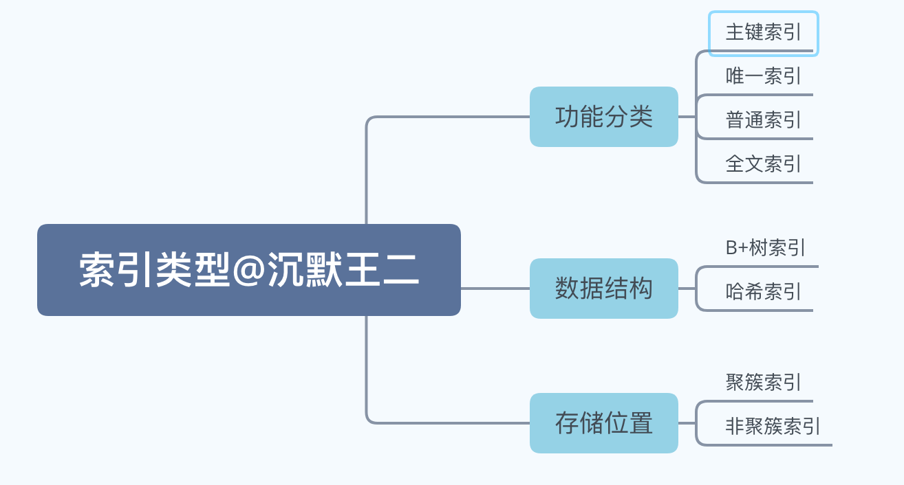
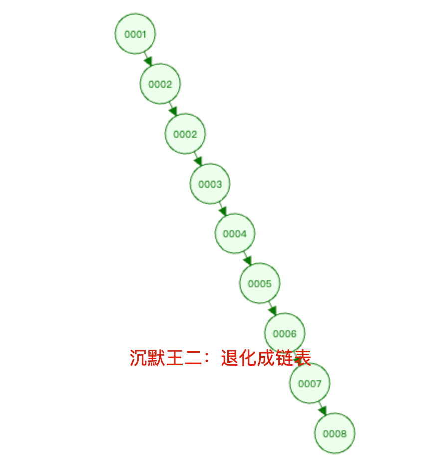
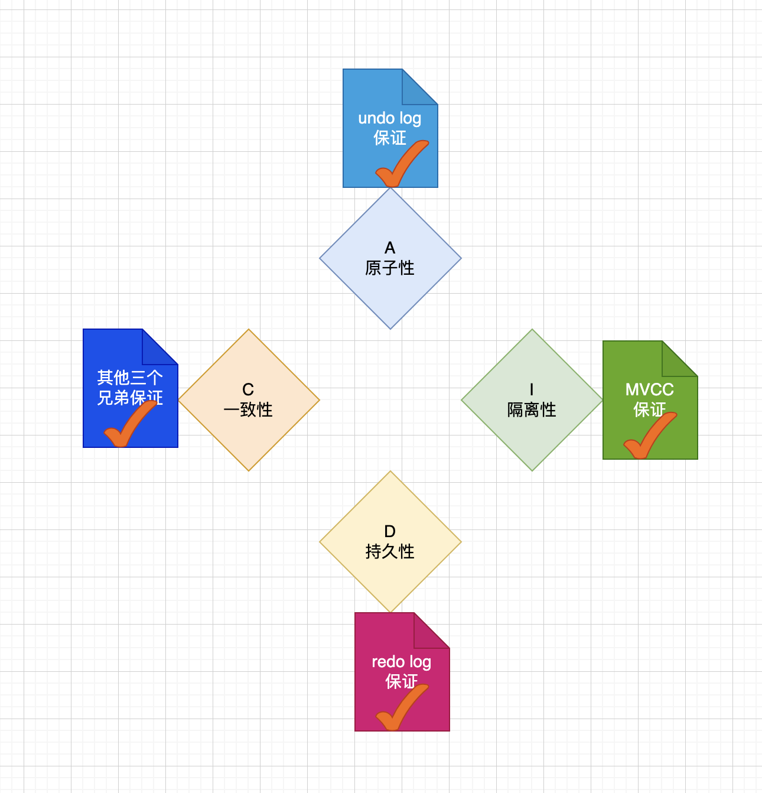
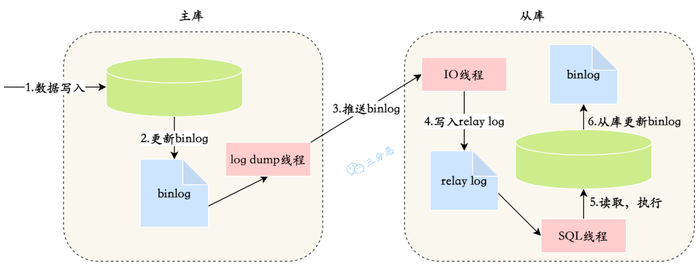
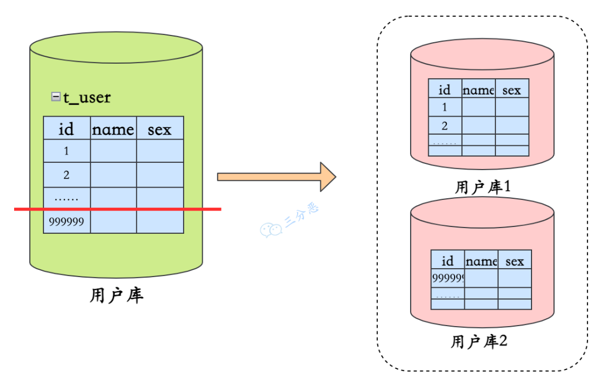
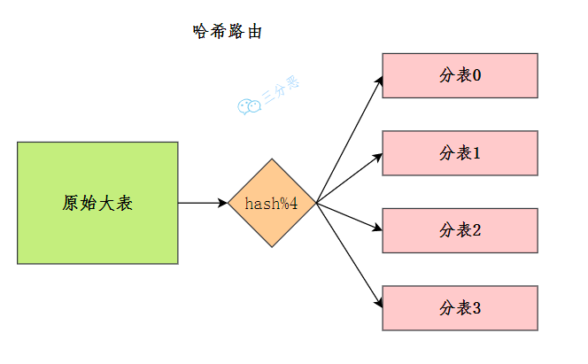
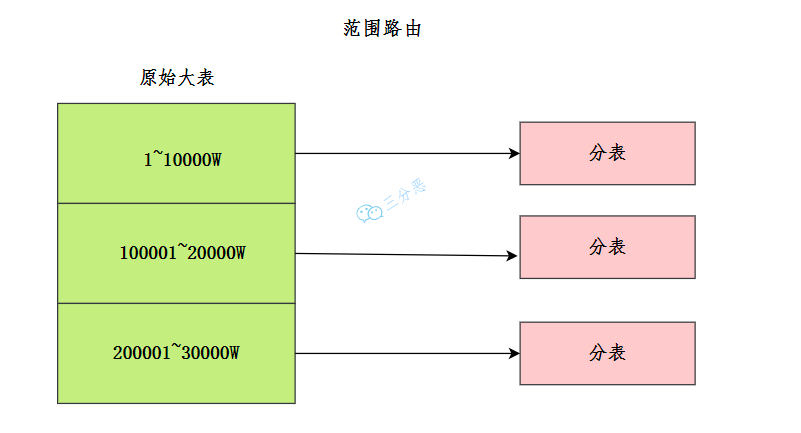
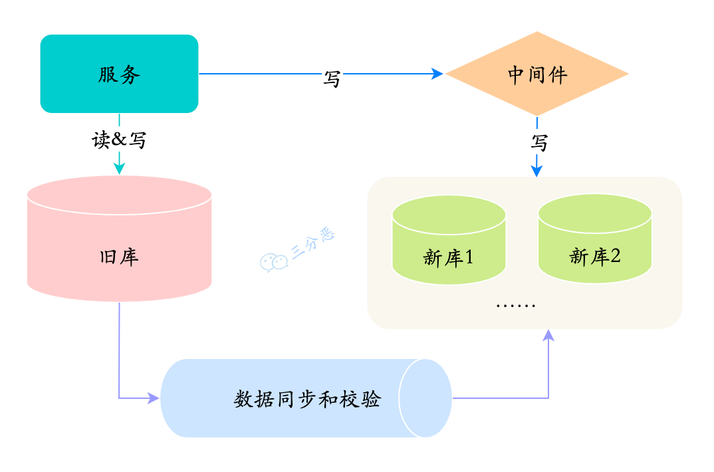
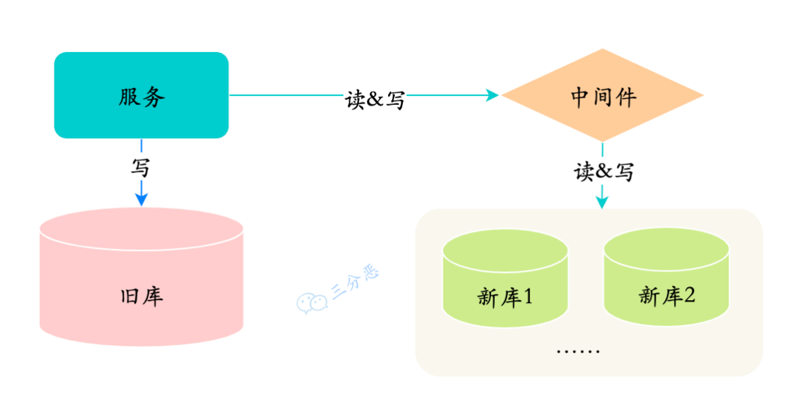
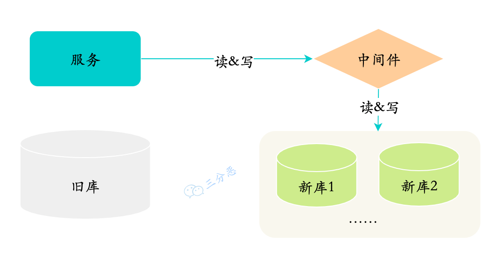

# MySQL八股

[myNotes/MySQL/《MySQL实战45讲》笔记/MySQL实战45讲(1~15).md at master · Kaho-WONG/myNotes](https://github.com/Kaho-WONG/myNotes/blob/master/MySQL/%E3%80%8AMySQL%E5%AE%9E%E6%88%9845%E8%AE%B2%E3%80%8B%E7%AC%94%E8%AE%B0/MySQL%E5%AE%9E%E6%88%9845%E8%AE%B2(1~15).md)

# MySQL 基础
## 说一下数据库的三大范式？
+ **第一范式（1NF）**：确保每个字段都是原子性的，不可再分割。例如，一个人的姓名和电话号码应该是分开存储的，而不是在同一列中。
+ **第二范式（2NF）**：在满足第一范式的基础上，消除部分依赖，即非主键字段必须依赖于整个主键，而不是依赖于主键的一部分。
+ **第三范式（3NF）**：在满足第二范式的基础上，消除传递依赖，即非主键字段不能依赖于其他非主键字段。例如，一个商品表中的价格只应该与商品相关，而不应该与供应商或地点相关。

## NOSQL和SQL的区别？
**SQL 和 NoSQL 的主要区别在于：**

+ **SQL**：使用结构化的关系模型，适合复杂查询。
+ **NoSQL**：支持多种灵活的数据模型，适合大规模和高并发场景。
+ **SQL**：遵循 **ACID** 原则保证事务安全。
+ **NoSQL**：采用 **BASE** 模型，强调可用性和最终一致性。

## 什么是内连接、外连接、交叉连接、笛卡尔积呢？
+ **内连接（INNER JOIN）**：返回两个或多个表中匹配的行。
+ **左外连接（左连接）（LEFT JOIN）**：返回左表的所有行及右表中匹配的行，不匹配则显示 `NULL`。
+ **右外连接（右连接）（RIGHT JOIN）**：返回右表的所有行及左表中匹配的行，不匹配则显示 `NULL`。
+ **全外连接（FULL OUTER JOIN）**：返回左表和右表的所有行，包括匹配和不匹配的行。
+ **交叉连接（CROSS JOIN）**：返回两个表的笛卡尔积，即每行与每行的组合。
+ **笛卡尔积（Cartesian Product）**：是两个集合中所有可能的元素组合，等同于交叉连接的结果。

## 建表的时候考虑哪些问题？
在建表的时候，首先可以考虑表是否符合数据库范式，也就是确保：

    1. **字段不可再分**：确保每个字段都是原子性的，符合 **第一范式（1NF）**。
    2. **消除非主键依赖**：确保非主键字段依赖于整个主键，符合 **第二范式（2NF）**。
    3. **确保字段仅依赖于主键**：消除传递依赖，符合 **第三范式（3NF）**。

然后，在选择字段类型时，尽量选择合适的数据类型。

在字符集上，尽量选择 **utf8mb4**，这样不仅可以支持中文和英文，还可以支持表情符号等。

当数据量较大时（比如上千万行数据），需要考虑分表。比如订单表，可以采用 **水平分表** 的方式来分散存储压力。

## varchar 与 char 的区别？
**CHAR** 和 **VARCHAR** 的主要区别在于：

    - **CHAR**：是定长字符串类型，存储时会填充空格到指定长度，适合长度固定的字符串。
    - **VARCHAR**：是变长字符串类型，存储时仅占用实际字符长度，更适合长度不定的字符串。
    - **CHAR**：在处理固定长度时性能较好。
    - **VARCHAR**：则在节省空间方面表现更佳。

## blob 和 text 有什么区别？
+ **BLOB (Binary Large Object)**：用于存储二进制数据，例如图像、音频、视频或任何类型的非文本文件。BLOB字段不会对数据进行字符集转换，所以它适合存储原始二进制数据。
+ **TEXT**：用于存储大文本数据，例如文章内容、评论或任何需要长文本存储的数据。TEXT字段会基于字符集进行存储，因此它适合存储文本内容。

## DATETIME 和 TIMESTAMP 的异同？
**DATETIME 和 TIMESTAMP 的相同点**：

    1. **表现格式**：两者存储时间的格式一致，均为 `YYYY-MM-DD HH:MM:SS`。
    2. **包含部分**：都包含 **日期** 和 **时间** 部分。
    3. **微秒支持**：都支持存储微秒的小数秒（最多 6 位小数秒）。

---

**DATETIME 和 TIMESTAMP 的区别**：

| **特点** | **DATETIME** | **TIMESTAMP** |
| --- | --- | --- |
| **日期范围** | `1000-01-01 00:00:00` 到 `9999-12-31 23:59:59.999999` | `1970-01-01 00:00:01 UTC` 到 `2038-01-09 03:14:07.999999 UTC` |
| **存储空间** | 8 字节 | 4 字节 |
| **时区相关** | 存储时间与时区无关 | 存储时间与时区有关，显示的值依赖于时区 |
| **默认值** | 默认值为 `NULL` | 默认值为当前时间（`CURRENT_TIMESTAMP`），且字段不可为 `NULL` |


---

**总结**：

+ **DATETIME**：适合存储固定的日期时间，不受时区影响，适用于历史数据、长期有效的日期。
+ **TIMESTAMP**：适合存储和时区相关的日期时间，自动转换为 UTC 存储，查询时会根据时区自动调整，适用于事件记录、日志等。

## in 和 exists 的区别？
在 **MySQL** 中：

+ **IN**：检查某个值是否在指定列表中，适合简单匹配。
+ **EXISTS**：检查子查询是否返回至少一行，适合复杂条件。  
    - **EXISTS** 在处理大型数据集时通常更高效，因为它会在找到第一条匹配记录后立即返回。

| 特性 | `IN` | `EXISTS` |
| --- | --- | --- |
| **目的** | 用来检查某个值是否存在于一个列表或子查询的结果集中。 | 用来检查子查询是否返回任何结果。 |
| **性能** | 如果子查询结果集很大，性能可能较差，因为需要将所有结果加载到内存中。 | 一旦找到匹配的记录，`EXISTS` 就会返回 `TRUE`，通常更高效。 |
| **工作方式** | `IN` 需要返回一列数据并将其与外部查询的值进行比较。 | `EXISTS` 不关心子查询的结果，只关心是否有符合条件的记录。 |
| **适用场景** | 适用于子查询返回的值较少，且需要具体比较某个字段的情况。 | 适用于检查是否存在符合条件的记录，尤其是子查询可以快速终止的场景。 |


## 记录货币用什么字段类型比较好？
**货币在数据库中 MySQL 常用 **`Decimal`** 和 **`Numeric`** 类型表示**，这两种类型被 MySQL 实现为同样的类型。它们被用于保存与货币有关的数据。

    1. **例如**：`salary DECIMAL(9,2)`  

存储在 `salary` 列中的值的范围是从 **-9999999.99** 到 **9999999.99**。

        * **9（precision）**：代表将被用于存储值的总的小数位数。  
        * **2（scale）**：代表将被用于存储小数点后的位数。
    2. **DECIMAL 和 NUMERIC**  
        * 这两种类型的值作为字符串存储，而不是作为二进制浮点数，以便保存那些值的小数精度。
    3. **不使用 **`float`** 或 **`double`** 的原因**：  
        * 因为 `float` 和 `double` 是以二进制存储的，所以有一定的误差。

## 怎么存储 emoji？
**MySQL 的 utf8 字符集仅支持最多 3 个字节的 UTF-8 字符**，但是 emoji 表情（😊）是 4 个字节的 UTF-8 字符，所以在 MySQL 中存储 emoji 表情时，需要使用 **utf8mb4** 字符集。

## DML，DQL，DDL 等都是什么
| **类型** | **全称** | **功能** | **常见命令** |
| :---: | :---: | :---: | :---: |
| **DML** | 数据操作语言 (Data Manipulation Language) | 用于操作数据库中的数据（插入、更新、删除） | `INSERT`（插入数据），`UPDATE`（更新数据），`DELETE`（删除数据） |
| **DQL** | 数据查询语言 (Data Query Language) | 用于查询数据库中的数据 | `SELECT`（查询数据） |
| **DDL** | 数据定义语言 (Data Definition Language) | 用于定义和管理数据库结构（创建、修改、删除表等） | `CREATE`（创建），`ALTER`（修改），`DROP`（删除），`TRUNCATE`（清空表） |
| **DCL** | 数据控制语言 (Data Control Language) | 用于控制数据库访问权限 | `GRANT`（授予权限），`REVOKE`（撤销权限） |
| **TCL** | 事务控制语言 (Transaction Control Language) | 用于管理数据库事务（提交、回滚等） | `COMMIT`（提交事务），`ROLLBACK`（回滚事务），`SAVEPOINT`（设置保存点） |


## drop、delete 与 truncate 的区别？
**三者都表示删除，但是三者有一些差别：**

| 区别 | **delete** | **truncate** | **drop** |
| --- | --- | --- | --- |
| **类型** | 属于 DML | 属于 DDL | 属于 DDL |
| **回滚** | 可回滚 | 不可回滚 | 不可回滚 |
| **删除内容** | 表结构还在，删除表的全部或者一部分数据行 | 表结构还在，删除表中的所有数据 | 从数据库中删除表，所有数据行，索引和权限也会被删除 |
| **删除速度** | 删除速度慢，需要逐行删除 | 删除速度快 | 删除速度最快 |


因此，在不再需要一张表的时候，用 **drop**；在想删除部分数据行时，用 **delete**；在保留表而删除所有数据的时候用 **truncate**。

## UNION 与 UNION ALL 的区别？
        * **如果使用 UNION，会在表连接后筛选掉重复的记录行**，**如果使用 UNION ALL，不会合并重复的记录行**
        * **从效率上说，UNION ALL 要比 UNION 快很多**，如果合并没有刻意要删除重复行，那么就使用 **UNION ALL**。

## count(1)、count(*) 与 count(列名) 的区别？
好的，以下是一个简洁的表格，总结了 `COUNT(*)`、`COUNT(1)` 和 `COUNT(列名)` 的区别：

| **类型** | **计算对象** | **结果** | **备注** |
| --- | --- | --- | --- |
| `COUNT(*)` | 所有行（包括 `NULL` 值的行） | 返回表中所有的行数 | 统计所有行，不管列中是否有 `NULL` 值 |
| `COUNT(1)` | 所有行（常量 `1`） | 返回表中所有的行数 | 和 `COUNT(*)` 行为完全相同，计算所有行 |
| `COUNT(列名)` | 该列的非 `NULL` 值 | 返回该列中非 `NULL` 值的行数 | 只统计指定列中非 `NULL` 的行 |


**关键区别：**

+ `COUNT(*)` 和 `COUNT(1)` 都会统计所有的行，包括 `NULL` 值。
+ `COUNT(列名)` 只会统计列中非 `NULL` 的行。

这个表格应该能帮助你更清晰地理解它们之间的区别！

## SQL 查询语句的执行顺序了解吗？


**SQL 查询语句的执行顺序（从内到外）：**

1. `FROM`：首先确定数据来源，即从哪些表中选择数据。如果涉及连接（`JOIN`），会先执行连接操作。
2. `ON`：如果使用了连接（`JOIN`），那么在 `FROM` 之后，会根据 `ON` 子句定义的条件进行连接操作。
3. `JOIN`：执行表之间的连接操作，按照 `FROM` 和 `JOIN` 子句中指定的连接类型（如 `INNER JOIN`、`LEFT JOIN` 等）进行数据组合。
4. `WHERE`：筛选数据，应用过滤条件，排除不符合条件的行。
5. `GROUP BY`：将数据按照指定的列进行分组。
6. `HAVING`：对分组后的数据进行筛选，过滤掉不符合条件的组。
7. `SELECT`：选择需要返回的列或计算结果。
8. `DISTINCT`：去重，排除重复的行。
9. `ORDER BY`：对结果进行排序。
10. `LIMIT`：限制查询结果的行数。

**执行顺序示意图**：

```sql
1. FROM
2. ON
3. JOIN
4. WHERE
5. GROUP BY
6. HAVING
7. SELECT
8. DISTINCT
9. ORDER BY
10. LIMIT
```

**解释每个步骤**：

+ `FROM`：首先确定从哪些表中获取数据。如果有多个表连接，会先执行连接操作（`JOIN`）。
+ `ON`：如果是连接查询，这一步会应用连接条件来匹配行。
+ `JOIN`：执行连接操作（如 `INNER JOIN`、`LEFT JOIN` 等），将来自不同表的数据合并。
+ `WHERE`：根据给定的条件对数据进行过滤，去除不满足条件的记录。
+ `GROUP BY`：将数据按指定列进行分组。只有在使用聚合函数（如 `COUNT`、`SUM`、`AVG` 等）时，才需要使用 `GROUP BY`。
+ `HAVING`：对分组后的数据进行筛选，类似于 `WHERE`，但 `HAVING` 用于过滤分组结果。
+ `SELECT`：选择需要显示的列，或者计算聚合值、表达式等。
+ `DISTINCT`：对查询结果进行去重，去除重复的行。
+ `ORDER BY`：对查询结果进行排序，按照指定的列升序或降序排列。
+ `LIMIT`：限制查询返回的结果行数，通常用来限制返回的记录数。

**示例：**

假设我们有一个 SQL 查询：

```sql
-- 选择部门名称和该部门员工数量
SELECT department, COUNT(*)
FROM employees
-- 筛选出年龄大于30岁的员工
WHERE age > 30
-- 按部门进行分组
GROUP BY department
-- 只选择员工数量大于5的部门
HAVING COUNT(*) > 5
-- 按部门名称降序排序
ORDER BY department DESC
-- 限制结果只显示前10行
LIMIT 10;

```

**执行顺序**：

1. **FROM**：选择 `employees` 表。
2. **WHERE**：筛选出 `age > 30` 的员工。
3. **GROUP BY**：根据 `department` 对员工进行分组。
4. **HAVING**：筛选分组结果中员工数大于 5 的部门。
5. **SELECT**：选择部门和该部门的员工数（`COUNT(*)`）。
6. **ORDER BY**：按部门名降序排序。
7. **LIMIT**：限制返回最多 10 条记录。

## 介绍一下 MySQL 的常用命令（补充）
<details class="lake-collapse"><summary id="u38672420"><span class="ne-text">常见 SQL 命令</span></summary><p id="u34d13750" class="ne-p"><span class="ne-text"> 2024 年 03 月 13 日增补，可以先向面试官确认一下，“您提到的常用命令是指数据库表的增删改查 SQL 吗？”得到确认答复后可以根据下面这张思维导图作答：  </span></p><p id="u5e30a416" class="ne-p"><strong><span class="ne-text">数据库操作命令：</span></strong></p><p id="u1f84ed10" class="ne-p"><span class="ne-text">①、</span><strong><span class="ne-text">创建数据库</span></strong><span class="ne-text">:  </span></p><pre data-language="sql" id="Z55C5" class="ne-codeblock language-sql"><code>CREATE DATABASE database_name;</code></pre><p id="u1fee0c40" class="ne-p"><span class="ne-text">②、</span><strong><span class="ne-text">删除数据库</span></strong><span class="ne-text">:  </span></p><pre data-language="sql" id="AOKjP" class="ne-codeblock language-sql"><code>DROP DATABASE database_name;</code></pre><p id="u36fe3a8a" class="ne-p"><span class="ne-text">③、</span><strong><span class="ne-text">选择数据库</span></strong><span class="ne-text">:  </span></p><pre data-language="sql" id="d1jn5" class="ne-codeblock language-sql"><code>USE database_name;</code></pre><hr id="ZJZv9" class="ne-hr"><p id="u27b450bb" class="ne-p"><strong><span class="ne-text">表操作命令：</span></strong></p><p id="u2ef83fa3" class="ne-p"><span class="ne-text">①、</span><strong><span class="ne-text">创建表</span></strong><span class="ne-text">:  </span></p><pre data-language="sql" id="EkOJO" class="ne-codeblock language-sql"><code>CREATE TABLE table_name (
    column1 datatype,
    column2 datatype,
    ...
);</code></pre><p id="u95db0685" class="ne-p"><span class="ne-text">②、</span><strong><span class="ne-text">删除表</span></strong><span class="ne-text">:  </span></p><pre data-language="sql" id="fTiyp" class="ne-codeblock language-sql"><code>DROP TABLE table_name;</code></pre><p id="uc9ece0b8" class="ne-p"><span class="ne-text">③、</span><strong><span class="ne-text">显示所有表</span></strong><span class="ne-text">:  </span></p><pre data-language="sql" id="G1Xx9" class="ne-codeblock language-sql"><code>SHOW TABLES;</code></pre><p id="ua58451e3" class="ne-p"><span class="ne-text">④、</span><strong><span class="ne-text">查看表结构</span></strong><span class="ne-text">:  </span></p><pre data-language="sql" id="ZN64d" class="ne-codeblock language-sql"><code>DESCRIBE table_name;</code></pre><p id="u8a4dc9e1" class="ne-p"><span class="ne-text">⑤、</span><strong><span class="ne-text">修改表（添加列）</span></strong><span class="ne-text">:  </span></p><pre data-language="sql" id="kAWZZ" class="ne-codeblock language-sql"><code>ALTER TABLE table_name ADD column_name datatype;</code></pre><hr id="AoDmL" class="ne-hr"><p id="u80ffb46f" class="ne-p"><strong><span class="ne-text">CRUD 命令：</span></strong></p><p id="ub4289053" class="ne-p"><span class="ne-text">①、</span><strong><span class="ne-text">插入数据</span></strong><span class="ne-text">:  </span></p><pre data-language="sql" id="SCslC" class="ne-codeblock language-sql"><code>INSERT INTO table_name (column1, column2, ...) VALUES (value1, value2, ...);</code></pre><p id="u52dd939d" class="ne-p"><span class="ne-text">②、</span><strong><span class="ne-text">查询数据</span></strong><span class="ne-text">:  </span></p><pre data-language="sql" id="XuwzU" class="ne-codeblock language-sql"><code>SELECT column_names FROM table_name WHERE condition;</code></pre><p id="ub316d668" class="ne-p"><span class="ne-text">③、</span><strong><span class="ne-text">更新数据</span></strong><span class="ne-text">:  </span></p><pre data-language="sql" id="r1Ecq" class="ne-codeblock language-sql"><code>UPDATE table_name SET column1 = value1, column2 = value2 WHERE condition;</code></pre><p id="u7fe61dbe" class="ne-p"><span class="ne-text">④、</span><strong><span class="ne-text">删除数据</span></strong><span class="ne-text">:  </span></p><pre data-language="sql" id="F2qQj" class="ne-codeblock language-sql"><code>DELETE FROM table_name WHERE condition;</code></pre><hr id="QN9m1" class="ne-hr"><p id="u2d413471" class="ne-p"><strong><span class="ne-text">索引和约束的创建修改命令：</span></strong></p><p id="u461c9c3d" class="ne-p"><span class="ne-text">①、</span><strong><span class="ne-text">创建索引</span></strong><span class="ne-text">:  </span></p><pre data-language="sql" id="j0Bd2" class="ne-codeblock language-sql"><code>CREATE INDEX index_name ON table_name (column_name);</code></pre><p id="u34dd953e" class="ne-p"><span class="ne-text">②、</span><strong><span class="ne-text">添加主键约束</span></strong><span class="ne-text">:  </span></p><pre data-language="sql" id="Fp5HD" class="ne-codeblock language-sql"><code>ALTER TABLE table_name ADD PRIMARY KEY (column_name);</code></pre><p id="u8b5168c4" class="ne-p"><span class="ne-text">③、</span><strong><span class="ne-text">添加外键约束</span></strong><span class="ne-text">:  </span></p><pre data-language="sql" id="fg7yr" class="ne-codeblock language-sql"><code>ALTER TABLE table_name ADD CONSTRAINT fk_name FOREIGN KEY (column_name) REFERENCES parent_table (parent_column_name);</code></pre><hr id="xvRZS" class="ne-hr"><p id="ue31428ef" class="ne-p"><strong><span class="ne-text">用户和权限管理的命令：</span></strong></p><p id="u082da60a" class="ne-p"><span class="ne-text">①、</span><strong><span class="ne-text">创建用户</span></strong><span class="ne-text">:  </span></p><pre data-language="sql" id="yMds1" class="ne-codeblock language-sql"><code>CREATE USER 'username'@'host' IDENTIFIED BY 'password';</code></pre><p id="u78969f6d" class="ne-p"><span class="ne-text">②、</span><strong><span class="ne-text">授予权限</span></strong><span class="ne-text">:  </span></p><pre data-language="sql" id="d4LYK" class="ne-codeblock language-sql"><code>GRANT ALL PRIVILEGES ON database_name.table_name TO 'username'@'host';</code></pre><p id="u8220cade" class="ne-p"><span class="ne-text">③、</span><strong><span class="ne-text">撤销权限</span></strong><span class="ne-text">:  </span></p><pre data-language="sql" id="WHCv2" class="ne-codeblock language-sql"><code>REVOKE ALL PRIVILEGES ON database_name.table_name FROM 'username'@'host';</code></pre><p id="u15f2397b" class="ne-p"><span class="ne-text">④、</span><strong><span class="ne-text">删除用户</span></strong><span class="ne-text">:  </span></p><pre data-language="sql" id="KBqyO" class="ne-codeblock language-sql"><code>DROP USER 'username'@'host';</code></pre><hr id="tf48o" class="ne-hr"><p id="u0fe40edc" class="ne-p"><strong><span class="ne-text">事务控制的命令：</span></strong></p><p id="ubc407d83" class="ne-p"><span class="ne-text">①、</span><strong><span class="ne-text">开始事务</span></strong><span class="ne-text">:  </span></p><pre data-language="sql" id="saN71" class="ne-codeblock language-sql"><code>START TRANSACTION;</code></pre><p id="uf7edfb82" class="ne-p"><span class="ne-text">②、</span><strong><span class="ne-text">提交事务</span></strong><span class="ne-text">:  </span></p><pre data-language="sql" id="Cj2Db" class="ne-codeblock language-sql"><code>COMMIT;</code></pre><p id="uc7227277" class="ne-p"><span class="ne-text">③、</span><strong><span class="ne-text">回滚事务</span></strong><span class="ne-text">:  </span></p><pre data-language="sql" id="FNtDt" class="ne-codeblock language-sql"><code>ROLLBACK;</code></pre></details>
## MySQL 第 3-10 条记录怎么查？（补充）
**在 MySQL 中，要查询第 3 到第 10 条记录，可以使用 **`LIMIT`** 语句，结合偏移量 **`OFFSET`** 和行数 **`row_count`** 来实现。**

`LIMIT` 语句用于限制查询结果的数量，偏移量表示从哪条记录开始，行数表示返回的记录数量。

```sql
SELECT * FROM table_name LIMIT 2, 8;
```

    - **2**：偏移量，表示跳过前两条记录，从第三条记录开始。
    - **8**：行数，表示从偏移量开始，返回 8 条记录。

偏移量是从 0 开始的，即第一条记录的偏移量是 0；如果想从第 3 条记录开始，偏移量就应该是 2。

## 用过哪些 MySQL 函数？（补充）
<details class="lake-collapse"><summary id="ua2aad1e7"><span class="ne-text">常用函数</span></summary><p id="u359a39d9" class="ne-p"><strong><span class="ne-text">MySQL 支持很多内置函数，包括执行计算、格式转换、日期处理等。我将分享一些常用的函数，并附上示例。</span></strong></p><hr id="CMbfj" class="ne-hr"><h3 id="ecb2f3ab"><strong><span class="ne-text">字符串函数</span></strong></h3><ul class="ne-ul"><li id="ua3b5b415" data-lake-index-type="0"><strong><span class="ne-text">CONCAT()</span></strong><span class="ne-text">: 连接两个或多个字符串。</span></li><li id="ubf90a672" data-lake-index-type="0"><strong><span class="ne-text">LENGTH()</span></strong><span class="ne-text">: 返回字符串的长度。</span></li><li id="u1f7f7952" data-lake-index-type="0"><strong><span class="ne-text">SUBSTRING()</span></strong><span class="ne-text">: 从字符串中提取子字符串。</span></li><li id="u62ba4863" data-lake-index-type="0"><strong><span class="ne-text">REPLACE()</span></strong><span class="ne-text">: 替换字符串中的某部分。</span></li><li id="u3390636c" data-lake-index-type="0"><strong><span class="ne-text">LOWER() 和 UPPER()</span></strong><span class="ne-text">: 分别将字符串转换为小写或大写。</span></li><li id="uc2e296e2" data-lake-index-type="0"><strong><span class="ne-text">TRIM()</span></strong><span class="ne-text">: 去除字符串两侧的空格或其他指定字符。</span></li></ul><pre data-language="sql" id="ZuqGk" class="ne-codeblock language-sql"><code>-- 连接字符串
SELECT CONCAT('沉默', ' ', '王二') AS concatenated_string;

-- 获取字符串长度
SELECT LENGTH('沉默 王二') AS string_length;

-- 提取子字符串
SELECT SUBSTRING('沉默 王二', 1, 5) AS substring;

-- 替换字符串内容
SELECT REPLACE('沉默 王二', '王二', 'MySQL') AS replaced_string;

-- 字符串转小写
SELECT LOWER('HELLO WORLD') AS lower_case;

-- 字符串转大写
SELECT UPPER('hello world') AS upper_case;

-- 去除字符串两侧的空格
SELECT TRIM('  沉默 王二  ') AS trimmed_string;</code></pre><hr id="s4SSI" class="ne-hr"><h3 id="42ae2fae"><strong><span class="ne-text">数值函数</span></strong></h3><ul class="ne-ul"><li id="ub81eab15" data-lake-index-type="0"><strong><span class="ne-text">ABS()</span></strong><span class="ne-text">: 返回一个数的绝对值。</span></li><li id="u822b5e8b" data-lake-index-type="0"><strong><span class="ne-text">CEILING()</span></strong><span class="ne-text">: 返回大于或等于给定数值的最小整数。</span></li><li id="uf3f9b7f4" data-lake-index-type="0"><strong><span class="ne-text">FLOOR()</span></strong><span class="ne-text">: 返回小于或等于给定数值的最大整数。</span></li><li id="u0393d39f" data-lake-index-type="0"><strong><span class="ne-text">ROUND()</span></strong><span class="ne-text">: 四舍五入到指定的小数位数。</span></li><li id="u2423b53b" data-lake-index-type="0"><strong><span class="ne-text">MOD()</span></strong><span class="ne-text">: 返回除法操作的余数。</span></li></ul><pre data-language="sql" id="eORYO" class="ne-codeblock language-sql"><code>-- 返回绝对值
SELECT ABS(-123) AS absolute_value;

-- 向上取整
SELECT CEILING(123.45) AS ceiling_value;

-- 向下取整
SELECT FLOOR(123.45) AS floor_value;

-- 四舍五入
SELECT ROUND(123.4567, 2) AS rounded_value;

-- 余数
SELECT MOD(10, 3) AS modulus;</code></pre><hr id="vErLZ" class="ne-hr"><h3 id="ac99dc14"><strong><span class="ne-text">日期和时间函数</span></strong></h3><ul class="ne-ul"><li id="u1234a418" data-lake-index-type="0"><strong><span class="ne-text">NOW()</span></strong><span class="ne-text">: 返回当前的日期和时间。</span></li><li id="u99ab3966" data-lake-index-type="0"><strong><span class="ne-text">CURDATE()</span></strong><span class="ne-text">: 返回当前的日期。</span></li><li id="ue2e8adf4" data-lake-index-type="0"><strong><span class="ne-text">CURTIME()</span></strong><span class="ne-text">: 返回当前的时间。</span></li><li id="u6ef7b05b" data-lake-index-type="0"><strong><span class="ne-text">DATE_ADD() 和 DATE_SUB()</span></strong><span class="ne-text">: 在日期上加上或减去指定的时间间隔。</span></li><li id="u0d137a96" data-lake-index-type="0"><strong><span class="ne-text">DATEDIFF()</span></strong><span class="ne-text">: 返回两个日期之间的天数。</span></li><li id="udc4cc064" data-lake-index-type="0"><strong><span class="ne-text">DAY(), MONTH(), YEAR()</span></strong><span class="ne-text">: 分别返回日期的日、月、年部分。</span></li></ul><pre data-language="sql" id="uAtG2" class="ne-codeblock language-sql"><code>-- 返回当前日期和时间
SELECT NOW() AS current_date_time;

-- 返回当前日期
SELECT CURDATE() AS current_date;

-- 返回当前时间
SELECT CURTIME() AS current_time;

-- 在日期上添加天数
SELECT DATE_ADD(CURDATE(), INTERVAL 10 DAY) AS date_in_future;

-- 计算两个日期之间的天数
SELECT DATEDIFF('2024-12-31', '2024-01-01') AS days_difference;

-- 返回日期的年份
SELECT YEAR(CURDATE()) AS current_year;</code></pre><hr id="jnECQ" class="ne-hr"><h3 id="df104793"><strong><span class="ne-text">汇总函数</span></strong></h3><ul class="ne-ul"><li id="u867ebd9e" data-lake-index-type="0"><strong><span class="ne-text">SUM()</span></strong><span class="ne-text">: 计算数值列的总和。</span></li><li id="u0774adac" data-lake-index-type="0"><strong><span class="ne-text">AVG()</span></strong><span class="ne-text">: 计算数值列的平均值。</span></li><li id="u444e1fc5" data-lake-index-type="0"><strong><span class="ne-text">COUNT()</span></strong><span class="ne-text">: 计算某列的行数。</span></li><li id="u8e67b090" data-lake-index-type="0"><strong><span class="ne-text">MAX() 和 MIN()</span></strong><span class="ne-text">: 分别返回列中的最大值和最小值。</span></li><li id="ucebe5152" data-lake-index-type="0"><strong><span class="ne-text">GROUP_CONCAT()</span></strong><span class="ne-text">: 将多个行值连接为一个字符串。</span></li></ul><pre data-language="sql" id="p4lKF" class="ne-codeblock language-sql"><code>-- 创建一个表并插入数据进行聚合查询
CREATE TABLE sales (
    product_id INT,
    sales_amount DECIMAL(10, 2)
);

INSERT INTO sales (product_id, sales_amount) VALUES (1, 100.00);
INSERT INTO sales (product_id, sales_amount) VALUES (1, 150.00);
INSERT INTO sales (product_id, sales_amount) VALUES (2, 200.00);

-- 计算总和
SELECT SUM(sales_amount) AS total_sales FROM sales;

-- 计算平均值
SELECT AVG(sales_amount) AS average_sales FROM sales;

-- 计算总行数
SELECT COUNT(*) AS total_entries FROM sales;

-- 最大值和最小值
SELECT MAX(sales_amount) AS max_sale, MIN(sales_amount) AS min_sale FROM sales;</code></pre><hr id="PLmCK" class="ne-hr"><h3 id="e5a08c7d"><strong><span class="ne-text">逻辑函数</span></strong></h3><ul class="ne-ul"><li id="ufd4aa631" data-lake-index-type="0"><strong><span class="ne-text">IF()</span></strong><span class="ne-text">: 如果条件为真，则返回一个值；否则返回另一个值。</span></li><li id="ua29940bd" data-lake-index-type="0"><strong><span class="ne-text">CASE</span></strong><span class="ne-text">: 根据一系列条件返回值。</span></li><li id="ubba0d2ed" data-lake-index-type="0"><strong><span class="ne-text">COALESCE()</span></strong><span class="ne-text">: 返回参数列表中的第一个非 NULL 值。</span></li></ul><pre data-language="sql" id="Dufxr" class="ne-codeblock language-sql"><code>-- IF函数
SELECT IF(1 &gt; 0, 'True', 'False') AS simple_if;

-- CASE表达式
SELECT CASE WHEN 1 &gt; 0 THEN 'True' ELSE 'False' END AS case_expression;

-- COALESCE函数
SELECT COALESCE(NULL, NULL, 'First Non-Null Value', 'Second Non-Null Value') AS first_non_null;</code></pre><hr id="FDKZw" class="ne-hr"><h3 id="41076009"><strong><span class="ne-text">格式化函数</span></strong></h3><ul class="ne-ul"><li id="uc2efc990" data-lake-index-type="0"><strong><span class="ne-text">FORMAT()</span></strong><span class="ne-text">: 格式化数字为格式化的字符串，通常用于货币显示。</span></li></ul><pre data-language="sql" id="Od6m8" class="ne-codeblock language-sql"><code>-- 格式化数字
SELECT FORMAT(1234567.8945, 2) AS formatted_number;</code></pre><hr id="DHBPV" class="ne-hr"><h3 id="9cdbde16"><strong><span class="ne-text">类型转换函数</span></strong></h3><ul class="ne-ul"><li id="u79c4c86d" data-lake-index-type="0"><strong><span class="ne-text">CAST()</span></strong><span class="ne-text">: 将一个值转换为指定的数据类型。</span></li><li id="u147d40b9" data-lake-index-type="0"><strong><span class="ne-text">CONVERT()</span></strong><span class="ne-text">: 类似于CAST()，用于类型转换。</span></li></ul><pre data-language="sql" id="dWeuq" class="ne-codeblock language-sql"><code>-- CAST函数
SELECT CAST('2024-01-01' AS DATE) AS casted_date;

-- CONVERT函数
SELECT CONVERT('123', SIGNED INTEGER) AS converted_number;</code></pre><hr id="DnguR" class="ne-hr"><p id="u2efe46c5" class="ne-p"><span class="ne-text">这些是一些常用的 MySQL 内置函数，它们在数据处理、格式转换和查询优化中都非常有用。</span></p></details>
# 数据库架构
## 说说 MySQL 的基础架构？
**MySQL 的架构大致可以分为三层，从上到下依次是：连接层、服务层、和存储引擎层。**


①、**连接层**

+ 主要负责客户端连接的管理，包括验证用户身份、权限校验、连接管理等。可以通过数据库连接池来提升连接的处理效率。

②、**服务层**

+ 是 MySQL 的核心，主要负责查询解析、优化、执行等操作。
+ 在这一层，SQL 语句会经过解析、优化器优化，然后转发到存储引擎执行，并返回结果。
+ 这一层包含查询解析器、优化器、执行计划生成器、缓存（如查询缓存）、日志模块等。

③、**存储引擎层**

+ 负责数据的实际存储和提取，是 MySQL 架构中与数据交互最直接的层。
+ MySQL 支持多种存储引擎，如 **InnoDB**、**MyISAM**、**Memory** 等。

## 一条查询语句如何执行？


**MySQL 执行 SQL 语句的步骤：**

### **第一步：客户端连接**
+ 客户端通过连接器与 MySQL 服务器建立连接，管理连接，并校验用户身份。

~~<font style="color:#DF2A3F;">查询缓存：查询语句如果命中查询缓存则直接返回，否则继续往下执行。MySQL 8.0 已删除该模块</font>~~<font style="color:#DF2A3F;">。</font>

### **第二步：解析 SQL 语句**
+ 解析器开始对 SQL 语句进行解析，检查语句是否符合 SQL 语法规则，确保引用的数据库、表和列都存在，并处理 SQL 语句中的名称解析和权限验证。

### **第三步：执行 SQL**
#### **预处理阶段：**
+ 预处理器检查相关的表或字段是否存在。将 `SELECT *` 中的 `*` 符号扩展为表上的所有列。对 SQL 语句中的表达式进行预处理。

#### **优化阶段：**
+ 优化器选择执行成本最小的执行计划，以提高执行效率。这包括选择合适的索引、决定表的连接顺序、是否需要排序等。

#### **执行阶段：**
+ 执行引擎按照优化器选择的执行计划执行 SQL 查询。这涉及到与存储引擎的交互，如读取索引、检索数据行、执行排序和聚合操作等，并将结果返回给客户端。

## 一条更新语句怎么执行的？（这个有点复杂，一时半会不好总结，等我后面看完再回来）
<details class="lake-collapse"><summary id="u797b7d29"><span class="ne-text">服务层</span></summary><ul class="ne-ul"><li id="u6d0879b2" data-lake-index-type="0"><span class="ne-text">客户端通过连接器与 MySQL 服务器建立连接，管理连接，并校验用户身份。</span></li><li id="u77b3139c" data-lake-index-type="0"><strong><span class="ne-text">解析器（Parser）</span></strong><span class="ne-text">：解析器开始对 SQL 语句进行解析，检查语句是否符合 SQL 语法规则</span></li><li id="u4a262219" data-lake-index-type="0"><span class="ne-text">预处理器检查相关的表或字段是否存在。对 SQL 语句中的表达式进行预处理。</span></li><li id="ua8c2c676" data-lake-index-type="0"><span class="ne-text">优化器选择执行成本最小的执行计划，以提高查询效率。这包括选择合适的索引、决定表的连接顺序、是否需要排序等。</span></li></ul><ul class="ne-ul"><li id="u6ae449a1" data-lake-index-type="0"><span class="ne-text">执行引擎按照优化器选择的执行计划，与存储引擎进行交互</span></li></ul><h3 id="e19d7c09"><strong><span class="ne-text" style="color: var(--md-box-samantha-deep-text-color) !important">存储引擎层处理</span></strong></h3><h4 id="BwvXT"><span class="ne-text">（1）查找数据行</span></h4><ul class="ne-ul"><li id="u3df48ae2" data-lake-index-type="0"><strong><span class="ne-text">索引访问</span></strong><span class="ne-text">：根据</span><code class="ne-code"><span class="ne-text">WHERE</span></code><span class="ne-text">条件使用索引快速定位目标数据行。</span></li><li id="ud44116dc" data-lake-index-type="0"><strong><span class="ne-text">回表操作</span></strong><span class="ne-text">：如果使用的是非聚簇索引，需通过索引找到主键，再回聚簇索引获取完整数据。</span></li><li id="u636e5602" data-lake-index-type="0"><span class="ne-text">开启事务，</span><strong><span class="ne-text">写Undo日志</span></strong><span class="ne-text">：记录数据在事务开始前的版本,</span><strong><span class="ne-text">写Redo日志</span></strong><span class="ne-text">：记录物理数据页的修改。</span></li></ul><ul class="ne-ul"><li id="ufdb492dd" data-lake-index-type="0"><strong><span class="ne-text">修改缓冲池（Buffer Pool）</span></strong><span class="ne-text">：直接修改缓冲池中的数据，但此时数据未持久化到磁盘。</span></li></ul><ul class="ne-ul"><li id="u2ecbd0b6" data-lake-index-type="0"><strong><span class="ne-text">两阶段提交（2PC）</span></strong><span class="ne-text">：</span></li></ul><ul class="ne-list-wrap"><ul ne-level="1" class="ne-ul"><li id="u27336346" data-lake-index-type="0"><strong><span class="ne-text">第一阶段：Prepare阶段</span></strong></li></ul></ul><ul class="ne-list-wrap"><ul class="ne-list-wrap"><ul ne-level="2" class="ne-ul"><li id="u751f38e4" data-lake-index-type="0"><strong><span class="ne-text">InnoDB内部操作</span></strong><span class="ne-text">：InnoDB存储引擎首先将事务相关的数据变更记录到redo log中，并将redo log的状态设置为“prepare”。事务还没有真正提交。</span></li></ul></ul></ul><ul class="ne-list-wrap"><ul ne-level="1" class="ne-ul"><li id="u9e4774fc" data-lake-index-type="0"><strong><span class="ne-text">第二阶段：Commit阶段</span></strong></li></ul></ul><ul class="ne-list-wrap"><ul class="ne-list-wrap"><ul ne-level="2" class="ne-ul"><li id="udaee9eb3" data-lake-index-type="0"><strong><span class="ne-text">binlog写入</span></strong><span class="ne-text">：MySQL服务层将事务的操作记录到binlog中。binlog记录了数据库中所有的更改操作</span></li><li id="u452bb1b6" data-lake-index-type="0"><strong><span class="ne-text">InnoDB提交</span></strong><span class="ne-text">：在binlog写入完成后，InnoDB存储引擎将redo log的状态从“prepare”改为“commit”，事务正式提交。</span></li></ul></ul></ul><h3 id="duBpb"><strong><span class="ne-text"></span></strong></h3><h3 id="pvPdi"></h3></details>
[一条更新语句在MySQL是怎么执行的](https://gsmtoday.github.io/2019/02/08/how-update-executes-in-mysql/)

**具体更新一条记录** `UPDATE t_user SET name = 'xiaolin' WHERE id = 1;` 的流程如下：

1. **执行器** 负责具体执行更新操作，会调用存储引擎的接口，通过主键索引树搜索获取 `id = 1` 这一行记录：
    - 如果 `id=1` 这一行所在的数据页本来就在 **buffer pool** 中，就直接返回给执行器更新；
    - 如果记录不在 **buffer pool**，将数据页从磁盘读入到 **buffer pool**，返回记录给执行器。
2. **执行器** 得到聚簇索引记录后，会检查更新前的记录和更新后的记录是否一样：
    - 如果两者相同，就不进行后续更新操作；
    - 如果不同，则将更新前后的记录都作为参数传给 **InnoDB** 层，真正执行更新操作。
3. **开启事务**，在 **InnoDB** 层更新记录前，首先要记录相应的 **undo log**，因为这是更新操作，需要把被更新列的旧值记下来：
    - 生成一条 **undo log**，并将其写入到 **Buffer Pool** 中的 Undo 页面；
    - 在内存修改该 **Undo** 页面后，需要同时记录对应的 **redo log**。
4. **InnoDB 层开始更新记录**：
    - 更新先在内存中进行，并标记为**脏页**；
    - 将更新后的记录写入 **redo log**；
    - 更新操作完成时，脏页不会立即写入磁盘，而是由后台线程选择合适的时机将脏页刷写到磁盘上。这就是 **WAL（Write Ahead Logging）** 技术：**MySQL** 的写操作并不是立刻写到磁盘上，而是先写入 **redo log**，然后在合适的时机将修改的行数据写入磁盘。
5. **完成记录更新**：
    - 至此，记录更新操作完成。
6. **记录 Binlog**：
    - 更新语句执行完后，会开始记录该语句对应的 **binlog**。此时，记录的 **binlog** 会先保存在 **binlog cache** 中，并不会立即刷新到硬盘的 **binlog 文件**，直到事务提交时才会统一将该事务运行过程中的所有 **binlog** 刷新到硬盘。
7. **事务提交（两阶段提交）**：
    - **prepare 阶段**：将 **redo log** 对应的事务状态设置为 **prepare**，然后将 **redo log** 刷新到硬盘；
    - **commit 阶段**：
        * 将 **binlog** 刷新到磁盘；
        * 调用存储引擎的提交事务接口，将 **redo log** 状态设置为 **commit**（此时 **redo log** 刷新到磁盘）；
8. **最终完成**：至此，更新语句执行完成，事务提交成功。

## 说说 MySQL 的数据存储形式（补充）


1. **表空间（Tablespace）**：
    - 表空间是 MySQL 存储数据的最基本单位，尤其在 InnoDB 存储引擎中，一个表空间通常对应一个表或索引的存储。
    - **InnoDB** 的表空间通常存储在 `.ibd` 文件中，支持共享表空间和独立表空间两种模式。
2. **段（Segment）**：
    - 表空间内部由多个段组成，段是表或索引数据的逻辑划分，主要有数据段（用于存储表的数据）和索引段（用于存储索引的数据）。
3. **区（Extent）**：
    - 一个区是由连续的多个页组成，InnoDB 中每个区通常包含 64 个连续的页（默认 1MB）。区是 InnoDB 用来管理和分配存储空间的单位。
4. **页（Page）**：
    - 页是存储的最小单位，InnoDB 默认每页大小为 16KB。数据、索引、以及事务日志等都以页为单位进行存储和管理。
    - 页可以包含多个数据行，数据行根据表的结构存储在这些页内。
5. **行（Row）**：
    - 行是数据的最小存储单位，具体的一行数据存储在单个页内。

# 存储引擎
## MySQL 有哪些常见存储引擎？


+ **InnoDB**：（支持事务，外键，行级锁）  
**特点**：InnoDB 是 MySQL 默认的存储引擎，支持事务，并且实现了行级锁定，具有更高的并发性能。它支持外键，适合高可靠性、高并发的应用场景。
+ **MyISAM**：（不支持事务，外键，支持表级锁）  
**特点**：MyISAM 不支持事务和外键，但读取性能优秀，适合读取频繁但写入较少的应用场景。它使用表级锁，在高并发的写操作时性能较差。
+ **Memory**：  
**特点**：Memory 存储引擎将数据存储在内存中，速度非常快，但是在服务器重启或崩溃时数据会丢失。它不支持事务、行级锁和外键约束。

## 那存储引擎应该怎么选择？
+ **大多数情况下，使用默认的 InnoDB 就对了，InnoDB 可以提供事务、行级锁、外键、B+ 树索引等能力。**
+ **MyISAM** 适合读更多的场景。
+ **MEMORY** 适合临时表，数据量不大的情况。由于数据都存放在内存，所以速度非常快。

## InnoDB 和 MyISAM 主要有什么区别？
**InnoDB 和 MyISAM 的主要区别如下：**

    - **事务支持：**
        * **InnoDB**：支持事务，具备回滚和崩溃恢复能力。
        * **MyISAM**：不支持事务，无法回滚。
    - **锁机制：**
        * **InnoDB**：行级锁，并发性能高。
        * **MyISAM**：表级锁，写操作时会阻塞其他操作。
    - **外键支持：**
        * **InnoDB**：支持外键约束。
        * **MyISAM**：不支持外键。
    - **索引结构：**
        * **InnoDB**：采用聚簇索引，数据和索引存储在一起。
        * **MyISAM**：采用非聚簇索引，数据和索引分开存储。

## InnoDB 的 Buffer Pool了解吗？（补充）
<details class="lake-collapse"><summary id="u22c6fe01"></summary><p id="u00a7a99b" class="ne-p"><strong><span class="ne-text">Buffer Pool</span></strong><span class="ne-text"> 是 </span><strong><span class="ne-text">InnoDB 存储引擎</span></strong><span class="ne-text"> 的内存缓冲区，按页存储数据。  </span></p><ul class="ne-ul"><li id="ud45958c5" data-lake-index-type="0"><span class="ne-text">查询时优先从缓冲区读取，避免直接读盘。  </span></li><li id="u2c126ac3" data-lake-index-type="0"><span class="ne-text">修改数据时，先在缓存页面修改，形成 </span><strong><span class="ne-text">脏页</span></strong><span class="ne-text">。  </span></li><li id="u863939e1" data-lake-index-type="0"><strong><span class="ne-text">脏页</span></strong><span class="ne-text">不会立即写回磁盘，</span><strong><span class="ne-text">而是</span></strong><span class="ne-text">定期刷新脏页到磁盘中以保证数据一致。  </span></li><li id="uc689a124" data-lake-index-type="0"><span class="ne-text">采用改良的 </span><strong><span class="ne-text">LRU</span></strong><span class="ne-text"> 算法管理缓存页。</span></li></ul></details>
**Buffer Pool** 是 InnoDB 存储引擎中的一个内存缓冲区，它会将数据以页（page）的单位保存在内存中。当查询请求需要读取数据时，优先从 Buffer Pool 获取数据，避免直接访问磁盘。

也就是说，即便我们只访问了一行数据的一个字段，InnoDB 也会将整个数据页加载到 Buffer Pool 中，以便后续的查询。

修改数据时，也会先在缓存页面中修改。当数据页被修改后，会在 Buffer Pool 中变为脏页。脏页不会立刻写回到磁盘。

InnoDB 会定期将这些脏页刷新到磁盘，保证数据的一致性。通常采用改良的 LRU 算法来管理缓存页，也就是将最近最少使用的数据移出缓存，为新数据腾出空间。


**Buffer Pool** 能够显著减少对磁盘的访问，从而提升数据库的读写性能。

在调优方面，我们可以设置合理的 **Buffer Pool** 大小（通常为物理内存的 70%），并配置多个 **Buffer Pool** 实例（通过 `innodb_buffer_pool_instances`）来提升并发能力。此外，还可以通过调整刷新策略参数，比如 `innodb_flush_log_at_trx_commit`，来平衡性能和数据持久性。

# 日志
## MySQL 日志文件有哪些？分别介绍下作用？
[MySQL面试题](https://www.xiaolincoding.com/interview/mysql.html#%E8%AE%B2%E4%B8%80%E4%B8%8Bbinlog)

+ **Redo log**  
重做日志，是**InnoDB存储引擎层**生成的日志，记录物理数据页的修改，用于崩溃恢复，实现了事务中的**持久性**，主要用于掉电等故障恢复。
+ **Undo log**  
回滚日志，是**InnoDB存储引擎层**生成的日志，记录事务开始前的数据状态，用于回滚事务和 **MVCC（多版本并发控制）支持，实现了事务中的原子性**，主要用于事务回滚和MVCC。
+ **Bin log**  
二进制日志，是**服务层**生成的二进制日志，记录数据库的所有更改操作，用于数据备份和主从复制。
+ **Relay log**  
中继日志，用于主从复制场景下，从服务器复制主服务器的bin log后本地生成的日志。
+ **慢查询日志**  
用于记录执行时间超过设定阈值的SQL。


## 讲一下 binlog
1. **定义与位置**
    - Binlog（二进制日志）是MySQL数据库服务层生成的一种日志。它以二进制的形式记录了数据库中所有的更改操作，如对数据表的插入（INSERT）、更新（UPDATE）、删除（DELETE）等操作。这些日志文件通常存储在MySQL服务器的数据目录下，文件名一般以“mysql - bin.xxxxxx”的形式命名，其中“xxxxxx”是一个编号或者时间戳相关的标识。
2. **主要作用**
    - **数据备份与恢复**
        * 可以用于全量备份和增量备份。全量备份是对数据库某一时刻的完整快照，而增量备份则是基于binlog记录的更改操作来实现的。例如，在进行数据库恢复时，如果有全量备份作为基础，再结合binlog中记录的从全量备份之后的所有更改操作，就可以将数据库恢复到任意想要的时间点。这在应对数据丢失、误操作等情况时非常有用。
    - **主从复制**
        * 这是binlog最重要的应用场景之一。在主从复制架构中，主数据库（Master）将binlog发送给从数据库（Slave）。从数据库通过读取和解析主数据库的binlog来执行相同的操作，从而实现数据的同步。这样可以实现数据库的读写分离，提高系统的整体性能和可用性。例如，将写操作集中在主数据库，而读操作可以分布在多个从数据库上。
3. **格式类型**

**Statement 格式**：记录原始的 **SQL 语句**。  
**ROW 模式**：记录**每一行数据的实际变更**。  
**MIXED 格式**：MySQL 会根据具体的操作自动选择使用 **STATEMENT 格式** 还是 **ROW 格式**。

        * **简单语句** 采用 **STATEMENT 模式**。
        * **复杂的操作** 会使用 **ROW 格式**。
    - **STATEMENT格式**
        * 这种格式下，binlog会记录执行的SQL语句。例如，当执行一个“UPDATE table_name SET column_name = value WHERE condition”的操作时，binlog会完整地记录这条SQL语句。优点是日志文件相对较小，因为只记录SQL语句；缺点是在某些复杂的场景下，如包含函数、存储过程等操作时，可能会导致主从数据不一致，因为从库执行相同的SQL语句可能会因为上下文环境等因素产生不同的结果。
    - **ROW格式**
        * Binlog会记录每一行数据的实际变更。例如，对于一个更新操作，它会记录更新前的行数据和更新后的行数据。这种格式的优点是能够保证主从数据的一致性，即使在复杂的操作场景下也不容易出现问题；缺点是日志文件相对较大，因为要记录每一行数据的详细变更。
    - **MIXED格式**
        * 这是一种混合格式，MySQL会根据具体的操作自动选择使用STATEMENT格式还是ROW格式。一般来说，对于简单的、能够保证主从数据一致的操作（如简单的INSERT、UPDATE、DELETE操作）会使用STATEMENT格式，而对于复杂的操作（如包含函数、存储过程等）则会使用ROW格式。
4. **与其他日志的区别**
    - 与redo log（重做日志）不同，redo log是InnoDB存储引擎层的日志，主要用于在系统崩溃后恢复InnoDB表中已提交事务的数据，确保数据的持久性。而binlog记录的是整个数据库层面的操作，并且其作用更多地体现在数据备份和主从复制上。
    - 与undo log（回滚日志）也不同，undo log主要用于事务回滚和提供多版本并发控制（MVCC）支持，它记录的是事务开始前的数据状态，而binlog记录的是数据的实际更改操作。

## undo log 和 redo log 和binlog 区别?
+ **Undo Log**：记录数据的旧版本，用于事务回滚和多版本并发控制（MVCC）。  
+ **Redo Log**：记录物理数据页的变更，用于崩溃后恢复已提交事务，确保数据的持久性。  
+ **Binlog**：记录数据库的所有更改操作，用于数据恢复、增量备份和主从复制。

简单来说，**Undo Log** 处理回滚，**Redo Log** 处理崩溃恢复，**Binlog** 则处理备份和复制。


## redo log怎么保证持久性的？
**Redo log** 是 MySQL 中用于保证持久性的重要机制之一。它通过以下方式来保证持久性：

+ ** 写前日志（WAL）策略  Write-ahead logging（WAL）**：所有对数据的修改都会首先记录在 redo log 中，然后再实际写入磁盘中。即使系统崩溃，日志中的数据仍然可以保证被持久化  ，系统可以通过 redo log 中的记录来恢复数据。
+ **Redo log 的顺序写入**：redo log 采用追加写入的方式，将 redo 日志记录追加到文件末尾，而不是随机写入。这样可以减少磁盘的随机 I/O 操作，提高写入性能。
+ **Checkpoint 机制**：MySQL 会定期将内存中的数据刷新到磁盘，同时将最新的 LSN（Log Sequence Number 日志序列号  ）记录到磁盘中，这个 LSN 可以确保 redo log 中的操作是按顺序执行的。在恢复数据时，系统会根据 LSN 来确定从哪个位置开始应用 redo log。


## UndoLog日志的作用是什么？
**undo log** 是一种用于撤销回退的日志，它保证了事务的 ACID 特性中的原子性（Atomicity）。  
在事务未提交之前，MySQL 会先记录更新前的数据到 **undo log** 日志文件中。当事务需要回滚时，可以利用 **undo log** 来进行数据的恢复。  
每当 InnoDB 引擎对一条记录进行操作（修改、删除、新增）时，以下信息会被记录到 **undo log** 中：

w

+ **插入操作**：
    - 在插入一条记录时，需要记录这条记录的主键值。这样，在回滚时，只需根据这个主键值将对应的记录删除即可。
+ **删除操作**：
    - 在删除一条记录时，需要记录这条记录的所有内容。这样，在回滚时，可以使用这些内容将记录重新插入到表中。
+ **更新操作**：
    - 在更新一条记录时，需要记录被更新列的旧值。这样，在回滚时，可以将这些列更新为它们的旧值。  
在发生回滚时，系统会读取 **undo log** 中的数据，并执行与原操作相反的操作。例如：
+ 当执行 **delete** 操作删除一条记录时，**undo log** 会记录下被删除记录的所有内容。
+ 在执行回滚操作时，系统会读取 **undo log** 中的数据，并执行 **insert** 操作，将记录重新插入到表中。  
通过这种方式，**undo log** 确保了事务在遇到错误或被显式回滚时，能够撤销所有已经进行的更改，从而维护了事务的原子性。

##  Undo Log 的 WAL（Write-Ahead Logging）机制  
<details class="lake-collapse"><summary id="u0ae61578"></summary><h3 id="d97b5a5c"><span class="ne-text">先解释一下 Undo Log 是干啥的？</span></h3><p id="u11dcee3c" class="ne-p"><span class="ne-text">Undo log（回滚日志）用于：</span></p><ol class="ne-ol"><li id="u28146f51" data-lake-index-type="0"><span class="ne-text">回滚数据（比如事务失败了要撤销）</span></li><li id="ued72e47d" data-lake-index-type="0"><span class="ne-text">支持 MVCC（提供历史版本用于快照读）</span></li></ol><hr id="DNeZd" class="ne-hr"><h3 id="9366614e"><span class="ne-text">🔹</span><span class="ne-text">什么是 WAL（Write-Ahead Logging）机制？</span></h3><p id="u3be612e6" class="ne-p"><span class="ne-text">WAL（预写日志）核心思想是：</span></p><p id="ue28e7a7d" class="ne-p"><strong><span class="ne-text">“数据还没真正写入磁盘之前，必须先把日志写入磁盘”</span></strong><span class="ne-text">。</span></p><h3 id="0072274c"><span class="ne-text">在 InnoDB 中，WAL 机制具体指：</span></h3><ol class="ne-ol"><li id="ub75c8565" data-lake-index-type="0"><span class="ne-text">修改数据时，先记录 undo log 到 redo log buffer；</span></li><li id="u0cfde4dd" data-lake-index-type="0"><span class="ne-text">Redo Log（重做日志）先持久化（</span><code class="ne-code"><span class="ne-text">fsync()</span></code><span class="ne-text">）；</span></li><li id="uddfb1cf9" data-lake-index-type="0"><span class="ne-text">只有 redo log 落盘成功，事务才算提交；</span></li><li id="u40cb2455" data-lake-index-type="0"><span class="ne-text">如果崩溃，可以用 redo log 恢复，undo log 回滚未提交的数据。</span></li></ol><hr id="w9UPh" class="ne-hr"><h3 id="97163d24"><span class="ne-text">✅</span><span class="ne-text"> 面试中总结模板：</span></h3><p id="uec8387e6" class="ne-p"><span class="ne-text">“Undo Log 负责回滚和 MVCC，Redo Log 保证持久性，两者结合就是 WAL 机制：</span></p><ul class="ne-ul"><li id="u097e1f88" data-lake-index-type="0"><span class="ne-text">先写日志（undo log、redo log），再写数据页；</span></li><li id="u3138b261" data-lake-index-type="0"><span class="ne-text">保证事务失败可回滚（undo），系统崩溃可恢复（redo）；</span></li><li id="u3fd417c0" data-lake-index-type="0"><span class="ne-text">这是 InnoDB 实现 ACID 中 A 和 D 的关键手段。”</span></li></ul></details>
## 能不能只用binlog不用relo log？
不行，binlog是 server 层的日志，没办法记录哪些脏页还没有刷盘，redolog 是存储引擎层的日志，可以记录哪些脏页还没有刷盘，这样崩溃恢复的时候，就能恢复那些还没有被刷盘的脏页数据。

## 讲一下 binlog 的两阶段提交；binlog 为什么要两阶段提交呢？


<details class="lake-collapse"><summary id="ua291a70d"></summary><ul class="ne-ul"><li id="u56d2f5ce" data-lake-index-type="0"><strong><span class="ne-text">两阶段提交（2PC）</span></strong><span class="ne-text">：</span></li></ul><ul class="ne-list-wrap"><ul ne-level="1" class="ne-ul"><li id="uca51acbb" data-lake-index-type="0"><strong><span class="ne-text">第一阶段：准备Prepare阶段</span></strong></li></ul></ul><ul class="ne-list-wrap"><ul class="ne-list-wrap"><ul ne-level="2" class="ne-ul"><li id="ue93b7dc5" data-lake-index-type="0"><strong><span class="ne-text">InnoDB内部操作</span></strong><span class="ne-text">：InnoDB存储引擎首先将事务的数据修改记录到redo log中，并将redo log的状态设置为“prepare”。事务还没有真正提交。</span></li></ul></ul></ul><ul class="ne-list-wrap"><ul ne-level="1" class="ne-ul"><li id="u0dbb367e" data-lake-index-type="0"><strong><span class="ne-text">第二阶段：提交 Commit阶段</span></strong></li></ul></ul><ul class="ne-list-wrap"><ul class="ne-list-wrap"><ul ne-level="2" class="ne-ul"><li id="u3a512984" data-lake-index-type="0"><strong><span class="ne-text">binlog写入</span></strong><span class="ne-text">：MySQL服务层数据库中所有的更改操作记录到binlog中。</span></li><li id="ue8e01352" data-lake-index-type="0"><strong><span class="ne-text">InnoDB提交</span></strong><span class="ne-text">：在binlog写入完成后，InnoDB存储引擎将redo log的状态从“prepare”改为“commit”，事务正式提交。</span></li></ul></ul></ul><p id="u631cbbd2" class="ne-p"><span class="ne-text">为什么两阶段提交<br /></span><strong><span class="ne-text">保证 Binlog 和 Redo Log 之间的一致性</span></strong><span class="ne-text">，防止主从复制时数据不一致问题。  </span></p></details>
1. **背景**
    - 在MySQL中，InnoDB存储引擎有自己的日志系统（如redo log），而MySQL的服务层有binlog。为了保证数据的一致性和可靠性，尤其是在主从复制和崩溃恢复场景下，引入了binlog的两阶段提交机制。
2. **两阶段提交过程**
    - **第一阶段：Prepare阶段**
        * **InnoDB内部操作**：InnoDB存储引擎首先将事务相关的数据变更记录到redo log中，并将redo log的状态设置为“prepare”。此时，这些变更在InnoDB内部是不可见的，因为事务还没有真正提交。
        * **关键操作**：这个阶段确保了即使在后续操作失败的情况下，InnoDB也有足够的信息来恢复事务。例如，如果在这个阶段后系统崩溃，InnoDB可以根据redo log中的“prepare”状态来决定是否重新提交或回滚事务。
    - **第二阶段：Commit阶段**
        * **binlog写入**：MySQL服务层将事务的操作记录到binlog中。这个binlog记录了数据库层面的所有更改操作，包括对多个表的操作等。
        * **InnoDB提交**：在binlog写入完成后，InnoDB存储引擎将redo log的状态从“prepare”改为“commit”，此时事务在InnoDB内部正式提交，数据变更对其他事务可见。
3. **作用和意义**
    - **数据一致性保证**
        * 在主从复制场景中，从库通过读取主库的binlog来进行数据同步。两阶段提交确保了从库接收到的binlog与主库InnoDB内部的数据变更一致。如果没有两阶段提交，可能会出现主库和从库数据不一致的情况。例如，主库在写入redo log后崩溃，而binlog还没来得及写入，从库可能会丢失这部分数据；或者主库先写入binlog后崩溃，而InnoDB内部还没提交，从库可能会多执行这部分数据。
    - **崩溃恢复保障**
        * 当系统崩溃后重启时，MySQL可以根据redo log和binlog的状态来准确地恢复事务。如果redo log处于“prepare”状态且binlog已经存在，那么可以重新提交事务；如果redo log处于“prepare”状态但binlog不存在，那么可以回滚事务。

两阶段提交可以确保在多个 MySQL 节点或多个数据库之间的操作能安全地同步提交或回滚，避免数据的不一致。  

# SQL 优化
## SQL执行慢,如何分析呢?（慢SQL定位查询）
如果一条 **SQL** 执行很慢，首先可以启用**慢查询日志**，记录执行时间超过阈值的查询，帮助定位问题。然后，我们可以使用 **MySQL 的 EXPLAIN** 命令分析执行情况：

1. **查看 key 和 key_len 字段**，判断是否命中了索引，以及索引是否失效。
2. **通过 type 字段检查查询的连接类型**，确认是否存在全表扫描或全索引扫描，寻找优化空间。
3. **查看 Extra 字段**，以判断是否出现了回表的情况。如果有回表，可以考虑添加索引或修改查询以优化性能。

## 给你张表，发现查询速度很慢，你有那些解决方案
**分析查询语句：**

使用 **EXPLAIN** 命令分析 SQL 执行计划，找出慢查询的原因，比如是否使用了全表扫描，是否存在索引未被利用的情况等，并根据相应情况对索引进行适当修改。

**创建或优化索引：**

+ 根据查询条件创建合适的索引，特别是经常用于 **WHERE** 子句的字段、**ORDER BY** 排序的字段、**JOIN** 联表查询的字段、**GROUP BY** 的字段。
+ 如果查询中经常涉及多个字段，考虑创建联合索引。使用联合索引时，要遵循**最左匹配原则**，否则可能会导致索引失效。

**避免索引失效：**

+ 避免使用 **左模糊匹配**（如 `LIKE '%xxx'`）、**函数计算**（如 `WHERE YEAR(date_column) = 2024`）、**表达式计算**（如 `WHERE salary + bonus > 5000`）等情况，这些会导致索引失效。

**查询优化：**

+ **避免使用 **`SELECT *`：只查询真正需要的列，减少不必要的列加载，提高查询效率。
+ **使用覆盖索引**：确保索引包含所有查询的字段，避免回表操作。
+ **联表查询优化**：
    - 联表查询最好采用 **小表驱动大表** 的方式。
    - 被驱动表的连接字段要有索引。
    - 可以通过冗余字段的设计，避免联表查询，减少查询的复杂度。

**分页优化：**

+ 针对 **LIMIT n,y** 深分页的查询，可以考虑将 **LIMIT** 查询转换为基于某个位置的查询。例如：

```sql
SELECT * FROM tb_sku WHERE id > 20000 LIMIT 10;
```

这种方式适用于主键自增的表，避免了深分页查询带来的性能问题。

**优化数据库表：**

+ 如果单表的数据量超过千万级别，考虑是否需要将大表拆分为小表，减轻单个表的查询压力。
+ 可以将字段多的表分解成多个表，将高频查询字段和低频查询字段分开存储。这样可以避免频繁访问低频字段导致性能瓶颈。

**使用缓存技术：**

+ 引入 **缓存层**，如 **Redis**，存储热点数据和频繁查询的结果。这样可以减少数据库查询负担，提高访问效率。
+ 需要注意 **缓存一致性** 问题，对于读请求，采用旁路缓存策略（即先查询缓存，不命中再查询数据库）；对于写请求，采用先更新数据库，再删除缓存的策略，确保缓存数据的最新性。

## 有哪些方式优化 SQL？
**SQL 优化的常见方法：**

1. **索引优化：**
    - 为频繁查询的列添加索引，避免冗余索引。
2. **优化查询语句：**
    - 只查询必要的列，避免使用 `SELECT *`，减少不必要的数据传输。
    - **使用覆盖索引**：确保索引包含所有查询的字段，避免回表操作。
    - 优先使用 **JOIN** 代替子查询，避免子查询带来的性能损失。
    - **使用 **`**LIMIT**`** 限制返回结果：** 如果查询的返回结果集很大，可以使用 `LIMIT` 来限制返回的数据量，减少计算量。  
3. **表结构优化：**
    - 规范化设计表结构，避免数据冗余。必要时进行 **分区** 或 **分表**，提高查询效率。
    - 适当使用 **外键**，但在高并发场景下，外键约束可能带来性能开销，需慎用。
4. **合理使用事务：**
    - 保持事务简短，尽量减少事务的粒度，避免长时间持有锁。
    - 使用批量操作减少事务开销，提高效率。
5. **避免不必要的计算和函数：**
    - 避免在 `WHERE` 子句中使用函数和表达式，这会导致索引失效，影响查询性能。
6. **查询缓存：**
    - 使用查询缓存以提高查询效率，但要注意 **缓存污染**，适当禁用缓存。
7. **分库分表：**
    -  如果表的数据量非常大，考虑对数据进行分表（水平切分）或分库（垂直切分），将数据分散到多个表或库中，减少单表的数据量，从而提高查询效率。  
8. **优化 JOIN 操作：**
    - 确保 **JOIN** 的列有索引，减少 **JOIN** 表的数量。尽量减少联表查询的复杂度。
9. **使用 EXPLAIN 分析查询：**
    - 使用 **EXPLAIN** 查看 SQL 执行计划，诊断查询性能问题，优化查询。
10. **选择合适的数据类型：**
    - 使用合适的字段类型，避免使用 **TEXT** 和 **BLOB** 类型字段，它们在存储和检索时较为耗费资源。
11. **避免冗余和重复数据：**
    - 消除冗余数据，避免重复记录。可以考虑应用层缓存来提高读取效率。

通过这些方法，可以有效优化 SQL 查询性能，提升数据库的响应速度和系统的整体性能。

## 怎么看执行计划 explain，如何理解其中各个字段的含义？
**EXPLAIN** 是 MySQL 中用于分析 SQL 查询的执行计划，它能帮助我们理解查询是如何被执行的，从而优化性能。

**EXPLAIN 输出结果中各个字段的含义：**

    - **possible_keys**：表示可能用到的索引；
    - **key**：表示实际用的索引，如果为 **NULL**，说明没有使用索引；
    - **key_len**：表示索引的长度；
    - **rows**：表示扫描的数据行数；
    - **type**：表示数据扫描类型，常见的类型从低到高分别是： 
        * **ALL**：全表扫描，效率低；
        * **index**：索引扫描，较快；
        * **range**：范围扫描，查找一定范围的记录；
        * **ref**：通过索引查找记录；
        * **eq_ref**：唯一索引查找，效率高。

**Extra 列：附加信息**

    - **Using index**：表示只利用了索引，不需要回表查找数据，通常表示使用了覆盖索引；
    - **Using where**：表示使用了 **WHERE** 过滤，进一步筛选数据；
    - **Using temporary**：表示使用了临时表来存储中间结果，通常出现在需要排序或分组的查询中。

# 索引
## 索引是什么？有什么好处？索引为什么快
**索引** 类似于书籍的目录，可以快速定位到特定的数据行，而无需扫描整个表，从而提高查询效率。**MySQL** 默认使用 **B+ 树** 作为索引的数据结构，而 **B+ 树** 的查询效率非常高，时间复杂度为 **O(logN)**。

## 能简单说一下索引的分类吗？


| **类别** | **索引类型** | **描述** |
| :---: | :---: | :---: |
| **功能分类** | **主键索引（Primary Index）** | 唯一标识表中的一条记录，不允许有空值。 |
|  | **唯一索引（Unique Index）** | 索引列中的值必须是唯一的，允许有空值。 |
|  | **普通索引（Normal Index）** | 没有唯一性要求，允许重复值和空值。 |
|  | **全文索引（Full-text Index）** | **<font style="color:rgb(48,79,254);">Full-text索引（</font>**全文索引：主要用于快速检索文本数据，支持对字符型字段的模糊查询和复杂的搜索条件。常见于需要全文搜索的场景，如博客、新闻网站等。**<font style="color:rgb(48,79,254);">）</font>**。 |
| **数据结构** | **B+树索引（B+ Tree Index）** | 最常用的索引类型，支持范围查询和高性能查找。 |
|  | **哈希索引（Hash Index）** | **<font style="color:rgb(48,79,254);">Hash索引（</font>**基于哈希表实现的索引，支持快速的精确匹配查询，但不支持范围查询。一般用于内存数据库和特定的存储引擎（如 MySQL 的 MEMORY 引擎） |
| **存储位置** | **聚簇索引（Clustered Index）** | 索引和数据保存在一起，通常为主键索引。 |
|  | **非聚簇索引（Non-clustered Index）** | 索引和数据分开存储，维护一个指向数据的指针。 |


##  5. 数据库中有三个字段，对数据的区分度都很高，你会怎么建立索引？


##  索引的优点和缺点  
### 优点：
1. **加速查询**：减少查找数据时的扫描行数，提升查询速度。
2. **优化排序与连接**：加速ORDER BY、GROUP BY和JOIN操作。
3. **保证数据唯一性**：通过索引确保唯一性约束。
4. **提高聚合效率**：加速COUNT、SUM等聚合操作。

### 缺点：
1. **增加存储空间**：索引需要额外的磁盘空间。
2. **影响写操作性能**：插入、更新、删除时需更新索引。
3. **不当索引影响性能**：过多或不合适的索引可能降低查询效率。
4. **管理复杂性**：需要定期优化和维护索引。

## 创建索引有哪些注意点？
**选择合适的列作为索引**

    1. 经常作为查询条件（WHERE 子句）、排序条件（ORDER BY 子句）、分组条件（GROUP BY 子句）的列是建立索引的好选项。
    2. 区分度低的字段，例如性别，不要建索引。
    3. 频繁更新的字段，不要建索引。

**避免过多的索引**

    1. 因为每个索引都需要占用额外的磁盘空间。
    2. 更新表（INSERT、UPDATE、DELETE 操作）的时候，索引都需要被更新。

**利用前缀索引和索引列的顺序**

    1. 对于字符串类型的列，可以考虑使用前缀索引来减少索引大小。
    2. 在创建联合索引时，应该根据查询条件将最常用的放在前面，遵守最左前缀原则。

## 索引哪些情况下会失效呢？
    - **使用函数或表达式**：在索引列上使用函数计算会导致索引失效。
    - **使用不等于（<>）或NOT操作符**：这些操作符通常使索引失效，导致全表扫描。
    - **使用 LIKE模糊查询前有通配符**：例如，`LIKE '%abc'`，此时索引无法使用。
    - **使用OR操作符**：当条件涉及不同索引时，并且其中一个字段未被索引，整个查询就不会使用索引。
    - **联合索引不满足最左前缀原则**：未按照最左前缀顺序使用索引时，索引失效。

## 索引不适合哪些场景呢？
1. **数据表较小**：
    - 当表中的数据量很小，或者查询需要扫描表中大部分数据时，数据库优化器可能会选择全表扫描而不是使用索引。
    - 在这种情况下，维护索引的开销可能大于其带来的性能提升。
2. **频繁更新的列**：
    - 对于经常进行更新、删除或插入操作的列，使用索引可能会导致性能下降。
    - 因为每次数据变更时，索引也需要更新，这会增加额外的写操作负担。

## 索引是不是建的越多越好？
**索引会占据磁盘空间**

索引虽然会提高查询效率，但是会降低更新表的效率。每次对表进行增删改操作，MySQL 不仅要更新数据，还要更新对应的索引文件。

**说说索引优化的思路？**

① **选择合适的索引类型**

    - 如果需要等值查询和范围查询，请选择 B+树索引。
    - 如果是用于处理文本数据的全文搜索，请选择全文索引。

② **创建适当的索引**

    - 创建组合索引时，应将查询中最常用、区分度高的列放在前面。
    - 对于查询条件 `WHERE age = 18 AND gender = '女' AND city = '洛阳'`，如果 `age` 列的值相对较为分散，可以优先考虑将 `age` 放在组合索引的第一位。
    - 使用 `SELECT` 语句时，尽量选择覆盖索引来避免不必要的回表操作，也就是说，索引中包含了查询所需的所有列；但要注意，覆盖索引的列数不宜过多，否则会增加索引的存储空间。

## 一棵 B+树能存储多少条数据呢？**<font style="background-color:#38d8f0;">主键为bigint</font>**<font style="background-color:#38d8f0;">（约2000w）</font>


我们假设每条记录大小为 1K 字节，因此单个叶子节点（页）可以存放 16 条记录（16K / 1K = 16）。对于非叶子节点，主键ID为 `BIGINT` 类型，占 8 字节，指针大小为 6 字节，总共 14 字节。

每个页大小为 16K 字节，所以每个非叶子节点可以存放 1170 个指针（16K / 14 字节 ≈ 1170）。假设 B+ 树的高度为 3，那么整个 B+ 树可以存放的记录数为 <font style="color:rgba(255, 0, 0, 1);">1170 * 1170 * 16 = 21902400，2190w 条记录数</font>。


在InnoDB存储引擎中，使用B+树作为索引结构，

非叶子节点包含“主键+指针”的组合，其中bigint主键占用8字节，指针占用6字节，合计14字节；B+树节点的大小等于一个页的大小，每个数据页默认大小为16KB（即16384字节），所以一个非叶子节点可以存储1170个这样的单元。

    1. 当B+树深度为2时，**每个叶子节点**可以存储16条数据记录，**整棵树**可以存储18720条数据。
    2. 当B+树深度为3时，**整棵树**可以存储21902400条数据记录。

> <font style="color:rgba(255, 0, 0, 1);">在2层B+树中，叶节点数*一个叶节点能存放的记录数 = 1170 * 16 = 18720条 记录数</font>
>
> <font style="color:rgba(255, 0, 0, 1);">在3层B+树中，叶节点数*叶节点数*一个叶节点能存放的记录数 = 1170 * 1170 * 16 = 21902400，2190w 条记录数</font>
>

通常情况下，InnoDB中的B+树高度在2-4层，足以满足千万级数据的存储需求。在通过主键索引查询数据时，由于B+树的高度较低，通常只需要2-4次IO操作即可找到所需的数据。

## 为什么不用普通二叉树？
普通二叉树存在退化的情况，如果它退化成链表，就相当于全表扫描。



**为什么不用平衡二叉树呢？**

虽然 AVL 树是平衡二叉树，但因为只有 2 叉，高度会比较高，磁盘 I/O 次数就会非常多。


而 B+ 树是 N 叉，每一层可以存储更多的节点数据，树的高度就会降低，因此读取磁盘的次数就会下降，查询效率就快。

## B+树的特性是什么？
+ **所有叶子节点在同一层**：保证查询效率一致。
+ **数据存在叶子节点中，**非叶子节点只存储索引，树更矮，查询更快。
+ **叶子节点通过双向链表相连**：适合范围查询和**顺序访问**，无需多次随机访问。
+ **自平衡**：B+树会在插入、删除和更新时自动平衡，确保树的高度稳定，保持高效的查找性能。时间复杂度为 O(log n)。

## 为什么用 B+ 树而不用 B 树呢？（B+树和B树的区别）
+ **B+树**数据都存储在**叶子节点**上，**非叶子节点**只存储**索引信息**；而**B树**的**非叶子节点**既存储**索引信息**也存储**部分数据**。 B+树的树高更低，IO次数更少  
+ **B+树**的**叶子节点**使用**链表相连**，便于**范围查询**和**顺序访问**；**B树**的**叶子节点**没有**链表连接**。
+ **B+树**的查找性能更**稳定**，每次查找只要查找**叶子节点**；而**B树**的查找可能会在**非叶子节点**找到数据，性能相对**不稳定**。

## **B+树的叶子节点链表是单向还是双向？**
B+树的叶子节点是通过双向链表连接的，这样可以方便范围查询和反向遍历。

## MySQL为什么用B+树结构？
+ **树的高度低**：非叶子节点只存储索引，树更矮，可以减少磁盘I/O，查询更快。
+ **支持范围查询**：叶子节点通过双向链表连接，便于顺序访问和范围查询。
+ **查询性能稳定**：所有数据都在叶子节点中，每次查找只要查找叶子节点，查找性能稳定。

## MySQL为什么用B+树结构？和其他结构比的优点？
    - **B+Tree vs B 树**:
        * **B+Tree**: 只在叶子节点存储数据，而**B 树**的非叶子节点也存储数据。**B+Tree**节点数据量较小，在相同的磁盘 I/O 次数下，**B+Tree**能查询更多的节点。**B+Tree**的叶子节点通过双链表连接，适合范围查询。而**B 树**不具备这种特性。
    - **B+Tree vs AVL 或者红黑树**:
        * **B+树**是一种多路平衡树，其节点可以存储多个键值，这导致其树高通常低于**红黑树**和**AVL树**这两类二叉查找树。由于**B+树**的高度较低，在查询时能够减少访问节点的数量，进而降低I/O操作次数；而**红黑树**和**AVL树**由于每个节点最多只有两个子节点，在数据量较大时，树的高度会增加，导致更多的磁盘I/O操作。

<details class="lake-collapse"><summary id="u52e78aaa"></summary><ul class="ne-list-wrap"><ul class="ne-list-wrap"><ul ne-level="2" class="ne-ul"><li id="u13ed3c1f" data-lake-index-type="0"><strong><span class="ne-text" style="color: #DF2A3F">红黑树</span></strong><span class="ne-text" style="color: #DF2A3F">是一个 自平衡的二叉搜索树，但是只有二叉，树的高度更高，磁盘 io 次数较多，而 B+ 树是 N 叉，每一层可以存储更多的节点数据，树的高度低，磁盘 io 次数少，查询效率就快。<br /></span><strong><span class="ne-text" style="color: #DF2A3F">红黑树</span></strong><span class="ne-text" style="color: #DF2A3F"> 不像 B+树那样在叶子节点之间进行顺序连接，所以 </span><strong><span class="ne-text" style="color: #DF2A3F">范围查询效率较低</span></strong><span class="ne-text" style="color: #DF2A3F">。每次查询都要重复遍历树。</span></li></ul></ul></ul></details>
    - **B+Tree vs Hash 表**:
        * **Hash 表**在等值查询时效率极高，搜索复杂度为 O(1)。但**Hash 表**不适合做范围查询，而**B+Tree**支持范围查询，因此在很多应用场景中，**B+Tree**索引更具优势。  
**总结**：**B+Tree**适合大规模数据存储和范围查询，提供更高效的查询和较低的磁盘 I/O 次数，相比之下**B 树**适用场景有限，**二叉树**在高数据量时效率较低，而**Hash 表**适合快速的等值查询但不支持范围查询。

## Hash 索引和 B+ 树索引区别是什么？**B+ 树索引与 Hash 索引的特点对比**
1. **范围查询**：
    - B+ 树索引可以进行范围查询。
    - Hash 索引不能进行范围查询。
2. **联合索引**：
    - B+ 树索引支持联合索引的最左侧原则。
    - Hash 索引不支持联合索引的最左侧原则。
3. **排序支持**：
    - B+ 树索引支持 `order by` 排序。
    - Hash 索引不支持 `order by` 排序。
4. **等值查询效率**：
    - Hash 索引在等值查询上比 B+ 树索引效率更高。
5. **模糊查询**：
    - B+ 树使用 `like` 进行模糊查询的时候，`LIKE 'abc%'` 的话可以起到索引优化的作用。
    - Hash 索引无法进行模糊查询。

## 聚簇索引与非聚簇索引的区别？
**聚簇索引和非聚簇索引的区别简述如下：**

    - **数据存储**：
        * 聚簇索引的叶子节点存储数据本身。
        * 非聚簇索引存储的是数据指针。
    - **数量**：
        * 每张表只能有一个聚簇索引。
        * 但可以有多个非聚簇索引。
    - **查询效率**：
        * 聚簇索引查询更快，无需回表。
        * 非聚簇索引需回表查询。
    - **插入/更新性能**：
        * 聚簇索引插入/更新影响较大。
        * 非聚簇索引影响较小。

## 回表了解吗？
**回表**是指在数据库查询过程中，通过非聚簇索引查找到记录的主键后，再根据这个主键 回到 **数据表** 中查找完整  记录的过程。

## 联合索引了解吗？
**联合索引**是通过组合多个列来创建一个索引， 能够加速多列查询和范围查询，目的是提升查询效率。当查询的 `WHERE` 子句涉及多个列时，如果这些列都被索引覆盖，可以大大提高查询速度。

## 覆盖索引了解吗？
**覆盖索引**是一种特殊的索引，它包含了查询所需的所有字段，从而可以在不回表的情况下直接返回结果。这种索引可以显著提高查询效率，减少 IO 操作。

## 什么是最左前缀原则？
使用**联合索引**时，查询条件需要从索引的最左列开始匹配，并且不跳过索引中的列。


**1. 联合索引 **`ABC`**，现在有个执行语句是 **`A = XXX and C < XXX`**，索引怎么走？**  

+ 根据**最左匹配原则**，`A` 可以走联合索引，`C` 不会走联合索引，但是 `C` 可以走**索引下推**。

---

**2. 联合索引 **`(a, b, c)`**，查询条件 **`WHERE b > xxx AND a = x`** 会生效吗？**  

+ 索引会生效，`a` 和 `b` 字段都能利用联合索引，符合**联合索引最左匹配原则**。

---

**3. 联合索引 **`(a, b, c)`**，**`WHERE`** 条件是 **`a = 2 AND c = 1`**，能用到联合索引吗？**  

+ 会用到联合索引，但是只有 `a` 能走索引，`c` 无法走索引，因为不符合**最左匹配原则**。  
+ 虽然 `c` 无法走索引，但在 MySQL 5.6 版本之后，会有**索引下推**优化，能减少回表查询的次数。

---

**(A,B,C) 联合索引 select * from tbn where a=? and b in (?,?) and c>? 会走索引吗？**

**SQL 查询**:  
`select * from tbn where a=? and b in (?,?) and c>?`

**分析**:  
这个查询会使用到联合索引 `(A,B,C)`，因为条件是按照索引列 A、B、C 的顺序来设置的，这是理想的使用场景。

+ **对于 A=?**：这个条件是一个精确匹配，MySQL 会使用索引来定位到满足条件 A=? 的记录。
+ **对于 B IN (?, ?)**：这个条件指定了 B 列可以取两个可能的值。MySQL 会利用索引来查找所有匹配 A=? 且 B 列为这两个值中任意一个的记录。
+ **对于 C>?**：这个条件是一个范围查询。在已经根据 A 和 B 筛选的基础上，MySQL 会继续利用索引来查找 C 列值大于指定值的记录。

**备注**:  
此查询可以有效利用联合索引 `(A,B,C)`，因为条件中的列与索引的顺序一致，且 MySQL 会优先使用联合索引的顺序执行条件匹配。

## <font style="color:rgb(51, 51, 51);">使用LIKE要注意什么（最左前缀匹配原则），为什么不符合这个原则就不能走索引（B+树）</font>
 因为B+树索引是按顺序存储数据的，只有从查询的最左侧开始匹配时，索引才能快速定位到匹配的数据。如果`LIKE`条件以通配符`%`开头（如`LIKE '%abc'`），索引无法有效使用，数据库需要执行全表扫描。  

## 什么是索引下推优化？
**索引下推优化**是一种提高查询性能的技术。在使用索引查询时，将原本需要在**服务器层**进行的部分条件判断下推到**存储引擎层，**提前在**存储引擎层**过滤不符合条件的行，减少不必要的数据**回表操作**，从而提高查询效率。

#  锁
## MySQL 中有哪几种锁，列举一下？


**在 MySQL 里，根据加锁的范围，可以分为全局锁、表级锁和行锁三类**

1. **全局锁**
    - 全局锁是对整个数据库加锁，通常用于备份和恢复等场景。
2. **表级锁**

表级锁是对某一张表进行加锁，不会对数据库的其他表造成影响。

    - **元数据锁（MDL）**：对表的结构进行锁定，防止在表修改结构时其他线程对其进行操作。
    - **意向锁**：在执行行级锁操作时，先给表加意向锁，用于快速判断表中是否有某些记录被加锁，减少锁冲突。
3. **行级锁**
    - **行级锁**：锁住单条记录，确保该行数据的并发安全。
    - **间隙锁**：锁定记录之间的空隙，防止其他事务在锁定范围内插入新记录
    - **Next-Key锁（临键锁）**：结合记录锁和间隙锁，既锁定记录本身，又锁定该记录附近的范围，防止其他事务修改或插入相邻的数据。解决了可重复读隔离级别下的幻读问题。

## 数据库中的全局锁 表锁 行级锁 每种锁的应用场景有哪些
+ **全局锁**：用于需要冻结整个数据库的操作，常用于备份等全局性操作。
+ **表锁**：适合表级的批量操作或 DDL 操作，在并发性不高的场景中使用。
+ **行级锁**：适合高并发的事务场景，锁粒度最小，能提供最高的并发控制。

## **讲一下共享锁和排他锁**
+ **共享锁（S Lock）**：允许多个事务并行读取同一数据，但禁止修改。适用于**读操作**。
+ **排他锁（X Lock）**：只允许一个事务对数据进行读取和修改，其他事务不能访问。适用于**写操作**。

## 意向锁是什么知道吗？
**意向锁**是一种**表级锁**，用于表示事务对表中某些行或某个范围的锁定意向，是给其他事务提供信息的标记，表明它们有意向获取特定的锁。

+ **意向共享锁（IS，Intention Shared Lock）**：表示事务打算对某些行加共享锁（S Lock）。它允许其他事务对表中其他行加意向共享锁，或加意向排他锁，但不允许加排他锁。
+ **意向排他锁（IX，Intention Exclusive Lock）**：表示事务打算对某些行加排他锁（X Lock）。它允许其他事务对表中其他行加意向共享锁或意向排他锁，但不允许加共享锁或排他锁。

## <font style="color:rgb(28, 31, 35);">select for update加什么锁</font>
SELECT ... FOR UPDATE 是 MySQL 中的一种 SQL 语句，用于在事务中读取数据并对查询结果加锁  
在InnoDB 存储引擎里，**SELECT ... FOR UPDATE** 会对查询结果集中的记录添加行级排他锁（**X 锁**）。**其他事务无法修改这些行**。

**间隙锁（GAP 锁）**：在可重复读（**REPEATABLE READ**）隔离级别下，**SELECT ... FOR UPDATE** 还可能会加间隙锁。**当查询条件涉及索引且范围查询时**，会锁定索引记录之间的间隙，防止其他事务在这些间隙插入新记录，以此避免幻读问题。

## MySQL 的乐观锁和悲观锁了解吗？
**乐观锁**和**悲观锁**是两种常用的并发控制机制，主要用于解决事务之间的数据竞争问题。

1. **悲观锁**（Pessimistic Locking）

+ **特点**：假设会发生冲突，事务在操作数据时直接加锁（行级或表级锁），防止其他事务修改相同的数据。
+ **MySQL实现**：`SELECT ... FOR UPDATE`（行锁），`LOCK TABLES`（表锁）。
+ **适用场景**：冲突概率高，要求数据一致性很强的场景，如银行转账、财务处理等。
+ **缺点**：性能较差，锁等待和并发性差。

2. **乐观锁**（Optimistic Locking）

+ **特点**：假设不会发生冲突，事务不加锁，而是在提交时检查数据是否被修改过。如果数据被修改，事务回滚或重试。
+ **MySQL实现**：通过**版本号**或**时间戳**字段来实现，每次更新时检查版本号或时间戳是否一致。
+ **适用场景**：读多写少，冲突较少的场景，如商品库存管理、用户信息更新等。
+ **优点**：性能高，适合并发量大的场景。

比较：

| 特性 | **悲观锁** | **乐观锁** |
| --- | --- | --- |
| 锁定机制 | 直接加锁（行锁、表锁） | 不加锁，提交时检查数据是否冲突 |
| 并发性能 | 低，可能导致锁等待和死锁 | 高，适合读多写少的场景 |
| 适用场景 | 数据冲突频繁，要求一致性高的场景 | 数据冲突少，读多写少的场景 |
| 实现复杂度 | 简单，但性能开销大 | 需要版本号或时间戳字段，稍微复杂 |


总结：

+ **悲观锁**适用于冲突较多的高一致性需求场景；
+ **乐观锁**适用于冲突少且性能要求高的场景。

## 遇到过死锁问题吗，你是如何解决的？
**排查死锁的一般步骤是这样的**：

1. **查看死锁日志**：`show engine innodb status;`
2. **找出死锁 SQL**
3. **分析 SQL 加锁情况**

**死锁（Deadlock）**

+ 产生原因：多个事务相互等待对方释放锁，导致事务无法继续执行。
+ 解决方案：
    1. **使用更细粒度的锁**（如行锁代替表锁）。
    2.  **控制事务执行顺序**（避免交叉锁定）  
    3. **合理设置超时时间**（`innodb_lock_wait_timeout`）。
    4. **让 InnoDB 自动检测死锁，并回滚其中一个事务**。

# 事务
## MySQL 事务的四大特性说一下？
**事务的四大特性（ACID）精简如下：**

1. **原子性 (Atomicity)**：事务是不可分割的，**要么全部成功，要么全部失败**。
2. **一致性 (Consistency)**：事务执行前后，数据库的状态必须保持一致。换句话说，事务执行之后，数据库必须从一个有效状态转换到另一个有效状态。
3. **隔离性 (Isolation)**：各个事务之间是相互隔离的，一个事务的执行**不能被其他事务干扰**。
4. **持久性 (Durability)**：一旦事务提交，结果是永久性的，**即使系统崩溃也不会丢失**。

## ACID 靠什么保证的呢？


+ **原子性**是通过 **undo log**（回滚日志）来保证的；
+ **一致性**则是通过 **持久性** + **原子性** + **隔离性**来保证；
+ **隔离性**是通过 **MVCC**（多版本并发控制）或 **锁机制**来保证的；
+ **持久性**是通过 **redo log**（重做日志）来保证的；

## 事务的隔离级别有哪些？
**事务的隔离级别有四种，分别是：**

1. **读未提交 (Read Uncommitted)**：
    - 事务可以读取其他未提交事务的数据，可能会导致“脏读”。
2. **读已提交 (Read Committed)**：
    - 事务只能读取其他事务已提交的数据，避免“脏读”，但仍可能出现“不可重复读”问题。
3. **可重复读 (Repeatable Read)**：
    - 事务在开始时所读取的数据，在整个事务期间保持一致，避免“不可重复读”，但可能会出现“幻读”。
4. **串行化 (Serializable)**：
    - 最严格的隔离级别，事务顺序执行，完全避免脏读、不可重复读和幻读，但并发性能最低。

**MySQL的默认隔离级别是可重复读 (Repeatable Read)**，

+ **快照读（普通 SELECT 语句）**：使用 MVCC 技术，事务启动时获得数据快照，后续新插入的数据不影响当前事务读取，从而避免幻读。
+ **当前读（SELECT ... FOR UPDATE 等语句）**：通过临键锁 next-key lock（记录锁+间隙锁）机制锁定查询范围，防止其他事务在锁定区间内插入新记录，从而避免幻读。

## 串行化隔离级别是通过什么实现的？
 （读操作）普通 SELECT 语句会自动加共享锁（S锁），UPDATE/INSERT/DELETE 会加排他锁（X锁）  涉及的范围加**临键锁（Next-Key Lock）**，防止幻读。

是通过**行级锁**来实现的。在**序列化隔离级别**下，普通的 **SELECT 查询** 会对记录加 **S 型（****<font style="color:#DF2A3F;">共享锁（Shared Lock）</font>****）的 next-key 锁**（**临键锁，用于锁定记录及其前序间隙，防止幻读**），这样其他事务就无法对这些已经加锁的记录进行增删改操作，从而有效避免了 **脏读**、**不可重复读** 和 **幻读** 现象。


##  RR 隔离级别下，ReadView 和锁机制如何减少幻读？  
<details class="lake-collapse"><summary id="uf5ff3ff9"></summary><h3 id="1bb8c878"><span class="ne-text">🔹</span><span class="ne-text">背景：什么是幻读？</span></h3><p id="u4ba6a61d" class="ne-p"><span class="ne-text">幻读（Phantom Read）指的是：</span><strong><span class="ne-text">同一个事务中，两次相同条件的查询，结果集不一样了</span></strong><span class="ne-text">，比如新增了符合条件的行。</span></p><p id="u561f2de0" class="ne-p"><span class="ne-text">例如：</span></p><pre data-language="sql" id="AjtoA" class="ne-codeblock language-sql"><code>sql


复制编辑
事务A: SELECT * FROM user WHERE age &gt; 18;
-- 得到10条数据

事务B: INSERT INTO user(age) VALUES (20);  -- 提交
事务A: 再次执行 SELECT * FROM user WHERE age &gt; 18;
-- 结果集多了一条，这是幻读</code></pre><hr id="z2vid" class="ne-hr"><h3 id="635374b1"><span class="ne-text">🔹</span><span class="ne-text">RR 级别下如何处理幻读？</span></h3><h4 id="0498d0ed"><span class="ne-text">✅</span><span class="ne-text"> 1. </span><strong><span class="ne-text">MVCC + ReadView 避免“普通幻读”（快照读）</span></strong></h4><ul class="ne-ul"><li id="u30f30576" data-lake-index-type="0"><strong><span class="ne-text">ReadView</span></strong><span class="ne-text"> 是当前事务第一次快照读时创建的一个视图，记录了当前活跃事务的 ID。</span></li><li id="u3507839c" data-lake-index-type="0"><span class="ne-text">后续所有查询都只看这个视图以下提交的数据，</span><strong><span class="ne-text">不会看到别的事务新插入的行</span></strong><span class="ne-text">，避免幻读。</span></li></ul><p id="u5224105a" class="ne-p"><span class="ne-text">📌</span><span class="ne-text"> 举例说法：<br /></span><span class="ne-text">“如果是 </span><code class="ne-code"><span class="ne-text">SELECT</span></code><span class="ne-text"> 语句，不加锁时用的是 MVCC + ReadView，拿的是快照数据，自然不会看到新插入的记录。”</span></p><hr id="RV3ct" class="ne-hr"><h4 id="8ad78947"><span class="ne-text">✅</span><span class="ne-text"> 2. </span><strong><span class="ne-text">加锁（next-key lock）避免“加锁读下的幻读”</span></strong></h4><ul class="ne-ul"><li id="ue41b2a18" data-lake-index-type="0"><span class="ne-text">如果执行的是加锁语句（如 </span><code class="ne-code"><span class="ne-text">SELECT ... FOR UPDATE</span></code><span class="ne-text">），InnoDB 会使用 </span><strong><span class="ne-text">间隙锁（gap lock）+ 行锁</span></strong><span class="ne-text">，即 </span><strong><span class="ne-text">next-key lock</span></strong><span class="ne-text">。</span></li><li id="u8e967e67" data-lake-index-type="0"><span class="ne-text">这会锁住当前行以及前后间隙，防止别的事务插入新数据到这些区间，避免幻读。</span></li></ul><p id="ue8d48e99" class="ne-p"><span class="ne-text">📌</span><span class="ne-text"> 举例说法：<br /></span><span class="ne-text">“如果是加锁读，为了避免幻读，InnoDB 会加 next-key lock 锁住范围，插入会被阻塞，保证幻读不会发生。”</span></p><hr id="rFNTV" class="ne-hr"><h3 id="mOOsW"><span class="ne-text">✅</span><span class="ne-text"> 面试中总结模板：</span></h3><p id="u7c455cbd" class="ne-p"><span class="ne-text">“在 RR 隔离级别下，MySQL 使用的是 MVCC 多版本并发控制：</span></p><ul class="ne-ul"><li id="ud8c3b523" data-lake-index-type="0"><span class="ne-text">对于快照读，ReadView 限制只读可见版本，避免幻读；</span></li><li id="uc896b47f" data-lake-index-type="0"><span class="ne-text">对于加锁读，通过 next-key lock 锁住范围，防止插入数据，彻底避免幻读。”</span></li></ul></details>
## 不同的隔离级别，在并发事务下可能会发生什么问题？
| **<font style="color:rgb(0, 0, 0);">隔离级别</font>** | **<font style="color:rgb(0, 0, 0);">脏读</font>** | **<font style="color:rgb(0, 0, 0);">不可重复读</font>** | **<font style="color:rgb(0, 0, 0);">幻读</font>** |
| :---: | :---: | :---: | :---: |
| **<font style="color:rgb(0, 0, 0);">Read Uncommited 读取未提交</font>** | **<font style="color:rgb(0, 0, 0);">是</font>** | **<font style="color:rgb(0, 0, 0);">是</font>** | **<font style="color:rgb(0, 0, 0);">是</font>** |
| **<font style="color:rgb(0, 0, 0);">Read Commited 读取已提交</font>** | **<font style="color:rgb(0, 0, 0);">否</font>** | **<font style="color:rgb(0, 0, 0);">是</font>** | **<font style="color:rgb(0, 0, 0);">是</font>** |
| **<font style="color:rgb(0, 0, 0);">Repeatable Read 可重复读</font>** | **<font style="color:rgb(0, 0, 0);">否</font>** | **<font style="color:rgb(0, 0, 0);">否</font>** | **<font style="color:rgb(0, 0, 0);">是</font>** |
| **<font style="color:rgb(0, 0, 0);">Serialzable 可串行化</font>** | **<font style="color:rgb(0, 0, 0);">否</font>** | **<font style="color:rgb(0, 0, 0);">否</font>** | **<font style="color:rgb(0, 0, 0);">否</font>** |


## 什么是脏读、不可重复读、幻读呢？
+ **脏读**：一个事务能够读取另一个事务尚未提交的数据，读到的可能是**无效数据**。
+ **不可重复读**：同一事务中执行相同的查询时，返回的结果**不同**。这是由于在事务过程中，另一个事务**修改了数据并提交**。
+ **幻读**：在一个事务中，当查询某一范围的数据时，另一个事务**插入**或**删除**了数据，导致同一范围的查询结果**不一致**。

## 事务的各个隔离级别都是如何实现的？
+ **读未提交 (Read Uncommitted)**：
    - 不加锁，因此可以直接读取到其他事务未提交的数据。
+ **串行化 (Serializable)**：
    - 通过**排他锁**，同一时刻只允许一个事务对数据进行读取和修改，其他事务不能访问。
+ **读已提交 (Read Committed)** 和 **可重复读 (Repeatable Read)** 隔离级别的事务通过 ** MVCC 机制中的Read View（读视图）**来实现，区别在于创建 **Read View** 的时机不同：

>  **<font style="color:#DF2A3F;">什么是Read View，说白了Read View就是事务进行快照读操作的时候生产的读视图(Read View)  </font>**
>

    - **读提交**是在「每个语句执行前」都会重新生成一个 **Read View**，因此读取的数据是**最新提交的数据**。
    - **可重复读**是在「启动事务时」生成一个 **Read View**，然后整个事务期间都使用该 **Read View**。


## 一条update是不是原子性的？为什么？
是**原子性**，主要通过**锁** + **undo log** 日志保证原子性。

    - 执行 **UPDATE** 时，会加**行级别锁**，保证一个事务更新一条记录时不会被其他事务干扰。
    - 事务执行过程中，会生成 **undo log**，如果事务执行失败，可以通过 **undo log** 日志进行回滚。

## 讲一下当前读和快照读
**当前读**：每次读取的都是**当前最新的数据**，通常需要**加锁**以确保一致性，但可能会因其他事务修改数据而导致阻塞。  
**快照读**：则是在事务开始时获取数据的**快照**，**不需要加锁**，因此不会阻塞其他事务，保证读取的数据在事务开始时是一致的。

## MVCC 了解吗？怎么实现的？
[看一遍就懂：MVCC原理详解 - 雨点的名字 - 博客园](https://www.cnblogs.com/qdhxhz/p/15750866.html)

**<font style="color:#DF2A3F;">以下是暂时整理的，到时候看完原理再继续优化答案</font>**

**MVCC 是多版本并发控制（Multi-Version Concurrency Control）的简称，主要用来解决数据库并发问题。其核心作用是通过管理多个数据版本，来确保并发事务在操作数据时可以看到不同的版本，从而避免事务之间的数据冲突**。  

**底层实现主要分为三个部分：**

1. **隐藏字段**  

在mysql中给每个表都设置了隐藏字段，一个是 **trx_id**（事务ID）：记录最近修改数据的事务ID，是自增的。另一个是 **roll_pointer**（回滚指针）指向上一个版本的事务记录地址。

2. **undo log日志**  
undo log主要的作用是记录回滚日志，存储旧版本数据，在内部会形成一个版本链，记录不同事务修改数据的版本。
3. **ReadView（读视图）**  
ReadView（读视图），用于解决事务在查询时选择数据版本的问题，它会根据当前事务的ID，来判断应该访问哪个版本的数据。

**不同的隔离级别快照读是不一样的：**

+ **rc（读已提交）隔离级别**：每次执行快照读时都会生成一个新的ReadView，因此可以看到数据的最新版本。  

> 因此可能会导致**不可重复读问题**。
>

+ **rr（可重复读）隔离级别**：仅在事务中第一次执行快照读时生成ReadView，后续复用，确保事务中的多次查询结果一致，避免**不可重复读问题**。

### **优点**：
1. **提高并发性能**：读操作不加锁，写操作不阻塞读操作，适合读多写少的场景。
2. **减少死锁**：避免了传统锁机制中的死锁问题。
3. **事务隔离性强**：支持快照隔离，防止脏读和不可重复读。
4. **无锁写操作**：写操作通过生成新版本实现，不会阻塞其他事务的读写。

### **缺点**：
1. **存储开销大**：每次写操作会生成新版本，数据量增多时存储消耗大。
2. **垃圾回收复杂**：需要定期清理过时的版本，否则会影响性能和存储。
3. **写冲突处理复杂**：多个事务修改相同数据时需要冲突检测，可能导致重试或失败。
4. **难以保证串行化**：快照隔离不完全等同于串行化隔离，可能导致幻读问题。

# 高可用/性能
## 数据库读写分离了解吗？
**读写分离的基本原理**是将数据库读写操作分散到不同的节点上，下面是基本架构图：


**读写分离的基本实现**是：

1. **数据库服务器搭建主从集群**，一主一从、一主多从都可以。
2. **数据库主机负责读写操作**，从机只负责读操作。
3. **数据库主机通过复制将数据同步到从机**，每台数据库服务器都存储了所有的业务数据。
4. **业务服务器将写操作发给数据库主机**，将读操作发给数据库从机。

## 主从复制原理了解吗？


**MySQL 的主从复制**（Master-Slave Replication）是一种数据同步机制，用于将数据从一个主数据库（master）复制到一个或多个从数据库（slave）。广泛用于数据备份、灾难恢复和数据分析等场景。

1. **主服务器记录数据变更**：在主服务器上，所有修改数据的语句（如 `INSERT`、`UPDATE`、`DELETE`）会被记录到二进制日志（Binary Log）中，并通过二进制日志转储线程发送给从服务器。
2. **从服务器接收并存储数据**：从服务器接收到主服务器发送的二进制日志数据后，将其写入本地的中继日志（Relay Log）。
3. **从服务器执行同步操作**：从服务器上的 SQL 线程读取中继日志，并在本地数据库上执行相应的操作，从而完成数据同步，保证主从数据一致性。

**主要特性**：

1. **异步复制**：默认情况下，MySQL 使用**异步复制**，主服务器在写入数据后即认为操作完成，而不等待从服务器确认。
2. **半同步复制**：在**半同步复制**模式下，主服务器在提交事务时会等待至少一个从服务器确认接收到数据。
3. **延迟复制**：可以配置从服务器延迟一定时间接收主服务器的数据，用于防止误操作等场景。

## 主从同步延迟怎么处理？
**解决主从复制延迟的几种常见方法**：

+ **强制走主库方案**：对于大事务或资源密集型操作，直接在主库上执行，避免从库的额外延迟。
+ **读从机失败后再读一次主机**：当从机出现延迟或不可用时，可以在读取失败后再次从主机读取数据，确保数据的及时性。
+ **关键业务读写操作全部指向主机**，非关键业务采用读写分离。


## 分表和分库是什么？有什么区别？
**分库和分表的方式**  

**分库**是将数据划分到不同的数据库中存储。  
**分表**是将单个数据库中的大表拆分成多个小表以提高查询效率。

---

**分库和分表的方式：**

1. **垂直分库**  
垂直分库是按业务和功能维度将不同业务数据拆分到独立数据库中（如订单库、支付库、会员库）。虽然提升了数据库性能，但未解决单表数据量过大的问题，因此通常需配合分表使用。
2. **垂直分表**  
垂直分表是将宽表中独立或不常用的字段拆分到单独表中，以提高访问频率和减少磁盘 I/O，进而提升数据库性能。
3. **水平分库**  
水平分库是将同一个表按规则拆分到不同数据库中，实现水平扩展，解决单库存储量和性能瓶颈，但增加了系统复杂度。
4. **水平分表**  
水平分表是在同一数据库内将大表按规则切分成多个相同结构的小表，解决单表数据量过大的问题，但仍在同一物理机上，未实现分布式效果。

---

**类型定义与优缺点**：

| 类型 | 优点 | 缺点 |
| --- | --- | --- |
| **水平分表** | 将同一表的数据按行分割到多个表，提高查询性能，降低锁竞争 | 跨表查询复杂，数据管理复杂 |
| **垂直分表** | 将一表按列分割到多个表，提高查询效率，减少冗余 | 查询复杂性高，维护难度大 |
| **水平分库** | 将数据按行分割到多个数据库，扩展性好，提高并发能力 | 跨库事务处理复杂，运维成本高 |
| **垂直分库** | 将不同表分散到多个数据库，性能提升，数据管理简化 | 跨库查询复杂，事务复杂性高 |


## MySQL 深分页问题及解决方案
**什么是深分页问题？ 深分页指的是使用 **`**LIMIT**`** 和 **`**OFFSET**`** 进行分页查询时，**`**OFFSET**`** 值非常大的情况。  **  
 深分页指的是使用 `LIMIT` 和 `OFFSET` 进行分页查询时，`OFFSET` 值非常大的情况。  比如说扫描十万行数据，最后只返回 10 行，就会导致前面的都被丢弃，造成很大性能开销

**2. 解决方案**

✅ **索引优化**

```sql
SELECT * FROM articles WHERE id > 100000 LIMIT 10;
```

利用索引跳过数据，避免全表扫描。

✅ **覆盖索引**

```sql
SELECT id, title FROM articles WHERE id > 100000 ORDER BY id LIMIT 10;
```

查询仅使用索引字段，减少回表操作。

✅ **基于最大 ID 查询**

```sql
SELECT * FROM articles WHERE id > (SELECT MAX(id) FROM (SELECT id FROM articles ORDER BY id LIMIT 100000, 1) AS temp) LIMIT 10;
```

 可以存储**上一次的最大 ID**，然后查询  

✅ **延迟关联**（适用于多表查询）

```sql
SELECT a.* FROM articles a 
JOIN (SELECT id FROM articles ORDER BY created_at DESC LIMIT 100000, 10) AS b 
ON a.id = b.id;
```

先分页获取 `id`，再关联查询完整数据。

✅ **缓存**  
使用 **Redis** 或 **MySQL 查询缓存** 存储热门分页结果，减少数据库压力。

**总结**

最优方案：**索引优化 + 基于最大 ID 查询**，结合缓存提升查询效率。

## 你们一般是怎么分库的呢？


**分库分表**是为了解决单库单表数据量过大导致数据库性能下降的一种解决方案。

**分库的策略**有两种：

1. **垂直分库**：按照业务模块将不同的表拆分到不同的库中，例如，用户表、订单表、商品表等分到不同的库中。


2. **水平分库**：按照一定的策略将一个表中的数据拆分到多个库中，例如，按照用户 ID 的 hash 值将用户表拆分到不同的库中。



## 那你们是怎么分表的？
1. **水平分表 (Horizontal Sharding)**：水平分表是按照表中的行进行划分，也就是将表中的数据按某种规则分散到不同的表中。水平分表可以减少单个表的数据量，提升数据库的查询、写入性能。
2. **垂直分表 (Vertical Sharding)**：垂直分表是按照表中的列进行划分。它将表中的不同字段拆分到不同的表中，目的是将数据按业务模块或功能模块进行分离，从而减少表的宽度，提高性能。

## 水平分表有哪几种路由方式？
1. **哈希路由（Hash Sharding）**

**定义**：哈希路由通过对某个字段的哈希值进行运算，决定数据应该存储在哪个表中。



**实现方式**：

+ 选择一个字段（如用户ID、订单ID等），对该字段的值进行哈希运算，得到一个哈希值。
+ 根据哈希值对表进行取余操作，确定该数据存储到哪个表中。例如：`hash(字段值) % 5`，如果结果是2，则将数据存储到表`table_2`。

**优缺点**：

+ **优点**：确保数据在不同表中的分布均匀，避免数据倾斜。
+ **缺点**：哈希值不可逆，难以进行跨表查询和数据迁移；若表的数量发生变化（如扩容），需要重新计算哈希并迁移数据，增加复杂性。

---

2. **范围路由（Range Sharding）**

**定义**：范围路由根据某个字段的值范围来决定数据存储位置。常见的分表字段包括时间、ID范围、字母等。



**实现方式**：

+ 根据某个字段的范围决定数据存储的位置。例如，按时间字段分表：`table_2020`、`table_2021`，或按用户ID范围分表：`table_1_1000`、`table_1001_2000`。

**优缺点**：

+ **优点**：范围查询（如时间范围查询）效率较高，因为数据在表中有序，查询时能直接定位到某个范围的表。
+ **缺点**：可能出现数据倾斜的问题，某些范围内的数据量过多导致部分表成为瓶颈（热表问题）；如果范围设计不当，跨表查询性能差。

---

3. **列表路由（List Sharding）**

**定义**：列表路由根据字段的具体值（如地区、类别等）将数据分配到不同的表中。

**实现方式**：

+ 根据字段的具体值将数据存储到不同的表中。例如，将用户的地区信息作为分表字段，分表为：`table_North`、`table_South`、`table_East`。

**优缺点**：

+ **优点**：对于明确类别或离散值的字段，可以清晰地分配数据，查询时高效定位到特定的表。
+ **缺点**：某些类别的数据量可能过大，导致某个表的数据量过多，负载不均衡；字段值的变化（如地区名称变化）可能需要调整分表方案。

---

## 不停机扩容怎么实现？
实际上，不停机扩容，实操起来是个非常麻烦而且很有风险的操作，当然，面试回答起来就简单很多。

+ **第一阶段：在线双写，查询走老库**
1. 建立好新的库表结构，数据写入久库的同时，也写入拆分的新库
2. 数据迁移，使用数据迁移程序，将旧库中的历史数据迁移到新库
3. 使用定时任务，新旧库的数据对比，把差异补齐



+ **第二阶段：在线双写，查询走新库**
1. 完成了历史数据的同步和校验
2. 把对数据的读切换到新库



+ **第三阶段：旧库下线**
1. 旧库不再写入新的数据
2. 经过一段时间，确定旧库没有请求之后，就可以下线老库



## 常用的分库分表中间件有哪些？
+ sharding-jdbc
+ Mycat

## 你觉得分库分表会带来什么问题呢？
**从分库的角度来讲：**

1. **事务的问题**使用关系型数据库，有很大一点在于它保证事务完整性。而分库之后，单机事务就用不上了，必须使用**分布式事务**来解决。
2. **跨库 JOIN 问题**在一个库中的时候，我们可以利用 **JOIN** 来连表查询，而跨库后就无法使用 JOIN 了。**解决方案：**
    - 在业务代码中进行关联：先把一个表的数据查出来，然后通过得到的结果再去查另一张表，最后利用代码来关联得到最终的结果。这种方式实现起来稍微复杂，但也是可行的。
    - 冗余字段：例如，原表只存储关联 ID，而业务常要求返回对应的 Name 或其他字段时，可以将这些字段冗余到当前表中，避免需要关联的操作。
    - 数据异构：通过 **binlog** 同步等方式，把需要跨库 JOIN 的数据异构到 **ES** 等存储结构中，借助 ES 进行查询。

**从分表的角度来看：**

1. **跨节点的 **`count`**, **`order by`**, **`group by`** 以及聚合函数问题**这些只能由业务代码来实现，或者通过中间件将各表中的数据汇总、排序、分页后返回。
2. **数据迁移，容量规划，扩容等问题**数据迁移、容量规划、未来是否需要扩容等问题是必须考虑的。
3. **ID 问题**数据库表被切分后，不能再依赖数据库自身的主键生成机制，因此需要采取手段保证全局主键唯一。**解决方案：**
    - **自增**：可以设置自增步长。例如，三张表的步长设置为 3，初始值分别是 1、2、3，第一张表的 ID 增长为 1、4、7，第二张表为 2、5、8，第三张表为 3、6、9，从而避免重复。
    - **UUID**：这种方式最简单，但不连续的主键插入会导致严重的页分裂，性能较差。
    - **分布式 ID**：例如 Twitter 开源的 **Snowflake** 雪花算法。

# 运维
## 百万级别以上的数据如何删除？
百万级别以上数据删除优化策略

1. **索引对删除性能的影响**

+ **索引的维护成本**：索引是单独存在的文件，每次对数据进行**增加、修改、删除**操作时，都需要对索引文件进行更新。这会带来额外的**IO开销**，从而降低增、改、删操作的执行效率。
+ **删除数据与索引的关系**：根据MySQL官方手册，删除数据时，索引的数量和删除速度成正比。即，如果表上有多个索引，删除大量数据时会增加索引维护的成本，导致删除速度变慢。

2. **优化删除百万数据的步骤**

+ **步骤 1：删除索引**
    - 在进行大规模数据删除前，可以先**删除不必要的索引**。这可以避免在删除数据时对索引的维护，从而加速删除操作。
+ **步骤 2：删除数据**
    - 删除数据时，建议采用**分批删除**的策略，以避免一次性删除大量数据造成数据库锁定和性能瓶颈。
+ **步骤 3：重新创建索引**
    - 删除数据完成后，重新**创建索引**。重新创建索引通常比删除数据的操作更为快速，因为它不需要对每一行数据进行逐个删除和更新，只需要构建索引结构。

3. **注意事项**

+ 删除索引会影响查询性能，因此**只删除非必要的索引**，而对主键、唯一索引等关键索引需要保留。
+ **分批删除**和**软删除**策略可以进一步减轻系统负担，避免对生产环境造成影响。
+ **索引重新创建时**，创建过程可能会锁定表，因此应选择**低峰期**进行操作。

总结

+ 对于百万级别数据的删除，首先删除不必要的索引、然后删除数据、最后重新创建索引，是提高删除效率的有效策略。
+ 分批删除和合理的索引管理能显著提升删除操作的效率，避免对数据库性能的过度消耗。

## 百万千万级大表如何添加字段？
### 百万千万级大表如何添加字段
当数据库中数据量达到几百万甚至几千万级别时，直接在表上添加字段可能会导致**长时间锁表**，影响数据库的性能和可用性。为了避免这一问题，通常采用以下几种策略：

#### 1. **通过中间表转换过去**
+ **原理**：创建一个临时的新表，将旧表的结构完全复制过来，然后在新表中添加新的字段。接着，将旧表的数据迁移到新表，最后删除旧表并将新表重命名为旧表的名称。
+ **步骤**： 
    1. 创建一个与旧表结构相同的新表。
    2. 在新表中添加需要的字段。
    3. 将旧表的数据迁移到新表中。
    4. 删除旧表并将新表重命名为旧表的名称。
+ **优缺点**： 
    - **优点**：避免在原表上直接修改，减少锁表的时间。
    - **缺点**：可能会丢失一些数据，尤其是在数据迁移过程中，或者需要保证数据一致性时要非常小心。

#### 2. **使用 pt-online-schema-change**
+ **原理**：`pt-online-schema-change`是Percona公司开发的工具，可以在线修改MySQL表的结构。它的实现原理也是通过创建一个新的表，并逐渐将旧表的数据复制到新表上，完成后将新表替换掉旧表。这个过程对生产环境的影响非常小。
+ **使用步骤**： 
    1. 安装并配置`pt-online-schema-change`工具。
    2. 使用命令执行在线修改。例如：`pt-online-schema-change --alter "ADD COLUMN new_column INT" --execute D=your_database,t=your_table`。
    3. 该工具会在后台创建新表，并在不锁定表的情况下逐渐将数据迁移到新表中。
+ **优缺点**： 
    - **优点**：可以在线修改表结构，不会长时间锁表，适用于高并发环境。
    - **缺点**：工具本身对性能有一定影响，且需要一定的配置和调试。

#### 3. **先在从库添加，再进行主从切换**
+ **原理**：对于大数据量且读写频繁的热表，可以考虑先在**从库**上进行表结构修改，修改完成后，再进行**主从切换**，最终在主库上执行修改。
+ **步骤**： 
    1. 先在从库上进行表结构修改（添加字段）。
    2. 修改完成后，进行**主从切换**（让从库成为新的主库，新的从库重新加入）。
    3. 重新在其他节点上进行字段添加。
+ **优缺点**： 
    - **优点**：不会影响主库的读写操作，避免了高并发下锁表的问题。
    - **缺点**：涉及到主从切换，可能对系统的高可用性和负载均衡产生一定影响，需要额外的配置和操作。

#### 总结
+ **通过中间表转换过去**：适用于简单的场景，可以在较短时间内完成字段添加，但可能会有数据丢失的风险。
+ **使用**`**pt-online-schema-change**`：适用于高并发、对可用性要求高的场景，能够在线完成表结构修改，影响较小。
+ **先在从库添加，再进行主从切换**：适用于大表和热表，能够在不影响主库读写的情况下完成表结构修改，但涉及到主从切换操作。

根据实际情况和对系统稳定性的要求，选择适合的方案进行表结构修改。

## MySQL cpu 飙升的话，要怎么处理呢？
**排查过程：**

1. **使用 top 命令观察**，确定是 mysqld 导致还是其他原因。
2. **如果是 mysqld 导致的，使用 **`**show processlist**`，查看 session 情况，确定是不是有消耗资源的 SQL 在运行。
3. **找出消耗高的 SQL**，检查执行计划是否准确、索引是否缺失、数据量是否过大。

**处理：**

1. **kill 掉这些线程**（同时观察 CPU 使用率是否下降）。
2. **进行相应的调整**（例如：加索引、改 SQL、改内存参数）。
3. **重新跑这些 SQL**。

**其他情况：**

也有可能是每个 SQL 消耗资源并不多，但突然之间有大量的 session 连进来，导致 CPU 飙升。这种情况需要与应用一起分析为何连接数会激增，并做出相应的调整，比如限制连接数等。

# SQL 题
## 一张表：id，name，age，sex，class，sql 语句：所有年龄为 18 的人的名字？找到每个班年龄大于 18 有多少人？找到每个班年龄排前两名的人？（补充）
## 有一个查询需求，MySQL 中有两个表，一个表 1000W 数据，另一个表只有几千数据，要做一个关联查询，如何优化
## 新建一个表结构，创建索引，将百万或千万级的数据使用 insert 导入该表，新建一个表结构，将百万或千万级的数据使用 insert 导入该表，再创建索引，这两种效率哪个高呢？或者说用时短呢？
## 什么是深分页，select * from tbn limit 1000000000 这个有什么问题，如果表大或者表小分别什么问题
## 一个表（name, sex,age,id），select age,id,name from tblname where name='paicoding';怎么建索引
## SQL 题：一个学生成绩表，字段有学生姓名、班级、成绩，求各班前十名


> 更新: 2025-05-09 17:17:01  
> 原文: <https://www.yuque.com/neumx/laxg2e/yuyytps4nzb16p20>