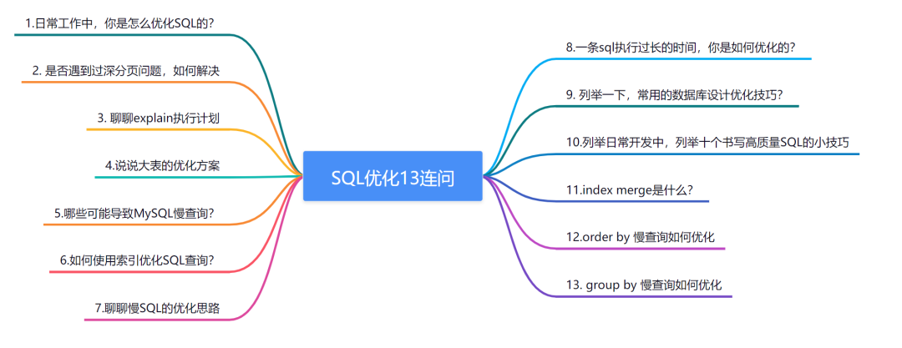
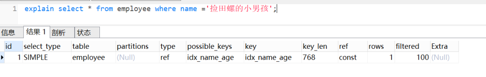
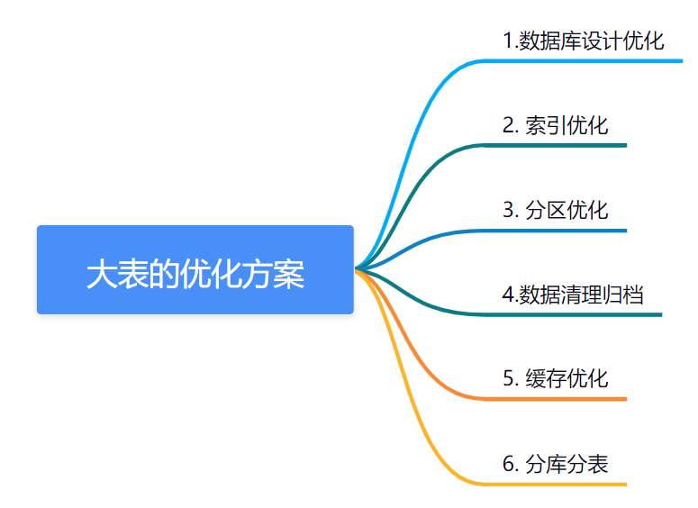
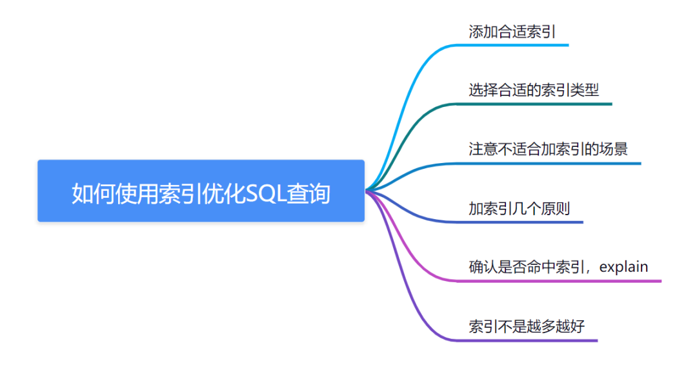
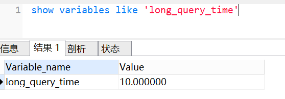
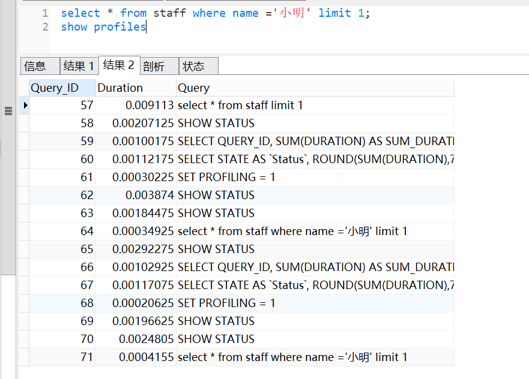
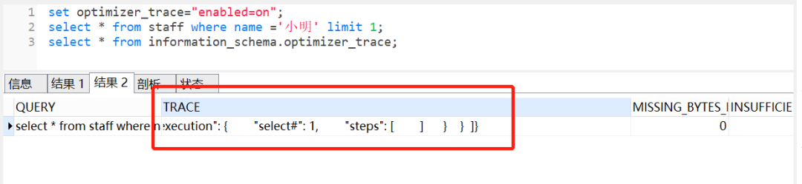
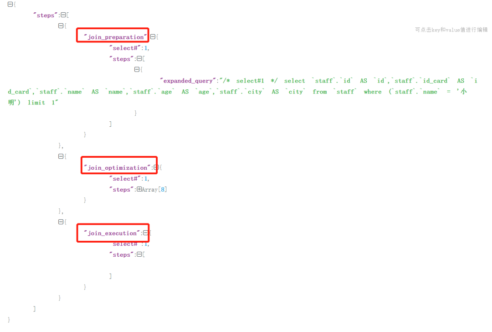

# SQL调优13连问

# SQL调优13连问


## <font style="color:#ffffff;background-color:#ef7060;">1.日常工作中，你是怎么优化SQL的？</font>
大家可以从这几个维度回答这个问题：

+ <font style="color:#010101;">分析慢查询日志</font>
+ <font style="color:#010101;">使用explain查看执行计划</font>
+ <font style="color:#010101;">索引优化</font>
+ <font style="color:#010101;">深分页优化</font>
+ <font style="color:#010101;">避免全表扫描</font>
+ <font style="color:#010101;">避免返回不必要的数据（如</font><font style="color:#ef7060;background-color:#f3f3f4;">select</font><font style="color:#010101;">具体字段而不是</font><font style="color:#ef7060;background-color:#f3f3f4;">select*</font><font style="color:#010101;">）</font>
+ <font style="color:#010101;">使用合适的数据类型（如可以使用</font><font style="color:#ef7060;background-color:#f3f3f4;">int</font><font style="color:#010101;">类型的话，就不要设计为</font><font style="color:#ef7060;background-color:#f3f3f4;">varchar</font><font style="color:#010101;">）</font>
+ <font style="color:#010101;">优化sql结构（如</font><font style="color:#ef7060;background-color:#f3f3f4;">join</font><font style="color:#010101;">优化等等）</font>
+ <font style="color:#010101;">适当分批量进行 (如批量更新、删除)</font>
+ <font style="color:#010101;">定期清理无用的数据</font>
+ <font style="color:#010101;">适当分库分表</font>
+ <font style="color:#010101;">读写分离</font>

## <font style="color:#ffffff;background-color:#ef7060;">2. 是否遇到过深分页问题，如何解决</font>
我们可以通过减少回表次数来优化。一般有**标签记录法**和**延迟关联法**。

**标签记录法**

<font style="background-color:#fff9f9;">就是标记一下上次查询到哪一条了，下次再来查的时候，从该条开始往下扫描。就好像看书一样，上次看到哪里了，你就折叠一下或者夹个书签，下次来看的时候，直接就翻到啦。</font>

假设上一次记录到100000，则SQL可以修改为：

```plsql
select  id,name,balance FROM account where id > 100000 limit 10;
```

这样的话，后面无论翻多少页，性能都会不错的，因为命中了<font style="color:#ef7060;background-color:#f3f3f4;">id</font>索引。但是这种方式有局限性：需要一种类似连续自增的字段。

**延迟关联法**

延迟关联法，就是把条件转移到主键索引树，然后减少回表。假设原生SQL是这样的的，其中<font style="color:#ef7060;background-color:#f3f3f4;">id</font>是主键，<font style="color:#ef7060;background-color:#f3f3f4;">create_time</font>是普通索引

```plsql
select id,name,balance from account where create_time> '2020-09-19' limit 100000,10;
```

使用延迟关联法优化，如下：

```plsql
select  acct1.id,acct1.name,acct1.balance FROM account acct1 INNER JOIN 
(SELECT a.id FROM account a WHERE a.create_time > '2020-09-19' limit 100000, 10) 
AS acct2 on acct1.id= acct2.id;
```

优化思路就是，先通过<font style="color:#ef7060;background-color:#f3f3f4;">idx_create_time</font>二级索引树查询到满足条件的<font style="color:#ef7060;background-color:#f3f3f4;">主键ID</font>，再与原表通过<font style="color:#ef7060;background-color:#f3f3f4;">主键ID</font>内连接，这样后面直接走了主键索引了，同时也减少了回表。

## <font style="color:#ffffff;background-color:#ef7060;">3. 聊聊explain执行计划</font>
当<font style="color:#ef7060;background-color:#f3f3f4;">explain</font>与<font style="color:#ef7060;background-color:#f3f3f4;">SQL</font>一起使用时，MySQL将显示来自优化器的有关语句执行计划的信息。即<font style="color:#ef7060;background-color:#f3f3f4;">MySQL</font>解释了它将如何处理该语句，包括有关如何连接表以及以何种顺序连接表等信息。

一条简单SQL，使用了<font style="color:#ef7060;background-color:#f3f3f4;">explain</font>的效果如下：



一般来说，我们需要重点关注<font style="color:#ef7060;background-color:#f3f3f4;">type、rows、filtered、extra、key</font>。

### 3.1 type
type表示**连接类型**，查看索引执行情况的一个重要指标。以下性能从好到坏依次：<font style="color:#ef7060;background-color:#f3f3f4;">system > const > eq_ref > ref > ref_or_null > index_merge > unique_subquery > index_subquery > range > index > ALL</font>

+ <font style="color:#010101;">system：这种类型要求数据库表中只有一条数据，是</font><font style="color:#ef7060;background-color:#f3f3f4;">const</font><font style="color:#010101;">类型的一个特例，一般情况下是不会出现的。</font>
+ <font style="color:#010101;">const：通过一次索引就能找到数据，一般用于主键或唯一索引作为条件，这类扫描效率极高，，速度非常快。</font>
+ <font style="color:#010101;">eq_ref：常用于主键或唯一索引扫描，一般指使用主键的关联查询</font>
+ <font style="color:#010101;">ref : 常用于非主键和唯一索引扫描。</font>
+ <font style="color:#010101;">ref_or_null：这种连接类型类似于</font><font style="color:#ef7060;background-color:#f3f3f4;">ref</font><font style="color:#010101;">，区别在于</font><font style="color:#ef7060;background-color:#f3f3f4;">MySQL</font><font style="color:#010101;">会额外搜索包含</font><font style="color:#ef7060;background-color:#f3f3f4;">NULL</font><font style="color:#010101;">值的行</font>
+ <font style="color:#010101;">index_merge：使用了索引合并优化方法，查询使用了两个以上的索引。</font>
+ <font style="color:#010101;">unique_subquery：类似于</font><font style="color:#ef7060;background-color:#f3f3f4;">eq_ref</font><font style="color:#010101;">，条件用了</font><font style="color:#ef7060;background-color:#f3f3f4;">in</font><font style="color:#010101;">子查询</font>
+ <font style="color:#010101;">index_subquery：区别于</font><font style="color:#ef7060;background-color:#f3f3f4;">unique_subquery</font><font style="color:#010101;">，用于非唯一索引，可以返回重复值。</font>
+ <font style="color:#010101;">range：常用于范围查询，比如：between ... and 或 In 等操作</font>
+ <font style="color:#010101;">index：全索引扫描</font>
+ <font style="color:#010101;">ALL：全表扫描</font>

### 3.2 rows
该列表示MySQL估算要找到我们所需的记录，需要读取的行数。对于InnoDB表，此数字是估计值，并非一定是个准确值。

### 3.3 filtered
该列是一个百分比的值，表里符合条件的记录数的百分比。简单点说，这个字段表示存储引擎返回的数据在经过过滤后，剩下满足条件的记录数量的比例。

### 3.4 extra
该字段包含有关MySQL如何解析查询的其他信息，它一般会出现这几个值：

+ <font style="color:#010101;">Using filesort：表示按文件排序，一般是在指定的排序和索引排序不一致的情况才会出现。一般见于order by语句</font>
+ <font style="color:#010101;">Using index ：表示是否用了覆盖索引。</font>
+ <font style="color:#010101;">Using temporary: 表示是否使用了临时表,性能特别差，需要重点优化。一般多见于group by语句，或者union语句。</font>
+ <font style="color:#010101;">Using where : 表示使用了where条件过滤.</font>
+ <font style="color:#010101;">Using index condition：MySQL5.6之后新增的索引下推。在存储引擎层进行数据过滤，而不是在服务层过滤，利用索引现有的数据减少回表的数据。</font>

### 3.5 key
该列表示实际用到的索引。一般配合<font style="color:#ef7060;background-color:#f3f3f4;">possible_keys</font>列一起看。

**注意**:有时候，<font style="color:#ef7060;background-color:#f3f3f4;">explain</font>配合<font style="color:#ef7060;background-color:#f3f3f4;">show WARNINGS;</font>（可以查看优化后,最终执行的sql），效果更佳哦。

## <font style="color:#ffffff;background-color:#ef7060;">4.说说大表的优化方案</font>


+ **数据库设计优化**

合理的数据库设计可以极大地提高查询效率。我们在设计大表时，可以考虑**拆分表、使用分区表、添加索引等方式**来优化表结构。同时也要**避免使用大量冗余字段、避免频繁使用join查询**等操作。

+ **索引优化**

对于大表的查询操作，索引优化是非常重要的一环。可以考虑**增加或者修改索引、使用覆盖索引、使用联合索引等方式来提高查询效率**。同时也要注意**定期清理冗余的索引以及对于经常使用的查询语句建立索引**。

+ **分区优化**

将大表按照某个列分成多个分区表，每个分区表的数据量较小，可以提高查询和更新的性能。分区表还可以帮助在维护表结构的同时，减少锁表时间，提高并发处理能力。

+ **数据清理归档**

对于一些历史数据或者无用数据，**可以进行定期归档，避免数据过多造成SQL查询效率降低**。同时也要注意对于大表进行定期的数据备份以及紧急数据恢复的准备工作。

+ **缓存优化**

对于一些经常被查询的数据，可以使用缓存优化。使用<font style="color:#ef7060;background-color:#f3f3f4;">Redis</font>等缓存中间件来缓存常用的数据，以减少查询数据库的次数，提高查询效率。

+ **SQL语句优化**

在编写SQL查询语句时，要尽可能地简单明了，避免复杂的查询语句，同时也要避免一些不必要的查询操作。对于复杂的查询语句，可以使用<font style="color:#ef7060;background-color:#f3f3f4;">Explain</font>执行计划来进行优化。同时也要注意避免使用<font style="color:#ef7060;background-color:#f3f3f4;">OR</font>等耗费性能的操作符。

+ **分库分表**

如果数据量千万级别，需要考虑分库分表哈。分库分表相关知识点，可以看我之前这篇文章哈，[我们为什么要分库分表？](https://mp.weixin.qq.com/s?__biz=Mzg3NzU5NTIwNg==&mid=2247498625&idx=1&sn=0d7bd9d1b46eeff4c715a6761355e9b0&chksm=cf2224a8f855adbea8931c8e011711f6c70cffeef8ddf8b87729c710eacef11b46eef80fda36&token=1627163936&lang=zh_CN&scene=21#wechat_redirect)

## <font style="color:#ffffff;background-color:#ef7060;">5.哪些因素可能导致MySQL慢查询？</font>
慢查询一般有以下这些原因：


大家有兴趣可以看下。我之前写的这篇文章哈：[盘点MySQL慢查询的12个原因](https://mp.weixin.qq.com/s?__biz=Mzg3NzU5NTIwNg==&mid=2247499624&idx=1&sn=561b9cb7fe831ca7cb2d9fd65691e85e&chksm=cf222041f855a957ac50c0a53baaec6d26be32427259b2974450620f33a8c834419fe535e83d&token=767319274&lang=zh_CN&scene=21#wechat_redirect)

## <font style="color:#ffffff;background-color:#ef7060;">6.如何使用索引优化SQL查询？</font>


+ <font style="color:#010101;">添加合适索引（在</font><font style="color:#ef7060;background-color:#f3f3f4;">where、group by、order by</font><font style="color:#010101;">等后面的字段添加合适索引）</font>
+ <font style="color:#010101;">选择合适的索引类型 (</font><font style="color:#ef7060;background-color:#f3f3f4;">B-tree</font><font style="color:#010101;">索引适合范围查询、哈希索引适合等值查询)</font>
+ <font style="color:#010101;">注意不适合加索引的场景（数据量少的表，更新频繁的字段，区分度低的字段）</font>
+ <font style="color:#010101;">加索引的时候，需要考虑覆盖索引，减少回表，</font>**考虑联合索引的最左前缀原则**
+ <font style="color:#ef7060;background-color:#f3f3f4;">explain</font><font style="color:#010101;">查看</font><font style="color:#ef7060;background-color:#f3f3f4;">SQL</font><font style="color:#010101;">的执行计划，确认是否会命中索引。</font>
+ <font style="color:#010101;">注意索引并不是越多越好，</font>**通常建议在单个表中不要超过5个索引**<font style="color:#010101;">。因为索引会占用磁盘空间，索引更新代价高。</font>

## <font style="color:#ffffff;background-color:#ef7060;">7.聊聊慢SQL的优化思路</font>
1. <font style="color:#010101;">查看慢查询日志记录，分析慢SQL</font>
2. <font style="color:#010101;">explain分析SQL的执行计划</font>
3. <font style="color:#010101;">profile 分析执行耗时</font>
4. <font style="color:#010101;">Optimizer Trace分析详情</font>
5. <font style="color:#010101;">确定问题并采用相应的措施</font>

### 7.1 查看慢查询日志记录，分析慢SQL
如何定位慢SQL呢、我们可以通过**slow log**来查看慢<font style="color:#ef7060;background-color:#f3f3f4;">SQL</font>。默认的情况下呢，MySQL数据库是不开启慢查询日志（<font style="color:#ef7060;background-color:#f3f3f4;">slow query log</font>）呢。所以我们需要手动把它打开。

查看下慢查询日志配置，我们可以使用<font style="color:#ef7060;background-color:#f3f3f4;">show variables like 'slow_query_log%'</font>命令，如下：


+ <font style="color:#ef7060;background-color:#f3f3f4;">slow query log</font><font style="color:#010101;">表示慢查询开启的状态</font>
+ <font style="color:#ef7060;background-color:#f3f3f4;">slow_query_log_file</font><font style="color:#010101;">表示慢查询日志存放的位置</font>

我们还可以使用<font style="color:#ef7060;background-color:#f3f3f4;">show variables like 'long_query_time'</font>命令，查看超过多少时间，才记录到慢查询日志，如下：



+ <font style="color:#ef7060;background-color:#f3f3f4;">long_query_time</font><font style="color:#010101;">表示查询超过多少秒才记录到慢查询日志。</font>

**我们可以通过慢查日志，定位那些执行效率较低的SQL语句，重点关注分析。**

### 7.2 explain查看分析SQL的执行计划
当定位出查询效率低的SQL后，可以使用<font style="color:#ef7060;background-color:#f3f3f4;">explain</font>查看<font style="color:#ef7060;background-color:#f3f3f4;">SQL</font>的执行计划。

当<font style="color:#ef7060;background-color:#f3f3f4;">explain</font>与<font style="color:#ef7060;background-color:#f3f3f4;">SQL</font>一起使用时，MySQL将显示来自优化器的有关语句执行计划的信息。即<font style="color:#ef7060;background-color:#f3f3f4;">MySQL</font>解释了它将如何处理该语句，包括有关如何连接表以及以何种顺序连接表等信息。

一条简单SQL，使用了<font style="color:#ef7060;background-color:#f3f3f4;">explain</font>的效果如下：


一般来说，我们需要重点关注<font style="color:#ef7060;background-color:#f3f3f4;">type、rows、filtered、extra、key</font>。

### 7.3 profile 分析执行耗时
<font style="color:#ef7060;background-color:#f3f3f4;">explain</font>只是看到<font style="color:#ef7060;background-color:#f3f3f4;">SQL</font>的预估执行计划，如果要了解<font style="color:#ef7060;background-color:#f3f3f4;">SQL</font>**真正的执行线程状态及消耗的时间**，需要使用<font style="color:#ef7060;background-color:#f3f3f4;">profiling</font>。开启<font style="color:#ef7060;background-color:#f3f3f4;">profiling</font>参数后，后续执行的<font style="color:#ef7060;background-color:#f3f3f4;">SQL</font>语句都会记录其资源开销，包括<font style="color:#ef7060;background-color:#f3f3f4;">IO，上下文切换，CPU，内存</font>等等，我们可以根据这些开销进一步分析当前慢SQL的瓶颈再进一步进行优化。

<font style="color:#ef7060;background-color:#f3f3f4;">profiling</font>默认是关闭，我们可以使用<font style="color:#ef7060;background-color:#f3f3f4;">show variables like '%profil%'</font>查看是否开启，如下：


可以使用<font style="color:#ef7060;background-color:#f3f3f4;">set profiling=ON</font>开启。开启后，可以运行几条SQL，然后使用<font style="color:#ef7060;background-color:#f3f3f4;">show profiles</font>查看一下。



<font style="color:#ef7060;background-color:#f3f3f4;">show profiles</font>会显示最近发给服务器的多条语句，条数由变量<font style="color:#ef7060;background-color:#f3f3f4;">profiling_history_size</font>定义，默认是15。如果我们需要看单独某条SQL的分析，可以<font style="color:#ef7060;background-color:#f3f3f4;">show profile</font>查看最近一条SQL的分析。也可以使用<font style="color:#ef7060;background-color:#f3f3f4;">show profile for query id</font>（其中id就是show profiles中的QUERY_ID）查看具体一条的SQL语句分析。


除了查看profile ，还可以查看cpu和io，如上图。

### 7.4 Optimizer Trace分析详情
profile只能查看到SQL的执行耗时，但是无法看到SQL真正执行的过程信息，即不知道MySQL优化器是如何选择执行计划。这时候，我们可以使用<font style="color:#ef7060;background-color:#f3f3f4;">Optimizer Trace</font>，它可以跟踪执行语句的解析优化执行的全过程。

我们可以使用<font style="color:#ef7060;background-color:#f3f3f4;">set optimizer_trace="enabled=on"</font>打开开关，接着执行要跟踪的SQL，最后执行<font style="color:#ef7060;background-color:#f3f3f4;">select * from information_schema.optimizer_trace</font>跟踪，如下：



大家可以查看分析其执行树，会包括三个阶段：

+ <font style="color:#010101;">join_preparation：准备阶段</font>
+ <font style="color:#010101;">join_optimization：分析阶段</font>
+ <font style="color:#010101;">join_execution：执行阶段</font>



### 7.5 确定问题并采用相应的措施
最后确认问题，就采取对应的措施。

+ <font style="color:#010101;">多数慢SQL都跟索引有关，比如不加索引，索引不生效、不合理等，这时候，我们可以</font>**优化索引**<font style="color:#010101;">。</font>
+ <font style="color:#010101;">我们还可以优化SQL语句，比如一些in元素过多问题（分批），深分页问题（基于上一次数据过滤等），进行时间分段查询</font>
+ <font style="color:#010101;">SQl没办法很好优化，可以改用ES的方式，或者数仓。</font>
+ <font style="color:#010101;">如果单表数据量过大导致慢查询，则可以考虑分库分表</font>
+ <font style="color:#010101;">如果数据库在刷脏页导致慢查询，考虑是否可以优化一些参数，跟DBA讨论优化方案</font>
+ <font style="color:#010101;">如果存量数据量太大，考虑是否可以让部分数据归档</font>

我之前写了一篇文章，有关于导致慢查询的12个原因，大家看一下哈:[盘点MySQL慢查询的12个原因](https://mp.weixin.qq.com/s?__biz=Mzg3NzU5NTIwNg==&mid=2247499624&idx=1&sn=561b9cb7fe831ca7cb2d9fd65691e85e&chksm=cf222041f855a957ac50c0a53baaec6d26be32427259b2974450620f33a8c834419fe535e83d&token=767319274&lang=zh_CN&scene=21#wechat_redirect)

## <font style="color:#ffffff;background-color:#ef7060;">8.一条sql执行过长的时间，你如何优化，从哪些方面入手？</font>
这道面试题，**其实跟慢SQl排查解决有点像**，所以大家回答得时候，可以参考上一小节哈。我们可以从这几个方面入手哈：

+ <font style="color:#010101;">确定瓶颈</font>
+ <font style="color:#010101;">索引优化</font>
+ <font style="color:#010101;">优化SQL语句</font>
+ <font style="color:#010101;">数据库参数优化</font>
+ <font style="color:#010101;">分析锁的情况</font>
+ <font style="color:#010101;">数据库硬件升级</font>

**确定瓶颈**

首先，通过**查看MySQL日志，慢查询日志，explain分析SQL的执行计划，profile 分析执行耗时，Optimizer Trace分析详情**等操作，确定查询执行的瓶颈在哪里。只有确定了瓶颈，才能有针对性地进行优化。

**索引优化**

在确定了瓶颈之后，可以考虑通过增加索引来优化查询效率。可以根据查询语句的条件，增加相应的索引，从而加快查询速度。但是索引也会带来一些负面影响，如占用磁盘空间，降低写入效率等，所以需要根据具体情况权衡。

**优化SQL语句**

有些SQL语句本身可能存在一些问题，如join操作过于频繁，使用了不必要的子查询等，这些都会导致查询效率低下。可以通过优化SQL语句来减少不必要的操作，从而提高查询效率。

**数据库参数优化**

数据库参数也会影响查询效率，可以通过修改数据库参数来优化查询效率，如修改内存缓存大小、修改连接池大小等。不同的数据库参数优化方式不同，需要根据具体情况进行调整。

**分析锁的情况**

查询执行时间过长有可能是由于锁的问题导致的，需要分析查询语句中是否存在锁的问题，如果存在锁的问题，可以考虑增加锁的并发度，从而提高查询效率。

**数据库硬件升级**

如果以上方法都无法解决问题，可以考虑对数据库硬件进行升级，如增加 CPU 数量、加快磁盘读写速度等，从而提高数据库的整体性能。

## <font style="color:#ffffff;background-color:#ef7060;">9. 列举一下，常用的数据库设计优化技巧？</font>
+ <font style="color:#010101;">字段尽量避免使用NULL</font>
+ <font style="color:#010101;">合理选择数据类型</font>
+ <font style="color:#010101;">字段选择合适的长度</font>
+ <font style="color:#010101;">正确使用索引</font>
+ <font style="color:#010101;">尽量少定义text类型</font>
+ <font style="color:#010101;">合理的数据表结构设计</font>
+ <font style="color:#010101;">适当的冗余设计</font>
+ <font style="color:#010101;">优化SQL查询语句</font>
+ <font style="color:#010101;">一张表的字段不宜过多</font>

## <font style="color:#ffffff;background-color:#ef7060;">10.列举日常开发中，列举十个书写高质量SQL的小技巧</font>
1. <font style="color:#010101;">查询SQL尽量不要使用select *，而是select具体字段。</font>
2. <font style="color:#010101;">小表驱动大表</font>
3. <font style="color:#010101;">优化你的like语句</font>
4. <font style="color:#010101;">尽量避免在索引列上使用mysql的内置函数</font>
5. <font style="color:#010101;">如果插入数据过多，考虑批量操作。</font>
6. <font style="color:#010101;">多用limit</font>
7. <font style="color:#010101;">exist & in合理利用</font>
8. <font style="color:#010101;">in元素不要过多</font>
9. <font style="color:#010101;">尽量用union all替换union</font>

大家可以参考我之前这篇文章哈 ：[后端程序员必备：书写高质量SQL的30条建议](https://mp.weixin.qq.com/s?__biz=Mzg3NzU5NTIwNg==&mid=2247487972&idx=1&sn=cd035a7fcd7496658846ab9f914be2db&chksm=cf21cecdf85647dbc53e212bf1a2b95d0eb2bffe08dc0141e01f8a9b2088abffc385a2ef584e&token=1569911403&lang=zh_CN&scene=21#wechat_redirect)

## <font style="color:#ffffff;background-color:#ef7060;">11.index merge了解过嘛？</font>
<font style="color:#ef7060;background-color:#f3f3f4;">index merge</font>是什么？

<font style="background-color:#fff9f9;">在</font><font style="color:#ef7060;background-color:#f3f3f4;">MySQL</font><font style="background-color:#fff9f9;">中，当执行一个查询语句需要使用多个索引时，MySQL可以使用索引合并(</font><font style="color:#ef7060;background-color:#f3f3f4;">Index Merge</font><font style="background-color:#fff9f9;">)来优化查询性能。具体来说，索引合并是将多个单列索引或多个联合索引合并使用，以满足查询语句的需要。</font>

当使用索引合并时，<font style="color:#ef7060;background-color:#f3f3f4;">MySQL</font>会选择最优的索引组合来执行查询，**从而避免了全表扫描和排序操作，提高了查询效率**。而对于使用多个单列索引的查询语句，MySQL也可以使用索引合并来优化查询性能。

大家可以看一个使用<font style="color:#ef7060;background-color:#f3f3f4;">index merge</font>的例子：

假设有一个名为<font style="color:#ef7060;background-color:#f3f3f4;">orders</font>的表，包含<font style="color:#ef7060;background-color:#f3f3f4;">order_id、customer_id、product_id、order_date等字段，其中order_id、customer_id、product_id</font>三个字段都建有索引。

如果要查询<font style="color:#ef7060;background-color:#f3f3f4;">customer_id</font>为<font style="color:#ef7060;background-color:#f3f3f4;">1</font>，<font style="color:#ef7060;background-color:#f3f3f4;">order_date</font>在2022年1月1日到2022年2月1日之间的订单记录，可以使用以下SQL语句：

```plsql
SELECT *
FROM orders
WHERE customer_id = 1
AND order_date >= '2022-01-01'
AND order_date < '2022-02-01'
```

在执行该查询语句时，MySQL可以使用<font style="color:#ef7060;background-color:#f3f3f4;">customer_id</font>索引和<font style="color:#ef7060;background-color:#f3f3f4;">order_date</font>索引来优化查询。如果使用单个索引，则需要扫描整个索引树来匹配查询条件；但如果使用索引合并，则可以先使用<font style="color:#ef7060;background-color:#f3f3f4;">customer_id</font>索引来过滤出符合条件的记录，然后再使用<font style="color:#ef7060;background-color:#f3f3f4;">order_date</font>索引来进一步过滤记录，从而大大减少了扫描的记录数，提高了查询效率。

大家可以使用EXPLAIN关键字可以查看查询计划，确认是否使用了索引合并。例如，执行以下语句：

```plsql
EXPLAIN SELECT *
FROM orders
WHERE customer_id = 1
AND order_date >= '2022-01-01'
AND order_date < '2022-02-01'
```

如果查询计划中出现了<font style="color:#ef7060;background-color:#f3f3f4;">Using index merge</font>的信息，则表示该查询使用了索引合并优化。

## <font style="color:#ffffff;background-color:#ef7060;">12. order by查询效率慢,如何优化.</font>
大家是否还记得<font style="color:#ef7060;background-color:#f3f3f4;">order by</font>查询为什么会慢嘛?

<font style="color:#ef7060;background-color:#f3f3f4;">order by</font>排序，分为全字段排序和<font style="color:#ef7060;background-color:#f3f3f4;">rowid</font>排序。它是拿<font style="color:#ef7060;background-color:#f3f3f4;">max_length_for_sort_data</font>和结果行数据长度对比，如果结果行数据长度超过<font style="color:#ef7060;background-color:#f3f3f4;">max_length_for_sort_data</font>这个值，就会走<font style="color:#ef7060;background-color:#f3f3f4;">rowid</font>排序，相反，则走全字段排序。

<font style="color:#ef7060;background-color:#f3f3f4;">rowid</font>排序，一般需要回表去找满足条件的数据，所以效率会慢一点.如果是<font style="color:#ef7060;background-color:#f3f3f4;">order by</font>排序,可能会借助磁盘文件排序的话，效率就更慢一点.

如何优化<font style="color:#ef7060;background-color:#f3f3f4;">order by</font>的文件排序?

+ <font style="color:#010101;">因为数据是无序的，所以就需要排序。如果数据本身是有序的，那就不会再用到文件排序啦。而索引数据本身是有序的，我们通过建立索引来优化</font><font style="color:#ef7060;background-color:#f3f3f4;">order by</font><font style="color:#010101;">语句。</font>
+ <font style="color:#010101;">我们还可以通过调整</font><font style="color:#ef7060;background-color:#f3f3f4;">max_length_for_sort_data、sort_buffer_size</font><font style="color:#010101;">等参数优化；</font>

大家忘记<font style="color:#ef7060;background-color:#f3f3f4;">order by</font>的话,可以看我之前的这篇文章哈:[看一遍就理解：order by详解](https://mp.weixin.qq.com/s?__biz=Mzg3NzU5NTIwNg==&mid=2247490571&idx=1&sn=e8638573ec8d720fd25da5b2b0d90ed2&scene=21#wechat_redirect)

## <font style="color:#ffffff;background-color:#ef7060;">13. group by 查询慢的话,如何优化呀.</font>
<font style="color:#ef7060;background-color:#f3f3f4;">group by</font>一般用于分组统计，它表达的逻辑就是根据一定的规则，进行分组。日常开发中，我们使用得比较频繁。如果不注意，很容易产生慢<font style="color:#ef7060;background-color:#f3f3f4;">SQL</font>。

<font style="color:#ef7060;background-color:#f3f3f4;">group by</font>可能会慢在哪里？**因为它既用到临时表，又默认用到排序。有时候还可能用到磁盘临时表。**

+ <font style="color:#010101;">如果执行过程中，会发现内存临时表大小到达了上限（控制这个上限的参数就是</font><font style="color:#ef7060;background-color:#f3f3f4;">tmp_table_size</font><font style="color:#010101;">），会把内存临时表转成磁盘临时表。</font>
+ <font style="color:#010101;">如果数据量很大，很可能这个查询需要的磁盘临时表，就会占用大量的磁盘空间。</font>

如何优化group by呢?

+ <font style="color:#010101;">group by 后面的字段加索引</font>
+ <font style="color:#010101;">order by null 不用排序</font>
+ <font style="color:#010101;">尽量只使用内存临时表</font>
+ <font style="color:#010101;">使用SQL_BIG_RESULT</font>

大家可以看下我这篇文章哈：[看一遍就理解：group by详解](https://mp.weixin.qq.com/s?__biz=Mzg3NzU5NTIwNg==&mid=2247497527&idx=1&sn=1f30251d88b0e935bfffc3e8eaf53f28&chksm=cf22281ef855a1084fe84a7b257db5734c7b982c6ddaf9ef497d4e31e60faebd5f329e3c55a6&token=370993980&lang=zh_CN&scene=21#wechat_redirect)


> 更新: 2024-02-08 22:19:51  
原文: [https://www.yuque.com/vip6688/neho4x/adkcym43o7l2elde](https://www.yuque.com/vip6688/neho4x/adkcym43o7l2elde)
>


> 更新: 2024-11-25 09:43:51  
> 原文: <https://www.yuque.com/neumx/laxg2e/d8b912d85466bba8aae6fc05606a1135>