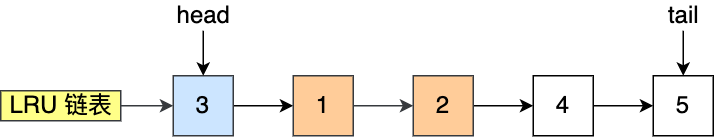
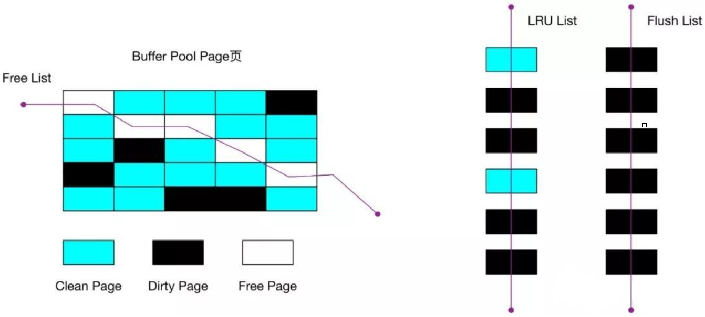
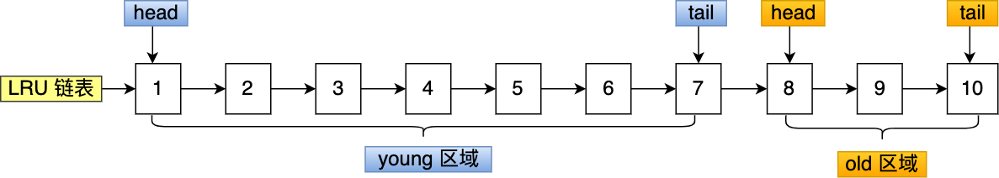

# 揭开BufferPool的面纱

# 揭开 Buffer Pool 的面纱
### <font style="color:rgb(44, 62, 80);">如何管理空闲页？</font>
<font style="color:rgb(44, 62, 80);">Buffer Pool 是一片连续的内存空间，当 MySQL 运行一段时间后，这片连续的内存空间中的缓存页既有空闲的，也有被使用的。</font>

<font style="color:rgb(44, 62, 80);">那当我们从磁盘读取数据的时候，总不能通过遍历这一片连续的内存空间来找到空闲的缓存页吧，这样效率太低了。</font>

<font style="color:rgb(44, 62, 80);">所以，为了能够快速找到空闲的缓存页，可以使用链表结构，将空闲缓存页的「控制块」作为链表的节点，这个链表称为</font><font style="color:rgb(44, 62, 80);"> </font>**<font style="color:rgb(48, 79, 254);">Free 链表</font>**<font style="color:rgb(44, 62, 80);">（空闲链表）。</font>


<font style="color:rgb(44, 62, 80);">Free 链表上除了有控制块，还有一个头节点，该头节点包含链表的头节点地址，尾节点地址，以及当前链表中节点的数量等信息。</font>

<font style="color:rgb(44, 62, 80);">Free 链表节点是一个一个的控制块，而每个控制块包含着对应缓存页的地址，所以相当于 Free 链表节点都对应一个空闲的缓存页。</font>

<font style="color:rgb(44, 62, 80);">有了 Free 链表后，每当需要从磁盘中加载一个页到 Buffer Pool 中时，就从 Free链表中取一个空闲的缓存页，并且把该缓存页对应的控制块的信息填上，然后把该缓存页对应的控制块从 Free 链表中移除。</font>

### [](https://xiaolincoding.com/mysql/buffer_pool/buffer_pool.html#%E5%A6%82%E4%BD%95%E7%AE%A1%E7%90%86%E8%84%8F%E9%A1%B5)<font style="color:rgb(44, 62, 80);">如何管理脏页？</font>
<font style="color:rgb(44, 62, 80);">设计 Buffer Pool 除了能提高读性能，还能提高写性能，也就是更新数据的时候，不需要每次都要写入磁盘，而是将 Buffer Pool 对应的缓存页标记为</font>**<font style="color:rgb(48, 79, 254);">脏页</font>**<font style="color:rgb(44, 62, 80);">，然后再由后台线程将脏页写入到磁盘。</font>

<font style="color:rgb(44, 62, 80);">那为了能快速知道哪些缓存页是脏的，于是就设计出</font><font style="color:rgb(44, 62, 80);"> </font>**<font style="color:rgb(48, 79, 254);">Flush 链表</font>**<font style="color:rgb(44, 62, 80);">，它跟 Free 链表类似的，链表的节点也是控制块，区别在于 Flush 链表的元素都是脏页。</font>


<font style="color:rgb(44, 62, 80);">有了 Flush 链表后，后台线程就可以遍历 Flush 链表，将脏页写入到磁盘。</font>

### [](https://xiaolincoding.com/mysql/buffer_pool/buffer_pool.html#%E5%A6%82%E4%BD%95%E6%8F%90%E9%AB%98%E7%BC%93%E5%AD%98%E5%91%BD%E4%B8%AD%E7%8E%87)<font style="color:rgb(44, 62, 80);">如何提高缓存命中率？</font>
<font style="color:rgb(44, 62, 80);">Buffer Pool 的大小是有限的，对于一些频繁访问的数据我们希望可以一直留在 Buffer Pool 中，而一些很少访问的数据希望可以在某些时机可以淘汰掉，从而保证 Buffer Pool 不会因为满了而导致无法再缓存新的数据，同时还能保证常用数据留在 Buffer Pool 中。</font>

<font style="color:rgb(44, 62, 80);">要实现这个，最容易想到的就是 LRU（Least recently used）算法。</font>

<font style="color:rgb(44, 62, 80);">该算法的思路是，链表头部的节点是最近使用的，而链表末尾的节点是最久没被使用的。那么，当空间不够了，就淘汰最久没被使用的节点，从而腾出空间。</font>

<font style="color:rgb(44, 62, 80);">简单的 LRU 算法的实现思路是这样的：</font>

+ <font style="color:rgb(44, 62, 80);">当访问的页在 Buffer Pool 里，就直接把该页对应的 LRU 链表节点移动到链表的头部。</font>
+ <font style="color:rgb(44, 62, 80);">当访问的页不在 Buffer Pool 里，除了要把页放入到 LRU 链表的头部，还要淘汰 LRU 链表末尾的节点。</font>

<font style="color:rgb(44, 62, 80);">比如下图，假设 LRU 链表长度为 5，LRU 链表从左到右有 1，2，3，4，5 的页。</font>


<font style="color:rgb(44, 62, 80);">如果访问了 3 号的页，因为 3 号页在 Buffer Pool 里，所以把 3 号页移动到头部即可。</font>



<font style="color:rgb(44, 62, 80);">而如果接下来，访问了 8 号页，因为 8 号页不在 Buffer Pool 里，所以需要先淘汰末尾的 5 号页，然后再将 8 号页加入到头部。</font>


<font style="color:rgb(44, 62, 80);">到这里我们可以知道，Buffer Pool 里有三种页和链表来管理数据。</font>



<font style="color:rgb(44, 62, 80);">图中：</font>

+ <font style="color:rgb(44, 62, 80);">Free Page（空闲页），表示此页未被使用，位于 Free 链表；</font>
+ <font style="color:rgb(44, 62, 80);">Clean Page（干净页），表示此页已被使用，但是页面未发生修改，位于LRU 链表。</font>
+ <font style="color:rgb(44, 62, 80);">Dirty Page（脏页），表示此页「已被使用」且「已经被修改」，其数据和磁盘上的数据已经不一致。当脏页上的数据写入磁盘后，内存数据和磁盘数据一致，那么该页就变成了干净页。脏页同时存在于 LRU 链表和 Flush 链表。</font>

<font style="color:rgb(44, 62, 80);">简单的 LRU 算法并没有被 MySQL 使用，因为简单的 LRU 算法无法避免下面这两个问题：</font>

+ <font style="color:rgb(44, 62, 80);">预读失效；</font>
+ <font style="color:rgb(44, 62, 80);">Buffer Pool 污染；</font>

<font style="color:rgb(44, 62, 80);background-color:rgb(227, 242, 253);">什么是预读失效？</font>

<font style="color:rgb(44, 62, 80);">先来说说 MySQL 的预读机制。程序是有空间局部性的，靠近当前被访问数据的数据，在未来很大概率会被访问到。</font>

<font style="color:rgb(44, 62, 80);">所以，MySQL 在加载数据页时，会提前把它相邻的数据页一并加载进来，目的是为了减少磁盘 IO。</font>

<font style="color:rgb(44, 62, 80);">但是可能这些</font>**<font style="color:rgb(48, 79, 254);">被提前加载进来的数据页，并没有被访问</font>**<font style="color:rgb(44, 62, 80);">，相当于这个预读是白做了，这个就是</font>**<font style="color:rgb(48, 79, 254);">预读失效</font>**<font style="color:rgb(44, 62, 80);">。</font>

<font style="color:rgb(44, 62, 80);">如果使用简单的 LRU 算法，就会把预读页放到 LRU 链表头部，而当 Buffer Pool空间不够的时候，还需要把末尾的页淘汰掉。</font>

<font style="color:rgb(44, 62, 80);">如果这些预读页如果一直不会被访问到，就会出现一个很奇怪的问题，不会被访问的预读页却占用了 LRU 链表前排的位置，而末尾淘汰的页，可能是频繁访问的页，这样就大大降低了缓存命中率。</font>

<font style="color:rgb(44, 62, 80);background-color:rgb(227, 242, 253);">怎么解决预读失效而导致缓存命中率降低的问题？</font>

<font style="color:rgb(44, 62, 80);">我们不能因为害怕预读失效，而将预读机制去掉，大部分情况下，局部性原理还是成立的。</font>

<font style="color:rgb(44, 62, 80);">要避免预读失效带来影响，最好就是</font>**<font style="color:rgb(48, 79, 254);">让预读的页停留在 Buffer Pool 里的时间要尽可能的短，让真正被访问的页才移动到 LRU 链表的头部，从而保证真正被读取的热数据留在 Buffer Pool 里的时间尽可能长</font>**<font style="color:rgb(44, 62, 80);">。</font>

<font style="color:rgb(44, 62, 80);">那到底怎么才能避免呢？</font>

<font style="color:rgb(44, 62, 80);">MySQL 是这样做的，它改进了 LRU 算法，将 LRU 划分了 2 个区域：</font>**<font style="color:rgb(48, 79, 254);">old 区域 和 young 区域</font>**<font style="color:rgb(44, 62, 80);">。</font>

<font style="color:rgb(44, 62, 80);">young 区域在 LRU 链表的前半部分，old 区域则是在后半部分，如下图：</font>


<font style="color:rgb(44, 62, 80);">old 区域占整个 LRU 链表长度的比例可以通过</font><font style="color:rgb(44, 62, 80);"> </font><font style="color:rgb(71, 101, 130);">innodb_old_blocks_pct</font><font style="color:rgb(44, 62, 80);"> </font><font style="color:rgb(44, 62, 80);">参数来设置，默认是 37，代表整个 LRU 链表中 young 区域与 old 区域比例是 63:37。</font>

**<font style="color:rgb(48, 79, 254);">划分这两个区域后，预读的页就只需要加入到 old 区域的头部，当页被真正访问的时候，才将页插入 young 区域的头部</font>**<font style="color:rgb(44, 62, 80);">。如果预读的页一直没有被访问，就会从 old 区域移除，这样就不会影响 young 区域中的热点数据。</font>

<font style="color:rgb(44, 62, 80);">接下来，给大家举个例子。</font>

<font style="color:rgb(44, 62, 80);">假设有一个长度为 10 的 LRU 链表，其中 young 区域占比 70 %，old 区域占比 30 %。</font>



<font style="color:rgb(44, 62, 80);">现在有个编号为 20 的页被预读了，这个页只会被插入到 old 区域头部，而 old 区域末尾的页（10号）会被淘汰掉。</font>


<font style="color:rgb(44, 62, 80);">如果 20 号页一直不会被访问，它也没有占用到 young 区域的位置，而且还会比 young 区域的数据更早被淘汰出去。</font>

<font style="color:rgb(44, 62, 80);">如果 20 号页被预读后，立刻被访问了，那么就会将它插入到 young 区域的头部，young 区域末尾的页（7号），会被挤到 old 区域，作为 old 区域的头部，这个过程并不会有页被淘汰。</font>


<font style="color:rgb(44, 62, 80);">虽然通过划分 old 区域 和 young 区域避免了预读失效带来的影响，但是还有个问题无法解决，那就是 Buffer Pool 污染的问题。</font>

<font style="color:rgb(44, 62, 80);background-color:rgb(227, 242, 253);">什么是 Buffer Pool 污染？</font>

<font style="color:rgb(44, 62, 80);">当某一个 SQL 语句</font>**<font style="color:rgb(48, 79, 254);">扫描了大量的数据</font>**<font style="color:rgb(44, 62, 80);">时，在 Buffer Pool 空间比较有限的情况下，可能会将</font><font style="color:rgb(44, 62, 80);"> </font>**<font style="color:rgb(48, 79, 254);">Buffer Pool 里的所有页都替换出去，导致大量热数据被淘汰了</font>**<font style="color:rgb(44, 62, 80);">，等这些热数据又被再次访问的时候，由于缓存未命中，就会产生大量的磁盘 IO，MySQL 性能就会急剧下降，这个过程被称为</font><font style="color:rgb(44, 62, 80);"> </font>**<font style="color:rgb(48, 79, 254);">Buffer Pool 污染</font>**<font style="color:rgb(44, 62, 80);">。</font>

<font style="color:rgb(44, 62, 80);">注意， Buffer Pool 污染并不只是查询语句查询出了大量的数据才出现的问题，即使查询出来的结果集很小，也会造成 Buffer Pool 污染。</font>

<font style="color:rgb(44, 62, 80);">比如，在一个数据量非常大的表，执行了这条语句：</font>


```sql
select * from t_user where name like "%xiaolin%";
```

<font style="color:rgb(44, 62, 80);">可能这个查询出来的结果就几条记录，但是由于这条语句会发生索引失效，所以这个查询过程是全表扫描的，接着会发生如下的过程：</font>

+ <font style="color:rgb(44, 62, 80);">从磁盘读到的页加入到 LRU 链表的 old 区域头部；</font>
+ <font style="color:rgb(44, 62, 80);">当从页里读取行记录时，也就是页被访问的时候，就要将该页放到 young 区域头部；</font>
+ <font style="color:rgb(44, 62, 80);">接下来拿行记录的 name 字段和字符串 xiaolin 进行模糊匹配，如果符合条件，就加入到结果集里；</font>
+ <font style="color:rgb(44, 62, 80);">如此往复，直到扫描完表中的所有记录。</font>

<font style="color:rgb(44, 62, 80);">经过这一番折腾，原本 young 区域的热点数据都会被替换掉。</font>

<font style="color:rgb(44, 62, 80);">举个例子，假设需要批量扫描：21，22，23，24，25 这五个页，这些页都会被逐一访问（读取页里的记录）。</font>


<font style="color:rgb(44, 62, 80);">在批量访问这些数据的时候，会被逐一插入到 young 区域头部。</font>


<font style="color:rgb(44, 62, 80);">可以看到，原本在 young 区域的热点数据 6 和 7 号页都被淘汰了，这就是 Buffer Pool 污染的问题。</font>

<font style="color:rgb(44, 62, 80);background-color:rgb(227, 242, 253);">怎么解决出现 Buffer Pool 污染而导致缓存命中率下降的问题？</font>

<font style="color:rgb(44, 62, 80);">像前面这种全表扫描的查询，很多缓冲页其实只会被访问一次，但是它却只因为被访问了一次而进入到 young 区域，从而导致热点数据被替换了。</font>

<font style="color:rgb(44, 62, 80);">LRU 链表中 young 区域就是热点数据，只要我们提高进入到 young 区域的门槛，就能有效地保证 young 区域里的热点数据不会被替换掉。</font>

<font style="color:rgb(44, 62, 80);">MySQL 是这样做的，进入到 young 区域条件增加了一个</font>**<font style="color:rgb(48, 79, 254);">停留在 old 区域的时间判断</font>**<font style="color:rgb(44, 62, 80);">。</font>

<font style="color:rgb(44, 62, 80);">具体是这样做的，在对某个处在 old 区域的缓存页进行第一次访问时，就在它对应的控制块中记录下来这个访问时间：</font>

+ <font style="color:rgb(44, 62, 80);">如果后续的访问时间与第一次访问的时间</font>**<font style="color:rgb(48, 79, 254);">在某个时间间隔内</font>**<font style="color:rgb(44, 62, 80);">，那么</font>**<font style="color:rgb(48, 79, 254);">该缓存页就不会被从 old 区域移动到 young 区域的头部</font>**<font style="color:rgb(44, 62, 80);">；</font>
+ <font style="color:rgb(44, 62, 80);">如果后续的访问时间与第一次访问的时间</font>**<font style="color:rgb(48, 79, 254);">不在某个时间间隔内</font>**<font style="color:rgb(44, 62, 80);">，那么</font>**<font style="color:rgb(48, 79, 254);">该缓存页移动到 young 区域的头部</font>**<font style="color:rgb(44, 62, 80);">；</font>

<font style="color:rgb(44, 62, 80);">这个间隔时间是由</font><font style="color:rgb(44, 62, 80);"> </font><font style="color:rgb(71, 101, 130);">innodb_old_blocks_time</font><font style="color:rgb(44, 62, 80);"> </font><font style="color:rgb(44, 62, 80);">控制的，默认是 1000 ms。</font>

<font style="color:rgb(44, 62, 80);">也就说，</font>**<font style="color:rgb(48, 79, 254);">只有同时满足「被访问」与「在 old 区域停留时间超过 1 秒」两个条件，才会被插入到 young 区域头部</font>**<font style="color:rgb(44, 62, 80);">，这样就解决了 Buffer Pool 污染的问题 。</font>

<font style="color:rgb(44, 62, 80);">另外，MySQL 针对 young 区域其实做了一个优化，为了防止 young 区域节点频繁移动到头部。young 区域前面 1/4 被访问不会移动到链表头部，只有后面的 3/4被访问了才会。</font>

### [](https://xiaolincoding.com/mysql/buffer_pool/buffer_pool.html#%E8%84%8F%E9%A1%B5%E4%BB%80%E4%B9%88%E6%97%B6%E5%80%99%E4%BC%9A%E8%A2%AB%E5%88%B7%E5%85%A5%E7%A3%81%E7%9B%98)<font style="color:rgb(44, 62, 80);">脏页什么时候会被刷入磁盘？</font>
<font style="color:rgb(44, 62, 80);">引入了 Buffer Pool 后，当修改数据时，首先是修改 Buffer Pool 中数据所在的页，然后将其页设置为脏页，但是磁盘中还是原数据。</font>

<font style="color:rgb(44, 62, 80);">因此，脏页需要被刷入磁盘，保证缓存和磁盘数据一致，但是若每次修改数据都刷入磁盘，则性能会很差，因此一般都会在一定时机进行批量刷盘。</font>

<font style="color:rgb(44, 62, 80);">可能大家担心，如果在脏页还没有来得及刷入到磁盘时，MySQL 宕机了，不就丢失数据了吗？</font>

<font style="color:rgb(44, 62, 80);">这个不用担心，InnoDB 的更新操作采用的是 Write Ahead Log 策略，即先写日志，再写入磁盘，通过 redo log 日志让 MySQL 拥有了崩溃恢复能力。</font>

<font style="color:rgb(44, 62, 80);">下面几种情况会触发脏页的刷新：</font>

+ <font style="color:rgb(44, 62, 80);">当 redo log 日志满了的情况下，会主动触发脏页刷新到磁盘；</font>
+ <font style="color:rgb(44, 62, 80);">Buffer Pool 空间不足时，需要将一部分数据页淘汰掉，如果淘汰的是脏页，需要先将脏页同步到磁盘；</font>
+ <font style="color:rgb(44, 62, 80);">MySQL 认为空闲时，后台线程会定期将适量的脏页刷入到磁盘；</font>
+ <font style="color:rgb(44, 62, 80);">MySQL 正常关闭之前，会把所有的脏页刷入到磁盘；</font>

<font style="color:rgb(44, 62, 80);">在我们开启了慢 SQL 监控后，如果你发现**「偶尔」会出现一些用时稍长的 SQL**，这可能是因为脏页在刷新到磁盘时可能会给数据库带来性能开销，导致数据库操作抖动。</font>

<font style="color:rgb(44, 62, 80);">如果间断出现这种现象，就需要调大 Buffer Pool 空间或 redo log 日志的大小。</font>

## [](https://xiaolincoding.com/mysql/buffer_pool/buffer_pool.html#%E6%80%BB%E7%BB%93)<font style="color:rgb(44, 62, 80);">总结</font>
<font style="color:rgb(44, 62, 80);">Innodb 存储引擎设计了一个</font>**<font style="color:rgb(48, 79, 254);">缓冲池（</font>**_**<font style="color:rgb(200, 73, 255);">Buffer Pool</font>**_**<font style="color:rgb(48, 79, 254);">）</font>**<font style="color:rgb(44, 62, 80);">，来提高数据库的读写性能。</font>

<font style="color:rgb(44, 62, 80);">Buffer Pool 以页为单位缓冲数据，可以通过</font><font style="color:rgb(44, 62, 80);"> </font><font style="color:rgb(71, 101, 130);">innodb_buffer_pool_size</font><font style="color:rgb(44, 62, 80);"> </font><font style="color:rgb(44, 62, 80);">参数调整缓冲池的大小，默认是 128 M。</font>

<font style="color:rgb(44, 62, 80);">Innodb 通过三种链表来管理缓页：</font>

+ <font style="color:rgb(44, 62, 80);">Free List （空闲页链表），管理空闲页；</font>
+ <font style="color:rgb(44, 62, 80);">Flush List （脏页链表），管理脏页；</font>
+ <font style="color:rgb(44, 62, 80);">LRU List，管理脏页+干净页，将最近且经常查询的数据缓存在其中，而不常查询的数据就淘汰出去。；</font>

<font style="color:rgb(44, 62, 80);">InnoDB 对 LRU 做了一些优化，我们熟悉的 LRU 算法通常是将最近查询的数据放到 LRU 链表的头部，而 InnoDB 做 2 点优化：</font>

+ <font style="color:rgb(44, 62, 80);">将 LRU 链表 分为</font>**<font style="color:rgb(48, 79, 254);">young 和 old 两个区域</font>**<font style="color:rgb(44, 62, 80);">，加入缓冲池的页，优先插入 old 区域；页被访问时，才进入 young 区域，目的是为了解决预读失效的问题。</font>
+ <font style="color:rgb(44, 62, 80);">当**「页被访问」且「 old 区域停留时间超过</font><font style="color:rgb(44, 62, 80);"> </font><font style="color:rgb(71, 101, 130);">innodb_old_blocks_time</font><font style="color:rgb(44, 62, 80);"> </font><font style="color:rgb(44, 62, 80);">阈值（默认为1秒）」**时，才会将页插入到 young 区域，否则还是插入到 old 区域，目的是为了解决批量数据访问，大量热数据淘汰的问题。</font>

<font style="color:rgb(44, 62, 80);">可以通过调整</font><font style="color:rgb(44, 62, 80);"> </font><font style="color:rgb(71, 101, 130);">innodb_old_blocks_pct</font><font style="color:rgb(44, 62, 80);"> </font><font style="color:rgb(44, 62, 80);">参数，设置 young 区域和 old 区域比例。</font>

<font style="color:rgb(44, 62, 80);">在开启了慢 SQL 监控后，如果你发现「偶尔」会出现一些用时稍长的 SQL，这可因为脏页在刷新到磁盘时导致数据库性能抖动。如果在很短的时间出现这种现象，就需要调大 Buffer Pool 空间或 redo log 日志的大小。</font>


> 更新: 2024-01-02 19:22:10  
原文: [https://www.yuque.com/vip6688/neho4x/mu30ta1s8t9lh1sz](https://www.yuque.com/vip6688/neho4x/mu30ta1s8t9lh1sz)
>


> 更新: 2024-11-25 09:20:26  
> 原文: <https://www.yuque.com/neumx/laxg2e/c4ca37d1e508233308897febf8c8a3d5>