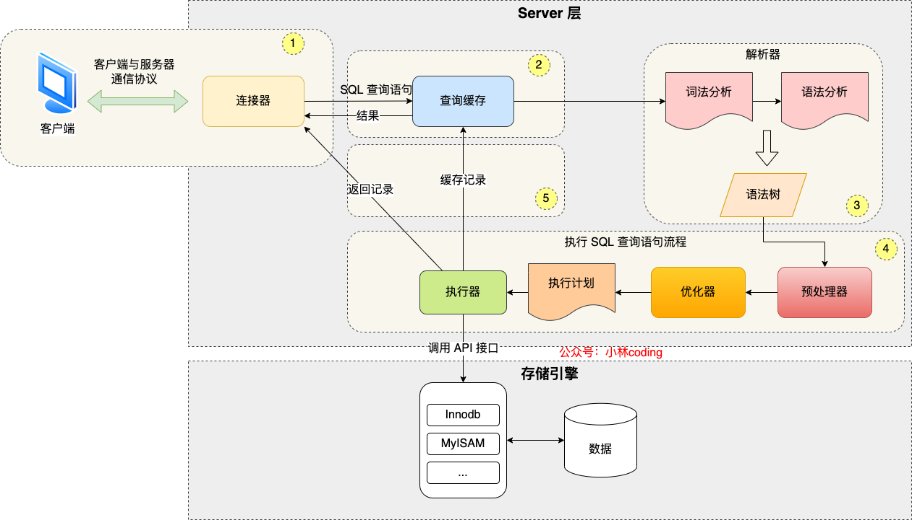
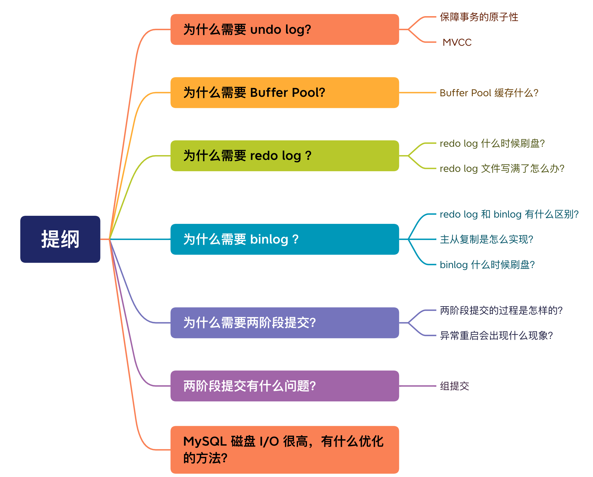
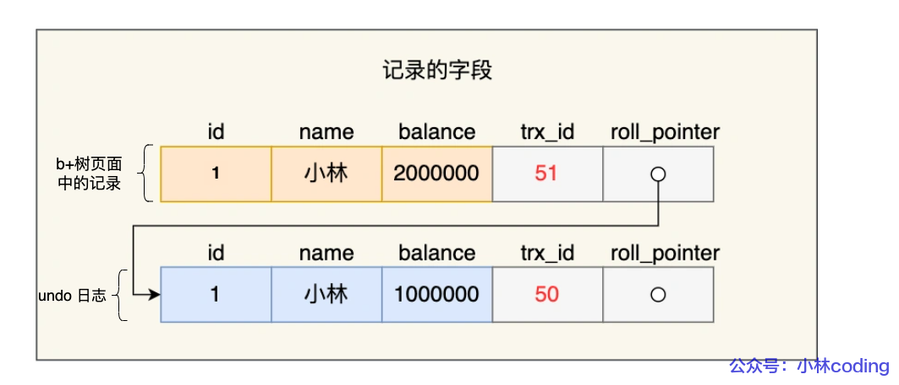
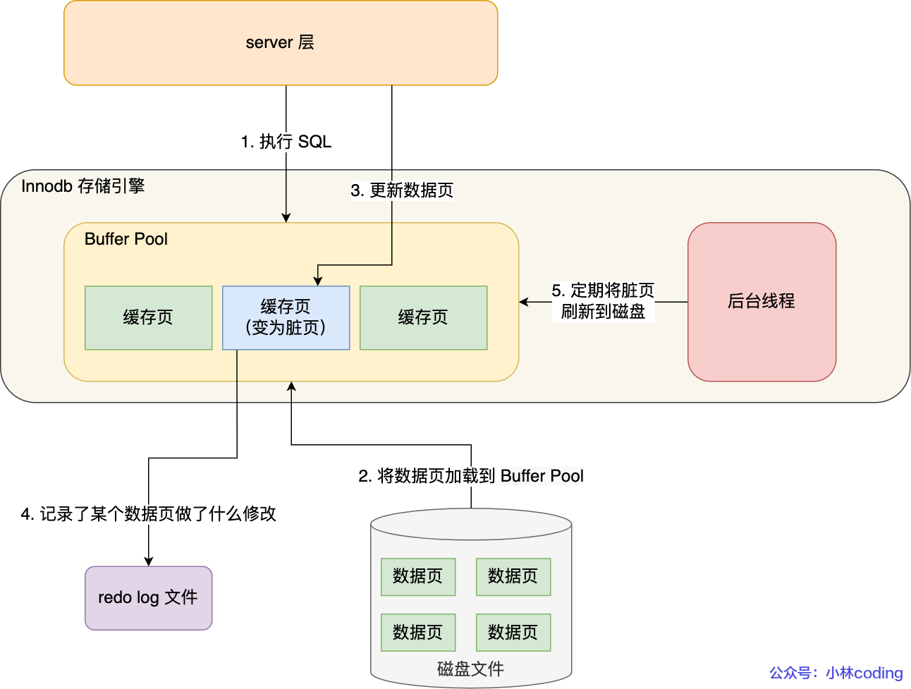
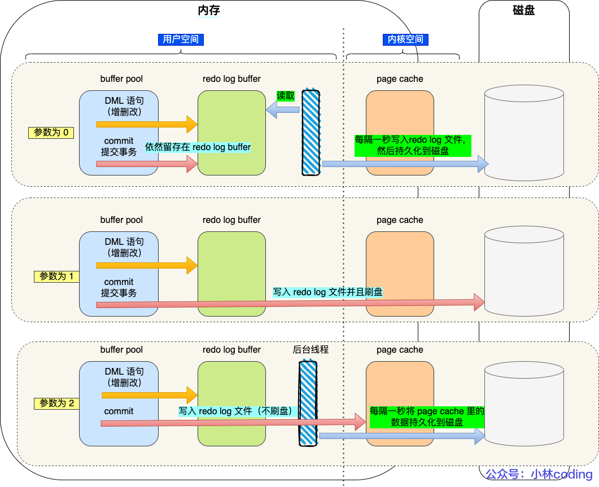
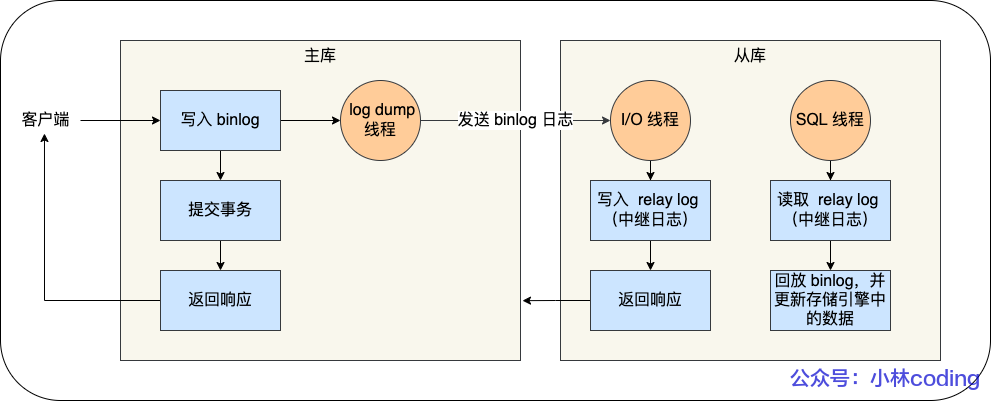
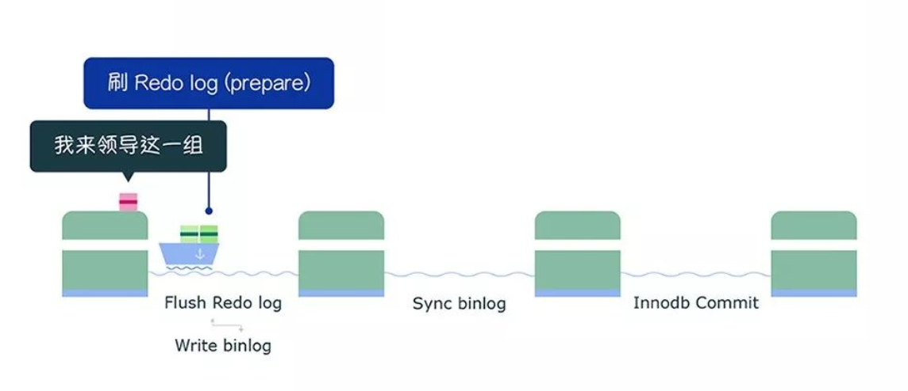
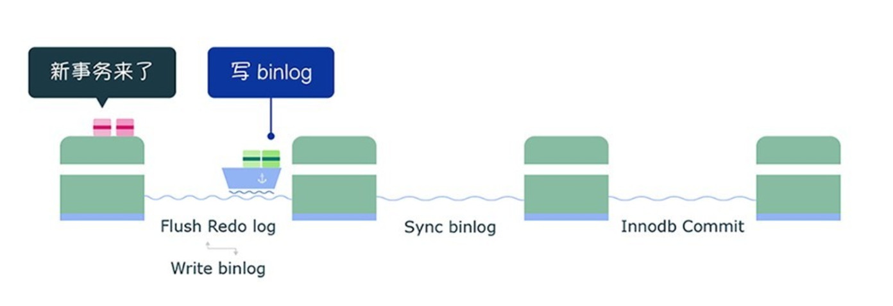
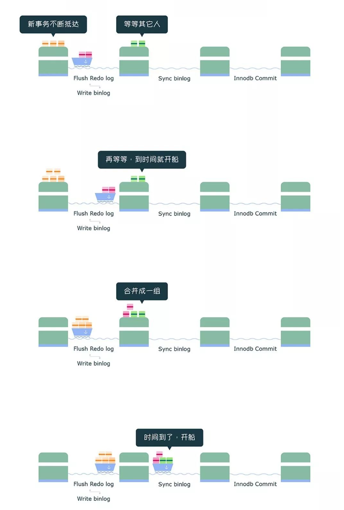

# MySQL日志：undolog、redolog、binlog有什么用？

# MySQL 日志：undo log、redo log、binlog 有什么用？
<font style="color:rgb(44, 62, 80);">从这篇</font>[执行一条 select 语句，期间发生了什么？](https://www.yuque.com/vip6688/neho4x/fx02r7l0l836iic9)<font style="color:rgb(44, 62, 80);">中，我们知道了一条查询语句经历的过程，这属于「读」一条记录的过程，如下图：</font>



<font style="color:rgb(44, 62, 80);">那么，</font>**<font style="color:rgb(48, 79, 254);">执行一条 update 语句，期间发生了什么？</font>**<font style="color:rgb(44, 62, 80);">，比如这一条 update 语句：</font>


```sql
UPDATE t_user SET name = 'xiaolin' WHERE id = 1;
```

<font style="color:rgb(44, 62, 80);">查询语句的那一套流程，更新语句也是同样会走一遍：</font>

+ <font style="color:rgb(44, 62, 80);">客户端先通过连接器建立连接，连接器自会判断用户身份；</font>
+ <font style="color:rgb(44, 62, 80);">因为这是一条 update 语句，所以不需要经过查询缓存，但是表上有更新语句，是会把整个表的查询缓存清空的，所以说查询缓存很鸡肋，在 MySQL 8.0 就被移除这个功能了；</font>
+ <font style="color:rgb(44, 62, 80);">解析器会通过词法分析识别出关键字 update，表名等等，构建出语法树，接着还会做语法分析，判断输入的语句是否符合 MySQL 语法；</font>
+ <font style="color:rgb(44, 62, 80);">预处理器会判断表和字段是否存在；</font>
+ <font style="color:rgb(44, 62, 80);">优化器确定执行计划，因为 where 条件中的 id 是主键索引，所以决定要使用 id 这个索引；</font>
+ <font style="color:rgb(44, 62, 80);">执行器负责具体执行，找到这一行，然后更新。</font>

<font style="color:rgb(44, 62, 80);">不过，更新语句的流程会涉及到 undo log（回滚日志）、redo log（重做日志） 、binlog （归档日志）这三种日志：</font>

+ **<font style="color:rgb(48, 79, 254);">undo log（回滚日志）</font>**<font style="color:rgb(44, 62, 80);">：是 Innodb 存储引擎层生成的日志，实现了事务中的</font>**<font style="color:rgb(48, 79, 254);">原子性</font>**<font style="color:rgb(44, 62, 80);">，主要</font>**<font style="color:rgb(48, 79, 254);">用于事务回滚和 MVCC</font>**<font style="color:rgb(44, 62, 80);">。</font>
+ **<font style="color:rgb(48, 79, 254);">redo log（重做日志）</font>**<font style="color:rgb(44, 62, 80);">：是 Innodb 存储引擎层生成的日志，实现了事务中的</font>**<font style="color:rgb(48, 79, 254);">持久性</font>**<font style="color:rgb(44, 62, 80);">，主要</font>**<font style="color:rgb(48, 79, 254);">用于掉电等故障恢复</font>**<font style="color:rgb(44, 62, 80);">；</font>
+ **<font style="color:rgb(48, 79, 254);">binlog （归档日志）</font>**<font style="color:rgb(44, 62, 80);">：是 Server 层生成的日志，主要</font>**<font style="color:rgb(48, 79, 254);">用于数据备份和主从复制</font>**<font style="color:rgb(44, 62, 80);">；</font>

<font style="color:rgb(44, 62, 80);">所以这次就带着这个问题，看看这三种日志是怎么工作的。</font>



## [](https://xiaolincoding.com/mysql/log/how_update.html#%E4%B8%BA%E4%BB%80%E4%B9%88%E9%9C%80%E8%A6%81-undo-log)<font style="color:rgb(44, 62, 80);">为什么需要 undo log？</font>
<font style="color:rgb(44, 62, 80);">我们在执行执行一条“增删改”语句的时候，虽然没有输入 begin 开启事务和 commit 提交事务，但是 MySQL 会</font>**<font style="color:rgb(48, 79, 254);">隐式开启事务</font>**<font style="color:rgb(44, 62, 80);">来执行“增删改”语句的，执行完就自动提交事务的，这样就保证了执行完“增删改”语句后，我们可以及时在数据库表看到“增删改”的结果了。</font>

<font style="color:rgb(44, 62, 80);">执行一条语句是否自动提交事务，是由</font><font style="color:rgb(44, 62, 80);"> </font><font style="color:rgb(71, 101, 130);">autocommit</font><font style="color:rgb(44, 62, 80);"> </font><font style="color:rgb(44, 62, 80);">参数决定的，默认是开启。所以，执行一条 update 语句也是会使用事务的。</font>

<font style="color:rgb(44, 62, 80);">那么，考虑一个问题。一个事务在执行过程中，在还没有提交事务之前，如果 MySQL 发生了崩溃，要怎么回滚到事务之前的数据呢？</font>

<font style="color:rgb(44, 62, 80);">如果我们每次在事务执行过程中，都记录下回滚时需要的信息到一个日志里，那么在事务执行中途发生了 MySQL 崩溃后，就不用担心无法回滚到事务之前的数据，我们可以通过这个日志回滚到事务之前的数据。</font>

<font style="color:rgb(44, 62, 80);">实现这一机制就是 </font>**<font style="color:rgb(48, 79, 254);">undo log（回滚日志），它保证了事务的 ACID 中的原子性（Atomicity）</font>**<font style="color:rgb(44, 62, 80);">。</font>

<font style="color:rgb(44, 62, 80);">undo log 是一种用于撤销回退的日志。在事务没提交之前，MySQL 会先记录更新前的数据到 undo log 日志文件里面，当事务回滚时，可以利用 undo log 来进行回滚。如下图：</font>


<font style="color:rgb(44, 62, 80);">每当 InnoDB 引擎对一条记录进行操作（修改、删除、新增）时，要把回滚时需要的信息都记录到 undo log 里，比如：</font>

+ <font style="color:rgb(44, 62, 80);">在</font>**<font style="color:rgb(48, 79, 254);">插入</font>**<font style="color:rgb(44, 62, 80);">一条记录时，要把这条记录的</font>**<font style="color:rgb(44, 62, 80);background-color:#d9eafc;">主键值</font>**<font style="color:rgb(44, 62, 80);">记下来，这样之后回滚时只需要把这个主键值对应的记录</font>**<font style="color:rgb(48, 79, 254);">删掉</font>**<font style="color:rgb(44, 62, 80);">就好了；</font>
+ <font style="color:rgb(44, 62, 80);">在</font>**<font style="color:rgb(48, 79, 254);">删除</font>**<font style="color:rgb(44, 62, 80);">一条记录时，要把这条</font>**<font style="color:rgb(44, 62, 80);background-color:#d9eafc;">记录中的内容</font>**<font style="color:rgb(44, 62, 80);">都记下来，这样之后回滚时再把由这些内容组成的记录</font>**<font style="color:rgb(48, 79, 254);">插入</font>**<font style="color:rgb(44, 62, 80);">到表中就好了；</font>
+ <font style="color:rgb(44, 62, 80);">在</font>**<font style="color:rgb(48, 79, 254);">更新</font>**<font style="color:rgb(44, 62, 80);">一条记录时，要把被更新的</font>**<font style="color:rgb(44, 62, 80);background-color:#d9eafc;">列的旧值记</font>**<font style="color:rgb(44, 62, 80);">下来，这样之后回滚时再把这些列</font>**<font style="color:rgb(48, 79, 254);">更新为旧值</font>**<font style="color:rgb(44, 62, 80);">就好了。</font>

<font style="color:rgb(44, 62, 80);">在发生回滚时，就读取 undo log 里的数据，然后做原先相反操作。比如当 delete 一条记录时，undo log 中会把记录中的内容都记下来，然后执行回滚操作的时候，就读取 undo log 里的数据，然后进行 insert 操作。</font>

<font style="color:rgb(44, 62, 80);">不同的操作，需要记录的内容也是不同的，所以不同类型的操作（修改、删除、新增）产生的 undo log 的格式也是不同的，具体的每一个操作的 undo log 的格式我就不详细介绍了，感兴趣的可以自己去查查。</font>

<font style="color:rgb(44, 62, 80);">一条记录的每一次更新操作产生的 undo log 格式都有一个 roll_pointer 指针和一个 trx_id 事务id：</font>

+ <font style="color:rgb(44, 62, 80);">通过 trx_id 可以知道该记录是被哪个事务修改的；</font>
+ <font style="color:rgb(44, 62, 80);">通过 roll_pointer 指针可以将这些 undo log 串成一个链表，这个链表就被称为</font>**<font style="color:rgb(44, 62, 80);background-color:#d9eafc;">版本链</font>**<font style="color:rgb(44, 62, 80);">；</font>

<font style="color:rgb(44, 62, 80);">版本链如下图：</font>



<font style="color:rgb(44, 62, 80);">另外，</font>**<font style="color:rgb(48, 79, 254);">undo log 还有一个作用，通过 ReadView + undo log 实现 MVCC（多版本并发控制）</font>**<font style="color:rgb(44, 62, 80);">。</font>

<font style="color:rgb(44, 62, 80);">对于「读提交」和「可重复读」隔离级别的事务来说，它们的快照读（普通 select 语句）是通过 Read View + undo log 来实现的，它们的区别在于创建 Read View 的时机不同：</font>

+ <font style="color:rgb(44, 62, 80);">「读提交」隔离级别是在每个 select 都会生成一个新的 Read View，也意味着，事务期间的多次读取同一条数据，前后两次读的数据可能会出现不一致，因为可能这期间另外一个事务修改了该记录，并提交了事务。</font>
+ <font style="color:rgb(44, 62, 80);">「可重复读」隔离级别是启动事务时生成一个 Read View，然后整个事务期间都在用这个 Read View，这样就保证了在事务期间读到的数据都是事务启动前的记录。</font>

<font style="color:rgb(44, 62, 80);">这两个隔离级别实现是通过「事务的 Read View 里的字段」和「记录中的两个隐藏列（trx_id 和 roll_pointer）」的比对，如果不满足可见性，就会顺着 undo log 版本链里找到满足其可见性的记录，从而控制并发事务访问同一个记录时的行为，这就叫 MVCC（多版本并发控制）。具体的实现可以看我这篇文章：</font>[事务隔离级别是怎么实现的？](https://www.yuque.com/vip6688/neho4x/vkk0xyk5gxz1euxm)

<font style="color:rgb(44, 62, 80);">因此，undo log 两大作用：</font>

+ **<font style="color:rgb(48, 79, 254);">实现事务回滚，保障事务的原子性</font>**<font style="color:rgb(44, 62, 80);">。事务处理过程中，如果出现了错误或者用户执 行了 ROLLBACK 语句，MySQL 可以利用 undo log 中的历史数据将数据恢复到事务开始之前的状态。</font>
+ **<font style="color:rgb(48, 79, 254);">实现 MVCC（多版本并发控制）关键因素之一</font>**<font style="color:rgb(44, 62, 80);">。MVCC 是通过 ReadView + undo log 实现的。undo log 为每条记录保存多份历史数据，MySQL 在执行快照读（普通 select 语句）的时候，会根据事务的 Read View 里的信息，顺着 undo log 的版本链找到满足其可见性的记录。</font>

**<font style="color:rgb(44, 62, 80);background-color:rgb(243, 245, 247);">TIP</font>**

<font style="color:rgb(44, 62, 80);background-color:rgb(243, 245, 247);">很多人疑问 undo log 是如何刷盘（持久化到磁盘）的？</font>

<font style="color:rgb(44, 62, 80);background-color:rgb(243, 245, 247);">undo log 和数据页的刷盘策略是一样的，都需要通过 redo log 保证持久化。</font>

<font style="color:rgb(44, 62, 80);background-color:rgb(243, 245, 247);">buffer pool 中有 undo 页，对 undo 页的修改也都会记录到 redo log。redo log 会每秒刷盘，提交事务时也会刷盘，数据页和 undo 页都是靠这个机制保证持久化的。</font>

## [](https://xiaolincoding.com/mysql/log/how_update.html#%E4%B8%BA%E4%BB%80%E4%B9%88%E9%9C%80%E8%A6%81-buffer-pool)<font style="color:rgb(44, 62, 80);">为什么需要 Buffer Pool？</font>
<font style="color:rgb(44, 62, 80);">MySQL 的数据都是存在磁盘中的，那么我们要更新一条记录的时候，得先要从磁盘读取该记录，然后在内存中修改这条记录。那修改完这条记录是选择直接写回到磁盘，还是选择缓存起来呢？</font>

<font style="color:rgb(44, 62, 80);">当然是缓存起来好，这样下次有查询语句命中了这条记录，直接读取缓存中的记录，就不需要从磁盘获取数据了。</font>

<font style="color:rgb(44, 62, 80);">为此，Innodb 存储引擎设计了一个</font>**<font style="color:rgb(48, 79, 254);">缓冲池（Buffer Pool）</font>**<font style="color:rgb(44, 62, 80);">，来提高数据库的读写性能。</font>


<font style="color:rgb(44, 62, 80);">有了 Buffer Poo 后：</font>

+ <font style="color:rgb(44, 62, 80);">当读取数据时，如果数据存在于 Buffer Pool 中，客户端就会直接读取 Buffer Pool 中的数据，否则再去磁盘中读取。</font>
+ <font style="color:rgb(44, 62, 80);">当修改数据时，如果数据存在于 Buffer Pool 中，那直接修改 Buffer Pool 中数据所在的页，然后将其页设置为脏页（该页的内存数据和磁盘上的数据已经不一致），为了减少磁盘I/O，不会立即将脏页写入磁盘，后续由后台线程选择一个合适的时机将脏页写入到磁盘。</font>

### [](https://xiaolincoding.com/mysql/log/how_update.html#buffer-pool-%E7%BC%93%E5%AD%98%E4%BB%80%E4%B9%88)<font style="color:rgb(44, 62, 80);">Buffer Pool 缓存什么？</font>
<font style="color:rgb(44, 62, 80);">InnoDB 会把存储的数据划分为若干个「页」，以页作为磁盘和内存交互的基本单位，一个页的默认大小为 16KB。因此，Buffer Pool 同样需要按「页」来划分。</font>

<font style="color:rgb(44, 62, 80);">在 MySQL 启动的时候，</font>**<font style="color:rgb(48, 79, 254);">InnoDB 会为 Buffer Pool 申请一片连续的内存空间，然后按照默认的</font>****<font style="color:rgb(71, 101, 130);">16KB</font>****<font style="color:rgb(48, 79, 254);">的大小划分出一个个的页， Buffer Pool 中的页就叫做缓存页</font>**<font style="color:rgb(44, 62, 80);">。此时这些缓存页都是空闲的，之后随着程序的运行，才会有磁盘上的页被缓存到 Buffer Pool 中。</font>

<font style="color:rgb(44, 62, 80);">所以，MySQL 刚启动的时候，你会观察到使用的虚拟内存空间很大，而使用到的物理内存空间却很小，这是因为只有这些虚拟内存被访问后，操作系统才会触发缺页中断，申请物理内存，接着将虚拟地址和物理地址建立映射关系。</font>

<font style="color:rgb(44, 62, 80);">Buffer Pool 除了缓存「索引页」和「数据页」，还包括了 Undo 页，插入缓存、自适应哈希索引、锁信息等等。</font>


### <font style="color:rgb(44, 62, 80);background-color:rgb(227, 242, 253);">Undo 页是记录什么？</font>
<font style="color:rgb(44, 62, 80);">开启事务后，InnoDB 层更新记录前，首先要记录相应的 undo log，如果是更新操作，需要把被更新的列的旧值记下来，也就是要生成一条 undo log，undo log 会写入 Buffer Pool 中的 Undo 页面。</font>

### <font style="color:rgb(44, 62, 80);background-color:rgb(227, 242, 253);">查询一条记录，就只需要缓冲一条记录吗？</font>
<font style="color:rgb(44, 62, 80);">不是的。</font>

<font style="color:rgb(44, 62, 80);">当我们查询一条记录时，InnoDB 是会把整个页的数据加载到 Buffer Pool 中，将页加载到 Buffer Pool 后，再通过页里的「页目录」去定位到某条具体的记录。</font>

<font style="color:rgb(44, 62, 80);">关于页结构长什么样和索引怎么查询数据的问题可以在这篇找到答案：</font>[从数据页的角度看 B+ 树](https://www.yuque.com/vip6688/neho4x/vxmmzxg1ttt35gp0)

## [](https://xiaolincoding.com/mysql/log/how_update.html#%E4%B8%BA%E4%BB%80%E4%B9%88%E9%9C%80%E8%A6%81-redo-log)<font style="color:rgb(44, 62, 80);">为什么需要 redo log ？</font>
<font style="color:rgb(44, 62, 80);">Buffer Pool 是</font>**<font style="color:rgb(44, 62, 80);background-color:#d9eafc;">提高了读写效率</font>**<font style="color:rgb(44, 62, 80);">没错，但是问题来了，Buffer Pool 是基于内存的，而内存总是不可靠，万一断电重启，还没来得及落盘的脏页数据就会丢失。</font>

<font style="color:rgb(44, 62, 80);">为了防止断电导致数据丢失的问题，当有一条记录需要更新的时候，InnoDB 引擎就会先更新内存（</font>**<font style="color:rgb(44, 62, 80);">同时标记为脏页</font>**<font style="color:rgb(44, 62, 80);">），然后将本次对这个页的修改以 redo log 的形式记录下来，</font>**<font style="color:rgb(48, 79, 254);">这个时候更新就算完成了</font>**<font style="color:rgb(44, 62, 80);">。</font>

<font style="color:rgb(44, 62, 80);">后续，InnoDB 引擎会在适当的时候，由后台线程将缓存在 Buffer Pool 的脏页刷新到磁盘里，这就是</font><font style="color:rgb(44, 62, 80);"> </font>**<font style="color:rgb(48, 79, 254);">WAL （Write-Ahead Logging）技术</font>**<font style="color:rgb(44, 62, 80);">。</font>

**<font style="color:rgb(48, 79, 254);">WAL 技术指的是， MySQL 的写操作并不是立刻写到磁盘上，而是先写日志，然后在合适的时间再写到磁盘上</font>**<font style="color:rgb(44, 62, 80);">。</font>

<font style="color:rgb(44, 62, 80);">过程如下图：</font>



### <font style="color:rgb(44, 62, 80);background-color:rgb(227, 242, 253);">什么是 redo log？</font>
<font style="color:rgb(44, 62, 80);">redo log 是物理日志，</font>**<font style="color:rgb(44, 62, 80);background-color:#d9eafc;">记录了某个数据页做了什么修改</font>**<font style="color:rgb(44, 62, 80);">，比如</font>**<font style="color:rgb(48, 79, 254);">对 XXX 表空间中的 YYY 数据页 ZZZ 偏移量的地方做了AAA 更新</font>**<font style="color:rgb(44, 62, 80);">，每当执行一个事务就会产生这样的一条或者多条物理日志。</font>

<font style="color:rgb(44, 62, 80);">在事务提交时，只要先将 redo log 持久化到磁盘即可，可以不需要等到将缓存在 Buffer Pool 里的脏页数据持久化到磁盘。</font>

<font style="color:rgb(44, 62, 80);">当系统崩溃时，虽然脏页数据没有持久化，但是 redo log 已经持久化，接着 MySQL 重启后，可以根据 redo log 的内容，将所有数据恢复到最新的状态。</font>

### <font style="color:rgb(44, 62, 80);background-color:rgb(227, 242, 253);">被修改 Undo 页面，需要记录到对应 redo log 中吗？</font>
<font style="color:rgb(44, 62, 80);">需要的。</font>

<font style="color:rgb(44, 62, 80);">开启事务后，InnoDB 层更新记录前，首先要记录相应的 undo log，如果是更新操作，需要把被更新的列的旧值记下来，也就是要生成一条 undo log，undo log 会写入 Buffer Pool 中的 Undo 页面。</font>

<font style="color:rgb(44, 62, 80);">不过，</font>**<font style="color:rgb(48, 79, 254);">在内存修改该 Undo 页面后，需要记录到对应的 redo log中</font>**<font style="color:rgb(44, 62, 80);">。</font>

### <font style="color:rgb(44, 62, 80);background-color:rgb(227, 242, 253);">redo log 和 undo log 区别在哪？</font>
<font style="color:rgb(44, 62, 80);">这两种日志是属于 InnoDB 存储引擎的日志，它们的区别在于：</font>

+ <font style="color:rgb(44, 62, 80);">redo log 记录了此次事务「</font>**<font style="color:rgb(48, 79, 254);">完成后</font>**<font style="color:rgb(44, 62, 80);">」的数据状态，记录的是更新</font>**<font style="color:rgb(48, 79, 254);">之后</font>**<font style="color:rgb(44, 62, 80);">的值；</font>
+ <font style="color:rgb(44, 62, 80);">undo log 记录了此次事务「</font>**<font style="color:rgb(48, 79, 254);">开始前</font>**<font style="color:rgb(44, 62, 80);">」的数据状态，记录的是更新</font>**<font style="color:rgb(48, 79, 254);">之前</font>**<font style="color:rgb(44, 62, 80);">的值；</font>

<font style="color:rgb(44, 62, 80);">事务提交之前发生了崩溃，重启后会通过 undo log 回滚事务，事务提交之后发生了崩溃，重启后会通过 redo log 恢复事务，如下图：</font>


<font style="color:rgb(44, 62, 80);">所以有了 redo log，再通过 WAL 技术，InnoDB 就可以保证即使数据库发生异常重启，之前已提交的记录都不会丢失，这个能力称为</font><font style="color:rgb(44, 62, 80);"> </font>**<font style="color:rgb(48, 79, 254);">crash-safe</font>**<font style="color:rgb(44, 62, 80);">（崩溃恢复）。可以看出来，</font><font style="color:rgb(44, 62, 80);"> </font>**<font style="color:rgb(48, 79, 254);">redo log 保证了事务四大特性中的持久性</font>**<font style="color:rgb(44, 62, 80);">。</font>

### <font style="color:rgb(44, 62, 80);background-color:rgb(227, 242, 253);">redo log 要写到磁盘，数据也要写磁盘，为什么要多此一举？</font>
<font style="color:rgb(44, 62, 80);">写入 redo log 的方式使用了追加操作， 所以磁盘操作是</font>**<font style="color:rgb(48, 79, 254);">顺序写</font>**<font style="color:rgb(44, 62, 80);">，而写入数据需要先找到写入位置，然后才写到磁盘，所以磁盘操作是</font>**<font style="color:rgb(48, 79, 254);">随机写</font>**<font style="color:rgb(44, 62, 80);">。</font>

<font style="color:rgb(44, 62, 80);">磁盘的「顺序写 」比「随机写」 高效的多，因此 redo log 写入磁盘的开销更小。</font>

<font style="color:rgb(44, 62, 80);">针对「顺序写」为什么比「随机写」更快这个问题，可以比喻为你有一个本子，按照顺序一页一页写肯定比写一个字都要找到对应页写快得多。</font>

<font style="color:rgb(44, 62, 80);">可以说这是 WAL 技术的另外一个优点：</font>**<font style="color:rgb(48, 79, 254);">MySQL 的写操作从磁盘的「随机写」变成了「顺序写」</font>**<font style="color:rgb(44, 62, 80);">，提升语句的执行性能。这是因为 MySQL 的写操作并不是立刻更新到磁盘上，而是先记录在日志上，然后在合适的时间再更新到磁盘上 。</font>

<font style="color:rgb(44, 62, 80);">至此， 针对为什么需要 redo log 这个问题我们有两个答案：</font>

+ **<font style="color:rgb(48, 79, 254);">实现事务的持久性，让 MySQL 有 crash-safe 的能力</font>**<font style="color:rgb(44, 62, 80);">，能够保证 MySQL 在任何时间段突然崩溃，重启后之前已提交的记录都不会丢失；</font>
+ **<font style="color:rgb(48, 79, 254);">将写操作从「随机写」变成了「顺序写」</font>**<font style="color:rgb(44, 62, 80);">，提升 MySQL 写入磁盘的性能。</font>

### <font style="color:rgb(44, 62, 80);background-color:rgb(227, 242, 253);">产生的 redo log 是直接写入磁盘的吗？</font>
<font style="color:rgb(44, 62, 80);">不是的。</font>

<font style="color:rgb(44, 62, 80);">实际上， 执行一个事务的过程中，产生的 redo log 也不是直接写入磁盘的，因为这样会产生大量的 I/O 操作，而且磁盘的运行速度远慢于内存。</font>

<font style="color:rgb(44, 62, 80);">所以，redo log 也有自己的缓存——</font><font style="color:rgb(44, 62, 80);"> </font>**<font style="color:rgb(48, 79, 254);">redo log buffer</font>**<font style="color:rgb(44, 62, 80);">，每当产生一条 redo log 时，会先写入到 redo log buffer，后续在持久化到磁盘如下图：</font>


<font style="color:rgb(44, 62, 80);">redo log buffer 默认大小 16 MB，可以通过</font><font style="color:rgb(44, 62, 80);"> </font><font style="color:rgb(71, 101, 130);">innodb_log_Buffer_size</font><font style="color:rgb(44, 62, 80);"> </font><font style="color:rgb(44, 62, 80);">参数动态的调整大小，增大它的大小可以让 MySQL 处理「大事务」是不必写入磁盘，进而提升写 IO 性能。</font>

### [](https://xiaolincoding.com/mysql/log/how_update.html#redo-log-%E4%BB%80%E4%B9%88%E6%97%B6%E5%80%99%E5%88%B7%E7%9B%98)<font style="color:rgb(44, 62, 80);">redo log 什么时候刷盘？</font>
<font style="color:rgb(44, 62, 80);">缓存在 redo log buffer 里的 redo log 还是在内存中，它什么时候刷新到磁盘？</font>

<font style="color:rgb(44, 62, 80);">主要有下面几个时机：</font>

+ <font style="color:rgb(44, 62, 80);">MySQL 正常关闭时；</font>
+ <font style="color:rgb(44, 62, 80);">当 redo log buffer 中记录的写入量大于 redo log buffer 内存空间的一半时，会触发落盘；</font>
+ <font style="color:rgb(44, 62, 80);">InnoDB 的后台线程每隔 1 秒，将 redo log buffer 持久化到磁盘。</font>
+ <font style="color:rgb(44, 62, 80);">每次事务提交时都将缓存在 redo log buffer 里的 redo log 直接持久化到磁盘（这个策略可由 innodb_flush_log_at_trx_commit 参数控制，下面会说）。</font>

### <font style="color:rgb(44, 62, 80);background-color:rgb(227, 242, 253);">innodb_flush_log_at_trx_commit 参数控制的是什么？</font>
<font style="color:rgb(44, 62, 80);">单独执行一个更新语句的时候，InnoDB 引擎会自己启动一个事务，在执行更新语句的过程中，生成的 redo log 先写入到 redo log buffer 中，然后等事务提交的时候，再将缓存在 redo log buffer 中的 redo log 按组的方式「顺序写」到磁盘。</font>

<font style="color:rgb(44, 62, 80);">上面这种 redo log 刷盘时机是在事务提交的时候，这个默认的行为。</font>

<font style="color:rgb(44, 62, 80);">除此之外，InnoDB 还提供了另外两种策略，由参数</font><font style="color:rgb(44, 62, 80);"> </font><font style="color:rgb(71, 101, 130);">innodb_flush_log_at_trx_commit</font><font style="color:rgb(44, 62, 80);"> </font><font style="color:rgb(44, 62, 80);">参数控制，可取的值有：0、1、2，默认值为 1，这三个值分别代表的策略如下：</font>

+ <font style="color:rgb(44, 62, 80);">当设置该</font>**<font style="color:rgb(48, 79, 254);">参数为 0 时</font>**<font style="color:rgb(44, 62, 80);">，表示每次事务提交时 ，还是</font>**<font style="color:rgb(48, 79, 254);">将 redo log 留在 redo log buffer 中</font>**<font style="color:rgb(44, 62, 80);"> </font><font style="color:rgb(44, 62, 80);">，该模式下在事务提交时不会主动触发写入磁盘的操作。</font>
+ <font style="color:rgb(44, 62, 80);">当设置该</font>**<font style="color:rgb(48, 79, 254);">参数为 1 时</font>**<font style="color:rgb(44, 62, 80);">，表示每次事务提交时，都</font>**<font style="color:rgb(48, 79, 254);">将缓存在 redo log buffer 里的 redo log 直接持久化到磁盘</font>**<font style="color:rgb(44, 62, 80);">，这样可以保证 MySQL 异常重启之后数据不会丢失。</font>
+ <font style="color:rgb(44, 62, 80);">当设置该</font>**<font style="color:rgb(48, 79, 254);">参数为 2 时</font>**<font style="color:rgb(44, 62, 80);">，表示每次事务提交时，都只是缓存在 redo log buffer 里的 redo log</font><font style="color:rgb(44, 62, 80);"> </font>**<font style="color:rgb(48, 79, 254);">写到 redo log 文件，注意写入到「 redo log 文件」并不意味着写入到了磁盘</font>**<font style="color:rgb(44, 62, 80);">，因为操作系统的文件系统中有个 Page Cache（如果你想了解 Page Cache，可以看</font>[这篇()](https://xiaolincoding.com/os/6_file_system/pagecache.html)<font style="color:rgb(44, 62, 80);">），Page Cache 是专门用来缓存文件数据的，所以写入「 redo log文件」意味着写入到了操作系统的文件缓存。</font>

<font style="color:rgb(44, 62, 80);">我画了一个图，方便大家理解：</font>


<font style="color:rgb(44, 62, 80);background-color:rgb(227, 242, 253);">innodb_flush_log_at_trx_commit 为 0 和 2 的时候，什么时候才将 redo log 写入磁盘？</font>

<font style="color:rgb(44, 62, 80);">InnoDB 的后台线程每隔 1 秒：</font>

+ <font style="color:rgb(44, 62, 80);">针对参数 0 ：会把缓存在 redo log buffer 中的 redo log ，通过调用</font><font style="color:rgb(44, 62, 80);"> </font><font style="color:rgb(71, 101, 130);">write()</font><font style="color:rgb(44, 62, 80);"> </font><font style="color:rgb(44, 62, 80);">写到操作系统的 Page Cache，然后调用</font><font style="color:rgb(44, 62, 80);"> </font><font style="color:rgb(71, 101, 130);">fsync()</font><font style="color:rgb(44, 62, 80);"> </font><font style="color:rgb(44, 62, 80);">持久化到磁盘。</font>**<font style="color:rgb(48, 79, 254);">所以参数为 0 的策略，MySQL 进程的崩溃会导致上一秒钟所有事务数据的丢失</font>**<font style="color:rgb(44, 62, 80);">;</font>
+ <font style="color:rgb(44, 62, 80);">针对参数 2 ：调用 fsync，将缓存在操作系统中 Page Cache 里的 redo log 持久化到磁盘。</font>**<font style="color:rgb(48, 79, 254);">所以参数为 2 的策略，较取值为 0 情况下更安全，因为 MySQL 进程的崩溃并不会丢失数据，只有在操作系统崩溃或者系统断电的情况下，上一秒钟所有事务数据才可能丢失</font>**<font style="color:rgb(44, 62, 80);">。</font>

<font style="color:rgb(44, 62, 80);">加入了后台现线程后，innodb_flush_log_at_trx_commit 的刷盘时机如下图：</font>



<font style="color:rgb(44, 62, 80);background-color:rgb(227, 242, 253);">这三个参数的应用场景是什么？</font>

<font style="color:rgb(44, 62, 80);">这三个参数的数据安全性和写入性能的比较如下：</font>

+ <font style="color:rgb(44, 62, 80);">数据安全性：参数 1 > 参数 2 > 参数 0</font>
+ <font style="color:rgb(44, 62, 80);">写入性能：参数 0 > 参数 2> 参数 1</font>

<font style="color:rgb(44, 62, 80);">所以，数据安全性和写入性能是熊掌不可得兼的，</font>**<font style="color:rgb(48, 79, 254);">要不追求数据安全性，牺牲性能；要不追求性能，牺牲数据安全性</font>**<font style="color:rgb(44, 62, 80);">。</font>

+ <font style="color:rgb(44, 62, 80);">在一些对数据安全性要求比较高的场景中，显然</font><font style="color:rgb(44, 62, 80);"> </font><font style="color:rgb(71, 101, 130);">innodb_flush_log_at_trx_commit</font><font style="color:rgb(44, 62, 80);"> </font><font style="color:rgb(44, 62, 80);">参数需要设置为 1。</font>
+ <font style="color:rgb(44, 62, 80);">在一些可以容忍数据库崩溃时丢失 1s 数据的场景中，我们可以将该值设置为 0，这样可以明显地减少日志同步到磁盘的 I/O 操作。</font>
+ <font style="color:rgb(44, 62, 80);">安全性和性能折中的方案就是参数 2，虽然参数 2 没有参数 0 的性能高，但是数据安全性方面比参数 0 强，因为参数 2 只要操作系统不宕机，即使数据库崩溃了，也不会丢失数据，同时性能方便比参数 1 高。</font>

### [](https://xiaolincoding.com/mysql/log/how_update.html#redo-log-%E6%96%87%E4%BB%B6%E5%86%99%E6%BB%A1%E4%BA%86%E6%80%8E%E4%B9%88%E5%8A%9E)<font style="color:rgb(44, 62, 80);">redo log 文件写满了怎么办？</font>
<font style="color:rgb(44, 62, 80);">默认情况下， InnoDB 存储引擎有 1 个重做日志文件组( redo log Group），「重做日志文件组」由有 2 个 redo log 文件组成，这两个 redo 日志的文件名叫 ：</font><font style="color:rgb(71, 101, 130);">ib_logfile0</font><font style="color:rgb(44, 62, 80);"> </font><font style="color:rgb(44, 62, 80);">和</font><font style="color:rgb(44, 62, 80);"> </font><font style="color:rgb(71, 101, 130);">ib_logfile1</font><font style="color:rgb(44, 62, 80);"> </font><font style="color:rgb(44, 62, 80);">。</font>


<font style="color:rgb(44, 62, 80);">在重做日志组中，每个 redo log File 的大小是固定且一致的，假设每个 redo log File 设置的上限是 1 GB，那么总共就可以记录 2GB 的操作。</font>

<font style="color:rgb(44, 62, 80);">重做日志文件组是以</font>**<font style="color:rgb(48, 79, 254);">循环写</font>**<font style="color:rgb(44, 62, 80);">的方式工作的，从头开始写，写到末尾就又回到开头，相当于一个环形。</font>

<font style="color:rgb(44, 62, 80);">所以 InnoDB 存储引擎会先写 ib_logfile0 文件，当 ib_logfile0 文件被写满的时候，会切换至 ib_logfile1 文件，当 ib_logfile1 文件也被写满时，会切换回 ib_logfile0 文件。</font>


<font style="color:rgb(44, 62, 80);">我们知道 redo log 是为了防止 Buffer Pool 中的脏页丢失而设计的，那么如果随着系统运行，Buffer Pool 的脏页刷新到了磁盘中，那么 redo log 对应的记录也就没用了，这时候我们擦除这些旧记录，以腾出空间记录新的更新操作。</font>

<font style="color:rgb(44, 62, 80);">redo log 是循环写的方式，相当于一个环形，InnoDB 用 write pos 表示 redo log 当前记录写到的位置，用 checkpoint 表示当前要擦除的位置，如下图：</font>


<font style="color:rgb(44, 62, 80);">图中的：</font>

+ <font style="color:rgb(44, 62, 80);">write pos 和 checkpoint 的移动都是顺时针方向；</font>
+ <font style="color:rgb(44, 62, 80);">write pos ～ checkpoint 之间的部分（图中的红色部分），用来记录新的更新操作；</font>
+ <font style="color:rgb(44, 62, 80);">check point ～ write pos 之间的部分（图中蓝色部分）：待落盘的脏数据页记录；</font>

<font style="color:rgb(44, 62, 80);">如果 write pos 追上了 checkpoint，就意味着</font><font style="color:rgb(44, 62, 80);"> </font>**<font style="color:rgb(48, 79, 254);">redo log 文件满了，这时 MySQL 不能再执行新的更新操作，也就是说 MySQL 会被阻塞</font>**<font style="color:rgb(44, 62, 80);">（</font>_<font style="color:rgb(200, 73, 255);">因此所以针对并发量大的系统，适当设置 redo log 的文件大小非常重要</font>_<font style="color:rgb(44, 62, 80);">），此时</font>**<font style="color:rgb(48, 79, 254);">会停下来将 Buffer Pool 中的脏页刷新到磁盘中，然后标记 redo log 哪些记录可以被擦除，接着对旧的 redo log 记录进行擦除，等擦除完旧记录腾出了空间，checkpoint 就会往后移动（图中顺时针）</font>**<font style="color:rgb(44, 62, 80);">，然后 MySQL 恢复正常运行，继续执行新的更新操作。</font>

<font style="color:rgb(44, 62, 80);">所以，一次 checkpoint 的过程就是脏页刷新到磁盘中变成干净页，然后标记 redo log 哪些记录可以被覆盖的过程。</font>

## <font style="color:rgb(44, 62, 80);">为什么需要 binlog ？</font>
<font style="color:rgb(44, 62, 80);">前面介绍的 undo log 和 redo log 这两个日志都是 Innodb 存储引擎生成的。</font>

<font style="color:rgb(44, 62, 80);">MySQL 在完成一条更新操作后，Server 层还会生成一条 binlog，等之后事务提交的时候，会将该事物执行过程中产生的所有 binlog 统一写 入 binlog 文件。</font>

<font style="color:rgb(44, 62, 80);">binlog 文件是记录了所有数据库表结构变更和表数据修改的日志，不会记录查询类的操作，比如 SELECT 和 SHOW 操作。</font>

### <font style="color:rgb(44, 62, 80);background-color:rgb(227, 242, 253);">为什么有了 binlog， 还要有 redo log？</font>
<font style="color:rgb(44, 62, 80);">这个问题跟 MySQL 的时间线有关系。</font>

<font style="color:rgb(44, 62, 80);">最开始 MySQL 里并没有 InnoDB 引擎，MySQL 自带的引擎是 MyISAM，但是 MyISAM 没有 crash-safe 的能力，binlog 日志只能用于归档。</font>

<font style="color:rgb(44, 62, 80);">而 InnoDB 是另一个公司以插件形式引入 MySQL 的，既然只依靠 binlog 是没有 crash-safe 能力的，所以 InnoDB 使用 redo log 来实现 crash-safe 能力。</font>

## <font style="color:rgb(44, 62, 80);">redo log 和 binlog 有什么区别？</font>
#### <font style="color:rgb(44, 62, 80);">这两个日志有四个区别。</font>
_<font style="color:rgb(200, 73, 255);">1、适用对象不同：</font>_

+ <font style="color:rgb(44, 62, 80);">binlog 是 MySQL 的 Server 层实现的日志，所有存储引擎都可以使用；</font>
+ <font style="color:rgb(44, 62, 80);">redo log 是 Innodb 存储引擎实现的日志；</font>

_<font style="color:rgb(200, 73, 255);">2、文件格式不同：</font>_

+ <font style="color:rgb(44, 62, 80);">binlog 有 3 种格式类型，分别是 STATEMENT（默认格式）、ROW、 MIXED，区别如下：</font>
    - <font style="color:rgb(44, 62, 80);">STATEMENT：每一条修改数据的 SQL 都会被记录到 binlog 中（相当于记录了逻辑操作，所以针对这种格式， binlog 可以称为逻辑日志），主从复制中 slave 端再根据 SQL 语句重现。但 STATEMENT 有动态函数的问题，比如你用了 uuid 或者 now 这些函数，你在主库上执行的结果并不是你在从库执行的结果，这种随时在变的函数会导致复制的数据不一致；</font>
    - <font style="color:rgb(44, 62, 80);">ROW：记录行数据最终被修改成什么样了（这种格式的日志，就不能称为逻辑日志了），不会出现 STATEMENT 下动态函数的问题。但 ROW 的缺点是每行数据的变化结果都会被记录，比如执行批量 update 语句，更新多少行数据就会产生多少条记录，使 binlog 文件过大，而在 STATEMENT 格式下只会记录一个 update 语句而已；</font>
    - <font style="color:rgb(44, 62, 80);">MIXED：包含了 STATEMENT 和 ROW 模式，它会根据不同的情况自动使用 ROW 模式和 STATEMENT 模式；</font>
+ <font style="color:rgb(44, 62, 80);">redo log 是物理日志，记录的是在某个数据页做了什么修改，比如对 XXX 表空间中的 YYY 数据页 ZZZ 偏移量的地方做了AAA 更新；</font>

_<font style="color:rgb(200, 73, 255);">3、写入方式不同：</font>_

+ <font style="color:rgb(44, 62, 80);">binlog 是追加写，写满一个文件，就创建一个新的文件继续写，不会覆盖以前的日志，保存的是全量的日志。</font>
+ <font style="color:rgb(44, 62, 80);">redo log 是循环写，日志空间大小是固定，全部写满就从头开始，保存未被刷入磁盘的脏页日志。</font>

_<font style="color:rgb(200, 73, 255);">4、用途不同：</font>_

+ <font style="color:rgb(44, 62, 80);">binlog 用于备份恢复、主从复制；</font>
+ <font style="color:rgb(44, 62, 80);">redo log 用于掉电等故障恢复。</font>

### <font style="color:rgb(44, 62, 80);background-color:rgb(227, 242, 253);">如果不小心整个数据库的数据被删除了，能使用 redo log 文件恢复数据吗？</font>
<font style="color:rgb(44, 62, 80);">不可以使用 redo log 文件恢复，只能使用 binlog 文件恢复。</font>

<font style="color:rgb(44, 62, 80);">因为 redo log 文件是循环写，是会边写边擦除日志的，只记录未被刷入磁盘的数据的物理日志，已经刷入磁盘的数据都会从 redo log 文件里擦除。</font>

<font style="color:rgb(44, 62, 80);">binlog 文件保存的是全量的日志，也就是保存了所有数据变更的情况，理论上只要记录在 binlog 上的数据，都可以恢复，所以如果不小心整个数据库的数据被删除了，得用 binlog 文件恢复数据。</font>

## <font style="color:rgb(44, 62, 80);">主从复制是怎么实现？</font>
<font style="color:rgb(44, 62, 80);">MySQL 的主从复制依赖于 binlog ，也就是记录 MySQL 上的所有变化并以二进制形式保存在磁盘上。复制的过程就是将 binlog 中的数据从主库传输到从库上。</font>

<font style="color:rgb(44, 62, 80);">这个过程一般是</font>**<font style="color:rgb(48, 79, 254);">异步</font>**<font style="color:rgb(44, 62, 80);">的，也就是主库上执行事务操作的线程不会等待复制 binlog 的线程同步完成。</font>



<font style="color:rgb(44, 62, 80);">MySQL 集群的主从复制过程梳理成 3 个阶段：</font>

+ **<font style="color:rgb(48, 79, 254);">写入 Binlog</font>**<font style="color:rgb(44, 62, 80);">：主库写 binlog 日志，提交事务，并更新本地存储数据。</font>
+ **<font style="color:rgb(48, 79, 254);">同步 Binlog</font>**<font style="color:rgb(44, 62, 80);">：把 binlog 复制到所有从库上，每个从库把 binlog 写到暂存日志中。</font>
+ **<font style="color:rgb(48, 79, 254);">回放 Binlog</font>**<font style="color:rgb(44, 62, 80);">：回放 binlog，并更新存储引擎中的数据。</font>

<font style="color:rgb(44, 62, 80);">具体详细过程如下：</font>

+ <font style="color:rgb(44, 62, 80);">MySQL 主库在收到客户端提交事务的请求之后，会先写入 binlog，再提交事务，更新存储引擎中的数据，事务提交完成后，返回给客户端“操作成功”的响应。</font>
+ <font style="color:rgb(44, 62, 80);">从库会创建一个专门的 I/O 线程，连接主库的 log dump 线程，来接收主库的 binlog 日志，再把 binlog 信息写入 relay log 的中继日志里，再返回给主库“复制成功”的响应。</font>
+ <font style="color:rgb(44, 62, 80);">从库会创建一个用于回放 binlog 的线程，去读 relay log 中继日志，然后回放 binlog 更新存储引擎中的数据，最终实现主从的数据一致性。</font>

<font style="color:rgb(44, 62, 80);">在完成主从复制之后，你就可以在写数据时只写主库，在读数据时只读从库，这样即使写请求会锁表或者锁记录，也不会影响读请求的执行。</font>


### <font style="color:rgb(44, 62, 80);background-color:rgb(227, 242, 253);">从库是不是越多越好？</font>
<font style="color:rgb(44, 62, 80);">不是的。</font>

<font style="color:rgb(44, 62, 80);">因为从库数量增加，从库连接上来的 I/O 线程也比较多，</font>**<font style="color:rgb(48, 79, 254);">主库也要创建同样多的 log dump 线程来处理复制的请求，对主库资源消耗比较高，同时还受限于主库的网络带宽</font>**<font style="color:rgb(44, 62, 80);">。</font>

<font style="color:rgb(44, 62, 80);">所以在实际使用中，一个主库一般跟 2～3 个从库（1 套数据库，1 主 2 从 1 备主），这就是一主多从的 MySQL 集群结构。</font>

### <font style="color:rgb(44, 62, 80);background-color:rgb(227, 242, 253);">MySQL 主从复制还有哪些模型？</font>
<font style="color:rgb(44, 62, 80);">主要有三种：</font>

+ **<font style="color:rgb(48, 79, 254);">同步复制</font>**<font style="color:rgb(44, 62, 80);">：MySQL 主库提交事务的线程要等待所有从库的复制成功响应，才返回客户端结果。这种方式在实际项目中，基本上没法用，原因有两个：一是性能很差，因为要复制到所有节点才返回响应；二是可用性也很差，主库和所有从库任何一个数据库出问题，都会影响业务。</font>
+ **<font style="color:rgb(48, 79, 254);">异步复制</font>**<font style="color:rgb(44, 62, 80);">（默认模型）：MySQL 主库提交事务的线程并不会等待 binlog 同步到各从库，就返回客户端结果。这种模式一旦主库宕机，数据就会发生丢失。</font>
+ **<font style="color:rgb(48, 79, 254);">半同步复制</font>**<font style="color:rgb(44, 62, 80);">：MySQL 5.7 版本之后增加的一种复制方式，介于两者之间，事务线程不用等待所有的从库复制成功响应，只要一部分复制成功响应回来就行，比如一主二从的集群，只要数据成功复制到任意一个从库上，主库的事务线程就可以返回给客户端。这种</font>**<font style="color:rgb(48, 79, 254);">半同步复制的方式，兼顾了异步复制和同步复制的优点，即使出现主库宕机，至少还有一个从库有最新的数据，不存在数据丢失的风险</font>**<font style="color:rgb(44, 62, 80);">。</font>

## <font style="color:rgb(44, 62, 80);">binlog 什么时候刷盘？</font>
<font style="color:rgb(44, 62, 80);">事务执行过程中，先把日志写到 binlog cache（Server 层的 cache），事务提交的时候，再把 binlog cache 写到 binlog 文件中。</font>

<font style="color:rgb(44, 62, 80);">一个事务的 binlog 是不能被拆开的，因此无论这个事务有多大（比如有很多条语句），也要保证一次性写入。这是因为有一个线程只能同时有一个事务在执行的设定，所以每当执行一个 begin/start transaction 的时候，就会默认提交上一个事务，这样如果一个事务的 binlog 被拆开的时候，在备库执行就会被当做多个事务分段自行，这样破坏了原子性，是有问题的。</font>

<font style="color:rgb(44, 62, 80);">MySQL 给每个线程分配了一片内存用于缓冲 binlog ，该内存叫 binlog cache，参数 binlog_cache_size 用于控制单个线程内 binlog cache 所占内存的大小。如果超过了这个参数规定的大小，就要暂存到磁盘。</font>

### <font style="color:rgb(44, 62, 80);background-color:rgb(227, 242, 253);">什么时候 binlog cache 会写到 binlog 文件？</font>
<font style="color:rgb(44, 62, 80);">在事务提交的时候，执行器把 binlog cache 里的完整事务写入到 binlog 文件中，并清空 binlog cache。如下图：</font>


<font style="color:rgb(44, 62, 80);">虽然每个线程有自己 binlog cache，但是最终都写到同一个 binlog 文件：</font>

+ <font style="color:rgb(44, 62, 80);">图中的 write，指的就是指把日志写入到 binlog 文件，但是并没有把数据持久化到磁盘，因为数据还缓存在文件系统的 page cache 里，write 的写入速度还是比较快的，因为不涉及磁盘 I/O。</font>
+ <font style="color:rgb(44, 62, 80);">图中的 fsync，才是将数据持久化到磁盘的操作，这里就会涉及磁盘 I/O，所以频繁的 fsync 会导致磁盘的 I/O 升高。</font>

<font style="color:rgb(44, 62, 80);">MySQL提供一个 sync_binlog 参数来控制数据库的 binlog 刷到磁盘上的频率：</font>

+ <font style="color:rgb(44, 62, 80);">sync_binlog = 0 的时候，表示每次提交事务都只 write，不 fsync，后续交由操作系统决定何时将数据持久化到磁盘；</font>
+ <font style="color:rgb(44, 62, 80);">sync_binlog = 1 的时候，表示每次提交事务都会 write，然后马上执行 fsync；</font>
+ <font style="color:rgb(44, 62, 80);">sync_binlog =N(N>1) 的时候，表示每次提交事务都 write，但累积 N 个事务后才 fsync。</font>

<font style="color:rgb(44, 62, 80);">在MySQL中系统默认的设置是 sync_binlog = 0，也就是不做任何强制性的磁盘刷新指令，这时候的性能是最好的，但是风险也是最大的。因为一旦主机发生异常重启，还没持久化到磁盘的数据就会丢失。</font>

<font style="color:rgb(44, 62, 80);">而当 sync_binlog 设置为 1 的时候，是最安全但是性能损耗最大的设置。因为当设置为 1 的时候，即使主机发生异常重启，最多丢失一个事务的 binlog，而已经持久化到磁盘的数据就不会有影响，不过就是对写入性能影响太大。</font>

<font style="color:rgb(44, 62, 80);">如果能容少量事务的 binlog 日志丢失的风险，为了提高写入的性能，一般会 sync_binlog 设置为 100~1000 中的某个数值。</font>

### <font style="color:rgb(44, 62, 80);background-color:rgb(227, 242, 253);">三个日志讲完了，至此我们可以先小结下，update 语句的执行过程。</font>
<font style="color:rgb(44, 62, 80);">当优化器分析出成本最小的执行计划后，执行器就按照执行计划开始进行更新操作。</font>

<font style="color:rgb(44, 62, 80);">具体更新一条记录</font><font style="color:rgb(44, 62, 80);"> </font><font style="color:rgb(71, 101, 130);">UPDATE t_user SET name = 'xiaolin' WHERE id = 1;</font><font style="color:rgb(44, 62, 80);"> </font><font style="color:rgb(44, 62, 80);">的流程如下:</font>

1. <font style="color:rgb(44, 62, 80);">执行器负责具体执行，会调用存储引擎的接口，通过主键索引树搜索获取 id = 1 这一行记录：</font>
    - <font style="color:rgb(44, 62, 80);">如果 id=1 这一行所在的数据页本来就在 buffer pool 中，就直接返回给执行器更新；</font>
    - <font style="color:rgb(44, 62, 80);">如果记录不在 buffer pool，将数据页从磁盘读入到 buffer pool，返回记录给执行器。</font>
2. <font style="color:rgb(44, 62, 80);">执行器得到聚簇索引记录后，会看一下更新前的记录和更新后的记录是否一样：</font>
    - <font style="color:rgb(44, 62, 80);">如果一样的话就不进行后续更新流程；</font>
    - <font style="color:rgb(44, 62, 80);">如果不一样的话就把更新前的记录和更新后的记录都当作参数传给 InnoDB 层，让 InnoDB 真正的执行更新记录的操作；</font>
3. <font style="color:rgb(44, 62, 80);">开启事务， InnoDB 层更新记录前，首先要记录相应的 undo log，因为这是更新操作，需要把被更新的列的旧值记下来，也就是要生成一条 undo log，undo log 会写入 Buffer Pool 中的 Undo 页面，不过在内存修改该 Undo 页面后，需要记录对应的 redo log。</font>
4. <font style="color:rgb(44, 62, 80);">InnoDB 层开始更新记录，会先更新内存（同时标记为脏页），然后将记录写到 redo log 里面，这个时候更新就算完成了。为了减少磁盘I/O，不会立即将脏页写入磁盘，后续由后台线程选择一个合适的时机将脏页写入到磁盘。这就是</font><font style="color:rgb(44, 62, 80);"> </font>**<font style="color:rgb(48, 79, 254);">WAL 技术</font>**<font style="color:rgb(44, 62, 80);">，MySQL 的写操作并不是立刻写到磁盘上，而是先写 redo 日志，然后在合适的时间再将修改的行数据写到磁盘上。</font>
5. <font style="color:rgb(44, 62, 80);">至此，一条记录更新完了。</font>
6. <font style="color:rgb(44, 62, 80);">在一条更新语句执行完成后，然后开始记录该语句对应的 binlog，此时记录的 binlog 会被保存到 binlog cache，并没有刷新到硬盘上的 binlog 文件，在事务提交时才会统一将该事务运行过程中的所有 binlog 刷新到硬盘。</font>
7. <font style="color:rgb(44, 62, 80);">事务提交，剩下的就是「两阶段提交」的事情了，接下来就讲这个。</font>

## [](https://xiaolincoding.com/mysql/log/how_update.html#%E4%B8%BA%E4%BB%80%E4%B9%88%E9%9C%80%E8%A6%81%E4%B8%A4%E9%98%B6%E6%AE%B5%E6%8F%90%E4%BA%A4)<font style="color:rgb(44, 62, 80);">为什么需要两阶段提交？</font>
<font style="color:rgb(44, 62, 80);">事务提交后，redo log 和 binlog 都要持久化到磁盘，但是这两个是独立的逻辑，可能出现半成功的状态，这样就造成两份日志之间的逻辑不一致。</font>

<font style="color:rgb(44, 62, 80);">举个例子，假设 id = 1 这行数据的字段 name 的值原本是 'jay'，然后执行</font><font style="color:rgb(44, 62, 80);"> </font><font style="color:rgb(71, 101, 130);">UPDATE t_user SET name = 'xiaolin' WHERE id = 1;</font><font style="color:rgb(44, 62, 80);"> </font><font style="color:rgb(44, 62, 80);">如果在持久化 redo log 和 binlog 两个日志的过程中，出现了半成功状态，那么就有两种情况：</font>

+ **<font style="color:rgb(48, 79, 254);">如果在将 redo log 刷入到磁盘之后， MySQL 突然宕机了，而 binlog 还没有来得及写入</font>**<font style="color:rgb(44, 62, 80);">。MySQL 重启后，通过 redo log 能将 Buffer Pool 中 id = 1 这行数据的 name 字段恢复到新值 xiaolin，但是 binlog 里面没有记录这条更新语句，在主从架构中，binlog 会被复制到从库，由于 binlog 丢失了这条更新语句，从库的这一行 name 字段是旧值 jay，与主库的值不一致性；</font>
+ **<font style="color:rgb(48, 79, 254);">如果在将 binlog 刷入到磁盘之后， MySQL 突然宕机了，而 redo log 还没有来得及写入</font>**<font style="color:rgb(44, 62, 80);">。由于 redo log 还没写，崩溃恢复以后这个事务无效，所以 id = 1 这行数据的 name 字段还是旧值 jay，而 binlog 里面记录了这条更新语句，在主从架构中，binlog 会被复制到从库，从库执行了这条更新语句，那么这一行 name 字段是新值 xiaolin，与主库的值不一致性；</font>

<font style="color:rgb(44, 62, 80);">可以看到，在持久化 redo log 和 binlog 这两份日志的时候，如果出现半成功的状态，就会造成主从环境的数据不一致性。这是因为 redo log 影响主库的数据，binlog 影响从库的数据，所以 redo log 和 binlog 必须保持一致才能保证主从数据一致。</font>

**<font style="color:rgb(48, 79, 254);">MySQL 为了避免出现两份日志之间的逻辑不一致的问题，使用了「两阶段提交」来解决</font>**<font style="color:rgb(44, 62, 80);">，两阶段提交其实是分布式事务一致性协议，它可以保证多个逻辑操作要不全部成功，要不全部失败，不会出现半成功的状态。</font>

**<font style="color:rgb(48, 79, 254);">两阶段提交把单个事务的提交拆分成了 2 个阶段，分别是「准备（Prepare）阶段」和「提交（Commit）阶段」</font>**<font style="color:rgb(44, 62, 80);">，每个阶段都由协调者（Coordinator）和参与者（Participant）共同完成。注意，不要把提交（Commit）阶段和 commit 语句混淆了，commit 语句执行的时候，会包含提交（Commit）阶段。</font>

<font style="color:rgb(44, 62, 80);">举个拳击比赛的例子，两位拳击手（参与者）开始比赛之前，裁判（协调者）会在中间确认两位拳击手的状态，类似于问你准备好了吗？</font>

+ **<font style="color:rgb(48, 79, 254);">准备阶段</font>**<font style="color:rgb(44, 62, 80);">：裁判（协调者）会依次询问两位拳击手（参与者）是否准备好了，然后拳击手听到后做出应答，如果觉得自己准备好了，就会跟裁判说准备好了；如果没有自己还没有准备好（比如拳套还没有带好），就会跟裁判说还没准备好。</font>
+ **<font style="color:rgb(48, 79, 254);">提交阶段</font>**<font style="color:rgb(44, 62, 80);">：如果两位拳击手（参与者）都回答准备好了，裁判（协调者）宣布比赛正式开始，两位拳击手就可以直接开打；如果任何一位拳击手（参与者）回答没有准备好，裁判（协调者）会宣布比赛暂停，对应事务中的回滚操作。</font>

### [](https://xiaolincoding.com/mysql/log/how_update.html#%E4%B8%A4%E9%98%B6%E6%AE%B5%E6%8F%90%E4%BA%A4%E7%9A%84%E8%BF%87%E7%A8%8B%E6%98%AF%E6%80%8E%E6%A0%B7%E7%9A%84)<font style="color:rgb(44, 62, 80);">两阶段提交的过程是怎样的？</font>
<font style="color:rgb(44, 62, 80);">在 MySQL 的 InnoDB 存储引擎中，开启 binlog 的情况下，MySQL 会同时维护 binlog 日志与 InnoDB 的 redo log，为了保证这两个日志的一致性，MySQL 使用了</font>**<font style="color:rgb(48, 79, 254);">内部 XA 事务</font>**<font style="color:rgb(44, 62, 80);">（是的，也有外部 XA 事务，跟本文不太相关，我就不介绍了），内部 XA 事务由 binlog 作为协调者，存储引擎是参与者。</font>

<font style="color:rgb(44, 62, 80);">当客户端执行 commit 语句或者在自动提交的情况下，MySQL 内部开启一个 XA 事务，</font>**<font style="color:rgb(48, 79, 254);">分两阶段来完成 XA 事务的提交</font>**<font style="color:rgb(44, 62, 80);">，如下图：</font>


<font style="color:rgb(44, 62, 80);">从图中可看出，事务的提交过程有两个阶段，就是</font>**<font style="color:rgb(48, 79, 254);">将 redo log 的写入拆成了两个步骤：prepare 和 commit，中间再穿插写入binlog</font>**<font style="color:rgb(44, 62, 80);">，具体如下：</font>

+ **<font style="color:rgb(48, 79, 254);">prepare 阶段</font>**<font style="color:rgb(44, 62, 80);">：将 XID（内部 XA 事务的 ID） 写入到 redo log，同时将 redo log 对应的事务状态设置为 prepare，然后将 redo log 持久化到磁盘（innodb_flush_log_at_trx_commit = 1 的作用）；</font>
+ **<font style="color:rgb(48, 79, 254);">commit 阶段</font>**<font style="color:rgb(44, 62, 80);">：把 XID 写入到 binlog，然后将 binlog 持久化到磁盘（sync_binlog = 1 的作用），接着调用引擎的提交事务接口，将 redo log 状态设置为 commit，此时该状态并不需要持久化到磁盘，只需要 write 到文件系统的 page cache 中就够了，因为只要 binlog 写磁盘成功，就算 redo log 的状态还是 prepare 也没有关系，一样会被认为事务已经执行成功；</font>

### [](https://xiaolincoding.com/mysql/log/how_update.html#%E5%BC%82%E5%B8%B8%E9%87%8D%E5%90%AF%E4%BC%9A%E5%87%BA%E7%8E%B0%E4%BB%80%E4%B9%88%E7%8E%B0%E8%B1%A1)<font style="color:rgb(44, 62, 80);">异常重启会出现什么现象？</font>
<font style="color:rgb(44, 62, 80);">我们来看看在两阶段提交的不同时刻，MySQL 异常重启会出现什么现象？下图中有时刻 A 和时刻 B 都有可能发生崩溃：</font>


<font style="color:rgb(44, 62, 80);">不管是时刻 A（redo log 已经写入磁盘， binlog 还没写入磁盘），还是时刻 B （redo log 和 binlog 都已经写入磁盘，还没写入 commit 标识）崩溃，</font>**<font style="color:rgb(48, 79, 254);">此时的 redo log 都处于 prepare 状态</font>**<font style="color:rgb(44, 62, 80);">。</font>

<font style="color:rgb(44, 62, 80);">在 MySQL 重启后会按顺序扫描 redo log 文件，碰到处于 prepare 状态的 redo log，就拿着 redo log 中的 XID 去 binlog 查看是否存在此 XID：</font>

+ **<font style="color:rgb(48, 79, 254);">如果 binlog 中没有当前内部 XA 事务的 XID，说明 redolog 完成刷盘，但是 binlog 还没有刷盘，则回滚事务</font>**<font style="color:rgb(44, 62, 80);">。对应时刻 A 崩溃恢复的情况。</font>
+ **<font style="color:rgb(48, 79, 254);">如果 binlog 中有当前内部 XA 事务的 XID，说明 redolog 和 binlog 都已经完成了刷盘，则提交事务</font>**<font style="color:rgb(44, 62, 80);">。对应时刻 B 崩溃恢复的情况。</font>

<font style="color:rgb(44, 62, 80);">可以看到，</font>**<font style="color:rgb(48, 79, 254);">对于处于 prepare 阶段的 redo log，即可以提交事务，也可以回滚事务，这取决于是否能在 binlog 中查找到与 redo log 相同的 XID</font>**<font style="color:rgb(44, 62, 80);">，如果有就提交事务，如果没有就回滚事务。这样就可以保证 redo log 和 binlog 这两份日志的一致性了。</font>

<font style="color:rgb(44, 62, 80);">所以说，</font>**<font style="color:rgb(48, 79, 254);">两阶段提交是以 binlog 写成功为事务提交成功的标识</font>**<font style="color:rgb(44, 62, 80);">，因为 binlog 写成功了，就意味着能在 binlog 中查找到与 redo log 相同的 XID。</font>

### <font style="color:rgb(44, 62, 80);background-color:rgb(227, 242, 253);">处于 prepare 阶段的 redo log 加上完整 binlog，重启就提交事务，MySQL 为什么要这么设计?</font>
<font style="color:rgb(44, 62, 80);">binlog 已经写入了，之后就会被从库（或者用这个 binlog 恢复出来的库）使用。</font>

<font style="color:rgb(44, 62, 80);">所以，在主库上也要提交这个事务。采用这个策略，主库和备库的数据就保证了一致性。</font>

### <font style="color:rgb(44, 62, 80);background-color:rgb(227, 242, 253);">事务没提交的时候，redo log 会被持久化到磁盘吗？</font>
<font style="color:rgb(44, 62, 80);">会的。</font>

<font style="color:rgb(44, 62, 80);">事务执行中间过程的 redo log 也是直接写在 redo log buffer 中的，这些缓存在 redo log buffer 里的 redo log 也会被「后台线程」每隔一秒一起持久化到磁盘。</font>

<font style="color:rgb(44, 62, 80);">也就是说，</font>**<font style="color:rgb(48, 79, 254);">事务没提交的时候，redo log 也是可能被持久化到磁盘的</font>**<font style="color:rgb(44, 62, 80);">。</font>

<font style="color:rgb(44, 62, 80);">有的同学可能会问，如果 mysql 崩溃了，还没提交事务的 redo log 已经被持久化磁盘了，mysql 重启后，数据不就不一致了？</font>

<font style="color:rgb(44, 62, 80);">放心，这种情况 mysql 重启会进行回滚操作，因为事务没提交的时候，binlog 是还没持久化到磁盘的。</font>

<font style="color:rgb(44, 62, 80);">所以， redo log 可以在事务没提交之前持久化到磁盘，但是 binlog 必须在事务提交之后，才可以持久化到磁盘。</font>

## <font style="color:rgb(44, 62, 80);">两阶段提交有什么问题？</font>
<font style="color:rgb(44, 62, 80);">两阶段提交虽然保证了两个日志文件的数据一致性，但是性能很差，主要有两个方面的影响：</font>

+ **<font style="color:rgb(48, 79, 254);">磁盘 I/O 次数高</font>**<font style="color:rgb(44, 62, 80);">：对于“双1”配置，每个事务提交都会进行两次 fsync（刷盘），一次是 redo log 刷盘，另一次是 binlog 刷盘。</font>
+ **<font style="color:rgb(48, 79, 254);">锁竞争激烈</font>**<font style="color:rgb(44, 62, 80);">：两阶段提交虽然能够保证「单事务」两个日志的内容一致，但在「多事务」的情况下，却不能保证两者的提交顺序一致，因此，在两阶段提交的流程基础上，还需要加一个锁来保证提交的原子性，从而保证多事务的情况下，两个日志的提交顺序一致。</font>

### <font style="color:rgb(44, 62, 80);background-color:rgb(227, 242, 253);">为什么两阶段提交的磁盘 I/O 次数会很高？</font>
<font style="color:rgb(44, 62, 80);">binlog 和 redo log 在内存中都对应的缓存空间，binlog 会缓存在 binlog cache，redo log 会缓存在 redo log buffer，它们持久化到磁盘的时机分别由下面这两个参数控制。一般我们为了避免日志丢失的风险，会将这两个参数设置为 1：</font>

+ <font style="color:rgb(44, 62, 80);">当 sync_binlog = 1 的时候，表示每次提交事务都会将 binlog cache 里的 binlog 直接持久到磁盘；</font>
+ <font style="color:rgb(44, 62, 80);">当 innodb_flush_log_at_trx_commit = 1 时，表示每次事务提交时，都将缓存在 redo log buffer 里的 redo log 直接持久化到磁盘；</font>

<font style="color:rgb(44, 62, 80);">可以看到，如果 sync_binlog 和 当 innodb_flush_log_at_trx_commit 都设置为 1，那么在每个事务提交过程中， 都会</font>**<font style="color:rgb(48, 79, 254);">至少调用 2 次刷盘操作</font>**<font style="color:rgb(44, 62, 80);">，一次是 redo log 刷盘，一次是 binlog 落盘，所以这会成为性能瓶颈。</font>

### <font style="color:rgb(44, 62, 80);background-color:rgb(227, 242, 253);">为什么锁竞争激烈？</font>
<font style="color:rgb(44, 62, 80);">在早期的 MySQL 版本中，通过使用 prepare_commit_mutex 锁来保证事务提交的顺序，在一个事务获取到锁时才能进入 prepare 阶段，一直到 commit 阶段结束才能释放锁，下个事务才可以继续进行 prepare 操作。</font>

<font style="color:rgb(44, 62, 80);">通过加锁虽然完美地解决了顺序一致性的问题，但在并发量较大的时候，就会导致对锁的争用，性能不佳。</font>

### <font style="color:rgb(44, 62, 80);">组提交</font>
**<font style="color:rgb(48, 79, 254);">MySQL 引入了 binlog 组提交（group commit）机制，当有多个事务提交的时候，会将多个 binlog 刷盘操作合并成一个，从而减少磁盘 I/O 的次数</font>**<font style="color:rgb(44, 62, 80);">，如果说 10 个事务依次排队刷盘的时间成本是 10，那么将这 10 个事务一次性一起刷盘的时间成本则近似于 1。</font>

<font style="color:rgb(44, 62, 80);">引入了组提交机制后，prepare 阶段不变，只针对 commit 阶段，将 commit 阶段拆分为三个过程：</font>

+ **<font style="color:rgb(48, 79, 254);">flush 阶段</font>**<font style="color:rgb(44, 62, 80);">：多个事务按进入的顺序将 binlog 从 cache 写入文件（不刷盘）；</font>
+ **<font style="color:rgb(48, 79, 254);">sync 阶段</font>**<font style="color:rgb(44, 62, 80);">：对 binlog 文件做 fsync 操作（多个事务的 binlog 合并一次刷盘）；</font>
+ **<font style="color:rgb(48, 79, 254);">commit 阶段</font>**<font style="color:rgb(44, 62, 80);">：各个事务按顺序做 InnoDB commit 操作；</font>

<font style="color:rgb(44, 62, 80);">上面的</font>**<font style="color:rgb(48, 79, 254);">每个阶段都有一个队列</font>**<font style="color:rgb(44, 62, 80);">，每个阶段有锁进行保护，因此保证了事务写入的顺序，第一个进入队列的事务会成为 leader，leader领导所在队列的所有事务，全权负责整队的操作，完成后通知队内其他事务操作结束。</font>


<font style="color:rgb(44, 62, 80);">对每个阶段引入了队列后，锁就只针对每个队列进行保护，不再锁住提交事务的整个过程，可以看的出来，</font>**<font style="color:rgb(48, 79, 254);">锁粒度减小了，这样就使得多个阶段可以并发执行，从而提升效率</font>**<font style="color:rgb(44, 62, 80);">。</font>

### <font style="color:rgb(44, 62, 80);background-color:rgb(227, 242, 253);">有 binlog 组提交，那有 redo log 组提交吗？</font>
<font style="color:rgb(44, 62, 80);">这个要看 MySQL 版本，MySQL 5.6 没有 redo log 组提交，MySQL 5.7 有 redo log 组提交。</font>

<font style="color:rgb(44, 62, 80);">在 MySQL 5.6 的组提交逻辑中，每个事务各自执行 prepare 阶段，也就是各自将 redo log 刷盘，这样就没办法对 redo log 进行组提交。</font>

<font style="color:rgb(44, 62, 80);">所以在 MySQL 5.7 版本中，做了个改进，在 prepare 阶段不再让事务各自执行 redo log 刷盘操作，而是推迟到组提交的 flush 阶段，也就是说 prepare 阶段融合在了 flush 阶段。</font>

<font style="color:rgb(44, 62, 80);">这个优化是将 redo log 的刷盘延迟到了 flush 阶段之中，sync 阶段之前。通过延迟写 redo log 的方式，为 redolog 做了一次组写入，这样 binlog 和 redo log 都进行了优化。</font>

<font style="color:rgb(44, 62, 80);">接下来介绍每个阶段的过程，注意下面的过程针对的是“双 1” 配置（sync_binlog 和 innodb_flush_log_at_trx_commit 都配置为 1）。</font>

### <font style="color:rgb(44, 62, 80);background-color:rgb(227, 242, 253);">flush 阶段</font>
<font style="color:rgb(44, 62, 80);">第一个事务会成为 flush 阶段的 Leader，此时后面到来的事务都是 Follower ：</font>


<font style="color:rgb(44, 62, 80);">接着，获取队列中的事务组，由绿色事务组的 Leader 对 redo log 做一次 write + fsync，即一次将同组事务的 redolog 刷盘：</font>



<font style="color:rgb(44, 62, 80);">完成了 prepare 阶段后，将绿色这一组事务执行过程中产生的 binlog 写入 binlog 文件（调用 write，不会调用 fsync，所以不会刷盘，binlog 缓存在操作系统的文件系统中）。</font>



<font style="color:rgb(44, 62, 80);">从上面这个过程，可以知道 flush 阶段队列的作用是</font>**<font style="color:rgb(48, 79, 254);">用于支撑 redo log 的组提交</font>**<font style="color:rgb(44, 62, 80);">。</font>

<font style="color:rgb(44, 62, 80);">如果在这一步完成后数据库崩溃，由于 binlog 中没有该组事务的记录，所以 MySQL 会在重启后回滚该组事务。</font>

<font style="color:rgb(44, 62, 80);background-color:rgb(227, 242, 253);">sync 阶段</font>

<font style="color:rgb(44, 62, 80);">绿色这一组事务的 binlog 写入到 binlog 文件后，并不会马上执行刷盘的操作，而是</font>**<font style="color:rgb(48, 79, 254);">会等待一段时间</font>**<font style="color:rgb(44, 62, 80);">，这个等待的时长由</font><font style="color:rgb(44, 62, 80);"> </font><font style="color:rgb(71, 101, 130);">Binlog_group_commit_sync_delay</font><font style="color:rgb(44, 62, 80);"> </font><font style="color:rgb(44, 62, 80);">参数控制，</font>**<font style="color:rgb(48, 79, 254);">目的是为了组合更多事务的 binlog，然后再一起刷盘</font>**<font style="color:rgb(44, 62, 80);">，如下过程：</font>



<font style="color:rgb(44, 62, 80);">不过，在等待的过程中，如果事务的数量提前达到了</font><font style="color:rgb(44, 62, 80);"> </font><font style="color:rgb(71, 101, 130);">Binlog_group_commit_sync_no_delay_count</font><font style="color:rgb(44, 62, 80);"> </font><font style="color:rgb(44, 62, 80);">参数设置的值，就不用继续等待了，就马上将 binlog 刷盘，如下图：</font>


<font style="color:rgb(44, 62, 80);">从上面的过程，可以知道 sync 阶段队列的作用是</font>**<font style="color:rgb(48, 79, 254);">用于支持 binlog 的组提交</font>**<font style="color:rgb(44, 62, 80);">。</font>

<font style="color:rgb(44, 62, 80);">如果想提升 binlog 组提交的效果，可以通过设置下面这两个参数来实现：</font>

+ <font style="color:rgb(71, 101, 130);">binlog_group_commit_sync_delay= N</font><font style="color:rgb(44, 62, 80);">，表示在等待 N 微妙后，直接调用 fsync，将处于文件系统中 page cache 中的 binlog 刷盘，也就是将「 binlog 文件」持久化到磁盘。</font>
+ <font style="color:rgb(71, 101, 130);">binlog_group_commit_sync_no_delay_count = N</font><font style="color:rgb(44, 62, 80);">，表示如果队列中的事务数达到 N 个，就忽视binlog_group_commit_sync_delay 的设置，直接调用 fsync，将处于文件系统中 page cache 中的 binlog 刷盘。</font>

<font style="color:rgb(44, 62, 80);">如果在这一步完成后数据库崩溃，由于 binlog 中已经有了事务记录，MySQL会在重启后通过 redo log 刷盘的数据继续进行事务的提交。</font>

<font style="color:rgb(44, 62, 80);background-color:rgb(227, 242, 253);">commit 阶段</font>

<font style="color:rgb(44, 62, 80);">最后进入 commit 阶段，调用引擎的提交事务接口，将 redo log 状态设置为 commit。</font>


<font style="color:rgb(44, 62, 80);">commit 阶段队列的作用是承接 sync 阶段的事务，完成最后的引擎提交，使得 sync 可以尽早的处理下一组事务，最大化组提交的效率。</font>

## [](https://xiaolincoding.com/mysql/log/how_update.html#mysql-%E7%A3%81%E7%9B%98-i-o-%E5%BE%88%E9%AB%98-%E6%9C%89%E4%BB%80%E4%B9%88%E4%BC%98%E5%8C%96%E7%9A%84%E6%96%B9%E6%B3%95)<font style="color:rgb(44, 62, 80);">MySQL 磁盘 I/O 很高，有什么优化的方法？</font>
<font style="color:rgb(44, 62, 80);">现在我们知道事务在提交的时候，需要将 binlog 和 redo log 持久化到磁盘，那么如果出现 MySQL 磁盘 I/O 很高的现象，我们可以通过控制以下参数，来 “延迟” binlog 和 redo log 刷盘的时机，从而降低磁盘 I/O 的频率：</font>

+ <font style="color:rgb(44, 62, 80);">设置组提交的两个参数： binlog_group_commit_sync_delay 和 binlog_group_commit_sync_no_delay_count 参数，延迟 binlog 刷盘的时机，从而减少 binlog 的刷盘次数。这个方法是基于“额外的故意等待”来实现的，因此可能会增加语句的响应时间，但即使 MySQL 进程中途挂了，也没有丢失数据的风险，因为 binlog 早被写入到 page cache 了，只要系统没有宕机，缓存在 page cache 里的 binlog 就会被持久化到磁盘。</font>
+ <font style="color:rgb(44, 62, 80);">将 sync_binlog 设置为大于 1 的值（比较常见是 100~1000），表示每次提交事务都 write，但累积 N 个事务后才 fsync，相当于延迟了 binlog 刷盘的时机。但是这样做的风险是，主机掉电时会丢 N 个事务的 binlog 日志。</font>
+ <font style="color:rgb(44, 62, 80);">将 innodb_flush_log_at_trx_commit 设置为 2。表示每次事务提交时，都只是缓存在 redo log buffer 里的 redo log 写到 redo log 文件，注意写入到「 redo log 文件」并不意味着写入到了磁盘，因为操作系统的文件系统中有个 Page Cache，专门用来缓存文件数据的，所以写入「 redo log文件」意味着写入到了操作系统的文件缓存，然后交由操作系统控制持久化到磁盘的时机。但是这样做的风险是，主机掉电的时候会丢数据。</font>

## [](https://xiaolincoding.com/mysql/log/how_update.html#%E6%80%BB%E7%BB%93)<font style="color:rgb(44, 62, 80);">总结</font>
<font style="color:rgb(44, 62, 80);">具体更新一条记录</font><font style="color:rgb(44, 62, 80);"> </font><font style="color:rgb(71, 101, 130);">UPDATE t_user SET name = 'xiaolin' WHERE id = 1;</font><font style="color:rgb(44, 62, 80);"> </font><font style="color:rgb(44, 62, 80);">的流程如下:</font>

1. <font style="color:rgb(44, 62, 80);">执行器负责具体执行，会调用存储引擎的接口，通过主键索引树搜索获取 id = 1 这一行记录：</font>
    - <font style="color:rgb(44, 62, 80);">如果 id=1 这一行所在的数据页本来就在 buffer pool 中，就直接返回给执行器更新；</font>
    - <font style="color:rgb(44, 62, 80);">如果记录不在 buffer pool，将数据页从磁盘读入到 buffer pool，返回记录给执行器。</font>
2. <font style="color:rgb(44, 62, 80);">执行器得到聚簇索引记录后，会看一下更新前的记录和更新后的记录是否一样：</font>
    - <font style="color:rgb(44, 62, 80);">如果一样的话就不进行后续更新流程；</font>
    - <font style="color:rgb(44, 62, 80);">如果不一样的话就把更新前的记录和更新后的记录都当作参数传给 InnoDB 层，让 InnoDB 真正的执行更新记录的操作；</font>
3. <font style="color:rgb(44, 62, 80);">开启事务， InnoDB 层更新记录前，首先要记录相应的 undo log，因为这是更新操作，需要把被更新的列的旧值记下来，也就是要生成一条 undo log，undo log 会写入 Buffer Pool 中的 Undo 页面，不过在内存修改该 Undo 页面后，需要记录对应的 redo log。</font>
4. <font style="color:rgb(44, 62, 80);">InnoDB 层开始更新记录，会先更新内存（同时标记为脏页），然后将记录写到 redo log 里面，这个时候更新就算完成了。为了减少磁盘I/O，不会立即将脏页写入磁盘，后续由后台线程选择一个合适的时机将脏页写入到磁盘。这就是</font><font style="color:rgb(44, 62, 80);"> </font>**<font style="color:rgb(48, 79, 254);">WAL 技术</font>**<font style="color:rgb(44, 62, 80);">，MySQL 的写操作并不是立刻写到磁盘上，而是先写 redo 日志，然后在合适的时间再将修改的行数据写到磁盘上。</font>
5. <font style="color:rgb(44, 62, 80);">至此，一条记录更新完了。</font>
6. <font style="color:rgb(44, 62, 80);">在一条更新语句执行完成后，然后开始记录该语句对应的 binlog，此时记录的 binlog 会被保存到 binlog cache，并没有刷新到硬盘上的 binlog 文件，在事务提交时才会统一将该事务运行过程中的所有 binlog 刷新到硬盘。</font>
7. <font style="color:rgb(44, 62, 80);">事务提交（为了方便说明，这里不说组提交的过程，只说两阶段提交）：</font>
    - **<font style="color:rgb(48, 79, 254);">prepare 阶段</font>**<font style="color:rgb(44, 62, 80);">：将 redo log 对应的事务状态设置为 prepare，然后将 redo log 刷新到硬盘；</font>
    - **<font style="color:rgb(48, 79, 254);">commit 阶段</font>**<font style="color:rgb(44, 62, 80);">：将 binlog 刷新到磁盘，接着调用引擎的提交事务接口，将 redo log 状态设置为 commit（将事务设置为 commit 状态后，刷入到磁盘 redo log 文件）；</font>
8. <font style="color:rgb(44, 62, 80);">至此，一条更新语句执行完成。</font>

---

<font style="color:rgb(44, 62, 80);">参考资料：</font>

+ <font style="color:rgb(44, 62, 80);">《MySQL 45 讲》</font>
+ <font style="color:rgb(44, 62, 80);">《MySQL 是怎样运行的？》</font>
+ [<font style="color:rgb(44, 62, 80);">https://developer.aliyun.com/article/617776</font>](https://developer.aliyun.com/article/617776)
+ [<font style="color:rgb(44, 62, 80);">http://mysql.taobao.org/monthly/2021/10/01/</font>](http://mysql.taobao.org/monthly/2021/10/01/)
+ [<font style="color:rgb(44, 62, 80);">https://www.cnblogs.com/Neeo/articles/13883976.html</font>](https://www.cnblogs.com/Neeo/articles/13883976.html)
+ [<font style="color:rgb(44, 62, 80);">https://www.cnblogs.com/mengxinJ/p/14211427.html</font>](https://www.cnblogs.com/mengxinJ/p/14211427.html)


> 更新: 2024-04-04 00:25:22  
原文: [https://www.yuque.com/vip6688/neho4x/nvur8n69n3bwonbp](https://www.yuque.com/vip6688/neho4x/nvur8n69n3bwonbp)
>


> 更新: 2024-11-25 09:20:36  
> 原文: <https://www.yuque.com/neumx/laxg2e/bb537c34d2c8ad54ae1e1bef964210a3>