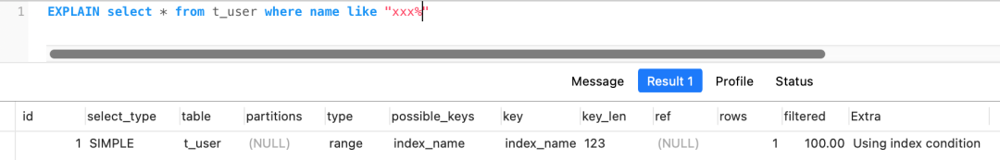
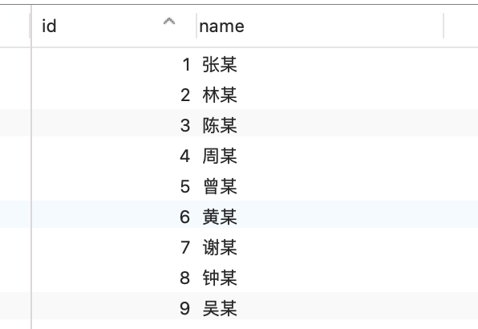
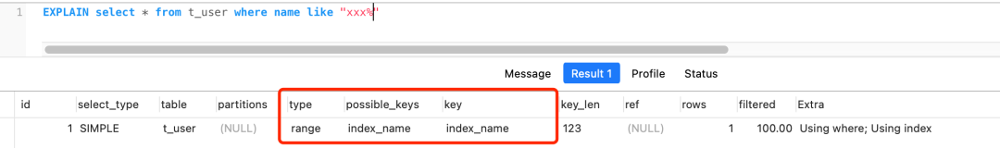
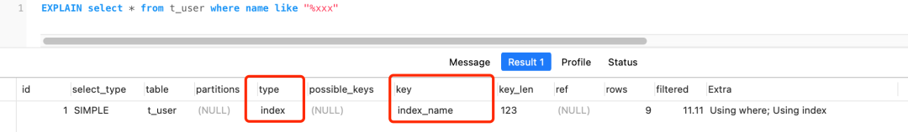

# MySQL使用like“%x“，索引一定会失效吗？

# MySQL 使用 like “%x“，索引一定会失效吗？
这个思考题其实是出自于，我之前这篇文章「[一条 SQL 语句引发的思考](http://mp.weixin.qq.com/s?__biz=MzUxODAzNDg4NQ==&mid=2247495686&idx=2&sn=dfa18870d8cd2f430f893d402b9f4e54&chksm=f98db4accefa3dba680c1b343700ef87d184c45d4d7739bb0263cece3c1b21d0ca5f875736f6&scene=21#wechat_redirect)」中留言区一位读者朋友出的问题。

很多读者都在留言区说了自己的想法，也有不少读者私聊我答案到底是什么？

所以，我今晚就跟大家聊聊这个思考题。

## 题目一
题目一很简单，相信大家都能分析出答案，我昨天分享的索引失效文章里也提及过。

题目 1 的数据库表如下，id 是主键索引，name 是二级索引，其他字段都是非索引字段。

这四条模糊匹配的查询语句，第一条和第二条都会走索引扫描，而且都是选择扫描二级索引（index_name），我贴个第二条查询语句的执行计划结果图：

而第三和第四条会发生索引失效，执行计划的结果 type= ALL，代表了全表扫描。

## 题目二
题目 2 的数据库表特别之处在于，只有两个字段，一个是主键索引 id，另外一个是二级索引 name。

针对题目 2 的数据表，第一条和第二条模糊查询语句也是一样可以走索引扫描，第二条查询语句的执行计划如下，Extra 里的 Using index 说明用上了覆盖索引：

我们来看一下第三条查询语句的执行计划（第四条也是一样的结果）：

从执行计划的结果中，可以看到 key=index_name，也就是说用上了二级索引，而且从 Extra 里的 Using index 说明用上了覆盖索引。

这是为什么呢？

首先，这张表的字段没有「非索引」字段，所以 select  相当于 select id,name，然后**这个查询的数据都在二级索引的 B+ 树，因为二级索引的 B+ 树的叶子节点包含「索引值+主键值」，所以查二级索引的 B+ 树就能查到全部结果了，这个就是覆盖索引。*

但是执行计划里的 type 是 index，这代表着是通过全扫描二级索引的 B+ 树的方式查询到数据的，也就是遍历了整颗索引树。

而第一和第二条查询语句的执行计划中 type 是 range，表示对索引列进行范围查询，也就是利用了索引树的有序性的特点，通过查询比较的方式，快速定位到了数据行。

所以，type=range 的查询效率会比 type=index 的高一些。

为什么选择全扫描二级索引树，而不扫描聚簇索引树呢？

因为二级索引树的记录东西很少，就只有「索引列+主键值」，而聚簇索引记录的东西会更多，比如聚簇索引中的叶子节点则记录了主键值、事务 id、用于事务和 MVCC 的回滚指针以及所有的剩余列。

再加上，这个 select * 不用执行回表操作。

所以， MySQL 优化器认为直接遍历二级索引树要比遍历聚簇索引树的成本要小的多，因此 MySQL 选择了「全扫描二级索引树」的方式查询数据。

为什么这个数据表加了非索引字段，执行同样的查询语句后，怎么变成走的是全表扫描呢？

加了其他字段后，select * from t_user where name like "%xx"; 要查询的数据就不能只在二级索引树里找了，得需要回表操作才能完成查询的工作，再加上是左模糊匹配，无法利用索引树的有序性来快速定位数据，所以得在二级索引树逐一遍历，获取主键值后，再到聚簇索引树检索到对应的数据行，这样实在太累了。

所以，优化器认为上面这样的查询过程的成本实在太高了，所以直接选择全表扫描的方式来查询数据。

---

从这个思考题我们知道了，使用左模糊匹配（like "%xx"）并不一定会走全表扫描，关键还是看数据表中的字段。

如果数据库表中的字段只有主键+二级索引，那么即使使用了左模糊匹配，也不会走全表扫描（type=all），而是走全扫描二级索引树(type=index)。

再说一个相似，我们都知道联合索引要遵循最左匹配才能走索引，但是如果数据库表中的字段都是索引的话，即使查询过程中，没有遵循最左匹配原则，也是走全扫描二级索引树(type=index)，比如下图：

就说到这了，下次见啦

> 更新: 2024-02-06 00:24:06  
原文: [https://www.yuque.com/vip6688/neho4x/ofg97vca3v0anqhw](https://www.yuque.com/vip6688/neho4x/ofg97vca3v0anqhw)
>

> 更新: 2024-11-25 09:20:39  
> 原文: <https://www.yuque.com/neumx/laxg2e/7c8e5622a217f7b1eb112df45da5fc76>