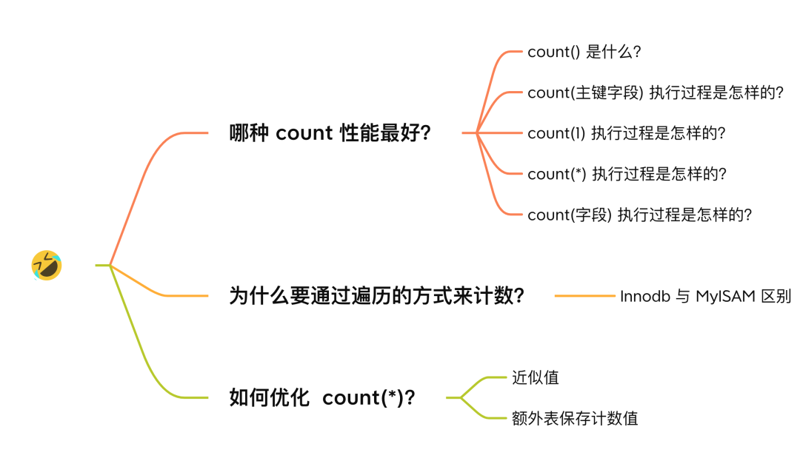
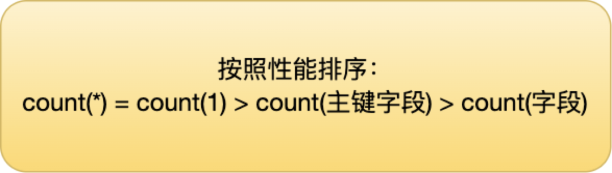
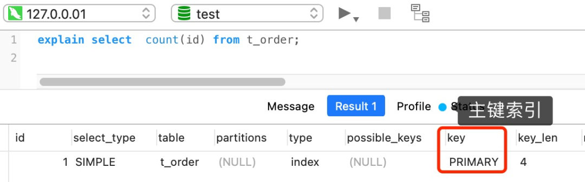
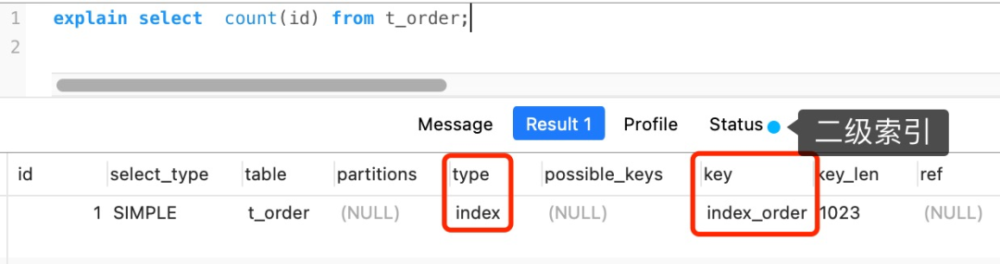
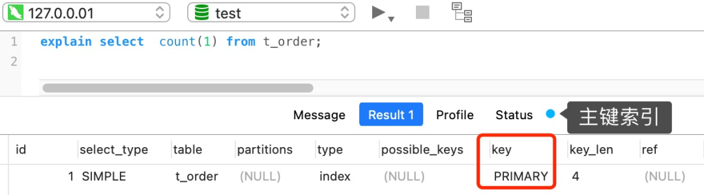
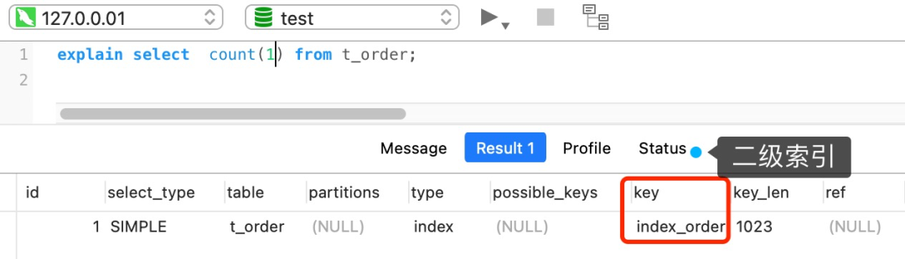
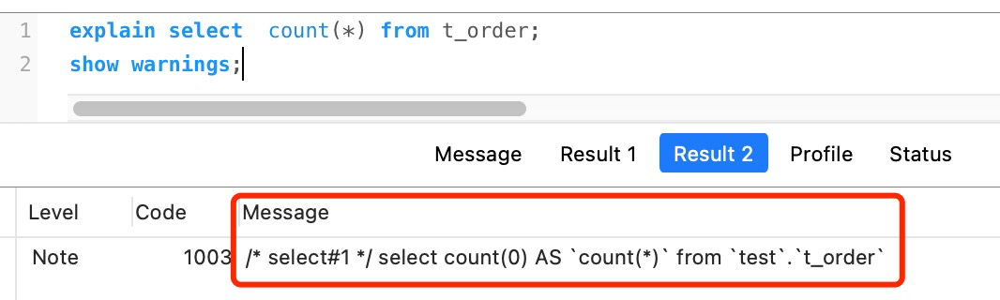
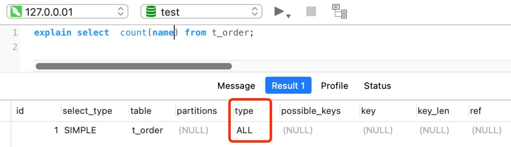
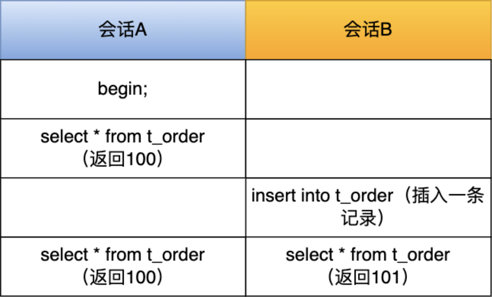
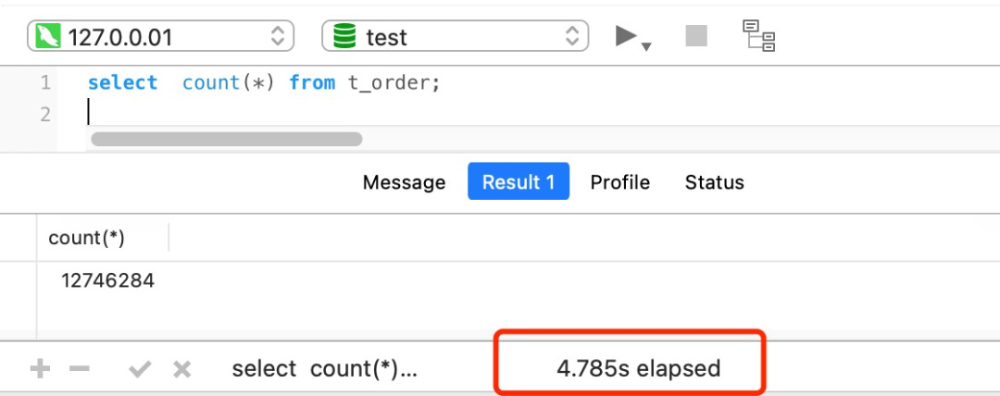

# count(_)和count(1)有什么区别？哪个性能最好？

# count(*) 和 count(1) 有什么区别？哪个性能最好？
<font style="color:rgb(44, 62, 80);">当我们对一张数据表中的记录进行统计的时候，习惯都会使用 count 函数来统计，但是 count 函数传入的参数有很多种，比如 count(1)、count(</font><font style="color:rgb(71, 101, 130);">*</font><font style="color:rgb(44, 62, 80);">)、count(字段) 等。</font>

<font style="color:rgb(44, 62, 80);">到底哪种效率是最好的呢？是不是 count(</font><font style="color:rgb(71, 101, 130);">*</font><font style="color:rgb(44, 62, 80);">) 效率最差？</font>

<font style="color:rgb(44, 62, 80);">我曾经以为 count(</font><font style="color:rgb(44, 62, 80);">) 是效率最差的，因为认知上</font><font style="color:rgb(44, 62, 80);"> </font><font style="color:rgb(71, 101, 130);">selete * from t</font><font style="color:rgb(44, 62, 80);"> </font><font style="color:rgb(44, 62, 80);">会读取所有表中的字段，所以凡事带有</font><font style="color:rgb(44, 62, 80);"> </font><font style="color:rgb(44, 62, 80);"> </font><font style="color:rgb(44, 62, 80);">字符的就觉得会读取表中所有的字段，当时网上有很多博客也这么说。</font>

<font style="color:rgb(44, 62, 80);">但是，当我深入 count 函数的原理后，被啪啪啪的打脸了！</font>

<font style="color:rgb(44, 62, 80);">不多说， 发车！</font>



## <font style="color:rgb(44, 62, 80);">哪种 count 性能最好？</font>
<font style="color:rgb(44, 62, 80);">我先直接说结论：</font>



<font style="color:rgb(44, 62, 80);">要弄明白这个，我们得要深入 count 的原理，以下内容基于常用的 innodb 存储引擎来说明。</font>

### <font style="color:rgb(44, 62, 80);">count() 是什么？</font>
<font style="color:rgb(44, 62, 80);">count() 是一个聚合函数，函数的参数不仅可以是字段名，也可以是其他任意表达式，该函数作用是</font>**<font style="color:rgb(48, 79, 254);">统计符合查询条件的记录中，函数指定的参数不为 NULL 的记录有多少个</font>**<font style="color:rgb(44, 62, 80);">。</font>

<font style="color:rgb(44, 62, 80);">假设 count() 函数的参数是字段名，如下：</font>


```sql
select count(name) from t_order;
```

<font style="color:rgb(44, 62, 80);">这条语句是统计「 t_order 表中，name 字段不为 NULL 的记录」有多少个。也就是说，如果某一条记录中的 name 字段的值为 NULL，则就不会被统计进去。</font>

<font style="color:rgb(44, 62, 80);">再来假设 count() 函数的参数是数字 1 这个表达式，如下：</font>


```sql
select count(1) from t_order;
```

<font style="color:rgb(44, 62, 80);">这条语句是统计「 t_order 表中，1 这个表达式不为 NULL 的记录」有多少个。</font>

<font style="color:rgb(44, 62, 80);">1 这个表达式就是单纯数字，它永远都不是 NULL，所以上面这条语句，其实是在统计 t_order 表中有多少个记录。</font>

### <font style="color:rgb(44, 62, 80);">count(主键字段) 执行过程是怎样的？</font>
<font style="color:rgb(44, 62, 80);">在通过 count 函数统计有多少个记录时，MySQL 的 server 层会维护一个名叫 count 的变量。</font>

<font style="color:rgb(44, 62, 80);">server 层会循环向 InnoDB 读取一条记录，如果 count 函数指定的参数不为 NULL，那么就会将变量 count 加 1，直到符合查询的全部记录被读完，就退出循环。最后将 count 变量的值发送给客户端。</font>

<font style="color:rgb(44, 62, 80);">InnoDB 是通过 B+ 树来保存记录的，根据索引的类型又分为聚簇索引和二级索引，它们区别在于，聚簇索引的叶子节点存放的是实际数据，而二级索引的叶子节点存放的是主键值，而不是实际数据。</font>

<font style="color:rgb(44, 62, 80);">用下面这条语句作为例子：</font>


```sql
//id 为主键值
select count(id) from t_order;
```

<font style="color:rgb(44, 62, 80);">如果表里只有主键索引，没有二级索引时，那么，InnoDB 循环遍历聚簇索引，将读取到的记录返回给 server 层，然后读取记录中的 id 值，就会 id 值判断是否为 NULL，如果不为 NULL，就将 count 变量加 1。</font>



<font style="color:rgb(44, 62, 80);">但是，如果表里有二级索引时，InnoDB 循环遍历的对象就不是聚簇索引，而是二级索引。</font>



<font style="color:rgb(44, 62, 80);">这是因为相同数量的二级索引记录可以比聚簇索引记录占用更少的存储空间，所以二级索引树比聚簇索引树小，这样遍历二级索引的 I/O 成本比遍历聚簇索引的 I/O 成本小，因此「优化器」优先选择的是二级索引。</font>

### <font style="color:rgb(44, 62, 80);">count(1) 执行过程是怎样的？</font>
<font style="color:rgb(44, 62, 80);">用下面这条语句作为例子：</font>


```sql
select count(1) from t_order;
```

<font style="color:rgb(44, 62, 80);">如果表里只有主键索引，没有二级索引时。</font>



<font style="color:rgb(44, 62, 80);">那么，InnoDB 循环遍历聚簇索引（主键索引），将读取到的记录返回给 server 层，</font>**<font style="color:rgb(48, 79, 254);">但是不会读取记录中的任何字段的值</font>**<font style="color:rgb(44, 62, 80);">，因为 count 函数的参数是 1，不是字段，所以不需要读取记录中的字段值。参数 1 很明显并不是 NULL，因此 server 层每从 InnoDB 读取到一条记录，就将 count 变量加 1。</font>

<font style="color:rgb(44, 62, 80);">可以看到，count(1) 相比 count(主键字段) 少一个步骤，就是不需要读取记录中的字段值，所以通常会说 count(1) 执行效率会比 count(主键字段) 高一点。</font>

<font style="color:rgb(44, 62, 80);">但是，如果表里有二级索引时，InnoDB 循环遍历的对象就二级索引了。</font>



### [](https://xiaolincoding.com/mysql/index/count.html#count-%E6%89%A7%E8%A1%8C%E8%BF%87%E7%A8%8B%E6%98%AF%E6%80%8E%E6%A0%B7%E7%9A%84)<font style="color:rgb(44, 62, 80);">count(*) 执行过程是怎样的？</font>
<font style="color:rgb(44, 62, 80);">看到</font><font style="color:rgb(44, 62, 80);"> </font><font style="color:rgb(71, 101, 130);">*</font><font style="color:rgb(44, 62, 80);"> </font><font style="color:rgb(44, 62, 80);">这个字符的时候，是不是大家觉得是读取记录中的所有字段值？</font>

<font style="color:rgb(44, 62, 80);">对于</font><font style="color:rgb(44, 62, 80);"> </font><font style="color:rgb(71, 101, 130);">selete </font><font style="color:rgb(44, 62, 80);"> </font><font style="color:rgb(44, 62, 80);">这条语句来说是这个意思，但是在 count() 中并不是这个意思。</font>

**<font style="color:rgb(48, 79, 254);">count(</font>****<font style="color:rgb(71, 101, 130);">*</font>****<font style="color:rgb(48, 79, 254);">) 其实等于 count(</font>****<font style="color:rgb(71, 101, 130);">0</font>****<font style="color:rgb(48, 79, 254);">)</font>**<font style="color:rgb(44, 62, 80);">，也就是说，当你使用 count(</font><font style="color:rgb(44, 62, 80);">) 时，MySQL 会将</font><font style="color:rgb(44, 62, 80);"> </font><font style="color:rgb(44, 62, 80);"> </font><font style="color:rgb(44, 62, 80);">参数转化为参数 0 来处理。</font>



<font style="color:rgb(44, 62, 80);">所以，</font>**<font style="color:rgb(48, 79, 254);">count(*) 执行过程跟 count(1) 执行过程基本一样的</font>**<font style="color:rgb(44, 62, 80);">，性能没有什么差异。</font>

<font style="color:rgb(44, 62, 80);">在 MySQL 5.7 的官方手册中有这么一句话：</font>

_<font style="color:rgb(200, 73, 255);">InnoDB handles SELECT COUNT(</font>__**<font style="color:rgb(71, 101, 130);">*</font>**__<font style="color:rgb(200, 73, 255);">) and SELECT COUNT(</font>__**<font style="color:rgb(71, 101, 130);">1</font>**__<font style="color:rgb(200, 73, 255);">) operations in the same way. There is no performance difference.</font>_

_<font style="color:rgb(200, 73, 255);">翻译：InnoDB以相同的方式处理SELECT COUNT（</font>__**<font style="color:rgb(71, 101, 130);">*</font>**__<font style="color:rgb(200, 73, 255);">）和SELECT COUNT（</font>__**<font style="color:rgb(71, 101, 130);">1</font>**__<font style="color:rgb(200, 73, 255);">）操作，没有性能差异。</font>_

<font style="color:rgb(44, 62, 80);">而且 MySQL 会对 count(*) 和 count(1) 有个优化，如果有多个二级索引的时候，优化器会使用key_len 最小的二级索引进行扫描。</font>

<font style="color:rgb(44, 62, 80);">只有当没有二级索引的时候，才会采用主键索引来进行统计。</font>

### [](https://xiaolincoding.com/mysql/index/count.html#count-%E5%AD%97%E6%AE%B5-%E6%89%A7%E8%A1%8C%E8%BF%87%E7%A8%8B%E6%98%AF%E6%80%8E%E6%A0%B7%E7%9A%84)<font style="color:rgb(44, 62, 80);">count(字段) 执行过程是怎样的？</font>
<font style="color:rgb(44, 62, 80);">count(字段) 的执行效率相比前面的 count(1)、 count(*)、 count(主键字段) 执行效率是最差的。</font>

<font style="color:rgb(44, 62, 80);">用下面这条语句作为例子：</font>


```sql
// name不是索引，普通字段
select count(name) from t_order;
```

<font style="color:rgb(44, 62, 80);">对于这个查询来说，会采用全表扫描的方式来计数，所以它的执行效率是比较差的。</font>



### [](https://xiaolincoding.com/mysql/index/count.html#%E5%B0%8F%E7%BB%93)<font style="color:rgb(44, 62, 80);">小结</font>
<font style="color:rgb(44, 62, 80);">count(1)、 count(*)、 count(主键字段)在执行的时候，如果表里存在二级索引，优化器就会选择二级索引进行扫描。</font>

<font style="color:rgb(44, 62, 80);">所以，如果要执行 count(1)、 count(*)、 count(主键字段) 时，尽量在数据表上建立二级索引，这样优化器会自动采用 key_len 最小的二级索引进行扫描，相比于扫描主键索引效率会高一些。</font>

<font style="color:rgb(44, 62, 80);">再来，就是不要使用 count(字段) 来统计记录个数，因为它的效率是最差的，会采用全表扫描的方式来统计。如果你非要统计表中该字段不为 NULL 的记录个数，建议给这个字段建立一个二级索引。</font>

## [](https://xiaolincoding.com/mysql/index/count.html#%E4%B8%BA%E4%BB%80%E4%B9%88%E8%A6%81%E9%80%9A%E8%BF%87%E9%81%8D%E5%8E%86%E7%9A%84%E6%96%B9%E5%BC%8F%E6%9D%A5%E8%AE%A1%E6%95%B0)<font style="color:rgb(44, 62, 80);">为什么要通过遍历的方式来计数？</font>
<font style="color:rgb(44, 62, 80);">你可能会好奇，为什么 count 函数需要通过遍历的方式来统计记录个数？</font>

<font style="color:rgb(44, 62, 80);">我前面将的案例都是基于 Innodb 存储引擎来说明的，但是在 MyISAM 存储引擎里，执行 count 函数的方式是不一样的，通常在没有任何查询条件下的 count(*)，MyISAM 的查询速度要明显快于 InnoDB。</font>

<font style="color:rgb(44, 62, 80);">使用 MyISAM 引擎时，执行 count 函数只需要 O(1 )复杂度，这是因为每张 MyISAM 的数据表都有一个 meta 信息有存储了row_count值，由表级锁保证一致性，所以直接读取 row_count 值就是 count 函数的执行结果。</font>

<font style="color:rgb(44, 62, 80);">而 InnoDB 存储引擎是支持事务的，同一个时刻的多个查询，由于多版本并发控制（MVCC）的原因，InnoDB 表“应该返回多少行”也是不确定的，所以无法像 MyISAM一样，只维护一个 row_count 变量。</font>

<font style="color:rgb(44, 62, 80);">举个例子，假设表 t_order 有 100 条记录，现在有两个会话并行以下语句：</font>



<font style="color:rgb(44, 62, 80);">在会话 A 和会话 B的最后一个时刻，同时查表 t_order 的记录总个数，可以发现，显示的结果是不一样的。所以，在使用 InnoDB 存储引擎时，就需要扫描表来统计具体的记录。</font>

<font style="color:rgb(44, 62, 80);">而当带上 where 条件语句之后，MyISAM 跟 InnoDB 就没有区别了，它们都需要扫描表来进行记录个数的统计。</font>

## [](https://xiaolincoding.com/mysql/index/count.html#%E5%A6%82%E4%BD%95%E4%BC%98%E5%8C%96-count)<font style="color:rgb(44, 62, 80);">如何优化 count(*)？</font>
<font style="color:rgb(44, 62, 80);">如果对一张大表经常用 count(*) 来做统计，其实是很不好的。</font>

<font style="color:rgb(44, 62, 80);">比如下面我这个案例，表 t_order 共有 1200+ 万条记录，我也创建了二级索引，但是执行一次</font><font style="color:rgb(44, 62, 80);"> </font><font style="color:rgb(71, 101, 130);">select count(*) from t_order</font><font style="color:rgb(44, 62, 80);"> </font><font style="color:rgb(44, 62, 80);">要花费差不多 5 秒！</font>



<font style="color:rgb(44, 62, 80);">面对大表的记录统计，我们有没有什么其他更好的办法呢？</font>

### [](https://xiaolincoding.com/mysql/index/count.html#%E7%AC%AC%E4%B8%80%E7%A7%8D-%E8%BF%91%E4%BC%BC%E5%80%BC)<font style="color:rgb(44, 62, 80);">第一种，近似值</font>
<font style="color:rgb(44, 62, 80);">如果你的业务对于统计个数不需要很精确，比如搜索引擎在搜索关键词的时候，给出的搜索结果条数是一个大概值。</font>


<font style="color:rgb(44, 62, 80);">这时，我们就可以使用 show table status 或者 explain 命令来表进行估算。</font>

<font style="color:rgb(44, 62, 80);">执行 explain 命令效率是很高的，因为它并不会真正的去查询，下图中的 rows 字段值就是 explain 命令对表 t_order 记录的估算值。</font>


### [](https://xiaolincoding.com/mysql/index/count.html#%E7%AC%AC%E4%BA%8C%E7%A7%8D-%E9%A2%9D%E5%A4%96%E8%A1%A8%E4%BF%9D%E5%AD%98%E8%AE%A1%E6%95%B0%E5%80%BC)<font style="color:rgb(44, 62, 80);">第二种，额外表保存计数值</font>
<font style="color:rgb(44, 62, 80);">如果是想精确的获取表的记录总数，我们可以将这个计数值保存到单独的一张计数表中。</font>

<font style="color:rgb(44, 62, 80);">当我们在数据表插入一条记录的同时，将计数表中的计数字段 + 1。也就是说，在新增和删除操作时，我们需要额外维护这个计数表。</font>


> 更新: 2024-02-05 23:54:00  
原文: [https://www.yuque.com/vip6688/neho4x/wlffxu5gh8icd24i](https://www.yuque.com/vip6688/neho4x/wlffxu5gh8icd24i)
>


> 更新: 2024-11-25 09:20:44  
> 原文: <https://www.yuque.com/neumx/laxg2e/e802edf0e3015f9d08bccca614dce5a1>