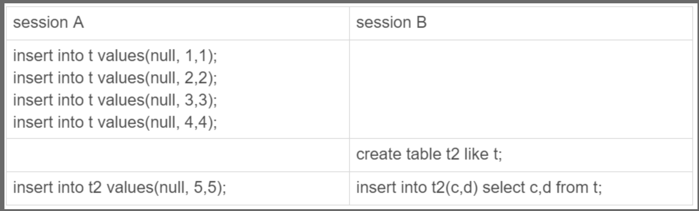

# MySQL有哪些锁？

# MySQL 有哪些锁？
# <font style="color:rgb(44, 62, 80);">这次，来说说 </font>**<font style="color:rgb(48, 79, 254);">MySQL 的锁</font>**<font style="color:rgb(44, 62, 80);">，主要是 Q&A 的形式，看起来会比较轻松。</font>
<font style="color:rgb(44, 62, 80);">不多 BB 了，</font>**<font style="color:rgb(48, 79, 254);">发车！</font>**

<font style="color:rgb(44, 62, 80);">在 MySQL 里，根据加锁的范围，可以分为</font>**<font style="color:rgb(48, 79, 254);">全局锁、表级锁和行锁</font>**<font style="color:rgb(44, 62, 80);">三类。</font>


## [](https://xiaolincoding.com/mysql/lock/mysql_lock.html#%E5%85%A8%E5%B1%80%E9%94%81)<font style="color:rgb(44, 62, 80);">全局锁</font>
<font style="color:rgb(44, 62, 80);background-color:rgb(227, 242, 253);">全局锁是怎么用的？</font>

<font style="color:rgb(44, 62, 80);">要使用全局锁，则要执行这条命令：</font>


```sql
flush tables with read lock
```

<font style="color:rgb(44, 62, 80);">执行后，</font>**<font style="color:rgb(48, 79, 254);">整个数据库就处于只读状态了</font>**<font style="color:rgb(44, 62, 80);">，这时其他线程执行以下操作，都会被阻塞：</font>

+ <font style="color:rgb(44, 62, 80);">对数据的增删改操作，比如 insert、delete、update等语句；</font>
+ <font style="color:rgb(44, 62, 80);">对表结构的更改操作，比如 alter table、drop table 等语句。</font>

<font style="color:rgb(44, 62, 80);">如果要释放全局锁，则要执行这条命令：</font>


```sql
unlock tables
```

<font style="color:rgb(44, 62, 80);">当然，当会话断开了，全局锁会被自动释放。</font>

<font style="color:rgb(44, 62, 80);background-color:rgb(227, 242, 253);">全局锁应用场景是什么？</font>

<font style="color:rgb(44, 62, 80);">全局锁主要应用于做</font>**<font style="color:rgb(48, 79, 254);">全库逻辑备份</font>**<font style="color:rgb(44, 62, 80);">，这样在备份数据库期间，不会因为数据或表结构的更新，而出现备份文件的数据与预期的不一样。</font>

<font style="color:rgb(44, 62, 80);">举个例子大家就知道了。</font>

<font style="color:rgb(44, 62, 80);">在全库逻辑备份期间，假设不加全局锁的场景，看看会出现什么意外的情况。</font>

<font style="color:rgb(44, 62, 80);">如果在全库逻辑备份期间，有用户购买了一件商品，一般购买商品的业务逻辑是会涉及到多张数据库表的更新，比如在用户表更新该用户的余额，然后在商品表更新被购买的商品的库存。</font>

<font style="color:rgb(44, 62, 80);">那么，有可能出现这样的顺序：</font>

1. <font style="color:rgb(44, 62, 80);">先备份了用户表的数据；</font>
2. <font style="color:rgb(44, 62, 80);">然后有用户发起了购买商品的操作；</font>
3. <font style="color:rgb(44, 62, 80);">接着再备份商品表的数据。</font>

<font style="color:rgb(44, 62, 80);">也就是在备份用户表和商品表之间，有用户购买了商品。</font>

<font style="color:rgb(44, 62, 80);">这种情况下，备份的结果是用户表中该用户的余额并没有扣除，反而商品表中该商品的库存被减少了，如果后面用这个备份文件恢复数据库数据的话，用户钱没少，而库存少了，等于用户白嫖了一件商品。</font>

<font style="color:rgb(44, 62, 80);">所以，在全库逻辑备份期间，加上全局锁，就不会出现上面这种情况了。</font>

<font style="color:rgb(44, 62, 80);background-color:rgb(227, 242, 253);">加全局锁又会带来什么缺点呢？</font>

<font style="color:rgb(44, 62, 80);">加上全局锁，意味着整个数据库都是只读状态。</font>

<font style="color:rgb(44, 62, 80);">那么如果数据库里有很多数据，备份就会花费很多的时间，关键是备份期间，业务只能读数据，而不能更新数据，这样会造成业务停滞。</font>

<font style="color:rgb(44, 62, 80);background-color:rgb(227, 242, 253);">既然备份数据库数据的时候，使用全局锁会影响业务，那有什么其他方式可以避免？</font>

<font style="color:rgb(44, 62, 80);">有的，如果数据库的引擎支持的事务支持</font>**<font style="color:rgb(48, 79, 254);">可重复读的隔离级别</font>**<font style="color:rgb(44, 62, 80);">，那么在备份数据库之前先开启事务，会先创建 Read View，然后整个事务执行期间都在用这个 Read View，而且由于 MVCC 的支持，备份期间业务依然可以对数据进行更新操作。</font>

<font style="color:rgb(44, 62, 80);">因为在可重复读的隔离级别下，即使其他事务更新了表的数据，也不会影响备份数据库时的 Read View，这就是事务四大特性中的隔离性，这样备份期间备份的数据一直是在开启事务时的数据。</font>

<font style="color:rgb(44, 62, 80);">备份数据库的工具是 mysqldump，在使用 mysqldump 时加上</font><font style="color:rgb(44, 62, 80);"> </font><font style="color:rgb(71, 101, 130);">–single-transaction</font><font style="color:rgb(44, 62, 80);"> </font><font style="color:rgb(44, 62, 80);">参数的时候，就会在备份数据库之前先开启事务。这种方法只适用于支持「可重复读隔离级别的事务」的存储引擎。</font>

<font style="color:rgb(44, 62, 80);">InnoDB 存储引擎默认的事务隔离级别正是可重复读，因此可以采用这种方式来备份数据库。</font>

<font style="color:rgb(44, 62, 80);">但是，对于 MyISAM 这种不支持事务的引擎，在备份数据库时就要使用全局锁的方法。</font>

## [](https://xiaolincoding.com/mysql/lock/mysql_lock.html#%E8%A1%A8%E7%BA%A7%E9%94%81)<font style="color:rgb(44, 62, 80);">表级锁</font>
<font style="color:rgb(44, 62, 80);background-color:rgb(227, 242, 253);">MySQL 表级锁有哪些？具体怎么用的。</font>

<font style="color:rgb(44, 62, 80);">MySQL 里面表级别的锁有这几种：</font>

+ <font style="color:rgb(44, 62, 80);">表锁；</font>
+ <font style="color:rgb(44, 62, 80);">元数据锁（MDL）;</font>
+ <font style="color:rgb(44, 62, 80);">意向锁；</font>
+ <font style="color:rgb(44, 62, 80);">AUTO-INC 锁；</font>

### [](https://xiaolincoding.com/mysql/lock/mysql_lock.html#%E8%A1%A8%E9%94%81)<font style="color:rgb(44, 62, 80);">表锁</font>
<font style="color:rgb(44, 62, 80);">先来说说</font>**<font style="color:rgb(48, 79, 254);">表锁</font>**<font style="color:rgb(44, 62, 80);">。</font>

<font style="color:rgb(44, 62, 80);">如果我们想对学生表（t_student）加表锁，可以使用下面的命令：</font>


```sql
//表级别的共享锁，也就是读锁；
lock tables t_student read;

//表级别的独占锁，也就是写锁；
lock tables t_stuent write;
```

<font style="color:rgb(44, 62, 80);">需要注意的是，表锁除了会限制别的线程的读写外，也会限制本线程接下来的读写操作。</font>

<font style="color:rgb(44, 62, 80);">也就是说如果本线程对学生表加了「共享表锁」，那么本线程接下来如果要对学生表执行写操作的语句，是会被阻塞的，当然其他线程对学生表进行写操作时也会被阻塞，直到锁被释放。</font>

<font style="color:rgb(44, 62, 80);">要释放表锁，可以使用下面这条命令，会释放当前会话的所有表锁：</font>


```sql
unlock tables
```

<font style="color:rgb(44, 62, 80);">另外，当会话退出后，也会释放所有表锁。</font>

<font style="color:rgb(44, 62, 80);">不过尽量避免在使用 InnoDB 引擎的表使用表锁，因为表锁的颗粒度太大，会影响并发性能，</font>**<font style="color:rgb(48, 79, 254);">InnoDB 牛逼的地方在于实现了颗粒度更细的行级锁</font>**<font style="color:rgb(44, 62, 80);">。</font>

### [](https://xiaolincoding.com/mysql/lock/mysql_lock.html#%E5%85%83%E6%95%B0%E6%8D%AE%E9%94%81)<font style="color:rgb(44, 62, 80);">元数据锁</font>
<font style="color:rgb(44, 62, 80);">再来说说</font>**<font style="color:rgb(48, 79, 254);">元数据锁</font>**<font style="color:rgb(44, 62, 80);">（MDL）。</font>

<font style="color:rgb(44, 62, 80);">我们不需要显示的使用 MDL，因为当我们对数据库表进行操作时，会自动给这个表加上 MDL：</font>

+ <font style="color:rgb(44, 62, 80);">对一张表进行 CRUD 操作时，加的是</font><font style="color:rgb(44, 62, 80);"> </font>**<font style="color:rgb(48, 79, 254);">MDL 读锁</font>**<font style="color:rgb(44, 62, 80);">；</font>
+ <font style="color:rgb(44, 62, 80);">对一张表做结构变更操作的时候，加的是</font><font style="color:rgb(44, 62, 80);"> </font>**<font style="color:rgb(48, 79, 254);">MDL 写锁</font>**<font style="color:rgb(44, 62, 80);">；</font>

<font style="color:rgb(44, 62, 80);">MDL 是为了保证当用户对表执行 CRUD 操作时，防止其他线程对这个表结构做了变更。</font>

<font style="color:rgb(44, 62, 80);">当有线程在执行 select 语句（ 加 MDL 读锁）的期间，如果有其他线程要更改该表的结构（ 申请 MDL 写锁），那么将会被阻塞，直到执行完 select 语句（ 释放 MDL 读锁）。</font>

<font style="color:rgb(44, 62, 80);">反之，当有线程对表结构进行变更（ 加 MDL 写锁）的期间，如果有其他线程执行了 CRUD 操作（ 申请 MDL 读锁），那么就会被阻塞，直到表结构变更完成（ 释放 MDL 写锁）。</font>

<font style="color:rgb(44, 62, 80);background-color:rgb(227, 242, 253);">MDL 不需要显示调用，那它是在什么时候释放的?</font>

<font style="color:rgb(44, 62, 80);">MDL 是在事务提交后才会释放，这意味着</font>**<font style="color:rgb(48, 79, 254);">事务执行期间，MDL 是一直持有的</font>**<font style="color:rgb(44, 62, 80);">。</font>

<font style="color:rgb(44, 62, 80);">那如果数据库有一个长事务（所谓的长事务，就是开启了事务，但是一直还没提交），那在对表结构做变更操作的时候，可能会发生意想不到的事情，比如下面这个顺序的场景：</font>

1. <font style="color:rgb(44, 62, 80);">首先，线程 A 先启用了事务（但是一直不提交），然后执行一条 select 语句，此时就先对该表加上 MDL 读锁；</font>
2. <font style="color:rgb(44, 62, 80);">然后，线程 B 也执行了同样的 select 语句，此时并不会阻塞，因为「读读」并不冲突；</font>
3. <font style="color:rgb(44, 62, 80);">接着，线程 C 修改了表字段，此时由于线程 A 的事务并没有提交，也就是 MDL 读锁还在占用着，这时线程 C 就无法申请到 MDL 写锁，就会被阻塞，</font>

<font style="color:rgb(44, 62, 80);">那么在线程 C 阻塞后，后续有对该表的 select 语句，就都会被阻塞，如果此时有大量该表的 select 语句的请求到来，就会有大量的线程被阻塞住，这时数据库的线程很快就会爆满了。</font>

<font style="color:rgb(44, 62, 80);background-color:rgb(227, 242, 253);">为什么线程 C 因为申请不到 MDL 写锁，而导致后续的申请读锁的查询操作也会被阻塞？</font>

<font style="color:rgb(44, 62, 80);">这是因为申请 MDL 锁的操作会形成一个队列，队列中</font>**<font style="color:rgb(48, 79, 254);">写锁获取优先级高于读锁</font>**<font style="color:rgb(44, 62, 80);">，一旦出现 MDL 写锁等待，会阻塞后续该表的所有 CRUD 操作。</font>

<font style="color:rgb(44, 62, 80);">所以为了能安全的对表结构进行变更，在对表结构变更前，先要看看数据库中的长事务，是否有事务已经对表加上了 MDL 读锁，如果可以考虑 kill 掉这个长事务，然后再做表结构的变更。</font>

### [](https://xiaolincoding.com/mysql/lock/mysql_lock.html#%E6%84%8F%E5%90%91%E9%94%81)<font style="color:rgb(44, 62, 80);">意向锁</font>
<font style="color:rgb(44, 62, 80);">接着，说说</font>**<font style="color:rgb(48, 79, 254);">意向锁</font>**<font style="color:rgb(44, 62, 80);">。</font>

+ <font style="color:rgb(44, 62, 80);">在使用 InnoDB 引擎的表里对某些记录加上「共享锁」之前，需要先在表级别加上一个「意向共享锁」；</font>
+ <font style="color:rgb(44, 62, 80);">在使用 InnoDB 引擎的表里对某些纪录加上「独占锁」之前，需要先在表级别加上一个「意向独占锁」；</font>

<font style="color:rgb(44, 62, 80);">也就是，当执行插入、更新、删除操作，需要先对表加上「意向独占锁」，然后对该记录加独占锁。</font>

<font style="color:rgb(44, 62, 80);">而普通的 select 是不会加行级锁的，普通的 select 语句是利用 MVCC 实现一致性读，是无锁的。</font>

<font style="color:rgb(44, 62, 80);">不过，select 也是可以对记录加共享锁和独占锁的，具体方式如下：</font>


```sql
//先在表上加上意向共享锁，然后对读取的记录加共享锁
select ... lock in share mode;

//先表上加上意向独占锁，然后对读取的记录加独占锁
select ... for update;
```

**<font style="color:rgb(48, 79, 254);">意向共享锁和意向独占锁是表级锁，不会和行级的共享锁和独占锁发生冲突，而且意向锁之间也不会发生冲突，只会和共享表锁（</font>**_**<font style="color:rgb(200, 73, 255);">lock tables ... read</font>**_**<font style="color:rgb(48, 79, 254);">）和独占表锁（</font>**_**<font style="color:rgb(200, 73, 255);">lock tables ... write</font>**_**<font style="color:rgb(48, 79, 254);">）发生冲突。</font>**

<font style="color:rgb(44, 62, 80);">表锁和行锁是满足读读共享、读写互斥、写写互斥的。</font>

<font style="color:rgb(44, 62, 80);">如果没有「意向锁」，那么加「独占表锁」时，就需要遍历表里所有记录，查看是否有记录存在独占锁，这样效率会很慢。</font>

<font style="color:rgb(44, 62, 80);">那么有了「意向锁」，由于在对记录加独占锁前，先会加上表级别的意向独占锁，那么在加「独占表锁」时，直接查该表是否有意向独占锁，如果有就意味着表里已经有记录被加了独占锁，这样就不用去遍历表里的记录。</font>

<font style="color:rgb(44, 62, 80);">所以，</font>**<font style="color:rgb(48, 79, 254);">意向锁的目的是为了快速判断表里是否有记录被加锁</font>**<font style="color:rgb(44, 62, 80);">。</font>

### [](https://xiaolincoding.com/mysql/lock/mysql_lock.html#auto-inc-%E9%94%81)<font style="color:rgb(44, 62, 80);">AUTO-INC 锁</font>
<font style="color:rgb(44, 62, 80);">表里的主键通常都会设置成自增的，这是通过对主键字段声明</font><font style="color:rgb(44, 62, 80);"> </font><font style="color:rgb(71, 101, 130);">AUTO_INCREMENT</font><font style="color:rgb(44, 62, 80);"> </font><font style="color:rgb(44, 62, 80);">属性实现的。</font>

<font style="color:rgb(44, 62, 80);">之后可以在插入数据时，可以不指定主键的值，数据库会自动给主键赋值递增的值，这主要是通过</font><font style="color:rgb(44, 62, 80);"> </font>**<font style="color:rgb(48, 79, 254);">AUTO-INC 锁</font>**<font style="color:rgb(44, 62, 80);">实现的。</font>

<font style="color:rgb(44, 62, 80);">AUTO-INC 锁是特殊的表锁机制，锁</font>**<font style="color:rgb(48, 79, 254);">不是再一个事务提交后才释放，而是再执行完插入语句后就会立即释放</font>**<font style="color:rgb(44, 62, 80);">。</font>

**<font style="color:rgb(48, 79, 254);">在插入数据时，会加一个表级别的 AUTO-INC 锁</font>**<font style="color:rgb(44, 62, 80);">，然后为被</font><font style="color:rgb(44, 62, 80);"> </font><font style="color:rgb(71, 101, 130);">AUTO_INCREMENT</font><font style="color:rgb(44, 62, 80);"> </font><font style="color:rgb(44, 62, 80);">修饰的字段赋值递增的值，等插入语句执行完成后，才会把 AUTO-INC 锁释放掉。</font>

<font style="color:rgb(44, 62, 80);">那么，一个事务在持有 AUTO-INC 锁的过程中，其他事务的如果要向该表插入语句都会被阻塞，从而保证插入数据时，被</font><font style="color:rgb(44, 62, 80);"> </font><font style="color:rgb(71, 101, 130);">AUTO_INCREMENT</font><font style="color:rgb(44, 62, 80);"> </font><font style="color:rgb(44, 62, 80);">修饰的字段的值是连续递增的。</font>

<font style="color:rgb(44, 62, 80);">但是， AUTO-INC 锁再对大量数据进行插入的时候，会影响插入性能，因为另一个事务中的插入会被阻塞。</font>

<font style="color:rgb(44, 62, 80);">因此， 在 MySQL 5.1.22 版本开始，InnoDB 存储引擎提供了一种</font>**<font style="color:rgb(48, 79, 254);">轻量级的锁</font>**<font style="color:rgb(44, 62, 80);">来实现自增。</font>

<font style="color:rgb(44, 62, 80);">一样也是在插入数据的时候，会为被</font><font style="color:rgb(44, 62, 80);"> </font><font style="color:rgb(71, 101, 130);">AUTO_INCREMENT</font><font style="color:rgb(44, 62, 80);"> </font><font style="color:rgb(44, 62, 80);">修饰的字段加上轻量级锁，</font>**<font style="color:rgb(48, 79, 254);">然后给该字段赋值一个自增的值，就把这个轻量级锁释放了，而不需要等待整个插入语句执行完后才释放锁</font>**<font style="color:rgb(44, 62, 80);">。</font>

<font style="color:rgb(44, 62, 80);">InnoDB 存储引擎提供了个 innodb_autoinc_lock_mode 的系统变量，是用来控制选择用 AUTO-INC 锁，还是轻量级的锁。</font>

+ <font style="color:rgb(44, 62, 80);">当 innodb_autoinc_lock_mode = 0，就采用 AUTO-INC 锁，语句执行结束后才释放锁；</font>
+ <font style="color:rgb(44, 62, 80);">当 innodb_autoinc_lock_mode = 2，就采用轻量级锁，申请自增主键后就释放锁，并不需要等语句执行后才释放。</font>
+ <font style="color:rgb(44, 62, 80);">当 innodb_autoinc_lock_mode = 1：</font>
    - <font style="color:rgb(44, 62, 80);">普通 insert 语句，自增锁在申请之后就马上释放；</font>
    - <font style="color:rgb(44, 62, 80);">类似 insert … select 这样的批量插入数据的语句，自增锁还是要等语句结束后才被释放；</font>

<font style="color:rgb(44, 62, 80);">当 innodb_autoinc_lock_mode = 2 是性能最高的方式，但是当搭配 binlog 的日志格式是 statement 一起使用的时候，在「主从复制的场景」中会发生</font>**<font style="color:rgb(48, 79, 254);">数据不一致的问题</font>**<font style="color:rgb(44, 62, 80);">。</font>

<font style="color:rgb(44, 62, 80);">举个例子，考虑下面场景：</font>



<font style="color:rgb(44, 62, 80);">session A 往表 t 中插入了 4 行数据，然后创建了一个相同结构的表 t2，然后</font>**<font style="color:rgb(48, 79, 254);">两个 session 同时执行向表 t2 中插入数据</font>**<font style="color:rgb(44, 62, 80);">。</font>

<font style="color:rgb(44, 62, 80);">如果 innodb_autoinc_lock_mode = 2，意味着「申请自增主键后就释放锁，不必等插入语句执行完」。那么就可能出现这样的情况：</font>

+ <font style="color:rgb(44, 62, 80);">session B 先插入了两个记录，(1,1,1)、(2,2,2)；</font>
+ <font style="color:rgb(44, 62, 80);">然后，session A 来申请自增 id 得到 id=3，插入了（3,5,5)；</font>
+ <font style="color:rgb(44, 62, 80);">之后，session B 继续执行，插入两条记录 (4,3,3)、 (5,4,4)。</font>

<font style="color:rgb(44, 62, 80);">可以看到，</font>**<font style="color:rgb(48, 79, 254);">session B 的 insert 语句，生成的 id 不连续</font>**<font style="color:rgb(44, 62, 80);">。</font>

<font style="color:rgb(44, 62, 80);">当「主库」发生了这种情况，binlog 面对 t2 表的更新只会记录这两个 session 的 insert 语句，如果 binlog_format=statement，记录的语句就是原始语句。记录的顺序要么先记 session A 的 insert 语句，要么先记 session B 的 insert 语句。</font>

<font style="color:rgb(44, 62, 80);">但不论是哪一种，这个 binlog 拿去「从库」执行，这时从库是按「顺序」执行语句的，只有当执行完一条 SQL 语句后，才会执行下一条 SQL。因此，在</font>**<font style="color:rgb(48, 79, 254);">从库上「不会」发生像主库那样两个 session 「同时」执行向表 t2 中插入数据的场景。所以，在备库上执行了 session B 的 insert 语句，生成的结果里面，id 都是连续的。这时，主从库就发生了数据不一致</font>**<font style="color:rgb(44, 62, 80);">。</font>

<font style="color:rgb(44, 62, 80);">要解决这问题，binlog 日志格式要设置为 row，这样在 binlog 里面记录的是主库分配的自增值，到备库执行的时候，主库的自增值是什么，从库的自增值就是什么。</font>

<font style="color:rgb(44, 62, 80);">所以，</font>**<font style="color:rgb(48, 79, 254);">当 innodb_autoinc_lock_mode = 2 时，并且 binlog_format = row，既能提升并发性，又不会出现数据一致性问题</font>**<font style="color:rgb(44, 62, 80);">。</font>

## [](https://xiaolincoding.com/mysql/lock/mysql_lock.html#%E8%A1%8C%E7%BA%A7%E9%94%81)<font style="color:rgb(44, 62, 80);">行级锁</font>
<font style="color:rgb(44, 62, 80);">InnoDB 引擎是支持行级锁的，而 MyISAM 引擎并不支持行级锁。</font>

<font style="color:rgb(44, 62, 80);">前面也提到，普通的 select 语句是不会对记录加锁的，因为它属于快照读。如果要在查询时对记录加行锁，可以使用下面这两个方式，这种查询会加锁的语句称为</font>**<font style="color:rgb(48, 79, 254);">锁定读</font>**<font style="color:rgb(44, 62, 80);">。</font>


```sql
//对读取的记录加共享锁
select ... lock in share mode;

//对读取的记录加独占锁
select ... for update;
```

<font style="color:rgb(44, 62, 80);">上面这两条语句必须在一个事务中，</font>**<font style="color:rgb(48, 79, 254);">因为当事务提交了，锁就会被释放</font>**<font style="color:rgb(44, 62, 80);">，所以在使用这两条语句的时候，要加上 begin、start transaction 或者 set autocommit = 0。</font>

<font style="color:rgb(44, 62, 80);">共享锁（S锁）满足读读共享，读写互斥。独占锁（X锁）满足写写互斥、读写互斥。</font>


<font style="color:rgb(44, 62, 80);">行级锁的类型主要有三类：</font>

+ <font style="color:rgb(44, 62, 80);">Record Lock，记录锁，也就是仅仅把一条记录锁上；</font>
+ <font style="color:rgb(44, 62, 80);">Gap Lock，间隙锁，锁定一个范围，但是不包含记录本身；</font>
+ <font style="color:rgb(44, 62, 80);">Next-Key Lock：Record Lock + Gap Lock 的组合，锁定一个范围，并且锁定记录本身。</font>

### [](https://xiaolincoding.com/mysql/lock/mysql_lock.html#record-lock)<font style="color:rgb(44, 62, 80);">Record Lock</font>
<font style="color:rgb(44, 62, 80);">Record Lock 称为记录锁，锁住的是一条记录。而且记录锁是有 S 锁和 X 锁之分的：</font>

+ <font style="color:rgb(44, 62, 80);">当一个事务对一条记录加了 S 型记录锁后，其他事务也可以继续对该记录加 S 型记录锁（S 型与 S 锁兼容），但是不可以对该记录加 X 型记录锁（S 型与 X 锁不兼容）;</font>
+ <font style="color:rgb(44, 62, 80);">当一个事务对一条记录加了 X 型记录锁后，其他事务既不可以对该记录加 S 型记录锁（S 型与 X 锁不兼容），也不可以对该记录加 X 型记录锁（X 型与 X 锁不兼容）。</font>

<font style="color:rgb(44, 62, 80);">举个例子，当一个事务执行了下面这条语句：</font>


```sql
mysql > begin;
mysql > select * from t_test where id = 1 for update;
```

<font style="color:rgb(44, 62, 80);">就是对 t_test 表中主键 id 为 1 的这条记录加上 X 型的记录锁，这样其他事务就无法对这条记录进行修改了。</font>


<font style="color:rgb(44, 62, 80);">当事务执行 commit 后，事务过程中生成的锁都会被释放。</font>

### [](https://xiaolincoding.com/mysql/lock/mysql_lock.html#gap-lock)<font style="color:rgb(44, 62, 80);">Gap Lock</font>
<font style="color:rgb(44, 62, 80);">Gap Lock 称为间隙锁，只存在于可重复读隔离级别，目的是为了解决可重复读隔离级别下幻读的现象。</font>

<font style="color:rgb(44, 62, 80);">假设，表中有一个范围 id 为（3，5）间隙锁，那么其他事务就无法插入 id = 4 这条记录了，这样就有效的防止幻读现象的发生。</font>


<font style="color:rgb(44, 62, 80);">间隙锁虽然存在 X 型间隙锁和 S 型间隙锁，但是并没有什么区别，</font>**<font style="color:rgb(48, 79, 254);">间隙锁之间是兼容的，即两个事务可以同时持有包含共同间隙范围的间隙锁，并不存在互斥关系，因为间隙锁的目的是防止插入幻影记录而提出的</font>**<font style="color:rgb(44, 62, 80);">。</font>

### [](https://xiaolincoding.com/mysql/lock/mysql_lock.html#next-key-lock)<font style="color:rgb(44, 62, 80);">Next-Key Lock</font>
<font style="color:rgb(44, 62, 80);">Next-Key Lock 称为临键锁，是 Record Lock + Gap Lock 的组合，锁定一个范围，并且锁定记录本身。</font>

<font style="color:rgb(44, 62, 80);">假设，表中有一个范围 id 为（3，5] 的 next-key lock，那么其他事务即不能插入 id = 4 记录，也不能修改 id = 5 这条记录。</font>


<font style="color:rgb(44, 62, 80);">所以，next-key lock 即能保护该记录，又能阻止其他事务将新纪录插入到被保护记录前面的间隙中。</font>

**<font style="color:rgb(48, 79, 254);">next-key lock 是包含间隙锁+记录锁的，如果一个事务获取了 X 型的 next-key lock，那么另外一个事务在获取相同范围的 X 型的 next-key lock 时，是会被阻塞的</font>**<font style="color:rgb(44, 62, 80);">。</font>

<font style="color:rgb(44, 62, 80);">比如，一个事务持有了范围为 (1, 10] 的 X 型的 next-key lock，那么另外一个事务在获取相同范围的 X 型的 next-key lock 时，就会被阻塞。</font>

<font style="color:rgb(44, 62, 80);">虽然相同范围的间隙锁是多个事务相互兼容的，但对于记录锁，我们是要考虑 X 型与 S 型关系，X 型的记录锁与 X 型的记录锁是冲突的。</font>

### [](https://xiaolincoding.com/mysql/lock/mysql_lock.html#%E6%8F%92%E5%85%A5%E6%84%8F%E5%90%91%E9%94%81)<font style="color:rgb(44, 62, 80);">插入意向锁</font>
<font style="color:rgb(44, 62, 80);">一个事务在插入一条记录的时候，需要判断插入位置是否已被其他事务加了间隙锁（next-key lock 也包含间隙锁）。</font>

<font style="color:rgb(44, 62, 80);">如果有的话，插入操作就会发生</font>**<font style="color:rgb(48, 79, 254);">阻塞</font>**<font style="color:rgb(44, 62, 80);">，直到拥有间隙锁的那个事务提交为止（释放间隙锁的时刻），在此期间会生成一个</font>**<font style="color:rgb(48, 79, 254);">插入意向锁</font>**<font style="color:rgb(44, 62, 80);">，表明有事务想在某个区间插入新记录，但是现在处于等待状态。</font>

<font style="color:rgb(44, 62, 80);">举个例子，假设事务 A 已经对表加了一个范围 id 为（3，5）间隙锁。</font>


<font style="color:rgb(44, 62, 80);">当事务 A 还没提交的时候，事务 B 向该表插入一条 id = 4 的新记录，这时会判断到插入的位置已经被事务 A 加了间隙锁，于是事物 B 会生成一个插入意向锁，然后将锁的状态设置为等待状态（</font>_<font style="color:rgb(200, 73, 255);">PS：MySQL 加锁时，是先生成锁结构，然后设置锁的状态，如果锁状态是等待状态，并不是意味着事务成功获取到了锁，只有当锁状态为正常状态时，才代表事务成功获取到了锁</font>_<font style="color:rgb(44, 62, 80);">），此时事务 B 就会发生阻塞，直到事务 A 提交了事务。</font>

<font style="color:rgb(44, 62, 80);">插入意向锁名字虽然有意向锁，但是它并</font>**<font style="color:rgb(48, 79, 254);">不是意向锁，它是一种特殊的间隙锁，属于行级别锁</font>**<font style="color:rgb(44, 62, 80);">。</font>

<font style="color:rgb(44, 62, 80);">如果说间隙锁锁住的是一个区间，那么「插入意向锁」锁住的就是一个点。因而从这个角度来说，插入意向锁确实是一种特殊的间隙锁。</font>

<font style="color:rgb(44, 62, 80);">插入意向锁与间隙锁的另一个非常重要的差别是：尽管「插入意向锁」也属于间隙锁，但两个事务却不能在同一时间内，一个拥有间隙锁，另一个拥有该间隙区间内的插入意向锁（当然，插入意向锁如果不在间隙锁区间内则是可以的）。</font>

---

<font style="color:rgb(44, 62, 80);">参考资料：</font>

+ <font style="color:rgb(44, 62, 80);">《MySQL技术内幕：innodb》</font>
+ <font style="color:rgb(44, 62, 80);">《MySQL实战45讲》</font>
+ <font style="color:rgb(44, 62, 80);">《从根儿上理解MySQL》</font>


> 更新: 2024-04-06 21:57:59  
原文: [https://www.yuque.com/vip6688/neho4x/ivy067569xlnwofq](https://www.yuque.com/vip6688/neho4x/ivy067569xlnwofq)
>


> 更新: 2024-11-25 09:21:02  
> 原文: <https://www.yuque.com/neumx/laxg2e/f29685f2df91b7e596dcdc6c61aa5a32>