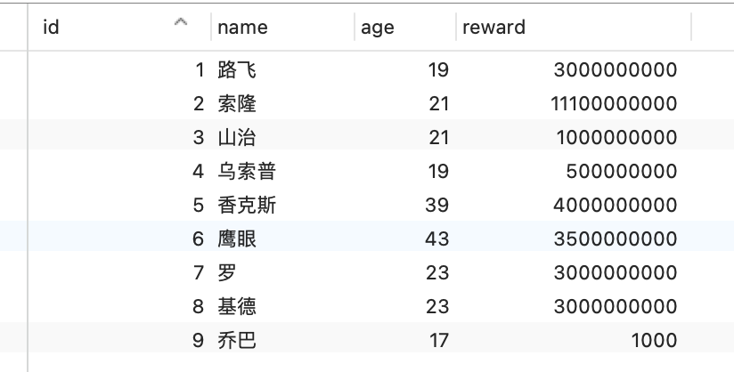
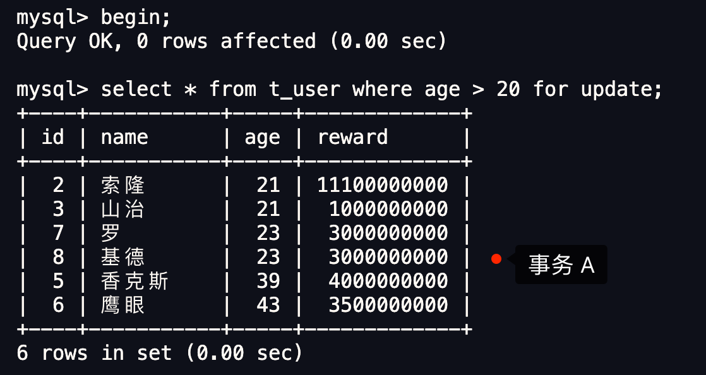
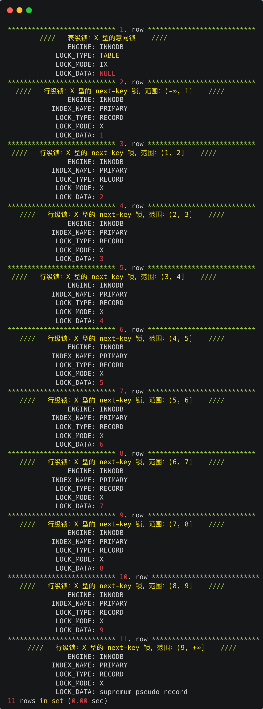
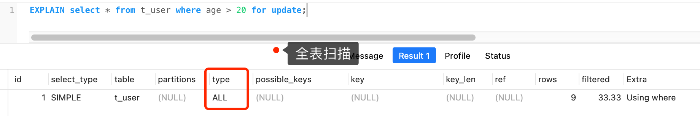
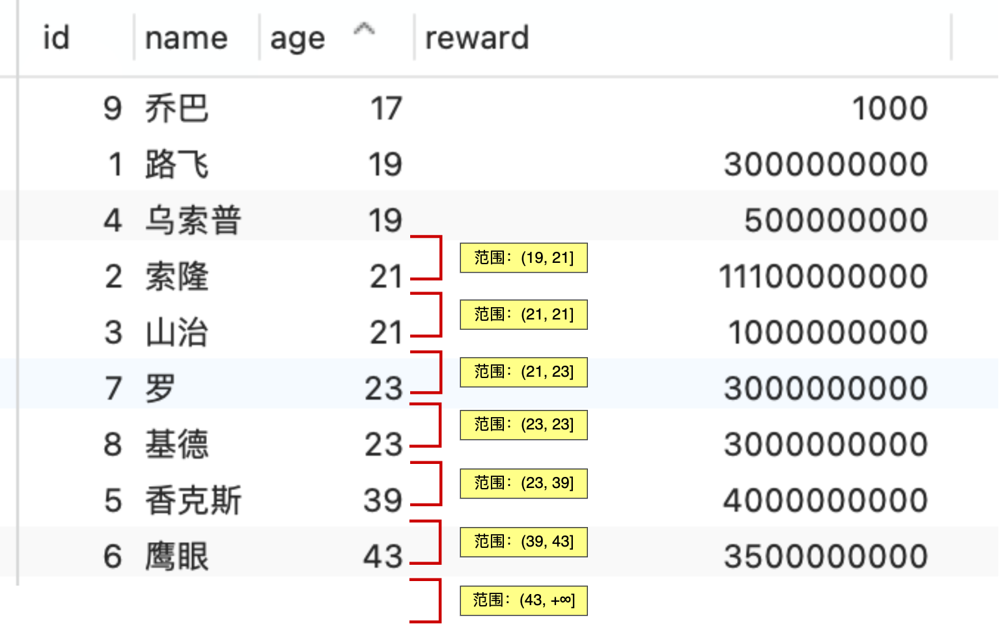
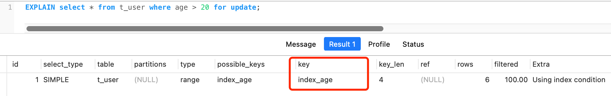
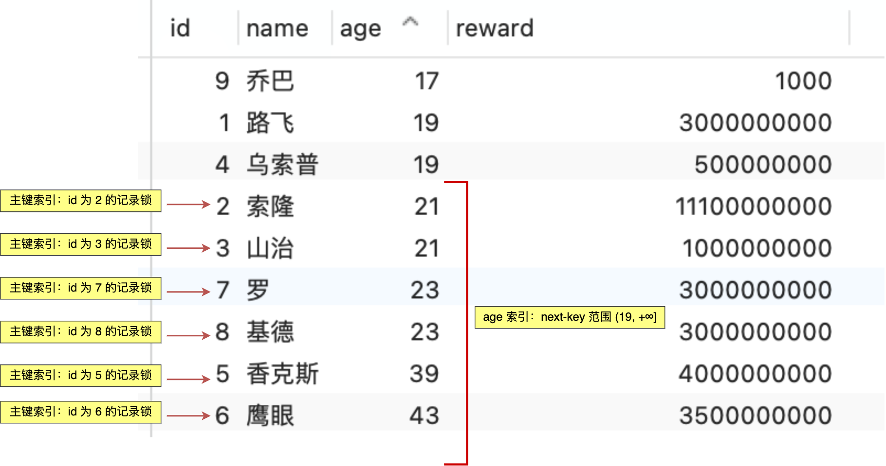

# MySQL记录锁+间隙锁可以防止删除操作而导致的幻读吗？

# MySQL 记录锁+间隙锁可以防止删除操作而导致的幻读吗？
**<font style="color:rgb(48, 79, 254);">MySQL 记录锁+间隙锁可以防止删除操作而导致的幻读吗？</font>**

<font style="color:rgb(44, 62, 80);">答案是可以的。</font>

<font style="color:rgb(44, 62, 80);">接下来，通过几个小实验来证明这个结论吧，顺便再帮大家复习一下记录锁+间隙锁。</font>

## [](https://xiaolincoding.com/mysql/lock/lock_phantom.html#%E4%BB%80%E4%B9%88%E6%98%AF%E5%B9%BB%E8%AF%BB)<font style="color:rgb(44, 62, 80);">什么是幻读？</font>
<font style="color:rgb(44, 62, 80);">首先来看看 MySQL 文档是怎么定义幻读（Phantom Read）的:</font>

_**<font style="color:rgb(48, 79, 254);">The so-called phantom problem occurs within a transaction when the same query produces different sets of rows at different times. For example, if a SELECT is executed twice, but returns a row the second time that was not returned the first time, the row is a “phantom” row.</font>**_

<font style="color:rgb(44, 62, 80);">翻译：当同一个查询在不同的时间产生不同的结果集时，事务中就会出现所谓的幻象问题。例如，如果 SELECT 执行了两次，但第二次返回了第一次没有返回的行，则该行是“幻像”行。</font>

<font style="color:rgb(44, 62, 80);">举个例子，假设一个事务在 T1 时刻和 T2 时刻分别执行了下面查询语句，途中没有执行其他任何语句：</font>


```sql
SELECT * FROM t_test WHERE id > 100;
```

<font style="color:rgb(44, 62, 80);">只要 T1 和 T2 时刻执行产生的结果集是不相同的，那就发生了幻读的问题，比如：</font>

+ <font style="color:rgb(44, 62, 80);">T1 时间执行的结果是有 5 条行记录，而 T2 时间执行的结果是有 6 条行记录，那就发生了幻读的问题。</font>
+ <font style="color:rgb(44, 62, 80);">T1 时间执行的结果是有 5 条行记录，而 T2 时间执行的结果是有 4 条行记录，也是发生了幻读的问题。</font>

<font style="color:rgb(44, 62, 80);background-color:rgb(227, 242, 253);">MySQL 是怎么解决幻读的？</font>

<font style="color:rgb(44, 62, 80);">MySQL InnoDB 引擎的默认隔离级别虽然是「可重复读」，但是它很大程度上避免幻读现象（并不是完全解决了，详见这篇</font>[文章(opens new window)](https://xiaolincoding.com/mysql/transaction/phantom.html)<font style="color:rgb(44, 62, 80);">），解决的方案有两种：</font>

+ <font style="color:rgb(44, 62, 80);">针对</font>**<font style="color:rgb(48, 79, 254);">快照读</font>**<font style="color:rgb(44, 62, 80);">（普通 select 语句），是</font>**<font style="color:rgb(48, 79, 254);">通过 MVCC 方式解决了幻读</font>**<font style="color:rgb(44, 62, 80);">，因为可重复读隔离级别下，事务执行过程中看到的数据，一直跟这个事务启动时看到的数据是一致的，即使中途有其他事务插入了一条数据，是查询不出来这条数据的，所以就很好了避免幻读问题。</font>
+ <font style="color:rgb(44, 62, 80);">针对</font>**<font style="color:rgb(48, 79, 254);">当前读</font>**<font style="color:rgb(44, 62, 80);">（select ... for update 等语句），是</font>**<font style="color:rgb(48, 79, 254);">通过 next-key lock（记录锁+间隙锁）方式解决了幻读</font>**<font style="color:rgb(44, 62, 80);">，因为当执行 select ... for update 语句的时候，会加上 next-key lock，如果有其他事务在 next-key lock 锁范围内插入了一条记录，那么这个插入语句就会被阻塞，无法成功插入，所以就很好了避免幻读问题。</font>

## [](https://xiaolincoding.com/mysql/lock/lock_phantom.html#%E5%AE%9E%E9%AA%8C%E9%AA%8C%E8%AF%81)<font style="color:rgb(44, 62, 80);">实验验证</font>
<font style="color:rgb(44, 62, 80);">接下来，来验证「 MySQL 记录锁+间隙锁</font>**<font style="color:rgb(48, 79, 254);">可以防止</font>**<font style="color:rgb(44, 62, 80);">删除操作而导致的幻读问题」的结论。</font>

<font style="color:rgb(44, 62, 80);">实验环境：MySQL 8.0 版本，可重复读隔离级。</font>

<font style="color:rgb(44, 62, 80);">现在有一张用户表（t_user），表里</font>**<font style="color:rgb(48, 79, 254);">只有一个主键索引</font>**<font style="color:rgb(44, 62, 80);">，表里有以下行数据：</font>



<font style="color:rgb(44, 62, 80);">现在有一个 A 事务执行了一条查询语句，查询到年龄大于 20 岁的用户共有 6 条行记录。</font>



<font style="color:rgb(44, 62, 80);">然后， B 事务执行了一条删除 id = 2 的语句：</font>


<font style="color:rgb(44, 62, 80);">此时，B 事务的删除语句就陷入了</font>**<font style="color:rgb(48, 79, 254);">等待状态</font>**<font style="color:rgb(44, 62, 80);">，说明是无法进行删除的。</font>

<font style="color:rgb(44, 62, 80);">因此，MySQL 记录锁+间隙锁</font>**<font style="color:rgb(48, 79, 254);">可以防止</font>**<font style="color:rgb(44, 62, 80);">删除操作而导致的幻读问题。</font>

## [](https://xiaolincoding.com/mysql/lock/lock_phantom.html#%E5%8A%A0%E9%94%81%E5%88%86%E6%9E%90)<font style="color:rgb(44, 62, 80);">加锁分析</font>
<font style="color:rgb(44, 62, 80);">问题来了，A 事务在执行 select ... for update 语句时，具体加了什么锁呢？</font>

<font style="color:rgb(44, 62, 80);">我们可以通过</font><font style="color:rgb(44, 62, 80);"> </font><font style="color:rgb(71, 101, 130);">select * from performance_schema.data_locks\G;</font><font style="color:rgb(44, 62, 80);"> </font><font style="color:rgb(44, 62, 80);">这条语句，查看事务执行 SQL 过程中加了什么锁。</font>

<font style="color:rgb(44, 62, 80);">输出的内容很多，共有 11 行信息，我删减了一些不重要的信息：</font>



<font style="color:rgb(44, 62, 80);">从上面输出的信息可以看到，共加了两种不同粒度的锁，分别是：</font>

+ <font style="color:rgb(44, 62, 80);">表锁（</font><font style="color:rgb(71, 101, 130);">LOCK_TYPE: TABLE</font><font style="color:rgb(44, 62, 80);">）：X 类型的意向锁；</font>
+ <font style="color:rgb(44, 62, 80);">行锁（</font><font style="color:rgb(71, 101, 130);">LOCK_TYPE: RECORD</font><font style="color:rgb(44, 62, 80);">）：X 类型的 next-key 锁；</font>

<font style="color:rgb(44, 62, 80);">这里我们重点关注「行锁」，图中</font><font style="color:rgb(44, 62, 80);"> </font><font style="color:rgb(71, 101, 130);">LOCK_TYPE</font><font style="color:rgb(44, 62, 80);"> </font><font style="color:rgb(44, 62, 80);">中的</font><font style="color:rgb(44, 62, 80);"> </font><font style="color:rgb(71, 101, 130);">RECORD</font><font style="color:rgb(44, 62, 80);"> </font><font style="color:rgb(44, 62, 80);">表示行级锁，而不是记录锁的意思：</font>

+ <font style="color:rgb(44, 62, 80);">如果 LOCK_MODE 为</font><font style="color:rgb(44, 62, 80);"> </font><font style="color:rgb(71, 101, 130);">X</font><font style="color:rgb(44, 62, 80);">，说明是 next-key 锁；</font>
+ <font style="color:rgb(44, 62, 80);">如果 LOCK_MODE 为</font><font style="color:rgb(44, 62, 80);"> </font><font style="color:rgb(71, 101, 130);">X, REC_NOT_GAP</font><font style="color:rgb(44, 62, 80);">，说明是记录锁；</font>
+ <font style="color:rgb(44, 62, 80);">如果 LOCK_MODE 为</font><font style="color:rgb(44, 62, 80);"> </font><font style="color:rgb(71, 101, 130);">X, GAP</font><font style="color:rgb(44, 62, 80);">，说明是间隙锁；</font>

<font style="color:rgb(44, 62, 80);">然后通过</font><font style="color:rgb(44, 62, 80);"> </font><font style="color:rgb(71, 101, 130);">LOCK_DATA</font><font style="color:rgb(44, 62, 80);"> </font><font style="color:rgb(44, 62, 80);">信息，可以确认 next-key 锁的范围，具体怎么确定呢？</font>

+ <font style="color:rgb(44, 62, 80);">根据我的经验，如果 LOCK_MODE 是 next-key 锁或者间隙锁，那么</font><font style="color:rgb(44, 62, 80);"> </font>**<font style="color:rgb(48, 79, 254);">LOCK_DATA 就表示锁的范围最右值</font>**<font style="color:rgb(44, 62, 80);">，而锁范围的最左值为 LOCK_DATA 的上一条记录的值。</font>

<font style="color:rgb(44, 62, 80);">因此，此时事务 A 在主键索引（</font><font style="color:rgb(71, 101, 130);">INDEX_NAME : PRIMARY</font><font style="color:rgb(44, 62, 80);">）上加了 10 个 next-key 锁，如下：</font>

+ <font style="color:rgb(44, 62, 80);">X 型的 next-key 锁，范围：(-∞, 1]</font>
+ <font style="color:rgb(44, 62, 80);">X 型的 next-key 锁，范围：(1, 2]</font>
+ <font style="color:rgb(44, 62, 80);">X 型的 next-key 锁，范围：(2, 3]</font>
+ <font style="color:rgb(44, 62, 80);">X 型的 next-key 锁，范围：(3, 4]</font>
+ <font style="color:rgb(44, 62, 80);">X 型的 next-key 锁，范围：(4, 5]</font>
+ <font style="color:rgb(44, 62, 80);">X 型的 next-key 锁，范围：(5, 6]</font>
+ <font style="color:rgb(44, 62, 80);">X 型的 next-key 锁，范围：(6, 7]</font>
+ <font style="color:rgb(44, 62, 80);">X 型的 next-key 锁，范围：(7, 8]</font>
+ <font style="color:rgb(44, 62, 80);">X 型的 next-key 锁，范围：(8, 9]</font>
+ <font style="color:rgb(44, 62, 80);">X 型的 next-key 锁，范围：(9, +∞]</font>

**<font style="color:rgb(48, 79, 254);">这相当于把整个表给锁住了，其他事务在对该表进行增、删、改操作的时候都会被阻塞</font>**<font style="color:rgb(44, 62, 80);">。</font>

<font style="color:rgb(44, 62, 80);">只有在事务 A 提交了事务，事务 A 执行过程中产生的锁才会被释放。</font>

<font style="color:rgb(44, 62, 80);background-color:rgb(227, 242, 253);">为什么只是查询年龄 20 岁以上行记录，而把整个表给锁住了呢？</font>

<font style="color:rgb(44, 62, 80);">这是因为事务 A 的这条查询语句是</font>**<font style="color:rgb(48, 79, 254);">全表扫描，锁是在遍历索引的时候加上的，并不是针对输出的结果加锁</font>**<font style="color:rgb(44, 62, 80);">。</font>



<font style="color:rgb(44, 62, 80);">因此，</font>**<font style="color:rgb(48, 79, 254);">在线上在执行 update、delete、select ... for update 等具有加锁性质的语句，一定要检查语句是否走了索引，如果是全表扫描的话，会对每一个索引加 next-key 锁，相当于把整个表锁住了</font>**<font style="color:rgb(44, 62, 80);">，这是挺严重的问题。</font>

<font style="color:rgb(44, 62, 80);background-color:rgb(227, 242, 253);">如果对 age 建立索引，事务 A 这条查询会加什么锁呢？</font>

<font style="color:rgb(44, 62, 80);">接下来，我</font>**<font style="color:rgb(48, 79, 254);">对 age 字段建立索引</font>**<font style="color:rgb(44, 62, 80);">，然后再执行这条查询语句：</font>


<font style="color:rgb(44, 62, 80);">接下来，继续通过</font><font style="color:rgb(44, 62, 80);"> </font><font style="color:rgb(71, 101, 130);">select * from performance_schema.data_locks\G;</font><font style="color:rgb(44, 62, 80);"> </font><font style="color:rgb(44, 62, 80);">这条语句，查看事务执行 SQL 过程中加了什么锁。</font>

<font style="color:rgb(44, 62, 80);">具体的信息，我就不打印了，我直接说结论吧。</font>

**<font style="color:rgb(48, 79, 254);">因为表中有两个索引，分别是主键索引和 age 索引，所以会分别对这两个索引加锁。</font>**

<font style="color:rgb(44, 62, 80);">主键索引会加如下的锁：</font>

+ <font style="color:rgb(44, 62, 80);">X 型的记录锁，锁住 id = 2 的记录；</font>
+ <font style="color:rgb(44, 62, 80);">X 型的记录锁，锁住 id = 3 的记录；</font>
+ <font style="color:rgb(44, 62, 80);">X 型的记录锁，锁住 id = 5 的记录；</font>
+ <font style="color:rgb(44, 62, 80);">X 型的记录锁，锁住 id = 6 的记录；</font>
+ <font style="color:rgb(44, 62, 80);">X 型的记录锁，锁住 id = 7 的记录；</font>
+ <font style="color:rgb(44, 62, 80);">X 型的记录锁，锁住 id = 8 的记录；</font>

<font style="color:rgb(44, 62, 80);">分析 age 索引加锁的范围时，要先对 age 字段进行排序。</font>



<font style="color:rgb(44, 62, 80);">age 索引加的锁：</font>

+ <font style="color:rgb(44, 62, 80);">X 型的 next-key lock，锁住 age 范围 (19, 21] 的记录；</font>
+ <font style="color:rgb(44, 62, 80);">X 型的 next-key lock，锁住 age 范围 (21, 21] 的记录；</font>
+ <font style="color:rgb(44, 62, 80);">X 型的 next-key lock，锁住 age 范围 (21, 23] 的记录；</font>
+ <font style="color:rgb(44, 62, 80);">X 型的 next-key lock，锁住 age 范围 (23, 23] 的记录；</font>
+ <font style="color:rgb(44, 62, 80);">X 型的 next-key lock，锁住 age 范围 (23, 39] 的记录；</font>
+ <font style="color:rgb(44, 62, 80);">X 型的 next-key lock，锁住 age 范围 (39, 43] 的记录；</font>
+ <font style="color:rgb(44, 62, 80);">X 型的 next-key lock，锁住 age 范围 (43, +∞] 的记录；</font>

<font style="color:rgb(44, 62, 80);">化简一下，</font>**<font style="color:rgb(48, 79, 254);">age 索引 next-key 锁的范围是 (19, +∞]。</font>**

<font style="color:rgb(44, 62, 80);">可以看到，对 age 字段建立了索引后，查询语句是索引查询，并不会全表扫描，因此</font>**<font style="color:rgb(48, 79, 254);">不会把整张表给锁住</font>**<font style="color:rgb(44, 62, 80);">。</font>



<font style="color:rgb(44, 62, 80);">总结一下，在对 age 字段建立索引后，事务 A 在执行下面这条查询语句后，主键索引和 age 索引会加下图中的锁。</font>



<font style="color:rgb(44, 62, 80);">事务 A 加上锁后，事务 B、C、D、E 在执行以下语句都会被阻塞。</font>


## [](https://xiaolincoding.com/mysql/lock/lock_phantom.html#%E6%80%BB%E7%BB%93)<font style="color:rgb(44, 62, 80);">总结</font>
<font style="color:rgb(44, 62, 80);">在 MySQL 的可重复读隔离级别下，针对当前读的语句会对</font>**<font style="color:rgb(48, 79, 254);">索引</font>**<font style="color:rgb(44, 62, 80);">加记录锁+间隙锁，这样可以避免其他事务执行增、删、改时导致幻读的问题。</font>

<font style="color:rgb(44, 62, 80);">有一点要注意的是，在执行 update、delete、select ... for update 等具有加锁性质的语句，一定要检查语句是否走了索引，如果是全表扫描的话，会对每一个索引加 next-key 锁，相当于把整个表锁住了，这是挺严重的问题。</font>

<font style="color:rgb(44, 62, 80);">完！</font>


> 更新: 2024-02-07 01:07:13  
原文: [https://www.yuque.com/vip6688/neho4x/dkr2432lvsp0qn2t](https://www.yuque.com/vip6688/neho4x/dkr2432lvsp0qn2t)
>


> 更新: 2024-11-25 09:21:09  
> 原文: <https://www.yuque.com/neumx/laxg2e/5960335334e7dfee06dc0c3b954765a4>