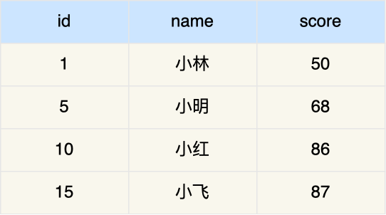
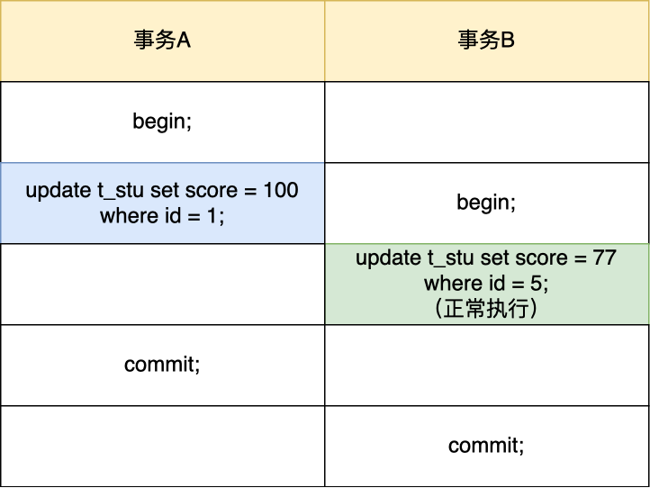
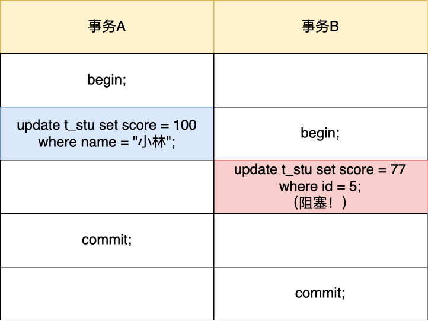
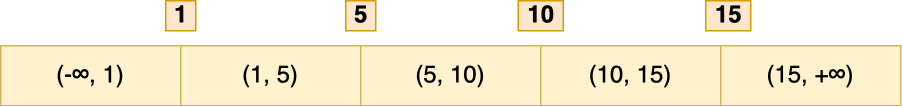

# update没加索引会锁全表

# update 没加索引会锁全表
在线上执行一条 update 语句修改数据库数据的时候，where 条件没有带上索引，导致业务直接崩了，被老板教训了一波

这次我们就来看看：

+ 为什么会发生这种的事故？
+ 又该如何避免这种事故的发生？

说个前提，接下来说的案例都是基于 InnoDB 存储引擎，且事务的隔离级别是可重复读。

## 为什么会发生这种的事故？
InnoDB 存储引擎的默认事务隔离级别是「可重复读」，但是在这个隔离级别下，在多个事务并发的时候，会出现幻读的问题，所谓的幻读是指在同一事务下，连续执行两次同样的查询语句，第二次的查询语句可能会返回之前不存在的行。

因此 InnoDB 存储引擎自己实现了行锁，通过 next-key 锁（记录锁和间隙锁的组合）来锁住记录本身和记录之间的“间隙”，防止其他事务在这个记录之间插入新的记录，从而避免了幻读现象。

当我们执行 update 语句时，实际上是会对记录加独占锁（X 锁）的，如果其他事务对持有独占锁的记录进行修改时是会被阻塞的。另外，这个锁并不是执行完 update 语句就会释放的，而是会等事务结束时才会释放。

在 InnoDB 事务中，对记录加锁的基本单位是 next-key 锁，但是会因为一些条件会退化成间隙锁，或者记录锁。加锁的位置准确的说，锁是加在索引上的而非行上。

比如，在 update 语句的 where 条件使用了唯一索引，那么 next-key 锁会退化成记录锁，也就是只会给一行记录加锁。

这里举个例子，这里有一张数据库表，其中 id 为主键索引。

假设有两个事务的执行顺序如下：

可以看到，事务 A 的 update 语句中 where 是等值查询，并且 id 是唯一索引，所以只会对 id = 1 这条记录加锁，因此，事务 B 的更新操作并不会阻塞。

但是，**在 update 语句的 where 条件没有使用索引，就会全表扫描，于是就会对所有记录加上 next-key 锁（记录锁 + 间隙锁），相当于把整个表锁住了**。

假设有两个事务的执行顺序如下：

可以看到，这次事务 B 的 update 语句被阻塞了。

这是因为事务 A的 update 语句中 where 条件没有索引列，触发了全表扫描，在扫描过程中会对索引加锁，所以全表扫描的场景下，所有记录都会被加锁，也就是这条 update 语句产生了 4 个记录锁和 5 个间隙锁，相当于锁住了全表。

因此，当在数据量非常大的数据库表执行 update 语句时，如果没有使用索引，就会给全表的加上 next-key 锁， 那么锁就会持续很长一段时间，直到事务结束，而这期间除了 select ... from语句，其他语句都会被锁住不能执行，业务会因此停滞，接下来等着你的，就是老板的挨骂。

那 update 语句的 where 带上索引就能避免全表记录加锁了吗？

并不是。

**关键还得看这条语句在执行过程种，优化器最终选择的是索引扫描，还是全表扫描，如果走了全表扫描，就会对全表的记录加锁了**。

**TIP**

网上很多资料说，update 没加锁索引会加表锁，这是不对的。

Innodb 源码里面在扫描记录的时候，都是针对索引项这个单位去加锁的， update 不带索引就是全表扫扫描，也就是表里的索引项都加锁，相当于锁了整张表，所以大家误以为加了表锁。

## 如何避免这种事故的发生？
我们可以将 MySQL 里的 sql_safe_updates 参数设置为 1，开启安全更新模式。

官方的解释： If set to 1, MySQL aborts UPDATE or DELETE statements that do not use a key in the WHERE clause or a LIMIT clause. (Specifically, UPDATE statements must have a WHERE clause that uses a key or a LIMIT clause, or both. DELETE statements must have both.) This makes it possible to catch UPDATE or DELETE statements where keys are not used properly and that would probably change or delete a large number of rows. The default value is 0.

大致的意思是，当 sql_safe_updates 设置为 1 时。

update 语句必须满足如下条件之一才能执行成功：

+ 使用 where，并且 where 条件中必须有索引列；
+ 使用 limit；
+ 同时使用 where 和 limit，此时 where 条件中可以没有索引列；

delete 语句必须满足以下条件能执行成功：

+ 同时使用 where 和 limit，此时 where 条件中可以没有索引列；

如果 where 条件带上了索引列，但是优化器最终扫描选择的是全表，而不是索引的话，我们可以使用 force index([index_name]) 可以告诉优化器使用哪个索引，以此避免有几率锁全表带来的隐患。

## 总结
不要小看一条 update 语句，在生产机上使用不当可能会导致业务停滞，甚至崩溃。

当我们要执行 update 语句的时候，确保 where 条件中带上了索引列，并且在测试机确认该语句是否走的是索引扫描，防止因为扫描全表，而对表中的所有记录加上锁。

我们可以打开 MySQL sql_safe_updates 参数，这样可以预防 update 操作时 where 条件没有带上索引列。

如果发现即使在 where 条件中带上了列索引列，优化器走的还是全标扫描，这时我们就要使用 force index([index_name]) 可以告诉优化器使用哪个索引。

这次就说到这啦，下次要小心点，别再被老板挨骂啦。

> 更新: 2024-04-06 22:11:06  
原文: [https://www.yuque.com/vip6688/neho4x/vdh9c78s57wfqoqo](https://www.yuque.com/vip6688/neho4x/vdh9c78s57wfqoqo)
>

> 更新: 2024-11-25 09:21:10  
> 原文: <https://www.yuque.com/neumx/laxg2e/8b476020ed9d8d53d10e483d09afd834>