# Redis八股

# <u></u>基础
## 什么是Redis?
Redis 是一种基于内存的数据库，对数据的读写操作都是在内存中完成，因此读写速度非常快， 支持多种数据结构,常用于**缓存，消息队列、分布式锁**等场景。

## Redis和MySQL的区别？
+ Redis：数据存储在内存中的 NoSQL 数据库，读写性能非常好，是互联网技术领域中使用最广泛的缓存中间件。
+ MySQL：数据存储在硬盘中的关系型数据库，适用于需要事务支持和复杂查询的场景。

## Redis 和 Memcached 有什么区别？
很多人都说用 Redis 作为缓存，但是 Memcached 也是基于内存的数据库，为什么不选择它作为缓存呢？要解答这个问题，我们就要弄清楚 Redis 和 Memcached 的区别。 Redis 与 Memcached 共同点：

    -     都是基于内存的数据库，一般都用来当做缓存使用。
    -     都有过期策略。
    -     两者的性能都非常高。

Redis 与 Memcached 区别：

    -     Redis 支持的数据类型更丰富（String、Hash、List、Set、ZSet），而 Memcached 只支持最简单的 key-value 数据类型；
    -     Redis 支持数据的持久化，可以将内存中的数据保持在磁盘中，重启的时候可以再次加载进行使用，而 Memcached 没有持久化功能，数据全部存在内存之中，Memcached 重启或者挂掉后，数据就没了；
    -     Redis 原生支持集群模式，Memcached 没有原生的集群模式，需要依靠客户端来实现往集群中分片写入数据；
    -     Redis 支持发布订阅模型、Lua 脚本、事务等功能，而 Memcached 不支持；

## Redis可以用来干什么？
Redis 可以用来做缓存、排行榜、分布式锁等等。

**①、缓存**

缓存是 Redis 最常见的用途，由于 Redis 的数据存储在内存中，所以读写速度非常快，远超基于磁盘存储的数据库。使用 Redis 缓存可以极大地提高应用的响应速度和吞吐量。

**②、排行榜/计数器**

Redis 的 ZSet 非常适合用来实现排行榜的功能，可以根据 score（分值）进行排序，实时展示用户排名。

**③、分布式锁**

Redis 可以实现分布式锁，用来控制跨多个进程的资源访问。

## Redis 为什么快呢？
①、**数据在内存中存储**：Redis 将数据存储在内存中，读写速度极快。

②、**单线程模型**: Redis 使用单线程处理请求，避免了多线程的上下文切换带来的开销。

③、**高效的数据结构**，Redis 提供了多种高效的数据结构，如字符串（String）、列表（List）等，这些数据结构经过了高度优化，能够支持快速的数据操作。

 ④、**IO 多路复⽤**，Redis 基于 Linux 的 select 和 epoll 机制实现 IO 多路复用。这使得 Redis 可以在单线程中高效处理多个连接请求，避免了传统的阻塞式 IO 操作。 

## 能说一下I/O多路复用吗？
[9.2 I/O 多路复用：select/poll/epoll](https://www.xiaolincoding.com/os/8_network_system/selete_poll_epoll.html#%E6%9C%80%E5%9F%BA%E6%9C%AC%E7%9A%84-socket-%E6%A8%A1%E5%9E%8B)


候选人：IO 多路复用技术是一种允许单个线程管理多个 IO通道的技术，它使得服务器能够高效地处理大量的并发连接而不需要为每个连接创建一个独立的线程。  
**I/O多路复用的特点**

    - **单线程处理多个I/O**：通过一个线程处理多个I/O任务，减少了线程切换的开销。
    - **事件驱动**：基于事件通知机制，当I/O事件发生时才处理，避免轮询和空闲等待。

**常见的I/O多路复用机制**

    - **select()：**最早的 I/O 多路复用机制，通过一个固定大小的文件描述符集合来监控多个文件描述符，但效率较低，每次调用都需要遍历所有的文件描述符。（文件描述符数量有限；select 的监控上限通常为 1024 或 2048（根据操作系统配置））
    - **poll()：**类似 select()，但它的文件描述符集不再是固定大小的数组，改为链表，解决了 select() 的限制问题，但性能仍然没有提升太多。（和 select 一样，每次调用时都需要遍历整个文件描述符集合，因此在大规模的文件描述符情况下性能不佳。）
    - **epoll()：**Linux 提供的高效 I/O 多路复用机制，采用事件驱动的方式，能够在文件描述符状态变化时主动通知，大大提升了性能（原理：epoll 使用红黑树来存储文件描述符， 在事件发生时通过链表返回已准备好的文件描述符）。

**epoll()触发模式：**

    - **水平触发 (LT)**：只要文件描述符有数据，`epoll` 会持续通知，直到数据被处理完。
    - **边缘触发 (ET)**：只有在文件描述符的状态发生变化时，`epoll` 才会通知一次，之后直到新的状态变化才会再次通知。	

| 特性 | **水平触发 (LT)** | **边缘触发 (ET)** |
| --- | --- | --- |
| **触发条件** | 只要文件描述符有数据，事件会持续触发 | 只有当文件描述符的状态变化时，事件才会触发 |
| **通知频率** | 高，直到事件被处理完 | 低，只会触发一次，直到状态变化 |
| **复杂度** | 简单易用，类似 `select` 和 `poll` | 稍复杂，需要确保处理所有数据 |
| **适用场景** | 常见应用，数据量不大或者不需要高效处理 | 高并发、数据量大时，减少不必要的通知和遍历 |


## Redis常用命令
## 单线程Redis的QPS是多少？
Redis单线程来每秒10w的QPS

# 底层结构
## Redis 有哪些数据类型
**原理：**[**Redis 常见数据类型和应用场景**](https://xiaolincoding.com/redis/data_struct/command.html)


1. **String**  
**介绍**
    - String 是 Redis 中最基本的数据类型，可以存储其他类型的数据（如数字、字符串、二进制数据等），value 最多可以容纳的数据长度是 512M。

**内部实现**

    - 简单动态字符串 (SDS)：Redis 使用 SDS (Simple Dynamic String) 来实现其 String 类型。与 C 语言中的字符串不同，SDS 是动态长度的，可以避免缓冲区溢出并提高修改效率。

**为什么使用SDS**

    - **SDS 获取字符串长度的时间复杂度是 O(1)。**因为 C 语言的字符串并不记录自身长度，所以获取长度的复杂度为 O(n)；而 SDS 结构里用 len 属性记录了字符串长度，所以复杂度为 O(1)。
    - **SDS 不仅可以保存文本数据，还可以保存二进制数据。**因为 SDS 使用 len 属性的值而不是空字符来判断字符串是否结束，并且 SDS 的所有 API 都会以处理二进制的方式来处理元素。所以 SDS 不光能存放文本数据，而且能保存图片、视频等二进制数据。
    - **Redis 的 SDS API 是安全的，拼接字符串不会造成缓冲区溢出。**因为 SDS 在拼接字符串之前会检查 SDS 空间是否满足要求，如果空间不够会自动扩容，所以不会导致缓冲区溢出的问题。

**应用场景**

    - **缓存数据：**例如，缓存用户信息、会话数据等。
    - **计数器：**用于实现访问量、点赞数等功能。
    - **分布式锁：**通过设置特定值和过期时间，可以实现简单的分布式锁功能。

---

2. **Hash**  
**介绍**
    - Hash 是一种键值对集合，通常用于存储对象信息，例如用户信息或配置数据。

**内部实现**

    - **压缩列表 (ziplist)**：当数据量较少的情况下，hash底层会使用压缩列表ziplist进行存储数据。（如果哈希类型元素个数小于 512 个（默认值，可由 hash-max-ziplist-entries 配置），所有值小于 64 字节（默认值，可由 hash-max-ziplist-value 配置）的话，Redis 会使用压缩列表作为 Hash 类型的底层数据结构；）

**Ziplist 是 Redis 中为节 z 少且数据较短的元素。**

(压缩列表是为节约内存⽽开发的顺序性数据结构，它可以包含任意多个节点，每个节点可以保存⼀个字节数组或者整数值。)

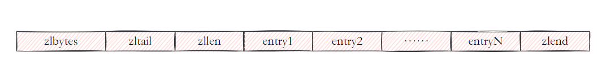

    - **哈希表 (hashtable)：**当数据量大的情况下，Redis 会自动将其转换为哈希表来提高操作效率。

**应用场景**

    - **存储用户信息：**例如存储用户 ID、名称、邮箱等信息，每个字段都可以独立操作。
    - **对象数据映射：**适合将数据库表记录映射到 Hash 中。

**在 Redis 7.0 中，压缩列表数据结构已经废弃了，交由 ****<font style="color:#DF2A3F;">listpack 数据结构</font>****来实现了**。  

---

3. **List**  
**介绍**
+ List 底层实现为一个双向链表，支持在两端进行插入和删除操作。  
**内部实现**  
Redis3.2之前的底层实现方式：
    - **压缩列表 (ziplist)：**当list存储的数据量较少时，会使用ziplist存储数据。（如果列表的元素个数小于 512 个（默认值，可由 list-max-ziplist-entries 配置），列表每个元素的值都小于 64 字节（默认值，可由 list-max-ziplist-value 配置），Redis 会使用压缩列表作为 List 类型的底层数据结构；）
    - **双向链表 (linkedlist)：**当元素较多时，Redis 使用双向链表实现，保证两端的快速插入和删除操作。

**Redis3.2及之后的底层实现方式：quicklist**

    - **quicklist是一个双向链表**，而且是一个基于ziplist的双向链表，quicklist的每个节点都是一个ziplist，结合了双向链表和ziplist的优点。

 **应用场景**

    - **消息队列：**List 可以用作轻量级的消息队列（如生产者消费者模型）。
    - **任务列表：**可以用于管理任务的添加、删除和顺序执行。

---

4. **Set**  
**介绍**

Set 是一个无序集合，支持元素的添加、删除和判断是否存在。

**内部实现**

    - **整数集合 (intset)：**当集合中的元素全部为整数且元素数量较少时，使用整数集合来节省内存。

整数集合 (intset)是一种紧凑的数据结构，用来存储元素数量较少的小整数。

    - **哈希表 (hashtable)：**当元素较多或有非整数元素时，Redis 使用哈希表实现。

**应用场景**

    - **社交应用**：例如存储用户的**好友列表、关注列表**等。
    - **标签功能**：可以用于存储文章的标签或用户兴趣爱好，方便查找和交集计算。

---

5. **ZSet（有序集合）**  
**介绍**
    - Sorted Set 与 Set 类似，不同的是每个元素会关联一个分数（score），并且集合中的元素会按分数从小到大排序。

**内部实现**

    - **压缩列表 (ziplist)：**当集合中的元素和分数较少时，使用压缩列表实现。（如果有序集合的元素个数小于 128 个，并且每个元素的值小于 64 字节时，Redis 会使用压缩列表作为 Zset 类型的底层数据结构）
    - **在 Redis 7.0 中，压缩列表数据结构已经废弃了，交由 listpack 数据结构来实现了。**
    - **跳表 (skiplist)：**当元素较多时，使用跳表来实现，保证有序性和快速查找。

**应用场景**

    - **排行榜：例如根据用户积分进行排名。**
    - **延时任务：根据任务的执行时间进行排序，取出需要优先执行的任务。**

---

6. **Bitmap**

**原理与实现**  
Redis 中的 `Bitmap` 实际上是基于 **String** 类型实现的，因为字符串底层是 SDS（简单动态字符串），可以存储二进制数据。`Bitmap` 将字符串的每个字节（8 位）看作一组位（bit），每一位可以表示一个二进制状态（0 或 1）。  

**作用**  

    - **节省内存**：每个位仅占 1 bit，适合存储大量二进制状态。
    - **高效操作**：快速执行位操作，适用于标志位、计数等大规模数据处理。

---

7. **HyperLogLog**

**原理与实现**

HyperLogLog 是一种基于概率的数据结构，用于估算不同元素的数量。它通过哈希函数将元素映射到多个桶中，记录哈希值前导零的数量。最后通过数学公式估算基数。由于使用的是概率算法，它不存储实际元素，只保存统计信息，因此占用极少内存。

**作用**

+ **节省内存**：估算基数时只需很小的内存，适合大数据集。
+ **高效计算**：快速估算唯一元素数量，适用于去重和统计。

#### **应用场景**
+  统计网站日活用户（DAU）、月活用户（MAU）  点击量等。

HyperLogLog 能在内存使用非常低的情况下高效估算大规模数据的基数，适用于实时数据处理。

---

## Redis的SDS和C中字符串相比有什么优势？
    - **SDS 获取字符串长度的时间复杂度是 O(1)。**因为 C 语言的字符串并不记录自身长度，所以获取长度的复杂度为 O(n)；而 SDS 结构里用 len 属性记录了字符串长度，所以复杂度为 O(1)。
    - **SDS 不仅可以保存文本数据，还可以保存二进制数据。**因为 SDS 使用 len 属性的值而不是空字符来判断字符串是否结束，并且 SDS 的所有 API 都会以处理二进制的方式来处理元素。所以 SDS 不光能存放文本数据，而且能保存图片、视频等二进制数据。
    - **Redis 的 SDS API 是安全的，拼接字符串不会造成缓冲区溢出。**因为 SDS 在拼接字符串之前会检查 SDS 空间是否满足要求，如果空间不够会自动扩容，所以不会导致缓冲区溢出的问题。

## 字典是如何实现的？Rehash了解吗？
Redis 中的字典相当于 Java 中的 **HashMap**，内部实现也差不多类似，采用 **哈希与运算** 计算下标位置；通过 "**数组 + 链表**" 的链地址法来解决哈希冲突，字典结构内部包含 **两个 hashtable**，通常情况下只有一个哈希表 **ht[0]** 有值，在扩容的时候，把 **ht[0]** 里的值 **rehash** 到 **ht[1]**，然后进行 **渐进式 rehash** ——所谓 **渐进式 rehash**，指的是这个 rehash 的动作并不是一次性、集中式地完成的，而是分多次、渐进式地完成的。待搬迁结束后，**ht[1]** 就取代 **ht[0]** 存储字典的元素。

## **哈希表是怎么扩容的？（渐进式hash）**
**当数据量太多需要扩容的时候，采用渐进式哈希的实现**

渐进式哈希通过分阶段迁移元素来缓解上述问题。主要步骤如下：

    - **触发扩展**：当哈希表的负载因子达到预设阈值时，触发哈希表的扩展。
    - 
    - **创建新哈希表**： 给「哈希表 2」 分配空间（通常是原表容量的两倍）。
    - **逐步迁移**：
        * **逐步迁移**：在每次插入、删除或查找操作中，将部分元素从旧哈希表迁移到新哈希表中，而不是一次性迁移所有元素。
        * **操作分摊**：迁移过程在所有操作中分摊，减少了对单个操作的性能影响。
    - **完成迁移**：当所有元素都迁移到新哈希表中后，替换掉旧的哈希表。

**哈希表扩容的时候，有读请求怎么查？**

查找一个 key 的值的话，先会在「哈希表 1」 里面进行查找，如果没找到，就会继续到哈希表 2 里面进行找到。插入的话，就是直接插入哈希表2.

另外，在渐进式 rehash 进行期间，新增一个 key-value 时，会被保存到「哈希表 2 」里面

## 跳表是如何实现的？原理？
 **跳表**（**Skip List**）是一种 **有序数据结构**，它通过在普通有序链表的基础上增加 **多层索引** （也就是多层链表）来提高查找效率。跳表的 **查找**、**插入** 和 **删除** 操作的 **平均时间复杂度** 都是 **O(log N)**，且它比 **平衡树** 更加 **简单** 且 **易于实现**。 

##  跳表的查询过程讲一下
跳表的查询过程如下：

        * **从顶层开始**：查询从跳表的最顶层（Level 3）开始，沿着当前层的链表向右查找，直到遇到比目标元素大的节点。
        * **跳到下一层**：当当前节点小于目标元素时，继续向右跳；当节点大于目标元素时，跳到下一层链表继续查找。
        * **重复查找**：这个过程会一直重复，直到查询到底层链表（Level 1）。

## 跳表是怎么设置层高的？
跳表在创建节点时候，会生成范围为 **[0-1]** 的一个 **随机数**，如果这个随机数小于一个固定概率（比如<font style="color:rgba(0, 0, 0, 0.85);"> 1/2 或 1/4</font>），那么 **层数** 就增加 **1 层**，然后继续生成下一个随机数，直到随机数的结果大于 **0.25** 结束，最终确定该节点的 **层数**。

## Redis为什么使用跳表而不是用平衡树?
+ **实现简单**：跳表的实现简单，维护成本低，无需复杂的旋转和重平衡操作。
+ **内存开销小**：跳表的内存开销较小，结构紧凑。
+ 在做 **范围查找** 的时候，跳表比平衡树操作要简单。跳表利用 **索引层** 简化了范围查找过程，而平衡树需要更多的结构调整和操作。

## 压缩列表了解吗？
 压缩列表是一种 **内存连续** 的数据结构，它将多个数据元素按照某种方式紧凑地存储在一个连续的内存块中。每个元素的存储格式是变长的，具体存储方式是基于数据类型的不同，采用了一些压缩算法和机制来减少存储开销。  

## 快速列表quicklist了解吗？
quicklist是一个双向链表，而且是一个基于ziplist的双向链表，quicklist的每个节点都包含一个ziplist，结合了双向链表和ziplist的优点。能够在高效存储的同时，提供较好的查找和插入性能。

## 介绍一下 Redis 中的 listpack
在`ziplist`中，由于每个节点记录前一个节点的长度，修改某个节点会导致后续节点的前一个节点长度字段也需要被更新，从而引发连锁更新。

**listpack** 和 **ziplist**（压缩列表）在结构上非常相似 ，但是 listpack 只记录当前节点的长度，当我们向 listpack 加入一个新元素的时候，不会影响其他节点的长度字段的变化，从而避免了压缩列表的连锁更新问题

# Redis 线程模型
## Redis 是单线程吗？
**Redis 单线程**指的就是**命令的执行是由一个线程（主线程）来完成的**，包括接收请求、解析请求、数据读写和响应等所有操作。这也是我们常说 Redis 是单线程的原因。

 但是，**Redis 程序并不是单线程的**，Redis 在启动的时候，**会使用额外的后台线程**,  **比如 AOF 刷盘、内存回收等，这些操作不会影响主线程的性能。  **

## Redis为什么早期选择单线程？
 因为 Redis 是基于内存的操作，**CPU 并不是制约 Redis 性能表现的瓶颈所在**，**Redis 的瓶颈最有可能是内存的大小或者网络限制**。  

## Redis6.0使用多线程是怎么回事?
为了提高网络 I/O 的性能，Redis 6.0 对于网络 I/O 采用多线程来处理。用多线程来处理数据的**读写和协议解析**，但是 Redis**执行命令**还是单线程的。

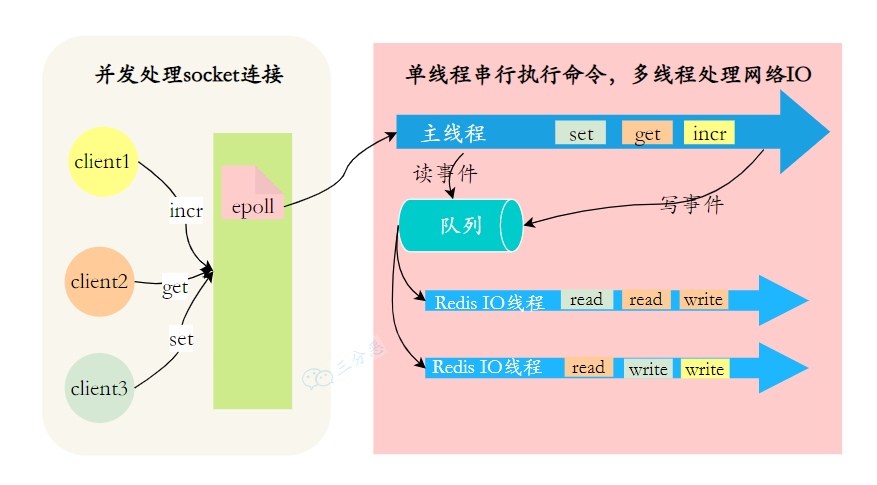0. 

这样做的⽬的是因为 Redis 的性能瓶颈在于⽹络 IO ⽽⾮ CPU，使⽤多线程能提升 IO 读写的效率，从⽽整体提⾼ Redis 的性能。

# 持久化
[Redis 常见面试题](https://www.xiaolincoding.com/redis/base/redis_interview.html#redis-%E5%A6%82%E4%BD%95%E5%AE%9E%E7%8E%B0%E6%95%B0%E6%8D%AE%E4%B8%8D%E4%B8%A2%E5%A4%B1)（里面有关于 AOF 和 RDB 的详细解释，到时候得看一下）

## Redis持久化方式有哪些？有什么区别？
+ **RDB（Redis 数据库快照）: Redis 会在指定的时间间隔内将内存中的数据生成一个快照文件（.rdb 文件）并保存到磁盘。  **
+ **AOF（追加文件日志）： Redis 会将所有的写操作以命令的形式追加到aof 文件中。  **
+ **混合持久化（RDB + AOF）：结合了 RDB 和 AOF 两种持久化方式，在启动时先加载 RDB 快照恢复数据，然后使用 AOF 日志恢复最后的增量操作。 **

## 说一下RDB？
**Redis 会在指定的时间间隔内将内存中的数据生成一个快照文件（.rdb 文件）并保存到磁盘中。当 Redis 重启时，它会加载最近的 RDB 快照文件， 将内存数据恢复到 Redis 中 。**

### RDB 创建快照时会阻塞主线程吗？
Redis 提供了两个命令来生成 RDB 快照文件：

    - `save` : 同步保存，会阻塞主线程
    - `bgsave` : fork 出一个子进程，异步保存，不会阻塞主线程。（默认的）

## 说一下AOF？
**Redis 会将所有的写操作以命令的形式追加到aof 文件中。  当 Redis 重启时，会回放 AOF 文件中的所有命令，从而恢复数据。**

### AOF 同步策略
        * `**appendfsync always**`：每次写操作后都同步到磁盘，最安全，但性能最差。
        * `**appendfsync everysec**`：每秒同步一次到磁盘，平衡了性能和数据安全性，默认设置。
        * `**appendfsync no**`：让操作系统决定何时同步到磁盘，性能最优，但可能会丢失部分数据。

## RDB和AOF各自有什么优缺点？
+ **RDB 优缺点**
+ **优点：**
    - **文件内存小：**RDB文件是二进制数据文件，占用的空间较小，便于传输和备份。
    - **恢复速度快：**由于RDB文件较小，数据恢复时速度非常快，适合大规模数据的备份和恢复。
    - **对性能影响较小：**在持久化时，Redis主进程只需fork出一个子进程，主进程可以继续处理请求，因此对性能的影响较小。
+ **缺点：**
    - **数据可能丢失：**由于RDB是间隔一段时间进行快照，如果Redis在快照间隔内崩溃，可能会丢失最近一次快照后的数据。
    - **生成快照开销大**：在写操作频繁的场景下，生成快照可能会影响 Redis 的性能。
+ **AOF 优缺点**
+ **优点：**
    - **数据安全性高**：AOF 记录了每个写操作，理论上可以避免数据丢失，适用于对数据完整性要求高的场景。
    - **灵活性强**：可以根据不同的同步策略（每秒同步、每次同步或从不同步）在性能和数据安全性之间找到平衡。
    - **可读性强：**AOF文件以Redis命令形式保存，文件可读，可以方便地查看和修改日志内容。
    - **支持增量备份**：AOF 可以记录所有数据操作的增量变化，方便追溯和恢复特定状态。
+ **缺点：**
    - **性能较差**： AOF 需要定期 **Rewrite（重写），**带来一定的资源消耗。
    - **文件较大**：AOF 文件会随着时间的推移而增长，文件大小可能变得很大，尤其是没有进行 AOF 重写时。
    - **恢复速度慢**：恢复时，Redis 需要按照 AOF 文件中的命令顺序进行重放，恢复速度相对较慢，尤其是在 AOF 文件非常大的情况下。
    - **需要重写**：AOF 文件可能会变得很大，定期的 `AOF 重写` 过程会占用 Redis 的资源，并影响性能。

##  AOF 重写讲一下
 当 AOF 文件的大小超过设定值时，就会出发 AOF 重写

    -  Redis 创建一个 **后台子进程**来执行重写操作，主进程不受影响，继续处理客户端请求。  
    -  子进程会生成一个 **新的 AOF 文件**，只包含当前数据库状态所需的最小命令集，去除冗余的历史命令  
    -  重写完成后，Redis 会将 **新文件**替换掉旧的 AOF 文件，新的写操作继续追加到新文件中。  

## RDB和AOF如何选择？
    - **RDB** 适用于对数据丢失容忍度较高、对性能要求较强的场景，适合做定期的全量备份。
    - **AOF** 适用于对数据完整性要求极高的场景，能提供更强的数据安全保障，但可能带来性能损失和文件增大。
    - **混合使用（RDB + AOF）** 可以在性能和数据安全性之间实现平衡，通过结合两者的优点来提高系统的可靠性和恢复速度。

## Redis4.0的混合持久化了解吗？
 在 Redis 4.0 版本中，**混合持久化** 会在 AOF 重写的时候同时生成一份 RDB 快照，然后将这份快照作为 AOF 文件的一部分，最后再附加新的写入命令。  这样，当需要恢复数据时，Redis 先加载 RDB 文件来恢复到快照时刻的状态，然后应用快照后的增量操作来恢复之后的数据更改，既快又可靠。  

使用了混合持久化，AOF 文件的前半部分是 RDB 格式的全量数据，后半部分是 AOF 格式的增量数据。  

# 高可用
## Redis的高可用?
Redis 除了单机部署外，还可以通过主从复制、哨兵模式和集群模式来实现高可用。

    - **主从复制**（Master-Slave Replication）：允许一个 Redis 服务器（主节点）将数据复制到一个或多个 Redis 服务器（从节点）。这种方式可以实现读写分离，适合读多写少的场景。
    - **哨兵模式**（Sentinel）：用于监控主节点和从节点的状态，实现自动故障转移和系统消息通知。如果主节点发生故障，哨兵可以自动将一个从节点升级为新的主节点，保证系统的可用性。
    - **集群模式**（Cluster）：Redis 集群通过分片的方式存储数据，每个节点存储数据的一部分，用户请求可以并行处理。集群模式支持自动分区、故障转移，并且可以在不停机的情况下进行节点增加或删除。

## 主从复制了解吗？
**主从复制（Master-Slave Replication）**：允许一个 Redis 服务器（**主节点**）将数据复制到一个或多个 Redis **从节点**。这种方式可以实现**读写分离**，适合**读多写少**的场景。在 Redis 主从架构中，**主节点**负责处理所有的**写操作**，并将这些操作**异步复制**到**从节点**。**从节点**主要用于**读取操作**，以分担主节点的压力和提高读性能。

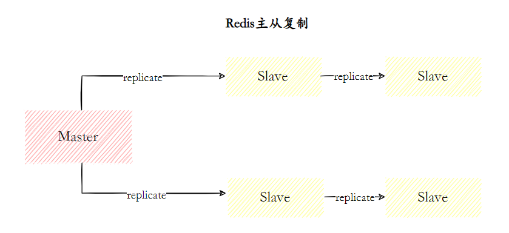


**主从复制主要的作用是什么?**

    - **负载均衡**：多个从节点可以处理读请求，减少主节点的压力。
    - **数据备份**：从节点保存主节点的副本，可以用作数据备份。
    - **高可用性基础**： 主从复制是哨兵和集群能够实施的基础，因此说主从复制是Redis高可用的基础  

## Redis主从有几种常见的拓扑结构？
Redis 的复制拓扑结构可以支持单层或多层复制关系，根据拓扑复杂性可以分为以下三种：一主一从、一主多从、树状主从结构。

**1.一主一从结构**

一主一从结构是最简单的复制拓扑结构，用于主节点出现宕机时从节点提供故障转移支持。

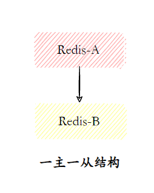 

**2.一主多从结构**

一主多从结构（又称为星形拓扑结构）使得应用端可以利用多个从节点实现读写分离对于读占比较大的场景，可以把读命令发送到从节点来分担主节点压力。

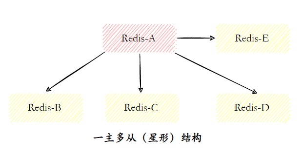 

**3.树状主从结构**

树状主从结构（又称为树状拓扑结构）使得从节点不但可以复制主节点数据，同时可以作为其他从节点的主节点继续向下层复制。通过引入复制中间层，可以有效降低主节点负载和需要传送给从节点的数据量。

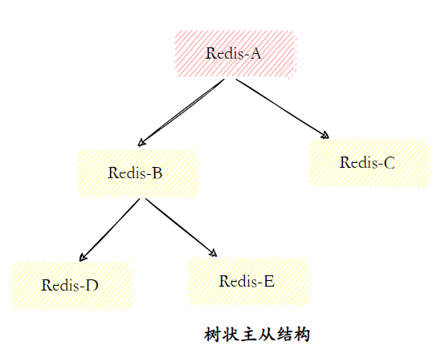

## Redis的主从复制原理了解吗？
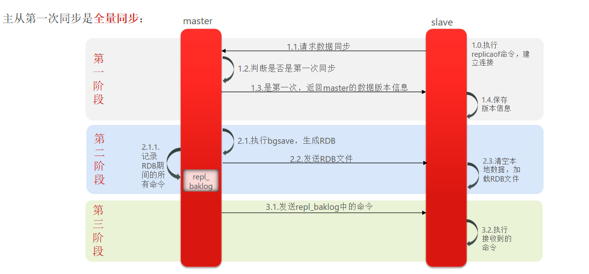

Redis 主从复制的工作流程大致可以分为以下几个步骤：

    - **保存主节点信息**  
从节点首先获取主节点的信息，包括主节点的 **IP 地址** 和 **端口号**。
    - **主从建立连接**  
当从节点发现主节点后，它会尝试与主节点建立网络连接。
    - **发送 Ping 命令**  
连接建立成功后，从节点会向主节点发送 **Ping 命令**，以检查网络连接是否正常，以及主节点是否能够接受命令。
    - **权限验证**  
 如果主节点要求密码验证，从节点必须正确的密码才能通过验证。  
    - **同步数据集**  
一旦主从连接成功并通过验证，主节点会将当前持有的完整数据集（RDB 快照）发送给从节点，进行初次同步。
    - **命令持续复制**  
数据同步完成后，主节点会持续向从节点发送写命令，确保主从节点的数据保持一致，并且从节点能够实时地更新数据。

## 说说主从数据同步的方式？
1. **全量同步（Full Sync）**

    - **全量同步**通常在以下场景中发生：
        * 从节点第一次连接到主节点时。
        * 从节点因某些原因（如网络中断）无法接收到增量数据时，需要重新同步数据。
        * 当主节点配置发生变化，或从节点重新启动时。
    - **过程**：
        * 当从节点初次连接到主节点时，主节点会将所有数据的 **RDB 快照（Redis DataBase Snapshot）** 发送给从节点。这个快照包含了主节点的所有数据。
        * 主节点在发送快照的过程中，会记录它的所有写操作（即增量数据），并通过复制积压缓冲区（Replication Backlog）将这些操作保存在内存中，以便在从节点恢复全量数据后，能继续同步增量数据。

>         *  **复制积压缓冲区（Replication Backlog）是 Redis 用于存储主节点写操作的内存缓冲区，确保从节点在短暂断开后能够高效地同步增量数据，保持主从数据一致性。 **
>

        * 从节点收到这个全量快照后，会恢复数据并从主节点获取增量数据，直到数据完全同步。
    - **特点**：
        * **数据量大**：全量同步会发送整个数据库的数据，对于大规模数据集，可能会造成较大的网络负载和传输延迟。
        * **阻塞时间长**：在全量同步期间，从节点会被阻塞，无法进行其他操作，直到同步完成。
        * 通常在从节点第一次连接主节点时或主节点发生故障时进行。

2. **增量同步（Partial Sync）**

    - **增量同步**发生在主节点和从节点之间的数据同步已经建立之后，它用于保持主从节点的持续数据同步。
    - **过程**：
        * 主节点将其所有的写操作（如 `SET`、`DEL`、`INCR` 等）记录到内存中，并通过复制积压缓冲区（Replication Backlog）将这些操作异步发送给所有的从节点。
        * 从节点收到这些增量数据后，会将它们应用到自己的数据集，确保主从数据一致。
        * 增量同步是高效的，因为它仅传输自上次同步以来的增量操作，而不需要重新传输所有的数据。
    - **特点**：
        * **高效性**：增量同步只发送自上次同步以来的写操作，通常比全量同步的传输量小得多。
        * **实时性**：主节点处理写操作时，增量数据会实时发送给从节点，从节点会尽快应用这些数据，实现近乎实时的同步。
        * 适用于主节点和从节点已经建立了连接，并且主节点有充足的复制积压缓冲区来存储未同步的命令。

##  主从复制出现数据不一致怎么办？  
1. **重启从节点**

    - **原因**：从节点可能由于网络延迟或其他故障未能正确同步主节点数据。
    - **解决方法**：执行 `SLAVEOF NO ONE` 断开从节点，再通过 `SLAVEOF <master_ip> <master_port>` 重新启动同步。

2. **手动执行同步**

    - **原因**：从节点的 RDB 快照或 AOF 日志可能丢失，导致数据不一致。
    - **解决方法**：手动触发全量同步，使用`BGSAVE` 生成 RDB 文件并确保从节点加载正确。

3. **使用 Redis Sentinel / 集群**

    - **原因**：单点故障可能导致主从节点数据不一致。
    - **解决方法**：使用 Redis Sentinel 或 Redis 集群来实现自动故障转移，确保主节点故障时从节点能自动提升并恢复数据同步。

## 主从复制存在哪些问题呢？
    - 一旦主节点出现故障，需要手动将一个从节点晋升为主节点，同时需要修改应用配置，还需要确保其他从节点去复制新的主节点，整个过程都需要人工干预。
    - 主节点的写能力受到单机的限制。
    - 主节点的存储能力受到单机的限制。

## Redis哨兵了解吗？
 哨兵（Sentinel）机制是 Redis 提供的一个高可用性解决方案，主要用来监控 Redis 主从架构中的实例，并在主节点出现故障时，自动进行故障转移。  


## Redis哨兵实现原理知道吗？
Redis 哨兵机制的工作流程：

    1. **定时监控：**
        * 每个哨兵进程会定期向 Redis 主节点和从节点发送 `PING` 命令，检查它们的健康状态。若节点未能及时响应，哨兵会判定该节点为“主观下线”状态。
    2. **故障检测**：
        * 当哨兵发现主节点宕机或不可用时，它会发起一次故障检测。 多个哨兵通过相互沟通确认主节点不可用，判定该节点为客观下线状态。  
    3. **故障转移**：
        *  在确定主节点故障后，多个哨兵通过选举产生一个“领袖哨兵”，负责执行故障转移 ，	选出一个新的主节点。

> + 使用 **Raft 类似的一致性算法**（基于投票）。
> + 每个哨兵向其他哨兵发送请求，要求成为领导者。其他哨兵通过日志一致性和任期号来判断是否支持。
> + 如果某个哨兵获得超过半数（N/2 + 1，N 为哨兵总数）的投票，则成为领导者。
>

    4. **客户端通知**：
        *  故障转移完成后，哨兵会更新集群配置，并通知客户端新的主节点信息，确保整个系统的高可用性。  

## 领导者Sentinel节点选举了解吗？（领袖哨兵怎么选出来的）


1. **候选者发起选举**：当主节点宕机时，每个在线的 Sentinel 节点都有资格成为领导者。候选者向其他 Sentinel 节点发送投票请求，自己先投一票。
2. **投票规则**：收到请求的 Sentinel 节点根据日志一致性和任期号判断是否支持候选者。如果满足条件且未投过票，回复“Y”；否则回复“N”。
3. **选举结果**：候选者获得超过半数以上的赞成票后，成为领导哨兵，负责故障转移。

## 新的主节点是怎样被挑选出来的？怎么故障转移的
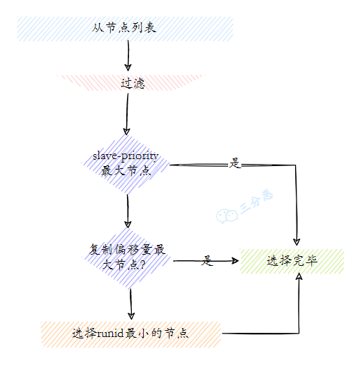

被选举出的 Sentinel 领导者进行故障转移的具体步骤如下：

+ 会按照以下几个优先级来进行选举
    - **过滤不健康的从节点**：排除已下线、网络状态不好的从节点。
    - **选择 slave-priority（从节点优先级）最高的从节点列表**。
    - **选择复制偏移量最大的从节点（复制的最完整）**。
    - **选择 runid（从节点的唯一标识符） **最小的从节点。
+ **领导者节点会向剩余的从节点发送命令**，让他们从新的主节点上复制数据。
+ **将新主节点的 IP 地址和信息**，通知给客户端  
+ **继续监视旧主节点**，当这个旧主节点重新上线时，将它设置为新主节点的从节点；  

## Redis集群了解吗？


Redis 集群是 Redis 提供的一种分布式解决方案，用于在多个节点之间分配数据，实现数据的分片、扩展性和高可用性。它通过水平扩展来处理大规模的数据存储和负载均衡。

**Redis 集群的关键特点：**

1. **数据分片（Sharding）**：
    - Redis 集群通过将数据分配到多个节点上，采用 **哈希槽（Hash Slot）** 来实现数据的分片。总共有 16384 个哈希槽，数据根据其键值通过哈希算法被分配到不同的槽中。
    - 每个节点负责一部分哈希槽，确保数据分布在集群的各个节点上。
2. **高可用性（Failover）**：
    - Redis 集群支持自动故障转移。当某个节点发生故障时，集群会自动将该节点的数据迁移到其他健康节点，保证高可用性。
    - 集群中可以有多个从节点，主节点宕机时可以提升从节点为主节点。
3. **无中央管理节点**：
    - Redis 集群是 **去中心化** 的，集群中的所有节点都对等工作，每个节点既可以作为主节点，也可以作为从节点。没有单一的管理节点或协调节点。
4. **数据的读写分离**：
    - 数据的读操作可以由主节点或从节点处理，写操作只能由主节点处理。从节点通过复制主节点的数据来保持一致性。

## 能说说Redis集群的原理吗？
    1. **数据分片（Sharding）**：
        * Redis 集群通过将数据分配到多个节点上，采用 **哈希槽（Hash Slot）** 来实现数据的分片。总共有 16384 个哈希槽，数据根据其键值通过哈希算法被分配到不同的槽中。**<font style="color:#DF2A3F;">（任何一个数对 16384 取模，结果一定是在 0 到 16383 之间）</font>**
        * 每个节点负责一部分哈希槽，确保数据分布在集群的各个节点上。
    2. **高可用性（Failover）**：
        * Redis 集群支持自动故障转移。当某个节点发生故障时，集群会自动将该节点的数据迁移到其他健康节点，并选举新的主节点，保证服务的持续可用性。
        * 集群中可以有多个从节点，主节点宕机时可以提升从节点为主节点。
    3. **无中央管理节点**：
        * Redis 集群是 **去中心化** 的，集群中的所有节点都对等工作，每个节点既可以作为主节点，也可以作为从节点。没有单一的管理节点或协调节点。
    4. **数据的读写分离**：
        * 数据的读操作可以由主节点或从节点处理，写操作只能由主节点处理。从节点通过复制主节点的数据来保持一致性。

## 集群中数据如何分区？
 在 Redis 集群中，数据通过 **哈希槽** 分区。集群将整个数据集划分为 **16384 个哈希槽**，每个键通过 哈希算法（比如 CRC16）计算哈希值，映射到一个哈希槽。然后，哈希槽被分配给不同的 Redis 节点（主节点）。每个主节点负责存储若干个哈希槽的数据。  

>  CRC16 是一种哈希算法，它可以将任意长度的输入数据映射为一个 16 位的哈希值。  
>

## 为什么是 16384 个
我看了Redis 作者在博客中提到，16384 是权衡后的选择。更大（如 65536）会增加客户端和节点间的通信开销（槽表更大），更小（如 4096）则分片不够细，可能导致负载不均。

## 说说集群的伸缩？
**当需要扩容时**，新的节点被添加到集群中，集群会自动执行数据迁移，以重新分布哈希槽到新的节点。数据迁移的过程可以确保在扩容期间数据的正常访问和插入。

**当需要缩容时，**Redis 集群会将槽从要缩容的节点上迁移到其他节点上，然后将要缩容的节点从集群中移除。

当数据正在迁移时，如果请求被路由到正在迁移数据的哈希槽，Redis会返回一个 MOVED 响应，指示客户端重新路由请求到正确的目标节点。这种机制也就**保证了数据迁移过程中的最终一致性**。

## 集群脑裂导致数据丢失怎么办？
**什么是脑裂**

**由于网络问题，集群被分割成多个部分，每个部分都认为自己是主集群，从而导致数据不一致和数据丢失的问题。**

**怎么解决**

当主节点发现从节点下线或通信超时的数量小于设定阈值时，它会禁止接收写操作并直接返回错误给客户端。这可以通过以下两个 Redis 配置项来实现：

    1. **min-slaves-to-write x**：主节点必须至少与 x 个从节点连接，否则禁止写操作。
    2. **min-slaves-max-lag x**：主从复制延迟不能超过 x 秒，否则禁止写操作。

通过这两个参数设置，当新主节点选举完成后，原主降为从节点，数据不丢失。

# 缓存设计
## 什么是缓存击穿、缓存穿透、缓存雪崩？
**1. 缓存穿透**

**定义**：缓存穿透是指查询一个不在缓存和数据库中的数据，这种请求直接到达数据库，可能导致数据库负载增加。

**解决方案**：

    - **缓存空对象**：当客户端请求的数据在缓存中和数据库中都不存在时，我们会在缓存中存储一个空对象来表示该数据不存在。这样，后续相同的请求就不会再打到数据库上，从而减轻了数据库的压力。
    - **布隆过滤器**：使用布隆过滤器来过滤不合法的请求，避免无效请求穿透到数据库。

---

**2. 缓存击穿**

**定义**：缓存击穿指的是缓存中某个热点数据失效后，多个请求同时到达数据库，可能导致数据库压力骤增。

**解决方案**：

    - **互斥锁**：使用互斥锁，确保只有一个请求去加载数据库并更新缓存，其他请求等待缓存加载完成后再读取缓存。
    - **不给热点数据设置过期时间**，由后台异步更新缓存，或者在热点数据准备要过期前，提前通知后台线程更新缓存以及重新设置过期时间；

---

**3. 缓存雪崩**

**定义**：缓存雪崩是指大量缓存同时失效，导致大量请求同时访问数据库，造成数据库压力剧增。

**解决方案**：

    - **随机过期时间**：给缓存设置随机的过期时间，避免所有缓存同时过期。
    - **限流与降级策略**：给缓存业务添加降级限流策略，比如增加限流保护，或者快速失败机制，让请求尽可能打不到数据库上。

## 能说说布隆过滤器吗？
布隆过滤器（Bloom Filter）是一种空间效率极高的概率型数据结构，用于快速检查一个元素是否存在于一个集合中。

布隆过滤器由一个长度为 m 的位数组和 k 个哈希函数组成。

    - 开始时，布隆过滤器的每个位都被设置为 0。
    - 当一个元素被添加到过滤器中时，它会被 k 个哈希函数分别计算得到 k 个位置，然后将位数组中对应的位设置为 1。
    - 当检查一个元素是否存在于过滤器中时，同样使用 k 个哈希函数计算位置，如果任一位置的位为 0，则该元素肯定不在过滤器中；如果所有位置的位都为 1，则该元素可能在过滤器中。


因为布隆过滤器占用的内存空间非常小，所以查询效率也非常高，所以在 Redis 缓存中，使用布隆过滤器可以快速判断请求的数据是否在缓存中。

但是布隆过滤器也有一定的缺点，因为是通过哈希函数计算的，所以存在哈希冲突的问题，可能会导致误判。

但是布隆过滤器本身也存在一些“弊端”，那就是不支持删除元素。因为它是一种基于哈希的数据结构，删除元素会涉及到多个哈希函数之间的冲突问题，这样会导致删除一个元素可能会影响到其他元素的正确性。

## 说说常见的缓存更新策略？**（缓存一致性策略）**
**1. 旁路缓存/双写策略（Cache Aside Pattern）**

    - 定义：应用程序手动处理缓存和数据库的数据一致性。在进行数据写入操作时，先更新数据库，再删除缓存。

**操作步骤：**

        * 读取：从缓存中读取数据，如果缓存中没有，则从数据库中获取，并将数据存入缓存。
        * 写入：更新数据库后，再删除缓存，以确保下次读取时缓存中的数据是最新的。

**2. 读写穿透策略（Read/Write Through Pattern）**

    - 定义：将读取和写入操作首先在缓存中执行，然后再传播到数据库存储

**操作步骤：**

        * 读取：从缓存中读取数据，如果缓存中没有数据，则从数据库中获取，并将数据存入缓存。
        * 写入：更新数据时，首先更新缓存，然后再将数据写入数据库。

**3. 写回策略（Write Behind Pattern）**

    - **定义：**调用者只操作缓存，其他线程去异步处理数据库，实现最终一致。

**操作步骤：**

    - 读取：从缓存中读取数据，如果缓存中没有数据，则从数据库中获取，并将数据存入缓存。
    - 写入：数据首先写入缓存，然后将数据异步写入数据库，通常使用队列来处理这些写操作。

## 如何保证缓存和数据库的数据一致性？
[缓存和数据库一致性问题，看这篇就够了](http://kaito-kidd.com/2021/09/08/how-to-keep-cache-and-consistency-of-db/)

**这个先写自己项目里的一致性怎么实现的吧（项目里好像是先更新数据库再删缓存）**


**①、引入消息队列保证缓存被删除**

使用消息队列（如 Kafka、rocketmq）保证数据库更新和缓存更新之间的最终一致性。当数据库更新完成后，将更新事件发送到消息队列。有专门的服务监听这些事件并负责更新或删除缓存。

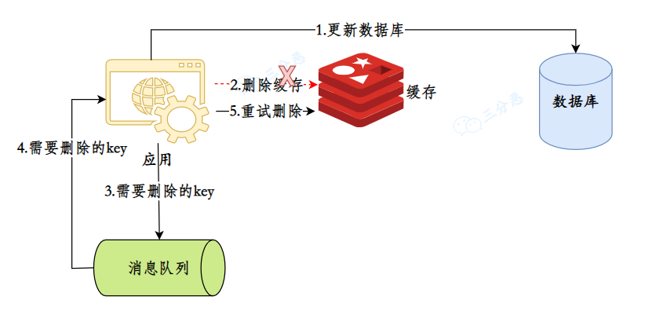

这种方案很不错，缺点是对业务代码有一定的侵入，毕竟引入了消息队列嘛。

**②、数据库订阅+消息队列保证缓存被删除**

使用 **Canal** 订阅数据库的变更日志（如 MySQL 的 binlog），实时捕获数据变化（增、删、改操作）。将数据库变更事件推送到 **消息队列**（如 Kafka/RocketMQ），通过消息队列消费者通知缓存系统更新或删除缓存。


然后用一个公共的服务获取订阅程序传来的信息，进行缓存删除。

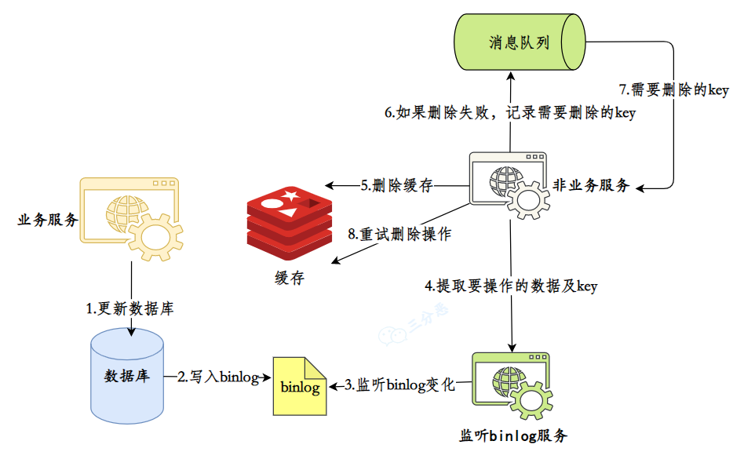

**③、延时双删策略**  
写操作时，先更新数据库，然后立即删除缓存。等待一段时间，再次删除缓存，确保缓存中的脏数据被清除。  
**延时双删策略的原理**  
当缓存与数据库同步更新时，通常采用先更新数据库，再删除缓存的方式，但在高并发场景下，可能会发生这样的问题：

+ 请求 A 先更新数据库并删除缓存，但此时另一个请求 B 可能从数据库中读取了旧值，导致旧值被重新写入缓存，从而导致数据不一致。  
为了避免这个问题，延时双删策略通过引入第二次缓存删除操作来确保数据一致性。  
流程：  
1.更新数据库：当写操作发生时，先更新 MySQL 数据库。  
2.第一次删除缓存：数据库更新完毕后，立即删除 Redis 缓存中与该数据相关的缓存项。  
3.延时一段时间（如 500ms）：等待一定的时间，以确保并发操作中的读操作可以完成。  
4.第二次删除缓存：再次删除 Redis 缓存中的数据，确保如果在延时期间缓存了旧数据，也能再次清除。


**④：设置缓存过期时间兜底**

这是一个朴素但有用的兜底策略，给缓存设置一个合理的过期时间，即使发生了缓存和数据库的数据不一致问题，也不会永远不一致下去，缓存过期后，自然就一致了。

## 什么是热key，如何解决热key问题
热 key 是指在 Redis 中被频繁访问的键。这些 Key 由于访问量过大，可能导致 Redis 单点的性能瓶颈。  
如何解决热 Key 问题？  
为了解决 Redis 中的热 Key 问题，常用以下方法：  
**1.缓存预热**

    - 概念：提前将可能成为热点的数据加载到缓存中，避免启动时流量激增带来的压力。
    - 应用场景：系统重启、缓存失效后，提前将热 Key 数据加载到缓存中。

**2.数据分片**：

    - 概念：将热 key 的数据分散到多个 Redis节点中，通过分片的方式降低单个节点的负载。
    - 实现方式：将原 Key hotkey 分片为 hotkey:1, hotkey:2, hotkey:3 等。
    - 应用场景：统计、计数、排行榜等数据，访问压力集中时。

**3.多级缓存：**

    - 概念：在 Redis 之外再引入其他级别的缓存（如 CDN、Nginx 缓存等），将数据分布到不同层次，减少 Redis 压力。
    - 应用场景：前端应用结合 CDN 缓存静态资源，Redis 作为后端缓存动态数据。

## 缓存预热怎么做呢？
缓存预热是指在系统启动时，提前将一些预定义的数据加载到缓存中，以避免在系统运行初期由于缓存未命中（cache miss）导致的性能问题。通过缓存预热，可以确保系统在上线后能够立即提供高效的服务，减少首次访问时的延迟。

缓存预热的方法有多种，我们采用了两种缓存预热方式：**项目启动时自动加载**和**定时预热**。项目启动时自动加载确保应用启动后缓存中已有关键数据，避免冷启动时的性能波动；而定时预热通过定时任务在低峰期更新缓存中的数据，保证数据的时效性和一致性。两者结合可以确保系统在性能和数据一致性方面的平衡。

## 大key问题了解吗？怎么解决
大Key指的是在Redis中，单个键对应的数据量过大，会导致性能和存储方面的问题。  
大Key的解决方案  
**1.拆分大Key**

    - 如果一个Key对应的值过大，可以考虑将这个Key拆分成多个小Key。通过合理的分片（sharding）策略，可以有效减小每个Key的大小，降低操作的延迟和内存压力。例如，如果一个List或Hash数据量过大，可以将其拆分为多个小的List或Hash。

**2.定期监控和清理大Key**

    - 使用监控系统定期检查Redis中的大Key，发现并清理不必要的大Key，优化内存使用。

**3.压缩存储数据**

    - 对于大Key对应的大数据量进行压缩或编码（例如使用JSON、Protobuf等格式），减少内存占用 。

# Redis 过期删除与内存淘汰
## 过期删除策略和内存淘汰策略有什么区别？
+ 内存淘汰策略是在内存满了的时候，redis 会触发内存淘汰策略，来淘汰一些不必要的内存资源，以腾出空间，来保存新的内容
+ 过期键删除策略是将已过期的键值对进行删除，Redis 采用的删除策略是惰性删除+定期删除。

## **<font style="color:rgb(0, 0, 0);">Redis 的过期数据回收策略有哪些？</font>**
+ **<font style="color:rgb(0, 0, 0);">定期删除（Periodic Deletion）  
</font>****<font style="color:rgb(0, 0, 0);">Redis 默认会周期性地抽取部分设置了过期时间的键进行检查，并删除已经过期的键。</font>**
+ **<font style="color:rgb(0, 0, 0);">惰性删除（Lazy Deletion）  
</font>****<font style="color:rgb(0, 0, 0);">当某个键被访问时，如果发现它已经过期，Redis 会立即删除该键。这意味着如果一个已过期的键从未被访问，它不会被自动删除，可能会占用额外的内存。</font>**

## Redis有哪些内存淘汰策略？
1. **不进行淘汰的策略**  
● **noeviction**：当内存满时，拒绝写入新数据，返回错误，不淘汰任何键。
2. **针对所有键的策略**  
● **allkeys-lru**：淘汰所有键中最近最少使用的键。  
● **allkeys-random**：随机淘汰任意键。  
● **allkeys-lfu**：淘汰所有键中使用频率最少的键。
3. **针对设置了过期时间的键的策略**  
● **volatile-lru**：只淘汰设置了过期时间的键中最近最少使用的键。  
● **volatile-random**：只随机淘汰设置了过期时间的键。  
● **volatile-ttl**：只淘汰设置了过期时间的键，优先淘汰TTL（剩余生存时间）最短的键。  
● **volatile-lfu**：只淘汰设置了过期时间的键中使用频率最少的键。

**LRU 和 LFU 的区别是什么？**

LRU（Least Recently Used） 最近最少使用（时间）  ：基于时间维度，淘汰最近最少访问的键。适合访问具有时间特性的场景。

LFU（Least Frequently Used） 最近最少访问（频率）  ：基于次数维度，淘汰访问频率最低的键。更适合长期热点数据场景。

##  Redis 持久化时，对过期键会如何处理的？  
在 Redis 的持久化过程中，过期键的处理如下：

    - **RDB（Redis Database）**：
        * **RDB 生成阶段**：过期键不会被保存到新的 RDB 文件中。
        * **RDB 加载阶段**： 
            + **主服务器**：过期键不会被载入。
            + **从服务器**：过期键会被载入，但由于主从同步，过期键不会对从服务器造成影响。
    - **AOF（Append Only File）**：
        * **AOF 写入阶段**：如果过期键尚未删除，AOF 会保留该键，删除时会追加 DEL 命令。
        * **AOF 重写阶段**：过期键不会被保存到重写后的 AOF 文件中。

# Redis应用
## 使用Redis如何实现异步队列？（ 消息队列  ）
+ **基于列表的队列**：生产者将任务加入列表，消费者从列表中取出任务。Redis 提供了 `RPUSH`、`LPUSH`、`LPOP` 等操作实现基本队列。
+ **发布/订阅模式**：生产者发布消息，消费者订阅消息，适合实时消息推送，Redis 提供了 Pub/Sub 机制。

## Redis如何实现延时队列?
**使用 **`**ZSET**`**（有序集合）实现延时队列**

**原理**：

    - 将消息的延时（即执行时间）作为 `ZSET` 中每个元素的分数（score），消息内容作为成员（member）。Redis 自动按分数排序，从而实现按延时顺序存取消息。 

## Redis支持事务吗？
**Redis 支持简单的事务，可以将多个命令打包，然后一次性的，按照顺序执行。 Redis 支持事务，但与传统关系型数据库事务不同，Redis 事务不支持回滚和隔离级别。  **

主要通过 multi、exec、discard、watch 等命令来实现：

        * multi：标记一个事务块的开始
        * exec：执行所有事务块内的命令
        * discard：取消事务，放弃执行事务块内的所有命令
        * watch：监视一个或多个 key，如果在事务执行之前这个 key 被其他命令所改动，那么事务将被打断

#### Redis 事务的注意点有哪些？
Redis 事务是不支持回滚的，一旦 EXEC 命令被调用，所有命令都会被执行，即使有些命令可能执行失败。

#### Redis 事务为什么不支持回滚？
引入事务回滚机制会大大增加 Redis 的复杂性，因为需要跟踪事务中每个命令的状态，并在发生错误时逆向执行命令以恢复原始状态。

Redis 是一个基于内存的数据存储系统，其设计重点是实现高性能。事务回滚需要额外的资源和时间来管理和执行，这与 Redis 的设计目标相违背。因此，Redis 选择不支持事务回滚。

换句话说，**就是我 Redis 不想支持事务，也没有这个必要**。

#### Redis 事务的 ACID 特性如何体现？
**ACID** 一般指 MySQL 事务中的四个特性：**原子性**、**一致性**、**隔离性**、**持久性**。虽然 Redis 提供了事务的支持，但它在 **ACID** 上的表现与 MySQL 有所不同。  
Redis 事务中，所有命令会依次执行，但并不支持部分失败后的自动回滚。因此 Redis 在事务层面并不能保证 **一致性**，我们必须通过程序逻辑来进行优化。  
Redis 事务在一定程度上提供了 **隔离性**，事务中的命令会按顺序执行，不会被其他客户端的命令插入。  
Redis 的 **持久性** 依赖于其持久化机制（如 RDB 和 AOF），而不是事务本身。

#### Redis事务满足原子性吗？要怎么改进？
Redis 事务不支持回滚，一旦 **EXEC** 命令被调用，所有命令都会被执行，即使有些命令可能执行失败。  
可以通过 **Lua 脚本** 来实现事务的原子性，**Lua 脚本在 Redis 中是原子执行的**，执行过程中间不会插入其他命令。

## Redis和Lua脚本的使用了解吗？
 Redis 支持 Lua 脚本，Lua 脚本的优点是原子性，可以将多个 Redis 操作打包执行，减少网络延迟，并保证操作的原子性。  

## Redis的管道Pipeline了解吗？
Redis 的 Pipeline 机制允许客户端一次性发送多个命令，批量接收所有命令的结果。

**Redis的管道（Pipeline）** 是一种批量处理命令的机制，它允许客户端一次性发送多个命令到 Redis 服务器，并且服务器一次性处理这些命令，返回所有命令的结果。这种机制显著减少了网络延迟，提高了系统吞吐量。

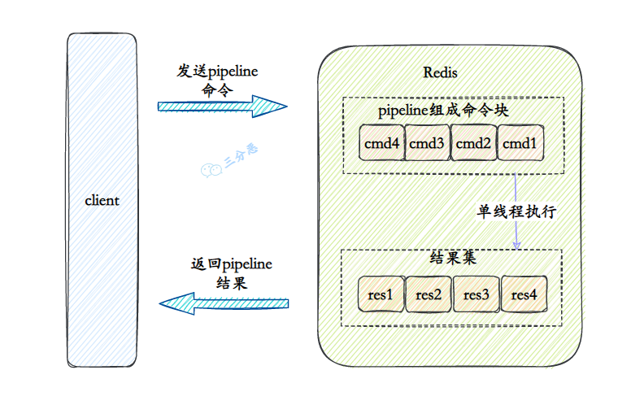

**原理**：

    - **发送命令**：客户端将多个命令打包成一个请求，发送给 Redis 服务器。
    - **服务器处理**：Redis 服务器依次执行所有命令，但不会立即返回结果。
    - **接收结果**：客户端一次性接收所有命令的执行结果，而不是等待每个命令的单独响应。

**优点**：

    1. **减少网络往返**：避免每个命令都需要单独的网络请求和响应，大大减少了网络延迟。
    2. **提高性能**：尤其在进行大量的读写操作时，批量处理命令可以提高 Redis 的吞吐量。

**缺点：**

    1. **不支持事务**：管道中的命令是顺序执行的，无法根据前一个命令的执行结果做决定，因此不保证原子性。
    2. **无回滚机制**：一旦命令被发送，所有命令都会执行，即使有些命令失败，也无法回滚。

**适用场景：**

    - **批量写入**：大量数据的写入操作（如批量插入键值对）。
    - **批量读取**：一次性获取多个键的值。

总结：**Redis管道**是优化网络延迟的一种技术，通过批量发送命令和减少通信次数提高了性能，适用于对性能要求较高且不需要事务保障的场景。

## Redis实现分布式锁了解吗？
Redis 实现分布式锁时，可以使用 `SET` 命令的 `NX` 和 `EX/PX` 选项：

1. **加锁**：通过 `SET key value NX EX <timeout>` 实现，`NX` 保证只有 key 不存在时才能设置锁，`EX` 设置锁的过期时间。

但基于 `SETNX` 实现的分布式锁存在以下问题：

    1. **不可重入**
    2. **不可重试**
    3. **超时释放** - 锁超时释放虽避免死锁，但业务执行耗时长时会导致锁释放，存在安全隐患。
    4. **主从一致性** - 在 Redis 主从集群中，写数据时若主机宕机未完成同步，会出现死锁问题。

##  Redis 如何解决集群情况下分布式锁的可靠性？  （**Redlock（红锁）**）
为了保证集群环境下分布式锁的可靠性，Redis 官方设计了一个分布式锁算法 **Redlock（红锁）**。

**基本原理**

Redlock 是基于多个 Redis 节点的分布式锁，即使某个节点发生故障，锁数据依然能够在其他节点上保存，客户端仍然可以完成锁操作。官方推荐至少部署 **5 个 Redis 节点**，且这些节点之间是孤立的，彼此没有关系。

**Redlock 算法的基本思路**

客户端和多个独立的 Redis 节点依次请求申请加锁，如果客户端能够和 **半数以上** 的节点成功完成加锁操作，那么我们认为客户端成功地获得了分布式锁，否则加锁失败。

    - **容错性**：即使某个 Redis 节点发生故障，由于锁的数据在其他节点上也有保存，客户端仍然能够正常地完成锁操作，锁数据不会丢失。

**加锁过程**

Redlock 算法的加锁过程分为三个步骤：

**步骤 1：获取当前时间**

    - 客户端首先获取当前时间 `t1`，用于后续计算加锁的总耗时。

**步骤 2：向多个 Redis 节点请求加锁**

    - 客户端依次向 **N 个 Redis 节点** 执行加锁操作： 
        * 使用 `SET` 命令，并带上 `NX` 和 `EX/PX` 选项。
        * 锁的值会包含客户端的唯一标识。
        * 加锁操作设置超时时间（而非锁的过期时间），以确保在某个节点发生故障时，算法仍能继续运行。超时时间通常设置为几十毫秒，远小于锁的过期时间。

**步骤 3：检查加锁是否成功**

    - 一旦客户端从 **超过半数**（即大于等于 N/2+1）Redis 节点上成功获取到了锁，客户端会再次获取当前时间 `t2`，并计算加锁过程的总耗时 `t2 - t1`。
    - 如果总耗时小于锁的过期时间，认为加锁成功；否则，认为加锁失败。

**加锁成功的条件**

加锁成功需要满足两个条件：

    1. 客户端从 **大于等于半数**（N/2+1）Redis 节点上成功获取锁。
    2. 客户端加锁的总耗时（`t2 - t1`）小于锁的过期时间。

**加锁成功后**

    - 客户端需要重新计算锁的有效时间，计算公式为： 
        * 锁最初设置的过期时间 - 客户端获取锁的总耗时（`t2 - t1`）。
    - 如果计算结果显示锁已经无法覆盖共享数据的操作时间，客户端应及时释放锁，避免锁过期导致数据操作未完成。

**加锁失败后**

    - 如果加锁失败，客户端需要向所有 Redis 节点发起释放锁的操作。
    - 释放锁的操作与单节点的释放锁操作一样，只需执行释放锁的 Lua 脚本。

---

**总结**

Redlock 算法通过多个 Redis 节点来保证分布式锁的高可用性与容错性。它通过加锁过程中的超时控制和从多个节点获得锁的机制，确保锁操作在故障环境下依然可靠。

## Redis分布式锁实现Redisson
[Redis分布式锁实现Redisson 15问（面试常问）_redisson面试题-CSDN博客](https://blog.csdn.net/weixin_45630885/article/details/125088885)

**<font style="color:#DF2A3F;">这个框架的知识挺多的到时候准备在项目方面再深究，先把之前整理的问题放下来</font>**

1. **解决可重入问题**

    - 底层利用 **Hash 结构** 记录线程 ID 和重入次数。
    - 使同一线程能够多次获取同一把锁，直到计数器减为 0 时才真正释放锁。

2. **解决可重试问题**

    - 通过在锁等待期间使用 **信号量** 和 **发布/订阅机制** 进行异步等待，结合 **Lua 脚本** 的原子操作来实现锁的重试获取，直到成功或超时。

**Redisson 分布式锁的可重试原理的具体过程** 包括以下几个关键步骤：

    1. 在等待期间，Redisson 会 **订阅一个与锁相关的频道**，这个频道用于发布锁释放的通知。当持有锁的线程释放锁时，它会发布一个消息到这个频道。
    2. **监听锁释放**：Redisson 会监听上述频道的消息，一旦收到锁释放的通知，就会尝试再次获取锁。

3. **解决超时续约问题**

    - 底层基于 **看门狗机制** 实现的。看门狗机制是 Redisson 提供的一种自动延期机制。
    - 当线程获取锁成功后，Redisson 会启动一个 **WatchDog 线程**，每隔一段时间（一般是锁过期时间的三分之一，默认是 30 秒）对持有的锁进行检查，**自动延长锁的超时时间**，确保锁不会因为超时而被释放。
    - 当持锁的线程释放锁时，**Watchdog 线程** 也会终止续约。

# Redis 补充题
## 假如Redis里面有1亿个key，其中有10w个key是以某个固定的已知的前缀开头的，如何将它们全部找出来？
 使用 `keys` 指令可以扫出指定模式的 key 列表。但是要注意 keys 指令会导致线程阻塞一段时间，线上服务会停顿，直到指令执行完毕，服务才能恢复。这个时候可以使用 `scan` 指令，`scan` 指令可以无阻塞的提取出指定模式的 `key` 列表，但是会有一定的重复概率，在客户端做一次去重就可以了，但是整体所花费的时间会比直接用 `keys` 指令长。  

## Redis的秒杀场景下扮演了什么角色？
秒杀主要是指大量用户集中在短时间内对服务器进行访问，从而导致服务器负载剧增，可能出现系统响应缓慢甚至崩溃的情况。

针对秒杀的场景来说，最终抢到商品的用户是固定的，也就是说 100 个人和 10000 个人来抢一个商品，最终都只能有 100 个人抢到。

但是对于秒杀活动的初心来说，肯定是希望参与的用户越多越好，但真正开始下单时，最好能把请求控制在服务器能够承受的范围之内（😂）。

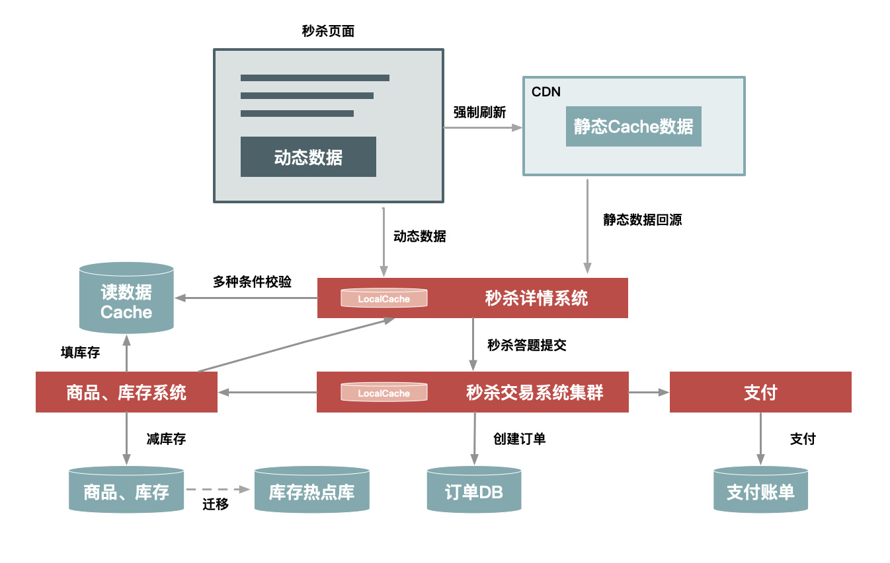

许令波-秒杀系统的设计

解决这一问题的关键就在于错峰削峰和限流。当然了，前端页面的静态化、按钮防抖也能够有效的减轻服务器的压力。

+ 页面静态化：将商品详情等页面静态化，使用 CDN 分发。
+ 按钮防抖：避免用户因频繁点击造成的额外请求，比如设定间隔时间后才能再次点击。

#### [如何实现错峰削峰呢？](https://javabetter.cn/sidebar/sanfene/redis.html#如何实现错峰削峰呢)
针对车流量的晚高峰和早高峰，最强有力的办法就是限行，但限行不是无损的，毕竟限行的牌号无法出行。

无损的方式就是有的车辆早出发，有的车辆晚出发，这样就能够实现错峰出行。

在秒杀场景下，可以通过以下几种方式实现错峰削峰：

①、**预热缓存**：提前将热点数据加载到 Redis 缓存中，减少对数据库的访问压力。

②、**消息队列**：引入消息队列，将请求异步处理，减少瞬时请求压力。消息队列就像一个水库，可以削减上游的洪峰流量。

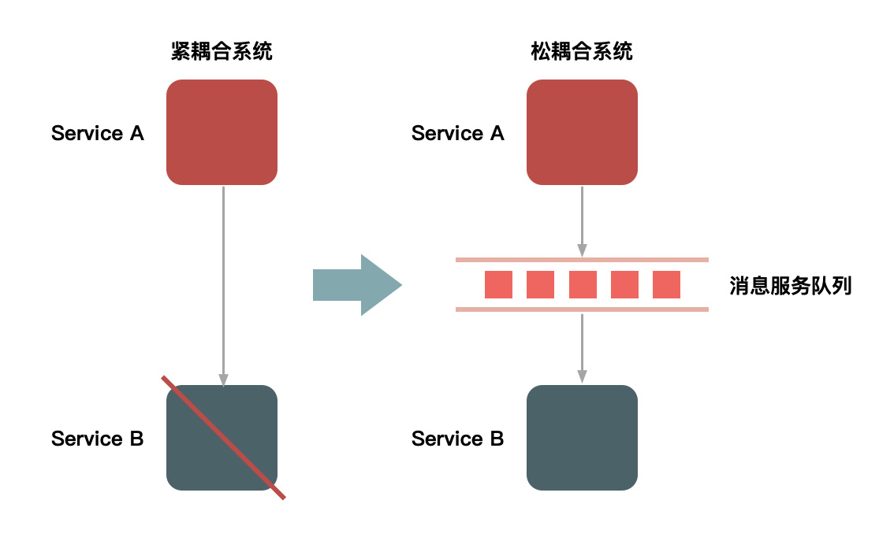

许令波-排队

③、**多阶段多时间窗口**：将秒杀活动分为多个阶段，每个阶段设置不同的时间窗口，让用户在不同的时间段内参与秒杀活动。

④、**插入答题系统**：在秒杀活动中加入答题环节，只有答对题目的用户才能参与秒杀活动，这样可以减少无效请求。

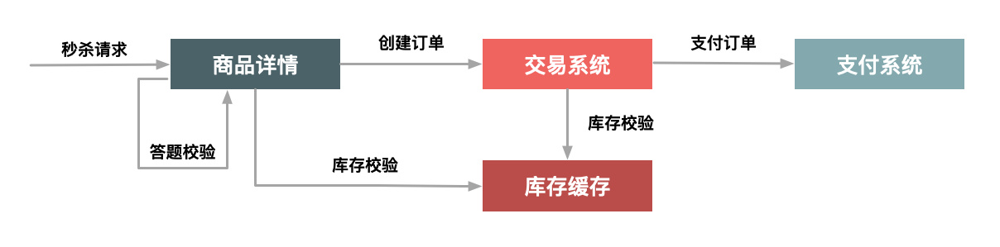

许令波-答题

#### [如何限流呢？](https://javabetter.cn/sidebar/sanfene/redis.html#如何限流呢)
采用令牌桶算法，它就像在帝都买车，摇到号才有资格，没摇到就只能等下一次（😁）。

在实际开发中，我们需要维护一个容器，按照固定的速率往容器中放令牌（token），当请求到来时，从容器中取出一个令牌，如果容器中没有令牌，则拒绝请求。

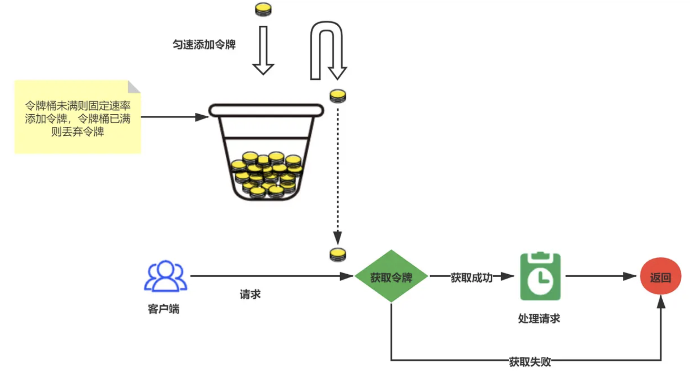

李子捌：令牌桶

第一步，使用 Redis 初始化令牌桶：

```plain
redis-cli SET "token_bucket" "100"
```

第二步，使用 Lua 脚本实现令牌桶算法；假设每秒向桶中添加 10 个令牌，但不超过桶的最大容量。

```plain
-- Lua 脚本来添加令牌，并确保不超过最大容量
local bucket = KEYS[1]
local add_count = tonumber(ARGV[1])
local max_tokens = tonumber(ARGV[2])
local current = tonumber(redis.call('GET', bucket) or 0)
local new_count = math.min(current + add_count, max_tokens)
redis.call('SET', bucket, tostring(new_count))
return new_count
```

第三步，使用 Shell 脚本调用 Lua 脚本：

```plain
#!/bin/bash
while true; do
    redis-cli EVAL "$(cat add_tokens.lua)" 1 token_bucket 10 100
    sleep 1
done
```

第四步，当请求到达时，需要检查并消耗一个令牌。

```plain
-- Lua 脚本来消耗一个令牌
local bucket = KEYS[1]
local tokens = tonumber(redis.call('GET', bucket) or 0)
if tokens > 0 then
    redis.call('DECR', bucket)
    return 1  -- 成功消耗令牌
else
    return 0  -- 令牌不足
end
```

调用 Lua 脚本：

```plain
redis-cli EVAL "$(cat consume_token.lua)" 1 token_bucket
```

## 客户端宕机后Redis服务端如何感知到？
当客户端宕机时，Redis 服务端可以通过监控客户端的**心跳机制**来检测。具体流程如下：

1. **客户端心跳**：客户端在 Redis 中设置一个特定的键（称为心跳键），并定期更新该键的过期时间来表示客户端处于存活状态。客户端通过每隔一定时间（例如每 5 秒）使用 `SETEX` 命令更新心跳键的超时时间。
2. **服务端监控**：Redis 服务端定期检查心跳键的状态。如果该键的过期时间被自动删除，说明客户端可能已宕机。服务端通过检查该键是否存在来判断客户端是否仍然存活。
3. **宕机检测**：如果服务端发现心跳键不存在，则可以判断客户端已经宕机或断开连接。

这种方法利用 Redis 的过期机制来实现客户端的存活检测，避免了客户端宕机后无法及时发现的问题。

# Redis 分布式锁（Redisson）
##  Redis 分布式锁的实现方式有哪些？  
Redis 实现分布式锁的方式有几种：

+ **SETNX + EXPIRE**：利用 `SETNX` 实现加锁，设置过期时间。
+ **Redisson**：基于 Redis 的分布式 Java 客户端，通过封装 Redis 原子命令并结合 Lua 脚本，实现更为复杂的分布式锁。
+ **Redlock**：Redis 官方提出的算法，通过多个 Redis 实例实现分布式锁，具有更高的容错性。

## Redis 分布式锁怎么实现的
Redis 实现分布式锁基于`**SETNX**` 命令。`SETNX` 的作用是 **“只在键不存在时设置键的值”**。可以利用这个命令实现分布式锁，具体步骤如下：

+ 通过 `SETNX` 命令尝试在 Redis 中设置一个锁的标识（比如一个唯一的键）。（`EX` 设置锁的过期时间。）
+ 如果返回值是 1，说明锁已经成功获取；如果返回值是 0，说明锁已经被其他客户端获取，当前客户端无法获得锁。

由于 `SETNX` 是原子的，因此它能够确保在多个客户端竞争锁时，只有一个客户端能够成功设置键值，从而实现分布式锁。

## SetNX 有什么问题？  
基于 `SETNX` 实现的分布式锁存在以下问题：

    1. **不可重入**
    2. **不可重试**
    3. **超时释放** - 锁超时释放虽避免死锁，但业务执行耗时长时会导致锁释放，存在安全隐患。
    4. **误删除锁**：在解锁时，如果没有通过持有锁的标识来验证锁的所有者，可能会误删其他客户端持有的锁。  

## Redisson 的原理是什么？`SETNX + LUA 脚本`？  

**Redisson** 使用了 Redis 的 `SETNX` 命令作为基础操作，同时结合了 **Lua 脚本来保证锁的操作（加锁、续期、解锁）的原子性。**

**Redisson** 使用了 Redis 的 `SETNX` 命令作为基础操作，同时结合了 **Lua 脚本** 来解决分布式锁的管理问题。具体来说，Redisson 使用 Lua 脚本来执行一系列操作（如加锁、释放锁等），确保操作的原子性，避免了多个客户端在执行时出现竞争条件。

通过使用 Lua 脚本，Redisson 能够保证锁的操作（加锁、续期、解锁）都在一个原子操作中完成，避免了网络延迟或故障导致的锁失效。  
  
      1. **解决可重入问题**

    - 底层利用 **Hash 结构** 记录线程 ID 和重入次数。
    - 使同一线程能够多次获取同一把锁，直到计数器减为 0 时才真正释放锁。

2. **解决可重试问题**

    - 通过在锁等待期间使用 **信号量** 和 **发布/订阅机制** 进行异步等待，结合 **Lua 脚本** 的原子操作来实现锁的重试获取，直到成功或超时。

**Redisson 分布式锁的可重试原理的具体过程** 包括以下几个关键步骤：

    1. 在等待期间，Redisson 会 **订阅一个与锁相关的频道**，这个频道用于发布锁释放的通知。当持有锁的线程释放锁时，它会发布一个消息到这个频道。
    2. **监听锁释放**：Redisson 会监听上述频道的消息，一旦收到锁释放的通知，就会尝试再次获取锁。

3. **解决超时续约问题**

    - 底层基于 **看门狗机制** 实现的。看门狗机制是 Redisson 提供的一种自动延期机制。
    - 当线程获取锁成功后，Redisson 会启动一个 **WatchDog 线程**，每隔一段时间（一般是锁过期时间的三分之一，默认是 30 秒）对持有的锁进行检查，**自动延长锁的超时时间**，确保锁不会因为超时而被释放。
    - 当持锁的线程释放锁时，**Watchdog 线程** 也会终止续约。

## 讲一下 Redlock 
****

**Redlock** 是 Redis 提出的分布式锁算法，通过多个 Redis 实例来解决单点故障等问题，提高锁的可靠性。以下是 Redlock 的核心内容：

### **Redlock 工作原理**：
1. **多个 Redis 实例**：至少需要 5 个独立的 Redis 实例，分布在不同机器上。
2. **获取锁**： 
    - 客户端尝试在所有 Redis 实例上通过 `SETNX` 设置锁，并记录锁的持有时间。
    - 客户端必须在大多数实例（通常是 3 个以上）上成功设置锁，才认为获取锁成功。
3. **释放锁**：客户端在完成任务后需要释放锁，并且仅能释放自己持有的锁。

### **Redlock 关键点**：
+ **容错性强**：通过多个实例容忍部分节点故障。
+ **时钟同步和网络延迟**：锁操作可能受网络延迟影响，客户端获取锁时要考虑一定的时间窗口。
+ **锁超时**：为了避免死锁，每个锁都有过期时间。

### **优缺点**：
+ **优点**：高可用，容错性强，适合大规模分布式系统。
+ **缺点**：实现复杂，性能受网络延迟影响，不能 100% 保证上锁。

### **总结**：
Redlock 通过多个 Redis 实例实现分布式锁，适用于高可用场景，但不能保证在极端情况下 100% 上锁。

## 分布式锁能保证 100% 上锁吗？
**Redlock** 是 Redis 提出的一个分布式锁算法，旨在解决 Redis 在分布式环境下的一些问题（如主从同步延迟、单点故障等）。**Redlock** 的机制是通过多个 Redis 实例（通常是 5 个）来实现分布式锁，在多个节点之间进行“投票”，只有大多数节点都成功获取锁，才算成功。

然而，**Redlock** 不能保证 100% 上锁。它能极大降低锁竞争带来的问题，但在极端情况下（如多个 Redis 实例同时宕机），还是可能出现无法上锁的情况。因此，它并不是一个完全可靠的解决方案，但在大多数场景下能够满足需求。

##  分布式锁有效性怎么保证  
分布式锁的有效性保证通常涉及以下几个方面：

### 1. 构建集群确保高可用性
分布式锁通常会依赖于多个节点共同协作来确保锁的有效性，避免单点故障导致锁不可用。常见的做法是通过 **集群模式** 来构建锁服务。例如，使用 Redis 时，可以通过 **Redis Cluster** 方案来保证锁服务的高可用性。集群模式下，多个 Redis 节点共同工作，当某个节点发生故障时，其他节点可以继续提供服务，确保分布式锁的可用性。

### 2. Redlock算法（红锁）
Redlock 是由 Redis 的作者提出的一种分布式锁算法，旨在解决分布式系统中锁的有效性和可靠性问题。该算法通过多个 Redis 实例（通常至少 5 个 Redis 实例）来保证分布式锁的一致性和有效性，避免单点故障。

#### Redlock 的工作原理：
+ **锁请求**：客户端请求获取锁，Redlock 会在多个独立的 Redis 实例上分别尝试获取锁。每个 Redis 实例都使用独立的时间戳来设置锁的有效期。
+ **成功获取锁**：只有当客户端在大多数 Redis 实例上都成功获取到锁时，才认为锁获取成功。这是为了防止因单一 Redis 实例故障而导致锁的有效性问题。
+ **锁释放**：客户端释放锁时，需要确保释放所有成功获取锁的 Redis 实例上的锁。
+ **超时机制**：Redlock 会对每个锁请求设置一个最大超时时间，确保锁不会永久存在，避免死锁情况发生。

通过以上步骤，Redlock 可以在保证锁的有效性的同时，也提高了分布式锁的容错性。

### 3. 锁过期时间与自动释放
为了避免由于客户端崩溃等原因导致的死锁，分布式锁通常会设置一个过期时间。过期时间的设计需要注意：

+ 锁的持有时间不应太短，否则可能导致频繁地重新请求锁。
+ 锁的持有时间不应太长，以免发生异常时无法及时释放锁。
+ 锁的过期时间最好设置为比操作执行时间稍长，确保操作可以在超时之前完成。

### 4. 锁的竞争与公平性
为了防止锁的竞争过于激烈，可以使用 **公平锁** 机制来控制锁的获取顺序。这样可以确保请求锁的客户端按照请求顺序依次获取锁，避免因为恶意客户端持续占用锁导致其他客户端长时间无法获取锁。

### 总结
分布式锁的有效性保证主要依赖于：

+ 高可用的集群架构（例如 Redis Cluster）。
+ 强一致性的分布式锁算法（如 Redlock）。
+ 锁的过期时间设置与自动释放机制。
+ 公平性控制，确保锁的公平竞争。

这些机制确保了即使在分布式环境下，锁的操作也能够保持高效和一致，避免出现死锁、单点故障等问题。


> 更新: 2025-03-31 15:11:40  
> 原文: <https://www.yuque.com/neumx/laxg2e/mz7bkxvgiew2lvwd>