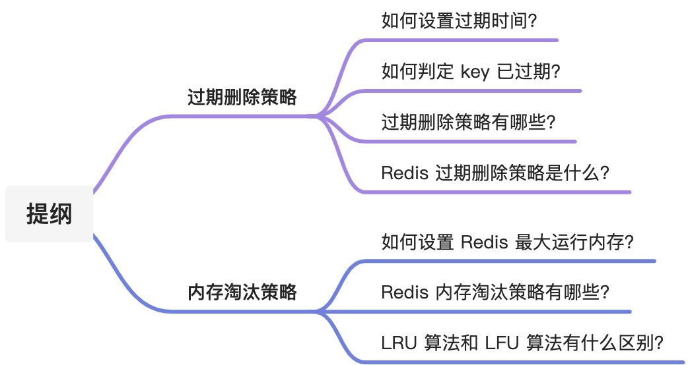
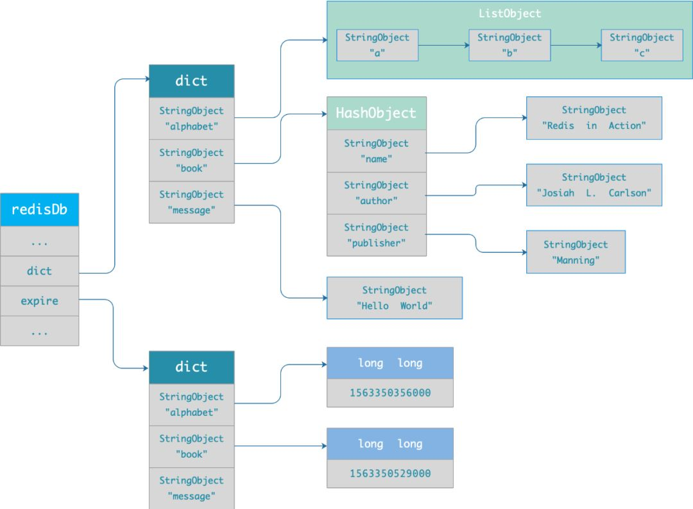
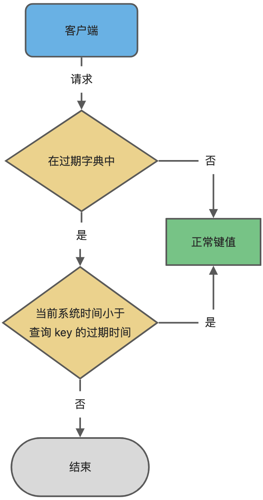
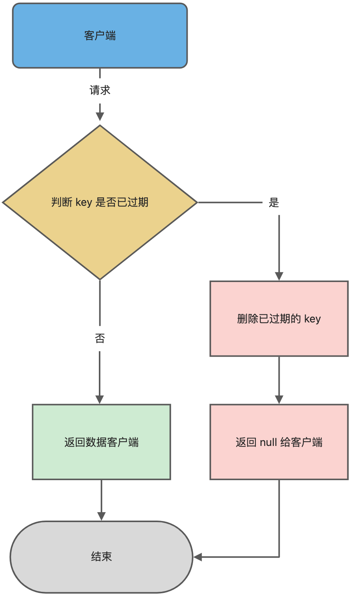
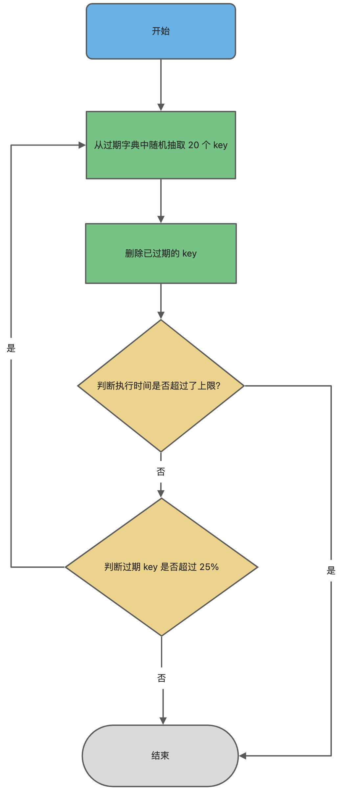
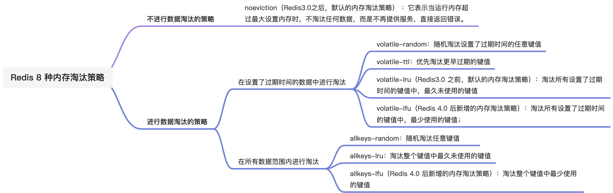

# Redis过期删除策略和内存淘汰策略有什么区别？

# Redis 过期删除策略和内存淘汰策略有什么区别？
<font style="color:rgb(44, 62, 80);">Redis 的「内存淘汰策略」和「过期删除策略」，很多小伙伴容易混淆，这两个机制虽然都是做删除的操作，但是触发的条件和使用的策略都是不同的。</font>

<font style="color:rgb(44, 62, 80);">今天就跟大家理一理，「内存淘汰策略」和「过期删除策略」。</font>

<font style="color:rgb(44, 62, 80);">发车！</font>



## [](https://xiaolincoding.com/redis/module/strategy.html#%E8%BF%87%E6%9C%9F%E5%88%A0%E9%99%A4%E7%AD%96%E7%95%A5)<font style="color:rgb(44, 62, 80);">过期删除策略</font>
<font style="color:rgb(44, 62, 80);">Redis 是可以对 key 设置过期时间的，因此需要有相应的机制将已过期的键值对删除，而做这个工作的就是过期键值删除策略。</font>

### [](https://xiaolincoding.com/redis/module/strategy.html#%E5%A6%82%E4%BD%95%E8%AE%BE%E7%BD%AE%E8%BF%87%E6%9C%9F%E6%97%B6%E9%97%B4)<font style="color:rgb(44, 62, 80);">如何设置过期时间？</font>
<font style="color:rgb(44, 62, 80);">先说一下对 key 设置过期时间的命令。 设置 key 过期时间的命令一共有 4 个：</font>

+ <font style="color:rgb(71, 101, 130);">expire </font><font style="color:rgb(71, 101, 130);"> </font><font style="color:rgb(44, 62, 80);">：设置 key 在 n 秒后过期，比如 expire key 100 表示设置 key 在 100 秒后过期；</font>
+ <font style="color:rgb(71, 101, 130);">pexpire </font><font style="color:rgb(71, 101, 130);"> </font><font style="color:rgb(44, 62, 80);">：设置 key 在 n 毫秒后过期，比如 pexpire key2 100000 表示设置 key2 在 100000 毫秒（100 秒）后过期。</font>
+ <font style="color:rgb(71, 101, 130);">expireat </font><font style="color:rgb(71, 101, 130);"> </font><font style="color:rgb(44, 62, 80);">：设置 key 在某个时间戳（精确到秒）之后过期，比如 expireat key3 1655654400 表示 key3 在时间戳 1655654400 后过期（精确到秒）；</font>
+ <font style="color:rgb(71, 101, 130);">pexpireat </font><font style="color:rgb(71, 101, 130);"> </font><font style="color:rgb(44, 62, 80);">：设置 key 在某个时间戳（精确到毫秒）之后过期，比如 pexpireat key4 1655654400000 表示 key4 在时间戳 1655654400000 后过期（精确到毫秒）</font>

<font style="color:rgb(44, 62, 80);">当然，在设置字符串时，也可以同时对 key 设置过期时间，共有 3 种命令：</font>

+ <font style="color:rgb(71, 101, 130);">set </font><font style="color:rgb(71, 101, 130);"> </font><font style="color:rgb(71, 101, 130);"> ex </font><font style="color:rgb(44, 62, 80);"> </font><font style="color:rgb(44, 62, 80);">：设置键值对的时候，同时指定过期时间（精确到秒）；</font>
+ <font style="color:rgb(71, 101, 130);">set </font><font style="color:rgb(71, 101, 130);"> </font><font style="color:rgb(71, 101, 130);"> px </font><font style="color:rgb(44, 62, 80);"> </font><font style="color:rgb(44, 62, 80);">：设置键值对的时候，同时指定过期时间（精确到毫秒）；</font>
+ <font style="color:rgb(71, 101, 130);">setex </font><font style="color:rgb(71, 101, 130);"> </font><font style="color:rgb(71, 101, 130);"> </font><font style="color:rgb(44, 62, 80);"> </font><font style="color:rgb(44, 62, 80);">：设置键值对的时候，同时指定过期时间（精确到秒）。</font>

<font style="color:rgb(44, 62, 80);">如果你想查看某个 key 剩余的存活时间，可以使用</font><font style="color:rgb(44, 62, 80);"> </font><font style="color:rgb(71, 101, 130);">TTL </font><font style="color:rgb(44, 62, 80);"> </font><font style="color:rgb(44, 62, 80);">命令。</font>


```bash
 设置键值对的时候，同时指定过期时间位 60 秒
> setex key1 60 value1
OK

 查看 key1 过期时间还剩多少
> ttl key1
(integer) 56
> ttl key1
(integer) 52
```

<font style="color:rgb(44, 62, 80);">如果突然反悔，取消 key 的过期时间，则可以使用</font><font style="color:rgb(44, 62, 80);"> </font><font style="color:rgb(71, 101, 130);">PERSIST </font><font style="color:rgb(44, 62, 80);"> </font><font style="color:rgb(44, 62, 80);">命令。</font>


```bash
 取消 key1 的过期时间
> persist key1
(integer) 1

 使用完 persist 命令之后，
 查下 key1 的存活时间结果是 -1，表明 key1 永不过期 
> ttl key1 
(integer) -1
```

### [](https://xiaolincoding.com/redis/module/strategy.html#%E5%A6%82%E4%BD%95%E5%88%A4%E5%AE%9A-key-%E5%B7%B2%E8%BF%87%E6%9C%9F%E4%BA%86)<font style="color:rgb(44, 62, 80);">如何判定 key 已过期了？</font>
<font style="color:rgb(44, 62, 80);">每当我们对一个 key 设置了过期时间时，Redis 会把该 key 带上过期时间存储到一个</font>**<font style="color:rgb(48, 79, 254);">过期字典</font>**<font style="color:rgb(44, 62, 80);">（expires dict）中，也就是说「过期字典」保存了数据库中所有 key 的过期时间。</font>

<font style="color:rgb(44, 62, 80);">过期字典存储在 redisDb 结构中，如下：</font>


```c
typedef struct redisDb {
    dict *dict;    /* 数据库键空间，存放着所有的键值对 */
    dict *expires; /* 键的过期时间 */
    ....
} redisDb;
```

<font style="color:rgb(44, 62, 80);">过期字典数据结构结构如下：</font>

+ <font style="color:rgb(44, 62, 80);">过期字典的 key 是一个指针，指向某个键对象；</font>
+ <font style="color:rgb(44, 62, 80);">过期字典的 value 是一个 long long 类型的整数，这个整数保存了 key 的过期时间；</font>

<font style="color:rgb(44, 62, 80);">过期字典的数据结构如下图所示：</font>



<font style="color:rgb(44, 62, 80);">字典实际上是哈希表，哈希表的最大好处就是让我们可以用 O(1) 的时间复杂度来快速查找。当我们查询一个 key 时，Redis 首先检查该 key 是否存在于过期字典中：</font>

+ <font style="color:rgb(44, 62, 80);">如果不在，则正常读取键值；</font>
+ <font style="color:rgb(44, 62, 80);">如果存在，则会获取该 key 的过期时间，然后与当前系统时间进行比对，如果比系统时间大，那就没有过期，否则判定该 key 已过期。</font>

<font style="color:rgb(44, 62, 80);">过期键判断流程如下图所示：</font>



### [](https://xiaolincoding.com/redis/module/strategy.html#%E8%BF%87%E6%9C%9F%E5%88%A0%E9%99%A4%E7%AD%96%E7%95%A5%E6%9C%89%E5%93%AA%E4%BA%9B)<font style="color:rgb(44, 62, 80);">过期删除策略有哪些？</font>
<font style="color:rgb(44, 62, 80);">在说 Redis 过期删除策略之前，先跟大家介绍下，常见的三种过期删除策略：</font>

+ <font style="color:rgb(44, 62, 80);">定时删除；</font>
+ <font style="color:rgb(44, 62, 80);">惰性删除；</font>
+ <font style="color:rgb(44, 62, 80);">定期删除；</font>

<font style="color:rgb(44, 62, 80);">接下来，分别分析它们的优缺点。</font>

<font style="color:rgb(44, 62, 80);background-color:rgb(227, 242, 253);">定时删除策略是怎么样的？</font>

<font style="color:rgb(44, 62, 80);">定时删除策略的做法是，</font>**<font style="color:rgb(48, 79, 254);">在设置 key 的过期时间时，同时创建一个定时事件，当时间到达时，由事件处理器自动执行 key 的删除操作。</font>**

<font style="color:rgb(44, 62, 80);">定时删除策略的</font>**<font style="color:rgb(48, 79, 254);">优点</font>**<font style="color:rgb(44, 62, 80);">：</font>

+ <font style="color:rgb(44, 62, 80);">可以保证过期 key 会被尽快删除，也就是内存可以被尽快地释放。因此，定时删除对内存是最友好的。</font>

<font style="color:rgb(44, 62, 80);">定时删除策略的</font>**<font style="color:rgb(48, 79, 254);">缺点</font>**<font style="color:rgb(44, 62, 80);">：</font>

+ <font style="color:rgb(44, 62, 80);">在过期 key 比较多的情况下，删除过期 key 可能会占用相当一部分 CPU 时间，在内存不紧张但 CPU 时间紧张的情况下，将 CPU 时间用于删除和当前任务无关的过期键上，无疑会对服务器的响应时间和吞吐量造成影响。所以，定时删除策略对 CPU 不友好。</font>

<font style="color:rgb(44, 62, 80);background-color:rgb(227, 242, 253);">惰性删除策略是怎么样的？</font>

<font style="color:rgb(44, 62, 80);">惰性删除策略的做法是，</font>**<font style="color:rgb(48, 79, 254);">不主动删除过期键，每次从数据库访问 key 时，都检测 key 是否过期，如果过期则删除该 key。</font>**

<font style="color:rgb(44, 62, 80);">惰性删除策略的</font>**<font style="color:rgb(48, 79, 254);">优点</font>**<font style="color:rgb(44, 62, 80);">：</font>

+ <font style="color:rgb(44, 62, 80);">因为每次访问时，才会检查 key 是否过期，所以此策略只会使用很少的系统资源，因此，惰性删除策略对 CPU 时间最友好。</font>

<font style="color:rgb(44, 62, 80);">惰性删除策略的</font>**<font style="color:rgb(48, 79, 254);">缺点</font>**<font style="color:rgb(44, 62, 80);">：</font>

+ <font style="color:rgb(44, 62, 80);">如果一个 key 已经过期，而这个 key 又仍然保留在数据库中，那么只要这个过期 key 一直没有被访问，它所占用的内存就不会释放，造成了一定的内存空间浪费。所以，惰性删除策略对内存不友好。</font>

<font style="color:rgb(44, 62, 80);background-color:rgb(227, 242, 253);">定期删除策略是怎么样的？</font>

<font style="color:rgb(44, 62, 80);">定期删除策略的做法是，</font>**<font style="color:rgb(48, 79, 254);">每隔一段时间「随机」从数据库中取出一定数量的 key 进行检查，并删除其中的过期key。</font>**

<font style="color:rgb(44, 62, 80);">定期删除策略的</font>**<font style="color:rgb(48, 79, 254);">优点</font>**<font style="color:rgb(44, 62, 80);">：</font>

+ <font style="color:rgb(44, 62, 80);">通过限制删除操作执行的时长和频率，来减少删除操作对 CPU 的影响，同时也能删除一部分过期的数据减少了过期键对空间的无效占用。</font>

<font style="color:rgb(44, 62, 80);">定期删除策略的</font>**<font style="color:rgb(48, 79, 254);">缺点</font>**<font style="color:rgb(44, 62, 80);">：</font>

+ <font style="color:rgb(44, 62, 80);">内存清理方面没有定时删除效果好，同时没有惰性删除使用的系统资源少。</font>
+ <font style="color:rgb(44, 62, 80);">难以确定删除操作执行的时长和频率。如果执行的太频繁，定期删除策略变得和定时删除策略一样，对CPU不友好；如果执行的太少，那又和惰性删除一样了，过期 key 占用的内存不会及时得到释放。</font>

### [](https://xiaolincoding.com/redis/module/strategy.html#redis-%E8%BF%87%E6%9C%9F%E5%88%A0%E9%99%A4%E7%AD%96%E7%95%A5%E6%98%AF%E4%BB%80%E4%B9%88)<font style="color:rgb(44, 62, 80);">Redis 过期删除策略是什么？</font>
<font style="color:rgb(44, 62, 80);">前面介绍了三种过期删除策略，每一种都有优缺点，仅使用某一个策略都不能满足实际需求。</font>

<font style="color:rgb(44, 62, 80);">所以，</font><font style="color:rgb(44, 62, 80);"> </font>**<font style="color:rgb(48, 79, 254);">Redis 选择「惰性删除+定期删除」这两种策略配和使用</font>**<font style="color:rgb(44, 62, 80);">，以求在合理使用 CPU 时间和避免内存浪费之间取得平衡。</font>

<font style="color:rgb(44, 62, 80);background-color:rgb(227, 242, 253);">Redis 是怎么实现惰性删除的？</font>

<font style="color:rgb(44, 62, 80);">Redis 的惰性删除策略由 db.c 文件中的</font><font style="color:rgb(44, 62, 80);"> </font><font style="color:rgb(71, 101, 130);">expireIfNeeded</font><font style="color:rgb(44, 62, 80);"> </font><font style="color:rgb(44, 62, 80);">函数实现，代码如下：</font>


```c
int expireIfNeeded(redisDb *db, robj *key) {
    // 判断 key 是否过期
    if (!keyIsExpired(db,key)) return 0;
    ....
    /* 删除过期键 */
    ....
    // 如果 server.lazyfree_lazy_expire 为 1 表示异步删除，反之同步删除；
    return server.lazyfree_lazy_expire ? dbAsyncDelete(db,key) :
                                         dbSyncDelete(db,key);
}
```

<font style="color:rgb(44, 62, 80);">Redis 在访问或者修改 key 之前，都会调用 expireIfNeeded 函数对其进行检查，检查 key 是否过期：</font>

+ <font style="color:rgb(44, 62, 80);">如果过期，则删除该 key，至于选择异步删除，还是选择同步删除，根据</font><font style="color:rgb(44, 62, 80);"> </font><font style="color:rgb(71, 101, 130);">lazyfree_lazy_expire</font><font style="color:rgb(44, 62, 80);"> </font><font style="color:rgb(44, 62, 80);">参数配置决定（Redis 4.0版本开始提供参数），然后返回 null 客户端；</font>
+ <font style="color:rgb(44, 62, 80);">如果没有过期，不做任何处理，然后返回正常的键值对给客户端；</font>

<font style="color:rgb(44, 62, 80);">惰性删除的流程图如下：</font>



<font style="color:rgb(44, 62, 80);background-color:rgb(227, 242, 253);">Redis 是怎么实现定期删除的？</font>

<font style="color:rgb(44, 62, 80);">再回忆一下，定期删除策略的做法：</font>**<font style="color:rgb(48, 79, 254);">每隔一段时间「随机」从数据库中取出一定数量的 key 进行检查，并删除其中的过期key。</font>**

_<font style="color:rgb(200, 73, 255);">1、这个间隔检查的时间是多长呢？</font>_

<font style="color:rgb(44, 62, 80);">在 Redis 中，默认每秒进行 10 次过期检查一次数据库，此配置可通过 Redis 的配置文件 redis.conf 进行配置，配置键为 hz 它的默认值是 hz 10。</font>

<font style="color:rgb(44, 62, 80);">特别强调下，每次检查数据库并不是遍历过期字典中的所有 key，而是从数据库中随机抽取一定数量的 key 进行过期检查。</font>

_<font style="color:rgb(200, 73, 255);">2、随机抽查的数量是多少呢？</font>_

<font style="color:rgb(44, 62, 80);">我查了下源码，定期删除的实现在 expire.c 文件下的</font><font style="color:rgb(44, 62, 80);"> </font><font style="color:rgb(71, 101, 130);">activeExpireCycle</font><font style="color:rgb(44, 62, 80);"> </font><font style="color:rgb(44, 62, 80);">函数中，其中随机抽查的数量由</font><font style="color:rgb(44, 62, 80);"> </font><font style="color:rgb(71, 101, 130);">ACTIVE_EXPIRE_CYCLE_LOOKUPS_PER_LOOP</font><font style="color:rgb(44, 62, 80);"> </font><font style="color:rgb(44, 62, 80);">定义的，它是写死在代码中的，数值是 20。</font>

<font style="color:rgb(44, 62, 80);">也就是说，数据库每轮抽查时，会随机选择 20 个 key 判断是否过期。</font>

<font style="color:rgb(44, 62, 80);">接下来，详细说说 Redis 的定期删除的流程：</font>

1. <font style="color:rgb(44, 62, 80);">从过期字典中随机抽取 20 个 key；</font>
2. <font style="color:rgb(44, 62, 80);">检查这 20 个 key 是否过期，并删除已过期的 key；</font>
3. <font style="color:rgb(44, 62, 80);">如果本轮检查的已过期 key 的数量，超过 5 个（20/4），也就是「已过期 key 的数量」占比「随机抽取 key 的数量」大于 25%，则继续重复步骤 1；如果已过期的 key 比例小于 25%，则停止继续删除过期 key，然后等待下一轮再检查。</font>

<font style="color:rgb(44, 62, 80);">可以看到，定期删除是一个循环的流程。</font>

<font style="color:rgb(44, 62, 80);">那 Redis 为了保证定期删除不会出现循环过度，导致线程卡死现象，为此增加了定期删除循环流程的时间上限，默认不会超过 25ms。</font>

<font style="color:rgb(44, 62, 80);">针对定期删除的流程，我写了个伪代码：</font>


```c
do {
    //已过期的数量
    expired = 0；
    //随机抽取的数量
    num = 20;
    while (num--) {
        //1. 从过期字典中随机抽取 1 个 key
        //2. 判断该 key 是否过期，如果已过期则进行删除，同时对 expired++
    }
    
    // 超过时间限制则退出
    if (timelimit_exit) return;

  /* 如果本轮检查的已过期 key 的数量，超过 25%，则继续随机抽查，否则退出本轮检查 */
} while (expired > 20/4);
```

<font style="color:rgb(44, 62, 80);">定期删除的流程如下：</font>



## [](https://xiaolincoding.com/redis/module/strategy.html#%E5%86%85%E5%AD%98%E6%B7%98%E6%B1%B0%E7%AD%96%E7%95%A5)<font style="color:rgb(44, 62, 80);">内存淘汰策略</font>
<font style="color:rgb(44, 62, 80);">前面说的过期删除策略，是删除已过期的 key，而当 Redis 的运行内存已经超过 Redis 设置的最大内存之后，则会使用内存淘汰策略删除符合条件的 key，以此来保障 Redis 高效的运行。</font>

### [](https://xiaolincoding.com/redis/module/strategy.html#%E5%A6%82%E4%BD%95%E8%AE%BE%E7%BD%AE-redis-%E6%9C%80%E5%A4%A7%E8%BF%90%E8%A1%8C%E5%86%85%E5%AD%98)<font style="color:rgb(44, 62, 80);">如何设置 Redis 最大运行内存？</font>
<font style="color:rgb(44, 62, 80);">在配置文件 redis.conf 中，可以通过参数</font><font style="color:rgb(44, 62, 80);"> </font><font style="color:rgb(71, 101, 130);">maxmemory </font><font style="color:rgb(44, 62, 80);"> </font><font style="color:rgb(44, 62, 80);">来设定最大运行内存，只有在 Redis 的运行内存达到了我们设置的最大运行内存，才会触发内存淘汰策略。 不同位数的操作系统，maxmemory 的默认值是不同的：</font>

+ <font style="color:rgb(44, 62, 80);">在 64 位操作系统中，maxmemory 的默认值是 0，表示没有内存大小限制，那么不管用户存放多少数据到 Redis 中，Redis 也不会对可用内存进行检查，直到 Redis 实例因内存不足而崩溃也无作为。</font>
+ <font style="color:rgb(44, 62, 80);">在 32 位操作系统中，maxmemory 的默认值是 3G，因为 32 位的机器最大只支持 4GB 的内存，而系统本身就需要一定的内存资源来支持运行，所以 32 位操作系统限制最大 3 GB 的可用内存是非常合理的，这样可以避免因为内存不足而导致 Redis 实例崩溃。</font>

### [](https://xiaolincoding.com/redis/module/strategy.html#redis-%E5%86%85%E5%AD%98%E6%B7%98%E6%B1%B0%E7%AD%96%E7%95%A5%E6%9C%89%E5%93%AA%E4%BA%9B)<font style="color:rgb(44, 62, 80);">Redis 内存淘汰策略有哪些？</font>
<font style="color:rgb(44, 62, 80);">Redis 内存淘汰策略共有八种，这八种策略大体分为「不进行数据淘汰」和「进行数据淘汰」两类策略。</font>

_<font style="color:rgb(200, 73, 255);">1、不进行数据淘汰的策略</font>_

**<font style="color:rgb(48, 79, 254);">noeviction</font>**<font style="color:rgb(44, 62, 80);">（Redis3.0之后，默认的内存淘汰策略） ：它表示当运行内存超过最大设置内存时，不淘汰任何数据，这时如果有新的数据写入，会报错通知禁止写入，不淘汰任何数据，但是如果没用数据写入的话，只是单纯的查询或者删除操作的话，还是可以正常工作。</font>

_<font style="color:rgb(200, 73, 255);">2、进行数据淘汰的策略</font>_

<font style="color:rgb(44, 62, 80);">针对「进行数据淘汰」这一类策略，又可以细分为「在设置了过期时间的数据中进行淘汰」和「在所有数据范围内进行淘汰」这两类策略。</font>

<font style="color:rgb(44, 62, 80);">在设置了过期时间的数据中进行淘汰：</font>

+ **<font style="color:rgb(48, 79, 254);">volatile-random</font>**<font style="color:rgb(44, 62, 80);">：随机淘汰设置了过期时间的任意键值；</font>
+ **<font style="color:rgb(48, 79, 254);">volatile-ttl</font>**<font style="color:rgb(44, 62, 80);">：优先淘汰更早过期的键值。</font>
+ **<font style="color:rgb(48, 79, 254);">volatile-lru</font>**<font style="color:rgb(44, 62, 80);">（Redis3.0 之前，默认的内存淘汰策略）：淘汰所有设置了过期时间的键值中，最久未使用的键值；</font>
+ **<font style="color:rgb(48, 79, 254);">volatile-lfu</font>**<font style="color:rgb(44, 62, 80);">（Redis 4.0 后新增的内存淘汰策略）：淘汰所有设置了过期时间的键值中，最少使用的键值；</font>

<font style="color:rgb(44, 62, 80);">在所有数据范围内进行淘汰：</font>

+ **<font style="color:rgb(48, 79, 254);">allkeys-random</font>**<font style="color:rgb(44, 62, 80);">：随机淘汰任意键值;</font>
+ **<font style="color:rgb(48, 79, 254);">allkeys-lru</font>**<font style="color:rgb(44, 62, 80);">：淘汰整个键值中最久未使用的键值；</font>
+ **<font style="color:rgb(48, 79, 254);">allkeys-lfu</font>**<font style="color:rgb(44, 62, 80);">（Redis 4.0 后新增的内存淘汰策略）：淘汰整个键值中最少使用的键值。</font>

<font style="color:rgb(44, 62, 80);background-color:rgb(227, 242, 253);">如何查看当前 Redis 使用的内存淘汰策略？</font>

<font style="color:rgb(44, 62, 80);">可以使用</font><font style="color:rgb(44, 62, 80);"> </font><font style="color:rgb(71, 101, 130);">config get maxmemory-policy</font><font style="color:rgb(44, 62, 80);"> </font><font style="color:rgb(44, 62, 80);">命令，来查看当前 Redis 的内存淘汰策略，命令如下：</font>


```bash
127.0.0.1:6379> config get maxmemory-policy
1) "maxmemory-policy"
2) "noeviction"
```

<font style="color:rgb(44, 62, 80);">可以看出，当前 Redis 使用的是</font><font style="color:rgb(44, 62, 80);"> </font><font style="color:rgb(71, 101, 130);">noeviction</font><font style="color:rgb(44, 62, 80);"> </font><font style="color:rgb(44, 62, 80);">类型的内存淘汰策略，它是 Redis 3.0 之后默认使用的内存淘汰策略，表示当运行内存超过最大设置内存时，不淘汰任何数据，但新增操作会报错。</font>

<font style="color:rgb(44, 62, 80);background-color:rgb(227, 242, 253);">如何修改 Redis 内存淘汰策略？</font>

<font style="color:rgb(44, 62, 80);">设置内存淘汰策略有两种方法：</font>

+ <font style="color:rgb(44, 62, 80);">方式一：通过“</font><font style="color:rgb(71, 101, 130);">config set maxmemory-policy <策略></font><font style="color:rgb(44, 62, 80);">”命令设置。它的优点是设置之后立即生效，不需要重启 Redis 服务，缺点是重启 Redis 之后，设置就会失效。</font>
+ <font style="color:rgb(44, 62, 80);">方式二：通过修改 Redis 配置文件修改，设置“</font><font style="color:rgb(71, 101, 130);">maxmemory-policy <策略></font><font style="color:rgb(44, 62, 80);">”，它的优点是重启 Redis 服务后配置不会丢失，缺点是必须重启 Redis 服务，设置才能生效。</font>

### [](https://xiaolincoding.com/redis/module/strategy.html#lru-%E7%AE%97%E6%B3%95%E5%92%8C-lfu-%E7%AE%97%E6%B3%95%E6%9C%89%E4%BB%80%E4%B9%88%E5%8C%BA%E5%88%AB)<font style="color:rgb(44, 62, 80);">LRU 算法和 LFU 算法有什么区别？</font>
<font style="color:rgb(44, 62, 80);">LFU 内存淘汰算法是 Redis 4.0 之后新增内存淘汰策略，那为什么要新增这个算法？那肯定是为了解决 LRU 算法的问题。</font>

<font style="color:rgb(44, 62, 80);">接下来，就看看这两个算法有什么区别？Redis 又是如何实现这两个算法的？</font>

<font style="color:rgb(44, 62, 80);background-color:rgb(227, 242, 253);">什么是 LRU 算法？</font>

**<font style="color:rgb(48, 79, 254);">LRU</font>**<font style="color:rgb(44, 62, 80);"> </font><font style="color:rgb(44, 62, 80);">全称是 Least Recently Used 翻译为</font>**<font style="color:rgb(48, 79, 254);">最近最少使用</font>**<font style="color:rgb(44, 62, 80);">，会选择淘汰最近最少使用的数据。</font>

<font style="color:rgb(44, 62, 80);">传统 LRU 算法的实现是基于「链表」结构，链表中的元素按照操作顺序从前往后排列，最新操作的键会被移动到表头，当需要内存淘汰时，只需要删除链表尾部的元素即可，因为链表尾部的元素就代表最久未被使用的元素。</font>

<font style="color:rgb(44, 62, 80);">Redis 并没有使用这样的方式实现 LRU 算法，因为传统的 LRU 算法存在两个问题：</font>

+ <font style="color:rgb(44, 62, 80);">需要用链表管理所有的缓存数据，这会带来额外的空间开销；</font>
+ <font style="color:rgb(44, 62, 80);">当有数据被访问时，需要在链表上把该数据移动到头端，如果有大量数据被访问，就会带来很多链表移动操作，会很耗时，进而会降低 Redis 缓存性能。</font>

<font style="color:rgb(44, 62, 80);background-color:rgb(227, 242, 253);">Redis 是如何实现 LRU 算法的？</font>

<font style="color:rgb(44, 62, 80);">Redis 实现的是一种</font>**<font style="color:rgb(48, 79, 254);">近似 LRU 算法</font>**<font style="color:rgb(44, 62, 80);">，目的是为了更好的节约内存，它的</font>**<font style="color:rgb(48, 79, 254);">实现方式是在 Redis 的对象结构体中添加一个额外的字段，用于记录此数据的最后一次访问时间</font>**<font style="color:rgb(44, 62, 80);">。</font>

<font style="color:rgb(44, 62, 80);">当 Redis 进行内存淘汰时，会使用</font>**<font style="color:rgb(48, 79, 254);">随机采样的方式来淘汰数据</font>**<font style="color:rgb(44, 62, 80);">，它是随机取 5 个值（此值可配置），然后</font>**<font style="color:rgb(48, 79, 254);">淘汰最久没有使用的那个</font>**<font style="color:rgb(44, 62, 80);">。</font>

<font style="color:rgb(44, 62, 80);">Redis 实现的 LRU 算法的优点：</font>

+ <font style="color:rgb(44, 62, 80);">不用为所有的数据维护一个大链表，节省了空间占用；</font>
+ <font style="color:rgb(44, 62, 80);">不用在每次数据访问时都移动链表项，提升了缓存的性能；</font>

<font style="color:rgb(44, 62, 80);">但是 LRU 算法有一个问题，</font>**<font style="color:rgb(48, 79, 254);">无法解决缓存污染问题</font>**<font style="color:rgb(44, 62, 80);">，比如应用一次读取了大量的数据，而这些数据只会被读取这一次，那么这些数据会留存在 Redis 缓存中很长一段时间，造成缓存污染。</font>

<font style="color:rgb(44, 62, 80);">因此，在 Redis 4.0 之后引入了 LFU 算法来解决这个问题。</font>

<font style="color:rgb(44, 62, 80);background-color:rgb(227, 242, 253);">什么是 LFU 算法？</font>

<font style="color:rgb(44, 62, 80);">LFU 全称是 Least Frequently Used 翻译为</font>**<font style="color:rgb(48, 79, 254);">最近最不常用</font>**<font style="color:rgb(44, 62, 80);">，LFU 算法是根据数据访问次数来淘汰数据的，它的核心思想是“如果数据过去被访问多次，那么将来被访问的频率也更高”。</font>

<font style="color:rgb(44, 62, 80);">所以， LFU 算法会记录每个数据的访问次数。当一个数据被再次访问时，就会增加该数据的访问次数。这样就解决了偶尔被访问一次之后，数据留存在缓存中很长一段时间的问题，相比于 LRU 算法也更合理一些。</font>

<font style="color:rgb(44, 62, 80);background-color:rgb(227, 242, 253);">Redis 是如何实现 LFU 算法的？</font>

<font style="color:rgb(44, 62, 80);">LFU 算法相比于 LRU 算法的实现，多记录了「数据的访问频次」的信息。Redis 对象的结构如下：</font>


```c
typedef struct redisObject {
    ...
      
    // 24 bits，用于记录对象的访问信息
    unsigned lru:24;  
    ...
} robj;
```

<font style="color:rgb(44, 62, 80);">Redis 对象头中的 lru 字段，在 LRU 算法下和 LFU 算法下使用方式并不相同。</font>

**<font style="color:rgb(48, 79, 254);">在 LRU 算法中</font>**<font style="color:rgb(44, 62, 80);">，Redis 对象头的 24 bits 的 lru 字段是用来记录 key 的访问时间戳，因此在 LRU 模式下，Redis可以根据对象头中的 lru 字段记录的值，来比较最后一次 key 的访问时间长，从而淘汰最久未被使用的 key。</font>

**<font style="color:rgb(48, 79, 254);">在 LFU 算法中</font>**<font style="color:rgb(44, 62, 80);">，Redis对象头的 24 bits 的 lru 字段被分成两段来存储，高 16bit 存储 ldt(Last Decrement Time)，低 8bit 存储 logc(Logistic Counter)。</font>


+ <font style="color:rgb(44, 62, 80);">ldt 是用来记录 key 的访问时间戳；</font>
+ <font style="color:rgb(44, 62, 80);">logc 是用来记录 key 的访问频次，它的值越小表示使用频率越低，越容易淘汰，每个新加入的 key 的logc 初始值为 5。</font>

<font style="color:rgb(44, 62, 80);">注意，logc 并不是单纯的访问次数，而是访问频次（访问频率），因为</font><font style="color:rgb(44, 62, 80);"> </font>**<font style="color:rgb(48, 79, 254);">logc 会随时间推移而衰减的</font>**<font style="color:rgb(44, 62, 80);">。</font>

<font style="color:rgb(44, 62, 80);">在每次 key 被访问时，会先对 logc 做一个衰减操作，衰减的值跟前后访问时间的差距有关系，如果上一次访问的时间与这一次访问的时间差距很大，那么衰减的值就越大，这样实现的 LFU 算法是根据</font>**<font style="color:rgb(48, 79, 254);">访问频率</font>**<font style="color:rgb(44, 62, 80);">来淘汰数据的，而不只是访问次数。访问频率需要考虑 key 的访问是多长时间段内发生的。key 的先前访问距离当前时间越长，那么这个 key 的访问频率相应地也就会降低，这样被淘汰的概率也会更大。</font>

<font style="color:rgb(44, 62, 80);">对 logc 做完衰减操作后，就开始对 logc 进行增加操作，增加操作并不是单纯的 + 1，而是根据概率增加，如果 logc 越大的 key，它的 logc 就越难再增加。</font>

<font style="color:rgb(44, 62, 80);">所以，Redis 在访问 key 时，对于 logc 是这样变化的：</font>

1. <font style="color:rgb(44, 62, 80);">先按照上次访问距离当前的时长，来对 logc 进行衰减；</font>
2. <font style="color:rgb(44, 62, 80);">然后，再按照一定概率增加 logc 的值</font>

<font style="color:rgb(44, 62, 80);">redis.conf 提供了两个配置项，用于调整 LFU 算法从而控制 logc 的增长和衰减：</font>

+ <font style="color:rgb(71, 101, 130);">lfu-decay-time</font><font style="color:rgb(44, 62, 80);"> </font><font style="color:rgb(44, 62, 80);">用于调整 logc 的衰减速度，它是一个以分钟为单位的数值，默认值为1，lfu-decay-time 值越大，衰减越慢；</font>
+ <font style="color:rgb(71, 101, 130);">lfu-log-factor</font><font style="color:rgb(44, 62, 80);"> </font><font style="color:rgb(44, 62, 80);">用于调整 logc 的增长速度，lfu-log-factor 值越大，logc 增长越慢。</font>

## [](https://xiaolincoding.com/redis/module/strategy.html#%E6%80%BB%E7%BB%93)<font style="color:rgb(44, 62, 80);">总结</font>
<font style="color:rgb(44, 62, 80);">Redis 使用的过期删除策略是「惰性删除+定期删除」，删除的对象是已过期的 key。</font>


<font style="color:rgb(44, 62, 80);">内存淘汰策略是解决内存过大的问题，当 Redis 的运行内存超过最大运行内存时，就会触发内存淘汰策略，Redis 4.0 之后共实现了 8 种内存淘汰策略，我也对这 8 种的策略进行分类，如下：</font>



<font style="color:rgb(44, 62, 80);">完！</font>

<font style="color:rgb(44, 62, 80);">答应我，下次别再搞混了</font>


> 更新: 2024-01-02 19:33:22  
原文: [https://www.yuque.com/vip6688/neho4x/tvktyg32mkve5xwg](https://www.yuque.com/vip6688/neho4x/tvktyg32mkve5xwg)
>


> 更新: 2024-11-25 16:06:35  
> 原文: <https://www.yuque.com/neumx/laxg2e/62f988566311062906d2891deaece7f9>