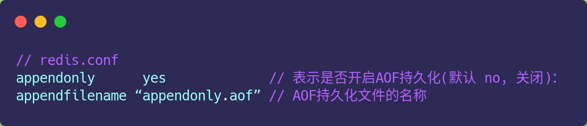
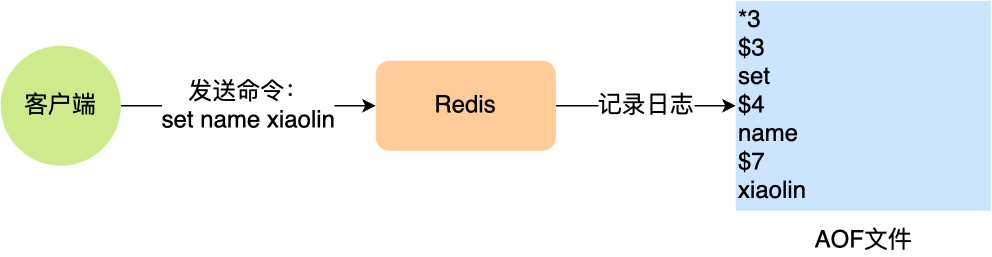
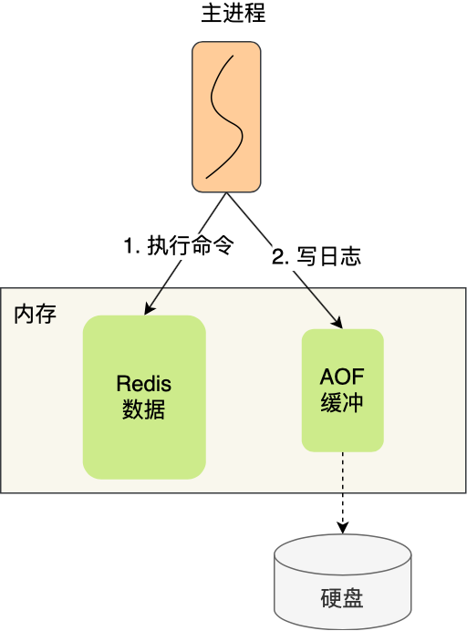
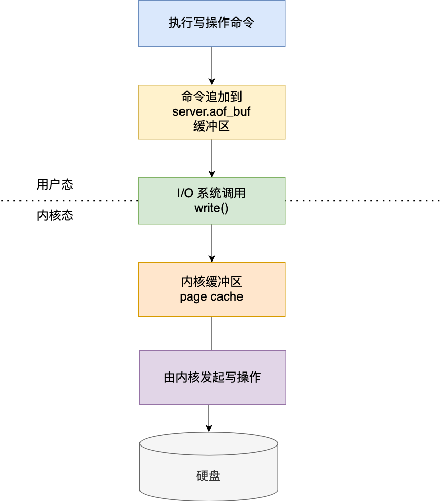
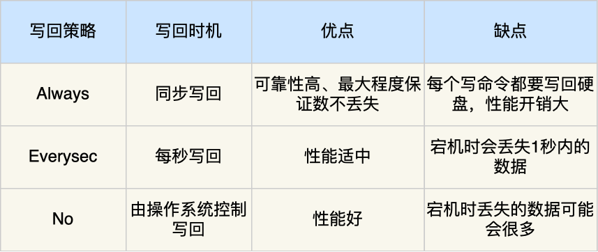
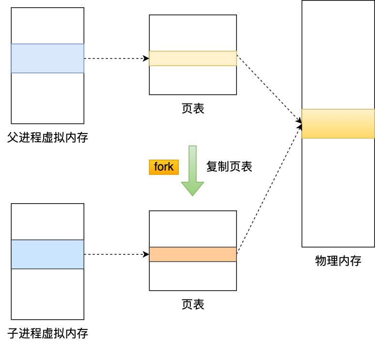
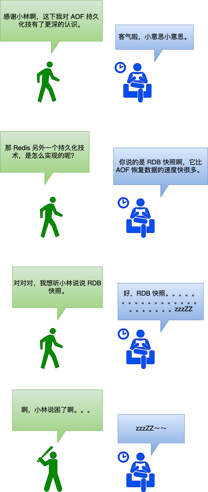

# AOF持久化是怎么实现的？

# AOF 持久化是怎么实现的？

## AOF 日志
试想一下，如果 Redis 每执行一条写操作命令，就把该命令以追加的方式写入到一个文件里，然后重启 Redis 的时候，先去读取这个文件里的命令，并且执行它，这不就相当于恢复了缓存数据了吗？

这种保存写操作命令到日志的持久化方式，就是 Redis 里的 **AOF(**_**Append Only File**_**)** 持久化功能，**注意只会记录写操作命令，读操作命令是不会被记录的**，因为没意义。

在 Redis 中 AOF 持久化功能默认是不开启的，需要我们修改 redis.conf 配置文件中的以下参数：

AOF 日志文件其实就是普通的文本，我们可以通过 cat 命令查看里面的内容，不过里面的内容如果不知道一定的规则的话，可能会看不懂。

我这里以「_set name xiaolin_」命令作为例子，Redis 执行了这条命令后，记录在 AOF 日志里的内容如下图：

我这里给大家解释下。

「*3」表示当前命令有三个部分，每部分都是以「$ +数字」开头，后面紧跟着具体的命令、键或值。然后，这里的「数字」表示这部分中的命令、键或值一共有多少字节。例如，「 $3 set」表示这部分有 3 个字节，也就是「set」命令这个字符串的长度。

不知道大家注意到没有，Redis 是先执行写操作命令后，才将该命令记录到 AOF 日志里的，这么做其实有两个好处。

第一个好处，**避免额外的检查开销。**

因为如果先将写操作命令记录到 AOF 日志里，再执行该命令的话，如果当前的命令语法有问题，那么如果不进行命令语法检查，该错误的命令记录到 AOF 日志里后，Redis 在使用日志恢复数据时，就可能会出错。

而如果先执行写操作命令再记录日志的话，只有在该命令执行成功后，才将命令记录到 AOF 日志里，这样就不用额外的检查开销，保证记录在 AOF 日志里的命令都是可执行并且正确的。

第二个好处，**不会阻塞当前写操作命令的执行**，因为当写操作命令执行成功后，才会将命令记录到 AOF 日志。

当然，AOF 持久化功能也不是没有潜在风险。

第一个风险，执行写操作命令和记录日志是两个过程，那当 Redis 在还没来得及将命令写入到硬盘时，服务器发生宕机了，这个数据就会有**丢失的风险**。

第二个风险，前面说道，由于写操作命令执行成功后才记录到 AOF 日志，所以不会阻塞当前写操作命令的执行，但是**可能会给「下一个」命令带来阻塞风险**。

因为将命令写入到日志的这个操作也是在主进程完成的（执行命令也是在主进程），也就是说这两个操作是同步的。

如果在将日志内容写入到硬盘时，服务器的硬盘的 I/O 压力太大，就会导致写硬盘的速度很慢，进而阻塞住了，也就会导致后续的命令无法执行。

认真分析一下，其实这两个风险都有一个共性，都跟「 AOF 日志写回硬盘的时机」有关。

## 三种写回策略
Redis 写入 AOF 日志的过程，如下图：

我先来具体说说：

1. Redis 执行完写操作命令后，会将命令追加到 server.aof_buf 缓冲区；
2. 然后通过 write() 系统调用，将 aof_buf 缓冲区的数据写入到 AOF 文件，此时数据并没有写入到硬盘，而是拷贝到了内核缓冲区 page cache，等待内核将数据写入硬盘；
3. 具体内核缓冲区的数据什么时候写入到硬盘，由内核决定。

Redis 提供了 3 种写回硬盘的策略，控制的就是上面说的第三步的过程。

在 redis.conf 配置文件中的 appendfsync 配置项可以有以下 3 种参数可填：

+ **Always**，这个单词的意思是「总是」，所以它的意思是每次写操作命令执行完后，同步将 AOF 日志数据写回硬盘；
+ **Everysec**，这个单词的意思是「每秒」，所以它的意思是每次写操作命令执行完后，先将命令写入到 AOF 文件的内核缓冲区，然后每隔一秒将缓冲区里的内容写回到硬盘；
+ **No**，意味着不由 Redis 控制写回硬盘的时机，转交给操作系统控制写回的时机，也就是每次写操作命令执行完后，先将命令写入到 AOF 文件的内核缓冲区，再由操作系统决定何时将缓冲区内容写回硬盘。

这 3 种写回策略都无法能完美解决「主进程阻塞」和「减少数据丢失」的问题，因为两个问题是对立的，偏向于一边的话，就会要牺牲另外一边，原因如下：

+ Always 策略的话，可以最大程度保证数据不丢失，但是由于它每执行一条写操作命令就同步将 AOF 内容写回硬盘，所以是不可避免会影响主进程的性能；
+ No 策略的话，是交由操作系统来决定何时将 AOF 日志内容写回硬盘，相比于 Always 策略性能较好，但是操作系统写回硬盘的时机是不可预知的，如果 AOF 日志内容没有写回硬盘，一旦服务器宕机，就会丢失不定数量的数据。
+ Everysec 策略的话，是折中的一种方式，避免了 Always 策略的性能开销，也比 No 策略更能避免数据丢失，当然如果上一秒的写操作命令日志没有写回到硬盘，发生了宕机，这一秒内的数据自然也会丢失。

大家根据自己的业务场景进行选择：

+ 如果要高性能，就选择 No 策略；
+ 如果要高可靠，就选择 Always 策略；
+ 如果允许数据丢失一点，但又想性能高，就选择 Everysec 策略。

我也把这 3 个写回策略的优缺点总结成了一张表格：

大家知道这三种策略是怎么实现的吗？

深入到源码后，你就会发现这三种策略只是在控制 fsync() 函数的调用时机。

当应用程序向文件写入数据时，内核通常先将数据复制到内核缓冲区中，然后排入队列，然后由内核决定何时写入硬盘。

如果想要应用程序向文件写入数据后，能立马将数据同步到硬盘，就可以调用 fsync() 函数，这样内核就会将内核缓冲区的数据直接写入到硬盘，等到硬盘写操作完成后，该函数才会返回。

+ Always 策略就是每次写入 AOF 文件数据后，就执行 fsync() 函数；
+ Everysec 策略就会创建一个异步任务来执行 fsync() 函数；
+ No 策略就是永不执行 fsync() 函数;

## AOF 重写机制
AOF 日志是一个文件，随着执行的写操作命令越来越多，文件的大小会越来越大。

如果当 AOF 日志文件过大就会带来性能问题，比如重启 Redis 后，需要读 AOF 文件的内容以恢复数据，如果文件过大，整个恢复的过程就会很慢。

所以，Redis 为了避免 AOF 文件越写越大，提供了 **AOF 重写机制**，当 AOF 文件的大小超过所设定的阈值后，Redis 就会启用 AOF 重写机制，来压缩 AOF 文件。

AOF 重写机制是在重写时，读取当前数据库中的所有键值对，然后将每一个键值对用一条命令记录到「新的 AOF 文件」，等到全部记录完后，就将新的 AOF 文件替换掉现有的 AOF 文件。

举个例子，在没有使用重写机制前，假设前后执行了「_set name xiaolin_」和「_set name xiaolincoding_」这两个命令的话，就会将这两个命令记录到 AOF 文件。

但是**在使用重写机制后，就会读取 name 最新的 value（键值对） ，然后用一条 「set name xiaolincoding」命令记录到新的 AOF 文件**，之前的第一个命令就没有必要记录了，因为它属于「历史」命令，没有作用了。这样一来，一个键值对在重写日志中只用一条命令就行了。

重写工作完成后，就会将新的 AOF 文件覆盖现有的 AOF 文件，这就相当于压缩了 AOF 文件，使得 AOF 文件体积变小了。

然后，在通过 AOF 日志恢复数据时，只用执行这条命令，就可以直接完成这个键值对的写入了。

所以，重写机制的妙处在于，尽管某个键值对被多条写命令反复修改，**最终也只需要根据这个「键值对」当前的最新状态，然后用一条命令去记录键值对**，代替之前记录这个键值对的多条命令，这样就减少了 AOF 文件中的命令数量。最后在重写工作完成后，将新的 AOF 文件覆盖现有的 AOF 文件。

这里说一下为什么重写 AOF 的时候，不直接复用现有的 AOF 文件，而是先写到新的 AOF 文件再覆盖过去。

因为**如果 AOF 重写过程中失败了，现有的 AOF 文件就会造成污染**，可能无法用于恢复使用。

所以 AOF 重写过程，先重写到新的 AOF 文件，重写失败的话，就直接删除这个文件就好，不会对现有的 AOF 文件造成影响。

## AOF 后台重写
写入 AOF 日志的操作虽然是在主进程完成的，因为它写入的内容不多，所以一般不太影响命令的操作。

但是在触发 AOF 重写时，比如当 AOF 文件大于 64M 时，就会对 AOF 文件进行重写，这时是需要读取所有缓存的键值对数据，并为每个键值对生成一条命令，然后将其写入到新的 AOF 文件，重写完后，就把现在的 AOF 文件替换掉。

这个过程其实是很耗时的，所以重写的操作不能放在主进程里。

所以，Redis 的**重写 AOF 过程是由后台子进程************ **_**bgrewriteaof**_** ************来完成的**，这么做可以达到两个好处：

+ 子进程进行 AOF 重写期间，主进程可以继续处理命令请求，从而避免阻塞主进程；
+ 子进程带有主进程的数据副本（_数据副本怎么产生的后面会说_），这里使用子进程而不是线程，因为如果是使用线程，多线程之间会共享内存，那么在修改共享内存数据的时候，需要通过加锁来保证数据的安全，而这样就会降低性能。而使用子进程，创建子进程时，父子进程是共享内存数据的，不过这个共享的内存只能以只读的方式，而当父子进程任意一方修改了该共享内存，就会发生「写时复制」，于是父子进程就有了独立的数据副本，就不用加锁来保证数据安全。

子进程是怎么拥有主进程一样的数据副本的呢？

主进程在通过 fork 系统调用生成 bgrewriteaof 子进程时，操作系统会把主进程的「**页表**」复制一份给子进程，这个页表记录着虚拟地址和物理地址映射关系，而不会复制物理内存，也就是说，两者的虚拟空间不同，但其对应的物理空间是同一个。

这样一来，子进程就共享了父进程的物理内存数据了，这样能够**节约物理内存资源**，页表对应的页表项的属性会标记该物理内存的权限为**只读**。

不过，当父进程或者子进程在向这个内存发起写操作时，CPU 就会触发**写保护中断**，这个写保护中断是由于违反权限导致的，然后操作系统会在「写保护中断处理函数」里进行**物理内存的复制**，并重新设置其内存映射关系，将父子进程的内存读写权限设置为**可读写**，最后才会对内存进行写操作，这个过程被称为「**写时复制(**_**Copy On Write**_**)**」。

写时复制顾名思义，**在发生写操作的时候，操作系统才会去复制物理内存**，这样是为了防止 fork 创建子进程时，由于物理内存数据的复制时间过长而导致父进程长时间阻塞的问题。

当然，操作系统复制父进程页表的时候，父进程也是阻塞中的，不过页表的大小相比实际的物理内存小很多，所以通常复制页表的过程是比较快的。

不过，如果父进程的内存数据非常大，那自然页表也会很大，这时父进程在通过 fork 创建子进程的时候，阻塞的时间也越久。

所以，有两个阶段会导致阻塞父进程：

+ 创建子进程的途中，由于要复制父进程的页表等数据结构，阻塞的时间跟页表的大小有关，页表越大，阻塞的时间也越长；
+ 创建完子进程后，如果子进程或者父进程修改了共享数据，就会发生写时复制，这期间会拷贝物理内存，如果内存越大，自然阻塞的时间也越长；

触发重写机制后，主进程就会创建重写 AOF 的子进程，此时父子进程共享物理内存，重写子进程只会对这个内存进行只读，重写 AOF 子进程会读取数据库里的所有数据，并逐一把内存数据的键值对转换成一条命令，再将命令记录到重写日志（新的 AOF 文件）。

但是子进程重写过程中，主进程依然可以正常处理命令。

如果此时**主进程修改了已经存在 key-value，就会发生写时复制，注意这里只会复制主进程修改的物理内存数据，没修改物理内存还是与子进程共享的**。

所以如果这个阶段修改的是一个 bigkey，也就是数据量比较大的 key-value 的时候，这时复制的物理内存数据的过程就会比较耗时，有阻塞主进程的风险。

还有个问题，重写 AOF 日志过程中，如果主进程修改了已经存在 key-value，此时这个 key-value 数据在子进程的内存数据就跟主进程的内存数据不一致了，这时要怎么办呢？

为了解决这种数据不一致问题，Redis 设置了一个 **AOF 重写缓冲区**，这个缓冲区在创建 bgrewriteaof 子进程之后开始使用。

在重写 AOF 期间，当 Redis 执行完一个写命令之后，它会**同时将这个写命令写入到 「AOF 缓冲区」和 「AOF 重写缓冲区」**。

也就是说，在 bgrewriteaof 子进程执行 AOF 重写期间，主进程需要执行以下三个工作:

+ 执行客户端发来的命令；
+ 将执行后的写命令追加到 「AOF 缓冲区」；
+ 将执行后的写命令追加到 「AOF 重写缓冲区」；

当子进程完成 AOF 重写工作（_扫描数据库中所有数据，逐一把内存数据的键值对转换成一条命令，再将命令记录到重写日志_）后，会向主进程发送一条信号，信号是进程间通讯的一种方式，且是异步的。

主进程收到该信号后，会调用一个信号处理函数，该函数主要做以下工作：

+ 将 AOF 重写缓冲区中的所有内容追加到新的 AOF 的文件中，使得新旧两个 AOF 文件所保存的数据库状态一致；
+ 新的 AOF 的文件进行改名，覆盖现有的 AOF 文件。

信号函数执行完后，主进程就可以继续像往常一样处理命令了。

在整个 AOF 后台重写过程中，除了发生写时复制会对主进程造成阻塞，还有信号处理函数执行时也会对主进程造成阻塞，在其他时候，AOF 后台重写都不会阻塞主进程。

## 总结
这次小林给大家介绍了 Redis 持久化技术中的 AOF 方法，这个方法是每执行一条写操作命令，就将该命令以追加的方式写入到 AOF 文件，然后在恢复时，以逐一执行命令的方式来进行数据恢复。

Redis 提供了三种将 AOF 日志写回硬盘的策略，分别是 Always、Everysec 和 No，这三种策略在可靠性上是从高到低，而在性能上则是从低到高。

随着执行的命令越多，AOF 文件的体积自然也会越来越大，为了避免日志文件过大， Redis 提供了 AOF 重写机制，它会直接扫描数据中所有的键值对数据，然后为每一个键值对生成一条写操作命令，接着将该命令写入到新的 AOF 文件，重写完成后，就替换掉现有的 AOF 日志。重写的过程是由后台子进程完成的，这样可以使得主进程可以继续正常处理命令。

用 AOF 日志的方式来恢复数据其实是很慢的，因为 Redis 执行命令由单线程负责的，而 AOF 日志恢复数据的方式是顺序执行日志里的每一条命令，如果 AOF 日志很大，这个「重放」的过程就会很慢了。

---

参考资料

+ 《Redis设计与实现》
+ 《Redis核心技术与实战-极客时间》
+ 《Redis源码分析》

---

> 更新: 2024-04-08 17:44:18  
原文: [https://www.yuque.com/vip6688/neho4x/klavgz08nr4qtddr](https://www.yuque.com/vip6688/neho4x/klavgz08nr4qtddr)
>

> 更新: 2024-11-25 16:07:05  
> 原文: <https://www.yuque.com/neumx/laxg2e/f8fa7fcafe909d2d9b6194e2a1bee46d>