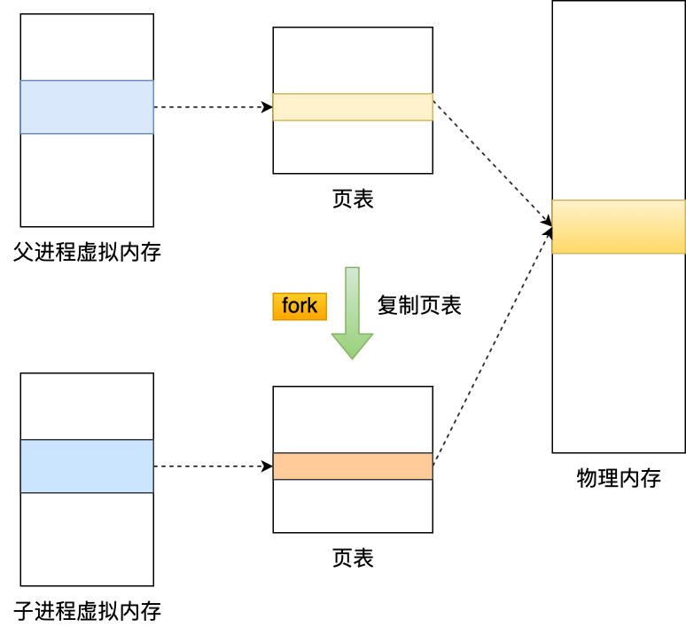
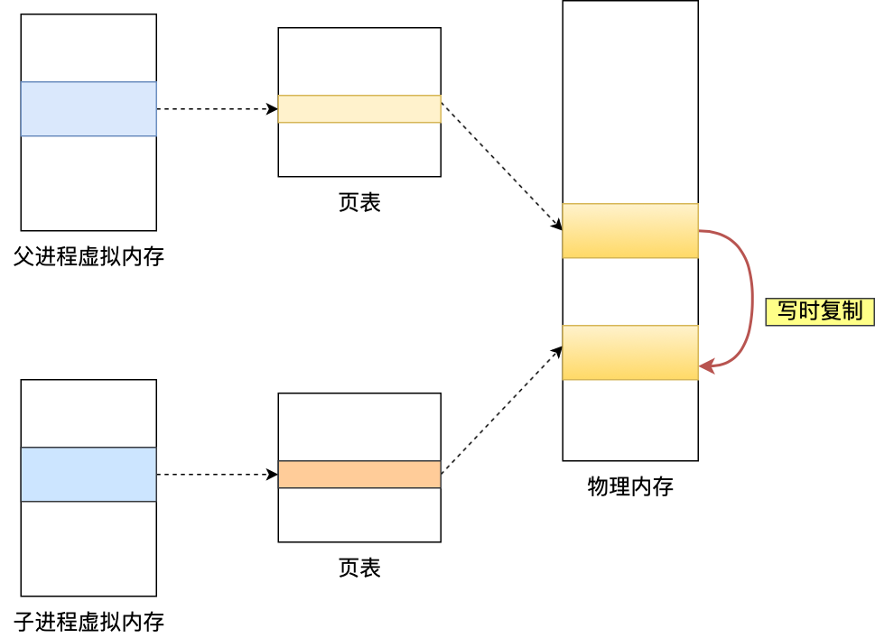

# RDB快照是怎么实现的？

# RDB 快照是怎么实现的？
<font style="color:rgb(44, 62, 80);">虽说 Redis 是内存数据库，但是它为数据的持久化提供了两个技术。</font>

<font style="color:rgb(44, 62, 80);">分别是「 AOF 日志和 RDB 快照」。</font>

<font style="color:rgb(44, 62, 80);">这两种技术都会用各用一个日志文件来记录信息，但是记录的内容是不同的。</font>

+ <font style="color:rgb(44, 62, 80);">AOF 文件的内容是操作命令；</font>
+ <font style="color:rgb(44, 62, 80);">RDB 文件的内容是二进制数据。</font>

<font style="color:rgb(44, 62, 80);">关于 AOF 持久化的原理我在上一篇已经介绍了，今天主要讲下</font><font style="color:rgb(44, 62, 80);"> </font>**<font style="color:rgb(48, 79, 254);">RDB 快照</font>**<font style="color:rgb(44, 62, 80);">。</font>

<font style="color:rgb(44, 62, 80);">所谓的快照，就是记录某一个瞬间东西，比如当我们给风景拍照时，那一个瞬间的画面和信息就记录到了一张照片。</font>

<font style="color:rgb(44, 62, 80);">所以，RDB 快照就是记录某一个瞬间的内存数据，记录的是实际数据，而 AOF 文件记录的是命令操作的日志，而不是实际的数据。</font>

<font style="color:rgb(44, 62, 80);">因此在 Redis 恢复数据时， RDB 恢复数据的效率会比 AOF 高些，因为直接将 RDB 文件读入内存就可以，不需要像 AOF 那样还需要额外执行操作命令的步骤才能恢复数据。</font>

<font style="color:rgb(44, 62, 80);">接下来，就来具体聊聊 RDB 快照 。</font>

## [](https://xiaolincoding.com/redis/storage/rdb.html#%E5%BF%AB%E7%85%A7%E6%80%8E%E4%B9%88%E7%94%A8)<font style="color:rgb(44, 62, 80);">快照怎么用？</font>
<font style="color:rgb(44, 62, 80);">要熟悉一个东西，先看看怎么用是比较好的方式。</font>

<font style="color:rgb(44, 62, 80);">Redis 提供了两个命令来生成 RDB 文件，分别是</font><font style="color:rgb(44, 62, 80);"> </font><font style="color:rgb(71, 101, 130);">save</font><font style="color:rgb(44, 62, 80);"> </font><font style="color:rgb(44, 62, 80);">和</font><font style="color:rgb(44, 62, 80);"> </font><font style="color:rgb(71, 101, 130);">bgsave</font><font style="color:rgb(44, 62, 80);">，他们的区别就在于是否在「主线程」里执行：</font>

+ <font style="color:rgb(44, 62, 80);">执行了 save 命令，就会在主线程生成 RDB 文件，由于和执行操作命令在同一个线程，所以如果写入 RDB 文件的时间太长，</font>**<font style="color:rgb(48, 79, 254);">会阻塞主线程</font>**<font style="color:rgb(44, 62, 80);">；</font>
+ <font style="color:rgb(44, 62, 80);">执行了 bgsave 命令，会创建一个子进程来生成 RDB 文件，这样可以</font>**<font style="color:rgb(48, 79, 254);">避免主线程的阻塞</font>**<font style="color:rgb(44, 62, 80);">；</font>

<font style="color:rgb(44, 62, 80);">RDB 文件的加载工作是在服务器启动时自动执行的，Redis 并没有提供专门用于加载 RDB 文件的命令。</font>

<font style="color:rgb(44, 62, 80);">Redis 还可以通过配置文件的选项来实现每隔一段时间自动执行一次 bgsave 命令，默认会提供以下配置：</font>


```plain
save 900 1
save 300 10
save 60 10000
```

<font style="color:rgb(44, 62, 80);">别看选项名叫 save，实际上执行的是 bgsave 命令，也就是会创建子进程来生成 RDB 快照文件。</font>

<font style="color:rgb(44, 62, 80);">只要满足上面条件的任意一个，就会执行 bgsave，它们的意思分别是：</font>

+ <font style="color:rgb(44, 62, 80);">900 秒之内，对数据库进行了至少 1 次修改；</font>
+ <font style="color:rgb(44, 62, 80);">300 秒之内，对数据库进行了至少 10 次修改；</font>
+ <font style="color:rgb(44, 62, 80);">60 秒之内，对数据库进行了至少 10000 次修改。</font>

<font style="color:rgb(44, 62, 80);">这里提一点，Redis 的快照是</font>**<font style="color:rgb(48, 79, 254);">全量快照</font>**<font style="color:rgb(44, 62, 80);">，也就是说每次执行快照，都是把内存中的「所有数据」都记录到磁盘中。</font>

<font style="color:rgb(44, 62, 80);">所以可以认为，执行快照是一个比较重的操作，如果频率太频繁，可能会对 Redis 性能产生影响。如果频率太低，服务器故障时，丢失的数据会更多。</font>

<font style="color:rgb(44, 62, 80);">通常可能设置至少 5 分钟才保存一次快照，这时如果 Redis 出现宕机等情况，则意味着最多可能丢失 5 分钟数据。</font>

<font style="color:rgb(44, 62, 80);">这就是 RDB 快照的缺点，在服务器发生故障时，丢失的数据会比 AOF 持久化的方式更多，因为 RDB 快照是全量快照的方式，因此执行的频率不能太频繁，否则会影响 Redis 性能，而 AOF 日志可以以秒级的方式记录操作命令，所以丢失的数据就相对更少。</font>

## [](https://xiaolincoding.com/redis/storage/rdb.html#%E6%89%A7%E8%A1%8C%E5%BF%AB%E7%85%A7%E6%97%B6-%E6%95%B0%E6%8D%AE%E8%83%BD%E8%A2%AB%E4%BF%AE%E6%94%B9%E5%90%97)<font style="color:rgb(44, 62, 80);">执行快照时，数据能被修改吗？</font>
<font style="color:rgb(44, 62, 80);">那问题来了，执行 bgsave 过程中，由于是交给子进程来构建 RDB 文件，主线程还是可以继续工作的，此时主线程可以修改数据吗？</font>

<font style="color:rgb(44, 62, 80);">如果不可以修改数据的话，那这样性能一下就降低了很多。如果可以修改数据，又是如何做到到呢？</font>

<font style="color:rgb(44, 62, 80);">直接说结论吧，执行 bgsave 过程中，Redis 依然</font>**<font style="color:rgb(48, 79, 254);">可以继续处理操作命令</font>**<font style="color:rgb(44, 62, 80);">的，也就是数据是能被修改的。</font>

<font style="color:rgb(44, 62, 80);">那具体如何做到到呢？关键的技术就在于</font>**<font style="color:rgb(48, 79, 254);">写时复制技术（Copy-On-Write, COW）。</font>**

<font style="color:rgb(44, 62, 80);">执行 bgsave 命令的时候，会通过</font><font style="color:rgb(44, 62, 80);"> </font><font style="color:rgb(71, 101, 130);">fork()</font><font style="color:rgb(44, 62, 80);"> </font><font style="color:rgb(44, 62, 80);">创建子进程，此时子进程和父进程是共享同一片内存数据的，因为创建子进程的时候，会复制父进程的页表，但是页表指向的物理内存还是一个。</font>



<font style="color:rgb(44, 62, 80);">只有在发生修改内存数据的情况时，物理内存才会被复制一份。</font>



<font style="color:rgb(44, 62, 80);">这样的目的是为了减少创建子进程时的性能损耗，从而加快创建子进程的速度，毕竟创建子进程的过程中，是会阻塞主线程的。</font>

<font style="color:rgb(44, 62, 80);">所以，创建 bgsave 子进程后，由于共享父进程的所有内存数据，于是就可以直接读取主线程（父进程）里的内存数据，并将数据写入到 RDB 文件。</font>

<font style="color:rgb(44, 62, 80);">当主线程（父进程）对这些共享的内存数据也都是只读操作，那么，主线程（父进程）和 bgsave 子进程相互不影响。</font>

<font style="color:rgb(44, 62, 80);">但是，如果主线程（父进程）要</font>**<font style="color:rgb(48, 79, 254);">修改共享数据里的某一块数据</font>**<font style="color:rgb(44, 62, 80);">（比如键值对</font><font style="color:rgb(44, 62, 80);"> </font><font style="color:rgb(71, 101, 130);">A</font><font style="color:rgb(44, 62, 80);">）时，就会发生写时复制，于是这块数据的</font>**<font style="color:rgb(48, 79, 254);">物理内存就会被复制一份（键值对</font>****<font style="color:rgb(48, 79, 254);"> </font>****<font style="color:rgb(71, 101, 130);">A'</font>************<font style="color:rgb(48, 79, 254);">）</font>**<font style="color:rgb(44, 62, 80);">，然后</font>**<font style="color:rgb(48, 79, 254);">主线程在这个数据副本（键值对</font>****<font style="color:rgb(48, 79, 254);"> </font>****<font style="color:rgb(71, 101, 130);">A'</font>************<font style="color:rgb(48, 79, 254);">）进行修改操作</font>**<font style="color:rgb(44, 62, 80);">。与此同时，</font>**<font style="color:rgb(48, 79, 254);">bgsave 子进程可以继续把原来的数据（键值对</font>****<font style="color:rgb(48, 79, 254);"> </font>****<font style="color:rgb(71, 101, 130);">A</font>************<font style="color:rgb(48, 79, 254);">）写入到 RDB 文件</font>**<font style="color:rgb(44, 62, 80);">。</font>

<font style="color:rgb(44, 62, 80);">就是这样，Redis 使用 bgsave 对当前内存中的所有数据做快照，这个操作是由 bgsave 子进程在后台完成的，执行时不会阻塞主线程，这就使得主线程同时可以修改数据。</font>

<font style="color:rgb(44, 62, 80);">细心的同学，肯定发现了，bgsave 快照过程中，如果主线程修改了共享数据，</font>**<font style="color:rgb(48, 79, 254);">发生了写时复制后，RDB 快照保存的是原本的内存数据</font>**<font style="color:rgb(44, 62, 80);">，而主线程刚修改的数据，是没办法在这一时间写入 RDB 文件的，只能交由下一次的 bgsave 快照。</font>

<font style="color:rgb(44, 62, 80);">所以 Redis 在使用 bgsave 快照过程中，如果主线程修改了内存数据，不管是否是共享的内存数据，RDB 快照都无法写入主线程刚修改的数据，因为此时主线程（父进程）的内存数据和子进程的内存数据已经分离了，子进程写入到 RDB 文件的内存数据只能是原本的内存数据。</font>

<font style="color:rgb(44, 62, 80);">如果系统恰好在 RDB 快照文件创建完毕后崩溃了，那么 Redis 将会丢失主线程在快照期间修改的数据。</font>

<font style="color:rgb(44, 62, 80);">另外，写时复制的时候会出现这么个极端的情况。</font>

<font style="color:rgb(44, 62, 80);">在 Redis 执行 RDB 持久化期间，刚 fork 时，主进程和子进程共享同一物理内存，但是途中主进程处理了写操作，修改了共享内存，于是当前被修改的数据的物理内存就会被复制一份。</font>

<font style="color:rgb(44, 62, 80);">那么极端情况下，</font>**<font style="color:rgb(48, 79, 254);">如果所有的共享内存都被修改，则此时的内存占用是原先的 2 倍。</font>**

<font style="color:rgb(44, 62, 80);">所以，针对写操作多的场景，我们要留意下快照过程中内存的变化，防止内存被占满了。</font>

## [](https://xiaolincoding.com/redis/storage/rdb.html#rdb-%E5%92%8C-aof-%E5%90%88%E4%BD%93)<font style="color:rgb(44, 62, 80);">RDB 和 AOF 合体</font>
<font style="color:rgb(44, 62, 80);">尽管 RDB 比 AOF 的数据恢复速度快，但是快照的频率不好把握：</font>

+ <font style="color:rgb(44, 62, 80);">如果频率太低，两次快照间一旦服务器发生宕机，就可能会比较多的数据丢失；</font>
+ <font style="color:rgb(44, 62, 80);">如果频率太高，频繁写入磁盘和创建子进程会带来额外的性能开销。</font>

<font style="color:rgb(44, 62, 80);">那有没有什么方法不仅有 RDB 恢复速度快的优点和，又有 AOF 丢失数据少的优点呢？</font>

<font style="color:rgb(44, 62, 80);">当然有，那就是将 RDB 和 AOF 合体使用，这个方法是在 Redis 4.0 提出的，该方法叫</font>**<font style="color:rgb(48, 79, 254);">混合使用 AOF 日志和内存快照</font>**<font style="color:rgb(44, 62, 80);">，也叫混合持久化。</font>

<font style="color:rgb(44, 62, 80);">如果想要开启混合持久化功能，可以在 Redis 配置文件将下面这个配置项设置成 yes：</font>


```plain
aof-use-rdb-preamble yes
```

<font style="color:rgb(44, 62, 80);">混合持久化工作在</font><font style="color:rgb(44, 62, 80);"> </font>**<font style="color:rgb(48, 79, 254);">AOF 日志重写过程</font>**<font style="color:rgb(44, 62, 80);">。</font>

<font style="color:rgb(44, 62, 80);">当开启了混合持久化时，在 AOF 重写日志时，</font><font style="color:rgb(71, 101, 130);">fork</font><font style="color:rgb(44, 62, 80);"> </font><font style="color:rgb(44, 62, 80);">出来的重写子进程会先将与主线程共享的内存数据以 RDB 方式写入到 AOF 文件，然后主线程处理的操作命令会被记录在重写缓冲区里，重写缓冲区里的增量命令会以 AOF 方式写入到 AOF 文件，写入完成后通知主进程将新的含有 RDB 格式和 AOF 格式的 AOF 文件替换旧的的 AOF 文件。</font>

<font style="color:rgb(44, 62, 80);">也就是说，使用了混合持久化，AOF 文件的</font>**<font style="color:rgb(48, 79, 254);">前半部分是 RDB 格式的全量数据，后半部分是 AOF 格式的增量数据</font>**<font style="color:rgb(44, 62, 80);">。</font>


<font style="color:rgb(44, 62, 80);">这样的好处在于，重启 Redis 加载数据的时候，由于前半部分是 RDB 内容，这样</font>**<font style="color:rgb(48, 79, 254);">加载的时候速度会很快</font>**<font style="color:rgb(44, 62, 80);">。</font>

<font style="color:rgb(44, 62, 80);">加载完 RDB 的内容后，才会加载后半部分的 AOF 内容，这里的内容是 Redis 后台子进程重写 AOF 期间，主线程处理的操作命令，可以使得</font>**<font style="color:rgb(48, 79, 254);">数据更少的丢失</font>**<font style="color:rgb(44, 62, 80);">。</font>


> 更新: 2024-04-09 23:33:29  
原文: [https://www.yuque.com/vip6688/neho4x/ts2xhv3pbnuxhvnz](https://www.yuque.com/vip6688/neho4x/ts2xhv3pbnuxhvnz)
>


> 更新: 2024-11-25 16:07:09  
> 原文: <https://www.yuque.com/neumx/laxg2e/3a9edc6a407726d11fdc0493da183442>