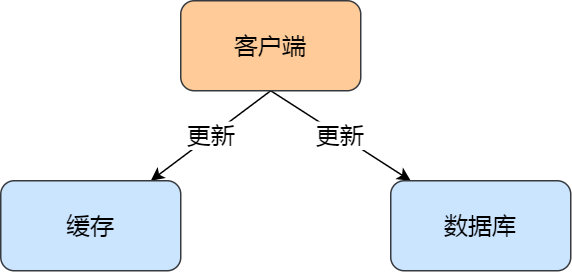
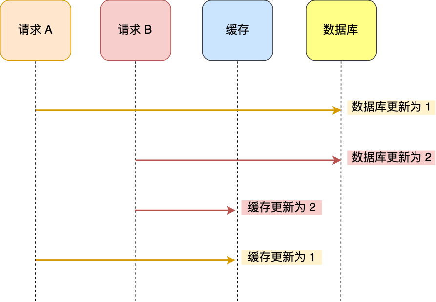
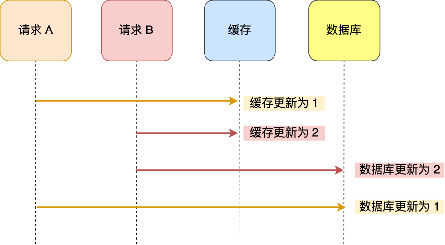
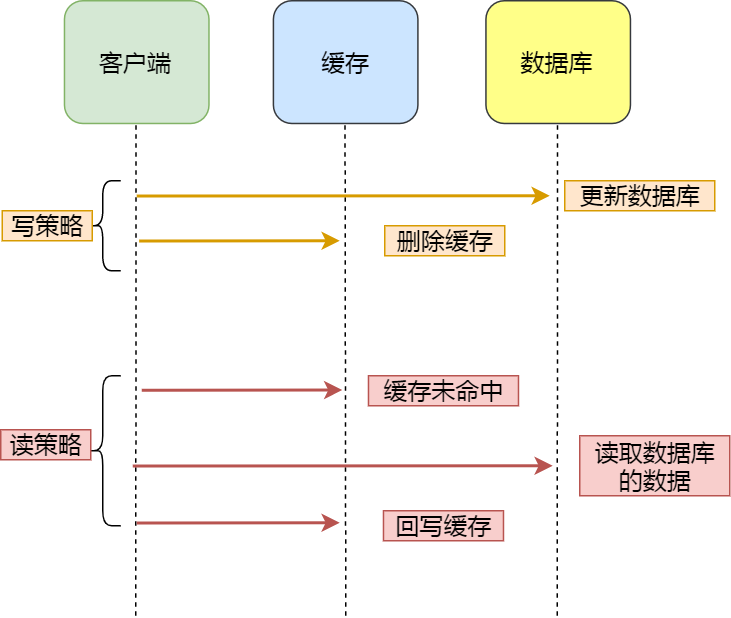
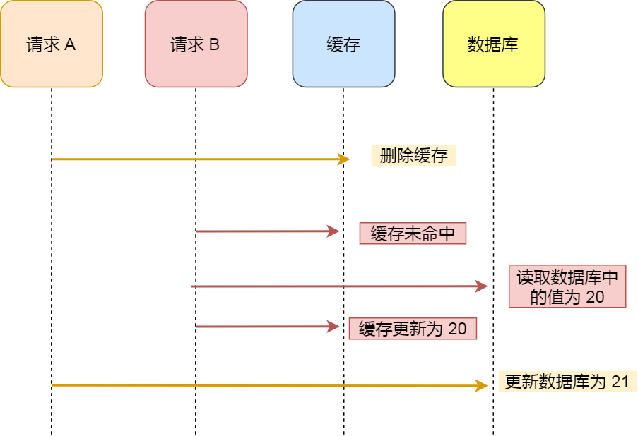
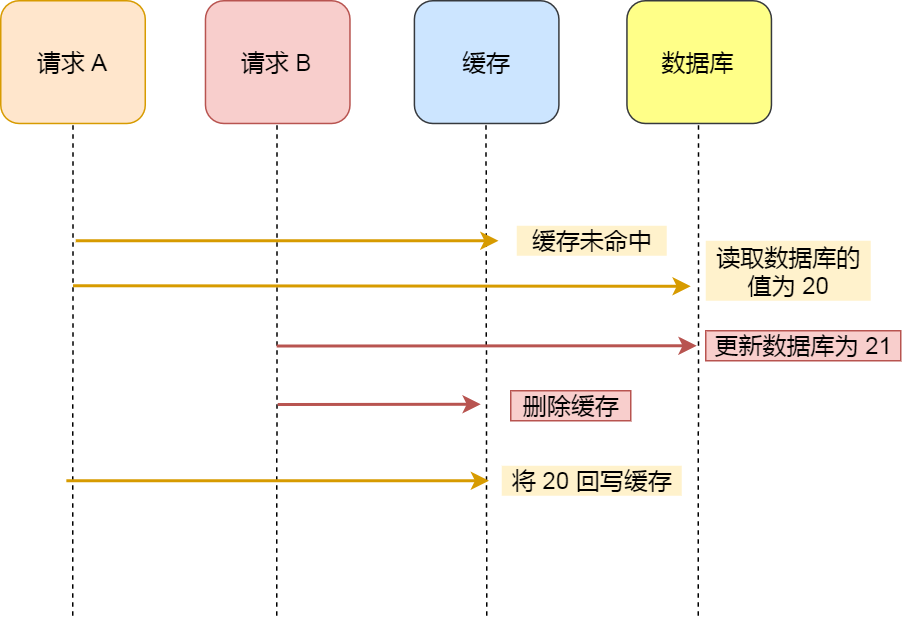
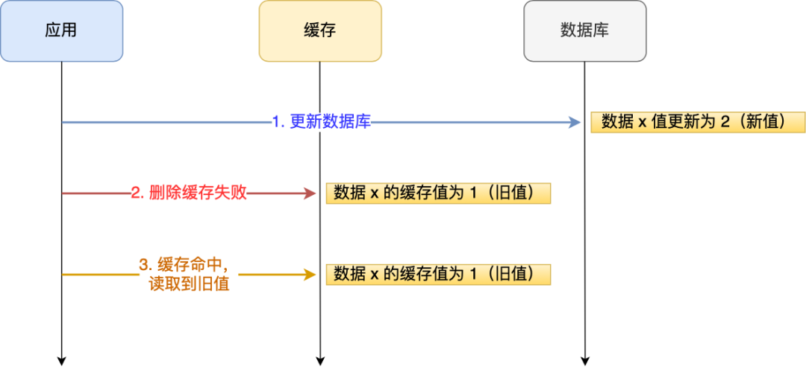
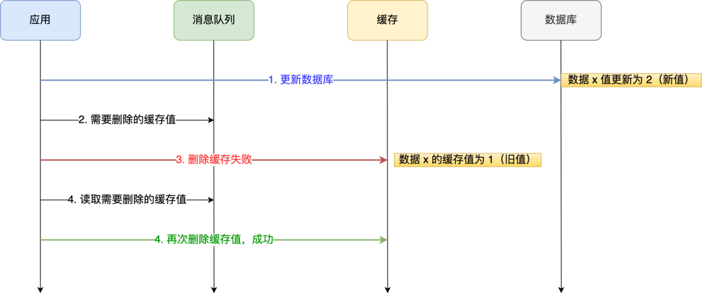
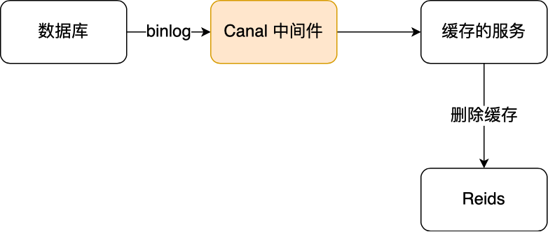

# 数据库和缓存如何保证一致性？

# 数据库和缓存如何保证一致性？
<font style="color:rgb(44, 62, 80);">一天，老板说「最近公司的用户越来越多了，但是服务器的访问速度越来越差的，阿旺帮我优化下，</font>**<font style="color:rgb(48, 79, 254);">做好了给你画个饼！</font>**<font style="color:rgb(44, 62, 80);">」。</font>


<font style="color:rgb(44, 62, 80);">程序员阿旺听到老板口中的「画饼」后就非常期待，没有任何犹豫就接下了老板给的这个任务。</font>

<font style="color:rgb(44, 62, 80);">阿旺登陆到了服务器，经过一番排查后，确认服务器的</font>**<font style="color:rgb(48, 79, 254);">性能瓶颈是在数据库</font>**<font style="color:rgb(44, 62, 80);">。</font>

<font style="color:rgb(44, 62, 80);">这好办，给服务器加上 Redis，让其作为数据库的缓存。</font>

<font style="color:rgb(44, 62, 80);">这样，在客户端请求数据时，如果能在缓存中命中数据，那就查询缓存，不用在去查询数据库，从而减轻数据库的压力，提高服务器的性能。</font>

### [](https://xiaolincoding.com/redis/architecture/mysql_redis_consistency.html#%E5%85%88%E6%9B%B4%E6%96%B0%E6%95%B0%E6%8D%AE%E5%BA%93-%E8%BF%98%E6%98%AF%E5%85%88%E6%9B%B4%E6%96%B0%E7%BC%93%E5%AD%98)<font style="color:rgb(44, 62, 80);">先更新数据库，还是先更新缓存？</font>
<font style="color:rgb(44, 62, 80);">阿旺有了这个想法后，就准备开始着手优化服务器，但是挡在在他前面的是这样的一个问题。</font>



**<font style="color:rgb(48, 79, 254);">由于引入了缓存，那么在数据更新时，不仅要更新数据库，而且要更新缓存，这两个更新操作存在前后的问题</font>**<font style="color:rgb(44, 62, 80);">：</font>

+ <font style="color:rgb(44, 62, 80);">先更新数据库，再更新缓存；</font>
+ <font style="color:rgb(44, 62, 80);">先更新缓存，再更新数据库；</font>

<font style="color:rgb(44, 62, 80);">阿旺没想到太多，他觉得最新的数据肯定要先更新数据库，这样才可以确保数据库里的数据是最新的，于是他就采用了「</font>**<font style="color:rgb(48, 79, 254);">先更新数据库，再更新缓存</font>**<font style="color:rgb(44, 62, 80);">」的方案。</font>

<font style="color:rgb(44, 62, 80);">阿旺经过几个夜晚的折腾，终于「优化好了服务器」，然后就直接上线了，自信心满满跑去跟老板汇报。</font>

<font style="color:rgb(44, 62, 80);">老板不懂技术，自然也没多虑，就让后续阿旺观察下服务器的情况，如果效果不错，就跟阿旺谈画饼的事情。</font>

<font style="color:rgb(44, 62, 80);">阿旺观察了好几天，发现数据库的压力大大减少了，访问速度也提高了不少，心想这事肯定成的了。</font>

<font style="color:rgb(44, 62, 80);">好景不长，突然老板收到一个客户的投诉，客户说他刚发起了</font>**<font style="color:rgb(48, 79, 254);">两次更新年龄的操作</font>**<font style="color:rgb(44, 62, 80);">，但是显示的年龄确还是第一次更新时的年龄，而第二次更新年龄并没有生效。</font>

<font style="color:rgb(44, 62, 80);">老板立马就找了阿旺，训斥着阿旺说：「</font>_<font style="color:rgb(200, 73, 255);">这么简单的更新操作，都有 bug？我脸往哪儿放？你的饼还要不要了？</font>_<font style="color:rgb(44, 62, 80);">」</font>

<font style="color:rgb(44, 62, 80);">听到自己准备到手的饼要没了的阿旺瞬间就慌了，立马登陆服务器排查问题，阿旺查询缓存和数据库的数据后发现了问题。</font>

<font style="color:rgb(44, 62, 80);">数据库的数据是客户第二次更新操作的数据，而缓存确还是第一次更新操作的数据，也就是</font>**<font style="color:rgb(48, 79, 254);">出现了数据库和缓存的数据不一致的问题</font>**<font style="color:rgb(44, 62, 80);">。</font>

<font style="color:rgb(44, 62, 80);">这个问题可大了，阿旺经过一轮的分析，造成缓存和数据库的数据不一致的现象，是因为</font>**<font style="color:rgb(48, 79, 254);">并发问题</font>**<font style="color:rgb(44, 62, 80);">！</font>

#### [](https://xiaolincoding.com/redis/architecture/mysql_redis_consistency.html#%E5%85%88%E6%9B%B4%E6%96%B0%E6%95%B0%E6%8D%AE%E5%BA%93-%E5%86%8D%E6%9B%B4%E6%96%B0%E7%BC%93%E5%AD%98)<font style="color:rgb(44, 62, 80);">先更新数据库，再更新缓存</font>
<font style="color:rgb(44, 62, 80);">举个例子，比如「请求 A 」和「请求 B 」两个请求，同时更新「同一条」数据，则可能出现这样的顺序：</font>



<font style="color:rgb(44, 62, 80);">A 请求先将数据库的数据更新为 1，然后在更新缓存前，请求 B 将数据库的数据更新为 2，紧接着也把缓存更新为 2，然后 A 请求更新缓存为 1。</font>

<font style="color:rgb(44, 62, 80);">此时，数据库中的数据是 2，而缓存中的数据却是 1，</font>**<font style="color:rgb(48, 79, 254);">出现了缓存和数据库中的数据不一致的现象</font>**<font style="color:rgb(44, 62, 80);">。</font>

#### [](https://xiaolincoding.com/redis/architecture/mysql_redis_consistency.html#%E5%85%88%E6%9B%B4%E6%96%B0%E7%BC%93%E5%AD%98-%E5%86%8D%E6%9B%B4%E6%96%B0%E6%95%B0%E6%8D%AE%E5%BA%93)<font style="color:rgb(44, 62, 80);">先更新缓存，再更新数据库</font>
<font style="color:rgb(44, 62, 80);">那换成「</font>**<font style="color:rgb(48, 79, 254);">先更新缓存，再更新数据库</font>**<font style="color:rgb(44, 62, 80);">」这个方案，还会有问题吗？</font>

<font style="color:rgb(44, 62, 80);">依然还是存在并发的问题，分析思路也是一样。</font>

<font style="color:rgb(44, 62, 80);">假设「请求 A 」和「请求 B 」两个请求，同时更新「同一条」数据，则可能出现这样的顺序：</font>



<font style="color:rgb(44, 62, 80);">A 请求先将缓存的数据更新为 1，然后在更新数据库前，B 请求来了， 将缓存的数据更新为 2，紧接着把数据库更新为 2，然后 A 请求将数据库的数据更新为 1。</font>

<font style="color:rgb(44, 62, 80);">此时，数据库中的数据是 1，而缓存中的数据却是 2，</font>**<font style="color:rgb(48, 79, 254);">出现了缓存和数据库中的数据不一致的现象</font>**<font style="color:rgb(44, 62, 80);">。</font>

<font style="color:rgb(44, 62, 80);">所以，</font>**<font style="color:rgb(48, 79, 254);">无论是「先更新数据库，再更新缓存」，还是「先更新缓存，再更新数据库」，这两个方案都存在并发问题，当两个请求并发更新同一条数据的时候，可能会出现缓存和数据库中的数据不一致的现象</font>**<font style="color:rgb(44, 62, 80);">。</font>

### [](https://xiaolincoding.com/redis/architecture/mysql_redis_consistency.html#%E5%85%88%E6%9B%B4%E6%96%B0%E6%95%B0%E6%8D%AE%E5%BA%93-%E8%BF%98%E6%98%AF%E5%85%88%E5%88%A0%E9%99%A4%E7%BC%93%E5%AD%98)<font style="color:rgb(44, 62, 80);">先更新数据库，还是先删除缓存？</font>
<font style="color:rgb(44, 62, 80);">阿旺定位出问题后，思考了一番后，决定在更新数据时，</font>**<font style="color:rgb(48, 79, 254);">不更新缓存，而是删除缓存中的数据。然后，到读取数据时，发现缓存中没了数据之后，再从数据库中读取数据，更新到缓存中。</font>**

<font style="color:rgb(44, 62, 80);">阿旺想的这个策略是有名字的，是叫</font><font style="color:rgb(44, 62, 80);"> </font>**<font style="color:rgb(48, 79, 254);">Cache Aside 策略</font>**<font style="color:rgb(44, 62, 80);">，中文是叫旁路缓存策略。</font>

<font style="color:rgb(44, 62, 80);">该策略又可以细分为「读策略」和「写策略」。</font>



**<font style="color:rgb(48, 79, 254);">写策略的步骤：</font>**

+ <font style="color:rgb(44, 62, 80);">更新数据库中的数据；</font>
+ <font style="color:rgb(44, 62, 80);">删除缓存中的数据。</font>

**<font style="color:rgb(48, 79, 254);">读策略的步骤：</font>**

+ <font style="color:rgb(44, 62, 80);">如果读取的数据命中了缓存，则直接返回数据；</font>
+ <font style="color:rgb(44, 62, 80);">如果读取的数据没有命中缓存，则从数据库中读取数据，然后将数据写入到缓存，并且返回给用户。</font>

<font style="color:rgb(44, 62, 80);">阿旺在想到「写策略」的时候，又陷入更深层次的思考，到底该选择哪种顺序呢？</font>

+ <font style="color:rgb(44, 62, 80);">先删除缓存，再更新数据库；</font>
+ <font style="color:rgb(44, 62, 80);">先更新数据库，再删除缓存。</font>

<font style="color:rgb(44, 62, 80);">阿旺这次经过上次教训，不再「想当然」的乱选方案，因为老板这次给的饼很大啊，必须把握住。</font>

<font style="color:rgb(44, 62, 80);">于是阿旺用并发的角度来分析，看看这两种方案哪个可以保证数据库与缓存的数据一致性。</font>

#### [](https://xiaolincoding.com/redis/architecture/mysql_redis_consistency.html#%E5%85%88%E5%88%A0%E9%99%A4%E7%BC%93%E5%AD%98-%E5%86%8D%E6%9B%B4%E6%96%B0%E6%95%B0%E6%8D%AE%E5%BA%93)<font style="color:rgb(44, 62, 80);">先删除缓存，再更新数据库</font>
<font style="color:rgb(44, 62, 80);">阿旺还是以用户表的场景来分析。</font>

<font style="color:rgb(44, 62, 80);">假设某个用户的年龄是 20，请求 A 要更新用户年龄为 21，所以它会删除缓存中的内容。这时，另一个请求 B 要读取这个用户的年龄，它查询缓存发现未命中后，会从数据库中读取到年龄为 20，并且写入到缓存中，然后请求 A 继续更改数据库，将用户的年龄更新为 21。</font>



<font style="color:rgb(44, 62, 80);">最终，该用户年龄在缓存中是 20（旧值），在数据库中是 21（新值），缓存和数据库的数据不一致。</font>

<font style="color:rgb(44, 62, 80);">可以看到，</font>**<font style="color:rgb(48, 79, 254);">先删除缓存，再更新数据库，在「读 + 写」并发的时候，还是会出现缓存和数据库的数据不一致的问题</font>**<font style="color:rgb(44, 62, 80);">。</font>

#### [](https://xiaolincoding.com/redis/architecture/mysql_redis_consistency.html#%E5%85%88%E6%9B%B4%E6%96%B0%E6%95%B0%E6%8D%AE%E5%BA%93-%E5%86%8D%E5%88%A0%E9%99%A4%E7%BC%93%E5%AD%98)<font style="color:rgb(44, 62, 80);">先更新数据库，再删除缓存</font>
<font style="color:rgb(44, 62, 80);">继续用「读 + 写」请求的并发的场景来分析。</font>

<font style="color:rgb(44, 62, 80);">假如某个用户数据在缓存中不存在，请求 A 读取数据时从数据库中查询到年龄为 20，在未写入缓存中时另一个请求 B 更新数据。它更新数据库中的年龄为 21，并且清空缓存。这时请求 A 把从数据库中读到的年龄为 20 的数据写入到缓存中。</font>



<font style="color:rgb(44, 62, 80);">最终，该用户年龄在缓存中是 20（旧值），在数据库中是 21（新值），缓存和数据库数据不一致。</font>

<font style="color:rgb(44, 62, 80);">从上面的理论上分析，先更新数据库，再删除缓存也是会出现数据不一致性的问题，</font>**<font style="color:rgb(48, 79, 254);">但是在实际中，这个问题出现的概率并不高</font>**<font style="color:rgb(44, 62, 80);">。</font>

**<font style="color:rgb(48, 79, 254);">因为缓存的写入通常要远远快于数据库的写入</font>**<font style="color:rgb(44, 62, 80);">，所以在实际中很难出现请求 B 已经更新了数据库并且删除了缓存，请求 A 才更新完缓存的情况。</font>

<font style="color:rgb(44, 62, 80);">而一旦请求 A 早于请求 B 删除缓存之前更新了缓存，那么接下来的请求就会因为缓存不命中而从数据库中重新读取数据，所以不会出现这种不一致的情况。</font>

<font style="color:rgb(44, 62, 80);">所以，</font>**<font style="color:rgb(48, 79, 254);">「先更新数据库 + 再删除缓存」的方案，是可以保证数据一致性的</font>**<font style="color:rgb(44, 62, 80);">。</font>

<font style="color:rgb(44, 62, 80);">而且阿旺为了确保万无一失，还给缓存数据加上了「</font>**<font style="color:rgb(48, 79, 254);">过期时间</font>**<font style="color:rgb(44, 62, 80);">」，就算在这期间存在缓存数据不一致，有过期时间来兜底，这样也能达到最终一致。</font>

<font style="color:rgb(44, 62, 80);">阿旺思考到这一步后，觉得自己真的是个小天才，因为他竟然想到了个「天衣无缝」的方案，他二话不说就采用了这个方案，又经过几天的折腾，终于完成了。</font>

<font style="color:rgb(44, 62, 80);">他自信满满的向老板汇报，已经解决了上次客户的投诉的问题了。老板觉得阿旺这小伙子不错，这么快就解决问题了，然后让阿旺在观察几天。</font>

<font style="color:rgb(44, 62, 80);">事情哪有这么顺利呢？结果又没过多久，老板又收到客户的投诉了，</font>**<font style="color:rgb(48, 79, 254);">说自己明明更新了数据，但是数据要过一段时间才生效</font>**<font style="color:rgb(44, 62, 80);">，客户接受不了。</font>

<font style="color:rgb(44, 62, 80);">老板面无表情的找上阿旺，让阿旺尽快查出问题。</font>

<font style="color:rgb(44, 62, 80);">阿旺得知又有 Bug 就更慌了，立马就登录服务器去排查问题，查看日志后得知了原因。</font>

<font style="color:rgb(44, 62, 80);">「先更新数据库， 再删除缓存」其实是两个操作，前面的所有分析都是建立在这两个操作都能同时执行成功，而这次客户投诉的问题就在于，</font>**<font style="color:rgb(48, 79, 254);">在删除缓存（第二个操作）的时候失败了，导致缓存中的数据是旧值</font>**<font style="color:rgb(44, 62, 80);">。</font>

<font style="color:rgb(44, 62, 80);">好在之前给缓存加上了过期时间，所以才会出现客户说的过一段时间才更新生效的现象，假设如果没有这个过期时间的兜底，那后续的请求读到的就会一直是缓存中的旧数据，这样问题就更大了。</font>

<font style="color:rgb(44, 62, 80);">所以新的问题来了，</font>**<font style="color:rgb(48, 79, 254);">如何保证「先更新数据库 ，再删除缓存」这两个操作能执行成功？</font>**

<font style="color:rgb(44, 62, 80);">阿旺分析出问题后，慌慌张张的向老板汇报了问题。</font>

<font style="color:rgb(44, 62, 80);">老板知道事情后，又给了阿旺几天来解决这个问题，画饼的事情这次没有再提了。</font>

**<font style="color:rgb(48, 79, 254);">阿旺会用什么方式来解决这个问题呢？</font>**

**<font style="color:rgb(48, 79, 254);">老板画的饼事情，能否兑现给阿旺呢？</font>**

<font style="color:rgb(44, 62, 80);">预知后事，且听下回阿旺的故事。</font>


### [](https://xiaolincoding.com/redis/architecture/mysql_redis_consistency.html#%E5%B0%8F%E7%BB%93)<font style="color:rgb(44, 62, 80);">小结</font>
<font style="color:rgb(44, 62, 80);">阿旺的事情就聊到这，我们继续说点其他。</font>

<font style="color:rgb(44, 62, 80);">「先更新数据库，再删除缓存」的方案虽然保证了数据库与缓存的数据一致性，但是每次更新数据的时候，缓存的数据都会被删除，这样会对缓存的命中率带来影响。</font>

<font style="color:rgb(44, 62, 80);">所以，</font>**<font style="color:rgb(48, 79, 254);">如果我们的业务对缓存命中率有很高的要求，我们可以采用「更新数据库 + 更新缓存」的方案，因为更新缓存并不会出现缓存未命中的情况</font>**<font style="color:rgb(44, 62, 80);">。</font>

<font style="color:rgb(44, 62, 80);">但是这个方案前面我们也分析过，在两个更新请求并发执行的时候，会出现数据不一致的问题，因为更新数据库和更新缓存这两个操作是独立的，而我们又没有对操作做任何并发控制，那么当两个线程并发更新它们的话，就会因为写入顺序的不同造成数据的不一致。</font>

<font style="color:rgb(44, 62, 80);">所以我们得增加一些手段来解决这个问题，这里提供两种做法：</font>

+ <font style="color:rgb(44, 62, 80);">在更新缓存前先加个</font>**<font style="color:rgb(48, 79, 254);">分布式锁</font>**<font style="color:rgb(44, 62, 80);">，保证同一时间只运行一个请求更新缓存，就会不会产生并发问题了，当然引入了锁后，对于写入的性能就会带来影响。</font>
+ <font style="color:rgb(44, 62, 80);">在更新完缓存时，给缓存加上较短的</font>**<font style="color:rgb(48, 79, 254);">过期时间</font>**<font style="color:rgb(44, 62, 80);">，这样即时出现缓存不一致的情况，缓存的数据也会很快过期，对业务还是能接受的。</font>

<font style="color:rgb(44, 62, 80);">对了，针对「先删除缓存，再更新数据库」方案在「读 + 写」并发请求而造成缓存不一致的解决办法是「</font>**<font style="color:rgb(48, 79, 254);">延迟双删</font>**<font style="color:rgb(44, 62, 80);">」。</font>

<font style="color:rgb(44, 62, 80);">延迟双删实现的伪代码如下：</font>


```plain
删除缓存
redis.delKey(X)
更新数据库
db.update(X)
睡眠
Thread.sleep(N)
再删除缓存
redis.delKey(X)
```

<font style="color:rgb(44, 62, 80);">加了个睡眠时间，主要是为了确保请求 A 在睡眠的时候，请求 B 能够在这这一段时间完成「从数据库读取数据，再把缺失的缓存写入缓存」的操作，然后请求 A 睡眠完，再删除缓存。</font>

<font style="color:rgb(44, 62, 80);">所以，请求 A 的睡眠时间就需要大于请求 B 「从数据库读取数据 + 写入缓存」的时间。</font>

<font style="color:rgb(44, 62, 80);">但是具体睡眠多久其实是个</font>**<font style="color:rgb(48, 79, 254);">玄学</font>**<font style="color:rgb(44, 62, 80);">，很难评估出来，所以这个方案也只是</font>**<font style="color:rgb(48, 79, 254);">尽可能</font>**<font style="color:rgb(44, 62, 80);">保证一致性而已，极端情况下，依然也会出现缓存不一致的现象。</font>

<font style="color:rgb(44, 62, 80);">因此，还是比较建议用「先更新数据库，再删除缓存」的方案。</font>

---

### [](https://xiaolincoding.com/redis/architecture/mysql_redis_consistency.html#%E5%89%8D%E6%83%85%E5%9B%9E%E9%A1%BE)<font style="color:rgb(44, 62, 80);">前情回顾</font>
<font style="color:rgb(44, 62, 80);">上回程序员阿旺为了提升数据访问的性能，引入 Redis 作为 MySQL 缓存层，但是这件事情并不是那么简单，因为还要考虑 Redis 和 MySQL 双写一致性的问题。</font>

<font style="color:rgb(44, 62, 80);">阿旺经过一番周折，最终选用了「</font>**<font style="color:rgb(48, 79, 254);">先更新数据库，再删缓存</font>**<font style="color:rgb(44, 62, 80);">」的策略，原因是这个策略即使在并发读写时，也能最大程度保证数据一致性。</font>

<font style="color:rgb(44, 62, 80);">聪明的阿旺还搞了个兜底的方案，就是给缓存加上了过期时间。</font>

<font style="color:rgb(44, 62, 80);">本以为就这样不会在出现数据一致性的问题，结果将功能上线后，老板还是收到用户的投诉「说自己明明更新了数据，但是数据要过一段时间才生效」，客户接受不了。</font>

<font style="color:rgb(44, 62, 80);">老板转告给了阿旺，阿旺得知又有 Bug 就更慌了，立马就登录服务器去排查问题，查看日志后得知了原因。</font>

<font style="color:rgb(44, 62, 80);">「先更新数据库， 再删除缓存」其实是两个操作，这次客户投诉的问题就在于，</font>**<font style="color:rgb(48, 79, 254);">在删除缓存（第二个操作）的时候失败了，导致缓存中的数据是旧值，而数据库是最新值</font>**<font style="color:rgb(44, 62, 80);">。</font>

<font style="color:rgb(44, 62, 80);">好在之前给缓存加上了过期时间，所以才会出现客户说的过一段时间才更新生效的现象，假设如果没有这个过期时间的兜底，那后续的请求读到的就会一直是缓存中的旧数据，这样问题就更大了。</font>

<font style="color:rgb(44, 62, 80);">所以新的问题来了，</font>**<font style="color:rgb(48, 79, 254);">如何保证「先更新数据库 ，再删除缓存」这两个操作能执行成功？</font>**

<font style="color:rgb(44, 62, 80);">阿旺分析出问题后，慌慌张张的向老板汇报了问题。</font>

<font style="color:rgb(44, 62, 80);">老板知道事情后，又给了阿旺几天来解决这个问题，画饼的事情这次没有再提了。</font>

+ <font style="color:rgb(44, 62, 80);">阿旺会用什么方式来解决这个问题呢？</font>
+ <font style="color:rgb(44, 62, 80);">老板画的饼事情，能否兑现给阿旺呢？</font>

### [](https://xiaolincoding.com/redis/architecture/mysql_redis_consistency.html#%E5%A6%82%E4%BD%95%E4%BF%9D%E8%AF%81%E4%B8%A4%E4%B8%AA%E6%93%8D%E4%BD%9C%E9%83%BD%E8%83%BD%E6%89%A7%E8%A1%8C%E6%88%90%E5%8A%9F)<font style="color:rgb(44, 62, 80);">如何保证两个操作都能执行成功？</font>
<font style="color:rgb(44, 62, 80);">这次用户的投诉是因为在删除缓存（第二个操作）的时候失败了，导致缓存还是旧值，而数据库是最新值，造成数据库和缓存数据不一致的问题，会对敏感业务造成影响。</font>

<font style="color:rgb(44, 62, 80);">举个例子，来说明下。</font>

<font style="color:rgb(44, 62, 80);">应用要把数据 X 的值从 1 更新为 2，先成功更新了数据库，然后在 Redis 缓存中删除 X 的缓存，但是这个操作却失败了，这个时候数据库中 X 的新值为 2，Redis 中的 X 的缓存值为 1，出现了数据库和缓存数据不一致的问题。</font>



<font style="color:rgb(44, 62, 80);">那么，后续有访问数据 X 的请求，会先在 Redis 中查询，因为缓存并没有 诶删除，所以会缓存命中，但是读到的却是旧值 1。</font>

<font style="color:rgb(44, 62, 80);">其实不管是先操作数据库，还是先操作缓存，只要第二个操作失败都会出现数据一致的问题。</font>

<font style="color:rgb(44, 62, 80);">问题原因知道了，该怎么解决呢？有两种方法：</font>

+ <font style="color:rgb(44, 62, 80);">重试机制。</font>
+ <font style="color:rgb(44, 62, 80);">订阅 MySQL binlog，再操作缓存。</font>

<font style="color:rgb(44, 62, 80);">先来说第一种。</font>

##### [](https://xiaolincoding.com/redis/architecture/mysql_redis_consistency.html#%E9%87%8D%E8%AF%95%E6%9C%BA%E5%88%B6)<font style="color:rgb(44, 62, 80);">重试机制</font>
<font style="color:rgb(44, 62, 80);">我们可以引入</font>**<font style="color:rgb(48, 79, 254);">消息队列</font>**<font style="color:rgb(44, 62, 80);">，将第二个操作（删除缓存）要操作的数据加入到消息队列，由消费者来操作数据。</font>

+ <font style="color:rgb(44, 62, 80);">如果应用</font>**<font style="color:rgb(48, 79, 254);">删除缓存失败</font>**<font style="color:rgb(44, 62, 80);">，可以从消息队列中重新读取数据，然后再次删除缓存，这个就是</font>**<font style="color:rgb(48, 79, 254);">重试机制</font>**<font style="color:rgb(44, 62, 80);">。当然，如果重试超过的一定次数，还是没有成功，我们就需要向业务层发送报错信息了。</font>
+ <font style="color:rgb(44, 62, 80);">如果</font>**<font style="color:rgb(48, 79, 254);">删除缓存成功</font>**<font style="color:rgb(44, 62, 80);">，就要把数据从消息队列中移除，避免重复操作，否则就继续重试。</font>

<font style="color:rgb(44, 62, 80);">举个例子，来说明重试机制的过程。</font>



##### [](https://xiaolincoding.com/redis/architecture/mysql_redis_consistency.html#%E8%AE%A2%E9%98%85-mysql-binlog-%E5%86%8D%E6%93%8D%E4%BD%9C%E7%BC%93%E5%AD%98)<font style="color:rgb(44, 62, 80);">订阅 MySQL binlog，再操作缓存</font>
<font style="color:rgb(44, 62, 80);">「</font>**<font style="color:rgb(48, 79, 254);">先更新数据库，再删缓存</font>**<font style="color:rgb(44, 62, 80);">」的策略的第一步是更新数据库，那么更新数据库成功，就会产生一条变更日志，记录在 binlog 里。</font>

<font style="color:rgb(44, 62, 80);">于是我们就可以通过订阅 binlog 日志，拿到具体要操作的数据，然后再执行缓存删除，阿里巴巴开源的 Canal 中间件就是基于这个实现的。</font>

<font style="color:rgb(44, 62, 80);">Canal 模拟 MySQL 主从复制的交互协议，把自己伪装成一个 MySQL 的从节点，向 MySQL 主节点发送 dump 请求，MySQL 收到请求后，就会开始推送 Binlog 给 Canal，Canal 解析 Binlog 字节流之后，转换为便于读取的结构化数据，供下游程序订阅使用。</font>

<font style="color:rgb(44, 62, 80);">下图是 Canal 的工作原理：</font>



<font style="color:rgb(44, 62, 80);">所以，</font>**<font style="color:rgb(48, 79, 254);">如果要想保证「先更新数据库，再删缓存」策略第二个操作能执行成功，我们可以使用「消息队列来重试缓存的删除」，或者「订阅 MySQL binlog 再操作缓存」，这两种方法有一个共同的特点，都是采用异步操作缓存。</font>**

### [](https://xiaolincoding.com/redis/architecture/mysql_redis_consistency.html#%E8%80%81%E6%9D%BF%E5%8F%91%E9%A5%BC%E5%95%A6)<font style="color:rgb(44, 62, 80);">老板发饼啦</font>
<font style="color:rgb(44, 62, 80);">阿旺由于对消息队列比较熟悉，所以他决定采用「消息队列来重试缓存的删除」的方案，来解决这次的用户问题。</font>

<font style="color:rgb(44, 62, 80);">经过几天几夜的操作，服务器搞定啦，立马向老板汇报工作。</font>

<font style="color:rgb(44, 62, 80);">老板让阿旺再观察些时间，如果没问题，到中秋节就商量“饼”的事情。</font>

<font style="color:rgb(44, 62, 80);">时间过的很快，中秋佳节到了，这期间一直都没有用户反馈数据不一致的问题。</font>

<font style="color:rgb(44, 62, 80);">老板见这次阿旺表现很好，没有再出现任何差错，服务器的访问性能也上来了，</font>**<font style="color:rgb(48, 79, 254);">于是给阿旺发了这个超级大的月饼，你看这个饼又大又圆，就像你的代码又长又多。</font>**


<font style="color:rgb(44, 62, 80);">阿旺看到这个月饼，哭笑不得，没想到这就是老板画的饼，是真的很大饼。。。。</font>

_<font style="color:rgb(200, 73, 255);">以上故事纯属虚拟，如有巧合，以你为准</font>_<font style="color:rgb(44, 62, 80);">。</font>

## [](https://xiaolincoding.com/redis/architecture/mysql_redis_consistency.html#%E8%AF%BB%E8%80%85%E6%8F%90%E9%97%AE)<font style="color:rgb(44, 62, 80);">读者提问</font>
<font style="color:rgb(44, 62, 80);background-color:rgb(227, 242, 253);">为什么是删除缓存，而不是更新缓存呢？</font>

<font style="color:rgb(44, 62, 80);">删除一个数据，相比更新一个数据更加轻量级，出问题的概率更小。在实际业务中，缓存的数据可能不是直接来自数据库表，也许来自多张底层数据表的聚合。</font>

<font style="color:rgb(44, 62, 80);">比如商品详情信息，在底层可能会关联商品表、价格表、库存表等，如果更新了一个价格字段，那么就要更新整个数据库，还要关联的去查询和汇总各个周边业务系统的数据，这个操作会非常耗时。 从另外一个角度，不是所有的缓存数据都是频繁访问的，更新后的缓存可能会长时间不被访问，所以说，从计算资源和整体性能的考虑，更新的时候删除缓存，等到下次查询命中再填充缓存，是一个更好的方案。</font>

<font style="color:rgb(44, 62, 80);">系统设计中有一个思想叫 Lazy Loading，适用于那些加载代价大的操作，删除缓存而不是更新缓存，就是懒加载思想的一个应用。</font>


> 更新: 2024-04-10 02:12:54  
原文: [https://www.yuque.com/vip6688/neho4x/egxguqwibg8rk44z](https://www.yuque.com/vip6688/neho4x/egxguqwibg8rk44z)
>


> 更新: 2024-11-25 16:07:25  
> 原文: <https://www.yuque.com/neumx/laxg2e/017c7f54e5fbc19ef325aa768466cefb>