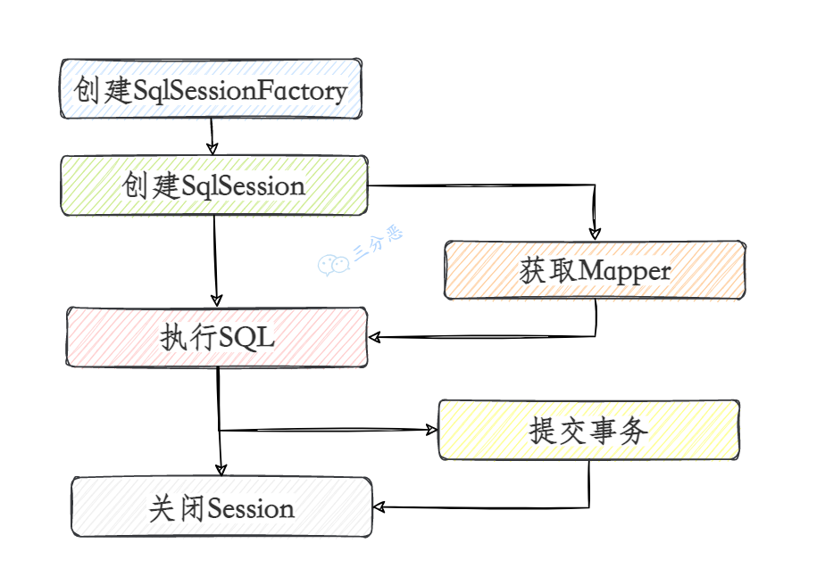
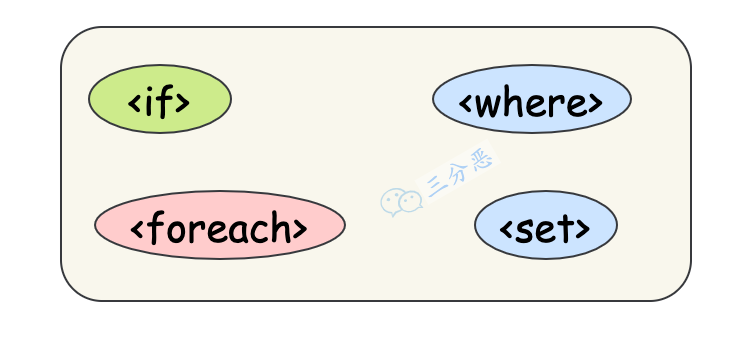
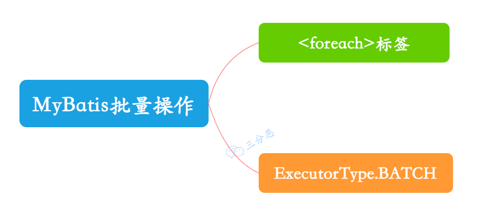

# MyBatis八股

# 基础
## 说说什么是 MyBatis?
MyBatis 是一个开源的持久层框架，主要用于将 Java 对象与 SQL 数据库中的数据进行映射。它允许开发者手写 SQL 语句，并通过 XML 或注解进行配置。MyBatis 的主要特点包括：

1. **灵活的 SQL 映射：** 支持自定义 SQL，灵活控制查询。
2. **动态 SQL：** 可以根据条件动态生成 SQL 语句。
3. **对象映射：** 将数据库查询结果映射为 Java 对象。
4. **缓存机制：** 支持一级缓存和二级缓存，提升查询性能。
5. **插件支持：** 提供插件机制，可以自定义 SQL 执行过程。

与其他 ORM 框架不同，MyBatis 允许开发者更精细地控制 SQL 执行，适合对 SQL 性能和复杂查询有较高要求的场景。


**ORM**（**Object Relational Mapping**，对象关系映射），是一种为了解决关系型数据库数据与简单 **Java 对象**（**POJO**）的映射关系的技术。简单来说，**ORM** 是通过使用描述对象和数据库之间映射的元数据，将程序中的对象自动持久化到关系型数据库中。  

## Hibernate 和 MyBatis 有什么区别？
**总结：MyBatis 和 Hibernate 的异同**

**相同点**

+ 都是对 **JDBC** 的封装，属于持久层框架，用于简化数据库操作。

---

**不同点**

1. **映射关系**
    - **MyBatis**：半自动映射框架，配置 Java 对象与 SQL 查询结果的映射关系。多表关联配置简单，但需要手动编写 SQL。
    - **Hibernate**：全自动映射框架，配置 Java 对象与数据库表的映射关系。多表关联配置复杂，但无需手动编写 SQL。
2. **SQL 优化和移植性**
    - **Hibernate**：
        * 封装 SQL，提供日志、缓存、级联（比 MyBatis 强大）等特性。
        * 支持 HQL（Hibernate Query Language），数据库无关性好，适合多数据库支持。
        * 但 SQL 优化困难，性能消耗较大。
    - **MyBatis**：
        * 需手动编写 SQL，支持动态 SQL、存储过程、动态表名等。
        * 直接使用 SQL，便于优化，但数据库移植性差。
        * 开发工作量较大，适合对 SQL 有精细控制的场景。
3. **适用场景**
    - **Hibernate**：
        * 适合需求稳定、中小型项目，如办公自动化系统。
        * SQL 编写量少，开发效率高，但灵活性较低。
    - **MyBatis**：
        * 适合需求变化频繁、快速迭代的项目，如电商网站。
        * SQL 编写量多，灵活性强，便于优化和调整。

---

**对比总结**

| 特性 | MyBatis | Hibernate |
| --- | --- | --- |
| **映射方式** | 半自动，手动编写 SQL | 全自动，无需编写 SQL |
| **SQL 控制** | 灵活，直接操作 SQL，便于优化 | 封装 SQL，优化困难 |
| **数据库移植性** | 差，SQL 与数据库绑定 | 好，支持多数据库 |
| **开发工作量** | 较大，需手动编写 SQL | 较小，自动化程度高 |
| **适用场景** | 需求变化频繁、快速迭代的项目 | 需求稳定、中小型项目 |


**结论**

+ 如果需要**灵活控制 SQL** 或项目需求变化频繁，选择 **MyBatis**。
+ 如果追求**开发效率**且需求稳定，选择 **Hibernate**。

## MyBatis 使用过程？生命周期？
以下是整理后的格式，增加了条理性并加粗了相关的部分：

**MyBatis 基本使用的过程大概可以分为这么几步：**



### **Mybatis 基本使用步骤**
    1. **创建 SqlSessionFactory**  
通过 **SqlSessionFactoryBuilder** 加载配置文件，创建 **SqlSessionFactory** 对象。
    2. **通过 SqlSessionFactory 创建 SqlSession 对象**  
**SqlSession** 是 MyBatis 的核心接口，用于执行 SQL 命令、获取映射器和管理事务。
    3. **获取 Mapper 接口**  
通过 **SqlSession** 获取 **Mapper** 接口的代理对象。如果是更新、删除语句，我们还需要提交事务。  
**Mapper** 接口定义了 SQL 操作，MyBatis 通过动态代理实现。
    4. **执行 SQL 操作**  
通过 **Mapper** 接口或 **SqlSession** 直接执行 SQL 操作。
    5. **提交事务和关闭资源**  
提交事务并关闭 **SqlSession**。

### **MyBatis 生命周期**
1. **SqlSessionFactoryBuilder**
    - 用于创建 `SqlSessionFactory`，生命周期仅限于方法作用域。
    - 创建完 `SqlSessionFactory` 后即可销毁。
2. **SqlSessionFactory**
    - 一旦创建，生命周期贯穿整个应用运行期间。
    - 通常作为单例对象，在应用启动时创建，结束时销毁。
3. **SqlSession**
    - 每次访问数据库时创建，生命周期为一次请求或操作。
    - 线程不安全，需确保每次操作后正确关闭。
4. **Mapper 接口**
    - 通过 `SqlSession` 获取，生命周期与 `SqlSession` 绑定。
    - 每次使用时动态生成代理对象，无需显式管理。

## 在 mapper 中如何传递多个参数？
**使用 **`**@Param**`** 注解（适用于方法参数）**

+ 如果 `Mapper` 方法有多个参数，可以通过 `@Param` 注解来标明每个参数的名称，MyBatis 会使用这些名称来传递参数。

**使用 **`**Map**`** 传递多个参数**

+ 另一种方式是通过 `Map` 类型作为方法参数，在 `Map` 中存放多个参数值，MyBatis 会使用 `Map` 中的键来访问参数。

**使用自定义的 POJO 类**

+ 如果传递的参数较多，可以创建一个包含多个字段的 POJO（Plain Old Java Object）类，MyBatis 会自动将类中的属性映射到 SQL 查询中。

**使用 **`**@Param**`** 和 POJO 结合**

+ 如果方法参数是 POJO 类型，同时还需要传递其他参数，可以结合使用 `@Param` 和 POJO。

## 实体类属性名和表中字段名不一样，怎么办?
### **两种实现字段名与实体类属性名映射的方式**
#### **第 1 种：通过 SQL 语句定义字段别名**
+ **实现方式：**  
在查询的 SQL 语句中，为字段名定义别名，使别名与实体类的属性名一致。
+ **示例：**

```java
<select id="getOrder" parameterType="int" resultType="com.jourwon.pojo.Order">
  select 
    order_id as id, 
    order_no as orderno, 
    order_price as price 
  from orders 
  where order_id = #{id};
</select>

```

+ **优点：**  
    - 简单直接，适合字段映射较少的情况。

---

#### **第 2 种：通过 **`resultMap`** 映射字段名与属性名**
+ **实现方式：**  
使用 `<resultMap>` 中的 `<result>` 标签，将数据库字段名与实体类属性名一一对应。
+ **示例：**

```java
<select id="getOrder" parameterType="int" resultMap="orderResultMap">
  select * from orders where order_id = #{id}
</select>

<resultMap type="com.jourwon.pojo.Order" id="orderResultMap">
  <!-- 用 id 属性映射主键字段 -->
  <id property="id" column="order_id" />
  <!-- 用 result 属性映射非主键字段 -->
  <result property="orderno" column="order_no" />
  <result property="price" column="order_price" />
</resultMap>

```

+ **优点：**  
    - 灵活性高，适合字段映射较多或复杂的场景。  
    - 可复用性强，一个 `<resultMap>` 可以在多个查询中使用。

---

### **总结**
+ **第 1 种方式：** 适合简单场景，直接在 SQL 中定义别名。  
+ **第 2 种方式：** 适合复杂场景，通过 `<resultMap>` 实现字段与属性的映射，更具灵活性和可维护性。

## Mybatis 是否可以映射 Enum 枚举类？
**MyBatis 当然可以映射枚举类，不单可以映射枚举类，MyBatis 可以映射任何对象到表的一列上。映射方式为自定义一个 **`**TypeHandler**`**，实现 **`**TypeHandler**`** 的 **`**setParameter()**`** 和 **`**getResult()**`** 接口方法。**

`**TypeHandler**`** 有两个作用：**

    1. **完成从 **`**javaType**`** 至 **`**jdbcType**`** 的转换。**
    2. **完成从 **`**jdbcType**`** 至 **`**javaType**`** 的转换。**

**体现为 **`**setParameter()**`** 和 **`**getResult()**`** 两个方法：**

    - `**setParameter()**`**：** 设置 SQL 问号占位符参数。
    - `**getResult()**`**：** 获取列查询结果。

## #{}和${}的区别?
+ `#` 会使用**预编译的方式**，能够有效防止 SQL 注入。
+ `$` 会 **直接拼接**参数值到 SQL 语句中，容易引起 SQL 注入。
+ 为了防止 SQL 注入，**永远使用 **`**#**` 进行参数传递，避免使用 `$` 来拼接参数。

### **#{}：预编译处理**
+ **作用：**  
当使用 `#{}` 时，MyBatis 在 SQL 执行之前，会将参数值通过预编译的方式安全地插入到 SQL 语句中，防止 SQL 注入。  。
+ **优点：**  
    - 使用了预处理，能有效防止 **SQL 注入**。  
    - 确保参数值在到达数据库之前被正确地处理和转义。

**${}：字符串替换**

+ **作用：**  
当使用 `${}` 时，会将参数值直接拼接到 SQL 语句中，不做任何转义或预编译处理。 存在 SQL 注入的风险
+ **风险：**  
    - 存在 **SQL 注入** 的风险，因为参数值会直接拼接到 SQL 语句中。  

**总结**

+ `**#{}**`：安全，适合用于参数值的传递，防止 SQL 注入。
+ `**${}**`：不安全，适合用于动态 SQL 片段（如表名、列名），但需谨慎使用，避免直接使用用户输入。

## 模糊查询 like 语句该怎么写?
**SQL 模糊查询的几种方式**

1. `'%${question}%'`  
    - **问题：** 可能引起 **SQL 注入**，不推荐使用。
2. `"%"#{question}"%"`  
    - **注意：** 因为 `#{…}` 解析成 SQL 语句时，会在变量外侧自动加单引号 `' '`，所以这里的 `%` 需要使用双引号 `" "`，不能使用单引号 `' '`，否则会查不到任何结果。
3. `CONCAT('%',#{question},'%')`  
    - **说明：** 使用 `CONCAT()` 函数拼接字符串。（**推荐 ****✨**）
4. **使用 **`<bind>`** 标签**  
    - **说明：** 不推荐使用。  
    - **示例：**

```java
<select id="listUserLikeUsername" resultType="com.jourwon.pojo.User">
    <bind name="pattern" value="'%' + username + '%'" />
    SELECT id, sex, age, username, password 
    FROM person 
    WHERE username LIKE #{pattern}
</select>

```

## Mybatis 能执行一对一、一对多的关联查询吗？
**MyBatis 级联查询**

---

### **一对一 **`<association>`
+ **场景：** 比如订单和支付是一对一的关系。
+ **实体类：**

```java
public class Order {
    private Integer orderId;
    private String orderDesc;

    /**
     * 支付对象
     */
    private Pay pay;
    //……
}
```

+ **结果映射：**

```java
<!-- 订单resultMap -->
<resultMap id="peopleResultMap" type="cn.fighter3.entity.Order">
    <id property="orderId" column="order_id" />
    <result property="orderDesc" column="order_desc"/>
    <!--一对一结果映射-->
    <association property="pay" javaType="cn.fighter3.entity.Pay">
        <id column="payId" property="pay_id"/>
        <result column="account" property="account"/>
    </association>

</resultMap>

```

+ **查询：**

```java
<select id="getTeacher" resultMap="getTeacherMap" parameterType="int">
    select * from order o
    left join pay p on o.order_id=p.order_id
    where o.order_id=#{orderId}
</select>

```

---

### **一对多 **`<collection>`
+ **场景：** 比如商品分类和商品，是一对多的关系。
+ **实体类：**

```java
public class Category {
    private int categoryId;
    private String categoryName;

    /**
     * 商品列表
     **/
    List<Product> products;
    //……
}
```

+ **结果映射：**

```java
<resultMap type="Category" id="categoryBean">
    <id column="categoryId" property="category_id" />
    <result column="categoryName" property="category_name" />

    <!-- 一对多的关系 -->
    <!-- property: 指的是集合属性的值, ofType：指的是集合中元素的类型 -->
    <collection property="products" ofType="Product">
        <id column="product_id" property="productId" />
        <result column="productName" property="productName" />
        <result column="price" property="price" />
    </collection>

</resultMap>

```

+ **查询：**

```java
<!-- 关联查询分类和产品表 -->
<select id="listCategory" resultMap="categoryBean">
    select c.*, p.* from category_ c left join product_ p on c.id = p.cid
</select>

```

---

### **多对一、多对多**
+ **实现方式：** 仍然利用 `<association>` 和 `<collection>` 实现。
+ **说明：** 篇幅所限，这里不展开。

## Mybatis 是否支持延迟加载？原理？
**MyBatis 延迟加载**

---

### **1. 延迟加载支持**
+ **关联对象：** `association`（一对一）  
+ **关联集合：** `collection`（一对多）

在 MyBatis 配置文件中，可以通过配置 `lazyLoadingEnabled=true|false` 来启用或禁用延迟加载。

---

### **2. 延迟加载原理**
+ **实现方式：**  
MyBatis 使用 **CGLIB** 创建目标对象的代理对象。  
当调用目标方法时，进入拦截器方法。例如，调用 `a.getB().getName()` 时：  
    1. 拦截器 `invoke()` 方法发现 `a.getB()` 是 `null` 值。  
    2. 单独发送事先保存好的查询关联 B 对象的 SQL。  
    3. 将查询结果 B 对象赋值给 `a.setB(b)`，使 `a` 的 `b` 属性有值。  
    4. 继续完成 `a.getB().getName()` 方法的调用。

---

### **3. 延迟加载的通用性**
+ 不仅是 MyBatis，几乎所有的 ORM 框架（如 Hibernate）都支持延迟加载，其原理基本相同。

---

### **总结**
+ **延迟加载** 通过代理对象和拦截器机制实现，避免一次性加载所有关联数据，提升性能。  
+ 适用于一对一（`association`）和一对多（`collection`）的场景。  
+ 配置 `lazyLoadingEnabled=true` 即可启用延迟加载。

## 如何获取生成的主键?
新增标签中添加：**keyProperty="ID"** 即可

```java
<insert id="insert" useGeneratedKeys="true" keyProperty="userId">
    insert into user(
        user_name, user_password, create_time)
    values(#{userName}, #{userPassword}, #{createTime, jdbcType=TIMESTAMP})
</insert>
```

这时候就可以完成回填主键：

+ `mapper.insert(user);`
+ `user.getId();`

## MyBatis 支持动态 SQL 吗？


MyBatis 中有一些支持动态 SQL 的标签，它们的原理是使用 **OGNL** 从 SQL 参数对象中计算表达式的值，根据表达式的值动态拼接 SQL，以此来完成动态 SQL 的功能。

## **MyBatis 动态 SQL 标签**
### **1. if**
根据条件来组成 `WHERE` 子句：

```java
<select id="findActiveBlogWithTitleLike"
   resultType="Blog">
  SELECT * FROM BLOG
  WHERE state = 'ACTIVE'
  <if test="title != null">
    AND title like #{title}
  </if>
</select>
```

### **2. choose (when, otherwise)**
这个和 Java 中的 `switch` 语句有点像：

```java
<select id="findActiveBlogLike"
   resultType="Blog">
  SELECT * FROM BLOG WHERE state = 'ACTIVE'
  <choose>
    <when test="title != null">
      AND title like #{title}
    </when>
    <when test="author != null and author.name != null">
      AND author_name like #{author.name}
    </when>
    <otherwise>
      AND featured = 1
    </otherwise>
  </choose>
</select>
```

### **3. trim (where, set)**
+ `<where>` 可以用在所有的查询条件都是动态的情况：

```java
<select id="findActiveBlogLike"
   resultType="Blog">
  SELECT * FROM BLOG
  <where>
    <if test="state != null">
      state = #{state}
    </if>
    <if test="title != null">
      AND title like #{title}
    </if>
    <if test="author != null and author.name != null">
      AND author_name like #{author.name}
    </if>
  </where>
</select>
```

+ `<set>` 可以用在动态更新的时候：

```java
<update id="updateAuthorIfNecessary">
  update Author
  <set>
    <if test="username != null">username=#{username},</if>
    <if test="password != null">password=#{password},</if>
    <if test="email != null">email=#{email},</if>
    <if test="bio != null">bio=#{bio}</if>
  </set>
  where id=#{id}
</update>
```

### **4. foreach**
这个标签用来循环遍历集合：

```java
<select id="selectPostIn" resultType="domain.blog.Post">
  SELECT *
  FROM POST P
  <where>
    <foreach item="item" index="index" collection="list"
        open="ID in (" separator="," close=")" nullable="true">
      #{item}
    </foreach>
  </where>
</select>
```

## MyBatis 如何执行批量操作？


在 MyBatis 中，执行批量操作主要通过以下几种方式来实现。不同场景可以选择不同的方法，具体实现方式如下：

---

### 1. **使用**`**<foreach>**`**标签**
通过`<foreach>`标签，在单个`insert`、`update`或`delete`语句中遍历集合，实现批量操作。

**示例：批量插入**

```java
<insert id="batchInsertUsers">
    INSERT INTO users (id, name, age)
    VALUES 
    <foreach collection="userList" item="user" separator=",">
        (#{user.id}, #{user.name}, #{user.age})
    </foreach>
</insert>
```

**注意：**

+ 这种方式生成的是一条SQL语句，可以减轻数据库的网络传输开销。
+ 当数据量过大时，SQL语句可能会超出长度限制。

---

### 2. **通过**`**ExecutorType.BATCH**`**实现批量操作**
MyBatis 提供了`ExecutorType.BATCH`模式，允许在一次数据库连接中批量执行多条SQL。

**步骤：**

1. 设置`SqlSession`的`ExecutorType`为`BATCH`。
2. 在循环中多次执行操作。
3. 调用`sqlSession.flushStatements()`提交批量SQL到数据库。

**示例：批量插入**

```java
try (SqlSession sqlSession = sqlSessionFactory.openSession(ExecutorType.BATCH)) {
    UserMapper userMapper = sqlSession.getMapper(UserMapper.class);
    List<User> userList = getUserList();
    for (User user : userList) {
        userMapper.insertUser(user);
    }
    sqlSession.flushStatements(); // 提交批量操作
    sqlSession.commit(); // 提交事务
} catch (Exception e) {
    sqlSession.rollback(); // 出现异常时回滚
    e.printStackTrace();
}
```

**注意：**

+ 减少了网络通信次数，提高了性能。
+ 数据量大时，需控制提交的频率，以避免内存占用过高。

## 说说 Mybatis 的一级、二级缓存？
**1. 一级缓存**

**一级缓存**是 **SqlSession 级别** 的缓存，默认开启。它的作用范围是同一个 SqlSession。当在同一个 SqlSession 中执行相同的 SQL 查询时，MyBatis 会优先从一级缓存中获取结果，而不是再次访问数据库。

**特点：**

+ **作用范围**：同一个 SqlSession。
+ **生命周期**：SqlSession 开启时创建，SqlSession 关闭时销毁。
+ **缓存失效**：
    - 执行了增删改操作（INSERT、UPDATE、DELETE）时，缓存会被清空。
    - 手动调用 `sqlSession.clearCache()` 方法清空缓存。

**2. 二级缓存**

**二级缓存**是 **Mapper 级别** 的缓存，默认关闭，需要手动开启。它的作用范围是同一个 Mapper 的多个 SqlSession。当多个 SqlSession 执行相同的 SQL 查询时，MyBatis 会优先从二级缓存中获取结果。

**特点：**

+ **作用范围**：同一个 Mapper 的多个 SqlSession。
+ **生命周期**：应用程序运行期间有效，直到缓存被清空或应用程序关闭。
+ **缓存失效**：
    - 执行了增删改操作（INSERT、UPDATE、DELETE）时，缓存会被清空。
    - 手动调用 `sqlSession.clearCache()` 方法清空缓存。

---

**一级缓存与二级缓存的区别**

| 特性 | 一级缓存 | 二级缓存 |
| --- | --- | --- |
| **作用范围** | 同一个 SqlSession | 同一个 Mapper 的多个 SqlSession |
| **默认开启** | 是 | 否 |
| **生命周期** | SqlSession 开启到关闭 | 应用程序运行期间 |
| **缓存失效条件** | 增删改操作、手动清空缓存 | 增删改操作、手动清空缓存 |
| **配置方式** | 无需配置 | 需要在 MyBatis 配置文件和 Mapper 中配置 |


# 原理
## 能说说 MyBatis 的工作原理吗？MyBatis 是一个半自动化的 ORM（对象关系映射）框架，它的核心思想是将 SQL 与 Java 代码解耦，通过配置文件或注解实现 SQL 与 Java 对象的映射。以下是 MyBatis 的工作原理：
---

### 1. **核心组件**
MyBatis 的核心组件包括：

+ **SqlSessionFactory**：用于创建 SqlSession 的工厂类，是 MyBatis 的核心对象。
+ **SqlSession**：表示一次数据库会话，提供了操作数据库的 API。
+ **Executor**：执行器，负责 SQL 的执行。
+ **MappedStatement**：封装了 SQL 语句、输入参数、输出结果等信息。
+ **Configuration**：MyBatis 的全局配置对象，包含所有配置信息。

---

### 2. **工作流程**
MyBatis 的工作流程可以分为以下几个步骤：

#### （1）**加载配置**
+ MyBatis 启动时，会加载全局配置文件（如 `mybatis-config.xml`）和 Mapper 文件（XML 或注解）。
+ 配置文件包括数据源、事务管理器、Mapper 映射等信息。
+ 所有配置信息会被解析并存储在 `Configuration` 对象中。

#### （2）**创建 SqlSessionFactory**
+ 通过 `SqlSessionFactoryBuilder` 读取 `Configuration` 对象，创建 `SqlSessionFactory`。
+ `SqlSessionFactory` 是线程安全的，通常在整个应用生命周期中只创建一次。

#### （3）**创建 SqlSession**
+ 通过 `SqlSessionFactory` 创建 `SqlSession`。
+ `SqlSession` 提供了操作数据库的方法（如 `selectOne`、`insert`、`update` 等）。
+ `SqlSession` 是线程不安全的，每次请求都应该创建一个新的 `SqlSession`。

#### （4）**执行 SQL**
+ 在 `SqlSession` 中，通过 `Executor` 执行 SQL。
    - **Executor** 是 MyBatis 的核心执行器，负责 SQL 的具体执行。
    - 根据配置，Executor 可以是简单执行器（`SIMPLE`）、重用执行器（`REUSE`）或批处理执行器（`BATCH`）。
+ **MappedStatement** 中存储了 SQL 语句、参数映射、结果映射等信息。
+ 执行 SQL 时，MyBatis 会将 Java 对象转换为 SQL 参数，并将查询结果映射为 Java 对象。

#### （5）**结果映射**
+ MyBatis 通过 `ResultMap` 将查询结果映射为 Java 对象。
+ 支持简单类型、POJO、集合等多种结果类型。
+ 如果配置了缓存（一级缓存或二级缓存），查询结果会被缓存起来。

#### （6）**关闭 SqlSession**
+ 操作完成后，需要关闭 `SqlSession`，释放数据库连接。

---

### 3. **SQL 与 Java 的映射**
MyBatis 通过以下方式实现 SQL 与 Java 的映射：

+ **Mapper XML 文件**：在 XML 中定义 SQL 语句，并通过 `<resultMap>` 配置结果映射。
+ **注解**：在 Mapper 接口中使用注解（如 `@Select`、`@Insert`）定义 SQL。
+ **动态 SQL**：通过 `<if>`、`<foreach>` 等标签实现动态 SQL。

---

### 4. **缓存机制**
+ **一级缓存**：SqlSession 级别的缓存，默认开启。
+ **二级缓存**：Mapper 级别的缓存，需手动开启，跨 SqlSession 共享。

---

### 5. **总结**
MyBatis 的工作原理可以概括为：

1. 加载配置，创建 `SqlSessionFactory`。
2. 通过 `SqlSessionFactory` 创建 `SqlSession`。
3. 在 `SqlSession` 中，通过 `Executor` 执行 SQL。
4. 将查询结果映射为 Java 对象。
5. 关闭 `SqlSession`。

MyBatis 通过解耦 SQL 与 Java 代码，提供了灵活的 SQL 编写方式和高效的结果映射机制，适用于需要精细控制 SQL 的场景。

## MyBatis 的功能架构是什么样的？
MyBatis 的功能架构可以分为 **核心层**、**接口层** 和 **基础支持层** 三个部分。每一层都有其特定的职责和组件，共同协作完成数据库操作。以下是 MyBatis 功能架构的详细说明：

---

### 1. **核心层**
核心层是 MyBatis 最核心的部分，负责 SQL 的执行和结果映射。主要包括以下组件：

#### （1）**SqlSession**
+ 是 MyBatis 的核心接口，表示一次数据库会话。
+ 提供了操作数据库的方法，如 `selectOne`、`selectList`、`insert`、`update`、`delete` 等。
+ 通过 `SqlSessionFactory` 创建，线程不安全，每次请求都应该创建一个新的实例。

#### （2）**Executor**
+ 是 SQL 的执行器，负责 SQL 的具体执行。
+ 分为三种类型：
    - **SimpleExecutor**：默认执行器，每次执行 SQL 都会创建一个新的 `PreparedStatement`。
    - **ReuseExecutor**：重用执行器，会缓存 `PreparedStatement`，避免重复创建。
    - **BatchExecutor**：批处理执行器，用于批量操作。

#### （3）**MappedStatement**
+ 封装了 SQL 语句、输入参数、输出结果等信息。
+ 每个 SQL 语句（如 `select`、`insert`）都对应一个 `MappedStatement` 对象。

#### （4）**ResultHandler**
+ 用于处理查询结果。
+ 可以将结果映射为 Java 对象、集合或其他数据结构。

#### （5）**StatementHandler**
+ 负责创建 `PreparedStatement` 对象，并设置参数。
+ 是 `Executor` 的底层实现。

#### （6）**ParameterHandler**
+ 负责将 Java 对象转换为 SQL 参数。

#### （7）**ResultSetHandler**
+ 负责将查询结果映射为 Java 对象。

---

### 2. **接口层**
接口层是 MyBatis 提供给开发者使用的 API，主要包括以下内容：

#### （1）**Mapper 接口**
+ 开发者通过定义 Mapper 接口来操作数据库。
+ Mapper 接口中的方法会映射到具体的 SQL 语句（通过 XML 或注解）。

#### （2）**SqlSessionFactory**
+ 用于创建 `SqlSession` 的工厂类。
+ 通过 `SqlSessionFactoryBuilder` 创建，线程安全。

#### （3）**SqlSessionFactoryBuilder**
+ 用于构建 `SqlSessionFactory`。
+ 通过读取配置文件（如 `mybatis-config.xml`）创建 `SqlSessionFactory`。

#### （4）**Configuration**
+ 是 MyBatis 的全局配置对象，包含所有配置信息。
+ 包括数据源、事务管理器、Mapper 映射、缓存配置等。

---

### 3. **基础支持层**
基础支持层为 MyBatis 的核心功能提供支持，主要包括以下内容：

#### （1）**数据源**
+ 负责管理数据库连接。
+ MyBatis 支持多种数据源，如 JDBC、连接池（如 Druid、HikariCP）。

#### （2）**事务管理**
+ 负责管理数据库事务。
+ MyBatis 支持两种事务管理方式：
    - **JDBC 事务**：基于 JDBC 的 `Connection` 实现。
    - **MANAGED 事务**：由容器（如 Spring）管理事务。

#### （3）**缓存**
+ 提供一级缓存和二级缓存机制。
    - **一级缓存**：SqlSession 级别，默认开启。
    - **二级缓存**：Mapper 级别，需手动开启。

#### （4）**类型处理器（TypeHandler）**
+ 负责 Java 类型与 JDBC 类型之间的转换。
+ MyBatis 内置了多种类型处理器，也支持自定义类型处理器。

#### （5）**日志**
+ MyBatis 支持多种日志框架（如 SLF4J、Log4j、Logback）。
+ 通过日志可以查看 SQL 执行情况。

#### （6）**插件（Plugin）**
+ MyBatis 提供了插件机制，允许开发者拦截 SQL 执行过程。
+ 通过实现 `Interceptor` 接口，可以自定义插件。

---

### 4. **功能架构图**
以下是 MyBatis 功能架构的简化图示：

```java
+---------------------------------------------------+
|                   接口层                          |
|  +-------------------+  +---------------------+   |
|  | Mapper 接口       |  | SqlSessionFactory   |   |
|  +-------------------+  +---------------------+   |
+---------------------------------------------------+
|                   核心层                          |
|  +-------------------+  +---------------------+   |
|  | SqlSession        |  | Executor            |   |
|  +-------------------+  +---------------------+   |
|  +-------------------+  +---------------------+   |
|  | MappedStatement   |  | StatementHandler    |   |
|  +-------------------+  +---------------------+   |
|  +-------------------+  +---------------------+   |
|  | ParameterHandler  |  | ResultSetHandler    |   |
|  +-------------------+  +---------------------+   |
+---------------------------------------------------+
|                   基础支持层                      |
|  +-------------------+  +---------------------+   |
|  | 数据源            |  | 事务管理            |   |
|  +-------------------+  +---------------------+   |
|  +-------------------+  +---------------------+   |
|  | 缓存              |  | 类型处理器          |   |
|  +-------------------+  +---------------------+   |
|  +-------------------+  +---------------------+   |
|  | 日志              |  | 插件                |   |
|  +-------------------+  +---------------------+   |
+---------------------------------------------------+
```

---

### 5. **总结**
MyBatis 的功能架构清晰分层，各层职责明确：

+ **核心层**：负责 SQL 执行和结果映射。
+ **接口层**：提供开发者使用的 API。
+ **基础支持层**：为核心功能提供支持（如数据源、事务、缓存等）。

通过这种架构设计，MyBatis 实现了 SQL 与 Java 代码的解耦，提供了灵活的 SQL 编写方式和高效的结果映射机制，适用于需要精细控制 SQL 的场景。

## 为什么 Mapper 接口不需要实现类？
MyBatis 的 Mapper 接口不需要实现类，是因为 MyBatis 使用了 **动态代理** 技术，在运行时动态生成接口的代理对象。以下是精简说明：

---

### 1. **动态代理机制**
+ MyBatis 通过 JDK 动态代理为 Mapper 接口生成代理对象。
+ 调用接口方法时，代理对象会拦截方法，根据方法名和参数找到对应的 SQL 并执行。

---

### 2. **SQL 绑定方式**
+ **XML 文件**：在 XML 中定义 SQL，通过 `<mapper>` 绑定到接口。
+ **注解**：在接口方法上使用 `@Select`、`@Insert` 等注解直接定义 SQL。

---

### 3. **为什么不需要实现类？**
+ **简化开发**：只需定义接口和 SQL，无需写实现类。
+ **解耦 SQL 与代码**：SQL 集中管理，与 Java 代码分离。
+ **动态性**：运行时动态生成代理对象，灵活处理调用。
+ **一致性**：MyBatis 统一处理代理逻辑，避免重复代码。

---

### 4. **核心实现**
+ **MapperProxy**：实现 `InvocationHandler`，拦截方法调用。
+ **MapperMethod**：封装方法调用逻辑，决定如何执行 SQL。
+ **SqlSession**：实际执行 SQL 并返回结果。

---

### 5. **总结**
MyBatis 通过动态代理技术，动态生成 Mapper 接口的代理对象，实现了接口方法与 SQL 的绑定。这种设计简化了开发，解耦了 SQL 与代码，提升了灵活性和可维护性。

## Mybatis 都有哪些 Executor 执行器？
在 MyBatis 中，`Executor` 是执行 SQL 的核心组件，提供了三种类型：

### **1. SimpleExecutor**
+ 每次执行 SQL 都新建连接，执行后立即关闭。
+ **特点**：简单易用，但效率低。
+ **适用场景**：调试或轻量操作。

### **2. ReuseExecutor**
+ 复用连接，减少创建和销毁连接的开销。
+ **特点**：高效，适合频繁执行相同或类似 SQL。
+ **适用场景**：同一事务中的多次操作。

### **3. BatchExecutor**
+ 将多次写操作（`INSERT`、`UPDATE`、`DELETE`）缓存起来，一次性批量提交。
+ **特点**：批量操作性能高，但内存占用较多。
+ **适用场景**：大批量数据处理。

---

### **对比**
| **类型** | **复用连接** | **特点** | **适用场景** |
| --- | --- | --- | --- |
| **SimpleExecutor** | 否 | 每次新建连接，效率低 | 调试或轻量级操作 |
| **ReuseExecutor** | 是 | 复用连接，减少资源开销 | 多次执行类似 SQL 的场景 |
| **BatchExecutor** | 是 | 批量执行写操作，效率高 | 批量插入、更新或删除的大数据量操作 |


# 补充
## 说说 JDBC 的执行步骤？
**JDBC 执行数据库操作的步骤：**

1. **加载数据库驱动**  
加载数据库的驱动程序， 以便与数据库建立连接。  
2. **获取数据库连接**  
通过 JDBC 的 `DriverManager`，提供数据库的 URL、用户名和密码，建立与数据库的连接。
3. **创建 SQL 执行对象**  
利用数据库连接对象，创建一个用于执行 SQL 语句的 `Statement` 或 `PreparedStatement` 对象。
    - `Statement` 用于执行静态 SQL 语句。
    - `PreparedStatement` 用于执行带参数的 SQL 语句，可以防止 SQL 注入。
4. **执行 SQL**  
使用执行对象发送 SQL 语句到数据库：查询语句会返回结果集（`ResultSet`），返回受影响的行数。
5. **处理查询结果**  
如果是查询操作，遍历结果集，从中获取每一行的记录，并进行相应的业务逻辑处理。
6. **关闭资源**  
关闭 `ResultSet`、`Statement` 和 `Connection` 对象，释放资源。

```java
import java.sql.*;

public class JdbcExample {
    public static void main(String[] args) {
        // 数据库连接信息
        String url = "jdbc:mysql://localhost:3306/mydatabase"; // 数据库URL
        String username = "root"; // 数据库用户名
        String password = "password"; // 数据库密码

        // 使用 try-with-resources 自动关闭资源
        try (Connection connection = DriverManager.getConnection(url, username, password);
             Statement statement = connection.createStatement();
             ResultSet resultSet = statement.executeQuery("SELECT * FROM users")) {

            // 遍历结果集
            while (resultSet.next()) {
                int id = resultSet.getInt("id");
                String name = resultSet.getString("name");
                String email = resultSet.getString("email");
                System.out.println("ID: " + id + ", Name: " + name + ", Email: " + email);
            }
        } catch (SQLException e) {
            e.printStackTrace(); // 处理异常
        }
    }
}
```

## 创建连接拿到的是什么对象？
在 JDBC 执行步骤中，创建连接后获取的是 `java.sql.Connection` 对象。该对象表示数据库连接会话，可用于执行 SQL 语句、管理事务等操作。

通过调用 `DriverManager.getConnection()` 方法并传入数据库 URL、用户名和密码即可获取 `Connection` 对象。获得后，可用其创建 `Statement`、`PreparedStatement` 和 `CallableStatement` 对象并管理事务。

## Statement 与 PreparedStatement 的区别`Statement` 和 `PreparedStatement` 是 Java 数据库连接 (JDBC) 中用于执行 SQL 查询的两种接口，它们有以下主要区别：
### Statement
1. **用法**：执行静态 SQL 查询，适用于简单的、不需要参数化的查询。
2. **性能**：每次执行查询时都需要重新解析 SQL 语句，性能较低。
3. **安全性**：容易受到 SQL 注入攻击，因为 SQL 语句通常是直接拼接的字符串。
4. **代码示例**：

```java
Statement stmt = connection.createStatement();
String sql = "SELECT * FROM employees";
ResultSet rs = stmt.executeQuery(sql);
```

### PreparedStatement
1. **用法**：执行动态 SQL 查询，允许使用参数化查询，适用于需要多次执行相同查询但参数不同的场景。
2. **性能**：预编译 SQL 语句，可以重用执行计划，性能较高。
3. **安全性**：有效防止 SQL 注入攻击，因为参数是通过占位符传递的。
4. **代码示例**：

```java
String sql = "SELECT * FROM employees WHERE id = ?";
PreparedStatement pstmt = connection.prepareStatement(sql);
pstmt.setInt(1, 1001); // 设置参数
ResultSet rs = pstmt.executeQuery();
```

### 总结
+ **Statement**：简单查询，性能和安全性较低。
+ **PreparedStatement**：动态查询，性能和安全性较高。

推荐使用 `PreparedStatement` 来执行 SQL 查询，特别是在涉及用户输入的情况下，以提高性能和安全性。

## 什么是 SQL 注入？如何防止
 SQL 注入是一种攻击手段，攻击者通过在输入中插入恶意 SQL 代码，操纵数据库查询，获取或篡改数据。  

### **如何防止 SQL 注入？**
#### 1. **使用 PreparedStatement**
+ 通过占位符 `?` 传递参数，防止恶意代码注入。

#### 2. **输入验证**
+ 检查用户输入是否符合预期格式（如数字、邮箱等）。

#### 3. **使用 ORM 框架**
+ 如 MyBatis、Hibernate，自动处理 SQL 注入问题。

## MybatisPlus和Mybatis的区别？
MyBatis-Plus 是基于 MyBatis 的增强工具库，旨在简化开发并提高效率。以下是其与 MyBatis 的主要区别：

+ **简化 CRUD**：通过继承 `BaseMapper` 提供内置方法，无需重复编写 SQL。
+ **代码生成**：支持根据表结构自动生成实体类、Mapper 接口和 XML 文件，减少手动工作。
+ **通用方法**：封装条件构造器、排序、分页等常用功能，提升开发效率。
+ **分页插件**：内置支持多数据库分页，无需手动实现分页逻辑。
+ **多租户支持**：方便实现多租户数据隔离。
+ **注解增强**：更多注解支持，减少 XML 配置，简化映射配置。

## MyBatis运用了哪些常见的设计模式？
MyBatis 是一个优秀的 ORM 框架，其源码中运用了多种设计模式来提升代码的灵活性和可扩展性。以下是 MyBatis 中常见的几种设计模式：

---

### 1. **建造者模式（Builder Pattern）**
+ **应用场景**：用于构建复杂对象，如 `SqlSessionFactory`、`Configuration` 等。
+ **示例**：
    - `SqlSessionFactoryBuilder` 用于构建 `SqlSessionFactory`。
    - `XMLConfigBuilder` 用于解析配置文件并构建 `Configuration` 对象。

---

### 2. **工厂模式（Factory Pattern）**
+ **应用场景**：用于创建对象，如 `SqlSession`、`Executor` 等。
+ **示例**：
    - `SqlSessionFactory` 是工厂接口，负责创建 `SqlSession`。
    - `DefaultSqlSessionFactory` 是具体工厂类，实现了 `SqlSession` 的创建逻辑。

---

### 3. **代理模式（Proxy Pattern）**
+ **应用场景**：用于生成 Mapper 接口的代理对象。
+ **示例**：
    - MyBatis 通过 `MapperProxy` 动态生成 Mapper 接口的代理对象，拦截方法调用并执行对应的 SQL。

---

### 4. **模板方法模式（Template Method Pattern）**
+ **应用场景**：用于定义算法的骨架，如 `BaseExecutor` 中的查询和更新操作。
+ **示例**：
    - `BaseExecutor` 定义了执行 SQL 的通用流程，具体实现由子类（如 `SimpleExecutor`）完成。

---

### 5. **装饰器模式（Decorator Pattern）**
+ **应用场景**：用于增强对象的功能，如缓存、日志等。
+ **示例**：
    - `CachingExecutor` 是 `Executor` 的装饰器，为执行器添加了缓存功能。

---

### 6. **单例模式（Singleton Pattern）**
+ **应用场景**：用于确保全局唯一对象，如 `ErrorContext`。
+ **示例**：
    - `ErrorContext` 使用 ThreadLocal 实现线程单例，记录当前线程的错误信息。

---

### 7. **责任链模式（Chain of Responsibility Pattern）**
+ **应用场景**：用于处理插件拦截器链。
+ **示例**：
    - MyBatis 的插件机制通过责任链模式实现，多个拦截器按顺序处理 SQL 执行过程。

---

### 8. **适配器模式（Adapter Pattern）**
+ **应用场景**：用于兼容不同接口，如日志模块。
+ **示例**：
    - MyBatis 的日志模块通过适配器模式兼容多种日志框架（如 SLF4J、Log4j 等）。

---

### 9. **策略模式（Strategy Pattern）**
+ **应用场景**：用于动态选择算法，如 `Executor` 的类型选择。
+ **示例**：
    - MyBatis 支持多种 `Executor`（如 `SimpleExecutor`、`ReuseExecutor`、`BatchExecutor`），根据配置动态选择。

---

### 10. **观察者模式（Observer Pattern）**
+ **应用场景**：用于事件监听，如 `Configuration` 初始化时的监听器。
+ **示例**：
    - MyBatis 在 `Configuration` 初始化时会触发相关事件，通知监听器执行相应逻辑。

---

### 总结
MyBatis 中常见的设计模式包括：

1. **建造者模式**：构建复杂对象。
2. **工厂模式**：创建对象。
3. **代理模式**：生成 Mapper 代理对象。
4. **模板方法模式**：定义算法骨架。
5. **装饰器模式**：增强对象功能。
6. **单例模式**：确保全局唯一对象。
7. **责任链模式**：处理插件拦截器链。
8. **适配器模式**：兼容不同接口。
9. **策略模式**：动态选择算法。
10. **观察者模式**：事件监听。

这些设计模式使 MyBatis 具有高度的灵活性和可扩展性，能够满足复杂的业务需求。


> 更新: 2025-03-25 20:11:27  
> 原文: <https://www.yuque.com/neumx/laxg2e/irfzv9g7uarq4p7b>