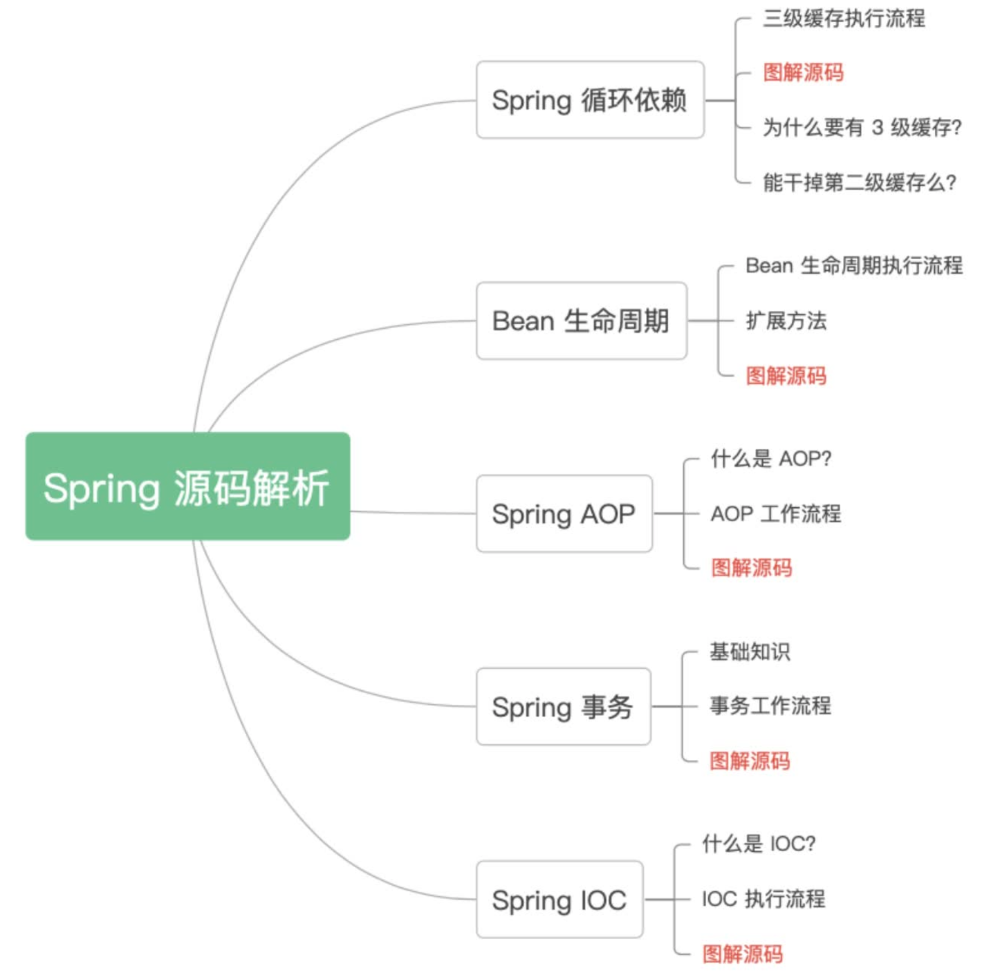
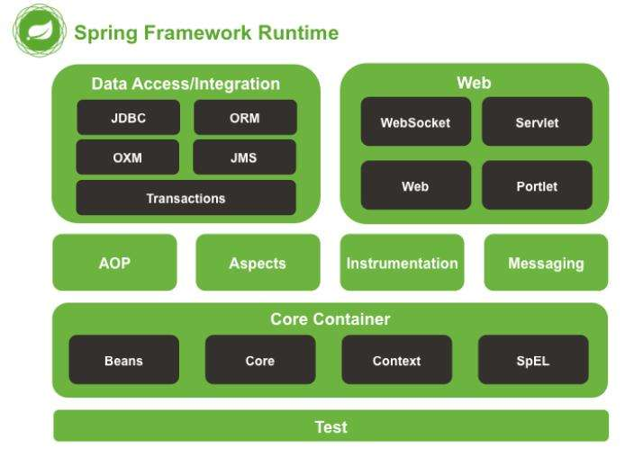
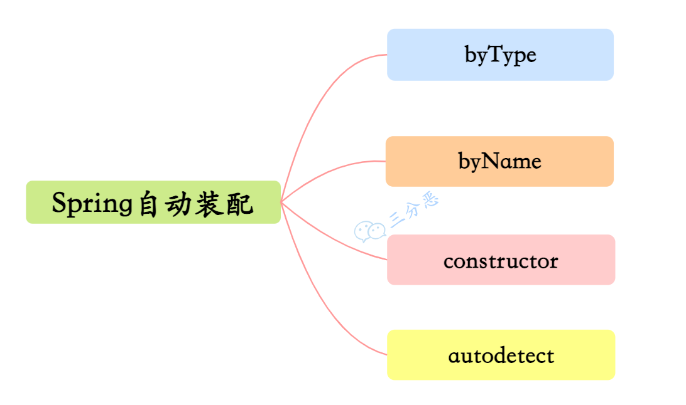
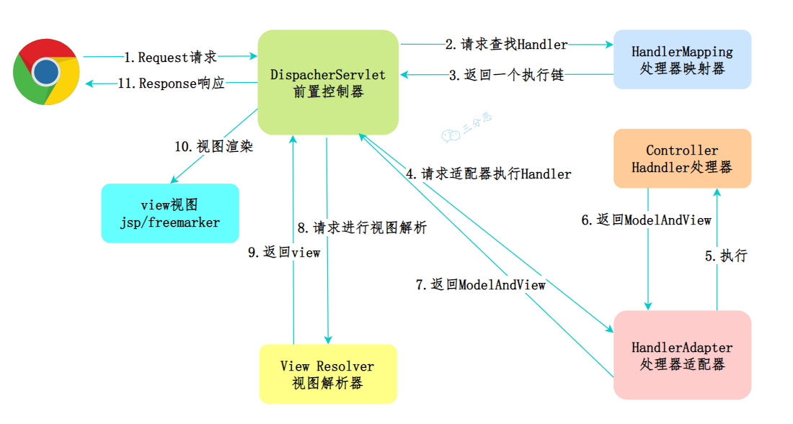

# Spring八股

# 基础
## Spring 是什么？特性？
**Spring** 是一个**轻量级**的、非入侵式的 **控制反转 (IoC)** 和 **面向切面 (AOP)** 的框架。

**Spring的优点：**

1. **控制反转（IoC）**
    - 降低类之间的耦合，提升可测试性和可维护性。
2. **面向切面编程（AOP）**
    - 简化横切关注点的处理，如事务管理和日志记录。
3. **模块化**
    - 灵活的模块化结构，用户可按需选择。
4. **丰富的生态系统**
    - 提供 **Spring MVC**、**Spring Boot** 等多种框架，支持快速开发。

### Spring源码看过吗？
看过一些，主要就是针对 Spring 循环依赖、Bean 声明周期、AOP、事务、IOC 这五部分。



[附件: Spring 源码解析手册（星球专享）.pdf](./attachments/Fp2isgky8EFumICQ/Spring 源码解析手册（星球专享）.pdf)

## Spring 有哪些模块呢？
**Spring 框架是分模块存在的**，除了最核心的 **Spring Core Container** 是必要模块之外，其他模块都是可选的，总计大约有 **20 多个模块**。



**最主要的七大模块：**

1. **Spring Core**
    - Spring 核心，是框架最基础的部分，提供 **IoC（控制反转）** 和 **DI（依赖注入）** 特性。
2. **Spring Context**
    - Spring 上下文容器，是 **BeanFactory** 功能加强的一个子接口。
3. **Spring Web**
    - 提供 **Web 应用开发** 的支持。
4. **Spring MVC**
    - 针对 Web 应用中 **MVC 思想** 的实现。
5. **Spring DAO**
    - 提供对 **JDBC 的抽象层**，简化了 JDBC 编码，使编码更加健壮。
6. **Spring ORM**
    - 支持与流行的 **ORM 框架的整合**，例如： 
        * **Spring + Hibernate**
        * **Spring + iBatis**
        * **Spring + JDO**
7. **Spring AOP**
    - 即 **面向切面编程**，提供了与 **AOP 联盟兼容** 的编程实现。

## Spring 有哪些常用注解呢？
以下是 **Spring**（包括核心、MVC 和 Boot）中常用的注解分类及其作用，面试中经常被问到：

---

### **一、Spring 核心注解**
1. `**@Component**`
    - 标注一个类为 Spring 的组件，自动注册到 Spring 容器中。适用于通用组件。
2. `**@Controller**`
    - 标注一个类为控制器，通常用于处理 Web 请求（MVC 中使用）。
3. `**@Service**`
    - 标注业务逻辑层的类，语义化增强，便于分层识别。
4. `**@Configuration**`
    - 标注一个类为配置类，取代传统 XML 配置。
5. `**@Repository**`
    - 标注数据访问层的类（DAO），提供异常转换功能。
6. `**@Autowired**`
    - 自动注入依赖的 Bean，按类型注入。
7. `**@Qualifier**`
    - 配合 `@Autowired` 使用，用于指定具体的 Bean。
8. `**@Value**`
    - 注入配置文件中的值，例如 `@Value("${property.name}")`。
9. `**@Bean**`
    - 声明一个方法返回一个 Bean，供 Spring 容器管理。
10. `**@Scope**`
    - 设置 Bean 的作用域，如 `singleton`、`prototype`。

---

### **二、Spring MVC 注解**
1. `**@RequestMapping**`
    - 配置 URL 和处理方法之间的映射关系。
    - 常见参数： 
        * `value`：映射路径。
        * `method`：请求方式，如 `RequestMethod.GET`。
2. `**@GetMapping**`** / **`**@PostMapping**`** / **`**@PutMapping**`** / **`**@DeleteMapping**`
    - 映射 对应 请求到控制器方法。  
3. `**@RequestParam**`
    - 获取请求中的参数值，例如 `?id=1`。
4. `**@PathVariable**`
    - 获取 URL 路径中的占位符变量，例如 `/user/{id}`。
5. `**@RequestBody**`
    - 将请求体内容解析为 Java 对象，通常用于处理 JSON 数据。
6. `**@ResponseBody**`
    - 将方法返回值序列化为 JSON 或 XML，直接写入响应体。
7. `**@RestController**`
    - 组合了 `@Controller` 和 `@ResponseBody`，常用于 RESTful API。
8. `**@ModelAttribute**`
    - 在 Controller 方法执行前，绑定数据到模型。
9. `**@SessionAttributes**`
    - 指定哪些模型属性需要存储在 Session 中。
10. `**@ExceptionHandler**`
    - 用于处理 Controller 方法中抛出的异常。

---

### **三、Spring Boot 特有注解**
1. `**@SpringBootApplication**`
    - 核心注解，整合了： 
        * `@Configuration`：声明配置类。
        * `@EnableAutoConfiguration`：启用自动配置。
        * `@ComponentScan`：启用组件扫描。
2. `**@EnableAutoConfiguration**`
    - 启用 Spring Boot 的自动配置功能。
3. `**@EnableConfigurationProperties**`
    - 配合 `@ConfigurationProperties` 使用，支持将配置绑定到 Java 类。
4. `**@ConfigurationProperties**`
    - 将配置文件中的属性绑定到 Java 类的字段中。
5. `**@ComponentScan**`
+ 指定要扫描的包路径，以查找被Spring管理的组件（如使用 @Component、@Service、@Repository 等注解标记的类）。这样，Spring会自动检测并注册这些组件。

---

## 注解是怎么发挥作用的
Spring 的注解机制依赖于：

+ **反射（Reflection）**：用于扫描注解并解析其元数据。
+ **动态代理（JDK Proxy 或 CGLIB）**：用于拦截方法调用（如 `@Transactional`、AOP）。
+ **BeanPostProcessor**：在Spring生命周期中处理Bean的初始化和属性填充。


## Spring 中应用了哪些设计模式呢？
<details class="lake-collapse"><summary id="u1765f091"></summary><h3 id="JvwQk"><span class="ne-text">1. </span><strong><span class="ne-text">工厂方法模式（Factory Method）</span></strong></h3><p id="u63e6cc7c" class="ne-p"><strong><span class="ne-text">IoC容器</span></strong><span class="ne-text"> 可以视作工厂，用于管理 </span><strong><span class="ne-text">Bean 的生命周期</span></strong><span class="ne-text"> 和 </span><strong><span class="ne-text">依赖关系</span></strong><span class="ne-text">。容器通过 </span><code class="ne-code"><span class="ne-text">BeanFactory</span></code><span class="ne-text"> 或 </span><code class="ne-code"><span class="ne-text">ApplicationContext</span></code><span class="ne-text"> 创建和管理对象，开发者不直接实例化 Bean，交由 Spring 容器处理。</span></p><h3 id="dyViT"><span class="ne-text">2. </span><strong><span class="ne-text">单例模式（Singleton）</span></strong></h3><p id="u9f4ab29b" class="ne-p"><span class="ne-text">Spring 默认的 Bean 生命周期是单例模式，即整个容器中每个 Bean 只会有一个实例，所有请求共享这同一个 Bean 实例，减少内存消耗和创建成本。</span></p><h3 id="XInRG"><span class="ne-text">3. </span><strong><span class="ne-text">代理模式（Proxy）</span></strong></h3><p id="u309b49cd" class="ne-p"><span class="ne-text">Spring AOP 通过代理模式为目标对象生成代理实例，增强其功能（如事务、日志）。根据目标是否实现接口，Spring 使用 JDK 动态代理或 CGLIB 代理。</span></p><h3 id="mEFDG"><span class="ne-text">4.  观察者模式（Observer）  </span></h3><p id="u993c7850" class="ne-p"><span class="ne-text">Spring 的事件驱动模型使用了</span><strong><span class="ne-text">观察者模式</span></strong><span class="ne-text">，当事件发生时，Spring 会通知所有注册的监听器来响应特定的事件。</span></p></details>
**Spring框架中应用的设计模式包括：**

1. **工厂模式**
    - **IoC容器** 可以视作工厂，用于管理 **Bean 的生命周期** 和 **依赖关系**。**BeanFactory** 和 **ApplicationContext** 实现了该模式。

```java
// 定义一个简单的 Bean
public class UserService {
    public void sayHello() {
        System.out.println("Hello from UserService!");
    }
}

// 配置类，使用 @Configuration 标注为 Spring 配置类
@Configuration
public class AppConfig {
    // @Bean 注解告诉 Spring 创建一个 UserService 类型的 Bean
    @Bean
    public UserService userService() {
        return new UserService();
    }
}

// 使用 Spring 容器作为工厂
public class FactoryPatternExample {
    public static void main(String[] args) {
        // 使用 AnnotationConfigApplicationContext 加载配置类
        ApplicationContext context = new AnnotationConfigApplicationContext(AppConfig.class);

        // 从 Spring 容器中获取 Bean 实例
        UserService userService = context.getBean(UserService.class);

        // 调用方法验证 Bean 是否被正确管理
        userService.sayHello();
    }
}

```

2. **代理模式**
    - **AOP（面向切面编程）** 基于代理模式实现，提供了两种代理方式： 
        * **JDK动态代理**
        * **CGLIB代理**

```java
// 定义切面类，使用 @Aspect 标注
@Aspect
@Component
public class LoggingAspect {
    // 使用 @Before 注解定义切入点，在目标方法执行前触发
    @Before("execution(* com.example.service.*.*(..))")
    public void logBefore() {
        System.out.println("Logging before method execution.");
    }
}

// 业务类，标注为 @Service
@Service
public class UserService {
    public void performAction() {
        System.out.println("Executing business logic in UserService.");
    }
}

// 主类，启动 Spring 容器
@SpringBootApplication
public class ProxyPatternExample {
    public static void main(String[] args) {
        // 启动 Spring Boot 应用
        ApplicationContext context = SpringApplication.run(ProxyPatternExample.class, args);

        // 从容器中获取被代理的 Bean
        UserService userService = context.getBean(UserService.class);

        // 调用方法，观察代理切面的效果
        userService.performAction();
    }
}

```

3. **单例模式**
    - 默认情况下，Spring中的 **Bean 是单例的**，以保证唯一性并减少系统开销。

```java
// 定义一个单例的 Bean
@Service
public class SingletonService {
    public SingletonService() {
        System.out.println("SingletonService instance created.");
    }
}

// 主类验证单例模式
@SpringBootApplication
public class SingletonPatternExample {
    public static void main(String[] args) {
        ApplicationContext context = SpringApplication.run(SingletonPatternExample.class, args);

        // 获取同一个 Bean 的多个实例
        SingletonService service1 = context.getBean(SingletonService.class);
        SingletonService service2 = context.getBean(SingletonService.class);

        // 验证是否为同一个实例
        System.out.println(service1 == service2); // 输出: true
    }
}

```

4. **适配器模式**
    - 在 **Spring MVC** 中，**HandlerAdapter** 允许不同类型的请求处理器通过统一的接口进行交互。

```java
// 定义一个控制器
@RestController
public class MyController {
    // 映射 HTTP 请求到方法
    @RequestMapping("/hello")
    public String handleRequest() {
        return "Hello, Spring MVC!";
    }
}

// DispatcherServlet 内部适配器的使用
// HandlerAdapter 是适配器模式的典型实现，支持多种控制器类型。

```

5. **观察者模式**
    - **Spring 的事件驱动模型** 使用了观察者模式。监听器 **ApplicationListener** 用于接收发布的事件。

```java
// 自定义事件类，继承 ApplicationEvent
public class MyEvent extends ApplicationEvent {
    public MyEvent(Object source) {
        super(source);
    }
}

// 自定义事件监听器，实现 ApplicationListener 接口
@Component
public class MyEventListener implements ApplicationListener<MyEvent> {
    @Override
    public void onApplicationEvent(MyEvent event) {
        System.out.println("Received event: " + event.getSource());
    }
}

// 主类，发布事件
@SpringBootApplication
public class ObserverPatternExample implements CommandLineRunner {
    @Autowired
    private ApplicationEventPublisher publisher;

    public static void main(String[] args) {
        SpringApplication.run(ObserverPatternExample.class, args);
    }

    @Override
    public void run(String... args) {
        // 发布事件
        publisher.publishEvent(new MyEvent("Hello, Event!"));
    }
}

```

6. **模板模式**
    - 如 **JdbcTemplate**，使用模板方法简化数据库操作。用户只需提供 **SQL 和参数**，不必处理繁琐的操作逻辑。

## Spring 容器、Web 容器之间的区别？（补充）
**Spring 容器**

+ **核心部分**：Spring 容器是 Spring 框架的核心部分，负责管理应用程序中对象的 **生命周期** 和 **依赖注入**。

---

**Web 容器**

+ **定义**：Web 容器（也称 **Servlet 容器**），是用于运行 **Java Web 应用程序** 的服务器环境，支持 **Servlet**、**JSP** 等 Web 组件。
+ **常见容器**： 
    - **Apache Tomcat**
    - **Jetty**

---

**Spring MVC**

+ **定义**：Spring MVC 是 **Spring 框架的一部分**，专门用于处理 **Web 请求**。
+ **设计模式**：基于 **MVC（Model-View-Controller）** 设计模式，用于分离逻辑层、表示层和控制层，提升代码的可维护性和扩展性。

# IoC
## 说一说什么是 IoC、DI？
**IoC（控制反转）**

控制反转是一种设计思想，将对象的创建和依赖管理交给框架容器，降低组件间的耦合性。

**DI（依赖注入）**

依赖注入是 IoC 的一种实现方式，容器负责将对象所需的依赖注入给对象。注入方式：构造器注入，Setter 注入，接口注入（少用）

**IoC 与 DI 的关系**

    - IoC 是思想，DI 是实现方式。Spring 通过 DI 实现了 IoC。

## 能简单说一下 Spring IoC 的实现机制吗？
  
 IoC控制反转是一种设计思想，将对象的创建和依赖管理交给外部容器。其原理通过 **依赖注入（DI）** 实现，常见的注入方式有构造器注入、setter 注入和字段注入。Ioc 解耦了对象之间的关系，提高了系统的稳定性和可扩展性。

> + **构造函数注入**：通过构造函数传递依赖。
> + **Setter 方法注入**：通过 Setter 方法传递依赖。
> + **字段注入**：通过反射直接注入字段（不推荐）。
>


### Spring IoC 的实现机制
Spring IoC（控制反转）的核心是通过 **IoC 容器** 来管理对象的生命周期和依赖关系。其实现机制主要包括以下几个步骤：

---

1. **配置元数据**

Spring IoC 容器需要知道如何创建和管理对象，这些信息通过 **配置元数据** 提供。配置元数据可以通过以下方式定义：

+ **XML 配置文件**
+ **Java 注解**（如 `@Component`、`@Bean`）
+ **Java 配置类**（使用 `@Configuration`）

---

**2. IoC 容器的初始化**

Spring IoC 容器（如 `ApplicationContext`）在启动时会读取配置元数据，并根据这些信息创建和管理 Bean。常见的容器实现：

+ `ClassPathXmlApplicationContext`：从类路径加载 XML 配置文件。
+ `AnnotationConfigApplicationContext`：从注解或 Java 配置类加载配置。

---

**3. Bean 的创建与管理**

容器根据配置元数据创建 Bean 实例，并管理其生命周期。具体步骤包括：

+ **实例化**：通过反射或无参构造函数创建 Bean 对象。
+ **属性填充**：根据配置（如 `@Autowired` 或 XML 配置）注入依赖。
+ **初始化**：调用初始化方法（如 `@PostConstruct` 或 `init-method`）。
+ **使用**：Bean 准备好后，可以被应用程序使用。
+ **销毁**：容器关闭时调用销毁方法（如 `@PreDestroy` 或 `destroy-method`）。

---

**4. 依赖注入（DI）**

Spring IoC 的核心功能之一是 **依赖注入**，容器会自动将 Bean 的依赖关系注入到对象中。常见的注入方式：

+ **构造函数注入**：通过构造函数传递依赖。
+ **Setter 方法注入**：通过 Setter 方法传递依赖。
+ **字段注入**：通过反射直接注入字段（不推荐）。

---

**5. Bean 的作用域**

Spring 支持多种 Bean 的作用域，常见的有：

+ **Singleton**：默认作用域，容器中只有一个实例。
+ **Prototype**：每次请求都创建一个新实例。
+ **Request/Session/Application**：用于 Web 应用，分别对应请求、会话和应用级别的作用域。

---

**6. AOP 与 Bean 增强**

Spring IoC 容器还支持 **AOP（面向切面编程）**，可以在 Bean 的生命周期中动态增强其功能，例如：

+ 日志记录
+ 事务管理
+ 性能监控

---

**7. 总结**

Spring IoC 的实现机制可以概括为：

1. 通过配置元数据定义 Bean。
2. IoC 容器读取配置并创建 Bean 实例。
3. 容器管理 Bean 的生命周期和依赖关系。
4. 通过依赖注入将 Bean 组装成完整的应用程序。

Spring IoC 的核心思想是 **将控制权交给容器**，开发者只需关注业务逻辑，而对象的创建、依赖管理和生命周期由容器自动完成。

## 说说 BeanFactory 和 ApplicantContext?
可以这么比喻，**BeanFactory 是 Spring 的“心脏”，而 ApplicationContext 是 Spring 的完整“身躯”。**

+ **BeanFactory**
    - 主要负责 **配置**、**创建** 和 **管理 bean**。
    - 为 Spring 提供了基本的 **依赖注入（DI）** 支持。
+ **ApplicationContext**
    - 是 **BeanFactory 的子接口**。
    - 在 BeanFactory 的基础上，添加了 **企业级功能支持**，如： 
        * **事件传播机制**
        * **应用层上下文支持**
        * **与 Spring AOP 集成**
        * **环境变量管理**

**BeanFactory 和 ApplicationContext 的对比**

**1. BeanFactory**

+ **定义**：Spring IoC 容器的基础接口，提供了最核心的功能：Bean 的加载、实例化和管理。
+ **特点**：
    1. **按需加载**（Lazy Loading）：只有在真正使用某个 Bean 时才会初始化它，节省内存和启动时间。
    2. 功能较为基础，只支持 Bean 的基本管理和依赖注入。
    3. 通常用于资源受限的环境（如移动设备或嵌入式设备）。
    4. 不支持高级特性（如国际化、事件机制、AOP）。
+ **主要用途**：  
开发简单应用，或者作为 Spring 内部高级容器的基础。

---

**2. ApplicationContext**

+ **定义**：BeanFactory 的增强子接口，提供了更丰富的功能和扩展，适合大部分企业级开发场景。
+ **特点**：
    1. **立即加载**（Eager Loading）：在容器启动时就会实例化所有单例 Bean。
    2. 支持国际化（I18N）：处理多语言资源文件。
    3. 内置事件机制：支持发布和监听容器事件。
    4. 支持 AOP：自动生成代理对象。
    5. 集成其他框架：如 Spring MVC、Spring Security 等。
+ **主要用途**：  
用于开发复杂的企业级应用。

---

**功能对比表**

| 特性 | **BeanFactory** | **ApplicationContext** |
| --- | --- | --- |
| **依赖注入** | 支持 | 支持 |
| **加载方式** | 按需加载（Lazy Loading） | 立即加载（Eager Loading） |
| **国际化支持** | 不支持 | 支持 |
| **事件机制** | 不支持 | 支持（如 ApplicationEvent） |
| **AOP 支持** | 需手动配置 | 自动支持 |
| **第三方集成** | 不方便 | 便捷支持 |


---

**总结**

+ `**BeanFactory**` 是 Spring 的基础 IoC 容器，功能较为简单，适合轻量级应用。
+ `**ApplicationContext**` 是 `BeanFactory` 的扩展，提供了更多高级功能，是 Spring 中最常用的 IoC 容器。
+ 在大多数情况下，优先选择 `ApplicationContext`，除非有特殊的资源限制需求。

---

**代码示例**

**BeanFactory 使用：**

```java
Resource resource = new ClassPathResource("beans.xml");
BeanFactory factory = new XmlBeanFactory(resource);

MyBean bean = factory.getBean("myBean", MyBean.class);
```

**ApplicationContext 使用：**

```java
ApplicationContext context = new ClassPathXmlApplicationContext("beans.xml");

MyBean bean = context.getBean("myBean", MyBean.class);
```

**推荐使用 ApplicationContext：** 它更现代、更强大，适合大多数场景。

## 你知道 Spring 容器启动阶段会干什么吗？
Spring 容器的启动阶段是 Spring 应用初始化的核心过程，主要包括 **容器初始化**、**Bean 的加载与注册**、**依赖注入** 和 **生命周期管理** 等步骤。以下是 Spring 容器启动阶段的详细过程：

---

1. **容器初始化**

Spring 容器启动的第一步是初始化 IoC 容器，具体包括：

+ **加载配置元数据**：容器会读取配置文件（如 XML、Java 配置类或注解）来获取 Bean 的定义信息。
+ **创建 **`BeanFactory`：Spring 会创建一个 `BeanFactory` 实例（通常是 `DefaultListableBeanFactory`），作为 Bean 的管理核心。

---

**2. Bean 定义的加载与注册**

容器会根据配置元数据加载并注册 Bean 的定义信息：

+ **解析配置**：解析 XML 文件、注解或 Java 配置类，提取 Bean 的定义（如类名、作用域、依赖关系等）。
+ **注册 BeanDefinition**：将解析后的 Bean 定义信息注册到 `BeanFactory` 中，存储为 `BeanDefinition` 对象。

---

**3. BeanFactory 后置处理**

在 Bean 实例化之前，Spring 会调用 `BeanFactoryPostProcessor` 对 `BeanFactory` 进行扩展和修改：

+ **修改 Bean 定义**：可以通过 `BeanFactoryPostProcessor` 动态修改已注册的 `BeanDefinition`。
+ **加载外部配置**：例如，`PropertySourcesPlaceholderConfigurer` 会加载外部属性文件并替换占位符。

---

**4. Bean 的实例化**

Spring 容器会根据 `BeanDefinition` 创建 Bean 实例：

+ **实例化 Bean**：通过反射调用构造函数或无参构造函数创建 Bean 对象。
+ **提前实例化单例 Bean**：如果配置为预加载（默认），容器会在此阶段创建所有单例 Bean。

---

**5. 依赖注入**

容器会根据 Bean 的依赖关系进行属性注入：

+ **注入依赖**：通过构造函数、Setter 方法或字段注入的方式，将依赖的 Bean 注入到目标 Bean 中。
+ **处理循环依赖**：Spring 通过三级缓存机制解决 Bean 之间的循环依赖问题。

---

**6. Bean 的后置处理**

在依赖注入完成后，Spring 会调用 `BeanPostProcessor` 对 Bean 进行增强：

+ **初始化前的处理**：调用 `postProcessBeforeInitialization` 方法，可以在 Bean 初始化前进行自定义处理。
+ **执行初始化方法**：调用 Bean 的初始化方法（如 `@PostConstruct`、`InitializingBean` 的 `afterPropertiesSet` 方法或 XML 中配置的 `init-method`）。
+ **初始化后的处理**：调用 `postProcessAfterInitialization` 方法，可以在 Bean 初始化后进行自定义处理（如 AOP 代理的创建）。

---

**7. 容器启动完成**

当所有单例 Bean 初始化完成后，Spring 容器启动完成，此时：

+ **发布事件**：容器会发布 `ContextRefreshedEvent` 事件，通知应用上下文已刷新完成。
+ **应用就绪**：容器可以对外提供服务，Bean 可以被应用程序使用。

---

**8. 容器的销毁阶段**

当容器关闭时，会执行以下操作：

+ **调用销毁方法**：调用 Bean 的销毁方法（如 `@PreDestroy`、`DisposableBean` 的 `destroy` 方法或 XML 中配置的 `destroy-method`）。
+ **释放资源**：关闭容器并释放相关资源。

---

**总结**

Spring 容器的启动阶段主要包括以下步骤：

1. **初始化容器**：加载配置元数据并创建 `BeanFactory`。
2. **加载与注册 Bean 定义**：解析配置并注册 `BeanDefinition`。
3. **BeanFactory 后置处理**：修改或扩展 Bean 定义。
4. **实例化 Bean**：创建 Bean 实例。
5. **依赖注入**：注入 Bean 的依赖关系。
6. **Bean 后置处理**：对 Bean 进行初始化前后的增强。
7. **容器启动完成**：发布事件并对外提供服务。
8. **容器销毁**：关闭容器并释放资源。

## 说说 Spring 的 Bean 实例化方式
### **Spring 提供的 4 种 Bean 实例化方式**
**1. 构造方法的方式**

+ **说明**：在类上使用 **@Component**（或 **@Service**、**@Repository** 等注解）标注类，通过构造方法注入依赖。
+ **示例**： 

```java
// 使用 @Component 标注该类为 Spring 的组件，便于 Spring 容器管理
@Component
public class ExampleBean {
    private DependencyBean dependency;

    // 使用 @Autowired 自动注入依赖，通过构造方法注入 DependencyBean 实例
    @Autowired
    public ExampleBean(DependencyBean dependency) {
        this.dependency = dependency; // 将传入的依赖赋值给类的成员变量
    }
}

```

---

**2. 静态工厂方法实例化**

+ **说明**：使用静态方法创建 Bean，而不是直接通过构造方法。
+ **示例**： 

```java
public class ClientService {
    // 创建一个静态的 ClientService 实例，保证全局唯一
    private static ClientService clientService = new ClientService();

    // 私有构造方法，防止直接通过 new 创建实例
    private ClientService() {}

    // 静态工厂方法，用于返回 ClientService 的唯一实例
    public static ClientService createInstance() {
        return clientService;
    }
}

```

---

**3. 实例工厂方法实例化**

+ **说明**：依赖于某个类的实例，通过该实例的非静态方法来创建 Bean。适用于需要通过工厂对象生成 Bean 的场景。
+ **示例**： 

```java
public class ServiceLocator {
    // 实例工厂方法，用于创建 ClientService 的新实例
    public ClientService createClientServiceInstance() {
        return new ClientService(); // 每次调用返回一个新的 ClientService 实例
    }
}

```

---

**4. FactoryBean 接口实例化**

+ **说明**：通过实现 **FactoryBean 接口**，可以自定义实例化逻辑，适合构建复杂的初始化流程。
+ **示例**： 

```java
// ToolFactoryBean 实现了 FactoryBean 接口，用于自定义实例化 Tool 对象的逻辑
public class ToolFactoryBean implements FactoryBean<Tool> {
    private int factoryId; // 工厂 ID，用于区分不同的工厂
    private int toolId;    // 工具 ID，用于指定要创建的工具实例

    // 实现 FactoryBean 接口的 getObject 方法，返回一个 Tool 实例
    @Override
    public Tool getObject() throws Exception {
        return new Tool(toolId); // 根据工具 ID 创建 Tool 对象
    }

    // 实现 FactoryBean 接口的 getObjectType 方法，返回实例类型
    @Override
    public Class<?> getObjectType() {
        return Tool.class; // 指定返回对象的类型为 Tool
    }

    // 实现 FactoryBean 接口的 isSingleton 方法，指定是否是单例
    @Override
    public boolean isSingleton() {
        return true; // 返回 true 表示返回的 Tool 实例是单例
    }

    // 工厂 ID 的 setter 方法
    public void setFactoryId(int factoryId) {
        this.factoryId = factoryId;
    }

    // 工具 ID 的 setter 方法
    public void setToolId(int toolId) {
        this.toolId = toolId;
    }

    // 工厂 ID 的 getter 方法
    public int getFactoryId() {
        return factoryId;
    }

    // 工具 ID 的 getter 方法
    public int getToolId() {
        return toolId;
    }
}

```

## 说一下 Bean 的生命周期
<details class="lake-collapse"><summary id="uf60ef8d9"></summary><ol class="ne-ol"><li id="u1b94c539" data-lake-index-type="0"><strong><span class="ne-text">实例化</span></strong><span class="ne-text">：Spring 容器根据配置创建 Bean 的实例。</span></li><li id="u89cd72bf" data-lake-index-type="0"><strong><span class="ne-text">依赖注入</span></strong><span class="ne-text">：通过</span><strong><span class="ne-text">Setter 注入</span></strong><span class="ne-text">或</span><strong><span class="ne-text">构造器注入</span></strong><span class="ne-text">将依赖注入到 Bean 中。</span></li><li id="u746c6e76" data-lake-index-type="0"><strong><span class="ne-text">处理 Aware 接口</span></strong><span class="ne-text">：调用相关 Aware 接口方法。比如通过 Aware 接口，Bean 可以获取到自己在容器中的名称，或者获取到 Spring 应用上下文对象。</span></li><li id="u39ccba79" data-lake-index-type="0"><strong><span class="ne-text">前置处理</span></strong><span class="ne-text">：执行 </span><code class="ne-code"><span class="ne-text">BeanPostProcessor</span></code><span class="ne-text"> 的前置处理方法，对 Bean 进行自定义处理。</span></li><li id="udb53bb9d" data-lake-index-type="0"><strong><span class="ne-text">初始化</span></strong><span class="ne-text">：执行 Bean 的初始化逻辑（如调用 </span><code class="ne-code"><span class="ne-text">afterPropertiesSet()</span></code><span class="ne-text"> 或自定义 </span><code class="ne-code"><span class="ne-text">init-method</span></code><span class="ne-text">）。</span></li><li id="uba7f2330" data-lake-index-type="0"><strong><span class="ne-text">后置处理</span></strong><span class="ne-text">：执行 </span><code class="ne-code"><span class="ne-text">BeanPostProcessor</span></code><span class="ne-text"> 的后置处理方法，比如如创建 AOP 代理或修改 Bean。</span></li><li id="ube7d6b48" data-lake-index-type="0"><strong><span class="ne-text">销毁 Bean</span></strong><span class="ne-text">：容器关闭时，调用 </span><code class="ne-code"><span class="ne-text">destroy()</span></code><span class="ne-text"> 方法或自定义销毁方法销毁 bean。</span></li></ol></details>
**Bean 的生命周期（精简版）**

**1. 实例化**

+ Spring 容器根据配置创建 Bean 的实例。

**2. 依赖注入**

+ 对 Bean 注入必要的属性（**Setter 注入**或**构造器注入**）。

**3. 处理 Aware 接口**

+ 调用相关 Aware 接口方法。比如通过 Aware 接口，Bean 可以获取到自己在容器中的名称，或者获取到 Spring 应用上下文对象。
    - 如果 Bean 实现了以下接口之一，Spring 会调用它们的方法来注入相关环境：
        * **BeanNameAware**：注入当前 Bean 的名称。
        * **BeanFactoryAware**：注入 BeanFactory 对象。
        * **ApplicationContextAware**：注入 ApplicationContext。

**4. 前置处理**

+ 执行 **BeanPostProcessor** 的前置处理。
    - **说明**：BeanPostProcessor 用于在 Bean 的初始化前后进行一些自定义的处理，例如：对 Bean 的属性进行额外处理。添加一些特定的行为。

**5. 初始化**

+ 执行 Bean 的初始化逻辑（例如调用 `afterPropertiesSet` 方法。）

**6. 后置处理**

+ 执行 **BeanPostProcessor** 的后置处理。例如：创建 AOP 代理。或者对 Bean 进行最终的修改或包装。

**7. 销毁 Bean**

+ 在容器关闭时清理资源，例如调用 `destroy` 方法。


<details class="lake-collapse"><summary id="ufce81424"><strong><span class="ne-text">详细版本</span></strong></summary><p id="uc1ef9c5e" class="ne-p"><span class="ne-text">Spring 容器管理的 Bean 生命周期包括从创建到销毁的整个过程。Spring 提供了多种扩展点，允许开发者在 Bean 生命周期的不同阶段插入自定义逻辑。以下是 Bean 生命周期的详细过程：</span></p><hr id="WOLR6" class="ne-hr"><h3 id="Ttsgm"><strong><span class="ne-text">1. </span></strong><strong><span class="ne-text">Bean 的实例化</span></strong></h3><ul class="ne-ul"><li id="u68b517a3" data-lake-index-type="0"><strong><span class="ne-text">触发时机</span></strong><strong><span class="ne-text">：当容器启动或第一次请求 Bean 时（单例 Bean 默认在容器启动时实例化，原型 Bean 在每次请求时实例化）。</span></strong></li><li id="u59239259" data-lake-index-type="0"><strong><span class="ne-text">实现方式</span></strong><strong><span class="ne-text">：通过反射调用构造函数或无参构造函数创建 Bean 实例。</span></strong></li></ul><hr id="yFVUF" class="ne-hr"><h3 id="gE2il"><strong><span class="ne-text">2. </span></strong><strong><span class="ne-text">属性赋值（依赖注入）</span></strong></h3><ul class="ne-ul"><li id="u90ad6623" data-lake-index-type="0"><strong><span class="ne-text">触发时机</span></strong><strong><span class="ne-text">：Bean 实例化后，容器会根据配置注入依赖。</span></strong></li><li id="ue5be421e" data-lake-index-type="0"><strong><span class="ne-text">实现方式</span></strong><strong><span class="ne-text">：</span></strong></li></ul><ul class="ne-list-wrap"><ul ne-level="1" class="ne-ul"><li id="u176ff04e" data-lake-index-type="0"><strong><span class="ne-text">构造函数注入</span></strong><strong><span class="ne-text">：通过构造函数传递依赖。</span></strong></li><li id="uf5403967" data-lake-index-type="0"><strong><span class="ne-text">Setter 方法注入</span></strong><strong><span class="ne-text">：通过 Setter 方法传递依赖。</span></strong></li><li id="uf3914092" data-lake-index-type="0"><strong><span class="ne-text">字段注入</span></strong><strong><span class="ne-text">：通过反射直接注入字段（不推荐）。</span></strong></li></ul></ul><hr id="cE0ho" class="ne-hr"><h3 id="cul20"><strong><span class="ne-text">3. </span></strong><strong><span class="ne-text">BeanNameAware 和 BeanFactoryAware 回调</span></strong></h3><ul class="ne-ul"><li id="u9fb63dcc" data-lake-index-type="0"><strong><span class="ne-text">触发时机</span></strong><strong><span class="ne-text">：在依赖注入完成后，如果 Bean 实现了 </span></strong><code class="ne-code"><strong><span class="ne-text">BeanNameAware</span></strong></code><strong><span class="ne-text"> 或 </span></strong><code class="ne-code"><strong><span class="ne-text">BeanFactoryAware</span></strong></code><strong><span class="ne-text"> 接口，Spring 会调用相应方法。</span></strong></li><li id="u8f9b1d1d" data-lake-index-type="0"><strong><span class="ne-text">接口方法</span></strong><strong><span class="ne-text">：</span></strong></li></ul><ul class="ne-list-wrap"><ul ne-level="1" class="ne-ul"><li id="u673b8689" data-lake-index-type="0"><code class="ne-code"><strong><span class="ne-text">BeanNameAware.setBeanName(String name)</span></strong></code><strong><span class="ne-text">：设置 Bean 的名称。</span></strong></li><li id="u4ce4f1a4" data-lake-index-type="0"><code class="ne-code"><strong><span class="ne-text">BeanFactoryAware.setBeanFactory(BeanFactory beanFactory)</span></strong></code><strong><span class="ne-text">：设置 BeanFactory 实例。</span></strong></li></ul></ul><hr id="qqMJc" class="ne-hr"><h3 id="vJFmn"><strong><span class="ne-text">4. </span></strong><strong><span class="ne-text">BeanPostProcessor 的前置处理</span></strong></h3><ul class="ne-ul"><li id="u520882f3" data-lake-index-type="0"><strong><span class="ne-text">触发时机</span></strong><strong><span class="ne-text">：在 Bean 初始化之前，Spring 会调用所有 </span></strong><code class="ne-code"><strong><span class="ne-text">BeanPostProcessor</span></strong></code><strong><span class="ne-text"> 的 </span></strong><code class="ne-code"><strong><span class="ne-text">postProcessBeforeInitialization</span></strong></code><strong><span class="ne-text"> 方法。</span></strong></li><li id="ub1f0a4aa" data-lake-index-type="0"><strong><span class="ne-text">典型用途</span></strong><strong><span class="ne-text">：可以在此阶段对 Bean 进行自定义处理（如修改属性值）。</span></strong></li></ul><hr id="aXrcy" class="ne-hr"><h3 id="AwmbD"><strong><span class="ne-text">5. </span></strong><strong><span class="ne-text">初始化方法调用</span></strong></h3><ul class="ne-ul"><li id="u7be7321a" data-lake-index-type="0"><strong><span class="ne-text">触发时机</span></strong><strong><span class="ne-text">：在 </span></strong><code class="ne-code"><strong><span class="ne-text">BeanPostProcessor</span></strong></code><strong><span class="ne-text"> 前置处理完成后，Spring 会调用 Bean 的初始化方法。</span></strong></li><li id="u0a702dd7" data-lake-index-type="0"><strong><span class="ne-text">初始化方式</span></strong><strong><span class="ne-text">：</span></strong></li></ul><ul class="ne-list-wrap"><ul ne-level="1" class="ne-ul"><li id="ua8c8816a" data-lake-index-type="0"><code class="ne-code"><strong><span class="ne-text">@PostConstruct</span></strong></code><strong><span class="ne-text"> 注解</span></strong><strong><span class="ne-text">：标注在方法上，Spring 会调用该方法。</span></strong></li><li id="ua0c366a8" data-lake-index-type="0"><code class="ne-code"><strong><span class="ne-text">InitializingBean</span></strong></code><strong><span class="ne-text"> 接口</span></strong><strong><span class="ne-text">：实现 </span></strong><code class="ne-code"><strong><span class="ne-text">afterPropertiesSet()</span></strong></code><strong><span class="ne-text"> 方法。</span></strong></li><li id="u56be36de" data-lake-index-type="0"><strong><span class="ne-text">XML 配置的 </span></strong><code class="ne-code"><strong><span class="ne-text">init-method</span></strong></code><strong><span class="ne-text">：在 XML 中指定初始化方法。</span></strong></li></ul></ul><hr id="KLumh" class="ne-hr"><h3 id="pJojj"><strong><span class="ne-text">6. </span></strong><strong><span class="ne-text">BeanPostProcessor 的后置处理</span></strong></h3><ul class="ne-ul"><li id="u3656088e" data-lake-index-type="0"><strong><span class="ne-text">触发时机</span></strong><strong><span class="ne-text">：在 Bean 初始化完成后，Spring 会调用所有 </span></strong><code class="ne-code"><strong><span class="ne-text">BeanPostProcessor</span></strong></code><strong><span class="ne-text"> 的 </span></strong><code class="ne-code"><strong><span class="ne-text">postProcessAfterInitialization</span></strong></code><strong><span class="ne-text"> 方法。</span></strong></li><li id="u57db530d" data-lake-index-type="0"><strong><span class="ne-text">典型用途</span></strong><strong><span class="ne-text">：可以在此阶段对 Bean 进行增强（如创建 AOP 代理）。</span></strong></li></ul><hr id="mF4F1" class="ne-hr"><h3 id="Q2zmG"><strong><span class="ne-text">7. </span></strong><strong><span class="ne-text">Bean 的使用</span></strong></h3><ul class="ne-ul"><li id="u1d5f1ea0" data-lake-index-type="0"><strong><span class="ne-text">触发时机</span></strong><strong><span class="ne-text">：Bean 初始化完成后，可以被应用程序使用。</span></strong></li><li id="u4d5cd56e" data-lake-index-type="0"><strong><span class="ne-text">作用域</span></strong><strong><span class="ne-text">：</span></strong></li></ul><ul class="ne-list-wrap"><ul ne-level="1" class="ne-ul"><li id="u30ab9679" data-lake-index-type="0"><strong><span class="ne-text">单例 Bean</span></strong><strong><span class="ne-text">：容器中只有一个实例，所有请求共享。</span></strong></li><li id="u1bfa7614" data-lake-index-type="0"><strong><span class="ne-text">原型 Bean</span></strong><strong><span class="ne-text">：每次请求都会创建一个新实例。</span></strong></li></ul></ul><hr id="MLR1I" class="ne-hr"><h3 id="ZotFa"><strong><span class="ne-text">8. </span></strong><strong><span class="ne-text">Bean 的销毁</span></strong></h3><ul class="ne-ul"><li id="u1fa0d0c8" data-lake-index-type="0"><strong><span class="ne-text">触发时机</span></strong><strong><span class="ne-text">：当容器关闭时，Spring 会销毁单例 Bean。</span></strong></li><li id="u2dbf029d" data-lake-index-type="0"><strong><span class="ne-text">销毁方式</span></strong><strong><span class="ne-text">：</span></strong></li></ul><ul class="ne-list-wrap"><ul ne-level="1" class="ne-ul"><li id="u3a7738c6" data-lake-index-type="0"><code class="ne-code"><strong><span class="ne-text">@PreDestroy</span></strong></code><strong><span class="ne-text"> 注解</span></strong><strong><span class="ne-text">：标注在方法上，Spring 会调用该方法。</span></strong></li><li id="u741125d9" data-lake-index-type="0"><code class="ne-code"><strong><span class="ne-text">DisposableBean</span></strong></code><strong><span class="ne-text"> 接口</span></strong><strong><span class="ne-text">：实现 </span></strong><code class="ne-code"><strong><span class="ne-text">destroy()</span></strong></code><strong><span class="ne-text"> 方法。</span></strong></li><li id="u7fc0a77f" data-lake-index-type="0"><strong><span class="ne-text">XML 配置的 </span></strong><code class="ne-code"><strong><span class="ne-text">destroy-method</span></strong></code><strong><span class="ne-text">：在 XML 中指定销毁方法。</span></strong></li></ul></ul><hr id="sf4YI" class="ne-hr"><h3 id="AMuko"><strong><span class="ne-text">9. </span></strong><strong><span class="ne-text">原型 Bean 的特殊处理</span></strong></h3><ul class="ne-ul"><li id="uf377c700" data-lake-index-type="0"><strong><span class="ne-text">生命周期</span></strong><strong><span class="ne-text">：原型 Bean 的生命周期不完整，容器只负责实例化和依赖注入，不负责销毁。</span></strong></li><li id="u9548ae6a" data-lake-index-type="0"><strong><span class="ne-text">销毁逻辑</span></strong><strong><span class="ne-text">：如果需要释放资源，需要手动调用销毁方法。</span></strong></li></ul><hr id="IHLkD" class="ne-hr"><h3 id="dPKYO"><strong><span class="ne-text">10. </span></strong><strong><span class="ne-text">总结</span></strong></h3><p id="u1deceb57" class="ne-p"><strong><span class="ne-text">Spring Bean 的生命周期可以概括为以下步骤：</span></strong></p><ol class="ne-ol"><li id="u10a29ce9" data-lake-index-type="0"><strong><span class="ne-text">实例化</span></strong><strong><span class="ne-text">：通过反射创建 Bean 实例。</span></strong></li><li id="uca8bc5fc" data-lake-index-type="0"><strong><span class="ne-text">属性赋值</span></strong><strong><span class="ne-text">：注入依赖。</span></strong></li><li id="uef5185e6" data-lake-index-type="0"><strong><span class="ne-text">Aware 接口回调</span></strong><strong><span class="ne-text">：设置 Bean 名称或 BeanFactory。</span></strong></li><li id="u12e2c29c" data-lake-index-type="0"><strong><span class="ne-text">BeanPostProcessor 前置处理</span></strong><strong><span class="ne-text">：在初始化前对 Bean 进行增强。</span></strong></li><li id="ufc559d30" data-lake-index-type="0"><strong><span class="ne-text">初始化</span></strong><strong><span class="ne-text">：调用初始化方法（</span></strong><code class="ne-code"><strong><span class="ne-text">@PostConstruct</span></strong></code><strong><span class="ne-text">、</span></strong><code class="ne-code"><strong><span class="ne-text">InitializingBean</span></strong></code><strong><span class="ne-text"> 或 </span></strong><code class="ne-code"><strong><span class="ne-text">init-method</span></strong></code><strong><span class="ne-text">）。</span></strong></li><li id="ue86b94bd" data-lake-index-type="0"><strong><span class="ne-text">BeanPostProcessor 后置处理</span></strong><strong><span class="ne-text">：在初始化后对 Bean 进行增强。</span></strong></li><li id="u4ffa29bf" data-lake-index-type="0"><strong><span class="ne-text">使用</span></strong><strong><span class="ne-text">：Bean 可以被应用程序使用。</span></strong></li><li id="u0bb0f713" data-lake-index-type="0"><strong><span class="ne-text">销毁</span></strong><strong><span class="ne-text">：调用销毁方法（</span></strong><code class="ne-code"><strong><span class="ne-text">@PreDestroy</span></strong></code><strong><span class="ne-text">、</span></strong><code class="ne-code"><strong><span class="ne-text">DisposableBean</span></strong></code><strong><span class="ne-text"> 或 </span></strong><code class="ne-code"><strong><span class="ne-text">destroy-method</span></strong></code><strong><span class="ne-text">）。</span></strong></li></ol><hr id="jgdJ6" class="ne-hr"><h3 id="bzoHi"><strong><span class="ne-text">生命周期流程图</span></strong></h3><pre data-language="java" id="M5F9D" class="ne-codeblock language-java"><code>实例化 -&gt; 属性赋值 -&gt; Aware 回调 -&gt; BeanPostProcessor 前置处理 -&gt; 初始化 -&gt; BeanPostProcessor 后置处理 -&gt; 使用 -&gt; 销毁</code></pre><p id="u8423de16" class="ne-p"><strong><span class="ne-text">通过理解 Bean 的生命周期，开发者可以在合适的阶段插入自定义逻辑，实现更灵活的功能扩展。</span></strong></p></details>
## Bean 定义和依赖定义有哪些方式？
有三种方式：**直接编码方式**、**配置文件方式**、**注解方式**。


Bean依赖配置方式

1. **直接编码方式**：我们一般接触不到直接编码的方式，但其实其它的方式最终都要通过直接编码来实现。
2. **配置文件方式**：通过 **xml**、**properties** 类型的配置文件，配置相应的依赖关系，Spring 读取配置文件，完成依赖关系的注入。
3. **注解方式**：注解方式应该是我们用的最多的一种方式了，在相应的地方使用注解修饰，Spring 会扫描注解，完成依赖关系的注入。

## 有哪些依赖注入的方法？
Spring 支持**构造方法注入**、**属性注入**、**工厂方法注入**，其中**工厂方法注入**又可以分为**静态工厂方法注入**和**非静态工厂方法注入**。

**Spring依赖注入方法**

1. **构造方法注入**  
通过调用类的构造方法，将接口实现类通过构造方法变量传入。

```java
public CatDaoImpl(String message) {
   this.message = message;
}
```

XML 配置：

```java
<bean id="CatDaoImpl" class="com.CatDaoImpl">
  <constructor-arg value="message"></constructor-arg>
</bean>
```

2. **属性注入**  
通过 **Setter** 方法完成调用类所需依赖的注入。

```java
public class Id {
   private int id;

   public int getId() { return id; }

   public void setId(int id) { this.id = id; }
}
```

XML 配置：

```java
<bean id="id" class="com.id">
  <property name="id" value="123"></property>
</bean>
```

3. **工厂方法注入**
    - **静态工厂注入**  
静态工厂顾名思义，就是通过调用静态工厂的方法来获取所需对象。为了让 Spring 管理所有对象，我们不能直接通过 `工程类.静态方法()` 来获取对象，而是通过 Spring 注入的形式获取。

```java
public class DaoFactory { //静态工厂

   public static final FactoryDao getStaticFactoryDaoImpl() {
      return new StaticFacotryDaoImpl();
   }
}

public class SpringAction {

   // 注入对象
   private FactoryDao staticFactoryDao;

   // 注入对象的 set 方法
   public void setStaticFactoryDao(FactoryDao staticFactoryDao) {
      this.staticFactoryDao = staticFactoryDao;
   }
}
```

XML 配置：

```java
<bean name="springAction" class="SpringAction">
  <!-- 使用静态工厂的方法注入对象, 对应下面的配置文件 -->
  <property name="staticFactoryDao" ref="staticFactoryDao"></property>
</bean>

<!-- 此处获取对象的方式是从工厂类中获取静态方法 -->
<bean name="staticFactoryDao" class="DaoFactory"
  factory-method="getStaticFactoryDaoImpl"></bean>
```

    - **非静态工厂注入**  
非静态工厂，也叫实例工厂，意思是工厂方法不是静态的，需要首先实例化一个工厂对象，再调用普通的实例方法。

```java
// 非静态工厂
public class DaoFactory {
   public FactoryDao getFactoryDaoImpl() {
      return new FactoryDaoImpl();
   }
}

public class SpringAction {
   // 注入对象
   private FactoryDao factoryDao;

   public void setFactoryDao(FactoryDao factoryDao) {
      this.factoryDao = factoryDao;
   }
}
```

XML 配置：

```java
<bean name="springAction" class="SpringAction">
  <!-- 使用非静态工厂的方法注入对象, 对应下面的配置文件 -->
  <property name="factoryDao" ref="factoryDao"></property>
</bean>

<!-- 此处获取对象的方式是从工厂类中获取实例方法 -->
<bean name="daoFactory" class="com.DaoFactory"></bean>

<bean name="factoryDao" factory-bean="daoFactory" factory-method="getFactoryDaoImpl"></bean>
```

## Spring 有哪些自动装配的方式？
**什么是自动装配？**

Spring IoC 容器知道所有 **Bean** 的配置信息。此外，通过 Java 反射机制，Spring 还可以获知实现类的结构信息，如构造方法的结构、属性等信息。掌握所有 **Bean** 的这些信息后，Spring IoC 容器就可以按照某种规则对容器中的 **Bean** 进行自动装配，而无须通过显式的方式进行依赖配置。

Spring 提供的这种方式，可以按照某些规则进行 **Bean** 的自动装配，`<bean>` 元素提供了一个指定自动装配类型的属性：`autowire="<自动装配类型>"`。



**Spring 提供了哪几种自动装配类型？**

Spring 提供了 4 种自动装配类型：

1. **byName**：根据名称进行自动匹配。假设 **Boss** 有一个名为 **car** 的属性，如果容器中刚好有一个名为 **car** 的 **Bean**，Spring 就会自动将其装配给 **Boss** 的 **car** 属性。
2. **byType**：根据类型进行自动匹配。假设 **Boss** 有一个 **Car** 类型的属性，如果容器中刚好有一个 **Car** 类型的 **Bean**，Spring 就会自动将其装配给 **Boss** 这个属性。
3. **constructor**：与 **byType** 类似，只不过它是针对构造函数注入而言的。如果 **Boss** 有一个构造函数，构造函数包含一个 **Car** 类型的入参，如果容器中有一个 **Car** 类型的 **Bean**，则 Spring 将自动把这个 **Bean** 作为 **Boss** 构造函数的入参；如果容器中没有找到和构造函数入参匹配类型的 **Bean**，则 Spring 将抛出异常。
4. **autodetect**：根据 **Bean** 的自省机制决定采用 **byType** 还是 **constructor** 进行自动装配。如果 **Bean** 提供了默认的构造函数，则采用 **byType**，否则采用 **constructor**。

## Bean 的作用域有哪些?
**Spring Bean 的作用域**

1. **单例（singleton）**：默认作用域，每个容器中只有一个实例。
2. **原型（prototype）**：每次请求都会创建一个新的实例。
3. **请求（request）**：在 Web 应用中，每个 HTTP 请求创建一个新的 **Bean** 实例（仅在 Web 应用中）。
4. **会话（session）**：在 Web 应用中，每个 HTTP 会话创建一个新的 **Bean** 实例（仅在 Web 应用中）。
5. **应用（application）**：在 Web 应用中，整个应用上下文中只有一个 **Bean** 实例，所有请求和会话共享。

## <font style="color:rgb(0, 0, 0);">BeanFactory 和 FactoryBean 的区别？</font>
+ `BeanFactory` 是 Spring 容器的基础接口，负责管理和实例化 **Bean**，通常在容器中直接使用。  
+ `FactoryBean`是一个特殊的接口，用于自定义 **Bean** 的创建逻辑，适用于需要自定义复杂实例化逻辑的场景。它返回对象实例，而非直接返回 **Bean** 本身，从而可以控制实例化过程。  
（例如，如果有一个 **User** 类，可以通过 **FactoryBean** 返回 **User** 实例，而不是直接返回 **Bean**，这样返回的对象不受 Spring 容器的管理。  ）

这两者并不是互相替代的关系，而是分别在不同场景下发挥作用。`BeanFactory` 是容器的基本组成部分，而 `FactoryBean` 则是对特定 Bean 创建的自定义扩展。

## <font style="color:rgb(0, 0, 0);">BeanFactory 和 ApplicationContext 有什么区别？</font>
+ `**BeanFactory**` 是 Spring 的基础 IoC 容器，提供基本的Bean管理和懒加载功能 （只有请求时才创建 Bean） 。
+ `**ApplicationContext**` 是 `BeanFactory` 的扩展，提供了更多高级功能， 如事件机制、AOP 支持等  是 Spring 中最常用的 IoC 容器。

>  Spring 的 **事件机制** 是一种允许组件之间解耦的机制，通过事件的发布和监听，可以在应用中触发和响应特定的事件。Spring 的事件机制基于 **观察者模式**，使得应用程序的不同部分可以在不直接依赖的情况下进行通信。  
>

## Spring 中的单例 Bean 会存在线程安全问题吗？
Spring 中的 **单例 Bean** 如果是 **无状态** 的，则是线程安全的；如果包含 **可变状态**，则可能存在线程安全问题，需要通过同步等手段来确保安全。

**关键点：**

1. **无状态 Bean**：如果单例 Bean 不持有任何共享的可变状态（例如，不依赖于实例变量），那么它在多线程环境下是安全的。大部分的 Spring Bean，如服务类、工具类等，都是无状态的，因此是线程安全的。
2. **有状态 Bean**：如果单例 Bean 中包含了 **可变的实例变量**（例如，保存用户数据或状态的字段），则在多线程环境中可能会出现 **线程安全问题**。多个线程同时访问这个 Bean 时，如果没有适当的同步机制，可能会导致数据不一致或异常。

**解决方案：**

+ **无状态设计**：尽量让 Bean 保持无状态，使其在多线程中安全。
+ **线程局部变量**：如果需要存储特定于线程的数据，可以使用 `ThreadLocal`，使每个线程有自己独立的数据副本。
+ **同步**：如果确实需要有状态的 Bean，使用适当的同步机制（如 `synchronized`）来确保线程安全。

## 说说循环依赖?
**循环依赖** 是指在多个 Bean 之间相互依赖，形成一个闭环的情况。例如，A 依赖 B，B 又依赖 A。

### **Spring 解决循环依赖的方式**
Spring 使用 **三级缓存机制** 解决循环依赖问题

1. **Setter 方法（属性）循环依赖**：
    - Spring 通过 **三级缓存** 解决： 
        * **单例 Bean 的创建流程**：首先创建 Bean 实例的一个占位对象（`BeanWrapper`），然后将这个占位对象暴露出来，其他依赖此 Bean 的对象可以依赖这个占位对象，在 Bean 的初始化完成后，再将实际的对象替换掉占位对象。
        * **Spring 在 Bean 创建时通过三级缓存处理循环依赖：**
            + **一级缓存（singletonObjects）：** 存储完全初始化的 Bean。
            + **二级缓存（earlySingletonObjects）：** 存储提前暴露的半初始化 Bean（已实例化但未属性填充）。
            + **三级缓存（singletonFactories）：** 存储 Bean 的工厂对象，通过三级缓存提前暴露对象引用，打破循环。

**总结**

+ **构造器循环依赖**：Spring 不能解决。
+ **Setter 循环依赖**：通过三级缓存机制，Spring 可以解决。

### 三级缓存解决循环依赖的过程是什么样的？
1. 实例化 Bean 时，**将 Bean 的工厂对象放入三级缓存**（单例工厂），用于生成早期引用。  
2. 其他依赖该 Bean 的对象，从**三级缓存**获取工厂对象生成早期引用，放入二级缓存（早期曝光对象），并移除三级缓存中的工厂对象。
3. 初始化完成后，**将完全初始化的 Bean 放入一级缓存**（单例池），并从二级缓存中移除早期引用。  

## 为什么要三级缓存？二级不行吗？
**为什么要三级缓存？二级缓存不行吗？**

1. **三级缓存的作用**：
    - **一级缓存**：存放完全初始化好的 Bean。
    - **二级缓存**：存放未完成初始化的 Bean（早期引用）。
    - **三级缓存**：存放 Bean 的工厂对象，用于生成代理对象或普通对象。
2. **二级缓存的问题**：
    - 如果只有二级缓存，存放的是普通 Bean 对象。
    - 在 Bean 初始化过程中，通过 `BeanPostProcessor` 生成代理对象后，会覆盖二级缓存中的普通 Bean 对象，导致取到的 Bean 对象不一致。
3. **三级缓存的优势**：
    - 三级缓存中存放的是工厂对象，可以根据需要生成代理对象或普通对象。
    - 确保无论何时使用的都是同一个对象，避免不一致问题。
4. **缺少二级缓存的问题**：
    - 如果只有三级缓存，无法在未完成初始化的情况下暴露 Bean。
    - 对于需要代理的 Bean，可能导致循环依赖无法解决，抛出 `BeanCurrentlyInCreationException`。

---

**总结**

+ **三级缓存**：确保 Bean 的一致性和代理对象的正确生成。
+ **二级缓存**：无法处理代理对象的覆盖问题。
+ **缺少二级缓存**：无法暴露未初始化的 Bean，导致代理 Bean 的循环依赖问题。

三级缓存机制是 Spring 解决循环依赖的核心设计，兼顾了普通 Bean 和代理 Bean 的场景。

## @Autowired 的实现原理？ @AutoWired和@Resource注解的区别？  
`Autowired` 的核心原理是在 Bean 初始化阶段，扫描标注了 `@Autowired` 的字段、方法或构造器，通过 **反射** 和 **依赖查找（**`**resolveDependency**`**）** 自动注入匹配的 Bean

+ `@Autowired` 是 Spring 专用的注解，主要按类型注入，可以通过 `@Qualifier` 来进一步指定 Bean。
+ `@Resource` 是 Java EE 标准注解，默认按名称注入，可以通过 `name` 属性明确指定 Bean 名称，也支持按类型注入。

**精简回答**

`@Autowired` 的核心原理是通过 `**AutowiredAnnotationBeanPostProcessor**` 在 Bean 初始化阶段，扫描标注了 `@Autowired` 的字段、方法或构造器，通过 **反射** 和 **依赖查找（**`**resolveDependency**`**）** 自动注入匹配的 Bean，支持类型注入、名称注入以及结合 `@Qualifier` 和 `@Primary` 消除歧义。

<details class="lake-collapse"><summary id="ub3fbf26b"><span class="ne-text">详细原理</span></summary><p id="u098287c0" class="ne-p"><code class="ne-code"><strong><span class="ne-text">@Autowired</span></strong></code><strong><span class="ne-text"> 的实现原理</span></strong></p><p id="u6a0112a4" class="ne-p"><code class="ne-code"><span class="ne-text">@Autowired</span></code><span class="ne-text"> 是 Spring 中的自动注入注解，用于将依赖对象注入到目标对象中。其底层实现依赖于 </span><strong><span class="ne-text">Spring 的依赖注入机制</span></strong><span class="ne-text"> 和 </span><code class="ne-code"><strong><span class="ne-text">BeanPostProcessor</span></strong></code><span class="ne-text"> 接口。</span></p><hr id="w0y8S" class="ne-hr"><p id="u675a049f" class="ne-p"><strong><span class="ne-text">核心原理</span></strong></p><ol class="ne-ol"><li id="u124db4f7" data-lake-index-type="0"><strong><span class="ne-text">BeanPostProcessor 扫描</span></strong></li></ol><ul class="ne-list-wrap"><ul ne-level="1" class="ne-ul"><li id="u14eb504c" data-lake-index-type="0"><span class="ne-text">在 Spring 容器启动时，</span><code class="ne-code"><span class="ne-text">AutowiredAnnotationBeanPostProcessor</span></code><span class="ne-text"> 会作为一个特殊的 </span><code class="ne-code"><span class="ne-text">BeanPostProcessor</span></code><span class="ne-text"> 注册到容器中。</span></li><li id="ucfaa34e9" data-lake-index-type="0"><span class="ne-text">它会在 Bean 初始化阶段，扫描所有 Bean 中标注了 </span><code class="ne-code"><span class="ne-text">@Autowired</span></code><span class="ne-text"> 的字段、方法或构造器。</span></li></ul></ul><ol start="2" class="ne-ol"><li id="u84b4c41c" data-lake-index-type="0"><strong><span class="ne-text">注入依赖</span></strong></li></ol><ul class="ne-list-wrap"><ul ne-level="1" class="ne-ul"><li id="uee69ca2b" data-lake-index-type="0"><strong><span class="ne-text">字段注入</span></strong><span class="ne-text">：通过反射为字段赋值。</span></li><li id="u20a80919" data-lake-index-type="0"><strong><span class="ne-text">方法注入</span></strong><span class="ne-text">：调用标注了 </span><code class="ne-code"><span class="ne-text">@Autowired</span></code><span class="ne-text"> 的方法，传入依赖对象。</span></li><li id="u2c9bb442" data-lake-index-type="0"><strong><span class="ne-text">构造器注入</span></strong><span class="ne-text">：优先处理构造器上的 </span><code class="ne-code"><span class="ne-text">@Autowired</span></code><span class="ne-text">，用于实例化 Bean。</span></li></ul></ul><ol start="3" class="ne-ol"><li id="u43a81cbd" data-lake-index-type="0"><strong><span class="ne-text">依赖解析</span></strong></li></ol><ul class="ne-list-wrap"><ul ne-level="1" class="ne-ul"><li id="uea772c85" data-lake-index-type="0"><span class="ne-text">默认根据类型（</span><code class="ne-code"><span class="ne-text">byType</span></code><span class="ne-text">）在容器中查找对应的 Bean。</span></li><li id="ucb886e9f" data-lake-index-type="0"><span class="ne-text">如果有多个候选 Bean，结合 </span><code class="ne-code"><strong><span class="ne-text">@Qualifier</span></strong></code><span class="ne-text"> 或 </span><strong><span class="ne-text">Bean 名称</span></strong><span class="ne-text"> 进一步确定唯一的 Bean。</span></li><li id="uc960d740" data-lake-index-type="0"><span class="ne-text">如果没有找到对应的 Bean，且未指定 </span><code class="ne-code"><span class="ne-text">required=false</span></code><span class="ne-text">，则抛出异常。</span></li></ul></ul><ol start="4" class="ne-ol"><li id="uf4e72554" data-lake-index-type="0"><strong><span class="ne-text">循环依赖处理</span></strong></li></ol><ul class="ne-list-wrap"><ul ne-level="1" class="ne-ul"><li id="ub55ed0fd" data-lake-index-type="0"><span class="ne-text">如果涉及循环依赖，Spring 会通过三级缓存提前暴露未初始化的 Bean 来解决。</span></li></ul></ul><hr id="t7EJY" class="ne-hr"><p id="uf0f573d1" class="ne-p"><strong><span class="ne-text">实现流程</span></strong></p><ol class="ne-ol"><li id="u688d950b" data-lake-index-type="0"><strong><span class="ne-text">扫描和解析</span></strong></li></ol><ul class="ne-list-wrap"><ul ne-level="1" class="ne-ul"><li id="u4b75e9c7" data-lake-index-type="0"><code class="ne-code"><span class="ne-text">AutowiredAnnotationBeanPostProcessor</span></code><span class="ne-text"> 会扫描所有 Bean，找到标注了 </span><code class="ne-code"><span class="ne-text">@Autowired</span></code><span class="ne-text"> 的成员。</span></li></ul></ul><ol start="2" class="ne-ol"><li id="u2632da08" data-lake-index-type="0"><strong><span class="ne-text">依赖查找</span></strong></li></ol><ul class="ne-list-wrap"><ul ne-level="1" class="ne-ul"><li id="u015af5e9" data-lake-index-type="0"><span class="ne-text">调用 </span><code class="ne-code"><span class="ne-text">DefaultListableBeanFactory</span></code><span class="ne-text"> 的 </span><code class="ne-code"><span class="ne-text">resolveDependency()</span></code><span class="ne-text"> 方法查找匹配的 Bean。</span></li></ul></ul><ol start="3" class="ne-ol"><li id="ue4a0e3f4" data-lake-index-type="0"><strong><span class="ne-text">注入依赖</span></strong></li></ol><ul class="ne-list-wrap"><ul ne-level="1" class="ne-ul"><li id="u0360f0d0" data-lake-index-type="0"><span class="ne-text">通过反射将查找到的 Bean 注入到对应字段、方法或构造器中。</span></li></ul></ul><hr id="o5Q2Y" class="ne-hr"><p id="u7f74c29d" class="ne-p"><strong><span class="ne-text">常见注解与原理</span></strong></p><ul class="ne-ul"><li id="u155794c1" data-lake-index-type="0"><code class="ne-code"><strong><span class="ne-text">@Qualifier</span></strong></code><span class="ne-text">：指定具体的 Bean 名称，解决多个候选 Bean 的歧义问题。</span></li><li id="u12874c97" data-lake-index-type="0"><code class="ne-code"><strong><span class="ne-text">@Primary</span></strong></code><span class="ne-text">：当多个候选 Bean 存在时，标记为首选的 Bean。</span></li><li id="u833f24ff" data-lake-index-type="0"><code class="ne-code"><strong><span class="ne-text">@Lazy</span></strong></code><span class="ne-text">：实现延迟注入，在实际使用时才加载依赖。</span></li></ul><hr id="c7h74" class="ne-hr"><p id="u5074eb77" class="ne-p"><strong><span class="ne-text">总结</span></strong><span class="ne-text">：</span><code class="ne-code"><span class="ne-text">@Autowired</span></code><span class="ne-text"> 的核心是由 </span><code class="ne-code"><span class="ne-text">AutowiredAnnotationBeanPostProcessor</span></code><span class="ne-text"> 在 Bean 初始化阶段，通过反射扫描、依赖查找和自动注入，完成 Bean 的自动装配。</span></p></details>


# AOP
## 说说什么是 AOP？AOP和 OOP 的关系？
****

<details class="lake-collapse"><summary id="u1990da12"></summary><p id="ua54d4976" class="ne-p"><strong><span class="ne-text">AOP（面向切面编程，Aspect-Oriented Programming）</span></strong><span class="ne-text"> 是一种编程思想，它通过在代码中动态插入切面逻辑，把一些业务逻辑中的相同代码抽取到一个独立的模块中，例如日志记录、事务管理等，减少系统的重复代码，降低模块间的耦合度。</span></p><p id="ubb47c31c" class="ne-p"><span class="ne-text"><br /></span><strong><span class="ne-text"> Spring AOP主要通过动态代理技术来实现，常用的代理方式有两种：  </span></strong></p><ol class="ne-ol"><li id="u91fd4904" data-lake-index-type="0"><strong><span class="ne-text">JDK 动态代理</span></strong></li></ol><ul class="ne-list-wrap"><ul ne-level="1" class="ne-ul"><li id="u5a70cbe4" data-lake-index-type="0"><span class="ne-text">基于接口的代理，只能代理实现了接口的类。</span></li><li id="ud70f7be4" data-lake-index-type="0"><span class="ne-text">使用 JDK 动态代理时，Spring AOP 会创建一个代理对象，该代理对象实现了目标对象的接口。在方法调用前后插入横切逻辑（如日志记录、事务管理等）。</span></li></ul></ul><p id="u27c73e8d" class="ne-p"><strong><span class="ne-text">特点</span></strong><span class="ne-text">：适合有接口的类，代理目标类必须实现接口。</span></p><ol start="2" class="ne-ol"><li id="u8eb8067c" data-lake-index-type="0"><strong><span class="ne-text">CGLIB 动态代理</span></strong></li></ol><ul class="ne-list-wrap"><ul ne-level="1" class="ne-ul"><li id="u2f9f5d3c" data-lake-index-type="0"><span class="ne-text">基于继承的代理，可以代理没有实现接口的类。</span></li><li id="ud4b6c206" data-lake-index-type="0"><span class="ne-text">使用 CGLIB 动态代理时，Spring AOP 会生成目标类的子类，并通过重写目标类的方法来实现增强功能。在方法调用前后插入横切逻辑。</span></li></ul></ul><p id="u6f04ffb5" class="ne-p"><strong><span class="ne-text">特点</span></strong><span class="ne-text">：适合没有接口的类，但无法代理 </span><code class="ne-code"><span class="ne-text">final</span></code><span class="ne-text"> 方法和 </span><code class="ne-code"><span class="ne-text">final</span></code><span class="ne-text"> 类。</span></p><p id="u1ce6fc72" class="ne-p"><strong><span class="ne-text">AOP 的核心概念</span></strong></p><p id="u7446b825" class="ne-p"><strong><span class="ne-text">（1）切面（Aspect）</span></strong></p><ul class="ne-ul"><li id="ube7bf98d" data-lake-index-type="0"><span class="ne-text"> 定义横切逻辑的模块 。它包含 </span><strong><span class="ne-text">通知（Advice）</span></strong><span class="ne-text"> 和 </span><strong><span class="ne-text">切点（Pointcut）</span></strong><span class="ne-text">。</span></li><li id="ud056a9fc" data-lake-index-type="0"><span class="ne-text">切面定义了“</span><strong><span class="ne-text">做什么</span></strong><span class="ne-text">”和“</span><strong><span class="ne-text">在哪里做</span></strong><span class="ne-text">”。</span></li></ul><p id="uabab2b84" class="ne-p"><strong><span class="ne-text">（2）切点（Pointcut）</span></strong></p><ul class="ne-ul"><li id="ubd28ab76" data-lake-index-type="0"><span class="ne-text">切点定义了“</span><strong><span class="ne-text">在哪里做</span></strong><span class="ne-text">”，表示哪些方法需要被拦截。</span></li><li id="ue7d0e89a" data-lake-index-type="0"><span class="ne-text">切点通过表达式匹配目标方法，例如：</span></li></ul><ul class="ne-list-wrap"><ul ne-level="1" class="ne-ul"><li id="u0acc1c8c" data-lake-index-type="0"><span class="ne-text">匹配所有 </span><code class="ne-code"><span class="ne-text">Service</span></code><span class="ne-text"> 类中以 </span><code class="ne-code"><span class="ne-text">save</span></code><span class="ne-text"> 开头的方法：</span><code class="ne-code"><span class="ne-text">execution(* com.example.service.*.save*(..))</span></code><span class="ne-text">。</span></li></ul></ul><p id="u04c12a11" class="ne-p"><strong><span class="ne-text">（3）通知（Advice）</span></strong></p><ul class="ne-ul"><li id="u1bb06f6e" data-lake-index-type="0"><span class="ne-text">通知是切面中具体的行为， 实际执行的横切逻辑  ，定义了“</span><strong><span class="ne-text">什么时候做</span></strong><span class="ne-text">”。</span></li><li id="uf698c8c2" data-lake-index-type="0"><span class="ne-text">常见的通知类型：</span></li></ul><ul class="ne-list-wrap"><ul ne-level="1" class="ne-ul"><li id="u9dd0746d" data-lake-index-type="0"><strong><span class="ne-text">前置通知（Before Advice）</span></strong><span class="ne-text">：在目标方法执行前执行。</span></li><li id="ud726cbc7" data-lake-index-type="0"><strong><span class="ne-text">后置通知（After Advice）</span></strong><span class="ne-text">：在目标方法执行后执行，无论是否抛出异常。</span></li><li id="u0b10c816" data-lake-index-type="0"><strong><span class="ne-text">返回通知（After Returning Advice）</span></strong><span class="ne-text">：在目标方法成功返回后执行。</span></li><li id="u40f1553a" data-lake-index-type="0"><strong><span class="ne-text">异常通知（After Throwing Advice）</span></strong><span class="ne-text">：在目标方法抛出异常后执行。</span></li><li id="u7b4dfe3d" data-lake-index-type="0"><strong><span class="ne-text">环绕通知（Around Advice）</span></strong><span class="ne-text">：在目标方法执行前后都执行，可以控制目标方法的执行。</span></li></ul></ul><p id="uddc95335" class="ne-p"><strong><span class="ne-text">（4）连接点（Join Point）</span></strong></p><ul class="ne-ul"><li id="u7bd03213" data-lake-index-type="0"><span class="ne-text">连接点是程序执行过程中的某个特定点，例如方法调用、异常抛出等。</span></li><li id="u5def3ec5" data-lake-index-type="0"><span class="ne-text">切点匹配的连接点就是需要被拦截的地方。</span></li></ul><p id="u6fd7964f" class="ne-p"><strong><span class="ne-text">（6）织入（Weaving）</span></strong></p><ul class="ne-ul"><li id="u2030ad8c" data-lake-index-type="0"><span class="ne-text">织入是将切面应用到目标对象的过程，可以在编译时、类加载时或运行时进行。</span></li><li id="u7747b539" data-lake-index-type="0"><span class="ne-text">Spring AOP 使用 </span><strong><span class="ne-text">运行时织入</span></strong><span class="ne-text">，通过动态代理实现。</span></li></ul><p id="u703e4847" class="ne-p"><span class="ne-text"><br /></span></p></details>


---

**AOP 的核心概念**

**（1）切面（Aspect）**

+  定义横切逻辑的模块 。它包含 **通知（Advice）** 和 **切点（Pointcut）**。
+ 切面定义了“**做什么**”和“**在哪里做**”。

**（2）切点（Pointcut）**

+ 切点定义了“**在哪里做**”，即哪些方法需要被拦截。
+ 切点通过表达式匹配目标方法，例如：
    - 匹配所有 `Service` 类中以 `save` 开头的方法：`execution(* com.example.service.*.save*(..))`。

**（3）通知（Advice）**

+ 通知是切面中具体的行为， 实际执行的横切逻辑  ，定义了“**什么时候做**”。
+ 常见的通知类型：
    - **前置通知（Before Advice）**：在目标方法执行前执行。
    - **后置通知（After Advice）**：在目标方法执行后执行，无论是否抛出异常。
    - **返回通知（After Returning Advice）**：在目标方法成功返回后执行。
    - **异常通知（After Throwing Advice）**：在目标方法抛出异常后执行。
    - **环绕通知（Around Advice）**：在目标方法执行前后都执行，可以控制目标方法的执行。

**（4）连接点（Join Point）**

+ 连接点是程序执行过程中的某个特定点，例如方法调用、异常抛出等。
+ 切点匹配的连接点就是需要被拦截的地方。

**（6）织入（Weaving）**

+ 织入是将切面应用到目标对象的过程，可以在编译时、类加载时或运行时进行。
+ Spring AOP 使用 **运行时织入**，通过动态代理实现。

---

### **AOP 和 OOP 的关系**
+ **OOP（面向对象编程）**：
    - 强调通过 **类和对象** 将功能和数据封装起来，实现模块化和代码复用。
    - 关注的是 **业务逻辑的核心功能**，适合处理纵向的功能划分。
+ **AOP（面向切面编程）**：
    - 是对 OOP 的补充和增强，专注于处理横向关注点（如日志、事务、权限等），将这些与业务无关的功能抽离成独立的切面。
    - 通过动态代理技术在运行时将横切逻辑注入到目标代码中，避免在 OOP 模块中硬编码这些功能。

 OOP 强调核心业务逻辑的模块化，AOP 专注横切关注点的分离和增强。两者互为补充，OOP 处理纵向逻辑，AOP 处理横向逻辑，结合后提升系统的解耦性和可维护性。  

## AOP的使用场景有哪些？
1. **日志记录**

+ **场景**：在方法执行前后记录日志，用于调试、监控和审计。
+ **实现方式**：使用前置通知（`@Before`）和后置通知（`@After`）记录方法的调用信息。

**示例**：

```java
@Aspect
@Component
public class LoggingAspect {

    // 前置通知：在目标方法执行前记录日志
    @Before("execution(* com.example.service.*.*(..))")
    public void logBefore(JoinPoint joinPoint) {
        // 获取方法名称并打印日志
        System.out.println("Before method: " + joinPoint.getSignature().getName());
    }

    // 后置通知：在目标方法执行后记录日志
    @After("execution(* com.example.service.*.*(..))")
    public void logAfter(JoinPoint joinPoint) {
        // 获取方法名称并打印日志
        System.out.println("After method: " + joinPoint.getSignature().getName());
    }
}
```

---

**2. 事务管理**

+ **场景**：在方法执行前后开启和提交事务，确保数据的一致性。
+ **实现方式**：使用环绕通知（`@Around`）控制事务的开启和提交。

**示例**：

```java
@Aspect
@Component
public class TransactionAspect {

    @Autowired
    private PlatformTransactionManager transactionManager; // 注入事务管理器

    // 环绕通知：在目标方法执行前后管理事务
    @Around("execution(* com.example.service.*.*(..))")
    public Object manageTransaction(ProceedingJoinPoint joinPoint) throws Throwable {
        // 开启事务
        TransactionStatus status = transactionManager.getTransaction(new DefaultTransactionDefinition());
        try {
            // 执行目标方法
            Object result = joinPoint.proceed();
            // 提交事务
            transactionManager.commit(status);
            return result;
        } catch (Exception e) {
            // 回滚事务
            transactionManager.rollback(status);
            throw e; // 抛出异常
        }
    }
}
```

---

**3. 权限校验**

+ **场景**：在方法执行前检查用户权限，确保只有授权用户才能访问特定功能。
+ **实现方式**：使用前置通知（`@Before`）进行权限校验。

**示例**：

```java
@Aspect
@Component
public class SecurityAspect {

    // 前置通知：在目标方法执行前检查权限
    @Before("execution(* com.example.service.*.*(..)) && @annotation(RequiresPermission)")
    public void checkPermission(JoinPoint joinPoint) {
        // 检查用户权限
        if (!UserContext.hasPermission()) {
            throw new SecurityException("Permission denied"); // 抛出权限异常
        }
    }
}
```

## AOP是通过什么实现的？AOP的实现原理，说说 JDK 动态代理和 CGLIB 代理？
**Spring AOP 的动态代理技术**

Spring AOP 的实现依赖于动态代理技术。动态代理是在运行时动态生成代理对象，而不是在编译时生成。它允许开发者在运行时指定要代理的接口和行为，从而实现在不修改源码的情况下增强方法的功能。

**动态代理的两种实现方式**

1. **JDK 动态代理**
    - 基于接口的代理，只能代理实现了接口的类。
    - 使用 JDK 动态代理时，Spring AOP 会创建一个代理对象，该代理对象实现了目标对象所实现的接口。在方法调用前后插入横切逻辑（如日志记录、事务管理等）。

**特点**：适合有接口的类，代理目标类必须实现接口。

2. **CGLIB 动态代理**
    - 基于继承的代理，可以代理没有实现接口的类。
    - 使用 CGLIB 动态代理时，Spring AOP 会生成目标类的子类，并通过覆盖目标类的方法来实现增强功能。在方法调用前后插入横切逻辑。

**特点**：适合没有接口的类，但无法代理 `final` 方法和 `final` 类。

**对比**

+ **JDK 动态代理**：基于接口，适合代理实现了接口的类。
+ **CGLIB 动态代理**：基于类，适合没有实现接口的类。
+ **性能对比**：
    - **JDK 动态代理** 是 Java 原生支持的，创建代理对象开销较低。
    - **CGLIB 动态代理** 在代理类生成过程中消耗更多资源，但运行时性能较高，适合性能敏感且代理对象创建频率不高的场景。

**JDK 动态代理 vs CGLIB 代理**

| 特性 | JDK 动态代理 | CGLIB 代理 |
| --- | --- | --- |
| **实现方式** | 基于接口，使用 `Proxy`<br/> 类生成代理对象。 | 基于继承，使用字节码生成技术生成子类。 |
| **目标类要求** | 必须实现接口。 | 无需实现接口。 |
| **性能** | 较高。 | 略低（生成子类的开销较大）。 |
| **功能** | 功能简单，仅支持方法拦截。 | 功能强大，支持方法拦截、属性拦截等。 |
| **依赖** | 无需额外依赖。 | 需要引入 CGLIB 库。 |
| **适用场景** | 目标类实现了接口。 | 目标类没有实现接口。 |


<details class="lake-collapse"><summary id="uda5322eb"><strong><span class="ne-text">详细对比</span></strong></summary><h3 id="dEts3"><span class="ne-text">AOP 的动态代理实现方式</span></h3><p id="u947e5def" class="ne-p"><span class="ne-text">Spring AOP 是通过动态代理实现的，代理方式主要有以下两种：</span><strong><span class="ne-text">JDK 动态代理</span></strong><span class="ne-text"> 和 </span><strong><span class="ne-text">CGLIB 动态代理</span></strong><span class="ne-text">。</span></p><hr id="X1uFC" class="ne-hr"><h4 id="IGBv1"><span class="ne-text">① JDK 动态代理</span></h4><ul class="ne-ul"><li id="u8f74d866" data-lake-index-type="0"><strong><span class="ne-text">特点</span></strong><span class="ne-text">：基于接口的代理，只能代理实现了接口的类。</span></li><li id="u5b7b8be1" data-lake-index-type="0"><strong><span class="ne-text">实现原理</span></strong><span class="ne-text">：</span><span class="ne-text"><br /></span><span class="ne-text">使用 JDK 动态代理时，Spring AOP 会创建一个代理对象，该代理对象实现了目标对象所实现的接口，并在方法调用前后插入横切逻辑。</span></li><li id="u1ad6e838" data-lake-index-type="0"><strong><span class="ne-text">优点</span></strong><span class="ne-text">：</span></li></ul><ul class="ne-list-wrap"><ul ne-level="1" class="ne-ul"><li id="u66f120f1" data-lake-index-type="0"><span class="ne-text">只需依赖 JDK 自带的 </span><code class="ne-code"><span class="ne-text">java.lang.reflect.Proxy</span></code><span class="ne-text"> 类，无需额外库。</span></li></ul></ul><ul class="ne-ul"><li id="u49e50fcd" data-lake-index-type="0"><strong><span class="ne-text">缺点</span></strong><span class="ne-text">：</span></li></ul><ul class="ne-list-wrap"><ul ne-level="1" class="ne-ul"><li id="uec3c0cd4" data-lake-index-type="0"><span class="ne-text">只能代理接口，不能代理类本身。</span></li></ul></ul><ul class="ne-ul"><li id="u243e40c7" data-lake-index-type="0"><strong><span class="ne-text">示例代码</span></strong><span class="ne-text">：</span></li></ul><pre data-language="java" id="w2h3h" class="ne-codeblock language-java"><code>// 定义一个服务接口，包含一个 perform 方法
public interface Service {
    void perform(); // 声明一个无返回值的方法
}

// 实现 Service 接口的具体类
public class ServiceImpl implements Service {
    // 实现接口方法，提供具体的功能
    public void perform() {
        System.out.println(&quot;Performing service...&quot;); // 打印服务执行的信息
    }
}

import java.lang.reflect.InvocationHandler;
import java.lang.reflect.Method;
import java.lang.reflect.Proxy;

// 动态代理的调用处理器，用于拦截方法调用并增强功能
public class ServiceInvocationHandler implements InvocationHandler {
    private Object target; // 被代理的目标对象

    // 构造方法，用于初始化目标对象
    public ServiceInvocationHandler(Object target) {
        this.target = target;
    }

    /**
     * 代理逻辑的核心方法，每次调用代理对象的方法时都会调用该方法
     * @param proxy 代理对象
     * @param method 被调用的方法
     * @param args 方法的参数
     * @return 方法的执行结果
     * @throws Throwable 方法调用过程中可能抛出的异常
     */
    @Override
    public Object invoke(Object proxy, Method method, Object[] args) throws Throwable {
        System.out.println(&quot;Before method&quot;); // 方法执行前的增强逻辑
        Object result = method.invoke(target, args); // 调用目标对象的方法
        System.out.println(&quot;After method&quot;); // 方法执行后的增强逻辑
        return result; // 返回目标方法的执行结果
    }
}

// 主类，包含主方法
public class Main {
    public static void main(String[] args) {
        // 创建目标对象
        Service service = new ServiceImpl();

        /**
         * 创建动态代理对象
         * - 第一个参数：目标类的类加载器，用于加载代理类
         * - 第二个参数：目标对象实现的接口列表，代理类会实现这些接口
         * - 第三个参数：调用处理器，定义代理逻辑
         */
        Service proxy = (Service) Proxy.newProxyInstance(
            service.getClass().getClassLoader(), // 使用目标类的类加载器
            service.getClass().getInterfaces(), // 获取目标类实现的接口
            new ServiceInvocationHandler(service) // 设置调用处理器
        );

        // 调用代理对象的方法
        proxy.perform();
    }
}
</code></pre><hr id="eI4NV" class="ne-hr"><h4 id="CL28R"><span class="ne-text">② CGLIB 动态代理</span></h4><ul class="ne-ul"><li id="uc9a6aacc" data-lake-index-type="0"><strong><span class="ne-text">特点</span></strong><span class="ne-text">：基于继承的代理，可以代理没有实现接口的类。</span></li><li id="u20c6e827" data-lake-index-type="0"><strong><span class="ne-text">实现原理</span></strong><span class="ne-text">：</span><span class="ne-text"><br /></span><span class="ne-text">使用 CGLIB 动态代理时，Spring AOP 会生成目标类的子类，并通过覆盖目标类的方法，在方法调用前后插入横切逻辑。</span></li><li id="u4c39094f" data-lake-index-type="0"><strong><span class="ne-text">优点</span></strong><span class="ne-text">：</span></li></ul><ul class="ne-list-wrap"><ul ne-level="1" class="ne-ul"><li id="u9a33bb04" data-lake-index-type="0"><span class="ne-text">可以代理没有实现接口的类，灵活性更高。</span></li></ul></ul><ul class="ne-ul"><li id="u0c10407d" data-lake-index-type="0"><strong><span class="ne-text">缺点</span></strong><span class="ne-text">：</span></li></ul><ul class="ne-list-wrap"><ul ne-level="1" class="ne-ul"><li id="u6a70729c" data-lake-index-type="0"><span class="ne-text">需要依赖 CGLIB 库。</span></li><li id="u9dcd9b2f" data-lake-index-type="0"><span class="ne-text">创建代理对象的开销相对较大。</span></li></ul></ul><ul class="ne-ul"><li id="u4f2e59cc" data-lake-index-type="0"><strong><span class="ne-text">示例代码</span></strong><span class="ne-text">：</span></li></ul><pre data-language="java" id="eINIR" class="ne-codeblock language-java"><code>import org.springframework.cglib.proxy.Enhancer;
import org.springframework.cglib.proxy.MethodInterceptor;
import org.springframework.cglib.proxy.MethodProxy;

import java.lang.reflect.Method;

// 被代理的目标类
public class Service {
    // 定义一个普通的方法，模拟某种服务
    public void perform() {
        System.out.println(&quot;Performing service...&quot;); // 打印服务执行的信息
    }
}

// CGLIB 动态代理的拦截器，实现 MethodInterceptor 接口
public class ServiceInterceptor implements MethodInterceptor {
    /**
     * 拦截方法，用于在方法调用前后添加额外逻辑
     *
     * @param obj    代理对象
     * @param method 被拦截的方法
     * @param args   方法的参数
     * @param proxy  方法代理对象
     * @return 方法的返回值
     * @throws Throwable 调用目标方法时可能抛出的异常
     */
    @Override
    public Object intercept(Object obj, Method method, Object[] args, MethodProxy proxy) throws Throwable {
        System.out.println(&quot;Before method&quot;); // 方法调用前的增强逻辑
        Object result = proxy.invokeSuper(obj, args); // 调用目标类的原始方法
        System.out.println(&quot;After method&quot;); // 方法调用后的增强逻辑
        return result; // 返回目标方法的执行结果
    }
}

// 主类，包含主方法
public class Main {
    public static void main(String[] args) {
        // 创建 Enhancer 对象，用于生成代理类
        Enhancer enhancer = new Enhancer();

        // 设置代理类的父类，代理类会继承目标类
        enhancer.setSuperclass(Service.class);

        // 设置拦截器，定义代理逻辑
        enhancer.setCallback(new ServiceInterceptor());

        // 创建代理对象
        Service proxy = (Service) enhancer.create();

        // 调用代理对象的方法
        proxy.perform();
    }
}
</code></pre><hr id="RpHMj" class="ne-hr"><h3 id="EcjgS"><span class="ne-text">选择 CGLIB 还是 JDK 动态代理？</span></h3><ul class="ne-ul"><li id="u77cef91e" data-lake-index-type="0"><strong><span class="ne-text">接口实现情况</span></strong><span class="ne-text">：</span></li></ul><ul class="ne-list-wrap"><ul ne-level="1" class="ne-ul"><li id="u39c7d8be" data-lake-index-type="0"><span class="ne-text">如果目标对象没有实现任何接口，则只能使用 </span><strong><span class="ne-text">CGLIB 动态代理</span></strong><span class="ne-text">。</span></li><li id="u17c7a741" data-lake-index-type="0"><span class="ne-text">如果目标对象实现了接口，通常首选 </span><strong><span class="ne-text">JDK 动态代理</span></strong><span class="ne-text">。</span></li></ul></ul><ul class="ne-ul"><li id="ub4d57ff9" data-lake-index-type="0"><strong><span class="ne-text">性能对比</span></strong><span class="ne-text">：</span></li></ul><ul class="ne-list-wrap"><ul ne-level="1" class="ne-ul"><li id="u0375dac1" data-lake-index-type="0"><strong><span class="ne-text">JDK 动态代理</span></strong><span class="ne-text"> 是 Java 原生支持的，创建代理对象开销较低。</span></li><li id="u0f3bd7ce" data-lake-index-type="0"><strong><span class="ne-text">CGLIB 动态代理</span></strong><span class="ne-text"> 在代理类生成过程中消耗更多资源，但运行时性能较高，适合性能敏感且代理对象创建频率不高的场景。</span></li></ul></ul><ul class="ne-ul"><li id="u0866305e" data-lake-index-type="0"><strong><span class="ne-text">依赖库</span></strong><span class="ne-text">：</span></li></ul><ul class="ne-list-wrap"><ul ne-level="1" class="ne-ul"><li id="u805be79b" data-lake-index-type="0"><strong><span class="ne-text">JDK 动态代理</span></strong><span class="ne-text"> 不需要额外引入库。</span></li><li id="uaedc35f7" data-lake-index-type="0"><strong><span class="ne-text">CGLIB 动态代理</span></strong><span class="ne-text"> 需要引入 CGLIB 库作为依赖。</span></li></ul></ul></details>
## 说说 Spring AOP 和 AspectJ AOP 区别?
### **Spring AOP 和 AspectJ AOP 的区别**
| 特性 | **Spring AOP** | **AspectJ AOP** |
| --- | --- | --- |
| **实现方式** | 基于动态代理（JDK 动态代理或 CGLIB） | 基于编译时或类加载时的静态织入 |
| **织入时机** | 运行时动态织入 | 编译时、类加载时或运行时（通过 LTW）静态织入 |
| **依赖** | 无需额外依赖，Spring 框架自带实现 | 需要引入 AspectJ 的库，如 `aspectjweaver` |
| **性能** | 较低，方法调用通过代理机制（反射或子类） | 较高，直接修改字节码，调用无代理开销 |
| **功能** | 支持方法级别的增强 | 支持更多增强点，如构造器、静态方法、字段、代码块等 |
| **复杂性** | 使用简单，适合大多数常见的 AOP 场景 | 功能强大，但配置复杂，适用于高级 AOP 场景 |
| **配置方式** | 通过 Spring 配置（注解 `@Aspect`<br/> 或 XML） | 通过 AspectJ 注解（`@Aspect`<br/>）、`ajc`<br/> 编译器等 |
| **使用场景** | 常用于事务、日志、权限等简单增强 | 用于性能监控、复杂的切点定义和跨语言增强 |


---

### **Spring AOP**
+ **织入方式**：运行时基于动态代理。
+ **优点**： 
    - 简单易用，集成在 Spring 框架中。
    - 无需引入额外依赖。
+ **缺点**： 
    - 仅支持方法级别的增强。
    - 性能略低于 AspectJ。

---

### **AspectJ AOP**
+ **织入方式**：编译时、类加载时或运行时静态织入。
+ **优点**： 
    - 性能高，直接修改字节码。
    - 支持更多的切点（如构造器、字段）。
+ **缺点**： 
    - 配置复杂，需要引入 AspectJ 工具和依赖。

---

### **选择建议**
+ **Spring AOP**： 
    - 简单常见场景，如事务管理、日志记录、权限控制等。
+ **AspectJ AOP**： 
    - 高性能要求或需要支持复杂切点的场景。

**总结**：Spring AOP 简单易用，AspectJ AOP 功能更强大，选择时应根据需求权衡。

## 说说 AOP 和反射的区别？（补充）
### AOP 和反射的区别
**概念与作用**

1. **AOP（面向切面编程，Aspect-Oriented Programming）**
    - AOP 是一种编程思想，旨在通过分离关注点来提升代码的模块化。核心目标是将系统中的横切关注点（如日志记录、权限校验、事务管理等）抽离出来，以减少代码的耦合。AOP 通常通过代理模式（动态代理或静态代理）实现功能的增强。
2. **反射（Reflection）**
    - 反射是一种 Java 提供的机制，允许程序在运行时检查和操作类、方法、字段等。它能动态地加载类，调用方法，操作字段，通常用于框架设计和动态功能扩展。

---

**实现方式**

1. **AOP**
    - AOP 的实现方式依赖于代理模式，具体包括： 
        * **JDK 动态代理**：基于接口实现代理。
        * **CGLIB**：基于字节码生成子类实现代理。
    - AOP 中的功能注入和增强往往是在方法调用前后动态添加逻辑。
2. **反射**
    - 反射通过 `java.lang.reflect` 提供的类（如 `Class`、`Method`、`Field`）操作类的元信息。
    - 反射主要用于： 
        * 动态加载类（如 Class.forName()）
        * 调用方法（如 Method.invoke()）
        * 操作字段（如 Field.get() 和 Field.set()）

---

**使用场景**

1. **AOP**
    - 用于处理横切关注点： 
        * 日志记录
        * 安全检查
        * 性能监控
        * 事务管理
2. **反射**
    - 用于框架和工具的开发： 
        * 动态代理机制
        * 依赖注入（如 Spring 的 Bean 注入）
        * 序列化与反序列化
        * 测试框架（如 JUnit）

---

**性能**

1. **AOP**
    - AOP 通常在编译时、类加载时或运行时生成代理类，其性能影响较小。
    - 如果频繁调用动态代理，性能可能略有下降，但整体开销可控。
2. **反射**
    - 反射操作性能较低，因为它会绕过 JVM 的优化机制。
    - 频繁使用反射可能导致性能问题，因此不建议在性能敏感的代码中频繁使用。

---

**特点**

| 特性 | AOP | 反射 |
| --- | --- | --- |
| **本质** | 编程思想，基于代理模式实现 | Java 提供的运行时动态机制 |
| **关注点** | 代码增强，横切关注点分离 | 动态操作类和对象 |
| **实现方式** | JDK 动态代理、CGLIB 字节码增强 | `java.lang.reflect`<br/> 提供的 API |
| **性能** | 通常性能较高，开销较小 | 性能较低，频繁使用影响较大 |
| **使用场景** | 横切逻辑（日志、事务、权限等） | 框架开发、动态加载和调用 |


---

**总结**

+ AOP 主要用于功能增强，专注于**横切逻辑的模块化**，通过动态代理实现功能注入。
+ 反射则是 Java 提供的一种动态操作机制，能**直接操作类和对象的元信息**，但性能开销较大。两者经常在框架中结合使用（如 Spring AOP 中会用到反射来处理方法增强）。

# 事务
## Spring 事务的种类？
+ **声明式事务（Declarative Transaction）**：
    - 使用注解（如 **@Transactional**）或 XML 配置方式管理事务，简化了事务的控制逻辑，适用于大多数场景。
+ **编程式事务（Programmatic Transaction）**：
    - 通过编程方式显式管理事务，通常在需要更复杂的事务控制时使用， 灵活，可以精确控制事务的边界 ，适用于灵活性要求较高的场景。

## 说说 Spring 的事务隔离级别？
Spring 支持以下五种事务隔离级别，分别对应 JDBC 和数据库的隔离级别：

**（1）DEFAULT**

+ **含义**：使用底层数据库的默认隔离级别。
+ **特点**：
    - 不同数据库的默认隔离级别可能不同。
    - 例如，MySQL 的默认隔离级别是 `REPEATABLE_READ`，Oracle 的默认隔离级别是 `READ_COMMITTED`。

**（2）READ_UNCOMMITTED（读未提交）**

+ **含义**：允许一个事务读取另一个事务未提交的数据。
+ **特点**：
    - **最低的隔离级别**，性能最好，但数据一致性最差。
    - 可能导致 **脏读（Dirty Read）**、**不可重复读（Non-Repeatable Read）** 和 **幻读（Phantom Read）**。

**（3）READ_COMMITTED（读已提交）**

+ **含义**：一个事务只能读取另一个事务已经提交的数据。
+ **特点**：
    - 避免了 **脏读**，但仍可能出现 **不可重复读** 和 **幻读**。
    - 是大多数数据库的默认隔离级别（如 Oracle）。

**（4）REPEATABLE_READ（可重复读）**

+ **含义**：确保同一事务内多次读取同一数据的结果一致。
+ **特点**：
    - 避免了 **脏读** 和 **不可重复读**，但仍可能出现 **幻读**。
    - 是 MySQL 的默认隔离级别。

**（5）SERIALIZABLE（串行化）**

+ **含义**：确保事务串行执行，完全隔离。
+ **特点**：
    - **最高的隔离级别**，数据一致性最好，但性能最差。
    - 避免了 **脏读**、**不可重复读** 和 **幻读**。

## Spring 的事务传播机制？
事务传播机制定义了当一个事务方法调用另一个事务方法时，事务应该如何传播。

**Spring 事务传播行为简洁版**

1. `**REQUIRED**`
    - `如果有事务，则加入现有事务；没有事务则创建新事务。`
    - **常见场景**：默认选择，适用于大多数业务逻辑。
2. `**REQUIRES_NEW**`
    - `总是创建一个新事务，挂起当前事务。`
    - **常见场景**：需要独立事务的操作，如日志记录。
3. `**NESTED**`
    - `在当前事务中创建一个嵌套事务，内层事务回滚不影响外层事务，反之会影响内层事务。`
    - **常见场景**：局部失败时回滚内部事务，保持外部事务。
4. `**SUPPORTS**`
    - `如果有事务，则加入；没有事务，则非事务执行。`
    - **常见场景**：对事务无严格要求的场景。
5. `**NOT_SUPPORTED**`
    - `总是以非事务方式运行，挂起当前事务。`
    - **常见场景**：不需要事务的操作。
6. `**MANDATORY**`
    - `必须有事务，否则抛出异常。`
    - **常见场景**：需要确保已有事务的场景。
7. `**NEVER**`
    - `必须在非事务环境中运行，若有事务则抛出异常。`
    - **常见场景**：明确禁止事务的操作。

---

Spring 的事务传播机制（Transaction Propagation）用于定义事务方法在调用其他事务方法时的行为。它决定了事务的边界和嵌套事务的处理方式。Spring 支持七种事务传播行为，以下是它们的详细讲解：

---

**1. 事务传播机制的定义**

事务传播机制定义了当一个事务方法调用另一个事务方法时，事务应该如何传播。例如：

+ 是否加入当前事务？
+ 是否挂起当前事务并开启一个新事务？
+ 是否以非事务方式执行？

---

**2. Spring 支持的七种传播行为**

Spring 支持以下七种事务传播行为，分别对应 `Propagation` 枚举中的值：

**（1）REQUIRED（默认）**

+ **含义**：如果当前存在事务，则加入该事务；如果当前没有事务，则创建一个新事务。
+ **示例**：
    - 方法 A 调用方法 B，如果方法 A 有事务，则方法 B 加入方法 A 的事务；如果方法 A 没有事务，则方法 B 创建一个新事务。
+ **适用场景**：大多数场景，确保方法在事务中执行。

**（2）REQUIRES_NEW**

+ **含义**：创建一个新事务，如果当前存在事务，则挂起当前事务。
+ **示例**：
    - 方法 A 调用方法 B，无论方法 A 是否有事务，方法 B 都会创建一个新事务，并挂起方法 A 的事务（如果存在）。
+ **适用场景**：需要独立事务的场景，如日志记录。

**（3）SUPPORTS**

+ **含义**：如果当前存在事务，则加入该事务；如果当前没有事务，则以非事务方式执行。
+ **示例**：
    - 方法 A 调用方法 B，如果方法 A 有事务，则方法 B 加入方法 A 的事务；如果方法 A 没有事务，则方法 B 以非事务方式执行。
+ **适用场景**：方法可以适应事务或非事务环境。

**（4）NOT_SUPPORTED**

+ **含义**：以非事务方式执行，如果当前存在事务，则挂起当前事务。
+ **示例**：
    - 方法 A 调用方法 B，无论方法 A 是否有事务，方法 B 都以非事务方式执行，并挂起方法 A 的事务（如果存在）。
+ **适用场景**：不需要事务支持的场景，如只读操作。

**（5）MANDATORY**

+ **含义**：如果当前存在事务，则加入该事务；如果当前没有事务，则抛出异常。
+ **示例**：
    - 方法 A 调用方法 B，如果方法 A 有事务，则方法 B 加入方法 A 的事务；如果方法 A 没有事务，则抛出异常。
+ **适用场景**：强制要求调用方必须存在事务的场景。

**（6）NEVER**

+ **含义**：以非事务方式执行，如果当前存在事务，则抛出异常。
+ **示例**：
    - 方法 A 调用方法 B，如果方法 A 有事务，则抛出异常；如果方法 A 没有事务，则方法 B 以非事务方式执行。
+ **适用场景**：强制要求调用方不能存在事务的场景。

**（7）NESTED**

+ **含义**：如果当前存在事务，则在嵌套事务内执行；如果当前没有事务，则创建一个新事务。
+ **示例**：
    - 方法 A 调用方法 B，如果方法 A 有事务，则方法 B 在嵌套事务内执行；如果方法 A 没有事务，则方法 B 创建一个新事务。
+ **适用场景**：需要部分回滚的场景，嵌套事务可以独立回滚而不影响外部事务。

---

**3. 事务传播行为示例**

**（1）REQUIRED**

```java
@Transactional(propagation = Propagation.REQUIRED)
public void methodA() {
    // 业务逻辑
    methodB();
}

@Transactional(propagation = Propagation.REQUIRED)
public void methodB() {
    // 业务逻辑
}
```

**（2）REQUIRES_NEW**

```java
@Transactional(propagation = Propagation.REQUIRED)
public void methodA() {
    // 业务逻辑
    methodB();
}

@Transactional(propagation = Propagation.REQUIRES_NEW)
public void methodB() {
    // 业务逻辑
}
```

**（3）NESTED**

```java
@Transactional(propagation = Propagation.REQUIRED)
public void methodA() {
    // 业务逻辑
    methodB();
}

@Transactional(propagation = Propagation.NESTED)
public void methodB() {
    // 业务逻辑
}
```

---

**4. 事务传播行为对比**

| 传播行为 | 当前存在事务 | 当前没有事务 | 适用场景 |
| --- | --- | --- | --- |
| **REQUIRED** | 加入当前事务 | 创建新事务 | 大多数场景 |
| **REQUIRES_NEW** | 挂起当前事务，创建新事务 | 创建新事务 | 需要独立事务的场景 |
| **SUPPORTS** | 加入当前事务 | 非事务方式执行 | 适应事务或非事务环境 |
| **NOT_SUPPORTED** | 挂起当前事务，非事务方式执行 | 非事务方式执行 | 不需要事务支持的场景 |
| **MANDATORY** | 加入当前事务 | 抛出异常 | 强制要求调用方必须存在事务 |
| **NEVER** | 抛出异常 | 非事务方式执行 | 强制要求调用方不能存在事务 |
| **NESTED** | 嵌套事务内执行 | 创建新事务 | 需要部分回滚的场景 |


---

**5. 如何选择传播行为？**

+ **REQUIRED**：适用于大多数场景，确保方法在事务中执行。
+ **REQUIRES_NEW**：适用于需要独立事务的场景，如日志记录。
+ **SUPPORTS**：适用于方法可以适应事务或非事务环境。
+ **NOT_SUPPORTED**：适用于不需要事务支持的场景，如只读操作。
+ **MANDATORY**：适用于强制要求调用方必须存在事务的场景。
+ **NEVER**：适用于强制要求调用方不能存在事务的场景。
+ **NESTED**：适用于需要部分回滚的场景。

---

**6. 总结**

+ Spring 支持七种事务传播行为：`REQUIRED`、`REQUIRES_NEW`、`SUPPORTS`、`NOT_SUPPORTED`、`MANDATORY`、`NEVER` 和 `NESTED`。
+ 不同的传播行为定义了事务方法在调用其他事务方法时的行为。
+ 通过 `@Transactional` 注解的 `propagation` 属性可以设置事务的传播行为。

根据具体需求选择合适的传播行为，可以更好地控制事务的边界和嵌套事务的处理方式。

## 声明式事务实现原理了解吗？
 Spring 事务的核心机制依赖于 **AOP**，通过 **动态代理**（JDK 代理或 CGLIB 代理）来拦截带有 `@Transactional` 注解的方法，在方法执行前后管理事务的提交和回滚。  


**声明式事务实现原理（精简版）**

声明式事务通过 **AOP（面向切面编程）** 和 **代理模式** 实现事务管理，简化了事务控制的代码。

**核心原理**

1. **事务管理器**：Spring 提供 `PlatformTransactionManager` 来管理事务（如 `DataSourceTransactionManager`）。负责事务的开启、提交和回滚。
2. **AOP 切面编程**：`@Transactional` 注解会创建一个事务切面，通过 AOP 代理目标方法，拦截方法执行并管理事务。
3. **代理模式**：使用 JDK 动态代理或 CGLIB 代理目标类，代理类负责在方法执行时处理事务的开启、提交或回滚。
4. **事务控制流程**：
    - 方法执行前：检查是否已有事务，若没有则创建新事务。
    - 方法执行后：若正常完成，提交事务；若抛出指定异常，则回滚事务。
5. `**@Transactional**`** 注解**：提供事务的传播行为、隔离级别、回滚规则等配置。

**总结**

通过 AOP 代理和事务管理器，Spring 实现了自动化的事务控制，简化了事务处理。

## 声明式事务在哪些情况下会失效？
**声明式事务失效的情况**

声明式事务（使用 `@Transactional` 注解）可能会在以下几种情况下失效：

1. **事务注解没有应用到代理对象上**
    - **原因**：Spring 通过 AOP 代理机制处理事务。如果方法直接在类内部调用（即调用的是同一个类中的方法），则事务注解不会生效。因为 AOP 代理只能在外部调用时才会生效。
    - **解决方法**：确保事务注解应用于外部调用的代理对象，避免直接在同类内部调用事务方法。
2. **目标类未实现接口（使用 CGLIB 代理）**
    - **原因**：如果类没有实现接口，Spring 默认使用 CGLIB 代理生成子类。如果目标方法为 `private`、`final` 或 `static`，CGLIB 代理无法增强它们，导致事务失效。
    - **解决方法**：避免使用 `private`、`final` 或 `static` 修饰方法，或考虑改用接口代理。
3. **异常不符合回滚规则**
    - **原因**：Spring 默认只会在遇到 `RuntimeException` 或 `Error` 时回滚事务。如果抛出的是 `checked` 异常（如 `IOException`），事务不会回滚，除非在 `@Transactional` 注解中显式指定回滚规则。
    - **解决方法**：使用 `rollbackFor` 属性指定回滚的异常类型，如 `@Transactional(rollbackFor = Exception.class)`。
4. **使用了非 Spring 管理的对象**
    - **原因**：只有 Spring 容器管理的对象才能应用声明式事务。如果通过 `new` 创建对象，事务不会生效。
    - **解决方法**：确保目标对象由 Spring 容器管理，可以通过依赖注入获取该对象。
5. **没有配置事务管理器**
    - **原因**：声明式事务依赖于事务管理器，如果未正确配置事务管理器，事务控制将无法生效。
    - **解决方法**：检查 `@EnableTransactionManagement` 和事务管理器（如 `DataSourceTransactionManager`）是否配置正确。
6. **使用了 **`**@Transactional**`** 在不支持的场景**
    - **原因**：一些特殊场景，如在 `@Async` 方法中使用 `@Transactional`，事务会失效，因为异步执行会导致方法调用不在同一线程中，Spring 无法控制事务。
    - **解决方法**：避免在异步方法中使用 `@Transactional`，或者通过手动管理事务。
7. **事务的传播行为不当**
    - **原因**：某些传播行为（如 `PROPAGATION_NOT_SUPPORTED` 或 `PROPAGATION_NEVER`）会禁用事务，导致事务失效。
    - **解决方法**：根据业务需求正确配置事务的传播行为。

**总结**

声明式事务失效的常见原因包括代理对象问题、异常处理不当、对象未被 Spring 管理、事务管理器配置不正确等。理解这些情况有助于避免事务失效，确保事务管理的正确性。

# MVC
## Spring MVC 的核心组件？
+ **DispatcherServlet**：
    - 前端控制器，负责接收请求并分发。
+ **HandlerMapping**：
    -  处理器映射  ，将请求映射到具体的控制器（Controller）。
+ **Controller**：
    - 处理请求，返回视图或数据。
+ **ViewResolver**：
    - 解析视图名称并返回相应的视图对象。
+ **ModelAndView**：
    - 封装模型数据和视图信息的对象。
+ **Interceptor**：
    - 拦截器，可以在请求到达 Controller 之前或之后执行某些操作。

<details class="lake-collapse"><summary id="u0f671cda"><span class="ne-text">完整版</span></summary><h3 id="82be605d"><strong><span class="ne-text">Spring MVC 的核心组件</span></strong></h3><p id="uc73fe637" class="ne-p"><span class="ne-text">Spring MVC 是 Spring 框架中的一个模块，用于构建 Web 应用程序。它基于 </span><strong><span class="ne-text">Model-View-Controller</span></strong><span class="ne-text">（MVC）设计模式，并通过多个核心组件来实现请求处理和视图呈现。以下是 Spring MVC 的核心组件：</span></p><ol class="ne-ol"><li id="uac138d00" data-lake-index-type="0"><strong><span class="ne-text">DispatcherServlet</span></strong></li></ol><ul class="ne-list-wrap"><ul ne-level="1" class="ne-ul"><li id="u1f34d02e" data-lake-index-type="0"><strong><span class="ne-text">作用</span></strong><span class="ne-text">：所有请求都会首先由 </span><code class="ne-code"><span class="ne-text">DispatcherServlet</span></code><span class="ne-text"> 接收，它是 Spring MVC 的前端控制器，负责将请求分发到相应的处理器。</span></li><li id="u9cc8da3b" data-lake-index-type="0"><strong><span class="ne-text">工作原理</span></strong><span class="ne-text">：根据配置的映射，</span><code class="ne-code"><span class="ne-text">DispatcherServlet</span></code><span class="ne-text"> 查找合适的控制器来处理请求，并将响应返回给客户端。</span></li></ul></ul><ol start="2" class="ne-ol"><li id="uaaffbabc" data-lake-index-type="0"><strong><span class="ne-text">HandlerMapping</span></strong></li></ol><ul class="ne-list-wrap"><ul ne-level="1" class="ne-ul"><li id="ub65daadd" data-lake-index-type="0"><strong><span class="ne-text">作用</span></strong><span class="ne-text">：</span><code class="ne-code"><span class="ne-text">HandlerMapping</span></code><span class="ne-text"> 是用来将请求映射到处理器（Controller）的组件。它通过请求的 URL、HTTP 方法等来决定将请求交给哪个控制器。</span></li><li id="u71f933c8" data-lake-index-type="0"><strong><span class="ne-text">常见实现</span></strong><span class="ne-text">：</span><code class="ne-code"><span class="ne-text">RequestMappingHandlerMapping</span></code><span class="ne-text">，它会根据 </span><code class="ne-code"><span class="ne-text">@RequestMapping</span></code><span class="ne-text"> 注解将请求映射到相应的控制器方法。</span></li></ul></ul><ol start="3" class="ne-ol"><li id="u7ba93f63" data-lake-index-type="0"><strong><span class="ne-text">Controller</span></strong></li></ol><ul class="ne-list-wrap"><ul ne-level="1" class="ne-ul"><li id="u8ec63d30" data-lake-index-type="0"><strong><span class="ne-text">作用</span></strong><span class="ne-text">：控制器是处理请求的核心组件。Spring MVC 的控制器类通常使用 </span><code class="ne-code"><span class="ne-text">@Controller</span></code><span class="ne-text"> 注解，负责业务逻辑处理。</span></li><li id="u1063c10d" data-lake-index-type="0"><strong><span class="ne-text">常见实现</span></strong><span class="ne-text">：</span><code class="ne-code"><span class="ne-text">@Controller</span></code><span class="ne-text"> 类中的方法通过 </span><code class="ne-code"><span class="ne-text">@RequestMapping</span></code><span class="ne-text"> 等注解接收请求，并返回相应的数据或视图。</span></li></ul></ul><ol start="4" class="ne-ol"><li id="u7b851a30" data-lake-index-type="0"><strong><span class="ne-text">HandlerAdapter</span></strong></li></ol><ul class="ne-list-wrap"><ul ne-level="1" class="ne-ul"><li id="u0006644a" data-lake-index-type="0"><strong><span class="ne-text">作用</span></strong><span class="ne-text">：</span><code class="ne-code"><span class="ne-text">HandlerAdapter</span></code><span class="ne-text"> 用于执行控制器的方法。</span><code class="ne-code"><span class="ne-text">DispatcherServlet</span></code><span class="ne-text"> 通过 </span><code class="ne-code"><span class="ne-text">HandlerMapping</span></code><span class="ne-text"> 找到目标控制器后，</span><code class="ne-code"><span class="ne-text">HandlerAdapter</span></code><span class="ne-text"> 将请求传递给相应的控制器方法并执行。</span></li><li id="ub459a121" data-lake-index-type="0"><strong><span class="ne-text">常见实现</span></strong><span class="ne-text">：</span><code class="ne-code"><span class="ne-text">RequestMappingHandlerAdapter</span></code><span class="ne-text">，它适配了处理器方法并调用执行。</span></li></ul></ul><ol start="5" class="ne-ol"><li id="u7963d43e" data-lake-index-type="0"><strong><span class="ne-text">ViewResolver</span></strong></li></ol><ul class="ne-list-wrap"><ul ne-level="1" class="ne-ul"><li id="u842e1b6f" data-lake-index-type="0"><strong><span class="ne-text">作用</span></strong><span class="ne-text">：</span><code class="ne-code"><span class="ne-text">ViewResolver</span></code><span class="ne-text"> 负责根据返回的视图名称选择合适的视图实现（如 JSP、Thymeleaf、FreeMarker 等）。它将控制器返回的视图名称解析为具体的视图实例。</span></li><li id="u7915ef69" data-lake-index-type="0"><strong><span class="ne-text">常见实现</span></strong><span class="ne-text">：</span><code class="ne-code"><span class="ne-text">InternalResourceViewResolver</span></code><span class="ne-text">，通常用来解析 JSP 视图。</span></li></ul></ul><ol start="6" class="ne-ol"><li id="u23ba3864" data-lake-index-type="0"><strong><span class="ne-text">ModelAndView</span></strong></li></ol><ul class="ne-list-wrap"><ul ne-level="1" class="ne-ul"><li id="u2cff0a5c" data-lake-index-type="0"><strong><span class="ne-text">作用</span></strong><span class="ne-text">：</span><code class="ne-code"><span class="ne-text">ModelAndView</span></code><span class="ne-text"> 用于携带视图和数据模型。控制器方法通常返回一个 </span><code class="ne-code"><span class="ne-text">ModelAndView</span></code><span class="ne-text"> 对象，其中包含视图名称和数据模型（如 </span><code class="ne-code"><span class="ne-text">Map</span></code><span class="ne-text">）。</span></li><li id="u3b5b3922" data-lake-index-type="0"><strong><span class="ne-text">工作原理</span></strong><span class="ne-text">：</span><code class="ne-code"><span class="ne-text">ModelAndView</span></code><span class="ne-text"> 将数据添加到模型中，并传递给视图解析器以渲染最终的视图。</span></li></ul></ul><ol start="7" class="ne-ol"><li id="u691f3bbc" data-lake-index-type="0"><strong><span class="ne-text">View</span></strong></li></ol><ul class="ne-list-wrap"><ul ne-level="1" class="ne-ul"><li id="u8356b3cd" data-lake-index-type="0"><strong><span class="ne-text">作用</span></strong><span class="ne-text">：视图是最终呈现给用户的内容。它根据控制器返回的数据模型渲染 HTML 页面、JSON 数据等。</span></li><li id="u3136ebba" data-lake-index-type="0"><strong><span class="ne-text">常见实现</span></strong><span class="ne-text">：如 </span><code class="ne-code"><span class="ne-text">JSP</span></code><span class="ne-text">、</span><code class="ne-code"><span class="ne-text">Thymeleaf</span></code><span class="ne-text">、</span><code class="ne-code"><span class="ne-text">FreeMarker</span></code><span class="ne-text">，视图渲染引擎可以根据 </span><code class="ne-code"><span class="ne-text">ViewResolver</span></code><span class="ne-text"> 的配置进行选择。</span></li></ul></ul><ol start="8" class="ne-ol"><li id="uf42b49b2" data-lake-index-type="0"><strong><span class="ne-text">HandlerInterceptor</span></strong></li></ol><ul class="ne-list-wrap"><ul ne-level="1" class="ne-ul"><li id="ue552945e" data-lake-index-type="0"><strong><span class="ne-text">作用</span></strong><span class="ne-text">：</span><code class="ne-code"><span class="ne-text">HandlerInterceptor</span></code><span class="ne-text"> 是一个用于在请求处理的生命周期中进行拦截的组件。它通常用于日志记录、权限检查、请求计时等任务。</span></li><li id="udab621bf" data-lake-index-type="0"><strong><span class="ne-text">工作原理</span></strong><span class="ne-text">：</span><code class="ne-code"><span class="ne-text">DispatcherServlet</span></code><span class="ne-text"> 在调用控制器方法之前、之后或视图渲染之前会调用拦截器的相应方法。</span></li></ul></ul><hr id="IcO6E" class="ne-hr"><h3 id="SP1Tj"><strong><span class="ne-text">总结</span></strong></h3><p id="u87a8d002" class="ne-p"><span class="ne-text">Spring MVC 的核心组件包括：</span></p><ul class="ne-ul"><li id="ub8fa35a4" data-lake-index-type="0"><strong><span class="ne-text">DispatcherServlet</span></strong><span class="ne-text">：前端控制器，负责请求的分发。</span></li><li id="uf3f677f0" data-lake-index-type="0"><strong><span class="ne-text">HandlerMapping</span></strong><span class="ne-text">：请求映射到具体控制器。</span></li><li id="u5e4fe094" data-lake-index-type="0"><strong><span class="ne-text">Controller</span></strong><span class="ne-text">：处理请求的核心组件。</span></li><li id="u94a88587" data-lake-index-type="0"><strong><span class="ne-text">HandlerAdapter</span></strong><span class="ne-text">：适配控制器方法的执行。</span></li><li id="u2db86b73" data-lake-index-type="0"><strong><span class="ne-text">ViewResolver</span></strong><span class="ne-text">：解析视图名称，找到对应的视图。</span></li><li id="u8b9bd202" data-lake-index-type="0"><strong><span class="ne-text">ModelAndView</span></strong><span class="ne-text">：携带视图和模型数据。</span></li><li id="u1b94bf67" data-lake-index-type="0"><strong><span class="ne-text">View</span></strong><span class="ne-text">：渲染最终的视图（如 HTML、JSON）。</span></li><li id="u78ea256e" data-lake-index-type="0"><strong><span class="ne-text">HandlerInterceptor</span></strong><span class="ne-text">：拦截请求并进行预处理或后处理。</span></li></ul><p id="u8e78a040" class="ne-p"><span class="ne-text">这些组件共同协作，形成了 Spring MVC 完整的请求处理流程。</span></p></details>
## Spring MVC 的工作流程？
<details class="lake-collapse"><summary id="uf2f82582"></summary><ul class="ne-ul"><li id="udcf493bb" data-lake-index-type="0"><strong><span class="ne-text">客户端请求</span></strong><span class="ne-text">：用户发送请求到服务器。</span></li><li id="u22b617a3" data-lake-index-type="0"><span class="ne-text">前端控制器DispatcherServlet接收到请求，通过HandlerMapping找到对应的控制器 Controller</span></li><li id="uef2b2843" data-lake-index-type="0"><span class="ne-text">调用找到的Controller中的方法，处理业务逻辑，并返回识图或数据。</span></li><li id="u7845f2cd" data-lake-index-type="0"><span class="ne-text">ViewResolver 视图解析器将视图名解析为具体视图</span></li><li id="u7d2e9305" data-lake-index-type="0"><strong><span class="ne-text">最终渲染视图并返回响应</span></strong></li></ul></details>
Spring MVC的工作流程如下：

+ **客户端请求**：用户发送HTTP请求到服务器。
+ **DispatcherServlet接收请求**：前端控制器DispatcherServlet接收到请求，作为所有请求的入口。
+ **请求映射**：DispatcherServlet通过HandlerMapping找到对应的Controller，确定处理请求的方法。
+ **执行Controller**：调用找到的Controller中的方法，处理业务逻辑，并返回ModelAndView对象。
+ **视图解析**：DispatcherServlet将返回的视图名称传递给ViewResolver，解析成具体的视图实现。
+ **渲染视图**：将模型数据填充到视图中，生成最终的HTML内容。
+ **返回响应**：将生成的HTML响应发送回客户端，用户在浏览器中查看结果。



<details class="lake-collapse"><summary id="u3769279f"><strong><span class="ne-text">完整流程</span></strong></summary><h3 id="23228c66"><strong><span class="ne-text">Spring MVC 工作流程</span></strong></h3><p id="u81ad1d05" class="ne-p"><span class="ne-text">Spring MVC（Model-View-Controller）是一个基于MVC架构的轻量级Web框架，其核心工作流程主要包括</span><strong><span class="ne-text">接收请求、处理请求和返回响应</span></strong><span class="ne-text">，大致分为以下步骤：</span></p><hr id="i0GmY" class="ne-hr"><h3 id="43208407"><strong><span class="ne-text">1. 用户发起请求</span></strong></h3><ul class="ne-ul"><li id="u80d0711d" data-lake-index-type="0"><span class="ne-text">用户通过浏览器访问特定的URL，发送HTTP请求。</span></li></ul><hr id="aMNEK" class="ne-hr"><h3 id="06fded9b"><strong><span class="ne-text">2. DispatcherServlet 接收请求</span></strong></h3><ul class="ne-ul"><li id="u2ddd9d07" data-lake-index-type="0"><strong><span class="ne-text">核心角色</span></strong><span class="ne-text">：</span><code class="ne-code"><span class="ne-text">DispatcherServlet</span></code><span class="ne-text"> 是Spring MVC的前端控制器（Front Controller）。</span></li><li id="u25afee36" data-lake-index-type="0"><strong><span class="ne-text">作用</span></strong><span class="ne-text">：拦截所有请求（根据配置的</span><code class="ne-code"><span class="ne-text">url-pattern</span></code><span class="ne-text">），作为整个流程的入口，将请求分发给其他组件进行处理。</span></li></ul><hr id="aTcbZ" class="ne-hr"><h3 id="a113b2d8"><strong><span class="ne-text">3. 处理器映射器（HandlerMapping）定位处理器</span></strong></h3><ul class="ne-ul"><li id="ue1d84321" data-lake-index-type="0"><strong><span class="ne-text">作用</span></strong><span class="ne-text">：根据请求的URL，确定应该由哪个处理器（Controller）来处理。</span></li><li id="u4d11fa95" data-lake-index-type="0"><strong><span class="ne-text">工作原理</span></strong><span class="ne-text">： </span></li></ul><ul class="ne-list-wrap"><ul ne-level="1" class="ne-ul"><li id="u107e4ceb" data-lake-index-type="0"><span class="ne-text">查询配置的映射规则（如</span><code class="ne-code"><span class="ne-text">@RequestMapping</span></code><span class="ne-text">）。</span></li><li id="uaf3969c5" data-lake-index-type="0"><span class="ne-text">返回对应的处理器（Handler）和适配器（HandlerAdapter）。</span></li></ul></ul><hr id="SsCNm" class="ne-hr"><h3 id="0ccecc8c"><strong><span class="ne-text">4. 调用处理器（Controller）</span></strong></h3><ul class="ne-ul"><li id="uc1dcf313" data-lake-index-type="0"><strong><span class="ne-text">处理器</span></strong><span class="ne-text">：业务逻辑处理类，通常是带有</span><code class="ne-code"><span class="ne-text">@Controller</span></code><span class="ne-text">或</span><code class="ne-code"><span class="ne-text">@RestController</span></code><span class="ne-text">注解的类。</span></li><li id="u3ae02b4d" data-lake-index-type="0"><strong><span class="ne-text">作用</span></strong><span class="ne-text">：接收请求参数，处理业务逻辑，并返回一个</span><code class="ne-code"><span class="ne-text">ModelAndView</span></code><span class="ne-text">对象（视图名和模型数据）。</span></li></ul><hr id="JhtDZ" class="ne-hr"><h3 id="e5a80a99"><strong><span class="ne-text">5. 视图解析器（ViewResolver）解析视图</span></strong></h3><ul class="ne-ul"><li id="ube3bfa30" data-lake-index-type="0"><strong><span class="ne-text">作用</span></strong><span class="ne-text">：根据</span><code class="ne-code"><span class="ne-text">ModelAndView</span></code><span class="ne-text">中的视图名，解析出实际的视图对象（如JSP、Thymeleaf模板等）。</span></li><li id="u528bd4e2" data-lake-index-type="0"><strong><span class="ne-text">工作原理</span></strong><span class="ne-text">： </span></li></ul><ul class="ne-list-wrap"><ul ne-level="1" class="ne-ul"><li id="u28b1f861" data-lake-index-type="0"><span class="ne-text">查找配置的视图解析器（如前缀</span><code class="ne-code"><span class="ne-text">prefix</span></code><span class="ne-text">和后缀</span><code class="ne-code"><span class="ne-text">suffix</span></code><span class="ne-text">）。</span></li><li id="u06f818b1" data-lake-index-type="0"><span class="ne-text">拼接得到视图文件的实际路径。</span></li></ul></ul><hr id="cD11o" class="ne-hr"><h3 id="c53e298a"><strong><span class="ne-text">6. 渲染视图</span></strong></h3><ul class="ne-ul"><li id="u8c7a8273" data-lake-index-type="0"><span class="ne-text">渲染引擎（如JSP引擎、Thymeleaf）将模型数据填充到视图模板中，生成最终的HTML页面。</span></li></ul><hr id="Xlov6" class="ne-hr"><h3 id="8c847ad1"><strong><span class="ne-text">7. DispatcherServlet 返回响应</span></strong></h3><ul class="ne-ul"><li id="u6afd2a70" data-lake-index-type="0"><strong><span class="ne-text">作用</span></strong><span class="ne-text">：将渲染后的视图或数据返回给客户端。</span></li><li id="ue01faf80" data-lake-index-type="0"><strong><span class="ne-text">最终结果</span></strong><span class="ne-text">：用户在浏览器中看到响应页面或数据。</span></li></ul><hr id="rPnCB" class="ne-hr"><h3 id="9bc031cd"><strong><span class="ne-text">Spring MVC 流程图</span></strong></h3><ol class="ne-ol"><li id="u074c81c5" data-lake-index-type="0"><strong><span class="ne-text">用户发起请求</span></strong><span class="ne-text"> →</span></li><li id="u5313aec9" data-lake-index-type="0"><code class="ne-code"><strong><span class="ne-text">DispatcherServlet</span></strong></code><strong><span class="ne-text"> 接收并分发</span></strong><span class="ne-text"> →</span></li><li id="u6fa4de97" data-lake-index-type="0"><code class="ne-code"><strong><span class="ne-text">HandlerMapping</span></strong></code><strong><span class="ne-text"> 定位处理器</span></strong><span class="ne-text"> →</span></li><li id="u24029e28" data-lake-index-type="0"><strong><span class="ne-text">调用处理器（Controller）</span></strong><span class="ne-text"> →</span></li><li id="uf99b2c0c" data-lake-index-type="0"><code class="ne-code"><strong><span class="ne-text">ViewResolver</span></strong></code><strong><span class="ne-text"> 解析视图</span></strong><span class="ne-text"> →</span></li><li id="u1d9db547" data-lake-index-type="0"><strong><span class="ne-text">渲染视图</span></strong><span class="ne-text"> →</span></li><li id="u894de56f" data-lake-index-type="0"><strong><span class="ne-text">返回响应给客户端</span></strong><span class="ne-text">。</span></li></ol><hr id="JV61n" class="ne-hr"><h3 id="zLzX5"><strong><span class="ne-text">总结</span></strong></h3><p id="uacb41d2b" class="ne-p"><span class="ne-text">Spring MVC 通过</span><code class="ne-code"><span class="ne-text">DispatcherServlet</span></code><span class="ne-text">统一调度，将请求处理的各个阶段模块化（如映射器、适配器、视图解析器等），具有良好的扩展性和灵活性，便于开发者管理和定制。</span></p></details>
## 讲一下过滤器和拦截器的区别
**基于Servlet规范，作用于请求和响应的整个生命周期。比如身份验证**  
**基于Spring框架，工作在控制层（Controller）之前和之后。比如    请求预处理和响应后处理**


**应用层次和功能**

+ **过滤器**：
    - 基于Servlet规范，作用于请求和响应的整个生命周期。
    - 可以在请求到达Servlet之前和响应发送给客户端之前进行处理。
    - 主要用于以下功能： 
        * 日志记录
        * 身份验证
        * 编码处理
+ **拦截器**：
    - 基于Spring框架，工作在控制层（Controller）之前和之后。
    - 可以访问Controller的具体方法。
    - 适用于以下场景： 
        * 方法级的权限控制
        * 请求预处理
        * 响应后处理

**总结**

过滤器更关注于请求和响应的**底层处理**，而拦截器则聚焦于**业务逻辑层面的控制**。

# Spring Boot
## 介绍一下 SpringBoot，有哪些优点？
**Spring Boot 介绍**

Spring Boot 是基于 Spring Framework 的快速开发框架，旨在简化配置和开发，提供更高效的开发体验。通过自动化配置、内嵌服务器和生产级功能，快速构建轻量级、独立运行的 Spring 应用。

---

**特点**

1. **自动化配置**：根据依赖自动装配所需组件，无需繁琐配置。
2. **内嵌服务器**：支持内置 Tomcat、Jetty 等，无需外部部署。
3. **Starter 模块**：按需加载依赖，如 `spring-boot-starter-web`。
4. **统一配置**：集中管理配置，支持多环境切换。
5. **生产级功能**：内置监控、健康检查（Actuator）。
6. **开箱即用**：默认配置易用，也支持自定义调整。

---

**优点**

1. **配置简单**：摆脱 XML 配置，注解驱动开发。
2. **开发效率高**：快速启动和部署，专注业务逻辑。
3. **生态丰富**：与 Spring 全家桶无缝集成，支持主流工具。
4. **灵活轻量**：按需加载，避免资源浪费。
5. **微服务友好**：是 Spring Cloud 微服务架构的基础。

---

**应用场景**

+ 快速构建 RESTful API 和 Web 应用。
+ 微服务架构开发。
+ 数据库访问、消息队列集成（如 Kafka、RabbitMQ）。
+ 任务调度和批处理应用。

---

**总结**：Spring Boot 简化了 Spring 应用的开发和部署，是现代 Java 应用的首选框架，适用于快速开发、微服务架构和生产级应用场景。

### Spring Boot常用注解有哪些？
1. **@SpringBootApplication**：Spring Boot 应用的入口，用在启动类上。
2. 还有一些 Spring 框架本身的注解，比如 **@Component**、**@RestController**、**@Service**、**@ConfigurationProperties**、**@Transactional** 等。

---

## SpringBoot 自动配置原理了解吗？
<details class="lake-collapse"><summary id="ub183cea0"></summary><p id="u3005f8bc" class="ne-p"><span class="ne-text">Spring Boot 的自动配置主要依赖于 @SpringBootApplication 注解，他是一个组合注解，</span></p><ul class="ne-ul"><li id="ue0f57c4c" data-lake-index-type="0"><code class="ne-code"><strong><span class="ne-text">@SpringBootApplication</span></strong></code><span class="ne-text"> 是一个组合注解，包含了： </span></li></ul><ul class="ne-list-wrap"><ul ne-level="1" class="ne-ul"><li id="uda35d6f5" data-lake-index-type="0"><code class="ne-code"><strong><span class="ne-text">@SpringBootConfiguration</span></strong></code><span class="ne-text">：标记当前类为配置类。</span></li><li id="u943d4a51" data-lake-index-type="0"><code class="ne-code"><strong><span class="ne-text">@EnableAutoConfiguration</span></strong></code><span class="ne-text">：开启自动配置。</span></li><li id="u68f0b55b" data-lake-index-type="0"><code class="ne-code"><strong><span class="ne-text">@ComponentScan</span></strong></code><span class="ne-text">：扫描当前包及子包的组件。</span></li></ul></ul><p id="u50ee3133" class="ne-p"><span class="ne-text"><br /></span><span class="ne-text">Spring Boot 的自动配置原理包括以下几个步骤：首先，Spring Boot 会扫描当前包及其子包，自动注册相关组件。<br /></span><span class="ne-text">然后，</span><code class="ne-code"><strong><span class="ne-text">EnableAutoConfiguration</span></strong></code><strong><span class="ne-text"> 注解</span></strong><span class="ne-text">会从 </span><code class="ne-code"><span class="ne-text">spring.factories</span></code><span class="ne-text"> 文件中加载自动配置类的列表，</span><code class="ne-code"><span class="ne-text">spring.factories</span></code><span class="ne-text"> 文件中定义了大量的自动配置类。<br /></span><span class="ne-text">接着，自动配置类使用 </span><code class="ne-code"><span class="ne-text">@Conditional</span></code><span class="ne-text"> 系列注解，比如根据类路径、环境变量、Bean 是否存在等条件，决定是否注册某个 Bean。如果条件满足，就注册相应的 Bean 到 Spring 容器中。</span></p></details>
SpringBoot 自动配置是 SpringBoot 的核心特性之一，其主要目的是简化配置流程，帮助开发者快速构建应用。以下是 SpringBoot 自动配置原理的详细解析：

---

**SpringBoot 自动配置原理**

**1. 核心注解：**`**@SpringBootApplication**`

+ `**@SpringBootApplication**` 是一个组合注解，包含了： 
    - `**@SpringBootConfiguration**`：标记当前类为配置类。
    - `**@EnableAutoConfiguration**`：启用 SpringBoot 的自动配置功能。
    - `**@ComponentScan**`：自动扫描当前包及子包的组件。

`**@EnableAutoConfiguration**`** 的作用**

+ `**@EnableAutoConfiguration**` 是实现自动配置的关键，内部引入了 `**AutoConfigurationImportSelector**`。`**AutoConfigurationImportSelector**` 的主要工作是加载并解析自动配置类。

---

**实现步骤：**

1. **组件扫描**：
    - Spring Boot 会扫描主应用程序类所在的包及其子包下的所有类。
    - 自动注册带有 `@Component`、`@Service`等注解的类。
2. **读取配置**：
    - `AutoConfigurationImportSelector` 会从 `META-INF/spring.factories` 文件中加载自动配置类列表。
    - `spring.factories` 文件中定义了大量的自动配置类，这些类是 Spring Boot 自动配置的核心。
3. **条件判断**：
    - 自动配置类使用 `@Conditional` 条件系列注解（如 `@ConditionalOnClass`、`@ConditionalOnMissingBean`、`@ConditionalOnProperty` 等）进行条件判断。
    - 根据类路径、环境变量、Bean 是否存在等条件，决定是否注册某个 Bean。
    - 只有满足条件的配置类才会被加载到 Spring 容器中。
4. **加载 Bean**：
    - 符合条件的配置类会被解析，并将其中定义的 Bean 注入到 Spring 容器中。

### 面试第二问：如何控制一个Bean是否加载？使用什么注解？
 在SpringBoot中，控制一个Bean是否加载主要通过**条件注解**来实现。这些注解可以根据特定的条件决定是否将某个Bean注册到Spring容器中。以下是常用的条件注解及其作用：  

**条件注解：**

+ `@ConditionalOnClass`：类路径上有指定类时生效。
+ `@ConditionalOnMissingClass`：类路径上无指定类时生效。
+ `@ConditionalOnBean`：Spring 容器中存在指定 Bean 时生效。
+ `@ConditionalOnMissingBean`：Spring 容器中无指定 Bean 时生效。
+ `@ConditionalOnProperty`：根据配置文件属性值决定是否加载。

## 如何自定义一个 SpringBoot Starter?
1. **创建 Maven 项目**
2. **创建配置类**
3. **实现核心服务类，提供具体功能。**
4. **创建自动配置类，**在 `spring.factories` 文件中注册自动配置类。
5. 打包并发布

<details class="lake-collapse"><summary id="ud62534f4"><span class="ne-text">下面是精简版的每步一句话概括：</span></summary><ol class="ne-ol"><li id="u8184db78" data-lake-index-type="0"><span class="ne-text">创建一个 Maven 项目并添加 Spring Boot 相关依赖。</span></li><li id="uaec5ab83" data-lake-index-type="0"><span class="ne-text">定义配置属性类，支持用户自定义配置。</span></li><li id="u9de1510f" data-lake-index-type="0"><span class="ne-text">实现核心服务类，提供具体功能。</span></li><li id="u0f5ebda2" data-lake-index-type="0"><span class="ne-text">创建自动配置类，将服务注入 Spring 容器。</span></li><li id="u139ca6f8" data-lake-index-type="0"><span class="ne-text">在 </span><code class="ne-code"><span class="ne-text">spring.factories</span></code><span class="ne-text"> 文件中注册自动配置类。</span></li><li id="u16daedbc" data-lake-index-type="0"><span class="ne-text">打包 Starter 并在其他项目中测试使用。</span></li><li id="uda48d794" data-lake-index-type="0"><span class="ne-text">发布到仓库供他人使用。</span></li></ol></details>
1. **创建 Maven 项目**
+ 创建独立的 Maven 项目，作为 Starter 的载体。
+ 提供基础依赖和环境，用于开发 Starter。
2. **创建配置类**  
编写一个配置类，用于定义 Starter 的自动配置逻辑，并使用 `@ConfigurationProperties` 绑定配置文件中的属性。
3. **创建服务类**  
编写一个服务类，封装 Starter 的核心功能，并在配置类中通过 `@Bean` 将其注册为 Spring Bean。
4. **创建 **`spring.factories`** 文件**  
在 `src/main/resources/META-INF` 目录下创建 `spring.factories` 文件，并在文件中指定自动配置类的全限定名，以便 Spring Boot 自动加载。
5. **打包并发布**  
使用 Maven 打包项目，将 Starter 打包为 Jar 文件，发布到本地或共享仓库  。
6. **在其他项目中使用**  
在其他 Spring Boot 项目中引入自定义 Starter 依赖，并在 `application.properties` 或 `application.yml` 中配置 Starter 的相关属性。

<details class="lake-collapse"><summary id="ub2367a0c"><strong><span class="ne-text">完整流程</span></strong></summary><h3 id="2fb8ba94"><strong><span class="ne-text">自定义 Spring Boot Starter 的笔记</span></strong></h3><h4 id="f243aced"><strong><span class="ne-text">创建一个自定义的 Spring Boot Starter，需要以下步骤：</span></strong></h4><hr id="ExCgc" class="ne-hr"><h3 id="97d35bca"><strong><span class="ne-text">第一步：创建 Maven 项目</span></strong></h3><ol class="ne-ol"><li id="u1101450a" data-lake-index-type="0"><strong><span class="ne-text">创建一个新的 Maven 项目</span></strong><span class="ne-text">，命名为 </span><code class="ne-code"><span class="ne-text">my-spring-boot-starter</span></code><span class="ne-text">。</span></li><li id="u3b3c51ef" data-lake-index-type="0"><strong><span class="ne-text">添加依赖和配置</span></strong><span class="ne-text">： </span></li></ol><pre data-language="xml" id="ocsiz" class="ne-codeblock language-xml"><code>&lt;properties&gt;
    &lt;spring.boot.version&gt;2.3.1.RELEASE&lt;/spring.boot.version&gt;
&lt;/properties&gt;

&lt;dependencies&gt;
    &lt;dependency&gt;
        &lt;groupId&gt;org.springframework.boot&lt;/groupId&gt;
        &lt;artifactId&gt;spring-boot-autoconfigure&lt;/artifactId&gt;
        &lt;version&gt;${spring.boot.version}&lt;/version&gt;
    &lt;/dependency&gt;
    &lt;dependency&gt;
        &lt;groupId&gt;org.springframework.boot&lt;/groupId&gt;
        &lt;artifactId&gt;spring-boot-starter&lt;/artifactId&gt;
        &lt;version&gt;${spring.boot.version}&lt;/version&gt;
    &lt;/dependency&gt;
&lt;/dependencies&gt;</code></pre><hr id="UpIy1" class="ne-hr"><h3 id="98e480c7"><strong><span class="ne-text">第二步：创建自动配置类</span></strong></h3><ol class="ne-ol"><li id="uf3ca05a4" data-lake-index-type="0"><strong><span class="ne-text">在 </span></strong><code class="ne-code"><strong><span class="ne-text">src/main/java</span></strong></code><strong><span class="ne-text"> 下创建自动配置类</span></strong><span class="ne-text">（通常放在 </span><code class="ne-code"><span class="ne-text">autoconfigure</span></code><span class="ne-text"> 包中）。</span></li><li id="u559fb8ce" data-lake-index-type="0"><strong><span class="ne-text">示例代码：</span></strong></li></ol><pre data-language="java" id="O7WwD" class="ne-codeblock language-java"><code>@Configuration
@EnableConfigurationProperties(MyStarterProperties.class)
public class MyServiceAutoConfiguration {

    @Bean
    @ConditionalOnMissingBean
    public MyService myService(MyStarterProperties properties) {
        return new MyService(properties.getMessage());
    }
}</code></pre><hr id="uIvD6" class="ne-hr"><h3 id="2259037d"><strong><span class="ne-text">第三步：创建配置属性类</span></strong></h3><ol class="ne-ol"><li id="u5515418e" data-lake-index-type="0"><strong><span class="ne-text">定义 Starter 的可配置属性</span></strong><span class="ne-text">。</span></li><li id="u2912f49d" data-lake-index-type="0"><strong><span class="ne-text">示例代码：</span></strong></li></ol><pre data-language="java" id="OYNfc" class="ne-codeblock language-java"><code>@ConfigurationProperties(prefix = &quot;mystarter&quot;)
public class MyStarterProperties {
    private String message = &quot;默认消息：二哥的 Java 进阶之路不错啊!&quot;;

    public String getMessage() {
        return message;
    }

    public void setMessage(String message) {
        this.message = message;
    }
}</code></pre><hr id="eQyy0" class="ne-hr"><h3 id="251d0f97"><strong><span class="ne-text">第四步：创建服务类</span></strong></h3><ol class="ne-ol"><li id="u316ff5fc" data-lake-index-type="0"><strong><span class="ne-text">创建服务类 MyService.java</span></strong><span class="ne-text">，用于提供 Starter 的核心功能。</span></li><li id="u16dfa12f" data-lake-index-type="0"><strong><span class="ne-text">示例代码：</span></strong></li></ol><pre data-language="java" id="JjjZ0" class="ne-codeblock language-java"><code>public class MyService {
    private final String message;

    public MyService(String message) {
        this.message = message;
    }

    public String getMessage() {
        return message;
    }
}</code></pre><hr id="C1epD" class="ne-hr"><h3 id="dfac69fd"><strong><span class="ne-text">第五步：配置 </span></strong><code class="ne-code"><strong><span class="ne-text">spring.factories</span></strong></code></h3><ol class="ne-ol"><li id="ucc3d8f7f" data-lake-index-type="0"><strong><span class="ne-text">在 </span></strong><code class="ne-code"><strong><span class="ne-text">src/main/resources/META-INF</span></strong></code><strong><span class="ne-text"> 目录下创建 </span></strong><code class="ne-code"><strong><span class="ne-text">spring.factories</span></strong></code><strong><span class="ne-text"> 文件</span></strong><span class="ne-text">。</span></li><li id="ufd912b8d" data-lake-index-type="0"><strong><span class="ne-text">内容示例：</span></strong></li></ol><pre data-language="properties" id="dabOR" class="ne-codeblock language-properties"><code>org.springframework.boot.autoconfigure.EnableAutoConfiguration=\
com.itwanger.mystarter.autoconfigure.MyServiceAutoConfiguration</code></pre><hr id="ShPg3" class="ne-hr"><h3 id="3ba55b7d"><strong><span class="ne-text">第六步：使用 Maven 打包</span></strong></h3><ol class="ne-ol"><li id="u86f8d1c2" data-lake-index-type="0"><strong><span class="ne-text">运行以下命令：</span></strong></li></ol><pre data-language="bash" id="LCL4X" class="ne-codeblock language-bash"><code>mvn clean install</code></pre><ol start="2" class="ne-ol"><li id="uc3eb53c8" data-lake-index-type="0"><strong><span class="ne-text">生成的 Jar 文件可以被其他项目引用。</span></strong></li></ol><hr id="tDELj" class="ne-hr"><h3 id="160eab2f"><strong><span class="ne-text">第七步：在其他 Spring Boot 项目中使用</span></strong></h3><ol class="ne-ol"><li id="u84975396" data-lake-index-type="0"><strong><span class="ne-text">添加 Starter 依赖：</span></strong></li></ol><pre data-language="xml" id="jlsAN" class="ne-codeblock language-xml"><code>&lt;dependency&gt;
    &lt;groupId&gt;com.itwanger&lt;/groupId&gt;
    &lt;artifactId&gt;my-spring-boot-starter&lt;/artifactId&gt;
    &lt;version&gt;1.0.0&lt;/version&gt;
&lt;/dependency&gt;</code></pre><ol start="2" class="ne-ol"><li id="ue06dd1d5" data-lake-index-type="0"><strong><span class="ne-text">在 </span></strong><code class="ne-code"><strong><span class="ne-text">application.properties</span></strong></code><strong><span class="ne-text"> 中配置欢迎消息：</span></strong></li></ol><pre data-language="properties" id="yaNDp" class="ne-codeblock language-properties"><code>mystarter.message=javabetter.cn</code></pre><ol start="3" class="ne-ol"><li id="uab0ffc3e" data-lake-index-type="0"><strong><span class="ne-text">在 Spring Boot 项目中使用：</span></strong></li></ol><pre data-language="java" id="u6NfP" class="ne-codeblock language-java"><code>@RestController
public class MyController {
    private final MyService myService;

    public MyController(MyService myService) {
        this.myService = myService;
    }

    @GetMapping(&quot;/message&quot;)
    public String getMessage() {
        return myService.getMessage();
    }
}</code></pre><hr id="giu5n" class="ne-hr"><h3 id="d19177a9"><strong><span class="ne-text">总结：每一步的作用</span></strong></h3><ol class="ne-ol"><li id="u63306d96" data-lake-index-type="0"><strong><span class="ne-text">Maven 项目</span></strong><span class="ne-text">：组织 Starter 的结构，方便打包和分发。</span></li><li id="u2154486f" data-lake-index-type="0"><strong><span class="ne-text">自动配置类</span></strong><span class="ne-text">：定义和注册 Starter 提供的功能，支持条件加载。</span></li><li id="u25fd9094" data-lake-index-type="0"><strong><span class="ne-text">配置属性类</span></strong><span class="ne-text">：绑定用户配置文件，动态调整 Starter 行为。</span></li><li id="ufa549b8d" data-lake-index-type="0"><strong><span class="ne-text">服务类</span></strong><span class="ne-text">：实现核心逻辑，提供具体功能。</span></li><li id="u79f92328" data-lake-index-type="0"><strong><span class="ne-text">spring.factories</span></strong><span class="ne-text">：让 Spring Boot 自动加载配置类，简化用户操作。</span></li><li id="ucc3856ad" data-lake-index-type="0"><strong><span class="ne-text">Maven 打包</span></strong><span class="ne-text">：生成 Jar 文件，供其他项目复用。</span></li><li id="u5a60693a" data-lake-index-type="0"><strong><span class="ne-text">项目集成</span></strong><span class="ne-text">：通过简单配置文件实现功能，验证 Starter 是否有效。</span></li></ol></details>
### SpringBoot Starter 是什么，原理是什么
**Spring Boot Starter** 是一种预定义的依赖模块，它封装了某一类功能的所有必要依赖和自动配置逻辑，让开发者通过引入一个 Starter 就能快速集成相关功能，而无需逐个配置依赖或手动初始化组件。

### 原理
**Spring Boot Starter** 的原理是通过封装一组相关依赖和自动配置类，利用 `spring.factories` 文件定义自动配置逻辑，并结合条件化注解（如 `@ConditionalOnClass`）动态加载配置，最终在应用启动时自动创建并注册所需的 Bean，从而简化功能集成。开发者只需引入 Starter 即可快速使用特定功能。

## Spring Boot 启动原理了解吗？
**整理后的文本：**

Spring Boot 的启动由 **SpringApplication** 类负责：

1. **创建 SpringApplication 实例**，负责应用的启动和初始化。
2. 从相关文件（如 **application.yml**）中加载配置属性和环境变量。
3. **创建上下文环境 ApplicationContext**，并加载 Bean，完成依赖注入。
4. 加载 **spring.factories** 中定义的自动配置类，根据条件装配相应 Bean。
5. 如果是 Web 应用，启动内嵌 Web 容器（如 **Tomcat**）。
6. 启动过程中触发一系列事件（如 **ApplicationStartingEvent** 和 **ApplicationReadyEvent**），开发者可通过监听事件扩展启动逻辑。

## SpringBoot 和 SpringMVC 的区别？（补充）
**Spring MVC** 是基于 Spring 框架的一个模块，提供了一种 **Model-View-Controller（模型-视图-控制器）** 的开发模式。

**Spring Boot** 旨在简化 Spring 应用的配置和部署过程，提供了大量的自动配置选项，以及运行时环境的内嵌 Web 服务器。这样就可以更快速地开发一个 **Spring MVC** 的 Web 项目。

## Spring Boot 和 Spring 有什么区别？（补充）
**Spring Boot** 是 **Spring Framework** 的一个扩展，提供了一套快速配置和开发的机制，可以帮助我们快速搭建 Spring 项目的骨架，提高生产效率。

| **特性** | **Spring Framework** | **Spring Boot** |
| --- | --- | --- |
| **目的** | 提供企业级的开发工具和库 | 简化 Spring 应用的开发、配置和部署 |
| **配置方式** | 主要通过 XML 和注解等手动配置 | 提供开箱即用的自动配置 |
| **启动和运行** | 需要打成 war 包到 Tomcat 等容器下运行 | 已嵌入 Tomcat 等容器，打包成 JAR 文件直接运行 |
| **依赖管理** | 手动添加和管理依赖 | 使用 **spring-boot-starter** 简化依赖管理 |


# Spring Cloud
## 了解SpringCloud吗，说一下他和SpringBoot的区别
**SpringCloud** 和 **SpringBoot** 是 Spring 生态体系中两个非常重要的模块，但它们的侧重点和用途不同：

---

### **1. 什么是 SpringBoot?**
SpringBoot 是一个快速开发的框架，简化了 Spring 应用的配置和开发。

**核心特点**：

+ **简化配置**：提供自动化配置，无需手动编写大量 XML 文件。
+ **独立运行**：内嵌 Tomcat 等服务器，开发者可以直接运行应用程序，无需额外部署容器。
+ **依赖管理**：通过 `Spring Boot Starter` 简化依赖配置，如 `spring-boot-starter-web`。
+ **生产级特性**：集成监控、日志和健康检查等功能。
+ **单体架构**：主要用于开发单体应用，适用于小型项目或微服务中的单个服务。

---

### **2. 什么是 SpringCloud?**
SpringCloud 是一个基于 SpringBoot 的微服务架构解决方案，提供了完整的分布式系统工具集。

**核心特点**：

+ **服务注册与发现**：使用 Eureka、Consul 或 Zookeeper。
+ **负载均衡**：通过 Ribbon 或 LoadBalancer 实现。
+ **配置管理**：集中式配置服务（Spring Cloud Config）。
+ **服务网关**：如 Spring Cloud Gateway。
+ **断路器**：使用 Hystrix 或 Resilience4j 实现熔断和降级。
+ **分布式追踪**：使用 Sleuth 和 Zipkin 监控服务调用链。
+ **消息驱动**：通过 Spring Cloud Stream 支持消息队列，如 Kafka 和 RabbitMQ。

---

### **3. SpringCloud 和 SpringBoot 的区别**
| **对比项** | **SpringBoot** | **SpringCloud** |
| --- | --- | --- |
| **定位** | 开发单体应用或微服务中的单个服务。 | 构建分布式微服务架构，解决服务间通信、治理等问题。 |
| **依赖关系** | 独立框架，可以单独使用。 | 基于 SpringBoot，依赖其提供的基础功能。 |
| **核心功能** | 提供快速开发、内嵌服务器、自动化配置等功能。 | 提供微服务相关功能，如服务注册、配置管理、断路器、分布式追踪等。 |
| **复杂性** | 较简单，适合小型项目或微服务的单个模块开发。 | 较复杂，适合开发、管理、维护大规模的微服务架构。 |
| **应用场景** | 单体应用开发，微服务模块开发。 | 微服务架构中的服务治理和分布式系统管理。 |


---

### **4. 举个简单的场景说明**
+ 如果你想快速构建一个小型的 Web 应用，比如博客系统，你可以使用 **SpringBoot**，它提供了所有你需要的功能。
+ 如果你构建的是一个大型微服务系统，多个服务之间需要通信、注册发现、负载均衡等功能，那么 **SpringCloud** 就是最佳选择，因为它帮助你处理这些复杂的问题。

---

### **5. 面试答题示例**
SpringBoot 是一个快速开发框架，主要用于单体应用开发，提供了自动化配置、内嵌服务器和简化依赖管理的功能。而 SpringCloud 是基于 SpringBoot 的微服务架构解决方案，提供了分布式系统中的服务注册与发现、负载均衡、熔断、分布式配置管理等功能。二者关系是，SpringCloud 依赖 SpringBoot，为微服务架构提供一整套解决方案。

需要更深入的知识点或场景扩展，可以告诉我！

## 用过哪些微服务组件？
**微服务组件**是构建微服务架构的重要工具，我会根据常见微服务架构中的功能模块，分享一些常用的组件和我的使用经验。

---

### **1. 服务注册与发现**
**组件**：

+ **Eureka**：Spring Cloud 提供的服务注册与发现组件，支持高可用和动态扩展。 
    - **使用经验**：搭建过 Eureka Server，微服务作为 Eureka Client 向注册中心注册并通过负载均衡（Ribbon）实现服务间通信。
+ **Consul** 或 **Zookeeper**：同样支持服务注册功能，Consul 还提供了 KV 存储。 
    - **使用经验**：用 Consul 的 KV 特性存储一些分布式配置信息。

---

### **2. 配置管理**
**组件**：

+ **Spring Cloud Config**：集中管理分布式服务的配置，支持 Git 仓库版本管理。 
    - **使用经验**：在项目中将公共配置文件（如数据库连接信息、Redis 配置）放在 Git 仓库，微服务动态加载配置。
+ **Nacos**：阿里巴巴开源，集服务注册、配置管理于一体。 
    - **使用经验**：使用 Nacos 替代 Eureka 和 Config，结合其多环境配置和实时刷新功能。

---

### **3. 服务网关**
**组件**：

+ **Spring Cloud Gateway**：高效、基于 Reactor 的服务网关。 
    - **使用经验**：配置了路由规则、鉴权拦截和限流（基于 Redis 的令牌桶算法）。
+ **Zuul**：Netflix 开源的老牌网关，但性能较低，目前逐渐被 Gateway 替代。

---

### **4. 负载均衡**
**组件**：

+ **Ribbon**：客户端负载均衡组件，支持多种算法（如随机、轮询、加权等）。 
    - **使用经验**：通过配置 Ribbon 实现微服务间的负载均衡和故障切换。
+ **Spring Cloud LoadBalancer**：Ribbon 的替代品，更轻量。 
    - **使用经验**：在新项目中使用，减少了 Ribbon 的依赖问题。

---

### **5. 熔断与限流**
**组件**：

+ **Hystrix**：Netflix 开源的熔断器，支持降级和服务隔离。 
    - **使用经验**：设置线程池隔离策略和超时降级策略，避免单个服务挂掉影响整个系统。
+ **Resilience4j**：替代 Hystrix 的新一代熔断器，支持更加灵活的限流和熔断策略。 
    - **使用经验**：结合 Spring Cloud 使用，性能更优且易于扩展。
+ **Sentinel**：阿里巴巴开源的流量防护组件。 
    - **使用经验**：对接口流量进行限流和熔断规则设置，结合 Nacos 动态配置规则。

---

### **6. 分布式链路追踪**
**组件**：

+ **Sleuth + Zipkin**：用于分布式系统的调用链追踪。 
    - **使用经验**：在项目中引入 Sleuth 生成 TraceID 和 SpanID，通过 Zipkin Web UI 查看服务调用链路。
+ **SkyWalking**：性能更强大的分布式追踪组件。 
    - **使用经验**：监控微服务的实时调用情况，并定位性能瓶颈。

---

### **7. 消息队列**
**组件**：

+ **RabbitMQ**：轻量级消息队列，支持多种消息模式。 
    - **使用经验**：用于服务解耦和异步任务处理。
+ **Kafka**：高吞吐量的消息队列，适合大数据场景。 
    - **使用经验**：作为日志收集和消息传递的工具。
+ **RocketMQ**：阿里巴巴开源的消息队列。 
    - **使用经验**：用于高并发场景，结合分布式事务功能。

---

### **8. 分布式事务**
**组件**：

+ **Seata**：解决微服务场景下的分布式事务问题。 
    - **使用经验**：在电商项目中引入 Seata 的 AT 模式，确保下单和库存扣减的一致性。

---

### **面试回答示例**：
我在微服务项目中使用过多个核心组件，比如：

+ **服务注册与发现**：用过 Eureka 和 Nacos。
+ **配置管理**：Spring Cloud Config 和 Nacos。
+ **熔断和限流**：Hystrix 和 Sentinel。
+ **分布式链路追踪**：Sleuth + Zipkin。
+ **消息队列**：RabbitMQ 和 Kafka。 在实际项目中，我会根据业务需求选择合适的组件，比如用 Nacos 替代传统的 Eureka 和 Config，用 Sentinel 动态调整限流规则，提升系统的稳定性和弹性。

如果你有具体的组件或者场景想深入了解，可以告诉我！

## 负载均衡有哪些算法？
**负载均衡算法**是分布式系统中用来将请求分配到不同服务器或服务节点的重要策略，选择合适的算法可以提高系统性能和资源利用率。以下是常见的负载均衡算法：

---

### **1. 静态负载均衡算法**
#### **(1) 轮询（Round Robin）**
+ **原理**：按照顺序将请求依次分配到每个服务器，直到分配到最后一个服务器后再重新开始。
+ **特点**：简单易实现，但不考虑服务器的处理能力。
+ **适用场景**：所有服务器性能均等的情况下。

#### **(2) 随机（Random）**
+ **原理**：随机选择一台服务器处理请求。
+ **特点**：简单但缺乏针对性，可能导致请求集中到某个节点。
+ **适用场景**：请求分布较均匀时使用。

#### **(3) 加权轮询（Weighted Round Robin）**
+ **原理**：为每个服务器分配权重，权重越高接收到的请求越多。
+ **特点**：适合服务器性能不均的情况。
+ **适用场景**：服务器性能差异较大，需要根据能力分配流量。

#### **(4) 加权随机（Weighted Random）**
+ **原理**：基于权重随机选择服务器，权重越高的服务器被选中的概率越大。
+ **特点**：性能高的服务器处理更多请求。
+ **适用场景**：适合性能差异较大的服务器环境。

#### **(5) 最小连接数（Least Connections）**
+ **原理**：优先将请求分配给当前连接数最少的服务器。
+ **特点**：适用于长连接服务，能够动态调整负载。
+ **适用场景**：请求耗时较长且连接数差异较大的场景，如 WebSocket。

---

### **2. 动态负载均衡算法**
#### **(6) 加权最小连接数（Weighted Least Connections）**
+ **原理**：在最小连接数基础上引入权重，综合考虑服务器性能和当前负载。
+ **特点**：更加公平合理，适合异构服务器集群。

#### **(7) 响应时间（Response Time）**
+ **原理**：根据服务器的响应时间动态分配请求，优先分配给响应时间最短的服务器。
+ **特点**：适合负载动态变化的环境。
+ **适用场景**：如服务的请求处理时间波动较大。

#### **(8) 资源利用率（Resource Based）**
+ **原理**：综合考虑服务器的 CPU、内存、磁盘等资源占用率，将请求分配给资源利用率最低的服务器。
+ **特点**：需要监控系统支持，适合复杂场景。

---

### **3. 哈希负载均衡算法**
#### **(9) 源地址哈希（Source Hashing）**
+ **原理**：根据客户端 IP 地址通过哈希算法分配服务器，确保相同的客户端始终连接到同一服务器。
+ **特点**：适合需要会话保持的场景（如购物车）。
+ **适用场景**：无状态服务的会话保持需求。

#### **(10) 一致性哈希（Consistent Hashing）**
+ **原理**：将服务器节点和请求通过哈希算法映射到一个哈希环上，优先将请求分配给距离最近的节点。
+ **特点**：扩展性好，新增或移除服务器时只需少量请求重新分配。
+ **适用场景**：如分布式缓存（Redis 集群）、分布式存储（如 Ceph）。

---

### **4. 组合负载均衡算法**
#### **(11) 优先级负载均衡（Priority-Based）**
+ **原理**：根据服务器的优先级分配请求，优先使用高优先级服务器，备用节点仅在高优节点不可用时接收流量。
+ **特点**：适合主备模式的高可用架构。

#### **(12) 多级负载均衡**
+ **原理**：结合多种算法（如加权轮询 + 响应时间）以动态适应流量变化。
+ **特点**：提高系统的容错和自适应能力。

---

### **5. 面试回答示例**
常见的负载均衡算法包括：

+ **轮询** 和 **随机**：基础静态算法，适合简单场景。
+ **加权轮询** 和 **加权随机**：适用于异构服务器集群。
+ **最小连接数** 和 **响应时间**：动态负载均衡，适合处理复杂请求场景。
+ **源地址哈希** 和 **一致性哈希**：适合分布式缓存和需要会话保持的场景。 在实际项目中，我会根据业务需求选择合适的算法，比如在分布式缓存中用一致性哈希，在普通服务中用加权轮询或最小连接数。

如果你希望了解某种算法的具体实现或应用场景，可以告诉我！

## 如何实现一直均衡给一个用户？
为了实现**始终将请求均衡到同一用户对应的服务器**（例如，用户 A 的所有请求始终由服务器 S1 处理），可以使用**会话保持（Session Stickiness）**或**一致性哈希（Consistent Hashing）**等技术。以下是实现的具体方法：

---

### **1. 基于 Cookie 或 Session 的会话保持**
在这种方案中，负载均衡器通过 Cookie 或 Session 记录每个用户的请求分配情况。

#### **实现方式**：
1. **设置 Cookie**：
    - 在用户第一次请求时，负载均衡器分配一个服务器，并在响应中设置一个 Cookie（如 `serverId=S1`）。
    - 后续请求时，负载均衡器根据 Cookie 的值，将请求路由到同一台服务器。
2. **使用负载均衡器的会话保持功能**：
    - 如果使用 Nginx 或其他负载均衡器，可以启用 `sticky` 模块。
    - 配置示例（Nginx）： 

```nginx
upstream backend {
    ip_hash;  # 基于用户 IP 地址的哈希
    server 192.168.1.1;
    server 192.168.1.2;
}

server {
    location / {
        proxy_pass http://backend;
    }
}
```

#### **优点**：
+ 实现简单。
+ 适合短时间会话。

#### **缺点**：
+ 不适合无状态服务。
+ 当服务器挂掉时，用户的请求可能需要重新分配。

---

### **2. 基于源 IP 地址的哈希**
通过用户的源 IP 地址计算哈希值，始终将该用户的请求路由到同一台服务器。

#### **实现方式**：
1. **哈希算法**：
    - 负载均衡器根据用户的 IP 地址生成一个哈希值（如 `hash(client_ip) % server_count`）。
    - 哈希值对应的服务器接收用户的所有请求。
2. **负载均衡器支持**：
    - 在 Nginx 中，可以启用 `ip_hash`： 

```nginx
upstream backend {
    ip_hash;
    server 192.168.1.1;
    server 192.168.1.2;
}
```

#### **优点**：
+ 不需要额外存储状态信息。
+ 适合无状态服务。

#### **缺点**：
+ 可能导致单个 IP 被集中到某台服务器（特别是 NAT 网络环境）。

---

### **3. 基于用户 ID 的一致性哈希**
如果服务能够获取用户的唯一标识（如用户 ID、Token），可以使用一致性哈希算法实现请求路由。

#### **实现方式**：
1. **一致性哈希算法**：
    - 将服务器和用户 ID（或 Token）通过哈希函数映射到一个哈希环。
    - 每个请求根据用户 ID 的哈希值查找哈希环上的服务器。
    - 如果新增或移除服务器，只有少量用户会被重新分配。
2. **具体实现**：
    - 使用 Redis 或其他分布式缓存保存用户与服务器的映射关系。
    - 代码示例（Java 实现）： 

```java
import java.util.SortedMap;
import java.util.TreeMap;

public class ConsistentHashing {
    private static final SortedMap<Integer, String> hashRing = new TreeMap<>();

    public static void addServer(String server) {
        int hash = server.hashCode();
        hashRing.put(hash, server);
    }

    public static String getServer(String userId) {
        int hash = userId.hashCode();
        SortedMap<Integer, String> tailMap = hashRing.tailMap(hash);
        return tailMap.isEmpty() ? hashRing.get(hashRing.firstKey()) : hashRing.get(tailMap.firstKey());
    }

    public static void main(String[] args) {
        addServer("192.168.1.1");
        addServer("192.168.1.2");
        System.out.println(getServer("userA")); // 192.168.1.1 or 192.168.1.2
    }
}
```

#### **优点**：
+ 适合分布式缓存或无状态服务。
+ 当服务器扩容或缩容时，数据迁移最小化。

#### **缺点**：
+ 算法稍微复杂，需要额外实现逻辑。

---

### **4. 面试回答示例**
为了实现将请求均衡到同一用户的服务器，我会根据具体场景选择适合的方案：

+ 对于会话状态服务，可以使用基于 Cookie 的会话保持或 Nginx 的 `sticky` 模块。
+ 对于无状态服务，可以通过用户 ID 或 IP 地址的哈希值将请求路由到固定的服务器。
+ 如果服务需要扩展性和高可用，可以引入一致性哈希算法，确保用户请求始终路由到同一台服务器，同时在扩容时减少数据迁移。 实际项目中，我用一致性哈希解决了分布式缓存的节点映射问题，提升了系统的稳定性和扩展性。

如果需要代码实现或具体的组件配置，可以告诉我！

## 介绍一下服务熔断
### **什么是服务熔断？**
服务熔断（Service Circuit Breaker）是一种保护分布式系统的机制，当某个服务出现故障或延迟过高时，自动停止对其的调用，避免故障蔓延到整个系统，从而提高系统的鲁棒性和可用性。

熔断机制类似于电路中的“断路器”，当系统检测到某些异常条件时，会“断开”服务调用通路，防止进一步的损害。

---

### **服务熔断的作用**
1. **防止级联故障**：
    - 如果一个服务调用失败或响应时间过长，可能会导致大量请求积压，进一步拖垮依赖它的其他服务。
    - 熔断机制可以及时阻断故障传播，保护系统。
2. **保护关键资源**：
    - 避免过多失败的请求占用有限资源，如线程池或数据库连接。
3. **提升用户体验**：
    - 在服务不可用时，快速返回降级处理结果，而不是让用户一直等待超时。

---

### **服务熔断的三种状态**
熔断器通常有三种状态：**关闭（Closed）**、**打开（Open）** 和 **半开（Half-Open）**。

1. **关闭状态（Closed）**：
    - 服务正常工作。
    - 所有请求都会被直接转发到目标服务。
    - 如果失败率超过设定阈值，进入“打开”状态。
2. **打开状态（Open）**：
    - 熔断器已打开。
    - 所有请求都会直接失败，不再调用目标服务。
    - 一段时间后，熔断器进入“半开”状态。
3. **半开状态（Half-Open）**：
    - 熔断器允许部分请求通过，测试目标服务是否恢复。
    - 如果测试通过（请求成功率高），熔断器回到“关闭”状态；否则重新进入“打开”状态。

---

### **服务熔断的触发条件**
服务熔断的触发通常基于以下指标：

1. **失败率**： 
    - 请求失败率超过设定阈值（如 50%）时触发熔断。
2. **请求响应时间**： 
    - 如果响应时间超过设定阈值，则认为请求失败。
3. **请求数量**： 
    - 只有在一定数量的请求统计后（如 100 个请求）才会计算失败率，避免小样本误差。
4. **异常类型**： 
    - 针对特定异常（如网络超时、连接失败）触发熔断。

---

### **常用服务熔断工具**
1. **Hystrix（Netflix 开源）**：
    - 提供线程池隔离、熔断和降级功能。
    - 主要依靠独立线程池实现请求隔离，避免雪崩效应。
    - 状态转移逻辑： 
        * 失败率达到阈值时进入“打开”状态。
        * 一段时间后进入“半开”状态，测试服务恢复情况。
2. **Resilience4j**：
    - 轻量级熔断器库，是 Hystrix 的推荐替代方案。
    - 支持更加灵活的熔断配置和指标统计。
    - 与 Spring Boot 的集成非常方便。
3. **Sentinel（阿里巴巴开源）**：
    - 具有限流、熔断、降级功能，支持多种规则动态调整。
    - 配置简单，适合高流量、高并发场景。

---

### **熔断的实现示例**
以下是基于 Spring Cloud Resilience4j 的熔断示例代码：

```java
@RestController
public class DemoController {

    @GetMapping("/test")
    @CircuitBreaker(name = "backendService", fallbackMethod = "fallback")
    public String test() {
        // 模拟服务调用
        if (new Random().nextBoolean()) {
            throw new RuntimeException("服务异常");
        }
        return "服务正常";
    }

    public String fallback(Throwable t) {
        return "服务暂时不可用，请稍后再试！";
    }
}
```

#### **配置 Resilience4j 的熔断规则**
```yaml
resilience4j.circuitbreaker:
  instances:
    backendService:
      failureRateThreshold: 50  # 失败率阈值
      slowCallRateThreshold: 50  # 慢调用比例阈值
      waitDurationInOpenState: 10s  # 熔断器打开后的等待时间
      permittedNumberOfCallsInHalfOpenState: 3  # 半开状态的测试调用数
      slidingWindowSize: 10  # 滑动窗口大小
```

---

### **熔断与降级的关系**
+ **熔断**：是一种保护机制，防止故障扩散（如直接阻断请求）。
+ **降级**：是熔断触发后的应对策略，通常返回默认值、缓存数据或备用服务。

---

### **面试回答示例**
服务熔断是一种保护机制，用于在分布式系统中防止故障扩散和资源耗尽。当某个服务失败率过高或响应时间过长时，熔断器会进入“打开”状态，阻止请求继续访问该服务。常见的熔断工具有 Hystrix、Resilience4j 和 Sentinel，它们支持灵活的熔断规则配置。实际项目中，我使用 Resilience4j 实现过熔断和降级，结合 Spring Boot 的 @CircuitBreaker 注解，通过返回默认值实现系统的快速恢复。

需要更深入的解释或代码扩展，可以随时告诉我！

## 介绍一下服务降级
### **什么是服务降级？**
服务降级（Service Downgrade）是指当系统面临高并发、部分服务异常或资源不足时，通过临时简化功能、减少资源消耗或提供默认值来保证核心功能的正常运行，从而提高系统的可用性和用户体验。

服务降级的核心目的是**“保证核心、牺牲非核心”**，即在系统压力过大时优先保障核心业务，允许非核心业务功能“降级”或暂时不可用。

---

### **服务降级的作用**
1. **保证核心服务的稳定性**：
    - 在资源有限的情况下，优先确保用户核心功能正常可用。
2. **提升用户体验**：
    - 即使部分功能暂不可用，也能通过提示或默认值避免系统整体崩溃。
3. **防止雪崩效应**：
    - 减少对异常服务的依赖，避免故障传递到其他模块。

---

### **服务降级的触发条件**
服务降级通常会在以下几种情况下触发：

1. **高并发/高流量**：
    - 系统无法承载过多请求，例如促销活动或秒杀场景。
2. **依赖服务异常**：
    - 某些服务或模块不可用时，为避免整体系统受影响，对相关功能降级处理。
3. **响应超时**：
    - 如果某个服务的响应时间超过阈值，系统可以通过降级快速返回结果。
4. **系统资源不足**：
    - 如线程池耗尽、CPU 使用率过高或数据库连接数不足。
5. **计划中的功能限制**：
    - 在功能上线初期或测试期间，为降低风险，限制功能的可用范围。

---

### **服务降级的实现方式**
服务降级的实现方式可以分为以下几种：

#### **1. 返回默认值**
+ 如果某个服务不可用，直接返回一个默认值。
+ 示例：查询推荐商品服务不可用时，返回固定的默认商品列表。
+ **代码示例**： 

```java
@GetMapping("/recommendations")
public List<String> getRecommendations() {
    try {
        return recommendationService.getItems();
    } catch (Exception e) {
        return List.of("默认商品1", "默认商品2");
    }
}
```

#### **2. 调用备用服务**
+ 如果主要服务不可用，调用备用服务（降级服务）。
+ 示例：主服务宕机时调用备用服务获取部分数据。

#### **3. 静态页面或缓存返回**
+ 当服务压力过大时，可以返回静态页面或缓存数据，减少动态处理。
+ 示例：活动详情服务不可用时，直接返回静态活动页面。

#### **4. 延迟处理**
+ 在非核心场景，使用消息队列将任务放入队列，异步处理。
+ 示例：用户注册时的欢迎邮件发送，可异步执行。

#### **5. 限制非核心功能**
+ 直接禁用非核心功能。
+ 示例：在高峰期禁用推荐功能，专注于订单处理。

---

### **服务降级与熔断的区别**
| **对比项** | **服务降级** | **服务熔断** |
| --- | --- | --- |
| **触发场景** | 当服务压力过大或资源不足时，主动限制非核心功能。 | 当下游服务异常（如失败率高或超时）时，自动断开调用通路。 |
| **作用范围** | 本服务或本模块内部的功能限制。 | 涉及多个服务的调用链，保护系统整体稳定性。 |
| **实现方式** | 返回默认值、调用备用服务或直接限制功能。 | 阻断调用链路，返回降级响应或错误提示。 |
| **目标** | 提升核心业务的可用性和用户体验。 | 防止故障蔓延，保护系统资源。 |


---

### **服务降级的常用工具**
1. **Hystrix**：
    - 提供熔断和降级功能，支持返回默认值或调用降级逻辑。
    - 示例： 

```java
@HystrixCommand(fallbackMethod = "fallback")
public String getOrderDetails() {
    // 调用远程服务
}

public String fallback() {
    return "服务暂时不可用，请稍后重试！";
}
```

2. **Resilience4j**：
    - 新一代轻量级熔断和降级工具，支持灵活配置。
    - 示例： 

```java
@CircuitBreaker(name = "backendService", fallbackMethod = "fallback")
public String backendService() {
    // 调用远程服务
}

public String fallback(Throwable t) {
    return "默认响应";
}
```

3. **Sentinel（阿里巴巴开源）**：
    - 集成限流、降级、熔断等功能，适合高并发场景。
    - 支持基于请求数、响应时间等条件的降级。

---

### **服务降级的常见场景**
1. **电商场景**：
    - 当推荐服务不可用时，返回固定商品列表或缓存数据。
    - 促销活动期间，只开放订单功能，关闭推荐、评价等次要功能。
2. **社交媒体场景**：
    - 当点赞或评论服务异常时，直接提示“功能暂不可用”。
3. **在线教育场景**：
    - 当直播流量过大时，限制部分用户进入直播间，或提供录播内容。

---

### **面试回答示例**
服务降级是为了在系统高负载或部分服务不可用时，主动对非核心功能进行限制，从而保障核心功能的正常运行。常见的降级方式包括返回默认值、调用备用服务、使用缓存或静态页面等。我们在项目中使用了 Resilience4j 结合 Spring Boot 实现服务降级，通过动态返回默认值或调用降级逻辑，在高并发情况下保障了订单功能的稳定性。相比熔断，降级更注重系统内部功能的优先级调整，而熔断则是针对下游服务调用链的保护。

如果需要具体代码实现或某工具的详细讲解，可以随时告诉我！

# 补充
## SpringTask 了解吗？
Spring Task 是 Spring 提供的任务调度功能，支持简单的任务定时执行，类似于传统的 Java 定时任务 (如 `Timer` 和 `ScheduledExecutorService`)。

它支持：

+ **基于注解的配置**：使用注解如 `@Scheduled` 定义定时任务。
+ **基于接口的配置**：实现接口进行任务调度。
+ **Cron 表达式**：支持灵活的时间调度配置。
+ **线程池支持**：通过配置线程池来优化并发任务。

## Spring Cache 了解吗？
Spring Cache 是 Spring 框架提供的一个缓存抽象，它通过统一的接口来支持多种缓存实现（如 Redis、Caffeine 等）。

它通过注解（如 `@Cacheable`、`@CachePut`、`@CacheEvict`）来实现缓存管理，极大简化了代码实现。

+ @Cacheable：缓存方法的返回值。
+ @CachePut：用于更新缓存，每次调用方法都会将结果重新写入缓存。
+ @CacheEvict：用于删除缓存。


> 更新: 2025-03-28 20:55:41  
> 原文: <https://www.yuque.com/neumx/laxg2e/vgguyu1weztb7l55>