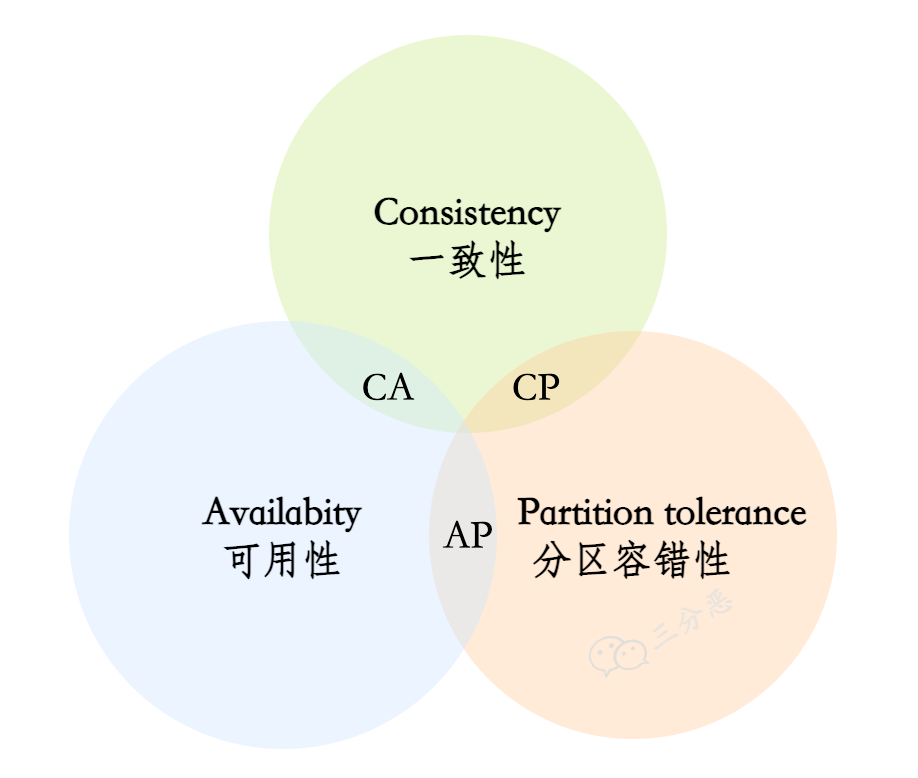

# 分布式八股

# 分布式理论
## 说说 CAP 原则？
**CAP原则**是分布式系统设计中的一个核心理论，指出在分布式系统中，**一致性（Consistency）**、**可用性（Availability）和分区容错性（Partition Tolerance）三者不可兼得**，最多只能同时满足其中两项。



**CAP 原则的三个属性**

1. **一致性（Consistency）**
    - **定义**：在**分布式系统**中，**一致性**指的是**所有节点**在**同一时间**对某一数据的访问结果是一致的。
    - **举例**：如果一个**用户**向**系统写入**了一条数据，那么其他用户**立即读取**到的结果必须**包含这条数据**。
2. **可用性（Availability）**
    - **定义**： 每个请求都会收到响应，不论请求是否成功。即使系统部分节点故障 仍然可以继续服务。  
    - **举例**：即使某些**节点**出现问题，系统仍然能够**处理请求**，并**返回结果**。
3. **分区容错性（Partition Tolerance）**
    - **定义**：系统能够**应对网络分区（节点间通信中断）**的发生，即当**节点之间**无法**正常通信**时，系统仍然能够**继续工作**。
    - **举例**：在**网络分裂**的情况下，不同**分区内**的系统节点仍需**独立运作**。

## 为什么 CAP 不可兼得呢？
+ **分布式系统的节点通过网络进行通信，而网络本身是不可靠的。网络分区**（即**节点之间无法通信**）是分布式系统中必须面对的现实问题。
+ **CAP 不可兼得**的根本原因就是因为**网络分区是无法避免的 **。在分区发生时：
    - **保持一致性**需要**暂时拒绝服务**，**牺牲可用性**。
    - **保持可用性**需要**允许数据不一致**，**牺牲一致性**。

---

**假设有一个分布式数据库，有两个节点 A 和 B：**

    - **场景 1：选择一致性（CP）**
        * **当网络分区发生时**，节点 A 和 B 无法通信。
        * **为了保证一致性**，系统会**拒绝写入请求**，直到分区恢复。
        * **结果**：系统不可用，但数据**保持一致**。
    - **场景 2：选择可用性（AP）**
        * **当网络分区发生时**，节点 A 和 B **继续独立处理请求**。
        * 节点 A 和 B 可能**返回不同的数据**，导致数据**不一致**。
        * **结果**：系统可用，但数据可能**不一致**。

## CAP 对应的模型和应用？
CAP 原则描述了分布式系统中一致性（Consistency）、可用性（Availability）和分区容错性（Partition Tolerance）之间的权衡。不同的系统会根据需求选择不同的 CAP 组合，从而形成不同的模型和应用。以下是 CAP 对应的模型和典型应用：

---

**1. CA 模型（一致性 + 可用性）**

+ **特点**：
    - 放弃分区容错性（P），假设网络不会发生分区。
    - 适合单点系统或网络非常稳定的环境。
+ **典型应用**：
    - 传统的关系型数据库（如 MySQL、PostgreSQL）在单机或主从架构下可以同时保证一致性和可用性，但在分布式环境中无法容忍网络分区。
    - 例如，MySQL 的主从复制架构在主节点正常时可以提供一致性和可用性，但如果主节点和从节点之间发生网络分区，系统可能会失效。

---

**2. CP 模型（一致性 + 分区容错性）**

+ **特点**：
    - 放弃可用性（A），在网络分区发生时，系统可能不可用。
    - 适合对一致性要求极高的场景。
+ **典型应用**：
    - **ZooKeeper**：用于分布式协调服务，保证强一致性，但在网络分区时可能拒绝服务。
    - **etcd**：用于 Kubernetes 等系统的键值存储，保证一致性，但在分区时可能不可用。
    - **HBase**：分布式数据库，保证强一致性，但在分区时可能停止写入。
    - **金融系统**：如银行交易系统，必须保证数据一致性，即使牺牲部分可用性。

---

**3. AP 模型（可用性 + 分区容错性）**

+ **特点**：
    - 放弃一致性（C），在网络分区发生时，系统可能返回不一致的数据。
    - 适合对可用性要求极高的场景。
+ **典型应用**：
    - **Cassandra**：分布式 NoSQL 数据库，优先保证可用性和分区容错性，允许数据最终一致。
    - **DynamoDB**：AWS 的键值存储，优先保证可用性，允许数据在分区期间不一致。
    - **Riak**：分布式键值存储，优先保证可用性，允许数据冲突。
    - **社交网络**：如 Facebook、Twitter，优先保证用户体验（可用性），允许数据短暂不一致。

---

**4. CAP 模型的灵活性和实际应用**

在实际应用中，许多系统并不是严格遵循某一种 CAP 模型，而是根据场景灵活调整。例如：

+ **最终一致性（Eventual Consistency）**：
    - 许多 AP 系统（如 Cassandra、DynamoDB）通过最终一致性来平衡一致性和可用性。
    - 系统在网络分区恢复后，通过异步同步使数据最终达到一致。
+ **混合模型**：
    - 一些系统在不同场景下动态调整 CAP 特性。例如，Redis Cluster 在网络分区时优先保证可用性，但可以通过配置调整为优先保证一致性。

---

**总结**

+ **CA 模型**：适合单点或网络稳定的环境，如传统关系型数据库。
+ **CP 模型**：适合对一致性要求高的场景，如分布式协调服务（ZooKeeper、etcd）。
+ **AP 模型**：适合对可用性要求高的场景，如分布式 NoSQL 数据库（Cassandra、DynamoDB）。
+ **实际应用**：许多系统通过最终一致性或动态调整来平衡 CAP 特性，以满足不同场景的需求。

## BASE 理论了解吗？
BASE 理论是对 CAP 原则的延伸和补充，主要用于指导分布式系统的设计，尤其是在需要高可用性和分区容错性的场景下。BASE 强调通过牺牲强一致性来获得更高的可用性和性能。以下是 BASE 理论的详细讲解：

---

**1. BASE 的含义**

BASE 是 **Basically Available（基本可用）**、**Soft state（软状态）** 和 **Eventually consistent（最终一致性）** 的缩写。它与 ACID（传统数据库的强一致性模型）形成对比，更适合大规模分布式系统。

+ **Basically Available（基本可用）**：
    - 系统在出现故障时， 允许部分功能降级，但仍然能提供核心服务。  
    - 例如，电商网站在高流量时可能会降级部分功能（如推荐系统），但核心功能（如下单、支付）仍然可用。
+ **Soft state（软状态）**：
    -  系统状态允许有短暂的不一致（软状态），但这种状态并不会影响整体系统的可用性。  
    - 例如， 分布式缓存中的数据可以和数据库稍有偏差，因为最终会同步更新。  
+ **Eventually consistent（最终一致性）**：
    -  系统数据的一致性不是实时的，在经过一段时间后，最终会达到一致状态。
    - 例如，分布式数据库在写入数据后，可能不会立即同步到所有节点，但最终所有节点会看到相同的数据。

---

**2. BASE 与 CAP 的关系**

+ BASE 理论是对 CAP 原则中 **AP 模型** 的进一步细化。
+ CAP 强调在网络分区发生时必须在一致性和可用性之间做出选择，而 BASE 则提供了一种实际的设计思路：**通过牺牲强一致性来保证可用性和分区容错性**。

---

**3. BASE 的核心思想**

+ **接受不一致性**：
    - 在分布式系统中，强一致性很难实现，且会降低系统的可用性和性能。
    - BASE 理论允许系统在短时间内处于不一致状态，但最终会达到一致。
+ **优先保证可用性**：
    - 系统设计时优先考虑用户体验，确保系统在高并发或故障时仍然可用。
+ **异步处理**：
    - 通过异步机制（如消息队列、异步复制）来实现数据的最终一致性。

---

**4. BASE 的应用场景**

BASE 理论广泛应用于需要高可用性和分区容错性的大规模分布式系统，例如：

+ **缓存系统**：
    - 如 Redis，允许数据在短时间内不一致，但最终会同步。
+ **社交网络**
    - 点赞、评论等操作不要求强一致性，但会通过异步机制最终一致。
+ **电商系统**：
    - 如订单系统、库存系统，允许短暂的数据不一致，但最终会修正。

---

**5. BASE 的优缺点**

+ **优点**：
    - 提高了系统的可用性和性能。
    - 更适合大规模分布式系统和高并发场景。
+ **缺点**：
    - 数据一致性较弱，可能不适合对一致性要求极高的场景（如金融交易）。
    - 需要额外的机制（如冲突解决、数据修复）来保证最终一致性。

---

**6. BASE 与 ACID 的对比**

| 特性 | ACID（传统数据库） | BASE（分布式系统） |
| --- | --- | --- |
| **一致性** | 强一致性 | 最终一致性 |
| **可用性** | 低（强一致性可能导致系统不可用） | 高（优先保证可用性） |
| **设计目标** | 数据绝对正确 | 高可用性和高性能 |
| **适用场景** | 金融、交易等对一致性要求高的场景 | 社交网络、电商等对可用性要求高的场景 |


---

**总结**

BASE 理论是分布式系统设计中的重要指导思想，它通过牺牲强一致性来换取高可用性和分区容错性。BASE 的核心思想是 **基本可用、软状态和最终一致性**，适用于大规模分布式系统和高并发场景。与 ACID 相比，BASE 更适合现代互联网应用的需求。

# 分布式锁
## 有哪些分布式锁的实现方案呢？
# 分布式事务
## 什么是分布式事务?
**分布式事务**<font style="color:rgb(31, 35, 41);">是指跨越</font>**多个独立系统**<font style="color:rgb(31, 35, 41);">、</font>**数据库**<font style="color:rgb(31, 35, 41);">或</font>**服务**<font style="color:rgb(31, 35, 41);">的事务，目的是确保所有涉及的操作</font>**要么全部成功（提交）**<font style="color:rgb(31, 35, 41);">，</font>**要么全部失败（回滚）**<font style="color:rgb(31, 35, 41);">，从而保持系统的</font>**数据一致性**<font style="color:rgb(31, 35, 41);">。</font>

---

**<font style="color:rgb(31, 35, 41);">分布式事务的关键属性</font>**

<font style="color:rgb(31, 35, 41);">分布式事务通常遵循 </font>**ACID**<font style="color:rgb(31, 35, 41);"> 特性：</font>

1. **原子性（Atomicity）**<font style="color:rgb(31, 35, 41);">：</font>
    - <font style="color:rgb(31, 35, 41);">事务中的所有操作要么全部完成，要么全部不完成。</font>
2. **一致性（Consistency）**<font style="color:rgb(31, 35, 41);">：</font>
    - <font style="color:rgb(31, 35, 41);">事务完成后，系统状态从一个一致状态转换为另一个一致状态。</font>
3. **隔离性（Isolation）**<font style="color:rgb(31, 35, 41);">：</font>
    - <font style="color:rgb(31, 35, 41);">并发事务之间互相隔离，不会影响彼此的执行。</font>
4. **持久性（Durability）**<font style="color:rgb(31, 35, 41);">：</font>
    - <font style="color:rgb(31, 35, 41);">一旦事务提交，数据的修改将永久保存在系统中，即使系统发生崩溃。</font>

---

**分布式事务的场景**

1. **跨多个数据库的事务**：
    - 例如，一个电商系统中，用户下单操作涉及订单数据库、库存数据库和支付数据库。
2. **跨微服务的事务**：
    - 微服务架构中，每个微服务可能有自己的数据库，事务需要跨多个服务协调完成。
3. **跨组织系统的事务**：
    - 如银行间转账，涉及多个银行的独立系统。

## 分布式事务有哪些常见的实现方案？
分布式事务的实现方案根据不同的业务场景和需求，有多种方法可以选择。以下是几种常见的分布式事务实现方案：

---

**1. 两阶段提交协议（2PC, Two-Phase Commit）**

**原理**

2PC 是一种强一致性协议，事务分为两个阶段：

1. **准备阶段（Prepare Phase）：**
    -  事务管理器向所有参与者发送“准备提交”请求，每个参与者执行事务操作但不提交，只记录预备状态。  
2. **提交阶段（Commit Phase）：**
    -  如果所有参与者都返回“准备完成”，事务管理器发送“提交”指令，参与者提交操作；否则，发送“回滚”指令进行回滚。

**优点**

+ 确保事务的强一致性。

**缺点**

+ **阻塞问题**： 参与者在等待事务管理器指令时会锁住资源。 
+ **单点问题**：事务管理器是单点，若其故障会导致事务状态不可知。
+ **性能开销大**：频繁的网络通信和锁定资源导致效率较低。

**应用场景**

+ 对强一致性要求极高的场景，例如银行转账、金融系统。

---

**2. 三阶段提交协议（3PC, Three-Phase Commit）**

**原理**

3PC 是 2PC 的改进版本，增加了 **预提交阶段**，以减少阻塞时间。

1. **第一阶段（CanCommit） 阶段**：
    - 事务管理器询问所有参与者是否能执行事务。
2. **第二阶段（PreCommit） 阶段**：
    - 如果所有参与者返回肯定答复，事务管理器发送预提交请求，各参与者预提交事务。
3. **第三阶段（DoCommit）阶段**：
    - 事务管理器发送最终提交或回滚指令。

**优点**

+ 减少了 2PC 的阻塞时间，提高了系统的可用性

**缺点**

+ 实现复杂，仍然存在数据不一致的风险。

**应用场景**

+ 对一致性要求较高且需要减少阻塞时间的场景。

---

**3. TCC 模型（Try-Confirm-Cancel）**

**原理**

TCC 是一种补偿型事务模型，将事务分为三个阶段：

1. **Try 阶段**：
    - 预留资源，检测操作的可执行性（如冻结库存、锁定金额）。
2. **Confirm 阶段**：
    - 确认执行操作，提交资源
3. **Cancel 阶段**：
    - 取消操作，释放资源。

**优点**

+ 灵活性高， 提供业务层面的事务控制。
+ 减少长时间锁定资源的情况。

**缺点**

+ 开发复杂度高，需要实现每个操作的三个阶段逻辑。
+ 需要考虑业务补偿机制的正确性。

**应用场景**

+ 电商下单流程：冻结库存（Try），确认扣减（Confirm），失败回滚（Cancel）。
+ 支付系统：冻结资金、确认扣款或取消。

---

**消息队列（MQ）事务消息**

**原理：**

    - 利用支持事务的消息队列（如 RocketMQ、Kafka）来实现分布式事务。
    - 生产者发送事务消息到消息队列，消息队列暂存消息但不投递。
    - 生产者执行本地事务并通知消息队列提交或回滚消息。
    - 如果本地事务成功，消息队列投递消息；否则，丢弃消息。

**优点：**

    - 高性能，适合高并发场景。
    - 消息队列提供可靠的消息投递机制。

**缺点：**

    - 依赖消息队列的实现，可能增加系统复杂性。

**应用场景：**

    - 异步消息处理（如订单、支付）。

---

**4. 本地消息表**

**核心原理**

通过引入本地消息表，将本地事务与分布式事务解耦：

1. 在本地事务中，将消息写入本地消息表，然后通过消息队列异步发送消息。
2. 消费者接收到消息后执行相应的业务操作。
3. 如果消息发送失败，可以通过定时任务重试。

**优点**

+ 可靠性高，消息存储在本地，避免丢失。
+ 实现简单，基于现有的数据库事务。

**缺点**

+ 消息表引入额外存储开销。
+ 数据一致性较弱，只能保证最终一致性。

**适用场景**

+ 微服务架构中的跨服务事务。
+ 异步消息处理（如订单创建后发送通知）。
+ 订单系统：订单创建和发送通知解耦。

---

**总结对比**

以下是对 **2PC、3PC、TCC、MQ事务消息、本地消息表** 的总结表格：

| **方案** | **原理** | **优点** | **缺点** | **应用场景** |
| --- | --- | --- | --- | --- |
| **2PC** | 分两阶段执行事务：准备（Prepare）阶段记录预提交，提交（Commit）阶段决定最终提交或回滚。 | 确保强一致性。 | 阻塞问题、单点问题、性能开销大。 | 银行转账、金融系统等对强一致性要求极高的场景。 |
| **3PC** | 在 2PC 基础上增加 PreCommit 阶段，减少阻塞时间，提升容错能力。 | 减少阻塞时间，提高系统可用性。 | 实现复杂，仍存在数据不一致风险。 | 高一致性需求但需要减少阻塞时间的场景。 |
| **TCC** | 事务分为 Try（预留资源）、Confirm（确认提交）、Cancel（取消操作）。 | 灵活性高，提供业务层面的事务控制；减少长时间锁定资源。 | 开发复杂度高，需要实现每个操作的三个阶段逻辑；需要设计补偿机制。 | 电商下单流程、支付系统等需要资源锁定和补偿机制的场景。 |
| **MQ事务消息** | 使用支持事务的消息队列：发送事务消息后暂存，通过本地事务决定消息是否提交（投递）或回滚（丢弃）。 | 高性能，适合高并发；消息队列提供可靠的消息投递机制。 | 依赖消息队列的实现，增加系统复杂性。 | 异步消息处理，如订单与支付的异步解耦。 |
| **本地消息表** | 将本地事务与消息表写入作为一个事务处理，异步通过消息队列发送消息，消费者处理后执行业务操作。 | 可靠性高，消息存储在本地；实现简单，基于现有数据库事务。 | 消息表引入额外存储开销；只能保证最终一致性，实时一致性较弱。 | 微服务间跨服务事务，如订单与通知解耦。 |


**如何选择？**

+ **一致性要求高（如金融场景）**：优先选择 **2PC** 或 **3PC**。
+ **需要高性能、最终一致性即可（如电商场景）**：选择 **TCC**、**MQ事务消息** 或 **本地消息表**。
+ **系统对可靠性要求高，且已有消息队列基础**：选择 **MQ事务消息**。
+ **系统对存储开销敏感且逻辑简单**：选择 **本地消息表**。

## 你们用什么？能说一下 Seata 吗？
Seata 是一款开源的分布式事务解决方案，广泛用于分布式系统中，以实现事务的一致性管理。它由阿里巴巴主导开发，支持多种事务模式，尤其适合微服务架构下的分布式事务管理。

---

### **Seata 的核心原理**
#### **整体架构**
Seata 包括三个核心组件：

1. **Transaction Coordinator（TC，事务协调器）：**
    - 负责全局事务的管理，例如全局事务的开始、提交、回滚等。
    - 通常以独立服务的形式部署。
2. **Transaction Manager（TM，事务管理器）：**
    - 在业务发起方负责发起全局事务，例如开启和提交全局事务。
3. **Resource Manager（RM，资源管理器）：**
    - 管理分支事务，处理实际资源（如数据库）的事务操作。
    - 与数据库或资源直接交互，并负责本地事务的提交和回滚。

#### **工作流程**
1. TM 发起全局事务，向 TC 注册。
2. 各服务中的 RM 执行分支事务，并向 TC 报告状态。
3. 如果所有分支事务执行成功，TC 通知所有 RM 提交事务；否则，回滚所有分支事务。

---

### **Seata 支持的事务模式**
1. **AT 模式（Automatic Transaction）**
    - 基于数据库的 Undo 和 Redo 日志自动管理分布式事务。
    - **原理：**
        * 在本地事务提交时，生成 Undo 日志以记录回滚信息。
        * 如果全局事务失败，Undo 日志用于还原数据。
    - **优点：**
        * 开发简单，几乎对业务无侵入。
    - **缺点：**
        * 依赖于关系型数据库，适合 ACID 模型。
    - **适用场景：**
        * 数据库层操作的分布式事务，例如订单和库存操作。
2. **TCC 模式（Try-Confirm-Cancel）**
    - 提供手动控制分布式事务的灵活性。
    - **原理：**
        * 开发者需实现 Try（预留资源）、Confirm（确认提交）、Cancel（取消操作）。
    - **优点：**
        * 性能高，适合高并发场景。
    - **缺点：**
        * 需要开发者手动实现业务逻辑，增加开发复杂度。
    - **适用场景：**
        * 电商下单流程、支付系统等需要资源预留和补偿的场景。
3. **SAGA 模式**
    - 适用于长事务，分解为多个子事务，每个子事务都有相应的补偿操作。
    - **原理：**
        * 通过分布式日志记录子事务状态，失败时依次调用补偿操作。
    - **优点：**
        * 灵活性高，适合长事务。
    - **缺点：**
        * 补偿逻辑复杂，可能出现一致性延迟。
    - **适用场景：**
        * 需要跨多个系统、耗时较长的分布式事务。
4. **XA 模式**
    - 基于标准的 XA 协议实现两阶段提交。
    - **优点：**
        * 强一致性。
    - **缺点：**
        * 性能较低，存在阻塞问题。
    - **适用场景：**
        * 关键场景，例如银行业务。

---

### **Seata 的优缺点**
#### **优点**
1. **多事务模式支持：** 根据业务需求灵活选择 AT、TCC、SAGA 或 XA 模式。
2. **高性能：** AT 模式通过 Undo 日志提高效率，减少资源锁定。
3. **易于集成：** 支持 Spring Cloud、Dubbo 等主流微服务框架。
4. **可扩展性：** 可通过集群部署 TC，支持高并发场景。

#### **缺点**
1. **AT 模式局限性：** 依赖于关系型数据库，不适用于非关系型数据库。
2. **TCC 和 SAGA 模式开发复杂度高：** 需要开发者手动实现补偿逻辑。
3. **TC 单点风险：** 如果 TC 故障，事务协调可能失败，但可通过集群部署解决。

---

### **Seata 的典型应用场景**
1. **电商系统：**
    - 订单创建、库存扣减和支付系统的事务一致性。
    - 例如：用户下单时锁定库存（AT 模式），订单成功后扣减库存；失败则释放库存。
2. **金融系统：**
    - 转账场景：A 银行扣款和 B 银行入账需保持一致性。
3. **物流系统：**
    - 包裹的分布式操作：创建物流单、更新状态、分配快递员。

---

### **Seata 与其他工具的对比**
| 工具 | **支持的模式** | **一致性** | **性能** | **复杂性** | **适用场景** |
| --- | --- | --- | --- | --- | --- |
| **Seata** | AT、TCC、SAGA、XA | 强一致性/最终一致 | 高 | 中等 | 电商、金融、物流等多种场景。 |
| **RocketMQ** | 事务消息 | 最终一致性 | 高 | 中等 | 异步事务处理，如订单与支付解耦。 |
| **ShardingSphere** | XA、BASE、TCC | 强一致性/最终一致 | 中 | 中高 | 分库分表事务，如跨数据库操作。 |
| **TCC-Transaction** | TCC | 可控一致性 | 高 | 高 | 电商、支付等需要资源预留的高并发场景。 |
| **Atomikos** | XA | 强一致性 | 低 | 中等 | 基于关系型数据库的分布式事务。 |


---

### **总结**
Seata 是分布式事务管理的强大工具，特别适合微服务架构中需要灵活选择事务模型的场景。  
对于电商系统，**AT 模式**易于实现，适合大多数场景；对复杂业务场景，如支付冻结和确认，**TCC 模式**是更好的选择。  
在选择 Seata 之前，应根据业务对性能、一致性和开发复杂度的需求进行权衡。

# 分布式一致性算法
## 分布式算法 Paxos 了解么？
 Paxos 是一种解决分布式系统中一致性问题的算法。它确保在存在故障的分布式系统中，多个节点能够就某个值达成一致。Paxos 广泛应用于分布式数据库、分布式存储系统等场景。  

---

**Paxos 的核心思想**

Paxos 的核心思想是通过选举和确认过程， 确保系统中大多数节点对某个值达成一致。它有以下几个关键角色：

1. **Proposer（提议者）**：提议一个值，试图使多数节点接受这个值。
2. **Acceptor（接受者）**：根据规则决定是否接受或拒绝提案的节点。
3. **Learner（学习者）**： 学习最终确定的值的节点。  

此外，还可能引入一个 **Leader（领导者）** 角色，它负责协调提议流程，以减少冲突。

---

**Paxos 的操作流程**

Paxos 算法分为两个主要阶段：**Prepare 阶段** 和 **Accept 阶段**。

**1. Prepare 阶段**

Proposer 发起一个提议：

+ Proposer 选择一个唯一的提议编号（Proposal ID），并向所有 Acceptors 发送 `Prepare` 消息，附带该提议编号。
+ 每个 Acceptor 在收到 `Prepare` 消息后：
    - 如果该提议编号大于其之前响应过的所有提议编号，则承诺不再响应编号低于该提议的任何请求（这称为 "承诺" 或 "Promised"），并将上一次已经接受的提议（如果有）以及该提议的值返回给 Proposer。
    - 如果提议编号低于其之前承诺的编号，则直接拒绝。

**2. Accept 阶段**

+ Proposer 收集到多数（超过半数）Acceptors 的承诺后，可以进入 Accept 阶段。
+ 在 Accept 阶段：
    - Proposer 根据 `Prepare` 阶段返回的值，选择一个要提交的值。如果返回了某些值，Proposer 必须选择编号最高的提议的值；否则，可以选择自己原本的提议值。
    - Proposer 向 Acceptors 发送 `Accept` 请求，附带提议编号和选定的值。
+ 每个 Acceptor 收到 `Accept` 请求后：
    - 如果提议编号不低于其之前承诺的编号，则接受该值并记录提议编号和值。
    - 否则，拒绝该请求。

---

**达成一致性**

+ 如果某个值被多数（超过半数）Acceptors 接受，则视为该值被选定。
+ Learners 会从 Acceptors 中学习到最终选定的值。

---

**Paxos 的关键特性**

1. **安全性**（Safety）：
    - Paxos 保证不会有两个不同的值被多数节点接受。
    - 即使网络分区或节点故障，仍能保持一致性。
2. **活性**（Liveness）：
    - 在没有故障或冲突的情况下，Paxos 能够最终达成一致。
    - 但是，由于存在冲突（例如多个 Proposers 竞争），活性可能会受到影响，需要通过 Leader 优化。

---

**Paxos 的改进**

Paxos 原始版本存在实现复杂和效率低的问题，因此实际系统中通常使用优化版本，比如：

1. **Multi-Paxos**：
    - 通过选定一个稳定的 Leader，减少 Prepare 阶段的开销。
    - Leader 可以直接跳过 Prepare 阶段并快速提出新的提议。
2. **Fast Paxos**：
    - 减少消息传递的轮次，但对网络可靠性要求更高。
3. **Raft 和 Zab**：
    - 提供了更易理解和实现的 Paxos 替代方案，用于分布式一致性场景（如 Raft 用于 etcd 和 Consul，Zab 用于 ZooKeeper）。

---

**优缺点**

**优点：**

+ 保证强一致性。
+ 容忍少量节点故障（如不超过半数的故障）。

**缺点：**

+ 实现复杂，尤其是涉及到网络中断、延迟和消息丢失的处理。
+ 提议冲突可能导致性能下降。
+ 在高吞吐场景下，消息交互较多。

---

**应用场景**

Paxos 常用于分布式系统中的一致性场景，如：

+ 分布式数据库（如 Google Spanner）。
+ 分布式锁服务。
+ 分布式配置管理（如 Chubby）。

Paxos 是分布式系统中一致性协议的奠基石，但在实际工程中，通常会选择更易用的优化版本（如 Raft 或 Multi-Paxos）。


**总结对比**

| 协议 | 一致性类型 | 优点 | 缺点 | 应用场景 |
| --- | --- | --- | --- | --- |
| **Paxos** | 强一致性 | 理论完备，适合小规模分布式共识场景 | 实现复杂，性能受限 | 数据库元数据管理 |
| **Raft** | 强一致性 | 易实现，性能较高，适合工程化 | Leader 故障恢复时短暂不可用 | 分布式日志复制（etcd, Consul） |
| **Gossip** | 最终一致性 | 高扩展性，高容错，适合大规模分布式系统 | 无法保证实时一致性 | 服务发现、大规模数据库 |


## 说说 Raft 算法？
 Raft 是一种分布式一致性算法，用于在分布式系统中实现数据的一致性和容错性 。它的设计目标是易于理解和实现，同时具备强一致性和高可用性。Raft 通过将问题分解为领导选举、日志复制和安全性三个子问题来实现共识。

**1. 基本概念**

Raft 将系统中的节点分为三种角色：

+ **Leader（领导者）**：负责处理客户端请求、管理日志复制， 发送心跳信号以保持领导地位  。
+ **Follower（跟随者）**：被动接收来自 Leader 的日志条目和心跳信号。
+ **Candidate（候选者）**：在选举过程中竞争成为 Leader。

**2. 领导选举（Election）**

Raft 使用心跳机制来触发选举：

+ **心跳超时**：Follower 在超时时间内未收到 Leader 的心跳信号，会转变为 Candidate 并发起选举。
+ **选举过程**：
    - Candidate 增加自己的任期号（term）并向其他节点发送投票请求。
    -  其他节点在收到投票请求后，如果该候选人的日志至少和自己的一样新，并且还没有在当前任期内投过票，就会投票给该候选人。  。
    - 如果 Candidate 获得大多数票，则成为 Leader。
+ **防止分裂投票**：Raft 使用随机超时时间来减少多个 Candidate 同时竞争的情况。

**3. 日志复制（Log Replication）**

**日志复制过程说明**

    1. **领导者接收客户端的请求**，并将操作追加到自己的日志中。
    2. **领导者定期向其他节点发送日志复制消息**，其中包含新的日志条目。
    3. **日志条目结构**： 每个日志条目包含 `term`（任期）、`index`（索引）、`command`（命令）。  
    4. **跟随者在收到日志复制消息后**：
        * 将日志条目追加到自己的日志中。
        * 向领导者发送确认消息。
    5. **日志提交**：
        * 当领导者收到**大多数节点的确认消息**后： 
            + 将该日志条目提交给状态机。

> 状态机是分布式系统中用于按顺序执行日志命令并保证所有节点最终状态一致的确定性组件。
>

            + **通知其他节点**该日志条目已经提交。

**4. 安全性**

Raft 通过以下机制确保安全性：

+ **选举限制**：只有拥有最新日志的节点才能成为 Leader。
+ **日志匹配**：Leader 和 Follower 的日志必须保持一致。
+ **任期检查**：节点只接受更高任期号的请求，防止旧 Leader 继续操作。

**5. 容错与恢复**

Raft 能够容忍节点故障：

+ **Leader 故障**：Follower 会因心跳超时而发起选举，选出新 Leader。
+ **Follower 故障**：Leader 会不断重试日志复制，直到 Follower 恢复。
+ **网络分区**：Raft 通过多数派机制确保在网络分区情况下仍能正常工作。

**6. 应用场景**

Raft 广泛应用于分布式系统中，如：

+ **分布式数据库**：如 etcd、CockroachDB。
+ **分布式存储系统**：如 TiKV。
+ **分布式配置管理**：如 Consul。

**总结**

Raft 通过清晰的角色划分和简单的机制，实现了分布式系统中的共识问题。其设计易于理解和实现，同时具备强一致性和高可用性，适用于多种分布式应用场景。

## 讲一下Gossip算法
**Gossip 算法是一种分布式系统中用于信息传播和状态同步的协议，灵感来源于人类社会中的谣言传播方式。它通过随机选择节点进行信息交换，逐步将信息传播到整个系统，具有高容错性、可扩展性和去中心化的特点。**

---

**1. 核心思想**

Gossip 算法的核心思想是：

+ 每个节点周期性地随机选择其他节点（称为“对等节点”或“邻居节点”）交换信息。
+ 信息通过多次传播逐渐覆盖整个系统，类似于谣言在人群中的传播。

---

**2. 工作流程**

Gossip 算法的工作流程通常包括以下步骤：

1. **信息初始化**：某个节点生成或接收到新信息。
2. **信息传播**：
    - 节点周期性地随机选择若干邻居节点，将信息发送给它们。
    - 接收到信息的节点会继续将信息传播给其他随机选择的节点。
3. **信息收敛**：经过多次传播，信息最终会覆盖整个系统。

---

**3. 传播模式**

Gossip 算法有两种主要的传播模式：

1. **反熵模式（Anti-Entropy）**：
    - 节点定期交换全部或部分状态信息，以确保最终一致性。
    - 适用于数据同步和状态一致性维护。
2. **谣言传播模式（Rumor Mongering）**：
    - 节点仅在接收到新信息时传播，类似于谣言的扩散。
    - 适用于事件通知或新数据的快速传播。

---

**4. 优点**

**Gossip算法的特性**

1. **去中心化**  
Gossip算法没有中心节点，每个节点以对等的方式参与通信，增强了系统的容错性。
2. **高鲁棒性**  
即使部分节点失效，信息仍然能够传播到网络中的其他节点。
3. **渐进一致性**  
Gossip是最终一致性算法，信息不会瞬间传播到所有节点，但随着时间推移，所有节点将逐渐达成一致。
4. **随机性**  
通过随机选择通信伙伴，算法避免了网络中的热点问题，具有较好的负载均衡。

---

**5. 缺点**

+ **延迟较高**：信息传播需要一定时间，不适合实时性要求高的场景。
+ **冗余通信**：节点可能多次接收到相同的信息，导致网络带宽浪费。

---

**6. 应用场景**

Gossip 算法广泛应用于分布式系统中，例如：

+ **分布式数据库**
    - **Cassandra** 和 **DynamoDB** 使用 Gossip 来实现节点状态传播和副本同步。
+ **集群管理**
    - Kubernetes 使用 Gossip 协议监控节点状态。
    - Serf、Consul 等工具通过 Gossip 协议实现服务发现和节点健康检查。
+ **内容分发网络（CDN）**
    - Gossip协议用于快速分发文件和缓存更新信息。
+ **区块链**
    - Gossip用于传播交易和区块信息，例如比特币和以太坊中的区块同步。

---

**7. 例子**

假设在一个分布式系统中，节点 A 发现了一个新数据：

1. 节点 A 随机选择节点 B 和 C，将数据发送给它们。
2. 节点 B 和 C 接收到数据后，分别随机选择其他节点（如 D、E、F）继续传播。
3. 经过多次传播，数据最终覆盖整个系统。

---

**总结**

Gossip 算法是一种简单而强大的分布式信息传播协议，通过随机选择和逐步传播的方式实现高容错性和可扩展性。尽管存在延迟和冗余通信的问题，但其去中心化和最终一致性的特性使其成为分布式系统中不可或缺的工具。

# 分布式设计
## 说说什么是幂等性？
幂等性是指多次执行相同的操作所产生的结果与执行一次该操作的结果相同，**不会对系统产生额外的副作用**。

## 怎么保证接口幂等性？
保证接口幂等性是分布式系统设计中的重要任务，特别是在面对网络不可靠和重复请求的情况下。以下是常见的实现方法和策略：

1. **唯一标识符**：为每个请求生成唯一 ID，服务端记录处理状态，重复请求直接返回结果。
2. **分布式锁机制**：使用分布式锁保证同一资源的并发操作互斥执行。
3. **消息队列去重**：通过消息唯一 ID 实现消费者去重处理。  
4. **乐观锁**：通过版本号或时间戳校验，避免重复更新或冲突操作。
5. **状态校验**：在操作前检查资源状态，仅当状态不满足时执行操作。
6. **自然幂等性**：设计操作本身为幂等，例如覆盖更新或查询操作。
7. **幂等表**：维护已处理请求的记录，重复请求直接返回缓存结果。
8. **超时与重试**：设置请求有效期，超期或重复请求确保产生相同结果。
9. **数据库约束**：利用唯一索引、事务或条件更新直接确保幂等性。

---

**1. 通过唯一标识符**

**原理：**

为每个请求生成一个唯一的标识符（例如 `requestId`、`transactionId`），服务端用该标识符来检查请求是否已经被处理。

**实现步骤：**

1. 客户端为每个请求生成唯一的 ID。
2. 服务端接收到请求时，检查该 ID 是否已经存在于请求记录表中。
    - 如果存在，直接返回之前的响应结果。
    - 如果不存在，处理请求并保存请求 ID 和响应结果。

**适用场景：**

+ 支付系统：每笔支付请求用唯一订单号标识，避免重复扣款。
+ 分布式系统的重试机制。

---

**2. 状态校验**

**原理：**

在执行操作前，检查资源的当前状态，确保操作只会在需要时执行。

**实现步骤：**

1. 客户端发送请求时附带当前的资源状态。
2. 服务端判断资源是否已经满足请求目标状态：
    - 如果已经满足，则返回成功。
    - 如果未满足，则执行操作并更新状态。

**适用场景：**

+ 更新状态：如重复提交订单时，只在订单未完成时处理请求。
+ 删除操作：如删除已存在的资源时直接返回成功。

---

**3. 乐观锁**

**原理：**

通过资源的版本号或时间戳进行校验，避免重复更新。

**实现步骤：**

1. 数据表中添加 `version` 或 `lastModified` 字段。
2. 更新时附带资源的当前版本号或时间戳。
3. 服务端检查：
    - 如果版本号匹配，执行更新，并增加版本号。
    - 如果不匹配，拒绝操作，提示客户端重新获取资源。

**适用场景：**

+ 更新操作：如修改用户信息，防止重复修改或冲突。

---

**4. 自然幂等性**

**原理：**

设计操作本身为幂等的，即多次执行对系统的影响与执行一次相同。

**实现方法：**

+ **覆盖型操作**：直接将资源设置为目标状态，而不是增量修改。
    - 例如：`PUT /user/123` 将用户状态设置为“激活”，无论请求被执行多少次，结果都是一致的。
+ **无副作用的查询**：如 `GET` 请求天然幂等。

**适用场景：**

+ 读取操作：如查询资源状态。
+ 定值更新操作：如设置用户权限。

---

**5. 请求去重机制（幂等表）**

**原理：**

维护一个幂等表记录已处理的请求，防止重复执行。

**实现步骤：**

1. 请求中附带一个唯一标识符（如订单号、事务 ID）。
2. 服务端处理请求时，将请求的标识符和结果记录到幂等表中。
3. 如果幂等表中已存在该标识符，直接返回对应的结果，而不重复处理。

**适用场景：**

+ 支付系统：记录每个订单号的状态，防止重复扣款。
+ 消息队列：记录消费过的消息 ID，避免重复处理。

---

**6. 幂等控制机制（锁机制）**

**原理：**

通过分布式锁保证操作的原子性，从而避免并发导致的不一致。

**实现步骤：**

1. 客户端在执行操作前，尝试获取一个分布式锁。
2. 如果锁已存在，说明其他请求正在处理，当前请求等待或终止。
3. 如果成功获取锁，执行操作并释放锁。

**适用场景：**

+ 防止并发修改：如多个用户同时修改同一订单状态。
+ 消费消息：防止同一消息被多个消费者并发消费。

---

**7. 超时和重试机制**

**原理：**

通过为操作设置有效期和重试机制，确保重复请求在有效期内产生一致结果。

**实现步骤：**

1. 客户端对请求设置重试机制，确保失败的请求可以重试。
2. 服务端记录请求的处理时间，并对相同请求进行有效期检查。

**适用场景：**

+ 异步处理：如定时任务执行时需要容忍网络抖动。

---

**8. 幂等性保证的数据库支持**

在某些场景下，可以通过数据库的约束条件或特性直接实现幂等性：

+ **唯一索引**：如用户注册时确保邮箱地址的唯一性。
+ **事务机制**：通过数据库事务的原子性确保操作不会部分完成。
+ **条件更新**：`UPDATE ... WHERE 条件` 确保仅在特定状态下更新。

---

**综合示例：支付接口**

+ 请求字段：
    - `orderId`：订单号（唯一标识符）
    - `amount`：支付金额
+ 实现方式：
1. 接收到支付请求时，检查 `orderId` 是否已存在于支付表中。
2. 如果存在：
    - 返回对应的支付状态（成功或失败）。
3. 如果不存在：
    - 创建支付记录，执行扣款操作。
    - 将 `orderId` 和支付结果记录到支付表中。

---

**选择适合的幂等性实现方式**

+ 对于 **查询类操作**：依赖其自然幂等性，无需额外处理。
+ 对于 **更新类操作**：通过唯一标识符或状态校验确保幂等。
+ 对于 **高并发和分布式场景**：结合分布式锁、幂等表和事务机制。

通过合理设计和实现，幂等性可以有效提高系统的健壮性和用户体验。

# 分布式策略
## 仔细讲一下负载均衡
**一、负载均衡的概念**

负载均衡是一种将请求或任务分配到多个计算资源（如服务器、服务实例、数据库等）的技术，目的是避免单个资源过载，同时提高系统的整体处理能力和可靠性。

+ **核心目标**：
    - **提高性能**：通过分散请求，减少单个节点的压力。
    - **提高可用性**：当某个节点故障时，负载均衡可以将请求转发到其他健康的节点。
    - **提高可扩展性**：通过增加节点数量，系统可以处理更多的请求。

---

**二、负载均衡的作用**

1. **请求分发**：
    - 将客户端请求均匀地分发到多个服务器或服务实例上。
2. **故障转移**：
    - 当某个服务器或服务实例不可用时，自动将请求转发到其他健康的节点。
3. **动态扩展**：
    - 支持动态添加或移除节点，适应流量变化。
4. **优化资源利用率**：
    - 避免某些节点过载，而其他节点闲置。

---

**三、负载均衡的分类**

负载均衡可以从多个维度进行分类：

**1. 按层级划分：**

+ **网络层负载均衡（L4）**：4 层负载均衡
    - 基于IP地址和端口进行流量分发。
    - 例如：TCP/UDP负载均衡。
    - 工具：LVS、F5、HAProxy（TCP模式）。
+ **应用层负载均衡（L7）**：
    - 基于HTTP/HTTPS等应用层协议进行流量分发。
    - 可以根据URL、Cookie、Header等信息进行更细粒度的分发。
    - 工具：Nginx、HAProxy（HTTP模式）、Envoy。

**2. 按实现方式划分：**

+ **硬件负载均衡**：
    - 使用专用硬件设备（如F5、Citrix ADC）实现负载均衡。
    - 性能高，但成本较高。
+ **软件负载均衡**：
    - 通过软件实现负载均衡（如Nginx、HAProxy、Envoy）。
    - 灵活且成本低，适合大多数场景。

**3. 按部署位置划分：**

+ **客户端负载均衡**：
    - 负载均衡逻辑由客户端实现。
    - 例如：Spring Cloud中的Ribbon。
+ **服务端负载均衡**：
    - 负载均衡逻辑由独立的负载均衡器实现。
    - 例如：Nginx、HAProxy。

负载均衡算法是决定将请求分发到哪台服务器的关键逻辑。不同的算法适用于不同场景，以下是主流负载均衡算法的详细讲解：

---

**1. 轮询（Round Robin）**

**原理：**

+ 按顺序将请求分配给后端服务器。
+ 每个服务器依次处理一个请求，循环往复。

**优点：**

+ 简单易实现。
+ 适合所有服务器性能相近的场景。

**缺点：**

+ 不考虑服务器的负载差异。
+ 可能导致性能高的服务器无法充分利用。

---

**2. 加权轮询（Weighted Round Robin）**

**原理：**

+ 给每台服务器分配一个权重，权重越高，分配的请求越多。
+ 在轮询的基础上考虑了服务器性能的差异。

**适用场景：**

+ 服务器性能不均衡（如一台服务器的 CPU 或内存更强）。

**举例：**

假设有两台服务器：

+ 服务器 A 权重为 2。
+ 服务器 B 权重为 1。  
请求会按照 **AAB** 的顺序分发。

---

**3. 随机（Random）**

**原理：**

+ 每次随机选择一台服务器处理请求。

**优点：**

+ 简单且分配比较均匀（在大量请求下）。
+ 适合短连接或负载差异不大的场景。

**缺点：**

+ 不考虑服务器当前的负载情况。
+ 在小规模请求下可能出现不均匀分配。

---

**4. 加权随机（Weighted Random）**

**原理：**

+ 在随机算法基础上引入权重。
+ 权重高的服务器被选中的概率更大。

**优点：**

+ 综合考虑了性能和随机性。
+ 适合服务器性能不均且负载不稳定的场景。

---

**5. 最少连接数（Least Connections）**

**原理：**

+ 将请求分配给当前连接数最少的服务器。
+ 动态平衡流量，适合长连接场景。

**优点：**

+ 考虑了当前服务器的负载。
+ 能较好处理请求量动态变化。

**缺点：**

+ 需要额外维护每台服务器的连接状态。
+ 对短连接（如 HTTP 请求）效果不明显。

---

**6. 加权最少连接数（Weighted Least Connections）**

**原理：**

+ 在最少连接数算法的基础上增加权重。
+ 权重高的服务器，即使连接数较多，也可能优先分配。

**适用场景：**

+ 长连接、服务器性能差异大的环境。

---

**7. 哈希（Hash）**

**原理：**

+ 根据客户端 IP 地址、请求 URL 或其他信息计算哈希值，将请求分配到固定服务器。

**优点：**

+ 实现请求的会话保持（Sticky Session）。
+ 同一用户的请求总是落在同一服务器上。

**缺点：**

+ 当某台服务器下线时，可能导致流量大范围重新分配。
+ 不适合动态扩展或缩减服务器的场景。

**常见方式：**

1. **IP 哈希**：基于客户端 IP 地址。
2. **URL 哈希**：基于请求的 URL。

---

**8. 一致性哈希（Consistent Hashing）**

**原理：**

+ 将服务器和请求映射到一个环形哈希空间。
+ 请求的哈希值与服务器的哈希值比较，分配到最近的服务器。

**优点：**

+ 减少服务器上下线时的流量重分配（仅影响附近节点）。
+ 适合分布式缓存（如 Redis）或高一致性要求的场景。

**缺点：**

+ 实现复杂度高。
+ 对少量服务器时效果不明显。

---

**9. 响应时间优先（Fastest Response Time）**

**原理：**

+ 选择响应时间最快的服务器。
+ 通常通过健康检查或 RTT（Round Trip Time）测量响应时间。

**优点：**

+ 动态分配，能有效提高系统响应速度。
+ 适合实时性要求高的场景。

**缺点：**

+ 需要定期监控服务器的响应时间，增加额外开销。

---

**10. 最小资源利用率（Least Load/Resource Utilization）**

**原理：**

+ 根据服务器当前的 CPU、内存、I/O 等资源占用率分配请求。

**优点：**

+ 精确平衡负载，避免资源过载。
+ 适合复杂应用或多任务场景。

**缺点：**

+ 需要实时监控服务器的资源利用率。
+ 实现和维护成本较高。

---

**11. 混合算法（Hybrid Algorithms）**

**原理：**

+ 综合多个算法，比如轮询+最少连接数+加权。

**优点：**

+ 根据场景灵活调整。
+ 适合复杂的生产环境。

## 仔细讲一下限流
<details class="lake-collapse"><summary id="u06133b6d"></summary><p id="u33b5ca07" class="ne-p"><span class="ne-text">好的，这里是前四个限流算法的精简版：</span></p><h3 id="0c919436"><span class="ne-text">1. </span><strong><span class="ne-text">令牌桶算法（Token Bucket）</span></strong></h3><ul class="ne-ul"><li id="u3d81f253" data-lake-index-type="0"><strong><span class="ne-text">原理</span></strong><span class="ne-text">：令牌桶中存放令牌，请求需要消耗一个令牌才能执行。令牌以固定速率生成，桶有容量限制。</span></li><li id="u173a8e7d" data-lake-index-type="0"><strong><span class="ne-text">特点</span></strong><span class="ne-text">：支持突发流量，只要桶中有足够令牌就能快速处理。</span></li></ul><h3 id="e63afb73"><span class="ne-text">2. </span><strong><span class="ne-text">漏桶算法（Leaky Bucket）</span></strong></h3><ul class="ne-ul"><li id="u7397bf05" data-lake-index-type="0"><strong><span class="ne-text">原理</span></strong><span class="ne-text">：请求进入漏桶，桶以固定速率流出。如果桶满，拒绝新的请求。</span></li><li id="u24dd68af" data-lake-index-type="0"><strong><span class="ne-text">特点</span></strong><span class="ne-text">：平滑输出流量，限制请求速率。但是不支持突发流量。</span></li></ul><h3 id="91e1febc"><span class="ne-text">4. </span><strong><span class="ne-text">滑动窗口算法（Sliding Window Log）</span></strong></h3><ul class="ne-ul"><li id="ub99f394b" data-lake-index-type="0"><strong><span class="ne-text">原理</span></strong><span class="ne-text">：记录每个请求的时间戳，窗口滑动时统计请求数。如果超出限制，拒绝请求。</span></li><li id="u43ec8c8d" data-lake-index-type="0"><strong><span class="ne-text">特点</span></strong><span class="ne-text">：平滑流量，避免窗口边界效应。但是高并发场景下计算开销较大。</span></li></ul></details>
**一、限流的概念**

限流是指通过某种策略限制单位时间内系统的请求数量或资源使用量，确保系统在可承受的范围内运行。限流通常用于以下场景：

+ 防止突发流量导致系统崩溃。
+ 保护后端服务不被过度使用。
+ 公平分配资源，避免某些用户或客户端占用过多资源。

---

**二、限流的作用**

1. **保护系统稳定性**：
    - 防止系统因流量过大而崩溃。
2. **防止资源耗尽**：
    - 避免CPU、内存、数据库连接等资源被耗尽。
3. **保证服务质量**：
    - 确保系统在高负载下仍能正常提供服务。
4. **防止滥用**：
    - 限制某些用户或客户端的请求频率，防止恶意攻击或滥用。

常见的限流算法是设计系统限流的重要基础，它们各有适用场景和实现方式。以下是常见的限流算法的详细讲解：

---

**1. 固定窗口（Fixed Window）**

**原理：**

+ 将时间划分为固定的窗口（如 1 秒或 1 分钟）。
+ 在每个窗口内，允许的请求数不超过设定的阈值。

**实现方式：**

+ 使用计数器记录当前窗口内的请求数量。
+ 如果计数器超过阈值，拒绝后续请求。

**优点：**

+ 简单易实现。
+ 适合大部分基础限流场景。

**缺点：**

+ 存在**临界点突发问题**：
    - 在窗口切换时，前后两个窗口可能同时允许最大请求数，导致短时间内请求激增。

**示例：**

假设每秒限制最多 10 个请求：

+ 时间窗口：`12:00:00 - 12:00:01`，处理了 10 个请求。
+ 窗口切换到 `12:00:01 - 12:00:02` 时，瞬间又允许 10 个请求。

---

**2. 滑动窗口（Sliding Window）**

**原理：**

+ 将时间窗口细化为多个小窗口，统计当前时间段内的请求总量。
+ 保证限流计算更加平滑，避免固定窗口的突发流量问题。

**实现方式：**

+ 记录每个小窗口的请求数。
+ 在当前时间段内，将所有小窗口的请求数相加。
+ 如果超过阈值，拒绝新请求。

**优点：**

+ 解决了固定窗口的突发流量问题。
+ 流量分布更加均匀。

**缺点：**

+ 实现复杂度较高。
+ 需要额外的存储来维护每个小窗口的请求记录。

**示例：**

限制每分钟最多 60 个请求：

+ 时间被划分为每 10 秒一个小窗口。
+ 在任意时刻，统计过去 60 秒的所有小窗口请求总数。

---

**3. 漏桶算法（Leaky Bucket Algorithm）**

**原理：**

+ 请求被放入一个漏桶，漏桶以固定速率“漏水”（处理请求）。
+ 如果桶满，则丢弃请求。

**实现方式：**

+ 一个队列存储请求，按照固定速率处理。
+ 如果队列满了，拒绝新请求。

**优点：**

+ 控制请求的处理速率，非常平稳。
+ 避免了流量突发问题。

**缺点：**

+ 无法处理流量突发，即使短时间内容量充足，也会限制速率。

**示例：**

+ 漏桶以每秒 5 个请求的速率处理：
    - 如果 1 秒内来了 10 个请求，只有前 5 个被处理，后 5 个会被丢弃。

---

**4. 令牌桶算法（Token Bucket Algorithm）**

**原理：**

+ 系统以固定速率向桶中添加令牌。
+ 每次请求需要消耗一个令牌，如果桶中没有令牌，请求会被拒绝或排队。

**实现方式：**

+ 一个桶存储令牌，桶容量为上限。
+ 每秒按照设定速率生成令牌，超过容量则丢弃多余的令牌。
+ 请求到来时消耗令牌，令牌不足时拒绝请求。

**优点：**

+ 支持流量突发（如果桶中有足够的令牌）。
+ 灵活性更高，兼顾突发流量和整体速率控制。

**缺点：**

+ 实现复杂度高于漏桶算法。

**示例：**

+ 桶容量为 10 个令牌，每秒生成 1 个令牌：
    - 如果短时间内有 10 个突发请求，只要令牌充足，都可以处理。

---

**5. 请求队列（Queue-Based Throttling）**

**原理：**

+ 将请求放入一个队列，按照服务能力逐一处理。
+ 如果队列长度超出限制，拒绝新请求。

**实现方式：**

+ 使用一个固定长度的队列存储请求。
+ 服务端从队列中取请求并处理。

**优点：**

+ 确保请求按顺序处理。
+ 不会直接丢弃请求，适合需要排队的场景。

**缺点：**

+ 延迟较高，队列过长可能导致用户体验下降。

**示例：**

+ 队列长度为 100，服务处理速率为每秒 10 个请求：
    - 如果队列满了，新请求会被拒绝。

---

**6. 一致性哈希（Consistent Hashing）**

**原理：**

+ 针对特定用户或请求属性（如 IP 地址）生成哈希值，将请求映射到固定的服务器或资源。
+ 通过哈希值分布实现限流。

**优点：**

+ 适合分布式限流场景。
+ 实现用户级别的精确限流。

**缺点：**

+ 不支持动态调整，服务节点的变化会影响哈希分布。

**示例：**

+ 用户的请求按 IP 哈希：
    - 每个 IP 的请求数不超过 10 个。

---

**7. 分布式限流**

**原理：**

+ 在分布式系统中，通过全局共享计数器或令牌桶实现跨节点限流。

**实现方式：**

+ 使用 Redis、Etcd 等共享存储。
+ 每个节点在请求到来时更新全局计数器。

**优点：**

+ 在多节点下保证全局限流。
+ 实现复杂的分布式限流逻辑。

**缺点：**

+ 网络延迟可能影响性能。
+ 需要处理分布式一致性问题。

---

**限流算法对比**

| 算法 | 控制精度 | 突发流量支持 | 实现难度 | 场景适用性 |
| --- | --- | --- | --- | --- |
| 固定窗口 | 中 | 差 | 低 | 简单基础场景 |
| 滑动窗口 | 高 | 一般 | 中 | 高精度限流需求 |
| 漏桶算法 | 高 | 差 | 中 | 严格控制速率 |
| 令牌桶算法 | 高 | 好 | 中 | 支持突发流量的场景 |
| 请求队列 | 中 | 好 | 中 | 排队式流量控制场景 |
| 一致性哈希 | 中 | 好 | 中 | 分布式精确限流 |
| 分布式限流 | 高 | 好 | 高 | 微服务、多节点全局限流 |


---

**实际应用场景示例**

1. **API 网关限流**
    - 每个用户每分钟最多调用 100 次 API。
    - 推荐算法：固定窗口、令牌桶。
2. **微服务间调用**
    - 限制服务调用数据库的 QPS（如每秒 50 次）。
    - 推荐算法：漏桶、令牌桶。
3. **防止恶意请求**
    - 单个 IP 每秒最多允许 5 次请求。
    - 推荐算法：IP 哈希 + 固定窗口。
4. **秒杀/抢购系统**
    - 限制秒杀接口的流量，每秒最多允许 100 个请求。
    - 推荐算法：令牌桶、请求队列。

如果需要具体算法的代码实现或工具配置示例，可以随时告诉我！

## 仔细讲一下降级
**降级（Degradation）**

降级是分布式系统中一种重要的保护机制，用于在系统面临高流量、部分服务不可用或资源受限时，主动关闭某些非核心功能或服务，以保障核心功能的可用性，从而提升整体的稳定性和用户体验。

---

**1. 为什么需要降级？**

在复杂的分布式系统中，任何一个模块或服务的失败都有可能导致全局性问题（如雪崩效应）。降级的主要作用包括：

+ **保护核心业务**：在系统压力过大时，优先保证核心功能正常运行。
+ **缓解服务压力**：关闭非必要功能，释放资源。
+ **增强系统弹性**：让系统在高负载或故障时退而求其次，提供“次优”服务。
+ **提升用户体验**：即使部分功能无法使用，尽量保证用户能够完成主要操作。

---

**2. 降级的触发场景**

**1. 服务过载**

+ 当请求量超过系统的承载能力，可能导致系统响应变慢甚至崩溃。
+ 解决方法：关闭耗费资源较多的功能，集中资源处理核心业务。

**2. 服务不可用**

+ 下游服务（如数据库、微服务等）发生故障，导致依赖服务无法正常工作。
+ 解决方法：提供降级后的静态内容或缓存数据。

**3. 外部依赖故障**

+ 系统依赖的第三方服务（如支付网关、CDN）出现问题，影响整体业务。
+ 解决方法：关闭相关功能，提示用户稍后再试。

**4. 流量激增**

+ 突发性流量（如促销活动、热点事件）超过预期，导致系统资源紧张。
+ 解决方法：主动降级部分功能，保障主要流程正常运行。

**5. 异常检测**

+ 通过监控系统（如 Prometheus）检测到错误率、响应时间或其他指标超出预警阈值时触发降级。

---

**3. 降级的策略**

**1. 功能级别降级**

+ **核心功能优先**：将核心业务功能置于高优先级，其他功能根据业务影响按需关闭。
+ **优先级划分**：
    - **核心功能**：如下单、支付。
    - **次核心功能**：如推荐、搜索。
    - **非核心功能**：如用户评分、评论、通知等。

**2. 内容级别降级**

+ **静态化内容**：用静态页面或缓存数据替代动态内容。
+ **降质服务**：提供简化版本的功能或降低服务质量（如图片分辨率降低）。

**3. 接口级别降级**

+ **返回默认值**：接口不可用时返回默认值或预设数据。
+ **延迟加载**：推迟非必要接口的调用。

**4. 用户级别降级**

+ **分组处理**：将用户分为 VIP 和普通用户，在高负载时优先保障 VIP 用户。
+ **灰度降级**：按用户组、地域、流量等维度，逐步减少功能开放。

**5. 流量级别降级**

+ **限流降级**：限制部分功能的调用频率。
+ **拒绝部分请求**：对于非核心业务的请求直接返回错误或降级提示。

---

**4. 降级的实现方式**

**1. 配置化降级**

+ 使用配置中心（如 Apollo、Spring Cloud Config）动态调整降级策略。
+ 实现方式：
    - 配置中定义各功能的降级开关。
    - 通过实时更新配置触发功能关闭或降级。

**2. 程序逻辑降级**

+ 在代码中直接实现降级逻辑。
+ 示例：

```java
public String getProductDetails(String productId) {
    try {
        // 调用下游服务
        return productService.getDetails(productId);
    } catch (Exception e) {
        // 返回降级数据
        return "Product details are temporarily unavailable.";
    }
}
```

**3. 缓存或静态数据**

+ 使用缓存数据或预先生成的静态页面替代实时内容。
+ 示例：商品详情页不可用时，返回缓存的商品信息。

**4. 第三方工具支持**

+ 使用熔断器工具（如 Hystrix、Sentinel）实现降级逻辑。
+ 结合熔断与限流动态调整降级策略。

---

**5. 降级的实际场景示例**

**1. 电商网站**

+ **核心功能**：下单、支付。
+ **非核心功能**：商品推荐、优惠券查询、评价系统。
+ **降级策略**：
    - 在高流量时，关闭推荐和评价系统。
    - 提供静态化商品信息。

**2. 内容平台**

+ **核心功能**：内容加载。
+ **非核心功能**：评论、点赞、推送。
+ **降级策略**：
    - 仅提供静态内容，不加载评论或点赞。
    - 推迟通知推送。

**3. 金融服务**

+ **核心功能**：转账、查询余额。
+ **非核心功能**：交易明细、投资推荐。
+ **降级策略**：
    - 关闭投资推荐功能。
    - 返回缓存的交易记录。

---

**6. 降级的注意事项**

**1. 核心功能保障**

+ 在设计降级策略时，必须优先保障核心功能的可用性。

**2. 用户体验**

+ 降级信息需要清晰传达给用户（如提示“服务暂不可用，请稍后重试”）。
+ 避免用户感知到重大功能变化。

**3. 自动化与可恢复性**

+ 降级应具备自动触发和恢复机制：
    - 当压力解除或服务恢复时，系统应自动恢复功能。

**4. 监控与预警**

+ 对降级功能进行监控，及时评估效果。
+ 使用监控工具（如 Prometheus、Grafana）结合日志分析系统。

---

**7. 降级与其他机制的关系**

**1. 降级与限流**

+ **限流**：通过限制请求速率保护系统。
+ **降级**：通过关闭功能保护核心业务。
+ **关系**：降级通常在限流之后，如果限流仍无法缓解压力，会进一步降级功能。

**2. 降级与熔断**

+ **熔断**：检测服务异常后，短时间内停止调用。
+ **降级**：服务异常时提供替代方案。
+ **关系**：熔断触发后通常会执行降级策略。

---

如果有具体场景需要设计降级方案，可以进一步探讨！

## 仔细讲一下熔断
**熔断（Circuit Breaker）**

熔断是一种分布式系统中的故障隔离机制，用于防止服务调用的异常扩散。它通过监控服务的调用情况，在检测到异常率或超时率超过一定阈值时，主动阻断对下游服务的调用，从而保护系统的稳定性。

熔断机制的灵感来源于电路中的熔断器，当电流过载时，熔断器会切断电路，避免损害整个电路系统。

---

**1. 为什么需要熔断？**

**1. 防止雪崩效应**

+ 在分布式系统中，一个服务的故障可能导致依赖它的服务被拖垮，进而引发连锁反应，造成全局性故障。

**2. 保护系统资源**

+ 在服务不可用或超负载时，持续调用会浪费系统资源。熔断可以防止这些无效调用，保护系统资源。

**3. 提升系统弹性**

+ 通过快速失败（Fail Fast）机制，避免长时间等待，提升系统对异常情况的响应能力。

---

## **2. 熔断的工作原理**
熔断器的工作流程可以分为三个状态：

**1. 闭合状态（Closed State）**

+ **正常工作状态**。
+ 所有请求都会发送到下游服务。
+ 熔断器监控请求的成功率和失败率。
+ 当失败率或响应超时率超过设定的阈值，熔断器进入**打开状态**。

**2. 打开状态（Open State）**

+ **熔断状态**。
+ 下游服务被认为不可用，直接拒绝请求或返回备用结果。
+ 在打开状态期间，请求不会发送到下游服务，避免进一步加重服务压力。

**3. 半开状态（Half-Open State）**

+ **试探性恢复状态**。
+ 熔断器会允许部分请求通过，测试下游服务是否恢复。 
    - 如果测试成功（服务可用），熔断器切换回**闭合状态**。
    - 如果测试失败，熔断器重新回到**打开状态**。

---

**3. 熔断的触发条件**

熔断器根据以下指标判断是否触发熔断：

**1. 错误率（Failure Rate）**

+ 某段时间内请求的失败比例超过设定阈值（如 50%）。
+ 失败通常包括超时、异常或服务返回错误响应。

**2. 响应时间（Response Time）**

+ 服务的平均响应时间超过设定阈值。
+ 适用于对时延敏感的服务。

**3. 请求速率（Request Rate）**

+ 服务的请求速率突然激增，可能导致资源耗尽。

**4. 连续失败次数**

+ 连续失败的请求次数达到一定数量时触发熔断。

---

**4. 熔断的恢复机制**

熔断器的恢复机制通过**半开状态**逐步恢复服务调用：

**定时触发： **

    - 熔断器在打开状态时，每隔一定时间允许部分请求通过。

**健康检查： **

    - 根据试探性请求的结果，判断服务是否恢复。

**状态切换： **

    - 如果服务恢复正常，切换回闭合状态。
    - 如果服务依旧不可用，回到打开状态。

---

**5. 熔断器的实现方式**

**1. 阈值配置**

熔断器的核心是设定合理的阈值，包括：

+ 错误率（如失败率超过 50%）。
+ 超时时间（如响应时间超过 500 毫秒）。
+ 请求量基线（如在 10 次请求内计算错误率）。

**2. 失败统计**

熔断器需要统计一定时间窗口内的请求状态：

+ 使用滑动窗口记录请求的成功和失败情况。
+ 常见统计方式包括计数器和环形缓冲区。

**3. 状态管理**

熔断器需要维护以下状态：

+ 当前熔断状态（闭合、打开、半开）。
+ 状态切换的触发条件。

---

**6. 熔断的应用场景**

**1. 微服务架构**

+ 服务 A 调用服务 B，如果服务 B 不可用，服务 A 的调用会失败。
+ 熔断器可保护服务 A，不让其因调用服务 B 失败而崩溃。

**2. 第三方服务依赖**

+ 依赖第三方服务（如支付网关、短信服务）时，如果第三方服务不可用，熔断器可以快速失败，避免浪费资源。

**3. 高并发系统**

+ 在流量激增时，熔断器可以快速检测并隔离不可用的服务，提升系统的整体稳定性。

---

**7. 常见熔断工具**

**1. Hystrix**

+ Netflix 开源的熔断框架，支持线程隔离、熔断器、资源限制等。
+ 核心功能包括： 
    - 熔断机制。
    - 请求超时。
    - 降级策略。
    - 实时监控。

**2. Resilience4j**

+ 现代化的熔断器框架，轻量、功能强大。
+ 支持熔断、限流、重试、缓存等功能。

**3. Sentinel**

+ 阿里巴巴开源的流量保护组件。
+ 提供熔断降级、限流、实时监控功能。
+ 适用于微服务架构，如 Spring Cloud 和 Dubbo。

---

**8. 熔断的实现示例**

**1. 使用 Hystrix 实现熔断**

```java
@HystrixCommand(fallbackMethod = "fallbackMethod", commandProperties = {
    @HystrixProperty(name = "circuitBreaker.enabled", value = "true"),
    @HystrixProperty(name = "circuitBreaker.requestVolumeThreshold", value = "10"),
    @HystrixProperty(name = "circuitBreaker.errorThresholdPercentage", value = "50"),
    @HystrixProperty(name = "circuitBreaker.sleepWindowInMilliseconds", value = "5000")
})
public String callService() {
    // 调用下游服务
    return restTemplate.getForObject("http://downstream-service", String.class);
}

// 降级方法
public String fallbackMethod() {
    return "Service is temporarily unavailable.";
}
```

**2. 使用 Resilience4j 实现熔断**

```java
CircuitBreakerConfig config = CircuitBreakerConfig.custom()
    .failureRateThreshold(50)
    .waitDurationInOpenState(Duration.ofSeconds(5))
    .slidingWindow(10, 10, SlidingWindowType.COUNT_BASED)
    .build();

CircuitBreakerRegistry registry = CircuitBreakerRegistry.of(config);

CircuitBreaker circuitBreaker = registry.circuitBreaker("example");

Supplier<String> decoratedSupplier = CircuitBreaker
    .decorateSupplier(circuitBreaker, this::callService);

String result = Try.ofSupplier(decoratedSupplier)
    .recover(throwable -> "Fallback response")
    .get();
```

---

**9. 熔断的挑战与注意事项**

**1. 合理设置阈值**

+ 过低的阈值可能导致频繁触发熔断。
+ 过高的阈值可能导致服务雪崩。

**2. 熔断恢复的测试**

+ 半开状态的测试请求要尽量小心，以免加重服务负担。

**3. 熔断与降级结合**

+ 熔断触发后，可以结合降级逻辑，提供备用方案或缓存数据。

**4. 监控与报警**

+ 对熔断状态进行实时监控，及时发现和处理问题。

---

如果有具体的熔断需求或技术栈，可以进一步探讨和设计解决方案！

## 仔细讲一下重试  
 好的！重试（Retry）是分布式系统中一种常见的容错机制，用于在请求失败时自动重新发起请求，以提高请求的成功率。重试的核心思想是通过多次尝试，克服短暂的故障或网络波动，从而保证系统的可靠性和稳定性。下面我会从重试的概念、作用、策略、实现方式以及常见工具等方面详细讲解。

---

**一、重试的概念**

重试是指在请求失败时，系统自动重新发起请求，直到请求成功或达到最大重试次数。重试通常用于处理以下场景：

+ 网络波动导致的请求失败。
+ 依赖的外部服务短暂不可用。
+ 资源竞争导致的临时故障。
+ **核心目标**：
    - 提高请求的成功率。
    - 克服短暂的故障或波动。
    - 减少人工干预。

---

**二、重试的作用**

1. **提高系统可靠性**：
    - 通过重试克服短暂的故障，提高请求的成功率。
2. **减少人工干预**：
    - 自动处理临时故障，减少运维人员的工作量。
3. **优化用户体验**：
    - 在用户无感知的情况下完成请求，提升用户体验。
4. **适应分布式环境**：
    - 在分布式系统中，网络波动和服务不可用是常见问题，重试可以有效应对这些问题。

---

**三、重试的策略**

重试的效果取决于策略的设计，常见的重试策略包括：

**1. 固定间隔重试：**

+ 在每次重试之间等待固定的时间间隔。
+ 示例：每隔1秒重试一次。
+ 优点：实现简单。
+ 缺点：可能无法适应动态变化的故障场景。

**2. 指数退避重试：**

+ 每次重试的时间间隔按指数增长。
+ 示例：第一次重试等待1秒，第二次等待2秒，第三次等待4秒。
+ 优点：避免对故障服务造成过大压力。
+ 缺点：重试时间可能较长。

**3. 随机间隔重试：**

+ 在每次重试之间等待随机的时间间隔。
+ 示例：等待1秒到3秒之间的随机时间。
+ 优点：避免多个客户端同时重试导致的资源竞争。
+ 缺点：实现复杂度较高。

**4. 基于条件的重试：**

+ 根据失败原因决定是否重试。
+ 示例：仅对网络超时或5xx错误进行重试。
+ 优点：针对性强，避免无效重试。
+ 缺点：需要精确识别失败原因。

**5. 最大重试次数：**

+ 设置最大重试次数，超过次数后不再重试。
+ 示例：最多重试3次。
+ 优点：防止无限重试导致资源浪费。
+ 缺点：可能因重试次数不足导致请求失败。

---

**四、重试的实现方式**

重试可以在不同的层级实现，常见的实现方式包括：

**1. 客户端重试：**

+ 在客户端实现重试逻辑，例如在HTTP客户端中重试失败的请求。
+ 优点：减轻服务端压力。
+ 缺点：依赖客户端实现。

**2. 服务端重试：**

+ 在服务端实现重试逻辑，例如在调用下游服务时重试失败的请求。
+ 优点：集中控制，可靠性高。
+ 缺点：可能增加服务端负载。

**3. 网关重试：**

+ 在API网关中实现重试逻辑，例如在转发请求时重试失败的请求。
+ 优点：统一管理，适合微服务架构。
+ 缺点：需要额外的网关组件。

**4. 分布式重试：**

+ 在分布式系统中，使用消息队列（如Kafka、RabbitMQ）实现异步重试。
+ 优点：适合高并发场景。
+ 缺点：实现复杂度较高。

---

**五、常见的重试工具**

**Spring Retry：**

    - Spring框架提供的重试库，支持注解和编程式配置。
    - 示例：

```java
@Retryable(maxAttempts = 3, backoff = @Backoff(delay = 1000))
public String myService() {
    // 调用外部服务
}
@Recover
public String recover(Exception e) {
    return "重试失败后的处理";
}
```

**Resilience4j：**

    - 轻量级的容错库，支持重试、熔断、限流等功能。
    - 示例：

```java
RetryConfig config = RetryConfig.custom()
    .maxAttempts(3)
    .waitDuration(Duration.ofSeconds(1))
    .build();
Retry retry = Retry.of("myService", config);
Supplier<String> decoratedSupplier = Retry
    .decorateSupplier(retry, () -> myService());
String result = Try.ofSupplier(decoratedSupplier)
    .recover(throwable -> "重试失败后的处理").get();
```

**Guava Retryer：**

    - Google Guava库提供的重试工具。
    - 示例：

```java
Retryer<String> retryer = RetryerBuilder.<String>newBuilder()
    .retryIfException()
    .withWaitStrategy(WaitStrategies.fixedWait(1, TimeUnit.SECONDS))
    .withStopStrategy(StopStrategies.stopAfterAttempt(3))
    .build();
retryer.call(() -> myService());
```

**Apache HttpClient：**

    - 支持在HTTP请求失败时自动重试。
    - 示例：

```java
HttpRequestRetryHandler retryHandler = (exception, executionCount, context) -> {
    return executionCount <= 3; // 最多重试3次
};
CloseableHttpClient client = HttpClients.custom()
    .setRetryHandler(retryHandler)
    .build();
```

**消息队列（如Kafka、RabbitMQ）：**

    - 通过消息队列实现异步重试。
    - 示例：将失败的消息重新放入队列，等待后续处理。

---

**六、重试的挑战与解决方案**

**幂等性问题：**

    - 问题：重试可能导致重复操作。
    - 解决方案：确保操作具有幂等性（即多次执行结果相同）。

**资源浪费：**

    - 问题：重试可能增加系统负载。
    - 解决方案：设置合理的重试次数和间隔。

**故障传播：**

    - 问题：重试可能将故障传播到其他服务。
    - 解决方案：结合熔断机制，避免对故障服务持续重试。

**动态调整：**

    - 问题：如何根据系统状态动态调整重试策略。
    - 解决方案：结合监控系统（如Prometheus）实现动态调整。

---

**七、重试的实际应用场景**

1. **HTTP请求**：
    - 在网络波动或服务不可用时，重试HTTP请求。
2. **数据库操作**：
    - 在数据库连接失败或锁冲突时，重试数据库操作。
3. **微服务调用**：
    - 在调用下游服务失败时，重试请求。
4. **消息队列**：
    - 在消息处理失败时，重试消息消费。

---

如果你有更具体的问题或场景，欢迎继续提问！


> 更新: 2025-03-03 15:31:07  
> 原文: <https://www.yuque.com/neumx/laxg2e/xak9esquvae8ot3s>