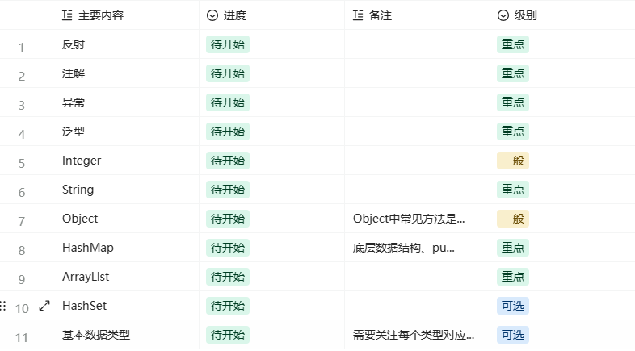
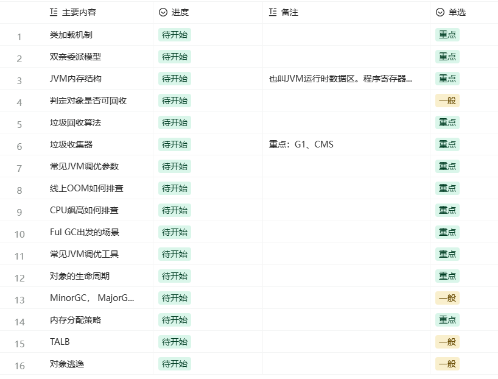
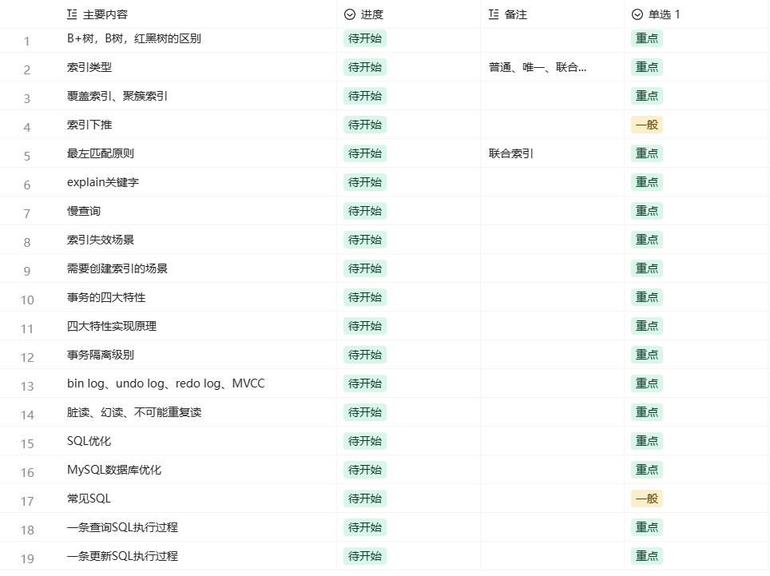
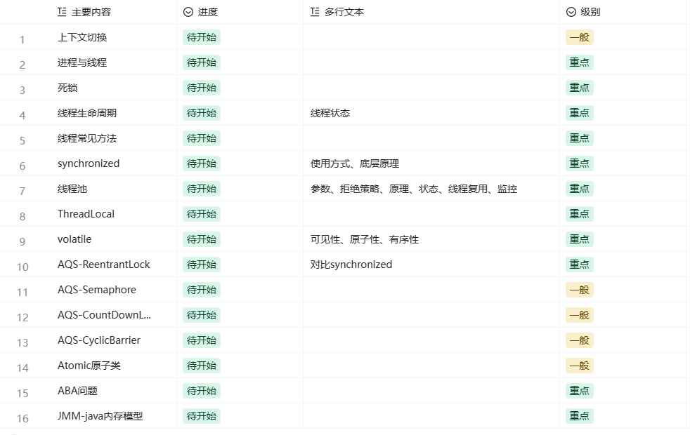
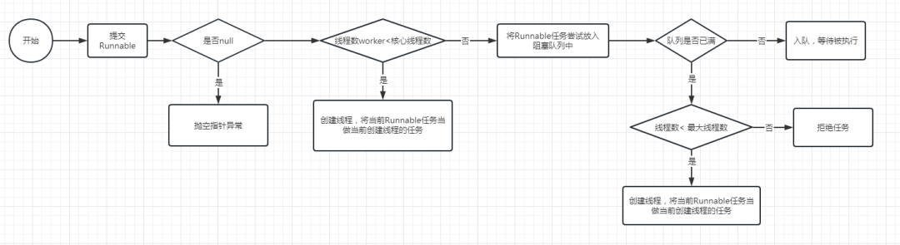
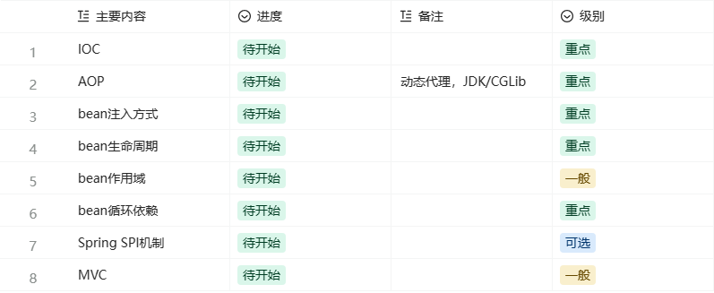
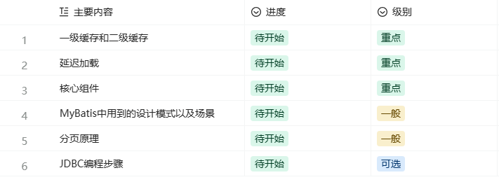
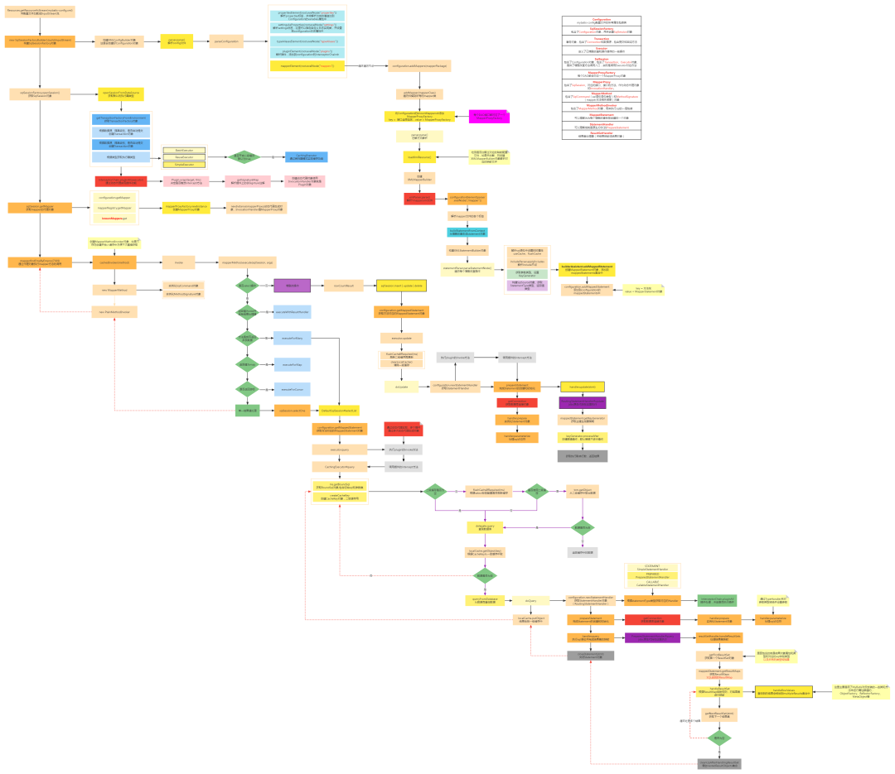

# 复习计划

# 复习计划
## <font style="color:rgb(255, 255, 255);background-color:rgb(239, 112, 96);">java基础</font>
<font style="color:rgb(0, 0, 0);">基础部分安排两天完成，前面Java的特性可以用一天搞定，时间应该是足够的。第二天复习常用类可能慢点，可以把前面Java特性的时间压缩点。</font>



### <font style="color:rgb(0, 0, 0);">重点面试题</font>
#### <font style="color:rgb(0, 0, 0);">1、反射是什么？有什么用？在项目中有用过吗？</font>
<font style="color:rgb(0, 0, 0);">Java反射机制的核心是在程序运行时动态加载类并获取类的详细信息，从而操作类或对象的属性和方法。本质是JVM得到class对象之后，再通过class对象进行反编译，从而获取对象的各种信息。项目中用的很少，更多是在一些框架中用的比较多，比如Spring、Mybatis中。</font>

#### <font style="color:rgb(0, 0, 0);">2、注解是什么？</font>
<font style="color:rgb(0, 0, 0);">注解是一种特殊的接口，是一种特殊标记，可以再编译、类加载、运行时背读取并做相应的处理。比如我们使用注解+AOP，可以实现请求参数和响应参数的输出，或校验用户权限等。</font>

#### <font style="color:rgb(0, 0, 0);">3、说说你对异常的理解</font>
<font style="color:rgb(0, 0, 0);">Java中的异常处理是一项重要的技术，它允许我们识别和处理程序运行时可能出现的错误条件，从而提高程序的稳定性和可靠性。可检查异常是指在代码中必须显式处理或声明的异常。这些异常通常表示外部环境可能导致的问题，例如文件IO错误、网络连接错误等。非检查异常则包括空指针异常、数组下标越界等，这些异常在编译时不强制要求进行处理。我们在项目中，基本上都会自定义异常，重点是我们通过自定义异常可以用来做一些业务上的错误处理。比如请求条件中参数为空、参数非法、权限校验等。</font>

#### <font style="color:rgb(0, 0, 0);">4、Integer a=100,Integer b=100,Integer c=200,Integer d=200; a</font><font style="color:rgb(0, 0, 0);background-color:#f3bb2f;">b。c</font><font style="color:rgb(0, 0, 0);">d。</font>
<font style="color:rgb(0, 0, 0);">Integer a=100，相当于Integer a=Integer.valueof(100); 而在Integer中有个缓存，这个缓存使用数组实现，其中保存了new Integer(-127) 到new Integer(128)，共256个Integer对象，当我们多次定义 Integer a=100时，会从这个数组中获取，所以a</font><font style="color:rgb(0, 0, 0);background-color:#f3bb2f;">b 返回true，而Integer c=200不在数组中，所以，每次都会new一个Integer，最后c</font><font style="color:rgb(0, 0, 0);">d返回false</font>

<font style="color:black;background-color:rgb(255, 249, 249);">下面是参考解释，上面是面试回答</font>

```java
public static void main(String[] args) {
    Integer a=100;
    Integer b=100;
    System.out.println(a.equals(b));
    System.out.println(a==b);
    Integer c=200;
    Integer d=200;
    System.out.println(c.equals(d));
    System.out.println(c==d);
}
```

<font style="color:rgb(0, 0, 0);">运行结果：</font>

```java
true
true
true
false
```

<font style="color:rgb(0, 0, 0);">equals怎么都是返回true呢？看下面Integer中重写的equals方法</font>

```java
public boolean equals(Object obj) {
if (obj instanceof Integer) {
    return value == ((Integer)obj).intValue();
}
return false;
}
```

<font style="color:rgb(0, 0, 0);">这里的比较会对Integer拆箱成int基本类型。</font>

#### <font style="color:rgb(0, 0, 0);">5、String 为什么不可变？</font>
<font style="color:rgb(0, 0, 0);">String类定义背final修饰，意味着不可被继承，另外，String保存内容是一个char数组也是final修饰意味着不可改变，再加上String并没有提供一个能修改这个char数组的public方法。JVM中有个字符串常量池，当创建一个String对象时，假如此字符串已经存在于常量池中，则不会创建新的对象，而是直接引用已经存在的对象。这种特性使得String类在处理大量字符串时能够节省内存并提高性能。</font>

<font style="color:black;background-color:rgb(255, 249, 249);">还有一种面试题：String str=new String("abc")一共创建了几个对象; 如果常量池中存在abc，则只创建一个，如果不存在则创两个。</font>

#### <font style="color:rgb(0, 0, 0);">6、Object中常用方法</font>
<font style="color:rgb(0, 0, 0);">比如说getClass方法、hashCode方法、equals方法、clone()方法、toString方法、notify和notifyAll方法、wait方法。</font>

<font style="color:black;background-color:rgb(255, 249, 249);">每个方法的作用（面试官可能会问某个方法的作用）。</font>

1. <font style="color:rgb(1, 1, 1);background-color:rgb(255, 249, 249);">getClass()：此方法是public final native Class类型，返回的是运行时class对象，这个对象描述了对象所属的类。通常这个方法会和Java的反射机制一起使用。</font>
2. <font style="color:rgb(1, 1, 1);background-color:rgb(255, 249, 249);">hashCode()：这是一个native方法，返回的是对象的哈希码。默认实现返回的是对象的内存地址的哈希码。</font>
3. <font style="color:rgb(1, 1, 1);background-color:rgb(255, 249, 249);">equals(Object obj)：这个方法用于比较两个对象是否相等。默认实现是比较对象的内存地址是否相同，但可以在子类中重写以实现自定义的相等性检查。</font>
4. <font style="color:rgb(1, 1, 1);background-color:rgb(255, 249, 249);">clone()：这是一个创建并返回此对象的一个副本的方法，也就是复制对象。</font>
5. <font style="color:rgb(1, 1, 1);background-color:rgb(255, 249, 249);">toString()：如果没有在子类中重写此方法，那么应用该对象时将打印出的是对象的内存地址。</font>
6. <font style="color:rgb(1, 1, 1);background-color:rgb(255, 249, 249);">notify()和notifyAll()：这两个方法用于线程调度。notify()随机选择一个在该对象上调用wait方法的线程，解除其阻塞状态。notifyAll()则解除所有在该对象上调用wait方法的线程的阻塞状态。需要注意的是，这两个方法只能在同步方法或同步块内部调用。</font>
7. <font style="color:rgb(1, 1, 1);background-color:rgb(255, 249, 249);">wait(long timeout)：这个方法会使当前线程进入该对象的等待队列，直到被唤醒、等待时间超时或者被中断。</font>

#### <font style="color:rgb(0, 0, 0);">7、HashMap底层数据结构是什么？</font>
<font style="color:rgb(0, 0, 0);">HashMap在JDK 1.7及之前的版本中，其底层数据结构是数组+链表；而在JDK 1.8及以后的版本中，其底层数据结构变为了数组+链表+红黑树。这样的改变主要是为了提高查询效率和性能，特别是在处理大量数据时。</font>

#### <font style="color:rgb(0, 0, 0);">8、HashMap在JDK7和JDK8 综合实现有哪些不同？</font>
<font style="color:rgb(0, 0, 0);">主要有两个方便不同：1、数据结构不同，JDK7及之前的版本中采用数组+链表，在JDK8中 采用 数组+链表+红黑树 2、新节点插入到链表时的处理方式也有所不同。在JDK7中，新节点会被插入到链表的头部；而在JDK8中，新节点会被插入到链表或红黑树的尾部。</font>

#### <font style="color:rgb(0, 0, 0);">9、hash冲突解决办法有哪些？</font>
<font style="color:rgb(0, 0, 0);">有开放定址法、再哈希法、链地址法以及建立公共溢出区。</font>

<font style="color:black;background-color:rgb(255, 249, 249);">每周方法解释：</font>

1. <font style="color:rgb(1, 1, 1);background-color:rgb(255, 249, 249);">开放定址法：当出现哈希冲突时，寻找一个新的空闲的哈希地址。具体包括线性探测法、平方探测法（二次探测）等。</font>
2. <font style="color:rgb(1, 1, 1);background-color:rgb(255, 249, 249);">再哈希法：也称为双重散列法，基本思想是当关键字key的哈希地址p=H（key）出现冲突时，以p为基础，产生另一个哈希地址p1，如果p1仍然冲突，再以p为基础，产生另一个哈希地址p2，直到找到一个不冲突的地址。</font>
3. <font style="color:rgb(1, 1, 1);background-color:rgb(255, 249, 249);">链地址法：将所有哈希地址相同的记录都链接在同一链表中。</font>
4. <font style="color:rgb(1, 1, 1);background-color:rgb(255, 249, 249);">建立公共溢出区：将哈希表分为基本表和溢出表，发生冲突的都存放在溢出表中。</font>

#### <font style="color:rgb(0, 0, 0);">10、HashMap采用什么方法？</font>
<font style="color:rgb(0, 0, 0);">HashMap解决哈希冲突的主要方式是</font>**<font style="color:rgb(0, 0, 0);">链地址法</font>**<font style="color:rgb(0, 0, 0);">。具体来说，就是将所有哈希冲突的元素都保存在一个链表里面。当新插入的元素哈希值相同时，就会被添加到对应的链表中。此外，为保证数据的唯一性，HashMap在添加元素时还会检查键是否已存在，如果存在则更新值。</font>

#### <font style="color:rgb(0, 0, 0);">11、为什么说它不是线程安全？</font>
<font style="color:rgb(0, 0, 0);">HashMap不是线程安全的原因是它的内部实现不具备同步机制。当多个线程同时操作同一个HashMap实例时，会导致数据不一致或者出现异常。具体来说，当一个线程进行插入、删除或修改操作时，另一个线程同时进行了读取操作，可能会导致HashMap的内部结构发生变化，从而导致读取到错误的数据或者抛出ConcurrentModificationException异常。为了保证线程安全，可以使用线程安全的Map实现，比如ConcurrentHashMap、Hashtable之类的线程安全类。</font>

<font style="color:black;background-color:rgb(255, 249, 249);">如果再问HashMap和Hashtable的区别 HashMap和Hashtable都是Java中的Map接口的实现类，都可以用于存储键值对。然而，它们在线程安全性、性能和用法上存在一些主要的区别：</font>

1. <font style="color:rgb(1, 1, 1);background-color:rgb(255, 249, 249);">继承关系不同：Hashtable继承自Dictionary类，而Dictionary类是一个已经被废弃的类。相反，HashMap没有直接继承自任何类，但是它实现了Map接口。</font>
2. <font style="color:rgb(1, 1, 1);background-color:rgb(255, 249, 249);">线程安全性：Hashtable是线程安全的，其所有方法都是同步的，这可以防止多个线程同时访问Hashtable。然而，HashMap是非线程安全的，如果在多线程环境下使用，可能会引发数据不一致的问题。</font>
3. <font style="color:rgb(1, 1, 1);background-color:rgb(255, 249, 249);">性能：由于Hashtable的方法是同步的，所以在多线程环境下，虽然保证了线程安全，但也会影响性能。相比之下，HashMap没有进行同步，所以其操作效率更高。</font>
4. <font style="color:rgb(1, 1, 1);background-color:rgb(255, 249, 249);">null键值：HashMap允许使用null作为键和/或值，而Hashtable不允许。总的来说，选择使用哪一个主要取决于你的具体需求。如果你需要一个线程安全的Map，那么可以选择使用Hashtable；如果你更关心性能，并且不需要线程安全，那么可以选择使用HashMap。</font>

**<font style="color:rgb(0, 0, 0);">（注意：ConcurrentHashMap在并发编程部分聊）</font>**

#### <font style="color:rgb(0, 0, 0);">12、想要保住线程安全怎么办？</font>
<font style="color:rgb(0, 0, 0);">我们可以ConcurrentHashMap、Hashtable等相关的线程安全类来替换HashMap</font>

#### <font style="color:rgb(0, 0, 0);">13、为什么扩容必须是2的n次幂？</font>
<font style="color:rgb(0, 0, 0);">HashMap的容量选择2的n次方，主要与其哈希寻址方式有关，目的是把存入的数据减少hash冲突，更好的分布在对应的位置中。</font>

<font style="color:black;background-color:rgb(255, 249, 249);">在存储键值对时，会通过putVal()方法利用key的hash值和扩容后的长度进行一次按位与运算来确定键的散列地址。此外，为了提升哈希计算的速度以及减少哈希冲突，HashMap采用 & 运算而非 % 运算来计算键的散列地址。为了保证 & 的计算结果等于 % 的结果，需要将数组长度减一，即使用(length-1)作为运算参数。在进行扩容操作时，若每次扩容都是原来的2倍，这就保证了HashMap容量始终是2的n次方，且每次扩容后，原数据都会进行数据迁移。根据二进制计算，扩容后的数据要么在原来的位置，要么在【原来位置+扩容长】的地方。因此，HashMap的扩容选择2的n次方是一个综合考虑了性能、冲突率和数据迁移等多个因素的结果。</font>

#### <font style="color:rgb(0, 0, 0);">14、 HashMap的put流程是什么？</font>
<font style="color:rgb(0, 0, 0);">当调用HashMap的put方法时，首先会计算出要插入的key的哈希值。然后，该哈希值会通过位运算得到在HashMap中的索引位置。如果该索引位置上已经存在元素，则会根据该位置上的元素是否为链表或红黑树进行不同的处理。如果是链表，则会遍历链表，找到尾节点，并将新的键值对作为尾节点的下一个节点。如果是红黑树，则会按照红黑树的插入规则将新的键值对插入到红黑树中。如果该索引位置上没有元素，则直接将新的键值对作为该位置上的元素。最后，如果插入操作导致HashMap的元素个数大于了负载因子乘以容量的阈值，则会触发扩容操作，将HashMap的容量扩大一倍，并重新计算每个元素的索引位置。</font>

#### <font style="color:rgb(0, 0, 0);">15、ArrayList底层数据结构是什么？默认长度是多少？</font>
<font style="color:rgb(0, 0, 0);">ArrayList的底层数据结构是数组，这个数组默认的长度是10。当使用无参构造创建ArrayList集合时，其实数组的长度为0，只有当你调用add()方法向ArrayList添加元素后，数组的长度才会变为默认长度10。</font>

#### <font style="color:rgb(0, 0, 0);">16 、ArrayList如何扩容？</font>
<font style="color:rgb(0, 0, 0);">ArrayList的扩容操作是通过创建一个新的更大容量的数组来实现的。具体步骤如下：</font>

1. <font style="color:rgb(1, 1, 1);">首先，ArrayList会根据一个扩容增量（通常为当前容量的一半）计算出新的容量大小。例如，如果当前容量为10，扩容增量为5，则新容量为15。</font>
2. <font style="color:rgb(1, 1, 1);">然后，ArrayList会创建一个新的数组，将当前数组中的元素逐个复制到新数组中。</font>
3. <font style="color:rgb(1, 1, 1);">最后，ArrayList会将新数组设置为内部数组，并更新容量值。</font>

### <font style="color:rgb(0, 0, 0);">推荐文章</font>
<font style="color:rgb(0, 0, 0);">Object：Java Object类的各个方法反射：深入解析JAVA反射机制异常：Java异常处理和最佳实践（含案例分析注解：Java注解详解和自定义注解实战，用代码讲解泛型：java 泛型全解String：JavaのString类这一篇就够了(包含StringBuffer_Builder) 、Java String 面试题</font>

## <font style="color:rgb(255, 255, 255);background-color:rgb(239, 112, 96);">JVM</font>


### <font style="color:rgb(0, 0, 0);">重点面试题</font>
#### <font style="color:rgb(0, 0, 0);">1、说说类加载机制？</font>
<font style="color:rgb(0, 0, 0);">JVM的类加载机制主要负责把描述类的数据从Class文件加载到内存，并对数据进行校验、转换解析和初始化，最终形成可以被虚拟机直接使用的Java类型。JVM的类加载过程分为五个阶段：</font>**<font style="color:rgb(0, 0, 0);">加载、验证、准备、解析和初始化</font>**<font style="color:rgb(0, 0, 0);">。</font>

> <font style="color:black;background-color:rgb(255, 249, 249);">在加载阶段，JVM会在硬盘上查找并通过IO读入字节码文件，当需要使用该类时，如调用类的main方法或创建新对象时，才会真正开始加载。验证阶段则会对读取的字节码进行数据校验，确保其符合Java规范，不会造成安全风险。准备阶段则为变量分配内存并设置默认值。而在解析阶段，则主要是对符号引用进行链接。最后的初始化阶段则是对类进行初始化操作，为静态变量赋予正确的初始值。</font>
>


#### <font style="color:rgb(0, 0, 0);">2、什么是双亲委派模型？</font>
<font style="color:rgb(0, 0, 0);">双亲委派模型是Java类加载器的一种核心工作模式，它通过双亲委派模型是Java类加载器的一种核心工作模式，它通过将类文件的加载委派给父类加载器来确保Java程序能够正常运行。在双亲委派模型中，当一个类加载器收到类加载请求时，它不会自己尝试加载，而是把这个请求委派给父类加载器去完成。这种层次结构使得所有的类加载请求都会被传递到顶层的启动类加载器，从而避免了类的重复加载和安全问题。</font>

#### <font style="color:rgb(0, 0, 0);">3、如何打破双亲委派模型？</font>
<font style="color:rgb(0, 0, 0);">打破双亲委派模型的方式主要有两种：重写ClassLoader类的loadClass()方法和使用线程上下文类加载器。</font>

> <font style="color:black;background-color:rgb(255, 249, 249);">在重写ClassLoader类的loadClass()方法中，需要遵守JVM的规范，即在父类加载器无法加载类的情况下，才尝试自己去加载。这样，就可以避免与父类加载器之间的冲突，保证Java核心库的类型安全。例如，Tomcat中的Web应用程序类加载器就打破了双亲委派模型，优先加载自己路径下的类。另一种方式是使用线程上下文类加载器。线程上下文类加载器是JDK 1.2之后引入的一个机制，它可以让每个线程都有自己的类加载器。当一个线程初始化时，如果它没有设置自己的类加载器，那么就会继承其父线程的类加载器；否则，线程将使用自己设置的类加载器作为父类加载器。这种方式在某些特殊场景下非常有用，比如JNDI、JDBC等。</font>
>


#### <font style="color:rgb(0, 0, 0);">4、双亲委派模型的作用是什么？</font>
<font style="color:rgb(0, 0, 0);">主要作用如下：</font>

1. <font style="color:rgb(1, 1, 1);">保证Java核心库的类型安全。由于所有的Java应用都至少会使用Java核心库，因此这些类必须被统一加载，避免因为不同类加载器加载产生的版本差异导致的问题。</font>
2. <font style="color:rgb(1, 1, 1);">避免类的重复加载。当父类已经加载了某个类时，子类就不会再尝试去加载这个类。这样能够有效节省系统资源，提高程序运行效率。</font>
3. <font style="color:rgb(1, 1, 1);">通过赋予类加载器优先级，为Java中的类赋予了一种带有优先级的层次关系。例如，java.lang.Object存放在rt.jar当中，无论哪一层的类加载器需要加载Object类，最终都是委派到启动类加载器进行加载，可以确保Object类在程序的各种类加载器环境中是同一个类。</font>

#### <font style="color:rgb(0, 0, 0);">5、说说类加载器</font>
<font style="color:rgb(0, 0, 0);">JVM类加载器是Java虚拟机的一部分，负责将Java字节码文件加载到内存中并转换成Java类。JVM类加载器分为三种：Bootstrap ClassLoader、Extension ClassLoader、System ClassLoader以及自定义类加载器 JVM类加载器所加载的目录包括：</font>

1. <font style="color:rgb(1, 1, 1);">Bootstrap ClassLoader：加载%JAVA_HOME%\jre\lib\rt.jar文件中的Java核心库。</font>
2. <font style="color:rgb(1, 1, 1);">Extension ClassLoader：加载%JAVA_HOME%\jre\lib\ext目录下的Java扩展库。</font>
3. <font style="color:rgb(1, 1, 1);">System ClassLoader：加载应用程序的classpath目录下的类。</font>
4. <font style="color:rgb(1, 1, 1);">自定义类加载：加载咱们自定义的目录下的类。</font>

#### <font style="color:rgb(0, 0, 0);">2、说说JVM内存模型（有的面试官叫：java内存模型，其实java内存模型不是这里的。最好是理解为JVM运行时数据区）</font>
<font style="color:rgb(0, 0, 0);">主要包含以下5个区域：：</font>**<font style="color:rgb(0, 0, 0);">程序寄存器</font>**<font style="color:rgb(0, 0, 0);">、</font>**<font style="color:rgb(0, 0, 0);">Java虚拟机栈</font>**<font style="color:rgb(0, 0, 0);">、</font>**<font style="color:rgb(0, 0, 0);">本地方法栈</font>**<font style="color:rgb(0, 0, 0);">、</font>**<font style="color:rgb(0, 0, 0);">方法区</font>**<font style="color:rgb(0, 0, 0);">和</font>**<font style="color:rgb(0, 0, 0);">堆</font>**<font style="color:rgb(0, 0, 0);">。</font>**<font style="color:rgb(0, 0, 0);">程序寄存器</font>**<font style="color:rgb(0, 0, 0);">用于记录当前线程所执行的字节码位置（执行的指令）。</font>**<font style="color:rgb(0, 0, 0);">Java虚拟机栈</font>**<font style="color:rgb(0, 0, 0);">和线程生命周期一样，一个线程的创建伴随着一个Java虚拟机栈的产生。每进入一个方法，就往虚拟机栈中压入一个栈帧。栈帧中存储局部变量表、操作数栈、动态链接、方法出口等信息。</font>**<font style="color:rgb(0, 0, 0);">本地方法栈</font>**<font style="color:rgb(0, 0, 0);">则与Java虚拟机栈类似，只不过它主要是服务于native方法的。同样的，每当一个native方法调用开始直至完成的过程，也会对应着一个栈帧从入栈到出栈的过程。</font>**<font style="color:rgb(0, 0, 0);">方法区</font>**<font style="color:rgb(0, 0, 0);">用于存储类的结构信息、常量、静态变量等数据。当一个类被加载后，它的元数据就会被存储在方法区中。值得注意的是，虽然方法区有时也被称为“永久代”，但实际上并非所有Java虚拟机实现都会使用永久代。例如，HotSpot虚拟机就从JDK 8起移除了永久代，并将其功能移到了元空间（Metaspace）中。JDK8之前采用的是永久代实现，JDK8后开始使用元空间。</font>**<font style="color:rgb(0, 0, 0);">堆</font>**<font style="color:rgb(0, 0, 0);">是一块用于存储对象实例的内存区域。基本上所有的对象都会在堆中创建。当垃圾回收器运行后，未被引用的对象就会被清理掉，以释放内存空间。堆又分成新生代和老年代，新生代有分Eden区和两个Survivor区。</font>

<font style="color:black;background-color:rgb(255, 249, 249);">怎么判断对象能背回收了？两种方法：引用计数法，GC Root GC Root ？哪些是GC Root？</font>

#### <font style="color:rgb(0, 0, 0);">3、说说垃圾回收算法</font>
<font style="color:rgb(0, 0, 0);">JVM垃圾回收算法是Java虚拟机中的一种自动内存管理机制，它可以自动地回收不再使用的内存空间，以便程序能够更高效地运行。JVM的垃圾回收算法主要有以下几种：标记-清除、复制、标记-整理、分代收集</font>

<font style="color:black;background-color:rgb(255, 249, 249);">每种算法的解释：</font>

1. <font style="color:rgb(1, 1, 1);background-color:rgb(255, 249, 249);">标记-清除算法：该算法会先标记所有活动对象，然后清除所有未标记的对象。缺点是效率不高，无法清除垃圾碎片。</font>
2. <font style="color:rgb(1, 1, 1);background-color:rgb(255, 249, 249);">复制算法：将可用内存分为两个等份，每次只使用其中一份，当这份内存用完了，就将还存活的对象复制到另一份上，然后再把已使用过的内存空间进行一次清理。</font>
3. <font style="color:rgb(1, 1, 1);background-color:rgb(255, 249, 249);">标记-整理算法：该算法在标记-清除算法的基础上做了改进，即在清除无用对象的同时，将所有存活的对象向一端移动，然后直接清理掉端边界以外的内存。</font>
4. <font style="color:rgb(1, 1, 1);background-color:rgb(255, 249, 249);">分代收集算法：根据对象的生命周期长短将内存分为几个区域，一般分为新生代和老年代。针对这两个区域采用不同的垃圾回收算法。新生代由于对象经常消亡与诞生，所以使用复制算法。老年代则因对象存活时间长，适合使用标记-整理算法。</font>

#### <font style="color:rgb(0, 0, 0);">4、G1垃圾收集器是什么？</font>
<font style="color:rgb(0, 0, 0);">G1垃圾收集器，全称Garbage-First，是一款面向服务端应用的垃圾收集器。它主要适用于配备多核CPU和大容量内存的机器，旨在以极高概率满足GC停顿时间的同时，还兼具高吞吐量的性能特征。G1垃圾收集器是HotSpot在JVM上强力推荐的垃圾收集器，被视为取代CMS（Concurrent Mark Sweep）的重要一环。此外，G1垃圾收集器在JDK 7u4版本时被正式推出，而在JDK9中更被指定为官方GC收集器。G1垃圾收集器的工作机制独特，它将Java堆划分成多个区域（Region），每个区域可以扮演不同的角色，例如Eden区、Survivor区等。这种创新的区域化管理方式使得G1垃圾收集器能够更好地控制垃圾回收的时间和空间，从而提高系统的吞吐量和响应速度。</font>

#### <font style="color:rgb(0, 0, 0);">5、说说CMS</font>
<font style="color:rgb(0, 0, 0);">CMS垃圾收集器是以获取最短回收停顿时间为目标设计的，这也是其最大的特点和优势。具体来说，CMS垃圾收集器的工作流程主要包括以下几个步骤：</font>

1. <font style="color:rgb(1, 1, 1);">初始标记：在这个阶段，会暂停所有的应用线程，并标记出所有被应用线程直接或间接引用的对象。</font>
2. <font style="color:rgb(1, 1, 1);">并行标记：在这个阶段，应用线程和垃圾收集线程会同时工作，应用线程继续运行，而垃圾收集线程则尝试标记出所有其他对象。</font>
3. <font style="color:rgb(1, 1, 1);">重新标记：由于上一步中可能会有新的垃圾产生，所以在这个阶段会对第一步和第二步的标记进行修正。</font>
4. <font style="color:rgb(1, 1, 1);">并发清理：在这个阶段，应用线程和垃圾收集线程仍然会同时工作，垃圾收集线程将标记为需要回收的对象清理掉。</font>

<font style="color:rgb(0, 0, 0);">值得注意的是，虽然CMS垃圾收集器可以极大地减少应用程序的暂停时间，但是</font>**<font style="color:rgb(0, 0, 0);">由于其在回收过程中会产生大量的内存碎片，因此其对内存空间的利用率不如其他的垃圾收集器</font>**<font style="color:rgb(0, 0, 0);">。</font>

#### <font style="color:rgb(0, 0, 0);">5、知道哪些JVM调优手段？（是否有线上JVM调优经验）</font>
<font style="color:rgb(0, 0, 0);">调优手段，比如：</font>

1. **<font style="color:black;">将新对象预留在新生代</font>**<font style="color:rgb(1, 1, 1);">：由于Full GC的成本要远远高于Minor GC，尽可能将对象分配在新生代中。在JVM调优中，可以为应用程序分配一个合理的新生代空间，以最大限度避免新对象直接进入老年代。</font>
2. **<font style="color:black;">大对象进入老年代</font>**<font style="color:rgb(1, 1, 1);">：大对象占用空间多，直接放入新生代中会扰乱新生代GC，新生代空间不足将会把大量的较小的年轻代对象移入到老年代中，这对GC来说是相当不利的。如果有短命大对象，对GC来说将会是一场灾难。</font>
3. **<font style="color:black;">选择合适的垃圾回收器</font>**<font style="color:rgb(1, 1, 1);">：选择适合应用的垃圾回收器也是一个重要的调优手段。例如，CMS升级到G1，甚至ZGC。</font>
4. **<font style="color:black;">调整堆内存大小和新生代与老年代的比例等参数</font>**<font style="color:rgb(1, 1, 1);">：根据应用程序的需求和系统的实际情况，进行适当的调整。需要注意的是，这些参数的设置需要基于实际的业务场景，不同的业务可能需要不同的参数配置。</font>
5. **<font style="color:black;">使用专业工具进行压力测试</font>**<font style="color:rgb(1, 1, 1);">：通过不同的JVM参数进行压测，获取最佳配置</font>

#### <font style="color:rgb(0, 0, 0);">6、哪些方法可能会触发Full GC?</font>
1. <font style="color:rgb(1, 1, 1);">当新生代中的对象经过多次Minor GC后仍然存活，这些对象会被移动到老年代中。此时，如果老年代空间不足，就会触发Full GC。</font>
2. <font style="color:rgb(1, 1, 1);">当System.gc()方法被显式调用时，会建议JVM进行Full GC。虽然调用该方法不一定会立即触发 Full GC，但它会提示JVM在合适的时机进行 Full GC。需要注意的是，由于Full GC是一种比较耗时的操作，它会暂停应用程序的执行。</font>
3. <font style="color:rgb(1, 1, 1);">当方法区内存满时，也会触发Full GC。如果经过Full GC仍然回收不了，那么虚拟机会抛出java.lang.OutOfMemoryError PermGen space错误。</font>
4. <font style="color:rgb(1, 1, 1);">在一些特殊的情况下，如系统需要加载的类、反射的类和调用的方法较多时，或者老年代没有足够的连续空间来放置大对象等，也可能触发Full GC。</font>

#### <font style="color:rgb(0, 0, 0);">7、线上OOM怎么排查？</font>
<font style="color:rgb(0, 0, 0);">在线上出现OOM（Out of Memory）问题时，可以按以下步骤进行排查：</font>

1. **<font style="color:black;">查看OOM日志</font>**<font style="color:rgb(1, 1, 1);">：查看服务器或应用程序的日志文件，通常会有OOM相关的错误信息和堆栈跟踪。通过日志可以确定是否是因为内存不足导致的OOM，以及具体的异常位置。</font>
2. **<font style="color:black;">检查内存使用情况</font>**<font style="color:rgb(1, 1, 1);">：查看系统的内存使用情况，包括物理内存和虚拟内存的使用情况。可以使用系统的监控工具（如top、htop等）或者专门的性能监控工具（如Jconsole、VisualVM等）来查看内存使用情况。</font>
3. **<font style="color:black;">分析内存Dump文件</font>**<font style="color:rgb(1, 1, 1);">：当应用程序发生OOM时，可以生成内存Dump文件，记录了应用程序在出现OOM之前的内存使用情况。可以使用工具（如</font>**<font style="color:black;">MAT、VisualVM</font>**<font style="color:rgb(1, 1, 1);">等）来分析Dump文件，查看内存中的对象占用情况、内存泄漏等问题。</font>
4. **<font style="color:black;">审查代码</font>**<font style="color:rgb(1, 1, 1);">：根据日志和Dump文件的分析结果，定位具体的代码问题。可能是某个地方创建了过多的对象，导致内存不足；也可能是某个地方没有正确释放资源，导致内存泄漏。</font>
5. **<font style="color:black;">调整内存配置</font>**<font style="color:rgb(1, 1, 1);">：根据应用程序的需求和服务器的硬件资源，调整JVM的内存配置。可以通过修改JVM启动参数（如-Xmx、-Xms等）来增加堆内存的大小，或者调整GC算法和参数来优化内存的使用。</font>
6. **<font style="color:black;">优化代码</font>**<font style="color:rgb(1, 1, 1);">：根据分析结果，对代码进行优化，减少内存的占用。可以采用一些优化手段，如使用缓存、使用对象池、避免重复创建对象等。</font>
7. **<font style="color:black;">进行压力测试</font>**<font style="color:rgb(1, 1, 1);">：在排除问题后，进行压力测试，模拟大量并发请求和数据量，验证修复后的系统是否仍然稳定，是否还会出现OOM问题。需要注意的是，OOM问题的排查并不是一次性的，可能需要多次迭代和优化，同时也需要结合具体的应用场景和业务特点进行分析和调整。</font>

#### <font style="color:rgb(0, 0, 0);">8、线上CPU飙高怎么排查？</font>
<font style="color:rgb(0, 0, 0);">一种办法网上搜一下相关的文章，自己总结一下。</font>

<font style="color:rgb(0, 0, 0);">或者参考我网站上的文章：</font>[<u><font style="color:rgb(61, 167, 66);">https://woaijava.cc/blog/1889</font></u>](https://woaijava.cc/blog/1889)

### <font style="color:rgb(0, 0, 0);">参考文献</font>
<font style="color:rgb(0, 0, 0);">类加载：</font>[类加载机制](https://mp.weixin.qq.com/s?__biz=MzA4NjI3ODc2NA==&mid=2649502863&idx=1&sn=38c1ae91639b7dd22f01fed3d9fcd22a&scene=21#wechat_redirect)<font style="color:rgb(0, 0, 0);"> </font><font style="color:rgb(0, 0, 0);"> 这个也该知道，作为一个java开发得熟悉这个流程。</font>

<font style="color:rgb(0, 0, 0);">双亲委派模型：双亲委派模型  （高级点可能还会问，如何打破双亲委派模型，以及打破双亲委派模型） </font>

<font style="color:rgb(0, 0, 0);">CPU飙高、死锁、内存泄漏：</font>

<font style="color:rgb(0, 0, 0);">JVM调优 ， 源于这些问题如果在面试中问题你如何解决排查，那按照文章的步骤说就差不多了。</font>

<font style="color:rgb(0, 0, 0);">但是面试官可能有时候会问你在项目中有没有遇到过，遇到了是如何解决的。不是每个人都有机会遇到的，就算遇到了或许根本就不是由你来解决。</font>

<font style="color:rgb(0, 0, 0);">如果没有实际经验，那就可以说“尽管我在实际项目中没有遇到过，但是我自己也在自己练手的项目模拟过这些场景，并且能通过相关的命令和工具能解决（这里就需要自己理论基础了），回答个123也不至于面试冷场。”</font>

## <font style="color:rgb(255, 255, 255);background-color:rgb(239, 112, 96);">MySQL</font>


<font style="color:rgb(136, 136, 136);">image</font>

### <font style="color:rgb(0, 0, 0);">重点面试题</font>
#### <font style="color:rgb(0, 0, 0);">1、B树和B+树有什么区别？</font>
<font style="color:rgb(0, 0, 0);">B树和B+树是两种常用的自平衡查找树，它们的主要区别在于：</font>

1. <font style="color:rgb(1, 1, 1);">结构：B树的每个节点既可以存储数据，也可以存储指向子节点的指针；而B+树的内部节点只存储指向子节点的指针，所有数据都存储在叶子节点中。</font>
2. <font style="color:rgb(1, 1, 1);">叶子节点：B树的叶子节点可以包含数据，也可以不包含数据；而B+树的叶子节点只包含数据，且叶子节点之间通过指针连接，形成一个有序链表。</font>
3. <font style="color:rgb(1, 1, 1);">数据查询：B树的查询可以在非叶子节点中完成，因此查询性能相对较高；而B+树的查询必须从根节点到叶子节点，但由于叶子节点形成了有序链表，可以快速地进行范围查询。</font>

#### <font style="color:rgb(0, 0, 0);">2、为什么使用B+树来作为MySQL的索引数据结构？</font>
1. **<font style="color:black;">查询性能</font>**<font style="color:rgb(1, 1, 1);">：B+树的查询性能相对较高，尤其在范围查询时更为明显，这使得B+树适用于存储大量数据并频繁进行范围查询的场景，如数据库索引。2.** 数据存储**：B+树的数据存储在叶子节点中，叶子节点通过链表连接，这种特性使得B+树非常适合于顺序存储，对于数据库来说，数据在磁盘上存储是顺序的，因此B+树的存储方式更加高效。</font>
2. **<font style="color:black;">范围查询</font>**<font style="color:rgb(1, 1, 1);">：B+树的叶子节点形成了有序链表，这使得范围查询的效率非常高，而B树则需要在非叶子节点中进行查询，效率较低。</font>
3. **<font style="color:black;">磁盘IO</font>**<font style="color:rgb(1, 1, 1);">：B+树的叶子节点形成了有序链表，可以利用磁盘预读的特性，减少磁盘IO的次数，提高查询效率。B+树的主要优势在于它能够减少I/O操作，提高数据库的整体运行效率。</font>

#### <font style="color:rgb(0, 0, 0);">3、什么是索引？</font>
<font style="color:rgb(0, 0, 0);">索引是一种数据结构，它的主要功能是为了提高数据库的查询速度。</font>

#### <font style="color:rgb(0, 0, 0);">4、索引类型有哪些？</font>
<font style="color:rgb(0, 0, 0);">mysql中主要有：普通索引、唯一索引、主键索引、组合索引和全文索引</font>

1. <font style="color:rgb(1, 1, 1);background-color:rgb(255, 249, 249);">普通索引(normal)：是最基本的索引类型，没有任何限制，MyIASM中默认的BTREE类型的索引，是我们大多数情况下使用的索引类型。</font>
2. <font style="color:rgb(1, 1, 1);background-color:rgb(255, 249, 249);">唯一索引(unique)：与普通索引类似，不同的是唯一索引的列值必须唯一，不能有重复值。</font>
3. <font style="color:rgb(1, 1, 1);background-color:rgb(255, 249, 249);">主键索引(primary key)：一张表只能有一个主键，主键的作用是保证某张表中的每一行记录都是唯一的。</font>
4. <font style="color:rgb(1, 1, 1);background-color:rgb(255, 249, 249);">组合索引(composite)：即一个索引包含多个列，可以在查询时显著提高性能。</font>
5. <font style="color:rgb(1, 1, 1);background-color:rgb(255, 249, 249);">全文索引(full text)：主要用于处理大型文本数据，通过建立倒排文档映射，可以非常快速的检索文本信息。全文索引并不是和MyISAM一起诞生的，它的出现是为了解决WHERE name LIKE “%word%"这类针对文本的模糊查询效率较低的问题。目前只有MyISAM引擎支持。并且可以在CHAR、VARCHAR ，TEXT 列上创建全文索引。</font>

#### <font style="color:rgb(0, 0, 0);">5、什么时候需要建索引？</font>
<font style="color:rgb(0, 0, 0);">以下几种情况是适合建立索引的：</font>

1. **<font style="color:black;">表的主键</font>**<font style="color:rgb(1, 1, 1);">：主键是唯一标识表中每一行记录的，因此需要建立主键索引，创建一个主键就意味着创建了一个主键索引。</font>
2. **<font style="color:black;">唯一性字段</font>**<font style="color:rgb(1, 1, 1);">：当某一列的值具有唯一性时，例如员工编号、身份证号码等，这种字段可以建立唯一索引。</font>
3. **<font style="color:black;">频繁作为查询条件的字段</font>**<font style="color:rgb(1, 1, 1);">：如果某个字段经常作为查询条件，那么在这个字段上建立索引可以加快查询速度。例如，"SELECT * FROM student WHERE name ='张三' AND addr = '北京市'"语句，如果name字段有索引，将大大提高查询效率。</font>
4. **<font style="color:black;">频繁被排序的字段</font>**<font style="color:rgb(1, 1, 1);">：对某个字段进行排序操作时，如果在该字段上已经建立了索引，那么MySQL可以直接利用索引的排序结果，而不需要再次进行排序操作。</font>
5. **<font style="color:black;">经常用于连接的字段</font>**<font style="color:rgb(1, 1, 1);">：在进行多表连接查询时，如果在连接字段上已经建立了索引，那么MySQL可以直接利用索引进行连接操作，而不需要对连接字段进行全表扫描。</font>
6. **<font style="color:black;">范围查询字段</font>**<font style="color:rgb(1, 1, 1);">：在使用BETWEEN、>、<7、全文索引：对于含有大量文本信息的表，使用全文索引可以快速检索文本信息。</font>

<font style="color:rgb(0, 0, 0);">虽然索引可以提高数据库的查询效率，但是也需要权衡索引的使用，避免过多的索引和不合适的索引带来的负面影响。</font>

#### <font style="color:rgb(0, 0, 0);">6、什么时候会导致索引失效？</font>
<font style="color:rgb(0, 0, 0);">以下这些场景都可能会导致我们建的索引失效：</font>

+ **<font style="color:black;">条件中有or</font>**<font style="color:rgb(1, 1, 1);">，例如select * from table_name where a = 1 or b = 3</font>
+ **<font style="color:black;">在索引上进行计算会导致索引失效</font>**<font style="color:rgb(1, 1, 1);">，例如select * from table_name where a + 1 = 2</font>
+ **<font style="color:black;">在索引的类型上进行数据类型的隐形转换</font>**<font style="color:rgb(1, 1, 1);">，会导致索引失效，例如字符串一定要加引号，假设 select * from table_name where a = '1'会使用到索引，如果写成select * from table_name where a = 1则会导致索引失效。</font>
+ **<font style="color:black;">在索引中使用函数会导致索引失效</font>**<font style="color:rgb(1, 1, 1);">，例如select * from table_name where abs(a) = 1</font>
+ **<font style="color:black;">在使用like查询时以%开头</font>**<font style="color:rgb(1, 1, 1);">会导致索引失效</font>
+ **<font style="color:black;">索引上使用！、=、<>进行判断时会导致索引失效</font>**<font style="color:rgb(1, 1, 1);">，例如select * from table_name where a != 1</font>
+ **<font style="color:black;">索引字段上使用 is null、is not null判断时会导致索引失效</font>**<font style="color:rgb(1, 1, 1);">，例如select * from table_name where a is null</font>
+ **<font style="color:black;">数据离散性也有关系</font>**<font style="color:rgb(1, 1, 1);">，比如说性别字段，实际使用中只有男和女，区分度不够好，也会使得索引失效。</font>

#### <font style="color:rgb(0, 0, 0);">7、聚集索引和非聚集索引有什么区别？</font>
**<font style="color:rgb(0, 0, 0);">聚集索引</font>**<font style="color:rgb(0, 0, 0);">是将数据行按照索引的顺序存储在磁盘上。</font>**<font style="color:rgb(0, 0, 0);">一个表只能有一个聚集索引，通常是主键索引</font>**<font style="color:rgb(0, 0, 0);">。聚集索引的优点是能够快速地按照索引顺序查找数据，缺点是插入和更新数据时会导致数据的重新排序，影响性能。</font>**<font style="color:rgb(0, 0, 0);">非聚集索引</font>**<font style="color:rgb(0, 0, 0);">是将索引的键值和指向数据行的指针存储在磁盘上，数据行的存储顺序与索引顺序无关。</font>**<font style="color:rgb(0, 0, 0);">一个表可以有多个非聚集索引</font>**<font style="color:rgb(0, 0, 0);">。非聚集索引的优点是插入和更新数据时不会影响数据的排序，缺点是需要通过非聚集索引找到数据行后再进行一次查找，性能相对较低。</font>

#### <font style="color:rgb(0, 0, 0);">8、mysql存储引擎有哪些？</font>
<font style="color:rgb(0, 0, 0);">常见的MySQL存储引擎有：</font>

1. <font style="color:rgb(1, 1, 1);">MyISAM：这是MySQL的默认存储引擎，适合静态数据或者只读数据，由于不支持事务处理和行级锁，所以不适合高并发的应用。</font>
2. <font style="color:rgb(1, 1, 1);">InnoDB：提供了对数据库ACID事务的支持，并且还提供了行级锁和外键的约束。其设计的目标就是处理大数据容量的数据库系统，适合需要执行大量写入操作的应用。</font>
3. <font style="color:rgb(1, 1, 1);">Memory（Heap）：将所有数据存放在内存中，拥有极高的插入、更新和查询效率，但数据在服务器关闭或重启后就会丢失，只适用于数据安全性要求不高的场景。</font>
4. <font style="color:rgb(1, 1, 1);">DBD（Berkeley DB）：支持事务处理和锁定机制，适合需要执行大量读取操作的应用。</font>
5. <font style="color:rgb(1, 1, 1);">Merge：可以将多个MyISAM表合并到一个表中，用于需要大量小表的场景。</font>
6. <font style="color:rgb(1, 1, 1);">Federated：可以将远程MySQL服务器上的一个表映射到本地MySQL服务器上，就像它是本地表一样。</font>

<font style="color:rgb(0, 0, 0);">我们在项目中，基本上都使用的是InnoDB存储引擎，主要是它能支持事务。</font>

#### <font style="color:rgb(0, 0, 0);">9、什么是最左匹配原则？</font>
<font style="color:rgb(0, 0, 0);">最左匹配原则是MySQL查询优化的一个策略，主要应用于联合索引。在联合索引中，MySQL会按照最左边的字段进行匹配，因此，只有当SQL语句中使用到联合索引中最左边的字段时，才能利用该联合索引进行数据检索。</font>

<font style="color:black;background-color:rgb(255, 249, 249);">例如，对于一个包含字段a、b和c的联合索引（a,b,c），当执行查询select * from t where a=1 and b=1 and c =1; 时，就可以利用这个联合索引进行数据检索。这是因为查询条件中的字段a、b都是联合索引的最左边字段。但是，如果查询条件只包含了字段a和b，如select * from t where a=1 and b=1;由于字段c不在查询条件中，且不是联合索引的最左边字段，则无法利用该联合索引进行数据检索。where  b=1 and a=1也会走索引，mysql会对其进行优化。创建联合索引（a,b,c），可以理解同时创建了a索引、a+b索引、a+b+c索引</font>

#### <font style="color:rgb(0, 0, 0);">10、如何查看SQL是否用到了哪个索引？</font>
<font style="color:rgb(0, 0, 0);">可以使用EXPLAIN。只需将此函数添加在SQL语句之前即可。在解释结果中，关注type字段的信息可以明显地看出是否用到索引。如果type的值为"all"，那说明这条查询语句遍历了所有的行，并没有使用到索引。另外，还可以通过检查possible_keys列来确定SQL查询时用到的索引。但是需要注意的是，查询涉及到的字段若存在索引，则该索引被列出，但并不一定被查询使用。</font>

<font style="color:black;background-color:rgb(255, 249, 249);">比如：explain select name,age,gender from user where phone='18257462541' and name='zhangsan'</font>

#### <font style="color:rgb(0, 0, 0);">11、什么是事务？事务的特性有哪些？</font>
<font style="color:rgb(0, 0, 0);">事务是数据库管理系统执行的一个单元操作，这些操作要么全部成功，要么全部失败并回滚，不存在部分成功或者部分回滚的可能。事务具有四个特性，简称ACID特性：</font>

1. <font style="color:rgb(1, 1, 1);">原子性（Atomicity）：事务是一个不可分割的工作单位，事务中的所有操作要么全部成功，要么全部失败。只要其中一个指令执行失败，所有的指令都执行失败。</font>
2. <font style="color:rgb(1, 1, 1);">一致性（Consistency）：事务必须使数据库从一个一致性状态转换到另一个一致性状态。在事务开始之前和事务结束之后，数据库的完整性约束没有被破坏。</font>
3. <font style="color:rgb(1, 1, 1);">隔离性（Isolation）：一个事务所做的修改在最终提交之前，对其他事务是不可见的。</font>
4. <font style="color:rgb(1, 1, 1);">持久性（Durability）：一旦事务被提交，它对数据库的修改就是永久性的。</font>

#### <font style="color:rgb(0, 0, 0);">12、ACID在mysql中是怎么保证的？</font>
<font style="color:rgb(0, 0, 0);">原子性是通过undo log来实现原子性，当异常或执行失败后进行回滚。</font>

<font style="color:rgb(0, 0, 0);">持久性是通过redo log将数据保存至磁盘中，以保证数据的持久性。</font>

<font style="color:rgb(0, 0, 0);">隔离性是通过MVCC和锁来实现 </font>

<font style="color:rgb(0, 0, 0);">一致性是通过原子性、持久性和隔离性来实现的。</font>

#### <font style="color:rgb(0, 0, 0);">13、mysql中有哪些日志文件？</font>
1. <font style="color:rgb(1, 1, 1);">重做日志（redo log）：这是InnoDB独有的日志类型，主要用于记录事务对数据库所做的修改，当事务提交时，只需要将该事务执行过程中产生的redo日志刷新到磁盘，从而提高了效率。</font>
2. <font style="color:rgb(1, 1, 1);">回滚日志（undo log）：用于存储事务进行中的数据旧版本，以便在事务失败时进行回滚操作，保证数据的一致性。</font>
3. <font style="color:rgb(1, 1, 1);">二进制日志（binlog）：记录了所有的DDL（数据定义语言）语句和DML（数据操作语言）语句，对于数据恢复和主从复制有重要作用。</font>
4. <font style="color:rgb(1, 1, 1);">错误日志（errorlog）：记录了MySQL服务器启动、运行和关闭过程中发生的所有错误信息。</font>
5. <font style="color:rgb(1, 1, 1);">慢查询日志（slow query log）：记录了执行时间超过设定阈值的SQL语句，用于分析和优化性能瓶颈。</font>
6. <font style="color:rgb(1, 1, 1);">一般查询日志（general log）：记录了MySQL服务器接收到的每一条SQL语句，无论其执行时间长短或是否执行成功。</font>
7. <font style="color:rgb(1, 1, 1);">中继日志（relay log）：在主从复制架构中，从服务器用来保存从主服务器接收到的二进制日志事件。</font>

<font style="color:black;background-color:rgb(255, 249, 249);">重点记住：redo log、undo log、binlog、slow query log</font>

#### <font style="color:rgb(0, 0, 0);">14、bin lob、undo log、redu log有什么作用？</font>
<font style="color:rgb(0, 0, 0);">参考上一题</font>

#### <font style="color:rgb(0, 0, 0);">15、什么是MVCC原理？</font>
<font style="color:rgb(0, 0, 0);">MVCC，即多版本并发控制。它是一种并发控制机制，主要用于解决数据库在处理并发读写操作时可能出现的问题，如数据冲突和脏读等。MVCC的实现方式因数据库管理系统而异，但其核心原理主要涉及到数据版本控制、读操作、写操作和并发控制等步骤。在MVCC机制中，每一行数据都会被保存多个版本，每个版本都有一个对应的时间戳。当事务开始时，会创建一个新版本的数据视图。这个视图是根据事务开始时的时间戳来创建的。在事务进行过程中，即使有其他事务对数据进行了修改，也不会影响当前事务的数据视图。只有当事务结束时，才会根据事务开始时的时间戳和当前时间戳之间的差异，来决定是否要更新事务视图。</font>

#### <font style="color:rgb(0, 0, 0);">16、什么是脏读？什么是幻读？什么是不可能重复度？脏读和幻读有什么区别？</font>
<font style="color:rgb(0, 0, 0);">脏读是指在一个事务中读取了另一个事务尚未提交的数据。当一个事务读取到另一个事务未提交的数据后，如果该事务执行了回滚操作，那么读取到的数据就是无效的或者是错误的。幻读是指在一个事务中多次执行同一查询，但每次查询的结果集都不同。这是由于在事务执行期间，其他事务对数据进行了插入、删除或修改操作，导致同样的查询条件返回不同的结果。不可能重复度是指在一个事务中多次读取同一行数据，但每次读取的结果都不同。这是由于在事务执行期间，其他事务对该行数据进行了修改，导致多次读取得到的结果不一致。</font>**<font style="color:rgb(0, 0, 0);">脏肚和幻读</font>**<font style="color:rgb(0, 0, 0);">的区别：</font>

+ <font style="color:rgb(1, 1, 1);">脏读是指读取了未提交的数据，而幻读是指读取了其他事务已提交的数据，但在多次读取中结果不一致。</font>
+ <font style="color:rgb(1, 1, 1);">脏读是针对事务之间的读写操作，而幻读是针对事务之间的读操作。</font>
+ <font style="color:rgb(1, 1, 1);">脏读可能导致读取到无效或错误的数据，而幻读则可能导致同样的查询条件返回不同的结果。</font>
+ <font style="color:rgb(1, 1, 1);">脏读是读取了未提交的数据，而幻读是读取到其他事务已提交的数据，并且在多次读取中结果不一致。</font>

#### <font style="color:rgb(0, 0, 0);">17、一条查询SQL，在mysql中是如何执行的？</font>
<font style="color:rgb(0, 0, 0);">一条查询SQL的执行过程可以分为以下几个步骤：</font>

1. **<font style="color:black;">语法解析</font>**<font style="color:rgb(1, 1, 1);">：MySQL首先对查询SQL进行语法解析，确定查询的语法是否正确。如果语法错误，则会返回相应的错误信息。</font>
2. **<font style="color:black;">查询优化器</font>**<font style="color:rgb(1, 1, 1);">：MySQL会对查询进行优化，确定最优的查询执行计划。优化器会考虑多个因素，如索引、表的顺序、连接方式等，以提高查询性能。</font>
3. **<font style="color:black;">查询执行</font>**<font style="color:rgb(1, 1, 1);">：根据优化器确定的查询执行计划，MySQL开始执行查询操作。查询操作包括读取表数据、连接表、排序等。</font>
4. **<font style="color:black;">锁定和并发控制</font>**<font style="color:rgb(1, 1, 1);">：在查询执行过程中，MySQL会根据需要对相关的表和行进行锁定，以确保数据的一致性和并发控制。锁定可以防止其他会话对数据进行修改，以免出现不一致的情况。</font>
5. **<font style="color:black;">结果返回</font>**<font style="color:rgb(1, 1, 1);">：当查询执行完成后，MySQL将查询结果返回给客户端。客户端可以根据需要对结果进行处理和展示。</font>

#### <font style="color:rgb(0, 0, 0);">18、事务隔离级别有哪些？</font>
<font style="color:rgb(0, 0, 0);">事务隔离级别共有四种，分别是读未提交（READ UNCOMMITTED）、读已MySQL中的事务隔离级别共有四种，分别是读未提交（READ UNCOMMITTED）、读已提交（READ COMMITTED）、可重复读（REPEATABLE READ）和串行化（SERIALIZABLE）。MySQL的默认隔离级别是可重复读（REPEATABLE READ）。</font>

+ <font style="color:rgb(1, 1, 1);background-color:rgb(255, 249, 249);">读未提交（READ UNCOMMITTED）：这是最低的隔离级别，允许事务读取尚未提交的其他事务的修改，可能会导致脏读、幻读或不可重复读这类问题，因此在实际使用中较少。</font>
+ <font style="color:rgb(1, 1, 1);background-color:rgb(255, 249, 249);">读已提交（READ COMMITTED）：这种隔离级别保证了在一个事务范围内，多次读取同一数据时，其结果都是一致的，但是可能会出现脏读现象。</font>
+ <font style="color:rgb(1, 1, 1);background-color:rgb(255, 249, 249);">可重复读（REPEATABLE READ）：这种隔离级别可以解决脏读问题，确保在一个事务范围内，无论查询多少次同一数据，其结果都是一致的。</font>
+ <font style="color:rgb(1, 1, 1);background-color:rgb(255, 249, 249);">串行化（SERIALIZABLE）：这是最高的隔离级别，它要求事务串行执行，即当一个事务访问数据时，其他事务不能同时访问该数据，可以避免脏读和不可重复读等问题，但是会极大地降低数据库的并发性能。</font>

#### <font style="color:rgb(0, 0, 0);">19、你知道哪些SQL优化方法？</font>
+ <font style="color:rgb(1, 1, 1);">1、创建索引</font>
+ <font style="color:rgb(1, 1, 1);">2、避免索引失效</font>
+ <font style="color:rgb(1, 1, 1);">3、锁粒度</font>
+ <font style="color:rgb(1, 1, 1);">4、分页查询优化</font>
+ <font style="color:rgb(1, 1, 1);">5、避免 select *</font>
+ <font style="color:rgb(1, 1, 1);">6、EXPLAIN 分析 SQL执行计划</font>
+ <font style="color:rgb(1, 1, 1);">7、Show Profile 分析 SQL 执行性能</font>
+ <font style="color:rgb(1, 1, 1);">8、引入第三方缓存，比如Redis，减轻数据库压力</font>
+ <font style="color:rgb(1, 1, 1);">9、数据库读写分离和分库分表</font>

#### <font style="color:rgb(0, 0, 0);">20、mysql是如何解决幻读的？</font>
<font style="color:rgb(0, 0, 0);">InnoDB通过多版本并发控制（MVCC）来解决幻读问题。</font>

<font style="color:black;background-color:rgb(255, 249, 249);">MVCC是通过在每一行数据后面保存两个隐藏的列来实现的，即保存数据的创建版本号和删除版本号。当一个事务开始时，它会获得一个全局的读取版本号，并且在执行时只能看到在该版本号之前已经提交的数据。这样可以确保一个事务在执行期间不会看到其他事务提交的新数据，从而避免了幻读的问题。当一个事务需要读取数据时，InnoDB会根据该事务的读取版本号来判断是否可以读取某一行数据。如果该行数据的创建版本号大于该事务的读取版本号或者删除版本号小于等于该事务的读取版本号，那么该行数据对该事务来说是不可见的，即被视为已经被其他事务删除或修改了。当一个事务需要修改数据时，InnoDB会生成一个新的版本号，并将该版本号记录在修改的行数据后面。其他事务在读取时会根据自己的读取版本号来判断是否可以看到该行数据的新版本。通过MVCC机制，InnoDB可以实现高并发的读写操作，并解决幻读的问题。</font>

#### <font style="color:rgb(0, 0, 0);">21、怎么排查慢查询？</font>
<font style="color:rgb(0, 0, 0);">要排查慢查询，可以按照以下步骤进行：1.** 打开MySQL的慢查询日志**：在MySQL的配置文件中，将</font><font style="color:rgb(239, 112, 96);">slow_query_log</font><font style="color:rgb(0, 0, 0);">参数设置为1，启用慢查询日志。可以通过修改MySQL配置文件（如</font><font style="color:rgb(239, 112, 96);">my.cnf</font><font style="color:rgb(0, 0, 0);">或</font><font style="color:rgb(239, 112, 96);">my.ini</font><font style="color:rgb(0, 0, 0);">）或者在MySQL命令行中执行</font><font style="color:rgb(239, 112, 96);">SET GLOBAL slow_query_log = 1;</font><font style="color:rgb(0, 0, 0);">来实现。2.</font><font style="color:rgb(0, 0, 0);"> </font>**<font style="color:rgb(0, 0, 0);">设置慢查询阈值</font>**<font style="color:rgb(0, 0, 0);">：在MySQL的配置文件中，将</font><font style="color:rgb(239, 112, 96);">long_query_time</font><font style="color:rgb(0, 0, 0);">参数设置为一个适当的值，表示执行时间超过该值的查询将被记录为慢查询。可以通过修改MySQL配置文件或者在MySQL命令行中执行</font><font style="color:rgb(239, 112, 96);">SET GLOBAL long_query_time = X;</font><font style="color:rgb(0, 0, 0);">来设置。3.</font><font style="color:rgb(0, 0, 0);"> </font>**<font style="color:rgb(0, 0, 0);">重启MySQL服务</font>**<font style="color:rgb(0, 0, 0);">：重启MySQL服务使配置生效。4.</font><font style="color:rgb(0, 0, 0);"> </font>**<font style="color:rgb(0, 0, 0);">查看慢查询日志</font>**<font style="color:rgb(0, 0, 0);">：通过查看慢查询日志文件，可以找出执行时间较长的查询语句。慢查询日志文件的位置可以在MySQL的配置文件中找到，一般默认为</font><font style="color:rgb(239, 112, 96);">/var/log/mysql/mysql-slow.log</font><font style="color:rgb(0, 0, 0);">。5.</font><font style="color:rgb(0, 0, 0);"> </font>**<font style="color:rgb(0, 0, 0);">分析慢查询</font>**<font style="color:rgb(0, 0, 0);">：使用MySQL自带的工具</font><font style="color:rgb(239, 112, 96);">mysqldumpslow</font><font style="color:rgb(0, 0, 0);">或者其他第三方工具（如Percona Toolkit）对慢查询日志进行分析，找出慢查询的原因和可能的优化方法。6.</font><font style="color:rgb(0, 0, 0);"> </font>**<font style="color:rgb(0, 0, 0);">优化慢查询</font>**<font style="color:rgb(0, 0, 0);">：根据分析结果，对慢查询进行优化。可以通过添加索引、调整查询语句、优化数据库设计等方式来提升查询性能。7.</font><font style="color:rgb(0, 0, 0);"> </font>**<font style="color:rgb(0, 0, 0);">确认优化效果</font>**<font style="color:rgb(0, 0, 0);">：对优化后的查询进行测试和监控，确保性能得到了提升。需要注意的是，慢查询日志会记录所有执行时间超过阈值的查询，包括一些周期性的查询和系统任务，所以在分析慢查询日志时需要排除这些不需要优化的查询。另外，如果数据库负载较高，可以考虑使用性能监控工具（如MySQL的Performance Schema或其他第三方工具）实时监控数据库的性能瓶颈。</font>

#### <font style="color:rgb(0, 0, 0);">22、MySQL中有哪些锁？</font>
<font style="color:rgb(0, 0, 0);">MySQL中的锁：MySQL中有哪些 锁 ？</font>

### <font style="color:rgb(0, 0, 0);">参考文献</font>
<font style="color:rgb(0, 0, 0);">B树、B+树、红黑树：</font>[为什么MySQL数据库要用B+树存储索引？](https://mp.weixin.qq.com/s?__biz=MzIzMTE1ODkyNQ==&mid=2649410831&idx=1&sn=6f7a44307403ceab496334bc828ddd06&scene=21#wechat_redirect)

<font style="color:rgb(0, 0, 0);">explain详情：</font>[explain详解](https://mp.weixin.qq.com/s?__biz=MzU4MDM3MDgyMA==&mid=2247516417&idx=1&sn=35c63d29a51e145877957f4a1a4f3e4a&scene=21#wechat_redirect)

<font style="color:rgb(0, 0, 0);">MySQL的ACID实现原理：第48篇：数据库事务的ACID靠什么来保证？</font>

<font style="color:rgb(0, 0, 0);">MySQL查询优化实战篇隔离级别：还傻傻搞不懂MySQL事务隔离级别么（图文并茂，保证你懂！）</font>

<font style="color:rgb(0, 0, 0);">一条SQL在MySQL中的执行过程：一条SQL语句</font>

<font style="color:rgb(0, 0, 0);">在MySQL中是如何执行的MVCC原理详解：看一遍就理解：MVCC原理详解</font>

<font style="color:black;background-color:rgb(255, 249, 249);">mysql数据核心内容：索引、事务、优化，SQL笔试</font>

## <font style="color:rgb(255, 255, 255);background-color:rgb(239, 112, 96);">Redis</font>


### <font style="color:rgb(0, 0, 0);">重点面试题</font>
#### <font style="color:rgb(0, 0, 0);">1、Redis的数据类型有哪些</font>
+ <font style="color:rgb(1, 1, 1);">字符串 string</font>
+ <font style="color:rgb(1, 1, 1);">哈希hash</font>
+ <font style="color:rgb(1, 1, 1);">列表list</font>
+ <font style="color:rgb(1, 1, 1);">集合 set</font>
+ <font style="color:rgb(1, 1, 1);">有序集合 sorted set / zset</font>

<font style="color:black;background-color:rgb(255, 249, 249);">上面是常用的五种，面试中回答完上面的后，也可以补充下面的：</font>

+ <font style="color:rgb(1, 1, 1);">( 地理空间）特殊类型 GeoSpatial</font>
+ <font style="color:rgb(1, 1, 1);">超级基数统计 HyperLogLog</font>
+ <font style="color:rgb(1, 1, 1);">位图 BitMap</font>

#### <font style="color:rgb(0, 0, 0);">2、说说Redis中的持久化机制</font>
<font style="color:rgb(0, 0, 0);">Redis提供了两种持久化机制：</font>**<font style="color:rgb(0, 0, 0);">RDB快照</font>**<font style="color:rgb(0, 0, 0);">和</font>**<font style="color:rgb(0, 0, 0);">AOF日志</font>**<font style="color:rgb(0, 0, 0);">。</font>**<font style="color:rgb(0, 0, 0);">RDB</font>**<font style="color:rgb(0, 0, 0);">，全称Redis DataBase，也就是快照。它是一种全量备份方式，通过定期生成数据快照实现数据的持久化。在某一特定时刻，将内存中的数据全部写入到一个RDB文件中，并将这个文件保存在磁盘上。这种方式具有快速恢复和更小的存储空间等优点，但可能存在数据丢失和子进程占用内存等缺点。创建RDB文件，Redis提供了两个命令：SAVE和BGSAVE。SAVE命令会阻塞Redis服务器进程，直到RDB文件创建完毕为止。另一种是</font>**<font style="color:rgb(0, 0, 0);">AOF日志</font>**<font style="color:rgb(0, 0, 0);">，它通过记录每个写操作来记录数据的变更情况，以此来实现数据的持久化。当Redis重启时，它会通过重新执行AOF文件中的命令来还原数据集。这种方式的优势在于即使服务器突然宕机，也可以最大程度地减少数据损失。另外，Redis还支持混合持久化方式，即同时使用RDB和AOF两种持久化机制。在实际运用中，可以根据具体的应用场景和需求来选择合适的持久化方式。</font>

#### <font style="color:rgb(0, 0, 0);">3、你们项目中用的是哪种持久化机制？</font>
<font style="color:rgb(0, 0, 0);">我们项目中用的是混合持久化机制，主要优势在于同时兼顾了两者的优点，提供了更为全面的数据保障。在混合持久化方式下，AOF重写会将Redis的持久化数据以RDB格式写入到AOF文件的开头，之后的增量数据则以AOF格式追加到文件末尾。这种结合使得加载速度快，因为绝大部分都是RDB格式，且数据丢失的可能性也较小，因为部分增量的、变更的数据会被以AOF方式保存。此外，Redis 4.0之后默认开启混合持久化模式，进一步提升了数据的可靠性和安全性</font>

#### <font style="color:rgb(0, 0, 0);">4、你们项目中用了哪些数据结构？</font>
<font style="color:black;background-color:rgb(255, 249, 249);">通常来说string肯定是用上的，其他嘛看项目来</font>

#### <font style="color:rgb(0, 0, 0);">5、Redis高可用模式有哪些？</font>
<font style="color:rgb(0, 0, 0);">主从、哨兵、cluster</font>

<font style="color:black;background-color:rgb(255, 249, 249);">在</font>**<font style="color:black;background-color:rgb(255, 249, 249);">主从复制模式</font>**<font style="color:black;background-color:rgb(255, 249, 249);">中，包含一个主数据库实例（master）与一个或多个从数据库实例（slave）。客户端可对主数据库进行读写操作，对从数据库进行读操作，主数据库写入的数据会实时自动同步给从数据库。主从复制的作用是，通过持久化功能，Redis保证了即使在服务器重启的情况下也不会丢失（或少量丢失）数据，因为持久化会把内存中数据保存到硬盘上，重启会从硬盘上加载数据。但是由于数据是存储在一台服务器上的，如果这台服务器出现硬盘故障等问题，也会导致数据丢失。为了避免单点故障，通常的做法是将数据库复制多个副本以部署在不同的服务器上，这样即使有一台服务器出现故障，其他服务器依然可以继续提供服务。</font>**<font style="color:black;background-color:rgb(255, 249, 249);">Sentinel（哨兵）模式</font>**<font style="color:black;background-color:rgb(255, 249, 249);">则是Redis的高可用解决方案：通过监控主服务器和从服务器的状态，当主服务器出现故障时，哨兵会自动将从服务器晋升为新的主服务器，从而实现故障转移。最后是</font>**<font style="color:black;background-color:rgb(255, 249, 249);">Cluster模式</font>**<font style="color:black;background-color:rgb(255, 249, 249);">，这是Redis提供的分布式数据库方案，集群通过分片（sharding）来进行数据共享，并提供复制和故障转移功能。假定整个数据全集是 1 TB, 引入三组 Master / Slave 来存储. 那么每一组机器只需要存储整个数据全集的 1/3 即可. 在上述图中. Master1 和 Slave11 和 Slave12 保存的是同样的数据. 占总数据的 1/3. Master2 和 Slave21 和 Slave22 保存的是同样的数据. 占总数据的 1/3. Master3 和 Slave31 和 Slave32 保存的是同样的数据. 占总数据的 1/3. 每个红框部分都可以称为是一个分片 (Sharding)。</font>

#### <font style="color:rgb(0, 0, 0);">6、你们项目中用的是哪种？</font>
<font style="color:rgb(0, 0, 0);">主从</font>

<font style="color:black;background-color:rgb(255, 249, 249);">一般项目说主从就可以了，大项目可能会用到哨兵或cluster模式</font>

#### <font style="color:rgb(0, 0, 0);">7、缓存淘汰策略有哪些？</font>
<font style="color:rgb(0, 0, 0);">Redis提供了8种不同的缓存淘汰策略，分别是：</font>

1. <font style="color:rgb(1, 1, 1);">noeviction：当内存使用超过配置的时候会返回错误，不会驱逐任何键。</font>
2. <font style="color:rgb(1, 1, 1);">allkeys-lru：加入键的时候，如果过限，首先通过LRU算法驱逐最久没有使用的键。</font>
3. <font style="color:rgb(1, 1, 1);">volatile-lru：加入键的时候如果过限，首先从设置了过期时间的键集合中驱逐最久没有使用的键。</font>
4. <font style="color:rgb(1, 1, 1);">allkeys-random：加入键的时候如果过限，从所有key随机删除。</font>
5. <font style="color:rgb(1, 1, 1);">volatile-random：加入键的时候如果过限，从过期键的集合中随机驱逐。</font>
6. <font style="color:rgb(1, 1, 1);">volatile-ttl：加入键时，如果过限，在设置了过期时间的键中，根据剩余生存时间最短优先驱逐。</font>
7. <font style="color:rgb(1, 1, 1);">volatile-random-exclusive：当内存不足以容纳新写入数据时，在已设置过期时间的键中，排除部分 key 后，从剩余的 key 中随机驱逐。</font>
8. <font style="color:rgb(1, 1, 1);">volatile-lfu（Redis 4.0新增）：淘汰所有设置了过期时间的键值中，最少使用的键值。</font>

<font style="color:black;background-color:rgb(255, 249, 249);">Redis缓存淘汰策略的设计目标是在内存使用量超出限制时，根据一定的规则选择哪些数据被删除，以便为新的数据腾出空间。具体来说，当实际的存储量超出了Redis的配置参数的大小时，需要采用淘汰策略把需要淘汰的key给淘汰掉。在 Redis 中，可以配置的最大内存大小由参数 maxmemory 控制。如果实际存储超出了这个设置的值，就会触发内存淘汰机制。不能全背下来也没关系，记住三五种也表示对此有所了解。</font>

#### <font style="color:rgb(0, 0, 0);">8、分布式锁实现方案有哪些？</font>
<font style="color:rgb(0, 0, 0);">实现分布式锁的常见方案有以下几种：</font>

1. **<font style="color:black;">基于数据库实现</font>**<font style="color:rgb(1, 1, 1);">：通过在数据库中设置特定的字段，例如添加一个标志位，来判断当前资源是否被锁定。这种方式的优点是直接借助现有系统，但缺点是可能存在阻塞问题。</font>
2. **<font style="color:black;">基于缓存（Redis等）实现</font>**<font style="color:rgb(1, 1, 1);">：利用特定的命令，如SETNX和SETEX，来实现分布式锁。当且仅当Key不存在时，才将其设置为指定的值，并设置过期时间。这种方式的优点是性能高，但缺点是需要处理并发问题。</font>
3. **<font style="color:black;">基于Zookeeper实现</font>**<font style="color:rgb(1, 1, 1);">：通过创建临时顺序节点来保证同一时刻只有一个客户端能够获得锁。这种方式的优点是可以支持多个客户端同时获取锁，避免死锁问题，但缺点是性能相对较低。</font>

<font style="color:black;background-color:rgb(255, 249, 249);">分布式业务超时问题，可以采用Redission来解决，底层用到了看门狗机制给锁续命，防止业务代码时间太长而锁有效期短的问题。</font>

#### <font style="color:rgb(0, 0, 0);">9、你认为哪种方式最好？</font>
<font style="color:rgb(0, 0, 0);">没有最好，只有相对比较适合。高可用选Redis，一致性选zookeeper。项目中对性能要求不是很高可以考虑使用数据库。</font>

#### <font style="color:rgb(0, 0, 0);">10、缓存数据一致性怎么保证？</font>
<font style="color:rgb(0, 0, 0);">常见方案有：</font>

+ <font style="color:rgb(1, 1, 1);">延迟双删</font>
+ <font style="color:rgb(1, 1, 1);">异步消息队列+重试</font>
+ <font style="color:rgb(1, 1, 1);">Canel监听mysql的bin log日志</font>

<font style="color:black;background-color:rgb(255, 249, 249);">通常在项目中，我们需要做一些取舍，CAP理论中，我们总需要从A和C中去做选择。使用redis的大多数时候都是考虑它的可用性以及性能，想要数据强一致性肯定会牺牲可用性。C--一致性、A--可用性、P---分区容错性</font>

#### <font style="color:rgb(0, 0, 0);">11、缓存三大问题</font>
<font style="color:rgb(0, 0, 0);">缓存三大问题和解决方案</font>

### <font style="color:rgb(0, 0, 0);">参考资料</font>
<font style="color:rgb(0, 0, 0);">big key：Redis性能瓶颈揭秘：如何优化大key问题？   大key 很多人会理解成这个key很大 缓存数据一致性：缓存数据一致性    缓存数据一致性问题，记得从业务场景去考虑，没有绝对好的，只有一个相对合适的方案，毕竟CAP理论中C和A是不可能同时具备，只是找个相对适中的方案。持久化：Redis持久化实现原理，到底用哪种模式？</font>

<font style="color:black;background-color:rgb(255, 249, 249);">Redis核心点：1：数据类型 2：缓存淘汰策略 3：持久化机制 4：主从、哨兵 5：缓存三大问题：雪崩、击穿、穿透 6：redis实现分布式锁 7：缓存数据一致性</font>

## <font style="color:rgb(255, 255, 255);background-color:rgb(239, 112, 96);">并发编程</font>


### <font style="color:rgb(0, 0, 0);">重点面试题</font>
#### <font style="color:rgb(0, 0, 0);">1、线程与进程的区别</font>
<font style="color:rgb(0, 0, 0);">进程：指在系统中正在运行的一个应用程序；程序一旦运行就是进程；进程——资源分配的最小单位。线程：系统分配处理器时间资源的基本单元，或者说进程之内独立执行的一个单元执行流。线程——程序执行的最小单位。</font>

#### <font style="color:rgb(0, 0, 0);">2、线程的生命周期是什么</font>
<font style="color:rgb(0, 0, 0);">线程的生命周期包括下面几个阶段：</font>

1. <font style="color:rgb(1, 1, 1);">新建（New）：创建一个新的线程对象。</font>
2. <font style="color:rgb(1, 1, 1);">就绪（Runnable）：线程对象创建后，调用start()方法，线程进入就绪状态，等待系统分配CPU时间片。</font>
3. <font style="color:rgb(1, 1, 1);">运行（Running）：线程获得CPU时间片，开始执行run()方法中的代码。</font>
4. <font style="color:rgb(1, 1, 1);">阻塞（Blocked）：线程在运行过程中，遇到同步锁、等待资源等情况，进入阻塞状态。</font>
5. <font style="color:rgb(1, 1, 1);">等待（Waiting）：线程调用wait()方法，使线程进入等待状态，等待其他线程唤醒。</font>
6. <font style="color:rgb(1, 1, 1);">超时等待（Timed Waiting）：线程调用sleep()或join()方法，使线程进入超时等待状态。</font>
7. <font style="color:rgb(1, 1, 1);">终止（Terminated）：线程执行完毕或异常终止，线程生命周期结束。</font>

<font style="color:rgb(0, 0, 0);">但是，咱们java中Thread把继续和运行统一叫做Runnable，在Thread类中有个State的枚举类，用来表示java中线程的状态。</font>

#### <font style="color:rgb(0, 0, 0);">3、synchronized使用方式，锁住的是谁？</font>
<font style="color:rgb(0, 0, 0);">synchronized关键字主要有三种使用方式：</font>

1. **<font style="color:black;">修饰普通方法</font>**<font style="color:rgb(1, 1, 1);">：在方法的前面添加synchronized关键字，这样该方法就变成同步方法。当一个线程访问此方法时，其他试图访问该方法的线程将被阻塞，直到第一个线程离开此方法。这种方式是锁定当前实例对象，只有一个线程可以同时执行该实例方法，以确保对该实例的互斥访问。</font>
2. **<font style="color:black;">修饰静态方法</font>**<font style="color:rgb(1, 1, 1);">：通过在静态方法前面添加synchronized关键字，可以使得整个类的所有实例对象共同维护一把锁，当一个线程访问某个实例的静态同步方法时，它需要获得该类的锁，如果该类有多个实例对象，那么要等所有线程都离开该方法后，其他线程才可以继续访问该方法。</font>
3. **<font style="color:black;">修饰代码块</font>**<font style="color:rgb(1, 1, 1);">：synchronized关键字还可以用于修饰代码块，具体而言就是用大括号括起来的范围。在这种情况下，synchronized所修饰的是一段特定的代码而非整个方法，这样可以使得只有满足一定条件的线程才能执行该代码块中的代码。</font>

<font style="color:rgb(0, 0, 0);">修饰普通方法，锁住的是当前实例对象。修饰静态方法锁住的当前类Clas对象。修饰代码块锁住的是小括号里的对象。</font>

#### <font style="color:rgb(0, 0, 0);">4、wait()方法为什一定要在同步代码块中？</font>
<font style="color:rgb(0, 0, 0);">wait方法是释放锁并将自己放入等待队列中，在同步代码块内，表示已获得锁，没有获得锁何来释放？</font>

#### <font style="color:rgb(0, 0, 0);">5、ThreadLocal是什么？</font>
<font style="color:rgb(0, 0, 0);">ThreadLocal可以理解为线程本地变量，他会在每个线程都创建一个</font>**<font style="color:rgb(0, 0, 0);">副本</font>**<font style="color:rgb(0, 0, 0);">，那么在线程之间访问内部副本变量就行了，做到了线程之间互相隔离，相比于synchronized的做法是用空间来换时间。</font>

#### <font style="color:rgb(0, 0, 0);">6、ThreadLocal需要注意什么？</font>
<font style="color:rgb(0, 0, 0);">在使用时，记得要remove方法，不然可能会造成内存泄漏。ThreadLocal有一个静态内部类ThreadLocalMap，ThreadLocalMap又包含了一个Entry数组，Entry本身是一个弱引用，他的key是指向ThreadLocal的弱引用，Entry具备了保存key value键值对的能力。弱引用的目的是为了防止内存泄露，如果是强引用那么ThreadLocal对象除非线程结束否则始终无法被回收，弱引用则会在下一次GC的时候被回收。但是这样还是会存在内存泄露的问题，假如key和ThreadLocal对象被回收之后，entry中就存在key为null，但是value有值的entry对象，但是永远没办法被访问到，同样除非线程结束运行。但是只要ThreadLocal使用恰当，在使用完之后调用remove方法删除Entry对象，实际上是不会出现这个问题的。</font>

#### <font style="color:rgb(0, 0, 0);">7、synchronized和ReentrantLock的区别</font>
**<font style="color:rgb(0, 0, 0);">相似点：</font>**<font style="color:rgb(0, 0, 0);">这两种同步方式有很多相似之处，它们都是加锁方式同步，而且都是阻塞式的同步，也就是说当如果一个线程获得了对象锁，进入了同步块，其他访问该同步块的线程都必须阻塞在同步块外面等待，而进行线程阻塞和唤醒的代价是比较高的.</font>**<font style="color:rgb(0, 0, 0);">区别：</font>**<font style="color:rgb(0, 0, 0);">这两种方式最大区别就是对于Synchronized来说，它是java语言的关键字，是原生语法层面的互斥，需要jvm实现。而ReentrantLock它是JDK 1.5之后提供的API层面的互斥锁，需要lock()和unlock()方法配合try/finally语句块来完成。synchronized经过编译，会在同步块的前后分别形成monitorenter和monitorexit这个两个字节码指令。在执行monitorenter指令时，首先要尝试获取对象锁。如果这个对象没被锁定，或者当前线程已经拥有了那个对象锁，把锁的计算器加1，相应的，在执行monitorexit指令时会将锁计算器就减1，当计算器为0时，锁就被释放了。如果获取对象锁失败，那当前线程就要阻塞，直到对象锁被另一个线程释放为止。由于ReentrantLock是java.util.concurrent包下提供的一套互斥锁，相比Synchronized，ReentrantLock类提供了一些高级功能，主要有以下3项：</font>

+ <font style="color:rgb(1, 1, 1);">等待可中断，持有锁的线程长期不释放的时候，正在等待的线程可以选择放弃等待，这相当于Synchronized来说可以避免出现死锁的情况。</font>
+ <font style="color:rgb(1, 1, 1);">公平锁，多个线程等待同一个锁时，必须按照申请锁的时间顺序获得锁，Synchronized锁非公平锁，ReentrantLock默认的构造函数是创建的非公平锁，可以通过参数true设为公平锁，但公平锁表现的性能不是很好。</font>
+ <font style="color:rgb(1, 1, 1);">锁绑定多个条件，一个ReentrantLock对象可以同时绑定对个对象。</font>

#### <font style="color:rgb(0, 0, 0);">8、什么是AQS？</font>
<font style="color:rgb(0, 0, 0);">AQS(AbstractQueuedSynchronizer 类)是一个用来构建锁和同步器的框架，各种Lock包中的锁（常用的有ReentrantLock、ReadWriteLock），以及其他如Semaphore、CountDownLatch，甚至是早期的FutureTask等，都是基于AQS来构建。1、AQS在内部定义了一个volatile int state 变量，表示同步状态：当线程调用lock方法时，如果state=0，说明没有任何线程占有共享资源的锁，可以获得锁并将state=1；如果state=1，则说明有线程目前正在使用共享变量，其他线程必须加入同步队列进行等待。2、AQS通过Node内部类构成的一个双向链表结构的同步队列，来完成线程获取锁的排队工作，当有线程获取锁失败后，就被添加到队列末尾 。</font>

+ <font style="color:rgb(1, 1, 1);">Node类是对要访问同步代码的线程的封装，包含了线程本身及其状态叫waitStatus(有五种不同取值，分别表示是否被阻塞，是否等待唤醒，是否已经被取消等），每个Node结点关联其prev结点和next结点，方便线程释放锁后快速唤醒下一个在等待的线程，是一个FIFO的过程 。</font>
+ <font style="color:rgb(1, 1, 1);">Node类有两个常量，SHARED和EXCLUSIVE，分别代表共享模式和独占模式。所谓共享模式是一个锁允许多条线程同时操作（信号量Semaphore就是基于AQS的共享模式实现的），独占模式是同一个时间段只能有一个线程对共享资源进行操作，多余的请求线程需要排队等待（ 如 ReentranLock） 。</font>

<font style="color:rgb(0, 0, 0);">3、AQS通过内部类ConditionObject构建等待队列（可有多个），当Condition调用wait()方法后，线程将会加入等待队列中，而当Condition调用signal()方法后，线程将从等待队列转移动同步队列中进行锁竞争。4、AQS和Condition各自维护了不同的队列，在使用Lock和Condition的时候，其实就是两个队列的互相移动。5、AQS的典型设计模式就是模板方法设计模式啦。AQS全家桶（ReentrantLock，Semaphore）的衍生实现，就体现出这个设计模式。如AQS提供tryAcquire，tryAcquireShared等模板方法，给子类实现自定义的同步器。</font>

#### <font style="color:rgb(0, 0, 0);">9、ReentrantLock怎么实现可重入的？</font>
<font style="color:rgb(0, 0, 0);">获取锁的时候，当锁已经被其他线程持有，这时候会再判断持有锁的线程是不是当前线程。</font>

#### <font style="color:rgb(0, 0, 0);">10、ReentrantLock 的公平锁和非公平锁实现上有什么区别？</font>
**<font style="color:rgb(0, 0, 0);">什么是公平锁?</font>**

+ <font style="color:rgb(1, 1, 1);">公平锁：多个线程按照申请锁的顺序去获得锁，没有获取到锁的线程先判断队列中有线程排队，或判断自己不是队列的head，会直接进入队列去排队，永远都是队列的第一位才能得到锁。</font>
+ <font style="color:rgb(1, 1, 1);">优点:所有的线程都能得到资源，不会饿死在队列中。</font>
+ <font style="color:rgb(1, 1, 1);">缺点：吞吐量会下降很多，队列里面除了第一个线程，其他的线程都会阻塞，cpu唤醒阻塞线程的开销会很大。</font>

**<font style="color:rgb(0, 0, 0);">什么是非公平锁？</font>**

+ <font style="color:rgb(1, 1, 1);">非公平锁：多个线程去获取锁的时候，不管队列中是否有现场等待，会先直接去尝试获取，获取不到，再去进入等待队列（和公平锁的逻辑是一样的），如果能获取到，就直接获取到锁。</font>
+ <font style="color:rgb(1, 1, 1);">优点：可以减少CPU唤醒线程的开销，整体的吞吐效率会高点，CPU也不必取唤醒所有线程，会减少唤起线程的数量。</font>
+ <font style="color:rgb(1, 1, 1);">缺点：你们可能也发现了，这样可能导致队列中间的线程一直获取不到锁或者长时间获取不到锁，导致饿死。</font>

#### <font style="color:rgb(0, 0, 0);">11、线程池核心参数有哪些？</font>
<font style="color:rgb(0, 0, 0);">corePoolSize ：核心线程数，线程数定义了最小可以同时运行的线程数量。maximumPoolSize ：线程池中允许存在的工作线程的最大数量 workQueue：当新任务来的时候会先判断当前运行的线程数量是否达到核心线程数，如果达到的话，任务就会被存放在队列中。keepAliveTime：线程池中的线程数量大于 corePoolSize 的时候，如果这时没有新的任务提交，核心线程外的线程不会立即销毁，而是会等待，直到等待的时间超过了 keepAliveTime才会被回收销毁；unit ：keepAliveTime 参数的时间单位。threadFactory：为线程池提供创建新线程的线程工厂 handler ：线程池任务队列超过 maxinumPoolSize 之后的拒绝策略</font>

#### <font style="color:rgb(0, 0, 0);">12、线程池原理是什么</font>
<font style="color:rgb(0, 0, 0);">线程池原理可以分为以下几个步骤：1、在使用execute()方法提交一个Runnable对象时 2、判断Runnable对象是否为空，空就抛出空指针异常 3、会先判断当前线程池中的线程数（worker数量）是否小于核心线程数corePoolSize 4、如果小于，则创建新线程（new Worker()）并执行Runnable对象的run()。5、如果大于或等于，则创建新线程并执行Runnnable加入到workQueue阻塞队列中 6、如果workQueue阻塞队列已满，则会入队失败，那么会尝试继续添加新线程（new Worker()） 7、如果当前线程池中的线程数（Worker数量）是否小于maxPoolSize最大线程数量 8、如果小于，则创建新线程并执行任务 9、如果大于或等于，则执行拒绝策略，也就是该Runnable添加到线程池中失败。</font>

#### <font style="color:rgb(0, 0, 0);">13、拒绝策略有哪些？</font>
<font style="color:rgb(0, 0, 0);">主要有4种拒绝策略：</font>

1. <font style="color:rgb(1, 1, 1);">AbortPolicy：直接丢弃任务，抛出异常，这是</font>**<font style="color:black;">默认策略</font>**
2. <font style="color:rgb(1, 1, 1);">CallerRunsPolicy：只用调用者所在的线程来处理任务</font>
3. <font style="color:rgb(1, 1, 1);">DiscardOldestPolicy：丢弃等待队列中最旧的任务，并执行当前任务</font>
4. <font style="color:rgb(1, 1, 1);">DiscardPolicy：直接丢弃任务，也不抛出异常</font>

#### <font style="color:rgb(0, 0, 0);">14、线程池中的线程数量设置多少？</font>
<font style="color:rgb(0, 0, 0);">我们在使用线程池时，会考虑线程数如何设置，设置多少，不可能随便胡乱设置，如何设置不当可能会引发一些其他问题。通常会按照任务类型，最线程池中的线程做一个初步的评估；业务类通常分为两总：CPU密集型和IO密集型。</font>

+ <font style="color:rgb(1, 1, 1);">密集型时，任务可以少配置线程数，大概和机器的cpu核数相当，这样可以使得每个线 程都在执行任务。</font>
+ <font style="color:rgb(1, 1, 1);">IO密集型时，大部分线程都阻塞，故需要多配置线程数，2*cpu核数。</font>

<font style="color:rgb(0, 0, 0);">可以先按照理论值进行测试，再通过多次的压测，找到一个相对最优的点。</font>

<font style="color:black;background-color:rgb(255, 249, 249);">参数设置不当，可能会引发其他问题，比如内存溢出。</font>

#### <font style="color:rgb(0, 0, 0);">15、volatile用什么作用？</font>
<font style="color:rgb(0, 0, 0);">如果一个共享变量（类的成员变量、类的静态成员变量）被volatile修饰之后，那么就具备了两层语义：</font>

+ <font style="color:rgb(1, 1, 1);">1.保证了不同线程对这个变量进行操作时的可见性，即一个线程修改了某个变量的值，这新值对其他线程来说是立即可见的。</font>
+ <font style="color:rgb(1, 1, 1);">2.禁止进行指令重排序。</font>

<font style="color:black;background-color:rgb(255, 249, 249);">volatile两个特性：保证线程可见性和房子指令重排序，但是不能保证i++这种的原子性，因为i++其实通过编译后会生成几个指令。通过内存屏障来实现线程可见性的。</font>

<font style="color:black;background-color:rgb(255, 249, 249);">关于并发编程的面试题有非常多，建议看完整版的</font>

## <font style="color:rgb(255, 255, 255);background-color:rgb(239, 112, 96);">分布式技术</font>
### <font style="color:rgb(0, 0, 0);">重点面试题</font>
#### <font style="color:rgb(0, 0, 0);">1、什么是分布式锁？</font>
<font style="color:rgb(0, 0, 0);">分布式锁是一种跨JVM的互斥机制，用于控制多个进程对资源的访问。它在分布式系统下保证一个方法在同一时间只能被同一个线程执行，有效解决了多进程对同一资源的竞争问题。在单个JVM中，我们可以使用synchronized以及相关Lock锁实现，但是如果是跨进程就得使用到分布式锁。</font>

#### <font style="color:rgb(0, 0, 0);">2、分布式锁实现方案有哪些？</font>
<font style="color:rgb(0, 0, 0);">常用方式：数据库、缓存（比如redis）、 Zookeeper均可以实现分布式锁。</font>

<font style="color:black;background-color:rgb(255, 249, 249);">参照redis中分布式内容</font>

#### <font style="color:rgb(0, 0, 0);">3、幂等性如何保证？</font>
<font style="color:rgb(0, 0, 0);">分布式幂等实现方案有以下几种：</font>

1. **<font style="color:black;">基于数据库唯一索引的方案</font>**<font style="color:rgb(1, 1, 1);">：通过在数据库中设置唯一索引或者使用乐观锁机制来保证幂等性。优点是实现简单、易于理解和维护，缺点是对数据库的依赖性较强，可能会对性能产生一定的影响。</font>
2. **<font style="color:black;">基于分布式锁的方案</font>**<font style="color:rgb(1, 1, 1);">：使用分布式锁来保证幂等性，例如使用Redis的SETNX命令。优点是实现相对简单，缺点是对分布式锁的性能和可靠性有一定要求，可能会增加系统的复杂性。</font>
3. **<font style="color:black;">基于消息队列的方案</font>**<font style="color:rgb(1, 1, 1);">：将请求消息发送到消息队列中，并使用消息队列的幂等性机制来保证幂等性。优点是可以有效地实现幂等性，缺点是增加了系统的复杂性和延迟。</font>
4. **<font style="color:black;">基于全局唯一ID的方案</font>**<font style="color:rgb(1, 1, 1);">：使用全局唯一ID来标识请求，并在处理请求前检查该ID是否已经处理过。优点是实现简单，缺点是需要保证全局唯一ID的生成和存储的高可靠性。</font>
5. **<font style="color:black;">基于幂等性框架的方案</font>**<font style="color:rgb(1, 1, 1);">：使用已有的幂等性框架，例如TCC框架或者幂等性库，来实现幂等性。优点是可以减少开发工作量，缺点是对框架的学习和理解成本较高。每种方案的优缺点如下：</font>
+ <font style="color:rgb(1, 1, 1);">基于数据库的方案：实现简单，易于理解和维护，但对数据库的依赖性较强，可能会对性能产生一定的影响。</font>
+ <font style="color:rgb(1, 1, 1);">基于分布式锁的方案：实现相对简单，但对分布式锁的性能和可靠性有一定要求，可能会增加系统的复杂性</font>
+ <font style="color:rgb(1, 1, 1);">基于消息队列的方案：可以有效地实现幂等性，但增加了系统的复杂性和延迟。</font>
+ <font style="color:rgb(1, 1, 1);">基于全局唯一ID的方案：实现简单，但需要保证全局唯一ID的生成和存储的高可靠性。</font>
+ <font style="color:rgb(1, 1, 1);">基于幂等性框架的方案：可以减少开发工作量，但对框架的学习和理解成本较高。</font>

#### <font style="color:rgb(0, 0, 0);">4、什么是CAP理论</font>
<font style="color:rgb(0, 0, 0);">CAP原则又称CAP定理，指的是在一个分布式系统中，一致性（Consistency）、可用性（Availability）、分区容忍性（Partition tolerance）。CAP 原则指的是，这三个要素最多只能同时实现两点，不可能三者兼顾。</font>

+ <font style="color:rgb(1, 1, 1);">一致性：在分布式系统中的所有数据备份，在同一时刻是否同样的值。</font>
+ <font style="color:rgb(1, 1, 1);">可用性：在集群中一部分节点故障后，集群整体是否还能响应客户端的读写请求。</font>
+ <font style="color:rgb(1, 1, 1);">分区容忍性：以实际效果而言，分区相当于对通信的时限要求。系统如果不能在时限内达成数据一致性，就意味着发生了分区的情况，必须就当前操作在C和A之间做出选择。</font>

<font style="color:black;background-color:rgb(255, 249, 249);">参考文章：分布式CAP定理，为什么不能同时满足三个特性？</font>

#### <font style="color:rgb(0, 0, 0);">5、分布式id生成方案有哪些？</font>
<font style="color:rgb(0, 0, 0);">常见的分布式id生成方案有9种：</font>

+ <font style="color:rgb(1, 1, 1);">UUID</font>
+ <font style="color:rgb(1, 1, 1);">数据库自增ID</font>
+ <font style="color:rgb(1, 1, 1);">数据库多主模式</font>
+ <font style="color:rgb(1, 1, 1);">号段模式</font>
+ <font style="color:rgb(1, 1, 1);">Redis</font>
+ <font style="color:rgb(1, 1, 1);">雪花算法（SnowFlake）</font>
+ <font style="color:rgb(1, 1, 1);">滴滴出品（TinyID）</font>
+ <font style="color:rgb(1, 1, 1);">百度 （Uidgenerator）</font>
+ <font style="color:rgb(1, 1, 1);">美团（Leaf）</font>

<font style="color:black;background-color:rgb(255, 249, 249);">不一定要全部记得，说个三五种也是没问题的。可以抽时间看看 面试小炒中的 </font>[<font style="color:black;background-color:rgb(255, 249, 249);">https://www.yuque.com/cwnait/xeeksc</font>](https://www.yuque.com/cwnait/xeeksc)<font style="color:black;background-color:rgb(255, 249, 249);">   分布式--相关几种id生成的具体方法</font>

#### <font style="color:rgb(0, 0, 0);">6、什么是分布式事务？</font>
<font style="color:rgb(0, 0, 0);">分布式事务是指事务的参与者、支持事务的服务器、资源服务器以及事务管理器分别位于不同的分布式系统的不同节点之上。项目中，通常有三种场景会涉及到分布式事务：</font>

+ <font style="color:rgb(1, 1, 1);">一个操作，涉及到两个服务，两个服务都要对不同数据库进行写操作</font>
+ <font style="color:rgb(1, 1, 1);">一个操作，涉及到两个服务，两个服务都要对同一数据库进行写操作</font>
+ <font style="color:rgb(1, 1, 1);">一个操作，在一个服务中，但是会涉及到两个多个数据库进行写操作。</font>

#### <font style="color:rgb(0, 0, 0);">7、你知道哪些分布式事务解决方案？</font>
<font style="color:rgb(0, 0, 0);">市面上最常见的有7中分布式事务解决方案：</font>**<font style="color:rgb(0, 0, 0);">两阶段提交/XA</font>**<font style="color:rgb(0, 0, 0);">XA是由X/Open组织提出的分布式事务的规范，XA规范主要定义了(全局)事务管理器(TM)和(局部)资源管理器(RM)之间的接口。本地的数据库如mysql在XA中扮演的是RM角色。</font>**<font style="color:rgb(0, 0, 0);">SAGA</font>**<font style="color:rgb(0, 0, 0);">Saga是这一篇数据库论文saga提到的一个方案。其核心思想是将长事务拆分为多个本地短事务，由Saga事务协调器协调，如果正常结束那就正常完成，如果某个步骤失败，则根据相反顺序一次调用补偿操作。</font>**<font style="color:rgb(0, 0, 0);">TCC</font>**<font style="color:rgb(0, 0, 0);">关于 TCC（Try-Confirm-Cancel）的概念，最早是由 Pat Helland 于 2007 年发表的一篇名为《Life beyond Distributed Transactions:an Apostate’s Opinion》的论文提出。</font>**<font style="color:rgb(0, 0, 0);">本地消息表</font>**<font style="color:rgb(0, 0, 0);">本地消息表这个方案最初是 ebay 架构师 Dan Pritchett 在 2008 年发表给 ACM 的文章。设计核心是将需要分布式处理的任务通过消息的方式来异步确保执行。</font>**<font style="color:rgb(0, 0, 0);">事务消息</font>**<font style="color:rgb(0, 0, 0);">在上述的本地消息表方案中，生产者需要额外创建消息表，还需要对本地消息表进行轮询，业务负担较重。阿里开源的RocketMQ 4.3之后的版本正式支持事务消息，该事务消息本质上是把本地消息表放到RocketMQ上，解决生产端的消息发送与本地事务执行的原子性问题。事务消息发送及提交：</font>

+ <font style="color:rgb(1, 1, 1);">发送消息（half消息）</font>
+ <font style="color:rgb(1, 1, 1);">服务端存储消息，并响应消息的写入结果</font>
+ <font style="color:rgb(1, 1, 1);">根据发送结果执行本地事务（如果写入失败，此时half消息对业务不可见，本地逻辑不执行）</font>
+ <font style="color:rgb(1, 1, 1);">根据本地事务状态执行Commit或者Rollback（Commit操作发布消息，消息对消费者可见）</font>

**<font style="color:rgb(0, 0, 0);">最大努力通知</font>**<font style="color:rgb(0, 0, 0);">发起通知方通过一定的机制最大努力将业务处理结果通知到接收方。具体包括：</font>

<font style="color:black;background-color:rgb(255, 249, 249);">有一定的消息重复通知机制。因为接收通知方可能没有接收到通知，此时要有一定的机制对消息重复通知。消息校对机制。如果尽最大努力也没有通知到接收方，或者接收方消费消息后要再次消费，此时可由接收方主动向通知方查询消息信息来满足需求。</font>

<font style="color:rgb(0, 0, 0);">可靠消息一致性，发起通知方需要保证将消息发出去，并且将消息发到接收通知方，消息的可靠性关键由发起通知方来保证。最大努力通知，发起通知方尽最大的努力将业务处理结果通知为接收通知方，但是可能消息接收不到，此时需要接收通知方主动调用发起通知方的接口查询业务处理结果，通知的可靠性关键在接收通知方。</font>**<font style="color:rgb(0, 0, 0);">AT事务模式</font>**<font style="color:rgb(0, 0, 0);">这是阿里开源项目seata中的一种事务模式，在蚂蚁金服也被称为FMT。优点是该事务模式使用方式，类似XA模式，业务无需编写各类补偿操作，回滚由框架自动完成，缺点也类似AT，存在较长时间的锁，不满足高并发的场景。有兴趣的同学可以参考seata-AT。</font>

#### <font style="color:rgb(0, 0, 0);">8、幂等和防重有什么区别？</font>
<font style="color:rgb(0, 0, 0);">幂等和防重有些不同，防重强调的防止数据重复，幂等强调的是多次调用如一次，防重包含幂等。</font>

#### <font style="color:rgb(0, 0, 0);">9、你知道哪些限流算法？</font>
<font style="color:rgb(0, 0, 0);">限流算法有四种常见算法：</font>

+ <font style="color:rgb(1, 1, 1);">计数器算法（固定窗口）</font>
+ <font style="color:rgb(1, 1, 1);">滑动窗口</font>
+ <font style="color:rgb(1, 1, 1);">漏桶算法</font>
+ <font style="color:rgb(1, 1, 1);">令牌桶算法</font>

<font style="color:black;background-color:rgb(255, 249, 249);">每种限流算法可以抽时间看看 面试小炒中的 </font>[<font style="color:black;background-color:rgb(255, 249, 249);">https://www.yuque.com/cwnait/xeeksc</font>](https://www.yuque.com/cwnait/xeeksc)<font style="color:black;background-color:rgb(255, 249, 249);">   分布式中的解释</font>

#### <font style="color:rgb(0, 0, 0);">10、什么是负载均衡？</font>
<font style="color:rgb(0, 0, 0);">负载均衡是指</font>**<font style="color:rgb(0, 0, 0);">将请求均衡地分配到各个服务器上</font>**<font style="color:rgb(0, 0, 0);">，以此来解决大量并发访问问题，避免单台服务器能力有限的问题。</font>

#### <font style="color:rgb(0, 0, 0);">11、你知道哪些负载均衡算法？</font>
1. **<font style="color:black;">随机法</font>**<font style="color:rgb(1, 1, 1);">：随机从可用服务列表中选取一个服务实例来分发请求。</font>
2. **<font style="color:black;">轮询法或加权轮询法</font>**<font style="color:rgb(1, 1, 1);">：将请求轮流分配给现有可用服务列表中的每一个服务实例，轮询法适用于集群中服务实例的负载能力大致相同且请求处理能力差异不大的场景，加权轮询法会根据各个服务实例的权重，额外分配给权重较大者相适应的更多请求。</font>
3. **<font style="color:black;">Hash法或一致Hash法</font>**<font style="color:rgb(1, 1, 1);">：根据请求的某些属性(比如userId)，使用Hash算法将其分散到不同服务实例中，这样保证了相同属性的请求会被转发到相同的服务实例中，可以更好地利用缓存，提高系统的整体性能。</font>
4. **<font style="color:black;">最小连接数法</font>**<font style="color:rgb(1, 1, 1);">：将请求分配到当前可用服务列表中正在处理最少请求的服务实例上。</font>

## <font style="color:rgb(255, 255, 255);background-color:rgb(239, 112, 96);">Spring</font>


<font style="color:rgb(136, 136, 136);">image</font>

### <font style="color:rgb(0, 0, 0);">重点面试题</font>
#### <font style="color:rgb(0, 0, 0);">1、什么是IOC</font>
<font style="color:rgb(0, 0, 0);">IOC就是控制反转：指创建对象的控制权的转移。以前创建对象的主动权和时机是由自己把控的，而现在这种权力转移到Spring容器中，并由容器根据配置文件去创建实例和管理各个实例之间的依赖关系。对象与对象之间松散耦合，也利于功能的复用。</font>

#### <font style="color:rgb(0, 0, 0);">2、什么是AOP</font>
<font style="color:rgb(0, 0, 0);">AOP（Aspect-Oriented Programming，面向切面编程）能够将那些与业务无关，却为业务模块所共同调用的逻辑或责任（例如事务处理、日志管理、权限控制等）封装起来，便于减少系统的重复代码，降低模块间的耦合度，并有利于未来的可扩展性和可维护性。Spring AOP是基于动态代理的，如果要代理的对象实现了某个接口，那么Spring AOP就会使用JDK动态代理去创建代理对象；而对于没有实现接口的对象，就无法使用JDK动态代理，转而使用CGlib动态代理生成一个被代理对象的子类来作为代理。</font>

<font style="color:black;background-color:rgb(255, 249, 249);">动态带来实现方案有两种：1：JDK实现，基于接口动态生成一个实现类 2：CGLib实现，基于普通类生成一个子类。</font>

#### <font style="color:rgb(0, 0, 0);">3、说一下Bean的生命周期</font>
<font style="color:rgb(0, 0, 0);">在Servlet的Bean的生命周期是：实例化，初始init，接收请求service，销毁destroy；Spring上下文中的Bean生命周期也类似，如下：</font>

<font style="color:rgb(0, 0, 0);">（1）</font>**<font style="color:rgb(0, 0, 0);">实例化Bean</font>**<font style="color:rgb(0, 0, 0);">：</font>

<font style="color:rgb(0, 0, 0);">对于BeanFactory容器，当客户向容器请求一个尚未初始化的bean时，或初始化bean的时候需要注入另一个尚未初始化的依赖时，容器就会调用createBean进行实例化。对于ApplicationContext容器，当容器启动结束后，通过获取BeanDefinition对象中的信息，实例化所有的bean。</font>

<font style="color:rgb(0, 0, 0);">（2）</font>**<font style="color:rgb(0, 0, 0);">设置对象属性（依赖注入）</font>**<font style="color:rgb(0, 0, 0);">：</font>

<font style="color:rgb(0, 0, 0);">实例化后的对象被封装在BeanWrapper对象中，紧接着，Spring根据BeanDefinition中的信息 以及 通过BeanWrapper提供的设置属性的接口完成依赖注入。</font>

<font style="color:rgb(0, 0, 0);">（3）</font>**<font style="color:rgb(0, 0, 0);">处理已经实现Aware接口的</font>**<font style="color:rgb(0, 0, 0);">：接着，Spring会检测该对象是否实现了xxxAware接口，并将相关的xxxAware实例注入给Bean：①如果这个Bean已经实现了BeanNameAware接口，会调用它实现的setBeanName(String beanId)方法，此处传递的就是Spring配置文件中Bean的id值；</font>

<font style="color:rgb(0, 0, 0);">②如果这个Bean已经实现了BeanFactoryAware接口，会调用它实现的setBeanFactory()方法，传递的是Spring工厂自身。</font>

<font style="color:rgb(0, 0, 0);">③如果这个Bean已经实现了ApplicationContextAware接口，会调用setApplicationContext(ApplicationContext)方法，传入Spring上下文；</font>

<font style="color:rgb(0, 0, 0);">（4）</font>**<font style="color:rgb(0, 0, 0);">实现BeanPostProcessor接口</font>**<font style="color:rgb(0, 0, 0);">：</font>

<font style="color:rgb(0, 0, 0);">如果想对Bean进行一些自定义的处理，那么可以让Bean实现了BeanPostProcessor接口，那将会调用postProcessBeforeInitialization(Object obj, String s)方法。</font>

<font style="color:rgb(0, 0, 0);">（5）</font>**<font style="color:rgb(0, 0, 0);">InitializingBean 与 init-method</font>**<font style="color:rgb(0, 0, 0);">：</font>

<font style="color:rgb(0, 0, 0);">如果Bean在Spring配置文件中配置了 init-method 属性，则会自动调用其配置的初始化方法。</font>

<font style="color:rgb(0, 0, 0);">（6）如果这个Bean实现了BeanPostProcessor接口，将会调用postProcessAfterInitialization(Object obj, String s)方法；由于这个方法是在Bean初始化结束时调用的，所以可以被应用于内存或缓存技术；</font>

<font style="color:rgb(0, 0, 0);">以上几个步骤完成后，Bean就已经被正确创建了，之后就可以使用这个Bean了。</font>

<font style="color:rgb(0, 0, 0);">（7）</font>**<font style="color:rgb(0, 0, 0);">DisposableBean</font>**<font style="color:rgb(0, 0, 0);">：</font>

<font style="color:rgb(0, 0, 0);">当Bean不再需要时，会经过清理阶段，如果Bean实现了DisposableBean这个接口，会调用其实现的destroy()方法；</font>

<font style="color:rgb(0, 0, 0);">（8）</font>**<font style="color:rgb(0, 0, 0);">destroy-method</font>**<font style="color:rgb(0, 0, 0);">：</font>

<font style="color:rgb(0, 0, 0);">最后，如果这个Bean的Spring配置中配置了destroy-method属性，会自动调用其配置的销毁方法。</font>

<font style="color:black;background-color:rgb(255, 249, 249);">这基本上是必考题，所以，你就是背也要背下来，除非你看过完整的Spring源码，否则只能背。</font>

#### <font style="color:rgb(0, 0, 0);">4、Spring 中的Bean是如何解决循环依赖的？</font>
<font style="color:rgb(0, 0, 0);">spring采用的是三个map来解决的，一个是半成品，对应属性并没有赋值、一个是成品、一个是用于动态代理使用的。</font>

<font style="color:rgb(0, 0, 0);">Spring解决bean循环依赖的三个缓存分别是singletonObjects、earlySingletonObjects和singletonFactories。</font>

1. <font style="color:rgb(1, 1, 1);">singletonObjects：存储已经创建好的单例bean对象，以便于快速获取bean对象。</font>
2. <font style="color:rgb(1, 1, 1);">earlySingletonObjects：存储早期暴露出来的单例bean对象，用于解决循环依赖问题。当一个bean在实例化过程中需要依赖其他bean时，会将该bean提前暴露出来，放入earlySingletonObjects中，等待其他bean注入完毕后再进行属性填充。</font>
3. <font style="color:rgb(1, 1, 1);">singletonFactories：存储bean工厂对象，用于解决循环依赖问题。当一个bean在实例化过程中需要依赖其他bean时，会先将该bean工厂对象提前暴露出来，放入singletonFactories中，等待其他bean注入完毕后再进行属性填充。</font>

<font style="color:black;background-color:rgb(255, 249, 249);">怎么说第三个缓存和动态代理有关系？在Spring框架中，singletonFactories是一个三级缓存，主要存放的是bean工厂对象。当Spring容器在实例化bean的过程中遇到循环依赖时，会将提前暴露出来的bean的工厂对象存储到singletonFactories中。这样做的目的是解决bean的循环依赖问题，允许一个bean在完全实例化之前就被其他bean引用，以完成它的初始化过程。动态代理是Spring框架一个重要的特性，它基于Java的反射机制，有两种实现方式：基于接口的JDK动态代理和基于继承的CGLib代理。在Spring中，如果需要代理的类没有实现代理接口，Spring会自动切换为使用CGLIB代理。Spring的AOP功能就是通过动态代理技术实现的。具体的实现逻辑中，AbstractAutoProxyCreator是一个非常典型的自动代理类，它实现了getEarlyBeanReference和postProcessAfterInitialization两个接口，这两个接口都是代理的逻辑。在这个过程中，为了避免对同一实例进行多次代理，会用到earlyProxyReferences缓存。结合以上信息，我们可以得出，singletonFactories缓存与动态代理之间的关系在于：在Spring解决bean循环依赖的过程中，可能需要通过动态代理的方式对某个bean进行增强。这时，如果这个bean还未完全初始化，就会提前暴露出该bean的工厂对象（即SingletonFactory），并将其存入singletonFactories三级缓存中。这样，当bean完全初始化后，可以通过这个工厂对象创建出对应的动态代理对象。</font>

#### <font style="color:rgb(0, 0, 0);">5、知道哪些扩展点？</font>
<font style="color:black;background-color:rgb(255, 249, 249);">参考：</font>[<font style="color:black;background-color:rgb(255, 249, 249);">https://www.yuque.com/cwnait/xeeksc/we97xl4nsbrpq8p7</font>](https://www.yuque.com/cwnait/xeeksc/we97xl4nsbrpq8p7)<font style="color:black;background-color:rgb(255, 249, 249);">自己挑两三个 表示自己对此还是有一点了解即可。</font>

#### <font style="color:rgb(0, 0, 0);">6、@Autowired和@Resource关键字的区别？</font>
<font style="color:rgb(0, 0, 0);">@Resource和@Autowired都是做bean的注入时使用，其实@Resource并不是Spring的注解，它的包是javax.annotation.Resource，需要导入，但是Spring支持该注解的注入。</font>

<font style="color:rgb(0, 0, 0);">1)、共同点</font>

<font style="color:rgb(0, 0, 0);">两者都可以写在字段和setter方法上。两者如果都写在字段上，那么就不需要再写setter方法。</font>

<font style="color:rgb(0, 0, 0);">2)、不同点</font>

<font style="color:rgb(0, 0, 0);">（1）@Autowired</font>

<font style="color:rgb(0, 0, 0);">@Autowired为Spring提供的注解，需要导入包org.springframework.beans.factory.annotation.Autowired，只按照byType注入。</font>

```java
public class TestServiceImpl {
    // 下面两种@Autowired只要使用一种即可
    @Autowired
    private UserDao userDao; // 用于字段上

    @Autowired
    public void setUserDao(UserDao userDao) { // 用于属性的方法上
        this.userDao = userDao;
    }
}
```

<font style="color:rgb(0, 0, 0);">@Autowired注解是按照类型（byType）装配依赖对象，默认情况下它要求依赖对象必须存在，如果允许null值，可以设置它的required属性为false。如果我们想使用按照名称（byName）来装配，可以结合@Qualifier注解一起使用。如下：</font>

```java
public class TestServiceImpl {
    @Autowired
    @Qualifier("userDao")
    private UserDao userDao; 
}
```

<font style="color:rgb(0, 0, 0);">（2）@Resource</font>

<font style="color:rgb(0, 0, 0);">@Resource默认按照ByName自动注入，由J2EE提供，需要导入包javax.annotation.Resource。@Resource有两个重要的属性：name和type，而Spring将@Resource注解的name属性解析为bean的名字，而type属性则解析为bean的类型。所以，如果使用name属性，则使用byName的自动注入策略，而使用type属性时则使用byType自动注入策略。如果既不制定name也不制定type属性，这时将通过反射机制使用byName自动注入策略。</font>

```java
public class TestServiceImpl {
    // 下面两种@Resource只要使用一种即可
    //name="userDao"这里就是只定了name
    @Resource(name="userDao")
    private UserDao userDao; // 用于字段上

    @Resource(name="userDao")
    public void setUserDao(UserDao userDao) { // 用于属性的setter方法上
        this.userDao = userDao;
    }
}
```

<font style="color:rgb(0, 0, 0);">注：最好是将@Resource放在setter方法上，因为这样更符合面向对象的思想，通过set、get去操作属性，而不是直接去操作属性。@Resource装配顺序：</font>

+ <font style="color:rgb(1, 1, 1);">如果同时指定了name和type，则从Spring上下文中找到唯一匹配的bean进行装配，找不到则抛出异常。</font>
+ <font style="color:rgb(1, 1, 1);">如果指定了name，则从上下文中查找名称（id）匹配的bean进行装配，找不到则抛出异常。</font>
+ <font style="color:rgb(1, 1, 1);">如果指定了type，则从上下文中找到类似匹配的唯一bean进行装配，找不到或是找到多个，都会抛出异常。</font>
+ <font style="color:rgb(1, 1, 1);">如果既没有指定name，又没有指定type，则自动按照byName方式进行装配；如果没有匹配，则回退为一个原始类型进行匹配，如果匹配则自动装配。</font>

<font style="color:rgb(0, 0, 0);">@Resource的作用相当于@Autowired，只不过@Autowired按照byType自动注入。此题基本上出现在笔试中，面试中基本上不会问，但是作为一个开发者，肯定是必须搞清楚的</font>

#### <font style="color:rgb(0, 0, 0);">7、你知道哪些Spring 的注解</font>
<font style="color:black;background-color:rgb(255, 249, 249);">参考：</font>[<font style="color:black;background-color:rgb(255, 249, 249);">https://www.yuque.com/cwnait/xeeksc/yoxwuylq7ktpav84说几个自己相对熟悉的注解。@Contrller、@RestController、@RequestMapping、@Service、@Component等</font>](https://www.yuque.com/cwnait/xeeksc/yoxwuylq7ktpav84说几个自己相对熟悉的注解。@Contrller、@RestController、@RequestMapping、@Service、@Component等)

#### <font style="color:rgb(0, 0, 0);">8、说说你对Spring MVC的理解</font>
<font style="color:rgb(0, 0, 0);">Spring MVC提供面向Web应用的Model-View-Controller实现。M-Model 模型（完成业务逻辑：有javaBean构成，service+dao+entity） V-View 视图（做界面的展示 jsp，html……） C-Controller 控制器（接收请求—>调用模型—>根据结果派发页面）</font>

#### <font style="color:rgb(0, 0, 0);">9、事务传播特性</font>
<font style="color:rgb(0, 0, 0);">Spring事务定义了7种传播机制：</font>

1. <font style="color:rgb(1, 1, 1);">PROPAGATION_</font>**<font style="color:black;">REQUIRED</font>**<font style="color:rgb(1, 1, 1);">: 默认的Spring事物传播级别，若当前存在事务，则加入该事务，若不存在事务，则新建一个事务。</font>
2. <font style="color:rgb(1, 1, 1);">PAOPAGATION_</font>**<font style="color:black;">REQUIRE_NEW</font>**<font style="color:rgb(1, 1, 1);">: 不管当前是否有事务，都新建一个事务，新老事务相互独立。外部事务抛出异常回滚不会影响内部事务的正常提交。</font>
3. <font style="color:rgb(1, 1, 1);">PROPAGATION_</font>**<font style="color:black;">NESTED</font>**<font style="color:rgb(1, 1, 1);">: 如果当前存在事务，则嵌套在当前事务中执行。如果当前没有事务，则新建一个事务，类似于REQUIRE_NEW。</font>
4. <font style="color:rgb(1, 1, 1);">PROPAGATION_</font>**<font style="color:black;">SUPPORTS</font>**<font style="color:rgb(1, 1, 1);">: 支持当前事务，若当前不存在事务，以非事务的方式执行。</font>
5. <font style="color:rgb(1, 1, 1);">PROPAGATION_</font>**<font style="color:black;">NOT_SUPPORTED</font>**<font style="color:rgb(1, 1, 1);">: 以非事务的方式执行，若当前存在事务，则把当前事务挂起。</font>
6. <font style="color:rgb(1, 1, 1);">PROPAGATION_</font>**<font style="color:black;">MANDATORY:</font>**<font style="color:rgb(1, 1, 1);"> </font><font style="color:rgb(1, 1, 1);">强制事务执行，若当前不存在事务，则抛出异常.</font>
7. <font style="color:rgb(1, 1, 1);">PROPAGATION_</font>**<font style="color:black;">NEVER</font>**<font style="color:rgb(1, 1, 1);">: 以非事务的方式执行，如果当前存在事务，则抛出异常。</font>

<font style="color:rgb(0, 0, 0);">Spring事务传播级别一般不需要定义，默认就是PROPAGATION_REQUIRED，除非在嵌套事务的情况下需要重点了解。</font>

<font style="color:black;background-color:rgb(255, 249, 249);">在背的时候，记住请把前缀PROPAGATION_去掉，背起来更直观些。</font>

#### <font style="color:rgb(0, 0, 0);">10、说说Spring 事务实现方式</font>
<font style="color:rgb(0, 0, 0);">在Spring中事务实现方式主要有两种：</font>**<font style="color:rgb(0, 0, 0);">编程式事务管理</font>**<font style="color:rgb(0, 0, 0);">：这意味着你可以通过编程的方式管理事务，这种方式带来了很大的灵活性，但很难维护。</font>**<font style="color:rgb(0, 0, 0);">声明式事务管理</font>**<font style="color:rgb(0, 0, 0);">：这种方式意味着你可以将事务管理和业务代码分离。你只需要通过注解或者XML配置管理事务，也可以使用注解@Transactional来实现。</font>

#### <font style="color:rgb(0, 0, 0);">11、在有注解@Transactional来的方法调用本类中另外一个方法事务会不会起作用？</font>
<font style="color:rgb(0, 0, 0);">如果以this. 调用，事务是不能嵌套的，所以不起作用的。需要自己注入自己或者其他手段。</font>

## <font style="color:rgb(255, 255, 255);background-color:rgb(239, 112, 96);">Spring Boot</font>


<font style="color:rgb(136, 136, 136);">image</font>

### <font style="color:rgb(0, 0, 0);">重点面试题</font>
#### <font style="color:rgb(0, 0, 0);">1、说说Spring Boot自动装配原理</font>
<font style="color:rgb(0, 0, 0);">Spring Boot的自动装配原理主要通过@EnableAutoConfiguration，@Configuration和SpringFactoriesLoader来实现。首先，@EnableAutoConfiguration用于开启Spring Boot的自动配置机制。然后，@Configuration允许在类上定义bean，以便于在Spring容器中管理这些bean。最后，SpringFactoriesLoader则是用来加载</font>**<font style="color:rgb(0, 0, 0);">META-INF/spring.factories</font>**<font style="color:rgb(0, 0, 0);">中的自动配置类，实现自动装配。值得注意的是，Spring Boot的自动装配并不仅仅依赖于注解，还涉及到了Spring框架中的多个组件，包括ApplicationContext、BeanDefinition、BeanFactory等。这些组件共同工作，完成了Spring Boot应用的自动化配置和装配。</font>

#### <font style="color:rgb(0, 0, 0);">2、说说启动流程</font>
<font style="color:rgb(0, 0, 0);">Spring Boot项目的启动流程主要从main方法开始。在main方法中，首先会创建一个SpringApplication对象，并调用其run()方法来启动整个Spring Boot程序。在创建SpringApplication对象时，需要使用@SpringBootApplication注解标注该类。这个注解实际上是一个组合注解，它包括了@Configuration、@EnableAutoConfiguration等其他注解，这些注解共同完成了Spring Boot的自动配置和装配。当SpringApplication的run()方法被调用时，它会完成以下操作：</font>

1. <font style="color:rgb(1, 1, 1);">创建一个默认的Environment（环境）对象。</font>
2. <font style="color:rgb(1, 1, 1);">通过ClassPathResource类型的类路径下的资源文件，并以此初始化SpringApplicationContext。</font>
3. <font style="color:rgb(1, 1, 1);">准备BeanFactory并加载所有的单例beans。</font>
4. <font style="color:rgb(1, 1, 1);">注册所有的CommandLineRunner和ApplicationRunner接口实现类。</font>
5. <font style="color:rgb(1, 1, 1);">启动所有的监听器。</font>
6. <font style="color:rgb(1, 1, 1);">绑定端口并且启动服务端。</font>

#### <font style="color:rgb(0, 0, 0);">3、如何自定义一个starter？</font>
<font style="color:rgb(0, 0, 0);">要自定义一个Spring Boot Starter，你需要按照以下步骤进行操作：</font>

1. <font style="color:rgb(1, 1, 1);">创建一个新的Maven。</font>
2. <font style="color:rgb(1, 1, 1);">添加Spring Boot Starter的依赖项。你可以在项目的pom.xml文件中添加spring-boot-starter的依赖项，这样就可以使用Spring Boot的功能了。</font>
3. <font style="color:rgb(1, 1, 1);">创建一个自定义的配置类。你可以创建一个带有**@Configuration</font>**<font style="color:black;">注解的类，其中包含了需要自定义的配置项。可以使用Spring的</font>**<font style="color:rgb(1, 1, 1);">@ConfigurationProperties**注解来绑定配置项到Java对象上。</font>
4. <font style="color:rgb(1, 1, 1);">创建一个自定义的自动配置类。可以创建一个带有**@Configuration</font>**<font style="color:black;">注解的类，其中包含了需要自动配置的bean。再使用Spring的</font>**<font style="color:rgb(1, 1, 1);">@ConditionalOnClass</font>**<font style="color:black;">、</font>**<font style="color:rgb(1, 1, 1);">@ConditionalOnProperty**等注解来控制自动配置的条件。</font>
5. <font style="color:rgb(1, 1, 1);">创建一个自定义的starter类。创建一个带有**@EnableAutoConfiguration**注解的类，其中包含了你自定义的自动配置类。这样，当其他项目引入你的starter时，自动配置类就会被启用。</font>
6. <font style="color:rgb(1, 1, 1);">在项目的resources目录下创建一个</font>**<font style="color:black;">META-INF/spring.factories</font>**<font style="color:rgb(1, 1, 1);">文件，在该文件中声明自动配置类。</font>
7. <font style="color:rgb(1, 1, 1);">将项目打包成一个jar文件。</font>
8. <font style="color:rgb(1, 1, 1);">在其他项目中使用starter。在其他项目的pom.xml文件中添加你的starter的依赖项。这样，当其他项目启动时，你的自动配置就会生效。通过以上步骤，就可以创建一个自定义的Spring Boot Starter了。其他项目只需要引入starter，就可以使用自定义的自动配置和功能了。</font>

### <font style="color:rgb(0, 0, 0);">参考文献</font>
<font style="color:rgb(0, 0, 0);">自定义starter：</font>[自定义starter](https://mp.weixin.qq.com/s?__biz=MzU4MDM3MDgyMA==&mid=2247516383&idx=1&sn=74f0af913ed318485d1bc805572854ff&scene=21#wechat_redirect)<font style="color:rgb(0, 0, 0);"> </font><font style="color:rgb(0, 0, 0);"> 在充电桩项目中有实际使用案例，也有demo案例，代码地址：</font>[<font style="color:rgb(0, 0, 0);">https://gitee.com/trsunmu/charge-statiom</font>](https://gitee.com/trsunmu/charge-statiom)

<font style="color:rgb(0, 0, 0);">Spring Boot启动流程：Spring Boot启动流程</font>

<font style="color:rgb(0, 0, 0);">自动装配原理：Spring Boot自动装配原理</font>

<font style="color:rgb(0, 0, 0);">如何实现自定义一个starter：</font>[<font style="color:rgb(0, 0, 0);">https://www.yuque.com/cwnait/xeeksc/mogdfgrg32i5n90d</font>](https://www.yuque.com/cwnait/xeeksc/mogdfgrg32i5n90d)

## <font style="color:rgb(255, 255, 255);background-color:rgb(239, 112, 96);">MyBatis</font>


<font style="color:rgb(136, 136, 136);">image</font>

### <font style="color:rgb(0, 0, 0);">重点面试题</font>
#### <font style="color:rgb(0, 0, 0);">1、说说MyBatis中的缓存机制</font>
<font style="color:rgb(0, 0, 0);">MyBatis的缓存机制主要包括一级缓存和二级缓存。</font>

+ <font style="color:black;">一级缓存：也叫本地缓存，是SqlSession级别的缓存。当执行查询时，会先从一级缓存中查找是否存在对应的数据，如果存在则直接返回，不存在则从数据库中查询并将结果存入一级缓存中。一级缓存的生命周期与SqlSession相同，当SqlSession关闭或清空缓存时，一级缓存也会被清空。</font>
+ <font style="color:black;">二级缓存：也叫全局缓存，是Mapper级别的缓存。二级缓存是基于PerpetualCache实现的，它是一个HashMap，可以存储多个Mapper的查询结果。当多个SqlSession执行相同的查询时，会先从二级缓存中查找是否存在对应的数据，如果存在则直接返回，不存在则从数据库中查询并将结果存入二级缓存中。二级缓存的生命周期与应用程序相同，只有当应用程序关闭或手动清空缓存时，二级缓存才会被清空。</font>

<font style="color:rgb(0, 0, 0);">需要注意的是，MyBatis的二级缓存默认是不开启的，需要手动配置才能使用。同时，由于二级缓存涉及到多线程并发访问，因此在使用时需要注意线程安全问题。</font>

<font style="color:rgb(0, 0, 0);">MyBatis查询数据的顺序是</font>**<font style="color:rgb(0, 0, 0);">：二级缓存 —> 一级缓存 —> 数据库</font>**<font style="color:rgb(0, 0, 0);">。</font>

#### <font style="color:rgb(0, 0, 0);">2、MyBatis动态标签有哪些？</font>
<font style="color:rgb(0, 0, 0);">MyBatis动态sql可以在Xml映射文件内，以标签的形式编写动态sql，执行原理是根据表达式的值完成逻辑判断 并动态调整sql的功能。</font>

<font style="color:rgb(0, 0, 0);">Mybatis提供了9种动态sql标签：trim | where | set | foreach | if | choose | when | otherwise | bind。</font>

<font style="color:rgb(0, 0, 0);">在实际开发中，用的最多的就是if和foreach。if最要是针对一些动态的条件，foreach主要是我们需要通过批量查询批量更新之类的会用到。其他相对来说用的比较少。</font>

#### <font style="color:rgb(0, 0, 0);">3、Mapper.xml中的id能不能重复，为什么？</font>
<font style="color:rgb(0, 0, 0);">因为在mybatis中，是使用namespace+id是作为Map<String, MappedStatement>的key使用的。</font>

<font style="color:rgb(0, 0, 0);">如果没有namespace，就剩下id，那么，id重复会导致数据互相覆盖。有了namespace，自然id就可以重复，namespace不同，namespace+id自然也就不同。</font>

<font style="color:rgb(0, 0, 0);">我们尽量规避掉在同一个Mapper.xml中使用相同名称的id。</font>

#### <font style="color:rgb(0, 0, 0);">4、MyBatis中延迟加载原理是什么？</font>
<font style="color:rgb(0, 0, 0);">延迟加载的基本原理是，使用CGLIB创建目标对象的代理对象，当调用目标方法时，进入拦截器方法。比如：查询订单并且关联查询用户信息。如果先查询订单信息即可满足要求，当我们需要查询用户信息时再查询用户信息。把对用户信息的按需去查询就是延迟加载。所以延迟加载即先从单表查询、需要时再从关联表去关联查询，大大提高数据库性能，因为查询单表要比关联查询多张表速度要快。当然了，不光是MyBatis，几乎所有的包括Hibernate，支持延迟加载的原理都是一样的。</font>

#### <font style="color:rgb(0, 0, 0);">5、MyBatis中用到了哪些设计模式？</font>
<font style="color:rgb(0, 0, 0);">模板方法模式、代理模式、工厂模式、装饰模式、责任链模式等。</font>

<font style="color:black;background-color:rgb(255, 249, 249);">参考：mybatis源码分析文章中：源码分析专栏-----mybatis源码分析</font>

### <font style="color:rgb(0, 0, 0);">参考文献</font>
<font style="color:rgb(0, 0, 0);">mybatis源码分析流程图：</font>

<font style="color:rgb(0, 0, 0);">mybatis缓存：MyBatis的一级缓存和二级缓存</font>

<font style="color:rgb(0, 0, 0);">mybatis延迟加载：Mybatis延迟加载原理</font>

<font style="color:rgb(0, 0, 0);">mybatis核心组件：mybatis核心组件</font>

<font style="color:rgb(0, 0, 0);">mybatis中的设计模式：Mybatis源码解读-设计模式总结</font>

## <font style="color:rgb(255, 255, 255);background-color:rgb(239, 112, 96);">消息队列</font>


### <font style="color:rgb(0, 0, 0);">重点面试题</font>
#### <font style="color:rgb(0, 0, 0);">1、说说RabbitMQ的工作模式</font>
<font style="color:rgb(0, 0, 0);">single：简单的生产者生产消息，放入队列，消费者消费消息 </font>

<font style="color:rgb(0, 0, 0);">work：当生产者生产消息的速度大于消费者消费的速度，就要考虑用 work 工作模式，这样能提高处理速度提高负载 work 模式与 single 模式类似， 只是work 模式比 single 模式多了一些消费者 </font>

<font style="color:rgb(0, 0, 0);">publish：应用场景：简单消息队列的使用，一个生产者一个消费者 </font>

<font style="color:rgb(0, 0, 0);">routing：消息生产者将消息发送给交换机按照路由判断,路由是字符串(info) 当前产生的消息携带路由字符(对象的方法),交换机根据路由的key只能匹配上路由key对应的消息队列,对应的消费者才能消费消息 topic：话题模式，一个消息被多个消费者获取，消息的目标 queue 可用 BindingKey 以通配符 </font>

<font style="color:rgb(0, 0, 0);">rpc：通过远程过程调用的方式实现</font>

#### <font style="color:rgb(0, 0, 0);">2、消息队列有什么作用？</font>
<font style="color:rgb(0, 0, 0);">消息队列是一种应用程序之间的通信方式，主要作用是解耦、缓冲和异步处理。其本质是一个队列，用于保存需要在应用之间传送的消息。其主要应用场景包括：</font>

1. **<font style="color:black;">业务异步解耦</font>**<font style="color:rgb(1, 1, 1);">：在业务流程中，对于那些比较耗时且不需要即时返回结果的操作，可以使用消息队列进行异步处理，从而大大提高了请求的响应时间。</font>
2. **<font style="color:black;">解耦微服务</font>**<font style="color:rgb(1, 1, 1);">：在微服务架构中，各个服务之间通过消息队列进行通信，可以降低服务之间的耦合度。</font>
3. **<font style="color:black;">流量削峰填谷</font>**<font style="color:rgb(1, 1, 1);">：消息队列可以缓存大量的请求，当系统压力过大时，可以防止系统因过载而崩溃。</font>
4. **<font style="color:black;">消息分发</font>**<font style="color:rgb(1, 1, 1);">：消息队列可以将消息发送到不同的服务或模块中进行处理。</font>
5. **<font style="color:black;">分布式事务的数据一致性</font>**<font style="color:rgb(1, 1, 1);">：在分布式系统中，消息队列可以帮助实现事务的最终一致性。</font>

#### <font style="color:rgb(0, 0, 0);">3、你们项目中是怎么使用的？</font>
<font style="color:rgb(0, 0, 0);">我们呢项目中主要是用来做业务异步解耦，比如短信发送、邮件发送、日志异步落地等。</font>

#### <font style="color:rgb(0, 0, 0);">4、RabbitMQ怎么保证消息不会丢失的？</font>
<font style="color:rgb(0, 0, 0);">RabbitMQ保证消息不丢失的方式主要有以下几种：</font>

1. **<font style="color:black;">持久化机制</font>**<font style="color:rgb(1, 1, 1);">：将消息持久化到硬盘上，这样即使RabbitMQ服务挂掉再重启，仍然可以从硬盘读取到消息。在队列、交换器创建的时候，将durable属性设置为true，同时消息投递模式（delivery mode）设置为2，则消息就被标记为持久化。</font>
2. **<font style="color:black;">事务机制</font>**<font style="color:rgb(1, 1, 1);">：生产者将消息发送到RabbitMQ Server时，可以通过开启事务机制来确保消息的可靠性投递。如果消息在投递过程中出现网络问题导致投递失败，事务机制能防止数据的丢失。</font>
3. **<font style="color:black;">确认机制</font>**<font style="color:rgb(1, 1, 1);">：生产者在发送消息后，可以等待服务器的确认信息，以确认消息是否已经成功路由到了所有匹配的订阅队列中。这种方式可以异步地告知生产者消息的处理结果，从而保证消息的可靠性投递。</font>
4. **<font style="color:black;">集群镜像模式</font>**<font style="color:rgb(1, 1, 1);">：通过设置集群镜像模式，当主节点出现问题时，备份节点能接管主节点的工作，从而保证了系统的高可用性。</font>

<font style="color:black;background-color:rgb(255, 249, 249);">能解释清楚前三种也是可以的。</font>

#### <font style="color:rgb(0, 0, 0);">5、怎么保证消息不会被重复消费？</font>
<font style="color:rgb(0, 0, 0);">确保消息不会被重复消费主要有以下3种方式：</font>

1. **<font style="color:black;">使用确认机制</font>**<font style="color:rgb(1, 1, 1);">：消费者在处理完消息之后，会向RabbitMQ发送一个确认信号，告知服务器该消息已经被成功处理。RabbitMQ接收到这个信号之后，就会将该消息从队列中移除，从而避免了同一条消息被再次消费。</font>
2. **<font style="color:black;">引入唯一标识</font>**<font style="color:rgb(1, 1, 1);">：在消息内容中添加一个唯一的标识，例如订单号或用户ID等，消费者在处理消息时首先检查是否已经处理过具有相同标识的消息。如果已经处理过，那么就跳过这条消息；否则进行处理并标记为已处理。这种方式可以有效防止由于系统异常导致的重复消费。</font>
3. **<font style="color:black;">利用数据库</font>**<font style="color:rgb(1, 1, 1);">：对于重要的任务，可以将每条消息都存储到数据库中，同时在消息的处理过程中，记录下处理的时间和状态。这样一来，即使出现异常情况，也可以通过查询数据库来确定某条消息是否已经被处理过。</font>

#### <font style="color:rgb(0, 0, 0);">6、消息积压了，如何处理？</font>
<font style="color:rgb(0, 0, 0);">当消息队列中消息积压时，可以采取以下几种处理方式：</font>

1. **<font style="color:black;">增加消费者数量</font>**<font style="color:rgb(1, 1, 1);">：通过增加消费者的数量来分担消息的处理压力，提高消息的处理速度。可以通过增加消费者的实例数或者增加消费者的线程数来实现。</font>
2. **<font style="color:black;">增加消息队列的容量</font>**<font style="color:rgb(1, 1, 1);">：如果消息队列的容量较小，可能会导致消息积压。可以通过增加消息队列的容量来缓解消息积压的问题。可以根据实际情况调整消息队列的容量参数。</font>
3. **<font style="color:black;">优化消费者的处理逻辑</font>**<font style="color:rgb(1, 1, 1);">：检查消费者的处理逻辑是否存在性能瓶颈或者不必要的耗时操作。可以通过优化代码、使用多线程或者异步处理等方式来提高消费者的处理速度。</font>
4. **<font style="color:black;">监控和报警</font>**<font style="color:rgb(1, 1, 1);">：设置监控指标，通过监控工具实时监控消息队列的积压情况，并及时发出报警。可以使用一些开源的监控工具，如Prometheus、Grafana等。</font>
5. **<font style="color:black;">扩容硬件资源</font>**<font style="color:rgb(1, 1, 1);">：如果以上方法无法解决消息积压问题，可以考虑扩容硬件资源，如增加服务器的CPU、内存等，以提高消息处理的能力。</font>
6. **<font style="color:black;">分流处理</font>**<font style="color:rgb(1, 1, 1);">：将消息队列中的消息按照一定规则进行分流，将不同类型的消息分发到不同的队列中，分别进行处理。这样可以减小单个队列的消息积压情况，提高消息处理的效率。</font>
7. **<font style="color:black;">消息重试机制</font>**<font style="color:rgb(1, 1, 1);">：当消息队列中的消息积压时，可能是由于消费者出现故障或者网络异常等原因导致的。可以设置消息重试机制，当消费者处理失败时，将消息重新放回消息队列，等待下次重试。</font>

<font style="color:rgb(0, 0, 0);">以上是一些常用的处理消息队列积压的方式，具体的处理方法可以根据实际情况来选择和调整。</font>

#### <font style="color:rgb(0, 0, 0);">7、什么是死信队列？</font>
<font style="color:rgb(0, 0, 0);">死信队列，DLQ，是一种特殊类型的消息队列，用于临时存储由于某些原因无法被正常处理的消息。这些原因可能包括消息的格式错误、无法找到目标队列、队列已满或消息过期等。当一条消息在一个队列中变成所谓的"死信"之后，如果系统配置了死信队列，这条消息将会被重新发布到特殊的交换机，称为死信交换机。然后，这个死信交换机会将死信投递到一个特定的队列上，这个队列就是死信队列。</font>

## <font style="color:rgb(255, 255, 255);background-color:rgb(239, 112, 96);">设计模式</font>
### <font style="color:rgb(0, 0, 0);">重点面试题</font>
#### <font style="color:rgb(0, 0, 0);">1、在项目用过什么设计模式？</font>
<font style="color:black;background-color:rgb(255, 249, 249);">结合项目，后面搞两个进去</font>

#### <font style="color:rgb(0, 0, 0);">2、单例模式怎么写？</font>
<font style="color:rgb(0, 0, 0);">掌握两种：静态内部类方式、双重检查</font>

#### <font style="color:rgb(0, 0, 0);">3、代理模式（动态代理）</font>
<font style="color:rgb(0, 0, 0);">在实际项目中咱们自己取实现的代理模式非常少，更多是我们使用一些框架比如Spring的AOP、以及MyBatis，这些框架时会用到动态代理</font>

#### <font style="color:rgb(0, 0, 0);">4、你知道哪些设计模式？</font>
<font style="color:black;background-color:rgb(255, 249, 249);">回答常见的设计模式就行</font>

<font style="color:rgb(0, 0, 0);">单量模式、工厂模式、装饰器模式、代理模式、模板方法模式、生产者与消费者模式等。</font>

### <font style="color:rgb(0, 0, 0);">参考文献</font>
<font style="color:rgb(0, 0, 0);">装饰器模式在充电桩项目中的使用：参考充电桩项目文档。模板方法模式在项目中的使用：也参照充电桩项目。工厂模式+策略模式：在实际开发中，这两个通常都会搭一起使用的。</font>

<font style="color:black;background-color:rgb(255, 249, 249);">以上就是时间规划表，感觉时间还是很紧的。下面的部分我就不做时间规划了，背点面试题，以及整理好说辞，另外，手写代码部分还是建议自己安排时间搞定。</font>

## <font style="color:rgb(255, 255, 255);background-color:rgb(239, 112, 96);">其他</font>
### <font style="color:rgb(0, 0, 0);">算法</font>
<font style="color:rgb(0, 0, 0);">如果不是进大厂，只要准备好手写 冒泡排序、快排基本上面试能搞定</font>

<font style="color:rgb(0, 0, 0);">但是能学的更多那是更好，推荐刷一下Leetcode的高频率钱100道题即可。</font>

### <font style="color:rgb(0, 0, 0);">微服务</font>
#### <font style="color:rgb(0, 0, 0);">1、什么是服务注册中心？</font>
<font style="color:rgb(0, 0, 0);">服务注册中心是一种在微服务架构中用于管理服务注册与发现的组件。它的职责包括存储服务提供者地址信息、服务发布相关的属性信息等，并在服务启动时自动将自身服务注册到注册中心，包含主机地址、服务名称等等信息。同时，当有新的服务启动或者旧的服务发生变更的时候，服务消费者的注册中心客户端程序则可以从注册中心中获取那些已经注册的服务实例信息。可以将注册中心视为一个“服务的通讯录”，在其中保存了所有服务的服务名称和服务地址的映射关系。这样，当需要使用某个服务时，客户端就可以直接通过服务注册中心获取该服务的唯一标识，进而找到对应的服务地址。目前市面上已经有了一些成熟的服务注册与发现的解决方案，比如Zookeeper、Eureka、Consul和nacos等，它们都具有功能强大、安全稳定、高并发高可用、强一致性等特点。</font>

##### <font style="color:rgb(0, 0, 0);">2、服务注册中心有什么特点</font>
<font style="color:rgb(0, 0, 0);">服务注册中心的特点主要体现在以下几个方面：</font>

1. **<font style="color:black;">服务解耦</font>**<font style="color:rgb(1, 1, 1);">：服务注册中心的本质是解耦微服务的提供者与消费者，对于一个消费者服务来说，它可能会有多个提供者。</font>
2. **<font style="color:black;">自动注册与发现</font>**<font style="color:rgb(1, 1, 1);">：当服务启动时，能够自动将自身的网络地址等信息注册到注册中心，并记录下服务注册数据。同时，当服务地址相关信息发生变化时，会重新注册到注册中心。这样，服务消费者就无需手工维护提供者的相关配置。</font>
3. **<font style="color:black;">动态更新</font>**<font style="color:rgb(1, 1, 1);">：如果注册中心与服务长时间无法通信，就会注销该实例，这也称为服务下线。当服务重新连接之后，会基于一定的策略进行上线。此外，当 RPC Server 节点发生变更时，Registry 也会同步变更，RPC Client 感知后会刷新本地内存中缓存的服务节点列表。</font>
4. **<font style="color:black;">负载均衡</font>**<font style="color:rgb(1, 1, 1);">：服务注册中心还可以实现负载均衡，对于同一个服务实例有多个的情况，可以根据一定的策略（比如轮询、随机等）进行请求的分发。</font>
5. **<font style="color:black;">安全性</font>**<font style="color:rgb(1, 1, 1);">：服务注册中心可以对注册的服务实例进行安全验证，防止非法访问和恶意攻击。</font>

#### <font style="color:rgb(0, 0, 0);">3、Eureka和Nacos有什么区别</font>
<font style="color:rgb(0, 0, 0);">首先，Nacos是阿里巴巴开源的一组简单易用的特性集，它支持基于DNS和基于RPC的服务发现、动态配置、服务元数据及流量管理。而Eureka则是Spring Cloud微服务框架默认的服务注册中心，它主要支持基于REST的服务发现、服务配置、服务元数据以及流量管理。其次，从连接方式上来看，Nacos采用的是长连接，利用了Netty框架；相反，Eureka使用的是短连接，采用定时发送的方式来维持其连接状态。此外，两者在处理服务实例的健康检查上也有所不同。对于Nacos来说，它的健康检查阈值是针对某个具体的Service，而非所有服务。同时，Nacos支持服务端主动检测提供者状态：临时实例采用心跳模式，非临时实例则采用主动检测模式。然而，Eureka的自我保护阈值则是对所有服务都适用的。最后，从CAP理论的角度来看，Nacos和Eureka也有所不同。Nacos支持CP（一致性协议）和AP（可用性协议）两种；而Eureka则只支持AP。这意味着Nacos在某些场景下可以提供更强的一致性保证，而Eureka则更注重系统的高可用性。</font>

#### <font style="color:rgb(0, 0, 0);">4、Nacos的CP和AP分别是怎么实现的？</font>
<font style="color:rgb(0, 0, 0);">对于CP模式，Nacos采用了Raft协议来实现数据的强一致性。Raft是一种管理日志一致性的协议，适用于一个分布式系统中的多个节点间的数据同步问题。Raft通过选举机制确定主节点，由主节点负责处理所有的数据写入请求，从而确保了数据的一致性。与此同时，Nacos也支持AP模式，其实现主要依赖于Distro协议。Distro是阿里巴巴的私有协议，被定位为临时数据的一致性协议。因为临时数据通常和服务器保持一个会话，只要该会话存在，数据就不会丢失。因此Distro协议并不需要将数据存储到磁盘或数据库中，而是通过维护会话来保证数据的一致性。</font>

#### <font style="color:rgb(0, 0, 0);">5、什么是网关？</font>
<font style="color:rgb(0, 0, 0);">网关主要是起到协议转换、数据过滤、安全保护、路由转发等作用，为不同网络之间的通信提供了必要的桥梁和功能。</font>

#### <font style="color:rgb(0, 0, 0);">6、网关有哪些实现方案？</font>
<font style="color:rgb(0, 0, 0);">网关有以下几种实现方案：</font>

1. **<font style="color:black;">反向代理网关</font>**<font style="color:rgb(1, 1, 1);">：反向代理网关通常使用HTTP协议，将客户端的请求转发给后端的服务。常见的反向代理网关有Nginx、Apache HTTP Server等。</font>
2. **<font style="color:black;">API网关</font>**<font style="color:rgb(1, 1, 1);">：API网关是一种特殊的网关，用于管理和保护后端的API服务。它通常提供了API的路由、安全认证、请求转发、缓存等功能。常见的API网关有Kong、Apigee、 Gateway等。</font>
3. **<font style="color:black;">消息网关</font>**<font style="color:rgb(1, 1, 1);">：消息网关用于处理分布式系统中的消息传递，它负责将消息从一个系统传递到另一个系统。常见的消息网关有Apache Kafka、RabbitMQ等。</font>

<font style="color:black;background-color:rgb(255, 249, 249);">说三种即可</font>

### <font style="color:rgb(0, 0, 0);">项目问题</font>
#### <font style="color:rgb(0, 0, 0);">1、项目中遇到过什么难题？</font>
<font style="color:black;background-color:rgb(255, 249, 249);">把你项目中的那个准入表的过程给他讲一下</font>

#### <font style="color:rgb(0, 0, 0);">2、你在项目中的角色是什么？</font>
<font style="color:rgb(0, 0, 0);">常规角色：普通开发、核心开发、技术负责人、项目负责人、架构师等。我们要从自己负责的领域或负责的做的事情体现出你是对应的角色，而不是口嗨。</font>


#### <font style="color:rgb(0, 0, 0);">3、你哪个项目具有挑战？</font>
<font style="color:rgb(0, 0, 0);">挑战分多钟：技术挑战，比如并发。业务挑战，业务非常负责。设计挑战，有时候可能会为了兼容某些设计，设计起来会非常的恼火。</font>

<font style="color:rgb(0, 0, 0);">总之，在去面试之前，这个问题一定要想好，面试中回答好了都是加分项。</font>


**<font style="color:rgb(0, 0, 0);">简历优化</font>**


**<font style="color:rgb(0, 0, 0);">没有面试机会怎么办？</font>**

<font style="color:rgb(0, 0, 0);">除非是硬性条件不足，否则不应该没有面试机会，如果真没有面试机会，那就该对简历进行优化。</font>


**<font style="color:rgb(0, 0, 0);">如何优化简历？</font>**

<font style="color:rgb(0, 0, 0);">没有面试机会，不妨适当把简历中的关键字优化一下： </font>

<font style="color:rgb(0, 0, 0);">比如：熟悉Java核心技术，并有着良好的面向对象编程思想和设计模</font>

<font style="color:rgb(0, 0, 0);">精通Java核心技术，具有良好的面向对象编程思想。</font>

<font style="color:rgb(0, 0, 0);">掌握常见设计模式，单例模式、工厂模式、模板方法模式等，并在项目中有实际运用经验。 </font>

<font style="color:rgb(0, 0, 0);">下面是给你简历优化提供一些技巧：</font>

<font style="color:rgb(0, 0, 0);">1：熟悉、熟练、掌握、精通 </font><font style="color:rgb(0, 0, 0);">2：一定学习、一定研究、深入研究</font>

<font style="color:rgb(0, 0, 0);">3：常问常规方法、有实际经验、有实战经验</font>

<font style="color:rgb(0, 0, 0);">4：负责xxx、参与xxx</font>

<font style="color:rgb(0, 0, 0);">5：采用xxx解决xxxx，使用xxx实现了xxxx，基于xxxx实现了xxxx</font>

<font style="color:rgb(0, 0, 0);">6：对xxx业务的SQL优化，性能提升了50%。对xxx业务SQL优化，从xxx秒优化到xxx毫秒</font>

<font style="color:rgb(0, 0, 0);">7：带过人的可以适当说成待过小团队（因为套路就那些）。带过3个人的团队可以适当说成带过7/8个人的团队。</font>

<font style="color:rgb(0, 0, 0);">8：数据几十万的可以说成是100w级项目，如果有分库分表经验的可以说出千万级甚至亿级项目。</font>

<font style="color:rgb(0, 0, 0);">9：分库分表经验其实很多是有的，分库分表通常两种方式垂直和水平，很多项目中都有垂直分表的说法，简历上也就可以写有实际的分库分表经验（准备的面试时，把这块知识补一下就行）。</font>

<font style="color:rgb(0, 0, 0);">10：项目名字问题，很多项目都是xxx管理系统，这里需要注意，需要想办法把这种</font>**<font style="color:rgb(0, 0, 0);">管理</font>**<font style="color:rgb(0, 0, 0);">之类的关键词给换掉，给人感觉就爽点。</font>

<font style="color:rgb(0, 0, 0);">适当的用上夸张词语，你的面试机会肯定会增多的。</font>


> 更新: 2024-10-10 00:01:15  
原文: [https://www.yuque.com/vip6688/neho4x/vehh1hhg46n28d2k](https://www.yuque.com/vip6688/neho4x/vehh1hhg46n28d2k)
>


> 更新: 2024-11-25 10:37:30  
> 原文: <https://www.yuque.com/neumx/laxg2e/5b4e6d8ef7dc697eeba931e8e2cf5c09>