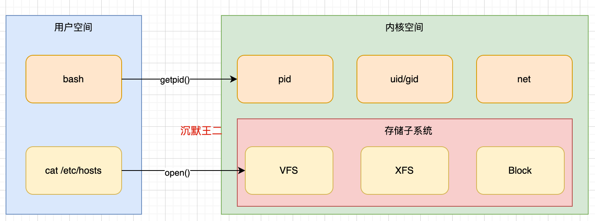
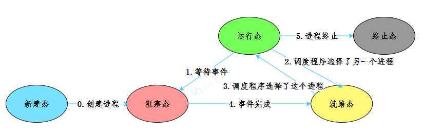
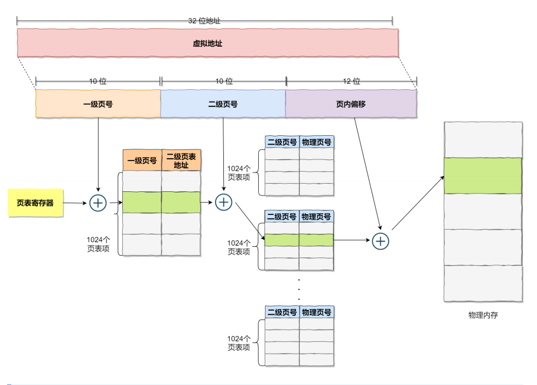
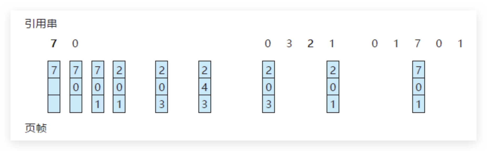
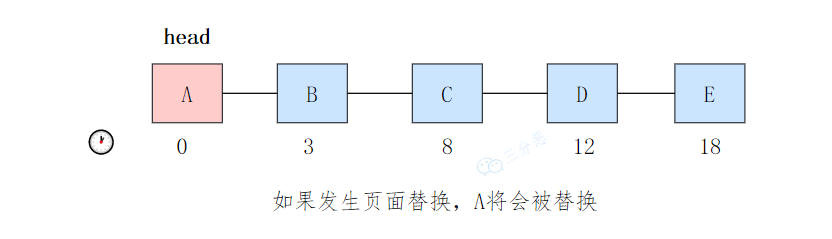
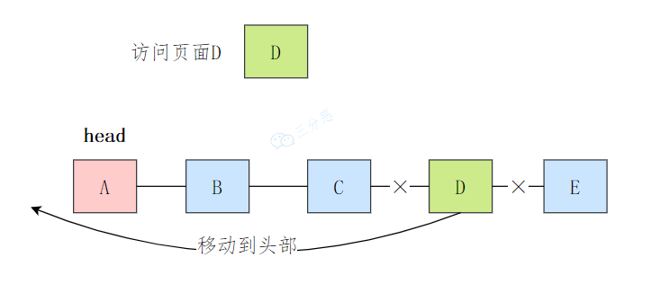
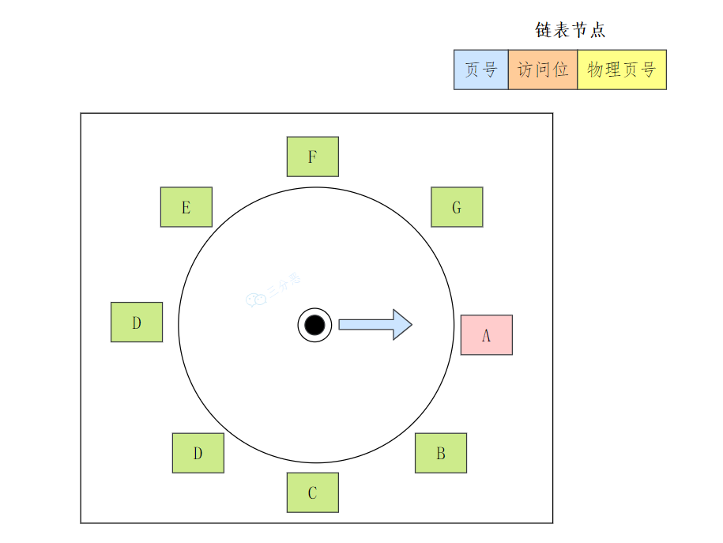
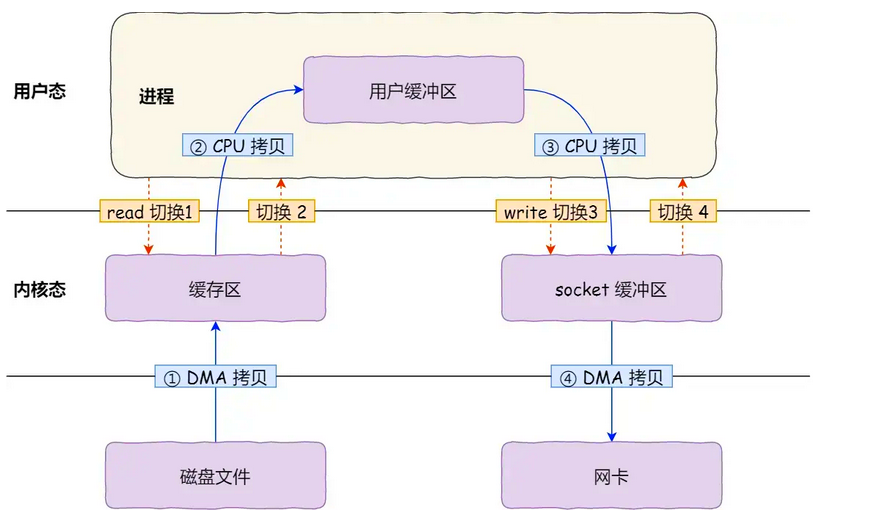

# 操作系统八股

# 引论
## 什么是操作系统？
**操作系统（Operating System, OS）** 是计算机系统中管理硬件和软件资源的中间层系统，屏蔽了硬件的复杂性，并且为用户提供了便捷的交互方式，比如 **Windows**、**Linux**、**MacOS** 等。  

## 操作系统主要有哪些功能？
1. **负责创建和终止进程**。**进程**是正在运行的程序实例，每个进程都有自己的**地址空间**和**资源**。
2. **负责为进程分配资源**，比如说**内存**，并在进程终止时**回收内存**。
3. **提供创建、删除、读写文件的功能**，并组织文件的**存储结构**，比如说**目录**。
4. **通过设备驱动程序控制和管理计算机的硬件设备**，如**键盘**、**鼠标**、**打印机**等。

# 操作系统结构
## 什么是内核？
## **内核（Kernel）**
**内核**是操作系统的**核心部分**，负责直接与**硬件**交互并提供对计算机资源的**底层控制**。它是操作系统中**最基础且关键**的组件。

---

### **内核的主要功能**
1. **资源管理**：
    - 管理 **CPU**、**内存** 和 **输入/输出设备**，确保资源的**合理分配**和**高效使用**。
2. **进程管理**：
    - 负责**创建**、**调度**、**切换**和**终止**进程，支持**多任务运行**。
3. **内存管理**：
    - 控制**物理内存**的分配，提供**虚拟内存**功能，确保不同程序间的**内存隔离**。
4. **设备驱动**：
    - 提供**统一接口**，与各种**硬件设备**交互，屏蔽**硬件差异**。
5. **系统调用接口**：
    - 为用户程序提供访问**硬件资源**和**系统服务**的入口点。

---

### **内核的分类**
1. **宏内核（Monolithic Kernel）**：
    - 所有功能都运行在**内核**中，**性能高**但**复杂度较高**。如 **Linux 内核**。
2. **微内核（Microkernel）**：
    - 仅包含**最基本功能**（如进程和内存管理），其他功能运行在**用户态**中，设计更**灵活**但**性能稍低**。如 **Minix 内核**。
3. **混合内核（Hybrid Kernel）**：
    - 结合了**宏内核**和**微内核**的优点，适度简化**内核复杂度**。如 **Windows NT 内核**。
4. **外核（Exokernel）**：
    - 将**硬件资源**直接暴露给**应用程序**，应用程序需**自行管理资源**。

## 什么是用户态和内核态？
在计算机系统中，**内存**可以分为两大区域：**内核空间**（**Kernel Space**）和**用户空间**（**User Space**）。这种划分主要用于保护系统的**稳定性**和**安全性**。

+ **用户态**：程序执行时的默认状态，权限受限，不能直接访问硬件和系统资源。
+ **内核态**：操作系统内核执行时的状态，拥有最高权限，可以访问硬件和系统资源。

## 用户态和内核态是如何切换的？
**用户态**和**内核态**的切换由**硬件**和**操作系统**共同实现，发生在以下场景：

1. **系统调用**：  
用户程序通过指令（如 ** 网络通信（**`**socket()**`）请求操作系统服务，切换到**内核态**。
2. **中断**：  
硬件发出信号（如**键盘输入**），**CPU**暂停用户程序，切换到**内核态**处理中断。
3. **异常**：  
发生异常时切换到**内核态**处理。

**切换过程**：

+ 保存**用户态**的 **CPU 状态**。
+ 改变 **CPU 模式位**，从**用户态**切换为**内核态**。
+ 执行**内核代码**完成操作。
+ 恢复**用户态**状态，返回应用程序。

**硬件支持**（如**模式位**、**中断向量表**）和**操作系统**配合，确保切换**安全高效**。

# 进程和线程
## 并行和并发有什么区别？
+ **并发**：指的是在同一时间段内，多个任务交替执行，但是同一时刻只有一个任务在执行。
+ **并行**：指的是在同一时刻，多个任务真正同时执行。

## 什么是进程上下文切换？
**上下文切换**是操作系统在**多任务处理**环境中，将 **CPU** 从一个**进程**切换到另一个**进程**的过程。通过让多个进程共享 **CPU 资源**，使系统能够**并发执行**多个任务。

**进程上下文切换**通常包含以下几个步骤：

1. **保存当前进程的上下文**：  
操作系统保存当前进程的 **CPU 寄存器**、**程序状态**等关键信息。
2. **选择下一个进程**：  
**调度程序**选择下一个要执行的进程。
3. **恢复上一个进程的上下文**。
4. **切换到下一个进程**。

## 进程有哪些状态？
**进程状态**

进程是资源分配的基本单位，表示一个独立的运行程序。进程的典型状态有以下几种：

1. **新建（New）**：
    - 进程正在被创建，还未进入就绪队列。
2. **就绪（Ready）**：
    - 进程已获得运行所需的资源，等待 CPU 调度。
3. **运行（Running）**：
    - 进程正在占用 CPU 执行代码。
4. **阻塞（Blocked）**：
    - 进程因等待某事件（如 I/O 完成）而暂停运行。
5. **终止（Terminated）**：
    - 进程执行完成或被操作系统终止，释放资源。

## 什么是僵尸进程？**僵尸进程（Zombie Process）**
**僵尸进程**是指已经终止但尚未被其**父进程**回收资源的进程。它仍然占据一个**进程表项**，但不再占用**CPU**或**内存资源**。

**僵尸进程的产生原因**

+ 子进程退出后，父进程未及时回收其退出状态。
+ 父进程长时间运行，未处理子进程状态。

**僵尸进程的特点**

1. **不占用资源**：  
僵尸进程不占用 **CPU** 或 **内存**，但会占用**进程ID（PID）****和****进程表项**。
2. **无法被杀死**：  
僵尸进程已经终止，无法通过信号（如 **kill**）终止。
3. **短暂存在**：  
通常僵尸进程会在父进程回收其资源后消失。

**解决方法**：

1. 父进程调用 `wait()` 或 `waitpid()` 回收子进程。
2. 使用 `SIGCHLD` 信号自动回收。
3. 若父进程无响应，可终止父进程，由 `init` 进程接管并清理。

**僵尸进程的影响**

1. **资源浪费**：  
僵尸进程占用**进程表项**，可能导致系统无法创建新进程。
2. **系统性能下降**：  
大量僵尸进程会消耗系统资源，影响系统性能。

## 什么是孤儿进程？
 一个**父进程**退出，而它的一个或多个**子进程**还在运行，那么这些子进程将成为**孤儿进程**。**孤儿进程**将被 **init 进程**（进程 ID 为 **1** 的进程）所收养，并由 **init 进程**对它们完成**状态收集**工作。因为**孤儿进程**会被 **init 进程**收养，所以**孤儿进程**不会对系统造成危害。  

## 进程有哪些调度算法？

<h2 id="a4eb5bc8"><strong>进程调度算法概览</strong></h2><h3 id="bb36ab06"><strong>1. 先来先服务（FCFS, First Come First Serve）</strong></h3><ul class="ne-ul"><li id="ucb41074f" data-lake-index-type="0"><strong>描述</strong>：按进程到达的顺序执行。</li><li id="u6eab3348" data-lake-index-type="0"><strong>优缺点</strong>：</li></ul><ul class="ne-list-wrap"><ul ne-level="1" class="ne-ul"><li id="ue4279725" data-lake-index-type="0">✅ 简单，适合批处理。</li><li id="uf47014e0" data-lake-index-type="0">❌ 可能导致长作业阻塞短作业（等待时间长）。</li></ul></ul><h3 id="a502c0ba"><strong>2. 短作业优先（SJF, Shortest Job First）</strong></h3><ul class="ne-ul"><li id="u0fa34ebf" data-lake-index-type="0"><strong>描述</strong>：优先执行执行时间最短的进程。</li><li id="uad985f7b" data-lake-index-type="0"><strong>优缺点</strong>：</li></ul><ul class="ne-list-wrap"><ul ne-level="1" class="ne-ul"><li id="uabcedf70" data-lake-index-type="0">✅ 减少平均等待时间。</li><li id="ub6c759a3" data-lake-index-type="0">❌ 可能导致长作业饥饿。</li></ul></ul><h3 id="2d29dc83"><strong>4. 时间片轮转（RR, Round Robin）</strong></h3><ul class="ne-ul"><li id="u179a4a24" data-lake-index-type="0"><strong>描述</strong>：每个进程按固定时间片执行，时间片用尽后切换。</li><li id="u425b0cc6" data-lake-index-type="0"><strong>优缺点</strong>：</li></ul><ul class="ne-list-wrap"><ul ne-level="1" class="ne-ul"><li id="uc140ddbe" data-lake-index-type="0">✅ 公平，适合多任务。</li><li id="u1dded838" data-lake-index-type="0">❌ 频繁切换增加开销。</li></ul></ul><h3 id="66cfa64e"><strong>5. 最高优先级调度（Priority Scheduling）</strong></h3><ul class="ne-ul"><li id="u240b48d7" data-lake-index-type="0"><strong>描述</strong>：优先执行优先级高的进程。</li><li id="u2cd299a5" data-lake-index-type="0"><strong>优缺点</strong>：</li></ul><ul class="ne-list-wrap"><ul ne-level="1" class="ne-ul"><li id="ua4ac2b9d" data-lake-index-type="0">✅ 紧急任务优先执行。</li><li id="u280c1d68" data-lake-index-type="0">❌ 低优先级进程可能永远得不到执行（饥饿问题）。</li></ul></ul><h3 id="5a49c6b5"><strong>6. 多级反馈队列（MLFQ, Multi-Level Feedback Queue）</strong></h3><ul class="ne-ul"><li id="u612f4b81" data-lake-index-type="0"><strong>描述</strong>：结合多个队列，短任务优先执行。</li><li id="ua9b562e1" data-lake-index-type="0"><strong>优缺点</strong>：</li></ul><ul class="ne-list-wrap"><ul ne-level="1" class="ne-ul"><li id="u45a7fb4d" data-lake-index-type="0">✅ 灵活，结合了多种调度策略。</li><li id="u08d7d635" data-lake-index-type="0">❌ 复杂，调度开销高。</li></ul></ul>
<h3 id="25f9c7fa"><strong>总结</strong></h3><ul class="ne-ul"><li id="u2e95d99a" data-lake-index-type="0"><strong>适合批处理</strong>：FCFS、SJF。</li><li id="u82c4c26e" data-lake-index-type="0"><strong>适合交互式系统</strong>：RR、MLFQ。</li><li id="u01166f57" data-lake-index-type="0"><strong>适合实时系统</strong>：优先级调度。</li><li id="u4d8bd5fa" data-lake-index-type="0"><strong>现代 OS（如 Linux、Windows）</strong>：基于 <strong>MLFQ</strong> 的改进。</li></ul>

### 进程调度算法
**进程调度算法**决定了操作系统如何将 **CPU** 分配给多个等待运行的进程。以下是常见的**进程调度算法**：

**1. 先来先服务（FCFS, First-Come, First-Served）**

+ **原理**：按照进程到达**就绪队列**的顺序分配 **CPU**。
+ **优点**：简单易实现，公平。
+ **缺点**：
    - 可能导致**长作业延迟短作业**（即“排队”问题）。
    - 不适合**实时系统**。

**2. 短作业优先（SJF, Shortest Job First）**

+ **原理**：优先调度预计**运行时间最短**的进程。
+ **优点**：能最小化**平均等待时间**。
+ **缺点**：
    - 需要预知**运行时间**（通常难以准确估计）。
    - 短作业可能导致**长作业**长时间得不到执行（**饥饿问题**）。

**3. 最短剩余时间优先（SRTF, Shortest Remaining Time First）**

+ **原理**：是 **SJF** 的**抢占式版本**，进程运行时，若有更短的任务到达，会中断当前进程，切换到新进程。
+ **优点**：进一步减少**平均等待时间**。
+ **缺点**：
    - 与 **SJF** 相同，易发生**长作业饥饿**。
    - 实现复杂，需频繁比较**剩余时间**。

**4. 时间片轮转（RR, Round Robin）**

+ **原理**：每个进程分配固定的**时间片**，时间片用完后切换到下一个进程。
+ **优点**：
    - 公平，适合**时间共享系统**。
    - 能快速响应**交互式任务**。
+ **缺点**：
    - 时间片太短会频繁切换，增加**调度开销**。
    - 时间片太长可能导致**响应变慢**。

**5. 优先级调度（Priority Scheduling）**

+ **原理**：为每个进程分配**优先级**，优先级高的进程先运行。
+ **优点**：可实现对**重要任务**的优先处理。
+ **缺点**：
    - 低优先级进程可能永远得不到运行（**饥饿问题**）。
    - 需要额外设计**优先级提升机制**防止饥饿。

**6. 多级队列调度（Multilevel Queue Scheduling）**

+ **原理**：将进程分为多个**优先级队列**，每个队列有独立的调度算法，高优先级队列优先。
+ **优点**：适合多种进程类型（如**系统进程**、**交互进程**、**批处理进程**）。
+ **缺点**：配置复杂，不同队列间的调度策略需慎重设计。

**7. 多级反馈队列调度（Multilevel Feedback Queue, MLFQ）**

+ **原理**：
    - 进程根据行为动态调整**优先级**。
    - 新任务优先级较高，运行时间长的任务优先级逐渐降低。
+ **优点**：
    - 结合**时间片调度**和**优先级调度**的优点。
    - 灵活，适合复杂系统。
+ **缺点**：实现复杂。

**8. 最短响应比优先（HRRN, Highest Response Ratio Next）**

+ **原理**：考虑**等待时间**和**服务时间**，计算响应比 **R = (W + S) / S**（**W** 为等待时间，**S** 为服务时间），优先调度**响应比最高**的进程。
+ **优点**：综合考虑**等待时间**和**服务时间**，减少**饥饿问题**。
+ **缺点**：需要动态计算**响应比**，增加**调度开销**。

## 进程间通信有哪些方式？
**进程间通信（IPC）**

**进程间通信（IPC）****是指两个或多个进程之间进行****数据交换**的方式。常见的进程间通信方式包括：

1. **管道（Pipe）**：  
用于**父子进程**之间或**兄弟进程**之间的通信。
2. **命名管道（Named Pipe）**：  
也称为 **FIFO**，用于没有**亲缘关系**的进程之间的通信。
3. **消息队列（Message Queue）**：  
允许一个进程向另一个进程发送**消息**。
4. **共享内存（Shared Memory）**：  
允许多个进程访问**同一块内存区域**。
5. **信号量（Semaphore）**：  
用于进程间的**同步**和**互斥**。
6. **套接字（Socket）**：  
用于**网络通信**，也可用于**同一台主机**上的进程间通信。

---

1. **管道（Pipe）**

**特性**：

+ **单向通信**：数据只能从一端写入，从另一端读取。
+ 仅用于具有**亲缘关系**的进程（如父子进程）。
+ **内核缓冲区**用于数据传递。

**扩展**：

+ **匿名管道**：只能在相关联的进程间使用。
+ **命名管道（FIFO, Named Pipe）**：允许无亲缘关系的进程通信。

---

**2. 消息队列（Message Queue）**

**特性**：

+ 提供一种**消息的链式存储机制**，进程可以发送或接收消息。
+ 消息有特定的**类型**，接收方可以按类型获取。
+ 支持**无亲缘关系**的进程通信。
+ 需要通过**系统调用**创建和操作。

**优点**：

+ 数据传递以**消息**为单位，结构化且有序。
+ 可以选择性读取**特定类型**的消息。

---

**3. 共享内存（Shared Memory）**

**特性**：

+ 多个进程共享一块**内存区域**，通过这块内存直接读写数据。
+ 是**最快**的 IPC 方式。
+ 需要配合**同步机制**（如信号量）解决并发访问问题。

**优点**：

+ **高效**，数据不需要在内核和用户空间之间来回拷贝。

**缺点**：

+ 需要自行处理**同步**和**一致性**问题。

---

**4. 信号量（Semaphore）**

**特性**：

+ 一种**计数器机制**，用于控制进程对共享资源的访问。
+ 主要用于**同步**或**互斥**。
+ 可以独立使用，也可以与其他 IPC 机制结合（如共享内存）。

**优点**：

+ **简单**、**灵活**。
+ 适合解决**并发控制**问题。

**缺点**：

+ 不直接传递数据。

---

**5. 信号（Signal）**

**特性**：

+ 用于通知进程某些**事件发生**。
+ 是一种**异步通信**方式。
+ 常用于**异常通知**（如 **SIGINT** 用于中断进程）。

**优点**：

+ **快速**、**轻量级**。
+ 适合发送简单的**控制信号**。

**缺点**：

+ 数据传递能力有限，通常只传递一个**信号编号**。

---

**6. 套接字（Socket）**

**特性**：

+ 支持**网络通信**和**本地进程间通信**（如 UNIX 域套接字）。
+ 适用于**分布式系统**中的进程通信。

**优点**：

+ **灵活**，支持远程和本地通信。
+ 无**亲缘关系**限制。

**缺点**：

+ 实现**复杂**，效率可能低于**共享内存**。

### 线程间通信有哪些方式？
## **线程间通信（ITC）**
**线程间通信（ITC）****是指同一进程内的多个线程之间进行****数据交换**的方式。常见的线程间通信方式包括：

1. **共享变量**：  
多个线程可以共享同一个**全局变量**。
2. **互斥锁（Mutex）**：  
用于保护**共享资源**，确保同一时间只有一个线程访问。
3. **条件变量（Condition Variable）**：  
用于线程间的**同步**，允许线程等待某个条件成立。
4. **信号量（Semaphore）**：  
用于控制对**共享资源**的访问，支持多个线程同时访问。

## 进程和线程的联系和区别？
+ **进程**：**进程**是操作系统进行**资源分配**和**调度**的基本单位。是程序的**执行实例**，拥有独立的**内存**和**资源**，进程间**互不干扰**。
+ **线程**：**线程**是进程的**执行单元**，是 **CPU 调度**和**分派**的基本单位，同一进程中的多个线程**共享进程的资源**，线程间**相互依赖**。

## 说一下银行家算法
**银行家算法总结**

银行家算法的核心思想，就是在分配给进程资源前，**首先判断这个进程的安全性，也就是预执行，判断分配后是否产生死锁现象**。如果系统当前资源能满足其执行，则尝试分配，如果不满足则让该进程等待。

**通过不断检查剩余可用资源是否满足某个进程的最大需求，如果可以则加入安全序列，并把该进程当前持有的资源回收；不断重复这个过程，看最后能否实现让所有进程都加入安全序列。**

安全序列一定不会发生死锁，**但没有死锁不一定是安全序列**。

## 线程上下文切换了解吗？
**线程上下文切换**

线程的上下文切换是否开销较小，取决于线程是否属于**同一个进程**：

1. **当两个线程不属于同一个进程**：  
切换的过程与**进程上下文切换**一样，需要切换**虚拟内存**、**寄存器**、**私有数据**等资源。
2. **当两个线程属于同一个进程**：  
由于**虚拟内存**是共享的，切换时只需切换线程的**私有数据**、**寄存器**等**不共享的数据**，而**虚拟内存**等资源保持不变。

因此，**线程的上下文切换**相比**进程的上下文切换**，**开销要小很多**。

## 线程有哪些实现方式？
**内核态线程实现：**在内核空间实现的线程，由**内核**直接管理线程。

**用户态线程实现：**在用户空间实现线程，不需要**内核**的参与，内核对线程**无感知**。

**混合线程实现： 结合用户级线程和内核级线程的优点，用户级线程映射到内核级线程上运行  **

## 线程间如何同步？
1. **互斥锁（Mutex）**  
    - **描述**：保护共享资源，确保同一时间只有一个线程访问。  
    - **特点**：避免数据竞争，但可能导致死锁。  
    - **适用场景**：保护临界区资源。
2. **条件变量（Condition Variable）**  
    - **描述**：允许线程等待某个条件成立，用于线程间同步。  
    - **特点**：与互斥锁配合使用，可唤醒等待线程。  
    - **适用场景**：复杂同步（如生产者-消费者问题）。
3. **信号量（Semaphore）**  
    - **描述**：控制共享资源访问，支持多个线程同时访问。  
    - **特点**：二进制或计数信号量，适合资源池管理。  
    - **适用场景**：限制资源访问数量。

## 什么是死锁？
**产生死锁的四个必要条件：**

1. **互斥条件**：一个资源任意一个时刻只由一个线程占用。
2. **请求与保持条件**：一个线程因请求资源而阻塞时，对已获得的资源保持不放。
3. **不剥夺条件**：线程已获得的资源在未使用完之前不能被其他线程强行剥夺，只有自己使用完毕后才释放资源。
4. **循环等待条件**：若干线程之间形成一种头尾相接的循环等待资源关系。

**如何预防死锁？** 破坏死锁的产生的必要条件即可：

1. **破坏请求与保持条件**：一次性申请所有的资源。
2. **破坏不剥夺条件**：允许线程在请求其他资源时，释放已经持有的资源。
3. **破坏循环等待条件**：靠按序申请资源来预防。按某一顺序申请资源，破坏循环等待条件。

## 活锁和饥饿锁了解吗？
### **活锁（Livelock）**
线程虽然没有被阻塞，但由于**不断重复相同的操作**而无法继续执行任务。

### **饥饿锁（Starvation）**
某些线程由于**优先级低**或**资源被长期占用**，始终无法获得资源而无法执行任务。

### **解决方法**
1. **活锁**：  
    - 通过引入**随机性**或**调整策略**解决。
2. **饥饿锁**：  
    - 通过**公平调度**或**优先级调整**解决。

# 内存管理
## 物理内存和虚拟内存有什么区别？
## **物理内存与虚拟内存**
+ **物理内存**是计算机硬件提供的**实际存储空间**，容量有限但**性能高**。  
+ **虚拟内存是操作系统提供的抽象内存   它可以大于物理内存  ，**支持**进程隔离**。

---

### **虚拟内存的工作原理**
1. **地址映射**：  
    - 操作系统通过**页表**将**虚拟地址**映射到**物理地址**。  
    - 每个进程有独立的**虚拟地址空间**。
2. **分页机制**：  
    - 内存被划分为固定大小的**页**（如 **4KB**）。  
    - 虚拟内存的页可以映射到**物理内存**或**磁盘**（交换空间）。
3. **页面置换**：  
    - 当物理内存不足时，操作系统将**不常用的页**换出到磁盘。  
    - 需要时再将磁盘中的页换入**物理内存**。
4. **缺页中断**：  
    - 当访问的页不在物理内存时，触发**缺页中断**，操作系统负责将页加载到内存。

## 什么是内存分段？
### 内存分段（Segmentation）
内存分段是一种内存管理方式，它将程序的内存分为多个不同大小的“段”，每个段包含一种特定类型的数据或代码。通常，一个程序会被分为几个段，比如**代码段**、**数据段**、**堆栈段**等。

### 特点
1. **段的划分**：  
程序被分为多个逻辑上相关的段，每个段有自己的名称和大小。常见的段包括：  
    - **代码段**：存储程序的执行代码。  
    - **数据段**：存储全局变量、静态变量等数据。  
    - **堆栈段**：存储函数调用时的局部变量、返回地址等。
2. **段的大小**：  
每个段的大小是动态的，不同程序可以有不同大小的段。  
3. **段表**：  
操作系统维护一个**段表**，其中包含每个段的基地址和长度。当访问某个段时，操作系统根据段表查找并提供地址映射。

### 优点
+ **灵活性**：可以根据程序的需求分配不同大小的内存段。  
+ **逻辑结构清晰**：将程序按功能模块进行分段，有助于管理和保护不同的程序部分。

### 缺点
+ **外部碎片**：由于段的大小不固定，可能导致内存中无法找到足够连续的空间来存放新的段，从而产生外部碎片。

## 什么是内存分页？
+ **分页（Paging）**：把内存划分为**固定大小的页**，通过**页表将虚拟地址**映射到物理地址，来简化内存管理。
+ **分段（Segmentation）**：根据**程序的逻辑结构**（如代码段、数据段、堆栈段）划分内存，提供**灵活的访问控制**。

### 内存分页（Paging）
 按固定大小划分内存，避免内存碎片问题 

内存分页是一种将内存分为固定大小的小块（称为“页”）的方法。每个页的大小通常是固定的，如**4KB**。程序的地址空间也被分为固定大小的页，并通过分页机制进行管理。分页的核心思想是将内存逻辑地址空间和物理地址空间之间的映射管理抽象成固定大小的块，从而**消除外部碎片**的问题。

### 特点
1. **页大小**：  
内存和程序的地址空间都被划分为大小相等的页（一般为**4KB**或更大）。  
2. **页表**：  
操作系统为每个进程维护一个**页表**，记录虚拟地址与物理地址的映射关系。每个虚拟页号映射到物理内存的一个**页框**（页面的物理块）。  
3. **页框**：  
物理内存也被划分为相同大小的块，称为**页框**。页框的数量是有限的，操作系统会根据页表进行地址映射。

### 优点
+ **消除外部碎片**：由于页大小固定，物理内存和虚拟内存的映射不需要连续的内存空间，减少了外部碎片的产生。  
+ **内存管理简化**：可以使用更简单的页表管理和替换策略，不需要动态分配和调整内存大小。  
+ **虚拟内存**：通过分页，操作系统能够使用硬盘空间作为扩展内存（虚拟内存）。

### 缺点
+ **内部碎片**：由于每个页大小固定，某些页面可能不会完全填满，从而浪费一些空间。  
+ **管理开销**：维护页表需要一定的开销，并且在访问内存时需要查找页表，可能带来性能上的损耗。

## 多级页表知道吗？
### 多级页表（Multilevel Page Table）
多级页表是一种**内存管理技术**，用于在**虚拟内存系统**中**高效地管理和转换虚拟地址到物理地址**。它通过**分层结构**减少页表所需的内存开销，以解决**单级页表在大地址空间中的效率问题**。

### 背景概述
在虚拟内存系统中，**虚拟地址需要转换为物理地址**。页表是实现这种转换的**关键数据结构**。对于 **32 位系统**：

+ 一个进程的地址空间可以达到 **4 GB**。
+ 如果使用单级页表，每个**页表条目（PTE）**占用 **4 字节**。
+ 需要 **4 MB** 的内存来存储页表。

然而，许多进程**只使用其中的一小部分地址空间**，导致单级页表的**内存浪费**。

### 多级页表的解决方案
多级页表通过将**单级页表拆分为多个层级**，减少了**内存浪费**。以**两级页表**为例：

1. **一级页表（页目录）**：
    - **存储二级页表的地址**。
    - 每个**页目录条目（PDE）****指向一个****二级页表**。
2. **二级页表（页表）**：
    - **存储实际的页框地址**。
    - 每个**页表条目（PTE）****指向一个****物理页框**。

### 虚拟地址分解
虚拟地址被分为**多个部分**，每一部分用于索引相应层级的页表。以 **32 位地址** 和 **4 KB 页大小** 的两级页表为例：

+ **高 10 位**：一级页表索引（**页目录索引**）。
+ **中 10 位**：二级页表索引（**页表索引**）。
+ **低 12 位**：页内偏移（**页偏移量**）。

这种**分层结构**显著减少了未使用页表的存储需求，从而**提升内存管理的效率**。

## 什么是快表？
**快表（TLB, Translation Lookaside Buffer）** 是处理器中的高速缓存，用于存储最近使用的虚拟地址到物理地址的映射，提升虚拟内存访问效率。

### 关键点：
1. **作用**：减少页表查找次数，加快地址转换。
2. **工作流程**： 
    - 先查快表，命中则快速返回物理地址；
    - 未命中则查页表，并将结果加载到快表。
3. **特点**： 
    - 存储最近使用的地址映射，容量小但速度快；
    - 利用时间局部性和空间局部性。
4. **性能**： 
    - **命中率**：通常 >90%，决定了转换效率；
    - **有效访问时间（EAT）**：综合快表命中与未命中的访问延迟。

**快表的意义**：减少页表查找开销，大幅提升虚拟内存系统性能。

## 分页和分段有什么区别？
### **1. 基本概念**
+ **分页（Paging）**  
将内存和进程地址空间划分为固定大小的块，分别称为**页（Page）****和****页框（Frame）**，页的大小固定且一致。
+ **分段（Segmentation）**  
将内存划分为逻辑上的不定长段（Segment），每段表示一个完整的逻辑单元（如代码段、数据段、堆栈段）。

### **2. 地址空间**
**分页**  
虚拟地址由**页号**和**页内偏移量**组成。

+ 虚拟地址=页号+页内偏移

**分段**  
虚拟地址由**段号**和**段内偏移量**组成。

+ 虚拟地址=段号+段内偏移

**总结：**

+ **分页**：以**物理块大小**划分，强调**内存管理效率**。
+ **分段**：以**逻辑功能**划分，强调**程序逻辑的表达**。

## 什么是交换空间？
**交换空间（Swap Space）** 是磁盘上用于存储被临时置换出内存的数据的区域，主要在物理内存不足时使用。

### **作用**：
1. **扩展内存**：提供额外的虚拟内存，防止内存不足。
2. **内存管理**：将不常用数据移至磁盘，腾出物理内存。
3. **进程挂起**：存储挂起进程的数据。

### **形式**：
+ **交换分区**：专用磁盘分区。
+ **交换文件**：普通文件作为交换空间。

### **优缺点**：
+ **优点**：提升系统稳定性，防止内存耗尽。
+ **缺点**：磁盘速度慢，频繁使用会导致性能下降（交换颠簸）。

**总结**：交换空间是虚拟内存的一部分，提升系统内存灵活性，但性能远不如物理内存。

## 什么是缺页中断？
**缺页中断（Page Fault）** 是程序访问的虚拟地址不在物理内存时触发的中断事件，用于加载所需页面。

---

### **过程**：
1. 程序访问虚拟地址，硬件发现页面不在内存。
2. 触发缺页中断，操作系统从磁盘加载页面到内存。
3. 更新页表，继续程序执行。

---

### **分类**：
+ **合法缺页**：页在磁盘中但尚未加载。
+ **非法缺页**：访问无效地址，程序被终止。

---

### **优化**：
1. 增加物理内存。
2. 使用高效置换算法（如LRU）。
3. 优化程序内存访问模式。

---

**总结**：缺页中断支持虚拟内存高效管理，但频繁发生会影响性能。

## 页面置换算法有哪些？
页面置换算法用于决定当物理内存已满且需要加载新的页面时，应将哪个页面从内存中移除。常见的页面置换算法包括以下几种：

---

**1. 最优页面置换算法（Optimal Page Replacement, OPT）**

+ **原理**：选择将来**最长时间不再被使用**的页面进行置换。
+ **优点**：理论上最优，但需要预知未来的页面访问序列，实际中无法实现。
+ **用途**：作为其他算法性能的参考标准。

---

**2. 先进先出算法（First-In-First-Out, FIFO）**

+ **原理**：按照页面进入内存的顺序，最早进入的页面最先被置换。
+ **优点**：简单易实现。
+ **缺点**：可能出现**Belady异常**（增加内存反而增加缺页次数）。
+ 

---

**3. 最近最久未使用算法（Least Recently Used, LRU）**

+ **原理**： 淘汰最近没有使用的页面。LRU 算法根据页面的访问历史来进行置换  。
+ **优点**：性能较好，接近OPT算法。
+ **缺点**：需要额外硬件支持（如时间戳或链表），开销较大。
+ 

---

**4. 时钟算法（Clock 或 Second Chance）**

+ **原理**： 使用环形链表，为每个页面设置一个**使用位（Use Bit）**，顺序检查页面：
    - 如果使用位为1，清零并跳过，保留页面；
    - 如果使用位为0，置换该页面。
+ **优点**：改进了FIFO，性能接近LRU，但实现简单。
+ **缺点**：在高负载下可能退化为FIFO。
+ 

**5. 最少使用算法（Least Frequently Used, LFU）**

+ **原理**：置换访问次数最少的页面。
+ **优点**：适用于某些特定场景。
+ **缺点**：无法适应热点变化，可能导致低频页面长期驻留。

**总结**：

+ **最佳性能**：OPT（理论）。
+ **实用性较高**：LRU、时钟算法。
+ **简单实现**：FIFO。

不同算法在性能和实现复杂度上各有优劣，实际选择取决于系统需求和硬件支持。

# 文件
## 硬链接和软链接有什么区别？
+ **硬链接**（Hard Link）：硬链接是文件的直接引用，它为文件分配一个新的目录项。硬链接直接指向文件的数据块（**inode**）  
+ **软链接**（Soft Link）：一个独立的文件，里面存储的是目标文件的路径，类似于一个“快捷方式”。

# 中断
## 什么是中断？
**中断**是计算机系统中的一种机制，用于处理 **异步事件** 或 **异常情况**。当系统运行过程中发生一些特殊事件（如硬件请求、异常错误等）时，CPU会暂停当前的指令执行，转而去处理这些事件，处理完毕后再继续之前的任务。  

## 讲讲中断的流程
### 中断的处理流程
1. **中断发生**：
    - 外设或内部事件发出中断信号。
2. **中断响应**：
    - CPU完成当前指令后检查是否有中断信号。
    - 如果有，保存当前上下文（寄存器、程序计数器等），转入中断服务程序。
3. **中断服务**：
    - 执行与中断类型对应的中断服务程序（ISR, Interrupt Service Routine）。
4. **恢复运行**：
    - 中断处理完成后，恢复上下文，继续执行被中断的任务。

## 中断的类型有哪些？
### 中断的分类
#### 1. **按来源**
1. **硬件中断**：
    - 来源于硬件设备（如键盘、鼠标、硬盘等）。
    - 例子：键盘按键触发中断、网卡接收数据触发中断。
2. **软件中断**：
    - 来源于软件执行（如用户程序发起的中断请求）。
    - 例子：使用系统调用（`int` 指令触发中断）。
3. **异常**：
    - 来源于CPU执行指令过程中发生的错误或异常情况。
    - 例子：除零错误、内存访问越界、非法指令等。

#### 2. **按触发方式**
1. **可屏蔽中断（Maskable Interrupt）**：
    - 可以通过设置某些寄存器（如中断屏蔽寄存器）来忽略此类中断。
    - 常用于一般的硬件中断。
2. **不可屏蔽中断（Non-Maskable Interrupt, NMI）**：
    - 无法被屏蔽，系统必须处理。
    - 常用于紧急事件，如硬件故障。

## 中断的作用是什么？
中断的主要作用包括：

1. **提高响应速度**：系统能及时响应外部事件，如键盘输入或硬盘数据完成。
2. **提高资源利用率**：避免CPU因等待外设操作而浪费时间。
3. **支持并发操作**：允许系统同时处理多任务，增强多任务能力。
4. **实现实时处理**：满足工业控制、医疗等场景的实时性需求。
5. **简化编程**：将外设与CPU的通信抽象为异步事件，简化开发。
6. **处理异常和错误**：捕获和处理系统运行中的异常（如除零、越界等）。
7. **优化用户交互**：支持键盘、鼠标等输入设备的实时交互。

总之，中断提高了系统的实时性、效率和可靠性，是现代计算机的重要机制。

# IO
## 你了解过哪些io模型？
+ **阻塞I/O模型**：  
应用程序发起I/O操作后会被**阻塞**，直到操作完成才返回结果。
    - 适用于对**实时性要求不高**的场景。
+ **非阻塞I/O模型**：  
应用程序发起I/O操作后**立即返回**，不会被阻塞，但需要不断**轮询**或者使用**select/poll/epoll**等系统调用来检查I/O操作是否完成。
    - 适合于需要进行**多路复用**的场景，例如需要同时处理多个socket连接的服务器程序。
+ **I/O复用模型**：  
通过**select、poll、epoll**等系统调用，应用程序可以同时等待多个I/O操作，当其中任何一个I/O操作准备就绪时，应用程序会被通知。
    - 适合于需要同时处理**多个I/O操作**的场景，比如高并发的服务端程序。
+ **信号驱动I/O模型**：  
应用程序发起I/O操作后，可以继续做其他事情，当I/O操作完成时，操作系统会向应用程序发送**信号**来通知其完成。	
    - 适合于需要**异步I/O通知**的场景，可以提高系统的并发能力。
+ **异步I/O模型**：  
应用程序发起I/O操作后可以**立即做其他事情**，当I/O操作完成时，应用程序会得到通知。异步I/O模型由**操作系统内核**完成I/O操作，应用程序只需等待通知即可。
    - 适合于需要**大量并发连接**和**高性能**的场景，能够减少系统调用次数，提高系统效率。

##  Reactor 模式是什么  
**Reactor 模式**是一种事件驱动的设计模式，常用于处理高并发网络请求。它通过 **I/O 多路复用** 监听多个事件，并在事件发生时分发给对应的处理器（Handler）。

### **核心组件**
+ **Reactor**：监听和分发事件。
+ **Handler**：处理具体的 I/O 事件。
+ **Acceptor**：处理新连接请求。

### **工作流程**
1. Reactor 使用 I/O 多路复用监听事件。
2. 事件发生后，将其分发给相应的 Handler。
3. Handler 执行事件处理逻辑。

### **优点**
+ 高效处理并发请求，减少线程切换。
+ 提升资源利用率，降低延迟。

**应用场景**：如 Nginx、Redis 等高性能服务器。

## 服务器处理并发请求有哪几种方式？
+ **单线程Web服务器**：  
Web服务器一次处理**一个请求**，结束后读取并处理下一个请求。性能较低，**一次只能处理一个请求**，适合低并发场景。
+ **多进程/多线程Web服务器**：  
Web服务器生成**多个进程或线程**并行处理多个用户请求。进程或线程可以按需或事先生成。
    - 优点：可以同时处理多个请求。
    - 缺点：当并发请求数量达到**成千上万**时，多个进程或线程会消耗大量系统资源。（每个进程或线程只能响应一个请求，且一个进程对应一个线程。）
+ **I/O多路复用Web服务器**：  
Web服务器通过**I/O多路复用**技术，使用**一个线程**监听和处理多个客户端的I/O事件。
    - 优点：资源占用少，适合高并发场景。
    - 缺点：编程复杂度较高。
+ **多路复用多线程Web服务器**：  
结合**多进程**和**I/O多路复用**的Web服务器架构。
    - 优点：避免单个进程处理过多请求，充分利用多CPU主机的计算能力。（多个进程，每个进程生成多个线程，每个线程处理一个请求。）
    - 缺点：实现复杂，需要平衡进程和线程的数量。

## 讲一下io多路复用
**IO多路复用**（I/O Multiplexing）是一种高效处理多个文件描述符（文件、网络连接等）IO操作的技术，在需要同时处理多个IO事件的场景中非常有用，例如网络服务器。它的核心思想是通过一个阻塞的系统调用，监听多个文件描述符，等待其中一个或多个准备就绪，从而避免一个一个地轮询检查。

以下是对IO多路复用的详细讲解：

---

### **1. IO多路复用的核心作用**
+ **高效等待多个事件**：通过一个线程同时监听多个IO操作。
+ **避免资源浪费**：与传统阻塞IO不同，它不会为每个连接创建线程，而是通过统一的接口等待多个IO事件，减少线程数量，节约系统资源。
+ **异步处理**：只在有IO事件时处理，提高了并发性能。

---

### **2. 实现IO多路复用的系统调用**
主要包括以下几种：

#### **(1) select**
+ **简介**：最早的IO多路复用接口，几乎所有操作系统都支持。
+ **机制**：
    - 使用三个文件描述符集合：`readfds`（可读），`writefds`（可写），`exceptfds`（异常）。
    - 程序将感兴趣的文件描述符添加到这些集合中，然后调用 `select`。
    - 阻塞直到有文件描述符准备就绪，或者超时时间到。
+ **缺点**：
    - 文件描述符数量有限：由 `FD_SETSIZE` 定义，通常是 1024。
    - 每次调用都需要重新设置文件描述符集合，效率较低。

#### **(2) poll**
+ **简介**：克服了 `select` 的一些限制。
+ **机制**：
    - 传入一个包含所有需要监听的文件描述符及其事件类型的数组。
    - 返回时数组中会标记哪些描述符有事件发生。
+ **优点**：文件描述符数量不再受限制。
+ **缺点**：需要遍历整个数组以找到就绪的文件描述符，效率较低。

#### **(3) epoll**
+ **简介**：Linux特有，是 `select` 和 `poll` 的增强版本。
+ **机制**：
    - 分为两步：
        1. **创建epoll对象**：使用 `epoll_create` 创建一个管理多个文件描述符的内核对象。
        2. **管理文件描述符**：通过 `epoll_ctl` 增加、删除、修改文件描述符。
        3. **等待事件**：通过 `epoll_wait` 阻塞等待事件。
    - 事件通知机制基于 **回调** 和 **红黑树**。
+ **优点**：
    - **事件驱动**：只返回有事件的文件描述符，无需遍历整个集合。
    - **高效管理**：使用内核空间维护事件列表。
    - **无描述符限制**：理论上可以监听任意数量的描述符。

## select、poll、epoll的区别是什么？
`select`、`poll`、`epoll` 是三种实现 IO 多路复用的方式，虽然目标相同，但在原理、性能和适用场景上存在显著差异。以下是详细对比和分析：

---

### 一、核心区别总结
| 特性 | **select** | **poll** | **epoll** |
| --- | --- | --- | --- |
| **数据结构** | 位图数组（固定大小） | 动态链表 | 红黑树（管理）+ 双向链表（事件队列） |
| **最大文件描述符** | 受内核限制（通常为 1024 或 2048） | 无限制（受系统资源限制） | 无限制（受系统资源限制） |
| **调用机制** | 每次调用需要重新传入所有文件描述符 | 每次调用需要重新传入所有文件描述符 | 注册后无需重复传入 |
| **事件返回方式** | 遍历文件描述符，检查状态 | 遍历文件描述符，检查状态 | 仅返回就绪文件描述符 |
| **性能** | O(n) | O(n) | O(1) |
| **触发模式** | 水平触发（LT） | 水平触发（LT） | 水平触发（LT）和边沿触发（ET） |
| **适用场景** | 小规模并发 | 中等规模并发 | 高并发、高性能场景 |

---

### 二、工作原理对比
#### 1. `select`
+ **原理**：
    - 用户在调用 `select` 时，将关心的文件描述符集合通过数组传递给内核。
    - 内核扫描这些文件描述符的状态，并修改数组内容，标记哪些描述符已就绪。
    - 用户需要遍历整个数组，判断哪些文件描述符是可用的。
+ **缺点**：
    - **文件描述符数量限制**：由宏 `FD_SETSIZE` 定义，默认值通常是 1024。
    - **效率低下**：每次调用都需要重新传递文件描述符集，并遍历所有描述符。
    - **可扩展性差**：对于大规模连接，性能会明显下降。
+ **优点**：
    - 简单，跨平台（几乎所有类 Unix 系统都支持）。

---

#### 2. `poll`
+ **原理**：
    - 类似于 `select`，但使用一个动态链表来管理文件描述符集，解决了 `select` 的固定大小限制。
    - 用户通过结构体数组传递文件描述符及其事件信息。
    - 内核扫描文件描述符的状态，将就绪信息返回给用户。
+ **缺点**：
    - 每次调用仍需传递所有文件描述符。
    - 需要遍历所有文件描述符以找到就绪的文件描述符，性能和 `select` 类似。
+ **优点**：
    - 不限制文件描述符数量。
    - 使用起来比 `select` 更灵活。

---

#### 3. `epoll`
+ **原理**：
    - 使用事件通知机制，避免反复传递文件描述符。
    - 分为三个操作：
        1. `epoll_create`：创建一个 `epoll` 实例。
        2. `epoll_ctl`：将需要监听的文件描述符及其事件注册到 `epoll` 实例中（一次注册，持久有效）。
        3. `epoll_wait`：只返回就绪的文件描述符。
    - 内核通过红黑树管理文件描述符，通过双向链表管理就绪事件队列。

<strong>epoll 的底层数据结构</strong>
<h3 id="f16d0244"><strong>epoll 的底层数据结构</strong></h3><ol class="ne-ol"><li id="u1fa405fb" data-lake-index-type="0"><strong>红黑树</strong>：</li></ol><ul class="ne-list-wrap"><ul ne-level="1" class="ne-ul"><li id="u0a601d3d" data-lake-index-type="0">用于管理所有被注册到 <code class="ne-code">epoll</code> 实例的文件描述符（FD）。</li><li id="u35e15fd2" data-lake-index-type="0">在调用 <code class="ne-code">epoll_ctl</code> 添加（<code class="ne-code">EPOLL_CTL_ADD</code>）或修改（<code class="ne-code">EPOLL_CTL_MOD</code>）文件描述符时，文件描述符会被插入到红黑树中。</li><li id="u2f46f28d" data-lake-index-type="0">红黑树的性质：</li></ul></ul><ul class="ne-list-wrap"><ul class="ne-list-wrap"><ul ne-level="2" class="ne-ul"><li id="u74b0cfd7" data-lake-index-type="0">自平衡二叉搜索树，插入、删除和查找的时间复杂度是 O(log⁡n)O(\log n)O(logn)。</li><li id="u11a271eb" data-lake-index-type="0">保证了 <code class="ne-code">epoll</code> 在大规模文件描述符的情况下，仍能高效管理这些描述符。</li></ul></ul></ul><ul class="ne-list-wrap"><ul ne-level="1" class="ne-ul"><li id="u8404b514" data-lake-index-type="0"><strong>作用</strong>：</li></ul></ul><ul class="ne-list-wrap"><ul class="ne-list-wrap"><ul ne-level="2" class="ne-ul"><li id="ud23e3a88" data-lake-index-type="0">快速查找已注册的文件描述符，避免重复注册。</li><li id="u594b65bd" data-lake-index-type="0">高效管理文件描述符集合。</li></ul></ul></ul><ol start="2" class="ne-ol"><li id="u6f85fe49" data-lake-index-type="0"><strong>双向链表</strong>：</li></ol><ul class="ne-list-wrap"><ul ne-level="1" class="ne-ul"><li id="ua431857b" data-lake-index-type="0">用于维护就绪事件队列。</li><li id="u5bd832da" data-lake-index-type="0">当某个文件描述符上的事件触发时（如有数据可读或写缓冲区可用），内核会将对应的文件描述符挂到双向链表中。</li><li id="ub3be658a" data-lake-index-type="0">调用 <code class="ne-code">epoll_wait</code> 时，只需遍历这个链表即可快速获取所有就绪的文件描述符。</li><li id="uab099166" data-lake-index-type="0"><strong>作用</strong>：</li></ul></ul><ul class="ne-list-wrap"><ul class="ne-list-wrap"><ul ne-level="2" class="ne-ul"><li id="u675d6d50" data-lake-index-type="0">避免扫描整个红黑树。</li><li id="ud9108858" data-lake-index-type="0">只需处理发生了事件的文件描述符，减少不必要的遍历开销。</li></ul></ul></ul>

+ **优点**：
    - **高性能**：只需操作就绪的文件描述符，避免了大规模遍历。
    - **边沿触发（ET）支持**：允许高效处理高频事件。
    - **大规模连接支持**：适合上万甚至更高并发连接的场景。
+ **缺点**：
    - 较复杂：API 的设计比 `select` 和 `poll` 更复杂。
    - 某些场景下，边沿触发模式需要更加小心地处理。

---

### 三、性能对比
#### 1. **select 和 poll 的性能瓶颈**
+ **数据传递开销**：
    - 每次调用 `select` 或 `poll`，都需要将整个文件描述符集合从用户态拷贝到内核态。
    - 文件描述符集合过大时，传递开销显著增加。
+ **事件返回开销**：
    - `select` 和 `poll` 需要用户遍历整个文件描述符集合以判断哪个描述符已就绪。
    - 如果就绪的描述符数量很少，大部分遍历工作是无效的。

#### 2. **epoll 的性能优势**
+ **持久注册**：
    - 使用 `epoll_ctl` 将文件描述符注册到内核后，文件描述符信息保存在内核中，无需每次调用时重新传递。
+ **就绪队列**：
    - 仅返回发生事件的文件描述符，无需遍历。
+ **边沿触发优化**：
    - 在高频事件场景中，只在状态变化时通知应用程序，减少了 I/O 系统调用次数。

---

### 四、使用场景建议
+ **select**：
    - **适用场景**：小规模连接，兼容性要求高的程序。
    - **示例**：嵌入式系统或需要运行在旧版本操作系统上的程序。
+ **poll**：
    - **适用场景**：中等规模连接，跨平台且文件描述符数量较大的程序。
    - **示例**：一些兼容性要求高，但文件描述符数量大于 1024 的应用。
+ **epoll**：
    - **适用场景**：高并发、大规模连接的服务器程序。
    - **示例**：高性能 Web 服务器（如 Nginx）、即时通讯服务（如 WhatsApp）。

---

+ `select`：适合简单、小规模场景，但性能有限。
+ `poll`：改善了文件描述符限制，但仍存在效率瓶颈。
+ `epoll`：最适合高性能、高并发场景，是现代 Linux 应用的首选。

## epoll的边缘触发和水平触发有什么区别？
**epoll** 是 Linux 中高效的 I/O 事件通知机制，支持两种触发模式：**边缘触发（Edge Triggered, ET）** 和 **水平触发（Level Triggered, LT）**。它们的区别如下：

---

### 1. **水平触发（LT）**
+ **工作原理**：  
只要文件描述符（fd）处于**就绪状态**（如缓冲区有数据可读或可写），epoll 就会一直通知，直到数据被读完。
+ **特点**：  
    - 应用程序可以不立即处理事件，下次调用 `epoll_wait` 时仍会收到通知。  
    - 适合编程简单、对事件处理实时性要求不高的场景。
+ **示例**：  
如果 socket 接收缓冲区有数据未读完，`epoll_wait` 会一直通知，直到数据被读完。

---

### 2. **边缘触发（ET）**
+ **工作原理**：  
仅在文件描述符状态**发生变化时**（如从无数据到有数据）通知一次，即使数据未读完，也不会再次通知。
+ **特点**：  
    - 应用程序必须**一次性处理完所有数据**，否则可能丢失后续事件。  
    - 需要将 fd 设置为非阻塞模式，并通过循环读取或写入确保完全处理。  
    - 性能更高，适合高并发、高性能场景。
+ **示例**：  
如果 socket 接收缓冲区有数据，`epoll_wait` 只通知一次，即使数据未读完，也不会再次通知。

---

### 3. **对比总结**
| **特性** | **水平触发（LT）** | **边缘触发（ET）** |
| --- | --- | --- |
| **通知频率** | 持续通知，直到事件被处理 | 仅在状态变化时通知一次 |
| **编程复杂度** | 简单，适合初学者 | 复杂，需确保一次性处理完事件 |
| **性能** | 较低，可能产生重复通知 | 较高，减少不必要的通知 |
| **适用场景** | 对实时性要求不高的场景 | 高并发、高性能场景 |
| **fd 模式** | 阻塞或非阻塞均可 | 必须设置为非阻塞模式 |

---

### 4. **选择建议**
+ 如果需要简单实现且对性能要求不高，选择 **LT**。
+ 如果需要高性能、低延迟，且能处理复杂逻辑，选择 **ET**。

ET 是 epoll 高性能的关键，但需要开发者更谨慎地处理事件，避免遗漏。

## redis，nginx，netty是依赖什么做的这么高性能？
Redis、Nginx 和 Netty 的高性能来源于对系统资源的高效利用和精心设计的架构。它们的核心性能依赖主要包括以下几个方面：

---

### **Redis 高性能依赖点**
1. **单线程架构**：
    - Redis 使用单线程处理所有请求，避免了多线程的上下文切换和锁竞争开销。
    - 单线程专注于内存操作和网络 I/O，配合事件驱动模型实现高效的任务处理。
2. **I/O 多路复用**：
    - Redis 依赖 I/O 多路复用（`epoll`、`select` 或 `kqueue`），可以高效处理成千上万的并发连接。
3. **内存存储**：
    - 所有数据都存储在内存中，读写速度极快。
    - 内存操作避免了磁盘 I/O 的延迟。
4. **高效的数据结构**：
    - Redis 提供了多种专门优化的数据结构（如字符串、哈希表、列表、集合等），这些数据结构在内存中设计高度优化，性能非常高。
5. **高效的协议**：
    - Redis 使用 RESP（Redis Serialization Protocol）协议，简单、高效，减少了客户端与服务器之间的通信开销。
6. **管道和批量操作**：
    - 支持命令管道和批量操作，减少网络通信次数。

---

### **Nginx 高性能依赖点**
1. **事件驱动架构**：
    - 使用高效的事件驱动模型（`epoll` 在 Linux 上，`kqueue` 在 BSD 上）。
    - 基于非阻塞 I/O 和异步事件处理，能够处理大规模并发连接。
2. **多进程模型**：
    - Nginx 使用多进程（或多线程）架构，每个工作进程独立运行，互不干扰。
    - 主进程负责管理，工作进程处理请求，进程间通过共享内存或信号通信。
3. **内存池机制**：
    - Nginx 使用内存池进行内存管理，减少频繁的内存分配和回收，提高性能。
4. **高效的负载均衡**：
    - 支持多种负载均衡策略（如轮询、IP 哈希等），快速分发请求到后端服务器。
5. **高性能静态文件处理**：
    - 针对静态文件的读取和传输进行了优化，例如零拷贝技术（`sendfile`）。
6. **模块化设计**：
    - 各种功能通过模块实现（如缓存模块、反向代理模块），核心逻辑简洁，扩展性强。

---

### **Netty 高性能依赖点**
1. **NIO 框架**：
    - 基于 Java 的 NIO（New I/O）实现，采用异步非阻塞模型，高效处理 I/O 操作。
    - 使用 I/O 多路复用机制（`epoll` 或 `select`）。
2. **事件驱动模型**：
    - 使用 Reactor 模式，将事件（如读、写、连接）分发给不同的事件处理器，避免阻塞。
3. **线程模型优化**：
    - 使用线程池管理 I/O 线程和工作线程，减少线程上下文切换的开销。
    - 默认分为 Boss 和 Worker 两组线程池，分别负责连接接入和数据读写。
4. **零拷贝优化**：
    - 利用 Java NIO 的直接缓冲区（`DirectByteBuffer`）和操作系统的零拷贝能力（如 `sendfile`），减少数据在内存中的拷贝次数。
5. **内存管理**：
    - 提供高效的内存分配机制（`ByteBuf`），支持池化操作，减少内存分配和回收的开销。
6. **灵活的协议支持**：
    - 内置支持多种协议（如 HTTP、WebSocket），并允许开发者自定义协议。
7. **高度可定制化**：
    - 通过 ChannelPipeline 和 Handler 架构，开发者可以灵活插入自定义逻辑。

---

### **共性与差异**
| 特性 | **Redis** | **Nginx** | **Netty** |
| --- | --- | --- | --- |
| **核心模型** | 单线程 + I/O 多路复用 | 多进程 + I/O 多路复用 | 多线程 + Reactor |
| **事件处理机制** | 事件驱动 | 事件驱动 | 事件驱动 |
| **内存管理** | 内存存储，直接操作内存 | 内存池 | 内存池 |
| **零拷贝技术** | 无需频繁磁盘 I/O | `sendfile` 优化文件传输 | 直接缓冲区和零拷贝 |
| **数据处理** | 高效的数据结构 | 静态文件和反向代理优化 | 高效的数据流和协议处理 |
| **适用场景** | 高速缓存、数据存储 | 高并发 HTTP 请求处理 | 高并发网络应用框架 |

---

### **总结**
+ **Redis**：基于内存存储 + 单线程 + 高效数据结构，擅长快速数据访问和缓存。
+ **Nginx**：基于多进程 + 事件驱动，专注于高并发的 HTTP 请求处理。
+ **Netty**：基于多线程 + Reactor 模式，提供灵活的网络通信框架，适合构建高性能的网络服务。

三者各自针对特定场景进行了优化，但都依赖 I/O 多路复用、事件驱动模型和高效的资源管理来实现高性能。

## 零拷贝了解吗？（零拷贝（mmap，zerofile）这个可以结合rocketmq和kafk来说）
**零拷贝（Zero Copy）** 是一种优化数据传输的技术，通过减少数据在用户空间和内核空间之间的复制次数，提高了系统性能和效率。零拷贝主要应用于文件传输、网络通信等需要高效处理大数据的场景。

---

### **1. 什么是零拷贝？**
在传统的数据传输过程中（如文件从磁盘到网络），数据通常会在以下几个位置间移动：

1. 从磁盘复制到内核空间的缓冲区。
2. 从内核空间的缓冲区复制到用户空间。
3. 从用户空间再复制回内核网络缓冲区。
4. 最终通过网络发送。

**零拷贝** 的目标是减少或完全避免数据从一个内存区域复制到另一个内存区域的操作，从而提高效率。通过某些操作系统的支持，可以让数据直接在内核空间传递，避免进出用户空间的多余拷贝。

---

### **2. 零拷贝的实现方式**
零拷贝可以通过不同的技术和系统调用实现，各种实现方式在底层细节上可能有所不同。

#### **(1) sendfile 系统调用**
+ **简介**：`sendfile` 是 Linux 提供的一种直接发送文件的方法。
+ **工作流程**：
    - 系统调用方法直接将数据从文件描述符传输到目标描述符（如网络套接字），完全在内核空间中完成，避免了用户空间和内核空间之间的数据拷贝。  

#### **(2) mmap + write**
+ **mmap**：将内核缓冲区的数据映射到用户空间，避免了从内核缓冲区到用户缓冲区的拷贝。
+ **write**：直接将映射的内存数据写入到网络缓冲区。

#### **(3) DMA（Direct Memory Access）**
+ **简介**：通过 DMA 技术，将数据直接从磁盘传输到网络设备，而无需经过 CPU。
+ **工作流程**：
    - 文件数据通过 DMA 直接从磁盘传输到网络设备，完全绕过 CPU 和内存。

#### **(4) splice 系统调用**
+ **简介**：`splice` 可以在两个文件描述符之间传递数据，而无需将数据从内核空间拷贝到用户空间。

### **3. 零拷贝的优点**
+ **减少 CPU 占用**：避免数据在用户空间和内核空间之间的多次拷贝，减少了 CPU 的数据处理负担。
+ **提高吞吐量**：数据直接在内核中传输，减少了上下文切换和拷贝次数。
+ **降低内存带宽占用**：减少了内存的读写操作，有助于提升系统性能。

---

### **4. 零拷贝的缺点**
+ **硬件和操作系统依赖**：零拷贝需要操作系统和硬件支持（如 DMA）。
+ **编程复杂度**：某些实现方式（如 `splice`）需要更复杂的逻辑设计。
+ **不适合小文件传输**：零拷贝的性能优势在处理大文件时更明显，小文件可能不会显著受益。

---

### **5. 零拷贝的应用场景**
+ **高性能网络服务器**：如 Nginx、Apache 等使用 `sendfile` 实现文件传输。
+ **分布式存储**：大规模数据分发和传输场景。
+ **实时流媒体服务**：音视频数据传输。

---

### **6. 零拷贝与传统方法的对比**
| **特性** | **传统方法** | **零拷贝** |
| --- | --- | --- |
| **数据拷贝次数** | 2 次以上（内核到用户，用户到内核） | 1 次或 0 次（取决于实现方式） |
| **CPU 使用率** | 高 | 低 |
| **内存占用** | 高 | 低 |
| **上下文切换** | 多 | 少 |
| **性能** | 一般 | 高效 |

---

## 聊聊阻塞与非阻塞 IO、 同步与异步 IO？
阻塞与非阻塞 IO、同步与异步 IO 是操作系统和网络编程中非常重要的概念，它们描述了程序在执行 I/O 操作时的行为模式。理解这些概念对于设计高性能、高并发的系统至关重要。

---

1. **阻塞与非阻塞 IO**

### **阻塞 IO（Blocking IO）**
+ **定义**：当程序执行 I/O 操作时，如果数据未准备好（如网络数据未到达、磁盘数据未读取完成），程序会一直等待，直到数据准备好并完成操作后才继续执行。
+ **特点**：
    - 简单易用，编程模型直观。
    - 会阻塞当前线程，导致线程无法执行其他任务。
    - 适合低并发场景。
+ **示例**：
    - 调用 `read` 读取网络数据时，如果数据未到达，线程会一直等待。
    - 调用 `accept` 等待客户端连接时，如果没有连接到来，线程会一直阻塞。

### **非阻塞 IO（Non-blocking IO）**
+ **定义**：当程序执行 I/O 操作时，如果数据未准备好，操作会立即返回，而不会等待数据准备好。
+ **特点**：
    - 需要程序主动轮询或结合多路复用技术（如 `select`、`poll`、`epoll`）来检查数据是否准备好。
    - 不会阻塞当前线程，线程可以继续执行其他任务。
    - 适合高并发场景。
+ **示例**：
    - 将套接字设置为非阻塞模式后，调用 `read` 时如果数据未到达，会立即返回错误。
    - 调用 `accept` 时如果没有连接到来，会立即返回错误。

#### **阻塞与非阻塞 IO 的对比**
| 特性 | 阻塞 IO | 非阻塞 IO |
| --- | --- | --- |
| 行为 | 等待数据准备好 | 立即返回，不等待 |
| 线程状态 | 阻塞 | 非阻塞 |
| 编程复杂度 | 简单 | 较复杂（需要轮询或事件驱动） |
| 适用场景 | 低并发 | 高并发 |

---

## 2. **同步与异步 IO**
### **同步 IO（Synchronous IO）**
+ **定义**：程序发起 I/O 操作后，必须等待操作完成（数据准备好并拷贝到用户空间）后才能继续执行。
+ **特点**：
    - I/O 操作是顺序执行的，程序需要等待操作完成。
    - 包括阻塞 IO 和非阻塞 IO（非阻塞 IO 也需要程序主动检查状态）。
    - 编程模型简单，但性能可能受限。
+ **示例**：
    - 调用 `read` 读取文件数据时，程序会等待数据读取完成。
    - 调用 `write` 写入数据时，程序会等待数据写入完成。

### **异步 IO（Asynchronous IO）**
+ **定义**：程序发起 I/O 操作后，不需要等待操作完成，可以继续执行其他任务。当 I/O 操作完成后，操作系统会通知程序（通过回调、信号或事件）。
+ **特点**：
    - I/O 操作是并发执行的，程序不需要等待操作完成。
    - 需要操作系统和编程语言的支持（如 Linux 的 `aio`、Windows 的 `IOCP`）。
    - 编程模型复杂，但性能更高。
+ **示例**：
    - 调用 `aio_read` 读取文件数据时，程序可以继续执行其他任务，操作系统会在数据读取完成后通知程序。
    - 调用 `aio_write` 写入数据时，程序可以继续执行其他任务，操作系统会在数据写入完成后通知程序。

#### **同步与异步 IO 的对比**
| 特性 | 同步 IO | 异步 IO |
| --- | --- | --- |
| 行为 | 等待操作完成 | 不等待操作完成 |
| 线程状态 | 可能阻塞 | 非阻塞 |
| 编程复杂度 | 简单 | 较复杂（需要回调或事件驱动） |
| 适用场景 | 低并发 | 高并发 |

---

### 4. 实际应用场景
+ **阻塞 IO**：
    - 适合简单的单线程程序或低并发场景。
    - 示例：命令行工具、简单的文件处理程序。
+ **非阻塞 IO**：
    - 适合高并发网络服务器（如 Web 服务器、游戏服务器）。
    - 示例：Nginx、Redis。
+ **同步 IO**：
    - 适合需要顺序执行任务的场景。
    - 示例：文件处理、数据库操作。
+ **异步 IO**：
    - 适合高并发、高性能的场景。
    - 示例：大规模文件处理、高并发网络服务器。

> 更新: 2025-05-09 17:11:35  
> 原文: <https://www.yuque.com/neumx/laxg2e/gxs1mt50k2icma3l>