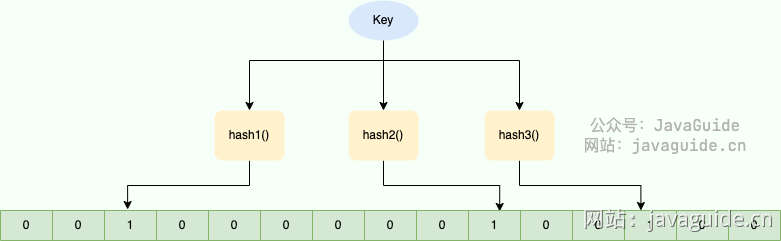

# 40亿个QQ号，限制1G内存，如何去重？

# 40亿个QQ号，限制1G内存，如何去重？
> 类似的问题：
>
> + 20 亿个 URL ，限制 1G 内存，如何去重？
> + 10 亿个 订单号，限制 1G 内存，如何去重？
>

对于 Java 来说，可以使用 int 类型表示 QQ 号（Java 并未设计无符号整型，只有几个无符号整型的静态方法）。

40 亿个 QQ 号如果直接存储的话，大约需要内存： 4*4000000000 /1024/1024/1024 ≈ 15G 。实际开发过程中，所需的内存肯定会更多。

> 1KB=1024B，1MB=1024KB，1GB=1024MB
>

很显然，这种方式是不现实的。

对于这种大数据量去重的场景，我们可以考虑使用**位图（Bitmap）**。位图可以在不占用太多内存的前提下，解决海量数据的存在性问题，进而实现去重。

**什么是 Bitmap？**Bitmap 是一种用于存储二进制数据的数据结构。简单来说，Bitmap 就是使用二进制位来表示某个元素是否存在的数组。每一位只有两种状态，可以方便地用 0 和 1 来表示存在与不存在。

使用 Bitmap 的话，一个数字只需要占用 1 个 bit。


Bitmap 的常见应用场景如下：

+ **去重**：如果需要对一个大的数据集进行去重操作，可以使用 Bloom Filter 来记录每个元素是否出现过。比如爬给定网址的时候对已经爬取过的 URL 去重、对巨量的 QQ 号/订单号去重。
+ **数据统计**：Bitmap 可以用来记录某些特定事件发生的情况，例如某个用户是否登录、某个用户是否点赞过某个视频等。
+ **布隆过滤器**：布隆过滤器是一种基于 Bitmap 的数据结构，主要用于判断一个元素是否存在于一个大的集合中。相遇 Bitmap，占用的空间更少，但其结果不一定是完全准确的。

我们知道 QQ 号是 4 字节无符号整数，共 32bit, 也就是说，QQ 号的取值范围是：[0, 2<sup>32 - 1]。2</sup>32 - 1 的值是 4294967295, 是一个 10 位的整数，大约是 43 亿。

这样的话，大约需要 512MB 内存就可以表示所有的 QQ 号了，计算过程：4294967295 / 8 / 1024 / 1024 ≈ 512MB。

假设我们要把 QQ 号 1384593330 放入 Bitmap，我们只需要将 1384593330 位置的数组元素设置为 1 即可。当我们要判断对应的 QQ 号是否已经存在于 Bitmap 中时，只需要查看对应位置的数组元素是否为 1 即可。

Redis 就支持 Bitmap，实际项目中我们可以基于 Redis 来做。

Bitmap 常用命令如下：

| 命令 | 介绍 |
| :--- | :--- |
| SETBIT key offset value | 设置指定 offset 位置的值 |
| GETBIT key offset | 获取指定 offset 位置的值 |
| BITCOUNT key start end | 获取 start 和 end 之前值为 1 的元素个数 |
| BITOP operation destkey key1 key2 ... | 对一个或多个 Bitmap 进行运算，可用运算符有 AND, OR, XOR 以及 NOT |


下面是使用 Bitmap 命令完成 QQ 号去重的简单演示：

```powershell
> SETBIT mykey 1384593330 1
0
> GETBIT mykey 1384593330
1
> SETBIT mykey 1384593331 1
0
> GETBIT mykey 1384593331
1
```

如果我们想要进一步节省空间，并且容许较小的误差的话，还可以使用**布隆过滤器（Bloom Filter）**进一步优化。布隆过滤器就是基于 Bitmap 实现的，只是多加了哈希函数映射这一步。

Bloom Filter 是一个叫做 Bloom 的老哥于 1970 年提出的。我们可以把它看作由 Bitmap 和一系列随机映射函数（哈希函数）两部分组成的数据结构。相比于传统的 Bitmap ，Bloom Filter 占用的空间更少，但其结果不一定是完全准确的。

Bloom Filter 的常见应用场景如下：

+ **判断给定数据是否存在**：比如判断一个数字是否存在于包含大量数字的数字集中（数字集很大，上亿）、 防止缓存穿透（判断请求的数据是否有效避免直接绕过缓存请求数据库）等等、邮箱的垃圾邮件过滤（判断一个邮件地址是否在垃圾邮件列表中）、黑名单功能（判断一个 IP 地址或手机号码是否在黑名单中）等等。
+ **去重**：如果需要对一个大的数据集进行去重操作，可以使用 Bloom Filter 来记录每个元素是否出现过。比如爬给定网址的时候对已经爬取过的 URL 去重、对巨量的 QQ 号/订单号去重。

Bloom Filter 和 Bitmap 的应用场景类似，都是为了解决海量数据的存在性问题。

**当一个元素加入布隆过滤器中的时候，会进行如下操作：**

+ 使用布隆过滤器中的哈希函数对元素值进行计算，得到哈希值（有几个哈希函数得到几个哈希值）。
+ 根据得到的哈希值，在位数组中把对应下标的值置为 1。

**当我们需要判断一个元素是否存在于布隆过滤器的时候，会进行如下操作：**

+ 对给定元素再次进行相同的哈希计算；
+ 得到值之后判断位数组中的每个元素是否都为 1，如果值都为 1，那么说明这个值在布隆过滤器中，如果存在一个值不为 1，说明该元素不在布隆过滤器中。

Bloom Filter 的简单原理图如下：



对于 40 亿的 QQ 号，我们可以使用 40 亿个二进制大小的位图，然后通过哈希函数，对数字进行处理，让它落在这 40 亿的范围内。为了降低哈希冲突的概率，布隆过滤器一般会使用多个哈希函数对同一个元素进行处理。

Redis 也支持 Bloom Filter，不过，我们需要先安装一下。

```powershell
➜  ~ docker run -p 6379:6379 --name redis-redisbloom redislabs/rebloom:latest
➜  ~ docker exec -it redis-redisbloom bash
root@21396d02c252:/data# redis-cli
127.0.0.1:6379>
```

Redis 中的 Bloom Filter 常用命令如下：

+ **BF.ADD**：将元素添加到布隆过滤器中，如果该过滤器尚不存在，则创建该过滤器。格式：BF.ADD {key} {item}。
+ **BF.MADD**: 将一个或多个元素添加到“布隆过滤器”中，并创建一个尚不存在的过滤器。该命令的操作方式BF.ADD与之相同，只不过它允许多个输入并返回多个值。格式：BF.MADD {key} {item} [item ...]。
+ **BF.EXISTS**: 确定元素是否在布隆过滤器中存在。格式：BF.EXISTS {key} {item}。
+ **BF.MEXISTS**：确定一个或者多个元素是否在布隆过滤器中存在格式：BF.MEXISTS {key} {item} [item ...]。

下面是使用 Bloom Filter 命令完成 QQ 号去重的简单演示：

```powershell
> BF.ADD myFilter 1384593330
(integer) 1
> BF.ADD myFilter 1384593331
(integer) 1
> BF.EXISTS myFilter 1384593330
(integer) 1
> BF.EXISTS myFilter 1384593331
(integer) 1
> GETBIT mykey 1384593332
(integer) 0
```


> 更新: 2024-01-04 19:34:54  
原文: [https://www.yuque.com/vip6688/neho4x/wu25mteswtvn1pdp](https://www.yuque.com/vip6688/neho4x/wu25mteswtvn1pdp)
>


> 更新: 2024-11-25 09:25:12  
> 原文: <https://www.yuque.com/neumx/laxg2e/3af724c60a96be2b93be677bda45e102>