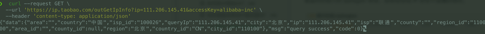
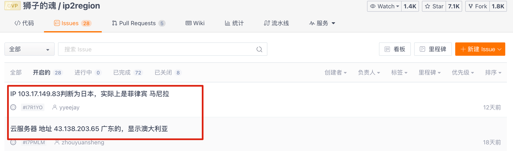
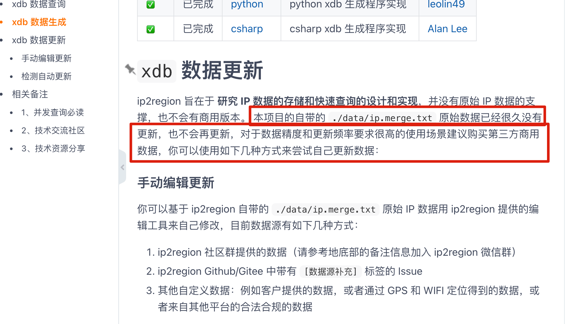
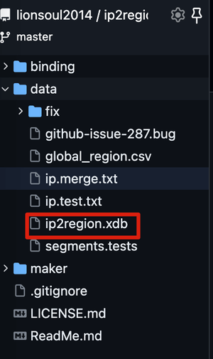

# 如何实现IP归属地功能？

# 如何实现IP归属地功能？
IP 归属地功能目前已经是网站/软件的标配了，实际工作中我们碰到的概率还是挺大的。

网上也有一些讲 IP 归属地如何实现的文章，但绝大部分都千篇一律，并没有说到点上去。拿国内比较火的 离线的 IP 地址库 Ip2region 来说，网上基本推荐的都是这个。不过，他们并没有指出 Ip2region 经常会出现 IP 定位不准确的情况，这就导致很多朋友在生产项目中使用出现了问题。

## 如何拿到用户的真实 IP？
想要获取到用户的地理位置，第一步当然是获取到用户的真实 IP。

对于 Java 项目来说，通常会基于[HttpServletRequest](https://docs.oracle.com/javaee/6/api/javax/servlet/http/HttpServletRequest.html)或者[ServerHttpRequest](https://docs.spring.io/spring-framework/docs/current/javadoc-api/org/springframework/http/server/ServerHttpRequest.html)来获取访问者真实 IP。

HttpServletRequest接口定义如下：

```java
package javax.servlet.http;
import javax.servlet.ServletRequest;

public interface HttpServletRequest extends ServletRequest{
  // ...
}
```

ServerHttpRequest接口定义如下：

```java
package org.springframework.http.server;
import org.springframework.http.HttpRequest;

public interface ServerHttpRequest extends HttpRequest, HttpInputMessage{
  // ...
}
```

HttpServletRequest属于javax.servlet.http包，ServerHttpRequest属于org.springframework.http.server包 。也就是说，前者是 Java Servlet 规范中定义的接口，而后者则是 Spring 框架中提供的接口，仅在 Spring 项目中有效。

实际开发中经常有人把这两者搞混，甚至认为这两者可以进行互换。再强调一遍：HttpServletRequest和ServerHttpRequest是两个不同的接口，无法互转，也没必要互转。如果是 Spring 项目的话，建议使用ServerHttpRequest。

Spring 5.0 后新增了 WebFlux 模块。Spring WebFlux 使用 Reactor 库来实现响应式编程模型，底层基于 Netty 实现同步非阻塞的 I/O。Spring WebFlux 模块也定义了一个[ServerHttpRequest](https://docs.spring.io/spring-framework/docs/current/javadoc-api/org/springframework/http/server/reactive/ServerHttpRequest.html)接口专门用于响应式编程，位于org.springframework.http.server.reactive包下。

这里以org.springframework.http.server.ServerHttpRequest为例来写一个用于获取访问者真实 IP 的工具类，供大家参考。

```java
public class NetworkUtil {
    public static String getIpAddress(ServerHttpRequest request) {
        // 获取请求头信息 HttpHeaders
        HttpHeaders headers = request.getHeaders();
        // 从请求头中尝试获取 X-Forwarded-For 字段，这个字段表示客户端经过的代理服务器的IP地址列表，如果有多个代理，以逗号分隔。
        String ipAddress = headers.getFirst("X-Forwarded-For");
        // 不断尝试获取 IP 地址
        if (ipAddress == null || ipAddress.length() == 0 || "unknown".equalsIgnoreCase(ipAddress)) {
            ipAddress = headers.getFirst("Proxy-Client-IP");
        }
        if (ipAddress == null || ipAddress.length() == 0 || "unknown".equalsIgnoreCase(ipAddress)) {
            ipAddress = headers.getFirst("WL-Proxy-Client-IP");
        }
        if (ipAddress == null || ipAddress.length() == 0 || "unknown".equalsIgnoreCase(ipAddress)) {
            ipAddress = request.getRemoteAddress().getAddress().getHostAddress();
            // 如果这个地址是本地回环地址（127.0.0.1或者0:0:0:0:0:0:0:1），则根据网卡获取本机配置的IP地址。
            if (ipAddress.equals("127.0.0.1") || ipAddress.equals("0:0:0:0:0:0:0:1")) {
                try {
                    InetAddress inet = InetAddress.getLocalHost();
                    ipAddress = inet.getHostAddress();
                } catch (UnknownHostException e) {
                    log.error("根据网卡获取本机配置的IP异常", e);
                }

            }
        }

        // 对于通过多个代理的情况，第一个IP为客户端真实IP，多个IP按照','分割
        if (ipAddress != null && ipAddress.indexOf(",") > 0) {
            ipAddress = ipAddress.split(",")[0];
        }

        return ipAddress;
    }
}
```

不过，上面这段代码还存在一些局限性，比如：

+ 依赖于请求头部信息中的特定字段，如果代理服务器没有添加这些字段或者修改了这些字段的值，那么就无法正确获取客户端的 IP 地址。
+ 没有考虑 IPv6 的格式，如果客户端使用 IPv6 地址访问服务器，会出现解析错误。

实际项目中，大家可以根据实际需求来决定是否去解决。

## 拿到 IP 之后如何找到用户的地址？
通过 IP 地址找到用户的地址，也就是将 IP 信息转换为地理位置信息，通常有两种做法：

+ 离线的 IP 地址库：比如[Ip2region](https://gitee.com/lionsoul/ip2region)、[GeoLite2](https://dev.maxmind.com/geoip/geolite2-free-geolocation-data)、[纯真免费 IP 库](https://cz88.net/help?id=free)（纯真也提供了付费的 API 服务）。
+ 第三方 IP 定位服务：比如[淘宝 IP 地址库](https://ip.taobao.com/instructions)、[查询网 IP 查询接口](https://user.ip138.com/ip/)（需要付费）、各种地图提供的 IP 定位 API（比如[腾讯地图 IP 定位](https://lbs.qq.com/service/webService/webServiceGuide/webServiceIp)、[百度地图 IP 定位](https://lbsyun.baidu.com/faq/api?title=webapi/ip-api-base)、[高德地图 IP 定位](https://lbs.amap.com/api/webservice/guide/api/ipconfig)）

淘宝 IP 地址库的官网的在线 IP 查询工具于2022年3月31日起永久关停，但 API 我试了下，还是可以使用的。你也可以使用下面的命令测试一下。

```powershell
❯  curl --request GET \
  --url 'https://ip.taobao.com/outGetIpInfo?ip=111.206.145.41&accessKey=alibaba-inc' \
  --header 'content-type: application/json'
```



### 离线的 IP 地址库
离线 IP 地址库一般都是免费使用的，速度通常也比较快。不过，往往会存在偏差。并且，离线 IP 地址库需要我们定时进行更新，以同步最新的 IP 数据，比较麻烦。

拿国内比较火的 Ip2region 来说，经常会出现 IP 定位不准确的情况。



Ip2region 的作者在项目 README 文档中已经明确说了项目中的 IP 数据已经很久没更新了。很多朋友没有注意，直接就用在了生产项目上，然后就出现了问题。一定一定一定要认真看 README 文档，调研清楚之后再考虑是否在生产项目中使用，避免出现问题。



Ip2region 是一个开源免费的离线 IP 地址定位库和 IP 定位数据管理框架，查询效率 10 微秒级别，提供了主流编程语言的xdb数据生成和查询客户端实现。



综上，如果对于数据精度和更新频率要求比较高的话，不建议使用离线的 IP 地址库，可以考虑第三方 IP 定位服务。

### 第三方 IP 定位服务
第三方 IP 定位服务在选择的时候要关注下面几点：

+ 免费额度以及付费策略。
+ 是否支持 IPV6。
+ 是否支持国外 IP 解析。
+ 是否可以直接商用。

绝大部分第三方 IP 定位服务都提供了每日固定次数的免费调用额度，比如对于个人开发者来说，高德地图目前是 5000 次/日，并发量上限是 30 次/秒，腾讯地图是 10000 次/日，并发量上限是 5 次/秒。如果是企业认证开发者的话，这个额度会高很多。对于大部分日活不是很多的项目来说，基本也够用了。实在不够用的话，可以尝试提高额度，费用通常也比较便宜。

有一些第三方 IP 定位服务仅支持 IPV4，不支持国外 IP 解析，比如高德地图 IP 定位。

在我们选择第三方 IP 定位服务时，一定要做好充分的调研，以满足业务的实际需求。

腾讯地图 IP 定位服务用的还是比较多的，这里就以它为例进行进一步的介绍。

腾讯地图 IP 定位的调用示例如下:

> // GET 请求，注意参数值要进行 URL 编码[https://apis.map.qq.com/ws/location/v1/ip?ip=111.206.145.41&key=OB4BZ-D4W3U-B7VVO-4PJWW-6TKDJ-WPB77](https://apis.map.qq.com/ws/location/v1/ip?ip=111.206.145.41&key=OB4BZ-D4W3U-B7VVO-4PJWW-6TKDJ-WPB77)
>

请求参数解释如下：

| 参数 | 必填 | 说明 | 示例 |
| :--- | :--- | :--- | :--- |
| key | 是 | 开发密钥（Key） | key=OB4BZ-D4W3U-B7VVO-4PJWW-6TKDJ-WPB77 |
| ip | 否 | IP 地址，缺省时会使用请求端的 IP | ip=111.206.145.41 |
| output | 否 | 返回格式：支持 JSON/JSONP，默认 JSON | output=json |
| callback | 否 | JSONP 方式回调函数 | callback=function1 |


```json
//响应示例：
{
    "status": 0,
    "message": "Success",
    "result": {
        "ip": "111.206.145.41",
        "location": {
            "lat": 39.90469,
            "lng": 116.40717
        },
        "ad_info": {
            "nation": "中国",
            "province": "北京市",
            "city": "北京市",
            "district": "",
            "adcode": 110000
        }
    }
}
```

响应结果解释如下：

| 名称 | 类型 | 必填 | 说明 |
| :--- | :--- | :--- | :--- |
| status | number | 是 | 状态码，0 为正常，其它为异常，详细请参阅[状态码说明](https://lbs.qq.com/service/webService/webServiceGuide/status) |
| message | string | 是 | 对 status 的描述 |


result 表示 IP 定位结果：

| 名称 | 类型 | 必填 | 说明 |  |
| :--- | :--- | :--- | :--- | --- |
| ip | string | 是 | 用于定位的 IP 地址 |  |
| location | object | 是 | 定位坐标。注：IP 定位服务精确到市级，该位置为 IP 地址所属的行政区划政府坐标。lat 表示纬度，lng 表示经度。 |  |
| ad_info | object | 是 | 定位行政区划信息，包含省、市等信息。 |  |


不过，腾讯地图位置服务商用的话还挺贵的：[https://lbs.qq.com/dev/console/authorization](https://lbs.qq.com/dev/console/authorization)，这点也要注意，别踩坑了。

## 总结
对于 Java 项目来说，通常会基于[HttpServletRequest](https://docs.oracle.com/javaee/6/api/javax/servlet/http/HttpServletRequest.html)或者[ServerHttpRequest](https://docs.spring.io/spring-framework/docs/current/javadoc-api/org/springframework/http/server/ServerHttpRequest.html)来获取访问者真实 IP。

通过 IP 地址找到用户的地址，也就是将 IP 信息转换为地理位置信息，通常有两种做法：

+ 离线的 IP 地址库：比如[Ip2region](https://gitee.com/lionsoul/ip2region)、[GeoLite2](https://dev.maxmind.com/geoip/geolite2-free-geolocation-data)、[纯真免费 IP 库](https://cz88.net/help?id=free)（纯真也提供了付费的 API 服务）。
+ 第三方 IP 定位服务：比如[淘宝 IP 地址库](https://ip.taobao.com/instructions)（2022 年 3 月 31 日起永久关停服务，不再对外提供 API 查询）、[太平洋 IP 接口](https://whoisadmin.pconline.com.cn/)、[查询网 IP 查询接口](https://user.ip138.com/ip/)（需要付费）、各种地图提供的 IP 定位 API（比如[腾讯地图 IP 定位](https://lbs.qq.com/service/webService/webServiceGuide/webServiceIp)、[百度地图 IP 定位](https://lbsyun.baidu.com/faq/api?title=webapi/ip-api-base)、[高德地图 IP 定位](https://lbs.amap.com/api/webservice/guide/api/ipconfig)）

离线 IP 地址库一般都是免费使用的，速度通常也比较快。不过，往往会存在偏差。并且，离线 IP 地址库需要我们定时进行更新，以同步最新的 IP 数据，比较麻烦。

如果对于数据精度和更新频率要求比较高的话，不建议使用离线的 IP 地址库，可以考虑第三方 IP 定位服务。

绝大部分地图提供的 IP 定位服务都提供了每日固定次数的免费调用额度，不够用的话，可以尝试提高额度，费用通常也比较便宜。不过，各种地图提供的 IP 定位服务商用往往需要购买商业授权，这个价格还是挺贵的，一年通常在五万左右。

淘宝 IP 地址库、太平洋 IP 接口等免费公开的 IP 接口也可以尝试使用，但通常访问频率限制比较厉害，也不是特别稳定。一般都是提供给个人使用的，不承诺稳定性，毕竟不是商业化产品。

实际项目中，我们应该根据实际需求来选择合适的解决方案。


> 更新: 2024-01-04 19:30:44  
原文: [https://www.yuque.com/vip6688/neho4x/hsvdow5fmml67i2f](https://www.yuque.com/vip6688/neho4x/hsvdow5fmml67i2f)
>


> 更新: 2024-11-25 09:25:23  
> 原文: <https://www.yuque.com/neumx/laxg2e/f5798770a7093ce0a4fcaf1a99a87481>