# 计网八股

# 基础
## 说下计算机网络体系结构
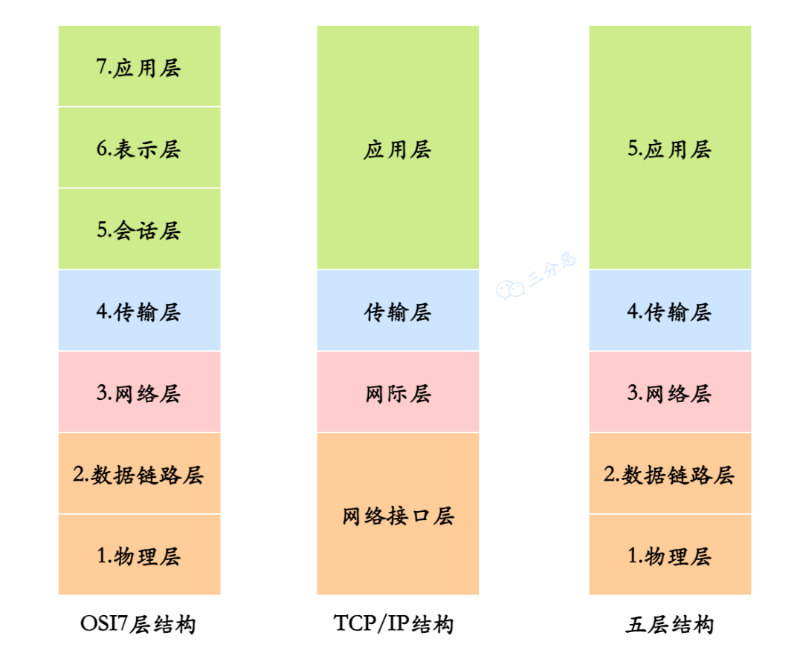

### OSI 7层网络模型
OSI 7层网络模型分别是：**应用层**、**表示层**、**会话层**、**传输层**、**网络层**、**数据链路层**以及**物理层**。

OSI七层模型（从上到下）：

+ **应用层**：为用户提供网络服务，支持协议如**HTTP**、**DNS**，**FTP**和**SMTP**。
+ **表示层**：负责数据的**格式化、加密和压缩**，确保数据能被应用层理解。
+ **会话层**：管理会话的**建立和终止**。
+ **传输层**：负责**端到端的数据传输**，使用**TCP**或**UDP协议**。
+ **网络层**：负责不同网络之间的**数据传输和路由选择**，使用**IP地址**。
+ **数据链路层**：负责节点间的**数据传输和差错检测**，封装数据帧。
+ **物理层**：负责数据的**物理传输**，包括**电缆、网卡**等硬件设备。

### TCP四层模型
+ **应用层（Application Layer）**：为用户提供网络服务，如**HTTP**、**FTP**。
+ **传输层（Transport Layer）**： 负责**端到端**的数据传输  ，主要协议为**TCP**和**UDP**。
+ **互联网层（Internet Layer）**：负责数据的**路由和转发**，主要协议为**IP**。
+ **网络接口层（Network Interface Layer）**：负责**物理连接和数据传输**。

### 计算机网络五层模型
+ **物理层**：负责**比特流的物理传输**，如**网线、光纤**等硬件介质。
+ **数据链路层**：将**比特组合成帧**，提供相邻节点间的**可靠通信**。
+ **网络层**：负责**IP寻址与路由选择**，实现**跨网络的数据传输**。
+ **传输层**：提供端到端的**可靠传输（TCP）****或****快速传输（UDP）**。
+ **应用层**：直接面向用户，提供**HTTP、FTP、DNS**等网络服务接口。

### tcp、ip分别位于哪一层？
+ tcp 在传输层
+ ip 在网络层

###  基于 TCP 的常见协议  
+ **HTTP/HTTPS**：网页传输
+ **FTP**：文件传输
+ **SMTP**：邮件发送
+ **SSH**：远程管理

## 说一下每一层对应的网络协议有哪些？
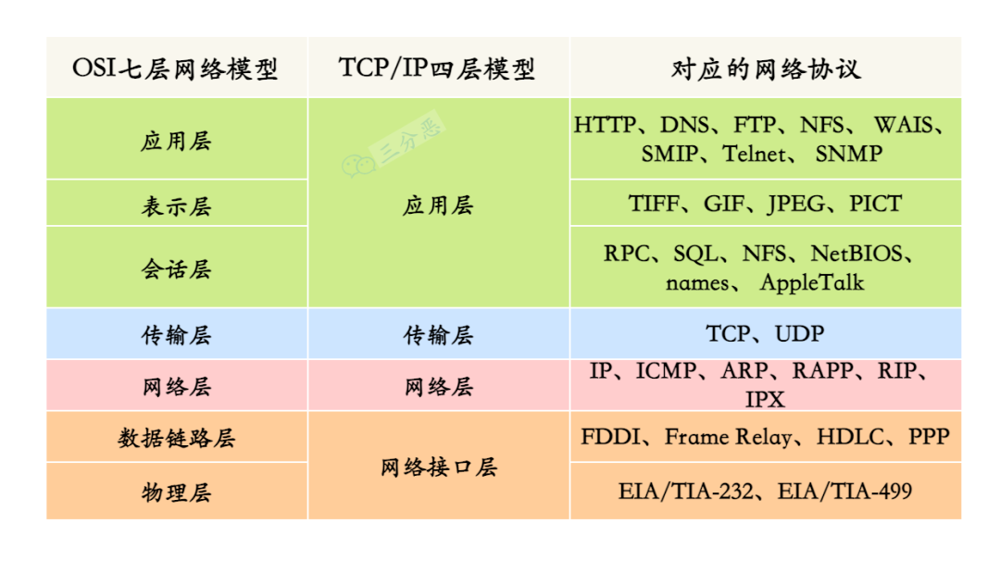

## 那么数据在各层之间是怎么传输的呢？
### **数据的封装过程（发送端）**
1. **应用层**：
    - 用户在应用层（如浏览器或文件传输工具）生成数据（如HTTP请求）。
    - 数据被转换为应用层格式，并附加应用层协议头部（如HTTP头部）。
2. **传输层**：
    - 传输层将应用层的数据分段。
    - **添加传输层头部**（如TCP头部，包括源端口号、目的端口号等）形成 **段（Segment）**，实现端到端通信。
3. **网络层**：
    - 网络层将传输层的数据段封装成数据包（Packet）。
    - **添加网络层头部**（如IP头部，包括源IP地址、目的IP地址等），实现跨网络的寻址和路由。
4. **数据链路层**：
    - 数据链路层将网络层的包封装为帧（Frame）。
    - **添加数据链路层头部**（如MAC地址）和尾部（如校验码）以保证点对点传输的正确性。
5. **物理层**：
    - 帧被转换为比特流（0和1），通过物理介质（如网线、光纤、无线信号）发送出去。

---

### **数据的解封装过程（接收端）**
1. **物理层**：
    - 接收比特流并将其传递给数据链路层。
2. **数据链路层**：
    - 解析帧的头部和尾部，校验数据完整性，将有效载荷（即网络层数据包）传递给网络层。
3. **网络层**：
    - 解析数据包的IP头部，检查目标地址是否与本机一致。
    - 将有效载荷（即传输层段）传递给传输层。
4. **传输层**：
    - 解析段的TCP/UDP头部，检查端口号。
    - 将数据重新组装为应用层的完整数据，传递给应用层。
5. **应用层**：
    - 处理最终数据（如显示网页内容、存储文件等）。

---

### **总结：封装和解封装的关键点**
1. **发送端**：从高层到低层，每层都为数据添加协议头部，数据逐层封装。
2. **接收端**：从低层到高层，每层都解析对应的协议头部，数据逐层解封装。
3. **协议作用**：
    - 每一层的协议头部包含该层所需的控制信息（如源/目标地址、端口号、校验信息等）。
4. **最终目标**：
    - 数据能够可靠、准确地从发送端的应用程序传递到接收端的应用程序。

# 网络综合
## 从浏览器地址栏输入 URL 到显示网页的过程了解吗？
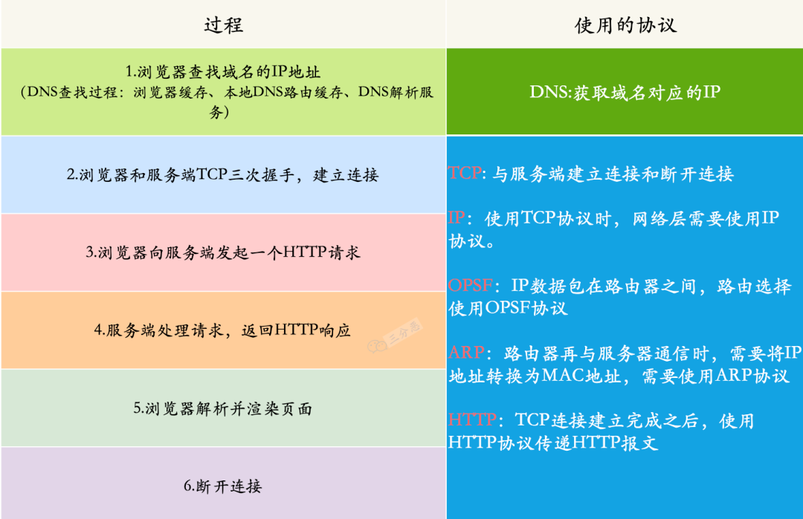

<details class="lake-collapse"><summary id="u4518d91e"></summary><ul class="ne-ul"><li id="u31c37115" data-lake-index-type="0"><strong><span class="ne-text">输入 URL 和 DNS 查询</span></strong><span class="ne-text">：浏览器解析用户输入的 URL，通过 DNS 解析查找对应的 IP 地址。</span></li><li id="ud9033bfb" data-lake-index-type="0"><strong><span class="ne-text">建立 TCP 连接</span></strong><span class="ne-text">：浏览器与服务器通过三次握手建立 TCP 连接。</span></li><li id="u74e47b30" data-lake-index-type="0"><strong><span class="ne-text">发送 HTTP 请求</span></strong><span class="ne-text">：浏览器通过已建立的连接向服务器发送 HTTP 请求。</span></li><li id="uafa19196" data-lake-index-type="0"><strong><span class="ne-text">服务器响应</span></strong><span class="ne-text">：服务器处理请求，返回 HTTP 响应，包含网页内容（如 HTML、CSS、JS）。</span></li><li id="u8cfc3d4f" data-lake-index-type="0"><strong><span class="ne-text">渲染网页</span></strong><span class="ne-text">：浏览器接收响应，开始解析响应体中的 HTML 内容；（然后构建 DOM 树、加载执行CSS 和 JavaScript 文件等），最终渲染页面</span></li><li id="u1590f175" data-lake-index-type="0"><strong><span class="ne-text">关闭连接</span></strong><span class="ne-text">：TCP 四次挥手，连接结束。</span></li></ul></details>
1. **URL 解析**：
    - 浏览器解析用户输入的 URL，识别协议（如 HTTP、HTTPS）、域名、端口号和路径。
2. **DNS 查询**：
    - 浏览器检查本地缓存是否有域名对应的 IP 地址。
    - 如果没有，浏览器向 DNS 服务器发送查询请求，获取域名对应的 IP 地址。
3. **建立连接**：
    - 浏览器使用获取的 IP 地址和端口号（默认 HTTP 为 80，HTTPS 为 443）与服务器建立 TCP 连接。
    - 如果是 HTTPS，还会进行 TLS 握手，建立加密通道。
4. **发送 HTTP 请求**：
    - 浏览器向服务器发送 HTTP 请求，包含请求方法（如 GET、POST）、路径、协议版本、头部信息（如 User-Agent、Accept）等。
5. **服务器处理请求**：
    - 服务器接收请求，根据路径和参数处理请求。 执行动态逻辑或返回静态资源  
6. **服务器发送 HTTP 响应**：
    - 服务器将生成的响应体、状态码（如 200 OK）、响应头部（如 Content-Type）等打包成 HTTP 响应，发送回浏览器。
7. **浏览器渲染页面**：
    - 浏览器接收响应，开始解析响应体中的 HTML 内容；（然后构建 DOM 树、加载执行CSS 和 JavaScript 文件等），最终渲染页面。
    - f.断开连接：TCP 四次挥手，连接结束。

<details class="lake-collapse"><summary id="u49d44f9c"><strong><span class="ne-text">详细过程</span></strong></summary><p id="u469fd167" class="ne-p"><span class="ne-text">从浏览器地址栏输入 URL 到显示网页的过程涉及多个步骤，包括 DNS 解析、TCP 连接、HTTP 请求、服务器处理、响应返回、浏览器渲染等。以下是详细的过程：</span></p><hr id="cKgSE" class="ne-hr"><h3 id="YVRNI"><span class="ne-text">1. </span><strong><span class="ne-text">输入 URL 并解析</span></strong></h3><ul class="ne-ul"><li id="uc1f9af7a" data-lake-index-type="0"><span class="ne-text">用户在浏览器地址栏输入 URL（例如 </span><code class="ne-code"><span class="ne-text">https://www.example.com</span></code><span class="ne-text">）。</span></li><li id="u139ec58c" data-lake-index-type="0"><span class="ne-text">浏览器会解析 URL，提取协议（如 </span><code class="ne-code"><span class="ne-text">https</span></code><span class="ne-text">）、域名（如 </span><code class="ne-code"><span class="ne-text">www.example.com</span></code><span class="ne-text">）和路径（如 </span><code class="ne-code"><span class="ne-text">/index.html</span></code><span class="ne-text">）。</span></li></ul><hr id="X7vNl" class="ne-hr"><h3 id="WW0Dv"><span class="ne-text">2. </span><strong><span class="ne-text">DNS 解析</span></strong></h3><ul class="ne-ul"><li id="ucc2bd62d" data-lake-index-type="0"><span class="ne-text">浏览器需要将域名转换为服务器的 IP 地址，这个过程称为 DNS 解析。</span></li><li id="u6a8d5c78" data-lake-index-type="0"><strong><span class="ne-text">步骤如下</span></strong><span class="ne-text">：</span></li></ul><ol class="ne-list-wrap"><ol ne-level="1" class="ne-ol"><li id="u68f01635" data-lake-index-type="0"><span class="ne-text">浏览器检查本地缓存（如浏览器缓存、操作系统缓存）是否有该域名对应的 IP 地址。</span></li><li id="uf36de931" data-lake-index-type="0"><span class="ne-text">如果没有，浏览器会向本地配置的 DNS 服务器（通常由 ISP 提供）发送 DNS 查询请求。</span></li><li id="u646f7f3d" data-lake-index-type="0"><span class="ne-text">如果本地 DNS 服务器没有缓存该域名，它会向根域名服务器发起请求，根域名服务器返回顶级域名服务器（如 </span><code class="ne-code"><span class="ne-text">.com</span></code><span class="ne-text">）的地址。</span></li><li id="ue6354db6" data-lake-index-type="0"><span class="ne-text">本地 DNS 服务器继续向顶级域名服务器查询，顶级域名服务器返回权威域名服务器（如 </span><code class="ne-code"><span class="ne-text">example.com</span></code><span class="ne-text"> 的域名服务器）的地址。</span></li><li id="uf133b5dd" data-lake-index-type="0"><span class="ne-text">本地 DNS 服务器向权威域名服务器查询，获取 </span><code class="ne-code"><span class="ne-text">www.example.com</span></code><span class="ne-text"> 的 IP 地址，并返回给浏览器。</span></li><li id="u632cfdbf" data-lake-index-type="0"><span class="ne-text">浏览器缓存该 IP 地址，以便下次访问时快速解析。</span></li></ol></ol><hr id="aEZYy" class="ne-hr"><h3 id="O4Ynt"><span class="ne-text">3. </span><strong><span class="ne-text">建立 TCP 连接</span></strong></h3><ul class="ne-ul"><li id="u47d98a3c" data-lake-index-type="0"><span class="ne-text">浏览器通过 IP 地址和端口号（默认 HTTPS 是 443，HTTP 是 80）与服务器建立 TCP 连接。</span></li><li id="ub33962c0" data-lake-index-type="0"><strong><span class="ne-text">三次握手过程</span></strong><span class="ne-text">：</span></li></ul><ol class="ne-list-wrap"><ol ne-level="1" class="ne-ol"><li id="u6ba411e3" data-lake-index-type="0"><span class="ne-text">浏览器发送一个 SYN（同步）包到服务器，请求建立连接。</span></li><li id="udad8e18d" data-lake-index-type="0"><span class="ne-text">服务器回复一个 SYN-ACK（同步-确认）包，表示同意建立连接。</span></li><li id="uc6a09060" data-lake-index-type="0"><span class="ne-text">浏览器发送一个 ACK（确认）包，完成三次握手，连接建立。</span></li></ol></ol><ul class="ne-ul"><li id="u2194e9e7" data-lake-index-type="0"><span class="ne-text">如果是 HTTPS 协议，还会进行 TLS/SSL 握手，协商加密算法并交换密钥，确保通信安全。</span></li></ul><hr id="CtGqS" class="ne-hr"><h3 id="NtDGT"><span class="ne-text">4. </span><strong><span class="ne-text">发送 HTTP 请求</span></strong></h3><ul class="ne-ul"><li id="u7511a08a" data-lake-index-type="0"><span class="ne-text">浏览器通过已建立的 TCP 连接向服务器发送 HTTP 请求。</span></li><li id="u2381f1cd" data-lake-index-type="0"><span class="ne-text">请求包括：</span></li></ul><ul class="ne-list-wrap"><ul ne-level="1" class="ne-ul"><li id="u9dc017ad" data-lake-index-type="0"><span class="ne-text">请求行（如 </span><code class="ne-code"><span class="ne-text">GET /index.html HTTP/1.1</span></code><span class="ne-text">）。</span></li><li id="ub340b6b8" data-lake-index-type="0"><span class="ne-text">请求头（如 </span><code class="ne-code"><span class="ne-text">Host: www.example.com</span></code><span class="ne-text">、</span><code class="ne-code"><span class="ne-text">User-Agent</span></code><span class="ne-text">、</span><code class="ne-code"><span class="ne-text">Accept</span></code><span class="ne-text"> 等）。</span></li><li id="ubafe9e88" data-lake-index-type="0"><span class="ne-text">请求体（如果是 POST 请求，可能包含表单数据）。</span></li></ul></ul><hr id="zE9MZ" class="ne-hr"><h3 id="D6BLa"><span class="ne-text">5. </span><strong><span class="ne-text">服务器处理请求</span></strong></h3><ul class="ne-ul"><li id="u91fa93ce" data-lake-index-type="0"><span class="ne-text">服务器接收到请求后，根据请求的路径和方法（如 GET、POST）进行处理。</span></li><li id="u5cfdcbe5" data-lake-index-type="0"><span class="ne-text">处理过程可能包括：</span></li></ul><ul class="ne-list-wrap"><ul ne-level="1" class="ne-ul"><li id="u984c13b1" data-lake-index-type="0"><span class="ne-text">读取静态文件（如 HTML、CSS、JS）。</span></li><li id="u0c2a96d1" data-lake-index-type="0"><span class="ne-text">执行服务器端脚本（如 PHP、Python、Node.js）生成动态内容。</span></li><li id="u715fc889" data-lake-index-type="0"><span class="ne-text">查询数据库获取数据。</span></li></ul></ul><ul class="ne-ul"><li id="ue0176c1b" data-lake-index-type="0"><span class="ne-text">服务器生成 HTTP 响应，包括状态码（如 200 表示成功，404 表示未找到）、响应头和响应体（如 HTML 内容）。</span></li></ul><hr id="LU62w" class="ne-hr"><h3 id="sn8DF"><span class="ne-text">6. </span><strong><span class="ne-text">服务器返回 HTTP 响应</span></strong></h3><ul class="ne-ul"><li id="u2dcdf7ef" data-lake-index-type="0"><span class="ne-text">服务器将生成的 HTTP 响应通过 TCP 连接发送回浏览器。</span></li><li id="u8a879d0c" data-lake-index-type="0"><span class="ne-text">响应包括：</span></li></ul><ul class="ne-list-wrap"><ul ne-level="1" class="ne-ul"><li id="ucb1d27a6" data-lake-index-type="0"><span class="ne-text">状态行（如 </span><code class="ne-code"><span class="ne-text">HTTP/1.1 200 OK</span></code><span class="ne-text">）。</span></li><li id="u65bebf15" data-lake-index-type="0"><span class="ne-text">响应头（如 </span><code class="ne-code"><span class="ne-text">Content-Type: text/html</span></code><span class="ne-text">、</span><code class="ne-code"><span class="ne-text">Content-Length</span></code><span class="ne-text"> 等）。</span></li><li id="u8dce5ffc" data-lake-index-type="0"><span class="ne-text">响应体（如 HTML 文件内容）。</span></li></ul></ul><hr id="QSd6f" class="ne-hr"><h3 id="dcA8s"><span class="ne-text">7. </span><strong><span class="ne-text">浏览器解析和渲染页面</span></strong></h3><ul class="ne-ul"><li id="u884656fb" data-lake-index-type="0"><span class="ne-text">浏览器接收到响应后，开始解析和渲染页面。</span></li><li id="u5998664d" data-lake-index-type="0"><strong><span class="ne-text">步骤如下</span></strong><span class="ne-text">：</span></li></ul><ol class="ne-list-wrap"><ol ne-level="1" class="ne-ol"><li id="u32e873d1" data-lake-index-type="0"><strong><span class="ne-text">解析 HTML</span></strong><span class="ne-text">：</span></li></ol></ol><ul class="ne-list-wrap"><ul class="ne-list-wrap"><ul ne-level="2" class="ne-ul"><li id="u20efa14e" data-lake-index-type="0"><span class="ne-text">浏览器解析 HTML 文件，构建 DOM（文档对象模型）树。</span></li></ul></ul></ul><ol class="ne-list-wrap"><ol start="2" ne-level="1" class="ne-ol"><li id="u1e0a4c10" data-lake-index-type="0"><strong><span class="ne-text">加载外部资源</span></strong><span class="ne-text">：</span></li></ol></ol><ul class="ne-list-wrap"><ul class="ne-list-wrap"><ul ne-level="2" class="ne-ul"><li id="u3ed19f64" data-lake-index-type="0"><span class="ne-text">如果 HTML 中包含外部资源（如 CSS、JS、图片），浏览器会发起额外的 HTTP 请求来获取这些资源。</span></li></ul></ul></ul><ol class="ne-list-wrap"><ol start="3" ne-level="1" class="ne-ol"><li id="u34c58fe1" data-lake-index-type="0"><strong><span class="ne-text">解析 CSS</span></strong><span class="ne-text">：</span></li></ol></ol><ul class="ne-list-wrap"><ul class="ne-list-wrap"><ul ne-level="2" class="ne-ul"><li id="ua61c2c66" data-lake-index-type="0"><span class="ne-text">浏览器解析 CSS 文件，构建 CSSOM（CSS 对象模型）树。</span></li></ul></ul></ul><ol class="ne-list-wrap"><ol start="4" ne-level="1" class="ne-ol"><li id="u10e1431c" data-lake-index-type="0"><strong><span class="ne-text">构建渲染树</span></strong><span class="ne-text">：</span></li></ol></ol><ul class="ne-list-wrap"><ul class="ne-list-wrap"><ul ne-level="2" class="ne-ul"><li id="u2d3e4768" data-lake-index-type="0"><span class="ne-text">浏览器将 DOM 树和 CSSOM 树结合，生成渲染树（Render Tree）。</span></li></ul></ul></ul><ol class="ne-list-wrap"><ol start="5" ne-level="1" class="ne-ol"><li id="u2cd30fd7" data-lake-index-type="0"><strong><span class="ne-text">布局（Layout）</span></strong><span class="ne-text">：</span></li></ol></ol><ul class="ne-list-wrap"><ul class="ne-list-wrap"><ul ne-level="2" class="ne-ul"><li id="u400b12e5" data-lake-index-type="0"><span class="ne-text">浏览器计算渲染树中每个节点的位置和大小。</span></li></ul></ul></ul><ol class="ne-list-wrap"><ol start="6" ne-level="1" class="ne-ol"><li id="ubaa4e2b4" data-lake-index-type="0"><strong><span class="ne-text">绘制（Paint）</span></strong><span class="ne-text">：</span></li></ol></ol><ul class="ne-list-wrap"><ul class="ne-list-wrap"><ul ne-level="2" class="ne-ul"><li id="ue7578205" data-lake-index-type="0"><span class="ne-text">浏览器将渲染树绘制到屏幕上，显示页面内容。</span></li></ul></ul></ul><ol class="ne-list-wrap"><ol start="7" ne-level="1" class="ne-ol"><li id="u054b1c75" data-lake-index-type="0"><strong><span class="ne-text">执行 JavaScript</span></strong><span class="ne-text">：</span></li></ol></ol><ul class="ne-list-wrap"><ul class="ne-list-wrap"><ul ne-level="2" class="ne-ul"><li id="u346c9d72" data-lake-index-type="0"><span class="ne-text">如果页面中包含 JavaScript，浏览器会解析并执行脚本，可能会修改 DOM 或 CSSOM，触发重新渲染。</span></li></ul></ul></ul><hr id="Hbhu3" class="ne-hr"><h3 id="fi5Se"><span class="ne-text">8. </span><strong><span class="ne-text">关闭 TCP 连接</span></strong></h3><ul class="ne-ul"><li id="u425f5f4e" data-lake-index-type="0"><span class="ne-text">如果 HTTP 请求头中包含 </span><code class="ne-code"><span class="ne-text">Connection: close</span></code><span class="ne-text">，服务器会在发送完响应后关闭 TCP 连接。</span></li><li id="u22a20bd0" data-lake-index-type="0"><span class="ne-text">如果使用 HTTP/1.1 且未指定 </span><code class="ne-code"><span class="ne-text">Connection: close</span></code><span class="ne-text">，连接会保持打开状态，以便复用（称为持久连接）。</span></li></ul><hr id="ynL9X" class="ne-hr"><h3 id="s2Ydc"><span class="ne-text">9. </span><strong><span class="ne-text">页面交互</span></strong></h3><ul class="ne-ul"><li id="u3ee1a6e4" data-lake-index-type="0"><span class="ne-text">页面加载完成后，用户可以与页面进行交互（如点击链接、提交表单）。</span></li><li id="uf4aa38d1" data-lake-index-type="0"><span class="ne-text">如果用户触发新的请求（如点击链接），浏览器会重复上述过程。</span></li></ul><hr id="vHlz4" class="ne-hr"><h3 id="IxpwH"><span class="ne-text">总结</span></h3><p id="uc8007a89" class="ne-p"><span class="ne-text">从输入 URL 到显示网页的过程涉及多个步骤，主要包括：</span></p><ol class="ne-ol"><li id="ue5ec33d0" data-lake-index-type="0"><span class="ne-text">DNS 解析：将域名转换为 IP 地址。</span></li><li id="u47c35e40" data-lake-index-type="0"><span class="ne-text">TCP 连接：与服务器建立连接。</span></li><li id="ubc62c992" data-lake-index-type="0"><span class="ne-text">HTTP 请求：浏览器向服务器发送请求。</span></li><li id="u032bae02" data-lake-index-type="0"><span class="ne-text">服务器处理：服务器生成响应。</span></li><li id="u325dbf62" data-lake-index-type="0"><span class="ne-text">HTTP 响应：服务器返回数据。</span></li><li id="u311d3946" data-lake-index-type="0"><span class="ne-text">浏览器渲染：解析 HTML、CSS、JS 并显示页面。</span></li></ol><p id="u084e02cb" class="ne-p"><span class="ne-text">这个过程涉及网络协议、服务器技术和浏览器渲染引擎的协同工作，是现代互联网应用的基础。</span></p></details>
## 说说 DNS 的解析过程？
<details class="lake-collapse"><summary id="u725e1d2d"></summary><p id="ua9fe7b72" class="ne-p"><span class="ne-text">DNS 解析过程简化为：</span></p><ol class="ne-ol"><li id="u97747455" data-lake-index-type="0"><strong><span class="ne-text">缓存检查</span></strong><strong><span class="ne-text">：浏览器和操作系统检查是否有缓存的 IP 地址。</span></strong></li><li id="ud4d3900e" data-lake-index-type="0"><strong><span class="ne-text">查询本地 DNS 服务器：如果没有，向本地 DNS 服务器请求解析。</span></strong></li><li id="ub6eeafd6" data-lake-index-type="0"><strong><span class="ne-text">递归查询：本地 DNS 服务器递归向根服务器、TLD 服务器和权威 服务器查询 IP 地址。</span></strong></li><li id="u25393d3b" data-lake-index-type="0"><strong><span class="ne-text">返回结果</span></strong><strong><span class="ne-text">：得到 IP 地址后，返回浏览器并缓存。</span></strong></li></ol><p id="ud2da378e" class="ne-p"><strong><span class="ne-text">就是这样，最终通过查询过程将域名解析为 IP 地址。</span></strong></p></details>
### **DNS在哪一层**
DNS工作在**应用层**（OSI模型的第7层）。它提供域名解析服务，将域名转换为IP地址，或反向解析从IP地址获取域名。

### 3. **DNS基于什么协议实现**
UDP无连接、低延迟，适合短小的DNS请求。

DNS使用的是**UDP协议**。因为DNS查询通常比较短小，UDP协议的无连接特性让DNS查询效率更高，延迟更低。

### 4. **DNS为什么不用TCP**
+ **效率**：UDP无连接、低延迟，适合短小的DNS请求。
+ **可靠性要求低**：丢包时可以快速重试。
+ **TCP仅在特殊情况下使用**（如响应过大时）。

### DNS解析简化过程
1. **浏览器缓存**：检查浏览器是否已有域名对应的**IP地址缓存**。
2. **操作系统缓存**：若浏览器未命中，查询操作系统的**DNS缓存**。 （如 `hosts` 文件）  

> **hosts文件**：操作系统检查本地**hosts文件**，查看是否有域名的手动配置。
>

3. **本地DNS服务器查询**：如果以上都未命中，向本地**DNS服务器**发起请求，如果**未命中缓存**：进入递归查询。
4. **递归查询**：
    - **根服务器**：返回顶级域名（TLD）服务器地址（如**.com**）。
    - **TLD服务器**：返回权威DNS服务器地址（如**example.com**的管理服务器）。
    - **权威服务器**：返回目标域名的**IP地址**。
5. **缓存并返回结果**：本地 DNS 服务器将 IP 地址返回给操作系统和浏览器，同时各级缓存该 IP 以便后续快速访问。  

## 说说 WebSocket 与 Socket 的区别？
### Socket 与 WebSocket 简述
+ **Socket**：
    - 相当于 **IP地址 + 端口 + 协议**。
    - **Socket**（网络套接字）是计算机网络编程的核心，用于实现应用程序之间的双向通信。
    - 在 Java 中，它通过 `java.net` 包中的 **Socket**（客户端）和 **ServerSocket**（服务器端）支持 TCP/IP 通信，或用 **DatagramSocket** 实现 UDP 通信，广泛应用于实时数据交换场景，如聊天或文件传输。
    -  具体来说，Socket 是一套标准，它完成了对 TCP/IP 的高度封装，屏蔽网络细节，以方便开发者更好地进行网络编程。  
+ **WebSocket**：
    - **持久化协议**，伴随**H5**而生，用于解决**HTTP不支持持久化连接**的问题。
    - **Socket**是网络编程的标准接口，而**WebSocket**是**应用层通信协议**。**WebSocket 与 Socket 的区别：**

| **特性** | **Socket** | **WebSocket** |
| --- | --- | --- |
| **协议层级** | 传输层（TCP/UDP）或网络层 | 应用层（基于 HTTP/HTTPS） |
| **连接方式** | 手动建立连接 | 通过 HTTP 升级建立连接 |
| **通信模式** | 单工、半双工、全双工 | 全双工 |
| **使用场景** | 自定义协议、高性能通信 | Web 实时通信 |
| **开发复杂度** | 高，需处理底层细节 | 低，有成熟的库支持 |
| **兼容性** | 强，支持任何 TCP/UDP 设备 | 依赖浏览器和服务器支持 |
| **安全性** | 需手动实现加密和认证 | 支持 WSS 和 HTTP 认证机制 |


### 总结
+ **Socket**：底层通信接口，灵活但复杂，适合高性能、自定义协议场景。
+ **WebSocket**：基于 HTTP 的应用层协议，简单易用，适合 Web 实时通信。

## 说一下你了解的端口及对应的服务？
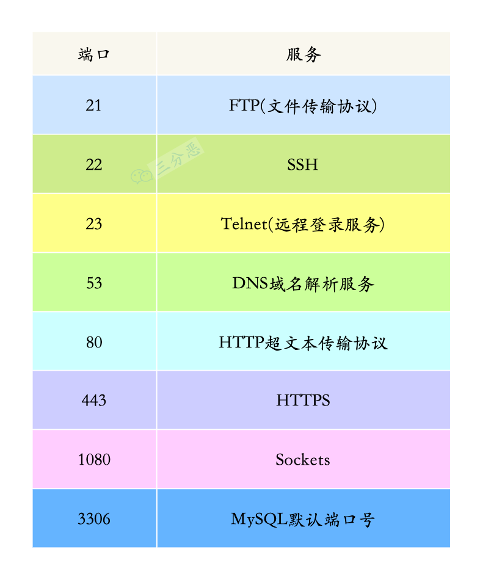以下是总结成的表格：

| **端口号** | **服务名称** | **功能** | **协议** |
| --- | --- | --- | --- |
| **21** | FTP | 文件传输协议，用于上传和下载文件 | TCP |
| **22** | SSH | 安全外壳协议，提供加密的远程登录和文件传输 | TCP |
| **23** | Telnet | 远程登录服务，但数据明文传输，不安全 | TCP |
| **53** | DNS | 域名解析服务，将域名解析为 IP 地址 | TCP/UDP |
| **80** | HTTP | 超文本传输协议，用于明文网页数据传输 | TCP |
| **443** | HTTPS | 安全的超文本传输协议，提供加密的网页传输 | TCP |
| **1080** | SOCKS | 代理服务，用于网络流量代理和转发 | TCP/UDP |
| **3306** | MySQL | 数据库访问服务，MySQL 的默认端口 | TCP |


此表简洁地归纳了端口号、服务名称、功能以及所使用的协议类型。

## 平常有抓包吗？
我平常使用最多的就是 chrome 浏览器自带的 network 面板了，可以看到请求的时间、请求的信息，以及响应信息。

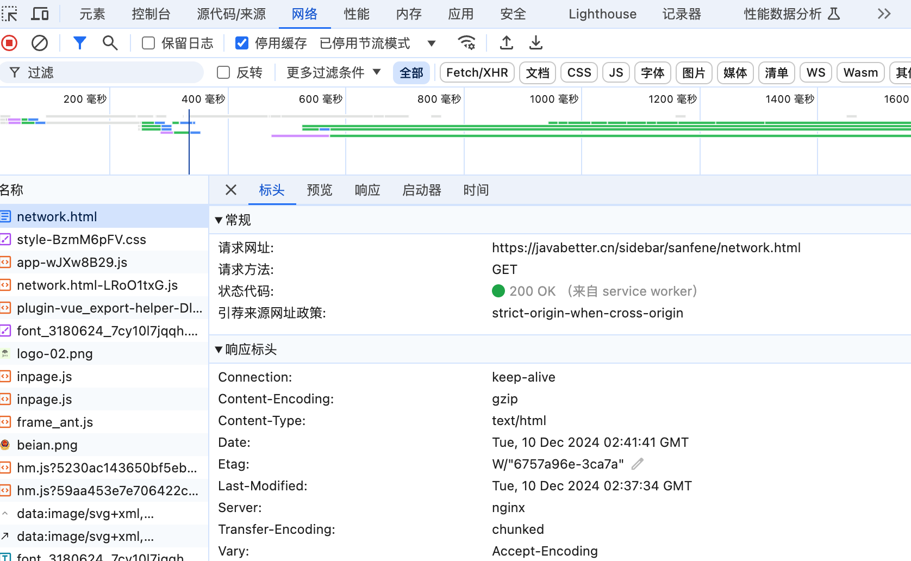

# HTTP
## 说说 HTTP 常用的状态码及其含义？
<details class="lake-collapse"><summary id="ub5e0e227"></summary><h3 id="FVHlP"><strong><span class="ne-text">1xx（信息状态码）</span></strong></h3><ul class="ne-ul"><li id="uf1083241" data-lake-index-type="0"><strong><span class="ne-text">100 Continue：</span></strong><span class="ne-text"> 继续处理请求</span></li></ul><h3 id="PztCB"><strong><span class="ne-text">2xx（成功状态码）</span></strong></h3><ul class="ne-ul"><li id="u49937c8c" data-lake-index-type="0"><strong><span class="ne-text">200 OK：</span></strong><span class="ne-text"> 请求成功。</span></li></ul><h3 id="r9Teo"><strong><span class="ne-text">3xx（重定向状态码）</span></strong></h3><ul class="ne-ul"><li id="u1b3c8e29" data-lake-index-type="0"><strong><span class="ne-text">301 Moved Permanently：</span></strong><span class="ne-text">资源永久重定向， 需更新 URL。  </span></li><li id="u26f572a9" data-lake-index-type="0"><strong><span class="ne-text">302 Found（Moved Temporarily）：</span></strong><span class="ne-text"> 资源临时重定向， 继续使用原 URL。  </span></li></ul><h3 id="RCqUC"><strong><span class="ne-text">4xx（客户端错误）</span></strong></h3><ul class="ne-ul"><li id="u45c21b10" data-lake-index-type="0"><strong><span class="ne-text">403 Forbidden：</span></strong><span class="ne-text"> 服务器拒绝访问（权限不足）。</span></li><li id="u9788cc40" data-lake-index-type="0"><strong><span class="ne-text">404 Not Found：</span></strong><span class="ne-text"> 请求的资源不存在。</span></li></ul><h3 id="mYcGY"><strong><span class="ne-text">5xx（服务器错误）</span></strong></h3><ul class="ne-ul"><li id="ud96a14bc" data-lake-index-type="0"><strong><span class="ne-text">500 Internal Server Error：</span></strong><span class="ne-text"> 服务器内部错误，无法处理请求。</span></li></ul></details>
### HTTP 状态码用于表示服务器对请求的处理结果，可以分为 5 种：
1. **1xx 信息响应**：客户端需继续发送请求或等待进一步指令。如 **100 Continue** 代表请求已部分接收，客户端应继续请求。
2. **2xx 成功**：表示请求成功完成。如 **200 OK** 代表请求成功，服务器返回请求的资源。
3. **3xx 重定向**：资源位置发生变动，客户端需进一步操作。如 **301 Moved Permanently**，资源永久重定向到新的 URL，客户端应更新请求地址。
4. **4xx 客户端错误**：客户端请求有问题（语法、认证、权限等）。**404 Not Found** 请求的资源不存在或不可用。
5. **5xx 服务器错误**：服务器无法完成请求，通常与后端或服务超载有关。例如 **500 Internal Server Error** 表示服务器内部错误。

以下是 HTTP 常用状态码的完整表格：

| **类别** | **状态码** | **名称** | **含义** |
| --- | --- | --- | --- |
| **1xx 信息响应** | **100** | Continue | 请求已部分接收，客户端应继续请求。 |
|  | **101** | Switching Protocols | 服务器同意切换协议（如从 HTTP 到 WebSocket）。 |
| **2xx 成功** | **200** | OK | 请求成功，服务器返回请求的资源。 |
|  | **201** | Created | 请求成功，服务器已创建新资源（常用于 `POST`）。 |
|  | **204** | No Content | 请求成功，但服务器未返回任何内容。 |
| **3xx 重定向** | **301** | Moved Permanently | 资源永久重定向到新的 URL，客户端应更新请求地址。 |
|  | **302** | Found | 资源临时重定向到新的 URL，客户端可继续使用原地址。 |
|  | **304** | Not Modified | 客户端缓存资源未修改，可直接从缓存中加载。 |
| **4xx 客户端错误** | **400** | Bad Request | 请求有语法错误或参数无效，服务器无法处理。 |
|  | **401** | Unauthorized | 未提供有效的身份认证，需登录后访问。 |
|  | **403** | Forbidden | 服务器拒绝请求，即使客户端已认证。 |
|  | **404** | Not Found | 请求的资源不存在或不可用。 |
|  | **405** | Method Not Allowed | 请求方法不被允许（如用 `POST` 请求不支持的方法）。 |
|  | **408** | Request Timeout | 请求超时，服务器未能在规定时间内接收到请求。 |
| **5xx 服务器错误** | **500** | Internal Server Error | 服务器内部错误，无法完成请求。 |
|  | **501** | Not Implemented | 服务器不支持请求的功能或方法。 |
|  | **502** | Bad Gateway | 服务器作为网关时，收到无效响应（如后端服务不可用）。 |
|  | **503** | Service Unavailable | 服务器暂时超载或正在维护，无法处理请求。 |
|  | **504** | Gateway Timeout | 服务器作为网关时，后端服务未及时响应。 |


---

### **说明**
1. **1xx 信息响应**：客户端需继续发送请求或等待进一步指令。
2. **2xx 成功**：表示请求成功完成。
3. **3xx 重定向**：资源位置发生变动，客户端需进一步操作。
4. **4xx 客户端错误**：客户端请求有问题（语法、认证、权限等）。
5. **5xx 服务器错误**：服务器无法完成请求，通常与后端或服务超载有关。

此表格简明归纳了 HTTP 状态码的类别、名称及含义，便于理解和使用。

## HTTP 有哪些请求方式？
<details class="lake-collapse"><summary id="ubd60acb4"></summary><ul class="ne-ul"><li id="uff12b8b9" data-lake-index-type="0"><strong><span class="ne-text">GET</span></strong><span class="ne-text">：获取资源。</span></li><li id="u96376e65" data-lake-index-type="0"><strong><span class="ne-text">POST</span></strong><span class="ne-text">：提交数据，可能会修改资源。</span></li><li id="ue2bf89cf" data-lake-index-type="0"><strong><span class="ne-text">PUT</span></strong><span class="ne-text">：更新或创建资源。</span></li><li id="u42ad9193" data-lake-index-type="0"><strong><span class="ne-text">DELETE</span></strong><span class="ne-text">：删除资源。</span></li><li id="ud908f663" data-lake-index-type="0"><strong><span class="ne-text">PATCH</span></strong><span class="ne-text">：部分更新资源。</span></li><li id="u4759c305" data-lake-index-type="0"><strong><span class="ne-text">HEAD</span></strong><span class="ne-text">：获取资源的元数据。</span></li><li id="u9e0ddb70" data-lake-index-type="0"><strong><span class="ne-text">OPTIONS</span></strong><span class="ne-text">：查询服务器支持的请求方法。</span></li><li id="uebf8461b" data-lake-index-type="0"><strong><span class="ne-text">CONNECT</span></strong><span class="ne-text">：建立隧道连接。</span></li></ul></details>
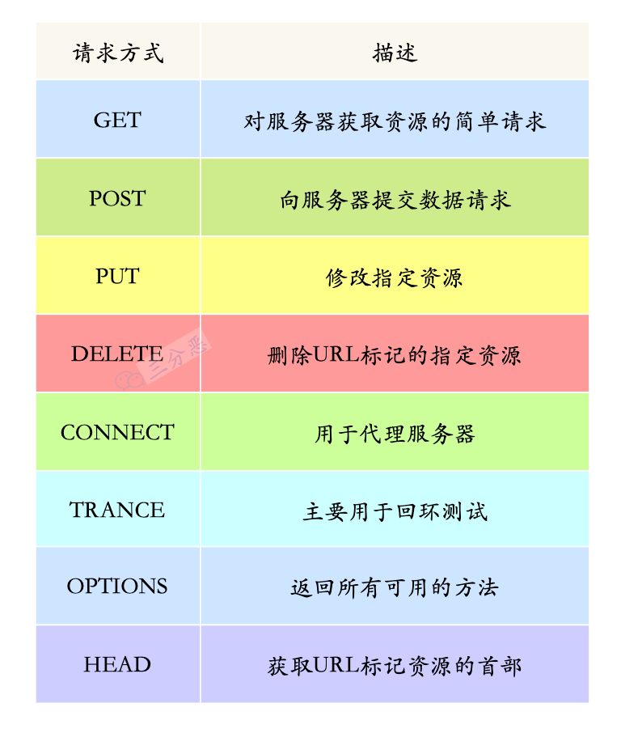

HTTP（超文本传输协议）定义了一系列请求方法，以指示对给定资源要执行的操作。以下是主要的HTTP请求方法：

1. **GET**：请求指定的资源。使用GET的请求应该只用于获取数据，而不应该产生其他副作用。
2. **POST**：向指定资源提交数据进行处理请求（例如提交表单或者上传文件）。数据被包含在请求体中。POST请求可能会导致新的资源的建立和/或已有资源的修改。
3. **PUT**：向指定资源位置上传其最新内容，用于更新资源。
4. **DELETE**：请求服务器删除指定的资源。
5. **HEAD**：与GET方法相同，但服务器在响应中只返回头部信息，不返回实体的主体部分。用于获取资源的元信息。
6. **OPTIONS**：允许客户端查看服务器的性能。通过这个方法，客户端可以判断服务器支持哪些HTTP方法。
7. **PATCH**：用于对资源进行部分修改。
8. **CONNECT**：HTTP/1.1协议中预留给能够将连接改为管道方式的代理服务器。
9. **TRACE**：回显服务器收到的请求，主要用于测试或诊断。

这些方法定义了与服务器交互的不同方式，使得客户端能够对服务器上的资源执行不同的操作。在实际应用中，GET和POST是最常用的两种请求方法。

## 说⼀下 GET 和 POST 的区别？
<details class="lake-collapse"><summary id="u7b2ba561"></summary><p id="u67ed779b" class="ne-p"><strong><span class="ne-text">GET</span></strong><span class="ne-text"> 用于获取资源，参数通过 URL 传输，不适合敏感信息，是幂等的；<br /></span><strong><span class="ne-text">POST</span></strong><span class="ne-text"> 用于提交数据，参数通过请求体传输，适合大数据或敏感信息，是非幂等的。  </span></p></details>
GET和POST是HTTP协议中常用的两种请求方法，它们有以下几个主要区别：

**1. 请求目的：**

+ **GET**：用于请求数据，通常用于获取资源或数据。
+ **POST**：用于提交数据，通常用于创建或更新资源。

**2. 参数传递：**

+ **GET**：参数通过URL传递，通常在URL后加上查询字符串（`?key=value`）。这使得参数易于查看和分享，但会受到URL长度限制。
+ **POST**：参数通过请求体传递，不在URL中显示。这使得数据传输更安全（不易被篡改）且没有大小限制。

**3. 安全性：**

+ **GET**：由于参数暴露在URL中，敏感数据不适合使用GET请求。
+ **POST**：数据不暴露在URL中，相对更安全，但仍需使用HTTPS以确保数据在传输过程中的安全性。

**4. 幂等性：**

+ **GET**：幂等的，即多次请求相同的GET请求不会产生副作用。
+ **POST**：非幂等的，多次请求可能会导致不同的结果（例如，重复创建资源）。

**5. 缓存：**

+ **GET**：可以被缓存，浏览器可以存储GET请求的结果。
+ **POST**：通常不被缓存。

### 幂等（Idempotence）
**幂等**是指某个操作无论执行一次还是多次，产生的效果都是相同的。在网络通信中，**幂等操作**的多次执行不会对系统状态造成额外的影响。简单来说，**重复执行操作的结果与执行一次的结果是相同的**。

### POST为什么不是幂等的
**POST** 请求通常用于创建或更新资源。每次执行 **POST** 请求时，服务器都会改变其状态，例如：

+ 提交订单时，每次请求可能会生成新的订单。
+ 提交表单时，可能会在数据库中添加新记录。

因此，**POST** 请求的多次执行会导致不同的结果和状态变化，所以它被视为**非幂等的**。

### GET为什么是幂等的
**GET** 请求用于获取资源，通常不会改变服务器状态。每次执行 **GET** 请求时，服务器只会返回相同的数据，操作不会对资源产生影响。例如：

+ 请求网页内容时，无论执行多少次，返回的内容都是一样的。

由于 **GET** 请求的多次执行不会导致状态变化，因此它被认为是**幂等的**。

## GET 的长度限制是多少？
HTTP GET 请求的长度限制并不是由 HTTP 协议本身定义的，而是由不同的浏览器和服务器的实现所决定的。以下是一些常见的参考点：

### 1. **浏览器限制**
浏览器通常会限制 URL 的长度，包括 GET 请求的查询参数部分。例如：

+ **Internet Explorer（IE）**：大约 **2083 字符**。
+ **Chrome、Firefox、Safari、Edge 等现代浏览器**：支持更长的 URL，一般超过 2000 字符没有问题，但也可能有具体实现的限制（如 32,768 字符或更长）。

### 2. **服务器限制**
服务器对 URL 长度的限制通常由配置决定：

+ **Apache**：默认限制为 **8,192 字节**，可以通过 `LimitRequestLine` 配置更改。
+ **Nginx**：默认限制为 **4,096 字节**，可以通过 `large_client_header_buffers` 配置更改。
+ **IIS**：默认限制为 **16,384 字节**（16 KB），可以通过修改注册表或配置文件调整。

### 3. **推荐实践**
+ 对于 GET 请求，尽量将 URL 长度控制在 **2000 字符以内**，以确保兼容性。
+ 如果需要发送大量数据，使用 **POST 请求** 或其他 HTTP 方法。

### 总结
虽然没有明确的标准限制，但实际应用中应注意浏览器和服务器的限制，确保 URL 长度适合目标环境。

## HTTP 请求的过程与原理？
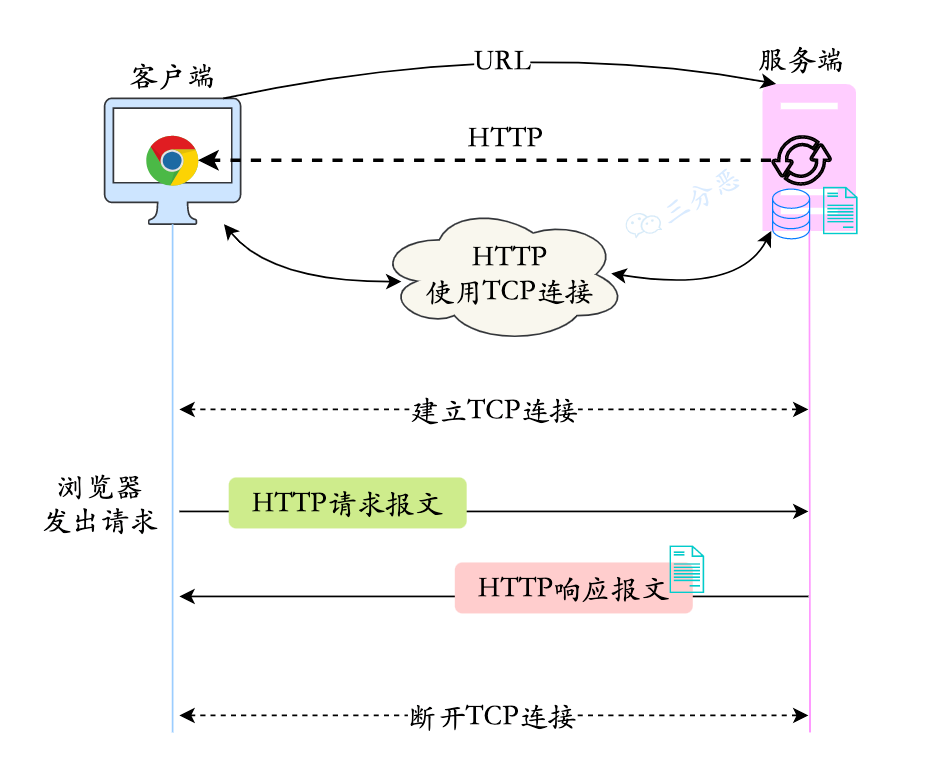

### HTTP 请求的完整过程
1. **建立连接**
    - **DNS解析**：客户端将域名解析为服务器的 IP 地址。
    - **TCP连接**：客户端通过三次握手与服务器建立 TCP 连接（HTTPS 请求则会在此基础上增加 TLS/SSL 加密握手）。
2. **发送请求**
    - 客户端发送 HTTP 请求报文，包括：
        * **请求行**：指定请求方法（如 GET、POST）、目标 URL 和 HTTP 版本。
        * **请求头**：携带元信息，如 Host、User-Agent、Accept 等。
        * **请求体**：在 POST 或 PUT 请求中包含数据（如表单数据或 JSON 数据）。
3. **服务器处理请求**
    - 服务器接收请求，解析请求报文，调用对应的处理逻辑。
    - 如果请求涉及动态数据，可能会调用后端程序（如 PHP、Java、Python 等）或数据库。
    - 根据处理结果生成响应。
4. **返回响应**
    - 服务器返回 HTTP 响应报文，包括：
        * **响应行**：包含 HTTP 状态码（如 200 OK、404 Not Found）。
        * **响应头**：如 Content-Type、Content-Length 等。
        * **响应体**：返回的数据内容（如 HTML 页面、JSON 数据、文件等）。
5. **连接关闭**
    - 服务器关闭 TCP 连接或保持连接（Keep-Alive）以便后续请求复用。
    - **HTTP/1.1**：默认启用持久连接，通过 `Connection: close` 头显式关闭连接。
    - **HTTP/2**：支持多路复用，多个请求和响应可以同时在一个连接上传输，提高了效率。
    - **HTTP/3**：基于 QUIC 协议，进一步优化了连接建立和传输效率

---

### HTTP 请求的原理
1. **基于客户端-服务器模型**
    - HTTP 是一个 **请求-响应模型**，由客户端发起请求，服务器处理并返回响应。
2. **无状态性**
    - 每个 HTTP 请求都是独立的，服务器不会自动保留请求之间的上下文状态（需要通过 **Cookie** 或 **Session** 来管理状态）。
3. **应用层协议**
    - HTTP 属于 TCP/IP 协议栈的应用层，依赖下层的 TCP 和 IP 进行数据传输。
4. **明文通信（HTTP）或加密通信（HTTPS）**
    - HTTP 默认以明文传输，敏感数据可能被中间人拦截。
    - HTTPS 在 HTTP 和 TCP 之间加入了 TLS/SSL 协议，用于加密通信，确保安全性。

## 说一下 HTTP 的报文结构？
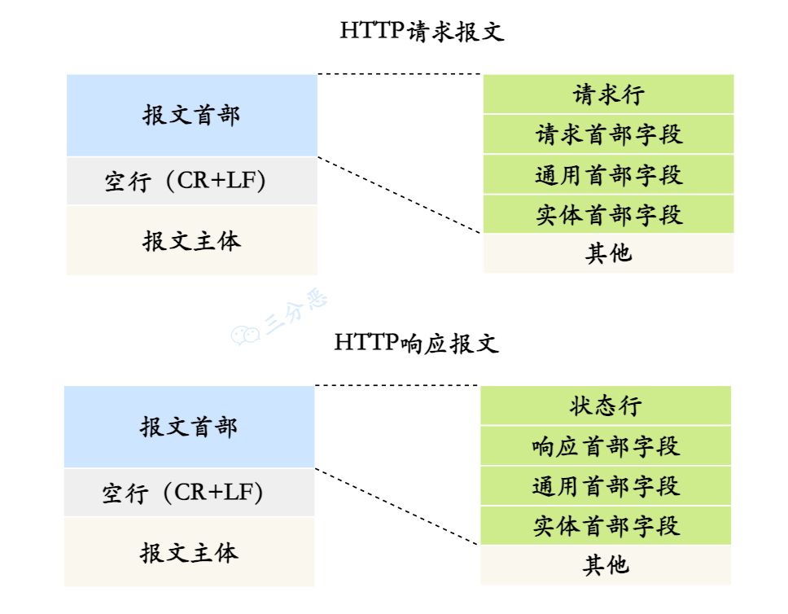

HTTP 报文结构由两部分组成：请求报文和响应报文。两者的结构类似，但作用不同。

1. 请求报文结构：
    - 请求行：包括 HTTP 方法（如 GET、POST）、请求的 URL 路径和 HTTP 协议版本。例如：`GET /index.html HTTP/1.1`
    - 请求头：包含键值对形式的元信息，用于描述请求的附加信息。例如： 

```java
Host: www.example.com
User-Agent: Mozilla/5.0
Accept: text/html
```

    - 空行：用于分隔请求头和请求体。
    - 请求体：在 POST、PUT 等方法中包含实际数据，如表单数据或 JSON 数据。
2. 响应报文结构：
    - 响应行：包括 HTTP 协议版本、状态码和状态描述。例如：`HTTP/1.1 200 OK`
    - 响应头：包含键值对形式的元信息，用于描述响应的附加信息。例如： 

```java
Content-Type: text/html
Content-Length: 123
```

    - 空行：用于分隔响应头和响应体。
    - 响应体：实际返回的数据内容，可以是 HTML 页面、JSON 数据、图片等。

HTTP 报文结构的核心是基于文本的协议设计，通过清晰的行分隔和内容分隔，支持多种灵活的数据交互方式。

## URI 和 URL 有什么区别?
+ **URI（统一资源标识符，Uniform Resource Identifier）**：标识的是 Web 上每一种可用的资源，如 HTML 文档、图像、视频片段、程序等都是由一个 URI 进行标识的。
+ **URL（统一资源定位符，Uniform Resource Location）**：它是 URI 的一种子集，主要作用是提供资源的路径。

## 说下 HTTP1.0，1.1，2.0 的区别？
<details class="lake-collapse"><summary id="u9fb06896"></summary><p id="u764ed2a5" class="ne-p"><br></p><h3 id="PI4OS"><strong><span class="ne-text">HTTP 1.0</span></strong></h3><ul class="ne-ul"><li id="u0aa7b921" data-lake-index-type="0"><span class="ne-text">无状态协议，每个请求独立。</span></li><li id="u2fa5f64d" data-lake-index-type="0"><span class="ne-text">使用非持久连接，每次请求都建立新连接，增加了网络开销。</span></li></ul><h3 id="vxbx6"><strong><span class="ne-text">HTTP 1.1</span></strong></h3><ul class="ne-ul"><li id="u6de3d291" data-lake-index-type="0"><span class="ne-text">引入持久连接，允许多个请求在同一连接上传输，减少连接开销。</span></li><li id="u28d1ee39" data-lake-index-type="0"><span class="ne-text">支持管道化，客户端可以提前发送请求，响应按顺序返回。</span></li></ul><h3 id="sOAeC"><strong><span class="ne-text">HTTP 2.0</span></strong></h3><ul class="ne-ul"><li id="ud429e51a" data-lake-index-type="0"><span class="ne-text">使用二进制协议，提升传输效率。</span></li><li id="uff8d82cf" data-lake-index-type="0"><span class="ne-text">支持多路复用，一个连接上可以同时进行多个请求和响应。</span></li><li id="u93c2af8b" data-lake-index-type="0"><span class="ne-text">引入头部压缩机制，减少了头部数据的重复传输。</span></li></ul><h3 id="HgzR1"><strong><span class="ne-text">HTTP 3.0</span></strong></h3><ul class="ne-ul"><li id="u5f943fce" data-lake-index-type="0"><span class="ne-text">基于 </span><strong><span class="ne-text">QUIC</span></strong><span class="ne-text"> 协议（UDP， Quick UDP Connections，直译为快速 UDP 网络连接） UDP 协议实现，减少连接延迟。</span></li><li id="ua4362543" data-lake-index-type="0"><span class="ne-text">所有数据默认加密传输（TLS），增强安全性。</span></li></ul></details>
### HTTP 1.0
+ **无状态协议**：HTTP 1.0 是无状态的，每个请求之间相互独立，服务器不保存任何请求的状态信息。
+ **非持久连接**： 每次请求都需要建立一个新的 TCP 连接，请求完成后立即关闭连接（无持久连接）。  

### HTTP 1.1
+ **持久连接**：HTTP 1.1 引入了持久连接（也称为 HTTP keep-alive），默认情况下不会立即关闭连接， 允许在一个 TCP 连接上发送多个请求和响应，减少了连接建立和关闭的开销。  
+ **管道化（Pipelining）**：允许客户端在未收到上一个请求的响应时发送下一个请求，但服务器必须按顺序返回响应。  

### HTTP 2.0
+ **二进制协议**：HTTP 2.0 使用二进制而不是文本格式来传输数据，解析更加高效。
+ **多路复用**：一个 TCP 连接上可以同时进行多个 HTTP 请求/响应，解决了 HTTP 1.x 的队头阻塞问题。
+ **头部压缩**：HTTP 协议不带状态，所以每次请求都必须附上所有信息。HTTP 2.0 引入了头部压缩机制，使用压缩算法压缩后再发送，减少了冗余头部信息的带宽消耗。
+ **服务端推送**：服务器可以主动向客户端推送资源，而不需要客户端明确请求。

## HTTP/3 了解吗？（ 基于 UDP + QUIC 协议，连接更快、抗丢包强  ）
HTTP/3 是 HTTP 的最新版本，基于 **QUIC** 协议（UDP， Quick UDP Connections，直译为快速 UDP 网络连接），取代了传统的 TCP。它具有以下特点：

1. ** 基于 UDP**： 使用 UDP 而非 TCP，避免了 TCP 的队头阻塞问题。
2. **多路复用无阻塞**：流独立传输， 丢包只影响单个流，不会阻塞其他流。
3. **内置加密**：集成 TLS 1.3， 所有数据默认加密传输  ，安全性更高。
4. **连接迁移**： 丢包只影响单个流，不会阻塞其他流。  

当前已被 Chrome、Firefox 等主流浏览器和部分服务器支持，是未来 HTTP 协议的发展方向。

## HTTP 长连接了解吗？
HTTP 长连接允许客户端和服务器在一个 TCP 连接上复用多次请求和响应，从而减少频繁建立连接的开销，提升性能。

通过 **Connection: keep-alive** 实现，它默认在 **HTTP/1.1** 中启用。

特点：

1. **减少开销**：避免重复握手，降低延迟和资源消耗。
2. **高效传输**：适合加载多个资源或高频请求。
3. **超时控制**：通过 `Keep-Alive` 设置连接的最大请求数和超时时间。

HTTP/2 和 HTTP/3 进一步优化了长连接，支持多路复用和无队头阻塞。长连接是现代 Web 性能优化的核心技术之一。

## 说说 HTTP 与 HTTPS 有哪些区别？
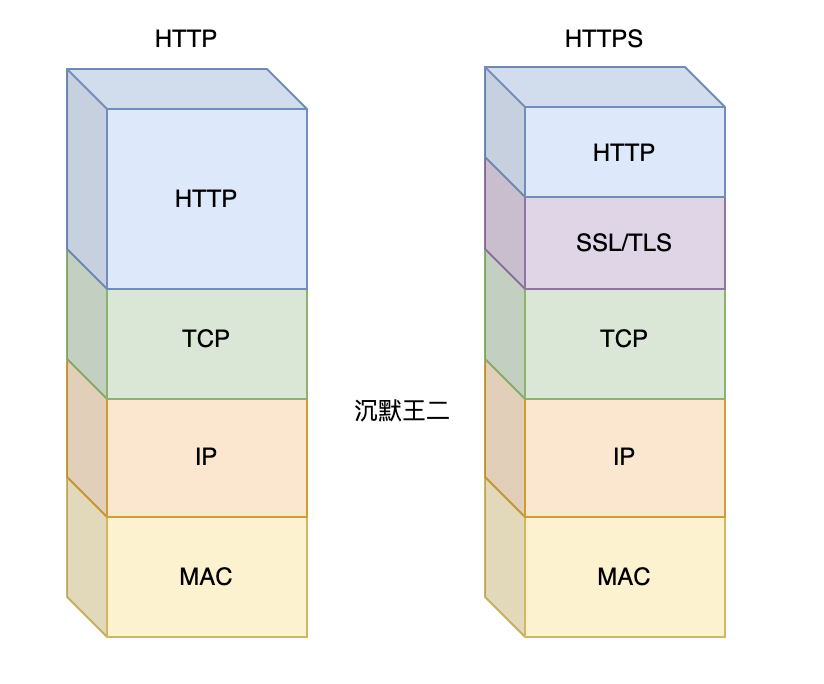

<details class="lake-collapse"><summary id="ub1954252"></summary><p id="u32262417" class="ne-p"><strong><span class="ne-text">HTTP</span></strong><span class="ne-text"> 与 </span><strong><span class="ne-text">HTTPS</span></strong><span class="ne-text"> 的主要区别在于：</span></p><ul class="ne-ul"><li id="u640f0cd4" data-lake-index-type="0"><strong><span class="ne-text">加密</span></strong><span class="ne-text">：HTTP数据明文传输， 不加密；HTTPS 使用数据（ SSL/TLS ）加密，确保数据安全。</span></li><li id="u12601815" data-lake-index-type="0"><strong><span class="ne-text">端口</span></strong><span class="ne-text">：HTTP 使用 80 端口，HTTPS 使用 443 端口。</span></li><li id="u9ad9b8c4" data-lake-index-type="0"><strong><span class="ne-text">安全性</span></strong><span class="ne-text">：HTTP 不提供安全保障，易受攻击；HTTPS 提供加密和身份验证，保证安全。</span></li></ul><p id="ue2079f5b" class="ne-p"><span class="ne-text">HTTPS 更安全，适用于敏感数据传输。</span></p></details>
HTTP 和 HTTPS 的主要区别在于安全性：

1. **安全性**：HTTP 是明文传输，易被拦截；HTTPS 使用 TLS/SSL 加密，保障数据安全。
2. **端口**：HTTP 默认端口是 80，HTTPS 是 443。
3. **证书**：HTTP 不需要证书，HTTPS 需配置 SSL 证书验证服务器身份。
+ **HTTP**：简单快速，但安全性低。
+ **HTTPS**：加密传输，安全性高，是现代 Web 的标准协议。

## 为什么要用 HTTPS？


HTTP 是明文传输，存在数据窃听、篡改和伪造等问题。HTTPS 通过引入 SSL/TLS 解决这些问题。

在 HTTPS 加密中：

1. **非对称加密**：用于密钥交换，服务器发送公钥，客户端用公钥加密会话密钥，服务器用私钥解密得到会话密钥。
2. **对称加密**：用于加密通信内容，双方用会话密钥加密数据。

客户端通过数字证书验证服务器身份，证书由 CA 签发，包含服务器公钥、颁发机构和有效期等信息。HTTPS 确保数据安全、完整和可信。

## HTTPS 是怎么建立连接的？
### HTTPS 建立连接包括握手阶段和数据传输阶段：
1. 客户端向服务器发起请求。
2. 服务器返回数字证书，包含**公钥**和颁发机构信息。
3. 客户端验证证书，生成**随机码（会话密钥）**，用服务器公钥加密后发送。
4. 服务器用**私钥**解密，得到会话密钥。
5. 双方使用会话密钥对通信内容加密并传输。

**HTTPS** 通过数字证书、非对称加密和对称加密，确保通信的安全性。


## 客户端怎么去校验证书的合法性？
客户端验证证书合法性主要包括以下步骤：

1. **检查签发机构**：确认证书是否由可信 CA 签发。
2. **验证有效期**：确保证书未过期。
3. **检查吊销状态**：通过 CRL 或 OCSP 确认证书未被吊销。
4. **验证域名匹配**：确保证书中的域名与目标服务器一致。
5. **检查证书链**：验证证书链逐级有效，最终追溯到可信根证书。
6. **验证完整性**：校验签名，确保证书未被篡改。

## 如何理解 HTTP 协议是无状态的？
HTTP 协议是无状态的，意味着每个请求都是独立的，服务器不会自动保留客户端之间的上下文信息。以下是对无状态性的理解：

1. **请求独立性**  
每个 HTTP 请求都是独立的，服务器处理请求时不会依赖之前的请求，也不会记住客户端的历史操作。
2. **无内置会话机制**  
HTTP 协议本身没有会话管理功能，无法直接保存用户状态，例如登录状态、购物车信息等。
3. **简化设计**  
无状态性使得协议设计简单高效，服务器不需要为每个客户端维护状态，减少了资源开销，特别适合分布式架构和高并发场景。
4. **状态管理扩展**  
为了解决无状态性的问题，可以通过以下方式管理状态：
    - **Cookie**：在客户端存储状态信息，由浏览器自动附加到后续请求中。
    - **Session**：在服务器端维护会话信息，通过会话 ID 与客户端关联。
    - **Token**：如 JWT，客户端携带加密的状态信息，不依赖服务器存储。
5. **无状态的优缺点**
    - **优点**：简单、高效、易于扩展，适合分布式系统。
    - **缺点**：需要额外的机制（如 Cookie、Session）来保存状态，增加了实现复杂性。

总结来说，HTTP 的无状态性强调请求的独立性，这既是它的简化设计优点，也是需要通过扩展解决的关键问题。

## 说说 Session 和 Cookie 有什么联系和区别?
<details class="lake-collapse"><summary id="ucad34c96"></summary><p id="u81d09f75" class="ne-p"><strong><span class="ne-text">Session：</span></strong></p><ul class="ne-ul"><li id="ufd5ba526" data-lake-index-type="0"><span class="ne-text">数据存储在服务器，客户端通过唯一的 </span><strong><span class="ne-text">Session ID</span></strong><span class="ne-text"> 识别。用于存储用户状态数据，比如登录状态和权限信息。适合存储较大数据，安全性较高。</span></li></ul><p id="ua1eda2b1" class="ne-p"><strong><span class="ne-text">Cookie：</span></strong></p><ul class="ne-ul"><li id="ufd4d10c6" data-lake-index-type="0"><span class="ne-text">存储在客户端，包含会话信息（如 Session ID 。适合存储小量、非敏感的用户信息，如用户偏好。安全性较差。  </span></li></ul><p id="u822ef832" class="ne-p"><strong><span class="ne-text">Token：</span></strong></p><ul class="ne-ul"><li id="u6dc06e0e" data-lake-index-type="0"><strong><span class="ne-text">Token</span></strong><span class="ne-text"> 是一种用于身份验证的字符串，包含用户信息和签名，通常由服务器生成并发送给客户端。不依赖于服务器存储状态，适合分布式系统。</span></li></ul></details>
**Session、Cookie 和 Token**

**Session：**

+ 数据存储在服务器，客户端通过唯一的 **Session ID** 识别。
+ 用于存储用户状态和数据，比如用户的登录状态和权限信息。
+ 适合存储较大数据，安全性较高。

**Cookie：**

+ **Cookie** 是服务器发送到客户端（通常是浏览器）的一小段数据，每次请求都会自动携带相关的 Cookie。
+ Cookie 以键值对形式存在。
+ 适合存储小量、非敏感的用户信息，如用户偏好、访问记录等。

**Token：**

+ **Token** 是一种用于身份验证的字符串，包含用户信息和签名，通常由服务器生成并发送给客户端。
+ 不依赖于服务器存储状态，适合分布式系统。
+ 安全性较高，通常经过签名，防止篡改。

---

**联系**

**配合使用：**

+ **Session 和 Cookie** 通常配合使用。服务器为每个用户创建一个唯一的 **Session ID**，并通过 **Cookie** 发送给客户端。
+ 客户端在后续请求中会自动将 **Cookie**（包含 Session ID）发送回服务器，服务器根据 **Session ID** 查找对应的用户数据。

---

**区别**

+ **存储位置**：
    - **Cookie** 存储在用户的浏览器中。
    - **Session** 存储在服务器端，通常与一个唯一的 **Session ID** 关联。
+ **数据大小**：
    - **Cookie** 一般限制为 4KB，适合存储少量数据。
    - **Session** 可以存储更大的数据，具体限制依赖于服务器的配置。
+ **安全性**：
    - **Session** 存储在服务端，安全性相对 **Cookie** 要好一些。

**总结**

+ **Cookie**：适合在客户端存储小量、非敏感的数据，尤其是需要在多次请求中保持的信息，比如用户偏好、语言设置等。
+ **Session**：适合存储敏感或较复杂的会话数据，尤其是与用户身份和权限相关的数据，比如登录状态。

## 讲一下  JWT  
<details class="lake-collapse"><summary id="ud6319e53"><span class="ne-text"><br /></span><strong><span class="ne-text">JWT（JSON Web Token）</span></strong><span class="ne-text"> 是一种自包含的令牌，用于安全地传递用户身份和权限信息，通常用于身份验证和授权。JWT 由三部分组成：</span></summary><div class="ne-quote"><p id="ub87ec101" class="ne-p"><span class="ne-text"> 自包含就是 </span><strong><span class="ne-text">JWT 本身包含了所有验证所需的信息</span></strong><span class="ne-text">，不依赖服务器保存任何状态。  </span></p></div><ol class="ne-ol"><li id="ue8e1473e" data-lake-index-type="0"><strong><span class="ne-text">头部（Header）</span></strong><span class="ne-text">：包含算法信息。</span></li><li id="u13433104" data-lake-index-type="0"><strong><span class="ne-text">负载（Payload）</span></strong><span class="ne-text">：存储用户数据和声明。</span></li><li id="u934e4c00" data-lake-index-type="0"><strong><span class="ne-text">签名（Signature）</span></strong><span class="ne-text">： 用于验证消息的真实性。</span></li></ol><p id="u966612f7" class="ne-p"><span class="ne-text">JWT 是无状态的，服务器无需存储会话即可确认用户身份，适用于分布式系统。</span></p></details>
### **JWT（JSON Web Token）简述**
#### **概念**
JWT 是一种基于 JSON 的令牌，用于在客户端和服务器之间传递用户认证信息和数据交换。

---

#### **结构**
由三部分组成，通过 `.` 分隔：

1. **Header**：描述算法和令牌类型。

```java
{"alg": "HS256", "typ": "JWT"}
```

2. **Payload**：存储用户信息（如 `user_id`、`exp` 等）。

```java
{"sub": "123", "name": "John", "exp": 1700000000}
```

3. **Signature**：通过签名算法和密钥生成，用于验证数据完整性。

---

#### **特点**
1. **无状态**：无需服务器保存会话信息。
2. **自包含性**：数据存储在令牌中，便于解析。
3. **可解码但需验证**：Header 和 Payload 可解码，但需通过签名验证。

---

#### **工作流程**
1. 用户登录成功，服务器生成 JWT 并返回。
2. 客户端存储 JWT（如 `localStorage` 或 Cookie）。
3. 每次请求附带 JWT（`Authorization: Bearer <token>`）。
4. 服务器验证签名，解析数据。

---

#### **优点**
1. 跨平台支持，使用 JSON 格式。
2. 无需维护会话，提高性能。
3. 易于传输，适合分布式系统。

#### **缺点**
1. 无法主动失效，需等待过期。
2. 如果被截获可能导致信息泄露。

---

#### **安全措施**
1. 使用 HTTPS 防止拦截。
2. 设置短有效期（`exp`）。
3. 将 JWT 存储在 HttpOnly Cookie 中。
4. 配合 Refresh Token 更新令牌。

---

#### **应用场景**
+ 用户认证（如登录状态）。
+ 系统间安全数据传递。

# TCP
## 说一下tcp的头部，<font style="color:rgb(51, 51, 51);">TCP的头部结构说一下</font>
| 字段 | 长度 | 描述 |
| --- | --- | --- |
| 源端口号 | 16位 | 发送端口 |
| 目标端口号 | 16位 | 接收端口 |
| 序列号 | 32位 | 字节流序列号 |
| 确认号 | 32位 | 确认序列号 |
| 数据偏移 | 4位 | TCP头部长度 |
| 保留字段 | 6位 | 备用位，设置为0 |
| 标志位 | 6位 | 控制连接与数据传输 |
| 窗口大小 | 16位 | 流量控制 |
| 校验和 | 16位 | 数据完整性校验 |
| 紧急指针 | 16位 | 紧急数据指针 |
| 选项和填充 | 可变 | 可选扩展功能 |


TCP（传输控制协议）是一个可靠的面向连接的协议，其头部结构中包含了许多重要的字段，确保数据的可靠传输和管理。TCP头部通常为**20字节的基础头部**，可以根据选项字段的长度增加。下面详细说明其各个字段：

---

### **TCP头部结构**
1. **源端口号（Source Port，16位）**  
标识发送端的应用程序端口，用于区分发送的进程。
2. **目标端口号（Destination Port，16位）**  
标识接收端的应用程序端口，用于区分接收的进程。
3. **序列号（Sequence Number，32位）**  
用于标识发送数据字节流中的位置，确保数据按序到达。  
    - 第一个字节的序号是初始序号（ISN）。
    - 对于每个传输的数据字节，序号都会递增。
4. **确认号（Acknowledgment Number，32位）**  
用于确认接收方已经成功接收到的数据字节序号。  
    - 如果设置了ACK标志，则表示此字段有效，值为接收方期望下一个字节的序号。
5. **数据偏移（Data Offset，4位）**  
指明TCP头部的长度，以4字节为单位。  
    - 最小值为5（20字节），最大值为15（60字节）。  
    - 用于定位数据段的起始位置。
6. **保留（Reserved，6位）**  
保留为将来使用，通常设置为0。
7. **标志位（Flags，6位）**  
表示控制信息的6个重要标志：
    - **URG**（紧急指针有效，Urgent Pointer）：1表示紧急数据存在。
    - **ACK**（确认标志，Acknowledgment）：1表示确认号字段有效。
    - **PSH**（推送标志，Push）：1表示接收方应立即将数据推送到应用层。
    - **RST**（复位连接，Reset）：1表示重置连接。
    - **SYN**（同步序号，Synchronize）：1表示发起连接请求。
    - **FIN**（结束标志，Finish）：1表示发送端完成数据发送，连接可以关闭。
8. **窗口大小（Window Size，16位）**  
表示接收方的缓冲区剩余空间，用于流量控制。  
    - 告诉发送方当前能接收的最大字节数。
9. **校验和（Checksum，16位）**  
用于校验TCP头部和数据字段是否出现错误。  
    - 由发送端计算并填充，接收端重新计算并验证。
10. **紧急指针（Urgent Pointer，16位）**  
指明紧急数据的结束位置，仅当URG标志为1时有效。
11. **选项（Options，可变长度）**  
用于提供额外的控制功能或选项扩展。常见的选项包括：
    - **MSS（最大报文段长度）：** 表示一次能够接收的最大数据段大小。
    - **时间戳：** 用于测量RTT（往返时延）。
    - **窗口缩放：** 扩大窗口大小。
12. **填充（Padding，可变长度）**  
选项字段必须填充到4字节的整数倍，填充值通常为0。

---

### **TCP头部的典型示意图**
| 字段 | 长度 | 描述 |
| --- | --- | --- |
| 源端口号 | 16位 | 发送端口 |
| 目标端口号 | 16位 | 接收端口 |
| 序列号 | 32位 | 字节流序列号 |
| 确认号 | 32位 | 确认序列号 |
| 数据偏移 | 4位 | TCP头部长度 |
| 保留字段 | 6位 | 备用位，设置为0 |
| 标志位 | 6位 | 控制连接与数据传输 |
| 窗口大小 | 16位 | 流量控制 |
| 校验和 | 16位 | 数据完整性校验 |
| 紧急指针 | 16位 | 紧急数据指针 |
| 选项和填充 | 可变 | 可选扩展功能 |


---

### **小结**
TCP头部设计支持高效、可靠的数据传输，通过丰富的字段实现了顺序控制、错误校验、流量管理等功能。在调试或分析网络问题时，可以通过抓包工具（如Wireshark）观察这些字段，从而排查性能或协议问题。

## 详细说一下 TCP 的三次握手机制
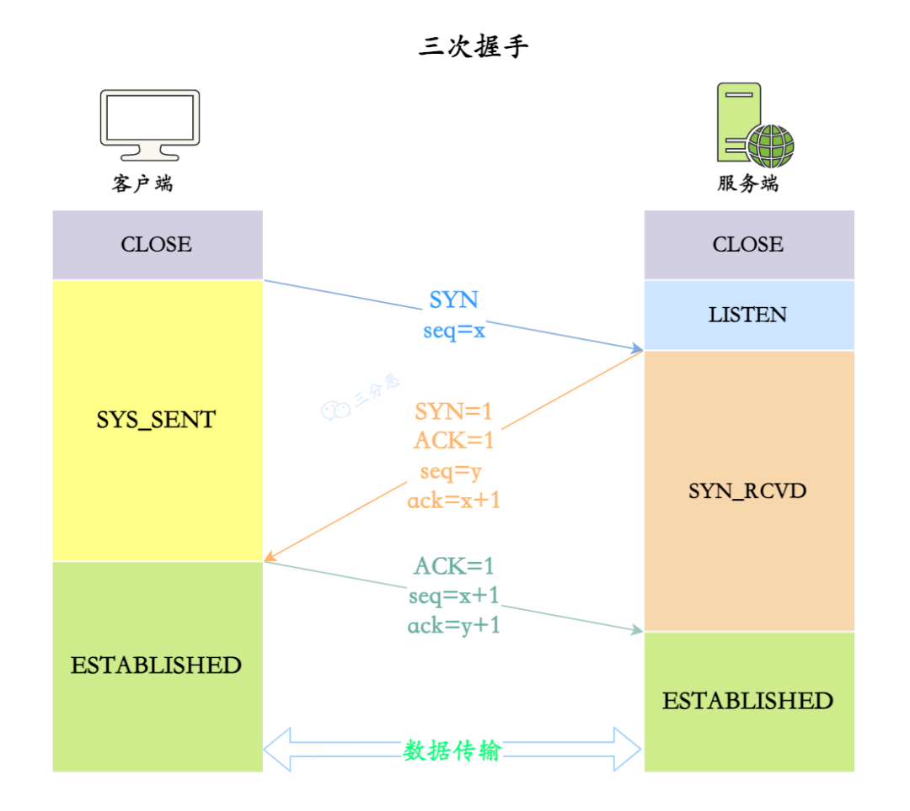

<details class="lake-collapse"><summary id="u3c3d625b"></summary><h3 id="46ad1ca7" data-lake-index-type="2"><span class="ne-text">第一次握手（SYN）：</span></h3><ul class="ne-ul"><li id="u9d68d304" data-lake-index-type="0"><strong><span class="ne-text">客户端</span></strong><span class="ne-text">发送一个 </span><strong><span class="ne-text">SYN</span></strong><span class="ne-text">（同步）包， 包含客户端的初始序列号</span><code class="ne-code"><span class="ne-text">seq = X</span></code><span class="ne-text"> ，表示请求建立连接。</span></li><li id="uc076e918" data-lake-index-type="0"><span class="ne-text">客户端进入</span><strong><span class="ne-text">SYN_SENT</span></strong><span class="ne-text">（ </span><strong><span class="ne-text">同步已发送</span></strong><span class="ne-text"> ）状态，等待服务器确认。</span></li></ul><h3 id="Hxt6A" data-lake-index-type="2"><span class="ne-text">第二次握手（SYN-ACK）：</span></h3><ul class="ne-ul"><li id="u699eaa9f" data-lake-index-type="0"><strong><span class="ne-text">服务器</span></strong><span class="ne-text">接收到客户端的 SYN 包后，确认收到并回复一个 </span><strong><span class="ne-text">SYN-ACK</span></strong><span class="ne-text">  同步确认包。 包含服务器的初始序列号（</span><code class="ne-code"><span class="ne-text">seq = Y</span></code><span class="ne-text">）和客户端序列号加 1（</span><code class="ne-code"><span class="ne-text">ack = X + 1</span></code><span class="ne-text">），表示服务器同意建立连接。  </span></li><li id="u7f39726f" data-lake-index-type="0"><span class="ne-text">服务器进入</span><strong><span class="ne-text">SYN_RECEIVED</span></strong><span class="ne-text">（ </span><strong><span class="ne-text">同步已接收</span></strong><span class="ne-text">  ）状态，等待客户端的确认。</span></li></ul><h3 id="ie1W9" data-lake-index-type="2"><span class="ne-text">第三次握手（ACK）：</span></h3><ul class="ne-ul"><li id="ua2d3b784" data-lake-index-type="0"><strong><span class="ne-text">客户端</span></strong><span class="ne-text"> 收到服务器的 SYN-ACK 包后，发送一个 </span><strong><span class="ne-text">ACK</span></strong><span class="ne-text"> 包，确认服务器的序列号（</span><code class="ne-code"><span class="ne-text">ack = Y + 1</span></code><span class="ne-text">）。表示客户端收到服务器的响应并确认连接建立。  </span></li><li id="uf1950e94" data-lake-index-type="0"><span class="ne-text">客户端进入</span><strong><span class="ne-text">ESTABLISHED</span></strong><span class="ne-text">（ </span><strong><span class="ne-text">已建立连接</span></strong><span class="ne-text">  ）状态，表示连接已建立。</span></li><li id="ub698ad20" data-lake-index-type="0"><span class="ne-text">服务器收到客户端的ACK报文段后，也进入</span><strong><span class="ne-text">ESTABLISHED</span></strong><span class="ne-text">状态，表示连接已建立。</span></li></ul><hr id="dwBRY" class="ne-hr"><ul class="ne-ul"><li id="u85cbd448" data-lake-index-type="0"><strong><span class="ne-text">第一次握手</span></strong><span class="ne-text">：客户端发送 SYN 包，表示请求连接。</span></li><li id="u8b3172a4" data-lake-index-type="0"><strong><span class="ne-text">第二次握手</span></strong><span class="ne-text">：服务器回复 SYN-ACK 包，表示同意连接并提供自己的序列号。</span></li><li id="u2ee8961e" data-lake-index-type="0"><strong><span class="ne-text">第三次握手</span></strong><span class="ne-text">：客户端发送 ACK 包，确认连接建立。</span></li></ul></details>
## 三次握手的步骤
### 第一次握手（SYN）：
+ 客户端发送一个TCP报文段给服务器，其中：
    - **SYN（同步）标志位设置为1**，表示请求建立连接。
    - **序列号（Sequence Number）设置为一个随机值**（例如，Seq = X）。
+ 客户端进入**SYN_SENT**（ **同步已发送** ）状态，等待服务器的确认。

### 第二次握手（SYN-ACK）：
+ 服务器收到客户端的SYN报文段后，发送一个TCP报文段给客户端，其中：
    - **SYN标志位设置为1**，表示同意建立连接。
    - **ACK（确认）标志位设置为1**，表示确认客户端的SYN报文段。
    - **序列号（Sequence Number）设置为一个随机值**（例如，Seq = Y）。
    - **确认号（Acknowledgment Number）设置为客户端的序列号加1**（例如，Ack = X + 1）。
+ 服务器进入**SYN_RECEIVED**（ **同步已接收**  ）状态，等待客户端的确认。

### 第三次握手（ACK）：
+ 客户端收到服务器的SYN-ACK报文段后，发送一个TCP报文段给服务器，其中：
    - **ACK标志位设置为1**，表示确认服务器的SYN报文段。
    - **序列号（Sequence Number）设置为X + 1**。
    - **确认号（Acknowledgment Number）设置为服务器的序列号加1**（例如，Ack = Y + 1）。
+ 客户端进入**ESTABLISHED**（ **已建立连接**  ）状态，表示连接已建立。
+ 服务器收到客户端的ACK报文段后，也进入**ESTABLISHED**状态，表示连接已建立。

<details class="lake-collapse"><summary id="u86340a34"><span class="ne-text">举例子</span></summary><p id="u325cc265" class="ne-p"><span class="ne-text">好的！我用一个通俗的例子来解释TCP的三次握手，帮助你更好地理解这个过程。</span></p><hr id="UK1nv" class="ne-hr"><h3 id="XgAKZ"><span class="ne-text">例子：打电话的场景</span></h3><p id="u1800f509" class="ne-p"><span class="ne-text">假设你想给朋友打电话，确认双方都能正常通话。这个过程就像TCP的三次握手：</span></p><ol class="ne-ol"><li id="ubd49892a" data-lake-index-type="0"><strong><span class="ne-text">第一次握手（SYN）</span></strong><span class="ne-text">：</span></li></ol><ul class="ne-list-wrap"><ul ne-level="1" class="ne-ul"><li id="u2b621d7a" data-lake-index-type="0"><span class="ne-text">你拿起电话，拨通朋友的号码，然后说：“喂，你能听到我吗？”  </span></li><li id="ueb589555" data-lake-index-type="0"><span class="ne-text">这相当于客户端发送一个SYN报文，请求建立连接。</span></li></ul></ul><ol start="2" class="ne-ol"><li id="ueb3f015f" data-lake-index-type="0"><strong><span class="ne-text">第二次握手（SYN-ACK）</span></strong><span class="ne-text">：</span></li></ol><ul class="ne-list-wrap"><ul ne-level="1" class="ne-ul"><li id="u783695f6" data-lake-index-type="0"><span class="ne-text">你的朋友听到电话铃声，接起电话，然后说：“我能听到你，你能听到我吗？”  </span></li><li id="udc74757d" data-lake-index-type="0"><span class="ne-text">这相当于服务器收到SYN后，回复一个SYN-ACK报文，表示同意建立连接，并等待你的确认。</span></li></ul></ul><ol start="3" class="ne-ol"><li id="ua1bc3f3e" data-lake-index-type="0"><strong><span class="ne-text">第三次握手（ACK）</span></strong><span class="ne-text">：</span></li></ol><ul class="ne-list-wrap"><ul ne-level="1" class="ne-ul"><li id="ue7157530" data-lake-index-type="0"><span class="ne-text">你听到朋友的回应后，说：“我能听到你，我们可以开始聊天了！”  </span></li><li id="ubdaa85ed" data-lake-index-type="0"><span class="ne-text">这相当于客户端发送一个ACK报文，确认连接已建立。</span></li></ul></ul><hr id="zISiq" class="ne-hr"><h3 id="uDrdb"><span class="ne-text">对应到TCP的三次握手</span></h3><ol class="ne-ol"><li id="u5ef8e792" data-lake-index-type="0"><strong><span class="ne-text">第一次握手（SYN）</span></strong><span class="ne-text">：</span></li></ol><ul class="ne-list-wrap"><ul ne-level="1" class="ne-ul"><li id="ue1f0dfd8" data-lake-index-type="0"><span class="ne-text">客户端发送SYN报文，说：“我想和你建立连接，我的初始序号是X。”</span></li></ul></ul><ol start="2" class="ne-ol"><li id="u5974941b" data-lake-index-type="0"><strong><span class="ne-text">第二次握手（SYN-ACK）</span></strong><span class="ne-text">：</span></li></ol><ul class="ne-list-wrap"><ul ne-level="1" class="ne-ul"><li id="u1f67a125" data-lake-index-type="0"><span class="ne-text">服务器回复SYN-ACK报文，说：“我收到你的请求了，同意建立连接，我的初始序号是Y，期待你下次发送X+1。”</span></li></ul></ul><ol start="3" class="ne-ol"><li id="u0420d1c3" data-lake-index-type="0"><strong><span class="ne-text">第三次握手（ACK）</span></strong><span class="ne-text">：</span></li></ol><ul class="ne-list-wrap"><ul ne-level="1" class="ne-ul"><li id="u5c155ec4" data-lake-index-type="0"><span class="ne-text">客户端发送ACK报文，说：“我收到你的回复了，下次我会发送X+1，期待你发送Y+1。”</span></li></ul></ul><hr id="GVWLR" class="ne-hr"><h3 id="udBUY"><span class="ne-text">为什么需要三次握手？</span></h3><ul class="ne-ul"><li id="u5d24ae6b" data-lake-index-type="0"><strong><span class="ne-text">确保双方都能通信</span></strong><span class="ne-text">：就像打电话时，双方都要确认对方能听到自己。</span></li><li id="ub831fc26" data-lake-index-type="0"><strong><span class="ne-text">防止旧的无效请求</span></strong><span class="ne-text">：比如你之前打过电话但没接通，这次重新打，朋友需要确认是新的请求，而不是之前的无效请求。</span></li></ul><hr id="oQoiM" class="ne-hr"><h3 id="GL8dS"><span class="ne-text">总结</span></h3><p id="uab5b5013" class="ne-p"><span class="ne-text">三次握手就像打电话时的三次对话：</span></p><ol class="ne-ol"><li id="ucf6cf971" data-lake-index-type="0"><span class="ne-text">你问：“你能听到我吗？”（SYN）</span></li><li id="ubb76bb9b" data-lake-index-type="0"><span class="ne-text">朋友回答：“我能听到你，你能听到我吗？”（SYN-ACK）</span></li><li id="u2f3d7ccb" data-lake-index-type="0"><span class="ne-text">你确认：“我能听到你，我们可以聊天了！”（ACK）</span></li></ol><p id="u3e7b360e" class="ne-p"><span class="ne-text">通过这三次确认，双方都能确保连接是可靠的，可以开始正式通信了！ </span><span class="ne-text">😊</span></p></details>
## TCP 握手为什么是三次，为什么不能是两次？不能是四次？
<details class="lake-collapse"><summary id="u977a8f77"></summary><ul class="ne-ul"><li id="ud993778c" data-lake-index-type="0"><strong><span class="ne-text">不能是两次</span></strong><span class="ne-text">：两次握手无法确保客户端收到服务器的确认，可能导致状态不一致，而且还无法避免旧连接的干扰。</span></li><li id="u558156ca" data-lake-index-type="0"><strong><span class="ne-text">不能是四次</span></strong><span class="ne-text">：四次握手增加了不必要的通信开销，三次握手已经足够确保可靠连接。</span></li></ul></details>
### 1. 为什么不能是两次握手？
+ **旧连接问题**：两次握手无法确认是否是网络延迟导致的旧连接请求，可能让服务器错误建立连接。  
+ **状态不同步**：服务器在第二次握手完成后，会认为连接已经建立，但客户端未作任何确认，服务器无法确定客户端是否真正准备好进行通信。  

### 2. 为什么不是四次握手？
+ **没有必要**：三次握手已经确保双方状态同步，多一次确认并不能增加可靠性。  
+ **效率低**：四次握手增加了开销和延迟。

### 3. 为什么是三次握手？
+ **状态同步**：三次握手确保客户端和服务器都知道对方已准备好通信。  
+ **防旧连接**：通过客户端的最后确认，服务器能确认连接是最新的请求。

**总结**：三次握手在**可靠性**和**效率**之间达到了最佳平衡。

## 三次握手中每一次没收到报文会发生什么情况？
<details class="lake-collapse"><summary id="u61ec504b"></summary><p id="uba3f6f30" class="ne-p"><span class="ne-text"></span></p><ol class="ne-ol"><li id="ufd4b1604" data-lake-index-type="0"><strong><span class="ne-text">第一次握手</span></strong><span class="ne-text">：客户端发送 SYN 包后，如果没有收到 SYN-ACK，客户端会重试，直到超时并放弃连接。</span></li><li id="uf59771ae" data-lake-index-type="0"><strong><span class="ne-text">第二次握手</span></strong><span class="ne-text">：服务器发送 SYN-ACK 后，如果客户端没收到，会重试，直到超时并放弃连接。</span></li><li id="ub06c791d" data-lake-index-type="0"><strong><span class="ne-text">第三次握手</span></strong><span class="ne-text">：客户端发送 ACK 后，如果服务器没收到，会重试，直到超时并放弃连接。</span></li></ol><p id="uefaaa184" class="ne-p"><span class="ne-text"></span></p></details>
### 1. **第一次握手（SYN）丢失**
+ **情况**：客户端发送SYN报文后，**没有收到服务器的SYN-ACK回复**。
+ **处理**：
    - 客户端会**启动重传机制**，重新发送SYN报文。
    - 重传的时间间隔通常是**指数增长的**（例如1秒、2秒、4秒、8秒等），直到达到**最大重试次数**。
    - 如果超过最大重试次数仍未收到回复，客户端会**放弃连接并返回错误**。

### 2. **第二次握手（SYN-ACK）丢失**
+ **情况**：服务器发送SYN-ACK报文后，**没有收到客户端的ACK回复**。
+ **处理**：
    - 服务器会**启动重传机制**，重新发送SYN-ACK报文。
    - 重传的时间间隔同样是**指数增长的**。
    - 如果超过最大重试次数仍未收到ACK，服务器会**关闭连接并释放资源**。

### 3. **第三次握手（ACK）丢失**
+ **情况**：客户端发送ACK报文后，**服务器没有收到**。
+ **处理**：
    - 服务器因为没有收到ACK，会**认为自己的SYN-ACK报文丢失**，于是重传SYN-ACK报文。
    - 客户端收到重传的SYN-ACK后，会**再次发送ACK**。
    - 如果服务器最终收到ACK，**连接建立**；否则，服务器会**超时关闭连接**。

### 总结
1. **SYN丢失**：客户端**重传SYN**，直到成功或超时。
2. **SYN-ACK丢失**：服务器**重传SYN-ACK**，直到成功或超时。
3. **ACK丢失**：服务器**重传SYN-ACK**，客户端**重新发送ACK**，直到成功或超时。

TCP通过**重传机制**和**超时机制**，确保在网络不稳定的情况下仍能**可靠地建立连接**。如果多次重传仍失败，连接会**终止并释放资源**。

## 第二次握手传回了 ACK，为什么还要传回 SYN？
### 为什么第二次握手要传回ACK和SYN？
1. **ACK的作用**：
    - 确认客户端的SYN报文，表示“我收到了你的连接请求”。
2. **SYN的作用**：
    - 向客户端同步服务器的初始序列号，表示“我也想和你建立连接”。
3. **结合的好处**：
    - **双向通信**：确保双方都能同步序列号，支持全双工通信。
    - **减少通信次数**：合并ACK和SYN到一个报文，提高效率。

### 总结
第二次握手传回**ACK**和**SYN**，既确认了客户端的请求，又同步了服务器的序列号，确保双向通信的可靠性，同时减少通信次数。

## 第 3 次握手可以携带数据吗？
**理论上第 3 次握手是可以携带数据的**

+ 此时**客户端已经处于 ESTABLISHED 状态**。对于客户端来说，连接已经建立成功，并且确认了服务端的接收和发送能力是正常的。 实际上大部分都是在连接完全建立后再传输数据，以确保通信的可靠性和安全性。  

**第 1 次握手不能携带数据的原因**

+ **安全性考虑**：如果允许第一次握手携带数据，攻击者可以在 SYN 报文中携带大量数据，导致服务端消耗更多时间和空间去处理这些报文，进而引发 **CPU 和内存的过度消耗**，形成资源攻击的隐患。

## 了解 TCP 半连接状态吗？
**TCP 半连接状态**是指在三次握手的前两步之间，服务器收到客户端的同步包并回复同步确认包，但还未收到客户端的最终确认。此时，连接处于“**半连接**”状态，服务器将该连接保存在 **半连接队列** 中，等待三次握手完成。  

半连接状态影响：

+ **资源占用**：半连接堆积耗尽服务器资源。
+ **SYN Flood攻击**：攻击者发送伪造SYN报文，导致服务中断。

应对措施：

+ **SYN Cookie**：只有客户端确认后才分配资源。
+ **缩短超时**：减少等待ACK的时间。
+ **增大队列**：扩大半连接队列，处理更多请求。

---

1. **TCP半连接状态的产生**

+ 在TCP三次握手中：
    1. 客户端发送SYN报文，请求建立连接。
    2. 服务器收到SYN后，回复SYN-ACK报文，并进入**SYN_RECEIVED**状态（半连接状态）。
    3. 服务器等待客户端的ACK报文以完成连接。
+ 如果客户端没有发送ACK报文（可能是由于网络问题或恶意行为），服务器会一直保持在**SYN_RECEIVED**状态，直到超时。

---

**2. 半连接状态的影响**

+ **资源占用**：
    - 服务器会为每个半连接分配资源（如内存、连接表项等）。
    - 如果大量半连接堆积，服务器的资源会被耗尽，导致无法处理正常请求。
+ **SYN Flood攻击**：
    - 攻击者利用半连接状态，发送大量伪造的SYN报文，但不回复ACK报文，导致服务器资源被耗尽，无法提供服务。

---

**3. 如何应对半连接状态？**

+ **SYN Cookie机制**：
    - 服务器不立即为每个SYN请求分配资源，而是通过计算一个Cookie值（基于客户端信息）并发送给客户端。
    - 只有当客户端返回正确的ACK报文时，服务器才分配资源。
    - 这种方法可以有效防御SYN Flood攻击。
+ **缩短半连接超时时间**：
    - 减少服务器等待ACK报文的时间，尽快释放未完成的半连接资源。
+ **增加连接队列大小**：
    - 扩大服务器的半连接队列容量，以应对更多的半连接请求。
+ **防火墙和入侵检测系统（IDS）**：
    - 使用防火墙或IDS检测并过滤异常的SYN流量，防止攻击。

---

**4. 半连接状态的典型场景**

+ **正常情况**：
    - 网络延迟或丢包导致客户端未及时发送ACK报文。
+ **攻击场景**：
    - SYN Flood攻击中，攻击者故意不发送ACK报文，导致服务器资源被耗尽。

---

**总结**

+ **TCP半连接状态**是指服务器在三次握手中收到SYN并回复SYN-ACK后，等待客户端ACK的状态。
+ 它可能导致**资源耗尽**，尤其是在SYN Flood攻击中。
+ 通过**SYN Cookie**、**缩短超时时间**、**增加队列大小**等方法，可以有效应对半连接状态带来的问题。

## 说说 TCP 四次挥手的过程？


<details class="lake-collapse"><summary id="u743a6fa2"></summary><ul class="ne-ul"><li id="u4220effc" data-lake-index-type="0"><strong><span class="ne-text">第一次挥手</span></strong><span class="ne-text">：客户端发送 </span><strong><span class="ne-text">FIN</span></strong><span class="ne-text">（结束）包，表示它已经完成数据发送，请求关闭连接。</span></li><li id="u0a0d7753" data-lake-index-type="0"><strong><span class="ne-text">第二次挥手</span></strong><span class="ne-text">：服务器接收到 FIN 包后，回复 </span><strong><span class="ne-text">ACK</span></strong><span class="ne-text">（确认）包，确认收到客户端的关闭请求，表示服务器准备关闭连接。</span></li><li id="ucb0ffd30" data-lake-index-type="0"><strong><span class="ne-text">第三次挥手</span></strong><span class="ne-text">：服务器发送 </span><strong><span class="ne-text">FIN</span></strong><span class="ne-text"> 包，表示服务器也没有数据要发送了，准备关闭连接。</span></li><li id="u5755d693" data-lake-index-type="0"><strong><span class="ne-text">第四次挥手</span></strong><span class="ne-text">：客户端接收到服务器的 FIN 包后，回复 </span><strong><span class="ne-text">ACK</span></strong><span class="ne-text"> 包，确认收到服务器的关闭请求，双方等待一段时间（TIME_WAIT 状态）后。连接完全关闭。</span></li></ul></details>
**四次挥手的步骤**  

1. **第一次挥手（FIN）：**  
    - **客户端**发送一个 **FIN（结束） 报文（FIN=1）**，表示它已经完成数据发送，请求关闭连接。  
    - **客户端**进入 **FIN_WAIT_1（结束等待 1）** 状态，等待服务器的确认。
2. **第二次挥手（ACK）：**  
    - **服务器**收到 **FIN 报文** 后，发送一个 **ACK（确认） 报文（ACK=1）**，表示确认收到关闭请求。  
    - **服务器**进入 **CLOSE_WAIT（关闭等待）** 状态，此时它可能还有数据需要发送。  
    - **客户端**收到 **ACK** 后，进入 **FIN_WAIT_2（结束等待 2）** 状态，等待服务器的 **FIN 报文**。
3. **第三次挥手（FIN）：**  
    - 当 **服务器** 完成数据发送后，发送一个 **FIN 报文（FIN=1）**，表示它也已经完成数据发送，请求关闭连接。  
    - **服务器**进入 **LAST_ACK（最后确认）** 状态，等待客户端的确认。
4. **第四次挥手（ACK）：**  
    - **客户端**收到 **FIN 报文** 后，发送一个 **ACK 报文（ACK=1）**，表示确认收到关闭请求。  
    - **客户端**进入 **TIME_WAIT（时间等待）** 状态，等待一段时间（通常是 **2MSL**，即两倍的最大报文段生存时间）以确保服务器收到 **ACK**。  
    - **服务器**收到 **ACK** 后，进入 **CLOSED（已关闭）** 状态，连接完全关闭。  
    - **客户端**在 **TIME_WAIT（时间等待）** 状态结束后，也进入 **CLOSED（已关闭）** 状态。

**总结：**  
四次挥手是 **TCP 协议** 中用于安全关闭连接的过程，确保双方都完成数据发送并确认关闭请求。

<details class="lake-collapse"><summary id="u80d83d47"><span class="ne-text">举例说明</span></summary><p id="u72df6236" class="ne-p"><strong><span class="ne-text">例子：两个人结束对话的场景</span></strong><span class="ne-text">  </span></p><p id="u14241ff0" class="ne-p"><span class="ne-text">假设你和朋友正在打电话，现在你们决定结束通话。这个过程就像 </span><strong><span class="ne-text">TCP 的四次挥手</span></strong><span class="ne-text">：  </span></p><hr id="jeIh4" class="ne-hr"><h3 id="dUvPV"><strong><span class="ne-text">第一次挥手（FIN）：</span></strong></h3><ul class="ne-ul"><li id="u528da83d" data-lake-index-type="0"><strong><span class="ne-text">你说</span></strong><span class="ne-text">：“我说完了，我要挂电话了。”（</span><strong><span class="ne-text">FIN</span></strong><span class="ne-text">）  </span></li><li id="u52ccf3ce" data-lake-index-type="0"><strong><span class="ne-text">你进入等待状态</span></strong><span class="ne-text">，等朋友确认。</span></li></ul><p id="u503bbea8" class="ne-p"><strong><span class="ne-text">对应到 TCP 的四次挥手：</span></strong><span class="ne-text">  </span></p><ul class="ne-ul"><li id="ud733397f" data-lake-index-type="0"><strong><span class="ne-text">主动关闭方（你）</span></strong><span class="ne-text"> 发送 </span><strong><span class="ne-text">FIN 报文</span></strong><span class="ne-text">，表示“我要关闭连接了”。</span></li></ul><hr id="i4sA4" class="ne-hr"><h3 id="qVnc7"><strong><span class="ne-text">第二次挥手（ACK）：</span></strong></h3><ul class="ne-ul"><li id="u286aecbf" data-lake-index-type="0"><strong><span class="ne-text">朋友听到后说</span></strong><span class="ne-text">：“好的，我知道你说完了，但我还有话要说。”（</span><strong><span class="ne-text">ACK</span></strong><span class="ne-text">）  </span></li><li id="u2938780a" data-lake-index-type="0"><strong><span class="ne-text">朋友继续说话</span></strong><span class="ne-text">，你等待朋友说完。</span></li></ul><p id="u996f5c68" class="ne-p"><strong><span class="ne-text">对应到 TCP 的四次挥手：</span></strong><span class="ne-text">  </span></p><ul class="ne-ul"><li id="u26934ad6" data-lake-index-type="0"><strong><span class="ne-text">被动关闭方（朋友）</span></strong><span class="ne-text"> 回复 </span><strong><span class="ne-text">ACK 报文</span></strong><span class="ne-text">，表示“我知道你要关闭了，但我还有数据要发”。</span></li></ul><hr id="xxGJ0" class="ne-hr"><h3 id="BC42p"><strong><span class="ne-text">第三次挥手（FIN）：</span></strong></h3><ul class="ne-ul"><li id="ufbd06420" data-lake-index-type="0"><strong><span class="ne-text">朋友说完后，说</span></strong><span class="ne-text">：“我也说完了，我要挂电话了。”（</span><strong><span class="ne-text">FIN</span></strong><span class="ne-text">）  </span></li><li id="u706afea6" data-lake-index-type="0"><strong><span class="ne-text">朋友进入等待状态</span></strong><span class="ne-text">，等你确认。</span></li></ul><p id="u4f751be9" class="ne-p"><strong><span class="ne-text">对应到 TCP 的四次挥手：</span></strong><span class="ne-text">  </span></p><ul class="ne-ul"><li id="u3fdd40af" data-lake-index-type="0"><strong><span class="ne-text">被动关闭方（朋友）</span></strong><span class="ne-text"> 发送 </span><strong><span class="ne-text">FIN 报文</span></strong><span class="ne-text">，表示“我也要关闭连接了”。</span></li></ul><hr id="Ja7Uc" class="ne-hr"><h3 id="cSHfx"><strong><span class="ne-text">第四次挥手（ACK）：</span></strong></h3><ul class="ne-ul"><li id="u664d7c4b" data-lake-index-type="0"><strong><span class="ne-text">你听到后说</span></strong><span class="ne-text">：“好的，我知道你说完了，我们一起挂电话吧。”（</span><strong><span class="ne-text">ACK</span></strong><span class="ne-text">）  </span></li><li id="ub22d4f77" data-lake-index-type="0"><strong><span class="ne-text">你等了几秒钟</span></strong><span class="ne-text">（确保朋友听到你的确认），然后挂断电话。  </span></li><li id="u0a71b347" data-lake-index-type="0"><strong><span class="ne-text">朋友听到你的确认后</span></strong><span class="ne-text">，也挂断电话。</span></li></ul><p id="u00b69d1c" class="ne-p"><strong><span class="ne-text">对应到 TCP 的四次挥手：</span></strong><span class="ne-text">  </span></p><ul class="ne-ul"><li id="u7c10a263" data-lake-index-type="0"><strong><span class="ne-text">主动关闭方（你）</span></strong><span class="ne-text"> 回复 </span><strong><span class="ne-text">ACK 报文</span></strong><span class="ne-text">，表示“我知道你要关闭了”。  </span></li><li id="ud73ae3e0" data-lake-index-type="0"><strong><span class="ne-text">你等待一段时间（TIME_WAIT）</span></strong><span class="ne-text">，确保朋友收到你的确认，然后关闭连接。</span></li></ul><hr id="lKWif" class="ne-hr"><p id="ue9cc98a0" class="ne-p"><strong><span class="ne-text">总结：</span></strong><span class="ne-text"><br /></span><span class="ne-text">通过这个例子，可以清晰地理解 </span><strong><span class="ne-text">TCP 四次挥手</span></strong><span class="ne-text"> 的过程。它确保了双方都能安全地关闭连接，避免数据丢失或连接异常。</span></p></details>
## TCP 挥手为什么需要四次呢？
<details class="lake-collapse"><summary id="u7718e8af"></summary><p id="u9d3dd16a" class="ne-p"><span class="ne-text">因为 </span><strong><span class="ne-text">TCP 是全双工通信协议</span></strong><span class="ne-text">，数据的发送和接收需要两次一来一回，也就是四次，来确保双方都能正确关闭连接。</span></p></details>
因为 **TCP 是全双工通信协议**，数据的发送和接收需要两次一来一回，也就是四次，来确保双方都能正确关闭连接。

1. **第一次挥手**：**客户端**表示数据发送完成了，准备关闭，你确认一下。
2. **第二次挥手**：**服务端**回话说 **ok**，我马上处理完数据，稍等。
3. **第三次挥手**：**服务端**表示处理完了，可以关闭了。
4. **第四次挥手**：**客户端**说好，进入 **TIME_WAIT** 状态，确保服务端关闭连接后，自己再关闭连接。

## TCP 四次挥手过程中，为什么需要等待 2MSL 才进入 CLOSED 关闭状态？
<details class="lake-collapse"><summary id="u419755c6"></summary><ul class="ne-ul"><li id="ub9baa10e" data-lake-index-type="0"><strong><span class="ne-text">确保对方收到 ACK</span></strong><span class="ne-text">： 确保服务器收到客户端的 </span><strong><span class="ne-text">ACK</span></strong><span class="ne-text"> 包，如果没有收到，服务器可能会重发 </span><strong><span class="ne-text">FIN</span></strong><span class="ne-text"> 包。</span></li><li id="u849a0f7c" data-lake-index-type="0"><strong><span class="ne-text">防止旧报文干扰</span></strong><span class="ne-text">： 通过等待一段时间，能让旧连接消失，避免影响新连接。</span></li></ul></details>
**MSL（Maximum Segment Lifetime）** 是指 TCP 报文在网络中的最大存活时间 （通常为 30 秒或 1 分钟） 。 一般设置为 **2MSL（两倍的最大报文生存时间）**

### 为什么要等
1. **确保对方收到最后的 ACK**：
    - 客户端在收到服务器的 FIN 后，发送 ACK 确认。
    - 如果 ACK 丢失，服务器会重发 FIN。
    - `TIME_WAIT（时间等待）` 状态允许客户端在 2MSL 内重发 ACK，确保服务器收到确认。
2. **防止旧连接报文干扰新连接**：
    - `TIME_WAIT` 状态的 2MSL 等待时间确保旧报文在网络中完全消失，避免干扰新连接。

通过 `TIME_WAIT` 状态，TCP 确保连接能够安全、可靠地关闭，并防止旧连接报文干扰新连接。

## 保活计时器有什么用？
### **保活计时器的作用**
1. **检测连接状态：**  
在长时间无数据传输时，发送**探测报文**检查对方是否在线。  
2. **释放系统资源：**  
若连接不可用，主动关闭并释放资源，防止**假连接**占用。  
3. **提高可靠性：**  
及时发现断网或对方故障，通知**应用层**处理。

**总结：**  
保活计时器用于确保长时间空闲的 **TCP 连接**仍有效，并及时释放已断开的连接资源。

## CLOSE-WAIT 和 TIME-WAIT 的状态和意义？
### CLOSE-WAIT 状态有什么意义
服务端收到客户端关闭连接的请求并确认后，会进入 **CLOSE-WAIT** 状态。此时服务端可能仍有一些数据需要完成传输，因此不能立即关闭连接。**CLOSE-WAIT** 状态的意义在于：

+ **确保数据传输的完整性**：服务端利用这段时间处理未完成的数据传输，直到所有数据发送完毕后再关闭连接。

### TIME-WAIT 状态有什么意义
**TIME-WAIT** 状态发生在第四次挥手时，当客户端发送 ACK 报文确认对方的 FIN 报文后，会进入 **TIME-WAIT** 状态。它的存在意义主要包括以下两点：

1. **确保 ACK 的可靠性**：  
在 **TIME-WAIT** 状态中，客户端可以重新发送 ACK 报文，确保服务器正常接收到关闭连接的确认。
2. **避免旧连接干扰新连接**：  
**TIME-WAIT** 持续的 2MSL 时间（两倍的最大报文段生存时间）可确保旧的 TCP 报文完全消失，防止其与未来的新连接冲突。

这两个状态分别在数据完整性和连接可靠性上起到了关键作用，是 TCP 协议中实现可靠传输的重要机制。

## TIME_WAIT 状态过多会导致什么问题？怎么解决？
<details class="lake-collapse"><summary id="u16539456"></summary><h3 id="719db389"><span class="ne-text">大量出现 </span><code class="ne-code"><span class="ne-text">TIME_WAIT</span></code><span class="ne-text"> 状态的原因：</span></h3><ol class="ne-ol"><li id="u1f87ce72" data-lake-index-type="0"><strong><span class="ne-text">频繁的短连接</span></strong><span class="ne-text">：短连接频繁关闭，导致</span><code class="ne-code"><span class="ne-text">TIME_WAIT</span></code><span class="ne-text">积压。</span></li><li id="uab255180" data-lake-index-type="0"><strong><span class="ne-text">TCP连接关闭不当</span></strong><span class="ne-text">：连接关闭时未正确执行四次挥手，可能导致连接滞留在 </span><code class="ne-code"><span class="ne-text">TIME_WAIT</span></code><span class="ne-text">。</span></li><li id="u230d2d0d" data-lake-index-type="0"><strong><span class="ne-text">操作系统的默认配置</span></strong><span class="ne-text">：操作系统的 </span><code class="ne-code"><span class="ne-text">TIME_WAIT</span></code><span class="ne-text"> 保持时间过长。</span></li><li id="uce3520e4" data-lake-index-type="0"><strong><span class="ne-text">端口耗尽</span></strong><span class="ne-text">：本地端口资源有限，高并发下 TIME_WAIT 占用端口未及时释放，导致新连接无法分配端口。</span></li><li id="u213be132" data-lake-index-type="0"><strong><span class="ne-text">服务器或客户端配置不当</span></strong><span class="ne-text">：如 TCP 参数未优化，系统默认设置无法应对高负载。</span></li></ol><h3 id="6f1fefa9"><span class="ne-text">解决方法：</span></h3><ul class="ne-list-wrap"><ul ne-level="1" class="ne-ul"><li id="u6be74932" data-lake-index-type="0"><span class="ne-text">使用长连接，减少短连接。</span></li><li id="u61b6b3a7" data-lake-index-type="0"><span class="ne-text">减少 </span><code class="ne-code"><span class="ne-text">TIME_WAIT</span></code><span class="ne-text"> 持续时间</span></li><li id="ue35aeb98" data-lake-index-type="0"><span class="ne-text">使用负载均衡和连接池：减少频繁的连接创建和关闭。</span></li></ul></ul></details>
+ **大量的 **`**CLOSE_WAIT**`** 状态**：通常是应用程序没有及时关闭连接的问题，导致连接资源无法释放，影响系统性能。
+ **大量的 **`**TIME_WAIT**`** 状态**：通常是短时间内大量连接被关闭，TCP协议的正常行为，可能会占用大量系统资源。

### 1. **TIME_WAIT 状态过多的影响与解决**
+ **影响**：浪费系统资源（如文件描述符），可能导致性能下降和连接数限制。
+ **解决**： 
    - 使用长连接，减少短连接。
    - 减少 `TIME_WAIT` 持续时间
    - 使用负载均衡和连接池：减少频繁的连接创建和关闭。

### 2. **CLOSE_WAIT 状态过多的影响与解决**
+ **影响**：文件描述符泄露，系统资源浪费。
+ **解决**： 
    - 确保应用及时关闭连接：调用 `close()` 或 `shutdown()`。
    - 使用连接池：减少连接频繁关闭。

## 如果大量的连接停留在close_wait说明了什么
## 如果大量的连接停留在time_wait说明了什么
### TIME_WAIT状态过多的问题
+ **端口资源耗尽**：占用大量端口，新连接无法建立。
+ **内存资源占用**：消耗系统内存。
+ **性能下降**：增加内核管理开销，影响系统性能。

### 解决方法
#### 优化应用程序
+ 使用长连接，减少短连接。
+ 让客户端主动关闭连接。

#### 调整内核参数
+ 启用 **tcp_tw_reuse** 复用端口。
+ 启用 **tcp_tw_recycle** 快速回收（谨慎使用）。
+ 减少 **tcp_fin_timeout** 缩短 **TIME_WAIT** 时间。
+ 增加端口范围。

#### 使用负载均衡或代理
+ 通过代理服务器减少后端服务器的 **TIME_WAIT** 连接。

## TCP 为什么可靠？
<details class="lake-collapse"><summary id="u2f306c03"></summary><p id="ua42b6174" class="ne-p"><span class="ne-text">TCP（传输控制协议）的可靠性主要依赖以下机制：  </span></p><ul class="ne-ul"><li id="u2294fbd5" data-lake-index-type="0"><strong><span class="ne-text">确认机制（ACK）</span></strong><span class="ne-text">：发送方发送数据后等待接收方确认，未确认则进重传。  </span></li><li id="u5c53fee0" data-lake-index-type="0"><strong><span class="ne-text">超时重传</span></strong><span class="ne-text">：若数据未被确认且超时，发送方重新发送。  </span></li><li id="uf34a60a1" data-lake-index-type="0"><strong><span class="ne-text">流量控制</span></strong><span class="ne-text">：通过滑动窗口动态调整发送速度，防止过载。  </span></li><li id="u5bd98388" data-lake-index-type="0"><strong><span class="ne-text">拥塞控制</span></strong><span class="ne-text">：动态调整发送数据的速率，避免网络拥塞导致数据丢失。</span></li></ul></details>
 TCP（传输控制协议）的可靠性来自以下核心机制：  

### 确认机制（ACK）
+ **TCP 使用确认机制（ACK）确保数据到达接收方**。发送方在发送每个数据包后，都会等待接收方的确认。如果确认未及时到达，发送方会重传数据。

### 超时重传
+ 如果发送的数据未被接收方确认（ACK）且超出了设定的时间，**TCP 会重新发送该数据，直到接收到确认**。

### 流量控制
+ **TCP 通过滑动窗口机制实现流量控制**，动态调整发送速度，避免发送方发送过多数据淹没接收方。

### 拥塞控制
+ **TCP 拥塞控制通过慢启动、拥塞避免、快速重传和快速恢复等算法**，动态调整发送数据的速率，避免网络拥塞导致数据丢失。

### 错误检测与校验
+ 每个 **TCP 报文段包含一个校验和**，用于验证数据是否在传输过程中被篡改。如果检测到错误，接收方会丢弃错误的报文段，触发重传机制。

## 说说 TCP 的流量控制？
 

<details class="lake-collapse"><summary id="ue67921b4"></summary><p id="uaa308dc6" class="ne-p"><span class="ne-text">TCP 的流量控制是通过</span><strong><span class="ne-text">滑动窗口机制来</span></strong><span class="ne-text">实现的：</span></p><ul class="ne-ul"><li id="uf8e99d0b" data-lake-index-type="0"><span class="ne-text">接收方报告窗口大小， 发送方根据窗口大小控制数据发送量。</span></li><li id="u9f2f69fe" data-lake-index-type="0"><span class="ne-text">接收方会根据缓冲区剩余空间定期更新窗口大小，发送方根据这些信息动态调整发送速率。</span></li><li id="u1481efe3" data-lake-index-type="0"><span class="ne-text">当接收方缓冲区满时，会将窗口大小设置为 0，发送方暂停发送，直到缓冲区有空间。<br /></span></li></ul></details>
### TCP 的流量控制机制
TCP 的流量控制机制用于防止发送方发送数据过快，超过接收方的处理能力。其核心是通过 **滑动窗口协议** 来动态调整数据传输的速率，具体包含以下关键点：

1. **接收方通告窗口大小**：
    - 接收方在 **ACK** 报文中携带一个窗口大小（**Window Size**），表示当前缓冲区还能接收多少数据。
2. **发送方调整发送速率**：
    - 发送方根据接收方的窗口大小，决定可以发送多少数据。
    - 如果窗口大小为 **0**，发送方会停止发送数据，直到接收方通告新的窗口大小。
3. **窗口更新**：
    - 接收方处理完缓冲区中的数据后，会发送一个新的 **ACK** 报文，更新窗口大小。
    - 发送方根据新的窗口大小继续发送数据。

## 详细说说 TCP 的滑动窗口？
### 滑动窗口
滑动窗口是一种动态窗口，它定义了发送方和接收方之间数据传输的范围。窗口的大小由接收方告知发送方，并随着数据的确认和接收缓冲区的使用动态调整。

+ **发送窗口**：发送方维护的窗口，用于控制可以发送但尚未确认的数据量。
+ **接收窗口（rwnd）**：接收方根据其接收缓冲区大小告知发送方的窗口。
+ **窗口大小**：由接收方通告的接收能力和 TCP 的拥塞控制算法共同决定。

### 滑动窗口的基本原理
滑动窗口由三个区域组成，表示数据的不同状态：

1. **已发送并确认的数据（Acknowledged Data）**：
    - 这些数据已经由接收方确认，发送方不再需要维护。
2. **已发送但未确认的数据（Unacknowledged Data）**：
    - 这些数据已经发送但尚未收到接收方的确认（ACK）。
    - 滑动窗口的中间部分，表示发送方允许发送但需等待确认的数据。
3. **未发送的数据（Not Sent Data）**：
    - 位于滑动窗口的右边界以外，暂时不能发送，等待窗口滑动。

当接收方确认新的数据后，窗口向前滑动，发送方可以继续发送更多数据。

### 滑动窗口的动态调整
滑动窗口大小可以根据以下因素动态调整：

+ **接收方的缓冲区限制（rwnd）**：
    - 接收方通过 TCP 报文中的窗口大小字段通知发送方。
    - 如果接收方缓冲区满了，窗口大小会减小甚至变为零（零窗口）。
+ **发送方的拥塞窗口（cwnd）**：
    - 受拥塞控制机制限制，发送方根据网络拥塞状态动态调整。

最终的窗口大小 = **min(rwnd, cwnd)**

#### 零窗口
+ 如果接收方的缓冲区已满，窗口大小变为 **0**，发送方会停止发送数据，直到接收方通告新的窗口大小。

## 说说 TCP 的拥塞控制？
<details class="lake-collapse"><summary id="ud410cf50"></summary><p id="uf9951080" class="ne-p"><span class="ne-text">TCP 的拥塞控制通过动态调整发送速率来避免网络过载，主要通过以下几个机制来实现：</span></p><ol class="ne-ol"><li id="uaad13889" data-lake-index-type="0"><strong><span class="ne-text">慢启动</span></strong><span class="ne-text">：开始时快速增加拥塞窗口（cwnd），直到达到一个阈值（ssthresh）。</span></li><li id="ueb2aefcf" data-lake-index-type="0"><strong><span class="ne-text">拥塞避免</span></strong><span class="ne-text">：当窗口大小达到阈值后，采用线性增长，窗口增长变慢，避免过度加载网络。</span></li><li id="u9a6f04da" data-lake-index-type="0"><strong><span class="ne-text">快速重传</span></strong><span class="ne-text">：如果收到重复的确认包，表示数据包丢失，发送方立即重传丢失的数据包。</span></li></ol><div class="ne-quote"><ul class="ne-list-wrap"><ul ne-level="1" class="ne-ul"><li id="u9c7d184a" data-lake-index-type="0"><span class="ne-text">连续收到 3 个重复 ACK 时，立即重传丢失的数据包，无需等待超时。</span></li></ul></ul></div><ol start="4" class="ne-ol"><li id="u33df0fd6" data-lake-index-type="0"><strong><span class="ne-text">快速恢复</span></strong><span class="ne-text">：发生丢包时，减半拥塞窗口，进入拥塞避免，逐步恢复发送速率。</span></li></ol></details>
### **TCP 拥塞控制精简版**
TCP 拥塞控制通过动态调整发送速率，防止网络拥塞，提高传输效率。主要包括以下四个阶段：

+ **拥塞窗口（cwnd）**：发送方根据网络状况动态调整的窗口大小。
+ **慢启动阈值（ssthresh）**：**cwnd**从指数增长切换到线性增长的阈值。
+ **最大段大小（MSS）**：TCP报文段的最大数据量。


1. **慢启动（Slow Start）**：
    - 初始拥塞窗口（`cwnd`）= 1 MSS，指数增长。
    - 增长到慢启动阈值（`ssthresh`）后进入拥塞避免阶段。
2. **拥塞避免（Congestion Avoidance）**：
    - `cwnd` 线性增长，逐步增加发送速率，避免触发拥塞。
3. **快速重传（Fast Retransmit）**：
    - 连续收到 3 个重复 ACK 时，立即重传丢失的数据包，无需等待超时。
4. **快速恢复（Fast Recovery）**：
    - 丢包后设置 `ssthresh` 为当前 `cwnd` 一半，并跳过慢启动，直接进入拥塞避免阶段。

---

### **触发条件**
+ **超时**：严重拥塞，`cwnd` 重置为 1 MSS，重新慢启动。
+ **重复 ACK**：轻度拥塞，快速重传后进入快速恢复。

---

### **总结**
TCP 拥塞控制通过慢启动、线性增长和快速调整机制，动态适应网络状态，防止拥塞，确保传输稳定高效。

<details class="lake-collapse"><summary id="uca866771"><span class="ne-text">完整版本</span></summary><p id="uac8ff019" class="ne-p"><span class="ne-text">TCP的</span><strong><span class="ne-text">拥塞控制</span></strong><span class="ne-text">是为了防止网络过载而设计的一种机制。它通过动态调整发送方的发送速率，避免网络拥塞，同时尽可能高效地利用网络带宽。以下是TCP拥塞控制的详细说明：</span></p><hr id="PR3HW" class="ne-hr"><h3 id="LD7zf"><span class="ne-text">1. </span><strong><span class="ne-text">拥塞控制的核心目标</span></strong></h3><ul class="ne-ul"><li id="u16a2abf0" data-lake-index-type="0"><strong><span class="ne-text">避免网络拥塞</span></strong><span class="ne-text">：防止过多的数据包进入网络，导致路由器或链路过载。</span></li><li id="ub7ecf9d9" data-lake-index-type="0"><strong><span class="ne-text">公平性</span></strong><span class="ne-text">：确保多个TCP连接公平地共享网络带宽。</span></li><li id="ue2d8d59f" data-lake-index-type="0"><strong><span class="ne-text">高效性</span></strong><span class="ne-text">：在避免拥塞的同时，尽可能提高网络利用率。</span></li></ul><hr id="HKb1n" class="ne-hr"><h3 id="iLn7W"><span class="ne-text">2. </span><strong><span class="ne-text">拥塞控制的主要机制</span></strong></h3><p id="u4548b10d" class="ne-p"><span class="ne-text">TCP拥塞控制主要包括以下四个算法：</span></p><ol class="ne-ol"><li id="u19ad553f" data-lake-index-type="0"><strong><span class="ne-text">慢启动（Slow Start）</span></strong></li><li id="u0fc1f39d" data-lake-index-type="0"><strong><span class="ne-text">拥塞避免（Congestion Avoidance）</span></strong></li><li id="ubb0caaef" data-lake-index-type="0"><strong><span class="ne-text">快速重传（Fast Retransmit）</span></strong></li><li id="u0dfdeeb8" data-lake-index-type="0"><strong><span class="ne-text">快速恢复（Fast Recovery）</span></strong></li></ol><hr id="TH1lx" class="ne-hr"><h3 id="c1rrA"><span class="ne-text">3. </span><strong><span class="ne-text">慢启动（Slow Start）</span></strong></h3><ul class="ne-ul"><li id="u6c3e412f" data-lake-index-type="0"><strong><span class="ne-text">目的</span></strong><span class="ne-text">：在连接初始阶段，快速探测网络的可用带宽。</span></li><li id="ueeb973ab" data-lake-index-type="0"><strong><span class="ne-text">机制</span></strong><span class="ne-text">：</span></li></ul><ul class="ne-list-wrap"><ul ne-level="1" class="ne-ul"><li id="ubb1ce917" data-lake-index-type="0"><span class="ne-text">发送方从一个较小的拥塞窗口（cwnd，通常为1 MSS）开始。</span></li><li id="u1ef69737" data-lake-index-type="0"><span class="ne-text">每收到一个ACK，cwnd指数增长（cwnd = cwnd * 2）。</span></li><li id="ua28a0e65" data-lake-index-type="0"><span class="ne-text">当cwnd达到慢启动阈值（ssthresh）时，进入拥塞避免阶段。</span></li></ul></ul><ul class="ne-ul"><li id="u3e90a937" data-lake-index-type="0"><strong><span class="ne-text">触发条件</span></strong><span class="ne-text">：</span></li></ul><ul class="ne-list-wrap"><ul ne-level="1" class="ne-ul"><li id="u2446c227" data-lake-index-type="0"><span class="ne-text">新连接建立时。</span></li><li id="ua67dd473" data-lake-index-type="0"><span class="ne-text">超时重传时（ssthresh设置为cwnd的一半，cwnd重置为1）。</span></li></ul></ul><hr id="hW8H1" class="ne-hr"><h3 id="S2nXI"><span class="ne-text">4. </span><strong><span class="ne-text">拥塞避免（Congestion Avoidance）</span></strong></h3><ul class="ne-ul"><li id="u3681e64f" data-lake-index-type="0"><strong><span class="ne-text">目的</span></strong><span class="ne-text">：在接近网络容量时，缓慢增加发送速率，避免拥塞。</span></li><li id="ue9e4665d" data-lake-index-type="0"><strong><span class="ne-text">机制</span></strong><span class="ne-text">：</span></li></ul><ul class="ne-list-wrap"><ul ne-level="1" class="ne-ul"><li id="ud1096af8" data-lake-index-type="0"><span class="ne-text">cwnd线性增长（每收到一个ACK，cwnd = cwnd + 1/cwnd）。</span></li><li id="ucac17bfd" data-lake-index-type="0"><span class="ne-text">这种增长方式比慢启动更温和，避免突然增加网络负载。</span></li></ul></ul><ul class="ne-ul"><li id="u08d69b0c" data-lake-index-type="0"><strong><span class="ne-text">触发条件</span></strong><span class="ne-text">：</span></li></ul><ul class="ne-list-wrap"><ul ne-level="1" class="ne-ul"><li id="u62d1dcb9" data-lake-index-type="0"><span class="ne-text">cwnd达到ssthresh时。</span></li></ul></ul><hr id="Q2FS1" class="ne-hr"><h3 id="gf2jk"><span class="ne-text">5. </span><strong><span class="ne-text">快速重传（Fast Retransmit）</span></strong></h3><ul class="ne-ul"><li id="ud2e8dea2" data-lake-index-type="0"><strong><span class="ne-text">目的</span></strong><span class="ne-text">：快速检测丢包并重传，而不必等待超时。</span></li><li id="uff16632f" data-lake-index-type="0"><strong><span class="ne-text">机制</span></strong><span class="ne-text">：</span></li></ul><ul class="ne-list-wrap"><ul ne-level="1" class="ne-ul"><li id="ud73b0815" data-lake-index-type="0"><span class="ne-text">如果发送方收到3个重复的ACK（表示某个数据包丢失），立即重传该数据包。</span></li><li id="ua438b277" data-lake-index-type="0"><span class="ne-text">进入快速恢复阶段。</span></li></ul></ul><ul class="ne-ul"><li id="uf1cf9b3a" data-lake-index-type="0"><strong><span class="ne-text">优点</span></strong><span class="ne-text">：</span></li></ul><ul class="ne-list-wrap"><ul ne-level="1" class="ne-ul"><li id="u4304684f" data-lake-index-type="0"><span class="ne-text">减少因超时重传导致的延迟。</span></li></ul></ul><hr id="U12Tx" class="ne-hr"><h3 id="f3nsq"><span class="ne-text">6. </span><strong><span class="ne-text">快速恢复（Fast Recovery）</span></strong></h3><ul class="ne-ul"><li id="uae7719a9" data-lake-index-type="0"><strong><span class="ne-text">目的</span></strong><span class="ne-text">：在快速重传后，避免立即进入慢启动，保持较高的发送速率。</span></li><li id="ubbba9818" data-lake-index-type="0"><strong><span class="ne-text">机制</span></strong><span class="ne-text">：</span></li></ul><ul class="ne-list-wrap"><ul ne-level="1" class="ne-ul"><li id="ucbdf64be" data-lake-index-type="0"><span class="ne-text">cwnd减半（cwnd = cwnd / 2），ssthresh设置为cwnd的一半。</span></li><li id="u85c56410" data-lake-index-type="0"><span class="ne-text">每收到一个重复的ACK，cwnd增加1 MSS。</span></li><li id="uff355140" data-lake-index-type="0"><span class="ne-text">当收到新的ACK（表示重传成功）时，退出快速恢复，进入拥塞避免阶段。</span></li></ul></ul><ul class="ne-ul"><li id="u19de03cb" data-lake-index-type="0"><strong><span class="ne-text">优点</span></strong><span class="ne-text">：</span></li></ul><ul class="ne-list-wrap"><ul ne-level="1" class="ne-ul"><li id="u4063d9cf" data-lake-index-type="0"><span class="ne-text">避免因单个丢包导致发送速率急剧下降。</span></li></ul></ul><hr id="AYofU" class="ne-hr"><h3 id="JgguH"><span class="ne-text">7. </span><strong><span class="ne-text">拥塞控制的触发条件</span></strong></h3><ul class="ne-ul"><li id="u3a1ee39d" data-lake-index-type="0"><strong><span class="ne-text">超时重传</span></strong><span class="ne-text">：</span></li></ul><ul class="ne-list-wrap"><ul ne-level="1" class="ne-ul"><li id="u6611c89f" data-lake-index-type="0"><span class="ne-text">表示网络拥塞严重，发送方进入慢启动阶段。</span></li></ul></ul><ul class="ne-ul"><li id="u2574edb3" data-lake-index-type="0"><strong><span class="ne-text">收到3个重复ACK</span></strong><span class="ne-text">：</span></li></ul><ul class="ne-list-wrap"><ul ne-level="1" class="ne-ul"><li id="udafcbc95" data-lake-index-type="0"><span class="ne-text">表示单个数据包丢失，发送方进入快速重传和快速恢复阶段。</span></li></ul></ul><hr id="qLSUB" class="ne-hr"><h3 id="RmuZt"><span class="ne-text">8. </span><strong><span class="ne-text">拥塞控制的参数</span></strong></h3><ul class="ne-ul"><li id="u2d5f4700" data-lake-index-type="0"><strong><span class="ne-text">拥塞窗口（cwnd）</span></strong><span class="ne-text">：发送方根据网络状况动态调整的窗口大小。</span></li><li id="u381f8aba" data-lake-index-type="0"><strong><span class="ne-text">慢启动阈值（ssthresh）</span></strong><span class="ne-text">：cwnd从指数增长切换到线性增长的阈值。</span></li><li id="u0cb4b577" data-lake-index-type="0"><strong><span class="ne-text">最大段大小（MSS）</span></strong><span class="ne-text">：TCP报文段的最大数据量。</span></li></ul><hr id="STem3" class="ne-hr"><h3 id="MZSwp"><span class="ne-text">9. </span><strong><span class="ne-text">拥塞控制的示例</span></strong></h3><p id="u5597662f" class="ne-p"><span class="ne-text">假设初始cwnd=1 MSS，ssthresh=16 MSS：</span></p><ol class="ne-ol"><li id="ue0ad516d" data-lake-index-type="0"><strong><span class="ne-text">慢启动阶段</span></strong><span class="ne-text">：</span></li></ol><ul class="ne-list-wrap"><ul ne-level="1" class="ne-ul"><li id="u19370975" data-lake-index-type="0"><span class="ne-text">cwnd指数增长：1, 2, 4, 8, 16 MSS。</span></li><li id="u0b433e8f" data-lake-index-type="0"><span class="ne-text">当cwnd达到ssthresh时，进入拥塞避免阶段。</span></li></ul></ul><ol start="2" class="ne-ol"><li id="udb43598b" data-lake-index-type="0"><strong><span class="ne-text">拥塞避免阶段</span></strong><span class="ne-text">：</span></li></ol><ul class="ne-list-wrap"><ul ne-level="1" class="ne-ul"><li id="u67972f3b" data-lake-index-type="0"><span class="ne-text">cwnd线性增长：16, 17, 18, ... MSS。</span></li></ul></ul><ol start="3" class="ne-ol"><li id="u21dd6dd4" data-lake-index-type="0"><strong><span class="ne-text">快速重传和快速恢复</span></strong><span class="ne-text">：</span></li></ol><ul class="ne-list-wrap"><ul ne-level="1" class="ne-ul"><li id="ua40d8efb" data-lake-index-type="0"><span class="ne-text">收到3个重复ACK，cwnd减半，进入快速恢复。</span></li><li id="ueca06ec9" data-lake-index-type="0"><span class="ne-text">重传丢失的数据包，cwnd逐渐增加。</span></li><li id="ucafbf273" data-lake-index-type="0"><span class="ne-text">收到新的ACK后，进入拥塞避免阶段。</span></li></ul></ul><hr id="h3KTn" class="ne-hr"><h3 id="irOor"><span class="ne-text">总结</span></h3><p id="uffcf46f6" class="ne-p"><span class="ne-text">TCP的拥塞控制通过</span><strong><span class="ne-text">慢启动</span></strong><span class="ne-text">、</span><strong><span class="ne-text">拥塞避免</span></strong><span class="ne-text">、</span><strong><span class="ne-text">快速重传</span></strong><span class="ne-text">和</span><strong><span class="ne-text">快速恢复</span></strong><span class="ne-text">等机制，动态调整发送方的发送速率，避免网络拥塞，同时提高网络利用率。核心机制包括：</span></p><ol class="ne-ol"><li id="u51353046" data-lake-index-type="0"><strong><span class="ne-text">慢启动</span></strong><span class="ne-text">：快速探测带宽。</span></li><li id="u1edc6b2a" data-lake-index-type="0"><strong><span class="ne-text">拥塞避免</span></strong><span class="ne-text">：温和增加发送速率。</span></li><li id="u7f46ebd2" data-lake-index-type="0"><strong><span class="ne-text">快速重传</span></strong><span class="ne-text">：快速检测丢包。</span></li><li id="uc4f2d9a4" data-lake-index-type="0"><strong><span class="ne-text">快速恢复</span></strong><span class="ne-text">：避免发送速率急剧下降。</span></li></ol><p id="ubc1e5b56" class="ne-p"><span class="ne-text">这些机制共同作用，使得TCP能够在复杂的网络环境中高效、可靠地传输数据。</span></p></details>
## 说说 TCP 的重传机制？
### TCP 重传机制
TCP 重传机制确保数据可靠传输，核心是通过重传丢失或损坏的数据包。以下是精简说明：

---

#### 1. 触发条件
+ **超时重传**：
    - 发送数据后启动计时器（RTO）。
    - 若在 RTO 时间内未收到 ACK，重传数据包。
+ **快速重传**：
    - 收到 **3 个重复 ACK** 时，立即重传丢失的数据包，无需等待超时。

---

#### 2. 超时重传过程
1. 发送数据并启动 RTO 计时器。
2. 若未收到 ACK，重传数据包，RTO 值加倍（指数退避）。
3. 动态调整 RTO，优化重传时机。

---

#### 3. 快速重传过程
1. 发送多个数据包，接收方按顺序发送 ACK。
2. 若接收方发现丢包，重复发送前一个 ACK。
3. 发送方收到 **3 个重复 ACK** 后，立即重传丢失数据包。
4. 进入 **快速恢复**，调整拥塞窗口（cwnd）和慢启动阈值（ssthresh）。

---

#### 4. 关键参数
+ **RTO**：重传超时时间，动态调整。
+ **cwnd**：拥塞窗口，控制未确认数据量。
+ **ssthresh**：慢启动阈值，控制慢启动与拥塞避免切换。

---

#### 5. 优化机制
+ **选择性确认（SACK）**：明确告知丢失数据包，减少不必要重传。
+ **时间戳**：精确计算 RTO，优化重传时机。

---

### 总结
TCP 重传机制通过 **超时重传** 和 **快速重传** 确保数据可靠传输，动态调整 RTO 和窗口参数，优化网络性能。

<details class="lake-collapse"><summary id="u166e1330"><span class="ne-text">完整</span></summary><h3 id="tSNQH"><span class="ne-text">TCP 的重传机制</span></h3><p id="u5d3a7f96" class="ne-p"><span class="ne-text">TCP 的重传机制是确保数据可靠传输的核心机制之一。当数据包丢失或损坏时，TCP 会通过重传机制重新发送数据，以保证数据的完整性和可靠性。以下是 TCP 重传机制的详细说明：</span></p><hr id="PvEvK" class="ne-hr"><h4 id="pjOMC"><span class="ne-text">1. 重传机制的核心目标</span></h4><ul class="ne-ul"><li id="ud517342f" data-lake-index-type="0"><strong><span class="ne-text">可靠性</span></strong><span class="ne-text">：确保数据能够可靠地传输到接收方，即使网络中存在丢包或错误。</span></li><li id="ueca72a91" data-lake-index-type="0"><strong><span class="ne-text">效率</span></strong><span class="ne-text">：在保证可靠性的同时，尽量减少不必要的重传，提高网络利用率。</span></li></ul><hr id="om16C" class="ne-hr"><h4 id="njXMD"><span class="ne-text">2. 重传机制的触发条件</span></h4><ul class="ne-ul"><li id="uaab38a96" data-lake-index-type="0"><strong><span class="ne-text">超时重传（Timeout Retransmission）</span></strong><span class="ne-text">：</span></li></ul><ul class="ne-list-wrap"><ul ne-level="1" class="ne-ul"><li id="ufb0992b1" data-lake-index-type="0"><span class="ne-text">发送方在发送数据后启动一个计时器（RTO，Retransmission Timeout）。</span></li><li id="u8de5896e" data-lake-index-type="0"><span class="ne-text">如果在 RTO 时间内未收到接收方的确认（ACK），发送方会认为数据包丢失，并重新发送该数据包。</span></li></ul></ul><ul class="ne-ul"><li id="u057d6c56" data-lake-index-type="0"><strong><span class="ne-text">快速重传（Fast Retransmit）</span></strong><span class="ne-text">：</span></li></ul><ul class="ne-list-wrap"><ul ne-level="1" class="ne-ul"><li id="ue6684df1" data-lake-index-type="0"><span class="ne-text">如果发送方收到 </span><strong><span class="ne-text">3 个重复的 ACK</span></strong><span class="ne-text">（表示某个数据包丢失），会立即重传该数据包，而不必等待超时。</span></li><li id="u70e0716b" data-lake-index-type="0"><span class="ne-text">这种方式可以更快地恢复丢失的数据包，减少延迟。</span></li></ul></ul><hr id="aGwWq" class="ne-hr"><h4 id="PmKXl"><span class="ne-text">3. 超时重传的详细过程</span></h4><ol class="ne-ol"><li id="u2a5f3b27" data-lake-index-type="0"><strong><span class="ne-text">发送数据并启动计时器</span></strong><span class="ne-text">：</span></li></ol><ul class="ne-list-wrap"><ul ne-level="1" class="ne-ul"><li id="u648ed588" data-lake-index-type="0"><span class="ne-text">发送方发送一个数据包，并启动一个计时器（RTO）。</span></li></ul></ul><ol start="2" class="ne-ol"><li id="ub2c278d8" data-lake-index-type="0"><strong><span class="ne-text">等待确认（ACK）</span></strong><span class="ne-text">：</span></li></ol><ul class="ne-list-wrap"><ul ne-level="1" class="ne-ul"><li id="uefe8c1b9" data-lake-index-type="0"><span class="ne-text">发送方等待接收方的确认（ACK）。如果收到 ACK，计时器停止，数据包被认为已成功传输。</span></li></ul></ul><ol start="3" class="ne-ol"><li id="uf3c87341" data-lake-index-type="0"><strong><span class="ne-text">超时重传</span></strong><span class="ne-text">：</span></li></ol><ul class="ne-list-wrap"><ul ne-level="1" class="ne-ul"><li id="u661cb6b3" data-lake-index-type="0"><span class="ne-text">如果在 RTO 时间内未收到 ACK，发送方认为数据包丢失，并重新发送该数据包。</span></li><li id="u65676d05" data-lake-index-type="0"><span class="ne-text">同时，RTO 的值会加倍（指数退避），以避免在网络拥塞时频繁重传。</span></li></ul></ul><ol start="4" class="ne-ol"><li id="u871c9ced" data-lake-index-type="0"><strong><span class="ne-text">更新 RTO</span></strong><span class="ne-text">：</span></li></ol><ul class="ne-list-wrap"><ul ne-level="1" class="ne-ul"><li id="u201f259e" data-lake-index-type="0"><span class="ne-text">每次超时重传后，RTO 的值会根据网络状况动态调整，通常使用 </span><strong><span class="ne-text">Karn 算法</span></strong><span class="ne-text"> 或 </span><strong><span class="ne-text">Jacobson/Karels 算法</span></strong><span class="ne-text"> 来计算新的 RTO。</span></li></ul></ul><hr id="vnTXs" class="ne-hr"><h4 id="zstgz"><span class="ne-text">4. 快速重传的详细过程</span></h4><ol class="ne-ol"><li id="u8bec156b" data-lake-index-type="0"><strong><span class="ne-text">发送数据</span></strong><span class="ne-text">：</span></li></ol><ul class="ne-list-wrap"><ul ne-level="1" class="ne-ul"><li id="u05bbd8a3" data-lake-index-type="0"><span class="ne-text">发送方发送多个数据包，接收方按顺序接收并发送 ACK。</span></li></ul></ul><ol start="2" class="ne-ol"><li id="u72841516" data-lake-index-type="0"><strong><span class="ne-text">检测丢包</span></strong><span class="ne-text">：</span></li></ol><ul class="ne-list-wrap"><ul ne-level="1" class="ne-ul"><li id="u6743af3a" data-lake-index-type="0"><span class="ne-text">如果接收方发现某个数据包丢失（例如收到乱序的数据包），会重复发送前一个数据包的 ACK。</span></li></ul></ul><ol start="3" class="ne-ol"><li id="u31df411d" data-lake-index-type="0"><strong><span class="ne-text">触发快速重传</span></strong><span class="ne-text">：</span></li></ol><ul class="ne-list-wrap"><ul ne-level="1" class="ne-ul"><li id="uc81dbd32" data-lake-index-type="0"><span class="ne-text">发送方收到 </span><strong><span class="ne-text">3 个重复的 ACK</span></strong><span class="ne-text"> 后，立即重传丢失的数据包，而不必等待超时。</span></li></ul></ul><ol start="4" class="ne-ol"><li id="u08762cd1" data-lake-index-type="0"><strong><span class="ne-text">快速恢复</span></strong><span class="ne-text">：</span></li></ol><ul class="ne-list-wrap"><ul ne-level="1" class="ne-ul"><li id="ufe1ca5f6" data-lake-index-type="0"><span class="ne-text">在快速重传后，发送方进入 </span><strong><span class="ne-text">快速恢复</span></strong><span class="ne-text"> 阶段，调整拥塞窗口（cwnd）和慢启动阈值（ssthresh），以避免发送速率急剧下降。</span></li></ul></ul><hr id="MXFMA" class="ne-hr"><h4 id="Ctxih"><span class="ne-text">5. 重传机制的关键参数</span></h4><ul class="ne-ul"><li id="u5d3e19b9" data-lake-index-type="0"><strong><span class="ne-text">RTO（Retransmission Timeout）</span></strong><span class="ne-text">：</span></li></ul><ul class="ne-list-wrap"><ul ne-level="1" class="ne-ul"><li id="u3616a17c" data-lake-index-type="0"><span class="ne-text">重传超时时间，动态调整以避免不必要的重传。</span></li></ul></ul><ul class="ne-ul"><li id="u93901f03" data-lake-index-type="0"><strong><span class="ne-text">cwnd（Congestion Window）</span></strong><span class="ne-text">：</span></li></ul><ul class="ne-list-wrap"><ul ne-level="1" class="ne-ul"><li id="u3939ded1" data-lake-index-type="0"><span class="ne-text">拥塞窗口大小，控制发送方可以发送但未确认的数据量。</span></li></ul></ul><ul class="ne-ul"><li id="u8735f541" data-lake-index-type="0"><strong><span class="ne-text">ssthresh（Slow Start Threshold）</span></strong><span class="ne-text">：</span></li></ul><ul class="ne-list-wrap"><ul ne-level="1" class="ne-ul"><li id="u56e18404" data-lake-index-type="0"><span class="ne-text">慢启动阈值，用于控制慢启动和拥塞避免阶段的切换。</span></li></ul></ul><hr id="YTuSN" class="ne-hr"><h4 id="JzZZL"><span class="ne-text">6. 重传机制的优化</span></h4><ul class="ne-ul"><li id="u1c830834" data-lake-index-type="0"><strong><span class="ne-text">选择性确认（SACK，Selective Acknowledgment）</span></strong><span class="ne-text">：</span></li></ul><ul class="ne-list-wrap"><ul ne-level="1" class="ne-ul"><li id="u76b2da90" data-lake-index-type="0"><span class="ne-text">接收方可以明确告知发送方哪些数据包已收到，哪些数据包丢失，从而减少不必要的重传。</span></li></ul></ul><ul class="ne-ul"><li id="u562c9d3d" data-lake-index-type="0"><strong><span class="ne-text">时间戳（Timestamp）</span></strong><span class="ne-text">：</span></li></ul><ul class="ne-list-wrap"><ul ne-level="1" class="ne-ul"><li id="u3a180649" data-lake-index-type="0"><span class="ne-text">在 TCP 报文中加入时间戳，帮助更精确地计算 RTO，避免过早或过晚重传。</span></li></ul></ul><hr id="virox" class="ne-hr"><h3 id="v8vMD"><span class="ne-text">总结</span></h3><p id="u2121d085" class="ne-p"><span class="ne-text">TCP 的重传机制通过 </span><strong><span class="ne-text">超时重传</span></strong><span class="ne-text"> 和 </span><strong><span class="ne-text">快速重传</span></strong><span class="ne-text"> 两种方式，确保数据在网络中可靠传输。核心机制包括：</span></p><ol class="ne-ol"><li id="u41b88456" data-lake-index-type="0"><strong><span class="ne-text">超时重传</span></strong><span class="ne-text">：通过计时器检测丢包并重传。</span></li><li id="u2c7e6f27" data-lake-index-type="0"><strong><span class="ne-text">快速重传</span></strong><span class="ne-text">：通过重复 ACK 快速检测丢包并重传。</span></li><li id="u53e26b76" data-lake-index-type="0"><strong><span class="ne-text">动态调整 RTO</span></strong><span class="ne-text">：根据网络状况优化重传时机。</span></li></ol><p id="ubd3e5e2b" class="ne-p"><span class="ne-text">这些机制共同作用，使得 TCP 能够在复杂的网络环境中高效、可靠地传输数据。</span></p></details>
## 说说 TCP 的粘包和拆包？
<details class="lake-collapse"><summary id="u2cba1344"></summary><p id="ua6b17fa2" class="ne-p"><strong><span class="ne-text">粘包</span></strong><span class="ne-text">：多个小数据包被合并成一个大数据包发送。接收方</span><strong><span class="ne-text">无法分辨数据边界</span></strong><span class="ne-text">。</span></p><p id="u75a3ea6c" class="ne-p"><strong><span class="ne-text">拆包</span></strong><span class="ne-text">：一个大数据包被拆分成多个小数据包传输。接收方需要</span><strong><span class="ne-text">多次读取</span></strong><span class="ne-text">才能获取完整数据。</span></p><h3 id="Qfwca"><span class="ne-text">解决方法：</span></h3><ol class="ne-ol"><li id="ued4727e7" data-lake-index-type="0"><strong><span class="ne-text">固定长度</span></strong><span class="ne-text">：每个包长度固定，接收方按固定长度读取。</span></li><li id="u45b52dec" data-lake-index-type="0"><strong><span class="ne-text">分隔符</span></strong><span class="ne-text">：使用特殊字符（如换行符）作为包的分隔标识。</span></li><li id="uefb1a818" data-lake-index-type="0"><strong><span class="ne-text">消息头协议</span></strong><span class="ne-text">：在消息前添加</span><strong><span class="ne-text">固定长度的头部</span></strong><span class="ne-text">，头部包含</span><strong><span class="ne-text">消息长度</span></strong><span class="ne-text">， 接收方根据长度读取数据。  </span></li></ol></details>
### **粘包和拆包的概念**
---

#### **粘包 (Packet Coalescing)**
+ **现象**：  
发送方发送的**多个数据包**被接收方**一次性接收**，导致多个数据包“粘”在一起，接收方**无法分辨数据边界**。
+ **原因**：  
    - 发送方**发送数据太快**，多个数据包被合并到 **TCP 缓冲区**。  
    - 接收方**读取数据不及时**，一次性读取了多个数据包。

---

#### **拆包 (Packet Splitting)**
+ **现象**：  
发送方的**一个完整数据包**被拆分成**多个部分**，接收端需要**多次读取**才能获取完整数据。
+ **原因**：  
    - 发送的**数据量大**，超过了 **TCP 缓冲区**的大小。  
    - **网络传输**过程中，数据被分片。

---

### **解决粘包和拆包问题的方法**
---

#### **1. 定长协议**
+ **原理**：  
每条消息**长度固定**，接收方按**固定长度**读取数据。
+ **优点**：  
    - **实现简单**，适合**固定格式**的消息。
+ **缺点**：  
    - **不灵活**，占用**额外带宽**。
+ **示例**：  
每条消息固定为 **20 字节**，接收方每次读取 **20 字节**解析为一条消息。

---

#### **2. 分隔符协议**
+ **原理**：  
在消息之间使用**特殊的分隔符**（如 `\n` 或 `\0`）标记**消息边界**。
+ **优点**：  
    - 适合**变长消息**，**简单易实现**。
+ **缺点**：  
    - 分隔符可能与**消息内容冲突**，需要**转义**。
+ **示例**：  
发送消息：`"Hello\nWorld\n"`，接收方根据 `\n` 分隔消息。

---

#### **3. 消息头协议**
+ **原理**：  
在消息前添加**固定长度的头部**，头部包含**消息长度**或其他信息。
+ **优点**：  
    - **灵活可靠**，适合**复杂协议**。
+ **缺点**：  
    - **实现复杂度较高**。
+ **示例**：  
    - 头部定义为 **4 字节**表示**消息长度**。  
    - 发送：[消息长度][消息内容]。  
    - 接收方先解析**头部获取长度**，再读取**对应长度**的数据。

---

**总结**：  
粘包和拆包是**网络通信**中常见的问题，通过**定长协议**、**分隔符协议**或**消息头协议**可以有效解决这些问题。具体选择哪种方法需根据**实际场景**和**需求**决定。

## 一个 TCP 连接可以发送多少次 HTTP 请求？
一个TCP连接可以发送的HTTP请求次数取决于**HTTP协议的版本**和**连接的持久性**。以下是不同HTTP版本下的具体情况：

+ **HTTP/1.0**：默认一个TCP连接只能发送**一次**HTTP请求，但可以通过`Connection: keep-alive`启用持久连接。
+ **HTTP/1.1**：默认支持持久连接，一个TCP连接可以发送**多次**HTTP请求。
+ **HTTP/2**：基于多路复用，一个TCP连接可以发送**几乎无限次**HTTP请求。
+ **HTTP/3**：基于QUIC协议，一个QUIC连接可以发送**几乎无限次**HTTP请求。

---

### 1. **HTTP/1.0**
+ **默认行为**：每个HTTP请求都需要建立一个新的TCP连接，请求完成后连接立即关闭。
+ **结果**：一个TCP连接只能发送**一次**HTTP请求。
+ **优化**：
    - 可以通过`Connection: keep-alive`头部字段启用持久连接，允许多个HTTP请求复用同一个TCP连接。
    - 但这种方式并不常见，因为HTTP/1.0的设计初衷是每次请求都使用新连接。

---

### 2. **HTTP/1.1**
+ **默认行为**：支持**持久连接**（Persistent Connection），即一个TCP连接可以发送多个HTTP请求。
+ **结果**：一个TCP连接可以发送**多次**HTTP请求，具体次数取决于服务器和客户端的配置。
+ **限制**：
    - 服务器或客户端可以通过`Connection: close`头部字段显式关闭连接。
    - 如果未显式关闭，连接会保持打开状态，直到超时或达到最大请求次数。
+ **优化**：
    - 使用**管道化（Pipelining）**技术，可以在同一个TCP连接上同时发送多个HTTP请求，但需要服务器支持。

---

### 3. **HTTP/2**
+ **默认行为**：基于**多路复用（Multiplexing）**，允许在同一个TCP连接上同时发送多个HTTP请求和响应。
+ **结果**：一个TCP连接可以发送**几乎无限次**HTTP请求，没有明确的次数限制。
+ **优势**：
    - 减少了连接建立和关闭的开销，显著提高了性能。
    - 请求和响应可以并行处理，避免了HTTP/1.1中的队头阻塞问题。

---

### 4. **HTTP/3**
+ **默认行为**：基于**QUIC协议**，使用UDP而不是TCP作为传输层协议。
+ **结果**：一个QUIC连接可以发送**几乎无限次**HTTP请求，类似于HTTP/2。
+ **优势**：
    - 解决了TCP的队头阻塞问题，进一步提高了性能。
    - 支持连接迁移和快速握手，适合移动网络和高延迟环境。

---

### 总结
+ **HTTP/1.0**：默认一个TCP连接只能发送**一次**HTTP请求，但可以通过`Connection: keep-alive`启用持久连接。
+ **HTTP/1.1**：默认支持持久连接，一个TCP连接可以发送**多次**HTTP请求。
+ **HTTP/2**：基于多路复用，一个TCP连接可以发送**几乎无限次**HTTP请求。
+ **HTTP/3**：基于QUIC协议，一个QUIC连接可以发送**几乎无限次**HTTP请求。

具体次数取决于协议版本、服务器配置和网络环境。

# UDP
## 说说 TCP 和 UDP 的区别？
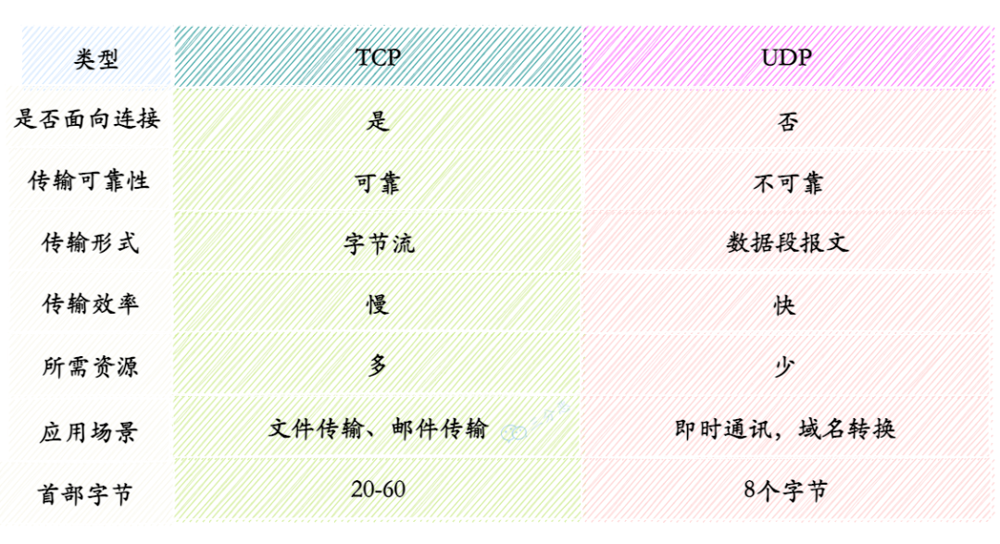

### TCP（传输控制协议）和 UDP（用户数据报协议）的区别
TCP 和 UDP 是两种主要的传输层协议，它们的主要区别如下：

**连接方式：**

+ **TCP**：**面向连接**，发送数据前需要建立连接（**三次握手**）。
+ **UDP**：**无连接**，发送数据前不需要建立连接。

**可靠性：**

+ **TCP**：提供**可靠的数据传输**，确保数据按顺序到达，具备**重传机制**和**错误检测**。
+ **UDP**：** 不保证数据可靠性**，数据可能出现丢失、重复或乱序。

**流量控制与拥塞控制：**

+ **TCP**：具有**流量控制**和**拥塞控制**机制，避免网络拥堵。
+ **UDP**：**没有流量控制和拥塞控制**，数据会尽快发送。

**应用场景：**

+ **TCP**：适合需要**高可靠性**的应用，如**网页浏览**、**文件传输**等。
+ **UDP**：适合**实时性要求高**的应用，如**视频会议**、**语音通话**等。

## 为什么 QQ 采用 UDP 协议？


PS：这是多年前的老题了，拉出来怀怀旧。

**QQ 使用 UDP**

+ **QQ 并不是完全基于 UDP 实现**。比如在使用 QQ 进行**文件传输**等活动的时候，就会使用 **TCP** 作为可靠传输的保证。
+ 使用 **UDP** 进行交互通信的好处在于，**延迟较短**，对数据丢失的处理比较简单。同时，**TCP** 是一个全双工协议，需要建立连接，所以网络开销也会相对大。
+ 如果使用 **QQ 语音**和 **QQ 视频**的话，**UDP** 的优势就更为突出了：
    - 首先，**延迟较小**。
    - 最重要的一点是**不可靠传输**，这意味着如果数据丢失的话，不会有重传。因为用户一般来说可以接受图像稍微模糊一点，声音稍微不清晰一点，但是如果在几秒钟以后再出现之前丢失的画面和声音，这恐怕是很难接受的。
+ 由于 QQ 的服务器设计容量是**海量级**的应用，一台服务器要同时容纳**十几万的并发连接**，因此服务器端只有采用 **UDP** 协议与客户端进行通讯才能保证这种超大规模的服务。

---

**简单总结一下**

+ **UDP 协议**是**无连接方式**的协议，它的**效率高**，**速度快**，**占资源少**，对服务器的压力比较小。但是其传输机制为**不可靠传送**，必须依靠辅助的算法来完成传输控制。
+ **QQ** 采用的通信协议以 **UDP** 为主，辅以 **TCP** 协议。

## UDP 协议为什么不可靠？
**UDP** 在传输数据之前不需要先建立连接， 主要因为它没有提供**可靠性保证**的机制。 

+ **无连接**：发送数据前无需建立连接，不确认接收端是否在线。
+ **无确认机制**：不验证数据是否成功送达或完整接收。
+ **无重传机制**：丢失或损坏的数据不会重发。
+ **无顺序保证**：数据包可能乱序到达，UDP 不负责重排。
+ **无流量控制**：不会根据网络状况调整发送速率，可能导致丢包。

## DNS 为什么要用 UDP?
+ **高效性**：UDP 无需连接建立与断开，减少开销，提高查询速度。
+ **数据量小**：DNS 查询通常小于 512 字节，UDP 足以满足需求。
+ **低资源占用**：UDP 无状态传输，服务器可同时处理更多请求。

 DNS 使用 UDP 是为了追求**查询速度快**、**效率高**和**资源占用低**。同时，TCP 作为补充协议，在需要可靠传输时提供保障，使 DNS 在性能和可靠性之间取得平衡。  

# IP
## IP 协议的定义和作用？
### IP 协议（Internet Protocol）
IP 协议用于在计算机网络之间传输数据包，它定义了数据包的格式和处理规则，确保数据能够从一个设备传输到另一个设备，可能跨越多个中间网络设备（如路由器）。

---

### IP 协议的作用
1. **寻址**：  
    - 每个连接到网络的设备都有一个**唯一的 IP 地址**。  
    - IP 协议使用这些地址来标识数据包的**源地址**和**目的地址**，确保数据包能够准确地传输到目标设备。
2. **路由**：  
    - IP 协议负责决定数据包在网络传输中的路径。  
    - 例如，**路由器**使用**路由表**和 **IP 地址**信息来确定数据包的最佳传输路径。
3. **分片和重组**：  
    - 当数据包过大无法在某个网络上传输时，IP 协议会将数据包分成更小的片段进行传输。  
    - 接收端会根据**头部信息**将这些片段重新组装成完整的数据包。

## IP 地址有哪些分类？
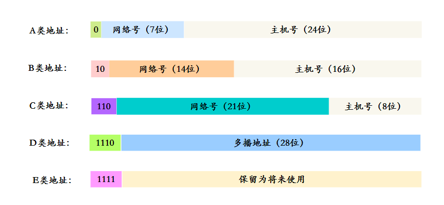

### IP 地址的结构
一个 **IP 地址** 在整个互联网范围内是**惟一的**，一般可以认为：  
**IP 地址 = {<网络号>，<主机号>}**。

+ **网络号**：标志主机所连接的网络地址，表示属于互联网的哪一个网络。
+ **主机号**：标志主机地址，表示其属于该网络中的哪一台主机。

---

### IP 地址的分类
IP 地址分为 **A、B、C、D、E** 五大类：

1. **A 类地址 (1~126)**：  
    - 以 **0** 开头，**网络号**占前 **8 位**，**主机号**占后面 **24 位**。
2. **B 类地址 (128~191)**：  
    - 以 **10** 开头，**网络号**占前 **16 位**，**主机号**占后面 **16 位**。
3. **C 类地址 (192~223)**：  
    - 以 **110** 开头，**网络号**占前 **24 位**，**主机号**占后面 **8 位**。
4. **D 类地址 (224~239)**：  
    - 以 **1110** 开头，保留为**多播地址**。
5. **E 类地址 (240~255)**：  
    - 以 **1111** 开头，保留为**将来使用**。

## 域名和 IP 的关系？一个 IP 可以对应多个域名吗？
### IP 地址与域名的关系
+ **IP 地址** 在同一个网络中是**惟一的**，用来标识每一个网络上的设备，其相当于一个人的**身份证号**。
+ **域名** 在同一个网络中也是**惟一的**，就像是一个人的**名字**或**绰号**。

---

### 类比说明
+ 假如你有多个不同的绰号，你的朋友可以用其中任何一个绰号叫你，但你的**身份证号码**却是惟一的。  
+ 同时，你的绰号也可能和别人重复。假如你不在，有人叫你的绰号，其他人可能就答应了。

---

### 域名与 IP 的对应关系
+ **一个域名可以对应多个 IP**：  
这种情况通常用于 **负载均衡**。在用户访问过程中，一个域名只能对应一个 IP。
+ **一个 IP 可以对应多个域名**：  
这是一对多的关系，即多个域名可以指向同一个 IP 地址。

## 说下 ARP 协议的工作过程？
### **ARP 协议工作过程**
ARP（地址解析协议）用于在局域网中将 **IP 地址**解析为 **MAC 地址**，确保数据链路层通信。

---

### **工作流程**
1. **发送 ARP 请求**：
    - 源主机广播请求，内容为目标 IP 地址，询问对应的 MAC 地址。
2. **接收 ARP 请求**：
    - 局域网内所有设备接收，只有目标 IP 地址匹配的主机响应。
3. **发送 ARP 响应**：
    - 目标主机单播响应，提供其 MAC 地址。
4. **更新 ARP 缓存**：
    - 源主机缓存 IP-MAC 映射，用于后续通信。
5. **完成通信**：
    - 源主机利用目标主机的 MAC 地址发送数据帧。

### 示例：ARP 协议的工作过程
假设 **主机 A**（IP：`192.168.1.2`，MAC：`AA:BB:CC:DD:EE:FF`）要与 **主机 B**（IP：`192.168.1.3`）通信：

1. **主机 A 广播 ARP 请求**：  
    - 消息内容：**谁是 192.168.1.3？请告诉我你的 MAC 地址。**
2. **主机 B 接收到请求后，发送 ARP 响应**：  
    - 消息内容：**我是 192.168.1.3，我的 MAC 地址是 FF:EE:DD:CC:BB:AA。**
3. **主机 A 缓存此信息并使用 MAC 地址 **`FF:EE:DD:CC:BB:AA`** 进行通信**。

## 为什么既有 IP 地址，又有 MAC 地址？
+ **MAC 地址**负责在局域网内标识设备，保证局域网数据传输准确。
+ **IP 地址**负责在不同网络之间标识设备位置，支持跨网络通信。
+ 两者协同工作，使得数据能够在全球范围内从一台设备传递到另一台设备。

### MAC 地址的作用
+ **标识设备硬件**，全球唯一。
+ 用于**局域网内通信**，在**数据链路层**定位目标设备。

---

### IP 地址的作用
+ **标识设备网络位置**，可动态分配。
+ 用于**跨网络通信**，在**网络层**负责路由和寻址。

---

### 两者的关系
+ **IP 地址** 用于找到目标网络，**MAC 地址** 用于定位局域网内的具体设备。
+ **ARP 协议** 将 IP 地址解析为 MAC 地址，实现协同工作。

---

### 为什么需要两者？
+ **MAC 地址**：硬件标识，适合局域网内通信。
+ **IP 地址**：逻辑地址，支持跨网络路由和通信。

## ICMP 协议的功能？
### **ICMP 协议的功能**
ICMP（Internet Control Message Protocol，互联网控制消息协议）是 IP 协议的一部分，用于在网络设备之间传递控制和错误消息。它不用于传输数据，而是为网络的诊断和管理提供支持。

---

### **ICMP 的主要功能**
1. **网络状态检测**
    - 通过 **Ping** 命令测试目标主机是否可达。
    - 工作原理：发送 ICMP Echo 请求消息，接收 ICMP Echo 回复消息。
2. **报告网络错误**
    - 当路由或设备出现问题时，ICMP 通知发送方： 
        * **目标不可达**：目标地址不可达或端口无法访问。
        * **时间超时**：数据包在传输中超时（TTL 到期）。
        * **源抑制**：提示发送方降低发送速率（已很少使用）。
3. **路径追踪**
    - **Traceroute** 使用 ICMP 检测到达目标主机的路径。
    - 通过逐步增加 TTL（生存时间）发现经过的每个路由节点。
4. **重定向消息**
    - 通知主机更优的路由路径。
    - 例如，路由器告诉主机选择另一个网关以优化流量。
5. **流量管理**
    - 通过 ICMP 提供流量控制信息，帮助避免网络拥塞（现代网络很少依赖此功能）。

---

### **ICMP 的常见消息类型**
| 消息类型 | 说明 |
| --- | --- |
| **Echo 请求/回复** | 测试网络连通性（Ping）。 |
| **目标不可达** | 通知无法到达目标地址或端口。 |
| **超时** | 数据包传输中超时（TTL 过期）。 |
| **重定向** | 提示使用更优路径。 |
| **源抑制** | 请求发送方降低发送速率（已过时）。 |


---

### **总结**
ICMP 是 IP 协议的辅助协议，用于报告错误、测试网络连通性、优化路由等。其核心功能包括 **Ping**、**Traceroute** 和 **错误报告**，为网络的诊断和管理提供重要支持。

## 说下 ping 的原理？
### **Ping 的原理**
**Ping** 是基于 **ICMP（Internet Control Message Protocol）** 协议的网络诊断工具，用于测试网络中两个主机之间的连通性和响应时间。它通过发送请求消息并等待回复来确认目标主机是否可达。

---

### **Ping 的工作流程**
1. **发送 ICMP Echo 请求**：
    - 源主机向目标主机发送一个 **ICMP Echo Request（回显请求）** 数据包。
    - 数据包中包含：
        * 源 IP 地址和目标 IP 地址。
        * 数据负载（通常是少量字节的数据）。
        * 序列号，用于标识不同的 Ping 包。
2. **接收 ICMP Echo 回复**：
    - 目标主机收到请求后，生成一个 **ICMP Echo Reply（回显应答）** 数据包，并将其发送回源主机。
    - 如果目标主机可达，源主机会接收到这个回复包。
3. **计算响应时间**：
    - 源主机记录从发送请求到接收回复所用的时间，称为 **RTT（Round-Trip Time，往返时间）**。
4. **显示结果**：
    - Ping 工具会显示：
        * 每次请求的响应时间。
        * 丢包率。
        * 平均响应时间。

# 网络安全
## 说说有哪些安全攻击？
### 网络安全攻击主要分为两种类型：被动攻击和主动攻击
#### 被动攻击
被动攻击是指攻击者从网络上窃听他人的通信内容，通常把这类攻击称为**截获**。被动攻击主要有两种形式：

+ **消息内容泄露攻击**：攻击者获取通信中的敏感信息。
+ **流量分析攻击**：攻击者通过分析通信模式推断出有用信息。

由于攻击者没有修改数据，使得这种攻击很难被检测到。

#### 主动攻击
主动攻击直接对现有的数据和服务造成影响，常见的主动攻击类型有：

1. **篡改**  
攻击者故意篡改网络上传输的报文，甚至把完全伪造的报文传送给接收方。
2. **恶意程序**  
恶意程序种类繁多，包括：
    - 计算机病毒
    - 计算机蠕虫
    - 特洛伊木马
    - 后门入侵
    - 流氓软件
3. **拒绝服务（Dos）**  
攻击者向服务器不停地发送分组，使服务器无法提供正常服务。

## DNS 劫持了解吗？
DNS劫持是一种网络攻击手段，攻击者通过篡改DNS解析结果，将用户引导至恶意网站，从而窃取信息或进行其他恶意操作。

### DNS劫持的类型
1. **本地DNS劫持**：攻击者在用户设备上修改DNS设置，通常通过恶意软件实现。
2. **路由器DNS劫持**：攻击者入侵路由器，修改其DNS配置，影响所有连接该路由器的设备。
3. **中间人攻击**：攻击者在用户和DNS服务器之间拦截并篡改DNS响应。
4. **DNS服务器劫持**：攻击者直接入侵DNS服务器，修改其解析记录。

### 如何防范DNS劫持
1. **使用安全的DNS服务**：选择可信的DNS服务提供商，如Google Public DNS、Cloudflare DNS等。
2. **定期更新设备和路由器固件**：确保设备和路由器的固件是最新的，修复已知漏洞。
3. **安装安全软件**：使用防病毒和防恶意软件工具，防止本地DNS设置被篡改。
4. **启用DNSSEC**：使用DNS安全扩展（DNSSEC）来验证DNS响应的真实性。
5. **检查网络设置**：定期检查设备和路由器的DNS设置，确保没有被篡改。
6. **使用VPN**：通过VPN加密网络流量，防止中间人攻击。

### 总结
DNS劫持通过篡改DNS解析结果将用户引导至恶意网站，防范措施包括使用安全的DNS服务、更新设备和路由器固件、安装安全软件、启用DNSSEC、检查网络设置和使用VPN。

##  什么是ddos攻击？怎么防范？
### DDoS（Distributed Denial of Service）攻击
DDoS（**Distributed Denial of Service**）攻击，即**分布式拒绝服务攻击**，是一种恶意行为。攻击者利用多个分布式设备（通常组成**僵尸网络**）向目标服务器、服务或网络发送大量请求，从而耗尽目标的资源（如带宽、内存或计算能力），导致其无法正常为合法用户提供服务。

#### DDoS攻击的类型
1. **流量攻击**  
通过大量数据包耗尽目标带宽。
2. **协议攻击**  
利用协议漏洞（如**SYN Flood**）消耗服务器资源。
3. **应用层攻击**  
针对特定应用（如**HTTP Flood**）耗尽服务器处理能力。

#### 防范措施
+ **增加带宽**：提升带宽以应对突发流量。
+ **使用CDN**：通过内容分发网络分散流量，减轻服务器压力。
+ **配置防火墙**：设置规则过滤恶意流量。
+ **启用DDoS防护服务**：使用云服务提供商的防护服务，自动检测并缓解攻击。
+ **负载均衡**：通过负载均衡器分散流量，避免单点过载。
+ **监控与响应**：实时监控流量，发现异常及时采取措施。

#### 总结
DDoS攻击通过大量请求使目标系统瘫痪。防范措施包括**增加带宽**、**使用CDN**、**配置防火墙**、**启用防护服务**、**负载均衡**和**实时监控**。

## 什么是 XSS 攻击，如何避免？
### XSS（跨站脚本攻击）
XSS（**跨站脚本攻击**）是一种常见的Web安全漏洞。攻击者通过在网页中注入恶意脚本，当其他用户访问该页面时，脚本会在他们的浏览器中执行，从而窃取信息或进行其他恶意操作。

#### XSS攻击的类型
1. **存储型XSS**  
恶意脚本被永久存储在目标服务器上，用户访问时触发。
2. **反射型XSS**  
恶意脚本通过URL参数传递，服务器将其反射回用户页面并执行。
3. **DOM型XSS**  
恶意脚本通过修改页面的DOM结构来执行，不经过服务器。

#### 如何避免XSS攻击
+ **输入验证**：对用户输入进行严格验证，确保只接受预期的数据类型和格式。
+ **输出编码**：在将用户输入显示在页面上之前，进行适当的编码（如HTML、JavaScript编码）。
+ **使用安全库**：使用安全的库和框架，它们通常内置了XSS防护机制。
+ **内容安全策略（CSP）**：通过HTTP头设置CSP，限制页面中可以执行的脚本来源。
+ **避免内联脚本和事件处理程序**：尽量避免使用内联JavaScript和HTML事件处理程序，减少攻击面。
+ **定期安全测试**：定期进行安全测试和代码审查，及时发现和修复潜在漏洞。

#### 总结
XSS攻击通过在网页中注入恶意脚本来危害用户。防范措施包括**输入验证**、**输出编码**、**使用安全库**、**设置CSP**、**避免内联脚本**和**定期安全测试**。

## 对称加密与非对称加密有什么区别？
### 对称加密
对称加密是指加密和解密使用**同一密钥**。其优点是运算速度较快，缺点是如何安全地将密钥传输给另一方。

常见的对称加密算法包括：

+ **DES**
+ **AES**

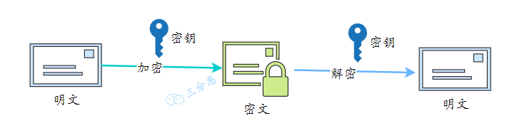

---

### 非对称加密
非对称加密指的是加密和解密使用**不同的密钥**（即**公钥**和**私钥**）。公钥与私钥是成对存在的，如果用公钥对数据进行加密，只有对应的私钥才能解密。

常见的非对称加密算法包括：

+ **RSA**

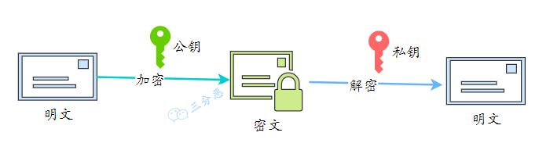

## RSA 和 AES 算法有什么区别？
### RSA
RSA采用**非对称加密**的方式，使用**公钥进行加密**，**私钥进行解密**。其私钥长度一般较长，由于需要进行大数的乘幂求模等运算，运算速度较慢，因此不适合大量数据文件的加密。

---

### AES
AES采用**对称加密**的方式，其密钥长度最长只有 **256 个比特**。加密和解密速度较快，且易于硬件实现。由于是对称加密，通信双方在进行数据传输前需要提前获知加密密钥。


> 更新: 2025-05-09 17:08:55  
> 原文: <https://www.yuque.com/neumx/laxg2e/tol1046d153wgd5d>