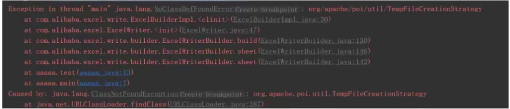
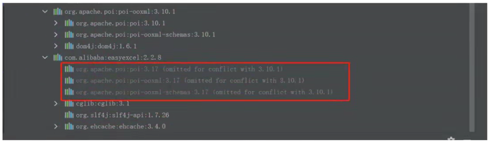
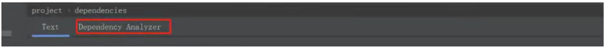
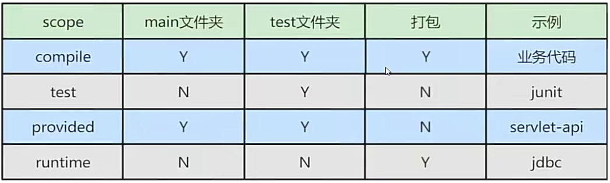

# 一、构建管理

# 一、构建管理
## 1、项目为什么选用 Maven 进行构建?
Maven主要服务于基于iava平台的项目构建，依赖管理和项目信息管理。Maven项目对象模型(POM)，可以通过一小段描述信息来管理项目的构建。

+ 添加第三方jar包：最原始的做法，我们是手动复制jar包到项目WEB-INF/ib下，每个项目都会有一份，造成大量重复文件。而Maven将jar包放在本地仓库中统一管理，需要jar包只需要用坐标的方式引用即可。如下图：

```xml
<dependency>
  <groupId>org.apache.httpcomponents</groupId>

  <artifactId>httpclient</artifactId>

  <version>4.5.8</version>

</dependency>

```

+ jar包之间的依赖关系：jar包之间往往不是独立的，很多jar需要在其他jar包的支持下才能够正常工作，称为jar包之间的依赖关系。如果我们手动去导入，要知道jar包之间的依赖关系并全部导入是及其麻烦而且容易出错的。如果使用Maven，它能够将当前iar包所依赖的其他所有iar包全部导入。
+ 获取第三方jar包：开发过程中我们需要用到很多jar包，每个jar包在官网获取的方式不尽相同，给工作带来了额外困难。但是使用Maven可以以坐标的方式依赖一个iar包，Maven从中央仓库进行下载，并同时下载这个jar包依赖的其他jar包。

## 2、Maven仓库分几种?
Maven仓库分为两大类：

+ 本地仓库：默认C：\Users\用户名.m2目录，可通过配置maven安装目录下/conf/settings.xml中的locaIRepository属性修改
+ 远程仓库。在远程仓库中又分成了3种：
    - 中央仓库：[http：//repo.maven.apache.org/maven2](http://repo.maven.apache.org/maven2)
    - 私服：自己搭建的地址
    - 其它公共库：如阿云：[http：//maven.aliyun.com/nexus/content/groups/public](http://maven.aliyun.com/nexus/content/groups/publicMaven)

Maven 会先搜索本地仓库(repository)，发现本地没有然后从远程仓库(中央仓库)获取

+ 中央仓库是一个国外仓库，网络速度不太友好，最好从其镜象处下载。国内可以用阿里云下的服务器。【其它公共库】。
+ 也有通过 Nexus搭建的私服进行获取的。【私服】

Maven 中的仓库分为两种，SNAPSHOT快照仓库和 RELEASE 发布仓库。

SNAPSHOT 快照仓库用于保存开发过程中的不稳定版本，RELEASE 正式仓库则是用来保存稳定的发行版本。

定义一个组件/模块为快照版本，只需要在 pom 文件中在该模块的版本号后加上-SNAPSHOT 即可(注意这里必须是大写)，如下：

```xml
<groupId>com.czbk.</groupId>

<artifactId>kyjgs.interview</artifactId>

<version>0.1-SNAPSHoT</version>

<packaging>jar</packaging>

```

Maven 会根据模块的版本号( pom 文件中的 version )中是否带有-SNAPSHOT 来判断是快照版本还是正式版本。

+ 如果是快照版本，那么在 mvn deploy 时会自动发布到快照版本库中，会覆盖老的快照版本。而在使用快照版本的模块，在不更改版本号的情况下，直接编译打包时，Maven 会自动从镜像服务器上下载最新的快照版本。
+ 如果是正式发布版本，那么在 mvn deploy 时会自动发布到正式版本库中。而使用正式版本的模块，在不更改版本号的情况下，编译打包时如果本地已经存在该版本的模块则不会主动去镜像服务器上下载。

## 3、什么是私服?
私服是一种特殊的远程仓库，它是架设在局域网内的仓库服务，私服代理广域网上的远程仓库，供局域网内的Maven 用户使用。当 Maven 需要下载资源的时候，它从私服请求，如果私服上不存在该资源，则从外部的远程仓库下载，先缓存在私服上之后，再为Maven 的下载请求提供服务。我们还可以把一些无法从外部仓库下载到的资源上传到私服上。

Maven 私服的5个特性：

+ 1、节省自己的外网带宽：减少重复请求造成的外网带宽消耗。
+ 2、加速 Maven 构建：如果项目配置了很多外部远程仓库的时候，构建速度就会大大降低。
+ 3、部署第三方jar包：有些jar无法从外部仓库获得或者未开源，不允许放到公网上。把这些构件部署到内部仓库(私服)中，供内部 Maven 项目使用。
+ 4、提高稳定性，增强控制：Ilnternet 不稳定的时候，Maven 构建也会变的不稳定，一些私服软件还提供了其他的功能。
+ 5、降低中央仓库的负荷：Maven 中央仓库被请求的数量是巨大的，配置私服也可以大大降低中央仓库的压力。

## 4、Maven的生命周期有哪些?
Maven的生命周期是一个抽象的概念，并不具体指某个操作，是Maven经过长时间思考和分析后总结出来的。它包括了一个项目的清理、初始化、编译、测试、打包、集成测试、验证、部署和站点生成等一系列的构建流程。

Maven有三套相互独立的生命周期，分别是 Clean、Default 和 Site。每个生命周期包含一些阶段，阶段是有顺序的，后面的阶段依赖于前面的阶段。

1、Clean 生命周期：清理项目，包含三个阶段：

+ pre-clean：执行清理前需要完成的工作。
+ clean：清理上一次构建生成的文件、
+ post-clean：执行清理后需要完成的工作

2、Default 生命周期：构建项目，重要的阶段如下

+ validate：验证工程是否正确，所有需要的资源是否可用,
+ compile：编译项目的源代码。
+ test：使用合适的单元测试框架来测试已编译的源代码。这些测试不需要已打包和布署。
+ package：把已编译的代码打包成可发布的格式，比如jar、war 等。
+ integration-test：如有需要，将包处理和发布到一个能够进行集成测试的环境。
+ verify：运行所有检查，验证包是否有效目达到质量标准。
+ install：把包安装到maven本地仓库，可以被其他工程作为依赖来使用。
+ deploy：在集成或者发布环境下执行，将最终版本的包拷贝到远程的repository，使得其他的开发者或者工程可以共享。

3、Site 生命周期：目的是建立和发布项目站点，方便团队交流和发布项目信息。阶段如下：

+ pre-site：生成项目站点之前需要完成的工作
+ site：生成项目站点文档
+ post-site：生成项目站点之后需要完成的工作
+ site-deploy：将项目站点发布到服务器

各个生命周期相互独立，一个生命周期的阶段前后依赖

+ mvn clean：调用 Clean 生命周期的 clean 阶段，实际执行 pre-clean 和 clean 阶段
+ mvn test：调用 Default 生命周期的 test 阶段，实际执行 test 以及之前所有阶段。
+ mvn clean install：调用 Clean 生命周期的 clean 阶段和 Default 生命周期的install 阶段，实际执行pre-clean 和 clean，install 以及之前所有阶段。

而我们在 IDEA Maven 中，也可以看到 Maven 生命周期的操作：


## 5、Maven 坐标的含义?
```xml
<dependency>
<groupId>junit</groupId>

<artifactId>junit</artifactId>

<version>3.8.2</version>

</dependency>

```

Maven 制定了一套规则，使用坐标表示资源的唯一标识。Maven 的坐标元素包括 groupld、artifactld、version、packaging.只要我们提供正确的坐标元素，Maven 就能找到对应的资源。首先去你的本地仓库查找，没有的话再去远程仓库下载。

+ groupld：组织ID，定义当前Maven项目隶属组织名称(通常是域名反写，例如：com.czbk.kyjgs)
    - Maven 项目和实际项目不一定是一对一的关系。比如 Spring FrameWork 这一实际项目，其对应的 Maven 项目会有很多，如 spring-core、 spring-context 等。这是由于 Maven 中模块的概念，因此，一个实际项目往往会被划分成很多模块。
    - groupld 不应该对应项目隶属的组织或公司。原因很简单，一个组织下会有很多实际项目，如果groupld 只定义到组织级别，而后面我们会看到，artifactld 只能定义 Maven 项目(模块)，那么实际项目这个层次将难以定义。
+ artifactld：该元素定义当前实际项目中的一个 Maven 项目(模块).
    - 推荐的做法是使用实际项目名称作为 artifactld 的前缀。比如上例中的junit，junit 就是实际的项目名称，方便而且直观。
    - 在默认情况下，Maven 生成的资源，会以 artifactld 作为文件头。例如junit-3.8.1.jar ，使用实际项目名称作为前缀，就能方便的从本地仓库找到某个项目的资源。
+ version：该元素定义了使用资源的版本。
    - 如上例中junit 的版本是 4.13-BETA，你也可以改为 4.1.2 表示使用 4.1.2 版本的 junit.
+ packaging：定义 Maven 项目打包的方式。打包方式通常与所生成资源的文件扩展名对应。
    - 如上例中没有 packaging，则默认为 jar 包，最终的文件名为 junit-4.13-BETA.jar 。
    - 当然，也可以打包成 war 等。

## 6、maven传递依赖原则
maven依赖主要有两大原则：

+ 路径最近者优先

相同jar不同版本，根据依赖的路径长短来决定引入哪个依赖。该例中X(1.0)的路径长度为3,而X(2.0)的路径长度为2,因此X(2.0)会被解析使用。

:::info
依赖链路一：A->B->C->X(1.0)

:::

:::info
依赖链路二：F->D->x(2.0)

:::

+ 第一声明者优先

依赖调解第一原则不能解决所有问题，比如这样的依赖关系：

:::info
A ->B -> Y(1.0)

:::

:::info
c->D-> Y(2.0)

:::

Y(1.0)和Y(2.0)的依赖路径长度是一样的，都为2。Maven定义了依赖调解的第二原则。

在依赖路径长度相等的前提下，在POM中依赖声明的顺序决定了谁会被解析使用，顺序最前的那个依赖优胜，该例中，如果A的依赖声明在C之前，那么Y(1.0)就会被解析使用。

## 7、Maven如何处理依赖冲突?
依赖冲突是指项目依赖的某一个jar包，有多个不同的版本，因而造成了包版本冲突。java中常见包冲突异常为：NoClassDefFoundError、ClassNotFoundException、NoSuchMethodError.

+ 制造依赖冲突，maven的pom文件中加入以下依赖：

```xml
<dependency>
<groupId>org.apache.poi</groupId>

<artifactId>poi-ooxml</artifactId>

<version>3.10.1</version>

</dependency>

<dependency>
<groupId>com.alibaba</groupId>

<artifactId>easyexcel</artifactId>

<version>2.2.8</version>

</dependency>

```

代码中创建一个类，执行以下代码：

```java
public static void main(string[]args){
    //1.获取文件地址
    string fileName ="/excel/test.xlsx";
    //2、调用easyExce1里面的方法实现写操作
    EasyExce1.write(fileName, object.class).sheet("某某报表").dowrite(new ArrayList<>());
}
```

执行结果会发现报错如下：



+ 错误原因分析

我们利用idea的功能，来查看下我们最终的依赖。如下图：



因为我当前的easyexcel引|入的poi是3.17版本的，但是因为根据maven依赖原则，实际引入的poi版本确实是3.10.1版本的。而DefaultTempFileCreationStrategy这个类在3.10.1这个版本并没有，只有3.17版本才有，所以报了这个错误

+ 解決jar包冲突

从上面的分析，我们得知问题的主要原因是需要使用 poi 的3.17版本。那么我们如何让我们的项目引入此版本呢?

1、pom文件中增加内容，强制使用3.17版本

```xml
<dependencyManagement>
  <dependencies>
    <dependency>
      <groupId>org.apache.poi</groupId>

      <artifactId>poi</artifactId>

      <version>3.17</version>

    </dependency>

  </dependencies>

</dependencyManagement>

```

2、通过插件分析pom文件，解决冲突。

idea安装Maven Helper插件，pom文件中看到 dependency analyzer标志，说明maven helper插件就安装成功了，如下图：



点击dependency analyzer之后就会进入到下面的页面


从图中可以看出有哪些jar存在冲突，存在冲突的情况下最终采用了哪个依赖的版本。标红的就是冲突版本，白色的是当前的解析版本。如果我们想保留标红的版本，那我们可以标白区域右击选择排除(Exclude)。

3、仔细观察我们的pom文件，此时的依赖发生了变化，如下图：

```xml
<dependency>
  <groupId>org.apache.poi</groupId>

  <artifactId>poi-ooxm]</artifactId>

  <version>3.10.1</version>

  <!--新增了次内容，表示依赖时忽略此项，也叫排除依赖-->
  <exclusions>
    <exclusion>
      <artifactId>poi</artifactId>

      <groupId>org.apache.poi</groupId>

    </exclusion>

  </exclusions>

</dependency>

```

## 8、Maven常见的依赖范围有哪些?
maven中，通过标签可以指定jar包得依赖范围，如下图

```xml
<dependency>
  <groupId>junit</groupId>

  <artifactId>junit</artifactId>

  <version>4.12</version>

  <!--指定依赖范围-->
  <scope>compile</scope>

</dependency>

```

关于scope的常用具体值如下：

+ compile：默认的scope，运行期有效，会打入包中
+ provided：编译期有效，运行期不需要提供，不会打入包中。可减少自己的jar包对别人项目的jar包冲突。
+ runtime：编译不需要，在运行期有效，会入包中。(接口与实现分离)。
+ test：测试需要，不会打入包中，src包中不能使用。

根据scope值的不同，对于依赖的jar包使用范围不同，如下图：



## 9、Maven项目结构约定是什么?
+ src/main/java/ ： java 源码。
+ /src/main/resource ：java 配置文件，资源文件。
+ /src/test/java/： java 测试代码。
+ /src/test/resource ：java 测试配置文件，资源文件
+ /target：文件编译过程中生成的.class 文件、jar、war 等等。
+ pom.xml：配置文件

Maven要负责项目的自动化构建，以编译为例，maven要想自动进行编译，那么它就必须知道java的源文件保存在哪里，这样约定之后，不用我们手动指定位置，maven能知道位置，从而帮助我们完成自动编译。

遵循“约定>>>配置>>>编码”，即能进行配置的不要去编码指定，能事先约定规则的不要去进行配置。这样既减轻了劳动力，也能防止出错。

## 10、Maven 版本是如何定义的?
Maven 主要是这样定义版本规则的：<主版本>.<次版本>.<增量版本>。比如说 1.2.3，主版本是1，次版本是2，增量版本是3。

+ 主版本，一般来说代表了项目的重大的架构变更，比如说Maven1和 Maven2，在架构上已经两样了，将来的 Maven3和Maven2也会有很大的变化。
+ 次版本，一般代表了一些功能的增加或变化，但没有架构的变化，比如说Nexus 1.3 较之于 Nexus 1.2来说，增加了一系列新的或者改进的功能(仓库镜像支持，改进的仓库管理界面等等)，但从大的架构上来说，1.3和1.2没什么区别。增量版本，一般是一些小的 bug fifix，不会有重大的功能变化。一般来说，在我们发布一次重要的版本之后，随之会开发新的版本。比如说，myapp-1.1发布之后，就着手开发myapp-1.2了。由于 myapp-1.2 有新的主要功能的添加和变化，在发布测试前，它会变得不稳定，而 myapp-1.1 是一个比较稳定的版本，现在的问题是，我们在 myapp-1.1中发现了一些 BUG(当然在 1.2中也存在)，为了能够在一段时间内修复 BUG 并仍然发布稳定的版本，我们就会用到分支(branch)，我们基于 1.1开启一个分支1.1.1，在这个分支中修复BUG，并快速发布。这既保证了版本的稳定，也能够使bug得到快速修复，也不同停止1.2 的开发。只是，每次修复分支 1.1.1 中的 BUG 后，需要 merge 代码到 1.2 中。
+ SNAPSHOT(快照版本)

项目开发过程中，为了方便团队成员合作，解决模块之间相互依赖和时时更新的问题，开发者输出的临时版本称之为快照版本。在项目开发、联调、测试过程中，因为会频繁的对项目进行修改，所以发布的都是快照版本。

+ RELEASE(发布版本)

项目开发阶段性功能完成或者达到一个里程碑或者满足某次上线需求时，向外部团队发布的比较稳定的版本。在日常开发过程中，往往是在迭代需求结束并且测试通过并目产品验收通过后，会发布此版本并完成上线，并且代码会合并到主分支。

## 11、Maven中的dependencies和dependencyManagement有什么区别?
在Apache Maven项目中，`dependencies` 和 `dependencyManagement` 是两个不同的概念，它们都在`pom.xml`文件中定义，但是它们的作用和目的不同。

**dependencies**

`dependencies` 部分直接定义了项目的依赖项。这些依赖项会被直接添加到项目的类路径中，也就是说，当你构建项目时，Maven会自动下载这些依赖并将其包含在编译、测试、运行等过程中。

例如，在`pom.xml`中，`dependencies`部分可能看起来像这样：

```xml
<dependencies>
    <dependency>
        <groupId>org.apache.commons</groupId>

        <artifactId>commons-lang3</artifactId>

        <version>3.9</version>

    </dependency>

</dependencies>

```

在这个例子中，`commons-lang3` 被声明为项目的直接依赖项，Maven会在构建项目时使用它。

**dependencyManagement**

`dependencyManagement` 则是在父POM（Project Object Model）中用来集中管理子项目依赖项版本的地方。它并不直接影响类路径，而是为子模块提供了一个统一的版本管理和依赖项的版本覆盖机制。这意味着你可以为多个子项目定义一组共同的依赖项版本，而不必在每个子项目的`pom.xml`文件中重复相同的版本信息。

例如，在一个父POM中，`dependencyManagement`部分可能看起来像这样：

```xml
<dependencyManagement>
    <dependencies>
        <dependency>
            <groupId>org.apache.commons</groupId>

            <artifactId>commons-lang3</artifactId>

            <version>3.9</version>

        </dependency>

    </dependencies>

</dependencyManagement>

```

在这种情况下，任何继承该父POM的子项目都可以简单地引用`commons-lang3`依赖项，而不需要指定版本号。Maven将会使用父POM中定义的版本号。

总结一下：

+ `dependencies` 定义了实际使用的依赖项，这些依赖项会被直接加入到构建路径中。
+ `dependencyManagement` 提供了一种管理依赖项版本的方式，允许你在父POM中集中控制版本号，从而避免版本冲突，并简化了子项目的依赖项声明。


> 更新: 2024-09-08 20:35:27  
原文: [https://www.yuque.com/vip6688/neho4x/whqqwoqhcztk457y](https://www.yuque.com/vip6688/neho4x/whqqwoqhcztk457y)
>


> 更新: 2024-11-25 10:39:26  
> 原文: <https://www.yuque.com/neumx/laxg2e/bcdafab1df2088941c2761ea15ceb210>