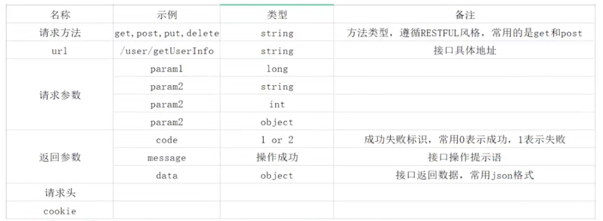
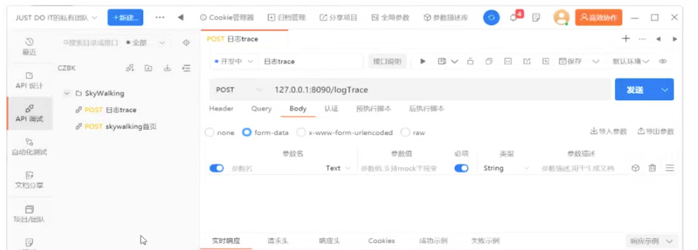
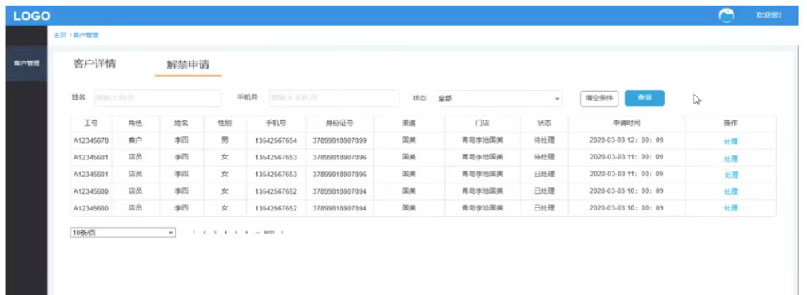
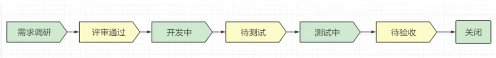
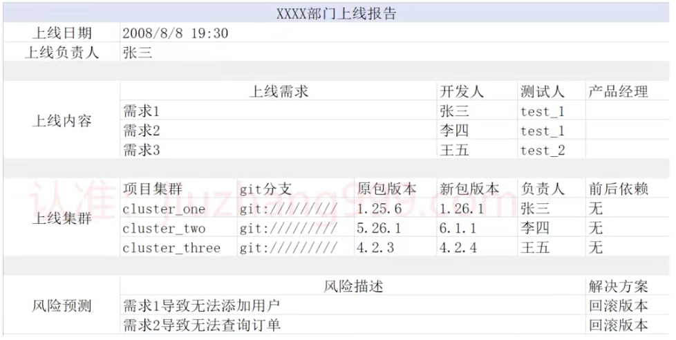
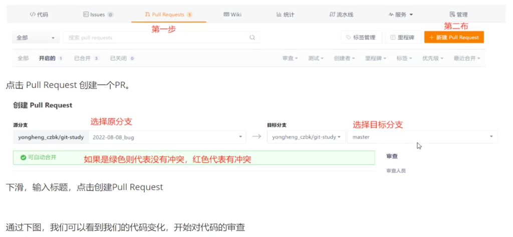
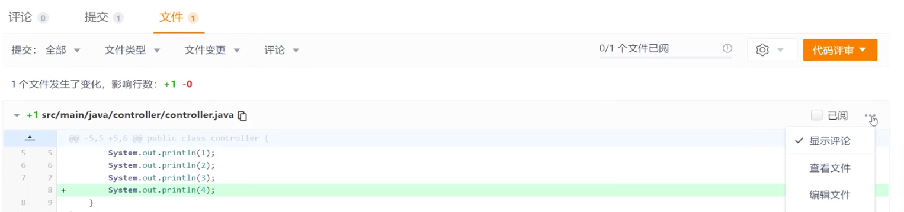

# 三、工程管理

# 三、工程管理
## 1、公司的工程是如何划分的?
+ 公司项目采用前后端分离，前端后端通过接口进行交互。前端主要框架为vue。	
+ 后端框架使用springboot后端项目按照业务进行划分，一般采用独立业务独立工程的方式划分。
+ 一些监控，辅助功能模块以jar的形式引入工程实时监控

## 2、项目中的日志是如何管理的
**1、按照功能分类，我们的日志可以分为业务日志和监控日志2大类**

+ 业务日志由程序员通过代码中编写生成，主要用来跟踪业务完成情况
+ 监控日志主要通过三方工具生成，主要作用用来监控项目运行情况，如skywalking的跟踪日志，项目的埋点日志。

**2、按照作用分类，我们的日志可以分为问题排查日志、异构数据同步日志**

+ 问题排查日志指的就是平时我们输出的日志，他可以帮助我们快速定位线上问题。
+ 异构数据同步日志是为了完成某个业务功能，但项目与项目之间不方便通过接口调用，我们通过写日志和分析日志来实现

**3、按照日志框架分类，我们分为slfj、log4j、log4j2、logback。**

+ slfj采用的是一个门面设计模式，是对log4j和logback的一个高级封装
+ log4j和log4j2 是同一个技术，log4j2是log4j的升级版本，性能更高
+ 项目规定使用slfj作为日志的输出工具，底层采用log4j2，主要原因是为了方便日志顶层框架的后期变更
+ 我们常用的springboot框架，默认采用的是logback

**4、按照日志级别，我们分为error日志和info日志**

+ error日志统一打印在error-log.log文件中，通过此日志我们可以快速看到错误日志，防止线上info日志过多导致查询困难。
+ info日志统一打印在infor_log.log文件中，包含了项目中所有的日志，其中也包括error日志。

**为什么我们的info日志要包含error里面的内容呢?**

error日志只是快速帮助我们定位是否存在错误，但是错误产生的原因我们需要通过下上文日志进行业务分析。当我们通过error中定位到错误日志后，可以在info里同样找到该错误日志，并找到其上下文日志

**5、日志的收集与存储，我们采用2种方式：文件存储和格式化数据存储**

文件存储，主要是基于云平台而言。当我们云平台的服务器重启后所有数据都会消失，所以云平台会提供日志文件保留服务格式化存储，这个主要采用的是现在比较流行的解决方案ELK。

## 3、接口如何管理的
**1、接口遵循职责**

+ 单一职责：每个接口有单独的责任，避免一个接口承载过多的功能。防止因为一个功能的修改，导致其他功能出现问题。
+ 开放封闭原则：对于扩展是开放的，对于修改尽量是封闭的。尽量在设计之初，考虑到需求的种种变化。如果来新需求尽量使用扩展实现，避免对原有的代码进行修改。
+ 依赖倒转原则：抽象不该依赖细节，细节应该依赖于抽象。具体体现到我们的代码，就是常说的面向接口编程。	
+ 里氏代换原则：子类必须能够替换掉它们的父类型。
+ 合成-聚合原则：尽量使用合成/聚合，尽量不要使用类继承。有助于保持每个类被封装，并集中在单个任务上。好比于我们的手机，有专门做硬件的，有专门做软件的，组合到一起就是我们的手机。
+ 迪米特原则：如果两个类不必彼此通信，那么两个类就不应发生直接调用。如果一个类需要调用另一个类的的某一个方法，可以通过第三者转发这个调用

**2、接口文档管理**

+ 定义：在项目开发中，前后端是分离开发的。应用程序的开发，需要由前后端工程师共同定义接口，编写接口文档，之后大家都根据这个接口文档进行开发，到项目结束前都要一直维护。
+ 功能与目的：项目开发过程中前后端工程师有一个统一的文件进行沟通交流开发，项目维护或者项目人员更迭的时候，方便后期人员查看、维护。
+ 接口文档规范：

**3、接口管理工具**

+ 自定义开发：一般大公司都有自己的接口管理平台，程序员需要把接口录入到平台。接口可以提供查看、测试等功能。
+ 开源框架swagger：swagger 是一个规范和完整的框架，用于生成、描述、调用和可视化 RESTful 风格的 Web 服务。

+ PC端工具：Google提供的postman，国内的apipost等。如下图示例(ApiPost)：

## 4、服务指标是如何监控?
对于线上服务器，我们需要对其进行监控管理，并且设置报警机制对于线上服务的自查周期，我们可以已周为单位，对于天和月而言，一个时间间隔太短，一个太长，都不利于日常工作的安排那么，我们对于服务器的检查，该包含那些方面呢?主要包括以下几个方面：

+ **CPU使用率**：cpu是线上服务的一个重要指标。如果cpu使用率很高的话，系统容易出现一些瓶颈，并且影响系统的性能。企业中常常已80%或者60%为阈值。

CPU使用率高的几个常见情况

1、代码里有复杂的算法;

2、代码存在大量的压缩、解压缩、加密、解密操作,

3、代码存在bug，存在while或for形式的死循环。内存使用率：内存对于服务器的影响，我们都深有体会。如果线上服务器内存不足，会导致IVM进程退出，酿成线上事故,

+ **网络**：分为上行网络流量和下行网络流量。一般会监控服务器的网卡上下行是否达到上限。
+ **磁盘**：磁盘的读写速度，磁盘使用百分比同样会影响系统的稳定性。常见的问题是线上日志过多，导致磁盘空间使用过大需要定期清理日志。
+ **接口调用量Top10**：这个统计的是每个服务器里一周内调用量最大10个接口，它反应了我们系统的整体QPS。通过接口调用量的变化，来衡量我们系统的承载力。特殊情况下，我们需要使用扩容来解决压力过大的问题。
+ **接口调用时长Top10**：统计项目中调用时长最长的10个接口，判断其产生原因，是否存在优化空间。通过该指标，可以保证我们有目的性，有计划的对项目整体性能的优化，同时提高接口QPS。
+ **接口异常量Top10**：统计一周内，发生异常次数最多的接口。异常类型包括500，404等。通过该指标的统计，我们可以快速定位项目中存在问题的接口及时发现隐藏bug，避免客户反馈影响整体使用体验度。

## 5、跨部门协同开发
在大公司，跨部门协同开发是常见的工作。跨部门开发既体现了部门的工作能力，也体现了部门的合作能力。直接影响上级领导和其他同事对于部门的认可程度。那么，对于日常的跨部门协同开发，我们要注意什么呢?

**1、明确工作的目标，双方达成一个共同的目标**

在此，我们经常会遇到其他部门非常强势的要求自己配合工作。或者说我们去找其他部门人员时，不断的强调项目对自己多重要，对自己的工作影响有多大。这是非常忌讳的，因为让人容易产生跟我有什么关系呢的思想。我们应该上升到公司层面，从公司利益出发强调项目的重要性。或者从部门的OKR进行挂钩，表明这是两个部门共同OKR。

**2、建立双方信任**

在真正的开始沟通一个需求，开一些项目组的会议或讨论一些事项之前，最重要的就建立双方的信任，尤其对于协作对象是第-次进行合作的部门或者同事。

首先，我们可以简单聊聊我们以前与其他部门协作的多么多么好，整体轻松偷快。让对方知道你是有一定协作经验的同事，提高对你的认可度。切记，最最忌讳的是说一些与其他同事或者部门协同合作的时候的不足，不管是谁的原因都容易让对方产生反

感。

其次，是合作中的坚持与妥协。这是部门与部门合作过程中非常重要的一条线，这条线一定要画清楚。对于不影响部门利益或者项目进度的问题，双方观点并没有绝对的对与错，我们可以选择妥协。采纳他的观点，能够更好的建立双方信任。但是，对于项目非常重要的交付时间、项目bug风险控制、项目利益等，我们必须要坚持，这关系到一个项目的成败。

**3、地位平等**

+ 在合作过程中，我们要时刻保持方案的沟通。避免出现方案一人决定，另一方只是被动接受的情况。合作双方在工作上的地位是平等的，不能让人感受到你是他的领导，他的工作由你完全安排。
+ 任何时候不甩锅。工作重出现失误和问题在所难免，如果确定问题是由自己导致的，一定要勇于承认。任何时候，任何大小问题如果我们尝试甩锅，都会让您在一个部门或公司的口碑急剧下降，甚至影响到整个部门声誉。
+ 向上支持与申诉。当遇到无法解决的问题，或者意见无法达成一致，须由领导或者老板进行决策，不可独立决定。

**以上都是关于人际关系方面的，那关于技术有哪些呢?**

**1、框架技术**

合作双方只限于接口对接或者消息对接。对于技术的实现必须达成双方一致，切记不能过多的评判他人技术实现上的好坏。技术没有最好，只有适合。只要此技术能够保证项目的顺利运行上限，并且能够保证稳定性那么技术就可行。

**2、接口文档**

接口是双发合作的重要途经，接口文档更是重中之重首先，所有的接口必须有完善的接口文档，包括地址，入参，出参等。并且，接口文档的每个属性都必须提供解释说明其次，接口提供时间必须明确。接口的定义只是告知对方我需要调用哪些接口，传递什么参数，如何使用返回结果。但是此时接口可以未实现，切记不能等到自己所有事情都完成在提供接口文档。及时提供接口文档，可以更好的并发工作，提高项目开发效率。

最后，接口文档的修改，必须经过双方协商一致。切记，不可擅自更改接口入参及出参。

**3、技术选型**

**dubbo的局限性**

+ 各团队的注册中心不同，没法直接调用以后的dubbo服务
+ 每个团队的技术选型不同，有的团队不使用dubbo

**http的通用性**

+ 全网通用协议
+ 简单高效，不需要额外的技术支持
+ 任何团队都可实现快速支持

	

**redis的通用性**

+ 使用广泛
+ 利用发布订阅功能可实现小数据量的传递

**接口的局限性**

+ 现有业务加入新接口的调用，会破坏原有系统的稳定性。尤其对于新增接口非部门核心业务
+ 接口同步调用，会增加自己服务器原接口的响应时长。异步调用又会增加线程数，并且可能导致本地任务堆积	
+ 接口不适合传递体量较大的数据，耗时太长

## 6、文档管理
这档是我们项目开发中必不可少的，根据文档作用，我们大致可以分为以下几种

需求文档：此类文档是必须的，一般由产品提供。详细描述了我们的需求实现，讲述了我们要做什么，怎么做。该文档是产品、测试、开发、前端、UI等沟通的桥梁。功能的一切标准都已此文档为准。常用的需求文档工具是axure。

如下图展示axure的原型图展示：

开发人员根据需求文档拆解成一个一个小的需求，一般规定一个需求的时长**不超过2天**。单个需求的流程如下图：

+ **接口文档**：一般由后台程序员编写，描述了前端同学如何从后端获取想要的数据，或者如何提交数据给后端。
+ **上线报告**：每次上线前要发送的上线报告，里面详细记录了每次上线时间、上线内容、回滚方案、上线风险点、影响范围,覆盖版本信息。此文档是上线发生问题快速回滚的依据。简单实例如下：

+ **事故报告**：程序员最不喜欢的文档。记录了每次线上事故的时间、影响范围、处理方式、预估损失、责任划分。事故严重的，需要发送邮件通知部门甚至公司。
+ **流程图**：用来描述需求整体流程关系，需要描述出任何一个节点可能产生的分支，整个业务流程需要形成闭环。常用工具有processOn(在线版)、WPS(pc版)等

## 7、项目灰度测试
灰测是在版本稳定后，让少部分用户参与提前体验，达到发现隐藏问题的目的。

**那么灰测阶段，我们要考虑什么问题呢?**

+ 怎么定义版本稳定?
+ 灰测试怎么确定范围，如何选择少部分人，部门or 用户id or 城市 or 业务线 or 服务器灰度部署?
+ 为什么能达到发现隐藏问题?实际线上使用问题，操作习惯，真实数据格式等，都是在测试阶段难以百分百复现

**灰度测试的主要目的就是为了发现隐藏问题，那如果发现了问题，我们要如何做呢?**

**严重Bug**： 影响了功能的正常使用，对于用户而言是灾难性的，视情形决定是否发布。解决办法通常为回滚修复。

**中等Bug**： 影响少部分人，能够正常使用系统，在及特殊情况才会出现。解决办法通常是修复bug并上线继续灰测。

**一般Bug**：产品经理跟进，不急于现在修复，可以等待其他小Bug一同修复。用户体验：产品经理跟进，采集更多人的使用感受，由产品经理决定是否进行优化。

**功能验收，测试通过，全量升级**

**产品**：确保基本功能与需求是一致的，无核心问题。确保产品的交互及UI符合设计要求;

**测试**：所有测试用例全部走完，所有发现的bug均已修复无遗留。测试数据全部重置，不影响线上使用

**开发**：观察线上日志，无异常、错误、业务异常日志。线上cpu、内存、线程、接口调用均正常。

## 8、代码甫查及Review
**什么是CodeReview?**

Code Review (CR)即代码评审，又名代码走查，是一种通过复查代码来提高代码质量的过程，一般体现在一个团队的开发过程中。CR要求团队成员有意识地、系统地检査彼此的代码，从而验证需求、发现错误，同时指出其中不合规范的"低质量”代码，从而提高整个团队的代码质量。一次 CR 可以是一次commit，也可以是一次 Merge Request。

**为什么要CodeReview?**

+ **劳观者清**：由于看待问题的角度不同，评审者可能会比开发者更容易发现其中的问题，或是找到更有效的解决方案。
+ **快速了解业务**：通过代码审查至少可以让每个人了解更多的业务模块，同时也能达到人员互备的目的
+ **开发者**：通过给别人讲解代码，对需求的理解更加深刻，再次理自己代码逻辑，提高表达能力。
+ **评审者**：快速上手业务，熟悉他人代码风格，交流设计思路和业务认识

**在一次CodeReview中我需要关注什么?**

+ **代码风格**：可读性、变量命名规则、参数个数是否过多、代码注释等等。
+ **单一职责原则**：一个类只做一类相关的事情。一个方法，最好只做一件事情。。
+ **代码健壮性**：核心数据有没有强制校验、边界值有没有考虑得当、有没有内存泄露、有没有循环依赖。
+ **是否符合公司的代码规范**，有无禁止使用的类、接口。如线程池是否自定义。

**下面，以gitee为实例，展示下codeReview：**

> 更新: 2024-09-09 01:28:58  
原文: [https://www.yuque.com/vip6688/neho4x/rooxog3hxq1d3gox](https://www.yuque.com/vip6688/neho4x/rooxog3hxq1d3gox)
>

> 更新: 2024-11-25 10:39:51  
> 原文: <https://www.yuque.com/neumx/laxg2e/0abcd7ff71869f900ded34abfabb6101>