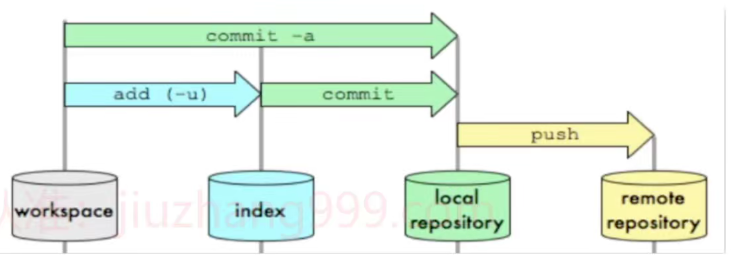
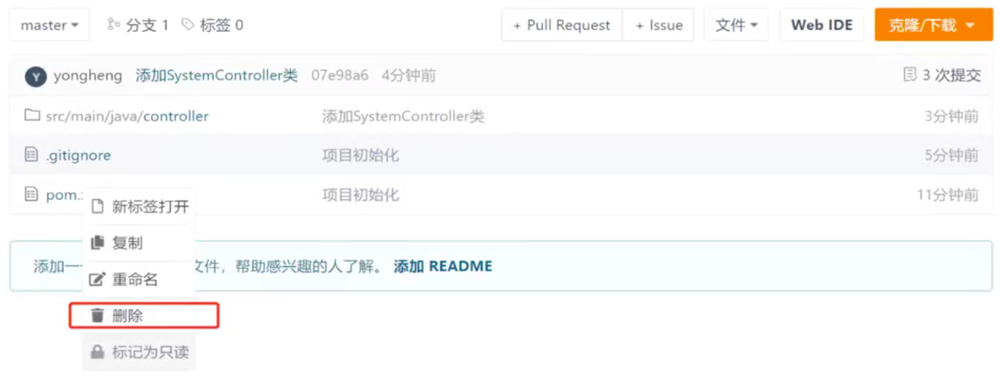
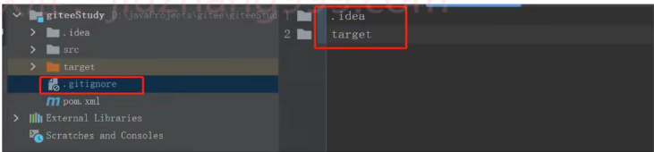
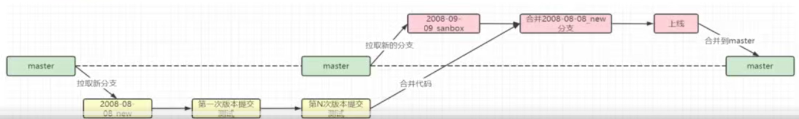
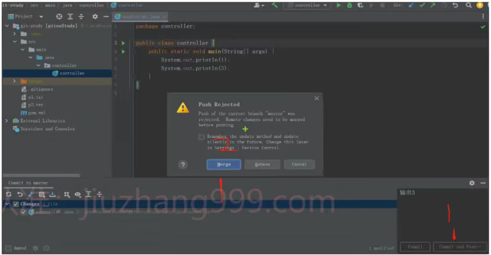

# 二、版本控制管理

# 二、版本控制管理
## 1、代码版本管理为什么要用git?
+ Git是一款免费的开源的分布式版本控制系统。
+ 保留之前所有的版本，方便回滚和修改。
+ 集中化版本控制系统例如SVN,客户端到中央服务器取出最新的文件或者提交更新。很明显的缺点就是中央服务器发生故障故障期间无法提交更新。
+ 分布式版本控制系统Git,客户端不只提取最新版本的文件快照，而是把代码仓库完整地镜像下来，中央仓库发生故障，我们可以先提交到木地仓库，等故障恢复后再提交到中央仓库。

## 2、Git 工作区、暂存区和版本库
+ **工作区**：就是你在电脑里能看到的目录。
+ **暂存区**：英文叫 stage 或index。一般存放在,git 目录下的index 文件(.gitindex)中，暂存区有时也叫作索引(index)。
+ **版本库**：工作区有一个隐藏目录.git，这个不算工作区，而是 Git 的版本库。



## 3、git中常用的命令有哪些
1、初始化命令

:::info
git init

:::

2、新增文件到git版本控制

:::info
#添加一个文件

git add filename

#添加所有文件

git add .

:::

3、提交文件，生成版本，或者提交修改内容

:::info
git commit -m ”提交内容注释”

:::

4、查看工作区当前状况

:::info
git status

:::

5、查看git提交日志

:::info
# 查看详细日志
git log

:::

:::info
#查看简化版的日志

git reflog

:::

:::info
#只啥看最近几条日志，如下：5代表只查看最近5次

git log -5 或者 git reflog -5

:::

6、回滚分支命令

:::info
git reset --hard HEADA

:::

7、查询本地分支列表

:::info
git branch

:::

8、查询远程分支列表

:::info
git branch -r

:::

9、切换远程分支

:::info
git checkout -b 分支名 origin/远程分支名

:::

## 4、为什么 .gitignore 里的规则却没有效果?
这是因为我们误解了.gitignore 文件的用途，该文件只能作用于 Untracked Files，也就是那些从来没有被 Git 记录过的文件(自添加以后，从未执行过 add及 commit 的文件)。

之所以你的规则不生效，是因为那些.og 文件曾经被 Git 记录过，因此 .gitignore 对它们完全无效。如果想要生效，则需要执行以下操作：

1.从 Git 的数据库中删除对于该文件的追踪

2.把对应的规则写入 .gitignore，让忽略真正生效;

3.提交+推送。

只有这样做，所有的团队成员才会保持一致而不会有后遗症，也只有这样做，其他的团队成员根本不需要做额外的工作来维持对个文件的改变忽略。

```git
# 忽略特定的文件
build/
temp/
*.tmp

# 忽略所有的 .log 文件
*.log

# 忽略所有 .txt 文件，但排除 README.txt
!README.txt
*.txt

# 忽略特定目录下的所有 .js 文件
src/*.js

# 忽略所有 .doc 格式的文件
*.doc

# 忽略所有在 node_modules 目录
node_modules/

# 忽略所有 .git 目录
.git/

# 忽略所有 .DS_Store 文件
.DS_Store

# 忽略所有在 .sass-cache 目录
.sass-cache/

# 忽略所有编译生成的 .class 文件
*.class

# 忽略所有在 .idea 目录下，除了 .idea/keep.txt
.idea/
!.idea/keep.txt

# 忽略所有 .bak 格式的备份文件
*.bak

# 忽略所有在 dist 目录下
dist/

# 忽略所有 .env 文件
.env

# 忽略所有在 public 目录下的 .map 文件
public/**/*.map

# 忽略所有 .pyc 文件
*.pyc

# 忽略所有 .swp 文件
*.swp
```

## 5、如何删除GitHub上误提交文件
由于操作失误，我们经常会把项目里的.idea或者.setting或者target文件夹上传到git服务器上，其他同事拉去后总是会被提示有修改，那么我们如何把这些误提交的文件从服务器上删除呢?

**解决办法一**

github支持删除文件操作，我们可以代码仓库里直接右键，选择删除，如下图所示：



此办法对于误提交的一个文件是有用的，但是如果我们误提交的是一个文件夹，并且里面有很多很多文件，我们要一个一个的进行删除么?

**解决办法二**

这里以删除.idea文件夹为例。

```git
# --cached不会把本地的.idea删除。只是把文件从暂存区域移除。换句话说，只从跟踪清单中删除
# -r参数代表递归删除，还有另外一个参数 -f 代表强制删除
git rm -r --cached .idea		
# 使用commit命令提交操作
git commit -m 'delete .idea dir'
# 捕到远程服务嚣
git push -u origin master
```

我们通过此方法可以删除一个文件及文件夹里所有的文件，但是如果是很多文件夹呢?

**解决办法三**

这里以删除.idea合target2个文件夹为例。**此方法操作危险，使用时请慎重**。

```git
# 使用cached参数后面跟上 .  把所有文件全部从暂存区移除
git rm -r --cached .
```

修改.gitignore文件,将不需要的文件过滤掉。如果没有.gitignore文件，请在项目根目录创建此文件，并在.gitignore文件央中加入要删除的文件夹，如下图：



按照上面操作完成之后，继续执行以下命令

```git
git add .
git commit -m "删除误提交文件"
git push -u origin master
```

## 6、git fetch与git pull的区别
git fetch的意思是将远程主机的最新内容拉到本地，用户再检査无误后再决定是否合并到工作本地分支中git pul 是将远程主机中的最新内容拉取下来后直接合并，即：git pull = git fetch+git merge,可能会产生冲突,需要手动解决,

**git fetch 的用法**

```git
#该命令将远程主机的更新全部取回本地
git fetch<远程主机名>
```

如果只想取回特定的分支更新,指定分支名即可

```git
#注意，主机名与分支名之间有空格
git fetch <远程主机名><分支名>
```

如何查看 fetch 拉取下来的内容呢?执行命令：

```git
git log -p fetch_head
```

**git pull 的用法**

```git
git pull <远程主机名> <远程分支名>
```

pull后的操作是拉取与合并一起操作，过程可以理解为下面2个操作：

```git
#从远程主机的master分支拉取最新内容
git fetch origin master 
```

```git
#将拉取下来的最新内容合并到当前所在的分支中
git merge FETCH_HEAD
```

## 7、git reset 时soft、mixed和hard的区别
**soft(软)**：仅仅移动版本库HEAD指针，其他什么事都不做，即索引文件(暂存区)、工作区不会重置

**mixed (混合)**：reset默认的，不指定reset类型就是它，移动版本库HEAD指针，重置暂存区，但不重置工作区。就比如说你从当前版本回退到历史版本，你工作区更改的文件和代码都是不会变成历史版本的。

**hard(硬)**：重置暂存区和工作区，撒销工作区中所有未提交的修改内容，将暂存区与工作区都回到上一次版本，并删除之前的所有信息提交。彻底回退到某个版本，本地的代码也会变为某个版本的内容，此命令慎用!如果真要使用，建议先commit提交份到本地库里，后悔再git reset回去

**soft和mixed和HEAD的区别**

**soft**：仅仅将HEAD指针指向了commit1，暂存区和工作区还用的是commit2的。git status提示：需要提交的更改。暂存区还是commit2的，所以对于commit1来说等于是已经add到暂存区，但没commit到本地库，所以提示叫你提交。

**mixed**：除了将HEAD指向了commit1，还重置了暂存区，就是说除了工作区是commit2的，其他的都是commit1的。git status提示：没有添加要提交的更改，可以add再commit，或者直接commit -a.注意：对于进行commit版本的切换的话使用soft和mixed都差不多，但利用他们的差异可以实现撤回add、撤回commit、把文件删除和撤回add、找回删除的文件等一些效果。

**HEAD**：由于它重置了暂存区和工作区，这使得暂存区和工作区的内容变成commit的内容，相当于不仅撤回了add而且还把它删除了。

## 8、代码出现bug,是如何解决的
当我们正在进行新的迭代开发，此时线上发生bug，需要我们及时修复，我们该如何操作分支呢?操作步骤如下：

+ 拉取新分支，名字以bug标注，如：2008-08-08 bug
+ 提交当前开发分支内容并切换到bug分支：2008-08-08 bug
+ 在2008-08-08 bug分支上修复bug并提交测试
+ bug修复完毕，测试通过进行代码review
+ 上线并合并2008-08-08 bug到master
+ 切换回原来的开发分支并merge我们修复的bug代码

具体命令如下：

```git
# 添加当前修改该内容到暂存区
git add .

# 提交当前修改
git commit -m “新功能开发注释”

# 切换我们新创建的远程分支
git checkout -b 2022-08-08_bug origin/2022-08-08_bug

# 修改bug并提交分支、codereview、上线
# 全部操作完成,merge修复后的代码到master
git checkout master

# 合并代码到master
git merge 2022-08-08 bug

# 切回我们的开发分支，继续开发新版本内容
git checkout 迭代分支名
```

## 9、从拉分支到上线完成,是如何管理分支的
首先，我们开发新功能，会拉取一个新的分支，如：2008-08-08 new,然后拉取到本地

```git
git checkout -b 2008-08-08_new origin/2008-08-08_new
```

其次，我们在2008-08-08 new分支上进行内容的开发，并进行测试

```git
# 第一次commit
# 第N次commit，测试通过准备上线
```

最后，当到达上线日期后，我们拉取一个新的上线分支(2008-09-09_sanbox)。所有今天要上线的分支全部merge到此分支		

结束：上线完成，代表代码没有任何问题。此时我们在把上线分支2008-09-09_sanbox合并到master。

**注意：为啥不直接merge到master分支呢?**

1、防止合并过程中对master的代码进行污染

2、当上线后如果发现重大bug，我们可以利用master分支重新部署(此时不包含我们新开发的内容)

3、某个人的代码有bug，他可以选择今天不上线。其他人重新拉取新分支merge后继续上线。

完整流程图如下所示：



## 10、Git中你是如何解决代码冲突的?
工作中，在提交代码或者合并代码，经常会出现代冲突。解决代码冲突建议大家使用idea中的工具进行解决。如下图所示：



我们本地修改代码后，进行远程仓库的push，如果出现如图弹框，代表与远程仓库有代码冲突，需要解决后再提交。


> 更新: 2024-09-09 00:33:53  
原文: [https://www.yuque.com/vip6688/neho4x/laum482lpzylb6we](https://www.yuque.com/vip6688/neho4x/laum482lpzylb6we)
>


> 更新: 2024-11-25 09:26:05  
> 原文: <https://www.yuque.com/neumx/laxg2e/fcf75cdd74bc0c94eceb2392a08190e5>