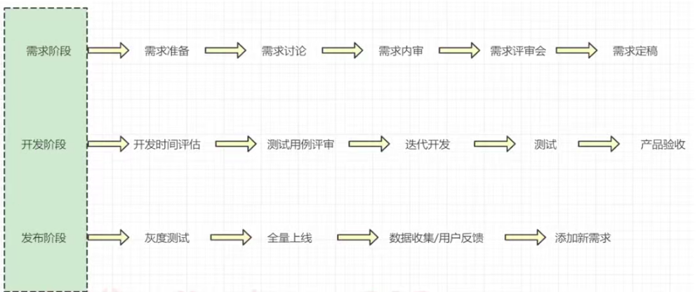
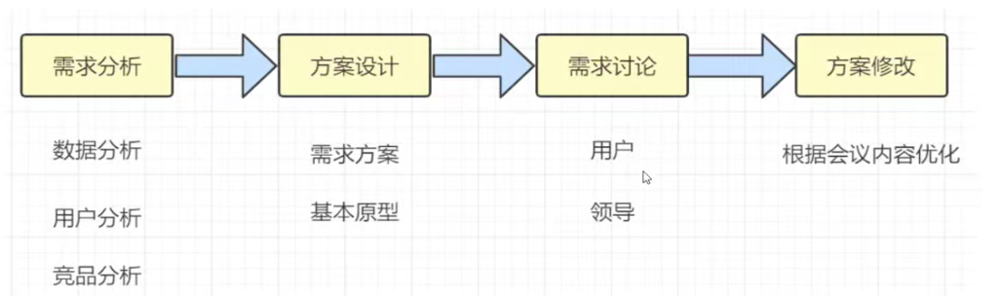
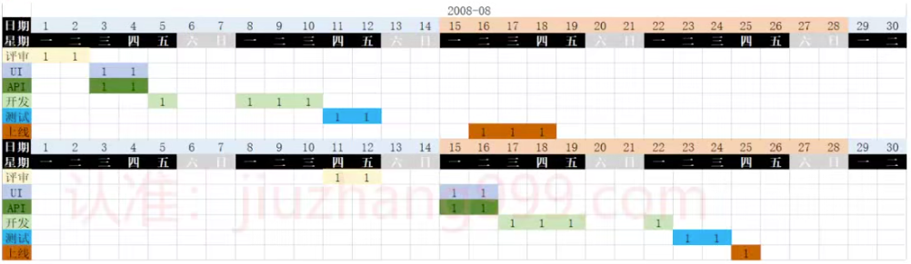
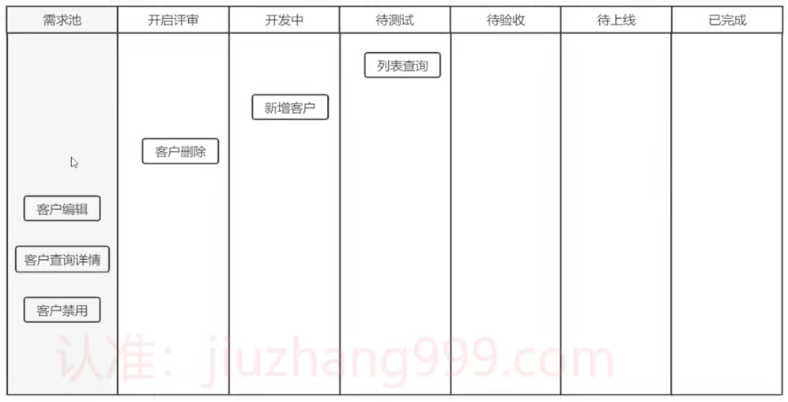
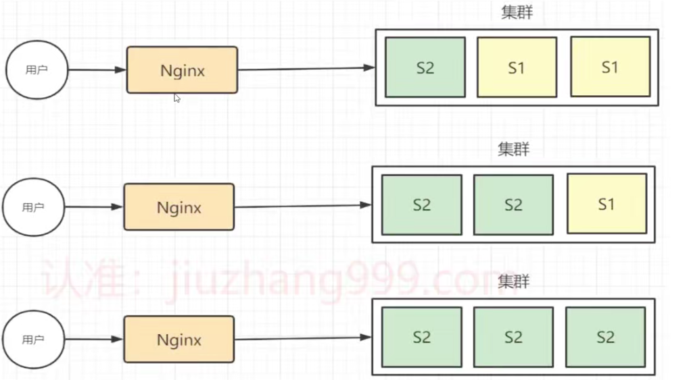
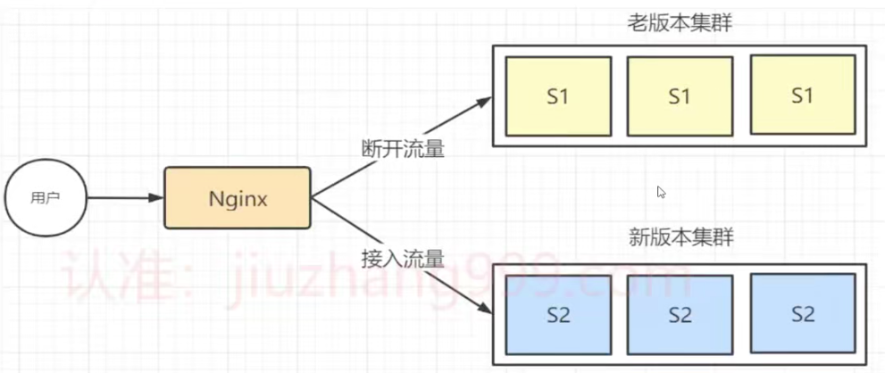

# 四、开发流程

# 四、开发流程
## 1、项目研发流程
对于一个项目的主流程，我们大致可以分为三个阶段：需求阶段、开发阶段、发布阶段。每个阶段人员安排和工作内容不同，如下图：

需求阶段：大多由产品跟进

开发阶段：产品辅助，前端，后端开发为主，测试后期支持

发布阶段：测试负责上线，产品负责后续跟进，包括后续项目优化

**需求准备阶段**：

需求准备的主要参与人员是产品，通过与需求方的讨论，定形我们需要做的事情。

**需求内审阶段**：

产品之间的会议。日常工作中，每个产品都负责独立的功能，每个迭代的开发人员是有限的?

那么，在需求很多的时候，我们要先做那些需求呢?

**测试用例评审**：

由测试同学编写，开发、产品共同参与评审

## 2、需求迭代排期
互联网项目多以敏捷开发为主。敏捷开发的核心理念是以简单有效的方式快速达成目标，并在这个过程中及时响应外界的变化并作出调整。

那么，一个需求从创建到结束，应该如何安排每个参与者的时间点呢?如下图，展示了一个迭代的人员时间点安排。

## 3、功能迭代管理
当我们的需求评审结束后，程序员的任务就是根据需求进行拆分。拆分的目的是合理的规划我们时间，每个小的功能任务以天为单位，清楚的知道我们每天要做些什么。

拆分的好处，不仅利用我们开发，能利于领导查看每个人的工作完成情况，省去了互相沟通的时间成本。

再有，项目管理部，可以根据我们每个人进度评审每个部门的需求完成情况，时间成本等等多个指标，有利于整个部门的管理。

## 4、功能升级方式及时间
新的功能发布，我们要如何升级?如何让用户快速体验我们的新功能呢?

**项目升级方式**：

**滚动升级**：指每次只升级一个或多个服务，升级完成后加入生产环境，不断执行这个过程，直到集群中的全部旧版本升级新版本，每次升级最大数量不超过集群总数的一半。

特点：升级简单，对服务器资源消耗小，用户无感知。

部署过程：

+ 以固定数量的方式挨个升级服务器

整个过程如下图：

**蓝绿升级**：蓝绿是不停老版本，部署新版本然后进行测试，确认OK，将流量切到新版本。特点：蓝绿部署无需停机，并且风险较小，灵活掌握新服务器数量

部署过程：

+ 启动新版本服务器
+ 切换流量到新版本服务器
+ 观察服务器情况
+ 升级完毕，下线老服务器

整个过程如下图所示：

需要考虑增加底层技术实现

**用户升级方式**

**强制升级** ：项目存在重大问题或者重大版本升级。交互方式大多是提示框，只能选择升级。否则，退出应用程序

**提示升级**：已提示为主，可以选择每次提示，或者定时提示

**自动升级**：由客户决定什么时间升级，或者可以选择不升级。

**项目上线时间**：

发布周期：每周的周二 或者 周四

上线时间：晚上8点以后或者凌晨

## 5、上线汇报
上线汇报，是对我们整个迭代工作的总结，也是在领导面前体现我们工作量的机会上线邮件的内容：

**告知**：XX版本XX日期发布了;

**展示**：主要功能的介绍，能给用户带来那些方便，给团队带来什么好处

**感谢**：领导、开发、产品、测试等等。此处要注意，尽量实名写，不要用简单的领导啊，同事来代替。任何一个人工作中都希望受到表扬，在表扬的邮件中出现自己的名字，容易让人更好的工作

## 6、功能数据汇报
数据汇报，是对我们前面上线功能最好的证明。如果每有此步骤，那么将无法体现我们前段时间工作的价值.

**汇报时间**：上线一周或者2周

**汇报方式**：邮件通知，特别是领导

**数据展示**：曲线图或者柱状图最好，其次是列表，最次是文字表达

**汇报内容**：

基本数据变化，影响范围。

核心功能情况

用户反馈

后续规划

**为什么要汇报?**

+ 领导需要知道事情得结果
+ 团队需要鼓励及反馈
+ 项目要有始有终
+ 刷存在感，体现团队的价值

> 更新: 2024-09-09 01:54:29  
原文: [https://www.yuque.com/vip6688/neho4x/cv8gxziu94p5x3xn](https://www.yuque.com/vip6688/neho4x/cv8gxziu94p5x3xn)
>

> 更新: 2024-11-25 09:26:07  
> 原文: <https://www.yuque.com/neumx/laxg2e/2566febf1661fb3dd2961543ba565407>